# Ball Tracking Robot
The Ball Tracking Robot is a fully autonomous robot that detects and chases a red ball using computer vision and ultrasonic sensors. Built with a Raspberry Pi, Pi Camera, Ultrasonic sensors, and differential drive motors, the robot locates the ball from a distance, turns toward it, drives forward while dynamically adjusting speed, and avoids obstacles using three ultrasonic sensors.  

The biggest challenge was getting the robot to reliably approach the ball instead of just detecting it from afar, this required deep debugging of vision thresholds, sensor interference, and control logic. Working on this project gave me much experience in real-time computer vision, sensor fusion, and iterative robotics development.


| **Engineer** | **School** | **Area of Interest** | **Grade** |
|:--:|:--:|:--:|:--:|
| Aaron Z | BASIS Independent Silicon Valley | Electrical Engineering | Incoming Sophomore

**Replace the BlueStamp logo below with an image of yourself and your completed project. Follow the guide [here](https://tomcam.github.io/least-github-pages/adding-images-github-pages-site.html) if you need help.**


  
# Final Milestone

**Don't forget to replace the text below with the embedding for your milestone video. Go to Youtube, click Share -> Embed, and copy and paste the code to replace what's below.**

<iframe width="560" height="315" src="https://www.youtube.com/embed/F7M7imOVGug" title="YouTube video player" frameborder="0" allow="accelerometer; autoplay; clipboard-write; encrypted-media; gyroscope; picture-in-picture; web-share" allowfullscreen></iframe>

For your final milestone, explain the outcome of your project. Key details to include are:
- What you've accomplished since your previous milestone
- What your biggest challenges and triumphs were at BSE
- A summary of key topics you learned about
- What you hope to learn in the future after everything you've learned at BSE

```stl
solid Ball Tracking Robot Body
  facet normal -0.9989930987358093 0.0448647178709507 0
    outer loop
      vertex -115.08062744140625 -0.615617573261261 91.69876861572266
      vertex -114.61151123046875 9.830140113830566 98.69876861572266
      vertex -114.61151123046875 9.830140113830566 91.69876861572266
    endloop
  endfacet
  facet normal -0.9909496903419495 0.13423360884189606 0
    outer loop
      vertex -114.61151123046875 9.830140113830566 98.69876861572266
      vertex -113.20792388916016 20.19179344177246 98.69876861572266
      vertex -114.61151123046875 9.830140113830566 91.69876861572266
    endloop
  endfacet
  facet normal -0.9909496903419495 0.13423360884189606 0
    outer loop
      vertex -114.61151123046875 9.830140113830566 91.69876861572266
      vertex -113.20792388916016 20.19179344177246 98.69876861572266
      vertex -113.20792388916016 20.19179344177246 91.69876861572266
    endloop
  endfacet
  facet normal -0.9749279618263245 0.2225208431482315 0
    outer loop
      vertex -113.20792388916016 20.19179344177246 98.69876861572266
      vertex -110.88117980957031 30.38591957092285 98.69876861572266
      vertex -113.20792388916016 20.19179344177246 91.69876861572266
    endloop
  endfacet
  facet normal -0.9749279618263245 0.2225208431482315 0
    outer loop
      vertex -113.20792388916016 20.19179344177246 91.69876861572266
      vertex -110.88117980957031 30.38591957092285 98.69876861572266
      vertex -110.88117980957031 30.38591957092285 91.69876861572266
    endloop
  endfacet
  facet normal -0.9510565996170044 0.30901673436164856 0
    outer loop
      vertex -110.88117980957031 30.38591957092285 98.69876861572266
      vertex -107.65000915527344 40.330440521240234 98.69876861572266
      vertex -110.88117980957031 30.38591957092285 91.69876861572266
    endloop
  endfacet
  facet normal -0.9510565996170044 0.30901673436164856 0
    outer loop
      vertex -110.88117980957031 30.38591957092285 91.69876861572266
      vertex -107.65000915527344 40.330440521240234 98.69876861572266
      vertex -107.65000915527344 40.330440521240234 91.69876861572266
    endloop
  endfacet
  facet normal -0.9195277094841003 0.3930252194404602 0
    outer loop
      vertex -107.65000915527344 40.330440521240234 98.69876861572266
      vertex -103.5404281616211 49.94528579711914 98.69876861572266
      vertex -107.65000915527344 40.330440521240234 91.69876861572266
    endloop
  endfacet
  facet normal -0.9195277094841003 0.3930252194404602 0
    outer loop
      vertex -107.65000915527344 40.330440521240234 91.69876861572266
      vertex -103.5404281616211 49.94528579711914 98.69876861572266
      vertex -103.5404281616211 49.94528579711914 91.69876861572266
    endloop
  endfacet
  facet normal -0.8805956244468689 0.4738685190677643 0
    outer loop
      vertex -103.5404281616211 49.94528579711914 98.69876861572266
      vertex -98.58552551269531 59.153045654296875 98.69876861572266
      vertex -103.5404281616211 49.94528579711914 91.69876861572266
    endloop
  endfacet
  facet normal -0.8805956244468689 0.4738685190677643 0
    outer loop
      vertex -103.5404281616211 49.94528579711914 91.69876861572266
      vertex -98.58552551269531 59.153045654296875 98.69876861572266
      vertex -98.58552551269531 59.153045654296875 91.69876861572266
    endloop
  endfacet
  facet normal -0.8345733284950256 0.5508968234062195 0
    outer loop
      vertex -98.58552551269531 59.153045654296875 98.69876861572266
      vertex -92.82518768310547 67.87958526611328 98.69876861572266
      vertex -98.58552551269531 59.153045654296875 91.69876861572266
    endloop
  endfacet
  facet normal -0.8345733284950256 0.5508968234062195 0
    outer loop
      vertex -98.58552551269531 59.153045654296875 91.69876861572266
      vertex -92.82518768310547 67.87958526611328 98.69876861572266
      vertex -92.82518768310547 67.87958526611328 91.69876861572266
    endloop
  endfacet
  facet normal -0.7818312644958496 0.6234900951385498 0
    outer loop
      vertex -92.82518768310547 67.87958526611328 98.69876861572266
      vertex -86.30580139160156 76.05463409423828 98.69876861572266
      vertex -92.82518768310547 67.87958526611328 91.69876861572266
    endloop
  endfacet
  facet normal -0.7818312644958496 0.6234900951385498 0
    outer loop
      vertex -92.82518768310547 67.87958526611328 91.69876861572266
      vertex -86.30580139160156 76.05463409423828 98.69876861572266
      vertex -86.30580139160156 76.05463409423828 91.69876861572266
    endloop
  endfacet
  facet normal -0.7227950096130371 0.6910625100135803 0
    outer loop
      vertex -86.30580139160156 76.05463409423828 98.69876861572266
      vertex -79.07984924316406 83.61238098144531 98.69876861572266
      vertex -86.30580139160156 76.05463409423828 91.69876861572266
    endloop
  endfacet
  facet normal -0.7227950096130371 0.6910625100135803 0
    outer loop
      vertex -86.30580139160156 76.05463409423828 91.69876861572266
      vertex -79.07984924316406 83.61238098144531 98.69876861572266
      vertex -79.07984924316406 83.61238098144531 91.69876861572266
    endloop
  endfacet
  facet normal -0.6579387784004211 0.7530714273452759 0
    outer loop
      vertex -79.07984924316406 83.61238098144531 98.69876861572266
      vertex -71.20552062988281 90.49198150634766 98.69876861572266
      vertex -79.07984924316406 83.61238098144531 91.69876861572266
    endloop
  endfacet
  facet normal -0.6579387784004211 0.7530714273452759 0
    outer loop
      vertex -79.07984924316406 83.61238098144531 91.69876861572266
      vertex -71.20552062988281 90.49198150634766 98.69876861572266
      vertex -71.20552062988281 90.49198150634766 91.69876861572266
    endloop
  endfacet
  facet normal -0.5877851843833923 0.8090170621871948 0
    outer loop
      vertex -71.20552062988281 90.49198150634766 98.69876861572266
      vertex -62.7462043762207 96.63803100585938 98.69876861572266
      vertex -71.20552062988281 90.49198150634766 91.69876861572266
    endloop
  endfacet
  facet normal -0.5877851843833923 0.8090170621871948 0
    outer loop
      vertex -71.20552062988281 90.49198150634766 91.69876861572266
      vertex -62.7462043762207 96.63803100585938 98.69876861572266
      vertex -62.7462043762207 96.63803100585938 91.69876861572266
    endloop
  endfacet
  facet normal -0.5128994584083557 0.8584486842155457 0
    outer loop
      vertex -62.7462043762207 96.63803100585938 98.69876861572266
      vertex -53.77001953125 102.00106048583984 98.69876861572266
      vertex -62.7462043762207 96.63803100585938 91.69876861572266
    endloop
  endfacet
  facet normal -0.5128994584083557 0.8584486842155457 0
    outer loop
      vertex -62.7462043762207 96.63803100585938 91.69876861572266
      vertex -53.77001953125 102.00106048583984 98.69876861572266
      vertex -53.77001953125 102.00106048583984 91.69876861572266
    endloop
  endfacet
  facet normal -0.4338834285736084 0.9009690284729004 0
    outer loop
      vertex -53.77001953125 102.00106048583984 98.69876861572266
      vertex -44.3492317199707 106.5378646850586 98.69876861572266
      vertex -53.77001953125 102.00106048583984 91.69876861572266
    endloop
  endfacet
  facet normal -0.4338834285736084 0.9009690284729004 0
    outer loop
      vertex -53.77001953125 102.00106048583984 91.69876861572266
      vertex -44.3492317199707 106.5378646850586 98.69876861572266
      vertex -44.3492317199707 106.5378646850586 91.69876861572266
    endloop
  endfacet
  facet normal -0.35137471556663513 0.9362348914146423 0
    outer loop
      vertex -44.3492317199707 106.5378646850586 98.69876861572266
      vertex -34.5596923828125 110.2119369506836 98.69876861572266
      vertex -44.3492317199707 106.5378646850586 91.69876861572266
    endloop
  endfacet
  facet normal -0.35137471556663513 0.9362348914146423 0
    outer loop
      vertex -44.3492317199707 106.5378646850586 91.69876861572266
      vertex -34.5596923828125 110.2119369506836 98.69876861572266
      vertex -34.5596923828125 110.2119369506836 91.69876861572266
    endloop
  endfacet
  facet normal -0.2660374045372009 0.963962733745575 0
    outer loop
      vertex -34.5596923828125 110.2119369506836 98.69876861572266
      vertex -24.4802188873291 112.99370574951172 98.69876861572266
      vertex -34.5596923828125 110.2119369506836 91.69876861572266
    endloop
  endfacet
  facet normal -0.2660374045372009 0.963962733745575 0
    outer loop
      vertex -34.5596923828125 110.2119369506836 91.69876861572266
      vertex -24.4802188873291 112.99370574951172 98.69876861572266
      vertex -24.4802188873291 112.99370574951172 91.69876861572266
    endloop
  endfacet
  facet normal -0.17855679988861084 0.9839296340942383 0
    outer loop
      vertex -24.4802188873291 112.99370574951172 98.69876861572266
      vertex -14.191969871520996 114.86074829101562 98.69876861572266
      vertex -24.4802188873291 112.99370574951172 91.69876861572266
    endloop
  endfacet
  facet normal -0.17855679988861084 0.9839296340942383 0
    outer loop
      vertex -24.4802188873291 112.99370574951172 91.69876861572266
      vertex -14.191969871520996 114.86074829101562 98.69876861572266
      vertex -14.191969871520996 114.86074829101562 91.69876861572266
    endloop
  endfacet
  facet normal -0.08963894844055176 0.9959743022918701 0
    outer loop
      vertex -14.191969871520996 114.86074829101562 98.69876861572266
      vertex -3.7777769565582275 115.79803466796875 98.69876861572266
      vertex -14.191969871520996 114.86074829101562 91.69876861572266
    endloop
  endfacet
  facet normal -0.08963894844055176 0.9959743022918701 0
    outer loop
      vertex -14.191969871520996 114.86074829101562 91.69876861572266
      vertex -3.7777769565582275 115.79803466796875 98.69876861572266
      vertex -3.7777769565582275 115.79803466796875 91.69876861572266
    endloop
  endfacet
  facet normal 0 1 0
    outer loop
      vertex -3.7777769565582275 115.79803466796875 98.69876861572266
      vertex 6.67850923538208 115.79803466796875 98.69876861572266
      vertex -3.7777769565582275 115.79803466796875 91.69876861572266
    endloop
  endfacet
  facet normal 0 1 0
    outer loop
      vertex -3.7777769565582275 115.79803466796875 91.69876861572266
      vertex 6.67850923538208 115.79803466796875 98.69876861572266
      vertex 6.67850923538208 115.79803466796875 91.69876861572266
    endloop
  endfacet
  facet normal 0.08963894844055176 0.9959743022918701 0
    outer loop
      vertex 6.67850923538208 115.79803466796875 98.69876861572266
      vertex 17.092700958251953 114.86074829101562 98.69876861572266
      vertex 6.67850923538208 115.79803466796875 91.69876861572266
    endloop
  endfacet
  facet normal 0.08963894844055176 0.9959743022918701 0
    outer loop
      vertex 6.67850923538208 115.79803466796875 91.69876861572266
      vertex 17.092700958251953 114.86074829101562 98.69876861572266
      vertex 17.092700958251953 114.86074829101562 91.69876861572266
    endloop
  endfacet
  facet normal 0.17855679988861084 0.9839296340942383 0
    outer loop
      vertex 17.092700958251953 114.86074829101562 98.69876861572266
      vertex 27.380950927734375 112.99370574951172 98.69876861572266
      vertex 17.092700958251953 114.86074829101562 91.69876861572266
    endloop
  endfacet
  facet normal 0.17855679988861084 0.9839296340942383 0
    outer loop
      vertex 17.092700958251953 114.86074829101562 91.69876861572266
      vertex 27.380950927734375 112.99370574951172 98.69876861572266
      vertex 27.380950927734375 112.99370574951172 91.69876861572266
    endloop
  endfacet
  facet normal 0.2660374045372009 0.963962733745575 0
    outer loop
      vertex 27.380950927734375 112.99370574951172 98.69876861572266
      vertex 37.46042251586914 110.2119369506836 98.69876861572266
      vertex 27.380950927734375 112.99370574951172 91.69876861572266
    endloop
  endfacet
  facet normal 0.2660374045372009 0.963962733745575 0
    outer loop
      vertex 27.380950927734375 112.99370574951172 91.69876861572266
      vertex 37.46042251586914 110.2119369506836 98.69876861572266
      vertex 37.46042251586914 110.2119369506836 91.69876861572266
    endloop
  endfacet
  facet normal 0.35137471556663513 0.9362348914146423 0
    outer loop
      vertex 37.46042251586914 110.2119369506836 98.69876861572266
      vertex 47.24996566772461 106.5378646850586 98.69876861572266
      vertex 37.46042251586914 110.2119369506836 91.69876861572266
    endloop
  endfacet
  facet normal 0.35137471556663513 0.9362348914146423 0
    outer loop
      vertex 37.46042251586914 110.2119369506836 91.69876861572266
      vertex 47.24996566772461 106.5378646850586 98.69876861572266
      vertex 47.24996566772461 106.5378646850586 91.69876861572266
    endloop
  endfacet
  facet normal 0.4338834285736084 0.9009690284729004 0
    outer loop
      vertex 47.24996566772461 106.5378646850586 98.69876861572266
      vertex 56.67074966430664 102.00106048583984 98.69876861572266
      vertex 47.24996566772461 106.5378646850586 91.69876861572266
    endloop
  endfacet
  facet normal 0.4338834285736084 0.9009690284729004 0
    outer loop
      vertex 47.24996566772461 106.5378646850586 91.69876861572266
      vertex 56.67074966430664 102.00106048583984 98.69876861572266
      vertex 56.67074966430664 102.00106048583984 91.69876861572266
    endloop
  endfacet
  facet normal 0.5128994584083557 0.8584486842155457 0
    outer loop
      vertex 56.67074966430664 102.00106048583984 98.69876861572266
      vertex 65.64693450927734 96.63803100585938 98.69876861572266
      vertex 56.67074966430664 102.00106048583984 91.69876861572266
    endloop
  endfacet
  facet normal 0.5128994584083557 0.8584486842155457 0
    outer loop
      vertex 56.67074966430664 102.00106048583984 91.69876861572266
      vertex 65.64693450927734 96.63803100585938 98.69876861572266
      vertex 65.64693450927734 96.63803100585938 91.69876861572266
    endloop
  endfacet
  facet normal 0.5877851843833923 0.8090170621871948 0
    outer loop
      vertex 65.64693450927734 96.63803100585938 98.69876861572266
      vertex 74.10625457763672 90.49198150634766 98.69876861572266
      vertex 65.64693450927734 96.63803100585938 91.69876861572266
    endloop
  endfacet
  facet normal 0.5877851843833923 0.8090170621871948 0
    outer loop
      vertex 65.64693450927734 96.63803100585938 91.69876861572266
      vertex 74.10625457763672 90.49198150634766 98.69876861572266
      vertex 74.10625457763672 90.49198150634766 91.69876861572266
    endloop
  endfacet
  facet normal 0.6579387784004211 0.7530714273452759 0
    outer loop
      vertex 74.10625457763672 90.49198150634766 98.69876861572266
      vertex 81.98058319091797 83.61238098144531 98.69876861572266
      vertex 74.10625457763672 90.49198150634766 91.69876861572266
    endloop
  endfacet
  facet normal 0.6579387784004211 0.7530714273452759 0
    outer loop
      vertex 74.10625457763672 90.49198150634766 91.69876861572266
      vertex 81.98058319091797 83.61238098144531 98.69876861572266
      vertex 81.98058319091797 83.61238098144531 91.69876861572266
    endloop
  endfacet
  facet normal 0.7227950096130371 0.6910625100135803 0
    outer loop
      vertex 81.98058319091797 83.61238098144531 98.69876861572266
      vertex 89.20652770996094 76.05463409423828 98.69876861572266
      vertex 81.98058319091797 83.61238098144531 91.69876861572266
    endloop
  endfacet
  facet normal 0.7227950096130371 0.6910625100135803 0
    outer loop
      vertex 81.98058319091797 83.61238098144531 91.69876861572266
      vertex 89.20652770996094 76.05463409423828 98.69876861572266
      vertex 89.20652770996094 76.05463409423828 91.69876861572266
    endloop
  endfacet
  facet normal 0.7818312644958496 0.6234900951385498 0
    outer loop
      vertex 89.20652770996094 76.05463409423828 98.69876861572266
      vertex 95.72592163085938 67.87958526611328 98.69876861572266
      vertex 89.20652770996094 76.05463409423828 91.69876861572266
    endloop
  endfacet
  facet normal 0.7818312644958496 0.6234900951385498 0
    outer loop
      vertex 89.20652770996094 76.05463409423828 91.69876861572266
      vertex 95.72592163085938 67.87958526611328 98.69876861572266
      vertex 95.72592163085938 67.87958526611328 91.69876861572266
    endloop
  endfacet
  facet normal 0.8345733284950256 0.5508968234062195 0
    outer loop
      vertex 95.72592163085938 67.87958526611328 98.69876861572266
      vertex 101.48625946044922 59.153045654296875 98.69876861572266
      vertex 95.72592163085938 67.87958526611328 91.69876861572266
    endloop
  endfacet
  facet normal 0.8345733284950256 0.5508968234062195 0
    outer loop
      vertex 95.72592163085938 67.87958526611328 91.69876861572266
      vertex 101.48625946044922 59.153045654296875 98.69876861572266
      vertex 101.48625946044922 59.153045654296875 91.69876861572266
    endloop
  endfacet
  facet normal 0.8805956244468689 0.4738685190677643 0
    outer loop
      vertex 101.48625946044922 59.153045654296875 98.69876861572266
      vertex 106.441162109375 49.94528579711914 98.69876861572266
      vertex 101.48625946044922 59.153045654296875 91.69876861572266
    endloop
  endfacet
  facet normal 0.8805956244468689 0.4738685190677643 0
    outer loop
      vertex 101.48625946044922 59.153045654296875 91.69876861572266
      vertex 106.441162109375 49.94528579711914 98.69876861572266
      vertex 106.441162109375 49.94528579711914 91.69876861572266
    endloop
  endfacet
  facet normal 0.9195277094841003 0.3930252194404602 0
    outer loop
      vertex 106.441162109375 49.94528579711914 98.69876861572266
      vertex 110.55074310302734 40.330440521240234 98.69876861572266
      vertex 106.441162109375 49.94528579711914 91.69876861572266
    endloop
  endfacet
  facet normal 0.9195277094841003 0.3930252194404602 0
    outer loop
      vertex 106.441162109375 49.94528579711914 91.69876861572266
      vertex 110.55074310302734 40.330440521240234 98.69876861572266
      vertex 110.55074310302734 40.330440521240234 91.69876861572266
    endloop
  endfacet
  facet normal 0.9510565996170044 0.30901673436164856 0
    outer loop
      vertex 110.55074310302734 40.330440521240234 98.69876861572266
      vertex 113.78191375732422 30.38591957092285 98.69876861572266
      vertex 110.55074310302734 40.330440521240234 91.69876861572266
    endloop
  endfacet
  facet normal 0.9510565996170044 0.30901673436164856 0
    outer loop
      vertex 110.55074310302734 40.330440521240234 91.69876861572266
      vertex 113.78191375732422 30.38591957092285 98.69876861572266
      vertex 113.78191375732422 30.38591957092285 91.69876861572266
    endloop
  endfacet
  facet normal 0.9749279618263245 0.2225208431482315 0
    outer loop
      vertex 113.78191375732422 30.38591957092285 98.69876861572266
      vertex 116.10865783691406 20.19179344177246 98.69876861572266
      vertex 113.78191375732422 30.38591957092285 91.69876861572266
    endloop
  endfacet
  facet normal 0.9749279618263245 0.2225208431482315 0
    outer loop
      vertex 113.78191375732422 30.38591957092285 91.69876861572266
      vertex 116.10865783691406 20.19179344177246 98.69876861572266
      vertex 116.10865783691406 20.19179344177246 91.69876861572266
    endloop
  endfacet
  facet normal 0.9909496903419495 0.13423360884189606 0
    outer loop
      vertex 116.10865783691406 20.19179344177246 98.69876861572266
      vertex 117.51223754882812 9.830140113830566 98.69876861572266
      vertex 116.10865783691406 20.19179344177246 91.69876861572266
    endloop
  endfacet
  facet normal 0.9909496903419495 0.13423360884189606 0
    outer loop
      vertex 116.10865783691406 20.19179344177246 91.69876861572266
      vertex 117.51223754882812 9.830140113830566 98.69876861572266
      vertex 117.51223754882812 9.830140113830566 91.69876861572266
    endloop
  endfacet
  facet normal 0.9989930987358093 0.0448647178709507 0
    outer loop
      vertex 117.51223754882812 9.830140113830566 98.69876861572266
      vertex 117.98136138916016 -0.615617573261261 98.69876861572266
      vertex 117.51223754882812 9.830140113830566 91.69876861572266
    endloop
  endfacet
  facet normal 0.9989930987358093 0.0448647178709507 -1.851589802849565e-16
    outer loop
      vertex 117.51223754882812 9.830140113830566 91.69876861572266
      vertex 117.98136138916016 -0.615617573261261 98.69876861572266
      vertex 117.98136138916016 -0.615617573261261 91.69876861572266
    endloop
  endfacet
  facet normal 0.9989930987358093 -0.0448647178709507 1.8345144127263063e-16
    outer loop
      vertex 117.98136138916016 -0.615617573261261 98.69876861572266
      vertex 117.51223754882812 -11.061375617980957 98.69876861572266
      vertex 117.98136138916016 -0.615617573261261 91.69876861572266
    endloop
  endfacet
  facet normal 0.9989930987358093 -0.0448647178709507 0
    outer loop
      vertex 117.98136138916016 -0.615617573261261 91.69876861572266
      vertex 117.51223754882812 -11.061375617980957 98.69876861572266
      vertex 117.51223754882812 -11.061375617980957 91.69876861572266
    endloop
  endfacet
  facet normal 0.9909496903419495 -0.13423360884189606 0
    outer loop
      vertex 117.51223754882812 -11.061375617980957 98.69876861572266
      vertex 116.10865783691406 -21.42302894592285 98.69876861572266
      vertex 117.51223754882812 -11.061375617980957 91.69876861572266
    endloop
  endfacet
  facet normal 0.9909496903419495 -0.13423360884189606 0
    outer loop
      vertex 117.51223754882812 -11.061375617980957 91.69876861572266
      vertex 116.10865783691406 -21.42302894592285 98.69876861572266
      vertex 116.10865783691406 -21.42302894592285 91.69876861572266
    endloop
  endfacet
  facet normal 0.9749279618263245 -0.2225208431482315 0
    outer loop
      vertex 116.10865783691406 -21.42302894592285 98.69876861572266
      vertex 113.78191375732422 -31.617155075073242 98.69876861572266
      vertex 116.10865783691406 -21.42302894592285 91.69876861572266
    endloop
  endfacet
  facet normal 0.9749279618263245 -0.2225208431482315 0
    outer loop
      vertex 116.10865783691406 -21.42302894592285 91.69876861572266
      vertex 113.78191375732422 -31.617155075073242 98.69876861572266
      vertex 113.78191375732422 -31.617155075073242 91.69876861572266
    endloop
  endfacet
  facet normal 0.9510565996170044 -0.30901673436164856 0
    outer loop
      vertex 113.78191375732422 -31.617155075073242 98.69876861572266
      vertex 110.55074310302734 -41.561676025390625 98.69876861572266
      vertex 113.78191375732422 -31.617155075073242 91.69876861572266
    endloop
  endfacet
  facet normal 0.9510565996170044 -0.30901673436164856 0
    outer loop
      vertex 113.78191375732422 -31.617155075073242 91.69876861572266
      vertex 110.55074310302734 -41.561676025390625 98.69876861572266
      vertex 110.55074310302734 -41.561676025390625 91.69876861572266
    endloop
  endfacet
  facet normal 0.9195277094841003 -0.3930252194404602 0
    outer loop
      vertex 110.55074310302734 -41.561676025390625 98.69876861572266
      vertex 106.441162109375 -51.17652130126953 98.69876861572266
      vertex 110.55074310302734 -41.561676025390625 91.69876861572266
    endloop
  endfacet
  facet normal 0.9195277094841003 -0.3930252194404602 0
    outer loop
      vertex 110.55074310302734 -41.561676025390625 91.69876861572266
      vertex 106.441162109375 -51.17652130126953 98.69876861572266
      vertex 106.441162109375 -51.17652130126953 91.69876861572266
    endloop
  endfacet
  facet normal 0.8805956244468689 -0.4738685190677643 0
    outer loop
      vertex 106.441162109375 -51.17652130126953 98.69876861572266
      vertex 101.48625946044922 -60.384281158447266 98.69876861572266
      vertex 106.441162109375 -51.17652130126953 91.69876861572266
    endloop
  endfacet
  facet normal 0.8805956244468689 -0.4738685190677643 0
    outer loop
      vertex 106.441162109375 -51.17652130126953 91.69876861572266
      vertex 101.48625946044922 -60.384281158447266 98.69876861572266
      vertex 101.48625946044922 -60.384281158447266 91.69876861572266
    endloop
  endfacet
  facet normal 0.8345733284950256 -0.5508968234062195 0
    outer loop
      vertex 101.48625946044922 -60.384281158447266 98.69876861572266
      vertex 95.72592163085938 -69.1108169555664 98.69876861572266
      vertex 101.48625946044922 -60.384281158447266 91.69876861572266
    endloop
  endfacet
  facet normal 0.8345733284950256 -0.5508968234062195 0
    outer loop
      vertex 101.48625946044922 -60.384281158447266 91.69876861572266
      vertex 95.72592163085938 -69.1108169555664 98.69876861572266
      vertex 95.72592163085938 -69.1108169555664 91.69876861572266
    endloop
  endfacet
  facet normal 0.7818312644958496 -0.6234900951385498 0
    outer loop
      vertex 95.72592163085938 -69.1108169555664 98.69876861572266
      vertex 89.20652770996094 -77.2858657836914 98.69876861572266
      vertex 95.72592163085938 -69.1108169555664 91.69876861572266
    endloop
  endfacet
  facet normal 0.7818312644958496 -0.6234900951385498 0
    outer loop
      vertex 95.72592163085938 -69.1108169555664 91.69876861572266
      vertex 89.20652770996094 -77.2858657836914 98.69876861572266
      vertex 89.20652770996094 -77.2858657836914 91.69876861572266
    endloop
  endfacet
  facet normal 0.7227950096130371 -0.6910625100135803 0
    outer loop
      vertex 89.20652770996094 -77.2858657836914 98.69876861572266
      vertex 81.98058319091797 -84.84362030029297 98.69876861572266
      vertex 89.20652770996094 -77.2858657836914 91.69876861572266
    endloop
  endfacet
  facet normal 0.7227950096130371 -0.6910625100135803 0
    outer loop
      vertex 89.20652770996094 -77.2858657836914 91.69876861572266
      vertex 81.98058319091797 -84.84362030029297 98.69876861572266
      vertex 81.98058319091797 -84.84362030029297 91.69876861572266
    endloop
  endfacet
  facet normal 0.6579387784004211 -0.7530714273452759 0
    outer loop
      vertex 81.98058319091797 -84.84362030029297 98.69876861572266
      vertex 74.10625457763672 -91.72321319580078 98.69876861572266
      vertex 81.98058319091797 -84.84362030029297 91.69876861572266
    endloop
  endfacet
  facet normal 0.6579387784004211 -0.7530714273452759 0
    outer loop
      vertex 81.98058319091797 -84.84362030029297 91.69876861572266
      vertex 74.10625457763672 -91.72321319580078 98.69876861572266
      vertex 74.10625457763672 -91.72321319580078 91.69876861572266
    endloop
  endfacet
  facet normal 0.5877851843833923 -0.8090170621871948 0
    outer loop
      vertex 74.10625457763672 -91.72321319580078 98.69876861572266
      vertex 65.64693450927734 -97.86927032470703 98.69876861572266
      vertex 74.10625457763672 -91.72321319580078 91.69876861572266
    endloop
  endfacet
  facet normal 0.5877851843833923 -0.8090170621871948 0
    outer loop
      vertex 74.10625457763672 -91.72321319580078 91.69876861572266
      vertex 65.64693450927734 -97.86927032470703 98.69876861572266
      vertex 65.64693450927734 -97.86927032470703 91.69876861572266
    endloop
  endfacet
  facet normal 0.5128994584083557 -0.8584486842155457 0
    outer loop
      vertex 65.64693450927734 -97.86927032470703 98.69876861572266
      vertex 56.67074966430664 -103.23229217529297 98.69876861572266
      vertex 65.64693450927734 -97.86927032470703 91.69876861572266
    endloop
  endfacet
  facet normal 0.5128994584083557 -0.8584486842155457 0
    outer loop
      vertex 65.64693450927734 -97.86927032470703 91.69876861572266
      vertex 56.67074966430664 -103.23229217529297 98.69876861572266
      vertex 56.67074966430664 -103.23229217529297 91.69876861572266
    endloop
  endfacet
  facet normal 0.4338834285736084 -0.9009690284729004 0
    outer loop
      vertex 56.67074966430664 -103.23229217529297 98.69876861572266
      vertex 47.24996566772461 -107.76910400390625 98.69876861572266
      vertex 56.67074966430664 -103.23229217529297 91.69876861572266
    endloop
  endfacet
  facet normal 0.4338834285736084 -0.9009690284729004 0
    outer loop
      vertex 56.67074966430664 -103.23229217529297 91.69876861572266
      vertex 47.24996566772461 -107.76910400390625 98.69876861572266
      vertex 47.24996566772461 -107.76910400390625 91.69876861572266
    endloop
  endfacet
  facet normal 0.35137471556663513 -0.9362348914146423 0
    outer loop
      vertex 47.24996566772461 -107.76910400390625 98.69876861572266
      vertex 37.46042251586914 -111.44317626953125 98.69876861572266
      vertex 47.24996566772461 -107.76910400390625 91.69876861572266
    endloop
  endfacet
  facet normal 0.35137471556663513 -0.9362348914146423 0
    outer loop
      vertex 47.24996566772461 -107.76910400390625 91.69876861572266
      vertex 37.46042251586914 -111.44317626953125 98.69876861572266
      vertex 37.46042251586914 -111.44317626953125 91.69876861572266
    endloop
  endfacet
  facet normal 0.2660374045372009 -0.963962733745575 0
    outer loop
      vertex 37.46042251586914 -111.44317626953125 98.69876861572266
      vertex 27.380950927734375 -114.22493743896484 98.69876861572266
      vertex 37.46042251586914 -111.44317626953125 91.69876861572266
    endloop
  endfacet
  facet normal 0.2660374045372009 -0.963962733745575 0
    outer loop
      vertex 37.46042251586914 -111.44317626953125 91.69876861572266
      vertex 27.380950927734375 -114.22493743896484 98.69876861572266
      vertex 27.380950927734375 -114.22493743896484 91.69876861572266
    endloop
  endfacet
  facet normal 0.17855679988861084 -0.9839296340942383 0
    outer loop
      vertex 27.380950927734375 -114.22493743896484 98.69876861572266
      vertex 17.092700958251953 -116.09197998046875 98.69876861572266
      vertex 27.380950927734375 -114.22493743896484 91.69876861572266
    endloop
  endfacet
  facet normal 0.17855679988861084 -0.9839296340942383 0
    outer loop
      vertex 27.380950927734375 -114.22493743896484 91.69876861572266
      vertex 17.092700958251953 -116.09197998046875 98.69876861572266
      vertex 17.092700958251953 -116.09197998046875 91.69876861572266
    endloop
  endfacet
  facet normal 0.08963894844055176 -0.9959743022918701 0
    outer loop
      vertex 17.092700958251953 -116.09197998046875 98.69876861572266
      vertex 6.67850923538208 -117.0292739868164 98.69876861572266
      vertex 17.092700958251953 -116.09197998046875 91.69876861572266
    endloop
  endfacet
  facet normal 0.08963894844055176 -0.9959743022918701 0
    outer loop
      vertex 17.092700958251953 -116.09197998046875 91.69876861572266
      vertex 6.67850923538208 -117.0292739868164 98.69876861572266
      vertex 6.67850923538208 -117.0292739868164 91.69876861572266
    endloop
  endfacet
  facet normal 0 -1 0
    outer loop
      vertex 6.67850923538208 -117.0292739868164 98.69876861572266
      vertex -3.7777769565582275 -117.0292739868164 98.69876861572266
      vertex 6.67850923538208 -117.0292739868164 91.69876861572266
    endloop
  endfacet
  facet normal 0 -1 0
    outer loop
      vertex 6.67850923538208 -117.0292739868164 91.69876861572266
      vertex -3.7777769565582275 -117.0292739868164 98.69876861572266
      vertex -3.7777769565582275 -117.0292739868164 91.69876861572266
    endloop
  endfacet
  facet normal -0.08963894844055176 -0.9959743022918701 0
    outer loop
      vertex -3.7777769565582275 -117.0292739868164 98.69876861572266
      vertex -14.191969871520996 -116.09197998046875 98.69876861572266
      vertex -3.7777769565582275 -117.0292739868164 91.69876861572266
    endloop
  endfacet
  facet normal -0.08963894844055176 -0.9959743022918701 0
    outer loop
      vertex -3.7777769565582275 -117.0292739868164 91.69876861572266
      vertex -14.191969871520996 -116.09197998046875 98.69876861572266
      vertex -14.191969871520996 -116.09197998046875 91.69876861572266
    endloop
  endfacet
  facet normal -0.17855679988861084 -0.9839296340942383 0
    outer loop
      vertex -14.191969871520996 -116.09197998046875 98.69876861572266
      vertex -24.4802188873291 -114.22493743896484 98.69876861572266
      vertex -14.191969871520996 -116.09197998046875 91.69876861572266
    endloop
  endfacet
  facet normal -0.17855679988861084 -0.9839296340942383 0
    outer loop
      vertex -14.191969871520996 -116.09197998046875 91.69876861572266
      vertex -24.4802188873291 -114.22493743896484 98.69876861572266
      vertex -24.4802188873291 -114.22493743896484 91.69876861572266
    endloop
  endfacet
  facet normal -0.2660374045372009 -0.963962733745575 0
    outer loop
      vertex -24.4802188873291 -114.22493743896484 98.69876861572266
      vertex -34.5596923828125 -111.44317626953125 98.69876861572266
      vertex -24.4802188873291 -114.22493743896484 91.69876861572266
    endloop
  endfacet
  facet normal -0.2660374045372009 -0.963962733745575 0
    outer loop
      vertex -24.4802188873291 -114.22493743896484 91.69876861572266
      vertex -34.5596923828125 -111.44317626953125 98.69876861572266
      vertex -34.5596923828125 -111.44317626953125 91.69876861572266
    endloop
  endfacet
  facet normal -0.35137471556663513 -0.9362348914146423 0
    outer loop
      vertex -34.5596923828125 -111.44317626953125 98.69876861572266
      vertex -44.3492317199707 -107.76910400390625 98.69876861572266
      vertex -34.5596923828125 -111.44317626953125 91.69876861572266
    endloop
  endfacet
  facet normal -0.35137471556663513 -0.9362348914146423 0
    outer loop
      vertex -34.5596923828125 -111.44317626953125 91.69876861572266
      vertex -44.3492317199707 -107.76910400390625 98.69876861572266
      vertex -44.3492317199707 -107.76910400390625 91.69876861572266
    endloop
  endfacet
  facet normal -0.4338834285736084 -0.9009690284729004 0
    outer loop
      vertex -44.3492317199707 -107.76910400390625 98.69876861572266
      vertex -53.77001953125 -103.23229217529297 98.69876861572266
      vertex -44.3492317199707 -107.76910400390625 91.69876861572266
    endloop
  endfacet
  facet normal -0.4338834285736084 -0.9009690284729004 0
    outer loop
      vertex -44.3492317199707 -107.76910400390625 91.69876861572266
      vertex -53.77001953125 -103.23229217529297 98.69876861572266
      vertex -53.77001953125 -103.23229217529297 91.69876861572266
    endloop
  endfacet
  facet normal -0.5128994584083557 -0.8584486842155457 0
    outer loop
      vertex -53.77001953125 -103.23229217529297 98.69876861572266
      vertex -62.7462043762207 -97.86927032470703 98.69876861572266
      vertex -53.77001953125 -103.23229217529297 91.69876861572266
    endloop
  endfacet
  facet normal -0.5128994584083557 -0.8584486842155457 0
    outer loop
      vertex -53.77001953125 -103.23229217529297 91.69876861572266
      vertex -62.7462043762207 -97.86927032470703 98.69876861572266
      vertex -62.7462043762207 -97.86927032470703 91.69876861572266
    endloop
  endfacet
  facet normal -0.5877851843833923 -0.8090170621871948 0
    outer loop
      vertex -62.7462043762207 -97.86927032470703 98.69876861572266
      vertex -71.20552062988281 -91.72321319580078 98.69876861572266
      vertex -62.7462043762207 -97.86927032470703 91.69876861572266
    endloop
  endfacet
  facet normal -0.5877851843833923 -0.8090170621871948 0
    outer loop
      vertex -62.7462043762207 -97.86927032470703 91.69876861572266
      vertex -71.20552062988281 -91.72321319580078 98.69876861572266
      vertex -71.20552062988281 -91.72321319580078 91.69876861572266
    endloop
  endfacet
  facet normal -0.6579387784004211 -0.7530714273452759 0
    outer loop
      vertex -71.20552062988281 -91.72321319580078 98.69876861572266
      vertex -79.07984924316406 -84.84362030029297 98.69876861572266
      vertex -71.20552062988281 -91.72321319580078 91.69876861572266
    endloop
  endfacet
  facet normal -0.6579387784004211 -0.7530714273452759 0
    outer loop
      vertex -71.20552062988281 -91.72321319580078 91.69876861572266
      vertex -79.07984924316406 -84.84362030029297 98.69876861572266
      vertex -79.07984924316406 -84.84362030029297 91.69876861572266
    endloop
  endfacet
  facet normal -0.7227950096130371 -0.6910625100135803 0
    outer loop
      vertex -79.07984924316406 -84.84362030029297 98.69876861572266
      vertex -86.30580139160156 -77.2858657836914 98.69876861572266
      vertex -79.07984924316406 -84.84362030029297 91.69876861572266
    endloop
  endfacet
  facet normal -0.7227950096130371 -0.6910625100135803 0
    outer loop
      vertex -79.07984924316406 -84.84362030029297 91.69876861572266
      vertex -86.30580139160156 -77.2858657836914 98.69876861572266
      vertex -86.30580139160156 -77.2858657836914 91.69876861572266
    endloop
  endfacet
  facet normal -0.7818312644958496 -0.6234900951385498 0
    outer loop
      vertex -86.30580139160156 -77.2858657836914 98.69876861572266
      vertex -92.82518768310547 -69.1108169555664 98.69876861572266
      vertex -86.30580139160156 -77.2858657836914 91.69876861572266
    endloop
  endfacet
  facet normal -0.7818312644958496 -0.6234900951385498 0
    outer loop
      vertex -86.30580139160156 -77.2858657836914 91.69876861572266
      vertex -92.82518768310547 -69.1108169555664 98.69876861572266
      vertex -92.82518768310547 -69.1108169555664 91.69876861572266
    endloop
  endfacet
  facet normal -0.8345733284950256 -0.5508968234062195 0
    outer loop
      vertex -92.82518768310547 -69.1108169555664 98.69876861572266
      vertex -98.58552551269531 -60.384281158447266 98.69876861572266
      vertex -92.82518768310547 -69.1108169555664 91.69876861572266
    endloop
  endfacet
  facet normal -0.8345733284950256 -0.5508968234062195 0
    outer loop
      vertex -92.82518768310547 -69.1108169555664 91.69876861572266
      vertex -98.58552551269531 -60.384281158447266 98.69876861572266
      vertex -98.58552551269531 -60.384281158447266 91.69876861572266
    endloop
  endfacet
  facet normal -0.8805956244468689 -0.4738685190677643 0
    outer loop
      vertex -98.58552551269531 -60.384281158447266 98.69876861572266
      vertex -103.5404281616211 -51.17652130126953 98.69876861572266
      vertex -98.58552551269531 -60.384281158447266 91.69876861572266
    endloop
  endfacet
  facet normal -0.8805956244468689 -0.4738685190677643 0
    outer loop
      vertex -98.58552551269531 -60.384281158447266 91.69876861572266
      vertex -103.5404281616211 -51.17652130126953 98.69876861572266
      vertex -103.5404281616211 -51.17652130126953 91.69876861572266
    endloop
  endfacet
  facet normal -0.9195277094841003 -0.3930252194404602 0
    outer loop
      vertex -103.5404281616211 -51.17652130126953 98.69876861572266
      vertex -107.65000915527344 -41.561676025390625 98.69876861572266
      vertex -103.5404281616211 -51.17652130126953 91.69876861572266
    endloop
  endfacet
  facet normal -0.9195277094841003 -0.3930252194404602 0
    outer loop
      vertex -103.5404281616211 -51.17652130126953 91.69876861572266
      vertex -107.65000915527344 -41.561676025390625 98.69876861572266
      vertex -107.65000915527344 -41.561676025390625 91.69876861572266
    endloop
  endfacet
  facet normal -0.9510565996170044 -0.30901673436164856 0
    outer loop
      vertex -107.65000915527344 -41.561676025390625 98.69876861572266
      vertex -110.88117980957031 -31.617155075073242 98.69876861572266
      vertex -107.65000915527344 -41.561676025390625 91.69876861572266
    endloop
  endfacet
  facet normal -0.9510565996170044 -0.30901673436164856 0
    outer loop
      vertex -107.65000915527344 -41.561676025390625 91.69876861572266
      vertex -110.88117980957031 -31.617155075073242 98.69876861572266
      vertex -110.88117980957031 -31.617155075073242 91.69876861572266
    endloop
  endfacet
  facet normal -0.9749279618263245 -0.2225208431482315 0
    outer loop
      vertex -110.88117980957031 -31.617155075073242 98.69876861572266
      vertex -113.20792388916016 -21.42302894592285 98.69876861572266
      vertex -110.88117980957031 -31.617155075073242 91.69876861572266
    endloop
  endfacet
  facet normal -0.9749279618263245 -0.2225208431482315 0
    outer loop
      vertex -110.88117980957031 -31.617155075073242 91.69876861572266
      vertex -113.20792388916016 -21.42302894592285 98.69876861572266
      vertex -113.20792388916016 -21.42302894592285 91.69876861572266
    endloop
  endfacet
  facet normal -0.9909496903419495 -0.13423360884189606 0
    outer loop
      vertex -113.20792388916016 -21.42302894592285 98.69876861572266
      vertex -114.61151123046875 -11.061375617980957 98.69876861572266
      vertex -113.20792388916016 -21.42302894592285 91.69876861572266
    endloop
  endfacet
  facet normal -0.9909496903419495 -0.13423360884189606 0
    outer loop
      vertex -113.20792388916016 -21.42302894592285 91.69876861572266
      vertex -114.61151123046875 -11.061375617980957 98.69876861572266
      vertex -114.61151123046875 -11.061375617980957 91.69876861572266
    endloop
  endfacet
  facet normal -0.9989930987358093 -0.0448647178709507 0
    outer loop
      vertex -114.61151123046875 -11.061375617980957 98.69876861572266
      vertex -115.08062744140625 -0.615617573261261 98.69876861572266
      vertex -114.61151123046875 -11.061375617980957 91.69876861572266
    endloop
  endfacet
  facet normal -0.9989930987358093 -0.0448647178709507 0
    outer loop
      vertex -114.61151123046875 -11.061375617980957 91.69876861572266
      vertex -115.08062744140625 -0.615617573261261 98.69876861572266
      vertex -115.08062744140625 -0.615617573261261 91.69876861572266
    endloop
  endfacet
  facet normal -0.9989930987358093 0.0448647178709507 0
    outer loop
      vertex -115.08062744140625 -0.615617573261261 98.69876861572266
      vertex -114.61151123046875 9.830140113830566 98.69876861572266
      vertex -115.08062744140625 -0.615617573261261 91.69876861572266
    endloop
  endfacet
  facet normal 0 0 -1
    outer loop
      vertex 125.46530151367188 21.251562118530273 88.69876861572266
      vertex 126.89923095703125 10.359736442565918 88.69876861572266
      vertex 1.4503662586212158 -0.615617573261261 88.69876861572266
    endloop
  endfacet
  facet normal 0 0 -1
    outer loop
      vertex 126.89923095703125 10.359736442565918 88.69876861572266
      vertex 127.3784408569336 -0.615617573261261 88.69876861572266
      vertex 1.4503662586212158 -0.615617573261261 88.69876861572266
    endloop
  endfacet
  facet normal 0 0 -1
    outer loop
      vertex 1.4503662586212158 -0.615617573261261 88.69876861572266
      vertex 127.3784408569336 -0.615617573261261 88.69876861572266
      vertex 126.89923095703125 -11.590971946716309 88.69876861572266
    endloop
  endfacet
  facet normal 0 0 -1
    outer loop
      vertex 115.5799560546875 52.6038818359375 88.69876861572266
      vertex 119.78404235839844 42.45431900024414 88.69876861572266
      vertex 1.4503662586212158 -0.615617573261261 88.69876861572266
    endloop
  endfacet
  facet normal 0 0 -1
    outer loop
      vertex 119.78404235839844 42.45431900024414 88.69876861572266
      vertex 123.08753967285156 31.976964950561523 88.69876861572266
      vertex 1.4503662586212158 -0.615617573261261 88.69876861572266
    endloop
  endfacet
  facet normal 0 0 -1
    outer loop
      vertex 1.4503662586212158 -0.615617573261261 88.69876861572266
      vertex 123.08753967285156 31.976964950561523 88.69876861572266
      vertex 125.46530151367188 21.251562118530273 88.69876861572266
    endloop
  endfacet
  facet normal 0 0 -1
    outer loop
      vertex 97.91686248779297 80.32938385009766 88.69876861572266
      vertex 104.60459899902344 71.61375427246094 88.69876861572266
      vertex 1.4503662586212158 -0.615617573261261 88.69876861572266
    endloop
  endfacet
  facet normal 0 0 -1
    outer loop
      vertex 104.60459899902344 71.61375427246094 88.69876861572266
      vertex 110.50727081298828 62.348419189453125 88.69876861572266
      vertex 1.4503662586212158 -0.615617573261261 88.69876861572266
    endloop
  endfacet
  facet normal 0 0 -1
    outer loop
      vertex 1.4503662586212158 -0.615617573261261 88.69876861572266
      vertex 110.50727081298828 62.348419189453125 88.69876861572266
      vertex 115.5799560546875 52.6038818359375 88.69876861572266
    endloop
  endfacet
  facet normal 0 0 -1
    outer loop
      vertex 73.67973327636719 102.53861999511719 88.69876861572266
      vertex 82.3953628540039 95.85087585449219 88.69876861572266
      vertex 1.4503662586212158 -0.615617573261261 88.69876861572266
    endloop
  endfacet
  facet normal 0 0 -1
    outer loop
      vertex 82.3953628540039 95.85087585449219 88.69876861572266
      vertex 90.49495697021484 88.4289779663086 88.69876861572266
      vertex 1.4503662586212158 -0.615617573261261 88.69876861572266
    endloop
  endfacet
  facet normal 0 0 -1
    outer loop
      vertex 1.4503662586212158 -0.615617573261261 88.69876861572266
      vertex 90.49495697021484 88.4289779663086 88.69876861572266
      vertex 97.91686248779297 80.32938385009766 88.69876861572266
    endloop
  endfacet
  facet normal 0 0 -1
    outer loop
      vertex 44.520301818847656 117.71805572509766 88.69876861572266
      vertex 54.66986846923828 113.51396942138672 88.69876861572266
      vertex 1.4503662586212158 -0.615617573261261 88.69876861572266
    endloop
  endfacet
  facet normal 0 0 -1
    outer loop
      vertex 54.66986846923828 113.51396942138672 88.69876861572266
      vertex 64.4144058227539 108.4412841796875 88.69876861572266
      vertex 1.4503662586212158 -0.615617573261261 88.69876861572266
    endloop
  endfacet
  facet normal 0 0 -1
    outer loop
      vertex 1.4503662586212158 -0.615617573261261 88.69876861572266
      vertex 64.4144058227539 108.4412841796875 88.69876861572266
      vertex 73.67973327636719 102.53861999511719 88.69876861572266
    endloop
  endfacet
  facet normal 0 0 -1
    outer loop
      vertex 12.42572021484375 124.833251953125 88.69876861572266
      vertex 23.317546844482422 123.39932250976562 88.69876861572266
      vertex 1.4503662586212158 -0.615617573261261 88.69876861572266
    endloop
  endfacet
  facet normal 0 0 -1
    outer loop
      vertex 23.317546844482422 123.39932250976562 88.69876861572266
      vertex 34.04294967651367 121.02155303955078 88.69876861572266
      vertex 1.4503662586212158 -0.615617573261261 88.69876861572266
    endloop
  endfacet
  facet normal 0 0 -1
    outer loop
      vertex 1.4503662586212158 -0.615617573261261 88.69876861572266
      vertex 34.04294967651367 121.02155303955078 88.69876861572266
      vertex 44.520301818847656 117.71805572509766 88.69876861572266
    endloop
  endfacet
  facet normal 0 0 -1
    outer loop
      vertex -20.41681480407715 123.39932250976562 88.69876861572266
      vertex -9.524988174438477 124.833251953125 88.69876861572266
      vertex 1.4503662586212158 -0.615617573261261 88.69876861572266
    endloop
  endfacet
  facet normal 0 0 -1
    outer loop
      vertex -9.524988174438477 124.833251953125 88.69876861572266
      vertex 1.4503662586212158 125.31245422363281 88.69876861572266
      vertex 1.4503662586212158 -0.615617573261261 88.69876861572266
    endloop
  endfacet
  facet normal 0 0 -1
    outer loop
      vertex 1.4503662586212158 -0.615617573261261 88.69876861572266
      vertex 1.4503662586212158 125.31245422363281 88.69876861572266
      vertex 12.42572021484375 124.833251953125 88.69876861572266
    endloop
  endfacet
  facet normal 0 0 -1
    outer loop
      vertex -51.769134521484375 113.51396942138672 88.69876861572266
      vertex -41.619571685791016 117.71805572509766 88.69876861572266
      vertex 1.4503662586212158 -0.615617573261261 88.69876861572266
    endloop
  endfacet
  facet normal 0 0 -1
    outer loop
      vertex -41.619571685791016 117.71805572509766 88.69876861572266
      vertex -31.1422176361084 121.02155303955078 88.69876861572266
      vertex 1.4503662586212158 -0.615617573261261 88.69876861572266
    endloop
  endfacet
  facet normal 0 0 -1
    outer loop
      vertex 1.4503662586212158 -0.615617573261261 88.69876861572266
      vertex -31.1422176361084 121.02155303955078 88.69876861572266
      vertex -20.41681480407715 123.39932250976562 88.69876861572266
    endloop
  endfacet
  facet normal 0 0 -1
    outer loop
      vertex -79.49463653564453 95.85087585449219 88.69876861572266
      vertex -70.77900695800781 102.53861999511719 88.69876861572266
      vertex 1.4503662586212158 -0.615617573261261 88.69876861572266
    endloop
  endfacet
  facet normal 0 0 -1
    outer loop
      vertex -70.77900695800781 102.53861999511719 88.69876861572266
      vertex -61.513671875 108.4412841796875 88.69876861572266
      vertex 1.4503662586212158 -0.615617573261261 88.69876861572266
    endloop
  endfacet
  facet normal 0 0 -1
    outer loop
      vertex 1.4503662586212158 -0.615617573261261 88.69876861572266
      vertex -61.513671875 108.4412841796875 88.69876861572266
      vertex -51.769134521484375 113.51396942138672 88.69876861572266
    endloop
  endfacet
  facet normal 0 0 -1
    outer loop
      vertex -101.70386505126953 71.61375427246094 88.69876861572266
      vertex -95.01612854003906 80.32938385009766 88.69876861572266
      vertex 1.4503662586212158 -0.615617573261261 88.69876861572266
    endloop
  endfacet
  facet normal 0 0 -1
    outer loop
      vertex -95.01612854003906 80.32938385009766 88.69876861572266
      vertex -87.59423065185547 88.4289779663086 88.69876861572266
      vertex 1.4503662586212158 -0.615617573261261 88.69876861572266
    endloop
  endfacet
  facet normal 0 0 -1
    outer loop
      vertex 1.4503662586212158 -0.615617573261261 88.69876861572266
      vertex -87.59423065185547 88.4289779663086 88.69876861572266
      vertex -79.49463653564453 95.85087585449219 88.69876861572266
    endloop
  endfacet
  facet normal 0 0 -1
    outer loop
      vertex -116.88330841064453 42.45431900024414 88.69876861572266
      vertex -112.6792221069336 52.6038818359375 88.69876861572266
      vertex 1.4503662586212158 -0.615617573261261 88.69876861572266
    endloop
  endfacet
  facet normal 0 0 -1
    outer loop
      vertex -112.6792221069336 52.6038818359375 88.69876861572266
      vertex -107.60653686523438 62.348419189453125 88.69876861572266
      vertex 1.4503662586212158 -0.615617573261261 88.69876861572266
    endloop
  endfacet
  facet normal 0 0 -1
    outer loop
      vertex 1.4503662586212158 -0.615617573261261 88.69876861572266
      vertex -107.60653686523438 62.348419189453125 88.69876861572266
      vertex -101.70386505126953 71.61375427246094 88.69876861572266
    endloop
  endfacet
  facet normal 0 0 -1
    outer loop
      vertex -123.99850463867188 10.359736442565918 88.69876861572266
      vertex -122.56456756591797 21.251562118530273 88.69876861572266
      vertex 1.4503662586212158 -0.615617573261261 88.69876861572266
    endloop
  endfacet
  facet normal 0 0 -1
    outer loop
      vertex -122.56456756591797 21.251562118530273 88.69876861572266
      vertex -120.18680572509766 31.976964950561523 88.69876861572266
      vertex 1.4503662586212158 -0.615617573261261 88.69876861572266
    endloop
  endfacet
  facet normal 0 0 -1
    outer loop
      vertex 1.4503662586212158 -0.615617573261261 88.69876861572266
      vertex -120.18680572509766 31.976964950561523 88.69876861572266
      vertex -116.88330841064453 42.45431900024414 88.69876861572266
    endloop
  endfacet
  facet normal 0 0 -1
    outer loop
      vertex -122.56456756591797 -22.482797622680664 88.69876861572266
      vertex -123.99850463867188 -11.590971946716309 88.69876861572266
      vertex 1.4503662586212158 -0.615617573261261 88.69876861572266
    endloop
  endfacet
  facet normal 0 0 -1
    outer loop
      vertex -123.99850463867188 -11.590971946716309 88.69876861572266
      vertex -124.47770690917969 -0.615617573261261 88.69876861572266
      vertex 1.4503662586212158 -0.615617573261261 88.69876861572266
    endloop
  endfacet
  facet normal 0 0 -1
    outer loop
      vertex 1.4503662586212158 -0.615617573261261 88.69876861572266
      vertex -124.47770690917969 -0.615617573261261 88.69876861572266
      vertex -123.99850463867188 10.359736442565918 88.69876861572266
    endloop
  endfacet
  facet normal 0 0 -1
    outer loop
      vertex -112.6792221069336 -53.83511734008789 88.69876861572266
      vertex -116.88330841064453 -43.68555450439453 88.69876861572266
      vertex 1.4503662586212158 -0.615617573261261 88.69876861572266
    endloop
  endfacet
  facet normal 0 0 -1
    outer loop
      vertex -116.88330841064453 -43.68555450439453 88.69876861572266
      vertex -120.18680572509766 -33.20820236206055 88.69876861572266
      vertex 1.4503662586212158 -0.615617573261261 88.69876861572266
    endloop
  endfacet
  facet normal 0 0 -1
    outer loop
      vertex 1.4503662586212158 -0.615617573261261 88.69876861572266
      vertex -120.18680572509766 -33.20820236206055 88.69876861572266
      vertex -122.56456756591797 -22.482797622680664 88.69876861572266
    endloop
  endfacet
  facet normal 0 0 -1
    outer loop
      vertex -95.01612854003906 -81.56061553955078 88.69876861572266
      vertex -101.70386505126953 -72.84498596191406 88.69876861572266
      vertex 1.4503662586212158 -0.615617573261261 88.69876861572266
    endloop
  endfacet
  facet normal 0 0 -1
    outer loop
      vertex -101.70386505126953 -72.84498596191406 88.69876861572266
      vertex -107.60653686523438 -63.579654693603516 88.69876861572266
      vertex 1.4503662586212158 -0.615617573261261 88.69876861572266
    endloop
  endfacet
  facet normal 0 0 -1
    outer loop
      vertex 1.4503662586212158 -0.615617573261261 88.69876861572266
      vertex -107.60653686523438 -63.579654693603516 88.69876861572266
      vertex -112.6792221069336 -53.83511734008789 88.69876861572266
    endloop
  endfacet
  facet normal 0 0 -1
    outer loop
      vertex -70.77900695800781 -103.76985168457031 88.69876861572266
      vertex -79.49463653564453 -97.08211517333984 88.69876861572266
      vertex 1.4503662586212158 -0.615617573261261 88.69876861572266
    endloop
  endfacet
  facet normal 0 0 -1
    outer loop
      vertex -79.49463653564453 -97.08211517333984 88.69876861572266
      vertex -87.59423065185547 -89.66020965576172 88.69876861572266
      vertex 1.4503662586212158 -0.615617573261261 88.69876861572266
    endloop
  endfacet
  facet normal 0 0 -1
    outer loop
      vertex 1.4503662586212158 -0.615617573261261 88.69876861572266
      vertex -87.59423065185547 -89.66020965576172 88.69876861572266
      vertex -95.01612854003906 -81.56061553955078 88.69876861572266
    endloop
  endfacet
  facet normal 0 0 -1
    outer loop
      vertex -41.619571685791016 -118.94929504394531 88.69876861572266
      vertex -51.769134521484375 -114.74520874023438 88.69876861572266
      vertex 1.4503662586212158 -0.615617573261261 88.69876861572266
    endloop
  endfacet
  facet normal 0 0 -1
    outer loop
      vertex -51.769134521484375 -114.74520874023438 88.69876861572266
      vertex -61.513671875 -109.67252349853516 88.69876861572266
      vertex 1.4503662586212158 -0.615617573261261 88.69876861572266
    endloop
  endfacet
  facet normal 0 0 -1
    outer loop
      vertex 1.4503662586212158 -0.615617573261261 88.69876861572266
      vertex -61.513671875 -109.67252349853516 88.69876861572266
      vertex -70.77900695800781 -103.76985168457031 88.69876861572266
    endloop
  endfacet
  facet normal 0 0 -1
    outer loop
      vertex -9.524988174438477 -126.06448364257812 88.69876861572266
      vertex -20.41681480407715 -124.63055419921875 88.69876861572266
      vertex 1.4503662586212158 -0.615617573261261 88.69876861572266
    endloop
  endfacet
  facet normal 0 0 -1
    outer loop
      vertex -20.41681480407715 -124.63055419921875 88.69876861572266
      vertex -31.1422176361084 -122.25279235839844 88.69876861572266
      vertex 1.4503662586212158 -0.615617573261261 88.69876861572266
    endloop
  endfacet
  facet normal 0 0 -1
    outer loop
      vertex 1.4503662586212158 -0.615617573261261 88.69876861572266
      vertex -31.1422176361084 -122.25279235839844 88.69876861572266
      vertex -41.619571685791016 -118.94929504394531 88.69876861572266
    endloop
  endfacet
  facet normal 0 0 -1
    outer loop
      vertex 23.317546844482422 -124.63055419921875 88.69876861572266
      vertex 12.42572021484375 -126.06448364257812 88.69876861572266
      vertex 1.4503662586212158 -0.615617573261261 88.69876861572266
    endloop
  endfacet
  facet normal 0 0 -1
    outer loop
      vertex 12.42572021484375 -126.06448364257812 88.69876861572266
      vertex 1.4503662586212158 -126.54369354248047 88.69876861572266
      vertex 1.4503662586212158 -0.615617573261261 88.69876861572266
    endloop
  endfacet
  facet normal 0 0 -1
    outer loop
      vertex 1.4503662586212158 -0.615617573261261 88.69876861572266
      vertex 1.4503662586212158 -126.54369354248047 88.69876861572266
      vertex -9.524988174438477 -126.06448364257812 88.69876861572266
    endloop
  endfacet
  facet normal 0 0 -1
    outer loop
      vertex 54.66986846923828 -114.74520874023438 88.69876861572266
      vertex 44.520301818847656 -118.94929504394531 88.69876861572266
      vertex 1.4503662586212158 -0.615617573261261 88.69876861572266
    endloop
  endfacet
  facet normal 0 0 -1
    outer loop
      vertex 44.520301818847656 -118.94929504394531 88.69876861572266
      vertex 34.04294967651367 -122.25279235839844 88.69876861572266
      vertex 1.4503662586212158 -0.615617573261261 88.69876861572266
    endloop
  endfacet
  facet normal 0 0 -1
    outer loop
      vertex 1.4503662586212158 -0.615617573261261 88.69876861572266
      vertex 34.04294967651367 -122.25279235839844 88.69876861572266
      vertex 23.317546844482422 -124.63055419921875 88.69876861572266
    endloop
  endfacet
  facet normal 0 0 -1
    outer loop
      vertex 82.3953628540039 -97.08211517333984 88.69876861572266
      vertex 73.67973327636719 -103.76985168457031 88.69876861572266
      vertex 1.4503662586212158 -0.615617573261261 88.69876861572266
    endloop
  endfacet
  facet normal 0 0 -1
    outer loop
      vertex 73.67973327636719 -103.76985168457031 88.69876861572266
      vertex 64.4144058227539 -109.67252349853516 88.69876861572266
      vertex 1.4503662586212158 -0.615617573261261 88.69876861572266
    endloop
  endfacet
  facet normal 0 0 -1
    outer loop
      vertex 1.4503662586212158 -0.615617573261261 88.69876861572266
      vertex 64.4144058227539 -109.67252349853516 88.69876861572266
      vertex 54.66986846923828 -114.74520874023438 88.69876861572266
    endloop
  endfacet
  facet normal 0 0 -1
    outer loop
      vertex 104.60459899902344 -72.84498596191406 88.69876861572266
      vertex 97.91686248779297 -81.56061553955078 88.69876861572266
      vertex 1.4503662586212158 -0.615617573261261 88.69876861572266
    endloop
  endfacet
  facet normal 0 0 -1
    outer loop
      vertex 97.91686248779297 -81.56061553955078 88.69876861572266
      vertex 90.49495697021484 -89.66020965576172 88.69876861572266
      vertex 1.4503662586212158 -0.615617573261261 88.69876861572266
    endloop
  endfacet
  facet normal 0 0 -1
    outer loop
      vertex 1.4503662586212158 -0.615617573261261 88.69876861572266
      vertex 90.49495697021484 -89.66020965576172 88.69876861572266
      vertex 82.3953628540039 -97.08211517333984 88.69876861572266
    endloop
  endfacet
  facet normal 0 0 -1
    outer loop
      vertex 119.78404235839844 -43.68555450439453 88.69876861572266
      vertex 115.5799560546875 -53.83511734008789 88.69876861572266
      vertex 1.4503662586212158 -0.615617573261261 88.69876861572266
    endloop
  endfacet
  facet normal 0 0 -1
    outer loop
      vertex 115.5799560546875 -53.83511734008789 88.69876861572266
      vertex 110.50727081298828 -63.579654693603516 88.69876861572266
      vertex 1.4503662586212158 -0.615617573261261 88.69876861572266
    endloop
  endfacet
  facet normal 0 0 -1
    outer loop
      vertex 1.4503662586212158 -0.615617573261261 88.69876861572266
      vertex 110.50727081298828 -63.579654693603516 88.69876861572266
      vertex 104.60459899902344 -72.84498596191406 88.69876861572266
    endloop
  endfacet
  facet normal 0 0 -1
    outer loop
      vertex 126.89923095703125 -11.590971946716309 88.69876861572266
      vertex 125.46530151367188 -22.482797622680664 88.69876861572266
      vertex 1.4503662586212158 -0.615617573261261 88.69876861572266
    endloop
  endfacet
  facet normal 0 0 -1
    outer loop
      vertex 125.46530151367188 -22.482797622680664 88.69876861572266
      vertex 123.08753967285156 -33.20820236206055 88.69876861572266
      vertex 1.4503662586212158 -0.615617573261261 88.69876861572266
    endloop
  endfacet
  facet normal 0 0 -1
    outer loop
      vertex 1.4503662586212158 -0.615617573261261 88.69876861572266
      vertex 123.08753967285156 -33.20820236206055 88.69876861572266
      vertex 119.78404235839844 -43.68555450439453 88.69876861572266
    endloop
  endfacet
  facet normal 0 0 1
    outer loop
      vertex 117.98136138916016 -0.615617573261261 98.69876861572266
      vertex 117.51223754882812 9.830140113830566 98.69876861572266
      vertex 1.4503662586212158 -0.615617573261261 98.69876861572266
    endloop
  endfacet
  facet normal 0 0 1
    outer loop
      vertex 113.78191375732422 -31.617155075073242 98.69876861572266
      vertex 116.10865783691406 -21.42302894592285 98.69876861572266
      vertex 1.4503662586212158 -0.615617573261261 98.69876861572266
    endloop
  endfacet
  facet normal 0 0 1
    outer loop
      vertex 116.10865783691406 -21.42302894592285 98.69876861572266
      vertex 117.51223754882812 -11.061375617980957 98.69876861572266
      vertex 1.4503662586212158 -0.615617573261261 98.69876861572266
    endloop
  endfacet
  facet normal 0 0 1
    outer loop
      vertex 1.4503662586212158 -0.615617573261261 98.69876861572266
      vertex 117.51223754882812 -11.061375617980957 98.69876861572266
      vertex 117.98136138916016 -0.615617573261261 98.69876861572266
    endloop
  endfacet
  facet normal 0 0 1
    outer loop
      vertex 101.48625946044922 -60.384281158447266 98.69876861572266
      vertex 106.441162109375 -51.17652130126953 98.69876861572266
      vertex 1.4503662586212158 -0.615617573261261 98.69876861572266
    endloop
  endfacet
  facet normal 0 0 1
    outer loop
      vertex 106.441162109375 -51.17652130126953 98.69876861572266
      vertex 110.55074310302734 -41.561676025390625 98.69876861572266
      vertex 1.4503662586212158 -0.615617573261261 98.69876861572266
    endloop
  endfacet
  facet normal 0 0 1
    outer loop
      vertex 1.4503662586212158 -0.615617573261261 98.69876861572266
      vertex 110.55074310302734 -41.561676025390625 98.69876861572266
      vertex 113.78191375732422 -31.617155075073242 98.69876861572266
    endloop
  endfacet
  facet normal 0 0 1
    outer loop
      vertex 81.98058319091797 -84.84362030029297 98.69876861572266
      vertex 89.20652770996094 -77.2858657836914 98.69876861572266
      vertex 1.4503662586212158 -0.615617573261261 98.69876861572266
    endloop
  endfacet
  facet normal 0 0 1
    outer loop
      vertex 89.20652770996094 -77.2858657836914 98.69876861572266
      vertex 95.72592163085938 -69.1108169555664 98.69876861572266
      vertex 1.4503662586212158 -0.615617573261261 98.69876861572266
    endloop
  endfacet
  facet normal 0 0 1
    outer loop
      vertex 1.4503662586212158 -0.615617573261261 98.69876861572266
      vertex 95.72592163085938 -69.1108169555664 98.69876861572266
      vertex 101.48625946044922 -60.384281158447266 98.69876861572266
    endloop
  endfacet
  facet normal 0 0 1
    outer loop
      vertex 56.67074966430664 -103.23229217529297 98.69876861572266
      vertex 65.64693450927734 -97.86927032470703 98.69876861572266
      vertex 1.4503662586212158 -0.615617573261261 98.69876861572266
    endloop
  endfacet
  facet normal 0 0 1
    outer loop
      vertex 65.64693450927734 -97.86927032470703 98.69876861572266
      vertex 74.10625457763672 -91.72321319580078 98.69876861572266
      vertex 1.4503662586212158 -0.615617573261261 98.69876861572266
    endloop
  endfacet
  facet normal 0 0 1
    outer loop
      vertex 1.4503662586212158 -0.615617573261261 98.69876861572266
      vertex 74.10625457763672 -91.72321319580078 98.69876861572266
      vertex 81.98058319091797 -84.84362030029297 98.69876861572266
    endloop
  endfacet
  facet normal 0 0 1
    outer loop
      vertex 27.380950927734375 -114.22493743896484 98.69876861572266
      vertex 37.46042251586914 -111.44317626953125 98.69876861572266
      vertex 1.4503662586212158 -0.615617573261261 98.69876861572266
    endloop
  endfacet
  facet normal 0 0 1
    outer loop
      vertex 37.46042251586914 -111.44317626953125 98.69876861572266
      vertex 47.24996566772461 -107.76910400390625 98.69876861572266
      vertex 1.4503662586212158 -0.615617573261261 98.69876861572266
    endloop
  endfacet
  facet normal 0 0 1
    outer loop
      vertex 1.4503662586212158 -0.615617573261261 98.69876861572266
      vertex 47.24996566772461 -107.76910400390625 98.69876861572266
      vertex 56.67074966430664 -103.23229217529297 98.69876861572266
    endloop
  endfacet
  facet normal 0 0 1
    outer loop
      vertex -3.7777769565582275 -117.0292739868164 98.69876861572266
      vertex 6.67850923538208 -117.0292739868164 98.69876861572266
      vertex 1.4503662586212158 -0.615617573261261 98.69876861572266
    endloop
  endfacet
  facet normal 0 0 1
    outer loop
      vertex 6.67850923538208 -117.0292739868164 98.69876861572266
      vertex 17.092700958251953 -116.09197998046875 98.69876861572266
      vertex 1.4503662586212158 -0.615617573261261 98.69876861572266
    endloop
  endfacet
  facet normal 0 0 1
    outer loop
      vertex 1.4503662586212158 -0.615617573261261 98.69876861572266
      vertex 17.092700958251953 -116.09197998046875 98.69876861572266
      vertex 27.380950927734375 -114.22493743896484 98.69876861572266
    endloop
  endfacet
  facet normal 0 0 1
    outer loop
      vertex -34.5596923828125 -111.44317626953125 98.69876861572266
      vertex -24.4802188873291 -114.22493743896484 98.69876861572266
      vertex 1.4503662586212158 -0.615617573261261 98.69876861572266
    endloop
  endfacet
  facet normal 0 0 1
    outer loop
      vertex -24.4802188873291 -114.22493743896484 98.69876861572266
      vertex -14.191969871520996 -116.09197998046875 98.69876861572266
      vertex 1.4503662586212158 -0.615617573261261 98.69876861572266
    endloop
  endfacet
  facet normal 0 0 1
    outer loop
      vertex 1.4503662586212158 -0.615617573261261 98.69876861572266
      vertex -14.191969871520996 -116.09197998046875 98.69876861572266
      vertex -3.7777769565582275 -117.0292739868164 98.69876861572266
    endloop
  endfacet
  facet normal 0 0 1
    outer loop
      vertex -62.7462043762207 -97.86927032470703 98.69876861572266
      vertex -53.77001953125 -103.23229217529297 98.69876861572266
      vertex 1.4503662586212158 -0.615617573261261 98.69876861572266
    endloop
  endfacet
  facet normal 0 0 1
    outer loop
      vertex -53.77001953125 -103.23229217529297 98.69876861572266
      vertex -44.3492317199707 -107.76910400390625 98.69876861572266
      vertex 1.4503662586212158 -0.615617573261261 98.69876861572266
    endloop
  endfacet
  facet normal 0 0 1
    outer loop
      vertex 1.4503662586212158 -0.615617573261261 98.69876861572266
      vertex -44.3492317199707 -107.76910400390625 98.69876861572266
      vertex -34.5596923828125 -111.44317626953125 98.69876861572266
    endloop
  endfacet
  facet normal 0 0 1
    outer loop
      vertex -86.30580139160156 -77.2858657836914 98.69876861572266
      vertex -79.07984924316406 -84.84362030029297 98.69876861572266
      vertex 1.4503662586212158 -0.615617573261261 98.69876861572266
    endloop
  endfacet
  facet normal 0 0 1
    outer loop
      vertex -79.07984924316406 -84.84362030029297 98.69876861572266
      vertex -71.20552062988281 -91.72321319580078 98.69876861572266
      vertex 1.4503662586212158 -0.615617573261261 98.69876861572266
    endloop
  endfacet
  facet normal 0 0 1
    outer loop
      vertex 1.4503662586212158 -0.615617573261261 98.69876861572266
      vertex -71.20552062988281 -91.72321319580078 98.69876861572266
      vertex -62.7462043762207 -97.86927032470703 98.69876861572266
    endloop
  endfacet
  facet normal 0 0 1
    outer loop
      vertex -103.5404281616211 -51.17652130126953 98.69876861572266
      vertex -98.58552551269531 -60.384281158447266 98.69876861572266
      vertex 1.4503662586212158 -0.615617573261261 98.69876861572266
    endloop
  endfacet
  facet normal 0 0 1
    outer loop
      vertex -98.58552551269531 -60.384281158447266 98.69876861572266
      vertex -92.82518768310547 -69.1108169555664 98.69876861572266
      vertex 1.4503662586212158 -0.615617573261261 98.69876861572266
    endloop
  endfacet
  facet normal 0 0 1
    outer loop
      vertex 1.4503662586212158 -0.615617573261261 98.69876861572266
      vertex -92.82518768310547 -69.1108169555664 98.69876861572266
      vertex -86.30580139160156 -77.2858657836914 98.69876861572266
    endloop
  endfacet
  facet normal 0 0 1
    outer loop
      vertex -113.20792388916016 -21.42302894592285 98.69876861572266
      vertex -110.88117980957031 -31.617155075073242 98.69876861572266
      vertex 1.4503662586212158 -0.615617573261261 98.69876861572266
    endloop
  endfacet
  facet normal 0 0 1
    outer loop
      vertex -110.88117980957031 -31.617155075073242 98.69876861572266
      vertex -107.65000915527344 -41.561676025390625 98.69876861572266
      vertex 1.4503662586212158 -0.615617573261261 98.69876861572266
    endloop
  endfacet
  facet normal 0 0 1
    outer loop
      vertex 1.4503662586212158 -0.615617573261261 98.69876861572266
      vertex -107.65000915527344 -41.561676025390625 98.69876861572266
      vertex -103.5404281616211 -51.17652130126953 98.69876861572266
    endloop
  endfacet
  facet normal 0 0 1
    outer loop
      vertex -114.61151123046875 9.830140113830566 98.69876861572266
      vertex -115.08062744140625 -0.615617573261261 98.69876861572266
      vertex 1.4503662586212158 -0.615617573261261 98.69876861572266
    endloop
  endfacet
  facet normal 0 0 1
    outer loop
      vertex -115.08062744140625 -0.615617573261261 98.69876861572266
      vertex -114.61151123046875 -11.061375617980957 98.69876861572266
      vertex 1.4503662586212158 -0.615617573261261 98.69876861572266
    endloop
  endfacet
  facet normal 0 0 1
    outer loop
      vertex 1.4503662586212158 -0.615617573261261 98.69876861572266
      vertex -114.61151123046875 -11.061375617980957 98.69876861572266
      vertex -113.20792388916016 -21.42302894592285 98.69876861572266
    endloop
  endfacet
  facet normal 0 0 1
    outer loop
      vertex -107.65000915527344 40.330440521240234 98.69876861572266
      vertex -110.88117980957031 30.38591957092285 98.69876861572266
      vertex 1.4503662586212158 -0.615617573261261 98.69876861572266
    endloop
  endfacet
  facet normal 0 0 1
    outer loop
      vertex -110.88117980957031 30.38591957092285 98.69876861572266
      vertex -113.20792388916016 20.19179344177246 98.69876861572266
      vertex 1.4503662586212158 -0.615617573261261 98.69876861572266
    endloop
  endfacet
  facet normal 0 0 1
    outer loop
      vertex 1.4503662586212158 -0.615617573261261 98.69876861572266
      vertex -113.20792388916016 20.19179344177246 98.69876861572266
      vertex -114.61151123046875 9.830140113830566 98.69876861572266
    endloop
  endfacet
  facet normal 0 0 1
    outer loop
      vertex -92.82518768310547 67.87958526611328 98.69876861572266
      vertex -98.58552551269531 59.153045654296875 98.69876861572266
      vertex 1.4503662586212158 -0.615617573261261 98.69876861572266
    endloop
  endfacet
  facet normal 0 0 1
    outer loop
      vertex -98.58552551269531 59.153045654296875 98.69876861572266
      vertex -103.5404281616211 49.94528579711914 98.69876861572266
      vertex 1.4503662586212158 -0.615617573261261 98.69876861572266
    endloop
  endfacet
  facet normal 0 0 1
    outer loop
      vertex 1.4503662586212158 -0.615617573261261 98.69876861572266
      vertex -103.5404281616211 49.94528579711914 98.69876861572266
      vertex -107.65000915527344 40.330440521240234 98.69876861572266
    endloop
  endfacet
  facet normal 0 0 1
    outer loop
      vertex -71.20552062988281 90.49198150634766 98.69876861572266
      vertex -79.07984924316406 83.61238098144531 98.69876861572266
      vertex 1.4503662586212158 -0.615617573261261 98.69876861572266
    endloop
  endfacet
  facet normal 0 0 1
    outer loop
      vertex -79.07984924316406 83.61238098144531 98.69876861572266
      vertex -86.30580139160156 76.05463409423828 98.69876861572266
      vertex 1.4503662586212158 -0.615617573261261 98.69876861572266
    endloop
  endfacet
  facet normal 0 0 1
    outer loop
      vertex 1.4503662586212158 -0.615617573261261 98.69876861572266
      vertex -86.30580139160156 76.05463409423828 98.69876861572266
      vertex -92.82518768310547 67.87958526611328 98.69876861572266
    endloop
  endfacet
  facet normal 0 0 1
    outer loop
      vertex -44.3492317199707 106.5378646850586 98.69876861572266
      vertex -53.77001953125 102.00106048583984 98.69876861572266
      vertex 1.4503662586212158 -0.615617573261261 98.69876861572266
    endloop
  endfacet
  facet normal 0 0 1
    outer loop
      vertex -53.77001953125 102.00106048583984 98.69876861572266
      vertex -62.7462043762207 96.63803100585938 98.69876861572266
      vertex 1.4503662586212158 -0.615617573261261 98.69876861572266
    endloop
  endfacet
  facet normal 0 0 1
    outer loop
      vertex 1.4503662586212158 -0.615617573261261 98.69876861572266
      vertex -62.7462043762207 96.63803100585938 98.69876861572266
      vertex -71.20552062988281 90.49198150634766 98.69876861572266
    endloop
  endfacet
  facet normal 0 0 1
    outer loop
      vertex -14.191969871520996 114.86074829101562 98.69876861572266
      vertex -24.4802188873291 112.99370574951172 98.69876861572266
      vertex 1.4503662586212158 -0.615617573261261 98.69876861572266
    endloop
  endfacet
  facet normal 0 0 1
    outer loop
      vertex -24.4802188873291 112.99370574951172 98.69876861572266
      vertex -34.5596923828125 110.2119369506836 98.69876861572266
      vertex 1.4503662586212158 -0.615617573261261 98.69876861572266
    endloop
  endfacet
  facet normal 0 0 1
    outer loop
      vertex 1.4503662586212158 -0.615617573261261 98.69876861572266
      vertex -34.5596923828125 110.2119369506836 98.69876861572266
      vertex -44.3492317199707 106.5378646850586 98.69876861572266
    endloop
  endfacet
  facet normal 0 0 1
    outer loop
      vertex 17.092700958251953 114.86074829101562 98.69876861572266
      vertex 6.67850923538208 115.79803466796875 98.69876861572266
      vertex 1.4503662586212158 -0.615617573261261 98.69876861572266
    endloop
  endfacet
  facet normal 0 0 1
    outer loop
      vertex 6.67850923538208 115.79803466796875 98.69876861572266
      vertex -3.7777769565582275 115.79803466796875 98.69876861572266
      vertex 1.4503662586212158 -0.615617573261261 98.69876861572266
    endloop
  endfacet
  facet normal 0 0 1
    outer loop
      vertex 1.4503662586212158 -0.615617573261261 98.69876861572266
      vertex -3.7777769565582275 115.79803466796875 98.69876861572266
      vertex -14.191969871520996 114.86074829101562 98.69876861572266
    endloop
  endfacet
  facet normal 0 0 1
    outer loop
      vertex 47.24996566772461 106.5378646850586 98.69876861572266
      vertex 37.46042251586914 110.2119369506836 98.69876861572266
      vertex 1.4503662586212158 -0.615617573261261 98.69876861572266
    endloop
  endfacet
  facet normal 0 0 1
    outer loop
      vertex 37.46042251586914 110.2119369506836 98.69876861572266
      vertex 27.380950927734375 112.99370574951172 98.69876861572266
      vertex 1.4503662586212158 -0.615617573261261 98.69876861572266
    endloop
  endfacet
  facet normal 0 0 1
    outer loop
      vertex 1.4503662586212158 -0.615617573261261 98.69876861572266
      vertex 27.380950927734375 112.99370574951172 98.69876861572266
      vertex 17.092700958251953 114.86074829101562 98.69876861572266
    endloop
  endfacet
  facet normal 0 0 1
    outer loop
      vertex 74.10625457763672 90.49198150634766 98.69876861572266
      vertex 65.64693450927734 96.63803100585938 98.69876861572266
      vertex 1.4503662586212158 -0.615617573261261 98.69876861572266
    endloop
  endfacet
  facet normal 0 0 1
    outer loop
      vertex 65.64693450927734 96.63803100585938 98.69876861572266
      vertex 56.67074966430664 102.00106048583984 98.69876861572266
      vertex 1.4503662586212158 -0.615617573261261 98.69876861572266
    endloop
  endfacet
  facet normal 0 0 1
    outer loop
      vertex 1.4503662586212158 -0.615617573261261 98.69876861572266
      vertex 56.67074966430664 102.00106048583984 98.69876861572266
      vertex 47.24996566772461 106.5378646850586 98.69876861572266
    endloop
  endfacet
  facet normal 0 0 1
    outer loop
      vertex 95.72592163085938 67.87958526611328 98.69876861572266
      vertex 89.20652770996094 76.05463409423828 98.69876861572266
      vertex 1.4503662586212158 -0.615617573261261 98.69876861572266
    endloop
  endfacet
  facet normal 0 0 1
    outer loop
      vertex 89.20652770996094 76.05463409423828 98.69876861572266
      vertex 81.98058319091797 83.61238098144531 98.69876861572266
      vertex 1.4503662586212158 -0.615617573261261 98.69876861572266
    endloop
  endfacet
  facet normal 0 0 1
    outer loop
      vertex 1.4503662586212158 -0.615617573261261 98.69876861572266
      vertex 81.98058319091797 83.61238098144531 98.69876861572266
      vertex 74.10625457763672 90.49198150634766 98.69876861572266
    endloop
  endfacet
  facet normal 0 0 1
    outer loop
      vertex 110.55074310302734 40.330440521240234 98.69876861572266
      vertex 106.441162109375 49.94528579711914 98.69876861572266
      vertex 1.4503662586212158 -0.615617573261261 98.69876861572266
    endloop
  endfacet
  facet normal 0 0 1
    outer loop
      vertex 106.441162109375 49.94528579711914 98.69876861572266
      vertex 101.48625946044922 59.153045654296875 98.69876861572266
      vertex 1.4503662586212158 -0.615617573261261 98.69876861572266
    endloop
  endfacet
  facet normal 0 0 1
    outer loop
      vertex 1.4503662586212158 -0.615617573261261 98.69876861572266
      vertex 101.48625946044922 59.153045654296875 98.69876861572266
      vertex 95.72592163085938 67.87958526611328 98.69876861572266
    endloop
  endfacet
  facet normal 0 0 1
    outer loop
      vertex 117.51223754882812 9.830140113830566 98.69876861572266
      vertex 116.10865783691406 20.19179344177246 98.69876861572266
      vertex 1.4503662586212158 -0.615617573261261 98.69876861572266
    endloop
  endfacet
  facet normal 0 0 1
    outer loop
      vertex 116.10865783691406 20.19179344177246 98.69876861572266
      vertex 113.78191375732422 30.38591957092285 98.69876861572266
      vertex 1.4503662586212158 -0.615617573261261 98.69876861572266
    endloop
  endfacet
  facet normal 0 0 1
    outer loop
      vertex 1.4503662586212158 -0.615617573261261 98.69876861572266
      vertex 113.78191375732422 30.38591957092285 98.69876861572266
      vertex 110.55074310302734 40.330440521240234 98.69876861572266
    endloop
  endfacet
  facet normal -0.9990481734275818 0.04362048953771591 0
    outer loop
      vertex -124.47770690917969 -0.615617573261261 88.69876861572266
      vertex -123.99850463867188 10.359736442565918 91.69876861572266
      vertex -123.99850463867188 10.359736442565918 88.69876861572266
    endloop
  endfacet
  facet normal -0.9914449453353882 0.13052576780319214 0
    outer loop
      vertex -123.99850463867188 10.359736442565918 91.69876861572266
      vertex -122.56456756591797 21.251562118530273 91.69876861572266
      vertex -123.99850463867188 10.359736442565918 88.69876861572266
    endloop
  endfacet
  facet normal -0.9914449453353882 0.13052576780319214 0
    outer loop
      vertex -123.99850463867188 10.359736442565918 88.69876861572266
      vertex -122.56456756591797 21.251562118530273 91.69876861572266
      vertex -122.56456756591797 21.251562118530273 88.69876861572266
    endloop
  endfacet
  facet normal -0.9762960076332092 0.21643950045108795 0
    outer loop
      vertex -122.56456756591797 21.251562118530273 91.69876861572266
      vertex -120.18680572509766 31.976964950561523 91.69876861572266
      vertex -122.56456756591797 21.251562118530273 88.69876861572266
    endloop
  endfacet
  facet normal -0.9762960076332092 0.21643950045108795 0
    outer loop
      vertex -122.56456756591797 21.251562118530273 88.69876861572266
      vertex -120.18680572509766 31.976964950561523 91.69876861572266
      vertex -120.18680572509766 31.976964950561523 88.69876861572266
    endloop
  endfacet
  facet normal -0.9537169337272644 0.3007059097290039 0
    outer loop
      vertex -120.18680572509766 31.976964950561523 91.69876861572266
      vertex -116.88330841064453 42.45431900024414 91.69876861572266
      vertex -120.18680572509766 31.976964950561523 88.69876861572266
    endloop
  endfacet
  facet normal -0.9537169337272644 0.3007059097290039 0
    outer loop
      vertex -120.18680572509766 31.976964950561523 88.69876861572266
      vertex -116.88330841064453 42.45431900024414 91.69876861572266
      vertex -116.88330841064453 42.45431900024414 88.69876861572266
    endloop
  endfacet
  facet normal -0.9238795638084412 0.3826833963394165 0
    outer loop
      vertex -116.88330841064453 42.45431900024414 91.69876861572266
      vertex -112.6792221069336 52.6038818359375 91.69876861572266
      vertex -116.88330841064453 42.45431900024414 88.69876861572266
    endloop
  endfacet
  facet normal -0.9238795638084412 0.3826833963394165 0
    outer loop
      vertex -116.88330841064453 42.45431900024414 88.69876861572266
      vertex -112.6792221069336 52.6038818359375 91.69876861572266
      vertex -112.6792221069336 52.6038818359375 88.69876861572266
    endloop
  endfacet
  facet normal -0.8870108723640442 0.46174851059913635 0
    outer loop
      vertex -112.6792221069336 52.6038818359375 91.69876861572266
      vertex -107.60653686523438 62.348419189453125 91.69876861572266
      vertex -112.6792221069336 52.6038818359375 88.69876861572266
    endloop
  endfacet
  facet normal -0.8870108723640442 0.46174851059913635 0
    outer loop
      vertex -112.6792221069336 52.6038818359375 88.69876861572266
      vertex -107.60653686523438 62.348419189453125 91.69876861572266
      vertex -107.60653686523438 62.348419189453125 88.69876861572266
    endloop
  endfacet
  facet normal -0.8433913588523865 0.5372997522354126 0
    outer loop
      vertex -107.60653686523438 62.348419189453125 91.69876861572266
      vertex -101.70386505126953 71.61375427246094 91.69876861572266
      vertex -107.60653686523438 62.348419189453125 88.69876861572266
    endloop
  endfacet
  facet normal -0.8433913588523865 0.5372997522354126 0
    outer loop
      vertex -107.60653686523438 62.348419189453125 88.69876861572266
      vertex -101.70386505126953 71.61375427246094 91.69876861572266
      vertex -101.70386505126953 71.61375427246094 88.69876861572266
    endloop
  endfacet
  facet normal -0.7933533191680908 0.6087614297866821 0
    outer loop
      vertex -101.70386505126953 71.61375427246094 91.69876861572266
      vertex -95.01612854003906 80.32938385009766 91.69876861572266
      vertex -101.70386505126953 71.61375427246094 88.69876861572266
    endloop
  endfacet
  facet normal -0.7933533191680908 0.6087614297866821 0
    outer loop
      vertex -101.70386505126953 71.61375427246094 88.69876861572266
      vertex -95.01612854003906 80.32938385009766 91.69876861572266
      vertex -95.01612854003906 80.32938385009766 88.69876861572266
    endloop
  endfacet
  facet normal -0.737277626991272 0.6755898594856262 0
    outer loop
      vertex -95.01612854003906 80.32938385009766 91.69876861572266
      vertex -87.59423065185547 88.4289779663086 91.69876861572266
      vertex -95.01612854003906 80.32938385009766 88.69876861572266
    endloop
  endfacet
  facet normal -0.737277626991272 0.6755898594856262 0
    outer loop
      vertex -95.01612854003906 80.32938385009766 88.69876861572266
      vertex -87.59423065185547 88.4289779663086 91.69876861572266
      vertex -87.59423065185547 88.4289779663086 88.69876861572266
    endloop
  endfacet
  facet normal -0.6755898594856262 0.737277626991272 0
    outer loop
      vertex -87.59423065185547 88.4289779663086 91.69876861572266
      vertex -79.49463653564453 95.85087585449219 91.69876861572266
      vertex -87.59423065185547 88.4289779663086 88.69876861572266
    endloop
  endfacet
  facet normal -0.6755898594856262 0.737277626991272 0
    outer loop
      vertex -87.59423065185547 88.4289779663086 88.69876861572266
      vertex -79.49463653564453 95.85087585449219 91.69876861572266
      vertex -79.49463653564453 95.85087585449219 88.69876861572266
    endloop
  endfacet
  facet normal -0.6087614297866821 0.7933533191680908 0
    outer loop
      vertex -79.49463653564453 95.85087585449219 91.69876861572266
      vertex -70.77900695800781 102.53861999511719 91.69876861572266
      vertex -79.49463653564453 95.85087585449219 88.69876861572266
    endloop
  endfacet
  facet normal -0.6087614297866821 0.7933533191680908 0
    outer loop
      vertex -79.49463653564453 95.85087585449219 88.69876861572266
      vertex -70.77900695800781 102.53861999511719 91.69876861572266
      vertex -70.77900695800781 102.53861999511719 88.69876861572266
    endloop
  endfacet
  facet normal -0.5372997522354126 0.8433913588523865 0
    outer loop
      vertex -70.77900695800781 102.53861999511719 91.69876861572266
      vertex -61.513671875 108.4412841796875 91.69876861572266
      vertex -70.77900695800781 102.53861999511719 88.69876861572266
    endloop
  endfacet
  facet normal -0.5372997522354126 0.8433913588523865 0
    outer loop
      vertex -70.77900695800781 102.53861999511719 88.69876861572266
      vertex -61.513671875 108.4412841796875 91.69876861572266
      vertex -61.513671875 108.4412841796875 88.69876861572266
    endloop
  endfacet
  facet normal -0.46174851059913635 0.8870108723640442 0
    outer loop
      vertex -61.513671875 108.4412841796875 91.69876861572266
      vertex -51.769134521484375 113.51396942138672 91.69876861572266
      vertex -61.513671875 108.4412841796875 88.69876861572266
    endloop
  endfacet
  facet normal -0.46174851059913635 0.8870108723640442 0
    outer loop
      vertex -61.513671875 108.4412841796875 88.69876861572266
      vertex -51.769134521484375 113.51396942138672 91.69876861572266
      vertex -51.769134521484375 113.51396942138672 88.69876861572266
    endloop
  endfacet
  facet normal -0.3826833963394165 0.9238795638084412 0
    outer loop
      vertex -51.769134521484375 113.51396942138672 91.69876861572266
      vertex -41.619571685791016 117.71805572509766 91.69876861572266
      vertex -51.769134521484375 113.51396942138672 88.69876861572266
    endloop
  endfacet
  facet normal -0.3826833963394165 0.9238795638084412 0
    outer loop
      vertex -51.769134521484375 113.51396942138672 88.69876861572266
      vertex -41.619571685791016 117.71805572509766 91.69876861572266
      vertex -41.619571685791016 117.71805572509766 88.69876861572266
    endloop
  endfacet
  facet normal -0.3007059097290039 0.9537169337272644 0
    outer loop
      vertex -41.619571685791016 117.71805572509766 91.69876861572266
      vertex -31.1422176361084 121.02155303955078 91.69876861572266
      vertex -41.619571685791016 117.71805572509766 88.69876861572266
    endloop
  endfacet
  facet normal -0.3007059097290039 0.9537169337272644 0
    outer loop
      vertex -41.619571685791016 117.71805572509766 88.69876861572266
      vertex -31.1422176361084 121.02155303955078 91.69876861572266
      vertex -31.1422176361084 121.02155303955078 88.69876861572266
    endloop
  endfacet
  facet normal -0.21643950045108795 0.9762960076332092 0
    outer loop
      vertex -31.1422176361084 121.02155303955078 91.69876861572266
      vertex -20.41681480407715 123.39932250976562 91.69876861572266
      vertex -31.1422176361084 121.02155303955078 88.69876861572266
    endloop
  endfacet
  facet normal -0.21643950045108795 0.9762960076332092 0
    outer loop
      vertex -31.1422176361084 121.02155303955078 88.69876861572266
      vertex -20.41681480407715 123.39932250976562 91.69876861572266
      vertex -20.41681480407715 123.39932250976562 88.69876861572266
    endloop
  endfacet
  facet normal -0.13052576780319214 0.9914449453353882 0
    outer loop
      vertex -20.41681480407715 123.39932250976562 91.69876861572266
      vertex -9.524988174438477 124.833251953125 91.69876861572266
      vertex -20.41681480407715 123.39932250976562 88.69876861572266
    endloop
  endfacet
  facet normal -0.13052576780319214 0.9914449453353882 0
    outer loop
      vertex -20.41681480407715 123.39932250976562 88.69876861572266
      vertex -9.524988174438477 124.833251953125 91.69876861572266
      vertex -9.524988174438477 124.833251953125 88.69876861572266
    endloop
  endfacet
  facet normal -0.04362048953771591 0.9990481734275818 0
    outer loop
      vertex -9.524988174438477 124.833251953125 91.69876861572266
      vertex 1.4503662586212158 125.31245422363281 91.69876861572266
      vertex -9.524988174438477 124.833251953125 88.69876861572266
    endloop
  endfacet
  facet normal -0.04362048953771591 0.9990481734275818 0
    outer loop
      vertex -9.524988174438477 124.833251953125 88.69876861572266
      vertex 1.4503662586212158 125.31245422363281 91.69876861572266
      vertex 1.4503662586212158 125.31245422363281 88.69876861572266
    endloop
  endfacet
  facet normal 0.04362048953771591 0.9990481734275818 0
    outer loop
      vertex 1.4503662586212158 125.31245422363281 91.69876861572266
      vertex 12.42572021484375 124.833251953125 91.69876861572266
      vertex 1.4503662586212158 125.31245422363281 88.69876861572266
    endloop
  endfacet
  facet normal 0.04362048953771591 0.9990481734275818 0
    outer loop
      vertex 1.4503662586212158 125.31245422363281 88.69876861572266
      vertex 12.42572021484375 124.833251953125 91.69876861572266
      vertex 12.42572021484375 124.833251953125 88.69876861572266
    endloop
  endfacet
  facet normal 0.13052576780319214 0.9914449453353882 0
    outer loop
      vertex 12.42572021484375 124.833251953125 91.69876861572266
      vertex 23.317546844482422 123.39932250976562 91.69876861572266
      vertex 12.42572021484375 124.833251953125 88.69876861572266
    endloop
  endfacet
  facet normal 0.13052576780319214 0.9914449453353882 0
    outer loop
      vertex 12.42572021484375 124.833251953125 88.69876861572266
      vertex 23.317546844482422 123.39932250976562 91.69876861572266
      vertex 23.317546844482422 123.39932250976562 88.69876861572266
    endloop
  endfacet
  facet normal 0.21643950045108795 0.9762960076332092 0
    outer loop
      vertex 23.317546844482422 123.39932250976562 91.69876861572266
      vertex 34.04294967651367 121.02155303955078 91.69876861572266
      vertex 23.317546844482422 123.39932250976562 88.69876861572266
    endloop
  endfacet
  facet normal 0.21643950045108795 0.9762960076332092 0
    outer loop
      vertex 23.317546844482422 123.39932250976562 88.69876861572266
      vertex 34.04294967651367 121.02155303955078 91.69876861572266
      vertex 34.04294967651367 121.02155303955078 88.69876861572266
    endloop
  endfacet
  facet normal 0.3007059097290039 0.9537169337272644 0
    outer loop
      vertex 34.04294967651367 121.02155303955078 91.69876861572266
      vertex 44.520301818847656 117.71805572509766 91.69876861572266
      vertex 34.04294967651367 121.02155303955078 88.69876861572266
    endloop
  endfacet
  facet normal 0.3007059097290039 0.9537169337272644 0
    outer loop
      vertex 34.04294967651367 121.02155303955078 88.69876861572266
      vertex 44.520301818847656 117.71805572509766 91.69876861572266
      vertex 44.520301818847656 117.71805572509766 88.69876861572266
    endloop
  endfacet
  facet normal 0.3826833963394165 0.9238795638084412 0
    outer loop
      vertex 44.520301818847656 117.71805572509766 91.69876861572266
      vertex 54.66986846923828 113.51396942138672 91.69876861572266
      vertex 44.520301818847656 117.71805572509766 88.69876861572266
    endloop
  endfacet
  facet normal 0.3826833963394165 0.9238795638084412 0
    outer loop
      vertex 44.520301818847656 117.71805572509766 88.69876861572266
      vertex 54.66986846923828 113.51396942138672 91.69876861572266
      vertex 54.66986846923828 113.51396942138672 88.69876861572266
    endloop
  endfacet
  facet normal 0.46174851059913635 0.8870108723640442 0
    outer loop
      vertex 54.66986846923828 113.51396942138672 91.69876861572266
      vertex 64.4144058227539 108.4412841796875 91.69876861572266
      vertex 54.66986846923828 113.51396942138672 88.69876861572266
    endloop
  endfacet
  facet normal 0.46174851059913635 0.8870108723640442 0
    outer loop
      vertex 54.66986846923828 113.51396942138672 88.69876861572266
      vertex 64.4144058227539 108.4412841796875 91.69876861572266
      vertex 64.4144058227539 108.4412841796875 88.69876861572266
    endloop
  endfacet
  facet normal 0.5372997522354126 0.8433913588523865 0
    outer loop
      vertex 64.4144058227539 108.4412841796875 91.69876861572266
      vertex 73.67973327636719 102.53861999511719 91.69876861572266
      vertex 64.4144058227539 108.4412841796875 88.69876861572266
    endloop
  endfacet
  facet normal 0.5372997522354126 0.8433913588523865 0
    outer loop
      vertex 64.4144058227539 108.4412841796875 88.69876861572266
      vertex 73.67973327636719 102.53861999511719 91.69876861572266
      vertex 73.67973327636719 102.53861999511719 88.69876861572266
    endloop
  endfacet
  facet normal 0.6087614297866821 0.7933533191680908 0
    outer loop
      vertex 73.67973327636719 102.53861999511719 91.69876861572266
      vertex 82.3953628540039 95.85087585449219 91.69876861572266
      vertex 73.67973327636719 102.53861999511719 88.69876861572266
    endloop
  endfacet
  facet normal 0.6087614297866821 0.7933533191680908 0
    outer loop
      vertex 73.67973327636719 102.53861999511719 88.69876861572266
      vertex 82.3953628540039 95.85087585449219 91.69876861572266
      vertex 82.3953628540039 95.85087585449219 88.69876861572266
    endloop
  endfacet
  facet normal 0.6755898594856262 0.737277626991272 0
    outer loop
      vertex 82.3953628540039 95.85087585449219 91.69876861572266
      vertex 90.49495697021484 88.4289779663086 91.69876861572266
      vertex 82.3953628540039 95.85087585449219 88.69876861572266
    endloop
  endfacet
  facet normal 0.6755898594856262 0.737277626991272 0
    outer loop
      vertex 82.3953628540039 95.85087585449219 88.69876861572266
      vertex 90.49495697021484 88.4289779663086 91.69876861572266
      vertex 90.49495697021484 88.4289779663086 88.69876861572266
    endloop
  endfacet
  facet normal 0.737277626991272 0.6755898594856262 0
    outer loop
      vertex 90.49495697021484 88.4289779663086 91.69876861572266
      vertex 97.91686248779297 80.32938385009766 91.69876861572266
      vertex 90.49495697021484 88.4289779663086 88.69876861572266
    endloop
  endfacet
  facet normal 0.737277626991272 0.6755898594856262 0
    outer loop
      vertex 90.49495697021484 88.4289779663086 88.69876861572266
      vertex 97.91686248779297 80.32938385009766 91.69876861572266
      vertex 97.91686248779297 80.32938385009766 88.69876861572266
    endloop
  endfacet
  facet normal 0.7933533191680908 0.6087614297866821 0
    outer loop
      vertex 97.91686248779297 80.32938385009766 91.69876861572266
      vertex 104.60459899902344 71.61375427246094 91.69876861572266
      vertex 97.91686248779297 80.32938385009766 88.69876861572266
    endloop
  endfacet
  facet normal 0.7933533191680908 0.6087614297866821 0
    outer loop
      vertex 97.91686248779297 80.32938385009766 88.69876861572266
      vertex 104.60459899902344 71.61375427246094 91.69876861572266
      vertex 104.60459899902344 71.61375427246094 88.69876861572266
    endloop
  endfacet
  facet normal 0.8433913588523865 0.5372997522354126 0
    outer loop
      vertex 104.60459899902344 71.61375427246094 91.69876861572266
      vertex 110.50727081298828 62.348419189453125 91.69876861572266
      vertex 104.60459899902344 71.61375427246094 88.69876861572266
    endloop
  endfacet
  facet normal 0.8433913588523865 0.5372997522354126 0
    outer loop
      vertex 104.60459899902344 71.61375427246094 88.69876861572266
      vertex 110.50727081298828 62.348419189453125 91.69876861572266
      vertex 110.50727081298828 62.348419189453125 88.69876861572266
    endloop
  endfacet
  facet normal 0.8870108723640442 0.46174851059913635 0
    outer loop
      vertex 110.50727081298828 62.348419189453125 91.69876861572266
      vertex 115.5799560546875 52.6038818359375 91.69876861572266
      vertex 110.50727081298828 62.348419189453125 88.69876861572266
    endloop
  endfacet
  facet normal 0.8870108723640442 0.46174851059913635 0
    outer loop
      vertex 110.50727081298828 62.348419189453125 88.69876861572266
      vertex 115.5799560546875 52.6038818359375 91.69876861572266
      vertex 115.5799560546875 52.6038818359375 88.69876861572266
    endloop
  endfacet
  facet normal 0.9238795638084412 0.3826833963394165 0
    outer loop
      vertex 115.5799560546875 52.6038818359375 91.69876861572266
      vertex 119.78404235839844 42.45431900024414 91.69876861572266
      vertex 115.5799560546875 52.6038818359375 88.69876861572266
    endloop
  endfacet
  facet normal 0.9238795638084412 0.3826833963394165 0
    outer loop
      vertex 115.5799560546875 52.6038818359375 88.69876861572266
      vertex 119.78404235839844 42.45431900024414 91.69876861572266
      vertex 119.78404235839844 42.45431900024414 88.69876861572266
    endloop
  endfacet
  facet normal 0.9537169337272644 0.3007059097290039 0
    outer loop
      vertex 119.78404235839844 42.45431900024414 91.69876861572266
      vertex 123.08753967285156 31.976964950561523 91.69876861572266
      vertex 119.78404235839844 42.45431900024414 88.69876861572266
    endloop
  endfacet
  facet normal 0.9537169337272644 0.3007059097290039 0
    outer loop
      vertex 119.78404235839844 42.45431900024414 88.69876861572266
      vertex 123.08753967285156 31.976964950561523 91.69876861572266
      vertex 123.08753967285156 31.976964950561523 88.69876861572266
    endloop
  endfacet
  facet normal 0.9762960076332092 0.21643950045108795 0
    outer loop
      vertex 123.08753967285156 31.976964950561523 91.69876861572266
      vertex 125.46530151367188 21.251562118530273 91.69876861572266
      vertex 123.08753967285156 31.976964950561523 88.69876861572266
    endloop
  endfacet
  facet normal 0.9762960076332092 0.21643950045108795 0
    outer loop
      vertex 123.08753967285156 31.976964950561523 88.69876861572266
      vertex 125.46530151367188 21.251562118530273 91.69876861572266
      vertex 125.46530151367188 21.251562118530273 88.69876861572266
    endloop
  endfacet
  facet normal 0.9914449453353882 0.13052576780319214 0
    outer loop
      vertex 125.46530151367188 21.251562118530273 91.69876861572266
      vertex 126.89923095703125 10.359736442565918 91.69876861572266
      vertex 125.46530151367188 21.251562118530273 88.69876861572266
    endloop
  endfacet
  facet normal 0.9914449453353882 0.13052576780319214 0
    outer loop
      vertex 125.46530151367188 21.251562118530273 88.69876861572266
      vertex 126.89923095703125 10.359736442565918 91.69876861572266
      vertex 126.89923095703125 10.359736442565918 88.69876861572266
    endloop
  endfacet
  facet normal 0.9990481734275818 0.04362048953771591 0
    outer loop
      vertex 126.89923095703125 10.359736442565918 91.69876861572266
      vertex 127.3784408569336 -0.615617573261261 91.69876861572266
      vertex 126.89923095703125 10.359736442565918 88.69876861572266
    endloop
  endfacet
  facet normal 0.9990481734275818 0.04362048953771591 -4.3691388787475303e-16
    outer loop
      vertex 126.89923095703125 10.359736442565918 88.69876861572266
      vertex 127.3784408569336 -0.615617573261261 91.69876861572266
      vertex 127.3784408569336 -0.615617573261261 88.69876861572266
    endloop
  endfacet
  facet normal 0.9990481734275818 -0.04362048953771591 4.492875569264807e-16
    outer loop
      vertex 127.3784408569336 -0.615617573261261 91.69876861572266
      vertex 126.89923095703125 -11.590971946716309 91.69876861572266
      vertex 127.3784408569336 -0.615617573261261 88.69876861572266
    endloop
  endfacet
  facet normal 0.9990481734275818 -0.04362048953771591 0
    outer loop
      vertex 127.3784408569336 -0.615617573261261 88.69876861572266
      vertex 126.89923095703125 -11.590971946716309 91.69876861572266
      vertex 126.89923095703125 -11.590971946716309 88.69876861572266
    endloop
  endfacet
  facet normal 0.9914449453353882 -0.13052576780319214 0
    outer loop
      vertex 126.89923095703125 -11.590971946716309 91.69876861572266
      vertex 125.46530151367188 -22.482797622680664 91.69876861572266
      vertex 126.89923095703125 -11.590971946716309 88.69876861572266
    endloop
  endfacet
  facet normal 0.9914449453353882 -0.13052576780319214 0
    outer loop
      vertex 126.89923095703125 -11.590971946716309 88.69876861572266
      vertex 125.46530151367188 -22.482797622680664 91.69876861572266
      vertex 125.46530151367188 -22.482797622680664 88.69876861572266
    endloop
  endfacet
  facet normal 0.9762960076332092 -0.21643950045108795 0
    outer loop
      vertex 125.46530151367188 -22.482797622680664 91.69876861572266
      vertex 123.08753967285156 -33.20820236206055 91.69876861572266
      vertex 125.46530151367188 -22.482797622680664 88.69876861572266
    endloop
  endfacet
  facet normal 0.9762960076332092 -0.21643950045108795 0
    outer loop
      vertex 125.46530151367188 -22.482797622680664 88.69876861572266
      vertex 123.08753967285156 -33.20820236206055 91.69876861572266
      vertex 123.08753967285156 -33.20820236206055 88.69876861572266
    endloop
  endfacet
  facet normal 0.9537169337272644 -0.3007059097290039 0
    outer loop
      vertex 123.08753967285156 -33.20820236206055 91.69876861572266
      vertex 119.78404235839844 -43.68555450439453 91.69876861572266
      vertex 123.08753967285156 -33.20820236206055 88.69876861572266
    endloop
  endfacet
  facet normal 0.9537169337272644 -0.3007059097290039 0
    outer loop
      vertex 123.08753967285156 -33.20820236206055 88.69876861572266
      vertex 119.78404235839844 -43.68555450439453 91.69876861572266
      vertex 119.78404235839844 -43.68555450439453 88.69876861572266
    endloop
  endfacet
  facet normal 0.9238795638084412 -0.3826833963394165 0
    outer loop
      vertex 119.78404235839844 -43.68555450439453 91.69876861572266
      vertex 115.5799560546875 -53.83511734008789 91.69876861572266
      vertex 119.78404235839844 -43.68555450439453 88.69876861572266
    endloop
  endfacet
  facet normal 0.9238795638084412 -0.3826833963394165 0
    outer loop
      vertex 119.78404235839844 -43.68555450439453 88.69876861572266
      vertex 115.5799560546875 -53.83511734008789 91.69876861572266
      vertex 115.5799560546875 -53.83511734008789 88.69876861572266
    endloop
  endfacet
  facet normal 0.8870108723640442 -0.46174851059913635 0
    outer loop
      vertex 115.5799560546875 -53.83511734008789 91.69876861572266
      vertex 110.50727081298828 -63.579654693603516 91.69876861572266
      vertex 115.5799560546875 -53.83511734008789 88.69876861572266
    endloop
  endfacet
  facet normal 0.8870108723640442 -0.46174851059913635 0
    outer loop
      vertex 115.5799560546875 -53.83511734008789 88.69876861572266
      vertex 110.50727081298828 -63.579654693603516 91.69876861572266
      vertex 110.50727081298828 -63.579654693603516 88.69876861572266
    endloop
  endfacet
  facet normal 0.8433913588523865 -0.5372997522354126 0
    outer loop
      vertex 110.50727081298828 -63.579654693603516 91.69876861572266
      vertex 104.60459899902344 -72.84498596191406 91.69876861572266
      vertex 110.50727081298828 -63.579654693603516 88.69876861572266
    endloop
  endfacet
  facet normal 0.8433913588523865 -0.5372997522354126 0
    outer loop
      vertex 110.50727081298828 -63.579654693603516 88.69876861572266
      vertex 104.60459899902344 -72.84498596191406 91.69876861572266
      vertex 104.60459899902344 -72.84498596191406 88.69876861572266
    endloop
  endfacet
  facet normal 0.7933533191680908 -0.6087614297866821 0
    outer loop
      vertex 104.60459899902344 -72.84498596191406 91.69876861572266
      vertex 97.91686248779297 -81.56061553955078 91.69876861572266
      vertex 104.60459899902344 -72.84498596191406 88.69876861572266
    endloop
  endfacet
  facet normal 0.7933533191680908 -0.6087614297866821 0
    outer loop
      vertex 104.60459899902344 -72.84498596191406 88.69876861572266
      vertex 97.91686248779297 -81.56061553955078 91.69876861572266
      vertex 97.91686248779297 -81.56061553955078 88.69876861572266
    endloop
  endfacet
  facet normal 0.737277626991272 -0.6755898594856262 0
    outer loop
      vertex 97.91686248779297 -81.56061553955078 91.69876861572266
      vertex 90.49495697021484 -89.66020965576172 91.69876861572266
      vertex 97.91686248779297 -81.56061553955078 88.69876861572266
    endloop
  endfacet
  facet normal 0.737277626991272 -0.6755898594856262 0
    outer loop
      vertex 97.91686248779297 -81.56061553955078 88.69876861572266
      vertex 90.49495697021484 -89.66020965576172 91.69876861572266
      vertex 90.49495697021484 -89.66020965576172 88.69876861572266
    endloop
  endfacet
  facet normal 0.6755898594856262 -0.737277626991272 0
    outer loop
      vertex 90.49495697021484 -89.66020965576172 91.69876861572266
      vertex 82.3953628540039 -97.08211517333984 91.69876861572266
      vertex 90.49495697021484 -89.66020965576172 88.69876861572266
    endloop
  endfacet
  facet normal 0.6755898594856262 -0.737277626991272 0
    outer loop
      vertex 90.49495697021484 -89.66020965576172 88.69876861572266
      vertex 82.3953628540039 -97.08211517333984 91.69876861572266
      vertex 82.3953628540039 -97.08211517333984 88.69876861572266
    endloop
  endfacet
  facet normal 0.6087614297866821 -0.7933533191680908 0
    outer loop
      vertex 82.3953628540039 -97.08211517333984 91.69876861572266
      vertex 73.67973327636719 -103.76985168457031 91.69876861572266
      vertex 82.3953628540039 -97.08211517333984 88.69876861572266
    endloop
  endfacet
  facet normal 0.6087614297866821 -0.7933533191680908 0
    outer loop
      vertex 82.3953628540039 -97.08211517333984 88.69876861572266
      vertex 73.67973327636719 -103.76985168457031 91.69876861572266
      vertex 73.67973327636719 -103.76985168457031 88.69876861572266
    endloop
  endfacet
  facet normal 0.5372997522354126 -0.8433913588523865 0
    outer loop
      vertex 73.67973327636719 -103.76985168457031 91.69876861572266
      vertex 64.4144058227539 -109.67252349853516 91.69876861572266
      vertex 73.67973327636719 -103.76985168457031 88.69876861572266
    endloop
  endfacet
  facet normal 0.5372997522354126 -0.8433913588523865 0
    outer loop
      vertex 73.67973327636719 -103.76985168457031 88.69876861572266
      vertex 64.4144058227539 -109.67252349853516 91.69876861572266
      vertex 64.4144058227539 -109.67252349853516 88.69876861572266
    endloop
  endfacet
  facet normal 0.46174851059913635 -0.8870108723640442 0
    outer loop
      vertex 64.4144058227539 -109.67252349853516 91.69876861572266
      vertex 54.66986846923828 -114.74520874023438 91.69876861572266
      vertex 64.4144058227539 -109.67252349853516 88.69876861572266
    endloop
  endfacet
  facet normal 0.46174851059913635 -0.8870108723640442 0
    outer loop
      vertex 64.4144058227539 -109.67252349853516 88.69876861572266
      vertex 54.66986846923828 -114.74520874023438 91.69876861572266
      vertex 54.66986846923828 -114.74520874023438 88.69876861572266
    endloop
  endfacet
  facet normal 0.3826833963394165 -0.9238795638084412 0
    outer loop
      vertex 54.66986846923828 -114.74520874023438 91.69876861572266
      vertex 44.520301818847656 -118.94929504394531 91.69876861572266
      vertex 54.66986846923828 -114.74520874023438 88.69876861572266
    endloop
  endfacet
  facet normal 0.3826833963394165 -0.9238795638084412 0
    outer loop
      vertex 54.66986846923828 -114.74520874023438 88.69876861572266
      vertex 44.520301818847656 -118.94929504394531 91.69876861572266
      vertex 44.520301818847656 -118.94929504394531 88.69876861572266
    endloop
  endfacet
  facet normal 0.3007059097290039 -0.9537169337272644 0
    outer loop
      vertex 44.520301818847656 -118.94929504394531 91.69876861572266
      vertex 34.04294967651367 -122.25279235839844 91.69876861572266
      vertex 44.520301818847656 -118.94929504394531 88.69876861572266
    endloop
  endfacet
  facet normal 0.3007059097290039 -0.9537169337272644 0
    outer loop
      vertex 44.520301818847656 -118.94929504394531 88.69876861572266
      vertex 34.04294967651367 -122.25279235839844 91.69876861572266
      vertex 34.04294967651367 -122.25279235839844 88.69876861572266
    endloop
  endfacet
  facet normal 0.21643950045108795 -0.9762960076332092 0
    outer loop
      vertex 34.04294967651367 -122.25279235839844 91.69876861572266
      vertex 23.317546844482422 -124.63055419921875 91.69876861572266
      vertex 34.04294967651367 -122.25279235839844 88.69876861572266
    endloop
  endfacet
  facet normal 0.21643950045108795 -0.9762960076332092 0
    outer loop
      vertex 34.04294967651367 -122.25279235839844 88.69876861572266
      vertex 23.317546844482422 -124.63055419921875 91.69876861572266
      vertex 23.317546844482422 -124.63055419921875 88.69876861572266
    endloop
  endfacet
  facet normal 0.13052576780319214 -0.9914449453353882 0
    outer loop
      vertex 23.317546844482422 -124.63055419921875 91.69876861572266
      vertex 12.42572021484375 -126.06448364257812 91.69876861572266
      vertex 23.317546844482422 -124.63055419921875 88.69876861572266
    endloop
  endfacet
  facet normal 0.13052576780319214 -0.9914449453353882 0
    outer loop
      vertex 23.317546844482422 -124.63055419921875 88.69876861572266
      vertex 12.42572021484375 -126.06448364257812 91.69876861572266
      vertex 12.42572021484375 -126.06448364257812 88.69876861572266
    endloop
  endfacet
  facet normal 0.04362048953771591 -0.9990481734275818 0
    outer loop
      vertex 12.42572021484375 -126.06448364257812 91.69876861572266
      vertex 1.4503662586212158 -126.54369354248047 91.69876861572266
      vertex 12.42572021484375 -126.06448364257812 88.69876861572266
    endloop
  endfacet
  facet normal 0.04362048953771591 -0.9990481734275818 0
    outer loop
      vertex 12.42572021484375 -126.06448364257812 88.69876861572266
      vertex 1.4503662586212158 -126.54369354248047 91.69876861572266
      vertex 1.4503662586212158 -126.54369354248047 88.69876861572266
    endloop
  endfacet
  facet normal -0.04362048953771591 -0.9990481734275818 0
    outer loop
      vertex 1.4503662586212158 -126.54369354248047 91.69876861572266
      vertex -9.524988174438477 -126.06448364257812 91.69876861572266
      vertex 1.4503662586212158 -126.54369354248047 88.69876861572266
    endloop
  endfacet
  facet normal -0.04362048953771591 -0.9990481734275818 0
    outer loop
      vertex 1.4503662586212158 -126.54369354248047 88.69876861572266
      vertex -9.524988174438477 -126.06448364257812 91.69876861572266
      vertex -9.524988174438477 -126.06448364257812 88.69876861572266
    endloop
  endfacet
  facet normal -0.13052576780319214 -0.9914449453353882 0
    outer loop
      vertex -9.524988174438477 -126.06448364257812 91.69876861572266
      vertex -20.41681480407715 -124.63055419921875 91.69876861572266
      vertex -9.524988174438477 -126.06448364257812 88.69876861572266
    endloop
  endfacet
  facet normal -0.13052576780319214 -0.9914449453353882 0
    outer loop
      vertex -9.524988174438477 -126.06448364257812 88.69876861572266
      vertex -20.41681480407715 -124.63055419921875 91.69876861572266
      vertex -20.41681480407715 -124.63055419921875 88.69876861572266
    endloop
  endfacet
  facet normal -0.21643950045108795 -0.9762960076332092 0
    outer loop
      vertex -20.41681480407715 -124.63055419921875 91.69876861572266
      vertex -31.1422176361084 -122.25279235839844 91.69876861572266
      vertex -20.41681480407715 -124.63055419921875 88.69876861572266
    endloop
  endfacet
  facet normal -0.21643950045108795 -0.9762960076332092 0
    outer loop
      vertex -20.41681480407715 -124.63055419921875 88.69876861572266
      vertex -31.1422176361084 -122.25279235839844 91.69876861572266
      vertex -31.1422176361084 -122.25279235839844 88.69876861572266
    endloop
  endfacet
  facet normal -0.3007059097290039 -0.9537169337272644 0
    outer loop
      vertex -31.1422176361084 -122.25279235839844 91.69876861572266
      vertex -41.619571685791016 -118.94929504394531 91.69876861572266
      vertex -31.1422176361084 -122.25279235839844 88.69876861572266
    endloop
  endfacet
  facet normal -0.3007059097290039 -0.9537169337272644 0
    outer loop
      vertex -31.1422176361084 -122.25279235839844 88.69876861572266
      vertex -41.619571685791016 -118.94929504394531 91.69876861572266
      vertex -41.619571685791016 -118.94929504394531 88.69876861572266
    endloop
  endfacet
  facet normal -0.3826833963394165 -0.9238795638084412 0
    outer loop
      vertex -41.619571685791016 -118.94929504394531 91.69876861572266
      vertex -51.769134521484375 -114.74520874023438 91.69876861572266
      vertex -41.619571685791016 -118.94929504394531 88.69876861572266
    endloop
  endfacet
  facet normal -0.3826833963394165 -0.9238795638084412 0
    outer loop
      vertex -41.619571685791016 -118.94929504394531 88.69876861572266
      vertex -51.769134521484375 -114.74520874023438 91.69876861572266
      vertex -51.769134521484375 -114.74520874023438 88.69876861572266
    endloop
  endfacet
  facet normal -0.46174851059913635 -0.8870108723640442 0
    outer loop
      vertex -51.769134521484375 -114.74520874023438 91.69876861572266
      vertex -61.513671875 -109.67252349853516 91.69876861572266
      vertex -51.769134521484375 -114.74520874023438 88.69876861572266
    endloop
  endfacet
  facet normal -0.46174851059913635 -0.8870108723640442 0
    outer loop
      vertex -51.769134521484375 -114.74520874023438 88.69876861572266
      vertex -61.513671875 -109.67252349853516 91.69876861572266
      vertex -61.513671875 -109.67252349853516 88.69876861572266
    endloop
  endfacet
  facet normal -0.5372997522354126 -0.8433913588523865 0
    outer loop
      vertex -61.513671875 -109.67252349853516 91.69876861572266
      vertex -70.77900695800781 -103.76985168457031 91.69876861572266
      vertex -61.513671875 -109.67252349853516 88.69876861572266
    endloop
  endfacet
  facet normal -0.5372997522354126 -0.8433913588523865 0
    outer loop
      vertex -61.513671875 -109.67252349853516 88.69876861572266
      vertex -70.77900695800781 -103.76985168457031 91.69876861572266
      vertex -70.77900695800781 -103.76985168457031 88.69876861572266
    endloop
  endfacet
  facet normal -0.6087614297866821 -0.7933533191680908 0
    outer loop
      vertex -70.77900695800781 -103.76985168457031 91.69876861572266
      vertex -79.49463653564453 -97.08211517333984 91.69876861572266
      vertex -70.77900695800781 -103.76985168457031 88.69876861572266
    endloop
  endfacet
  facet normal -0.6087614297866821 -0.7933533191680908 0
    outer loop
      vertex -70.77900695800781 -103.76985168457031 88.69876861572266
      vertex -79.49463653564453 -97.08211517333984 91.69876861572266
      vertex -79.49463653564453 -97.08211517333984 88.69876861572266
    endloop
  endfacet
  facet normal -0.6755898594856262 -0.737277626991272 0
    outer loop
      vertex -79.49463653564453 -97.08211517333984 91.69876861572266
      vertex -87.59423065185547 -89.66020965576172 91.69876861572266
      vertex -79.49463653564453 -97.08211517333984 88.69876861572266
    endloop
  endfacet
  facet normal -0.6755898594856262 -0.737277626991272 0
    outer loop
      vertex -79.49463653564453 -97.08211517333984 88.69876861572266
      vertex -87.59423065185547 -89.66020965576172 91.69876861572266
      vertex -87.59423065185547 -89.66020965576172 88.69876861572266
    endloop
  endfacet
  facet normal -0.737277626991272 -0.6755898594856262 0
    outer loop
      vertex -87.59423065185547 -89.66020965576172 91.69876861572266
      vertex -95.01612854003906 -81.56061553955078 91.69876861572266
      vertex -87.59423065185547 -89.66020965576172 88.69876861572266
    endloop
  endfacet
  facet normal -0.737277626991272 -0.6755898594856262 0
    outer loop
      vertex -87.59423065185547 -89.66020965576172 88.69876861572266
      vertex -95.01612854003906 -81.56061553955078 91.69876861572266
      vertex -95.01612854003906 -81.56061553955078 88.69876861572266
    endloop
  endfacet
  facet normal -0.7933533191680908 -0.6087614297866821 0
    outer loop
      vertex -95.01612854003906 -81.56061553955078 91.69876861572266
      vertex -101.70386505126953 -72.84498596191406 91.69876861572266
      vertex -95.01612854003906 -81.56061553955078 88.69876861572266
    endloop
  endfacet
  facet normal -0.7933533191680908 -0.6087614297866821 0
    outer loop
      vertex -95.01612854003906 -81.56061553955078 88.69876861572266
      vertex -101.70386505126953 -72.84498596191406 91.69876861572266
      vertex -101.70386505126953 -72.84498596191406 88.69876861572266
    endloop
  endfacet
  facet normal -0.8433913588523865 -0.5372997522354126 0
    outer loop
      vertex -101.70386505126953 -72.84498596191406 91.69876861572266
      vertex -107.60653686523438 -63.579654693603516 91.69876861572266
      vertex -101.70386505126953 -72.84498596191406 88.69876861572266
    endloop
  endfacet
  facet normal -0.8433913588523865 -0.5372997522354126 0
    outer loop
      vertex -101.70386505126953 -72.84498596191406 88.69876861572266
      vertex -107.60653686523438 -63.579654693603516 91.69876861572266
      vertex -107.60653686523438 -63.579654693603516 88.69876861572266
    endloop
  endfacet
  facet normal -0.8870108723640442 -0.46174851059913635 0
    outer loop
      vertex -107.60653686523438 -63.579654693603516 91.69876861572266
      vertex -112.6792221069336 -53.83511734008789 91.69876861572266
      vertex -107.60653686523438 -63.579654693603516 88.69876861572266
    endloop
  endfacet
  facet normal -0.8870108723640442 -0.46174851059913635 0
    outer loop
      vertex -107.60653686523438 -63.579654693603516 88.69876861572266
      vertex -112.6792221069336 -53.83511734008789 91.69876861572266
      vertex -112.6792221069336 -53.83511734008789 88.69876861572266
    endloop
  endfacet
  facet normal -0.9238795638084412 -0.3826833963394165 0
    outer loop
      vertex -112.6792221069336 -53.83511734008789 91.69876861572266
      vertex -116.88330841064453 -43.68555450439453 91.69876861572266
      vertex -112.6792221069336 -53.83511734008789 88.69876861572266
    endloop
  endfacet
  facet normal -0.9238795638084412 -0.3826833963394165 0
    outer loop
      vertex -112.6792221069336 -53.83511734008789 88.69876861572266
      vertex -116.88330841064453 -43.68555450439453 91.69876861572266
      vertex -116.88330841064453 -43.68555450439453 88.69876861572266
    endloop
  endfacet
  facet normal -0.9537169337272644 -0.3007059097290039 0
    outer loop
      vertex -116.88330841064453 -43.68555450439453 91.69876861572266
      vertex -120.18680572509766 -33.20820236206055 91.69876861572266
      vertex -116.88330841064453 -43.68555450439453 88.69876861572266
    endloop
  endfacet
  facet normal -0.9537169337272644 -0.3007059097290039 0
    outer loop
      vertex -116.88330841064453 -43.68555450439453 88.69876861572266
      vertex -120.18680572509766 -33.20820236206055 91.69876861572266
      vertex -120.18680572509766 -33.20820236206055 88.69876861572266
    endloop
  endfacet
  facet normal -0.9762960076332092 -0.21643950045108795 0
    outer loop
      vertex -120.18680572509766 -33.20820236206055 91.69876861572266
      vertex -122.56456756591797 -22.482797622680664 91.69876861572266
      vertex -120.18680572509766 -33.20820236206055 88.69876861572266
    endloop
  endfacet
  facet normal -0.9762960076332092 -0.21643950045108795 0
    outer loop
      vertex -120.18680572509766 -33.20820236206055 88.69876861572266
      vertex -122.56456756591797 -22.482797622680664 91.69876861572266
      vertex -122.56456756591797 -22.482797622680664 88.69876861572266
    endloop
  endfacet
  facet normal -0.9914449453353882 -0.13052576780319214 0
    outer loop
      vertex -122.56456756591797 -22.482797622680664 91.69876861572266
      vertex -123.99850463867188 -11.590971946716309 91.69876861572266
      vertex -122.56456756591797 -22.482797622680664 88.69876861572266
    endloop
  endfacet
  facet normal -0.9914449453353882 -0.13052576780319214 0
    outer loop
      vertex -122.56456756591797 -22.482797622680664 88.69876861572266
      vertex -123.99850463867188 -11.590971946716309 91.69876861572266
      vertex -123.99850463867188 -11.590971946716309 88.69876861572266
    endloop
  endfacet
  facet normal -0.9990481734275818 -0.04362048953771591 0
    outer loop
      vertex -123.99850463867188 -11.590971946716309 91.69876861572266
      vertex -124.47770690917969 -0.615617573261261 91.69876861572266
      vertex -123.99850463867188 -11.590971946716309 88.69876861572266
    endloop
  endfacet
  facet normal -0.9990481734275818 -0.04362048953771591 0
    outer loop
      vertex -123.99850463867188 -11.590971946716309 88.69876861572266
      vertex -124.47770690917969 -0.615617573261261 91.69876861572266
      vertex -124.47770690917969 -0.615617573261261 88.69876861572266
    endloop
  endfacet
  facet normal -0.9990481734275818 0.04362048953771591 0
    outer loop
      vertex -124.47770690917969 -0.615617573261261 91.69876861572266
      vertex -123.99850463867188 10.359736442565918 91.69876861572266
      vertex -124.47770690917969 -0.615617573261261 88.69876861572266
    endloop
  endfacet
  facet normal 0 0 1
    outer loop
      vertex -3.7777769565582275 -117.0292739868164 91.69876861572266
      vertex 1.4503662586212158 -126.54369354248047 91.69876861572266
      vertex 6.67850923538208 -117.0292739868164 91.69876861572266
    endloop
  endfacet
  facet normal 0 0 1
    outer loop
      vertex 1.4503662586212158 -126.54369354248047 91.69876861572266
      vertex 12.42572021484375 -126.06448364257812 91.69876861572266
      vertex 6.67850923538208 -117.0292739868164 91.69876861572266
    endloop
  endfacet
  facet normal 0 0 1
    outer loop
      vertex 6.67850923538208 -117.0292739868164 91.69876861572266
      vertex 12.42572021484375 -126.06448364257812 91.69876861572266
      vertex 17.092700958251953 -116.09197998046875 91.69876861572266
    endloop
  endfacet
  facet normal 0 0 1
    outer loop
      vertex 12.42572021484375 -126.06448364257812 91.69876861572266
      vertex 23.317546844482422 -124.63055419921875 91.69876861572266
      vertex 17.092700958251953 -116.09197998046875 91.69876861572266
    endloop
  endfacet
  facet normal 0 0 1
    outer loop
      vertex 17.092700958251953 -116.09197998046875 91.69876861572266
      vertex 23.317546844482422 -124.63055419921875 91.69876861572266
      vertex 27.380950927734375 -114.22493743896484 91.69876861572266
    endloop
  endfacet
  facet normal 0 0 1
    outer loop
      vertex 23.317546844482422 -124.63055419921875 91.69876861572266
      vertex 34.04294967651367 -122.25279235839844 91.69876861572266
      vertex 27.380950927734375 -114.22493743896484 91.69876861572266
    endloop
  endfacet
  facet normal 0 0 1
    outer loop
      vertex 27.380950927734375 -114.22493743896484 91.69876861572266
      vertex 34.04294967651367 -122.25279235839844 91.69876861572266
      vertex 37.46042251586914 -111.44317626953125 91.69876861572266
    endloop
  endfacet
  facet normal 0 0 1
    outer loop
      vertex 34.04294967651367 -122.25279235839844 91.69876861572266
      vertex 44.520301818847656 -118.94929504394531 91.69876861572266
      vertex 37.46042251586914 -111.44317626953125 91.69876861572266
    endloop
  endfacet
  facet normal 0 0 1
    outer loop
      vertex 37.46042251586914 -111.44317626953125 91.69876861572266
      vertex 44.520301818847656 -118.94929504394531 91.69876861572266
      vertex 47.24996566772461 -107.76910400390625 91.69876861572266
    endloop
  endfacet
  facet normal 0 0 1
    outer loop
      vertex 44.520301818847656 -118.94929504394531 91.69876861572266
      vertex 54.66986846923828 -114.74520874023438 91.69876861572266
      vertex 47.24996566772461 -107.76910400390625 91.69876861572266
    endloop
  endfacet
  facet normal 0 0 1
    outer loop
      vertex 47.24996566772461 -107.76910400390625 91.69876861572266
      vertex 54.66986846923828 -114.74520874023438 91.69876861572266
      vertex 56.67074966430664 -103.23229217529297 91.69876861572266
    endloop
  endfacet
  facet normal 0 0 1
    outer loop
      vertex 54.66986846923828 -114.74520874023438 91.69876861572266
      vertex 64.4144058227539 -109.67252349853516 91.69876861572266
      vertex 56.67074966430664 -103.23229217529297 91.69876861572266
    endloop
  endfacet
  facet normal 0 0 1
    outer loop
      vertex 56.67074966430664 -103.23229217529297 91.69876861572266
      vertex 64.4144058227539 -109.67252349853516 91.69876861572266
      vertex 65.64693450927734 -97.86927032470703 91.69876861572266
    endloop
  endfacet
  facet normal 0 0 1
    outer loop
      vertex 64.4144058227539 -109.67252349853516 91.69876861572266
      vertex 73.67973327636719 -103.76985168457031 91.69876861572266
      vertex 65.64693450927734 -97.86927032470703 91.69876861572266
    endloop
  endfacet
  facet normal 0 0 1
    outer loop
      vertex 65.64693450927734 -97.86927032470703 91.69876861572266
      vertex 73.67973327636719 -103.76985168457031 91.69876861572266
      vertex 74.10625457763672 -91.72321319580078 91.69876861572266
    endloop
  endfacet
  facet normal 0 0 1
    outer loop
      vertex 73.67973327636719 -103.76985168457031 91.69876861572266
      vertex 82.3953628540039 -97.08211517333984 91.69876861572266
      vertex 74.10625457763672 -91.72321319580078 91.69876861572266
    endloop
  endfacet
  facet normal 0 0 1
    outer loop
      vertex 74.10625457763672 -91.72321319580078 91.69876861572266
      vertex 82.3953628540039 -97.08211517333984 91.69876861572266
      vertex 81.98058319091797 -84.84362030029297 91.69876861572266
    endloop
  endfacet
  facet normal 0 0 1
    outer loop
      vertex 82.3953628540039 -97.08211517333984 91.69876861572266
      vertex 90.49495697021484 -89.66020965576172 91.69876861572266
      vertex 81.98058319091797 -84.84362030029297 91.69876861572266
    endloop
  endfacet
  facet normal 0 0 1
    outer loop
      vertex 81.98058319091797 -84.84362030029297 91.69876861572266
      vertex 90.49495697021484 -89.66020965576172 91.69876861572266
      vertex 89.20652770996094 -77.2858657836914 91.69876861572266
    endloop
  endfacet
  facet normal 0 0 1
    outer loop
      vertex 90.49495697021484 -89.66020965576172 91.69876861572266
      vertex 97.91686248779297 -81.56061553955078 91.69876861572266
      vertex 89.20652770996094 -77.2858657836914 91.69876861572266
    endloop
  endfacet
  facet normal 0 0 1
    outer loop
      vertex 89.20652770996094 -77.2858657836914 91.69876861572266
      vertex 97.91686248779297 -81.56061553955078 91.69876861572266
      vertex 95.72592163085938 -69.1108169555664 91.69876861572266
    endloop
  endfacet
  facet normal 0 0 1
    outer loop
      vertex 97.91686248779297 -81.56061553955078 91.69876861572266
      vertex 104.60459899902344 -72.84498596191406 91.69876861572266
      vertex 95.72592163085938 -69.1108169555664 91.69876861572266
    endloop
  endfacet
  facet normal 0 0 1
    outer loop
      vertex 95.72592163085938 -69.1108169555664 91.69876861572266
      vertex 104.60459899902344 -72.84498596191406 91.69876861572266
      vertex 101.48625946044922 -60.384281158447266 91.69876861572266
    endloop
  endfacet
  facet normal 0 0 1
    outer loop
      vertex 104.60459899902344 -72.84498596191406 91.69876861572266
      vertex 110.50727081298828 -63.579654693603516 91.69876861572266
      vertex 101.48625946044922 -60.384281158447266 91.69876861572266
    endloop
  endfacet
  facet normal 0 0 1
    outer loop
      vertex 101.48625946044922 -60.384281158447266 91.69876861572266
      vertex 110.50727081298828 -63.579654693603516 91.69876861572266
      vertex 106.441162109375 -51.17652130126953 91.69876861572266
    endloop
  endfacet
  facet normal 0 0 1
    outer loop
      vertex 110.50727081298828 -63.579654693603516 91.69876861572266
      vertex 115.5799560546875 -53.83511734008789 91.69876861572266
      vertex 106.441162109375 -51.17652130126953 91.69876861572266
    endloop
  endfacet
  facet normal 0 0 1
    outer loop
      vertex 106.441162109375 -51.17652130126953 91.69876861572266
      vertex 115.5799560546875 -53.83511734008789 91.69876861572266
      vertex 110.55074310302734 -41.561676025390625 91.69876861572266
    endloop
  endfacet
  facet normal 0 0 1
    outer loop
      vertex 115.5799560546875 -53.83511734008789 91.69876861572266
      vertex 119.78404235839844 -43.68555450439453 91.69876861572266
      vertex 110.55074310302734 -41.561676025390625 91.69876861572266
    endloop
  endfacet
  facet normal 0 0 1
    outer loop
      vertex 110.55074310302734 -41.561676025390625 91.69876861572266
      vertex 119.78404235839844 -43.68555450439453 91.69876861572266
      vertex 113.78191375732422 -31.617155075073242 91.69876861572266
    endloop
  endfacet
  facet normal 0 0 1
    outer loop
      vertex 119.78404235839844 -43.68555450439453 91.69876861572266
      vertex 123.08753967285156 -33.20820236206055 91.69876861572266
      vertex 113.78191375732422 -31.617155075073242 91.69876861572266
    endloop
  endfacet
  facet normal 0 0 1
    outer loop
      vertex 113.78191375732422 -31.617155075073242 91.69876861572266
      vertex 123.08753967285156 -33.20820236206055 91.69876861572266
      vertex 116.10865783691406 -21.42302894592285 91.69876861572266
    endloop
  endfacet
  facet normal 0 0 1
    outer loop
      vertex 123.08753967285156 -33.20820236206055 91.69876861572266
      vertex 125.46530151367188 -22.482797622680664 91.69876861572266
      vertex 116.10865783691406 -21.42302894592285 91.69876861572266
    endloop
  endfacet
  facet normal 0 0 1
    outer loop
      vertex 116.10865783691406 -21.42302894592285 91.69876861572266
      vertex 125.46530151367188 -22.482797622680664 91.69876861572266
      vertex 117.51223754882812 -11.061375617980957 91.69876861572266
    endloop
  endfacet
  facet normal 0 0 1
    outer loop
      vertex 125.46530151367188 -22.482797622680664 91.69876861572266
      vertex 126.89923095703125 -11.590971946716309 91.69876861572266
      vertex 117.51223754882812 -11.061375617980957 91.69876861572266
    endloop
  endfacet
  facet normal 0 0 1
    outer loop
      vertex 117.51223754882812 -11.061375617980957 91.69876861572266
      vertex 126.89923095703125 -11.590971946716309 91.69876861572266
      vertex 117.98136138916016 -0.615617573261261 91.69876861572266
    endloop
  endfacet
  facet normal 0 0 1
    outer loop
      vertex 126.89923095703125 -11.590971946716309 91.69876861572266
      vertex 127.3784408569336 -0.615617573261261 91.69876861572266
      vertex 117.98136138916016 -0.615617573261261 91.69876861572266
    endloop
  endfacet
  facet normal 0 0 1
    outer loop
      vertex 117.98136138916016 -0.615617573261261 91.69876861572266
      vertex 127.3784408569336 -0.615617573261261 91.69876861572266
      vertex 117.51223754882812 9.830140113830566 91.69876861572266
    endloop
  endfacet
  facet normal 0 0 1
    outer loop
      vertex 127.3784408569336 -0.615617573261261 91.69876861572266
      vertex 126.89923095703125 10.359736442565918 91.69876861572266
      vertex 117.51223754882812 9.830140113830566 91.69876861572266
    endloop
  endfacet
  facet normal 0 0 1
    outer loop
      vertex 117.51223754882812 9.830140113830566 91.69876861572266
      vertex 126.89923095703125 10.359736442565918 91.69876861572266
      vertex 116.10865783691406 20.19179344177246 91.69876861572266
    endloop
  endfacet
  facet normal 0 0 1
    outer loop
      vertex 126.89923095703125 10.359736442565918 91.69876861572266
      vertex 125.46530151367188 21.251562118530273 91.69876861572266
      vertex 116.10865783691406 20.19179344177246 91.69876861572266
    endloop
  endfacet
  facet normal 0 0 1
    outer loop
      vertex 116.10865783691406 20.19179344177246 91.69876861572266
      vertex 125.46530151367188 21.251562118530273 91.69876861572266
      vertex 113.78191375732422 30.38591957092285 91.69876861572266
    endloop
  endfacet
  facet normal 0 0 1
    outer loop
      vertex 125.46530151367188 21.251562118530273 91.69876861572266
      vertex 123.08753967285156 31.976964950561523 91.69876861572266
      vertex 113.78191375732422 30.38591957092285 91.69876861572266
    endloop
  endfacet
  facet normal 0 0 1
    outer loop
      vertex 113.78191375732422 30.38591957092285 91.69876861572266
      vertex 123.08753967285156 31.976964950561523 91.69876861572266
      vertex 110.55074310302734 40.330440521240234 91.69876861572266
    endloop
  endfacet
  facet normal 0 0 1
    outer loop
      vertex 123.08753967285156 31.976964950561523 91.69876861572266
      vertex 119.78404235839844 42.45431900024414 91.69876861572266
      vertex 110.55074310302734 40.330440521240234 91.69876861572266
    endloop
  endfacet
  facet normal 0 0 1
    outer loop
      vertex 110.55074310302734 40.330440521240234 91.69876861572266
      vertex 119.78404235839844 42.45431900024414 91.69876861572266
      vertex 106.441162109375 49.94528579711914 91.69876861572266
    endloop
  endfacet
  facet normal 0 0 1
    outer loop
      vertex 119.78404235839844 42.45431900024414 91.69876861572266
      vertex 115.5799560546875 52.6038818359375 91.69876861572266
      vertex 106.441162109375 49.94528579711914 91.69876861572266
    endloop
  endfacet
  facet normal 0 0 1
    outer loop
      vertex 106.441162109375 49.94528579711914 91.69876861572266
      vertex 115.5799560546875 52.6038818359375 91.69876861572266
      vertex 101.48625946044922 59.153045654296875 91.69876861572266
    endloop
  endfacet
  facet normal 0 0 1
    outer loop
      vertex 115.5799560546875 52.6038818359375 91.69876861572266
      vertex 110.50727081298828 62.348419189453125 91.69876861572266
      vertex 101.48625946044922 59.153045654296875 91.69876861572266
    endloop
  endfacet
  facet normal 0 0 1
    outer loop
      vertex 101.48625946044922 59.153045654296875 91.69876861572266
      vertex 110.50727081298828 62.348419189453125 91.69876861572266
      vertex 95.72592163085938 67.87958526611328 91.69876861572266
    endloop
  endfacet
  facet normal 0 0 1
    outer loop
      vertex 110.50727081298828 62.348419189453125 91.69876861572266
      vertex 104.60459899902344 71.61375427246094 91.69876861572266
      vertex 95.72592163085938 67.87958526611328 91.69876861572266
    endloop
  endfacet
  facet normal 0 0 1
    outer loop
      vertex 95.72592163085938 67.87958526611328 91.69876861572266
      vertex 104.60459899902344 71.61375427246094 91.69876861572266
      vertex 89.20652770996094 76.05463409423828 91.69876861572266
    endloop
  endfacet
  facet normal 0 0 1
    outer loop
      vertex 104.60459899902344 71.61375427246094 91.69876861572266
      vertex 97.91686248779297 80.32938385009766 91.69876861572266
      vertex 89.20652770996094 76.05463409423828 91.69876861572266
    endloop
  endfacet
  facet normal 0 0 1
    outer loop
      vertex 89.20652770996094 76.05463409423828 91.69876861572266
      vertex 97.91686248779297 80.32938385009766 91.69876861572266
      vertex 81.98058319091797 83.61238098144531 91.69876861572266
    endloop
  endfacet
  facet normal 0 0 1
    outer loop
      vertex 97.91686248779297 80.32938385009766 91.69876861572266
      vertex 90.49495697021484 88.4289779663086 91.69876861572266
      vertex 81.98058319091797 83.61238098144531 91.69876861572266
    endloop
  endfacet
  facet normal 0 0 1
    outer loop
      vertex 81.98058319091797 83.61238098144531 91.69876861572266
      vertex 90.49495697021484 88.4289779663086 91.69876861572266
      vertex 74.10625457763672 90.49198150634766 91.69876861572266
    endloop
  endfacet
  facet normal 0 0 1
    outer loop
      vertex 90.49495697021484 88.4289779663086 91.69876861572266
      vertex 82.3953628540039 95.85087585449219 91.69876861572266
      vertex 74.10625457763672 90.49198150634766 91.69876861572266
    endloop
  endfacet
  facet normal 0 0 1
    outer loop
      vertex 74.10625457763672 90.49198150634766 91.69876861572266
      vertex 82.3953628540039 95.85087585449219 91.69876861572266
      vertex 65.64693450927734 96.63803100585938 91.69876861572266
    endloop
  endfacet
  facet normal 0 0 1
    outer loop
      vertex 82.3953628540039 95.85087585449219 91.69876861572266
      vertex 73.67973327636719 102.53861999511719 91.69876861572266
      vertex 65.64693450927734 96.63803100585938 91.69876861572266
    endloop
  endfacet
  facet normal 0 0 1
    outer loop
      vertex 65.64693450927734 96.63803100585938 91.69876861572266
      vertex 73.67973327636719 102.53861999511719 91.69876861572266
      vertex 56.67074966430664 102.00106048583984 91.69876861572266
    endloop
  endfacet
  facet normal 0 0 1
    outer loop
      vertex 73.67973327636719 102.53861999511719 91.69876861572266
      vertex 64.4144058227539 108.4412841796875 91.69876861572266
      vertex 56.67074966430664 102.00106048583984 91.69876861572266
    endloop
  endfacet
  facet normal 0 0 1
    outer loop
      vertex 56.67074966430664 102.00106048583984 91.69876861572266
      vertex 64.4144058227539 108.4412841796875 91.69876861572266
      vertex 47.24996566772461 106.5378646850586 91.69876861572266
    endloop
  endfacet
  facet normal 0 0 1
    outer loop
      vertex 64.4144058227539 108.4412841796875 91.69876861572266
      vertex 54.66986846923828 113.51396942138672 91.69876861572266
      vertex 47.24996566772461 106.5378646850586 91.69876861572266
    endloop
  endfacet
  facet normal 0 0 1
    outer loop
      vertex 47.24996566772461 106.5378646850586 91.69876861572266
      vertex 54.66986846923828 113.51396942138672 91.69876861572266
      vertex 37.46042251586914 110.2119369506836 91.69876861572266
    endloop
  endfacet
  facet normal 0 0 1
    outer loop
      vertex 54.66986846923828 113.51396942138672 91.69876861572266
      vertex 44.520301818847656 117.71805572509766 91.69876861572266
      vertex 37.46042251586914 110.2119369506836 91.69876861572266
    endloop
  endfacet
  facet normal 0 0 1
    outer loop
      vertex 37.46042251586914 110.2119369506836 91.69876861572266
      vertex 44.520301818847656 117.71805572509766 91.69876861572266
      vertex 27.380950927734375 112.99370574951172 91.69876861572266
    endloop
  endfacet
  facet normal 0 0 1
    outer loop
      vertex 44.520301818847656 117.71805572509766 91.69876861572266
      vertex 34.04294967651367 121.02155303955078 91.69876861572266
      vertex 27.380950927734375 112.99370574951172 91.69876861572266
    endloop
  endfacet
  facet normal 0 0 1
    outer loop
      vertex 27.380950927734375 112.99370574951172 91.69876861572266
      vertex 34.04294967651367 121.02155303955078 91.69876861572266
      vertex 17.092700958251953 114.86074829101562 91.69876861572266
    endloop
  endfacet
  facet normal 0 0 1
    outer loop
      vertex 34.04294967651367 121.02155303955078 91.69876861572266
      vertex 23.317546844482422 123.39932250976562 91.69876861572266
      vertex 17.092700958251953 114.86074829101562 91.69876861572266
    endloop
  endfacet
  facet normal 0 0 1
    outer loop
      vertex 17.092700958251953 114.86074829101562 91.69876861572266
      vertex 23.317546844482422 123.39932250976562 91.69876861572266
      vertex 6.67850923538208 115.79803466796875 91.69876861572266
    endloop
  endfacet
  facet normal 0 0 1
    outer loop
      vertex 23.317546844482422 123.39932250976562 91.69876861572266
      vertex 12.42572021484375 124.833251953125 91.69876861572266
      vertex 6.67850923538208 115.79803466796875 91.69876861572266
    endloop
  endfacet
  facet normal 0 0 1
    outer loop
      vertex 6.67850923538208 115.79803466796875 91.69876861572266
      vertex 12.42572021484375 124.833251953125 91.69876861572266
      vertex -3.7777769565582275 115.79803466796875 91.69876861572266
    endloop
  endfacet
  facet normal 0 0 1
    outer loop
      vertex 12.42572021484375 124.833251953125 91.69876861572266
      vertex 1.4503662586212158 125.31245422363281 91.69876861572266
      vertex -3.7777769565582275 115.79803466796875 91.69876861572266
    endloop
  endfacet
  facet normal 0 0 1
    outer loop
      vertex 1.4503662586212158 125.31245422363281 91.69876861572266
      vertex -9.524988174438477 124.833251953125 91.69876861572266
      vertex -3.7777769565582275 115.79803466796875 91.69876861572266
    endloop
  endfacet
  facet normal 0 0 1
    outer loop
      vertex -3.7777769565582275 115.79803466796875 91.69876861572266
      vertex -9.524988174438477 124.833251953125 91.69876861572266
      vertex -14.191969871520996 114.86074829101562 91.69876861572266
    endloop
  endfacet
  facet normal 0 0 1
    outer loop
      vertex -9.524988174438477 124.833251953125 91.69876861572266
      vertex -20.41681480407715 123.39932250976562 91.69876861572266
      vertex -14.191969871520996 114.86074829101562 91.69876861572266
    endloop
  endfacet
  facet normal 0 0 1
    outer loop
      vertex -14.191969871520996 114.86074829101562 91.69876861572266
      vertex -20.41681480407715 123.39932250976562 91.69876861572266
      vertex -24.4802188873291 112.99370574951172 91.69876861572266
    endloop
  endfacet
  facet normal 0 0 1
    outer loop
      vertex -20.41681480407715 123.39932250976562 91.69876861572266
      vertex -31.1422176361084 121.02155303955078 91.69876861572266
      vertex -24.4802188873291 112.99370574951172 91.69876861572266
    endloop
  endfacet
  facet normal 0 0 1
    outer loop
      vertex -24.4802188873291 112.99370574951172 91.69876861572266
      vertex -31.1422176361084 121.02155303955078 91.69876861572266
      vertex -34.5596923828125 110.2119369506836 91.69876861572266
    endloop
  endfacet
  facet normal 0 0 1
    outer loop
      vertex -31.1422176361084 121.02155303955078 91.69876861572266
      vertex -41.619571685791016 117.71805572509766 91.69876861572266
      vertex -34.5596923828125 110.2119369506836 91.69876861572266
    endloop
  endfacet
  facet normal 0 0 1
    outer loop
      vertex -34.5596923828125 110.2119369506836 91.69876861572266
      vertex -41.619571685791016 117.71805572509766 91.69876861572266
      vertex -44.3492317199707 106.5378646850586 91.69876861572266
    endloop
  endfacet
  facet normal 0 0 1
    outer loop
      vertex -41.619571685791016 117.71805572509766 91.69876861572266
      vertex -51.769134521484375 113.51396942138672 91.69876861572266
      vertex -44.3492317199707 106.5378646850586 91.69876861572266
    endloop
  endfacet
  facet normal 0 0 1
    outer loop
      vertex -44.3492317199707 106.5378646850586 91.69876861572266
      vertex -51.769134521484375 113.51396942138672 91.69876861572266
      vertex -53.77001953125 102.00106048583984 91.69876861572266
    endloop
  endfacet
  facet normal 0 0 1
    outer loop
      vertex -51.769134521484375 113.51396942138672 91.69876861572266
      vertex -61.513671875 108.4412841796875 91.69876861572266
      vertex -53.77001953125 102.00106048583984 91.69876861572266
    endloop
  endfacet
  facet normal 0 0 1
    outer loop
      vertex -53.77001953125 102.00106048583984 91.69876861572266
      vertex -61.513671875 108.4412841796875 91.69876861572266
      vertex -62.7462043762207 96.63803100585938 91.69876861572266
    endloop
  endfacet
  facet normal 0 0 1
    outer loop
      vertex -61.513671875 108.4412841796875 91.69876861572266
      vertex -70.77900695800781 102.53861999511719 91.69876861572266
      vertex -62.7462043762207 96.63803100585938 91.69876861572266
    endloop
  endfacet
  facet normal 0 0 1
    outer loop
      vertex -62.7462043762207 96.63803100585938 91.69876861572266
      vertex -70.77900695800781 102.53861999511719 91.69876861572266
      vertex -71.20552062988281 90.49198150634766 91.69876861572266
    endloop
  endfacet
  facet normal 0 0 1
    outer loop
      vertex -70.77900695800781 102.53861999511719 91.69876861572266
      vertex -79.49463653564453 95.85087585449219 91.69876861572266
      vertex -71.20552062988281 90.49198150634766 91.69876861572266
    endloop
  endfacet
  facet normal 0 0 1
    outer loop
      vertex -71.20552062988281 90.49198150634766 91.69876861572266
      vertex -79.49463653564453 95.85087585449219 91.69876861572266
      vertex -79.07984924316406 83.61238098144531 91.69876861572266
    endloop
  endfacet
  facet normal 0 0 1
    outer loop
      vertex -79.49463653564453 95.85087585449219 91.69876861572266
      vertex -87.59423065185547 88.4289779663086 91.69876861572266
      vertex -79.07984924316406 83.61238098144531 91.69876861572266
    endloop
  endfacet
  facet normal 0 0 1
    outer loop
      vertex -79.07984924316406 83.61238098144531 91.69876861572266
      vertex -87.59423065185547 88.4289779663086 91.69876861572266
      vertex -86.30580139160156 76.05463409423828 91.69876861572266
    endloop
  endfacet
  facet normal 0 0 1
    outer loop
      vertex -87.59423065185547 88.4289779663086 91.69876861572266
      vertex -95.01612854003906 80.32938385009766 91.69876861572266
      vertex -86.30580139160156 76.05463409423828 91.69876861572266
    endloop
  endfacet
  facet normal 0 0 1
    outer loop
      vertex -86.30580139160156 76.05463409423828 91.69876861572266
      vertex -95.01612854003906 80.32938385009766 91.69876861572266
      vertex -92.82518768310547 67.87958526611328 91.69876861572266
    endloop
  endfacet
  facet normal 0 0 1
    outer loop
      vertex -95.01612854003906 80.32938385009766 91.69876861572266
      vertex -101.70386505126953 71.61375427246094 91.69876861572266
      vertex -92.82518768310547 67.87958526611328 91.69876861572266
    endloop
  endfacet
  facet normal 0 0 1
    outer loop
      vertex -92.82518768310547 67.87958526611328 91.69876861572266
      vertex -101.70386505126953 71.61375427246094 91.69876861572266
      vertex -98.58552551269531 59.153045654296875 91.69876861572266
    endloop
  endfacet
  facet normal 0 0 1
    outer loop
      vertex -101.70386505126953 71.61375427246094 91.69876861572266
      vertex -107.60653686523438 62.348419189453125 91.69876861572266
      vertex -98.58552551269531 59.153045654296875 91.69876861572266
    endloop
  endfacet
  facet normal 0 0 1
    outer loop
      vertex -98.58552551269531 59.153045654296875 91.69876861572266
      vertex -107.60653686523438 62.348419189453125 91.69876861572266
      vertex -103.5404281616211 49.94528579711914 91.69876861572266
    endloop
  endfacet
  facet normal 0 0 1
    outer loop
      vertex -107.60653686523438 62.348419189453125 91.69876861572266
      vertex -112.6792221069336 52.6038818359375 91.69876861572266
      vertex -103.5404281616211 49.94528579711914 91.69876861572266
    endloop
  endfacet
  facet normal 0 0 1
    outer loop
      vertex -103.5404281616211 49.94528579711914 91.69876861572266
      vertex -112.6792221069336 52.6038818359375 91.69876861572266
      vertex -107.65000915527344 40.330440521240234 91.69876861572266
    endloop
  endfacet
  facet normal 0 0 1
    outer loop
      vertex -112.6792221069336 52.6038818359375 91.69876861572266
      vertex -116.88330841064453 42.45431900024414 91.69876861572266
      vertex -107.65000915527344 40.330440521240234 91.69876861572266
    endloop
  endfacet
  facet normal 0 0 1
    outer loop
      vertex -107.65000915527344 40.330440521240234 91.69876861572266
      vertex -116.88330841064453 42.45431900024414 91.69876861572266
      vertex -110.88117980957031 30.38591957092285 91.69876861572266
    endloop
  endfacet
  facet normal 0 0 1
    outer loop
      vertex -116.88330841064453 42.45431900024414 91.69876861572266
      vertex -120.18680572509766 31.976964950561523 91.69876861572266
      vertex -110.88117980957031 30.38591957092285 91.69876861572266
    endloop
  endfacet
  facet normal 0 0 1
    outer loop
      vertex -110.88117980957031 30.38591957092285 91.69876861572266
      vertex -120.18680572509766 31.976964950561523 91.69876861572266
      vertex -113.20792388916016 20.19179344177246 91.69876861572266
    endloop
  endfacet
  facet normal 0 0 1
    outer loop
      vertex -120.18680572509766 31.976964950561523 91.69876861572266
      vertex -122.56456756591797 21.251562118530273 91.69876861572266
      vertex -113.20792388916016 20.19179344177246 91.69876861572266
    endloop
  endfacet
  facet normal 0 0 1
    outer loop
      vertex -113.20792388916016 20.19179344177246 91.69876861572266
      vertex -122.56456756591797 21.251562118530273 91.69876861572266
      vertex -114.61151123046875 9.830140113830566 91.69876861572266
    endloop
  endfacet
  facet normal 0 0 1
    outer loop
      vertex -122.56456756591797 21.251562118530273 91.69876861572266
      vertex -123.99850463867188 10.359736442565918 91.69876861572266
      vertex -114.61151123046875 9.830140113830566 91.69876861572266
    endloop
  endfacet
  facet normal 0 0 1
    outer loop
      vertex -114.61151123046875 9.830140113830566 91.69876861572266
      vertex -123.99850463867188 10.359736442565918 91.69876861572266
      vertex -115.08062744140625 -0.615617573261261 91.69876861572266
    endloop
  endfacet
  facet normal 0 0 1
    outer loop
      vertex -123.99850463867188 10.359736442565918 91.69876861572266
      vertex -124.47770690917969 -0.615617573261261 91.69876861572266
      vertex -115.08062744140625 -0.615617573261261 91.69876861572266
    endloop
  endfacet
  facet normal 0 0 1
    outer loop
      vertex -115.08062744140625 -0.615617573261261 91.69876861572266
      vertex -124.47770690917969 -0.615617573261261 91.69876861572266
      vertex -114.61151123046875 -11.061375617980957 91.69876861572266
    endloop
  endfacet
  facet normal 0 0 1
    outer loop
      vertex -124.47770690917969 -0.615617573261261 91.69876861572266
      vertex -123.99850463867188 -11.590971946716309 91.69876861572266
      vertex -114.61151123046875 -11.061375617980957 91.69876861572266
    endloop
  endfacet
  facet normal 0 0 1
    outer loop
      vertex -114.61151123046875 -11.061375617980957 91.69876861572266
      vertex -123.99850463867188 -11.590971946716309 91.69876861572266
      vertex -113.20792388916016 -21.42302894592285 91.69876861572266
    endloop
  endfacet
  facet normal 0 0 1
    outer loop
      vertex -123.99850463867188 -11.590971946716309 91.69876861572266
      vertex -122.56456756591797 -22.482797622680664 91.69876861572266
      vertex -113.20792388916016 -21.42302894592285 91.69876861572266
    endloop
  endfacet
  facet normal 0 0 1
    outer loop
      vertex -113.20792388916016 -21.42302894592285 91.69876861572266
      vertex -122.56456756591797 -22.482797622680664 91.69876861572266
      vertex -110.88117980957031 -31.617155075073242 91.69876861572266
    endloop
  endfacet
  facet normal 0 0 1
    outer loop
      vertex -122.56456756591797 -22.482797622680664 91.69876861572266
      vertex -120.18680572509766 -33.20820236206055 91.69876861572266
      vertex -110.88117980957031 -31.617155075073242 91.69876861572266
    endloop
  endfacet
  facet normal 0 0 1
    outer loop
      vertex -110.88117980957031 -31.617155075073242 91.69876861572266
      vertex -120.18680572509766 -33.20820236206055 91.69876861572266
      vertex -107.65000915527344 -41.561676025390625 91.69876861572266
    endloop
  endfacet
  facet normal 0 0 1
    outer loop
      vertex -120.18680572509766 -33.20820236206055 91.69876861572266
      vertex -116.88330841064453 -43.68555450439453 91.69876861572266
      vertex -107.65000915527344 -41.561676025390625 91.69876861572266
    endloop
  endfacet
  facet normal 0 0 1
    outer loop
      vertex -107.65000915527344 -41.561676025390625 91.69876861572266
      vertex -116.88330841064453 -43.68555450439453 91.69876861572266
      vertex -103.5404281616211 -51.17652130126953 91.69876861572266
    endloop
  endfacet
  facet normal 0 0 1
    outer loop
      vertex -116.88330841064453 -43.68555450439453 91.69876861572266
      vertex -112.6792221069336 -53.83511734008789 91.69876861572266
      vertex -103.5404281616211 -51.17652130126953 91.69876861572266
    endloop
  endfacet
  facet normal 0 0 1
    outer loop
      vertex -103.5404281616211 -51.17652130126953 91.69876861572266
      vertex -112.6792221069336 -53.83511734008789 91.69876861572266
      vertex -98.58552551269531 -60.384281158447266 91.69876861572266
    endloop
  endfacet
  facet normal 0 0 1
    outer loop
      vertex -112.6792221069336 -53.83511734008789 91.69876861572266
      vertex -107.60653686523438 -63.579654693603516 91.69876861572266
      vertex -98.58552551269531 -60.384281158447266 91.69876861572266
    endloop
  endfacet
  facet normal 0 0 1
    outer loop
      vertex -98.58552551269531 -60.384281158447266 91.69876861572266
      vertex -107.60653686523438 -63.579654693603516 91.69876861572266
      vertex -92.82518768310547 -69.1108169555664 91.69876861572266
    endloop
  endfacet
  facet normal 0 0 1
    outer loop
      vertex -107.60653686523438 -63.579654693603516 91.69876861572266
      vertex -101.70386505126953 -72.84498596191406 91.69876861572266
      vertex -92.82518768310547 -69.1108169555664 91.69876861572266
    endloop
  endfacet
  facet normal 0 0 1
    outer loop
      vertex -92.82518768310547 -69.1108169555664 91.69876861572266
      vertex -101.70386505126953 -72.84498596191406 91.69876861572266
      vertex -86.30580139160156 -77.2858657836914 91.69876861572266
    endloop
  endfacet
  facet normal 0 0 1
    outer loop
      vertex -101.70386505126953 -72.84498596191406 91.69876861572266
      vertex -95.01612854003906 -81.56061553955078 91.69876861572266
      vertex -86.30580139160156 -77.2858657836914 91.69876861572266
    endloop
  endfacet
  facet normal 0 0 1
    outer loop
      vertex -86.30580139160156 -77.2858657836914 91.69876861572266
      vertex -95.01612854003906 -81.56061553955078 91.69876861572266
      vertex -79.07984924316406 -84.84362030029297 91.69876861572266
    endloop
  endfacet
  facet normal 0 0 1
    outer loop
      vertex -95.01612854003906 -81.56061553955078 91.69876861572266
      vertex -87.59423065185547 -89.66020965576172 91.69876861572266
      vertex -79.07984924316406 -84.84362030029297 91.69876861572266
    endloop
  endfacet
  facet normal 0 0 1
    outer loop
      vertex -79.07984924316406 -84.84362030029297 91.69876861572266
      vertex -87.59423065185547 -89.66020965576172 91.69876861572266
      vertex -71.20552062988281 -91.72321319580078 91.69876861572266
    endloop
  endfacet
  facet normal 0 0 1
    outer loop
      vertex -87.59423065185547 -89.66020965576172 91.69876861572266
      vertex -79.49463653564453 -97.08211517333984 91.69876861572266
      vertex -71.20552062988281 -91.72321319580078 91.69876861572266
    endloop
  endfacet
  facet normal 0 0 1
    outer loop
      vertex -71.20552062988281 -91.72321319580078 91.69876861572266
      vertex -79.49463653564453 -97.08211517333984 91.69876861572266
      vertex -62.7462043762207 -97.86927032470703 91.69876861572266
    endloop
  endfacet
  facet normal 0 0 1
    outer loop
      vertex -79.49463653564453 -97.08211517333984 91.69876861572266
      vertex -70.77900695800781 -103.76985168457031 91.69876861572266
      vertex -62.7462043762207 -97.86927032470703 91.69876861572266
    endloop
  endfacet
  facet normal 0 0 1
    outer loop
      vertex -62.7462043762207 -97.86927032470703 91.69876861572266
      vertex -70.77900695800781 -103.76985168457031 91.69876861572266
      vertex -53.77001953125 -103.23229217529297 91.69876861572266
    endloop
  endfacet
  facet normal 0 0 1
    outer loop
      vertex -70.77900695800781 -103.76985168457031 91.69876861572266
      vertex -61.513671875 -109.67252349853516 91.69876861572266
      vertex -53.77001953125 -103.23229217529297 91.69876861572266
    endloop
  endfacet
  facet normal 0 0 1
    outer loop
      vertex -53.77001953125 -103.23229217529297 91.69876861572266
      vertex -61.513671875 -109.67252349853516 91.69876861572266
      vertex -44.3492317199707 -107.76910400390625 91.69876861572266
    endloop
  endfacet
  facet normal 0 0 1
    outer loop
      vertex -61.513671875 -109.67252349853516 91.69876861572266
      vertex -51.769134521484375 -114.74520874023438 91.69876861572266
      vertex -44.3492317199707 -107.76910400390625 91.69876861572266
    endloop
  endfacet
  facet normal 0 0 1
    outer loop
      vertex -44.3492317199707 -107.76910400390625 91.69876861572266
      vertex -51.769134521484375 -114.74520874023438 91.69876861572266
      vertex -34.5596923828125 -111.44317626953125 91.69876861572266
    endloop
  endfacet
  facet normal 0 0 1
    outer loop
      vertex -51.769134521484375 -114.74520874023438 91.69876861572266
      vertex -41.619571685791016 -118.94929504394531 91.69876861572266
      vertex -34.5596923828125 -111.44317626953125 91.69876861572266
    endloop
  endfacet
  facet normal 0 0 1
    outer loop
      vertex -34.5596923828125 -111.44317626953125 91.69876861572266
      vertex -41.619571685791016 -118.94929504394531 91.69876861572266
      vertex -24.4802188873291 -114.22493743896484 91.69876861572266
    endloop
  endfacet
  facet normal 0 0 1
    outer loop
      vertex -41.619571685791016 -118.94929504394531 91.69876861572266
      vertex -31.1422176361084 -122.25279235839844 91.69876861572266
      vertex -24.4802188873291 -114.22493743896484 91.69876861572266
    endloop
  endfacet
  facet normal 0 0 1
    outer loop
      vertex -24.4802188873291 -114.22493743896484 91.69876861572266
      vertex -31.1422176361084 -122.25279235839844 91.69876861572266
      vertex -14.191969871520996 -116.09197998046875 91.69876861572266
    endloop
  endfacet
  facet normal 0 0 1
    outer loop
      vertex -31.1422176361084 -122.25279235839844 91.69876861572266
      vertex -20.41681480407715 -124.63055419921875 91.69876861572266
      vertex -14.191969871520996 -116.09197998046875 91.69876861572266
    endloop
  endfacet
  facet normal 0 0 1
    outer loop
      vertex -14.191969871520996 -116.09197998046875 91.69876861572266
      vertex -20.41681480407715 -124.63055419921875 91.69876861572266
      vertex -3.7777769565582275 -117.0292739868164 91.69876861572266
    endloop
  endfacet
  facet normal 0 0 1
    outer loop
      vertex -20.41681480407715 -124.63055419921875 91.69876861572266
      vertex -9.524988174438477 -126.06448364257812 91.69876861572266
      vertex -3.7777769565582275 -117.0292739868164 91.69876861572266
    endloop
  endfacet
  facet normal 0 0 1
    outer loop
      vertex -3.7777769565582275 -117.0292739868164 91.69876861572266
      vertex -9.524988174438477 -126.06448364257812 91.69876861572266
      vertex 1.4503662586212158 -126.54369354248047 91.69876861572266
    endloop
  endfacet
  facet normal 0.05242187902331352 -0.9972717761993408 -0.051970936357975006
    outer loop
      vertex 9.712782859802246 -126.96489715576172 66.02466583251953
      vertex 6.669634819030762 -127.12486267089844 66.02466583251953
      vertex 6.6686320304870605 -127.10009765625 65.54842376708984
    endloop
  endfacet
  facet normal -0.04798945412039757 -0.997495174407959 -0.05196470394730568
    outer loop
      vertex -1.1753743886947632 -127.19923400878906 66.02466583251953
      vertex -7.888800621032715 -126.87625122070312 66.02466583251953
      vertex -7.886952877044678 -126.85153198242188 65.54842376708984
    endloop
  endfacet
  facet normal -0.11943406611680984 -0.9914807677268982 -0.051975417882204056
    outer loop
      vertex -12.04336929321289 -126.49668884277344 66.02466583251953
      vertex -15.133193969726562 -126.1244888305664 66.02466583251953
      vertex -15.129926681518555 -126.09991455078125 65.54842376708984
    endloop
  endfacet
  facet normal -0.21839268505573273 -0.9744765162467957 -0.051963094621896744
    outer loop
      vertex -22.810739517211914 -124.86248016357422 66.02466583251953
      vertex -29.43246841430664 -123.37846374511719 66.02466583251953
      vertex -29.426401138305664 -123.35443115234375 65.54842376708984
    endloop
  endfacet
  facet normal -0.2877465486526489 -0.9562947750091553 -0.051982663571834564
    outer loop
      vertex -33.39776611328125 -122.30870819091797 66.02466583251953
      vertex -36.44000244140625 -121.393310546875 66.02466583251953
      vertex -36.432559967041016 -121.36965942382812 65.54842376708984
    endloop
  endfacet
  facet normal -0.38232290744781494 -0.9225666522979736 -0.05196138843894005
    outer loop
      vertex -43.72606658935547 -118.85428619384766 66.02466583251953
      vertex -50.0549201965332 -116.23153686523438 66.02466583251953
      vertex -50.0448112487793 -116.20890045166016 65.54842376708984
    endloop
  endfacet
  facet normal -0.4475296139717102 -0.8927571177482605 -0.0519804023206234
    outer loop
      vertex -53.71917724609375 -114.52477264404297 66.02466583251953
      vertex -56.61722183227539 -113.07201385498047 66.02466583251953
      vertex -56.60582733154297 -113.04999542236328 65.54842376708984
    endloop
  endfacet
  facet normal -0.05126582086086273 -0.6319212317466736 -0.7733352184295654
    outer loop
      vertex -9.320667266845703 -124.88675689697266 62.33095169067383
      vertex -7.749584674835205 -125.01421356201172 62.33095169067383
      vertex -7.77708101272583 -125.3819808959961 62.63329315185547
    endloop
  endfacet
  facet normal -0.09685806930065155 -0.6266331672668457 -0.7732718586921692
    outer loop
      vertex -20.106544494628906 -123.46676635742188 62.33095169067383
      vertex -14.887103080749512 -124.2735366821289 62.33095169067383
      vertex -14.935708999633789 -124.63911437988281 62.63329315185547
    endloop
  endfacet
  facet normal -0.15964214503765106 -0.6135717630386353 -0.7733330726623535
    outer loop
      vertex -30.727617263793945 -121.11213684082031 62.33095169067383
      vertex -28.975425720214844 -121.56802368164062 62.33095169067383
      vertex -29.065698623657227 -121.92560577392578 62.63329315185547
    endloop
  endfacet
  facet normal -0.2036382555961609 -0.6004905104637146 -0.7732675075531006
    outer loop
      vertex -41.10305404663086 -117.84076690673828 62.33095169067383
      vertex -35.879581451416016 -119.61215209960938 62.33095169067383
      vertex -35.990272521972656 -119.96394348144531 62.63329315185547
    endloop
  endfacet
  facet normal -0.2632179856300354 -0.5767722725868225 -0.7733369469642639
    outer loop
      vertex -51.15388870239258 -113.67758178710938 62.33095169067383
      vertex -49.293643951416016 -114.52652740478516 62.33095169067383
      vertex -49.44400405883789 -114.86328887939453 62.63329315185547
    endloop
  endfacet
  facet normal -0.30429935455322266 -0.5562989711761475 -0.7732614874839783
    outer loop
      vertex -60.80363082885742 -108.65424346923828 62.33095169067383
      vertex -55.75913619995117 -111.41361236572266 62.33095169067383
      vertex -55.928611755371094 -111.74116516113281 62.63329315185547
    endloop
  endfacet
  facet normal -0.3588842451572418 -0.522642970085144 -0.7733346223831177
    outer loop
      vertex -69.97885131835938 -102.8089828491211 62.33095169067383
      vertex -68.10005950927734 -104.0990982055664 62.33095169067383
      vertex -68.30603790283203 -104.40502166748047 62.63329315185547
    endloop
  endfacet
  facet normal 0.11343307048082352 -0.9275909662246704 -0.3559606075286865
    outer loop
      vertex 13.913793563842773 -126.40044403076172 64.61647033691406
      vertex 13.897175788879395 -126.23146057128906 64.17083740234375
      vertex 20.052125930786133 -125.52833557128906 64.29995727539062
    endloop
  endfacet
  facet normal 0.10834125429391861 -0.8858989477157593 -0.4510490596294403
    outer loop
      vertex 13.876118659973145 -126.01734924316406 63.745235443115234
      vertex 20.052125930786133 -125.33329010009766 63.88515090942383
      vertex 13.897175788879395 -126.23146057128906 64.17083740234375
    endloop
  endfacet
  facet normal 0.11001717299222946 -0.8928333520889282 -0.4367434084415436
    outer loop
      vertex 20.052125930786133 -125.33329010009766 63.88515090942383
      vertex 20.052125930786133 -125.47301483154297 64.1707992553711
      vertex 13.897175788879395 -126.23146057128906 64.17083740234375
    endloop
  endfacet
  facet normal 0.11255025118589401 -0.9133875966072083 -0.3912231922149658
    outer loop
      vertex 13.897175788879395 -126.23146057128906 64.17083740234375
      vertex 20.052125930786133 -125.47301483154297 64.1707992553711
      vertex 20.052125930786133 -125.52833557128906 64.29995727539062
    endloop
  endfacet
  facet normal 0.10207594186067581 -0.8346273899078369 -0.5412740707397461
    outer loop
      vertex 13.850851058959961 -125.76040649414062 63.344276428222656
      vertex 20.052125930786133 -125.10123443603516 63.497314453125
      vertex 13.876118659973145 -126.01734924316406 63.745235443115234
    endloop
  endfacet
  facet normal 0.10415568202733994 -0.844383716583252 -0.5255166888237
    outer loop
      vertex 20.052125930786133 -125.10123443603516 63.497314453125
      vertex 20.052125930786133 -125.25550842285156 63.74519348144531
      vertex 13.876118659973145 -126.01734924316406 63.745235443115234
    endloop
  endfacet
  facet normal 0.1071975976228714 -0.8690410256385803 -0.4829868972301483
    outer loop
      vertex 13.876118659973145 -126.01734924316406 63.745235443115234
      vertex 20.052125930786133 -125.25550842285156 63.74519348144531
      vertex 20.052125930786133 -125.33329010009766 63.88515090942383
    endloop
  endfacet
  facet normal 0.0947238951921463 -0.7743488550186157 -0.6256287097930908
    outer loop
      vertex 13.821645736694336 -125.46343994140625 62.9722900390625
      vertex 20.052125930786133 -124.83323669433594 63.13561248779297
      vertex 13.850851058959961 -125.76040649414062 63.344276428222656
    endloop
  endfacet
  facet normal 0.0972553938627243 -0.7874584794044495 -0.6086464524269104
    outer loop
      vertex 20.052125930786133 -124.83323669433594 63.13561248779297
      vertex 20.052125930786133 -124.9944839477539 63.34423065185547
      vertex 13.850851058959961 -125.76040649414062 63.344276428222656
    endloop
  endfacet
  facet normal 0.10079056024551392 -0.8160783052444458 -0.5690847039222717
    outer loop
      vertex 13.850851058959961 -125.76040649414062 63.344276428222656
      vertex 20.052125930786133 -124.9944839477539 63.34423065185547
      vertex 20.052125930786133 -125.10123443603516 63.497314453125
    endloop
  endfacet
  facet normal 0.07857278734445572 -0.6342180371284485 -0.7691513895988464
    outer loop
      vertex 20.052125930786133 -124.04239654541016 62.376617431640625
      vertex 20.052125930786133 -124.3536605834961 62.63327407836914
      vertex 13.788818359375 -125.129638671875 62.63329315185547
    endloop
  endfacet
  facet normal 0.08311864733695984 -0.6709091663360596 -0.7368664741516113
    outer loop
      vertex 20.052125930786133 -124.3536605834961 62.63327407836914
      vertex 20.052125930786133 -124.39094543457031 62.66722869873047
      vertex 13.788818359375 -125.129638671875 62.63329315185547
    endloop
  endfacet
  facet normal 0.08702963590621948 -0.7056155800819397 -0.703230082988739
    outer loop
      vertex 13.788818359375 -125.129638671875 62.63329315185547
      vertex 20.052125930786133 -124.39094543457031 62.66722869873047
      vertex 13.821645736694336 -125.46343994140625 62.9722900390625
    endloop
  endfacet
  facet normal 0.0880262702703476 -0.7100858092308044 -0.6985910534858704
    outer loop
      vertex 20.052125930786133 -124.39094543457031 62.66722869873047
      vertex 20.052125930786133 -124.71063232421875 62.99216842651367
      vertex 13.821645736694336 -125.46343994140625 62.9722900390625
    endloop
  endfacet
  facet normal 0.09350916743278503 -0.756829559803009 -0.6468887329101562
    outer loop
      vertex 13.821645736694336 -125.46343994140625 62.9722900390625
      vertex 20.052125930786133 -124.71063232421875 62.99216842651367
      vertex 20.052125930786133 -124.83323669433594 63.13561248779297
    endloop
  endfacet
  facet normal 0.12005116045475006 -0.9889609813690186 -0.08685547858476639
    outer loop
      vertex 20.327634811401367 -125.80728912353516 65.59613037109375
      vertex 13.93547248840332 -126.62088012695312 66.02466583251953
      vertex 20.307025909423828 -125.80563354492188 65.5488052368164
    endloop
  endfacet
  facet normal 0.12292629480361938 -0.9910553693771362 -0.05194640904664993
    outer loop
      vertex 13.93547248840332 -126.62088012695312 66.02466583251953
      vertex 13.933046340942383 -126.5962142944336 65.54842376708984
      vertex 20.307025909423828 -125.80563354492188 65.5488052368164
    endloop
  endfacet
  facet normal 0.12240779399871826 -0.9868488311767578 -0.10557351261377335
    outer loop
      vertex 20.307025909423828 -125.80563354492188 65.5488052368164
      vertex 13.933046340942383 -126.5962142944336 65.54842376708984
      vertex 20.263883590698242 -125.7995834350586 65.44223022460938
    endloop
  endfacet
  facet normal 0.12174545973539352 -0.9904671907424927 -0.06444229185581207
    outer loop
      vertex 20.327634811401367 -125.80728912353516 65.59613037109375
      vertex 20.399375915527344 -125.80825805664062 65.74654388427734
      vertex 13.93547248840332 -126.62088012695312 66.02466583251953
    endloop
  endfacet
  facet normal 0.12338756769895554 -0.991891622543335 -0.030439013615250587
    outer loop
      vertex 20.399375915527344 -125.80825805664062 65.74654388427734
      vertex 20.47907066345215 -125.80284881591797 65.8933334350586
      vertex 13.93547248840332 -126.62088012695312 66.02466583251953
    endloop
  endfacet
  facet normal 0.12407919019460678 -0.9922709465026855 0.0016594199696555734
    outer loop
      vertex 13.93547248840332 -126.62088012695312 66.02466583251953
      vertex 20.47907066345215 -125.80284881591797 65.8933334350586
      vertex 20.559181213378906 -125.79261016845703 66.02466583251953
    endloop
  endfacet
  facet normal 0.1181362047791481 -0.9620286226272583 -0.24605853855609894
    outer loop
      vertex 20.091222763061523 -125.69381713867188 64.797607421875
      vertex 20.12176513671875 -125.73224639892578 64.96251678466797
      vertex 13.925793647766113 -126.52246856689453 65.07732391357422
    endloop
  endfacet
  facet normal 0.1198997050523758 -0.970498263835907 -0.20918206870555878
    outer loop
      vertex 20.12176513671875 -125.73224639892578 64.96251678466797
      vertex 20.160390853881836 -125.7621841430664 65.12355041503906
      vertex 13.925793647766113 -126.52246856689453 65.07732391357422
    endloop
  endfacet
  facet normal 0.12071502953767776 -0.9804576635360718 -0.1553405523300171
    outer loop
      vertex 13.925793647766113 -126.52246856689453 65.07732391357422
      vertex 20.160390853881836 -125.7621841430664 65.12355041503906
      vertex 13.933046340942383 -126.5962142944336 65.54842376708984
    endloop
  endfacet
  facet normal 0.11923061311244965 -0.9778563976287842 -0.171991229057312
    outer loop
      vertex 20.160390853881836 -125.7621841430664 65.12355041503906
      vertex 20.208097457885742 -125.78471374511719 65.28472137451172
      vertex 13.933046340942383 -126.5962142944336 65.54842376708984
    endloop
  endfacet
  facet normal 0.12144825607538223 -0.9832582473754883 -0.1358439177274704
    outer loop
      vertex 13.933046340942383 -126.5962142944336 65.54842376708984
      vertex 20.208097457885742 -125.78471374511719 65.28472137451172
      vertex 20.263883590698242 -125.7995834350586 65.44223022460938
    endloop
  endfacet
  facet normal 0.1131688579916954 -0.9266489744186401 -0.35848918557167053
    outer loop
      vertex 20.052125930786133 -125.52833557128906 64.29995727539062
      vertex 20.056447982788086 -125.59199523925781 64.46586608886719
      vertex 13.913793563842773 -126.40044403076172 64.61647033691406
    endloop
  endfacet
  facet normal 0.11571376770734787 -0.9393475651741028 -0.3228567838668823
    outer loop
      vertex 20.056447982788086 -125.59199523925781 64.46586608886719
      vertex 20.06788444519043 -125.6423568725586 64.61648559570312
      vertex 13.913793563842773 -126.40044403076172 64.61647033691406
    endloop
  endfacet
  facet normal 0.11815306544303894 -0.9591505527496338 -0.25704094767570496
    outer loop
      vertex 13.913793563842773 -126.40044403076172 64.61647033691406
      vertex 20.06788444519043 -125.6423568725586 64.61648559570312
      vertex 13.925793647766113 -126.52246856689453 65.07732391357422
    endloop
  endfacet
  facet normal 0.1127866581082344 -0.9460923075675964 -0.30362558364868164
    outer loop
      vertex 20.06788444519043 -125.6423568725586 64.61648559570312
      vertex 20.069583892822266 -125.64747619628906 64.63306427001953
      vertex 13.925793647766113 -126.52246856689453 65.07732391357422
    endloop
  endfacet
  facet normal 0.11511225253343582 -0.9520992040634155 -0.28329533338546753
    outer loop
      vertex 13.925793647766113 -126.52246856689453 65.07732391357422
      vertex 20.069583892822266 -125.64747619628906 64.63306427001953
      vertex 20.091222763061523 -125.69381713867188 64.797607421875
    endloop
  endfacet
  facet normal -0.36407148838043213 -0.49880659580230713 -0.7865391969680786
    outer loop
      vertex -73.93463897705078 -99.92171478271484 62.33095169067383
      vertex -69.97885131835938 -102.8089828491211 62.33095169067383
      vertex -74.06925201416016 -100.09874725341797 62.50553512573242
    endloop
  endfacet
  facet normal -0.4003755450248718 -0.5574130415916443 -0.7273170948028564
    outer loop
      vertex -69.97885131835938 -102.8089828491211 62.33095169067383
      vertex -68.30603790283203 -104.40502166748047 62.63329315185547
      vertex -74.06925201416016 -100.09874725341797 62.50553512573242
    endloop
  endfacet
  facet normal -0.3828684985637665 -0.5347534418106079 -0.7532930970191956
    outer loop
      vertex -74.06925201416016 -100.09874725341797 62.50553512573242
      vertex -68.30603790283203 -104.40502166748047 62.63329315185547
      vertex -74.1578598022461 -100.21527099609375 62.63329315185547
    endloop
  endfacet
  facet normal 0.0736873596906662 -0.5937089920043945 -0.8012988567352295
    outer loop
      vertex 20.052125930786133 -123.98076629638672 62.33095169067383
      vertex 20.052125930786133 -124.04239654541016 62.376617431640625
      vertex 13.752723693847656 -124.76260375976562 62.33095169067383
    endloop
  endfacet
  facet normal 0.07755738496780396 -0.6293368339538574 -0.7732528448104858
    outer loop
      vertex 20.052125930786133 -124.04239654541016 62.376617431640625
      vertex 13.788818359375 -125.129638671875 62.63329315185547
      vertex 13.752723693847656 -124.76260375976562 62.33095169067383
    endloop
  endfacet
  facet normal 0.058652326464653015 -0.6312697529792786 -0.7733423709869385
    outer loop
      vertex 13.752723693847656 -124.76260375976562 62.33095169067383
      vertex 13.788818359375 -125.129638671875 62.63329315185547
      vertex 12.416519165039062 -124.88675689697266 62.33095169067383
    endloop
  endfacet
  facet normal 0.04311942681670189 -0.6741777658462524 -0.7373093366622925
    outer loop
      vertex 13.788818359375 -125.129638671875 62.63329315185547
      vertex 6.594076633453369 -125.25914764404297 62.33095169067383
      vertex 12.416519165039062 -124.88675689697266 62.33095169067383
    endloop
  endfacet
  facet normal -0.3973882794380188 -0.5550333261489868 -0.7307671308517456
    outer loop
      vertex -74.1578598022461 -100.21527099609375 62.63329315185547
      vertex -68.30603790283203 -104.40502166748047 62.63329315185547
      vertex -74.2083969116211 -100.28173065185547 62.71125411987305
    endloop
  endfacet
  facet normal -0.41338634490966797 -0.5784550905227661 -0.7032079696655273
    outer loop
      vertex -68.30603790283203 -104.40502166748047 62.63329315185547
      vertex -68.49337005615234 -104.68324279785156 62.9722900390625
      vertex -74.2083969116211 -100.28173065185547 62.71125411987305
    endloop
  endfacet
  facet normal -0.41632458567619324 -0.5819933414459229 -0.6985396146774292
    outer loop
      vertex -74.2083969116211 -100.28173065185547 62.71125411987305
      vertex -68.49337005615234 -104.68324279785156 62.9722900390625
      vertex -74.3388671875 -100.45330810546875 62.93195724487305
    endloop
  endfacet
  facet normal -0.44312840700149536 -0.6185607314109802 -0.6488603949546814
    outer loop
      vertex -74.3388671875 -100.45330810546875 62.93195724487305
      vertex -68.49337005615234 -104.68324279785156 62.9722900390625
      vertex -74.4600601196289 -100.6126708984375 63.166648864746094
    endloop
  endfacet
  facet normal -0.453468918800354 -0.6348292231559753 -0.6255859732627869
    outer loop
      vertex -68.49337005615234 -104.68324279785156 62.9722900390625
      vertex -68.6600341796875 -104.93077087402344 63.344276428222656
      vertex -74.4600601196289 -100.6126708984375 63.166648864746094
    endloop
  endfacet
  facet normal -0.4640827775001526 -0.6481863260269165 -0.6037231683731079
    outer loop
      vertex -74.4600601196289 -100.6126708984375 63.166648864746094
      vertex -68.6600341796875 -104.93077087402344 63.344276428222656
      vertex -74.54151916503906 -100.71979522705078 63.344276428222656
    endloop
  endfacet
  facet normal -0.47563669085502625 -0.6643236875534058 -0.5765793919563293
    outer loop
      vertex -74.54151916503906 -100.71979522705078 63.344276428222656
      vertex -68.6600341796875 -104.93077087402344 63.344276428222656
      vertex -74.57142639160156 -100.7591323852539 63.41426467895508
    endloop
  endfacet
  facet normal -0.48910605907440186 -0.6840036511421204 -0.5412155389785767
    outer loop
      vertex -68.6600341796875 -104.93077087402344 63.344276428222656
      vertex -68.80422973632812 -105.1449203491211 63.745235443115234
      vertex -74.57142639160156 -100.7591323852539 63.41426467895508
    endloop
  endfacet
  facet normal -0.4892193377017975 -0.6841325759887695 -0.5409501194953918
    outer loop
      vertex -74.57142639160156 -100.7591323852539 63.41426467895508
      vertex -68.80422973632812 -105.1449203491211 63.745235443115234
      vertex -74.67247009277344 -100.89200592041016 63.67369079589844
    endloop
  endfacet
  facet normal -0.5188823938369751 -0.7261891961097717 -0.45101025700569153
    outer loop
      vertex -68.92439270019531 -105.3233871459961 64.17083740234375
      vertex -74.76272583007812 -101.01069641113281 63.94375228881836
      vertex -68.80422973632812 -105.1449203491211 63.745235443115234
    endloop
  endfacet
  facet normal -0.51219242811203 -0.7153819799423218 -0.47527629137039185
    outer loop
      vertex -74.76272583007812 -101.01069641113281 63.94375228881836
      vertex -74.69778442382812 -100.92530822753906 63.745235443115234
      vertex -68.80422973632812 -105.1449203491211 63.745235443115234
    endloop
  endfacet
  facet normal -0.5025933980941772 -0.7019749879837036 -0.5046097040176392
    outer loop
      vertex -68.80422973632812 -105.1449203491211 63.745235443115234
      vertex -74.69778442382812 -100.92530822753906 63.745235443115234
      vertex -74.67247009277344 -100.89200592041016 63.67369079589844
    endloop
  endfacet
  facet normal -0.5435237884521484 -0.760191023349762 -0.35593754053115845
    outer loop
      vertex -69.01921844482422 -105.46424102783203 64.61647033691406
      vertex -74.90930938720703 -101.2034683227539 64.5108413696289
      vertex -68.92439270019531 -105.3233871459961 64.17083740234375
    endloop
  endfacet
  facet normal -0.5425330996513367 -0.7582973837852478 -0.3614456057548523
    outer loop
      vertex -74.90930938720703 -101.2034683227539 64.5108413696289
      vertex -74.84178924560547 -101.11467742919922 64.22322082519531
      vertex -68.92439270019531 -105.3233871459961 64.17083740234375
    endloop
  endfacet
  facet normal -0.5275938510894775 -0.7365230321884155 -0.42329496145248413
    outer loop
      vertex -68.92439270019531 -105.3233871459961 64.17083740234375
      vertex -74.84178924560547 -101.11467742919922 64.22322082519531
      vertex -74.76272583007812 -101.01069641113281 63.94375228881836
    endloop
  endfacet
  facet normal -0.5619192719459534 -0.7862542271614075 -0.2570038139820099
    outer loop
      vertex -69.08769989013672 -105.5659408569336 65.07732391357422
      vertex -74.96497344970703 -101.27666473388672 64.80530548095703
      vertex -69.01921844482422 -105.46424102783203 64.61647033691406
    endloop
  endfacet
  facet normal -0.5577678084373474 -0.7790363430976868 -0.2863520383834839
    outer loop
      vertex -74.96497344970703 -101.27666473388672 64.80530548095703
      vertex -74.93079376220703 -101.23171997070312 64.61647033691406
      vertex -69.01921844482422 -105.46424102783203 64.61647033691406
    endloop
  endfacet
  facet normal -0.551846444606781 -0.7707659006118774 -0.31841081380844116
    outer loop
      vertex -69.01921844482422 -105.46424102783203 64.61647033691406
      vertex -74.93079376220703 -101.23171997070312 64.61647033691406
      vertex -74.90930938720703 -101.2034683227539 64.5108413696289
    endloop
  endfacet
  facet normal -0.5800129771232605 -0.8101065158843994 -0.08551272004842758
    outer loop
      vertex -75.05859375 -101.39977264404297 65.71634674072266
      vertex -75.04985809326172 -101.38829803466797 65.54842376708984
      vertex -69.12908935546875 -105.62740325927734 65.54842376708984
    endloop
  endfacet
  facet normal -0.5780152678489685 -0.8073163032531738 -0.11890625208616257
    outer loop
      vertex -75.04985809326172 -101.38829803466797 65.54842376708984
      vertex -75.03977966308594 -101.37504577636719 65.409423828125
      vertex -69.12908935546875 -105.62740325927734 65.54842376708984
    endloop
  endfacet
  facet normal -0.5745049118995667 -0.8036275506019592 -0.1553281545639038
    outer loop
      vertex -69.12908935546875 -105.62740325927734 65.54842376708984
      vertex -75.03977966308594 -101.37504577636719 65.409423828125
      vertex -69.08769989013672 -105.5659408569336 65.07732391357422
    endloop
  endfacet
  facet normal -0.5738212466239929 -0.8017061948776245 -0.1673210859298706
    outer loop
      vertex -75.03977966308594 -101.37504577636719 65.409423828125
      vertex -75.00852966308594 -101.33393859863281 65.10528564453125
      vertex -69.08769989013672 -105.5659408569336 65.07732391357422
    endloop
  endfacet
  facet normal -0.5661960244178772 -0.7906029224395752 -0.23317179083824158
    outer loop
      vertex -69.08769989013672 -105.5659408569336 65.07732391357422
      vertex -75.00852966308594 -101.33393859863281 65.10528564453125
      vertex -74.96497344970703 -101.27666473388672 64.80530548095703
    endloop
  endfacet
  facet normal -0.5945123434066772 -0.8033830523490906 -0.03362689167261124
    outer loop
      vertex -75.06486511230469 -101.40803527832031 66.02466583251953
      vertex -75.05859375 -101.39977264404297 65.71634674072266
      vertex -72.40690612792969 -103.37496185302734 66.02466583251953
    endloop
  endfacet
  facet normal -0.5747487545013428 -0.7991177439689636 -0.1762801855802536
    outer loop
      vertex -75.05859375 -101.39977264404297 65.71634674072266
      vertex -69.12908935546875 -105.62740325927734 65.54842376708984
      vertex -72.40690612792969 -103.37496185302734 66.02466583251953
    endloop
  endfacet
  facet normal -0.5707023739814758 -0.8195099234580994 -0.051983363926410675
    outer loop
      vertex -72.40690612792969 -103.37496185302734 66.02466583251953
      vertex -69.12908935546875 -105.62740325927734 65.54842376708984
      vertex -69.14293670654297 -105.6479721069336 66.02466583251953
    endloop
  endfacet
  facet normal -0.5349168181419373 -0.8433048725128174 -0.051970046013593674
    outer loop
      vertex -69.12908935546875 -105.62740325927734 65.54842376708984
      vertex -63.303104400634766 -109.35223388671875 66.02466583251953
      vertex -69.14293670654297 -105.6479721069336 66.02466583251953
    endloop
  endfacet
  facet normal -0.5104320645332336 -0.8583453893661499 -0.051983434706926346
    outer loop
      vertex -62.98692321777344 -109.54025268554688 66.02466583251953
      vertex -63.303104400634766 -109.35223388671875 66.02466583251953
      vertex -62.974281311035156 -109.51893615722656 65.54842376708984
    endloop
  endfacet
  facet normal -0.5329897999763489 -0.842971920967102 -0.07293975353240967
    outer loop
      vertex -63.303104400634766 -109.35223388671875 66.02466583251953
      vertex -69.12908935546875 -105.62740325927734 65.54842376708984
      vertex -62.974281311035156 -109.51893615722656 65.54842376708984
    endloop
  endfacet
  facet normal -0.5279273986816406 -0.8349652290344238 -0.15532468259334564
    outer loop
      vertex -62.974281311035156 -109.51893615722656 65.54842376708984
      vertex -69.12908935546875 -105.62740325927734 65.54842376708984
      vertex -62.936500549316406 -109.45518493652344 65.07732391357422
    endloop
  endfacet
  facet normal -0.5279273390769958 -0.834965169429779 -0.15532495081424713
    outer loop
      vertex -69.12908935546875 -105.62740325927734 65.54842376708984
      vertex -69.08769989013672 -105.5659408569336 65.07732391357422
      vertex -62.936500549316406 -109.45518493652344 65.07732391357422
    endloop
  endfacet
  facet normal -0.5164613723754883 -0.8168306350708008 -0.25701233744621277
    outer loop
      vertex -62.936500549316406 -109.45518493652344 65.07732391357422
      vertex -69.08769989013672 -105.5659408569336 65.07732391357422
      vertex -62.87398147583008 -109.3497085571289 64.61647033691406
    endloop
  endfacet
  facet normal -0.5164626240730286 -0.8168344497680664 -0.2569977939128876
    outer loop
      vertex -69.08769989013672 -105.5659408569336 65.07732391357422
      vertex -69.01921844482422 -105.46424102783203 64.61647033691406
      vertex -62.87398147583008 -109.3497085571289 64.61647033691406
    endloop
  endfacet
  facet normal -0.4994159936904907 -0.7898736596107483 -0.35592594742774963
    outer loop
      vertex -62.87398147583008 -109.3497085571289 64.61647033691406
      vertex -69.01921844482422 -105.46424102783203 64.61647033691406
      vertex -62.78740692138672 -109.2036361694336 64.17083740234375
    endloop
  endfacet
  facet normal -0.4994150698184967 -0.789871335029602 -0.3559323847293854
    outer loop
      vertex -69.01921844482422 -105.46424102783203 64.61647033691406
      vertex -68.92439270019531 -105.3233871459961 64.17083740234375
      vertex -62.78740692138672 -109.2036361694336 64.17083740234375
    endloop
  endfacet
  facet normal -0.47697713971138 -0.7543836236000061 -0.4509968161582947
    outer loop
      vertex -62.78740692138672 -109.2036361694336 64.17083740234375
      vertex -68.92439270019531 -105.3233871459961 64.17083740234375
      vertex -62.677711486816406 -109.01856231689453 63.745235443115234
    endloop
  endfacet
  facet normal -0.4769763648509979 -0.7543819546699524 -0.451000452041626
    outer loop
      vertex -68.92439270019531 -105.3233871459961 64.17083740234375
      vertex -68.80422973632812 -105.1449203491211 63.745235443115234
      vertex -62.677711486816406 -109.01856231689453 63.745235443115234
    endloop
  endfacet
  facet normal -0.44938287138938904 -0.7107402682304382 -0.5412054061889648
    outer loop
      vertex -62.677711486816406 -109.01856231689453 63.745235443115234
      vertex -68.80422973632812 -105.1449203491211 63.745235443115234
      vertex -62.54607391357422 -108.79647064208984 63.344276428222656
    endloop
  endfacet
  facet normal -0.44938188791275024 -0.7107381820678711 -0.5412089824676514
    outer loop
      vertex -68.80422973632812 -105.1449203491211 63.745235443115234
      vertex -68.6600341796875 -104.93077087402344 63.344276428222656
      vertex -62.54607391357422 -108.79647064208984 63.344276428222656
    endloop
  endfacet
  facet normal -0.41692593693733215 -0.6594061255455017 -0.6255847811698914
    outer loop
      vertex -62.54607391357422 -108.79647064208984 63.344276428222656
      vertex -68.6600341796875 -104.93077087402344 63.344276428222656
      vertex -62.393924713134766 -108.53976440429688 62.9722900390625
    endloop
  endfacet
  facet normal -0.4169297516345978 -0.6594138741493225 -0.6255740523338318
    outer loop
      vertex -68.6600341796875 -104.93077087402344 63.344276428222656
      vertex -68.49337005615234 -104.68324279785156 62.9722900390625
      vertex -62.393924713134766 -108.53976440429688 62.9722900390625
    endloop
  endfacet
  facet normal -0.37996599078178406 -0.6009522080421448 -0.7031943202018738
    outer loop
      vertex -62.393924713134766 -108.53976440429688 62.9722900390625
      vertex -68.49337005615234 -104.68324279785156 62.9722900390625
      vertex -62.222904205322266 -108.251220703125 62.63329315185547
    endloop
  endfacet
  facet normal -0.3799639344215393 -0.6009482145309448 -0.7031989097595215
    outer loop
      vertex -68.49337005615234 -104.68324279785156 62.9722900390625
      vertex -68.30603790283203 -104.40502166748047 62.63329315185547
      vertex -62.222904205322266 -108.251220703125 62.63329315185547
    endloop
  endfacet
  facet normal -0.33889397978782654 -0.5359922051429749 -0.7732161283493042
    outer loop
      vertex -62.222904205322266 -108.251220703125 62.63329315185547
      vertex -68.30603790283203 -104.40502166748047 62.63329315185547
      vertex -62.03486633300781 -107.9339599609375 62.33095169067383
    endloop
  endfacet
  facet normal -0.3388924300670624 -0.5359892249107361 -0.7732188701629639
    outer loop
      vertex -68.30603790283203 -104.40502166748047 62.63329315185547
      vertex -68.10005950927734 -104.0990982055664 62.33095169067383
      vertex -62.03486633300781 -107.9339599609375 62.33095169067383
    endloop
  endfacet
  facet normal -0.3201320171356201 -0.5472302436828613 -0.7733398675918579
    outer loop
      vertex -62.03486633300781 -107.9339599609375 62.33095169067383
      vertex -60.80363082885742 -108.65424346923828 62.33095169067383
      vertex -62.222904205322266 -108.251220703125 62.63329315185547
    endloop
  endfacet
  facet normal -0.3244823217391968 -0.5852208137512207 -0.7431203722953796
    outer loop
      vertex -60.80363082885742 -108.65424346923828 62.33095169067383
      vertex -55.928611755371094 -111.74116516113281 62.63329315185547
      vertex -62.222904205322266 -108.251220703125 62.63329315185547
    endloop
  endfacet
  facet normal -0.34477102756500244 -0.6218125224113464 -0.7031942009925842
    outer loop
      vertex -62.222904205322266 -108.251220703125 62.63329315185547
      vertex -55.928611755371094 -111.74116516113281 62.63329315185547
      vertex -62.393924713134766 -108.53976440429688 62.9722900390625
    endloop
  endfacet
  facet normal -0.3447713851928711 -0.6218133568763733 -0.7031933069229126
    outer loop
      vertex -55.928611755371094 -111.74116516113281 62.63329315185547
      vertex -56.08275604248047 -112.0390625 62.9722900390625
      vertex -62.393924713134766 -108.53976440429688 62.9722900390625
    endloop
  endfacet
  facet normal -0.3783065378665924 -0.6822957396507263 -0.6255850791931152
    outer loop
      vertex -62.393924713134766 -108.53976440429688 62.9722900390625
      vertex -56.08275604248047 -112.0390625 62.9722900390625
      vertex -62.54607391357422 -108.79647064208984 63.344276428222656
    endloop
  endfacet
  facet normal -0.37830787897109985 -0.6822989583015442 -0.6255807876586914
    outer loop
      vertex -56.08275604248047 -112.0390625 62.9722900390625
      vertex -56.219886779785156 -112.30409240722656 63.344276428222656
      vertex -62.54607391357422 -108.79647064208984 63.344276428222656
    endloop
  endfacet
  facet normal -0.40775713324546814 -0.7354122996330261 -0.5412050485610962
    outer loop
      vertex -62.54607391357422 -108.79647064208984 63.344276428222656
      vertex -56.219886779785156 -112.30409240722656 63.344276428222656
      vertex -62.677711486816406 -109.01856231689453 63.745235443115234
    endloop
  endfacet
  facet normal -0.40775471925735474 -0.7354063391685486 -0.5412148833274841
    outer loop
      vertex -56.219886779785156 -112.30409240722656 63.344276428222656
      vertex -56.33852767944336 -112.53339385986328 63.745235443115234
      vertex -62.677711486816406 -109.01856231689453 63.745235443115234
    endloop
  endfacet
  facet normal -0.4327961206436157 -0.7805697917938232 -0.4509970545768738
    outer loop
      vertex -62.677711486816406 -109.01856231689453 63.745235443115234
      vertex -56.33852767944336 -112.53339385986328 63.745235443115234
      vertex -62.78740692138672 -109.2036361694336 64.17083740234375
    endloop
  endfacet
  facet normal -0.4327954053878784 -0.7805678844451904 -0.45100104808807373
    outer loop
      vertex -56.33852767944336 -112.53339385986328 63.745235443115234
      vertex -56.43739700317383 -112.72447967529297 64.17083740234375
      vertex -62.78740692138672 -109.2036361694336 64.17083740234375
    endloop
  endfacet
  facet normal -0.4531572163105011 -0.8172914385795593 -0.35592591762542725
    outer loop
      vertex -62.78740692138672 -109.2036361694336 64.17083740234375
      vertex -56.43739700317383 -112.72447967529297 64.17083740234375
      vertex -62.87398147583008 -109.3497085571289 64.61647033691406
    endloop
  endfacet
  facet normal -0.4531571567058563 -0.817291259765625 -0.3559263050556183
    outer loop
      vertex -56.43739700317383 -112.72447967529297 64.17083740234375
      vertex -56.51543045043945 -112.87528228759766 64.61647033691406
      vertex -62.87398147583008 -109.3497085571289 64.61647033691406
    endloop
  endfacet
  facet normal -0.46862301230430603 -0.8451846837997437 -0.257012277841568
    outer loop
      vertex -62.87398147583008 -109.3497085571289 64.61647033691406
      vertex -56.51543045043945 -112.87528228759766 64.61647033691406
      vertex -62.936500549316406 -109.45518493652344 65.07732391357422
    endloop
  endfacet
  facet normal -0.4686233401298523 -0.8451859354972839 -0.25700753927230835
    outer loop
      vertex -56.51543045043945 -112.87528228759766 64.61647033691406
      vertex -56.571773529052734 -112.98418426513672 65.07732391357422
      vertex -62.936500549316406 -109.45518493652344 65.07732391357422
    endloop
  endfacet
  facet normal -0.4790266752243042 -0.8639488816261292 -0.1553248167037964
    outer loop
      vertex -62.936500549316406 -109.45518493652344 65.07732391357422
      vertex -56.571773529052734 -112.98418426513672 65.07732391357422
      vertex -62.974281311035156 -109.51893615722656 65.54842376708984
    endloop
  endfacet
  facet normal -0.47902679443359375 -0.8639500141143799 -0.15531803667545319
    outer loop
      vertex -56.571773529052734 -112.98418426513672 65.07732391357422
      vertex -56.60582733154297 -113.04999542236328 65.54842376708984
      vertex -62.974281311035156 -109.51893615722656 65.54842376708984
    endloop
  endfacet
  facet normal -0.4842563569545746 -0.8733817934989929 -0.0519617535173893
    outer loop
      vertex -62.974281311035156 -109.51893615722656 65.54842376708984
      vertex -56.60582733154297 -113.04999542236328 65.54842376708984
      vertex -62.98692321777344 -109.54025268554688 66.02466583251953
    endloop
  endfacet
  facet normal -0.484256386756897 -0.8733816742897034 -0.05196349322795868
    outer loop
      vertex -56.60582733154297 -113.04999542236328 65.54842376708984
      vertex -56.61722183227539 -113.07201385498047 66.02466583251953
      vertex -62.98692321777344 -109.54025268554688 66.02466583251953
    endloop
  endfacet
  facet normal -0.27973538637161255 -0.5690242648124695 -0.7732784152030945
    outer loop
      vertex -55.75913619995117 -111.41361236572266 62.33095169067383
      vertex -51.15388870239258 -113.67758178710938 62.33095169067383
      vertex -55.928611755371094 -111.74116516113281 62.63329315185547
    endloop
  endfacet
  facet normal -0.29470717906951904 -0.6121033430099487 -0.7338100075721741
    outer loop
      vertex -51.15388870239258 -113.67758178710938 62.33095169067383
      vertex -49.44400405883789 -114.86328887939453 62.63329315185547
      vertex -55.928611755371094 -111.74116516113281 62.63329315185547
    endloop
  endfacet
  facet normal -0.3084345757961273 -0.6406149864196777 -0.7031930685043335
    outer loop
      vertex -55.928611755371094 -111.74116516113281 62.63329315185547
      vertex -49.44400405883789 -114.86328887939453 62.63329315185547
      vertex -56.08275604248047 -112.0390625 62.9722900390625
    endloop
  endfacet
  facet normal -0.30843451619148254 -0.6406148672103882 -0.703193187713623
    outer loop
      vertex -49.44400405883789 -114.86328887939453 62.63329315185547
      vertex -49.580753326416016 -115.1695556640625 62.9722900390625
      vertex -56.08275604248047 -112.0390625 62.9722900390625
    endloop
  endfacet
  facet normal -0.33843669295310974 -0.7029290199279785 -0.6255808472633362
    outer loop
      vertex -56.08275604248047 -112.0390625 62.9722900390625
      vertex -49.580753326416016 -115.1695556640625 62.9722900390625
      vertex -56.219886779785156 -112.30409240722656 63.344276428222656
    endloop
  endfacet
  facet normal -0.3384384512901306 -0.7029339671134949 -0.6255742907524109
    outer loop
      vertex -49.580753326416016 -115.1695556640625 62.9722900390625
      vertex -49.70241165161133 -115.44203186035156 63.344276428222656
      vertex -56.219886779785156 -112.30409240722656 63.344276428222656
    endloop
  endfacet
  facet normal -0.36477890610694885 -0.7576428651809692 -0.5412149429321289
    outer loop
      vertex -56.219886779785156 -112.30409240722656 63.344276428222656
      vertex -49.70241165161133 -115.44203186035156 63.344276428222656
      vertex -56.33852767944336 -112.53339385986328 63.745235443115234
    endloop
  endfacet
  facet normal -0.3647788166999817 -0.7576425671577454 -0.5412154197692871
    outer loop
      vertex -49.70241165161133 -115.44203186035156 63.344276428222656
      vertex -49.80767059326172 -115.67778015136719 63.745235443115234
      vertex -56.33852767944336 -112.53339385986328 63.745235443115234
    endloop
  endfacet
  facet normal -0.3871801793575287 -0.8041700124740601 -0.45100119709968567
    outer loop
      vertex -56.33852767944336 -112.53339385986328 63.745235443115234
      vertex -49.80767059326172 -115.67778015136719 63.745235443115234
      vertex -56.43739700317383 -112.72447967529297 64.17083740234375
    endloop
  endfacet
  facet normal -0.38717973232269287 -0.804168701171875 -0.4510039687156677
    outer loop
      vertex -49.80767059326172 -115.67778015136719 63.745235443115234
      vertex -49.8953857421875 -115.87423706054688 64.17083740234375
      vertex -56.43739700317383 -112.72447967529297 64.17083740234375
    endloop
  endfacet
  facet normal -0.40539607405662537 -0.8420038223266602 -0.35592636466026306
    outer loop
      vertex -56.43739700317383 -112.72447967529297 64.17083740234375
      vertex -49.8953857421875 -115.87423706054688 64.17083740234375
      vertex -56.51543045043945 -112.87528228759766 64.61647033691406
    endloop
  endfacet
  facet normal -0.4053971469402313 -0.8420077562332153 -0.355915904045105
    outer loop
      vertex -49.8953857421875 -115.87423706054688 64.17083740234375
      vertex -49.96461486816406 -116.0292739868164 64.61647033691406
      vertex -56.51543045043945 -112.87528228759766 64.61647033691406
    endloop
  endfacet
  facet normal -0.41923174262046814 -0.87074214220047 -0.2570076286792755
    outer loop
      vertex -56.51543045043945 -112.87528228759766 64.61647033691406
      vertex -49.96461486816406 -116.0292739868164 64.61647033691406
      vertex -56.571773529052734 -112.98418426513672 65.07732391357422
    endloop
  endfacet
  facet normal -0.41923168301582336 -0.8707418441772461 -0.25700855255126953
    outer loop
      vertex -49.96461486816406 -116.0292739868164 64.61647033691406
      vertex -50.01459884643555 -116.1412353515625 65.07732391357422
      vertex -56.571773529052734 -112.98418426513672 65.07732391357422
    endloop
  endfacet
  facet normal -0.42853912711143494 -0.8900733590126038 -0.15531793236732483
    outer loop
      vertex -56.571773529052734 -112.98418426513672 65.07732391357422
      vertex -50.01459884643555 -116.1412353515625 65.07732391357422
      vertex -56.60582733154297 -113.04999542236328 65.54842376708984
    endloop
  endfacet
  facet normal -0.4285390079021454 -0.890071451663971 -0.15532898902893066
    outer loop
      vertex -50.01459884643555 -116.1412353515625 65.07732391357422
      vertex -50.0448112487793 -116.20890045166016 65.54842376708984
      vertex -56.60582733154297 -113.04999542236328 65.54842376708984
    endloop
  endfacet
  facet normal -0.42830753326416016 -0.8895906209945679 -0.15868569910526276
    outer loop
      vertex -56.60582733154297 -113.04999542236328 65.54842376708984
      vertex -50.0448112487793 -116.20890045166016 65.54842376708984
      vertex -53.71917724609375 -114.52477264404297 66.02466583251953
    endloop
  endfacet
  facet normal -0.4216598868370056 -0.9052633047103882 -0.051973797380924225
    outer loop
      vertex -50.0448112487793 -116.20890045166016 65.54842376708984
      vertex -50.0549201965332 -116.23153686523438 66.02466583251953
      vertex -53.71917724609375 -114.52477264404297 66.02466583251953
    endloop
  endfacet
  facet normal -0.3556170165538788 -0.9331851601600647 -0.05198033154010773
    outer loop
      vertex -43.321746826171875 -119.00836181640625 66.02466583251953
      vertex -43.72606658935547 -118.85428619384766 66.02466583251953
      vertex -43.312957763671875 -118.98518371582031 65.54842376708984
    endloop
  endfacet
  facet normal -0.3801460862159729 -0.9217659831047058 -0.07639631628990173
    outer loop
      vertex -43.72606658935547 -118.85428619384766 66.02466583251953
      vertex -50.0448112487793 -116.20890045166016 65.54842376708984
      vertex -43.312957763671875 -118.98518371582031 65.54842376708984
    endloop
  endfacet
  facet normal -0.3766331672668457 -0.9132480621337891 -0.1553238034248352
    outer loop
      vertex -43.312957763671875 -118.98518371582031 65.54842376708984
      vertex -50.0448112487793 -116.20890045166016 65.54842376708984
      vertex -43.28669357299805 -118.9158935546875 65.07732391357422
    endloop
  endfacet
  facet normal -0.3766331672668457 -0.9132471680641174 -0.15532903373241425
    outer loop
      vertex -50.0448112487793 -116.20890045166016 65.54842376708984
      vertex -50.01459884643555 -116.1412353515625 65.07732391357422
      vertex -43.28669357299805 -118.9158935546875 65.07732391357422
    endloop
  endfacet
  facet normal -0.3684535026550293 -0.8934133648872375 -0.2570107877254486
    outer loop
      vertex -43.28669357299805 -118.9158935546875 65.07732391357422
      vertex -50.01459884643555 -116.1412353515625 65.07732391357422
      vertex -43.24322509765625 -118.8012466430664 64.61647033691406
    endloop
  endfacet
  facet normal -0.36845359206199646 -0.8934139013290405 -0.2570089101791382
    outer loop
      vertex -50.01459884643555 -116.1412353515625 65.07732391357422
      vertex -49.96461486816406 -116.0292739868164 64.61647033691406
      vertex -43.24322509765625 -118.8012466430664 64.61647033691406
    endloop
  endfacet
  facet normal -0.35629308223724365 -0.8639275431632996 -0.35592761635780334
    outer loop
      vertex -43.24322509765625 -118.8012466430664 64.61647033691406
      vertex -49.96461486816406 -116.0292739868164 64.61647033691406
      vertex -43.18303298950195 -118.64247131347656 64.17083740234375
    endloop
  endfacet
  facet normal -0.35629406571388245 -0.8639320731163025 -0.3559156060218811
    outer loop
      vertex -49.96461486816406 -116.0292739868164 64.61647033691406
      vertex -49.8953857421875 -115.87423706054688 64.17083740234375
      vertex -43.18303298950195 -118.64247131347656 64.17083740234375
    endloop
  endfacet
  facet normal -0.34028360247612 -0.8251103758811951 -0.4509987533092499
    outer loop
      vertex -43.18303298950195 -118.64247131347656 64.17083740234375
      vertex -49.8953857421875 -115.87423706054688 64.17083740234375
      vertex -43.10676193237305 -118.44129943847656 63.745235443115234
    endloop
  endfacet
  facet normal -0.34028294682502747 -0.825107753276825 -0.4510040879249573
    outer loop
      vertex -49.8953857421875 -115.87423706054688 64.17083740234375
      vertex -49.80767059326172 -115.67778015136719 63.745235443115234
      vertex -43.10676193237305 -118.44129943847656 63.745235443115234
    endloop
  endfacet
  facet normal -0.32059618830680847 -0.777371883392334 -0.5412126183509827
    outer loop
      vertex -43.10676193237305 -118.44129943847656 63.745235443115234
      vertex -49.80767059326172 -115.67778015136719 63.745235443115234
      vertex -43.015235900878906 -118.19989776611328 63.344276428222656
    endloop
  endfacet
  facet normal -0.3205956816673279 -0.7773700952529907 -0.5412154197692871
    outer loop
      vertex -49.80767059326172 -115.67778015136719 63.745235443115234
      vertex -49.70241165161133 -115.44203186035156 63.344276428222656
      vertex -43.015235900878906 -118.19989776611328 63.344276428222656
    endloop
  endfacet
  facet normal -0.2974448800086975 -0.7212347388267517 -0.6255773305892944
    outer loop
      vertex -43.015235900878906 -118.19989776611328 63.344276428222656
      vertex -49.70241165161133 -115.44203186035156 63.344276428222656
      vertex -42.90945053100586 -117.92086791992188 62.9722900390625
    endloop
  endfacet
  facet normal -0.2974455952644348 -0.7212371826171875 -0.6255741715431213
    outer loop
      vertex -49.70241165161133 -115.44203186035156 63.344276428222656
      vertex -49.580753326416016 -115.1695556640625 62.9722900390625
      vertex -42.90945053100586 -117.92086791992188 62.9722900390625
    endloop
  endfacet
  facet normal -0.2710740566253662 -0.6572923064231873 -0.7031967639923096
    outer loop
      vertex -42.90945053100586 -117.92086791992188 62.9722900390625
      vertex -49.580753326416016 -115.1695556640625 62.9722900390625
      vertex -42.79054260253906 -117.60723876953125 62.63329315185547
    endloop
  endfacet
  facet normal -0.2710750997066498 -0.6572956442832947 -0.7031932473182678
    outer loop
      vertex -49.580753326416016 -115.1695556640625 62.9722900390625
      vertex -49.44400405883789 -114.86328887939453 62.63329315185547
      vertex -42.79054260253906 -117.60723876953125 62.63329315185547
    endloop
  endfacet
  facet normal -0.24177195131778717 -0.5862421989440918 -0.7732182145118713
    outer loop
      vertex -42.79054260253906 -117.60723876953125 62.63329315185547
      vertex -49.44400405883789 -114.86328887939453 62.63329315185547
      vertex -42.65980529785156 -117.26239013671875 62.33095169067383
    endloop
  endfacet
  facet normal -0.24177177250385284 -0.586241602897644 -0.7732186913490295
    outer loop
      vertex -49.44400405883789 -114.86328887939453 62.63329315185547
      vertex -49.293643951416016 -114.52652740478516 62.33095169067383
      vertex -42.65980529785156 -117.26239013671875 62.33095169067383
    endloop
  endfacet
  facet normal -0.22080077230930328 -0.5942996144294739 -0.7733401656150818
    outer loop
      vertex -42.65980529785156 -117.26239013671875 62.33095169067383
      vertex -41.10305404663086 -117.84076690673828 62.33095169067383
      vertex -42.79054260253906 -117.60723876953125 62.63329315185547
    endloop
  endfacet
  facet normal -0.22050687670707703 -0.6362717151641846 -0.7392800450325012
    outer loop
      vertex -41.10305404663086 -117.84076690673828 62.33095169067383
      vertex -35.990272521972656 -119.96394348144531 62.63329315185547
      vertex -42.79054260253906 -117.60723876953125 62.63329315185547
    endloop
  endfacet
  facet normal -0.23281826078891754 -0.6717961430549622 -0.7031967043876648
    outer loop
      vertex -42.79054260253906 -117.60723876953125 62.63329315185547
      vertex -35.990272521972656 -119.96394348144531 62.63329315185547
      vertex -42.90945053100586 -117.92086791992188 62.9722900390625
    endloop
  endfacet
  facet normal -0.23281893134117126 -0.6717988848686218 -0.7031938433647156
    outer loop
      vertex -35.990272521972656 -119.96394348144531 62.63329315185547
      vertex -36.090938568115234 -120.28389739990234 62.9722900390625
      vertex -42.90945053100586 -117.92086791992188 62.9722900390625
    endloop
  endfacet
  facet normal -0.2554669678211212 -0.7371497750282288 -0.6255772113800049
    outer loop
      vertex -42.90945053100586 -117.92086791992188 62.9722900390625
      vertex -36.090938568115234 -120.28389739990234 62.9722900390625
      vertex -43.015235900878906 -118.19989776611328 63.344276428222656
    endloop
  endfacet
  facet normal -0.25546663999557495 -0.7371484041213989 -0.6255789399147034
    outer loop
      vertex -36.090938568115234 -120.28389739990234 62.9722900390625
      vertex -36.18050003051758 -120.56854248046875 63.344276428222656
      vertex -43.015235900878906 -118.19989776611328 63.344276428222656
    endloop
  endfacet
  facet normal -0.27535125613212585 -0.7945253849029541 -0.5412126183509827
    outer loop
      vertex -43.015235900878906 -118.19989776611328 63.344276428222656
      vertex -36.18050003051758 -120.56854248046875 63.344276428222656
      vertex -43.10676193237305 -118.44129943847656 63.745235443115234
    endloop
  endfacet
  facet normal -0.2753511369228363 -0.7945248484611511 -0.5412134528160095
    outer loop
      vertex -36.18050003051758 -120.56854248046875 63.344276428222656
      vertex -36.25798416137695 -120.8148193359375 63.745235443115234
      vertex -43.10676193237305 -118.44129943847656 63.745235443115234
    endloop
  endfacet
  facet normal -0.29226064682006836 -0.8433172106742859 -0.45099860429763794
    outer loop
      vertex -43.10676193237305 -118.44129943847656 63.745235443115234
      vertex -36.25798416137695 -120.8148193359375 63.745235443115234
      vertex -43.18303298950195 -118.64247131347656 64.17083740234375
    endloop
  endfacet
  facet normal -0.2922607660293579 -0.8433178067207336 -0.4509974420070648
    outer loop
      vertex -36.25798416137695 -120.8148193359375 63.745235443115234
      vertex -36.32255935668945 -121.0200424194336 64.17083740234375
      vertex -43.18303298950195 -118.64247131347656 64.17083740234375
    endloop
  endfacet
  facet normal -0.306009978055954 -0.8829911351203918 -0.3559277653694153
    outer loop
      vertex -43.18303298950195 -118.64247131347656 64.17083740234375
      vertex -36.32255935668945 -121.0200424194336 64.17083740234375
      vertex -43.24322509765625 -118.8012466430664 64.61647033691406
    endloop
  endfacet
  facet normal -0.30601027607917786 -0.8829930424690247 -0.35592275857925415
    outer loop
      vertex -36.32255935668945 -121.0200424194336 64.17083740234375
      vertex -36.37351989746094 -121.18201446533203 64.61647033691406
      vertex -43.24322509765625 -118.8012466430664 64.61647033691406
    endloop
  endfacet
  facet normal -0.3164537847042084 -0.9131278395652771 -0.2570107877254486
    outer loop
      vertex -43.24322509765625 -118.8012466430664 64.61647033691406
      vertex -36.37351989746094 -121.18201446533203 64.61647033691406
      vertex -43.28669357299805 -118.9158935546875 65.07732391357422
    endloop
  endfacet
  facet normal -0.31645384430885315 -0.9131284952163696 -0.25700843334198
    outer loop
      vertex -36.37351989746094 -121.18201446533203 64.61647033691406
      vertex -36.41032028198242 -121.2989730834961 65.07732391357422
      vertex -43.28669357299805 -118.9158935546875 65.07732391357422
    endloop
  endfacet
  facet normal -0.32347914576530457 -0.93340003490448 -0.15532410144805908
    outer loop
      vertex -43.28669357299805 -118.9158935546875 65.07732391357422
      vertex -36.41032028198242 -121.2989730834961 65.07732391357422
      vertex -43.312957763671875 -118.98518371582031 65.54842376708984
    endloop
  endfacet
  facet normal -0.3234792649745941 -0.9333983659744263 -0.1553339660167694
    outer loop
      vertex -36.41032028198242 -121.2989730834961 65.07732391357422
      vertex -36.432559967041016 -121.36965942382812 65.54842376708984
      vertex -43.312957763671875 -118.98518371582031 65.54842376708984
    endloop
  endfacet
  facet normal -0.3270115852355957 -0.9435908794403076 -0.05195892974734306
    outer loop
      vertex -43.312957763671875 -118.98518371582031 65.54842376708984
      vertex -36.432559967041016 -121.36965942382812 65.54842376708984
      vertex -43.321746826171875 -119.00836181640625 66.02466583251953
    endloop
  endfacet
  facet normal -0.3270118832588196 -0.9435904026031494 -0.05196549370884895
    outer loop
      vertex -36.432559967041016 -121.36965942382812 65.54842376708984
      vertex -36.44000244140625 -121.393310546875 66.02466583251953
      vertex -43.321746826171875 -119.00836181640625 66.02466583251953
    endloop
  endfacet
  facet normal -0.17724959552288055 -0.6087969541549683 -0.7732715010643005
    outer loop
      vertex -35.879581451416016 -119.61215209960938 62.33095169067383
      vertex -30.727617263793945 -121.11213684082031 62.33095169067383
      vertex -35.990272521972656 -119.96394348144531 62.63329315185547
    endloop
  endfacet
  facet normal -0.18421818315982819 -0.6502833962440491 -0.7370177507400513
    outer loop
      vertex -30.727617263793945 -121.11213684082031 62.33095169067383
      vertex -29.065698623657227 -121.92560577392578 62.63329315185547
      vertex -35.990272521972656 -119.96394348144531 62.63329315185547
    endloop
  endfacet
  facet normal -0.19379189610481262 -0.6840782761573792 -0.7031938433647156
    outer loop
      vertex -35.990272521972656 -119.96394348144531 62.63329315185547
      vertex -29.065698623657227 -121.92560577392578 62.63329315185547
      vertex -36.090938568115234 -120.28389739990234 62.9722900390625
    endloop
  endfacet
  facet normal -0.19379065930843353 -0.6840716004371643 -0.7032006978988647
    outer loop
      vertex -29.065698623657227 -121.92560577392578 62.63329315185547
      vertex -29.147796630859375 -122.25082397460938 62.9722900390625
      vertex -36.090938568115234 -120.28389739990234 62.9722900390625
    endloop
  endfacet
  facet normal -0.21264374256134033 -0.750622034072876 -0.6255790591239929
    outer loop
      vertex -36.090938568115234 -120.28389739990234 62.9722900390625
      vertex -29.147796630859375 -122.25082397460938 62.9722900390625
      vertex -36.18050003051758 -120.56854248046875 63.344276428222656
    endloop
  endfacet
  facet normal -0.2126438170671463 -0.7506224513053894 -0.6255785822868347
    outer loop
      vertex -29.147796630859375 -122.25082397460938 62.9722900390625
      vertex -29.220836639404297 -122.54014587402344 63.344276428222656
      vertex -36.18050003051758 -120.56854248046875 63.344276428222656
    endloop
  endfacet
  facet normal -0.2291949987411499 -0.8090473413467407 -0.5412135124206543
    outer loop
      vertex -36.18050003051758 -120.56854248046875 63.344276428222656
      vertex -29.220836639404297 -122.54014587402344 63.344276428222656
      vertex -36.25798416137695 -120.8148193359375 63.745235443115234
    endloop
  endfacet
  facet normal -0.2291955202817917 -0.8090506792068481 -0.5412082672119141
    outer loop
      vertex -29.220836639404297 -122.54014587402344 63.344276428222656
      vertex -29.284029006958008 -122.79046630859375 63.745235443115234
      vertex -36.25798416137695 -120.8148193359375 63.745235443115234
    endloop
  endfacet
  facet normal -0.24326981604099274 -0.8587323427200317 -0.4509972333908081
    outer loop
      vertex -36.25798416137695 -120.8148193359375 63.745235443115234
      vertex -29.284029006958008 -122.79046630859375 63.745235443115234
      vertex -36.32255935668945 -121.0200424194336 64.17083740234375
    endloop
  endfacet
  facet normal -0.24326980113983154 -0.8587322235107422 -0.4509974718093872
    outer loop
      vertex -29.284029006958008 -122.79046630859375 63.745235443115234
      vertex -29.33669090270996 -122.99906921386719 64.17083740234375
      vertex -36.32255935668945 -121.0200424194336 64.17083740234375
    endloop
  endfacet
  facet normal -0.2547147870063782 -0.8991326093673706 -0.3559226989746094
    outer loop
      vertex -36.32255935668945 -121.0200424194336 64.17083740234375
      vertex -29.33669090270996 -122.99906921386719 64.17083740234375
      vertex -36.37351989746094 -121.18201446533203 64.61647033691406
    endloop
  endfacet
  facet normal -0.2547145187854767 -0.8991297483444214 -0.35593003034591675
    outer loop
      vertex -29.33669090270996 -122.99906921386719 64.17083740234375
      vertex -29.378252029418945 -123.16370391845703 64.61647033691406
      vertex -36.37351989746094 -121.18201446533203 64.61647033691406
    endloop
  endfacet
  facet normal -0.263408362865448 -0.9298185706138611 -0.2570085823535919
    outer loop
      vertex -36.37351989746094 -121.18201446533203 64.61647033691406
      vertex -29.378252029418945 -123.16370391845703 64.61647033691406
      vertex -36.41032028198242 -121.2989730834961 65.07732391357422
    endloop
  endfacet
  facet normal -0.2634083926677704 -0.929818868637085 -0.25700750946998596
    outer loop
      vertex -29.378252029418945 -123.16370391845703 64.61647033691406
      vertex -29.408262252807617 -123.28258514404297 65.07732391357422
      vertex -36.41032028198242 -121.2989730834961 65.07732391357422
    endloop
  endfacet
  facet normal -0.2692555785179138 -0.9504592418670654 -0.1553342044353485
    outer loop
      vertex -36.41032028198242 -121.2989730834961 65.07732391357422
      vertex -29.408262252807617 -123.28258514404297 65.07732391357422
      vertex -36.432559967041016 -121.36965942382812 65.54842376708984
    endloop
  endfacet
  facet normal -0.26925528049468994 -0.9504615664482117 -0.15532025694847107
    outer loop
      vertex -29.408262252807617 -123.28258514404297 65.07732391357422
      vertex -29.426401138305664 -123.35443115234375 65.54842376708984
      vertex -36.432559967041016 -121.36965942382812 65.54842376708984
    endloop
  endfacet
  facet normal -0.2691289782524109 -0.950015664100647 -0.15823979675769806
    outer loop
      vertex -36.432559967041016 -121.36965942382812 65.54842376708984
      vertex -29.426401138305664 -123.35443115234375 65.54842376708984
      vertex -33.39776611328125 -122.30870819091797 66.02466583251953
    endloop
  endfacet
  facet normal -0.2601148784160614 -0.9641778469085693 -0.05197480693459511
    outer loop
      vertex -29.426401138305664 -123.35443115234375 65.54842376708984
      vertex -29.43246841430664 -123.37846374511719 66.02466583251953
      vertex -33.39776611328125 -122.30870819091797 66.02466583251953
    endloop
  endfacet
  facet normal -0.19026680290699005 -0.9803556203842163 -0.05197446420788765
    outer loop
      vertex -22.322351455688477 -124.95726776123047 66.02466583251953
      vertex -22.810739517211914 -124.86248016357422 66.02466583251953
      vertex -22.31767463684082 -124.93292236328125 65.54842376708984
    endloop
  endfacet
  facet normal -0.21607975661754608 -0.9731115698814392 -0.07977074384689331
    outer loop
      vertex -22.810739517211914 -124.86248016357422 66.02466583251953
      vertex -29.426401138305664 -123.35443115234375 65.54842376708984
      vertex -22.31767463684082 -124.93292236328125 65.54842376708984
    endloop
  endfacet
  facet normal -0.214139923453331 -0.9643756151199341 -0.1553182601928711
    outer loop
      vertex -22.31767463684082 -124.93292236328125 65.54842376708984
      vertex -29.426401138305664 -123.35443115234375 65.54842376708984
      vertex -22.303701400756836 -124.86015319824219 65.07732391357422
    endloop
  endfacet
  facet normal -0.21413998305797577 -0.9643753170967102 -0.15532013773918152
    outer loop
      vertex -29.426401138305664 -123.35443115234375 65.54842376708984
      vertex -29.408262252807617 -123.28258514404297 65.07732391357422
      vertex -22.303701400756836 -124.86015319824219 65.07732391357422
    endloop
  endfacet
  facet normal -0.20948858559131622 -0.9434278011322021 -0.257018506526947
    outer loop
      vertex -22.303701400756836 -124.86015319824219 65.07732391357422
      vertex -29.408262252807617 -123.28258514404297 65.07732391357422
      vertex -22.280576705932617 -124.73973846435547 64.61647033691406
    endloop
  endfacet
  facet normal -0.20948849618434906 -0.9434307813644409 -0.25700753927230835
    outer loop
      vertex -29.408262252807617 -123.28258514404297 65.07732391357422
      vertex -29.378252029418945 -123.16370391845703 64.61647033691406
      vertex -22.280576705932617 -124.73973846435547 64.61647033691406
    endloop
  endfacet
  facet normal -0.20257452130317688 -0.9122937917709351 -0.35592636466026306
    outer loop
      vertex -22.280576705932617 -124.73973846435547 64.61647033691406
      vertex -29.378252029418945 -123.16370391845703 64.61647033691406
      vertex -22.248554229736328 -124.57299041748047 64.17083740234375
    endloop
  endfacet
  facet normal -0.2025744765996933 -0.9122923612594604 -0.3559300899505615
    outer loop
      vertex -29.378252029418945 -123.16370391845703 64.61647033691406
      vertex -29.33669090270996 -122.99906921386719 64.17083740234375
      vertex -22.248554229736328 -124.57299041748047 64.17083740234375
    endloop
  endfacet
  facet normal -0.19347316026687622 -0.8713046908378601 -0.4509948194026947
    outer loop
      vertex -22.248554229736328 -124.57299041748047 64.17083740234375
      vertex -29.33669090270996 -122.99906921386719 64.17083740234375
      vertex -22.20798110961914 -124.36170196533203 63.745235443115234
    endloop
  endfacet
  facet normal -0.19347305595874786 -0.8713033199310303 -0.4509975016117096
    outer loop
      vertex -29.33669090270996 -122.99906921386719 64.17083740234375
      vertex -29.284029006958008 -122.79046630859375 63.745235443115234
      vertex -22.20798110961914 -124.36170196533203 63.745235443115234
    endloop
  endfacet
  facet normal -0.1822785884141922 -0.8208891749382019 -0.5412166714668274
    outer loop
      vertex -22.20798110961914 -124.36170196533203 63.745235443115234
      vertex -29.284029006958008 -122.79046630859375 63.745235443115234
      vertex -22.159290313720703 -124.10816192626953 63.344276428222656
    endloop
  endfacet
  facet normal -0.18227912485599518 -0.8208945989608765 -0.5412082672119141
    outer loop
      vertex -29.284029006958008 -122.79046630859375 63.745235443115234
      vertex -29.220836639404297 -122.54014587402344 63.344276428222656
      vertex -22.159290313720703 -124.10816192626953 63.344276428222656
    endloop
  endfacet
  facet normal -0.16911625862121582 -0.7616156339645386 -0.6255728006362915
    outer loop
      vertex -22.159290313720703 -124.10816192626953 63.344276428222656
      vertex -29.220836639404297 -122.54014587402344 63.344276428222656
      vertex -22.103012084960938 -123.81511688232422 62.9722900390625
    endloop
  endfacet
  facet normal -0.16911575198173523 -0.7616111040115356 -0.6255784630775452
    outer loop
      vertex -29.220836639404297 -122.54014587402344 63.344276428222656
      vertex -29.147796630859375 -122.25082397460938 62.9722900390625
      vertex -22.103012084960938 -123.81511688232422 62.9722900390625
    endloop
  endfacet
  facet normal -0.15412259101867676 -0.6940895318984985 -0.7031969428062439
    outer loop
      vertex -22.103012084960938 -123.81511688232422 62.9722900390625
      vertex -29.147796630859375 -122.25082397460938 62.9722900390625
      vertex -22.03975486755371 -123.4857177734375 62.63329315185547
    endloop
  endfacet
  facet normal -0.15412209928035736 -0.6940856575965881 -0.7032008767127991
    outer loop
      vertex -29.147796630859375 -122.25082397460938 62.9722900390625
      vertex -29.065698623657227 -121.92560577392578 62.63329315185547
      vertex -22.03975486755371 -123.4857177734375 62.63329315185547
    endloop
  endfacet
  facet normal -0.13746365904808044 -0.6190646886825562 -0.7732157707214355
    outer loop
      vertex -22.03975486755371 -123.4857177734375 62.63329315185547
      vertex -29.065698623657227 -121.92560577392578 62.63329315185547
      vertex -21.970203399658203 -123.12353515625 62.33095169067383
    endloop
  endfacet
  facet normal -0.13746419548988342 -0.6190686821937561 -0.7732124924659729
    outer loop
      vertex -29.065698623657227 -121.92560577392578 62.63329315185547
      vertex -28.975425720214844 -121.56802368164062 62.33095169067383
      vertex -21.970203399658203 -123.12353515625 62.33095169067383
    endloop
  endfacet
  facet normal -0.11483308672904968 -0.6235106587409973 -0.7733355164527893
    outer loop
      vertex -21.970203399658203 -123.12353515625 62.33095169067383
      vertex -20.106544494628906 -123.46676635742188 62.33095169067383
      vertex -22.03975486755371 -123.4857177734375 62.63329315185547
    endloop
  endfacet
  facet normal -0.10852474719285965 -0.6684311032295227 -0.7358139753341675
    outer loop
      vertex -20.106544494628906 -123.46676635742188 62.33095169067383
      vertex -14.935708999633789 -124.63911437988281 62.63329315185547
      vertex -22.03975486755371 -123.4857177734375 62.63329315185547
    endloop
  endfacet
  facet normal -0.11394332349300385 -0.7018055319786072 -0.7031969428062439
    outer loop
      vertex -22.03975486755371 -123.4857177734375 62.63329315185547
      vertex -14.935708999633789 -124.63911437988281 62.63329315185547
      vertex -22.103012084960938 -123.81511688232422 62.9722900390625
    endloop
  endfacet
  facet normal -0.11394340544939041 -0.7018066644668579 -0.7031957507133484
    outer loop
      vertex -14.935708999633789 -124.63911437988281 62.63329315185547
      vertex -14.979914665222168 -124.97160339355469 62.9722900390625
      vertex -22.103012084960938 -123.81511688232422 62.9722900390625
    endloop
  endfacet
  facet normal -0.12502844631671906 -0.7700822949409485 -0.625572681427002
    outer loop
      vertex -22.103012084960938 -123.81511688232422 62.9722900390625
      vertex -14.979914665222168 -124.97160339355469 62.9722900390625
      vertex -22.159290313720703 -124.10816192626953 63.344276428222656
    endloop
  endfacet
  facet normal -0.12502817809581757 -0.7700774669647217 -0.6255786418914795
    outer loop
      vertex -14.979914665222168 -124.97160339355469 62.9722900390625
      vertex -15.019243240356445 -125.26740264892578 63.344276428222656
      vertex -22.159290313720703 -124.10816192626953 63.344276428222656
    endloop
  endfacet
  facet normal -0.13475945591926575 -0.8300146460533142 -0.5412167310714722
    outer loop
      vertex -22.159290313720703 -124.10816192626953 63.344276428222656
      vertex -15.019243240356445 -125.26740264892578 63.344276428222656
      vertex -22.20798110961914 -124.36170196533203 63.745235443115234
    endloop
  endfacet
  facet normal -0.13475960493087769 -0.8300186395645142 -0.5412105917930603
    outer loop
      vertex -15.019243240356445 -125.26740264892578 63.344276428222656
      vertex -15.053268432617188 -125.52332305908203 63.745235443115234
      vertex -22.20798110961914 -124.36170196533203 63.745235443115234
    endloop
  endfacet
  facet normal -0.14303529262542725 -0.8809906244277954 -0.4509948790073395
    outer loop
      vertex -22.20798110961914 -124.36170196533203 63.745235443115234
      vertex -15.053268432617188 -125.52332305908203 63.745235443115234
      vertex -22.248554229736328 -124.57299041748047 64.17083740234375
    endloop
  endfacet
  facet normal -0.14303521811962128 -0.8809860348701477 -0.45100387930870056
    outer loop
      vertex -15.053268432617188 -125.52332305908203 63.745235443115234
      vertex -15.081623077392578 -125.7365951538086 64.17083740234375
      vertex -22.248554229736328 -124.57299041748047 64.17083740234375
    endloop
  endfacet
  facet normal -0.14976483583450317 -0.9224352836608887 -0.35592639446258545
    outer loop
      vertex -22.248554229736328 -124.57299041748047 64.17083740234375
      vertex -15.081623077392578 -125.7365951538086 64.17083740234375
      vertex -22.280576705932617 -124.73973846435547 64.61647033691406
    endloop
  endfacet
  facet normal -0.14976492524147034 -0.9224309921264648 -0.35593754053115845
    outer loop
      vertex -15.081623077392578 -125.7365951538086 64.17083740234375
      vertex -15.10400104522705 -125.90492248535156 64.61647033691406
      vertex -22.280576705932617 -124.73973846435547 64.61647033691406
    endloop
  endfacet
  facet normal -0.154876708984375 -0.9539154767990112 -0.257018506526947
    outer loop
      vertex -22.280576705932617 -124.73973846435547 64.61647033691406
      vertex -15.10400104522705 -125.90492248535156 64.61647033691406
      vertex -22.303701400756836 -124.86015319824219 65.07732391357422
    endloop
  endfacet
  facet normal -0.15487609803676605 -0.9539223909378052 -0.2569931149482727
    outer loop
      vertex -15.10400104522705 -125.90492248535156 64.61647033691406
      vertex -15.120161056518555 -126.02645111083984 65.07732391357422
      vertex -22.303701400756836 -124.86015319824219 65.07732391357422
    endloop
  endfacet
  facet normal -0.1583138406276703 -0.9750963449478149 -0.15531837940216064
    outer loop
      vertex -22.303701400756836 -124.86015319824219 65.07732391357422
      vertex -15.120161056518555 -126.02645111083984 65.07732391357422
      vertex -22.31767463684082 -124.93292236328125 65.54842376708984
    endloop
  endfacet
  facet normal -0.15831463038921356 -0.9750931262969971 -0.15533806383609772
    outer loop
      vertex -15.120161056518555 -126.02645111083984 65.07732391357422
      vertex -15.129926681518555 -126.09991455078125 65.54842376708984
      vertex -22.31767463684082 -124.93292236328125 65.54842376708984
    endloop
  endfacet
  facet normal -0.16004353761672974 -0.9857418537139893 -0.05195305496454239
    outer loop
      vertex -22.31767463684082 -124.93292236328125 65.54842376708984
      vertex -15.129926681518555 -126.09991455078125 65.54842376708984
      vertex -22.322351455688477 -124.95726776123047 66.02466583251953
    endloop
  endfacet
  facet normal -0.16004382073879242 -0.9857414960861206 -0.05195789039134979
    outer loop
      vertex -15.129926681518555 -126.09991455078125 65.54842376708984
      vertex -15.133193969726562 -126.1244888305664 66.02466583251953
      vertex -22.322351455688477 -124.95726776123047 66.02466583251953
    endloop
  endfacet
  facet normal -0.06943322718143463 -0.6302722692489624 -0.773263156414032
    outer loop
      vertex -14.887103080749512 -124.2735366821289 62.33095169067383
      vertex -9.320667266845703 -124.88675689697266 62.33095169067383
      vertex -14.935708999633789 -124.63911437988281 62.63329315185547
    endloop
  endfacet
  facet normal -0.06935428828001022 -0.6683311462402344 -0.7406237125396729
    outer loop
      vertex -9.320667266845703 -124.88675689697266 62.33095169067383
      vertex -7.77708101272583 -125.3819808959961 62.63329315185547
      vertex -14.935708999633789 -124.63911437988281 62.63329315185547
    endloop
  endfacet
  facet normal -0.07338766753673553 -0.7071987390518188 -0.7031956911087036
    outer loop
      vertex -14.935708999633789 -124.63911437988281 62.63329315185547
      vertex -7.77708101272583 -125.3819808959961 62.63329315185547
      vertex -14.979914665222168 -124.97160339355469 62.9722900390625
    endloop
  endfacet
  facet normal -0.07338762283325195 -0.7071940302848816 -0.7032004594802856
    outer loop
      vertex -7.77708101272583 -125.3819808959961 62.63329315185547
      vertex -7.802089214324951 -125.71646881103516 62.9722900390625
      vertex -14.979914665222168 -124.97160339355469 62.9722900390625
    endloop
  endfacet
  facet normal -0.08052720874547958 -0.7759940028190613 -0.6255786418914795
    outer loop
      vertex -14.979914665222168 -124.97160339355469 62.9722900390625
      vertex -7.802089214324951 -125.71646881103516 62.9722900390625
      vertex -15.019243240356445 -125.26740264892578 63.344276428222656
    endloop
  endfacet
  facet normal -0.08052720874547958 -0.7759931683540344 -0.6255797147750854
    outer loop
      vertex -7.802089214324951 -125.71646881103516 62.9722900390625
      vertex -7.824337482452393 -126.0140380859375 63.344276428222656
      vertex -15.019243240356445 -125.26740264892578 63.344276428222656
    endloop
  endfacet
  facet normal -0.08679535239934921 -0.8363956212997437 -0.5412106513977051
    outer loop
      vertex -15.019243240356445 -125.26740264892578 63.344276428222656
      vertex -7.824337482452393 -126.0140380859375 63.344276428222656
      vertex -15.053268432617188 -125.52332305908203 63.745235443115234
    endloop
  endfacet
  facet normal -0.08679525554180145 -0.8364013433456421 -0.5412017703056335
    outer loop
      vertex -7.824337482452393 -126.0140380859375 63.344276428222656
      vertex -7.843585968017578 -126.27149200439453 63.745235443115234
      vertex -15.053268432617188 -125.52332305908203 63.745235443115234
    endloop
  endfacet
  facet normal -0.0921243205666542 -0.8877547979354858 -0.45100390911102295
    outer loop
      vertex -15.053268432617188 -125.52332305908203 63.745235443115234
      vertex -7.843585968017578 -126.27149200439453 63.745235443115234
      vertex -15.081623077392578 -125.7365951538086 64.17083740234375
    endloop
  endfacet
  facet normal -0.09212418645620346 -0.8877580165863037 -0.45099759101867676
    outer loop
      vertex -7.843585968017578 -126.27149200439453 63.745235443115234
      vertex -7.8596272468566895 -126.48603820800781 64.17083740234375
      vertex -15.081623077392578 -125.7365951538086 64.17083740234375
    endloop
  endfacet
  facet normal -0.09645771980285645 -0.9295182824134827 -0.355937659740448
    outer loop
      vertex -15.081623077392578 -125.7365951538086 64.17083740234375
      vertex -7.8596272468566895 -126.48603820800781 64.17083740234375
      vertex -15.10400104522705 -125.90492248535156 64.61647033691406
    endloop
  endfacet
  facet normal -0.09645716100931168 -0.9295254349708557 -0.3559192717075348
    outer loop
      vertex -7.8596272468566895 -126.48603820800781 64.17083740234375
      vertex -7.872286796569824 -126.65535736083984 64.61647033691406
      vertex -15.10400104522705 -125.90492248535156 64.61647033691406
    endloop
  endfacet
  facet normal -0.09974940121173859 -0.9612516164779663 -0.2569928467273712
    outer loop
      vertex -15.10400104522705 -125.90492248535156 64.61647033691406
      vertex -7.872286796569824 -126.65535736083984 64.61647033691406
      vertex -15.120161056518555 -126.02645111083984 65.07732391357422
    endloop
  endfacet
  facet normal -0.09975069761276245 -0.9612428545951843 -0.2570253014564514
    outer loop
      vertex -7.872286796569824 -126.65535736083984 64.61647033691406
      vertex -7.881427764892578 -126.77763366699219 65.07732391357422
      vertex -15.120161056518555 -126.02645111083984 65.07732391357422
    endloop
  endfacet
  facet normal -0.10196541994810104 -0.9825848937034607 -0.15533821284770966
    outer loop
      vertex -15.120161056518555 -126.02645111083984 65.07732391357422
      vertex -7.881427764892578 -126.77763366699219 65.07732391357422
      vertex -15.129926681518555 -126.09991455078125 65.54842376708984
    endloop
  endfacet
  facet normal -0.10196462273597717 -0.9825875163078308 -0.1553221493959427
    outer loop
      vertex -7.881427764892578 -126.77763366699219 65.07732391357422
      vertex -7.886952877044678 -126.85153198242188 65.54842376708984
      vertex -15.129926681518555 -126.09991455078125 65.54842376708984
    endloop
  endfacet
  facet normal -0.10192529857158661 -0.9822086095809937 -0.1577260047197342
    outer loop
      vertex -15.129926681518555 -126.09991455078125 65.54842376708984
      vertex -7.886952877044678 -126.85153198242188 65.54842376708984
      vertex -12.04336929321289 -126.49668884277344 66.02466583251953
    endloop
  endfacet
  facet normal -0.0908583551645279 -0.9945065379142761 -0.05197589471936226
    outer loop
      vertex -7.886952877044678 -126.85153198242188 65.54842376708984
      vertex -7.888800621032715 -126.87625122070312 66.02466583251953
      vertex -12.04336929321289 -126.49668884277344 66.02466583251953
    endloop
  endfacet
  facet normal -0.019265545532107353 -0.998461127281189 -0.05200198292732239
    outer loop
      vertex -0.6131607890129089 -127.2100830078125 66.02466583251953
      vertex -1.1753743886947632 -127.19923400878906 66.02466583251953
      vertex -0.6127375364303589 -127.18528747558594 65.54842376708984
    endloop
  endfacet
  facet normal -0.045675281435251236 -0.9954926371574402 -0.08311575651168823
    outer loop
      vertex -1.1753743886947632 -127.19923400878906 66.02466583251953
      vertex -7.886952877044678 -126.85153198242188 65.54842376708984
      vertex -0.6127375364303589 -127.18528747558594 65.54842376708984
    endloop
  endfacet
  facet normal -0.04527765139937401 -0.9868263006210327 -0.1553184688091278
    outer loop
      vertex -0.6127375364303589 -127.18528747558594 65.54842376708984
      vertex -7.886952877044678 -126.85153198242188 65.54842376708984
      vertex -0.6114723086357117 -127.11119842529297 65.07732391357422
    endloop
  endfacet
  facet normal -0.04527786374092102 -0.986825704574585 -0.15532205998897552
    outer loop
      vertex -7.886952877044678 -126.85153198242188 65.54842376708984
      vertex -7.881427764892578 -126.77763366699219 65.07732391357422
      vertex -0.6114723086357117 -127.11119842529297 65.07732391357422
    endloop
  endfacet
  facet normal -0.04429454728960991 -0.9653944373130798 -0.2570050060749054
    outer loop
      vertex -0.6114723086357117 -127.11119842529297 65.07732391357422
      vertex -7.881427764892578 -126.77763366699219 65.07732391357422
      vertex -0.6093789339065552 -126.98860931396484 64.61647033691406
    endloop
  endfacet
  facet normal -0.04429568350315094 -0.9653889536857605 -0.25702545046806335
    outer loop
      vertex -7.881427764892578 -126.77763366699219 65.07732391357422
      vertex -7.872286796569824 -126.65535736083984 64.61647033691406
      vertex -0.6093789339065552 -126.98860931396484 64.61647033691406
    endloop
  endfacet
  facet normal -0.04283410683274269 -0.933535099029541 -0.3559177815914154
    outer loop
      vertex -0.6093789339065552 -126.98860931396484 64.61647033691406
      vertex -7.872286796569824 -126.65535736083984 64.61647033691406
      vertex -0.6064797639846802 -126.81884002685547 64.17083740234375
    endloop
  endfacet
  facet normal -0.04283418506383896 -0.9335345029830933 -0.3559192419052124
    outer loop
      vertex -7.872286796569824 -126.65535736083984 64.61647033691406
      vertex -7.8596272468566895 -126.48603820800781 64.17083740234375
      vertex -0.6064797639846802 -126.81884002685547 64.17083740234375
    endloop
  endfacet
  facet normal -0.04090952128171921 -0.8915881514549255 -0.450995534658432
    outer loop
      vertex -0.6064797639846802 -126.81884002685547 64.17083740234375
      vertex -7.8596272468566895 -126.48603820800781 64.17083740234375
      vertex -0.6028061509132385 -126.60372161865234 63.745235443115234
    endloop
  endfacet
  facet normal -0.040909625589847565 -0.8915871381759644 -0.45099756121635437
    outer loop
      vertex -7.8596272468566895 -126.48603820800781 64.17083740234375
      vertex -7.843585968017578 -126.27149200439453 63.745235443115234
      vertex -0.6028061509132385 -126.60372161865234 63.745235443115234
    endloop
  endfacet
  facet normal -0.038542162626981735 -0.839990496635437 -0.5412304997444153
    outer loop
      vertex -0.6028061509132385 -126.60372161865234 63.745235443115234
      vertex -7.843585968017578 -126.27149200439453 63.745235443115234
      vertex -0.5983982086181641 -126.3455810546875 63.344276428222656
    endloop
  endfacet
  facet normal -0.038540761917829514 -0.8400090932846069 -0.5412017107009888
    outer loop
      vertex -7.843585968017578 -126.27149200439453 63.745235443115234
      vertex -7.824337482452393 -126.0140380859375 63.344276428222656
      vertex -0.5983982086181641 -126.3455810546875 63.344276428222656
    endloop
  endfacet
  facet normal -0.03575776889920235 -0.7793527841567993 -0.6255642175674438
    outer loop
      vertex -0.5983982086181641 -126.3455810546875 63.344276428222656
      vertex -7.824337482452393 -126.0140380859375 63.344276428222656
      vertex -0.5933031439781189 -126.04722595214844 62.9722900390625
    endloop
  endfacet
  facet normal -0.03575851023197174 -0.7793403267860413 -0.6255797147750854
    outer loop
      vertex -7.824337482452393 -126.0140380859375 63.344276428222656
      vertex -7.802089214324951 -125.71646881103516 62.9722900390625
      vertex -0.5933031439781189 -126.04722595214844 62.9722900390625
    endloop
  endfacet
  facet normal -0.03258844092488289 -0.7102501392364502 -0.7031946778297424
    outer loop
      vertex -0.5933031439781189 -126.04722595214844 62.9722900390625
      vertex -7.802089214324951 -125.71646881103516 62.9722900390625
      vertex -0.5875762104988098 -125.71186065673828 62.63329315185547
    endloop
  endfacet
  facet normal -0.03258872032165527 -0.710244357585907 -0.7032004594802856
    outer loop
      vertex -7.802089214324951 -125.71646881103516 62.9722900390625
      vertex -7.77708101272583 -125.3819808959961 62.63329315185547
      vertex -0.5875762104988098 -125.71186065673828 62.63329315185547
    endloop
  endfacet
  facet normal -0.02906598336994648 -0.6334692239761353 -0.7732217907905579
    outer loop
      vertex -0.5875762104988098 -125.71186065673828 62.63329315185547
      vertex -7.77708101272583 -125.3819808959961 62.63329315185547
      vertex -0.5812793374061584 -125.34310913085938 62.33095169067383
    endloop
  endfacet
  facet normal -0.029065541923046112 -0.6334803104400635 -0.773212730884552
    outer loop
      vertex -7.77708101272583 -125.3819808959961 62.63329315185547
      vertex -7.749584674835205 -125.01421356201172 62.33095169067383
      vertex -0.5812793374061584 -125.34310913085938 62.33095169067383
    endloop
  endfacet
  facet normal -0.00541290920227766 -0.6339693665504456 -0.7733392119407654
    outer loop
      vertex -0.5812793374061584 -125.34310913085938 62.33095169067383
      vertex 1.5479257106781006 -125.36128997802734 62.33095169067383
      vertex -0.5875762104988098 -125.71186065673828 62.63329315185547
    endloop
  endfacet
  facet normal 0.007962532341480255 -0.6804454326629639 -0.7327554821968079
    outer loop
      vertex 1.5479257106781006 -125.36128997802734 62.33095169067383
      vertex 6.609000205993652 -125.62764739990234 62.63329315185547
      vertex -0.5875762104988098 -125.71186065673828 62.63329315185547
    endloop
  endfacet
  facet normal 0.008319479413330555 -0.7109487056732178 -0.7031946182250977
    outer loop
      vertex -0.5875762104988098 -125.71186065673828 62.63329315185547
      vertex 6.609000205993652 -125.62764739990234 62.63329315185547
      vertex -0.5933031439781189 -126.04722595214844 62.9722900390625
    endloop
  endfacet
  facet normal 0.00832004752010107 -0.7109540700912476 -0.7031891942024231
    outer loop
      vertex 6.609000205993652 -125.62764739990234 62.63329315185547
      vertex 6.622572898864746 -125.96278381347656 62.9722900390625
      vertex -0.5933031439781189 -126.04722595214844 62.9722900390625
    endloop
  endfacet
  facet normal 0.009129463694989681 -0.7801192998886108 -0.6255641579627991
    outer loop
      vertex -0.5933031439781189 -126.04722595214844 62.9722900390625
      vertex 6.622572898864746 -125.96278381347656 62.9722900390625
      vertex -0.5983982086181641 -126.3455810546875 63.344276428222656
    endloop
  endfacet
  facet normal 0.0091268140822649 -0.780096709728241 -0.6255923509597778
    outer loop
      vertex 6.622572898864746 -125.96278381347656 62.9722900390625
      vertex 6.634647846221924 -126.26095581054688 63.344276428222656
      vertex -0.5983982086181641 -126.3455810546875 63.344276428222656
    endloop
  endfacet
  facet normal 0.009837212972342968 -0.8408166766166687 -0.5412305593490601
    outer loop
      vertex -0.5983982086181641 -126.3455810546875 63.344276428222656
      vertex 6.634647846221924 -126.26095581054688 63.344276428222656
      vertex -0.6028061509132385 -126.60372161865234 63.745235443115234
    endloop
  endfacet
  facet normal 0.009839745238423347 -0.8408356308937073 -0.5412010550498962
    outer loop
      vertex 6.634647846221924 -126.26095581054688 63.344276428222656
      vertex 6.645095348358154 -126.51890563964844 63.745235443115234
      vertex -0.6028061509132385 -126.60372161865234 63.745235443115234
    endloop
  endfacet
  facet normal 0.010443930514156818 -0.8924651145935059 -0.4509955048561096
    outer loop
      vertex -0.6028061509132385 -126.60372161865234 63.745235443115234
      vertex 6.645095348358154 -126.51890563964844 63.745235443115234
      vertex -0.6064797639846802 -126.81884002685547 64.17083740234375
    endloop
  endfacet
  facet normal 0.010442501865327358 -0.8924560546875 -0.451013445854187
    outer loop
      vertex 6.645095348358154 -126.51890563964844 63.745235443115234
      vertex 6.653800964355469 -126.73388671875 64.17083740234375
      vertex -0.6064797639846802 -126.81884002685547 64.17083740234375
    endloop
  endfacet
  facet normal 0.010933905839920044 -0.9344533085823059 -0.3559177815914154
    outer loop
      vertex -0.6064797639846802 -126.81884002685547 64.17083740234375
      vertex 6.653800964355469 -126.73388671875 64.17083740234375
      vertex -0.6093789339065552 -126.98860931396484 64.61647033691406
    endloop
  endfacet
  facet normal 0.010934574529528618 -0.9344567060470581 -0.3559088110923767
    outer loop
      vertex 6.653800964355469 -126.73388671875 64.17083740234375
      vertex 6.660672187805176 -126.90353393554688 64.61647033691406
      vertex -0.6093789339065552 -126.98860931396484 64.61647033691406
    endloop
  endfacet
  facet normal 0.011307703331112862 -0.9663439393043518 -0.2570050358772278
    outer loop
      vertex -0.6093789339065552 -126.98860931396484 64.61647033691406
      vertex 6.660672187805176 -126.90353393554688 64.61647033691406
      vertex -0.6114723086357117 -127.11119842529297 65.07732391357422
    endloop
  endfacet
  facet normal 0.011306585744023323 -0.9663397073745728 -0.2570207715034485
    outer loop
      vertex 6.660672187805176 -126.90353393554688 64.61647033691406
      vertex 6.665633678436279 -127.02605438232422 65.07732391357422
      vertex -0.6114723086357117 -127.11119842529297 65.07732391357422
    endloop
  endfacet
  facet normal 0.011557643301784992 -0.9877968430519104 -0.1553184539079666
    outer loop
      vertex -0.6114723086357117 -127.11119842529297 65.07732391357422
      vertex 6.665633678436279 -127.02605438232422 65.07732391357422
      vertex -0.6127375364303589 -127.18528747558594 65.54842376708984
    endloop
  endfacet
  facet normal 0.01155692059546709 -0.9877951741218567 -0.15532906353473663
    outer loop
      vertex 6.665633678436279 -127.02605438232422 65.07732391357422
      vertex 6.6686320304870605 -127.10009765625 65.54842376708984
      vertex -0.6127375364303589 -127.18528747558594 65.54842376708984
    endloop
  endfacet
  facet normal 0.01168309710919857 -0.998579740524292 -0.051980651915073395
    outer loop
      vertex -0.6127375364303589 -127.18528747558594 65.54842376708984
      vertex 6.6686320304870605 -127.10009765625 65.54842376708984
      vertex -0.6131607890129089 -127.2100830078125 66.02466583251953
    endloop
  endfacet
  facet normal 0.011684912256896496 -0.9985811710357666 -0.05195323005318642
    outer loop
      vertex 6.6686320304870605 -127.10009765625 65.54842376708984
      vertex 6.669634819030762 -127.12486267089844 66.02466583251953
      vertex -0.6131607890129089 -127.2100830078125 66.02466583251953
    endloop
  endfacet
  facet normal 0.012831518426537514 -0.6339316368103027 -0.7732826471328735
    outer loop
      vertex 1.5479257106781006 -125.36128997802734 62.33095169067383
      vertex 6.594076633453369 -125.25914764404297 62.33095169067383
      vertex 6.609000205993652 -125.62764739990234 62.63329315185547
    endloop
  endfacet
  facet normal 0.04388030245900154 -0.6326208114624023 -0.7732175588607788
    outer loop
      vertex 6.594076633453369 -125.25914764404297 62.33095169067383
      vertex 13.788818359375 -125.129638671875 62.63329315185547
      vertex 6.609000205993652 -125.62764739990234 62.63329315185547
    endloop
  endfacet
  facet normal 0.049198877066373825 -0.7092985510826111 -0.7031891942024231
    outer loop
      vertex 6.609000205993652 -125.62764739990234 62.63329315185547
      vertex 13.788818359375 -125.129638671875 62.63329315185547
      vertex 6.622572898864746 -125.96278381347656 62.9722900390625
    endloop
  endfacet
  facet normal 0.04919855296611786 -0.7092965841293335 -0.7031912207603455
    outer loop
      vertex 13.788818359375 -125.129638671875 62.63329315185547
      vertex 13.821645736694336 -125.46343994140625 62.9722900390625
      vertex 6.622572898864746 -125.96278381347656 62.9722900390625
    endloop
  endfacet
  facet normal 0.053983427584171295 -0.7782801389694214 -0.6255923509597778
    outer loop
      vertex 6.622572898864746 -125.96278381347656 62.9722900390625
      vertex 13.821645736694336 -125.46343994140625 62.9722900390625
      vertex 6.634647846221924 -126.26095581054688 63.344276428222656
    endloop
  endfacet
  facet normal 0.05398544296622276 -0.778291642665863 -0.6255779266357422
    outer loop
      vertex 13.821645736694336 -125.46343994140625 62.9722900390625
      vertex 13.850851058959961 -125.76040649414062 63.344276428222656
      vertex 6.634647846221924 -126.26095581054688 63.344276428222656
    endloop
  endfacet
  facet normal 0.05818793177604675 -0.8388775587081909 -0.5412010550498962
    outer loop
      vertex 6.634647846221924 -126.26095581054688 63.344276428222656
      vertex 13.850851058959961 -125.76040649414062 63.344276428222656
      vertex 6.645095348358154 -126.51890563964844 63.745235443115234
    endloop
  endfacet
  facet normal 0.05818525701761246 -0.8388636708259583 -0.541222870349884
    outer loop
      vertex 13.850851058959961 -125.76040649414062 63.344276428222656
      vertex 13.876118659973145 -126.01734924316406 63.745235443115234
      vertex 6.645095348358154 -126.51890563964844 63.745235443115234
    endloop
  endfacet
  facet normal 0.061758384108543396 -0.8903778791427612 -0.451013445854187
    outer loop
      vertex 6.645095348358154 -126.51890563964844 63.745235443115234
      vertex 13.876118659973145 -126.01734924316406 63.745235443115234
      vertex 6.653800964355469 -126.73388671875 64.17083740234375
    endloop
  endfacet
  facet normal 0.06175975129008293 -0.8903841972351074 -0.451000839471817
    outer loop
      vertex 13.876118659973145 -126.01734924316406 63.745235443115234
      vertex 13.897175788879395 -126.23146057128906 64.17083740234375
      vertex 6.653800964355469 -126.73388671875 64.17083740234375
    endloop
  endfacet
  facet normal 0.06466581672430038 -0.9322806596755981 -0.3559088408946991
    outer loop
      vertex 6.653800964355469 -126.73388671875 64.17083740234375
      vertex 13.897175788879395 -126.23146057128906 64.17083740234375
      vertex 6.660672187805176 -126.90353393554688 64.61647033691406
    endloop
  endfacet
  facet normal 0.06466484814882278 -0.9322769045829773 -0.35591891407966614
    outer loop
      vertex 13.897175788879395 -126.23146057128906 64.17083740234375
      vertex 13.913793563842773 -126.40044403076172 64.61647033691406
      vertex 6.660672187805176 -126.90353393554688 64.61647033691406
    endloop
  endfacet
  facet normal 0.06687144190073013 -0.9640895128250122 -0.2570207715034485
    outer loop
      vertex 6.660672187805176 -126.90353393554688 64.61647033691406
      vertex 13.913793563842773 -126.40044403076172 64.61647033691406
      vertex 6.665633678436279 -127.02605438232422 65.07732391357422
    endloop
  endfacet
  facet normal 0.06687203794717789 -0.9640913009643555 -0.25701385736465454
    outer loop
      vertex 13.913793563842773 -126.40044403076172 64.61647033691406
      vertex 13.925793647766113 -126.52246856689453 65.07732391357422
      vertex 6.665633678436279 -127.02605438232422 65.07732391357422
    endloop
  endfacet
  facet normal 0.06835665553808212 -0.9854949116706848 -0.15532903373241425
    outer loop
      vertex 6.665633678436279 -127.02605438232422 65.07732391357422
      vertex 13.925793647766113 -126.52246856689453 65.07732391357422
      vertex 6.6686320304870605 -127.10009765625 65.54842376708984
    endloop
  endfacet
  facet normal 0.06835711002349854 -0.9854958057403564 -0.1553231179714203
    outer loop
      vertex 13.925793647766113 -126.52246856689453 65.07732391357422
      vertex 13.933046340942383 -126.5962142944336 65.54842376708984
      vertex 6.6686320304870605 -127.10009765625 65.54842376708984
    endloop
  endfacet
  facet normal 0.06833736598491669 -0.985211193561554 -0.15712696313858032
    outer loop
      vertex 6.6686320304870605 -127.10009765625 65.54842376708984
      vertex 13.933046340942383 -126.5962142944336 65.54842376708984
      vertex 9.712782859802246 -126.96489715576172 66.02466583251953
    endloop
  endfacet
  facet normal 0.08109144121408463 -0.9953516125679016 -0.05195576697587967
    outer loop
      vertex 13.933046340942383 -126.5962142944336 65.54842376708984
      vertex 13.93547248840332 -126.62088012695312 66.02466583251953
      vertex 9.712782859802246 -126.96489715576172 66.02466583251953
    endloop
  endfacet
  facet normal -0.6999964118003845 -0.7141463756561279 0
    outer loop
      vertex -91.57279968261719 -86.38207244873047 50.11499786376953
      vertex -91.57279968261719 -86.38207244873047 50.08580780029297
      vertex -91.23662567138672 -86.71157836914062 50.11499786376953
    endloop
  endfacet
  facet normal -0.6999964118003845 -0.7141463756561279 0
    outer loop
      vertex -91.57279968261719 -86.38207244873047 50.08580780029297
      vertex -91.23662567138672 -86.71157836914062 50.08580780029297
      vertex -91.23662567138672 -86.71157836914062 50.11499786376953
    endloop
  endfacet
  facet normal -0.6612831950187683 -0.7501363754272461 0
    outer loop
      vertex -91.23662567138672 -86.71157836914062 50.11499786376953
      vertex -91.23662567138672 -86.71157836914062 50.08580780029297
      vertex -91.22624969482422 -86.72073364257812 50.11499786376953
    endloop
  endfacet
  facet normal -0.6612831950187683 -0.7501363754272461 0
    outer loop
      vertex -91.23662567138672 -86.71157836914062 50.08580780029297
      vertex -91.22624969482422 -86.72073364257812 50.08580780029297
      vertex -91.22624969482422 -86.72073364257812 50.11499786376953
    endloop
  endfacet
  facet normal -0.6219429969787598 -0.7830625176429749 0
    outer loop
      vertex -91.22624969482422 -86.72073364257812 50.11499786376953
      vertex -91.22624969482422 -86.72073364257812 50.08580780029297
      vertex -90.86844635009766 -87.00491333007812 50.11499786376953
    endloop
  endfacet
  facet normal -0.6219429969787598 -0.7830625176429749 0
    outer loop
      vertex -91.22624969482422 -86.72073364257812 50.08580780029297
      vertex -90.86844635009766 -87.00491333007812 50.08580780029297
      vertex -90.86844635009766 -87.00491333007812 50.11499786376953
    endloop
  endfacet
  facet normal -0.5797343850135803 -0.8148055076599121 0
    outer loop
      vertex -90.86844635009766 -87.00491333007812 50.11499786376953
      vertex -90.86844635009766 -87.00491333007812 50.08580780029297
      vertex -90.84590148925781 -87.02095031738281 50.11499786376953
    endloop
  endfacet
  facet normal -0.5797343850135803 -0.8148055076599121 0
    outer loop
      vertex -90.86844635009766 -87.00491333007812 50.08580780029297
      vertex -90.84590148925781 -87.02095031738281 50.08580780029297
      vertex -90.84590148925781 -87.02095031738281 50.11499786376953
    endloop
  endfacet
  facet normal -0.5371441841125488 -0.8434904217720032 0
    outer loop
      vertex -90.84590148925781 -87.02095031738281 50.11499786376953
      vertex -90.84590148925781 -87.02095031738281 50.08580780029297
      vertex -90.47215270996094 -87.25895690917969 50.11499786376953
    endloop
  endfacet
  facet normal -0.5371441841125488 -0.8434904217720032 0
    outer loop
      vertex -90.84590148925781 -87.02095031738281 50.08580780029297
      vertex -90.47215270996094 -87.25895690917969 50.08580780029297
      vertex -90.47215270996094 -87.25895690917969 50.11499786376953
    endloop
  endfacet
  facet normal -0.49187979102134705 -0.8706631064414978 0
    outer loop
      vertex -90.47215270996094 -87.25895690917969 50.11499786376953
      vertex -90.47215270996094 -87.25895690917969 50.08580780029297
      vertex -90.43601989746094 -87.27937316894531 50.11499786376953
    endloop
  endfacet
  facet normal -0.49187979102134705 -0.8706631064414978 0
    outer loop
      vertex -90.47215270996094 -87.25895690917969 50.08580780029297
      vertex -90.43601989746094 -87.27937316894531 50.08580780029297
      vertex -90.43601989746094 -87.27937316894531 50.11499786376953
    endloop
  endfacet
  facet normal -0.44651228189468384 -0.8947774767875671 0
    outer loop
      vertex -90.43601989746094 -87.27937316894531 50.11499786376953
      vertex -90.43601989746094 -87.27937316894531 50.08580780029297
      vertex -90.0519027709961 -87.47105407714844 50.11499786376953
    endloop
  endfacet
  facet normal -0.44651228189468384 -0.8947774767875671 0
    outer loop
      vertex -90.43601989746094 -87.27937316894531 50.08580780029297
      vertex -90.0519027709961 -87.47105407714844 50.08580780029297
      vertex -90.0519027709961 -87.47105407714844 50.11499786376953
    endloop
  endfacet
  facet normal -0.398578405380249 -0.9171342849731445 0
    outer loop
      vertex -90.0519027709961 -87.47105407714844 50.11499786376953
      vertex -90.0519027709961 -87.47105407714844 50.08580780029297
      vertex -90.00115966796875 -87.49311065673828 50.11499786376953
    endloop
  endfacet
  facet normal -0.398578405380249 -0.9171342849731445 0
    outer loop
      vertex -90.0519027709961 -87.47105407714844 50.08580780029297
      vertex -90.00115966796875 -87.49311065673828 50.08580780029297
      vertex -90.00115966796875 -87.49311065673828 50.11499786376953
    endloop
  endfacet
  facet normal -0.35105663537979126 -0.9363542199134827 0
    outer loop
      vertex -90.00115966796875 -87.49311065673828 50.11499786376953
      vertex -90.00115966796875 -87.49311065673828 50.08580780029297
      vertex -89.61213684082031 -87.63896179199219 50.11499786376953
    endloop
  endfacet
  facet normal -0.35105663537979126 -0.9363542199134827 0
    outer loop
      vertex -90.00115966796875 -87.49311065673828 50.08580780029297
      vertex -89.61213684082031 -87.63896179199219 50.08580780029297
      vertex -89.61213684082031 -87.63896179199219 50.11499786376953
    endloop
  endfacet
  facet normal -0.3010643422603607 -0.9536038041114807 0
    outer loop
      vertex -89.61213684082031 -87.63896179199219 50.11499786376953
      vertex -89.61213684082031 -87.63896179199219 50.08580780029297
      vertex -89.54617309570312 -87.6597900390625 50.11499786376953
    endloop
  endfacet
  facet normal -0.3010643422603607 -0.9536038041114807 0
    outer loop
      vertex -89.61213684082031 -87.63896179199219 50.08580780029297
      vertex -89.54617309570312 -87.6597900390625 50.08580780029297
      vertex -89.54617309570312 -87.6597900390625 50.11499786376953
    endloop
  endfacet
  facet normal -0.25178223848342896 -0.9677839279174805 0
    outer loop
      vertex -89.54617309570312 -87.6597900390625 50.11499786376953
      vertex -89.54617309570312 -87.6597900390625 50.08580780029297
      vertex -89.157470703125 -87.76091003417969 50.11499786376953
    endloop
  endfacet
  facet normal -0.25178223848342896 -0.9677839279174805 0
    outer loop
      vertex -89.54617309570312 -87.6597900390625 50.08580780029297
      vertex -89.157470703125 -87.76091003417969 50.08580780029297
      vertex -89.157470703125 -87.76091003417969 50.11499786376953
    endloop
  endfacet
  facet normal -0.20034337043762207 -0.97972571849823 0
    outer loop
      vertex -89.157470703125 -87.76091003417969 50.11499786376953
      vertex -89.157470703125 -87.76091003417969 50.08580780029297
      vertex -89.0761489868164 -87.77754211425781 50.11499786376953
    endloop
  endfacet
  facet normal -0.20034337043762207 -0.97972571849823 0
    outer loop
      vertex -89.157470703125 -87.76091003417969 50.08580780029297
      vertex -89.0761489868164 -87.77754211425781 50.08580780029297
      vertex -89.0761489868164 -87.77754211425781 50.11499786376953
    endloop
  endfacet
  facet normal -0.14977294206619263 -0.9887204170227051 0
    outer loop
      vertex -89.0761489868164 -87.77754211425781 50.11499786376953
      vertex -89.0761489868164 -87.77754211425781 50.08580780029297
      vertex -88.69270324707031 -87.83562469482422 50.11499786376953
    endloop
  endfacet
  facet normal -0.14977294206619263 -0.9887204170227051 0
    outer loop
      vertex -89.0761489868164 -87.77754211425781 50.08580780029297
      vertex -88.69270324707031 -87.83562469482422 50.08580780029297
      vertex -88.69270324707031 -87.83562469482422 50.11499786376953
    endloop
  endfacet
  facet normal -0.09732487797737122 -0.9952526688575745 0
    outer loop
      vertex -88.69270324707031 -87.83562469482422 50.11499786376953
      vertex -88.69270324707031 -87.83562469482422 50.08580780029297
      vertex -88.59632110595703 -87.84505462646484 50.11499786376953
    endloop
  endfacet
  facet normal -0.09732487797737122 -0.9952526688575745 0
    outer loop
      vertex -88.69270324707031 -87.83562469482422 50.08580780029297
      vertex -88.59632110595703 -87.84505462646484 50.08580780029297
      vertex -88.59632110595703 -87.84505462646484 50.11499786376953
    endloop
  endfacet
  facet normal -0.046137794852256775 -0.9989351034164429 0
    outer loop
      vertex -88.59632110595703 -87.84505462646484 50.11499786376953
      vertex -88.59632110595703 -87.84505462646484 50.08580780029297
      vertex -88.22271728515625 -87.8623046875 50.11499786376953
    endloop
  endfacet
  facet normal -0.046137794852256775 -0.9989351034164429 0
    outer loop
      vertex -88.59632110595703 -87.84505462646484 50.08580780029297
      vertex -88.22271728515625 -87.8623046875 50.08580780029297
      vertex -88.22271728515625 -87.8623046875 50.11499786376953
    endloop
  endfacet
  facet normal 0.006665172055363655 -0.9999777674674988 0
    outer loop
      vertex -88.22271728515625 -87.8623046875 50.11499786376953
      vertex -88.22271728515625 -87.8623046875 50.08580780029297
      vertex -88.11205291748047 -87.861572265625 50.11499786376953
    endloop
  endfacet
  facet normal 0.006665172055363655 -0.9999777674674988 0
    outer loop
      vertex -88.22271728515625 -87.8623046875 50.08580780029297
      vertex -88.11205291748047 -87.861572265625 50.08580780029297
      vertex -88.11205291748047 -87.861572265625 50.11499786376953
    endloop
  endfacet
  facet normal 0.05798231065273285 -0.9983175992965698 0
    outer loop
      vertex -88.11205291748047 -87.861572265625 50.11499786376953
      vertex -88.11205291748047 -87.861572265625 50.08580780029297
      vertex -87.75247955322266 -87.84068298339844 50.11499786376953
    endloop
  endfacet
  facet normal 0.05798231065273285 -0.9983175992965698 0
    outer loop
      vertex -88.11205291748047 -87.861572265625 50.08580780029297
      vertex -87.75247955322266 -87.84068298339844 50.08580780029297
      vertex -87.75247955322266 -87.84068298339844 50.11499786376953
    endloop
  endfacet
  facet normal 0.1106482669711113 -0.9938596487045288 0
    outer loop
      vertex -87.75247955322266 -87.84068298339844 50.11499786376953
      vertex -87.75247955322266 -87.84068298339844 50.08580780029297
      vertex -87.62874603271484 -87.82691192626953 50.11499786376953
    endloop
  endfacet
  facet normal 0.1106482669711113 -0.9938596487045288 0
    outer loop
      vertex -87.75247955322266 -87.84068298339844 50.08580780029297
      vertex -87.62874603271484 -87.82691192626953 50.08580780029297
      vertex -87.62874603271484 -87.82691192626953 50.11499786376953
    endloop
  endfacet
  facet normal -0.5979083180427551 -0.7794126272201538 0.18714068830013275
    outer loop
      vertex -82.70211791992188 -94.93257904052734 37.21856689453125
      vertex -82.85691833496094 -94.89498901367188 36.88056182861328
      vertex -81.06669616699219 -96.47500610351562 36.01969528198242
    endloop
  endfacet
  facet normal -0.2506522834300995 -0.7207147479057312 0.6463309526443481
    outer loop
      vertex -82.07696533203125 -93.6509017944336 39.898624420166016
      vertex -82.34960174560547 -93.77259826660156 39.65719223022461
      vertex -81.7054443359375 -94.40757751464844 39.19894790649414
    endloop
  endfacet
  facet normal -0.3084002733230591 -0.745396614074707 0.590993344783783
    outer loop
      vertex -82.34960174560547 -93.77259826660156 39.65719223022461
      vertex -82.61347198486328 -93.87051391601562 39.39599609375
      vertex -81.95321655273438 -94.5096664428711 38.934410095214844
    endloop
  endfacet
  facet normal -0.3639802932739258 -0.7648768424987793 0.5314900875091553
    outer loop
      vertex -82.61347198486328 -93.87051391601562 39.39599609375
      vertex -82.8667221069336 -93.94395446777344 39.116878509521484
      vertex -82.19014739990234 -94.58855438232422 38.652557373046875
    endloop
  endfacet
  facet normal -0.4670470952987671 -0.7877140045166016 0.40171340107917786
    outer loop
      vertex -83.10757446289062 -93.9924087524414 38.8217887878418
      vertex -83.33434295654297 -94.01553344726562 38.51279067993164
      vertex -82.62515258789062 -94.67477416992188 38.04462432861328
    endloop
  endfacet
  facet normal 0.0066642737947404385 -0.9998430013656616 0.016418414190411568
    outer loop
      vertex -88.11205291748047 -87.861572265625 50.08580780029297
      vertex -88.22271728515625 -87.8623046875 50.08580780029297
      vertex -88.21826934814453 -87.86769104003906 49.756412506103516
    endloop
  endfacet
  facet normal -0.0973142609000206 -0.9951440691947937 0.014771781861782074
    outer loop
      vertex -88.59632110595703 -87.84505462646484 50.08580780029297
      vertex -88.69270324707031 -87.83562469482422 50.08580780029297
      vertex -88.68791198730469 -87.8412094116211 49.74142074584961
    endloop
  endfacet
  facet normal -0.20032648742198944 -0.9796431660652161 0.012981894426047802
    outer loop
      vertex -89.0761489868164 -87.77754211425781 50.08580780029297
      vertex -89.157470703125 -87.76091003417969 50.08580780029297
      vertex -89.1523208618164 -87.7667465209961 49.72502136230469
    endloop
  endfacet
  facet normal -0.3010459542274475 -0.9535455703735352 0.011052876710891724
    outer loop
      vertex -89.54617309570312 -87.6597900390625 50.08580780029297
      vertex -89.61213684082031 -87.63896179199219 50.08580780029297
      vertex -89.60660552978516 -87.64509582519531 49.70737838745117
    endloop
  endfacet
  facet normal -0.39856234192848206 -0.9170973300933838 0.008973079733550549
    outer loop
      vertex -90.00115966796875 -87.49311065673828 50.08580780029297
      vertex -90.0519027709961 -87.47105407714844 50.08580780029297
      vertex -90.04598236083984 -87.4775161743164 49.688690185546875
    endloop
  endfacet
  facet normal -0.49186834692955017 -0.870642900466919 0.006817793473601341
    outer loop
      vertex -90.43601989746094 -87.27937316894531 50.08580780029297
      vertex -90.47215270996094 -87.25895690917969 50.08580780029297
      vertex -90.46583557128906 -87.26579284667969 49.66914367675781
    endloop
  endfacet
  facet normal -0.5797282457351685 -0.8147969245910645 0.004594806581735611
    outer loop
      vertex -90.84590148925781 -87.02095031738281 50.08580780029297
      vertex -90.86844635009766 -87.00491333007812 50.08580780029297
      vertex -90.86174774169922 -87.01214599609375 49.648948669433594
    endloop
  endfacet
  facet normal -0.661281406879425 -0.7501343488693237 0.002318253740668297
    outer loop
      vertex -91.22624969482422 -86.72073364257812 50.08580780029297
      vertex -91.23662567138672 -86.71157836914062 50.08580780029297
      vertex -91.22953796386719 -86.71924591064453 49.62831497192383
    endloop
  endfacet
  facet normal -0.32977500557899475 -0.5030249953269958 0.7988831400871277
    outer loop
      vertex -74.28675079345703 -99.65296936035156 37.87419891357422
      vertex -75.78109741210938 -98.4901123046875 37.98954772949219
      vertex -75.8213119506836 -98.53330993652344 37.94574737548828
    endloop
  endfacet
  facet normal -0.28319114446640015 -0.5580392479896545 0.7799967527389526
    outer loop
      vertex -76.42361450195312 -97.97881317138672 38.08777618408203
      vertex -77.53871154785156 -97.07482147216797 38.32966613769531
      vertex -77.6622085571289 -97.18418884277344 38.20658493041992
    endloop
  endfacet
  facet normal -0.1841692477464676 -0.6641943454742432 0.724518895149231
    outer loop
      vertex -81.23031616210938 -93.92462158203125 39.85175323486328
      vertex -81.18406677246094 -94.1366958618164 39.66909408569336
      vertex -80.9369125366211 -94.38719177246094 39.502281188964844
    endloop
  endfacet
  facet normal -0.09008580446243286 -0.759872555732727 0.6437998414039612
    outer loop
      vertex -83.86099243164062 -91.52172088623047 41.836212158203125
      vertex -83.9775619506836 -91.4120101928711 41.94939041137695
      vertex -84.14530944824219 -91.4766616821289 41.849613189697266
    endloop
  endfacet
  facet normal 0.006122786086052656 -0.8026902675628662 0.5963647365570068
    outer loop
      vertex -85.53715515136719 -89.91653442382812 43.786094665527344
      vertex -84.95125579833984 -90.58382415771484 42.881927490234375
      vertex -84.9352035522461 -90.49989318847656 42.99473190307617
    endloop
  endfacet
  facet normal 0.1106305941939354 -0.9937008619308472 0.017873305827379227
    outer loop
      vertex -87.62874603271484 -87.82691192626953 50.08580780029297
      vertex -87.75247955322266 -87.84068298339844 50.08580780029297
      vertex -87.74834442138672 -87.84590911865234 49.76983642578125
    endloop
  endfacet
  facet normal 0.11061349511146545 -0.9937026500701904 0.01787988469004631
    outer loop
      vertex -87.62874603271484 -87.82691192626953 50.08580780029297
      vertex -87.74834442138672 -87.84590911865234 49.76983642578125
      vertex -87.623779296875 -87.83198547363281 49.77312088012695
    endloop
  endfacet
  facet normal 0.1095409169793129 -0.9925357699394226 0.053605757653713226
    outer loop
      vertex -87.74834442138672 -87.84590911865234 49.76983642578125
      vertex -87.73583984375 -87.86170196533203 49.45181655883789
      vertex -87.623779296875 -87.83198547363281 49.77312088012695
    endloop
  endfacet
  facet normal 0.09586592018604279 -0.9936748743057251 0.05848037078976631
    outer loop
      vertex -87.623779296875 -87.83198547363281 49.77312088012695
      vertex -87.73583984375 -87.86170196533203 49.45181655883789
      vertex -87.6021957397461 -87.85405731201172 49.362632751464844
    endloop
  endfacet
  facet normal 0.11759885400533676 -0.9888405203819275 0.0914602130651474
    outer loop
      vertex -87.73583984375 -87.86170196533203 49.45181655883789
      vertex -87.71234893798828 -87.89129638671875 49.101654052734375
      vertex -87.6021957397461 -87.85405731201172 49.362632751464844
    endloop
  endfacet
  facet normal 0.0417528972029686 -0.9914233088493347 0.12384071946144104
    outer loop
      vertex -87.71234893798828 -87.89129638671875 49.101654052734375
      vertex -87.6788101196289 -87.93342590332031 48.75310516357422
      vertex -87.6021957397461 -87.85405731201172 49.362632751464844
    endloop
  endfacet
  facet normal 0.07472514361143112 -0.9900165796279907 0.11951310187578201
    outer loop
      vertex -87.6021957397461 -87.85405731201172 49.362632751464844
      vertex -87.6788101196289 -87.93342590332031 48.75310516357422
      vertex -87.52294921875 -87.93501281738281 48.64250564575195
    endloop
  endfacet
  facet normal 0.1092691719532013 -0.9797042608261108 0.16804690659046173
    outer loop
      vertex -87.6788101196289 -87.93342590332031 48.75310516357422
      vertex -87.63360595703125 -87.98998260498047 48.393985748291016
      vertex -87.52294921875 -87.93501281738281 48.64250564575195
    endloop
  endfacet
  facet normal 0.04308538883924484 -0.9793669581413269 0.19744355976581573
    outer loop
      vertex -87.63360595703125 -87.98998260498047 48.393985748291016
      vertex -87.57667541503906 -88.06085205078125 48.030029296875
      vertex -87.52294921875 -87.93501281738281 48.64250564575195
    endloop
  endfacet
  facet normal 0.06543277204036713 -0.9785550832748413 0.19531643390655518
    outer loop
      vertex -87.52294921875 -87.93501281738281 48.64250564575195
      vertex -87.57667541503906 -88.06085205078125 48.030029296875
      vertex -87.38984680175781 -88.07064056396484 47.91839599609375
    endloop
  endfacet
  facet normal 0.09402985125780106 -0.9656977653503418 0.24204592406749725
    outer loop
      vertex -87.57667541503906 -88.06085205078125 48.030029296875
      vertex -87.50718688964844 -88.1468276977539 47.660003662109375
      vertex -87.38984680175781 -88.07064056396484 47.91839599609375
    endloop
  endfacet
  facet normal 0.0899067148566246 -0.9656247496604919 0.2438967525959015
    outer loop
      vertex -87.38984680175781 -88.07064056396484 47.91839599609375
      vertex -87.50718688964844 -88.1468276977539 47.660003662109375
      vertex -87.36115264892578 -88.09981536865234 47.79230499267578
    endloop
  endfacet
  facet normal 0.04630005359649658 -0.9562953114509583 0.288713663816452
    outer loop
      vertex -87.50718688964844 -88.1468276977539 47.660003662109375
      vertex -87.32466125488281 -88.37030029296875 46.89052963256836
      vertex -87.36115264892578 -88.09981536865234 47.79230499267578
    endloop
  endfacet
  facet normal 0.08846814185380936 -0.9530931115150452 0.28945961594581604
    outer loop
      vertex -87.36115264892578 -88.09981536865234 47.79230499267578
      vertex -87.32466125488281 -88.37030029296875 46.89052963256836
      vertex -87.14900207519531 -88.31501007080078 47.018898010253906
    endloop
  endfacet
  facet normal 0.05026222765445709 -0.9404186606407166 0.33628329634666443
    outer loop
      vertex -87.32466125488281 -88.37030029296875 46.89052963256836
      vertex -87.25247955322266 -88.45780181884766 46.635047912597656
      vertex -87.14900207519531 -88.31501007080078 47.018898010253906
    endloop
  endfacet
  facet normal 0.009282426908612251 -0.9380258917808533 0.3464408814907074
    outer loop
      vertex -87.14900207519531 -88.31501007080078 47.018898010253906
      vertex -87.25247955322266 -88.45780181884766 46.635047912597656
      vertex -86.82553100585938 -88.64112091064453 46.12724685668945
    endloop
  endfacet
  facet normal 0.0698193609714508 -0.918101966381073 0.3901461660861969
    outer loop
      vertex -87.25247955322266 -88.45780181884766 46.635047912597656
      vertex -86.96298217773438 -88.80439758300781 45.76762771606445
      vertex -86.82553100585938 -88.64112091064453 46.12724685668945
    endloop
  endfacet
  facet normal 0.029489513486623764 -0.914347231388092 0.4038557708263397
    outer loop
      vertex -86.82553100585938 -88.64112091064453 46.12724685668945
      vertex -86.96298217773438 -88.80439758300781 45.76762771606445
      vertex -86.7089614868164 -88.758056640625 45.854000091552734
    endloop
  endfacet
  facet normal 0.0025412908289581537 -0.8862928152084351 0.4631183445453644
    outer loop
      vertex -86.32241821289062 -89.14359283447266 45.061458587646484
      vertex -86.41272735595703 -89.05382537841797 45.233741760253906
      vertex -86.58905029296875 -89.24311828613281 44.87245559692383
    endloop
  endfacet
  facet normal 0.033319756388664246 -0.8918875455856323 0.45102813839912415
    outer loop
      vertex -86.58905029296875 -89.24311828613281 44.87245559692383
      vertex -86.41272735595703 -89.05382537841797 45.233741760253906
      vertex -86.96298217773438 -88.80439758300781 45.76762771606445
    endloop
  endfacet
  facet normal 0.030025094747543335 -0.8933668732643127 0.44832363724708557
    outer loop
      vertex -86.41272735595703 -89.05382537841797 45.233741760253906
      vertex -86.63832092285156 -88.8287582397461 45.69733810424805
      vertex -86.96298217773438 -88.80439758300781 45.76762771606445
    endloop
  endfacet
  facet normal 0.02279653027653694 -0.9073396921157837 0.4197797477245331
    outer loop
      vertex -86.96298217773438 -88.80439758300781 45.76762771606445
      vertex -86.63832092285156 -88.8287582397461 45.69733810424805
      vertex -86.7089614868164 -88.758056640625 45.854000091552734
    endloop
  endfacet
  facet normal -0.003651783335953951 -0.8826831579208374 0.46995437145233154
    outer loop
      vertex -86.32241821289062 -89.14359283447266 45.061458587646484
      vertex -86.58905029296875 -89.24311828613281 44.87245559692383
      vertex -86.28649139404297 -89.17926025390625 44.994747161865234
    endloop
  endfacet
  facet normal -0.018640905618667603 -0.8666066527366638 0.4986436069011688
    outer loop
      vertex -86.58905029296875 -89.24311828613281 44.87245559692383
      vertex -86.11758422851562 -89.78421783447266 43.94969177246094
      vertex -86.28649139404297 -89.17926025390625 44.994747161865234
    endloop
  endfacet
  facet normal -0.024678638204932213 -0.8669143319129944 0.4978458881378174
    outer loop
      vertex -86.28649139404297 -89.17926025390625 44.994747161865234
      vertex -86.11758422851562 -89.78421783447266 43.94969177246094
      vertex -85.74547576904297 -89.71281433105469 44.092464447021484
    endloop
  endfacet
  facet normal -0.03958645835518837 -0.8486050367355347 0.5275437831878662
    outer loop
      vertex -86.11758422851562 -89.78421783447266 43.94969177246094
      vertex -86.00057220458984 -89.91667175292969 43.74540328979492
      vertex -85.74547576904297 -89.71281433105469 44.092464447021484
    endloop
  endfacet
  facet normal -0.041569311171770096 -0.8478712439537048 0.5285701155662537
    outer loop
      vertex -85.74547576904297 -89.71281433105469 44.092464447021484
      vertex -86.00057220458984 -89.91667175292969 43.74540328979492
      vertex -85.63233184814453 -89.8235855102539 43.923683166503906
    endloop
  endfacet
  facet normal -0.04688667505979538 -0.8424538373947144 0.5367245078086853
    outer loop
      vertex -85.63233184814453 -89.8235855102539 43.923683166503906
      vertex -86.00057220458984 -89.91667175292969 43.74540328979492
      vertex -85.53715515136719 -89.91653442382812 43.786094665527344
    endloop
  endfacet
  facet normal -0.049264758825302124 -0.824476957321167 0.563746988773346
    outer loop
      vertex -86.00057220458984 -89.91667175292969 43.74540328979492
      vertex -85.30799865722656 -90.68721771240234 42.67900466918945
      vertex -85.53715515136719 -89.91653442382812 43.786094665527344
    endloop
  endfacet
  facet normal -0.07842112332582474 -0.8257315754890442 0.5585852861404419
    outer loop
      vertex -85.53715515136719 -89.91653442382812 43.786094665527344
      vertex -85.30799865722656 -90.68721771240234 42.67900466918945
      vertex -84.95125579833984 -90.58382415771484 42.881927490234375
    endloop
  endfacet
  facet normal -0.08365359157323837 -0.7296602725982666 0.6786736845970154
    outer loop
      vertex -83.86099243164062 -91.52172088623047 41.836212158203125
      vertex -84.14530944824219 -91.4766616821289 41.849613189697266
      vertex -82.93498229980469 -92.38333892822266 41.02399826049805
    endloop
  endfacet
  facet normal -0.14416132867336273 -0.6636513471603394 0.7340193390846252
    outer loop
      vertex -81.18406677246094 -94.1366958618164 39.66909408569336
      vertex -81.23031616210938 -93.92462158203125 39.85175323486328
      vertex -81.79745483398438 -93.50627136230469 40.11861038208008
    endloop
  endfacet
  facet normal -0.2559438645839691 -0.7421226501464844 0.6194729208946228
    outer loop
      vertex -81.23031616210938 -93.92462158203125 39.85175323486328
      vertex -82.6043472290039 -92.686767578125 40.766990661621094
      vertex -81.79745483398438 -93.50627136230469 40.11861038208008
    endloop
  endfacet
  facet normal -0.11939049512147903 -0.6856686472892761 0.7180560231208801
    outer loop
      vertex -81.79745483398438 -93.50627136230469 40.11861038208008
      vertex -82.6043472290039 -92.686767578125 40.766990661621094
      vertex -83.19080352783203 -92.49918365478516 40.84860610961914
    endloop
  endfacet
  facet normal -0.2675992250442505 -0.5711493492126465 0.7760019898414612
    outer loop
      vertex -77.53871154785156 -97.07482147216797 38.32966613769531
      vertex -77.54933166503906 -97.06611633300781 38.33241653442383
      vertex -77.6622085571289 -97.18418884277344 38.20658493041992
    endloop
  endfacet
  facet normal -0.25146910548210144 -0.5829548239707947 0.7726104855537415
    outer loop
      vertex -77.54933166503906 -97.06611633300781 38.33241653442383
      vertex -78.61351013183594 -96.18309020996094 38.65230941772461
      vertex -77.6622085571289 -97.18418884277344 38.20658493041992
    endloop
  endfacet
  facet normal -0.061867598444223404 -0.45443835854530334 0.8886271119117737
    outer loop
      vertex -77.6622085571289 -97.18418884277344 38.20658493041992
      vertex -78.61351013183594 -96.18309020996094 38.65230941772461
      vertex -79.225341796875 -95.67937469482422 38.867313385009766
    endloop
  endfacet
  facet normal -0.13774321973323822 -0.525625467300415 0.8394907116889954
    outer loop
      vertex -78.61351013183594 -96.18309020996094 38.65230941772461
      vertex -79.13285064697266 -95.744873046875 38.84147644042969
      vertex -79.225341796875 -95.67937469482422 38.867313385009766
    endloop
  endfacet
  facet normal -0.26201629638671875 -0.6509972214698792 0.7124254703521729
    outer loop
      vertex -79.225341796875 -95.67937469482422 38.867313385009766
      vertex -79.13285064697266 -95.744873046875 38.84147644042969
      vertex -79.7508773803711 -95.21700286865234 39.096534729003906
    endloop
  endfacet
  facet normal -0.26378825306892395 -0.531522274017334 0.8049222230911255
    outer loop
      vertex -77.6622085571289 -97.18418884277344 38.20658493041992
      vertex -75.9943618774414 -98.7166519165039 37.74122619628906
      vertex -76.42361450195312 -97.97881317138672 38.08777618408203
    endloop
  endfacet
  facet normal -0.3254617154598236 -0.5504453778266907 0.7688202261924744
    outer loop
      vertex -75.9943618774414 -98.7166519165039 37.74122619628906
      vertex -75.8213119506836 -98.53330993652344 37.94574737548828
      vertex -76.42361450195312 -97.97881317138672 38.08777618408203
    endloop
  endfacet
  facet normal -0.2780570089817047 -0.5104519128799438 0.8137094974517822
    outer loop
      vertex -76.42361450195312 -97.97881317138672 38.08777618408203
      vertex -75.8213119506836 -98.53330993652344 37.94574737548828
      vertex -75.93209838867188 -98.37057495117188 38.00997543334961
    endloop
  endfacet
  facet normal -0.3058372735977173 -0.5223696231842041 0.7959859371185303
    outer loop
      vertex -75.8213119506836 -98.53330993652344 37.94574737548828
      vertex -75.78109741210938 -98.4901123046875 37.98954772949219
      vertex -75.93209838867188 -98.37057495117188 38.00997543334961
    endloop
  endfacet
  facet normal -0.6999959349632263 -0.7141458988189697 0.0011774544836953282
    outer loop
      vertex -91.23662567138672 -86.71157836914062 50.08580780029297
      vertex -91.57279968261719 -86.38207244873047 50.08580780029297
      vertex -91.5653305053711 -86.39017486572266 49.60746383666992
    endloop
  endfacet
  facet normal -0.621941864490509 -0.7830610275268555 0.0019290050258859992
    outer loop
      vertex -91.22624969482422 -86.72073364257812 50.08580780029297
      vertex -91.22953796386719 -86.71924591064453 49.62831497192383
      vertex -90.86844635009766 -87.00491333007812 50.08580780029297
    endloop
  endfacet
  facet normal -0.5371425747871399 -0.8434878587722778 0.0024723231326788664
    outer loop
      vertex -90.84590148925781 -87.02095031738281 50.08580780029297
      vertex -90.86174774169922 -87.01214599609375 49.648948669433594
      vertex -90.47215270996094 -87.25895690917969 50.08580780029297
    endloop
  endfacet
  facet normal -0.44651055335998535 -0.8947740197181702 0.002785269869491458
    outer loop
      vertex -90.43601989746094 -87.27937316894531 50.08580780029297
      vertex -90.46583557128906 -87.26579284667969 49.66914367675781
      vertex -90.0519027709961 -87.47105407714844 50.08580780029297
    endloop
  endfacet
  facet normal -0.35105520486831665 -0.936350405216217 0.002854901133105159
    outer loop
      vertex -90.00115966796875 -87.49311065673828 50.08580780029297
      vertex -90.04598236083984 -87.4775161743164 49.688690185546875
      vertex -89.61213684082031 -87.63896179199219 50.08580780029297
    endloop
  endfacet
  facet normal -0.2517813742160797 -0.9677805304527283 0.0026330281980335712
    outer loop
      vertex -89.54617309570312 -87.6597900390625 50.08580780029297
      vertex -89.60660552978516 -87.64509582519531 49.70737838745117
      vertex -89.157470703125 -87.76091003417969 50.08580780029297
    endloop
  endfacet
  facet normal -0.14977262914180756 -0.9887183904647827 0.002036644844338298
    outer loop
      vertex -89.0761489868164 -87.77754211425781 50.08580780029297
      vertex -89.1523208618164 -87.7667465209961 49.72502136230469
      vertex -88.69270324707031 -87.83562469482422 50.08580780029297
    endloop
  endfacet
  facet normal -0.046137768775224686 -0.9989344477653503 0.0011189638171344995
    outer loop
      vertex -88.59632110595703 -87.84505462646484 50.08580780029297
      vertex -88.68791198730469 -87.8412094116211 49.74142074584961
      vertex -88.22271728515625 -87.8623046875 50.08580780029297
    endloop
  endfacet
  facet normal 0.05798231065273285 -0.9983175992965698 -0.00015781461843289435
    outer loop
      vertex -88.11205291748047 -87.861572265625 50.08580780029297
      vertex -88.21826934814453 -87.86769104003906 49.756412506103516
      vertex -87.75247955322266 -87.84068298339844 50.08580780029297
    endloop
  endfacet
  facet normal -0.6999505758285522 -0.7141904234886169 0.0011163735762238503
    outer loop
      vertex -91.23662567138672 -86.71157836914062 50.08580780029297
      vertex -91.5653305053711 -86.39017486572266 49.60746383666992
      vertex -91.22953796386719 -86.71924591064453 49.62831497192383
    endloop
  endfacet
  facet normal -0.7000231146812439 -0.7141114473342896 0.0035302150063216686
    outer loop
      vertex -91.5653305053711 -86.39017486572266 49.60746383666992
      vertex -91.54280090332031 -86.41463470458984 49.127201080322266
      vertex -91.22953796386719 -86.71924591064453 49.62831497192383
    endloop
  endfacet
  facet normal -0.6998554468154907 -0.7142767906188965 0.0033249198459088802
    outer loop
      vertex -91.22953796386719 -86.71924591064453 49.62831497192383
      vertex -91.54280090332031 -86.41463470458984 49.127201080322266
      vertex -91.20811462402344 -86.74237060546875 49.16887664794922
    endloop
  endfacet
  facet normal -0.7000155448913574 -0.714102566242218 0.005980158690363169
    outer loop
      vertex -91.54280090332031 -86.41463470458984 49.127201080322266
      vertex -91.5007553100586 -86.46025848388672 48.60110855102539
      vertex -91.20811462402344 -86.74237060546875 49.16887664794922
    endloop
  endfacet
  facet normal -0.6996897459030151 -0.7144244909286499 0.005652312189340591
    outer loop
      vertex -91.20811462402344 -86.74237060546875 49.16887664794922
      vertex -91.5007553100586 -86.46025848388672 48.60110855102539
      vertex -91.16812896728516 -86.7855224609375 48.665348052978516
    endloop
  endfacet
  facet normal -0.6999533176422119 -0.7141384482383728 0.008465396240353584
    outer loop
      vertex -91.5007553100586 -86.46025848388672 48.60110855102539
      vertex -91.44129180908203 -86.52470397949219 48.081600189208984
      vertex -91.16812896728516 -86.7855224609375 48.665348052978516
    endloop
  endfacet
  facet normal -0.6994789242744446 -0.7146080732345581 0.00803357269614935
    outer loop
      vertex -91.16812896728516 -86.7855224609375 48.665348052978516
      vertex -91.44129180908203 -86.52470397949219 48.081600189208984
      vertex -91.11152648925781 -86.84651947021484 48.16773223876953
    endloop
  endfacet
  facet normal -0.699842631816864 -0.7142139077186584 0.010898996144533157
    outer loop
      vertex -91.44129180908203 -86.52470397949219 48.081600189208984
      vertex -91.3620834350586 -86.61040496826172 47.551902770996094
      vertex -91.11152648925781 -86.84651947021484 48.16773223876953
    endloop
  endfacet
  facet normal -0.6992058753967285 -0.7148447632789612 0.010398014448583126
    outer loop
      vertex -91.11152648925781 -86.84651947021484 48.16773223876953
      vertex -91.3620834350586 -86.61040496826172 47.551902770996094
      vertex -91.03606414794922 -86.9277114868164 47.65983200073242
    endloop
  endfacet
  facet normal -0.6996713876724243 -0.7143412828445435 0.013284439221024513
    outer loop
      vertex -91.3620834350586 -86.61040496826172 47.551902770996094
      vertex -91.26377868652344 -86.71654510498047 47.02187728881836
      vertex -91.03606414794922 -86.9277114868164 47.65983200073242
    endloop
  endfacet
  facet normal -0.698878824710846 -0.7151265740394592 0.012741616927087307
    outer loop
      vertex -91.03606414794922 -86.9277114868164 47.65983200073242
      vertex -91.26377868652344 -86.71654510498047 47.02187728881836
      vertex -90.94231414794922 -87.02840423583984 47.15097427368164
    endloop
  endfacet
  facet normal -0.6994342803955078 -0.7145272493362427 0.015572470612823963
    outer loop
      vertex -91.26377868652344 -86.71654510498047 47.02187728881836
      vertex -91.14584350585938 -86.84355926513672 46.490840911865234
      vertex -90.94231414794922 -87.02840423583984 47.15097427368164
    endloop
  endfacet
  facet normal -0.6984796524047852 -0.715472400188446 0.015013503842055798
    outer loop
      vertex -90.94231414794922 -87.02840423583984 47.15097427368164
      vertex -91.14584350585938 -86.84355926513672 46.490840911865234
      vertex -90.8296890258789 -87.14906311035156 46.6403923034668
    endloop
  endfacet
  facet normal -0.6993076801300049 -0.7145790457725525 0.01858881674706936
    outer loop
      vertex -91.14584350585938 -86.84355926513672 46.490840911865234
      vertex -90.84502410888672 -87.16596221923828 45.413978576660156
      vertex -90.8296890258789 -87.14906311035156 46.6403923034668
    endloop
  endfacet
  facet normal -0.6971892714500427 -0.7166460156440735 0.018590809777379036
    outer loop
      vertex -90.8296890258789 -87.14906311035156 46.6403923034668
      vertex -90.84502410888672 -87.16596221923828 45.413978576660156
      vertex -90.54174041748047 -87.45612335205078 45.60234451293945
    endloop
  endfacet
  facet normal -0.6981264352798462 -0.7156474590301514 0.021637950092554092
    outer loop
      vertex -90.84502410888672 -87.16596221923828 45.413978576660156
      vertex -90.72917175292969 -87.28953552246094 45.064876556396484
      vertex -90.54174041748047 -87.45612335205078 45.60234451293945
    endloop
  endfacet
  facet normal -0.6970968246459961 -0.7166705131530762 0.020961802452802658
    outer loop
      vertex -90.54174041748047 -87.45612335205078 45.60234451293945
      vertex -90.72917175292969 -87.28953552246094 45.064876556396484
      vertex -90.43061065673828 -87.57408905029297 45.26498031616211
    endloop
  endfacet
  facet normal -0.6979728937149048 -0.7157352566719055 0.023598816245794296
    outer loop
      vertex -90.72917175292969 -87.28953552246094 45.064876556396484
      vertex -90.27859497070312 -87.76698303222656 43.91066360473633
      vertex -90.43061065673828 -87.57408905029297 45.26498031616211
    endloop
  endfacet
  facet normal -0.6950873732566833 -0.7185138463973999 0.024318449199199677
    outer loop
      vertex -90.43061065673828 -87.57408905029297 45.26498031616211
      vertex -90.27859497070312 -87.76698303222656 43.91066360473633
      vertex -89.99728393554688 -88.03114318847656 44.146419525146484
    endloop
  endfacet
  facet normal -0.6961641907691956 -0.7173793911933899 0.026874469593167305
    outer loop
      vertex -90.27859497070312 -87.76698303222656 43.91066360473633
      vertex -89.72248840332031 -88.34947967529297 42.76721954345703
      vertex -89.99728393554688 -88.03114318847656 44.146419525146484
    endloop
  endfacet
  facet normal -0.6929406523704529 -0.720441997051239 0.028223618865013123
    outer loop
      vertex -89.99728393554688 -88.03114318847656 44.146419525146484
      vertex -89.72248840332031 -88.34947967529297 42.76721954345703
      vertex -89.46039581298828 -88.59114837646484 43.03331756591797
    endloop
  endfacet
  facet normal -0.6936160922050476 -0.7197394967079163 0.029526950791478157
    outer loop
      vertex -89.72248840332031 -88.34947967529297 42.76721954345703
      vertex -89.05089569091797 -89.04318237304688 41.63418960571289
      vertex -89.46039581298828 -88.59114837646484 43.03331756591797
    endloop
  endfacet
  facet normal -0.6901450753211975 -0.7229812145233154 0.03159019351005554
    outer loop
      vertex -89.46039581298828 -88.59114837646484 43.03331756591797
      vertex -89.05089569091797 -89.04318237304688 41.63418960571289
      vertex -88.80955505371094 -89.26083374023438 41.9254035949707
    endloop
  endfacet
  facet normal -0.6905945539474487 -0.7225201725959778 0.0323072150349617
    outer loop
      vertex -89.05089569091797 -89.04318237304688 41.63418960571289
      vertex -88.8881607055664 -89.20968627929688 41.38906478881836
      vertex -88.80955505371094 -89.26083374023438 41.9254035949707
    endloop
  endfacet
  facet normal -0.6892868280410767 -0.7237817049026489 0.0319952555000782
    outer loop
      vertex -88.80955505371094 -89.26083374023438 41.9254035949707
      vertex -88.8881607055664 -89.20968627929688 41.38906478881836
      vertex -88.6515121459961 -89.42196655273438 41.6850700378418
    endloop
  endfacet
  facet normal -0.6891800761222839 -0.7238905429840088 0.03183187171816826
    outer loop
      vertex -88.8881607055664 -89.20968627929688 41.38906478881836
      vertex -87.94934844970703 -90.15841674804688 40.13983917236328
      vertex -88.6515121459961 -89.42196655273438 41.6850700378418
    endloop
  endfacet
  facet normal -0.6853011250495911 -0.7274052500724792 0.035269588232040405
    outer loop
      vertex -88.6515121459961 -89.42196655273438 41.6850700378418
      vertex -87.94934844970703 -90.15841674804688 40.13983917236328
      vertex -87.73768615722656 -90.34246063232422 40.456787109375
    endloop
  endfacet
  facet normal -0.6230747103691101 -0.7821549773216248 0.0033889019396156073
    outer loop
      vertex -90.86844635009766 -87.00491333007812 50.08580780029297
      vertex -91.22953796386719 -86.71924591064453 49.62831497192383
      vertex -90.86174774169922 -87.01214599609375 49.648948669433594
    endloop
  endfacet
  facet normal -0.6232824325561523 -0.7819289565086365 0.010300361551344395
    outer loop
      vertex -91.22953796386719 -86.71924591064453 49.62831497192383
      vertex -91.20811462402344 -86.74237060546875 49.16887664794922
      vertex -90.86174774169922 -87.01214599609375 49.648948669433594
    endloop
  endfacet
  facet normal -0.6231563687324524 -0.7820314168930054 0.010151808150112629
    outer loop
      vertex -90.86174774169922 -87.01214599609375 49.648948669433594
      vertex -91.20811462402344 -86.74237060546875 49.16887664794922
      vertex -90.84147644042969 -87.03398895263672 49.21011734008789
    endloop
  endfacet
  facet normal -0.6235957741737366 -0.7815521955490112 0.017447279766201973
    outer loop
      vertex -91.20811462402344 -86.74237060546875 49.16887664794922
      vertex -91.16812896728516 -86.7855224609375 48.665348052978516
      vertex -90.84147644042969 -87.03398895263672 49.21011734008789
    endloop
  endfacet
  facet normal -0.623367965221405 -0.781738817691803 0.017225559800863266
    outer loop
      vertex -90.84147644042969 -87.03398895263672 49.21011734008789
      vertex -91.16812896728516 -86.7855224609375 48.665348052978516
      vertex -90.80362701416016 -87.07477569580078 48.728912353515625
    endloop
  endfacet
  facet normal -0.6240727305412292 -0.780974268913269 0.024745900183916092
    outer loop
      vertex -91.16812896728516 -86.7855224609375 48.665348052978516
      vertex -91.11152648925781 -86.84651947021484 48.16773223876953
      vertex -90.80362701416016 -87.07477569580078 48.728912353515625
    endloop
  endfacet
  facet normal -0.6237362027168274 -0.7812525033950806 0.0244480911642313
    outer loop
      vertex -90.80362701416016 -87.07477569580078 48.728912353515625
      vertex -91.11152648925781 -86.84651947021484 48.16773223876953
      vertex -90.75000762939453 -87.13247680664062 48.25296401977539
    endloop
  endfacet
  facet normal -0.6246848702430725 -0.7802242040634155 0.031921811401844025
    outer loop
      vertex -91.11152648925781 -86.84651947021484 48.16773223876953
      vertex -91.03606414794922 -86.9277114868164 47.65983200073242
      vertex -90.75000762939453 -87.13247680664062 48.25296401977539
    endloop
  endfacet
  facet normal -0.624228835105896 -0.7806033492088318 0.03157101199030876
    outer loop
      vertex -90.75000762939453 -87.13247680664062 48.25296401977539
      vertex -91.03606414794922 -86.9277114868164 47.65983200073242
      vertex -90.67845153808594 -87.20936584472656 47.766639709472656
    endloop
  endfacet
  facet normal -0.6254230737686157 -0.7793118357658386 0.038975074887275696
    outer loop
      vertex -91.03606414794922 -86.9277114868164 47.65983200073242
      vertex -90.94231414794922 -87.02840423583984 47.15097427368164
      vertex -90.67845153808594 -87.20936584472656 47.766639709472656
    endloop
  endfacet
  facet normal -0.6248405575752258 -0.7797984480857849 0.03858241066336632
    outer loop
      vertex -90.67845153808594 -87.20936584472656 47.766639709472656
      vertex -90.94231414794922 -87.02840423583984 47.15097427368164
      vertex -90.58943939208984 -87.3048324584961 47.27873611450195
    endloop
  endfacet
  facet normal -0.626254141330719 -0.778273344039917 0.04578631743788719
    outer loop
      vertex -90.94231414794922 -87.02840423583984 47.15097427368164
      vertex -90.8296890258789 -87.14906311035156 46.6403923034668
      vertex -90.58943939208984 -87.3048324584961 47.27873611450195
    endloop
  endfacet
  facet normal -0.6255648732185364 -0.7788509130477905 0.04538596421480179
    outer loop
      vertex -90.58943939208984 -87.3048324584961 47.27873611450195
      vertex -90.8296890258789 -87.14906311035156 46.6403923034668
      vertex -90.48234558105469 -87.41942596435547 46.788414001464844
    endloop
  endfacet
  facet normal -0.6278917789459229 -0.7763217091560364 0.055465977638959885
    outer loop
      vertex -90.8296890258789 -87.14906311035156 46.6403923034668
      vertex -90.54174041748047 -87.45612335205078 45.60234451293945
      vertex -90.48234558105469 -87.41942596435547 46.788414001464844
    endloop
  endfacet
  facet normal -0.6263812184333801 -0.7775437831878662 0.055428147315979004
    outer loop
      vertex -90.48234558105469 -87.41942596435547 46.788414001464844
      vertex -90.54174041748047 -87.45612335205078 45.60234451293945
      vertex -90.20783233642578 -87.71183013916016 45.78881072998047
    endloop
  endfacet
  facet normal -0.6289482712745667 -0.7748292088508606 0.06374748796224594
    outer loop
      vertex -90.54174041748047 -87.45612335205078 45.60234451293945
      vertex -90.43061065673828 -87.57408905029297 45.26498031616211
      vertex -90.20783233642578 -87.71183013916016 45.78881072998047
    endloop
  endfacet
  facet normal -0.6282137632369995 -0.7754641175270081 0.06326815485954285
    outer loop
      vertex -90.20783233642578 -87.71183013916016 45.78881072998047
      vertex -90.43061065673828 -87.57408905029297 45.26498031616211
      vertex -90.10162353515625 -87.82444763183594 45.46308898925781
    endloop
  endfacet
  facet normal -0.6308720707893372 -0.7726041674613953 0.07129700481891632
    outer loop
      vertex -90.43061065673828 -87.57408905029297 45.26498031616211
      vertex -89.99728393554688 -88.03114318847656 44.146419525146484
      vertex -90.10162353515625 -87.82444763183594 45.46308898925781
    endloop
  endfacet
  facet normal -0.628836989402771 -0.7742230296134949 0.0717124193906784
    outer loop
      vertex -90.10162353515625 -87.82444763183594 45.46308898925781
      vertex -89.99728393554688 -88.03114318847656 44.146419525146484
      vertex -89.68635559082031 -88.2620620727539 44.379886627197266
    endloop
  endfacet
  facet normal -0.6331155896186829 -0.7697156071662903 0.08186876773834229
    outer loop
      vertex -89.99728393554688 -88.03114318847656 44.146419525146484
      vertex -89.46039581298828 -88.59114837646484 43.03331756591797
      vertex -89.68635559082031 -88.2620620727539 44.379886627197266
    endloop
  endfacet
  facet normal -0.630852997303009 -0.7714845538139343 0.08268075436353683
    outer loop
      vertex -89.68635559082031 -88.2620620727539 44.379886627197266
      vertex -89.46039581298828 -88.59114837646484 43.03331756591797
      vertex -89.16964721679688 -88.80064392089844 43.29690933227539
    endloop
  endfacet
  facet normal -0.6350041031837463 -0.7671668529510498 0.0906909704208374
    outer loop
      vertex -89.46039581298828 -88.59114837646484 43.03331756591797
      vertex -88.80955505371094 -89.26083374023438 41.9254035949707
      vertex -89.16964721679688 -88.80064392089844 43.29690933227539
    endloop
  endfacet
  facet normal -0.6326263546943665 -0.7689822912216187 0.09192441403865814
    outer loop
      vertex -89.16964721679688 -88.80064392089844 43.29690933227539
      vertex -88.80955505371094 -89.26083374023438 41.9254035949707
      vertex -88.54068756103516 -89.4475326538086 42.21398162841797
    endloop
  endfacet
  facet normal -0.63522869348526 -0.7663260102272034 0.09606753289699554
    outer loop
      vertex -88.80955505371094 -89.26083374023438 41.9254035949707
      vertex -88.6515121459961 -89.42196655273438 41.6850700378418
      vertex -88.54068756103516 -89.4475326538086 42.21398162841797
    endloop
  endfacet
  facet normal -0.6343638896942139 -0.7670691609382629 0.09585040807723999
    outer loop
      vertex -88.54068756103516 -89.4475326538086 42.21398162841797
      vertex -88.6515121459961 -89.42196655273438 41.6850700378418
      vertex -88.38760375976562 -89.60356903076172 41.97842025756836
    endloop
  endfacet
  facet normal -0.6366746425628662 -0.7646998167037964 0.09939605742692947
    outer loop
      vertex -88.6515121459961 -89.42196655273438 41.6850700378418
      vertex -87.73768615722656 -90.34246063232422 40.456787109375
      vertex -88.38760375976562 -89.60356903076172 41.97842025756836
    endloop
  endfacet
  facet normal -0.634086549282074 -0.766582727432251 0.10141579806804657
    outer loop
      vertex -88.38760375976562 -89.60356903076172 41.97842025756836
      vertex -87.73768615722656 -90.34246063232422 40.456787109375
      vertex -87.50020599365234 -90.497314453125 40.77103042602539
    endloop
  endfacet
  facet normal -0.539649486541748 -0.8418710231781006 0.005621477961540222
    outer loop
      vertex -90.47215270996094 -87.25895690917969 50.08580780029297
      vertex -90.86174774169922 -87.01214599609375 49.648948669433594
      vertex -90.46583557128906 -87.26579284667969 49.66914367675781
    endloop
  endfacet
  facet normal -0.5399901866912842 -0.8415005803108215 0.0169528741389513
    outer loop
      vertex -90.86174774169922 -87.01214599609375 49.648948669433594
      vertex -90.84147644042969 -87.03398895263672 49.21011734008789
      vertex -90.46583557128906 -87.26579284667969 49.66914367675781
    endloop
  endfacet
  facet normal -0.5399364233016968 -0.8415363430976868 0.016890840604901314
    outer loop
      vertex -90.46583557128906 -87.26579284667969 49.66914367675781
      vertex -90.84147644042969 -87.03398895263672 49.21011734008789
      vertex -90.4467544555664 -87.28643798828125 49.250484466552734
    endloop
  endfacet
  facet normal -0.5406492948532104 -0.8407571911811829 0.028733905404806137
    outer loop
      vertex -90.84147644042969 -87.03398895263672 49.21011734008789
      vertex -90.80362701416016 -87.07477569580078 48.728912353515625
      vertex -90.4467544555664 -87.28643798828125 49.250484466552734
    endloop
  endfacet
  facet normal -0.540507972240448 -0.840852677822113 0.028598472476005554
    outer loop
      vertex -90.4467544555664 -87.28643798828125 49.250484466552734
      vertex -90.80362701416016 -87.07477569580078 48.728912353515625
      vertex -90.41108703613281 -87.32498931884766 48.791141510009766
    endloop
  endfacet
  facet normal -0.5416491031646729 -0.8396153450012207 0.04077218472957611
    outer loop
      vertex -90.80362701416016 -87.07477569580078 48.728912353515625
      vertex -90.75000762939453 -87.13247680664062 48.25296401977539
      vertex -90.41108703613281 -87.32498931884766 48.791141510009766
    endloop
  endfacet
  facet normal -0.5414661169052124 -0.8397411108016968 0.04061197489500046
    outer loop
      vertex -90.41108703613281 -87.32498931884766 48.791141510009766
      vertex -90.75000762939453 -87.13247680664062 48.25296401977539
      vertex -90.36051940917969 -87.37958526611328 48.336402893066406
    endloop
  endfacet
  facet normal -0.5429894924163818 -0.838089644908905 0.05261314660310745
    outer loop
      vertex -90.75000762939453 -87.13247680664062 48.25296401977539
      vertex -90.67845153808594 -87.20936584472656 47.766639709472656
      vertex -90.36051940917969 -87.37958526611328 48.336402893066406
    endloop
  endfacet
  facet normal -0.5427440404891968 -0.8382604122161865 0.05242518335580826
    outer loop
      vertex -90.36051940917969 -87.37958526611328 48.336402893066406
      vertex -90.67845153808594 -87.20936584472656 47.766639709472656
      vertex -90.29296112060547 -87.45242309570312 47.871219635009766
    endloop
  endfacet
  facet normal -0.5446509718894958 -0.8361982703208923 0.06424728780984879
    outer loop
      vertex -90.67845153808594 -87.20936584472656 47.766639709472656
      vertex -90.58943939208984 -87.3048324584961 47.27873611450195
      vertex -90.29296112060547 -87.45242309570312 47.871219635009766
    endloop
  endfacet
  facet normal -0.5443657636642456 -0.8363987803459167 0.06405461579561234
    outer loop
      vertex -90.29296112060547 -87.45242309570312 47.871219635009766
      vertex -90.58943939208984 -87.3048324584961 47.27873611450195
      vertex -90.20880126953125 -87.5429916381836 47.403846740722656
    endloop
  endfacet
  facet normal -0.5466139912605286 -0.8339730501174927 0.07551229000091553
    outer loop
      vertex -90.58943939208984 -87.3048324584961 47.27873611450195
      vertex -90.48234558105469 -87.41942596435547 46.788414001464844
      vertex -90.20880126953125 -87.5429916381836 47.403846740722656
    endloop
  endfacet
  facet normal -0.5462600588798523 -0.8342236876487732 0.07530466467142105
    outer loop
      vertex -90.20880126953125 -87.5429916381836 47.403846740722656
      vertex -90.48234558105469 -87.41942596435547 46.788414001464844
      vertex -90.10737609863281 -87.65187072753906 46.933380126953125
    endloop
  endfacet
  facet normal -0.5500496625900269 -0.8300758004188538 0.09175760298967361
    outer loop
      vertex -90.48234558105469 -87.41942596435547 46.788414001464844
      vertex -90.20783233642578 -87.71183013916016 45.78881072998047
      vertex -90.10737609863281 -87.65187072753906 46.933380126953125
    endloop
  endfacet
  facet normal -0.5492626428604126 -0.8306013941764832 0.09171605855226517
    outer loop
      vertex -90.10737609863281 -87.65187072753906 46.933380126953125
      vertex -90.20783233642578 -87.71183013916016 45.78881072998047
      vertex -89.84664154052734 -87.93050384521484 45.97151184082031
    endloop
  endfacet
  facet normal -0.5534330010414124 -0.8262231349945068 0.1052011027932167
    outer loop
      vertex -90.20783233642578 -87.71183013916016 45.78881072998047
      vertex -90.10162353515625 -87.82444763183594 45.46308898925781
      vertex -89.84664154052734 -87.93050384521484 45.97151184082031
    endloop
  endfacet
  facet normal -0.5530770421028137 -0.8264912962913513 0.10496664047241211
    outer loop
      vertex -89.84664154052734 -87.93050384521484 45.97151184082031
      vertex -90.10162353515625 -87.82444763183594 45.46308898925781
      vertex -89.7455062866211 -88.03809356689453 45.6572151184082
    endloop
  endfacet
  facet normal -0.5574700236320496 -0.8217301964759827 0.1182652935385704
    outer loop
      vertex -90.10162353515625 -87.82444763183594 45.46308898925781
      vertex -89.68635559082031 -88.2620620727539 44.379886627197266
      vertex -89.7455062866211 -88.03809356689453 45.6572151184082
    endloop
  endfacet
  facet normal -0.5564594268798828 -0.8223914504051208 0.11842804402112961
    outer loop
      vertex -89.7455062866211 -88.03809356689453 45.6572151184082
      vertex -89.68635559082031 -88.2620620727539 44.379886627197266
      vertex -89.34883880615234 -88.45747375488281 44.60879135131836
    endloop
  endfacet
  facet normal -0.5638861656188965 -0.8145678043365479 0.13605764508247375
    outer loop
      vertex -89.68635559082031 -88.2620620727539 44.379886627197266
      vertex -89.16964721679688 -88.80064392089844 43.29690933227539
      vertex -89.34883880615234 -88.45747375488281 44.60879135131836
    endloop
  endfacet
  facet normal -0.5628293752670288 -0.8152446746826172 0.13637904822826385
    outer loop
      vertex -89.34883880615234 -88.45747375488281 44.60879135131836
      vertex -89.16964721679688 -88.80064392089844 43.29690933227539
      vertex -88.85298919677734 -88.97599792480469 43.55552291870117
    endloop
  endfacet
  facet normal -0.5704023838043213 -0.8073673844337463 0.15099328756332397
    outer loop
      vertex -89.16964721679688 -88.80064392089844 43.29690933227539
      vertex -88.54068756103516 -89.4475326538086 42.21398162841797
      vertex -88.85298919677734 -88.97599792480469 43.55552291870117
    endloop
  endfacet
  facet normal -0.5693925619125366 -0.8079946637153625 0.1514488309621811
    outer loop
      vertex -88.85298919677734 -88.97599792480469 43.55552291870117
      vertex -88.54068756103516 -89.4475326538086 42.21398162841797
      vertex -88.2467269897461 -89.60157775878906 42.497310638427734
    endloop
  endfacet
  facet normal -0.5741077661514282 -0.8032039403915405 0.1589457243680954
    outer loop
      vertex -88.54068756103516 -89.4475326538086 42.21398162841797
      vertex -88.38760375976562 -89.60356903076172 41.97842025756836
      vertex -88.2467269897461 -89.60157775878906 42.497310638427734
    endloop
  endfacet
  facet normal -0.5737658143043518 -0.8034663796424866 0.15885387361049652
    outer loop
      vertex -88.2467269897461 -89.60157775878906 42.497310638427734
      vertex -88.38760375976562 -89.60356903076172 41.97842025756836
      vertex -88.09879302978516 -89.75285339355469 42.266483306884766
    endloop
  endfacet
  facet normal -0.5784443020820618 -0.7986436486244202 0.16604377329349518
    outer loop
      vertex -88.38760375976562 -89.60356903076172 41.97842025756836
      vertex -87.50020599365234 -90.497314453125 40.77103042602539
      vertex -88.09879302978516 -89.75285339355469 42.266483306884766
    endloop
  endfacet
  facet normal -0.5775001049041748 -0.7991912364959717 0.1666942685842514
    outer loop
      vertex -88.09879302978516 -89.75285339355469 42.266483306884766
      vertex -87.50020599365234 -90.497314453125 40.77103042602539
      vertex -87.23894500732422 -90.6216812133789 41.07990264892578
    endloop
  endfacet
  facet normal -0.4505417048931122 -0.8927212953567505 0.007801269646733999
    outer loop
      vertex -90.0519027709961 -87.47105407714844 50.08580780029297
      vertex -90.46583557128906 -87.26579284667969 49.66914367675781
      vertex -90.04598236083984 -87.4775161743164 49.688690185546875
    endloop
  endfacet
  facet normal -0.4510120153427124 -0.8922099471092224 0.023442590609192848
    outer loop
      vertex -90.46583557128906 -87.26579284667969 49.66914367675781
      vertex -90.4467544555664 -87.28643798828125 49.250484466552734
      vertex -90.04598236083984 -87.4775161743164 49.688690185546875
    endloop
  endfacet
  facet normal -0.45100846886634827 -0.8922118544578552 0.023438509553670883
    outer loop
      vertex -90.04598236083984 -87.4775161743164 49.688690185546875
      vertex -90.4467544555664 -87.28643798828125 49.250484466552734
      vertex -90.02809143066406 -87.49703979492188 49.28955841064453
    endloop
  endfacet
  facet normal -0.45198673009872437 -0.8911411166191101 0.039692047983407974
    outer loop
      vertex -90.4467544555664 -87.28643798828125 49.250484466552734
      vertex -90.41108703613281 -87.32498931884766 48.791141510009766
      vertex -90.02809143066406 -87.49703979492188 49.28955841064453
    endloop
  endfacet
  facet normal -0.4520025849342346 -0.8911324143409729 0.0397072434425354
    outer loop
      vertex -90.02809143066406 -87.49703979492188 49.28955841064453
      vertex -90.41108703613281 -87.32498931884766 48.791141510009766
      vertex -89.99462127685547 -87.5335464477539 48.85137176513672
    endloop
  endfacet
  facet normal -0.45356306433677673 -0.8894407153129578 0.056354086846113205
    outer loop
      vertex -90.41108703613281 -87.32498931884766 48.791141510009766
      vertex -90.36051940917969 -87.37958526611328 48.336402893066406
      vertex -89.99462127685547 -87.5335464477539 48.85137176513672
    endloop
  endfacet
  facet normal -0.45356062054634094 -0.8894420862197876 0.056351929903030396
    outer loop
      vertex -89.99462127685547 -87.5335464477539 48.85137176513672
      vertex -90.36051940917969 -87.37958526611328 48.336402893066406
      vertex -89.94712829589844 -87.58527374267578 48.41718673706055
    endloop
  endfacet
  facet normal -0.45564040541648865 -0.8871872425079346 0.07273653894662857
    outer loop
      vertex -90.36051940917969 -87.37958526611328 48.336402893066406
      vertex -90.29296112060547 -87.45242309570312 47.871219635009766
      vertex -89.94712829589844 -87.58527374267578 48.41718673706055
    endloop
  endfacet
  facet normal -0.4556578993797302 -0.8871771693229675 0.07275007665157318
    outer loop
      vertex -89.94712829589844 -87.58527374267578 48.41718673706055
      vertex -90.29296112060547 -87.45242309570312 47.871219635009766
      vertex -89.88359832763672 -87.65437316894531 47.972476959228516
    endloop
  endfacet
  facet normal -0.45825591683387756 -0.8843675851821899 0.08885647356510162
    outer loop
      vertex -90.29296112060547 -87.45242309570312 47.871219635009766
      vertex -90.20880126953125 -87.5429916381836 47.403846740722656
      vertex -89.88359832763672 -87.65437316894531 47.972476959228516
    endloop
  endfacet
  facet normal -0.45826178789138794 -0.884364128112793 0.08886051177978516
    outer loop
      vertex -89.88359832763672 -87.65437316894531 47.972476959228516
      vertex -90.20880126953125 -87.5429916381836 47.403846740722656
      vertex -89.8043212890625 -87.74040985107422 47.52501678466797
    endloop
  endfacet
  facet normal -0.4613220989704132 -0.8810623288154602 0.10445604473352432
    outer loop
      vertex -90.20880126953125 -87.5429916381836 47.403846740722656
      vertex -90.10737609863281 -87.65187072753906 46.933380126953125
      vertex -89.8043212890625 -87.74040985107422 47.52501678466797
    endloop
  endfacet
  facet normal -0.4613400101661682 -0.8810516595840454 0.10446681082248688
    outer loop
      vertex -89.8043212890625 -87.74040985107422 47.52501678466797
      vertex -90.10737609863281 -87.65187072753906 46.933380126953125
      vertex -89.70861053466797 -87.84402465820312 47.073814392089844
    endloop
  endfacet
  facet normal -0.4665454030036926 -0.8753188848495483 0.12709161639213562
    outer loop
      vertex -90.10737609863281 -87.65187072753906 46.933380126953125
      vertex -89.84664154052734 -87.93050384521484 45.97151184082031
      vertex -89.70861053466797 -87.84402465820312 47.073814392089844
    endloop
  endfacet
  facet normal -0.4666299521923065 -0.8752727508544922 0.12709859013557434
    outer loop
      vertex -89.70861053466797 -87.84402465820312 47.073814392089844
      vertex -89.84664154052734 -87.93050384521484 45.97151184082031
      vertex -89.46180725097656 -88.10994720458984 46.14860153198242
    endloop
  endfacet
  facet normal -0.4723564684391022 -0.8692992925643921 0.1455957591533661
    outer loop
      vertex -89.84664154052734 -87.93050384521484 45.97151184082031
      vertex -89.7455062866211 -88.03809356689453 45.6572151184082
      vertex -89.46180725097656 -88.10994720458984 46.14860153198242
    endloop
  endfacet
  facet normal -0.47239914536476135 -0.8692712783813477 0.14562448859214783
    outer loop
      vertex -89.46180725097656 -88.10994720458984 46.14860153198242
      vertex -89.7455062866211 -88.03809356689453 45.6572151184082
      vertex -89.36580657958984 -88.2129135131836 45.845428466796875
    endloop
  endfacet
  facet normal -0.4784740209579468 -0.8626442551612854 0.16403505206108093
    outer loop
      vertex -89.7455062866211 -88.03809356689453 45.6572151184082
      vertex -89.34883880615234 -88.45747375488281 44.60879135131836
      vertex -89.36580657958984 -88.2129135131836 45.845428466796875
    endloop
  endfacet
  facet normal -0.47871050238609314 -0.8625183701515198 0.16400691866874695
    outer loop
      vertex -89.36580657958984 -88.2129135131836 45.845428466796875
      vertex -89.34883880615234 -88.45747375488281 44.60879135131836
      vertex -88.9880142211914 -88.6155014038086 44.83091354370117
    endloop
  endfacet
  facet normal -0.4891899526119232 -0.851478636264801 0.18888451159000397
    outer loop
      vertex -89.34883880615234 -88.45747375488281 44.60879135131836
      vertex -88.85298919677734 -88.97599792480469 43.55552291870117
      vertex -88.9880142211914 -88.6155014038086 44.83091354370117
    endloop
  endfacet
  facet normal -0.4895517826080322 -0.8512908816337585 0.1887931525707245
    outer loop
      vertex -88.9880142211914 -88.6155014038086 44.83091354370117
      vertex -88.85298919677734 -88.97599792480469 43.55552291870117
      vertex -88.51339721679688 -89.1155776977539 43.80672073364258
    endloop
  endfacet
  facet normal -0.5004546046257019 -0.8399491906166077 0.20983457565307617
    outer loop
      vertex -88.85298919677734 -88.97599792480469 43.55552291870117
      vertex -88.2467269897461 -89.60157775878906 42.497310638427734
      vertex -88.51339721679688 -89.1155776977539 43.80672073364258
    endloop
  endfacet
  facet normal -0.5010066628456116 -0.839673638343811 0.20961987972259521
    outer loop
      vertex -88.51339721679688 -89.1155776977539 43.80672073364258
      vertex -88.2467269897461 -89.60157775878906 42.497310638427734
      vertex -87.9303207397461 -89.72158813476562 42.7728271484375
    endloop
  endfacet
  facet normal -0.5077791213989258 -0.8328218460083008 0.2203817516565323
    outer loop
      vertex -88.2467269897461 -89.60157775878906 42.497310638427734
      vertex -88.09879302978516 -89.75285339355469 42.266483306884766
      vertex -87.9303207397461 -89.72158813476562 42.7728271484375
    endloop
  endfacet
  facet normal -0.5080167055130005 -0.8326587080955505 0.2204507291316986
    outer loop
      vertex -87.9303207397461 -89.72158813476562 42.7728271484375
      vertex -88.09879302978516 -89.75285339355469 42.266483306884766
      vertex -87.78766632080078 -89.86849975585938 42.54668045043945
    endloop
  endfacet
  facet normal -0.5150008797645569 -0.8254237771034241 0.23119184374809265
    outer loop
      vertex -88.09879302978516 -89.75285339355469 42.266483306884766
      vertex -87.23894500732422 -90.6216812133789 41.07990264892578
      vertex -87.78766632080078 -89.86849975585938 42.54668045043945
    endloop
  endfacet
  facet normal -0.5160035490989685 -0.8249678611755371 0.2305826097726822
    outer loop
      vertex -87.78766632080078 -89.86849975585938 42.54668045043945
      vertex -87.23894500732422 -90.6216812133789 41.07990264892578
      vertex -86.95611572265625 -90.71449279785156 41.380775451660156
    endloop
  endfacet
  facet normal -0.3567126393318176 -0.9341614246368408 0.009925564751029015
    outer loop
      vertex -89.61213684082031 -87.63896179199219 50.08580780029297
      vertex -90.04598236083984 -87.4775161743164 49.688690185546875
      vertex -89.60660552978516 -87.64509582519531 49.70737838745117
    endloop
  endfacet
  facet normal -0.3573060631752014 -0.9335163235664368 0.029659051448106766
    outer loop
      vertex -90.04598236083984 -87.4775161743164 49.688690185546875
      vertex -90.02809143066406 -87.49703979492188 49.28955841064453
      vertex -89.60660552978516 -87.64509582519531 49.70737838745117
    endloop
  endfacet
  facet normal -0.3573767840862274 -0.9334866404533386 0.029740897938609123
    outer loop
      vertex -89.60660552978516 -87.64509582519531 49.70737838745117
      vertex -90.02809143066406 -87.49703979492188 49.28955841064453
      vertex -89.58988952636719 -87.66361236572266 49.32692337036133
    endloop
  endfacet
  facet normal -0.3586115539073944 -0.9321330785751343 0.05025568604469299
    outer loop
      vertex -90.02809143066406 -87.49703979492188 49.28955841064453
      vertex -89.99462127685547 -87.5335464477539 48.85137176513672
      vertex -89.58988952636719 -87.66361236572266 49.32692337036133
    endloop
  endfacet
  facet normal -0.3587318956851959 -0.9320805072784424 0.05037251114845276
    outer loop
      vertex -89.58988952636719 -87.66361236572266 49.32692337036133
      vertex -89.99462127685547 -87.5335464477539 48.85137176513672
      vertex -89.55859375 -87.69824981689453 48.90898513793945
    endloop
  endfacet
  facet normal -0.36069735884666443 -0.9299507737159729 0.07133682817220688
    outer loop
      vertex -89.99462127685547 -87.5335464477539 48.85137176513672
      vertex -89.94712829589844 -87.58527374267578 48.41718673706055
      vertex -89.55859375 -87.69824981689453 48.90898513793945
    endloop
  endfacet
  facet normal -0.3609207570552826 -0.9298487305641174 0.07153677940368652
    outer loop
      vertex -89.55859375 -87.69824981689453 48.90898513793945
      vertex -89.94712829589844 -87.58527374267578 48.41718673706055
      vertex -89.51414489746094 -87.74739074707031 48.49446105957031
    endloop
  endfacet
  facet normal -0.3635311722755432 -0.9270179867744446 0.09210160374641418
    outer loop
      vertex -89.94712829589844 -87.58527374267578 48.41718673706055
      vertex -89.88359832763672 -87.65437316894531 47.972476959228516
      vertex -89.51414489746094 -87.74739074707031 48.49446105957031
    endloop
  endfacet
  facet normal -0.36381152272224426 -0.9268859624862671 0.09232355654239655
    outer loop
      vertex -89.51414489746094 -87.74739074707031 48.49446105957031
      vertex -89.88359832763672 -87.65437316894531 47.972476959228516
      vertex -89.45459747314453 -87.81310272216797 48.069366455078125
    endloop
  endfacet
  facet normal -0.36706867814064026 -0.9233638644218445 0.11251559853553772
    outer loop
      vertex -89.88359832763672 -87.65437316894531 47.972476959228516
      vertex -89.8043212890625 -87.74040985107422 47.52501678466797
      vertex -89.45459747314453 -87.81310272216797 48.069366455078125
    endloop
  endfacet
  facet normal -0.36741334199905396 -0.9231970310211182 0.1127592921257019
    outer loop
      vertex -89.45459747314453 -87.81310272216797 48.069366455078125
      vertex -89.8043212890625 -87.74040985107422 47.52501678466797
      vertex -89.38017272949219 -87.8950424194336 47.640987396240234
    endloop
  endfacet
  facet normal -0.3712490200996399 -0.9190589785575867 0.1323053538799286
    outer loop
      vertex -89.8043212890625 -87.74040985107422 47.52501678466797
      vertex -89.70861053466797 -87.84402465820312 47.073814392089844
      vertex -89.38017272949219 -87.8950424194336 47.640987396240234
    endloop
  endfacet
  facet normal -0.3716980516910553 -0.9188371300697327 0.132585346698761
    outer loop
      vertex -89.38017272949219 -87.8950424194336 47.640987396240234
      vertex -89.70861053466797 -87.84402465820312 47.073814392089844
      vertex -89.29015350341797 -87.993896484375 47.208274841308594
    endloop
  endfacet
  facet normal -0.3782599866390228 -0.9115726351737976 0.16110458970069885
    outer loop
      vertex -89.70861053466797 -87.84402465820312 47.073814392089844
      vertex -89.46180725097656 -88.10994720458984 46.14860153198242
      vertex -89.29015350341797 -87.993896484375 47.208274841308594
    endloop
  endfacet
  facet normal -0.3793236315250397 -0.9111090302467346 0.16122612357139587
    outer loop
      vertex -89.29015350341797 -87.993896484375 47.208274841308594
      vertex -89.46180725097656 -88.10994720458984 46.14860153198242
      vertex -89.05721282958984 -88.24836730957031 46.318302154541016
    endloop
  endfacet
  facet normal -0.38652482628822327 -0.9036385416984558 0.1844884604215622
    outer loop
      vertex -89.46180725097656 -88.10994720458984 46.14860153198242
      vertex -89.36580657958984 -88.2129135131836 45.845428466796875
      vertex -89.05721282958984 -88.24836730957031 46.318302154541016
    endloop
  endfacet
  facet normal -0.3870339095592499 -0.9033482074737549 0.18484245240688324
    outer loop
      vertex -89.05721282958984 -88.24836730957031 46.318302154541016
      vertex -89.36580657958984 -88.2129135131836 45.845428466796875
      vertex -88.9663314819336 -88.3471450805664 46.02584457397461
    endloop
  endfacet
  facet normal -0.3947216868400574 -0.8949149250984192 0.20813949406147003
    outer loop
      vertex -89.36580657958984 -88.2129135131836 45.845428466796875
      vertex -88.9880142211914 -88.6155014038086 44.83091354370117
      vertex -88.9663314819336 -88.3471450805664 46.02584457397461
    endloop
  endfacet
  facet normal -0.39629387855529785 -0.8942480683326721 0.2080182582139969
    outer loop
      vertex -88.9663314819336 -88.3471450805664 46.02584457397461
      vertex -88.9880142211914 -88.6155014038086 44.83091354370117
      vertex -88.60738372802734 -88.73458862304688 45.04408645629883
    endloop
  endfacet
  facet normal -0.40970906615257263 -0.8801150321960449 0.23986658453941345
    outer loop
      vertex -88.9880142211914 -88.6155014038086 44.83091354370117
      vertex -88.51339721679688 -89.1155776977539 43.80672073364258
      vertex -88.60738372802734 -88.73458862304688 45.04408645629883
    endloop
  endfacet
  facet normal -0.41165465116500854 -0.8793142437934875 0.23947222530841827
    outer loop
      vertex -88.60738372802734 -88.73458862304688 45.04408645629883
      vertex -88.51339721679688 -89.1155776977539 43.80672073364258
      vertex -88.15406036376953 -89.21805572509766 44.04814147949219
    endloop
  endfacet
  facet normal -0.42575809359550476 -0.8646417856216431 0.26669201254844666
    outer loop
      vertex -88.51339721679688 -89.1155776977539 43.80672073364258
      vertex -87.9303207397461 -89.72158813476562 42.7728271484375
      vertex -88.15406036376953 -89.21805572509766 44.04814147949219
    endloop
  endfacet
  facet normal -0.4281085729598999 -0.8637198209762573 0.2659156024456024
    outer loop
      vertex -88.15406036376953 -89.21805572509766 44.04814147949219
      vertex -87.9303207397461 -89.72158813476562 42.7728271484375
      vertex -87.59434509277344 -89.80646514892578 43.03804397583008
    endloop
  endfacet
  facet normal -0.43684589862823486 -0.8549129366874695 0.2798026502132416
    outer loop
      vertex -87.9303207397461 -89.72158813476562 42.7728271484375
      vertex -87.78766632080078 -89.86849975585938 42.54668045043945
      vertex -87.59434509277344 -89.80646514892578 43.03804397583008
    endloop
  endfacet
  facet normal -0.43771952390670776 -0.8543756008148193 0.2800785303115845
    outer loop
      vertex -87.59434509277344 -89.80646514892578 43.03804397583008
      vertex -87.78766632080078 -89.86849975585938 42.54668045043945
      vertex -87.45701599121094 -89.94944763183594 42.81649398803711
    endloop
  endfacet
  facet normal -0.44692763686180115 -0.8447960615158081 0.29423680901527405
    outer loop
      vertex -87.78766632080078 -89.86849975585938 42.54668045043945
      vertex -86.95611572265625 -90.71449279785156 41.380775451660156
      vertex -87.45701599121094 -89.94944763183594 42.81649398803711
    endloop
  endfacet
  facet normal -0.4501294791698456 -0.8436883091926575 0.29252946376800537
    outer loop
      vertex -87.45701599121094 -89.94944763183594 42.81649398803711
      vertex -86.95611572265625 -90.71449279785156 41.380775451660156
      vertex -86.65412902832031 -90.77495574951172 41.671077728271484
    endloop
  endfacet
  facet normal -0.2590895891189575 -0.965779721736908 0.011919189244508743
    outer loop
      vertex -89.157470703125 -87.76091003417969 50.08580780029297
      vertex -89.60660552978516 -87.64509582519531 49.70737838745117
      vertex -89.1523208618164 -87.7667465209961 49.72502136230469
    endloop
  endfacet
  facet normal -0.2598007917404175 -0.9650071263313293 0.0355633869767189
    outer loop
      vertex -89.60660552978516 -87.64509582519531 49.70737838745117
      vertex -89.58988952636719 -87.66361236572266 49.32692337036133
      vertex -89.1523208618164 -87.7667465209961 49.72502136230469
    endloop
  endfacet
  facet normal -0.2599508762359619 -0.9649601578712463 0.035740528255701065
    outer loop
      vertex -89.1523208618164 -87.7667465209961 49.72502136230469
      vertex -89.58988952636719 -87.66361236572266 49.32692337036133
      vertex -89.1367416381836 -87.78438568115234 49.36219024658203
    endloop
  endfacet
  facet normal -0.261426717042923 -0.9633411765098572 0.06024831533432007
    outer loop
      vertex -89.58988952636719 -87.66361236572266 49.32692337036133
      vertex -89.55859375 -87.69824981689453 48.90898513793945
      vertex -89.1367416381836 -87.78438568115234 49.36219024658203
    endloop
  endfacet
  facet normal -0.2617402970790863 -0.9632364511489868 0.06056010350584984
    outer loop
      vertex -89.1367416381836 -87.78438568115234 49.36219024658203
      vertex -89.55859375 -87.69824981689453 48.90898513793945
      vertex -89.10758209228516 -87.8173828125 48.9633674621582
    endloop
  endfacet
  facet normal -0.2640856206417084 -0.960695207118988 0.08557768166065216
    outer loop
      vertex -89.55859375 -87.69824981689453 48.90898513793945
      vertex -89.51414489746094 -87.74739074707031 48.49446105957031
      vertex -89.10758209228516 -87.8173828125 48.9633674621582
    endloop
  endfacet
  facet normal -0.26450181007385254 -0.9605464935302734 0.08596073091030121
    outer loop
      vertex -89.10758209228516 -87.8173828125 48.9633674621582
      vertex -89.51414489746094 -87.74739074707031 48.49446105957031
      vertex -89.06609344482422 -87.8642349243164 48.56742858886719
    endloop
  endfacet
  facet normal -0.26761454343795776 -0.9571711421012878 0.11047999560832977
    outer loop
      vertex -89.51414489746094 -87.74739074707031 48.49446105957031
      vertex -89.45459747314453 -87.81310272216797 48.069366455078125
      vertex -89.06609344482422 -87.8642349243164 48.56742858886719
    endloop
  endfacet
  facet normal -0.26819077134132385 -0.9569553136825562 0.11095163971185684
    outer loop
      vertex -89.06609344482422 -87.8642349243164 48.56742858886719
      vertex -89.45459747314453 -87.81310272216797 48.069366455078125
      vertex -89.01043701171875 -87.92697143554688 48.16088104248047
    endloop
  endfacet
  facet normal -0.27206704020500183 -0.9527643918991089 0.13497981429100037
    outer loop
      vertex -89.45459747314453 -87.81310272216797 48.069366455078125
      vertex -89.38017272949219 -87.8950424194336 47.640987396240234
      vertex -89.01043701171875 -87.92697143554688 48.16088104248047
    endloop
  endfacet
  facet normal -0.2728114128112793 -0.9524738192558289 0.13552704453468323
    outer loop
      vertex -89.01043701171875 -87.92697143554688 48.16088104248047
      vertex -89.38017272949219 -87.8950424194336 47.640987396240234
      vertex -88.94075775146484 -88.00531768798828 47.75056457519531
    endloop
  endfacet
  facet normal -0.2773723602294922 -0.947553277015686 0.15876826643943787
    outer loop
      vertex -89.38017272949219 -87.8950424194336 47.640987396240234
      vertex -89.29015350341797 -87.993896484375 47.208274841308594
      vertex -88.94075775146484 -88.00531768798828 47.75056457519531
    endloop
  endfacet
  facet normal -0.27827295660972595 -0.9471904635429382 0.15935616195201874
    outer loop
      vertex -88.94075775146484 -88.00531768798828 47.75056457519531
      vertex -89.29015350341797 -87.993896484375 47.208274841308594
      vertex -88.85628509521484 -88.09998321533203 47.33537673950195
    endloop
  endfacet
  facet normal -0.2861246168613434 -0.9384631514549255 0.19344143569469452
    outer loop
      vertex -89.29015350341797 -87.993896484375 47.208274841308594
      vertex -89.05721282958984 -88.24836730957031 46.318302154541016
      vertex -88.85628509521484 -88.09998321533203 47.33537673950195
    endloop
  endfacet
  facet normal -0.28819990158081055 -0.9377643465995789 0.19374945759773254
    outer loop
      vertex -88.85628509521484 -88.09998321533203 47.33537673950195
      vertex -89.05721282958984 -88.24836730957031 46.318302154541016
      vertex -88.63691711425781 -88.34435272216797 46.478904724121094
    endloop
  endfacet
  facet normal -0.29678523540496826 -0.9288964867591858 0.22151699662208557
    outer loop
      vertex -89.05721282958984 -88.24836730957031 46.318302154541016
      vertex -88.9663314819336 -88.3471450805664 46.02584457397461
      vertex -88.63691711425781 -88.34435272216797 46.478904724121094
    endloop
  endfacet
  facet normal -0.2977907657623291 -0.9284006953239441 0.22224503755569458
    outer loop
      vertex -88.63691711425781 -88.34435272216797 46.478904724121094
      vertex -88.9663314819336 -88.3471450805664 46.02584457397461
      vertex -88.5510482788086 -88.43946075439453 46.19666290283203
    endloop
  endfacet
  facet normal -0.30700597167015076 -0.9182482361793518 0.2501348853111267
    outer loop
      vertex -88.9663314819336 -88.3471450805664 46.02584457397461
      vertex -88.60738372802734 -88.73458862304688 45.04408645629883
      vertex -88.5510482788086 -88.43946075439453 46.19666290283203
    endloop
  endfacet
  facet normal -0.3100701570510864 -0.9172471761703491 0.2500283122062683
    outer loop
      vertex -88.5510482788086 -88.43946075439453 46.19666290283203
      vertex -88.60738372802734 -88.73458862304688 45.04408645629883
      vertex -88.21065521240234 -88.8135986328125 45.246246337890625
    endloop
  endfacet
  facet normal -0.326262503862381 -0.9001869559288025 0.2884722650051117
    outer loop
      vertex -88.60738372802734 -88.73458862304688 45.04408645629883
      vertex -88.15406036376953 -89.21805572509766 44.04814147949219
      vertex -88.21065521240234 -88.8135986328125 45.246246337890625
    endloop
  endfacet
  facet normal -0.3299323618412018 -0.8990292549133301 0.28790807723999023
    outer loop
      vertex -88.21065521240234 -88.8135986328125 45.246246337890625
      vertex -88.15406036376953 -89.21805572509766 44.04814147949219
      vertex -87.77837371826172 -89.282470703125 44.27751541137695
    endloop
  endfacet
  facet normal -0.347075492143631 -0.8811924457550049 0.3209960460662842
    outer loop
      vertex -88.15406036376953 -89.21805572509766 44.04814147949219
      vertex -87.59434509277344 -89.80646514892578 43.03804397583008
      vertex -87.77837371826172 -89.282470703125 44.27751541137695
    endloop
  endfacet
  facet normal -0.3513571619987488 -0.8799212574958801 0.31982290744781494
    outer loop
      vertex -87.77837371826172 -89.282470703125 44.27751541137695
      vertex -87.59434509277344 -89.80646514892578 43.03804397583008
      vertex -87.24183654785156 -89.8554458618164 43.290550231933594
    endloop
  endfacet
  facet normal -0.36194539070129395 -0.8692812919616699 0.3366682827472687
    outer loop
      vertex -87.59434509277344 -89.80646514892578 43.03804397583008
      vertex -87.45701599121094 -89.94944763183594 42.81649398803711
      vertex -87.24183654785156 -89.8554458618164 43.290550231933594
    endloop
  endfacet
  facet normal -0.3635464608669281 -0.8683988451957703 0.33722004294395447
    outer loop
      vertex -87.24183654785156 -89.8554458618164 43.290550231933594
      vertex -87.45701599121094 -89.94944763183594 42.81649398803711
      vertex -87.10981750488281 -89.9949951171875 43.073509216308594
    endloop
  endfacet
  facet normal -0.3748566508293152 -0.8565906286239624 0.3545913100242615
    outer loop
      vertex -87.45701599121094 -89.94944763183594 42.81649398803711
      vertex -86.65412902832031 -90.77495574951172 41.671077728271484
      vertex -87.10981750488281 -89.9949951171875 43.073509216308594
    endloop
  endfacet
  facet normal -0.38043883442878723 -0.8551963567733765 0.3520020544528961
    outer loop
      vertex -87.10981750488281 -89.9949951171875 43.073509216308594
      vertex -86.65412902832031 -90.77495574951172 41.671077728271484
      vertex -86.3355484008789 -90.80255126953125 41.94834518432617
    endloop
  endfacet
  facet normal -0.15877269208431244 -0.9872188568115234 0.013788415119051933
    outer loop
      vertex -88.69270324707031 -87.83562469482422 50.08580780029297
      vertex -89.1523208618164 -87.7667465209961 49.72502136230469
      vertex -88.68791198730469 -87.8412094116211 49.74142074584961
    endloop
  endfacet
  facet normal -0.15959389507770538 -0.9863272905349731 0.04108819738030434
    outer loop
      vertex -89.1523208618164 -87.7667465209961 49.72502136230469
      vertex -89.1367416381836 -87.78438568115234 49.36219024658203
      vertex -88.68791198730469 -87.8412094116211 49.74142074584961
    endloop
  endfacet
  facet normal -0.15982168912887573 -0.9862788319587708 0.041365064680576324
    outer loop
      vertex -88.68791198730469 -87.8412094116211 49.74142074584961
      vertex -89.1367416381836 -87.78438568115234 49.36219024658203
      vertex -88.67343139648438 -87.85808563232422 49.39498519897461
    endloop
  endfacet
  facet normal -0.16152560710906982 -0.9844083786010742 0.06963948905467987
    outer loop
      vertex -89.1367416381836 -87.78438568115234 49.36219024658203
      vertex -89.10758209228516 -87.8173828125 48.9633674621582
      vertex -88.67343139648438 -87.85808563232422 49.39498519897461
    endloop
  endfacet
  facet normal -0.16198202967643738 -0.9843000173568726 0.0701087936758995
    outer loop
      vertex -88.67343139648438 -87.85808563232422 49.39498519897461
      vertex -89.10758209228516 -87.8173828125 48.9633674621582
      vertex -88.64630126953125 -87.88968658447266 49.01395034790039
    endloop
  endfacet
  facet normal -0.164679616689682 -0.9813777804374695 0.09888492524623871
    outer loop
      vertex -89.10758209228516 -87.8173828125 48.9633674621582
      vertex -89.06609344482422 -87.8642349243164 48.56742858886719
      vertex -88.64630126953125 -87.88968658447266 49.01395034790039
    endloop
  endfacet
  facet normal -0.16533562541007996 -0.9812041521072388 0.09951155632734299
    outer loop
      vertex -88.64630126953125 -87.88968658447266 49.01395034790039
      vertex -89.06609344482422 -87.8642349243164 48.56742858886719
      vertex -88.60765075683594 -87.93460083007812 48.635318756103516
    endloop
  endfacet
  facet normal -0.16891269385814667 -0.9773253202438354 0.12768594920635223
    outer loop
      vertex -89.06609344482422 -87.8642349243164 48.56742858886719
      vertex -89.01043701171875 -87.92697143554688 48.16088104248047
      vertex -88.60765075683594 -87.93460083007812 48.635318756103516
    endloop
  endfacet
  facet normal -0.1697956621646881 -0.9770735502243042 0.12843960523605347
    outer loop
      vertex -88.60765075683594 -87.93460083007812 48.635318756103516
      vertex -89.01043701171875 -87.92697143554688 48.16088104248047
      vertex -88.55572509765625 -87.99479675292969 48.246063232421875
    endloop
  endfacet
  facet normal -0.17424888908863068 -0.972258985042572 0.15604402124881744
    outer loop
      vertex -89.01043701171875 -87.92697143554688 48.16088104248047
      vertex -88.94075775146484 -88.00531768798828 47.75056457519531
      vertex -88.55572509765625 -87.99479675292969 48.246063232421875
    endloop
  endfacet
  facet normal -0.17539170384407043 -0.9719117283821106 0.15692467987537384
    outer loop
      vertex -88.55572509765625 -87.99479675292969 48.246063232421875
      vertex -88.94075775146484 -88.00531768798828 47.75056457519531
      vertex -88.49058532714844 -88.07007598876953 47.85261917114258
    endloop
  endfacet
  facet normal -0.18062126636505127 -0.9662696123123169 0.18357296288013458
    outer loop
      vertex -88.94075775146484 -88.00531768798828 47.75056457519531
      vertex -88.85628509521484 -88.09998321533203 47.33537673950195
      vertex -88.49058532714844 -88.07007598876953 47.85261917114258
    endloop
  endfacet
  facet normal -0.18197306990623474 -0.9658385515213013 0.18450380861759186
    outer loop
      vertex -88.49058532714844 -88.07007598876953 47.85261917114258
      vertex -88.85628509521484 -88.09998321533203 47.33537673950195
      vertex -88.41145324707031 -88.16116333007812 47.453826904296875
    endloop
  endfacet
  facet normal -0.19103768467903137 -0.9557376503944397 0.22376367449760437
    outer loop
      vertex -88.85628509521484 -88.09998321533203 47.33537673950195
      vertex -88.63691711425781 -88.34435272216797 46.478904724121094
      vertex -88.41145324707031 -88.16116333007812 47.453826904296875
    endloop
  endfacet
  facet normal -0.19422872364521027 -0.9549555778503418 0.22435471415519714
    outer loop
      vertex -88.41145324707031 -88.16116333007812 47.453826904296875
      vertex -88.63691711425781 -88.34435272216797 46.478904724121094
      vertex -88.20515441894531 -88.39695739746094 46.6287956237793
    endloop
  endfacet
  facet normal -0.20407824218273163 -0.9448119401931763 0.25628599524497986
    outer loop
      vertex -88.63691711425781 -88.34435272216797 46.478904724121094
      vertex -88.5510482788086 -88.43946075439453 46.19666290283203
      vertex -88.20515441894531 -88.39695739746094 46.6287956237793
    endloop
  endfacet
  facet normal -0.20560218393802643 -0.944166898727417 0.2574423849582672
    outer loop
      vertex -88.20515441894531 -88.39695739746094 46.6287956237793
      vertex -88.5510482788086 -88.43946075439453 46.19666290283203
      vertex -88.12413024902344 -88.48892974853516 46.356178283691406
    endloop
  endfacet
  facet normal -0.21625201404094696 -0.932400107383728 0.2895946502685547
    outer loop
      vertex -88.5510482788086 -88.43946075439453 46.19666290283203
      vertex -88.21065521240234 -88.8135986328125 45.246246337890625
      vertex -88.12413024902344 -88.48892974853516 46.356178283691406
    endloop
  endfacet
  facet normal -0.22084541618824005 -0.9313105940818787 0.28963401913642883
    outer loop
      vertex -88.12413024902344 -88.48892974853516 46.356178283691406
      vertex -88.21065521240234 -88.8135986328125 45.246246337890625
      vertex -87.80168914794922 -88.85174560546875 45.4354248046875
    endloop
  endfacet
  facet normal -0.23963434994220734 -0.9115130305290222 0.3342444598674774
    outer loop
      vertex -88.21065521240234 -88.8135986328125 45.246246337890625
      vertex -87.77837371826172 -89.282470703125 44.27751541137695
      vertex -87.80168914794922 -88.85174560546875 45.4354248046875
    endloop
  endfacet
  facet normal -0.2451353371143341 -0.9102606177330017 0.3336678445339203
    outer loop
      vertex -87.80168914794922 -88.85174560546875 45.4354248046875
      vertex -87.77837371826172 -89.282470703125 44.27751541137695
      vertex -87.38985443115234 -89.3082275390625 44.492679595947266
    endloop
  endfacet
  facet normal -0.2651202976703644 -0.8894639611244202 0.37224337458610535
    outer loop
      vertex -87.77837371826172 -89.282470703125 44.27751541137695
      vertex -87.24183654785156 -89.8554458618164 43.290550231933594
      vertex -87.38985443115234 -89.3082275390625 44.492679595947266
    endloop
  endfacet
  facet normal -0.2714637517929077 -0.8881295323371887 0.3708548843860626
    outer loop
      vertex -87.38985443115234 -89.3082275390625 44.492679595947266
      vertex -87.24183654785156 -89.8554458618164 43.290550231933594
      vertex -86.87599182128906 -89.86808776855469 43.52806854248047
    endloop
  endfacet
  facet normal -0.2837808430194855 -0.8757799863815308 0.39048412442207336
    outer loop
      vertex -87.24183654785156 -89.8554458618164 43.290550231933594
      vertex -87.10981750488281 -89.9949951171875 43.073509216308594
      vertex -86.87599182128906 -89.86808776855469 43.52806854248047
    endloop
  endfacet
  facet normal -0.2860797643661499 -0.8746448755264282 0.39134982228279114
    outer loop
      vertex -86.87599182128906 -89.86808776855469 43.52806854248047
      vertex -87.10981750488281 -89.9949951171875 43.073509216308594
      vertex -86.7491683959961 -90.00471496582031 43.31542205810547
    endloop
  endfacet
  facet normal -0.29938337206840515 -0.8607189059257507 0.41174331307411194
    outer loop
      vertex -87.10981750488281 -89.9949951171875 43.073509216308594
      vertex -86.3355484008789 -90.80255126953125 41.94834518432617
      vertex -86.7491683959961 -90.00471496582031 43.31542205810547
    endloop
  endfacet
  facet normal -0.30754584074020386 -0.8593870997428894 0.4084964692592621
    outer loop
      vertex -86.7491683959961 -90.00471496582031 43.31542205810547
      vertex -86.3355484008789 -90.80255126953125 41.94834518432617
      vertex -86.00310516357422 -90.79705047607422 42.21022033691406
    endloop
  endfacet
  facet normal -0.05678042396903038 -0.99826580286026 0.015535924583673477
    outer loop
      vertex -88.22271728515625 -87.8623046875 50.08580780029297
      vertex -88.68791198730469 -87.8412094116211 49.74142074584961
      vertex -88.21826934814453 -87.86769104003906 49.756412506103516
    endloop
  endfacet
  facet normal -0.057701848447322845 -0.9972658157348633 0.0461675226688385
    outer loop
      vertex -88.68791198730469 -87.8412094116211 49.74142074584961
      vertex -88.67343139648438 -87.85808563232422 49.39498519897461
      vertex -88.21826934814453 -87.86769104003906 49.756412506103516
    endloop
  endfacet
  facet normal -0.0580294094979763 -0.9972275495529175 0.046581052243709564
    outer loop
      vertex -88.21826934814453 -87.86769104003906 49.756412506103516
      vertex -88.67343139648438 -87.85808563232422 49.39498519897461
      vertex -88.20482635498047 -87.88394927978516 49.424964904785156
    endloop
  endfacet
  facet normal -0.05994119122624397 -0.9951282739639282 0.0782737210392952
    outer loop
      vertex -88.67343139648438 -87.85808563232422 49.39498519897461
      vertex -88.64630126953125 -87.88968658447266 49.01395034790039
      vertex -88.20482635498047 -87.88394927978516 49.424964904785156
    endloop
  endfacet
  facet normal -0.060526102781295776 -0.9950433373451233 0.07890079915523529
    outer loop
      vertex -88.20482635498047 -87.88394927978516 49.424964904785156
      vertex -88.64630126953125 -87.88968658447266 49.01395034790039
      vertex -88.1795883178711 -87.91441345214844 49.060211181640625
    endloop
  endfacet
  facet normal -0.06354939937591553 -0.9917692542076111 0.11115383356809616
    outer loop
      vertex -88.64630126953125 -87.88968658447266 49.01395034790039
      vertex -88.60765075683594 -87.93460083007812 48.635318756103516
      vertex -88.1795883178711 -87.91441345214844 49.060211181640625
    endloop
  endfacet
  facet normal -0.0644480511546135 -0.9916102290153503 0.11205165088176727
    outer loop
      vertex -88.1795883178711 -87.91441345214844 49.060211181640625
      vertex -88.60765075683594 -87.93460083007812 48.635318756103516
      vertex -88.14360809326172 -87.9577407836914 48.69742965698242
    endloop
  endfacet
  facet normal -0.06844610720872879 -0.9872750043869019 0.1435382217168808
    outer loop
      vertex -88.60765075683594 -87.93460083007812 48.635318756103516
      vertex -88.55572509765625 -87.99479675292969 48.246063232421875
      vertex -88.14360809326172 -87.9577407836914 48.69742965698242
    endloop
  endfacet
  facet normal -0.06966093182563782 -0.9870310425758362 0.1446273922920227
    outer loop
      vertex -88.14360809326172 -87.9577407836914 48.69742965698242
      vertex -88.55572509765625 -87.99479675292969 48.246063232421875
      vertex -88.09518432617188 -88.015869140625 48.32403564453125
    endloop
  endfacet
  facet normal -0.07463660836219788 -0.9816515445709229 0.175469771027565
    outer loop
      vertex -88.55572509765625 -87.99479675292969 48.246063232421875
      vertex -88.49058532714844 -88.07007598876953 47.85261917114258
      vertex -88.09518432617188 -88.015869140625 48.32403564453125
    endloop
  endfacet
  facet normal -0.07614988088607788 -0.9813145399093628 0.17670024931430817
    outer loop
      vertex -88.09518432617188 -88.015869140625 48.32403564453125
      vertex -88.49058532714844 -88.07007598876953 47.85261917114258
      vertex -88.03431701660156 -88.0886459350586 47.94609832763672
    endloop
  endfacet
  facet normal -0.08198662102222443 -0.9750181436538696 0.20644085109233856
    outer loop
      vertex -88.49058532714844 -88.07007598876953 47.85261917114258
      vertex -88.41145324707031 -88.16116333007812 47.453826904296875
      vertex -88.03431701660156 -88.0886459350586 47.94609832763672
    endloop
  endfacet
  facet normal -0.08385933935642242 -0.9745680689811707 0.20780926942825317
    outer loop
      vertex -88.03431701660156 -88.0886459350586 47.94609832763672
      vertex -88.41145324707031 -88.16116333007812 47.453826904296875
      vertex -87.960205078125 -88.17684173583984 47.56240463256836
    endloop
  endfacet
  facet normal -0.09404125064611435 -0.9632086753845215 0.25176435708999634
    outer loop
      vertex -88.41145324707031 -88.16116333007812 47.453826904296875
      vertex -88.20515441894531 -88.39695739746094 46.6287956237793
      vertex -87.960205078125 -88.17684173583984 47.56240463256836
    endloop
  endfacet
  facet normal -0.09831009805202484 -0.9625307321548462 0.2527245581150055
    outer loop
      vertex -87.960205078125 -88.17684173583984 47.56240463256836
      vertex -88.20515441894531 -88.39695739746094 46.6287956237793
      vertex -87.76626586914062 -88.40563201904297 46.76646423339844
    endloop
  endfacet
  facet normal -0.10929354280233383 -0.951236367225647 0.2884516417980194
    outer loop
      vertex -88.20515441894531 -88.39695739746094 46.6287956237793
      vertex -88.12413024902344 -88.48892974853516 46.356178283691406
      vertex -87.76626586914062 -88.40563201904297 46.76646423339844
    endloop
  endfacet
  facet normal -0.11137702316045761 -0.9504879117012024 0.29011696577072144
    outer loop
      vertex -87.76626586914062 -88.40563201904297 46.76646423339844
      vertex -88.12413024902344 -88.48892974853516 46.356178283691406
      vertex -87.68983459472656 -88.49507141113281 46.5027961730957
    endloop
  endfacet
  facet normal -0.12334363907575607 -0.937247633934021 0.32611843943595886
    outer loop
      vertex -88.12413024902344 -88.48892974853516 46.356178283691406
      vertex -87.80168914794922 -88.85174560546875 45.4354248046875
      vertex -87.68983459472656 -88.49507141113281 46.5027961730957
    endloop
  endfacet
  facet normal -0.12951090931892395 -0.9363003969192505 0.3264482319355011
    outer loop
      vertex -87.68983459472656 -88.49507141113281 46.5027961730957
      vertex -87.80168914794922 -88.85174560546875 45.4354248046875
      vertex -87.38443756103516 -88.84867095947266 45.60978317260742
    endloop
  endfacet
  facet normal -0.15068717300891876 -0.9139845967292786 0.3767299950122833
    outer loop
      vertex -87.80168914794922 -88.85174560546875 45.4354248046875
      vertex -87.38985443115234 -89.3082275390625 44.492679595947266
      vertex -87.38443756103516 -88.84867095947266 45.60978317260742
    endloop
  endfacet
  facet normal -0.15803146362304688 -0.9129109382629395 0.3763239085674286
    outer loop
      vertex -87.38443756103516 -88.84867095947266 45.60978317260742
      vertex -87.38985443115234 -89.3082275390625 44.492679595947266
      vertex -86.99217224121094 -89.29505920410156 44.691619873046875
    endloop
  endfacet
  facet normal -0.18064112961292267 -0.8893811702728271 0.4199641942977905
    outer loop
      vertex -87.38985443115234 -89.3082275390625 44.492679595947266
      vertex -86.87599182128906 -89.86808776855469 43.52806854248047
      vertex -86.99217224121094 -89.29505920410156 44.691619873046875
    endloop
  endfacet
  facet normal -0.189130499958992 -0.8882726430892944 0.4185705780982971
    outer loop
      vertex -86.99217224121094 -89.29505920410156 44.691619873046875
      vertex -86.87599182128906 -89.86808776855469 43.52806854248047
      vertex -86.5000991821289 -89.84427642822266 43.74844741821289
    endloop
  endfacet
  facet normal -0.2030019760131836 -0.8743839859962463 0.44072988629341125
    outer loop
      vertex -86.87599182128906 -89.86808776855469 43.52806854248047
      vertex -86.7491683959961 -90.00471496582031 43.31542205810547
      vertex -86.5000991821289 -89.84427642822266 43.74844741821289
    endloop
  endfacet
  facet normal -0.20607733726501465 -0.8730248808860779 0.44199517369270325
    outer loop
      vertex -86.5000991821289 -89.84427642822266 43.74844741821289
      vertex -86.7491683959961 -90.00471496582031 43.31542205810547
      vertex -86.37831115722656 -89.97852325439453 43.54005432128906
    endloop
  endfacet
  facet normal -0.22122743725776672 -0.857140302658081 0.4651547372341156
    outer loop
      vertex -86.7491683959961 -90.00471496582031 43.31542205810547
      vertex -86.00310516357422 -90.79705047607422 42.21022033691406
      vertex -86.37831115722656 -89.97852325439453 43.54005432128906
    endloop
  endfacet
  facet normal -0.23208431899547577 -0.856228232383728 0.46153008937835693
    outer loop
      vertex -86.37831115722656 -89.97852325439453 43.54005432128906
      vertex -86.00310516357422 -90.79705047607422 42.21022033691406
      vertex -85.65960693359375 -90.75849914550781 42.454463958740234
    endloop
  endfacet
  facet normal 0.045799702405929565 -0.9988040924072266 0.0171092227101326
    outer loop
      vertex -87.75247955322266 -87.84068298339844 50.08580780029297
      vertex -88.21826934814453 -87.86769104003906 49.756412506103516
      vertex -87.74834442138672 -87.84590911865234 49.76983642578125
    endloop
  endfacet
  facet normal 0.04478705674409866 -0.997705340385437 0.05077622830867767
    outer loop
      vertex -88.21826934814453 -87.86769104003906 49.756412506103516
      vertex -88.20482635498047 -87.88394927978516 49.424964904785156
      vertex -87.74834442138672 -87.84590911865234 49.76983642578125
    endloop
  endfacet
  facet normal 0.04439108073711395 -0.9976962804794312 0.05129934474825859
    outer loop
      vertex -87.74834442138672 -87.84590911865234 49.76983642578125
      vertex -88.20482635498047 -87.88394927978516 49.424964904785156
      vertex -87.73583984375 -87.86170196533203 49.45181655883789
    endloop
  endfacet
  facet normal 0.04229258373379707 -0.9953933358192444 0.08604336529970169
    outer loop
      vertex -88.20482635498047 -87.88394927978516 49.424964904785156
      vertex -88.1795883178711 -87.91441345214844 49.060211181640625
      vertex -87.73583984375 -87.86170196533203 49.45181655883789
    endloop
  endfacet
  facet normal 0.04152550548315048 -0.9953505992889404 0.08690682053565979
    outer loop
      vertex -87.73583984375 -87.86170196533203 49.45181655883789
      vertex -88.1795883178711 -87.91441345214844 49.060211181640625
      vertex -87.71234893798828 -87.89129638671875 49.101654052734375
    endloop
  endfacet
  facet normal 0.038212962448596954 -0.9917632937431335 0.12225133180618286
    outer loop
      vertex -88.1795883178711 -87.91441345214844 49.060211181640625
      vertex -88.14360809326172 -87.9577407836914 48.69742965698242
      vertex -87.71234893798828 -87.89129638671875 49.101654052734375
    endloop
  endfacet
  facet normal 0.037100110203027725 -0.9916605353355408 0.12342172861099243
    outer loop
      vertex -87.71234893798828 -87.89129638671875 49.101654052734375
      vertex -88.14360809326172 -87.9577407836914 48.69742965698242
      vertex -87.6788101196289 -87.93342590332031 48.75310516357422
    endloop
  endfacet
  facet normal 0.032723281532526016 -0.9869149327278137 0.15788650512695312
    outer loop
      vertex -88.14360809326172 -87.9577407836914 48.69742965698242
      vertex -88.09518432617188 -88.015869140625 48.32403564453125
      vertex -87.6788101196289 -87.93342590332031 48.75310516357422
    endloop
  endfacet
  facet normal 0.031202346086502075 -0.9867326021194458 0.1593274176120758
    outer loop
      vertex -87.6788101196289 -87.93342590332031 48.75310516357422
      vertex -88.09518432617188 -88.015869140625 48.32403564453125
      vertex -87.63360595703125 -87.98998260498047 48.393985748291016
    endloop
  endfacet
  facet normal 0.025765759870409966 -0.9808552265167236 0.19302640855312347
    outer loop
      vertex -88.09518432617188 -88.015869140625 48.32403564453125
      vertex -88.03431701660156 -88.0886459350586 47.94609832763672
      vertex -87.63360595703125 -87.98998260498047 48.393985748291016
    endloop
  endfacet
  facet normal 0.023858673870563507 -0.9805782437324524 0.19467158615589142
    outer loop
      vertex -87.63360595703125 -87.98998260498047 48.393985748291016
      vertex -88.03431701660156 -88.0886459350586 47.94609832763672
      vertex -87.57667541503906 -88.06085205078125 48.030029296875
    endloop
  endfacet
  facet normal 0.01747805066406727 -0.9736953973770142 0.22718222439289093
    outer loop
      vertex -88.03431701660156 -88.0886459350586 47.94609832763672
      vertex -87.960205078125 -88.17684173583984 47.56240463256836
      vertex -87.57667541503906 -88.06085205078125 48.030029296875
    endloop
  endfacet
  facet normal 0.015143432654440403 -0.9733083844184875 0.2290010154247284
    outer loop
      vertex -87.57667541503906 -88.06085205078125 48.030029296875
      vertex -87.960205078125 -88.17684173583984 47.56240463256836
      vertex -87.50718688964844 -88.1468276977539 47.660003662109375
    endloop
  endfacet
  facet normal 0.003943541087210178 -0.9608192443847656 0.27714768052101135
    outer loop
      vertex -87.960205078125 -88.17684173583984 47.56240463256836
      vertex -87.76626586914062 -88.40563201904297 46.76646423339844
      vertex -87.50718688964844 -88.1468276977539 47.660003662109375
    endloop
  endfacet
  facet normal -0.0014291054103523493 -0.960409939289093 0.2785869240760803
    outer loop
      vertex -87.50718688964844 -88.1468276977539 47.660003662109375
      vertex -87.76626586914062 -88.40563201904297 46.76646423339844
      vertex -87.32466125488281 -88.37030029296875 46.89052963256836
    endloop
  endfacet
  facet normal -0.013404726050794125 -0.9480944275856018 0.31770625710487366
    outer loop
      vertex -87.76626586914062 -88.40563201904297 46.76646423339844
      vertex -87.68983459472656 -88.49507141113281 46.5027961730957
      vertex -87.32466125488281 -88.37030029296875 46.89052963256836
    endloop
  endfacet
  facet normal -0.01601991429924965 -0.9473101496696472 0.31991687417030334
    outer loop
      vertex -87.32466125488281 -88.37030029296875 46.89052963256836
      vertex -87.68983459472656 -88.49507141113281 46.5027961730957
      vertex -87.25247955322266 -88.45780181884766 46.635047912597656
    endloop
  endfacet
  facet normal -0.029185600578784943 -0.9327462911605835 0.35935020446777344
    outer loop
      vertex -87.68983459472656 -88.49507141113281 46.5027961730957
      vertex -87.38443756103516 -88.84867095947266 45.60978317260742
      vertex -87.25247955322266 -88.45780181884766 46.635047912597656
    endloop
  endfacet
  facet normal -0.03695746883749962 -0.9321695566177368 0.3601306080818176
    outer loop
      vertex -87.25247955322266 -88.45780181884766 46.635047912597656
      vertex -87.38443756103516 -88.84867095947266 45.60978317260742
      vertex -86.96298217773438 -88.80439758300781 45.76762771606445
    endloop
  endfacet
  facet normal -0.06027670577168465 -0.9075928926467896 0.4155018925666809
    outer loop
      vertex -87.38443756103516 -88.84867095947266 45.60978317260742
      vertex -86.99217224121094 -89.29505920410156 44.691619873046875
      vertex -86.96298217773438 -88.80439758300781 45.76762771606445
    endloop
  endfacet
  facet normal -0.06950370967388153 -0.9069521427154541 0.4154600203037262
    outer loop
      vertex -86.96298217773438 -88.80439758300781 45.76762771606445
      vertex -86.99217224121094 -89.29505920410156 44.691619873046875
      vertex -86.58905029296875 -89.24311828613281 44.87245559692383
    endloop
  endfacet
  facet normal -0.0944870337843895 -0.8809483647346497 0.46368321776390076
    outer loop
      vertex -86.99217224121094 -89.29505920410156 44.691619873046875
      vertex -86.5000991821289 -89.84427642822266 43.74844741821289
      vertex -86.58905029296875 -89.24311828613281 44.87245559692383
    endloop
  endfacet
  facet normal -0.10511206090450287 -0.8803537487983704 0.46252432465553284
    outer loop
      vertex -86.58905029296875 -89.24311828613281 44.87245559692383
      vertex -86.5000991821289 -89.84427642822266 43.74844741821289
      vertex -86.11758422851562 -89.78421783447266 43.94969177246094
    endloop
  endfacet
  facet normal -0.12036997824907303 -0.8650851249694824 0.486968994140625
    outer loop
      vertex -86.5000991821289 -89.84427642822266 43.74844741821289
      vertex -86.37831115722656 -89.97852325439453 43.54005432128906
      vertex -86.11758422851562 -89.78421783447266 43.94969177246094
    endloop
  endfacet
  facet normal -0.12427147477865219 -0.8635439872741699 0.48872119188308716
    outer loop
      vertex -86.11758422851562 -89.78421783447266 43.94969177246094
      vertex -86.37831115722656 -89.97852325439453 43.54005432128906
      vertex -86.00057220458984 -89.91667175292969 43.74540328979492
    endloop
  endfacet
  facet normal -0.14109191298484802 -0.8458959460258484 0.51434725522995
    outer loop
      vertex -86.37831115722656 -89.97852325439453 43.54005432128906
      vertex -85.65960693359375 -90.75849914550781 42.454463958740234
      vertex -86.00057220458984 -89.91667175292969 43.74540328979492
    endloop
  endfacet
  facet normal -0.15466345846652985 -0.8457520604133606 0.5106688737869263
    outer loop
      vertex -86.00057220458984 -89.91667175292969 43.74540328979492
      vertex -85.65960693359375 -90.75849914550781 42.454463958740234
      vertex -85.30799865722656 -90.68721771240234 42.67900466918945
    endloop
  endfacet
  facet normal -0.6838012933731079 -0.7289035320281982 0.03339795768260956
    outer loop
      vertex -87.94934844970703 -90.15841674804688 40.13983917236328
      vertex -86.86213684082031 -91.2325439453125 38.957157135009766
      vertex -87.73768615722656 -90.34246063232422 40.456787109375
    endloop
  endfacet
  facet normal -0.680127739906311 -0.7321358919143677 0.037461284548044205
    outer loop
      vertex -86.86213684082031 -91.2325439453125 38.957157135009766
      vertex -86.67582702636719 -91.38865661621094 39.28866958618164
      vertex -87.73768615722656 -90.34246063232422 40.456787109375
    endloop
  endfacet
  facet normal -0.6369538307189941 -0.7637186050415039 0.10499408096075058
    outer loop
      vertex -87.73768615722656 -90.34246063232422 40.456787109375
      vertex -86.67582702636719 -91.38865661621094 39.28866958618164
      vertex -87.50020599365234 -90.497314453125 40.77103042602539
    endloop
  endfacet
  facet normal -0.63462895154953 -0.7653374075889587 0.10726037621498108
    outer loop
      vertex -86.67582702636719 -91.38865661621094 39.28866958618164
      vertex -86.46528625488281 -91.51715087890625 39.61751937866211
      vertex -87.50020599365234 -90.497314453125 40.77103042602539
    endloop
  endfacet
  facet normal -0.5846828818321228 -0.792016327381134 0.17565876245498657
    outer loop
      vertex -87.50020599365234 -90.497314453125 40.77103042602539
      vertex -86.46528625488281 -91.51715087890625 39.61751937866211
      vertex -87.23894500732422 -90.6216812133789 41.07990264892578
    endloop
  endfacet
  facet normal -0.5840451717376709 -0.7923644781112671 0.17620933055877686
    outer loop
      vertex -86.46528625488281 -91.51715087890625 39.61751937866211
      vertex -86.2322006225586 -91.61700439453125 39.941062927246094
      vertex -87.23894500732422 -90.6216812133789 41.07990264892578
    endloop
  endfacet
  facet normal -0.527407169342041 -0.813576340675354 0.2448165863752365
    outer loop
      vertex -87.23894500732422 -90.6216812133789 41.07990264892578
      vertex -86.2322006225586 -91.61700439453125 39.941062927246094
      vertex -86.95611572265625 -90.71449279785156 41.380775451660156
    endloop
  endfacet
  facet normal -0.5287646651268005 -0.813007116317749 0.24377718567848206
    outer loop
      vertex -86.2322006225586 -91.61700439453125 39.941062927246094
      vertex -85.97843170166016 -91.68740844726562 40.256710052490234
      vertex -86.95611572265625 -90.71449279785156 41.380775451660156
    endloop
  endfacet
  facet normal -0.46561795473098755 -0.8282155394554138 0.3118637204170227
    outer loop
      vertex -86.95611572265625 -90.71449279785156 41.380775451660156
      vertex -85.97843170166016 -91.68740844726562 40.256710052490234
      vertex -86.65412902832031 -90.77495574951172 41.671077728271484
    endloop
  endfacet
  facet normal -0.4692765474319458 -0.8270800709724426 0.309383362531662
    outer loop
      vertex -85.97843170166016 -91.68740844726562 40.256710052490234
      vertex -85.7060317993164 -91.72779846191406 40.56191635131836
      vertex -86.65412902832031 -90.77495574951172 41.671077728271484
    endloop
  endfacet
  facet normal -0.39984533190727234 -0.8358079195022583 0.37622973322868347
    outer loop
      vertex -86.65412902832031 -90.77495574951172 41.671077728271484
      vertex -85.7060317993164 -91.72779846191406 40.56191635131836
      vertex -86.3355484008789 -90.80255126953125 41.94834518432617
    endloop
  endfacet
  facet normal -0.40603163838386536 -0.8344797492027283 0.3725344240665436
    outer loop
      vertex -85.7060317993164 -91.72779846191406 40.56191635131836
      vertex -85.41719055175781 -91.73783874511719 40.85423278808594
      vertex -86.3355484008789 -90.80255126953125 41.94834518432617
    endloop
  endfacet
  facet normal -0.33065804839134216 -0.8362946510314941 0.4373517334461212
    outer loop
      vertex -86.3355484008789 -90.80255126953125 41.94834518432617
      vertex -85.41719055175781 -91.73783874511719 40.85423278808594
      vertex -86.00310516357422 -90.79705047607422 42.21022033691406
    endloop
  endfacet
  facet normal -0.3395615816116333 -0.8351430296897888 0.4327055513858795
    outer loop
      vertex -85.41719055175781 -91.73783874511719 40.85423278808594
      vertex -85.11421966552734 -91.71746063232422 41.131317138671875
      vertex -86.00310516357422 -90.79705047607422 42.21022033691406
    endloop
  endfacet
  facet normal -0.2586522698402405 -0.8296790719032288 0.49470362067222595
    outer loop
      vertex -86.00310516357422 -90.79705047607422 42.21022033691406
      vertex -85.11421966552734 -91.71746063232422 41.131317138671875
      vertex -85.65960693359375 -90.75849914550781 42.454463958740234
    endloop
  endfacet
  facet normal -0.2703963816165924 -0.8290680646896362 0.48941999673843384
    outer loop
      vertex -85.11421966552734 -91.71746063232422 41.131317138671875
      vertex -84.79955291748047 -91.66682434082031 41.39093780517578
      vertex -85.65960693359375 -90.75849914550781 42.454463958740234
    endloop
  endfacet
  facet normal -0.1844111531972885 -0.8160227537155151 0.5478132963180542
    outer loop
      vertex -85.65960693359375 -90.75849914550781 42.454463958740234
      vertex -84.79955291748047 -91.66682434082031 41.39093780517578
      vertex -85.30799865722656 -90.68721771240234 42.67900466918945
    endloop
  endfacet
  facet normal -0.19910374283790588 -0.8163018822669983 0.5422258973121643
    outer loop
      vertex -84.79955291748047 -91.66682434082031 41.39093780517578
      vertex -84.4757080078125 -91.58634948730469 41.631011962890625
      vertex -85.30799865722656 -90.68721771240234 42.67900466918945
    endloop
  endfacet
  facet normal -0.10860001295804977 -0.7954488396644592 0.5962107181549072
    outer loop
      vertex -85.30799865722656 -90.68721771240234 42.67900466918945
      vertex -84.4757080078125 -91.58634948730469 41.631011962890625
      vertex -84.95125579833984 -90.58382415771484 42.881927490234375
    endloop
  endfacet
  facet normal -0.12624908983707428 -0.796950101852417 0.5907044410705566
    outer loop
      vertex -84.4757080078125 -91.58634948730469 41.631011962890625
      vertex -84.14530944824219 -91.4766616821289 41.849613189697266
      vertex -84.95125579833984 -90.58382415771484 42.881927490234375
    endloop
  endfacet
  facet normal -0.10353515297174454 -0.7908623814582825 0.6031725406646729
    outer loop
      vertex -84.95125579833984 -90.58382415771484 42.881927490234375
      vertex -84.14530944824219 -91.4766616821289 41.849613189697266
      vertex -84.9352035522461 -90.49989318847656 42.99473190307617
    endloop
  endfacet
  facet normal -0.06759535521268845 -0.7816206812858582 0.6200805902481079
    outer loop
      vertex -84.14530944824219 -91.4766616821289 41.849613189697266
      vertex -83.9775619506836 -91.4120101928711 41.94939041137695
      vertex -84.9352035522461 -90.49989318847656 42.99473190307617
    endloop
  endfacet
  facet normal -0.6771536469459534 -0.7350359559059143 0.034424200654029846
    outer loop
      vertex -86.86213684082031 -91.2325439453125 38.957157135009766
      vertex -85.6175537109375 -92.430908203125 37.851280212402344
      vertex -86.67582702636719 -91.38865661621094 39.28866958618164
    endloop
  endfacet
  facet normal -0.673856794834137 -0.7378381490707397 0.03888339549303055
    outer loop
      vertex -85.6175537109375 -92.430908203125 37.851280212402344
      vertex -85.45684814453125 -92.55973815917969 38.191802978515625
      vertex -86.67582702636719 -91.38865661621094 39.28866958618164
    endloop
  endfacet
  facet normal -0.6360714435577393 -0.7639307379722595 0.10873359441757202
    outer loop
      vertex -86.67582702636719 -91.38865661621094 39.28866958618164
      vertex -85.45684814453125 -92.55973815917969 38.191802978515625
      vertex -86.46528625488281 -91.51715087890625 39.61751937866211
    endloop
  endfacet
  facet normal -0.6341145038604736 -0.7652215957641602 0.11106172204017639
    outer loop
      vertex -85.45684814453125 -92.55973815917969 38.191802978515625
      vertex -85.27356719970703 -92.66255950927734 38.529762268066406
      vertex -86.46528625488281 -91.51715087890625 39.61751937866211
    endloop
  endfacet
  facet normal -0.5898623466491699 -0.7866914868354797 0.18215084075927734
    outer loop
      vertex -86.46528625488281 -91.51715087890625 39.61751937866211
      vertex -85.27356719970703 -92.66255950927734 38.529762268066406
      vertex -86.2322006225586 -91.61700439453125 39.941062927246094
    endloop
  endfacet
  facet normal -0.589604914188385 -0.7868216037750244 0.18242205679416656
    outer loop
      vertex -85.27356719970703 -92.66255950927734 38.529762268066406
      vertex -85.0691146850586 -92.73860168457031 38.862613677978516
      vertex -86.2322006225586 -91.61700439453125 39.941062927246094
    endloop
  endfacet
  facet normal -0.5388770699501038 -0.8031445145606995 0.25410696864128113
    outer loop
      vertex -86.2322006225586 -91.61700439453125 39.941062927246094
      vertex -85.0691146850586 -92.73860168457031 38.862613677978516
      vertex -85.97843170166016 -91.68740844726562 40.256710052490234
    endloop
  endfacet
  facet normal -0.5406802892684937 -0.8024648427963257 0.25241830945014954
    outer loop
      vertex -85.0691146850586 -92.73860168457031 38.862613677978516
      vertex -84.84500122070312 -92.78730010986328 39.18785095214844
      vertex -85.97843170166016 -91.68740844726562 40.256710052490234
    endloop
  endfacet
  facet normal -0.48356252908706665 -0.8131455183029175 0.3239777982234955
    outer loop
      vertex -85.97843170166016 -91.68740844726562 40.256710052490234
      vertex -84.84500122070312 -92.78730010986328 39.18785095214844
      vertex -85.7060317993164 -91.72779846191406 40.56191635131836
    endloop
  endfacet
  facet normal -0.48769038915634155 -0.8120419383049011 0.3205401599407196
    outer loop
      vertex -84.84500122070312 -92.78730010986328 39.18785095214844
      vertex -84.60292053222656 -92.80827331542969 39.503028869628906
      vertex -85.7060317993164 -91.72779846191406 40.56191635131836
    endloop
  endfacet
  facet normal -0.424329936504364 -0.8166298866271973 0.39122849702835083
    outer loop
      vertex -85.7060317993164 -91.72779846191406 40.56191635131836
      vertex -84.60292053222656 -92.80827331542969 39.503028869628906
      vertex -85.41719055175781 -91.73783874511719 40.85423278808594
    endloop
  endfacet
  facet normal -0.4310630261898041 -0.8154711723327637 0.3862530291080475
    outer loop
      vertex -84.60292053222656 -92.80827331542969 39.503028869628906
      vertex -84.34469604492188 -92.8013687133789 39.8057746887207
      vertex -85.41719055175781 -91.73783874511719 40.85423278808594
    endloop
  endfacet
  facet normal -0.3616761267185211 -0.8135678768157959 0.4552995562553406
    outer loop
      vertex -85.41719055175781 -91.73783874511719 40.85423278808594
      vertex -84.34469604492188 -92.8013687133789 39.8057746887207
      vertex -85.11421966552734 -91.71746063232422 41.131317138671875
    endloop
  endfacet
  facet normal -0.3712349236011505 -0.8127278685569763 0.4490635097026825
    outer loop
      vertex -84.34469604492188 -92.8013687133789 39.8057746887207
      vertex -84.0722885131836 -92.76665496826172 40.093807220458984
      vertex -85.11421966552734 -91.71746063232422 41.131317138671875
    endloop
  endfacet
  facet normal -0.2960994243621826 -0.8039886951446533 0.5156813859939575
    outer loop
      vertex -85.11421966552734 -91.71746063232422 41.131317138671875
      vertex -84.0722885131836 -92.76665496826172 40.093807220458984
      vertex -84.79955291748047 -91.66682434082031 41.39093780517578
    endloop
  endfacet
  facet normal -0.3086164593696594 -0.8038346767425537 0.5085328817367554
    outer loop
      vertex -84.0722885131836 -92.76665496826172 40.093807220458984
      vertex -83.78772735595703 -92.7043685913086 40.364959716796875
      vertex -84.79955291748047 -91.66682434082031 41.39093780517578
    endloop
  endfacet
  facet normal -0.2281259447336197 -0.787979781627655 0.5718797445297241
    outer loop
      vertex -84.79955291748047 -91.66682434082031 41.39093780517578
      vertex -83.78772735595703 -92.7043685913086 40.364959716796875
      vertex -84.4757080078125 -91.58634948730469 41.631011962890625
    endloop
  endfacet
  facet normal -0.24373985826969147 -0.7888602018356323 0.5641723871231079
    outer loop
      vertex -83.78772735595703 -92.7043685913086 40.364959716796875
      vertex -83.4931640625 -92.614990234375 40.617191314697266
      vertex -84.4757080078125 -91.58634948730469 41.631011962890625
    endloop
  endfacet
  facet normal -0.15829822421073914 -0.7656708359718323 0.6234499216079712
    outer loop
      vertex -84.4757080078125 -91.58634948730469 41.631011962890625
      vertex -83.4931640625 -92.614990234375 40.617191314697266
      vertex -84.14530944824219 -91.4766616821289 41.849613189697266
    endloop
  endfacet
  facet normal -0.17704182863235474 -0.7679126858711243 0.6156023740768433
    outer loop
      vertex -83.4931640625 -92.614990234375 40.617191314697266
      vertex -83.19080352783203 -92.49918365478516 40.84860610961914
      vertex -84.14530944824219 -91.4766616821289 41.849613189697266
    endloop
  endfacet
  facet normal -0.1117270290851593 -0.746466875076294 0.6559758186340332
    outer loop
      vertex -84.14530944824219 -91.4766616821289 41.849613189697266
      vertex -83.19080352783203 -92.49918365478516 40.84860610961914
      vertex -82.93498229980469 -92.38333892822266 41.02399826049805
    endloop
  endfacet
  facet normal -0.1369786560535431 -0.7228983044624329 0.6772406697273254
    outer loop
      vertex -83.19080352783203 -92.49918365478516 40.84860610961914
      vertex -82.6043472290039 -92.686767578125 40.766990661621094
      vertex -82.93498229980469 -92.38333892822266 41.02399826049805
    endloop
  endfacet
  facet normal -0.6618649959564209 -0.7487298250198364 0.036584027111530304
    outer loop
      vertex -84.07048797607422 -93.85421752929688 37.182220458984375
      vertex -84.2053451538086 -93.7518539428711 36.837589263916016
      vertex -83.42249298095703 -94.46692657470703 36.36579513549805
    endloop
  endfacet
  facet normal -0.596207320690155 -0.7807219624519348 0.18710975348949432
    outer loop
      vertex -83.91480255126953 -93.93223571777344 37.52443313598633
      vertex -83.15928649902344 -94.62206268310547 37.053470611572266
      vertex -83.73937225341797 -93.98534393310547 37.86183547973633
    endloop
  endfacet
  facet normal -0.5965690612792969 -0.780541718006134 0.1867082566022873
    outer loop
      vertex -83.15928649902344 -94.62206268310547 37.053470611572266
      vertex -82.99873352050781 -94.66390991210938 37.39151382446289
      vertex -83.73937225341797 -93.98534393310547 37.86183547973633
    endloop
  endfacet
  facet normal -0.5569770932197571 -0.788570761680603 0.2606390714645386
    outer loop
      vertex -83.73937225341797 -93.98534393310547 37.86183547973633
      vertex -82.99873352050781 -94.66390991210938 37.39151382446289
      vertex -83.5454330444336 -94.01317596435547 38.19205856323242
    endloop
  endfacet
  facet normal -0.55854731798172 -0.7879732847213745 0.2590811252593994
    outer loop
      vertex -82.99873352050781 -94.66390991210938 37.39151382446289
      vertex -82.82029724121094 -94.68152618408203 37.72264099121094
      vertex -83.5454330444336 -94.01317596435547 38.19205856323242
    endloop
  endfacet
  facet normal -0.5138137936592102 -0.7909061908721924 0.33235934376716614
    outer loop
      vertex -83.5454330444336 -94.01317596435547 38.19205856323242
      vertex -82.82029724121094 -94.68152618408203 37.72264099121094
      vertex -83.33434295654297 -94.01553344726562 38.51279067993164
    endloop
  endfacet
  facet normal -0.597117006778717 -0.7800455689430237 0.18702994287014008
    outer loop
      vertex -83.15928649902344 -94.62206268310547 37.053470611572266
      vertex -82.85691833496094 -94.89498901367188 36.88056182861328
      vertex -82.99873352050781 -94.66390991210938 37.39151382446289
    endloop
  endfacet
  facet normal -0.5974122285842896 -0.7798593044281006 0.18686379492282867
    outer loop
      vertex -82.85691833496094 -94.89498901367188 36.88056182861328
      vertex -82.70211791992188 -94.93257904052734 37.21856689453125
      vertex -82.99873352050781 -94.66390991210938 37.39151382446289
    endloop
  endfacet
  facet normal -0.5604478120803833 -0.786254346370697 0.260196715593338
    outer loop
      vertex -82.99873352050781 -94.66390991210938 37.39151382446289
      vertex -82.70211791992188 -94.93257904052734 37.21856689453125
      vertex -82.82029724121094 -94.68152618408203 37.72264099121094
    endloop
  endfacet
  facet normal -0.5614163279533386 -0.7857254147529602 0.25970619916915894
    outer loop
      vertex -82.70211791992188 -94.93257904052734 37.21856689453125
      vertex -82.52965545654297 -94.94633483886719 37.549766540527344
      vertex -82.82029724121094 -94.68152618408203 37.72264099121094
    endloop
  endfacet
  facet normal -0.6210036277770996 -0.7760143280029297 0.11025528609752655
    outer loop
      vertex -79.24150085449219 -98.07440948486328 35.042842864990234
      vertex -81.06669616699219 -96.47500610351562 36.01969528198242
      vertex -81.17249298095703 -96.43853759765625 35.68048858642578
    endloop
  endfacet
  facet normal -0.6265596151351929 -0.7712105512619019 0.11250468343496323
    outer loop
      vertex -81.06669616699219 -96.47500610351562 36.01969528198242
      vertex -82.85691833496094 -94.89498901367188 36.88056182861328
      vertex -81.17249298095703 -96.43853759765625 35.68048858642578
    endloop
  endfacet
  facet normal -0.627059817314148 -0.770953893661499 0.1114724799990654
    outer loop
      vertex -81.17249298095703 -96.43853759765625 35.68048858642578
      vertex -82.85691833496094 -94.89498901367188 36.88056182861328
      vertex -82.99303436279297 -94.83380126953125 36.53799819946289
    endloop
  endfacet
  facet normal -0.6294355988502502 -0.7688222527503967 0.11279724538326263
    outer loop
      vertex -82.85691833496094 -94.89498901367188 36.88056182861328
      vertex -83.15928649902344 -94.62206268310547 37.053470611572266
      vertex -82.99303436279297 -94.83380126953125 36.53799819946289
    endloop
  endfacet
  facet normal -0.6297873258590698 -0.7685661911964417 0.11257863789796829
    outer loop
      vertex -82.99303436279297 -94.83380126953125 36.53799819946289
      vertex -83.15928649902344 -94.62206268310547 37.053470611572266
      vertex -83.30085754394531 -94.5562515258789 36.71079635620117
    endloop
  endfacet
  facet normal -0.6305993795394897 -0.7678300142288208 0.1130555123090744
    outer loop
      vertex -83.15928649902344 -94.62206268310547 37.053470611572266
      vertex -83.91480255126953 -93.93223571777344 37.52443313598633
      vertex -83.30085754394531 -94.5562515258789 36.71079635620117
    endloop
  endfacet
  facet normal -0.6312567591667175 -0.7674097418785095 0.11223717033863068
    outer loop
      vertex -83.30085754394531 -94.5562515258789 36.71079635620117
      vertex -83.91480255126953 -93.93223571777344 37.52443313598633
      vertex -84.07048797607422 -93.85421752929688 37.182220458984375
    endloop
  endfacet
  facet normal -0.5679838061332703 -0.7820672392845154 0.25644734501838684
    outer loop
      vertex -80.94387817382812 -96.4898681640625 36.35477828979492
      vertex -80.80477142333984 -96.48303985595703 36.68370056152344
      vertex -82.52965545654297 -94.94633483886719 37.549766540527344
    endloop
  endfacet
  facet normal -0.576103687286377 -0.7777011394500732 0.251566082239151
    outer loop
      vertex -78.96658325195312 -98.05762481689453 36.02555847167969
      vertex -80.80477142333984 -96.48303985595703 36.68370056152344
      vertex -79.07330322265625 -98.08294677734375 35.7028694152832
    endloop
  endfacet
  facet normal -0.5726127028465271 -0.7780646681785583 0.2583217918872833
    outer loop
      vertex -80.80477142333984 -96.48303985595703 36.68370056152344
      vertex -80.94387817382812 -96.4898681640625 36.35477828979492
      vertex -79.07330322265625 -98.08294677734375 35.7028694152832
    endloop
  endfacet
  facet normal -0.6002727746963501 -0.7789932489395142 0.1812237948179245
    outer loop
      vertex -79.07330322265625 -98.08294677734375 35.7028694152832
      vertex -80.94387817382812 -96.4898681640625 36.35477828979492
      vertex -79.16510772705078 -98.08854675292969 35.37469482421875
    endloop
  endfacet
  facet normal -0.6603812575340271 -0.7499343752861023 0.03866561874747276
    outer loop
      vertex -84.07048797607422 -93.85421752929688 37.182220458984375
      vertex -83.42249298095703 -94.46692657470703 36.36579513549805
      vertex -83.30085754394531 -94.5562515258789 36.71079635620117
    endloop
  endfacet
  facet normal -0.6581867933273315 -0.7519263029098511 0.03737616911530495
    outer loop
      vertex -83.42249298095703 -94.46692657470703 36.36579513549805
      vertex -83.10958099365234 -94.7494125366211 36.193145751953125
      vertex -83.30085754394531 -94.5562515258789 36.71079635620117
    endloop
  endfacet
  facet normal -0.6573224067687988 -0.7526524662971497 0.037966538220644
    outer loop
      vertex -83.30085754394531 -94.5562515258789 36.71079635620117
      vertex -83.10958099365234 -94.7494125366211 36.193145751953125
      vertex -82.99303436279297 -94.83380126953125 36.53799819946289
    endloop
  endfacet
  facet normal -0.6520349383354187 -0.7573795914649963 0.03502292558550835
    outer loop
      vertex -83.10958099365234 -94.7494125366211 36.193145751953125
      vertex -81.26063537597656 -96.38067626953125 35.33921432495117
      vertex -82.99303436279297 -94.83380126953125 36.53799819946289
    endloop
  endfacet
  facet normal -0.6502516865730286 -0.7587013840675354 0.039305590093135834
    outer loop
      vertex -82.99303436279297 -94.83380126953125 36.53799819946289
      vertex -81.26063537597656 -96.38067626953125 35.33921432495117
      vertex -81.17249298095703 -96.43853759765625 35.68048858642578
    endloop
  endfacet
  facet normal -0.6445468068122864 -0.7636695504188538 0.036989882588386536
    outer loop
      vertex -81.26063537597656 -96.38067626953125 35.33921432495117
      vertex -80.96603393554688 -96.6347427368164 35.22740173339844
      vertex -81.17249298095703 -96.43853759765625 35.68048858642578
    endloop
  endfacet
  facet normal -0.6375873684883118 -0.7692016959190369 0.04255678877234459
    outer loop
      vertex -81.17249298095703 -96.43853759765625 35.68048858642578
      vertex -80.96603393554688 -96.6347427368164 35.22740173339844
      vertex -79.24150085449219 -98.07440948486328 35.042842864990234
    endloop
  endfacet
  facet normal -0.6380069851875305 -0.7691000699996948 0.03784329444169998
    outer loop
      vertex -80.96603393554688 -96.6347427368164 35.22740173339844
      vertex -79.30204772949219 -98.04059600830078 34.70914840698242
      vertex -79.24150085449219 -98.07440948486328 35.042842864990234
    endloop
  endfacet
  facet normal -0.6262878179550171 -0.7788178324699402 0.0347321443259716
    outer loop
      vertex -79.24150085449219 -98.07440948486328 35.042842864990234
      vertex -79.30204772949219 -98.04059600830078 34.70914840698242
      vertex -77.24346923828125 -99.71357727050781 34.3152961730957
    endloop
  endfacet
  facet normal -0.5826944708824158 -0.7752640247344971 0.2437884509563446
    outer loop
      vertex -77.02582550048828 -99.6532974243164 35.589927673339844
      vertex -78.96658325195312 -98.05762481689453 36.02555847167969
      vertex -77.10090637207031 -99.69529724121094 35.27689743041992
    endloop
  endfacet
  facet normal -0.5791599154472351 -0.775164008140564 0.2523777484893799
    outer loop
      vertex -78.96658325195312 -98.05762481689453 36.02555847167969
      vertex -79.07330322265625 -98.08294677734375 35.7028694152832
      vertex -77.10090637207031 -99.69529724121094 35.27689743041992
    endloop
  endfacet
  facet normal -0.6001318693161011 -0.7804558873176575 0.17530083656311035
    outer loop
      vertex -77.10090637207031 -99.69529724121094 35.27689743041992
      vertex -79.07330322265625 -98.08294677734375 35.7028694152832
      vertex -77.16239929199219 -99.71940612792969 34.95905303955078
    endloop
  endfacet
  facet normal -0.5982338786125183 -0.7806856632232666 0.18068231642246246
    outer loop
      vertex -79.07330322265625 -98.08294677734375 35.7028694152832
      vertex -79.16510772705078 -98.08854675292969 35.37469482421875
      vertex -77.16239929199219 -99.71940612792969 34.95905303955078
    endloop
  endfacet
  facet normal -0.6145728230476379 -0.781709611415863 0.10597311705350876
    outer loop
      vertex -77.16239929199219 -99.71940612792969 34.95905303955078
      vertex -79.16510772705078 -98.08854675292969 35.37469482421875
      vertex -77.20999908447266 -99.72550964355469 34.63798141479492
    endloop
  endfacet
  facet normal -0.37188106775283813 -0.7644638419151306 0.5265923738479614
    outer loop
      vertex -82.61347198486328 -93.87051391601562 39.39599609375
      vertex -82.19014739990234 -94.58855438232422 38.652557373046875
      vertex -81.95321655273438 -94.5096664428711 38.934410095214844
    endloop
  endfacet
  facet normal -0.3786774277687073 -0.7583381533622742 0.530590832233429
    outer loop
      vertex -82.19014739990234 -94.58855438232422 38.652557373046875
      vertex -81.91832733154297 -94.84442138671875 38.48086929321289
      vertex -81.95321655273438 -94.5096664428711 38.934410095214844
    endloop
  endfacet
  facet normal -0.38307514786720276 -0.7570362687110901 0.529291570186615
    outer loop
      vertex -81.95321655273438 -94.5096664428711 38.934410095214844
      vertex -81.91832733154297 -94.84442138671875 38.48086929321289
      vertex -81.687744140625 -94.76346588134766 38.7635383605957
    endloop
  endfacet
  facet normal -0.39691323041915894 -0.7444006204605103 0.5369614362716675
    outer loop
      vertex -81.91832733154297 -94.84442138671875 38.48086929321289
      vertex -80.29871368408203 -96.33341979980469 37.61383056640625
      vertex -81.687744140625 -94.76346588134766 38.7635383605957
    endloop
  endfacet
  facet normal -0.41161686182022095 -0.746759831905365 0.5224186778068542
    outer loop
      vertex -81.687744140625 -94.76346588134766 38.7635383605957
      vertex -80.29871368408203 -96.33341979980469 37.61383056640625
      vertex -80.10384368896484 -96.24152374267578 37.89872741699219
    endloop
  endfacet
  facet normal -0.43537721037864685 -0.7262082099914551 0.5320416688919067
    outer loop
      vertex -80.29871368408203 -96.33341979980469 37.61383056640625
      vertex -78.5632095336914 -97.86528015136719 36.94310760498047
      vertex -80.10384368896484 -96.24152374267578 37.89872741699219
    endloop
  endfacet
  facet normal -0.44946610927581787 -0.7297075390815735 0.5152738094329834
    outer loop
      vertex -80.10384368896484 -96.24152374267578 37.89872741699219
      vertex -78.5632095336914 -97.86528015136719 36.94310760498047
      vertex -78.40350341796875 -97.7635498046875 37.22648620605469
    endloop
  endfacet
  facet normal -0.4718952775001526 -0.7110809683799744 0.521228015422821
    outer loop
      vertex -78.5632095336914 -97.86528015136719 36.94310760498047
      vertex -76.72312927246094 -99.42250061035156 36.48460388183594
      vertex -78.40350341796875 -97.7635498046875 37.22648620605469
    endloop
  endfacet
  facet normal -0.4851042628288269 -0.7159193754196167 0.5021287798881531
    outer loop
      vertex -78.40350341796875 -97.7635498046875 37.22648620605469
      vertex -76.72312927246094 -99.42250061035156 36.48460388183594
      vertex -76.59809875488281 -99.31192779541016 36.76304626464844
    endloop
  endfacet
  facet normal -0.31818175315856934 -0.7454647421836853 0.5856984853744507
    outer loop
      vertex -82.34960174560547 -93.77259826660156 39.65719223022461
      vertex -81.95321655273438 -94.5096664428711 38.934410095214844
      vertex -81.7054443359375 -94.40757751464844 39.19894790649414
    endloop
  endfacet
  facet normal -0.32600438594818115 -0.738417387008667 0.5903058052062988
    outer loop
      vertex -81.95321655273438 -94.5096664428711 38.934410095214844
      vertex -81.687744140625 -94.76346588134766 38.7635383605957
      vertex -81.7054443359375 -94.40757751464844 39.19894790649414
    endloop
  endfacet
  facet normal -0.3313641846179962 -0.7370783686637878 0.5889934301376343
    outer loop
      vertex -81.7054443359375 -94.40757751464844 39.19894790649414
      vertex -81.687744140625 -94.76346588134766 38.7635383605957
      vertex -81.44622802734375 -94.6597900390625 39.029151916503906
    endloop
  endfacet
  facet normal -0.3475450873374939 -0.7222819924354553 0.5979306697845459
    outer loop
      vertex -81.687744140625 -94.76346588134766 38.7635383605957
      vertex -80.10384368896484 -96.24152374267578 37.89872741699219
      vertex -81.44622802734375 -94.6597900390625 39.029151916503906
    endloop
  endfacet
  facet normal -0.36571887135505676 -0.7263153791427612 0.5819928646087646
    outer loop
      vertex -81.44622802734375 -94.6597900390625 39.029151916503906
      vertex -80.10384368896484 -96.24152374267578 37.89872741699219
      vertex -79.89779663085938 -96.1294174194336 38.16810607910156
    endloop
  endfacet
  facet normal -0.3938072621822357 -0.7020196318626404 0.5933668613433838
    outer loop
      vertex -80.10384368896484 -96.24152374267578 37.89872741699219
      vertex -78.40350341796875 -97.7635498046875 37.22648620605469
      vertex -79.89779663085938 -96.1294174194336 38.16810607910156
    endloop
  endfacet
  facet normal -0.4112159013748169 -0.7073332667350769 0.5749618411064148
    outer loop
      vertex -79.89779663085938 -96.1294174194336 38.16810607910156
      vertex -78.40350341796875 -97.7635498046875 37.22648620605469
      vertex -78.23257446289062 -97.64386749267578 37.4959716796875
    endloop
  endfacet
  facet normal -0.4380791485309601 -0.6850219368934631 0.5820924043655396
    outer loop
      vertex -78.40350341796875 -97.7635498046875 37.22648620605469
      vertex -76.59809875488281 -99.31192779541016 36.76304626464844
      vertex -78.23257446289062 -97.64386749267578 37.4959716796875
    endloop
  endfacet
  facet normal -0.45436930656433105 -0.6918067932128906 0.5612057447433472
    outer loop
      vertex -78.23257446289062 -97.64386749267578 37.4959716796875
      vertex -76.59809875488281 -99.31192779541016 36.76304626464844
      vertex -76.46200561523438 -99.18537902832031 37.02922821044922
    endloop
  endfacet
  facet normal -0.564751923084259 -0.7827115058898926 0.26156824827194214
    outer loop
      vertex -82.52965545654297 -94.94633483886719 37.549766540527344
      vertex -82.70211791992188 -94.93257904052734 37.21856689453125
      vertex -80.94387817382812 -96.4898681640625 36.35477828979492
    endloop
  endfacet
  facet normal -0.5990789532661438 -0.7790165543556213 0.1850341260433197
    outer loop
      vertex -82.70211791992188 -94.93257904052734 37.21856689453125
      vertex -81.06669616699219 -96.47500610351562 36.01969528198242
      vertex -80.94387817382812 -96.4898681640625 36.35477828979492
    endloop
  endfacet
  facet normal -0.5986366271972656 -0.7793989777565002 0.18485502898693085
    outer loop
      vertex -80.94387817382812 -96.4898681640625 36.35477828979492
      vertex -81.06669616699219 -96.47500610351562 36.01969528198242
      vertex -79.16510772705078 -98.08854675292969 35.37469482421875
    endloop
  endfacet
  facet normal -0.6211347579956055 -0.7759574055671692 0.10991693288087845
    outer loop
      vertex -81.06669616699219 -96.47500610351562 36.01969528198242
      vertex -79.24150085449219 -98.07440948486328 35.042842864990234
      vertex -79.16510772705078 -98.08854675292969 35.37469482421875
    endloop
  endfacet
  facet normal -0.613968014717102 -0.7819055914878845 0.10801369696855545
    outer loop
      vertex -79.16510772705078 -98.08854675292969 35.37469482421875
      vertex -79.24150085449219 -98.07440948486328 35.042842864990234
      vertex -77.20999908447266 -99.72550964355469 34.63798141479492
    endloop
  endfacet
  facet normal -0.6259552836418152 -0.7790226340293884 0.03610685467720032
    outer loop
      vertex -79.24150085449219 -98.07440948486328 35.042842864990234
      vertex -77.24346923828125 -99.71357727050781 34.3152961730957
      vertex -77.20999908447266 -99.72550964355469 34.63798141479492
    endloop
  endfacet
  facet normal -0.6122136116027832 -0.7899490594863892 0.034277454018592834
    outer loop
      vertex -77.20999908447266 -99.72550964355469 34.63798141479492
      vertex -77.24346923828125 -99.71357727050781 34.3152961730957
      vertex -75.06486511230469 -101.40803527832031 34.17613983154297
    endloop
  endfacet
  facet normal -0.6123142242431641 -0.7898990511894226 0.033627744764089584
    outer loop
      vertex -75.06486511230469 -101.40803527832031 34.17613983154297
      vertex -75.05859375 -101.39977264404297 34.48445510864258
      vertex -77.20999908447266 -99.72550964355469 34.63798141479492
    endloop
  endfacet
  facet normal -0.6080965399742126 -0.789240300655365 0.08554732799530029
    outer loop
      vertex -75.05859375 -101.39977264404297 34.48445510864258
      vertex -75.04985809326172 -101.38829803466797 34.652381896972656
      vertex -77.20999908447266 -99.72550964355469 34.63798141479492
    endloop
  endfacet
  facet normal -0.607043981552124 -0.7877047061920166 0.10497082769870758
    outer loop
      vertex -77.20999908447266 -99.72550964355469 34.63798141479492
      vertex -75.04985809326172 -101.38829803466797 34.652381896972656
      vertex -77.16239929199219 -99.71940612792969 34.95905303955078
    endloop
  endfacet
  facet normal -0.6048047542572021 -0.7874396443367004 0.11895371973514557
    outer loop
      vertex -75.04985809326172 -101.38829803466797 34.652381896972656
      vertex -75.03977966308594 -101.37504577636719 34.791378021240234
      vertex -77.16239929199219 -99.71940612792969 34.95905303955078
    endloop
  endfacet
  facet normal -0.5969278812408447 -0.7830045223236084 0.17487433552742004
    outer loop
      vertex -77.16239929199219 -99.71940612792969 34.95905303955078
      vertex -75.03977966308594 -101.37504577636719 34.791378021240234
      vertex -77.10090637207031 -99.69529724121094 35.27689743041992
    endloop
  endfacet
  facet normal -0.5988367795944214 -0.7831830382347107 0.16738839447498322
    outer loop
      vertex -75.03977966308594 -101.37504577636719 34.791378021240234
      vertex -75.00852966308594 -101.33393859863281 35.095516204833984
      vertex -77.10090637207031 -99.69529724121094 35.27689743041992
    endloop
  endfacet
  facet normal -0.5847241282463074 -0.7736492156982422 0.24405863881111145
    outer loop
      vertex -77.10090637207031 -99.69529724121094 35.27689743041992
      vertex -75.00852966308594 -101.33393859863281 35.095516204833984
      vertex -77.02582550048828 -99.6532974243164 35.589927673339844
    endloop
  endfacet
  facet normal -0.5880465507507324 -0.7744610905647278 0.23326218128204346
    outer loop
      vertex -75.00852966308594 -101.33393859863281 35.095516204833984
      vertex -74.96497344970703 -101.27666473388672 35.3954963684082
      vertex -77.02582550048828 -99.6532974243164 35.589927673339844
    endloop
  endfacet
  facet normal -0.5760373473167419 -0.7655867338180542 0.28645753860473633
    outer loop
      vertex -77.02582550048828 -99.6532974243164 35.589927673339844
      vertex -74.96497344970703 -101.27666473388672 35.3954963684082
      vertex -74.93079376220703 -101.23171997070312 35.58433151245117
    endloop
  endfacet
  facet normal -0.5167526006698608 -0.7900821566581726 0.3297528624534607
    outer loop
      vertex -83.33434295654297 -94.01553344726562 38.51279067993164
      vertex -82.82029724121094 -94.68152618408203 37.72264099121094
      vertex -82.62515258789062 -94.67477416992188 38.04462432861328
    endloop
  endfacet
  facet normal -0.5199604034423828 -0.787183940410614 0.3316362500190735
    outer loop
      vertex -82.82029724121094 -94.68152618408203 37.72264099121094
      vertex -82.52965545654297 -94.94633483886719 37.549766540527344
      vertex -82.62515258789062 -94.67477416992188 38.04462432861328
    endloop
  endfacet
  facet normal -0.5217198729515076 -0.7863538861274719 0.33084121346473694
    outer loop
      vertex -82.62515258789062 -94.67477416992188 38.04462432861328
      vertex -82.52965545654297 -94.94633483886719 37.549766540527344
      vertex -82.34068298339844 -94.9361572265625 37.87196350097656
    endloop
  endfacet
  facet normal -0.5278173685073853 -0.78082674741745 0.33424296975135803
    outer loop
      vertex -82.52965545654297 -94.94633483886719 37.549766540527344
      vertex -80.80477142333984 -96.48303985595703 36.68370056152344
      vertex -82.34068298339844 -94.9361572265625 37.87196350097656
    endloop
  endfacet
  facet normal -0.5334665775299072 -0.7803426384925842 0.3263108432292938
    outer loop
      vertex -82.34068298339844 -94.9361572265625 37.87196350097656
      vertex -80.80477142333984 -96.48303985595703 36.68370056152344
      vertex -80.65023803710938 -96.45455169677734 37.00447082519531
    endloop
  endfacet
  facet normal -0.5430853962898254 -0.7720247507095337 0.3302059471607208
    outer loop
      vertex -80.80477142333984 -96.48303985595703 36.68370056152344
      vertex -78.96658325195312 -98.05762481689453 36.02555847167969
      vertex -80.65023803710938 -96.45455169677734 37.00447082519531
    endloop
  endfacet
  facet normal -0.5487739443778992 -0.7720843553543091 0.32051971554756165
    outer loop
      vertex -80.65023803710938 -96.45455169677734 37.00447082519531
      vertex -78.96658325195312 -98.05762481689453 36.02555847167969
      vertex -78.84552764892578 -98.0127182006836 36.340980529785156
    endloop
  endfacet
  facet normal -0.556857168674469 -0.7653734087944031 0.3226664364337921
    outer loop
      vertex -78.96658325195312 -98.05762481689453 36.02555847167969
      vertex -77.02582550048828 -99.6532974243164 35.589927673339844
      vertex -78.84552764892578 -98.0127182006836 36.340980529785156
    endloop
  endfacet
  facet normal -0.562364399433136 -0.7661594748497009 0.31104013323783875
    outer loop
      vertex -78.84552764892578 -98.0127182006836 36.340980529785156
      vertex -77.02582550048828 -99.6532974243164 35.589927673339844
      vertex -76.9375228881836 -99.59362030029297 35.89657211303711
    endloop
  endfacet
  facet normal -0.5711326599121094 -0.7591679692268372 0.3122042417526245
    outer loop
      vertex -77.02582550048828 -99.6532974243164 35.589927673339844
      vertex -74.93079376220703 -101.23171997070312 35.58433151245117
      vertex -76.9375228881836 -99.59362030029297 35.89657211303711
    endloop
  endfacet
  facet normal -0.5691938996315002 -0.7579976320266724 0.318524569272995
    outer loop
      vertex -76.9375228881836 -99.59362030029297 35.89657211303711
      vertex -74.93079376220703 -101.23171997070312 35.58433151245117
      vertex -74.90930938720703 -101.2034683227539 35.689964294433594
    endloop
  endfacet
  facet normal -0.4715275466442108 -0.7868441343307495 0.3981684148311615
    outer loop
      vertex -83.10757446289062 -93.9924087524414 38.8217887878418
      vertex -82.62515258789062 -94.67477416992188 38.04462432861328
      vertex -82.41463470458984 -94.64372253417969 38.35529327392578
    endloop
  endfacet
  facet normal -0.47600057721138 -0.7828065752983093 0.4007958173751831
    outer loop
      vertex -82.62515258789062 -94.67477416992188 38.04462432861328
      vertex -82.34068298339844 -94.9361572265625 37.87196350097656
      vertex -82.41463470458984 -94.64372253417969 38.35529327392578
    endloop
  endfacet
  facet normal -0.47855496406555176 -0.7817692756652832 0.3997773826122284
    outer loop
      vertex -82.41463470458984 -94.64372253417969 38.35529327392578
      vertex -82.34068298339844 -94.9361572265625 37.87196350097656
      vertex -82.1364517211914 -94.90210723876953 38.18301773071289
    endloop
  endfacet
  facet normal -0.48735058307647705 -0.7737737894058228 0.40467706322669983
    outer loop
      vertex -82.34068298339844 -94.9361572265625 37.87196350097656
      vertex -80.65023803710938 -96.45455169677734 37.00447082519531
      vertex -82.1364517211914 -94.90210723876953 38.18301773071289
    endloop
  endfacet
  facet normal -0.49574944376945496 -0.7738523483276367 0.39418911933898926
    outer loop
      vertex -82.1364517211914 -94.90210723876953 38.18301773071289
      vertex -80.65023803710938 -96.45455169677734 37.00447082519531
      vertex -80.48121643066406 -96.40457916259766 37.31514358520508
    endloop
  endfacet
  facet normal -0.5102397203445435 -0.7613211274147034 0.4000570476055145
    outer loop
      vertex -80.65023803710938 -96.45455169677734 37.00447082519531
      vertex -78.84552764892578 -98.0127182006836 36.340980529785156
      vertex -80.48121643066406 -96.40457916259766 37.31514358520508
    endloop
  endfacet
  facet normal -0.518444836139679 -0.7621753215789795 0.3876902163028717
    outer loop
      vertex -80.48121643066406 -96.40457916259766 37.31514358520508
      vertex -78.84552764892578 -98.0127182006836 36.340980529785156
      vertex -78.71082305908203 -97.948486328125 36.647396087646484
    endloop
  endfacet
  facet normal -0.531454861164093 -0.7513728141784668 0.391145259141922
    outer loop
      vertex -78.84552764892578 -98.0127182006836 36.340980529785156
      vertex -76.9375228881836 -99.59362030029297 35.89657211303711
      vertex -78.71082305908203 -97.948486328125 36.647396087646484
    endloop
  endfacet
  facet normal -0.5392380952835083 -0.7531871199607849 0.37673795223236084
    outer loop
      vertex -78.71082305908203 -97.948486328125 36.647396087646484
      vertex -76.9375228881836 -99.59362030029297 35.89657211303711
      vertex -76.83645629882812 -99.51655578613281 36.19529724121094
    endloop
  endfacet
  facet normal -0.551520049571991 -0.7434114813804626 0.3783715069293976
    outer loop
      vertex -76.9375228881836 -99.59362030029297 35.89657211303711
      vertex -74.90930938720703 -101.2034683227539 35.689964294433594
      vertex -76.83645629882812 -99.51655578613281 36.19529724121094
    endloop
  endfacet
  facet normal -0.5586075782775879 -0.7464751601219177 0.36156943440437317
    outer loop
      vertex -76.83645629882812 -99.51655578613281 36.19529724121094
      vertex -74.90930938720703 -101.2034683227539 35.689964294433594
      vertex -74.84178924560547 -101.11467742919922 35.97758102416992
    endloop
  endfacet
  facet normal -0.5306791663169861 -0.7226876020431519 0.44283434748649597
    outer loop
      vertex -74.84178924560547 -101.11467742919922 35.97758102416992
      vertex -76.72312927246094 -99.42250061035156 36.48460388183594
      vertex -76.83645629882812 -99.51655578613281 36.19529724121094
    endloop
  endfacet
  facet normal -0.5134378671646118 -0.7364128232002258 0.4405425786972046
    outer loop
      vertex -76.72312927246094 -99.42250061035156 36.48460388183594
      vertex -78.5632095336914 -97.86528015136719 36.94310760498047
      vertex -76.83645629882812 -99.51655578613281 36.19529724121094
    endloop
  endfacet
  facet normal -0.503087043762207 -0.7332438826560974 0.4574459195137024
    outer loop
      vertex -76.83645629882812 -99.51655578613281 36.19529724121094
      vertex -78.5632095336914 -97.86528015136719 36.94310760498047
      vertex -78.71082305908203 -97.948486328125 36.647396087646484
    endloop
  endfacet
  facet normal -0.48528853058815 -0.7480236887931824 0.45272019505500793
    outer loop
      vertex -78.5632095336914 -97.86528015136719 36.94310760498047
      vertex -80.29871368408203 -96.33341979980469 37.61383056640625
      vertex -78.71082305908203 -97.948486328125 36.647396087646484
    endloop
  endfacet
  facet normal -0.47424691915512085 -0.7460118532180786 0.46749991178512573
    outer loop
      vertex -78.71082305908203 -97.948486328125 36.647396087646484
      vertex -80.29871368408203 -96.33341979980469 37.61383056640625
      vertex -80.48121643066406 -96.40457916259766 37.31514358520508
    endloop
  endfacet
  facet normal -0.45502763986587524 -0.7626338005065918 0.4597168266773224
    outer loop
      vertex -80.29871368408203 -96.33341979980469 37.61383056640625
      vertex -81.91832733154297 -94.84442138671875 38.48086929321289
      vertex -80.48121643066406 -96.40457916259766 37.31514358520508
    endloop
  endfacet
  facet normal -0.4436279535293579 -0.7616037130355835 0.47239184379577637
    outer loop
      vertex -80.48121643066406 -96.40457916259766 37.31514358520508
      vertex -81.91832733154297 -94.84442138671875 38.48086929321289
      vertex -82.1364517211914 -94.90210723876953 38.18301773071289
    endloop
  endfacet
  facet normal -0.4322570860385895 -0.7719656825065613 0.4660716652870178
    outer loop
      vertex -81.91832733154297 -94.84442138671875 38.48086929321289
      vertex -82.19014739990234 -94.58855438232422 38.652557373046875
      vertex -82.1364517211914 -94.90210723876953 38.18301773071289
    endloop
  endfacet
  facet normal -0.4287710189819336 -0.7731783390045166 0.4672800898551941
    outer loop
      vertex -82.1364517211914 -94.90210723876953 38.18301773071289
      vertex -82.19014739990234 -94.58855438232422 38.652557373046875
      vertex -82.41463470458984 -94.64372253417969 38.35529327392578
    endloop
  endfacet
  facet normal -0.4231072962284088 -0.7782863974571228 0.46395090222358704
    outer loop
      vertex -82.19014739990234 -94.58855438232422 38.652557373046875
      vertex -82.8667221069336 -93.94395446777344 39.116878509521484
      vertex -82.41463470458984 -94.64372253417969 38.35529327392578
    endloop
  endfacet
  facet normal -0.4169863164424896 -0.7790135145187378 0.4682524800300598
    outer loop
      vertex -82.41463470458984 -94.64372253417969 38.35529327392578
      vertex -82.8667221069336 -93.94395446777344 39.116878509521484
      vertex -83.10757446289062 -93.9924087524414 38.8217887878418
    endloop
  endfacet
  facet normal -0.5400946736335754 -0.7273366451263428 0.4234136939048767
    outer loop
      vertex -74.84178924560547 -101.11467742919922 35.97758102416992
      vertex -74.76272583007812 -101.01069641113281 36.25705337524414
      vertex -76.72312927246094 -99.42250061035156 36.48460388183594
    endloop
  endfacet
  facet normal -0.5198414325714111 -0.7097809314727783 0.4753692150115967
    outer loop
      vertex -74.76272583007812 -101.01069641113281 36.25705337524414
      vertex -74.69778442382812 -100.92530822753906 36.45556640625
      vertex -76.72312927246094 -99.42250061035156 36.48460388183594
    endloop
  endfacet
  facet normal -0.5095090866088867 -0.696435272693634 0.5053497552871704
    outer loop
      vertex -76.72312927246094 -99.42250061035156 36.48460388183594
      vertex -74.69778442382812 -100.92530822753906 36.45556640625
      vertex -76.59809875488281 -99.31192779541016 36.76304626464844
    endloop
  endfacet
  facet normal -0.5098201036453247 -0.6966779828071594 0.5047011971473694
    outer loop
      vertex -74.69778442382812 -100.92530822753906 36.45556640625
      vertex -74.67247009277344 -100.89200592041016 36.5271110534668
      vertex -76.59809875488281 -99.31192779541016 36.76304626464844
    endloop
  endfacet
  facet normal -0.48103997111320496 -0.6705694794654846 0.5647451877593994
    outer loop
      vertex -76.59809875488281 -99.31192779541016 36.76304626464844
      vertex -74.67247009277344 -100.89200592041016 36.5271110534668
      vertex -76.46200561523438 -99.18537902832031 37.02922821044922
    endloop
  endfacet
  facet normal -0.49593043327331543 -0.6792097091674805 0.541042685508728
    outer loop
      vertex -74.67247009277344 -100.89200592041016 36.5271110534668
      vertex -74.57142639160156 -100.7591323852539 36.786537170410156
      vertex -76.46200561523438 -99.18537902832031 37.02922821044922
    endloop
  endfacet
  facet normal -0.47770971059799194 -0.66280597448349 0.5766122937202454
    outer loop
      vertex -76.46200561523438 -99.18537902832031 37.02922821044922
      vertex -74.57142639160156 -100.7591323852539 36.786537170410156
      vertex -74.54151916503906 -100.71979522705078 36.85652542114258
    endloop
  endfacet
  facet normal -0.2623259723186493 -0.7214171290397644 0.6408919095993042
    outer loop
      vertex -82.07696533203125 -93.6509017944336 39.898624420166016
      vertex -81.7054443359375 -94.40757751464844 39.19894790649414
      vertex -81.44847869873047 -94.28296661376953 39.44439697265625
    endloop
  endfacet
  facet normal -0.27107861638069153 -0.7135345339775085 0.6460533142089844
    outer loop
      vertex -81.7054443359375 -94.40757751464844 39.19894790649414
      vertex -81.44622802734375 -94.6597900390625 39.029151916503906
      vertex -81.44847869873047 -94.28296661376953 39.44439697265625
    endloop
  endfacet
  facet normal -0.2775191366672516 -0.7121914029121399 0.6447995901107788
    outer loop
      vertex -81.44847869873047 -94.28296661376953 39.44439697265625
      vertex -81.44622802734375 -94.6597900390625 39.029151916503906
      vertex -81.19539642333984 -94.53409576416016 39.275943756103516
    endloop
  endfacet
  facet normal -0.2958526313304901 -0.6954103708267212 0.6548859477043152
    outer loop
      vertex -81.44622802734375 -94.6597900390625 39.029151916503906
      vertex -79.89779663085938 -96.1294174194336 38.16810607910156
      vertex -81.19539642333984 -94.53409576416016 39.275943756103516
    endloop
  endfacet
  facet normal -0.31767332553863525 -0.701442539691925 0.6380141377449036
    outer loop
      vertex -81.19539642333984 -94.53409576416016 39.275943756103516
      vertex -79.89779663085938 -96.1294174194336 38.16810607910156
      vertex -79.68181610107422 -95.99781799316406 38.42033004760742
    endloop
  endfacet
  facet normal -0.3498419523239136 -0.6736141443252563 0.6510411500930786
    outer loop
      vertex -79.89779663085938 -96.1294174194336 38.16810607910156
      vertex -78.23257446289062 -97.64386749267578 37.4959716796875
      vertex -79.68181610107422 -95.99781799316406 38.42033004760742
    endloop
  endfacet
  facet normal -0.37073278427124023 -0.681022047996521 0.6314793825149536
    outer loop
      vertex -79.68181610107422 -95.99781799316406 38.42033004760742
      vertex -78.23257446289062 -97.64386749267578 37.4959716796875
      vertex -78.05137634277344 -97.50689697265625 37.750064849853516
    endloop
  endfacet
  facet normal -0.4018085300922394 -0.6552104353904724 0.6397258639335632
    outer loop
      vertex -78.23257446289062 -97.64386749267578 37.4959716796875
      vertex -76.46200561523438 -99.18537902832031 37.02922821044922
      vertex -78.05137634277344 -97.50689697265625 37.750064849853516
    endloop
  endfacet
  facet normal -0.42139431834220886 -0.6641979217529297 0.6174689531326294
    outer loop
      vertex -78.05137634277344 -97.50689697265625 37.750064849853516
      vertex -76.46200561523438 -99.18537902832031 37.02922821044922
      vertex -76.31552124023438 -99.04349517822266 37.28181838989258
    endloop
  endfacet
  facet normal -0.4539889693260193 -0.6381993293762207 0.6217681765556335
    outer loop
      vertex -76.46200561523438 -99.18537902832031 37.02922821044922
      vertex -74.54151916503906 -100.71979522705078 36.85652542114258
      vertex -76.31552124023438 -99.04349517822266 37.28181838989258
    endloop
  endfacet
  facet normal -0.4662448465824127 -0.6466002464294434 0.6037581562995911
    outer loop
      vertex -76.31552124023438 -99.04349517822266 37.28181838989258
      vertex -74.54151916503906 -100.71979522705078 36.85652542114258
      vertex -74.4600601196289 -100.6126708984375 37.034156799316406
    endloop
  endfacet
  facet normal -0.6691808700561523 -0.7422749400138855 0.034998055547475815
    outer loop
      vertex -85.6175537109375 -92.430908203125 37.851280212402344
      vertex -84.2053451538086 -93.7518539428711 36.837589263916016
      vertex -85.45684814453125 -92.55973815917969 38.191802978515625
    endloop
  endfacet
  facet normal -0.6663838624954224 -0.7445569634437561 0.039591822773218155
    outer loop
      vertex -84.2053451538086 -93.7518539428711 36.837589263916016
      vertex -84.07048797607422 -93.85421752929688 37.182220458984375
      vertex -85.45684814453125 -92.55973815917969 38.191802978515625
    endloop
  endfacet
  facet normal -0.6339210867881775 -0.7654051184654236 0.11090100556612015
    outer loop
      vertex -85.45684814453125 -92.55973815917969 38.191802978515625
      vertex -84.07048797607422 -93.85421752929688 37.182220458984375
      vertex -85.27356719970703 -92.66255950927734 38.529762268066406
    endloop
  endfacet
  facet normal -0.6324432492256165 -0.766316294670105 0.1130262240767479
    outer loop
      vertex -84.07048797607422 -93.85421752929688 37.182220458984375
      vertex -83.91480255126953 -93.93223571777344 37.52443313598633
      vertex -85.27356719970703 -92.66255950927734 38.529762268066406
    endloop
  endfacet
  facet normal -0.5938637852668762 -0.7827797532081604 0.18596148490905762
    outer loop
      vertex -85.27356719970703 -92.66255950927734 38.529762268066406
      vertex -83.91480255126953 -93.93223571777344 37.52443313598633
      vertex -85.0691146850586 -92.73860168457031 38.862613677978516
    endloop
  endfacet
  facet normal -0.5940754413604736 -0.7826830148696899 0.18569259345531464
    outer loop
      vertex -83.91480255126953 -93.93223571777344 37.52443313598633
      vertex -83.73937225341797 -93.98534393310547 37.86183547973633
      vertex -85.0691146850586 -92.73860168457031 38.862613677978516
    endloop
  endfacet
  facet normal -0.5493162870407104 -0.7942677736282349 0.25959646701812744
    outer loop
      vertex -85.0691146850586 -92.73860168457031 38.862613677978516
      vertex -83.73937225341797 -93.98534393310547 37.86183547973633
      vertex -84.84500122070312 -92.78730010986328 39.18785095214844
    endloop
  endfacet
  facet normal -0.5515745282173157 -0.7935312390327454 0.2570480704307556
    outer loop
      vertex -83.73937225341797 -93.98534393310547 37.86183547973633
      vertex -83.5454330444336 -94.01317596435547 38.19205856323242
      vertex -84.84500122070312 -92.78730010986328 39.18785095214844
    endloop
  endfacet
  facet normal -0.5006008148193359 -0.7997860908508301 0.331271767616272
    outer loop
      vertex -84.84500122070312 -92.78730010986328 39.18785095214844
      vertex -83.5454330444336 -94.01317596435547 38.19205856323242
      vertex -84.60292053222656 -92.80827331542969 39.503028869628906
    endloop
  endfacet
  facet normal -0.5052108764648438 -0.7987920045852661 0.32663944363594055
    outer loop
      vertex -83.5454330444336 -94.01317596435547 38.19205856323242
      vertex -83.33434295654297 -94.01553344726562 38.51279067993164
      vertex -84.60292053222656 -92.80827331542969 39.503028869628906
    endloop
  endfacet
  facet normal -0.4481004774570465 -0.79929518699646 0.40041622519493103
    outer loop
      vertex -84.60292053222656 -92.80827331542969 39.503028869628906
      vertex -83.33434295654297 -94.01553344726562 38.51279067993164
      vertex -84.34469604492188 -92.8013687133789 39.8057746887207
    endloop
  endfacet
  facet normal -0.45534977316856384 -0.7984206676483154 0.3939302861690521
    outer loop
      vertex -83.33434295654297 -94.01553344726562 38.51279067993164
      vertex -83.10757446289062 -93.9924087524414 38.8217887878418
      vertex -84.34469604492188 -92.8013687133789 39.8057746887207
    endloop
  endfacet
  facet normal -0.3922170102596283 -0.7928040027618408 0.4665057957172394
    outer loop
      vertex -84.34469604492188 -92.8013687133789 39.8057746887207
      vertex -83.10757446289062 -93.9924087524414 38.8217887878418
      vertex -84.0722885131836 -92.76665496826172 40.093807220458984
    endloop
  endfacet
  facet normal -0.4023163914680481 -0.7924246788024902 0.4584808051586151
    outer loop
      vertex -83.10757446289062 -93.9924087524414 38.8217887878418
      vertex -82.8667221069336 -93.94395446777344 39.116878509521484
      vertex -84.0722885131836 -92.76665496826172 40.093807220458984
    endloop
  endfacet
  facet normal -0.33333030343055725 -0.7803637981414795 0.5290777683258057
    outer loop
      vertex -84.0722885131836 -92.76665496826172 40.093807220458984
      vertex -82.8667221069336 -93.94395446777344 39.116878509521484
      vertex -83.78772735595703 -92.7043685913086 40.364959716796875
    endloop
  endfacet
  facet normal -0.3465014100074768 -0.7808403968811035 0.5198317170143127
    outer loop
      vertex -82.8667221069336 -93.94395446777344 39.116878509521484
      vertex -82.61347198486328 -93.87051391601562 39.39599609375
      vertex -83.78772735595703 -92.7043685913086 40.364959716796875
    endloop
  endfacet
  facet normal -0.2719375491142273 -0.7620776891708374 0.587611734867096
    outer loop
      vertex -83.78772735595703 -92.7043685913086 40.364959716796875
      vertex -82.61347198486328 -93.87051391601562 39.39599609375
      vertex -83.4931640625 -92.614990234375 40.617191314697266
    endloop
  endfacet
  facet normal -0.288287878036499 -0.7637531161308289 0.577556312084198
    outer loop
      vertex -82.61347198486328 -93.87051391601562 39.39599609375
      vertex -82.34960174560547 -93.77259826660156 39.65719223022461
      vertex -83.4931640625 -92.614990234375 40.617191314697266
    endloop
  endfacet
  facet normal -0.20844659209251404 -0.7380804419517517 0.6417065262794495
    outer loop
      vertex -83.4931640625 -92.614990234375 40.617191314697266
      vertex -82.34960174560547 -93.77259826660156 39.65719223022461
      vertex -83.19080352783203 -92.49918365478516 40.84860610961914
    endloop
  endfacet
  facet normal -0.228111132979393 -0.7412809729576111 0.631243109703064
    outer loop
      vertex -82.34960174560547 -93.77259826660156 39.65719223022461
      vertex -82.07696533203125 -93.6509017944336 39.898624420166016
      vertex -83.19080352783203 -92.49918365478516 40.84860610961914
    endloop
  endfacet
  facet normal -0.16279752552509308 -0.7167405486106873 0.6780707240104675
    outer loop
      vertex -83.19080352783203 -92.49918365478516 40.84860610961914
      vertex -82.07696533203125 -93.6509017944336 39.898624420166016
      vertex -81.79745483398438 -93.50627136230469 40.11861038208008
    endloop
  endfacet
  facet normal -0.19110649824142456 -0.6910114884376526 0.6971237063407898
    outer loop
      vertex -82.07696533203125 -93.6509017944336 39.898624420166016
      vertex -81.44847869873047 -94.28296661376953 39.44439697265625
      vertex -81.79745483398438 -93.50627136230469 40.11861038208008
    endloop
  endfacet
  facet normal -0.20477676391601562 -0.6924914717674255 0.6917528510093689
    outer loop
      vertex -81.79745483398438 -93.50627136230469 40.11861038208008
      vertex -81.44847869873047 -94.28296661376953 39.44439697265625
      vertex -81.18406677246094 -94.1366958618164 39.66909408569336
    endloop
  endfacet
  facet normal -0.21437250077724457 -0.6838499307632446 0.6974193453788757
    outer loop
      vertex -81.44847869873047 -94.28296661376953 39.44439697265625
      vertex -81.19539642333984 -94.53409576416016 39.275943756103516
      vertex -81.18406677246094 -94.1366958618164 39.66909408569336
    endloop
  endfacet
  facet normal -0.2218138724565506 -0.6825726628303528 0.6963427066802979
    outer loop
      vertex -81.18406677246094 -94.1366958618164 39.66909408569336
      vertex -81.19539642333984 -94.53409576416016 39.275943756103516
      vertex -80.9369125366211 -94.38719177246094 39.502281188964844
    endloop
  endfacet
  facet normal -0.2421494424343109 -0.6639529466629028 0.7074815630912781
    outer loop
      vertex -81.19539642333984 -94.53409576416016 39.275943756103516
      vertex -79.68181610107422 -95.99781799316406 38.42033004760742
      vertex -80.9369125366211 -94.38719177246094 39.502281188964844
    endloop
  endfacet
  facet normal -0.2677232623100281 -0.6722719669342041 0.6901989579200745
    outer loop
      vertex -80.9369125366211 -94.38719177246094 39.502281188964844
      vertex -79.68181610107422 -95.99781799316406 38.42033004760742
      vertex -79.45720672607422 -95.84749603271484 38.65386962890625
    endloop
  endfacet
  facet normal -0.303699791431427 -0.6411486268043518 0.704765796661377
    outer loop
      vertex -79.68181610107422 -95.99781799316406 38.42033004760742
      vertex -78.05137634277344 -97.50689697265625 37.750064849853516
      vertex -79.45720672607422 -95.84749603271484 38.65386962890625
    endloop
  endfacet
  facet normal -0.32824963331222534 -0.6509168744087219 0.684514045715332
    outer loop
      vertex -79.45720672607422 -95.84749603271484 38.65386962890625
      vertex -78.05137634277344 -97.50689697265625 37.750064849853516
      vertex -77.86090087890625 -97.3533935546875 37.98737716674805
    endloop
  endfacet
  facet normal -0.36328354477882385 -0.6218150854110718 0.6938090920448303
    outer loop
      vertex -78.05137634277344 -97.50689697265625 37.750064849853516
      vertex -76.31552124023438 -99.04349517822266 37.28181838989258
      vertex -77.86090087890625 -97.3533935546875 37.98737716674805
    endloop
  endfacet
  facet normal -0.38634803891181946 -0.6332309246063232 0.6706368327140808
    outer loop
      vertex -77.86090087890625 -97.3533935546875 37.98737716674805
      vertex -76.31552124023438 -99.04349517822266 37.28181838989258
      vertex -76.15937805175781 -98.88699340820312 37.51954650878906
    endloop
  endfacet
  facet normal -0.42162612080574036 -0.605134129524231 0.6753103733062744
    outer loop
      vertex -76.31552124023438 -99.04349517822266 37.28181838989258
      vertex -74.4600601196289 -100.6126708984375 37.034156799316406
      vertex -76.15937805175781 -98.88699340820312 37.51954650878906
    endloop
  endfacet
  facet normal -0.4429500699043274 -0.6186917424201965 0.6488572955131531
    outer loop
      vertex -76.15937805175781 -98.88699340820312 37.51954650878906
      vertex -74.4600601196289 -100.6126708984375 37.034156799316406
      vertex -74.3388671875 -100.45330810546875 37.26884841918945
    endloop
  endfacet
  facet normal -0.38862451910972595 -0.5678369998931885 0.7256253361701965
    outer loop
      vertex -74.3388671875 -100.45330810546875 37.26884841918945
      vertex -75.9943618774414 -98.7166519165039 37.74122619628906
      vertex -76.15937805175781 -98.88699340820312 37.51954650878906
    endloop
  endfacet
  facet normal -0.3494197726249695 -0.5990632772445679 0.720436692237854
    outer loop
      vertex -75.9943618774414 -98.7166519165039 37.74122619628906
      vertex -77.6622085571289 -97.18418884277344 38.20658493041992
      vertex -76.15937805175781 -98.88699340820312 37.51954650878906
    endloop
  endfacet
  facet normal -0.3227035701274872 -0.5850146412849426 0.7440566420555115
    outer loop
      vertex -76.15937805175781 -98.88699340820312 37.51954650878906
      vertex -77.6622085571289 -97.18418884277344 38.20658493041992
      vertex -77.86090087890625 -97.3533935546875 37.98737716674805
    endloop
  endfacet
  facet normal -0.2839850187301636 -0.617177426815033 0.7337877750396729
    outer loop
      vertex -77.6622085571289 -97.18418884277344 38.20658493041992
      vertex -79.225341796875 -95.67937469482422 38.867313385009766
      vertex -77.86090087890625 -97.3533935546875 37.98737716674805
    endloop
  endfacet
  facet normal -0.2556907534599304 -0.6048371195793152 0.7541845440864563
    outer loop
      vertex -77.86090087890625 -97.3533935546875 37.98737716674805
      vertex -79.225341796875 -95.67937469482422 38.867313385009766
      vertex -79.45720672607422 -95.84749603271484 38.65386962890625
    endloop
  endfacet
  facet normal -0.22867096960544586 -0.6284789443016052 0.7434539794921875
    outer loop
      vertex -79.225341796875 -95.67937469482422 38.867313385009766
      vertex -79.7508773803711 -95.21700286865234 39.096534729003906
      vertex -79.45720672607422 -95.84749603271484 38.65386962890625
    endloop
  endfacet
  facet normal -0.16979266703128815 -0.6180154085159302 0.7676115036010742
    outer loop
      vertex -79.45720672607422 -95.84749603271484 38.65386962890625
      vertex -79.7508773803711 -95.21700286865234 39.096534729003906
      vertex -80.9369125366211 -94.38719177246094 39.502281188964844
    endloop
  endfacet
  facet normal -0.19537509977817535 -0.6418318152427673 0.7415392994880676
    outer loop
      vertex -79.7508773803711 -95.21700286865234 39.096534729003906
      vertex -80.80134582519531 -94.30359649658203 39.610355377197266
      vertex -80.9369125366211 -94.38719177246094 39.502281188964844
    endloop
  endfacet
  facet normal -0.17376801371574402 -0.6614330410957336 0.7295964360237122
    outer loop
      vertex -80.9369125366211 -94.38719177246094 39.502281188964844
      vertex -80.80134582519531 -94.30359649658203 39.610355377197266
      vertex -81.23031616210938 -93.92462158203125 39.85175323486328
    endloop
  endfacet
  facet normal -0.36846327781677246 -0.49550697207450867 0.7865797281265259
    outer loop
      vertex -73.93463897705078 -99.92171478271484 37.869850158691406
      vertex -74.28675079345703 -99.65296936035156 37.87419891357422
      vertex -74.06925201416016 -100.09874725341797 37.69526672363281
    endloop
  endfacet
  facet normal -0.3130481243133545 -0.48136672377586365 0.8187105059623718
    outer loop
      vertex -74.28675079345703 -99.65296936035156 37.87419891357422
      vertex -75.8213119506836 -98.53330993652344 37.94574737548828
      vertex -74.06925201416016 -100.09874725341797 37.69526672363281
    endloop
  endfacet
  facet normal -0.37518104910850525 -0.5404123067855835 0.7531226277351379
    outer loop
      vertex -74.06925201416016 -100.09874725341797 37.69526672363281
      vertex -75.8213119506836 -98.53330993652344 37.94574737548828
      vertex -74.1578598022461 -100.21527099609375 37.567508697509766
    endloop
  endfacet
  facet normal -0.35598069429397583 -0.5257904529571533 0.7725426554679871
    outer loop
      vertex -75.8213119506836 -98.53330993652344 37.94574737548828
      vertex -75.9943618774414 -98.7166519165039 37.74122619628906
      vertex -74.1578598022461 -100.21527099609375 37.567508697509766
    endloop
  endfacet
  facet normal -0.3888980746269226 -0.5612645745277405 0.7305753827095032
    outer loop
      vertex -74.1578598022461 -100.21527099609375 37.567508697509766
      vertex -75.9943618774414 -98.7166519165039 37.74122619628906
      vertex -74.2083969116211 -100.28173065185547 37.48955154418945
    endloop
  endfacet
  facet normal -0.41344237327575684 -0.5841121077537537 0.6984829306602478
    outer loop
      vertex -75.9943618774414 -98.7166519165039 37.74122619628906
      vertex -74.3388671875 -100.45330810546875 37.26884841918945
      vertex -74.2083969116211 -100.28173065185547 37.48955154418945
    endloop
  endfacet
  facet normal 0.040472619235515594 -0.6327946186065674 0.7732611894607544
    outer loop
      vertex 12.416519165039062 -124.88675689697266 37.869850158691406
      vertex 6.594075679779053 -125.25914764404297 37.869850158691406
      vertex 6.608999252319336 -125.62764739990234 37.567508697509766
    endloop
  endfacet
  facet normal -0.0054129078052937984 -0.6339693665504456 0.7733392119407654
    outer loop
      vertex 1.5479257106781006 -125.36128997802734 37.869850158691406
      vertex -0.5812797546386719 -125.34310913085938 37.869850158691406
      vertex -0.5875769257545471 -125.71186065673828 37.567508697509766
    endloop
  endfacet
  facet normal -0.06943322718143463 -0.6302725076675415 0.7732629776000977
    outer loop
      vertex -9.320667266845703 -124.88675689697266 37.869850158691406
      vertex -14.887104988098145 -124.2735366821289 37.869850158691406
      vertex -14.935708999633789 -124.63911437988281 37.567508697509766
    endloop
  endfacet
  facet normal -0.11483308672904968 -0.6235106587409973 0.7733355164527893
    outer loop
      vertex -20.106544494628906 -123.46676635742188 37.869850158691406
      vertex -21.970203399658203 -123.12353515625 37.869850158691406
      vertex -22.03975486755371 -123.4857177734375 37.567508697509766
    endloop
  endfacet
  facet normal -0.17724959552288055 -0.6087969541549683 0.7732715010643005
    outer loop
      vertex -30.727617263793945 -121.11213684082031 37.869850158691406
      vertex -35.879581451416016 -119.61215209960938 37.869850158691406
      vertex -35.990272521972656 -119.96394348144531 37.567508697509766
    endloop
  endfacet
  facet normal -0.22080077230930328 -0.5942996144294739 0.7733401656150818
    outer loop
      vertex -41.10305404663086 -117.84076690673828 37.869850158691406
      vertex -42.65980529785156 -117.26239013671875 37.869850158691406
      vertex -42.79054260253906 -117.60723876953125 37.567508697509766
    endloop
  endfacet
  facet normal -0.27973538637161255 -0.5690242648124695 0.7732784152030945
    outer loop
      vertex -51.15388870239258 -113.67758178710938 37.869850158691406
      vertex -55.75913619995117 -111.41361236572266 37.869850158691406
      vertex -55.928611755371094 -111.74116516113281 37.567508697509766
    endloop
  endfacet
  facet normal -0.3201320171356201 -0.5472302436828613 0.7733398675918579
    outer loop
      vertex -60.80363082885742 -108.65424346923828 37.869850158691406
      vertex -62.03486633300781 -107.9339599609375 37.869850158691406
      vertex -62.222904205322266 -108.251220703125 37.567508697509766
    endloop
  endfacet
  facet normal 0.08109145611524582 -0.9953516125679016 0.05195576697587967
    outer loop
      vertex 9.712782859802246 -126.96489715576172 34.17613983154297
      vertex 13.935471534729004 -126.62088012695312 34.17613983154297
      vertex 13.933045387268066 -126.5962142944336 34.652381896972656
    endloop
  endfacet
  facet normal -0.019265569746494293 -0.998461127281189 0.05200198292732239
    outer loop
      vertex -1.1753743886947632 -127.19923400878906 34.17613983154297
      vertex -0.6131615042686462 -127.2100830078125 34.17613983154297
      vertex -0.6127382516860962 -127.18528747558594 34.652381896972656
    endloop
  endfacet
  facet normal -0.19026750326156616 -0.9803555011749268 0.05197446420788765
    outer loop
      vertex -22.810739517211914 -124.86248016357422 34.17613983154297
      vertex -22.32235336303711 -124.95726776123047 34.17613983154297
      vertex -22.317676544189453 -124.93292236328125 34.652381896972656
    endloop
  endfacet
  facet normal -0.3556170165538788 -0.9331851601600647 0.05198033154010773
    outer loop
      vertex -43.72606658935547 -118.85428619384766 34.17613983154297
      vertex -43.321746826171875 -119.00836181640625 34.17613983154297
      vertex -43.312957763671875 -118.98518371582031 34.652381896972656
    endloop
  endfacet
  facet normal -0.5104320645332336 -0.8583453893661499 0.051983434706926346
    outer loop
      vertex -63.303104400634766 -109.35223388671875 34.17613983154297
      vertex -62.98692321777344 -109.54025268554688 34.17613983154297
      vertex -62.974281311035156 -109.51893615722656 34.652381896972656
    endloop
  endfacet
  facet normal 0.07773049175739288 -0.6262851357460022 0.7757092714309692
    outer loop
      vertex 20.052125930786133 -124.33965301513672 37.58009338378906
      vertex 20.052125930786133 -123.98076629638672 37.869850158691406
      vertex 13.75272274017334 -124.76260375976562 37.869850158691406
    endloop
  endfacet
  facet normal 0.11335614323616028 -0.9276001453399658 0.35596123337745667
    outer loop
      vertex 13.913792610168457 -126.40044403076172 35.58433151245117
      vertex 20.05644989013672 -125.59201049804688 35.734893798828125
      vertex 13.897174835205078 -126.23146057128906 36.02996826171875
    endloop
  endfacet
  facet normal 0.11337585002183914 -0.92662513256073 0.3584854006767273
    outer loop
      vertex 20.05644989013672 -125.59201049804688 35.734893798828125
      vertex 20.052125930786133 -125.52833557128906 35.90084457397461
      vertex 13.897174835205078 -126.23146057128906 36.02996826171875
    endloop
  endfacet
  facet normal 0.11990347504615784 -0.9705155491828918 0.20909973978996277
    outer loop
      vertex 13.925792694091797 -126.52246856689453 35.123477935791016
      vertex 20.160585403442383 -125.76229858398438 35.07651901245117
      vertex 20.12176513671875 -125.73224639892578 35.23828125
    endloop
  endfacet
  facet normal 0.11813336610794067 -0.9620142579078674 0.24611599743366241
    outer loop
      vertex 20.12176513671875 -125.73224639892578 35.23828125
      vertex 20.091171264648438 -125.6937255859375 35.40353012084961
      vertex 13.925792694091797 -126.52246856689453 35.123477935791016
    endloop
  endfacet
  facet normal 0.11511023342609406 -0.9520939588546753 0.2833138704299927
    outer loop
      vertex 20.091171264648438 -125.6937255859375 35.40353012084961
      vertex 20.069583892822266 -125.64747619628906 35.5677375793457
      vertex 13.925792694091797 -126.52246856689453 35.123477935791016
    endloop
  endfacet
  facet normal 0.11801733076572418 -0.9591670632362366 0.2570417821407318
    outer loop
      vertex 13.925792694091797 -126.52246856689453 35.123477935791016
      vertex 20.069583892822266 -125.64747619628906 35.5677375793457
      vertex 13.913792610168457 -126.40044403076172 35.58433151245117
    endloop
  endfacet
  facet normal 0.1164819747209549 -0.9455841779708862 0.3038131892681122
    outer loop
      vertex 20.069583892822266 -125.64747619628906 35.5677375793457
      vertex 20.06788444519043 -125.6423568725586 35.584320068359375
      vertex 13.913792610168457 -126.40044403076172 35.58433151245117
    endloop
  endfacet
  facet normal 0.1157139241695404 -0.9393489360809326 0.3228527009487152
    outer loop
      vertex 13.913792610168457 -126.40044403076172 35.58433151245117
      vertex 20.06788444519043 -125.6423568725586 35.584320068359375
      vertex 20.05644989013672 -125.59201049804688 35.734893798828125
    endloop
  endfacet
  facet normal 0.1204964742064476 -0.9776554703712463 0.17225085198879242
    outer loop
      vertex 20.160585403442383 -125.76229858398438 35.07651901245117
      vertex 13.925792694091797 -126.52246856689453 35.123477935791016
      vertex 20.208097457885742 -125.78471374511719 34.91608428955078
    endloop
  endfacet
  facet normal 0.12027368694543839 -0.9805116057395935 0.1553422063589096
    outer loop
      vertex 13.925792694091797 -126.52246856689453 35.123477935791016
      vertex 13.933045387268066 -126.5962142944336 34.652381896972656
      vertex 20.208097457885742 -125.78471374511719 34.91608428955078
    endloop
  endfacet
  facet normal 0.12144892662763596 -0.9832596778869629 0.13583281636238098
    outer loop
      vertex 20.208097457885742 -125.78471374511719 34.91608428955078
      vertex 13.933045387268066 -126.5962142944336 34.652381896972656
      vertex 20.263765335083008 -125.79955291748047 34.758872985839844
    endloop
  endfacet
  facet normal 0.12407921254634857 -0.9922709465026855 -0.001661192625761032
    outer loop
      vertex 13.935471534729004 -126.62088012695312 34.17613983154297
      vertex 20.559179306030273 -125.79261016845703 34.17613983154297
      vertex 20.47907066345215 -125.80284881591797 34.307464599609375
    endloop
  endfacet
  facet normal 0.12338612228631973 -0.9918898940086365 0.03050002083182335
    outer loop
      vertex 20.47907066345215 -125.80284881591797 34.307464599609375
      vertex 20.399232864379883 -125.80825805664062 34.45453643798828
      vertex 13.935471534729004 -126.62088012695312 34.17613983154297
    endloop
  endfacet
  facet normal 0.12174508720636368 -0.9904668927192688 0.0644473284482956
    outer loop
      vertex 20.399232864379883 -125.80825805664062 34.45453643798828
      vertex 20.327634811401367 -125.80728912353516 34.60467529296875
      vertex 13.935471534729004 -126.62088012695312 34.17613983154297
    endloop
  endfacet
  facet normal 0.12266219407320023 -0.9910880327224731 0.05194675922393799
    outer loop
      vertex 13.935471534729004 -126.62088012695312 34.17613983154297
      vertex 20.327634811401367 -125.80728912353516 34.60467529296875
      vertex 13.933045387268066 -126.5962142944336 34.652381896972656
    endloop
  endfacet
  facet normal 0.12261756509542465 -0.9885486960411072 0.08795711398124695
    outer loop
      vertex 20.327634811401367 -125.80728912353516 34.60467529296875
      vertex 20.307025909423828 -125.80563354492188 34.65199661254883
      vertex 13.933045387268066 -126.5962142944336 34.652381896972656
    endloop
  endfacet
  facet normal 0.12240641564130783 -0.9868376851081848 0.1056792289018631
    outer loop
      vertex 13.933045387268066 -126.5962142944336 34.652381896972656
      vertex 20.307025909423828 -125.80563354492188 34.65199661254883
      vertex 20.263765335083008 -125.79955291748047 34.758872985839844
    endloop
  endfacet
  facet normal 0.07882769405841827 -0.6656731367111206 0.742068350315094
    outer loop
      vertex 20.052125930786133 -124.33965301513672 37.58009338378906
      vertex 13.75272274017334 -124.76260375976562 37.869850158691406
      vertex 20.052125930786133 -124.35367584228516 37.5675163269043
    endloop
  endfacet
  facet normal 0.0779624655842781 -0.629292905330658 0.7732478976249695
    outer loop
      vertex 13.75272274017334 -124.76260375976562 37.869850158691406
      vertex 13.788817405700684 -125.129638671875 37.567508697509766
      vertex 20.052125930786133 -124.35367584228516 37.5675163269043
    endloop
  endfacet
  facet normal 0.08741287887096405 -0.7055728435516357 0.7032253742218018
    outer loop
      vertex 13.788817405700684 -125.129638671875 37.567508697509766
      vertex 13.821645736694336 -125.46343994140625 37.228515625
      vertex 20.052125930786133 -124.35367584228516 37.5675163269043
    endloop
  endfacet
  facet normal 0.08631650358438492 -0.7008857131004333 0.7080315947532654
    outer loop
      vertex 20.052125930786133 -124.35367584228516 37.5675163269043
      vertex 13.821645736694336 -125.46343994140625 37.228515625
      vertex 20.052125930786133 -124.6626205444336 37.261688232421875
    endloop
  endfacet
  facet normal 0.10293997079133987 -0.8345276117324829 0.5412643551826477
    outer loop
      vertex 13.850851058959961 -125.76040649414062 36.85652542114258
      vertex 13.876117706298828 -126.01734924316406 36.45556640625
      vertex 20.052125930786133 -125.2555160522461 36.45559310913086
    endloop
  endfacet
  facet normal 0.10283277183771133 -0.8401192426681519 0.532564640045166
    outer loop
      vertex 20.052125930786133 -125.2555160522461 36.45559310913086
      vertex 20.052125930786133 -125.05859375 36.766231536865234
      vertex 13.850851058959961 -125.76040649414062 36.85652542114258
    endloop
  endfacet
  facet normal 0.10021308809518814 -0.8114054203033447 0.5758285522460938
    outer loop
      vertex 20.052125930786133 -125.05859375 36.766231536865234
      vertex 20.052125930786133 -124.99451446533203 36.85653305053711
      vertex 13.850851058959961 -125.76040649414062 36.85652542114258
    endloop
  endfacet
  facet normal 0.09562370926141739 -0.7742469310760498 0.6256179809570312
    outer loop
      vertex 13.850851058959961 -125.76040649414062 36.85652542114258
      vertex 20.052125930786133 -124.99451446533203 36.85653305053711
      vertex 13.821645736694336 -125.46343994140625 37.228515625
    endloop
  endfacet
  facet normal 0.0955747589468956 -0.8000620603561401 0.592255175113678
    outer loop
      vertex 20.052125930786133 -124.99451446533203 36.85653305053711
      vertex 20.052125930786133 -124.95081329345703 36.91556167602539
      vertex 13.821645736694336 -125.46343994140625 37.228515625
    endloop
  endfacet
  facet normal 0.0949375182390213 -0.7650148868560791 0.6369765400886536
    outer loop
      vertex 13.821645736694336 -125.46343994140625 37.228515625
      vertex 20.052125930786133 -124.95081329345703 36.91556167602539
      vertex 20.052125930786133 -124.6626205444336 37.261688232421875
    endloop
  endfacet
  facet normal 0.1126948744058609 -0.9156283140182495 0.3859075605869293
    outer loop
      vertex 20.052125930786133 -125.52833557128906 35.90084457397461
      vertex 20.052125930786133 -125.49447631835938 35.9811897277832
      vertex 13.897174835205078 -126.23146057128906 36.02996826171875
    endloop
  endfacet
  facet normal 0.11209379881620407 -0.9096830487251282 0.39988967776298523
    outer loop
      vertex 20.052125930786133 -125.49447631835938 35.9811897277832
      vertex 20.052125930786133 -125.4730224609375 36.02998733520508
      vertex 13.897174835205078 -126.23146057128906 36.02996826171875
    endloop
  endfacet
  facet normal 0.10915111005306244 -0.8858035206794739 0.4510411322116852
    outer loop
      vertex 13.897174835205078 -126.23146057128906 36.02996826171875
      vertex 20.052125930786133 -125.4730224609375 36.02998733520508
      vertex 13.876117706298828 -126.01734924316406 36.45556640625
    endloop
  endfacet
  facet normal 0.10898716747760773 -0.8892418146133423 0.4442642629146576
    outer loop
      vertex 20.052125930786133 -125.4730224609375 36.02998733520508
      vertex 20.052125930786133 -125.29668426513672 36.38294982910156
      vertex 13.876117706298828 -126.01734924316406 36.45556640625
    endloop
  endfacet
  facet normal 0.1067015677690506 -0.8650199770927429 0.49026039242744446
    outer loop
      vertex 13.876117706298828 -126.01734924316406 36.45556640625
      vertex 20.052125930786133 -125.29668426513672 36.38294982910156
      vertex 20.052125930786133 -125.2555160522461 36.45559310913086
    endloop
  endfacet
  facet normal -0.5747487545013428 -0.7991177439689636 0.1762801855802536
    outer loop
      vertex -69.12908935546875 -105.62740325927734 34.652381896972656
      vertex -75.05859375 -101.39977264404297 34.48445510864258
      vertex -72.40690612792969 -103.37496185302734 34.17613983154297
    endloop
  endfacet
  facet normal -0.5945123434066772 -0.8033830523490906 0.03362689167261124
    outer loop
      vertex -75.05859375 -101.39977264404297 34.48445510864258
      vertex -75.06486511230469 -101.40803527832031 34.17613983154297
      vertex -72.40690612792969 -103.37496185302734 34.17613983154297
    endloop
  endfacet
  facet normal -0.5341700911521912 -0.8421276211738586 0.07405021786689758
    outer loop
      vertex -63.303104400634766 -109.35223388671875 34.17613983154297
      vertex -62.974281311035156 -109.51893615722656 34.652381896972656
      vertex -69.14293670654297 -105.6479721069336 34.17613983154297
    endloop
  endfacet
  facet normal -0.38167575001716614 -0.9210049510002136 0.07793238759040833
    outer loop
      vertex -43.72606658935547 -118.85428619384766 34.17613983154297
      vertex -43.312957763671875 -118.98518371582031 34.652381896972656
      vertex -50.0549201965332 -116.23153686523438 34.17613983154297
    endloop
  endfacet
  facet normal -0.21795521676540375 -0.9725248217582703 0.08179840445518494
    outer loop
      vertex -22.810739517211914 -124.86248016357422 34.17613983154297
      vertex -22.317676544189453 -124.93292236328125 34.652381896972656
      vertex -29.432470321655273 -123.37846374511719 34.17613983154297
    endloop
  endfacet
  facet normal -0.04787754639983177 -0.9951692819595337 0.08570799231529236
    outer loop
      vertex -1.1753743886947632 -127.19923400878906 34.17613983154297
      vertex -0.6127382516860962 -127.18528747558594 34.652381896972656
      vertex -7.888801574707031 -126.87625122070312 34.17613983154297
    endloop
  endfacet
  facet normal -0.5745049118995667 -0.8036275506019592 0.1553281545639038
    outer loop
      vertex -69.08769989013672 -105.5659408569336 35.123477935791016
      vertex -75.03977966308594 -101.37504577636719 34.791378021240234
      vertex -69.12908935546875 -105.62740325927734 34.652381896972656
    endloop
  endfacet
  facet normal -0.5780152678489685 -0.8073163032531738 0.11890625208616257
    outer loop
      vertex -75.03977966308594 -101.37504577636719 34.791378021240234
      vertex -75.04985809326172 -101.38829803466797 34.652381896972656
      vertex -69.12908935546875 -105.62740325927734 34.652381896972656
    endloop
  endfacet
  facet normal -0.5800129771232605 -0.8101065158843994 0.08551272004842758
    outer loop
      vertex -69.12908935546875 -105.62740325927734 34.652381896972656
      vertex -75.04985809326172 -101.38829803466797 34.652381896972656
      vertex -75.05859375 -101.39977264404297 34.48445510864258
    endloop
  endfacet
  facet normal -0.5619192719459534 -0.7862542271614075 0.2570038139820099
    outer loop
      vertex -69.01921844482422 -105.46424102783203 35.58433151245117
      vertex -74.96497344970703 -101.27666473388672 35.3954963684082
      vertex -69.08769989013672 -105.5659408569336 35.123477935791016
    endloop
  endfacet
  facet normal -0.5661960244178772 -0.7906029224395752 0.23317179083824158
    outer loop
      vertex -74.96497344970703 -101.27666473388672 35.3954963684082
      vertex -75.00852966308594 -101.33393859863281 35.095516204833984
      vertex -69.08769989013672 -105.5659408569336 35.123477935791016
    endloop
  endfacet
  facet normal -0.5738212466239929 -0.8017061948776245 0.1673210859298706
    outer loop
      vertex -69.08769989013672 -105.5659408569336 35.123477935791016
      vertex -75.00852966308594 -101.33393859863281 35.095516204833984
      vertex -75.03977966308594 -101.37504577636719 34.791378021240234
    endloop
  endfacet
  facet normal -0.5435237884521484 -0.760191023349762 0.35593754053115845
    outer loop
      vertex -68.92439270019531 -105.3233871459961 36.02996826171875
      vertex -74.90930938720703 -101.2034683227539 35.689964294433594
      vertex -69.01921844482422 -105.46424102783203 35.58433151245117
    endloop
  endfacet
  facet normal -0.551846444606781 -0.7707659006118774 0.31841081380844116
    outer loop
      vertex -74.90930938720703 -101.2034683227539 35.689964294433594
      vertex -74.93079376220703 -101.23171997070312 35.58433151245117
      vertex -69.01921844482422 -105.46424102783203 35.58433151245117
    endloop
  endfacet
  facet normal -0.5577678084373474 -0.7790363430976868 0.2863520383834839
    outer loop
      vertex -69.01921844482422 -105.46424102783203 35.58433151245117
      vertex -74.93079376220703 -101.23171997070312 35.58433151245117
      vertex -74.96497344970703 -101.27666473388672 35.3954963684082
    endloop
  endfacet
  facet normal -0.5025933980941772 -0.7019749879837036 0.5046097040176392
    outer loop
      vertex -74.67247009277344 -100.89200592041016 36.5271110534668
      vertex -74.69778442382812 -100.92530822753906 36.45556640625
      vertex -68.80422973632812 -105.1449203491211 36.45556640625
    endloop
  endfacet
  facet normal -0.51219242811203 -0.7153819799423218 0.47527629137039185
    outer loop
      vertex -74.69778442382812 -100.92530822753906 36.45556640625
      vertex -74.76272583007812 -101.01069641113281 36.25705337524414
      vertex -68.80422973632812 -105.1449203491211 36.45556640625
    endloop
  endfacet
  facet normal -0.5188823938369751 -0.7261891961097717 0.45101025700569153
    outer loop
      vertex -68.80422973632812 -105.1449203491211 36.45556640625
      vertex -74.76272583007812 -101.01069641113281 36.25705337524414
      vertex -68.92439270019531 -105.3233871459961 36.02996826171875
    endloop
  endfacet
  facet normal -0.5275938510894775 -0.7365230321884155 0.42329496145248413
    outer loop
      vertex -74.76272583007812 -101.01069641113281 36.25705337524414
      vertex -74.84178924560547 -101.11467742919922 35.97758102416992
      vertex -68.92439270019531 -105.3233871459961 36.02996826171875
    endloop
  endfacet
  facet normal -0.5425330996513367 -0.7582973837852478 0.3614456057548523
    outer loop
      vertex -68.92439270019531 -105.3233871459961 36.02996826171875
      vertex -74.84178924560547 -101.11467742919922 35.97758102416992
      vertex -74.90930938720703 -101.2034683227539 35.689964294433594
    endloop
  endfacet
  facet normal -0.4892193377017975 -0.6841325759887695 0.5409501194953918
    outer loop
      vertex -74.67247009277344 -100.89200592041016 36.5271110534668
      vertex -68.80422973632812 -105.1449203491211 36.45556640625
      vertex -74.57142639160156 -100.7591323852539 36.786537170410156
    endloop
  endfacet
  facet normal -0.48910605907440186 -0.6840036511421204 0.5412155389785767
    outer loop
      vertex -68.80422973632812 -105.1449203491211 36.45556640625
      vertex -68.6600341796875 -104.93077087402344 36.85652542114258
      vertex -74.57142639160156 -100.7591323852539 36.786537170410156
    endloop
  endfacet
  facet normal -0.47563669085502625 -0.6643236875534058 0.5765793919563293
    outer loop
      vertex -74.57142639160156 -100.7591323852539 36.786537170410156
      vertex -68.6600341796875 -104.93077087402344 36.85652542114258
      vertex -74.54151916503906 -100.71979522705078 36.85652542114258
    endloop
  endfacet
  facet normal -0.4640827775001526 -0.6481863260269165 0.6037231683731079
    outer loop
      vertex -74.54151916503906 -100.71979522705078 36.85652542114258
      vertex -68.6600341796875 -104.93077087402344 36.85652542114258
      vertex -74.4600601196289 -100.6126708984375 37.034156799316406
    endloop
  endfacet
  facet normal -0.453468918800354 -0.6348292231559753 0.6255859732627869
    outer loop
      vertex -68.6600341796875 -104.93077087402344 36.85652542114258
      vertex -68.49337005615234 -104.68324279785156 37.228515625
      vertex -74.4600601196289 -100.6126708984375 37.034156799316406
    endloop
  endfacet
  facet normal -0.44312840700149536 -0.6185607314109802 0.6488603949546814
    outer loop
      vertex -74.4600601196289 -100.6126708984375 37.034156799316406
      vertex -68.49337005615234 -104.68324279785156 37.228515625
      vertex -74.3388671875 -100.45330810546875 37.26884841918945
    endloop
  endfacet
  facet normal -0.41632458567619324 -0.5819933414459229 0.6985396146774292
    outer loop
      vertex -74.3388671875 -100.45330810546875 37.26884841918945
      vertex -68.49337005615234 -104.68324279785156 37.228515625
      vertex -74.2083969116211 -100.28173065185547 37.48955154418945
    endloop
  endfacet
  facet normal -0.41338634490966797 -0.5784550905227661 0.7032079696655273
    outer loop
      vertex -68.49337005615234 -104.68324279785156 37.228515625
      vertex -68.30603790283203 -104.40502166748047 37.567508697509766
      vertex -74.2083969116211 -100.28173065185547 37.48955154418945
    endloop
  endfacet
  facet normal -0.3973882794380188 -0.5550333261489868 0.7307671308517456
    outer loop
      vertex -74.2083969116211 -100.28173065185547 37.48955154418945
      vertex -68.30603790283203 -104.40502166748047 37.567508697509766
      vertex -74.1578598022461 -100.21527099609375 37.567508697509766
    endloop
  endfacet
  facet normal -0.3588842451572418 -0.522642970085144 0.7733346223831177
    outer loop
      vertex -68.30603790283203 -104.40502166748047 37.567508697509766
      vertex -68.10005950927734 -104.0990982055664 37.869850158691406
      vertex -69.97885131835938 -102.8089828491211 37.869850158691406
    endloop
  endfacet
  facet normal -0.3828684985637665 -0.5347534418106079 0.7532930970191956
    outer loop
      vertex -74.1578598022461 -100.21527099609375 37.567508697509766
      vertex -68.30603790283203 -104.40502166748047 37.567508697509766
      vertex -74.06925201416016 -100.09874725341797 37.69526672363281
    endloop
  endfacet
  facet normal -0.4003755450248718 -0.5574130415916443 0.7273170948028564
    outer loop
      vertex -68.30603790283203 -104.40502166748047 37.567508697509766
      vertex -69.97885131835938 -102.8089828491211 37.869850158691406
      vertex -74.06925201416016 -100.09874725341797 37.69526672363281
    endloop
  endfacet
  facet normal -0.36407148838043213 -0.49880659580230713 0.7865391969680786
    outer loop
      vertex -74.06925201416016 -100.09874725341797 37.69526672363281
      vertex -69.97885131835938 -102.8089828491211 37.869850158691406
      vertex -73.93463897705078 -99.92171478271484 37.869850158691406
    endloop
  endfacet
  facet normal -0.5707023739814758 -0.8195099234580994 0.051983363926410675
    outer loop
      vertex -72.40690612792969 -103.37496185302734 34.17613983154297
      vertex -69.14293670654297 -105.6479721069336 34.17613983154297
      vertex -69.12908935546875 -105.62740325927734 34.652381896972656
    endloop
  endfacet
  facet normal -0.5336911678314209 -0.8440812230110168 0.05196792259812355
    outer loop
      vertex -69.14293670654297 -105.6479721069336 34.17613983154297
      vertex -62.974281311035156 -109.51893615722656 34.652381896972656
      vertex -69.12908935546875 -105.62740325927734 34.652381896972656
    endloop
  endfacet
  facet normal -0.5279273390769958 -0.834965169429779 0.15532495081424713
    outer loop
      vertex -69.12908935546875 -105.62740325927734 34.652381896972656
      vertex -62.974281311035156 -109.51893615722656 34.652381896972656
      vertex -69.08769989013672 -105.5659408569336 35.123477935791016
    endloop
  endfacet
  facet normal -0.5279273986816406 -0.8349652290344238 0.15532468259334564
    outer loop
      vertex -62.974281311035156 -109.51893615722656 34.652381896972656
      vertex -62.936500549316406 -109.45518493652344 35.123477935791016
      vertex -69.08769989013672 -105.5659408569336 35.123477935791016
    endloop
  endfacet
  facet normal -0.5164634585380554 -0.8168339133262634 0.2569977939128876
    outer loop
      vertex -69.08769989013672 -105.5659408569336 35.123477935791016
      vertex -62.936500549316406 -109.45518493652344 35.123477935791016
      vertex -69.01921844482422 -105.46424102783203 35.58433151245117
    endloop
  endfacet
  facet normal -0.5164605379104614 -0.8168311715126038 0.25701236724853516
    outer loop
      vertex -62.936500549316406 -109.45518493652344 35.123477935791016
      vertex -62.87398147583008 -109.3497085571289 35.58433151245117
      vertex -69.01921844482422 -105.46424102783203 35.58433151245117
    endloop
  endfacet
  facet normal -0.49941468238830566 -0.7898715734481812 0.3559323847293854
    outer loop
      vertex -69.01921844482422 -105.46424102783203 35.58433151245117
      vertex -62.87398147583008 -109.3497085571289 35.58433151245117
      vertex -68.92439270019531 -105.3233871459961 36.02996826171875
    endloop
  endfacet
  facet normal -0.49941638112068176 -0.7898734211921692 0.35592594742774963
    outer loop
      vertex -62.87398147583008 -109.3497085571289 35.58433151245117
      vertex -62.78740692138672 -109.2036361694336 36.02996826171875
      vertex -68.92439270019531 -105.3233871459961 36.02996826171875
    endloop
  endfacet
  facet normal -0.4769761562347412 -0.7543820738792419 0.451000452041626
    outer loop
      vertex -68.92439270019531 -105.3233871459961 36.02996826171875
      vertex -62.78740692138672 -109.2036361694336 36.02996826171875
      vertex -68.80422973632812 -105.1449203491211 36.45556640625
    endloop
  endfacet
  facet normal -0.4769773483276367 -0.7543835043907166 0.4509968161582947
    outer loop
      vertex -62.78740692138672 -109.2036361694336 36.02996826171875
      vertex -62.677711486816406 -109.01856231689453 36.45556640625
      vertex -68.80422973632812 -105.1449203491211 36.45556640625
    endloop
  endfacet
  facet normal -0.44938164949417114 -0.7107383608818054 0.5412089824676514
    outer loop
      vertex -68.80422973632812 -105.1449203491211 36.45556640625
      vertex -62.677711486816406 -109.01856231689453 36.45556640625
      vertex -68.6600341796875 -104.93077087402344 36.85652542114258
    endloop
  endfacet
  facet normal -0.44938310980796814 -0.7107401490211487 0.5412054061889648
    outer loop
      vertex -62.677711486816406 -109.01856231689453 36.45556640625
      vertex -62.54607391357422 -108.79647064208984 36.85652542114258
      vertex -68.6600341796875 -104.93077087402344 36.85652542114258
    endloop
  endfacet
  facet normal -0.41693049669265747 -0.6594133973121643 0.6255741119384766
    outer loop
      vertex -68.6600341796875 -104.93077087402344 36.85652542114258
      vertex -62.54607391357422 -108.79647064208984 36.85652542114258
      vertex -68.49337005615234 -104.68324279785156 37.228515625
    endloop
  endfacet
  facet normal -0.4169251620769501 -0.6594066023826599 0.6255847811698914
    outer loop
      vertex -62.54607391357422 -108.79647064208984 36.85652542114258
      vertex -62.393924713134766 -108.53976440429688 37.228515625
      vertex -68.49337005615234 -104.68324279785156 37.228515625
    endloop
  endfacet
  facet normal -0.37996360659599304 -0.6009483933448792 0.7031988501548767
    outer loop
      vertex -68.49337005615234 -104.68324279785156 37.228515625
      vertex -62.393924713134766 -108.53976440429688 37.228515625
      vertex -68.30603790283203 -104.40502166748047 37.567508697509766
    endloop
  endfacet
  facet normal -0.3799663484096527 -0.6009519696235657 0.7031943202018738
    outer loop
      vertex -62.393924713134766 -108.53976440429688 37.228515625
      vertex -62.222904205322266 -108.251220703125 37.567508697509766
      vertex -68.30603790283203 -104.40502166748047 37.567508697509766
    endloop
  endfacet
  facet normal -0.3388921916484833 -0.5359894037246704 0.7732188701629639
    outer loop
      vertex -68.30603790283203 -104.40502166748047 37.567508697509766
      vertex -62.222904205322266 -108.251220703125 37.567508697509766
      vertex -68.10005950927734 -104.0990982055664 37.869850158691406
    endloop
  endfacet
  facet normal -0.33889421820640564 -0.5359920859336853 0.7732161283493042
    outer loop
      vertex -62.222904205322266 -108.251220703125 37.567508697509766
      vertex -62.03486633300781 -107.9339599609375 37.869850158691406
      vertex -68.10005950927734 -104.0990982055664 37.869850158691406
    endloop
  endfacet
  facet normal -0.48425644636154175 -0.8733817338943481 0.0519617535173893
    outer loop
      vertex -62.98692321777344 -109.54025268554688 34.17613983154297
      vertex -56.61722183227539 -113.07201385498047 34.17613983154297
      vertex -62.974281311035156 -109.51893615722656 34.652381896972656
    endloop
  endfacet
  facet normal -0.4842566251754761 -0.8733817934989929 0.05195971578359604
    outer loop
      vertex -56.61722183227539 -113.07201385498047 34.17613983154297
      vertex -56.605831146240234 -113.04999542236328 34.652381896972656
      vertex -62.974281311035156 -109.51893615722656 34.652381896972656
    endloop
  endfacet
  facet normal -0.4790264964103699 -0.8639490008354187 0.1553248167037964
    outer loop
      vertex -62.974281311035156 -109.51893615722656 34.652381896972656
      vertex -56.605831146240234 -113.04999542236328 34.652381896972656
      vertex -62.936500549316406 -109.45518493652344 35.123477935791016
    endloop
  endfacet
  facet normal -0.4790269136428833 -0.8639492988586426 0.15532173216342926
    outer loop
      vertex -56.605831146240234 -113.04999542236328 34.652381896972656
      vertex -56.571773529052734 -112.98418426513672 35.123477935791016
      vertex -62.936500549316406 -109.45518493652344 35.123477935791016
    endloop
  endfacet
  facet normal -0.46862271428108215 -0.845184862613678 0.257012277841568
    outer loop
      vertex -62.936500549316406 -109.45518493652344 35.123477935791016
      vertex -56.571773529052734 -112.98418426513672 35.123477935791016
      vertex -62.87398147583008 -109.3497085571289 35.58433151245117
    endloop
  endfacet
  facet normal -0.4686236083507538 -0.8451858162879944 0.25700753927230835
    outer loop
      vertex -56.571773529052734 -112.98418426513672 35.123477935791016
      vertex -56.51543045043945 -112.87528228759766 35.58433151245117
      vertex -62.87398147583008 -109.3497085571289 35.58433151245117
    endloop
  endfacet
  facet normal -0.4531572461128235 -0.8172914385795593 0.35592591762542725
    outer loop
      vertex -62.87398147583008 -109.3497085571289 35.58433151245117
      vertex -56.51543045043945 -112.87528228759766 35.58433151245117
      vertex -62.78740692138672 -109.2036361694336 36.02996826171875
    endloop
  endfacet
  facet normal -0.4531571567058563 -0.8172913193702698 0.3559263050556183
    outer loop
      vertex -56.51543045043945 -112.87528228759766 35.58433151245117
      vertex -56.43739700317383 -112.72447967529297 36.02996826171875
      vertex -62.78740692138672 -109.2036361694336 36.02996826171875
    endloop
  endfacet
  facet normal -0.4327963888645172 -0.7805696129798889 0.4509970545768738
    outer loop
      vertex -62.78740692138672 -109.2036361694336 36.02996826171875
      vertex -56.43739700317383 -112.72447967529297 36.02996826171875
      vertex -62.677711486816406 -109.01856231689453 36.45556640625
    endloop
  endfacet
  facet normal -0.43279513716697693 -0.78056800365448 0.45100104808807373
    outer loop
      vertex -56.43739700317383 -112.72447967529297 36.02996826171875
      vertex -56.33852767944336 -112.53339385986328 36.45556640625
      vertex -62.677711486816406 -109.01856231689453 36.45556640625
    endloop
  endfacet
  facet normal -0.40775778889656067 -0.7354118824005127 0.5412050485610962
    outer loop
      vertex -62.677711486816406 -109.01856231689453 36.45556640625
      vertex -56.33852767944336 -112.53339385986328 36.45556640625
      vertex -62.54607391357422 -108.79647064208984 36.85652542114258
    endloop
  endfacet
  facet normal -0.4077540636062622 -0.735406756401062 0.5412148833274841
    outer loop
      vertex -56.33852767944336 -112.53339385986328 36.45556640625
      vertex -56.219886779785156 -112.30409240722656 36.85652542114258
      vertex -62.54607391357422 -108.79647064208984 36.85652542114258
    endloop
  endfacet
  facet normal -0.37830621004104614 -0.6822959184646606 0.6255850791931152
    outer loop
      vertex -62.54607391357422 -108.79647064208984 36.85652542114258
      vertex -56.219886779785156 -112.30409240722656 36.85652542114258
      vertex -62.393924713134766 -108.53976440429688 37.228515625
    endloop
  endfacet
  facet normal -0.3783082067966461 -0.6822987794876099 0.6255807876586914
    outer loop
      vertex -56.219886779785156 -112.30409240722656 36.85652542114258
      vertex -56.08275604248047 -112.0390625 37.228515625
      vertex -62.393924713134766 -108.53976440429688 37.228515625
    endloop
  endfacet
  facet normal -0.34477096796035767 -0.6218125820159912 0.7031942009925842
    outer loop
      vertex -62.393924713134766 -108.53976440429688 37.228515625
      vertex -56.08275604248047 -112.0390625 37.228515625
      vertex -62.222904205322266 -108.251220703125 37.567508697509766
    endloop
  endfacet
  facet normal -0.34477147459983826 -0.6218133568763733 0.7031933069229126
    outer loop
      vertex -56.08275604248047 -112.0390625 37.228515625
      vertex -55.928611755371094 -111.74116516113281 37.567508697509766
      vertex -62.222904205322266 -108.251220703125 37.567508697509766
    endloop
  endfacet
  facet normal -0.3244823217391968 -0.5852208137512207 0.7431203722953796
    outer loop
      vertex -62.222904205322266 -108.251220703125 37.567508697509766
      vertex -55.928611755371094 -111.74116516113281 37.567508697509766
      vertex -60.80363082885742 -108.65424346923828 37.869850158691406
    endloop
  endfacet
  facet normal -0.30429935455322266 -0.5562989711761475 0.7732614874839783
    outer loop
      vertex -55.928611755371094 -111.74116516113281 37.567508697509766
      vertex -55.75913619995117 -111.41361236572266 37.869850158691406
      vertex -60.80363082885742 -108.65424346923828 37.869850158691406
    endloop
  endfacet
  facet normal -0.263220876455307 -0.5767785906791687 0.7733312845230103
    outer loop
      vertex -49.293643951416016 -114.52652740478516 37.869850158691406
      vertex -51.15388870239258 -113.67758178710938 37.869850158691406
      vertex -49.44400405883789 -114.86328125 37.567508697509766
    endloop
  endfacet
  facet normal -0.2947089374065399 -0.6121084690093994 0.7338050603866577
    outer loop
      vertex -51.15388870239258 -113.67758178710938 37.869850158691406
      vertex -55.928611755371094 -111.74116516113281 37.567508697509766
      vertex -49.44400405883789 -114.86328125 37.567508697509766
    endloop
  endfacet
  facet normal -0.30843085050582886 -0.6406088471412659 0.7032003402709961
    outer loop
      vertex -49.44400405883789 -114.86328125 37.567508697509766
      vertex -55.928611755371094 -111.74116516113281 37.567508697509766
      vertex -49.580753326416016 -115.1695556640625 37.228515625
    endloop
  endfacet
  facet normal -0.3084345757961273 -0.6406149864196777 0.7031930685043335
    outer loop
      vertex -55.928611755371094 -111.74116516113281 37.567508697509766
      vertex -56.08275604248047 -112.0390625 37.228515625
      vertex -49.580753326416016 -115.1695556640625 37.228515625
    endloop
  endfacet
  facet normal -0.3384389579296112 -0.7029337882995605 0.6255742907524109
    outer loop
      vertex -49.580753326416016 -115.1695556640625 37.228515625
      vertex -56.08275604248047 -112.0390625 37.228515625
      vertex -49.70241165161133 -115.44203186035156 36.85652542114258
    endloop
  endfacet
  facet normal -0.33843618631362915 -0.7029292583465576 0.6255808472633362
    outer loop
      vertex -56.08275604248047 -112.0390625 37.228515625
      vertex -56.219886779785156 -112.30409240722656 36.85652542114258
      vertex -49.70241165161133 -115.44203186035156 36.85652542114258
    endloop
  endfacet
  facet normal -0.3647787868976593 -0.7576426267623901 0.5412154197692871
    outer loop
      vertex -49.70241165161133 -115.44203186035156 36.85652542114258
      vertex -56.219886779785156 -112.30409240722656 36.85652542114258
      vertex -49.80767059326172 -115.67778015136719 36.45556640625
    endloop
  endfacet
  facet normal -0.36477893590927124 -0.7576428651809692 0.5412149429321289
    outer loop
      vertex -56.219886779785156 -112.30409240722656 36.85652542114258
      vertex -56.33852767944336 -112.53339385986328 36.45556640625
      vertex -49.80767059326172 -115.67778015136719 36.45556640625
    endloop
  endfacet
  facet normal -0.38717955350875854 -0.8041687607765198 0.4510039687156677
    outer loop
      vertex -49.80767059326172 -115.67778015136719 36.45556640625
      vertex -56.33852767944336 -112.53339385986328 36.45556640625
      vertex -49.8953857421875 -115.87423706054688 36.02996826171875
    endloop
  endfacet
  facet normal -0.387180358171463 -0.8041699528694153 0.45100122690200806
    outer loop
      vertex -56.33852767944336 -112.53339385986328 36.45556640625
      vertex -56.43739700317383 -112.72447967529297 36.02996826171875
      vertex -49.8953857421875 -115.87423706054688 36.02996826171875
    endloop
  endfacet
  facet normal -0.40539780259132385 -0.8420073986053467 0.355915904045105
    outer loop
      vertex -49.8953857421875 -115.87423706054688 36.02996826171875
      vertex -56.43739700317383 -112.72447967529297 36.02996826171875
      vertex -49.96461486816406 -116.0292739868164 35.58433151245117
    endloop
  endfacet
  facet normal -0.40539541840553284 -0.842004120349884 0.35592636466026306
    outer loop
      vertex -56.43739700317383 -112.72447967529297 36.02996826171875
      vertex -56.51543045043945 -112.87528228759766 35.58433151245117
      vertex -49.96461486816406 -116.0292739868164 35.58433151245117
    endloop
  endfacet
  facet normal -0.4192316234111786 -0.8707419037818909 0.25700855255126953
    outer loop
      vertex -49.96461486816406 -116.0292739868164 35.58433151245117
      vertex -56.51543045043945 -112.87528228759766 35.58433151245117
      vertex -50.01459884643555 -116.1412353515625 35.123477935791016
    endloop
  endfacet
  facet normal -0.4192318022251129 -0.8707420825958252 0.2570076286792755
    outer loop
      vertex -56.51543045043945 -112.87528228759766 35.58433151245117
      vertex -56.571773529052734 -112.98418426513672 35.123477935791016
      vertex -50.01459884643555 -116.1412353515625 35.123477935791016
    endloop
  endfacet
  facet normal -0.42853835225105286 -0.8900718092918396 0.15532898902893066
    outer loop
      vertex -50.01459884643555 -116.1412353515625 35.123477935791016
      vertex -56.571773529052734 -112.98418426513672 35.123477935791016
      vertex -50.0448112487793 -116.20890045166016 34.652381896972656
    endloop
  endfacet
  facet normal -0.42853936553001404 -0.8900726437568665 0.15532124042510986
    outer loop
      vertex -56.571773529052734 -112.98418426513672 35.123477935791016
      vertex -56.605831146240234 -113.04999542236328 34.652381896972656
      vertex -50.0448112487793 -116.20890045166016 34.652381896972656
    endloop
  endfacet
  facet normal -0.428307443857193 -0.8895909786224365 0.1586838811635971
    outer loop
      vertex -50.0448112487793 -116.20890045166016 34.652381896972656
      vertex -56.605831146240234 -113.04999542236328 34.652381896972656
      vertex -53.71917724609375 -114.52477264404297 34.17613983154297
    endloop
  endfacet
  facet normal -0.447529673576355 -0.8927572965621948 0.05197691172361374
    outer loop
      vertex -56.605831146240234 -113.04999542236328 34.652381896972656
      vertex -56.61722183227539 -113.07201385498047 34.17613983154297
      vertex -53.71917724609375 -114.52477264404297 34.17613983154297
    endloop
  endfacet
  facet normal -0.4216598868370056 -0.9052633047103882 0.051973797380924225
    outer loop
      vertex -53.71917724609375 -114.52477264404297 34.17613983154297
      vertex -50.0549201965332 -116.23153686523438 34.17613983154297
      vertex -50.0448112487793 -116.20890045166016 34.652381896972656
    endloop
  endfacet
  facet normal -0.3807452917098999 -0.9232189655303955 0.05195891484618187
    outer loop
      vertex -50.0549201965332 -116.23153686523438 34.17613983154297
      vertex -43.312957763671875 -118.98518371582031 34.652381896972656
      vertex -50.0448112487793 -116.20890045166016 34.652381896972656
    endloop
  endfacet
  facet normal -0.3766328692436218 -0.913247287273407 0.15532903373241425
    outer loop
      vertex -50.0448112487793 -116.20890045166016 34.652381896972656
      vertex -43.312957763671875 -118.98518371582031 34.652381896972656
      vertex -50.01459884643555 -116.1412353515625 35.123477935791016
    endloop
  endfacet
  facet normal -0.37663349509239197 -0.9132478833198547 0.1553238034248352
    outer loop
      vertex -43.312957763671875 -118.98518371582031 34.652381896972656
      vertex -43.28669357299805 -118.9158935546875 35.123477935791016
      vertex -50.01459884643555 -116.1412353515625 35.123477935791016
    endloop
  endfacet
  facet normal -0.368453711271286 -0.8934138417243958 0.2570089101791382
    outer loop
      vertex -50.01459884643555 -116.1412353515625 35.123477935791016
      vertex -43.28669357299805 -118.9158935546875 35.123477935791016
      vertex -49.96461486816406 -116.0292739868164 35.58433151245117
    endloop
  endfacet
  facet normal -0.36845338344573975 -0.8934134244918823 0.2570107877254486
    outer loop
      vertex -43.28669357299805 -118.9158935546875 35.123477935791016
      vertex -43.24322509765625 -118.8012466430664 35.58433151245117
      vertex -49.96461486816406 -116.0292739868164 35.58433151245117
    endloop
  endfacet
  facet normal -0.3562948405742645 -0.8639317750930786 0.3559156060218811
    outer loop
      vertex -49.96461486816406 -116.0292739868164 35.58433151245117
      vertex -43.24322509765625 -118.8012466430664 35.58433151245117
      vertex -49.8953857421875 -115.87423706054688 36.02996826171875
    endloop
  endfacet
  facet normal -0.3562923073768616 -0.8639278411865234 0.35592761635780334
    outer loop
      vertex -43.24322509765625 -118.8012466430664 35.58433151245117
      vertex -43.18303298950195 -118.64247131347656 36.02996826171875
      vertex -49.8953857421875 -115.87423706054688 36.02996826171875
    endloop
  endfacet
  facet normal -0.3402825891971588 -0.8251079320907593 0.4510040581226349
    outer loop
      vertex -49.8953857421875 -115.87423706054688 36.02996826171875
      vertex -43.18303298950195 -118.64247131347656 36.02996826171875
      vertex -49.80767059326172 -115.67778015136719 36.45556640625
    endloop
  endfacet
  facet normal -0.34028398990631104 -0.8251102566719055 0.4509987533092499
    outer loop
      vertex -43.18303298950195 -118.64247131347656 36.02996826171875
      vertex -43.10676193237305 -118.44129943847656 36.45556640625
      vertex -49.80767059326172 -115.67778015136719 36.45556640625
    endloop
  endfacet
  facet normal -0.32059547305107117 -0.7773701548576355 0.5412154197692871
    outer loop
      vertex -49.80767059326172 -115.67778015136719 36.45556640625
      vertex -43.10676193237305 -118.44129943847656 36.45556640625
      vertex -49.70241165161133 -115.44203186035156 36.85652542114258
    endloop
  endfacet
  facet normal -0.3205963969230652 -0.7773717641830444 0.5412126183509827
    outer loop
      vertex -43.10676193237305 -118.44129943847656 36.45556640625
      vertex -43.015235900878906 -118.19989776611328 36.85652542114258
      vertex -49.70241165161133 -115.44203186035156 36.85652542114258
    endloop
  endfacet
  facet normal -0.2974458336830139 -0.721237063407898 0.6255741715431213
    outer loop
      vertex -49.70241165161133 -115.44203186035156 36.85652542114258
      vertex -43.015235900878906 -118.19989776611328 36.85652542114258
      vertex -49.580753326416016 -115.1695556640625 37.228515625
    endloop
  endfacet
  facet normal -0.297444611787796 -0.7212348580360413 0.6255773305892944
    outer loop
      vertex -43.015235900878906 -118.19989776611328 36.85652542114258
      vertex -42.90945053100586 -117.92086791992188 37.228515625
      vertex -49.580753326416016 -115.1695556640625 37.228515625
    endloop
  endfacet
  facet normal -0.2710726261138916 -0.6572888493537903 0.7032005190849304
    outer loop
      vertex -49.580753326416016 -115.1695556640625 37.228515625
      vertex -42.90945053100586 -117.92086791992188 37.228515625
      vertex -49.44400405883789 -114.86328125 37.567508697509766
    endloop
  endfacet
  facet normal -0.2710743844509125 -0.6572921872138977 0.7031967639923096
    outer loop
      vertex -42.90945053100586 -117.92086791992188 37.228515625
      vertex -42.79054260253906 -117.60723876953125 37.567508697509766
      vertex -49.44400405883789 -114.86328125 37.567508697509766
    endloop
  endfacet
  facet normal -0.24177499115467072 -0.586247980594635 0.7732129096984863
    outer loop
      vertex -49.44400405883789 -114.86328125 37.567508697509766
      vertex -42.79054260253906 -117.60723876953125 37.567508697509766
      vertex -49.293643951416016 -114.52652740478516 37.869850158691406
    endloop
  endfacet
  facet normal -0.24177199602127075 -0.586242139339447 0.7732182145118713
    outer loop
      vertex -42.79054260253906 -117.60723876953125 37.567508697509766
      vertex -42.65980529785156 -117.26239013671875 37.869850158691406
      vertex -49.293643951416016 -114.52652740478516 37.869850158691406
    endloop
  endfacet
  facet normal -0.32701197266578674 -0.9435907006263733 0.05195892974734306
    outer loop
      vertex -43.321746826171875 -119.00836181640625 34.17613983154297
      vertex -36.44000244140625 -121.393310546875 34.17613983154297
      vertex -43.312957763671875 -118.98518371582031 34.652381896972656
    endloop
  endfacet
  facet normal -0.32701167464256287 -0.9435905814170837 0.05196294188499451
    outer loop
      vertex -36.44000244140625 -121.393310546875 34.17613983154297
      vertex -36.43256378173828 -121.36965942382812 34.652381896972656
      vertex -43.312957763671875 -118.98518371582031 34.652381896972656
    endloop
  endfacet
  facet normal -0.32347992062568665 -0.9333997964859009 0.15532411634922028
    outer loop
      vertex -43.312957763671875 -118.98518371582031 34.652381896972656
      vertex -36.43256378173828 -121.36965942382812 34.652381896972656
      vertex -43.28669357299805 -118.9158935546875 35.123477935791016
    endloop
  endfacet
  facet normal -0.3234785199165344 -0.9333981871604919 0.15533645451068878
    outer loop
      vertex -36.43256378173828 -121.36965942382812 34.652381896972656
      vertex -36.41032028198242 -121.2989730834961 35.123477935791016
      vertex -43.28669357299805 -118.9158935546875 35.123477935791016
    endloop
  endfacet
  facet normal -0.31645363569259644 -0.9131278991699219 0.2570107877254486
    outer loop
      vertex -43.28669357299805 -118.9158935546875 35.123477935791016
      vertex -36.41032028198242 -121.2989730834961 35.123477935791016
      vertex -43.24322509765625 -118.8012466430664 35.58433151245117
    endloop
  endfacet
  facet normal -0.3164539933204651 -0.9131284356117249 0.25700843334198
    outer loop
      vertex -36.41032028198242 -121.2989730834961 35.123477935791016
      vertex -36.37351989746094 -121.18201446533203 35.58433151245117
      vertex -43.24322509765625 -118.8012466430664 35.58433151245117
    endloop
  endfacet
  facet normal -0.3060096502304077 -0.8829912543296814 0.3559277653694153
    outer loop
      vertex -43.24322509765625 -118.8012466430664 35.58433151245117
      vertex -36.37351989746094 -121.18201446533203 35.58433151245117
      vertex -43.18303298950195 -118.64247131347656 36.02996826171875
    endloop
  endfacet
  facet normal -0.3060106039047241 -0.8829929232597351 0.35592275857925415
    outer loop
      vertex -36.37351989746094 -121.18201446533203 35.58433151245117
      vertex -36.32255935668945 -121.0200424194336 36.02996826171875
      vertex -43.18303298950195 -118.64247131347656 36.02996826171875
    endloop
  endfacet
  facet normal -0.2922605872154236 -0.8433172702789307 0.45099860429763794
    outer loop
      vertex -43.18303298950195 -118.64247131347656 36.02996826171875
      vertex -36.32255935668945 -121.0200424194336 36.02996826171875
      vertex -43.10676193237305 -118.44129943847656 36.45556640625
    endloop
  endfacet
  facet normal -0.2922608554363251 -0.8433178067207336 0.4509974420070648
    outer loop
      vertex -36.32255935668945 -121.0200424194336 36.02996826171875
      vertex -36.25798416137695 -120.8148193359375 36.45556640625
      vertex -43.10676193237305 -118.44129943847656 36.45556640625
    endloop
  endfacet
  facet normal -0.27535131573677063 -0.7945253849029541 0.5412126183509827
    outer loop
      vertex -43.10676193237305 -118.44129943847656 36.45556640625
      vertex -36.25798416137695 -120.8148193359375 36.45556640625
      vertex -43.015235900878906 -118.19989776611328 36.85652542114258
    endloop
  endfacet
  facet normal -0.27535107731819153 -0.7945248484611511 0.5412134528160095
    outer loop
      vertex -36.25798416137695 -120.8148193359375 36.45556640625
      vertex -36.18050003051758 -120.56854248046875 36.85652542114258
      vertex -43.015235900878906 -118.19989776611328 36.85652542114258
    endloop
  endfacet
  facet normal -0.25546708703041077 -0.737149715423584 0.6255772113800049
    outer loop
      vertex -43.015235900878906 -118.19989776611328 36.85652542114258
      vertex -36.18050003051758 -120.56854248046875 36.85652542114258
      vertex -42.90945053100586 -117.92086791992188 37.228515625
    endloop
  endfacet
  facet normal -0.2554665207862854 -0.7371484637260437 0.6255789399147034
    outer loop
      vertex -36.18050003051758 -120.56854248046875 36.85652542114258
      vertex -36.090938568115234 -120.28389739990234 37.228515625
      vertex -42.90945053100586 -117.92086791992188 37.228515625
    endloop
  endfacet
  facet normal -0.23281800746917725 -0.6717962622642517 0.7031967043876648
    outer loop
      vertex -42.90945053100586 -117.92086791992188 37.228515625
      vertex -36.090938568115234 -120.28389739990234 37.228515625
      vertex -42.79054260253906 -117.60723876953125 37.567508697509766
    endloop
  endfacet
  facet normal -0.23281918466091156 -0.671798825263977 0.7031938433647156
    outer loop
      vertex -36.090938568115234 -120.28389739990234 37.228515625
      vertex -35.990272521972656 -119.96394348144531 37.567508697509766
      vertex -42.79054260253906 -117.60723876953125 37.567508697509766
    endloop
  endfacet
  facet normal -0.22050687670707703 -0.6362717151641846 0.7392800450325012
    outer loop
      vertex -42.79054260253906 -117.60723876953125 37.567508697509766
      vertex -35.990272521972656 -119.96394348144531 37.567508697509766
      vertex -41.10305404663086 -117.84076690673828 37.869850158691406
    endloop
  endfacet
  facet normal -0.2036382555961609 -0.6004905104637146 0.7732675075531006
    outer loop
      vertex -35.990272521972656 -119.96394348144531 37.567508697509766
      vertex -35.879581451416016 -119.61215209960938 37.869850158691406
      vertex -41.10305404663086 -117.84076690673828 37.869850158691406
    endloop
  endfacet
  facet normal -0.15964242815971375 -0.6135721802711487 0.7733327150344849
    outer loop
      vertex -28.975427627563477 -121.56802368164062 37.869850158691406
      vertex -30.727617263793945 -121.11213684082031 37.869850158691406
      vertex -29.065698623657227 -121.92560577392578 37.567508697509766
    endloop
  endfacet
  facet normal -0.18421818315982819 -0.6502833962440491 0.7370177507400513
    outer loop
      vertex -30.727617263793945 -121.11213684082031 37.869850158691406
      vertex -35.990272521972656 -119.96394348144531 37.567508697509766
      vertex -29.065698623657227 -121.92560577392578 37.567508697509766
    endloop
  endfacet
  facet normal -0.19378989934921265 -0.6840712428092957 0.7032012343406677
    outer loop
      vertex -29.065698623657227 -121.92560577392578 37.567508697509766
      vertex -35.990272521972656 -119.96394348144531 37.567508697509766
      vertex -29.147798538208008 -122.25082397460938 37.228515625
    endloop
  endfacet
  facet normal -0.19379255175590515 -0.6840780973434448 0.7031938433647156
    outer loop
      vertex -35.990272521972656 -119.96394348144531 37.567508697509766
      vertex -36.090938568115234 -120.28389739990234 37.228515625
      vertex -29.147798538208008 -122.25082397460938 37.228515625
    endloop
  endfacet
  facet normal -0.2126440405845642 -0.7506229281425476 0.6255779266357422
    outer loop
      vertex -29.147798538208008 -122.25082397460938 37.228515625
      vertex -36.090938568115234 -120.28389739990234 37.228515625
      vertex -29.220836639404297 -122.54014587402344 36.85652542114258
    endloop
  endfacet
  facet normal -0.21264369785785675 -0.750622034072876 0.6255790591239929
    outer loop
      vertex -36.090938568115234 -120.28389739990234 37.228515625
      vertex -36.18050003051758 -120.56854248046875 36.85652542114258
      vertex -29.220836639404297 -122.54014587402344 36.85652542114258
    endloop
  endfacet
  facet normal -0.22919592261314392 -0.8090505599975586 0.5412082672119141
    outer loop
      vertex -29.220836639404297 -122.54014587402344 36.85652542114258
      vertex -36.18050003051758 -120.56854248046875 36.85652542114258
      vertex -29.284029006958008 -122.79046630859375 36.45556640625
    endloop
  endfacet
  facet normal -0.22919461131095886 -0.8090474605560303 0.5412135124206543
    outer loop
      vertex -36.18050003051758 -120.56854248046875 36.85652542114258
      vertex -36.25798416137695 -120.8148193359375 36.45556640625
      vertex -29.284029006958008 -122.79046630859375 36.45556640625
    endloop
  endfacet
  facet normal -0.24326978623867035 -0.8587322235107422 0.4509974718093872
    outer loop
      vertex -29.284029006958008 -122.79046630859375 36.45556640625
      vertex -36.25798416137695 -120.8148193359375 36.45556640625
      vertex -29.33669090270996 -122.99906921386719 36.02996826171875
    endloop
  endfacet
  facet normal -0.24326984584331512 -0.8587323427200317 0.4509972333908081
    outer loop
      vertex -36.25798416137695 -120.8148193359375 36.45556640625
      vertex -36.32255935668945 -121.0200424194336 36.02996826171875
      vertex -29.33669090270996 -122.99906921386719 36.02996826171875
    endloop
  endfacet
  facet normal -0.2547140419483185 -0.8991298675537109 0.35593003034591675
    outer loop
      vertex -29.33669090270996 -122.99906921386719 36.02996826171875
      vertex -36.32255935668945 -121.0200424194336 36.02996826171875
      vertex -29.378252029418945 -123.16370391845703 35.58433151245117
    endloop
  endfacet
  facet normal -0.25471529364585876 -0.8991324305534363 0.3559226989746094
    outer loop
      vertex -36.32255935668945 -121.0200424194336 36.02996826171875
      vertex -36.37351989746094 -121.18201446533203 35.58433151245117
      vertex -29.378252029418945 -123.16370391845703 35.58433151245117
    endloop
  endfacet
  facet normal -0.2634083926677704 -0.9298186302185059 0.25700849294662476
    outer loop
      vertex -29.378252029418945 -123.16370391845703 35.58433151245117
      vertex -36.37351989746094 -121.18201446533203 35.58433151245117
      vertex -29.40826416015625 -123.28258514404297 35.123477935791016
    endloop
  endfacet
  facet normal -0.263408362865448 -0.9298185706138611 0.2570085823535919
    outer loop
      vertex -36.37351989746094 -121.18201446533203 35.58433151245117
      vertex -36.41032028198242 -121.2989730834961 35.123477935791016
      vertex -29.40826416015625 -123.28258514404297 35.123477935791016
    endloop
  endfacet
  facet normal -0.2692562937736511 -0.9504614472389221 0.1553192138671875
    outer loop
      vertex -29.40826416015625 -123.28258514404297 35.123477935791016
      vertex -36.41032028198242 -121.2989730834961 35.123477935791016
      vertex -29.426401138305664 -123.35443115234375 34.652381896972656
    endloop
  endfacet
  facet normal -0.2692544758319855 -0.9504591822624207 0.15533627569675446
    outer loop
      vertex -36.41032028198242 -121.2989730834961 35.123477935791016
      vertex -36.43256378173828 -121.36965942382812 34.652381896972656
      vertex -29.426401138305664 -123.35443115234375 34.652381896972656
    endloop
  endfacet
  facet normal -0.2691288888454437 -0.9500159025192261 0.15823863446712494
    outer loop
      vertex -29.426401138305664 -123.35443115234375 34.652381896972656
      vertex -36.43256378173828 -121.36965942382812 34.652381896972656
      vertex -33.39776611328125 -122.30870819091797 34.17613983154297
    endloop
  endfacet
  facet normal -0.2877465784549713 -0.9562948942184448 0.05198042094707489
    outer loop
      vertex -36.43256378173828 -121.36965942382812 34.652381896972656
      vertex -36.44000244140625 -121.393310546875 34.17613983154297
      vertex -33.39776611328125 -122.30870819091797 34.17613983154297
    endloop
  endfacet
  facet normal -0.26011496782302856 -0.9641777276992798 0.05197582021355629
    outer loop
      vertex -33.39776611328125 -122.30870819091797 34.17613983154297
      vertex -29.432470321655273 -123.37846374511719 34.17613983154297
      vertex -29.426401138305664 -123.35443115234375 34.652381896972656
    endloop
  endfacet
  facet normal -0.21647776663303375 -0.9749038219451904 0.05196111276745796
    outer loop
      vertex -29.432470321655273 -123.37846374511719 34.17613983154297
      vertex -22.317676544189453 -124.93292236328125 34.652381896972656
      vertex -29.426401138305664 -123.35443115234375 34.652381896972656
    endloop
  endfacet
  facet normal -0.21413995325565338 -0.9643754363059998 0.15531930327415466
    outer loop
      vertex -29.426401138305664 -123.35443115234375 34.652381896972656
      vertex -22.317676544189453 -124.93292236328125 34.652381896972656
      vertex -29.40826416015625 -123.28258514404297 35.123477935791016
    endloop
  endfacet
  facet normal -0.21413996815681458 -0.9643754959106445 0.15531907975673676
    outer loop
      vertex -22.317676544189453 -124.93292236328125 34.652381896972656
      vertex -22.303701400756836 -124.86015319824219 35.123477935791016
      vertex -29.40826416015625 -123.28258514404297 35.123477935791016
    endloop
  endfacet
  facet normal -0.2094891220331192 -0.943430483341217 0.2570083439350128
    outer loop
      vertex -29.40826416015625 -123.28258514404297 35.123477935791016
      vertex -22.303701400756836 -124.86015319824219 35.123477935791016
      vertex -29.378252029418945 -123.16370391845703 35.58433151245117
    endloop
  endfacet
  facet normal -0.20948785543441772 -0.9434279799461365 0.257018506526947
    outer loop
      vertex -22.303701400756836 -124.86015319824219 35.123477935791016
      vertex -22.280576705932617 -124.73973846435547 35.58433151245117
      vertex -29.378252029418945 -123.16370391845703 35.58433151245117
    endloop
  endfacet
  facet normal -0.202574223279953 -0.9122924208641052 0.3559300899505615
    outer loop
      vertex -29.378252029418945 -123.16370391845703 35.58433151245117
      vertex -22.280576705932617 -124.73973846435547 35.58433151245117
      vertex -29.33669090270996 -122.99906921386719 36.02996826171875
    endloop
  endfacet
  facet normal -0.20257478952407837 -0.9122937321662903 0.35592636466026306
    outer loop
      vertex -22.280576705932617 -124.73973846435547 35.58433151245117
      vertex -22.248554229736328 -124.57299041748047 36.02996826171875
      vertex -29.33669090270996 -122.99906921386719 36.02996826171875
    endloop
  endfacet
  facet normal -0.19347286224365234 -0.8713033199310303 0.4509975016117096
    outer loop
      vertex -29.33669090270996 -122.99906921386719 36.02996826171875
      vertex -22.248554229736328 -124.57299041748047 36.02996826171875
      vertex -29.284029006958008 -122.79046630859375 36.45556640625
    endloop
  endfacet
  facet normal -0.19347335398197174 -0.8713046312332153 0.4509948194026947
    outer loop
      vertex -22.248554229736328 -124.57299041748047 36.02996826171875
      vertex -22.20798110961914 -124.36170196533203 36.45556640625
      vertex -29.284029006958008 -122.79046630859375 36.45556640625
    endloop
  endfacet
  facet normal -0.1822797656059265 -0.8208944201469421 0.5412082672119141
    outer loop
      vertex -29.284029006958008 -122.79046630859375 36.45556640625
      vertex -22.20798110961914 -124.36170196533203 36.45556640625
      vertex -29.220836639404297 -122.54014587402344 36.85652542114258
    endloop
  endfacet
  facet normal -0.18227794766426086 -0.8208892941474915 0.5412166714668274
    outer loop
      vertex -22.20798110961914 -124.36170196533203 36.45556640625
      vertex -22.159290313720703 -124.10816192626953 36.85652542114258
      vertex -29.220836639404297 -122.54014587402344 36.85652542114258
    endloop
  endfacet
  facet normal -0.1691153645515442 -0.7616115808486938 0.6255779266357422
    outer loop
      vertex -29.220836639404297 -122.54014587402344 36.85652542114258
      vertex -22.159290313720703 -124.10816192626953 36.85652542114258
      vertex -29.147798538208008 -122.25082397460938 37.228515625
    endloop
  endfacet
  facet normal -0.16911669075489044 -0.761615514755249 0.6255728006362915
    outer loop
      vertex -22.159290313720703 -124.10816192626953 36.85652542114258
      vertex -22.103012084960938 -123.81511688232422 37.228515625
      vertex -29.147798538208008 -122.25082397460938 37.228515625
    endloop
  endfacet
  facet normal -0.15412162244319916 -0.6940853595733643 0.7032012939453125
    outer loop
      vertex -29.147798538208008 -122.25082397460938 37.228515625
      vertex -22.103012084960938 -123.81511688232422 37.228515625
      vertex -29.065698623657227 -121.92560577392578 37.567508697509766
    endloop
  endfacet
  facet normal -0.1541229486465454 -0.6940894722938538 0.7031969428062439
    outer loop
      vertex -22.103012084960938 -123.81511688232422 37.228515625
      vertex -22.03975486755371 -123.4857177734375 37.567508697509766
      vertex -29.065698623657227 -121.92560577392578 37.567508697509766
    endloop
  endfacet
  facet normal -0.13746461272239685 -0.6190690398216248 0.7732121348381042
    outer loop
      vertex -29.065698623657227 -121.92560577392578 37.567508697509766
      vertex -22.03975486755371 -123.4857177734375 37.567508697509766
      vertex -28.975427627563477 -121.56802368164062 37.869850158691406
    endloop
  endfacet
  facet normal -0.1374632865190506 -0.6190648078918457 0.7732157707214355
    outer loop
      vertex -22.03975486755371 -123.4857177734375 37.567508697509766
      vertex -21.970203399658203 -123.12353515625 37.869850158691406
      vertex -28.975427627563477 -121.56802368164062 37.869850158691406
    endloop
  endfacet
  facet normal -0.16004382073879242 -0.9857417941093445 0.05195305868983269
    outer loop
      vertex -22.32235336303711 -124.95726776123047 34.17613983154297
      vertex -15.133193969726562 -126.1244888305664 34.17613983154297
      vertex -22.317676544189453 -124.93292236328125 34.652381896972656
    endloop
  endfacet
  facet normal -0.16004346311092377 -0.9857415556907654 0.05195789039134979
    outer loop
      vertex -15.133193969726562 -126.1244888305664 34.17613983154297
      vertex -15.129926681518555 -126.09991455078125 34.652381896972656
      vertex -22.317676544189453 -124.93292236328125 34.652381896972656
    endloop
  endfacet
  facet normal -0.15831507742404938 -0.9750960469245911 0.1553189903497696
    outer loop
      vertex -22.317676544189453 -124.93292236328125 34.652381896972656
      vertex -15.129926681518555 -126.09991455078125 34.652381896972656
      vertex -22.303701400756836 -124.86015319824219 35.123477935791016
    endloop
  endfacet
  facet normal -0.1583133488893509 -0.9750933051109314 0.1553380787372589
    outer loop
      vertex -15.129926681518555 -126.09991455078125 34.652381896972656
      vertex -15.120161056518555 -126.02645111083984 35.123477935791016
      vertex -22.303701400756836 -124.86015319824219 35.123477935791016
    endloop
  endfacet
  facet normal -0.1548750102519989 -0.9539157152175903 0.257018506526947
    outer loop
      vertex -22.303701400756836 -124.86015319824219 35.123477935791016
      vertex -15.120161056518555 -126.02645111083984 35.123477935791016
      vertex -22.280576705932617 -124.73973846435547 35.58433151245117
    endloop
  endfacet
  facet normal -0.15487785637378693 -0.9539222717285156 0.25699251890182495
    outer loop
      vertex -15.120161056518555 -126.02645111083984 35.123477935791016
      vertex -15.104002952575684 -125.90492248535156 35.58433151245117
      vertex -22.280576705932617 -124.73973846435547 35.58433151245117
    endloop
  endfacet
  facet normal -0.14976565539836884 -0.9224351644515991 0.35592639446258545
    outer loop
      vertex -22.280576705932617 -124.73973846435547 35.58433151245117
      vertex -15.104002952575684 -125.90492248535156 35.58433151245117
      vertex -22.248554229736328 -124.57299041748047 36.02996826171875
    endloop
  endfacet
  facet normal -0.14976412057876587 -0.9224309325218201 0.3559380769729614
    outer loop
      vertex -15.104002952575684 -125.90492248535156 35.58433151245117
      vertex -15.081623077392578 -125.7365951538086 36.02996826171875
      vertex -22.248554229736328 -124.57299041748047 36.02996826171875
    endloop
  endfacet
  facet normal -0.14303594827651978 -0.8809905648231506 0.4509948790073395
    outer loop
      vertex -22.248554229736328 -124.57299041748047 36.02996826171875
      vertex -15.081623077392578 -125.7365951538086 36.02996826171875
      vertex -22.20798110961914 -124.36170196533203 36.45556640625
    endloop
  endfacet
  facet normal -0.14303456246852875 -0.8809861540794373 0.45100387930870056
    outer loop
      vertex -15.081623077392578 -125.7365951538086 36.02996826171875
      vertex -15.053268432617188 -125.52332305908203 36.45556640625
      vertex -22.20798110961914 -124.36170196533203 36.45556640625
    endloop
  endfacet
  facet normal -0.13475897908210754 -0.8300147652626038 0.5412167310714722
    outer loop
      vertex -22.20798110961914 -124.36170196533203 36.45556640625
      vertex -15.053268432617188 -125.52332305908203 36.45556640625
      vertex -22.159290313720703 -124.10816192626953 36.85652542114258
    endloop
  endfacet
  facet normal -0.1347600817680359 -0.8300185203552246 0.5412105917930603
    outer loop
      vertex -15.053268432617188 -125.52332305908203 36.45556640625
      vertex -15.019243240356445 -125.26740264892578 36.85652542114258
      vertex -22.159290313720703 -124.10816192626953 36.85652542114258
    endloop
  endfacet
  facet normal -0.12502893805503845 -0.7700821757316589 0.625572681427002
    outer loop
      vertex -22.159290313720703 -124.10816192626953 36.85652542114258
      vertex -15.019243240356445 -125.26740264892578 36.85652542114258
      vertex -22.103012084960938 -123.81511688232422 37.228515625
    endloop
  endfacet
  facet normal -0.12502767145633698 -0.7700775265693665 0.6255786418914795
    outer loop
      vertex -15.019243240356445 -125.26740264892578 36.85652542114258
      vertex -14.979914665222168 -124.97160339355469 37.228515625
      vertex -22.103012084960938 -123.81511688232422 37.228515625
    endloop
  endfacet
  facet normal -0.11394321918487549 -0.7018055319786072 0.7031968832015991
    outer loop
      vertex -22.103012084960938 -123.81511688232422 37.228515625
      vertex -14.979914665222168 -124.97160339355469 37.228515625
      vertex -22.03975486755371 -123.4857177734375 37.567508697509766
    endloop
  endfacet
  facet normal -0.11394350975751877 -0.7018066644668579 0.7031957507133484
    outer loop
      vertex -14.979914665222168 -124.97160339355469 37.228515625
      vertex -14.935708999633789 -124.63911437988281 37.567508697509766
      vertex -22.03975486755371 -123.4857177734375 37.567508697509766
    endloop
  endfacet
  facet normal -0.10852474719285965 -0.6684311032295227 0.7358139753341675
    outer loop
      vertex -22.03975486755371 -123.4857177734375 37.567508697509766
      vertex -14.935708999633789 -124.63911437988281 37.567508697509766
      vertex -20.106544494628906 -123.46676635742188 37.869850158691406
    endloop
  endfacet
  facet normal -0.09685814380645752 -0.6266334652900696 0.7732716202735901
    outer loop
      vertex -14.935708999633789 -124.63911437988281 37.567508697509766
      vertex -14.887104988098145 -124.2735366821289 37.869850158691406
      vertex -20.106544494628906 -123.46676635742188 37.869850158691406
    endloop
  endfacet
  facet normal -0.05126585066318512 -0.6319212317466736 0.7733352184295654
    outer loop
      vertex -7.7495856285095215 -125.01421356201172 37.869850158691406
      vertex -9.320667266845703 -124.88675689697266 37.869850158691406
      vertex -7.7770819664001465 -125.3819808959961 37.567508697509766
    endloop
  endfacet
  facet normal -0.06935428828001022 -0.6683310866355896 0.7406237721443176
    outer loop
      vertex -9.320667266845703 -124.88675689697266 37.869850158691406
      vertex -14.935708999633789 -124.63911437988281 37.567508697509766
      vertex -7.7770819664001465 -125.3819808959961 37.567508697509766
    endloop
  endfacet
  facet normal -0.07338719815015793 -0.7071940302848816 0.7032004594802856
    outer loop
      vertex -7.7770819664001465 -125.3819808959961 37.567508697509766
      vertex -14.935708999633789 -124.63911437988281 37.567508697509766
      vertex -7.802090167999268 -125.71646881103516 37.228515625
    endloop
  endfacet
  facet normal -0.07338811457157135 -0.7071986794471741 0.7031957507133484
    outer loop
      vertex -14.935708999633789 -124.63911437988281 37.567508697509766
      vertex -14.979914665222168 -124.97160339355469 37.228515625
      vertex -7.802090167999268 -125.71646881103516 37.228515625
    endloop
  endfacet
  facet normal -0.08052712678909302 -0.7759931683540344 0.6255797147750854
    outer loop
      vertex -7.802090167999268 -125.71646881103516 37.228515625
      vertex -14.979914665222168 -124.97160339355469 37.228515625
      vertex -7.824338436126709 -126.0140380859375 36.85652542114258
    endloop
  endfacet
  facet normal -0.08052730560302734 -0.7759940028190613 0.6255786418914795
    outer loop
      vertex -14.979914665222168 -124.97160339355469 37.228515625
      vertex -15.019243240356445 -125.26740264892578 36.85652542114258
      vertex -7.824338436126709 -126.0140380859375 36.85652542114258
    endloop
  endfacet
  facet normal -0.08679595589637756 -0.8364012837409973 0.5412017703056335
    outer loop
      vertex -7.824338436126709 -126.0140380859375 36.85652542114258
      vertex -15.019243240356445 -125.26740264892578 36.85652542114258
      vertex -7.8435869216918945 -126.27149200439453 36.45556640625
    endloop
  endfacet
  facet normal -0.08679467439651489 -0.8363956809043884 0.5412106513977051
    outer loop
      vertex -15.019243240356445 -125.26740264892578 36.85652542114258
      vertex -15.053268432617188 -125.52332305908203 36.45556640625
      vertex -7.8435869216918945 -126.27149200439453 36.45556640625
    endloop
  endfacet
  facet normal -0.09212467074394226 -0.8877580761909485 0.4509974420070648
    outer loop
      vertex -7.8435869216918945 -126.27149200439453 36.45556640625
      vertex -15.053268432617188 -125.52332305908203 36.45556640625
      vertex -7.8596272468566895 -126.48603820800781 36.02996826171875
    endloop
  endfacet
  facet normal -0.0921238586306572 -0.8877548575401306 0.45100390911102295
    outer loop
      vertex -15.053268432617188 -125.52332305908203 36.45556640625
      vertex -15.081623077392578 -125.7365951538086 36.02996826171875
      vertex -7.8596272468566895 -126.48603820800781 36.02996826171875
    endloop
  endfacet
  facet normal -0.09645844995975494 -0.9295252561569214 0.3559192419052124
    outer loop
      vertex -7.8596272468566895 -126.48603820800781 36.02996826171875
      vertex -15.081623077392578 -125.7365951538086 36.02996826171875
      vertex -7.872286796569824 -126.65535736083984 35.58433151245117
    endloop
  endfacet
  facet normal -0.09645640105009079 -0.9295183420181274 0.35593801736831665
    outer loop
      vertex -15.081623077392578 -125.7365951538086 36.02996826171875
      vertex -15.104002952575684 -125.90492248535156 35.58433151245117
      vertex -7.872286796569824 -126.65535736083984 35.58433151245117
    endloop
  endfacet
  facet normal -0.09974847733974457 -0.9612430334091187 0.25702548027038574
    outer loop
      vertex -7.872286796569824 -126.65535736083984 35.58433151245117
      vertex -15.104002952575684 -125.90492248535156 35.58433151245117
      vertex -7.8814287185668945 -126.77763366699219 35.123477935791016
    endloop
  endfacet
  facet normal -0.09975161403417587 -0.9612514972686768 0.25699248909950256
    outer loop
      vertex -15.104002952575684 -125.90492248535156 35.58433151245117
      vertex -15.120161056518555 -126.02645111083984 35.123477935791016
      vertex -7.8814287185668945 -126.77763366699219 35.123477935791016
    endloop
  endfacet
  facet normal -0.10196569561958313 -0.982587456703186 0.15532195568084717
    outer loop
      vertex -7.8814287185668945 -126.77763366699219 35.123477935791016
      vertex -15.120161056518555 -126.02645111083984 35.123477935791016
      vertex -7.886952877044678 -126.85153198242188 34.652381896972656
    endloop
  endfacet
  facet normal -0.10196436196565628 -0.9825850129127502 0.15533821284770966
    outer loop
      vertex -15.120161056518555 -126.02645111083984 35.123477935791016
      vertex -15.129926681518555 -126.09991455078125 34.652381896972656
      vertex -7.886952877044678 -126.85153198242188 34.652381896972656
    endloop
  endfacet
  facet normal -0.10192529857158661 -0.9822086095809937 0.1577260047197342
    outer loop
      vertex -7.886952877044678 -126.85153198242188 34.652381896972656
      vertex -15.129926681518555 -126.09991455078125 34.652381896972656
      vertex -12.04336929321289 -126.49668884277344 34.17613983154297
    endloop
  endfacet
  facet normal -0.11943406611680984 -0.9914807677268982 0.051975417882204056
    outer loop
      vertex -15.129926681518555 -126.09991455078125 34.652381896972656
      vertex -15.133193969726562 -126.1244888305664 34.17613983154297
      vertex -12.04336929321289 -126.49668884277344 34.17613983154297
    endloop
  endfacet
  facet normal -0.09085837751626968 -0.9945065379142761 0.05197606980800629
    outer loop
      vertex -12.04336929321289 -126.49668884277344 34.17613983154297
      vertex -7.888801574707031 -126.87625122070312 34.17613983154297
      vertex -7.886952877044678 -126.85153198242188 34.652381896972656
    endloop
  endfacet
  facet normal -0.04577195644378662 -0.9975996017456055 0.05196160823106766
    outer loop
      vertex -7.888801574707031 -126.87625122070312 34.17613983154297
      vertex -0.6127382516860962 -127.18528747558594 34.652381896972656
      vertex -7.886952877044678 -126.85153198242188 34.652381896972656
    endloop
  endfacet
  facet normal -0.04527762904763222 -0.986825704574585 0.15532197058200836
    outer loop
      vertex -7.886952877044678 -126.85153198242188 34.652381896972656
      vertex -0.6127382516860962 -127.18528747558594 34.652381896972656
      vertex -7.8814287185668945 -126.77763366699219 35.123477935791016
    endloop
  endfacet
  facet normal -0.04527788981795311 -0.9868262410163879 0.1553184539079666
    outer loop
      vertex -0.6127382516860962 -127.18528747558594 34.652381896972656
      vertex -0.611473023891449 -127.11119842529297 35.123477935791016
      vertex -7.8814287185668945 -126.77763366699219 35.123477935791016
    endloop
  endfacet
  facet normal -0.044294293969869614 -0.9653890132904053 0.25702551007270813
    outer loop
      vertex -7.8814287185668945 -126.77763366699219 35.123477935791016
      vertex -0.611473023891449 -127.11119842529297 35.123477935791016
      vertex -7.872286796569824 -126.65535736083984 35.58433151245117
    endloop
  endfacet
  facet normal -0.04429593309760094 -0.9653943777084351 0.2570050358772278
    outer loop
      vertex -0.611473023891449 -127.11119842529297 35.123477935791016
      vertex -0.6093794107437134 -126.98860931396484 35.58433151245117
      vertex -7.872286796569824 -126.65535736083984 35.58433151245117
    endloop
  endfacet
  facet normal -0.0428340844810009 -0.933534562587738 0.3559192419052124
    outer loop
      vertex -7.872286796569824 -126.65535736083984 35.58433151245117
      vertex -0.6093794107437134 -126.98860931396484 35.58433151245117
      vertex -7.8596272468566895 -126.48603820800781 36.02996826171875
    endloop
  endfacet
  facet normal -0.042834214866161346 -0.933535099029541 0.355917751789093
    outer loop
      vertex -0.6093794107437134 -126.98860931396484 35.58433151245117
      vertex -0.6064804196357727 -126.81884002685547 36.02996826171875
      vertex -7.8596272468566895 -126.48603820800781 36.02996826171875
    endloop
  endfacet
  facet normal -0.040909480303525925 -0.8915871381759644 0.4509975016117096
    outer loop
      vertex -7.8596272468566895 -126.48603820800781 36.02996826171875
      vertex -0.6064804196357727 -126.81884002685547 36.02996826171875
      vertex -7.8435869216918945 -126.27149200439453 36.45556640625
    endloop
  endfacet
  facet normal -0.040909670293331146 -0.8915881514549255 0.4509955048561096
    outer loop
      vertex -0.6064804196357727 -126.81884002685547 36.02996826171875
      vertex -0.602806806564331 -126.60372161865234 36.45556640625
      vertex -7.8435869216918945 -126.27149200439453 36.45556640625
    endloop
  endfacet
  facet normal -0.038543011993169785 -0.8400089740753174 0.5412017703056335
    outer loop
      vertex -7.8435869216918945 -126.27149200439453 36.45556640625
      vertex -0.602806806564331 -126.60372161865234 36.45556640625
      vertex -7.824338436126709 -126.0140380859375 36.85652542114258
    endloop
  endfacet
  facet normal -0.038539908826351166 -0.8399905562400818 0.5412305593490601
    outer loop
      vertex -0.602806806564331 -126.60372161865234 36.45556640625
      vertex -0.5983988642692566 -126.3455810546875 36.85652542114258
      vertex -7.824338436126709 -126.0140380859375 36.85652542114258
    endloop
  endfacet
  facet normal -0.03575719892978668 -0.779340386390686 0.6255797147750854
    outer loop
      vertex -7.824338436126709 -126.0140380859375 36.85652542114258
      vertex -0.5983988642692566 -126.3455810546875 36.85652542114258
      vertex -7.802090167999268 -125.71646881103516 37.228515625
    endloop
  endfacet
  facet normal -0.035759080201387405 -0.7793527841567993 0.6255641579627991
    outer loop
      vertex -0.5983988642692566 -126.3455810546875 36.85652542114258
      vertex -0.5933038592338562 -126.04722595214844 37.228515625
      vertex -7.802090167999268 -125.71646881103516 37.228515625
    endloop
  endfacet
  facet normal -0.0325881764292717 -0.7102444171905518 0.7032004594802856
    outer loop
      vertex -7.802090167999268 -125.71646881103516 37.228515625
      vertex -0.5933038592338562 -126.04722595214844 37.228515625
      vertex -7.7770819664001465 -125.3819808959961 37.567508697509766
    endloop
  endfacet
  facet normal -0.032588984817266464 -0.7102501392364502 0.7031946182250977
    outer loop
      vertex -0.5933038592338562 -126.04722595214844 37.228515625
      vertex -0.5875769257545471 -125.71186065673828 37.567508697509766
      vertex -7.7770819664001465 -125.3819808959961 37.567508697509766
    endloop
  endfacet
  facet normal -0.02906648814678192 -0.6334802508354187 0.773212730884552
    outer loop
      vertex -7.7770819664001465 -125.3819808959961 37.567508697509766
      vertex -0.5875769257545471 -125.71186065673828 37.567508697509766
      vertex -7.7495856285095215 -125.01421356201172 37.869850158691406
    endloop
  endfacet
  facet normal -0.029065029695630074 -0.6334692239761353 0.7732217907905579
    outer loop
      vertex -0.5875769257545471 -125.71186065673828 37.567508697509766
      vertex -0.5812797546386719 -125.34310913085938 37.869850158691406
      vertex -7.7495856285095215 -125.01421356201172 37.869850158691406
    endloop
  endfacet
  facet normal 0.011684894561767578 -0.998579740524292 0.051980648189783096
    outer loop
      vertex -0.6131615042686462 -127.2100830078125 34.17613983154297
      vertex 6.6696343421936035 -127.12486267089844 34.17613983154297
      vertex -0.6127382516860962 -127.18528747558594 34.652381896972656
    endloop
  endfacet
  facet normal 0.011683113873004913 -0.9985811710357666 0.05195322632789612
    outer loop
      vertex 6.6696343421936035 -127.12486267089844 34.17613983154297
      vertex 6.668631553649902 -127.10009765625 34.652381896972656
      vertex -0.6127382516860962 -127.18528747558594 34.652381896972656
    endloop
  endfacet
  facet normal 0.011556940153241158 -0.9877968430519104 0.1553184688091278
    outer loop
      vertex -0.6127382516860962 -127.18528747558594 34.652381896972656
      vertex 6.668631553649902 -127.10009765625 34.652381896972656
      vertex -0.611473023891449 -127.11119842529297 35.123477935791016
    endloop
  endfacet
  facet normal 0.011557623744010925 -0.9877951741218567 0.15532907843589783
    outer loop
      vertex 6.668631553649902 -127.10009765625 34.652381896972656
      vertex 6.665632724761963 -127.02605438232422 35.123477935791016
      vertex -0.611473023891449 -127.11119842529297 35.123477935791016
    endloop
  endfacet
  facet normal 0.011306635104119778 -0.9663439393043518 0.2570050358772278
    outer loop
      vertex -0.611473023891449 -127.11119842529297 35.123477935791016
      vertex 6.665632724761963 -127.02605438232422 35.123477935791016
      vertex -0.6093794107437134 -126.98860931396484 35.58433151245117
    endloop
  endfacet
  facet normal 0.011307654902338982 -0.9663397073745728 0.2570207715034485
    outer loop
      vertex 6.665632724761963 -127.02605438232422 35.123477935791016
      vertex 6.660671710968018 -126.90353393554688 35.58433151245117
      vertex -0.6093794107437134 -126.98860931396484 35.58433151245117
    endloop
  endfacet
  facet normal 0.01093453448265791 -0.9344533085823059 0.3559177815914154
    outer loop
      vertex -0.6093794107437134 -126.98860931396484 35.58433151245117
      vertex 6.660671710968018 -126.90353393554688 35.58433151245117
      vertex -0.6064804196357727 -126.81884002685547 36.02996826171875
    endloop
  endfacet
  facet normal 0.010933945886790752 -0.9344567060470581 0.3559088408946991
    outer loop
      vertex 6.660671710968018 -126.90353393554688 35.58433151245117
      vertex 6.653800010681152 -126.73388671875 36.02996826171875
      vertex -0.6064804196357727 -126.81884002685547 36.02996826171875
    endloop
  endfacet
  facet normal 0.010442608967423439 -0.8924651145935059 0.4509955048561096
    outer loop
      vertex -0.6064804196357727 -126.81884002685547 36.02996826171875
      vertex 6.653800010681152 -126.73388671875 36.02996826171875
      vertex -0.602806806564331 -126.60372161865234 36.45556640625
    endloop
  endfacet
  facet normal 0.010443824343383312 -0.8924560546875 0.4510134756565094
    outer loop
      vertex 6.653800010681152 -126.73388671875 36.02996826171875
      vertex 6.645094394683838 -126.51890563964844 36.45556640625
      vertex -0.602806806564331 -126.60372161865234 36.45556640625
    endloop
  endfacet
  facet normal 0.009839523583650589 -0.8408166766166687 0.5412305593490601
    outer loop
      vertex -0.602806806564331 -126.60372161865234 36.45556640625
      vertex 6.645094394683838 -126.51890563964844 36.45556640625
      vertex -0.5983988642692566 -126.3455810546875 36.85652542114258
    endloop
  endfacet
  facet normal 0.009837434627115726 -0.840835690498352 0.5412010550498962
    outer loop
      vertex 6.645094394683838 -126.51890563964844 36.45556640625
      vertex 6.634647369384766 -126.26095581054688 36.85652542114258
      vertex -0.5983988642692566 -126.3455810546875 36.85652542114258
    endloop
  endfacet
  facet normal 0.009127077646553516 -0.7801192998886108 0.6255642175674438
    outer loop
      vertex -0.5983988642692566 -126.3455810546875 36.85652542114258
      vertex 6.634647369384766 -126.26095581054688 36.85652542114258
      vertex -0.5933038592338562 -126.04722595214844 37.228515625
    endloop
  endfacet
  facet normal 0.00912919919937849 -0.7800966501235962 0.6255924105644226
    outer loop
      vertex 6.634647369384766 -126.26095581054688 36.85652542114258
      vertex 6.62257194519043 -125.96278381347656 37.228515625
      vertex -0.5933038592338562 -126.04722595214844 37.228515625
    endloop
  endfacet
  facet normal 0.008319985121488571 -0.7109487056732178 0.7031946182250977
    outer loop
      vertex -0.5933038592338562 -126.04722595214844 37.228515625
      vertex 6.62257194519043 -125.96278381347656 37.228515625
      vertex -0.5875769257545471 -125.71186065673828 37.567508697509766
    endloop
  endfacet
  facet normal 0.008319542743265629 -0.7109540700912476 0.7031891942024231
    outer loop
      vertex 6.62257194519043 -125.96278381347656 37.228515625
      vertex 6.608999252319336 -125.62764739990234 37.567508697509766
      vertex -0.5875769257545471 -125.71186065673828 37.567508697509766
    endloop
  endfacet
  facet normal 0.007962532341480255 -0.6804454326629639 0.7327554821968079
    outer loop
      vertex -0.5875769257545471 -125.71186065673828 37.567508697509766
      vertex 6.608999252319336 -125.62764739990234 37.567508697509766
      vertex 1.5479257106781006 -125.36128997802734 37.869850158691406
    endloop
  endfacet
  facet normal 0.012831521220505238 -0.6339316368103027 0.7732826471328735
    outer loop
      vertex 6.608999252319336 -125.62764739990234 37.567508697509766
      vertex 6.594075679779053 -125.25914764404297 37.869850158691406
      vertex 1.5479257106781006 -125.36128997802734 37.869850158691406
    endloop
  endfacet
  facet normal 0.0586523674428463 -0.6312696933746338 0.7733423709869385
    outer loop
      vertex 13.75272274017334 -124.76260375976562 37.869850158691406
      vertex 12.416519165039062 -124.88675689697266 37.869850158691406
      vertex 13.788817405700684 -125.129638671875 37.567508697509766
    endloop
  endfacet
  facet normal 0.046189308166503906 -0.6659097075462341 0.7446011304855347
    outer loop
      vertex 12.416519165039062 -124.88675689697266 37.869850158691406
      vertex 6.608999252319336 -125.62764739990234 37.567508697509766
      vertex 13.788817405700684 -125.129638671875 37.567508697509766
    endloop
  endfacet
  facet normal 0.049198735505342484 -0.709296464920044 0.7031912803649902
    outer loop
      vertex 13.788817405700684 -125.129638671875 37.567508697509766
      vertex 6.608999252319336 -125.62764739990234 37.567508697509766
      vertex 13.821645736694336 -125.46343994140625 37.228515625
    endloop
  endfacet
  facet normal 0.049198683351278305 -0.7092985510826111 0.7031891942024231
    outer loop
      vertex 6.608999252319336 -125.62764739990234 37.567508697509766
      vertex 6.62257194519043 -125.96278381347656 37.228515625
      vertex 13.821645736694336 -125.46343994140625 37.228515625
    endloop
  endfacet
  facet normal 0.05398422107100487 -0.7782917022705078 0.6255779266357422
    outer loop
      vertex 13.821645736694336 -125.46343994140625 37.228515625
      vertex 6.62257194519043 -125.96278381347656 37.228515625
      vertex 13.850851058959961 -125.76040649414062 36.85652542114258
    endloop
  endfacet
  facet normal 0.053984638303518295 -0.7782800793647766 0.6255923509597778
    outer loop
      vertex 6.62257194519043 -125.96278381347656 37.228515625
      vertex 6.634647369384766 -126.26095581054688 36.85652542114258
      vertex 13.850851058959961 -125.76040649414062 36.85652542114258
    endloop
  endfacet
  facet normal 0.058186959475278854 -0.8388636112213135 0.5412227511405945
    outer loop
      vertex 13.850851058959961 -125.76040649414062 36.85652542114258
      vertex 6.634647369384766 -126.26095581054688 36.85652542114258
      vertex 13.876117706298828 -126.01734924316406 36.45556640625
    endloop
  endfacet
  facet normal 0.058186229318380356 -0.8388776779174805 0.5412010550498962
    outer loop
      vertex 6.634647369384766 -126.26095581054688 36.85652542114258
      vertex 6.645094394683838 -126.51890563964844 36.45556640625
      vertex 13.876117706298828 -126.01734924316406 36.45556640625
    endloop
  endfacet
  facet normal 0.06175882741808891 -0.8903842568397522 0.451000839471817
    outer loop
      vertex 13.876117706298828 -126.01734924316406 36.45556640625
      vertex 6.645094394683838 -126.51890563964844 36.45556640625
      vertex 13.897174835205078 -126.23146057128906 36.02996826171875
    endloop
  endfacet
  facet normal 0.06175931170582771 -0.8903778195381165 0.451013445854187
    outer loop
      vertex 6.645094394683838 -126.51890563964844 36.45556640625
      vertex 6.653800010681152 -126.73388671875 36.02996826171875
      vertex 13.897174835205078 -126.23146057128906 36.02996826171875
    endloop
  endfacet
  facet normal 0.06466555595397949 -0.9322768449783325 0.35591891407966614
    outer loop
      vertex 13.897174835205078 -126.23146057128906 36.02996826171875
      vertex 6.653800010681152 -126.73388671875 36.02996826171875
      vertex 13.913792610168457 -126.40044403076172 35.58433151245117
    endloop
  endfacet
  facet normal 0.06466511636972427 -0.9322806596755981 0.35590890049934387
    outer loop
      vertex 6.653800010681152 -126.73388671875 36.02996826171875
      vertex 6.660671710968018 -126.90353393554688 35.58433151245117
      vertex 13.913792610168457 -126.40044403076172 35.58433151245117
    endloop
  endfacet
  facet normal 0.06687157601118088 -0.9640913009643555 0.25701385736465454
    outer loop
      vertex 13.913792610168457 -126.40044403076172 35.58433151245117
      vertex 6.660671710968018 -126.90353393554688 35.58433151245117
      vertex 13.925792694091797 -126.52246856689453 35.123477935791016
    endloop
  endfacet
  facet normal 0.06687191128730774 -0.9640894532203674 0.2570207118988037
    outer loop
      vertex 6.660671710968018 -126.90353393554688 35.58433151245117
      vertex 6.665632724761963 -127.02605438232422 35.123477935791016
      vertex 13.925792694091797 -126.52246856689453 35.123477935791016
    endloop
  endfacet
  facet normal 0.0683567151427269 -0.9854958653450012 0.1553231179714203
    outer loop
      vertex 13.925792694091797 -126.52246856689453 35.123477935791016
      vertex 6.665632724761963 -127.02605438232422 35.123477935791016
      vertex 13.933045387268066 -126.5962142944336 34.652381896972656
    endloop
  endfacet
  facet normal 0.06835705041885376 -0.9854949116706848 0.15532909333705902
    outer loop
      vertex 6.665632724761963 -127.02605438232422 35.123477935791016
      vertex 6.668631553649902 -127.10009765625 34.652381896972656
      vertex 13.933045387268066 -126.5962142944336 34.652381896972656
    endloop
  endfacet
  facet normal 0.06833737343549728 -0.985211193561554 0.15712705254554749
    outer loop
      vertex 13.933045387268066 -126.5962142944336 34.652381896972656
      vertex 6.668631553649902 -127.10009765625 34.652381896972656
      vertex 9.712782859802246 -126.96489715576172 34.17613983154297
    endloop
  endfacet
  facet normal 0.052421871572732925 -0.9972717761993408 0.051970936357975006
    outer loop
      vertex 6.668631553649902 -127.10009765625 34.652381896972656
      vertex 6.6696343421936035 -127.12486267089844 34.17613983154297
      vertex 9.712782859802246 -126.96489715576172 34.17613983154297
    endloop
  endfacet
  facet normal 0.4846442639827728 -0.6576605439186096 0.5767170190811157
    outer loop
      vertex 77.66224670410156 -100.70087432861328 36.85652542114258
      vertex 77.69216918945312 -100.74019622802734 36.786537170410156
      vertex 78.79862976074219 -99.82732391357422 36.89772033691406
    endloop
  endfacet
  facet normal 0.5249024629592896 -0.7060139775276184 0.4754173457622528
    outer loop
      vertex 77.81857299804688 -100.90633392333984 36.45556640625
      vertex 77.88352966308594 -100.9917221069336 36.25705337524414
      vertex 79.03044128417969 -100.07063293457031 36.35860824584961
    endloop
  endfacet
  facet normal 0.5776457786560059 -0.7643677592277527 0.28647395968437195
    outer loop
      vertex 78.05165100097656 -101.21269989013672 35.58433151245117
      vertex 78.0858383178711 -101.25762939453125 35.3954963684082
      vertex 79.2908706665039 -100.31657409667969 35.47661209106445
    endloop
  endfacet
  facet normal 0.606155276298523 -0.7907320857048035 0.08554831892251968
    outer loop
      vertex 78.17076110839844 -101.36924743652344 34.652381896972656
      vertex 78.17949676513672 -101.38072204589844 34.48445510864258
      vertex 79.43692016601562 -100.41072845458984 34.540645599365234
    endloop
  endfacet
  facet normal -0.012518358416855335 -0.8980908393859863 0.439631849527359
    outer loop
      vertex 89.67970275878906 -88.88320922851562 45.561614990234375
      vertex 89.59656524658203 -88.9661865234375 45.389739990234375
      vertex 89.87543487548828 -89.0210952758789 45.28550720214844
    endloop
  endfacet
  facet normal 0.3264741599559784 -0.5151163935661316 0.7925084829330444
    outer loop
      vertex 78.73822784423828 -98.599609375 37.96943664550781
      vertex 78.13201141357422 -99.07434844970703 37.91059494018555
      vertex 78.21578216552734 -99.17185974121094 37.81270980834961
    endloop
  endfacet
  facet normal 0.2876245379447937 -0.563038170337677 0.7747645974159241
    outer loop
      vertex 80.38666534423828 -97.27763366699219 38.2626953125
      vertex 79.84929656982422 -97.71363830566406 38.14533996582031
      vertex 80.0177993774414 -97.87542724609375 37.965206146240234
    endloop
  endfacet
  facet normal 0.29946625232696533 -0.5534206628799438 0.7772036790847778
    outer loop
      vertex 79.84929656982422 -97.71363830566406 38.14533996582031
      vertex 79.5413818359375 -97.96125030517578 38.08766555786133
      vertex 80.0177993774414 -97.87542724609375 37.965206146240234
    endloop
  endfacet
  facet normal 0.07958149909973145 -0.5033808946609497 0.8603920340538025
    outer loop
      vertex 82.97596740722656 -95.1057357788086 39.145408630371094
      vertex 81.98583984375 -95.95040130615234 38.74280548095703
      vertex 81.61077880859375 -96.37403869628906 38.52964782714844
    endloop
  endfacet
  facet normal 0.21683546900749207 -0.5851504802703857 0.7813970446586609
    outer loop
      vertex 81.98583984375 -95.95040130615234 38.74280548095703
      vertex 81.70791625976562 -96.18431091308594 38.64476776123047
      vertex 81.61077880859375 -96.37403869628906 38.52964782714844
    endloop
  endfacet
  facet normal 0.23489932715892792 -0.5893077850341797 0.7730062007904053
    outer loop
      vertex 81.61077880859375 -96.37403869628906 38.52964782714844
      vertex 81.70791625976562 -96.18431091308594 38.64476776123047
      vertex 81.5450439453125 -96.32074737548828 38.59024429321289
    endloop
  endfacet
  facet normal 0.13816863298416138 -0.7215149402618408 0.6784729957580566
    outer loop
      vertex 86.0691909790039 -92.34799194335938 41.041996002197266
      vertex 85.59986877441406 -92.77841186523438 40.67984390258789
      vertex 86.32266998291016 -92.46231079101562 40.86880111694336
    endloop
  endfacet
  facet normal 0.12194382399320602 -0.6996660232543945 0.703986644744873
    outer loop
      vertex 85.59986877441406 -92.77841186523438 40.67984390258789
      vertex 85.51527404785156 -92.85552215576172 40.61785888671875
      vertex 86.32266998291016 -92.46231079101562 40.86880111694336
    endloop
  endfacet
  facet normal 0.1186119019985199 -0.6956920027732849 0.7084799408912659
    outer loop
      vertex 86.32266998291016 -92.46231079101562 40.86880111694336
      vertex 85.51527404785156 -92.85552215576172 40.61785888671875
      vertex 85.07611083984375 -93.75016784667969 39.81288528442383
    endloop
  endfacet
  facet normal 0.11831632256507874 -0.7402809262275696 0.6618046760559082
    outer loop
      vertex 86.0691909790039 -92.34799194335938 41.041996002197266
      vertex 86.32266998291016 -92.46231079101562 40.86880111694336
      vertex 86.74056243896484 -91.72453308105469 41.619354248046875
    endloop
  endfacet
  facet normal 0.04124909266829491 -0.7239291071891785 0.6886400580406189
    outer loop
      vertex 86.32266998291016 -92.46231079101562 40.86880111694336
      vertex 87.40328216552734 -91.30029296875 42.025634765625
      vertex 86.74056243896484 -91.72453308105469 41.619354248046875
    endloop
  endfacet
  facet normal 0.08994510769844055 -0.7585585117340088 0.6453672051429749
    outer loop
      vertex 86.74056243896484 -91.72453308105469 41.619354248046875
      vertex 87.40328216552734 -91.30029296875 42.025634765625
      vertex 87.25274658203125 -91.24266815185547 42.11435317993164
    endloop
  endfacet
  facet normal 0.01825266145169735 -0.8210446834564209 0.570572018623352
    outer loop
      vertex 88.63042449951172 -89.91905975341797 43.76563262939453
      vertex 88.34673309326172 -90.1949462890625 43.37771987915039
      vertex 88.38084411621094 -90.20584869384766 43.360931396484375
    endloop
  endfacet
  facet normal 0.029680246487259865 -0.8095391392707825 0.5863152146339417
    outer loop
      vertex 88.34673309326172 -90.1949462890625 43.37771987915039
      vertex 88.169677734375 -90.36625671386719 43.150146484375
      vertex 88.38084411621094 -90.20584869384766 43.360931396484375
    endloop
  endfacet
  facet normal 0.030713055282831192 -0.8099970817565918 0.5856290459632874
    outer loop
      vertex 88.38084411621094 -90.20584869384766 43.360931396484375
      vertex 88.169677734375 -90.36625671386719 43.150146484375
      vertex 88.2242660522461 -90.38429260253906 43.122337341308594
    endloop
  endfacet
  facet normal 0.03945642709732056 -0.801205575466156 0.5970869660377502
    outer loop
      vertex 88.169677734375 -90.36625671386719 43.150146484375
      vertex 87.97760009765625 -90.55132293701172 42.91450881958008
      vertex 88.2242660522461 -90.38429260253906 43.122337341308594
    endloop
  endfacet
  facet normal -0.0537223257124424 -0.7462424039840698 0.6635029911994934
    outer loop
      vertex 88.2242660522461 -90.38429260253906 43.122337341308594
      vertex 87.97760009765625 -90.55132293701172 42.91450881958008
      vertex 87.40328216552734 -91.30029296875 42.025634765625
    endloop
  endfacet
  facet normal -0.06836219131946564 -0.7407290935516357 0.6683165431022644
    outer loop
      vertex 87.97760009765625 -90.55132293701172 42.91450881958008
      vertex 87.73980712890625 -90.77935028076172 42.637447357177734
      vertex 87.40328216552734 -91.30029296875 42.025634765625
    endloop
  endfacet
  facet normal 0.06992370635271072 -0.7781779766082764 0.6241391897201538
    outer loop
      vertex 87.40328216552734 -91.30029296875 42.025634765625
      vertex 87.73980712890625 -90.77935028076172 42.637447357177734
      vertex 87.25274658203125 -91.24266815185547 42.11435317993164
    endloop
  endfacet
  facet normal 0.005886489991098642 -0.878141462802887 0.47836482524871826
    outer loop
      vertex 89.87543487548828 -89.0210952758789 45.28550720214844
      vertex 89.59656524658203 -88.9661865234375 45.389739990234375
      vertex 89.37594604492188 -89.59959411621094 44.22969055175781
    endloop
  endfacet
  facet normal -0.04196750745177269 -0.8735342621803284 0.48495009541511536
    outer loop
      vertex 89.59656524658203 -88.9661865234375 45.389739990234375
      vertex 89.24616241455078 -89.31417083740234 44.73258972167969
      vertex 89.37594604492188 -89.59959411621094 44.22969055175781
    endloop
  endfacet
  facet normal 0.02078690193593502 -0.8671896457672119 0.49754399061203003
    outer loop
      vertex 89.24616241455078 -89.31417083740234 44.73258972167969
      vertex 89.0371322631836 -89.52045440673828 44.38178253173828
      vertex 89.37594604492188 -89.59959411621094 44.22969055175781
    endloop
  endfacet
  facet normal 0.04319015517830849 -0.843626856803894 0.5351899862289429
    outer loop
      vertex 89.37594604492188 -89.59959411621094 44.22969055175781
      vertex 89.0371322631836 -89.52045440673828 44.38178253173828
      vertex 88.74928283691406 -90.30624389648438 43.16636276245117
    endloop
  endfacet
  facet normal -0.005884140729904175 -0.839127242565155 0.5439033508300781
    outer loop
      vertex 89.0371322631836 -89.52045440673828 44.38178253173828
      vertex 88.66763305664062 -89.88274383544922 43.8188591003418
      vertex 88.74928283691406 -90.30624389648438 43.16636276245117
    endloop
  endfacet
  facet normal 0.033829446882009506 -0.836387038230896 0.5470944046974182
    outer loop
      vertex 88.74928283691406 -90.30624389648438 43.16636276245117
      vertex 88.66763305664062 -89.88274383544922 43.8188591003418
      vertex 88.63042449951172 -89.91905975341797 43.76563262939453
    endloop
  endfacet
  facet normal -0.04431404545903206 -0.9364476799964905 0.3479970693588257
    outer loop
      vertex 90.21949768066406 -88.6131362915039 46.20262145996094
      vertex 90.45319366455078 -88.33071899414062 46.99234390258789
      vertex 90.27147674560547 -88.28807067871094 47.08396911621094
    endloop
  endfacet
  facet normal -0.06181531399488449 -0.9352373480796814 0.34858277440071106
    outer loop
      vertex 90.27147674560547 -88.28807067871094 47.08396911621094
      vertex 90.0100326538086 -88.55198669433594 46.32952880859375
      vertex 90.21949768066406 -88.6131362915039 46.20262145996094
    endloop
  endfacet
  facet normal -0.04029683396220207 -0.924541175365448 0.37894555926322937
    outer loop
      vertex 90.0100326538086 -88.55198669433594 46.32952880859375
      vertex 89.98823547363281 -88.57392883300781 46.273677825927734
      vertex 90.21949768066406 -88.6131362915039 46.20262145996094
    endloop
  endfacet
  facet normal -0.026786385104060173 -0.9095809459686279 0.4146624803543091
    outer loop
      vertex 90.21949768066406 -88.6131362915039 46.20262145996094
      vertex 89.98823547363281 -88.57392883300781 46.273677825927734
      vertex 89.87543487548828 -89.0210952758789 45.28550720214844
    endloop
  endfacet
  facet normal -0.06928194314241409 -0.9058765769004822 0.4178368151187897
    outer loop
      vertex 89.98823547363281 -88.57392883300781 46.273677825927734
      vertex 89.72917938232422 -88.83375549316406 45.667423248291016
      vertex 89.87543487548828 -89.0210952758789 45.28550720214844
    endloop
  endfacet
  facet normal -0.0244961716234684 -0.9012066721916199 0.43269675970077515
    outer loop
      vertex 89.87543487548828 -89.0210952758789 45.28550720214844
      vertex 89.72917938232422 -88.83375549316406 45.667423248291016
      vertex 89.67970275878906 -88.88320922851562 45.561614990234375
    endloop
  endfacet
  facet normal -0.07234513014554977 -0.9513941407203674 0.29935818910598755
    outer loop
      vertex 90.45319366455078 -88.33071899414062 46.99234390258789
      vertex 90.55396270751953 -88.20740509033203 47.408607482910156
      vertex 90.27147674560547 -88.28807067871094 47.08396911621094
    endloop
  endfacet
  facet normal -0.008160881698131561 -0.968770444393158 0.24782510101795197
    outer loop
      vertex 90.55396270751953 -88.20740509033203 47.408607482910156
      vertex 90.63851928710938 -88.10310363769531 47.81911087036133
      vertex 90.27147674560547 -88.28807067871094 47.08396911621094
    endloop
  endfacet
  facet normal -0.08034241944551468 -0.9564110040664673 0.2807544469833374
    outer loop
      vertex 90.27147674560547 -88.28807067871094 47.08396911621094
      vertex 90.63851928710938 -88.10310363769531 47.81911087036133
      vertex 90.47018432617188 -88.08641815185547 47.82776641845703
    endloop
  endfacet
  facet normal -0.0849383994936943 -0.971631646156311 0.22072017192840576
    outer loop
      vertex 90.63851928710938 -88.10310363769531 47.81911087036133
      vertex 90.70790100097656 -88.01693725585938 48.225120544433594
      vertex 90.47018432617188 -88.08641815185547 47.82776641845703
    endloop
  endfacet
  facet normal -0.09693145006895065 -0.9689587354660034 0.2274274379014969
    outer loop
      vertex 90.47018432617188 -88.08641815185547 47.82776641845703
      vertex 90.70790100097656 -88.01693725585938 48.225120544433594
      vertex 90.54524993896484 -88.010009765625 48.18532180786133
    endloop
  endfacet
  facet normal -0.08551996201276779 -0.9801536202430725 0.17884422838687897
    outer loop
      vertex 90.70790100097656 -88.01693725585938 48.225120544433594
      vertex 90.76290893554688 -87.94819641113281 48.62814712524414
      vertex 90.54524993896484 -88.010009765625 48.18532180786133
    endloop
  endfacet
  facet normal -0.05786842107772827 -0.9844511151313782 0.1658530831336975
    outer loop
      vertex 90.54524993896484 -88.010009765625 48.18532180786133
      vertex 90.76290893554688 -87.94819641113281 48.62814712524414
      vertex 90.65287017822266 -87.90023040771484 48.87446975708008
    endloop
  endfacet
  facet normal -0.11426708102226257 -0.9834693670272827 0.14046736061573029
    outer loop
      vertex 90.76290893554688 -87.94819641113281 48.62814712524414
      vertex 90.80094146728516 -87.90045166015625 48.99335861206055
      vertex 90.65287017822266 -87.90023040771484 48.87446975708008
    endloop
  endfacet
  facet normal -0.08022525906562805 -0.991942286491394 0.09805333614349365
    outer loop
      vertex 90.80094146728516 -87.90045166015625 48.99335861206055
      vertex 90.82764434814453 -87.86680603027344 49.3555908203125
      vertex 90.65287017822266 -87.90023040771484 48.87446975708008
    endloop
  endfacet
  facet normal -0.06701744347810745 -0.9933748245239258 0.09335487335920334
    outer loop
      vertex 90.65287017822266 -87.90023040771484 48.87446975708008
      vertex 90.82764434814453 -87.86680603027344 49.3555908203125
      vertex 90.71148681640625 -87.84031677246094 49.55412673950195
    endloop
  endfacet
  facet normal -0.12278991937637329 -0.990595817565918 0.060354121029376984
    outer loop
      vertex 90.82764434814453 -87.86680603027344 49.3555908203125
      vertex 90.84317016601562 -87.84720611572266 49.70891571044922
      vertex 90.71148681640625 -87.84031677246094 49.55412673950195
    endloop
  endfacet
  facet normal -0.07513052970170975 -0.9969825148582458 0.019525300711393356
    outer loop
      vertex 90.84317016601562 -87.84720611572266 49.70891571044922
      vertex 90.84833526611328 -87.84068298339844 50.06166458129883
      vertex 90.71148681640625 -87.84031677246094 49.55412673950195
    endloop
  endfacet
  facet normal -0.11060144007205963 -0.9934389591217041 0.029091747477650642
    outer loop
      vertex 90.71148681640625 -87.84031677246094 49.55412673950195
      vertex 90.84833526611328 -87.84068298339844 50.06166458129883
      vertex 90.72459411621094 -87.82691192626953 50.06166458129883
    endloop
  endfacet
  facet normal 0.609404981136322 -0.7921457886695862 0.03362434729933739
    outer loop
      vertex 78.17949676513672 -101.38072204589844 34.48445510864258
      vertex 78.18577575683594 -101.38897705078125 34.17613983154297
      vertex 79.4589614868164 -100.4074935913086 34.22359848022461
    endloop
  endfacet
  facet normal 0.6034538149833679 -0.7884705066680908 0.11898639053106308
    outer loop
      vertex 79.40144348144531 -100.39659881591797 34.85617446899414
      vertex 78.16067504882812 -101.35599517822266 34.791378021240234
      vertex 78.17076110839844 -101.36924743652344 34.652381896972656
    endloop
  endfacet
  facet normal 0.5876011848449707 -0.7747962474822998 0.23327146470546722
    outer loop
      vertex 78.0858383178711 -101.25762939453125 35.3954963684082
      vertex 78.12940979003906 -101.31490325927734 35.095516204833984
      vertex 79.35267639160156 -100.36516571044922 35.168663024902344
    endloop
  endfacet
  facet normal 0.559734582901001 -0.7456267476081848 0.36157697439193726
    outer loop
      vertex 77.9626235961914 -101.0956802368164 35.97758102416992
      vertex 78.03015899658203 -101.18445587158203 35.689964294433594
      vertex 79.21630859375 -100.25106811523438 35.77854919433594
    endloop
  endfacet
  facet normal 0.5170885920524597 -0.6912826299667358 0.5047253966331482
    outer loop
      vertex 77.81857299804688 -100.90633392333984 36.45556640625
      vertex 79.03044128417969 -100.07063293457031 36.35860824584961
      vertex 77.79324340820312 -100.873046875 36.5271110534668
    endloop
  endfacet
  facet normal 0.49917760491371155 -0.6768022775650024 0.5410733819007874
    outer loop
      vertex 77.69216918945312 -100.74019622802734 36.786537170410156
      vertex 77.79324340820312 -100.873046875 36.5271110534668
      vertex 78.9200210571289 -99.95657348632812 36.633949279785156
    endloop
  endfacet
  facet normal 0.3732132315635681 -0.5949098467826843 0.7118947505950928
    outer loop
      vertex 80.20098114013672 -98.04512023925781 37.74443817138672
      vertex 78.37472534179688 -99.35498046875 37.60724639892578
      vertex 78.52532958984375 -99.52580261230469 37.38554000854492
    endloop
  endfacet
  facet normal 0.41076380014419556 -0.5657812356948853 0.7149578332901001
    outer loop
      vertex 78.37472534179688 -99.35498046875 37.60724639892578
      vertex 77.32902526855469 -100.26290130615234 37.48955154418945
      vertex 78.52532958984375 -99.52580261230469 37.38554000854492
    endloop
  endfacet
  facet normal 0.41839537024497986 -0.5804810523986816 0.6985607147216797
    outer loop
      vertex 78.52532958984375 -99.52580261230469 37.38554000854492
      vertex 77.32902526855469 -100.26290130615234 37.48955154418945
      vertex 77.45952606201172 -100.43443298339844 37.26884841918945
    endloop
  endfacet
  facet normal 0.35130152106285095 -0.495612770318985 0.794326901435852
    outer loop
      vertex 78.13201141357422 -99.07434844970703 37.91059494018555
      vertex 77.05516052246094 -99.90294647216797 37.869850158691406
      vertex 78.21578216552734 -99.17185974121094 37.81270980834961
    endloop
  endfacet
  facet normal 0.3564854562282562 -0.5044613480567932 0.7864075899124146
    outer loop
      vertex 77.05516052246094 -99.90294647216797 37.869850158691406
      vertex 77.18982696533203 -100.07994079589844 37.69526672363281
      vertex 78.21578216552734 -99.17185974121094 37.81270980834961
    endloop
  endfacet
  facet normal 0.37843436002731323 -0.5260526537895203 0.7616140842437744
    outer loop
      vertex 78.21578216552734 -99.17185974121094 37.81270980834961
      vertex 77.18982696533203 -100.07994079589844 37.69526672363281
      vertex 78.37472534179688 -99.35498046875 37.60724639892578
    endloop
  endfacet
  facet normal 0.38305091857910156 -0.5346070528030396 0.7533042430877686
    outer loop
      vertex 77.18982696533203 -100.07994079589844 37.69526672363281
      vertex 77.27847290039062 -100.19644927978516 37.567508697509766
      vertex 78.37472534179688 -99.35498046875 37.60724639892578
    endloop
  endfacet
  facet normal 0.3987566828727722 -0.5540057420730591 0.7308014631271362
    outer loop
      vertex 78.37472534179688 -99.35498046875 37.60724639892578
      vertex 77.27847290039062 -100.19644927978516 37.567508697509766
      vertex 77.32902526855469 -100.26290130615234 37.48955154418945
    endloop
  endfacet
  facet normal 0.6094746589660645 -0.7920645475387573 0.034269385039806366
    outer loop
      vertex 78.17949676513672 -101.38072204589844 34.48445510864258
      vertex 79.4589614868164 -100.4074935913086 34.22359848022461
      vertex 79.43692016601562 -100.41072845458984 34.540645599365234
    endloop
  endfacet
  facet normal 0.6148940324783325 -0.7878464460372925 0.034689221531152725
    outer loop
      vertex 79.4589614868164 -100.4074935913086 34.22359848022461
      vertex 79.85493469238281 -100.09693908691406 34.2578010559082
      vertex 79.43692016601562 -100.41072845458984 34.540645599365234
    endloop
  endfacet
  facet normal 0.6190915703773499 -0.7840206027030945 0.04513714089989662
    outer loop
      vertex 79.43692016601562 -100.41072845458984 34.540645599365234
      vertex 79.85493469238281 -100.09693908691406 34.2578010559082
      vertex 81.42837524414062 -98.82184600830078 34.824913024902344
    endloop
  endfacet
  facet normal 0.22321800887584686 -0.44177207350730896 0.8689137697219849
    outer loop
      vertex 78.73822784423828 -98.599609375 37.96943664550781
      vertex 78.21578216552734 -99.17185974121094 37.81270980834961
      vertex 79.5413818359375 -97.96125030517578 38.08766555786133
    endloop
  endfacet
  facet normal 0.34606292843818665 -0.5513477921485901 0.7591152787208557
    outer loop
      vertex 78.21578216552734 -99.17185974121094 37.81270980834961
      vertex 78.37472534179688 -99.35498046875 37.60724639892578
      vertex 79.5413818359375 -97.96125030517578 38.08766555786133
    endloop
  endfacet
  facet normal 0.2993638217449188 -0.5251779556274414 0.7965986728668213
    outer loop
      vertex 79.5413818359375 -97.96125030517578 38.08766555786133
      vertex 78.37472534179688 -99.35498046875 37.60724639892578
      vertex 80.0177993774414 -97.87542724609375 37.965206146240234
    endloop
  endfacet
  facet normal 0.3564409017562866 -0.5741631388664246 0.7370797991752625
    outer loop
      vertex 78.37472534179688 -99.35498046875 37.60724639892578
      vertex 80.20098114013672 -98.04512023925781 37.74443817138672
      vertex 80.0177993774414 -97.87542724609375 37.965206146240234
    endloop
  endfacet
  facet normal 0.3105674982070923 -0.6115191578865051 0.7277308106422424
    outer loop
      vertex 80.0177993774414 -97.87542724609375 37.965206146240234
      vertex 80.20098114013672 -98.04512023925781 37.74443817138672
      vertex 81.82701873779297 -96.54263305664062 38.31306076049805
    endloop
  endfacet
  facet normal 0.1374613642692566 -0.6871044039726257 0.7134367227554321
    outer loop
      vertex 85.51527404785156 -92.85552215576172 40.61785888671875
      vertex 84.72900390625 -93.5655288696289 40.08555603027344
      vertex 84.79922485351562 -93.60526275634766 40.033756256103516
    endloop
  endfacet
  facet normal 0.15643024444580078 -0.6697991490364075 0.7258778810501099
    outer loop
      vertex 84.72900390625 -93.5655288696289 40.08555603027344
      vertex 84.3373031616211 -93.91473388671875 39.847740173339844
      vertex 84.79922485351562 -93.60526275634766 40.033756256103516
    endloop
  endfacet
  facet normal 0.15959234535694122 -0.6725640296936035 0.7226256728172302
    outer loop
      vertex 84.79922485351562 -93.60526275634766 40.033756256103516
      vertex 84.3373031616211 -93.91473388671875 39.847740173339844
      vertex 84.45951080322266 -93.95491790771484 39.78335189819336
    endloop
  endfacet
  facet normal 0.177504301071167 -0.6475815176963806 0.7410333156585693
    outer loop
      vertex 84.3373031616211 -93.91473388671875 39.847740173339844
      vertex 83.20099639892578 -94.91124725341797 39.249080657958984
      vertex 84.45951080322266 -93.95491790771484 39.78335189819336
    endloop
  endfacet
  facet normal 0.18737168610095978 -0.6553576588630676 0.7317091226577759
    outer loop
      vertex 84.45951080322266 -93.95491790771484 39.78335189819336
      vertex 83.20099639892578 -94.91124725341797 39.249080657958984
      vertex 83.38670349121094 -95.03448486328125 39.09115219116211
    endloop
  endfacet
  facet normal 0.20852558314800262 -0.6369175910949707 0.7421947717666626
    outer loop
      vertex 83.20099639892578 -94.91124725341797 39.249080657958984
      vertex 82.97596740722656 -95.1057357788086 39.145408630371094
      vertex 83.38670349121094 -95.03448486328125 39.09115219116211
    endloop
  endfacet
  facet normal 0.20678894221782684 -0.6089420914649963 0.765785813331604
    outer loop
      vertex 83.38670349121094 -95.03448486328125 39.09115219116211
      vertex 82.97596740722656 -95.1057357788086 39.145408630371094
      vertex 81.82701873779297 -96.54263305664062 38.31306076049805
    endloop
  endfacet
  facet normal 0.24990905821323395 -0.6271584630012512 0.7377111315727234
    outer loop
      vertex 82.97596740722656 -95.1057357788086 39.145408630371094
      vertex 81.61077880859375 -96.37403869628906 38.52964782714844
      vertex 81.82701873779297 -96.54263305664062 38.31306076049805
    endloop
  endfacet
  facet normal 0.29142022132873535 -0.5917564630508423 0.7515973448753357
    outer loop
      vertex 81.82701873779297 -96.54263305664062 38.31306076049805
      vertex 81.61077880859375 -96.37403869628906 38.52964782714844
      vertex 80.0177993774414 -97.87542724609375 37.965206146240234
    endloop
  endfacet
  facet normal 0.2590688169002533 -0.568437397480011 0.7808727622032166
    outer loop
      vertex 81.61077880859375 -96.37403869628906 38.52964782714844
      vertex 81.5450439453125 -96.32074737548828 38.59024429321289
      vertex 80.0177993774414 -97.87542724609375 37.965206146240234
    endloop
  endfacet
  facet normal 0.2134857028722763 -0.537656307220459 0.8156896233558655
    outer loop
      vertex 80.0177993774414 -97.87542724609375 37.965206146240234
      vertex 81.5450439453125 -96.32074737548828 38.59024429321289
      vertex 80.38666534423828 -97.27763366699219 38.2626953125
    endloop
  endfacet
  facet normal 0.6216058731079102 -0.7825539708137512 0.0348636694252491
    outer loop
      vertex 79.85493469238281 -100.09693908691406 34.2578010559082
      vertex 81.47632598876953 -98.79840850830078 34.495906829833984
      vertex 81.42837524414062 -98.82184600830078 34.824913024902344
    endloop
  endfacet
  facet normal 0.6331778168678284 -0.7731108069419861 0.03722281754016876
    outer loop
      vertex 81.47632598876953 -98.79840850830078 34.495906829833984
      vertex 83.45800018310547 -97.150634765625 35.01069259643555
      vertex 81.42837524414062 -98.82184600830078 34.824913024902344
    endloop
  endfacet
  facet normal 0.6333621740341187 -0.7730705142021179 0.03484687581658363
    outer loop
      vertex 81.42837524414062 -98.82184600830078 34.824913024902344
      vertex 83.45800018310547 -97.150634765625 35.01069259643555
      vertex 83.38304138183594 -97.19680786132812 35.348838806152344
    endloop
  endfacet
  facet normal 0.6454883217811584 -0.762776792049408 0.03894052654504776
    outer loop
      vertex 83.45800018310547 -97.150634765625 35.01069259643555
      vertex 85.38990020751953 -95.47683715820312 35.773765563964844
      vertex 83.38304138183594 -97.19680786132812 35.348838806152344
    endloop
  endfacet
  facet normal 0.6460930705070496 -0.7624640464782715 0.03481840342283249
    outer loop
      vertex 83.38304138183594 -97.19680786132812 35.348838806152344
      vertex 85.38990020751953 -95.47683715820312 35.773765563964844
      vertex 85.28646087646484 -95.54878997802734 36.117549896240234
    endloop
  endfacet
  facet normal 0.6556865572929382 -0.7540005445480347 0.039476148784160614
    outer loop
      vertex 85.38990020751953 -95.47683715820312 35.773765563964844
      vertex 86.74332427978516 -94.26265716552734 36.48484802246094
      vertex 85.28646087646484 -95.54878997802734 36.117549896240234
    endloop
  endfacet
  facet normal 0.6563654541969299 -0.7536112070083618 0.035420071333646774
    outer loop
      vertex 85.28646087646484 -95.54878997802734 36.117549896240234
      vertex 86.74332427978516 -94.26265716552734 36.48484802246094
      vertex 86.61817932128906 -94.35543823242188 36.829872131347656
    endloop
  endfacet
  facet normal 0.6614989638328552 -0.7489554286003113 0.038534101098775864
    outer loop
      vertex 86.74332427978516 -94.26265716552734 36.48484802246094
      vertex 87.17729949951172 -93.8658218383789 36.74790573120117
      vertex 86.61817932128906 -94.35543823242188 36.829872131347656
    endloop
  endfacet
  facet normal 0.17844492197036743 -0.7050977349281311 0.686290442943573
    outer loop
      vertex 85.51527404785156 -92.85552215576172 40.61785888671875
      vertex 84.79922485351562 -93.60526275634766 40.033756256103516
      vertex 85.07611083984375 -93.75016784667969 39.81288528442383
    endloop
  endfacet
  facet normal 0.19553248584270477 -0.6894479990005493 0.6974442601203918
    outer loop
      vertex 84.79922485351562 -93.60526275634766 40.033756256103516
      vertex 84.45951080322266 -93.95491790771484 39.78335189819336
      vertex 85.07611083984375 -93.75016784667969 39.81288528442383
    endloop
  endfacet
  facet normal 0.19774293899536133 -0.695188581943512 0.6910937428474426
    outer loop
      vertex 85.07611083984375 -93.75016784667969 39.81288528442383
      vertex 84.45951080322266 -93.95491790771484 39.78335189819336
      vertex 84.72801208496094 -94.10073852539062 39.559837341308594
    endloop
  endfacet
  facet normal 0.22191035747528076 -0.6729498505592346 0.7056162357330322
    outer loop
      vertex 84.45951080322266 -93.95491790771484 39.78335189819336
      vertex 83.38670349121094 -95.03448486328125 39.09115219116211
      vertex 84.72801208496094 -94.10073852539062 39.559837341308594
    endloop
  endfacet
  facet normal 0.2352297157049179 -0.6843358278274536 0.6901822090148926
    outer loop
      vertex 84.72801208496094 -94.10073852539062 39.559837341308594
      vertex 83.38670349121094 -95.03448486328125 39.09115219116211
      vertex 83.62979125976562 -95.1829605102539 38.861087799072266
    endloop
  endfacet
  facet normal 0.2743561863899231 -0.6495630741119385 0.7090814709663391
    outer loop
      vertex 83.38670349121094 -95.03448486328125 39.09115219116211
      vertex 81.82701873779297 -96.54263305664062 38.31306076049805
      vertex 83.62979125976562 -95.1829605102539 38.861087799072266
    endloop
  endfacet
  facet normal 0.29267361760139465 -0.6649951338768005 0.6871125102043152
    outer loop
      vertex 83.62979125976562 -95.1829605102539 38.861087799072266
      vertex 81.82701873779297 -96.54263305664062 38.31306076049805
      vertex 82.0354995727539 -96.69447326660156 38.077308654785156
    endloop
  endfacet
  facet normal 0.33552679419517517 -0.6286394000053406 0.7015941143035889
    outer loop
      vertex 81.82701873779297 -96.54263305664062 38.31306076049805
      vertex 80.20098114013672 -98.04512023925781 37.74443817138672
      vertex 82.0354995727539 -96.69447326660156 38.077308654785156
    endloop
  endfacet
  facet normal 0.3518786132335663 -0.6450974345207214 0.6782556176185608
    outer loop
      vertex 82.0354995727539 -96.69447326660156 38.077308654785156
      vertex 80.20098114013672 -98.04512023925781 37.74443817138672
      vertex 80.37560272216797 -98.20001983642578 37.50651550292969
    endloop
  endfacet
  facet normal 0.3932158648967743 -0.6114345192909241 0.6866797804832458
    outer loop
      vertex 80.20098114013672 -98.04512023925781 37.74443817138672
      vertex 78.52532958984375 -99.52580261230469 37.38554000854492
      vertex 80.37560272216797 -98.20001983642578 37.50651550292969
    endloop
  endfacet
  facet normal 0.4073961675167084 -0.6289839148521423 0.6621235609054565
    outer loop
      vertex 80.37560272216797 -98.20001983642578 37.50651550292969
      vertex 78.52532958984375 -99.52580261230469 37.38554000854492
      vertex 78.66686248779297 -99.68350219726562 37.148651123046875
    endloop
  endfacet
  facet normal 0.4411238729953766 -0.602811872959137 0.6648515462875366
    outer loop
      vertex 78.52532958984375 -99.52580261230469 37.38554000854492
      vertex 77.45952606201172 -100.43443298339844 37.26884841918945
      vertex 78.66686248779297 -99.68350219726562 37.148651123046875
    endloop
  endfacet
  facet normal 0.44738343358039856 -0.6154256463050842 0.6489216685295105
    outer loop
      vertex 78.66686248779297 -99.68350219726562 37.148651123046875
      vertex 77.45952606201172 -100.43443298339844 37.26884841918945
      vertex 77.58075714111328 -100.5937728881836 37.034156799316406
    endloop
  endfacet
  facet normal 0.6631283760070801 -0.7471612691879272 0.044841691851615906
    outer loop
      vertex 88.12137603759766 -92.98959350585938 37.38652801513672
      vertex 88.59574890136719 -92.5189208984375 38.21392059326172
      vertex 87.17729949951172 -93.8658218383789 36.74790573120117
    endloop
  endfacet
  facet normal 0.6660785675048828 -0.7448171973228455 0.03983362764120102
    outer loop
      vertex 88.59574890136719 -92.5189208984375 38.21392059326172
      vertex 87.0447998046875 -93.96587371826172 37.09270095825195
      vertex 87.17729949951172 -93.8658218383789 36.74790573120117
    endloop
  endfacet
  facet normal 0.6613976359367371 -0.7491329908370972 0.03678242117166519
    outer loop
      vertex 87.17729949951172 -93.8658218383789 36.74790573120117
      vertex 87.0447998046875 -93.96587371826172 37.09270095825195
      vertex 86.61817932128906 -94.35543823242188 36.829872131347656
    endloop
  endfacet
  facet normal 0.06388215720653534 -0.8324008584022522 0.5504796504974365
    outer loop
      vertex 88.63042449951172 -89.91905975341797 43.76563262939453
      vertex 88.38084411621094 -90.20584869384766 43.360931396484375
      vertex 88.74928283691406 -90.30624389648438 43.16636276245117
    endloop
  endfacet
  facet normal 0.07470712065696716 -0.8214696645736694 0.5653374195098877
    outer loop
      vertex 88.38084411621094 -90.20584869384766 43.360931396484375
      vertex 88.2242660522461 -90.38429260253906 43.122337341308594
      vertex 88.74928283691406 -90.30624389648438 43.16636276245117
    endloop
  endfacet
  facet normal 0.07557789981365204 -0.8246440291404724 0.5605802536010742
    outer loop
      vertex 88.74928283691406 -90.30624389648438 43.16636276245117
      vertex 88.2242660522461 -90.38429260253906 43.122337341308594
      vertex 88.5870361328125 -90.48614501953125 42.92360305786133
    endloop
  endfacet
  facet normal 0.10021832585334778 -0.7992708086967468 0.5925558805465698
    outer loop
      vertex 88.2242660522461 -90.38429260253906 43.122337341308594
      vertex 87.40328216552734 -91.30029296875 42.025634765625
      vertex 88.5870361328125 -90.48614501953125 42.92360305786133
    endloop
  endfacet
  facet normal 0.11345792561769485 -0.8058850169181824 0.5810995101928711
    outer loop
      vertex 88.5870361328125 -90.48614501953125 42.92360305786133
      vertex 87.40328216552734 -91.30029296875 42.025634765625
      vertex 87.7385482788086 -91.40885162353516 41.809627532958984
    endloop
  endfacet
  facet normal 0.1545441746711731 -0.7655149698257446 0.6245821714401245
    outer loop
      vertex 87.40328216552734 -91.30029296875 42.025634765625
      vertex 86.32266998291016 -92.46231079101562 40.86880111694336
      vertex 87.7385482788086 -91.40885162353516 41.809627532958984
    endloop
  endfacet
  facet normal 0.1701638400554657 -0.7737134099006653 0.6102555394172668
    outer loop
      vertex 87.7385482788086 -91.40885162353516 41.809627532958984
      vertex 86.32266998291016 -92.46231079101562 40.86880111694336
      vertex 86.62579345703125 -92.57793426513672 40.63768005371094
    endloop
  endfacet
  facet normal 0.2118993103504181 -0.7340739965438843 0.6451619863510132
    outer loop
      vertex 86.32266998291016 -92.46231079101562 40.86880111694336
      vertex 85.07611083984375 -93.75016784667969 39.81288528442383
      vertex 86.62579345703125 -92.57793426513672 40.63768005371094
    endloop
  endfacet
  facet normal 0.22768208384513855 -0.7434533834457397 0.6288385391235352
    outer loop
      vertex 86.62579345703125 -92.57793426513672 40.63768005371094
      vertex 85.07611083984375 -93.75016784667969 39.81288528442383
      vertex 85.34602355957031 -93.87236785888672 39.570682525634766
    endloop
  endfacet
  facet normal 0.2544427216053009 -0.7192702889442444 0.6464589238166809
    outer loop
      vertex 85.07611083984375 -93.75016784667969 39.81288528442383
      vertex 84.72801208496094 -94.10073852539062 39.559837341308594
      vertex 85.34602355957031 -93.87236785888672 39.570682525634766
    endloop
  endfacet
  facet normal 0.25627070665359497 -0.7239344120025635 0.6405031681060791
    outer loop
      vertex 85.34602355957031 -93.87236785888672 39.570682525634766
      vertex 84.72801208496094 -94.10073852539062 39.559837341308594
      vertex 84.98920440673828 -94.22456359863281 39.31538391113281
    endloop
  endfacet
  facet normal 0.2779257297515869 -0.7040104866027832 0.6535491347312927
    outer loop
      vertex 84.72801208496094 -94.10073852539062 39.559837341308594
      vertex 83.62979125976562 -95.1829605102539 38.861087799072266
      vertex 84.98920440673828 -94.22456359863281 39.31538391113281
    endloop
  endfacet
  facet normal 0.28919243812561035 -0.7129839062690735 0.6387657523155212
    outer loop
      vertex 84.98920440673828 -94.22456359863281 39.31538391113281
      vertex 83.62979125976562 -95.1829605102539 38.861087799072266
      vertex 83.8647232055664 -95.31140899658203 38.61134719848633
    endloop
  endfacet
  facet normal 0.3241623342037201 -0.6819099187850952 0.6556810736656189
    outer loop
      vertex 83.62979125976562 -95.1829605102539 38.861087799072266
      vertex 82.0354995727539 -96.69447326660156 38.077308654785156
      vertex 83.8647232055664 -95.31140899658203 38.61134719848633
    endloop
  endfacet
  facet normal 0.33960771560668945 -0.6942061185836792 0.6346215009689331
    outer loop
      vertex 83.8647232055664 -95.31140899658203 38.61134719848633
      vertex 82.0354995727539 -96.69447326660156 38.077308654785156
      vertex 82.23500061035156 -96.82865905761719 37.82376480102539
    endloop
  endfacet
  facet normal 0.37769371271133423 -0.6618947982788086 0.6474895477294922
    outer loop
      vertex 82.0354995727539 -96.69447326660156 38.077308654785156
      vertex 80.37560272216797 -98.20001983642578 37.50651550292969
      vertex 82.23500061035156 -96.82865905761719 37.82376480102539
    endloop
  endfacet
  facet normal 0.39136800169944763 -0.6752722859382629 0.6251707673072815
    outer loop
      vertex 82.23500061035156 -96.82865905761719 37.82376480102539
      vertex 80.37560272216797 -98.20001983642578 37.50651550292969
      vertex 80.5407485961914 -98.33929443359375 37.25270080566406
    endloop
  endfacet
  facet normal 0.4279193878173828 -0.6455060243606567 0.6326191425323486
    outer loop
      vertex 80.37560272216797 -98.20001983642578 37.50651550292969
      vertex 78.66686248779297 -99.68350219726562 37.148651123046875
      vertex 80.5407485961914 -98.33929443359375 37.25270080566406
    endloop
  endfacet
  facet normal 0.4396415054798126 -0.6600311994552612 0.6091586351394653
    outer loop
      vertex 80.5407485961914 -98.33929443359375 37.25270080566406
      vertex 78.66686248779297 -99.68350219726562 37.148651123046875
      vertex 78.79862976074219 -99.82732391357422 36.89772033691406
    endloop
  endfacet
  facet normal 0.4693671762943268 -0.6369542479515076 0.6115421056747437
    outer loop
      vertex 78.66686248779297 -99.68350219726562 37.148651123046875
      vertex 77.58075714111328 -100.5937728881836 37.034156799316406
      vertex 78.79862976074219 -99.82732391357422 36.89772033691406
    endloop
  endfacet
  facet normal 0.4719286561012268 -0.6423975229263306 0.6038284301757812
    outer loop
      vertex 78.79862976074219 -99.82732391357422 36.89772033691406
      vertex 77.58075714111328 -100.5937728881836 37.034156799316406
      vertex 77.66224670410156 -100.70087432861328 36.85652542114258
    endloop
  endfacet
  facet normal 0.6061285138130188 -0.7886062264442444 0.1034819483757019
    outer loop
      vertex 78.17076110839844 -101.36924743652344 34.652381896972656
      vertex 79.43692016601562 -100.41072845458984 34.540645599365234
      vertex 79.40144348144531 -100.39659881591797 34.85617446899414
    endloop
  endfacet
  facet normal 0.6111961603164673 -0.7846333384513855 0.1038738265633583
    outer loop
      vertex 79.43692016601562 -100.41072845458984 34.540645599365234
      vertex 81.42837524414062 -98.82184600830078 34.824913024902344
      vertex 79.40144348144531 -100.39659881591797 34.85617446899414
    endloop
  endfacet
  facet normal 0.6110371947288513 -0.7843716740608215 0.10674551874399185
    outer loop
      vertex 79.40144348144531 -100.39659881591797 34.85617446899414
      vertex 81.42837524414062 -98.82184600830078 34.824913024902344
      vertex 81.36538696289062 -98.82637023925781 35.15217971801758
    endloop
  endfacet
  facet normal 0.6182254552841187 -0.778516411781311 0.10821005702018738
    outer loop
      vertex 81.42837524414062 -98.82184600830078 34.824913024902344
      vertex 83.38304138183594 -97.19680786132812 35.348838806152344
      vertex 81.36538696289062 -98.82637023925781 35.15217971801758
    endloop
  endfacet
  facet normal 0.6180762052536011 -0.7784721851348877 0.10937504470348358
    outer loop
      vertex 81.36538696289062 -98.82637023925781 35.15217971801758
      vertex 83.38304138183594 -97.19680786132812 35.348838806152344
      vertex 83.2912826538086 -97.22241973876953 35.68502426147461
    endloop
  endfacet
  facet normal 0.62436443567276 -0.773134708404541 0.11149795353412628
    outer loop
      vertex 83.38304138183594 -97.19680786132812 35.348838806152344
      vertex 85.28646087646484 -95.54878997802734 36.117549896240234
      vertex 83.2912826538086 -97.22241973876953 35.68502426147461
    endloop
  endfacet
  facet normal 0.6244635581970215 -0.7731255292892456 0.11100509762763977
    outer loop
      vertex 83.2912826538086 -97.22241973876953 35.68502426147461
      vertex 85.28646087646484 -95.54878997802734 36.117549896240234
      vertex 85.16432189941406 -95.59839630126953 36.459144592285156
    endloop
  endfacet
  facet normal 0.6288310885429382 -0.7692683339118958 0.11312685906887054
    outer loop
      vertex 85.28646087646484 -95.54878997802734 36.117549896240234
      vertex 86.61817932128906 -94.35543823242188 36.829872131347656
      vertex 85.16432189941406 -95.59839630126953 36.459144592285156
    endloop
  endfacet
  facet normal 0.6291211843490601 -0.769220769405365 0.11182995140552521
    outer loop
      vertex 85.16432189941406 -95.59839630126953 36.459144592285156
      vertex 86.61817932128906 -94.35543823242188 36.829872131347656
      vertex 86.47285461425781 -94.42447662353516 37.172550201416016
    endloop
  endfacet
  facet normal 0.631110668182373 -0.7674123644828796 0.11303798109292984
    outer loop
      vertex 86.61817932128906 -94.35543823242188 36.829872131347656
      vertex 87.0447998046875 -93.96587371826172 37.09270095825195
      vertex 86.47285461425781 -94.42447662353516 37.172550201416016
    endloop
  endfacet
  facet normal 0.6311015486717224 -0.7675216197967529 0.11234536021947861
    outer loop
      vertex 86.47285461425781 -94.42447662353516 37.172550201416016
      vertex 87.0447998046875 -93.96587371826172 37.09270095825195
      vertex 86.89161682128906 -94.04171752929688 37.43509292602539
    endloop
  endfacet
  facet normal 0.6327067017555237 -0.7660449147224426 0.11339058727025986
    outer loop
      vertex 87.0447998046875 -93.96587371826172 37.09270095825195
      vertex 88.59574890136719 -92.5189208984375 38.21392059326172
      vertex 86.89161682128906 -94.04171752929688 37.43509292602539
    endloop
  endfacet
  facet normal 0.6336686611175537 -0.7656657099723816 0.11054425686597824
    outer loop
      vertex 86.89161682128906 -94.04171752929688 37.43509292602539
      vertex 88.59574890136719 -92.5189208984375 38.21392059326172
      vertex 88.4117660522461 -92.6224136352539 38.55172348022461
    endloop
  endfacet
  facet normal 0.6345676779747009 -0.7648118734359741 0.11129549890756607
    outer loop
      vertex 88.59574890136719 -92.5189208984375 38.21392059326172
      vertex 89.98038482666016 -91.18498229980469 39.48588943481445
      vertex 88.4117660522461 -92.6224136352539 38.55172348022461
    endloop
  endfacet
  facet normal 0.6360109448432922 -0.76411372423172 0.1077977642416954
    outer loop
      vertex 88.4117660522461 -92.6224136352539 38.55172348022461
      vertex 89.98038482666016 -91.18498229980469 39.48588943481445
      vertex 89.76499938964844 -91.31817626953125 39.812557220458984
    endloop
  endfacet
  facet normal 0.6350577473640442 -0.7650476694107056 0.10678846389055252
    outer loop
      vertex 89.98038482666016 -91.18498229980469 39.48588943481445
      vertex 91.07049560546875 -90.10559844970703 40.73603057861328
      vertex 89.76499938964844 -91.31817626953125 39.812557220458984
    endloop
  endfacet
  facet normal 0.6366734504699707 -0.764175295829773 0.10335880517959595
    outer loop
      vertex 89.76499938964844 -91.31817626953125 39.812557220458984
      vertex 91.07049560546875 -90.10559844970703 40.73603057861328
      vertex 90.82664489746094 -90.266845703125 41.0458984375
    endloop
  endfacet
  facet normal 0.6356447339057922 -0.7652122378349304 0.1020095944404602
    outer loop
      vertex 91.07049560546875 -90.10559844970703 40.73603057861328
      vertex 91.2835922241211 -89.89149475097656 41.01423645019531
      vertex 90.82664489746094 -90.266845703125 41.0458984375
    endloop
  endfacet
  facet normal 0.6356733441352844 -0.7653497457504272 0.10079233348369598
    outer loop
      vertex 90.82664489746094 -90.266845703125 41.0458984375
      vertex 91.2835922241211 -89.89149475097656 41.01423645019531
      vertex 91.03368377685547 -90.05885314941406 41.31956100463867
    endloop
  endfacet
  facet normal 0.6340464353561401 -0.7669879794120789 0.09856274724006653
    outer loop
      vertex 91.2835922241211 -89.89149475097656 41.01423645019531
      vertex 92.1257095336914 -89.0352783203125 42.25983810424805
      vertex 91.03368377685547 -90.05885314941406 41.31956100463867
    endloop
  endfacet
  facet normal 0.6357935667037964 -0.7659415006637573 0.09539446979761124
    outer loop
      vertex 91.03368377685547 -90.05885314941406 41.31956100463867
      vertex 92.1257095336914 -89.0352783203125 42.25983810424805
      vertex 91.8498306274414 -89.22923278808594 42.5411491394043
    endloop
  endfacet
  facet normal 0.6322464942932129 -0.7695922255516052 0.08939878642559052
    outer loop
      vertex 92.1257095336914 -89.0352783203125 42.25983810424805
      vertex 92.82604217529297 -88.31060791015625 43.54525375366211
      vertex 91.8498306274414 -89.22923278808594 42.5411491394043
    endloop
  endfacet
  facet normal 0.6340811848640442 -0.7684094309806824 0.08653299510478973
    outer loop
      vertex 91.8498306274414 -89.22923278808594 42.5411491394043
      vertex 92.82604217529297 -88.31060791015625 43.54525375366211
      vertex 92.5255126953125 -88.53044891357422 43.795257568359375
    endloop
  endfacet
  facet normal 0.6302014589309692 -0.7724739909172058 0.07829513400793076
    outer loop
      vertex 92.82604217529297 -88.31060791015625 43.54525375366211
      vertex 93.33055877685547 -87.78128814697266 44.70673751831055
      vertex 92.5255126953125 -88.53044891357422 43.795257568359375
    endloop
  endfacet
  facet normal 0.6317718625068665 -0.7714158892631531 0.07603846490383148
    outer loop
      vertex 92.5255126953125 -88.53044891357422 43.795257568359375
      vertex 93.33055877685547 -87.78128814697266 44.70673751831055
      vertex 93.01002502441406 -88.02251434326172 44.92262649536133
    endloop
  endfacet
  facet normal 0.6282252669334412 -0.7751784324645996 0.06656884402036667
    outer loop
      vertex 93.33055877685547 -87.78128814697266 44.70673751831055
      vertex 93.68782806396484 -87.4027099609375 45.74355697631836
      vertex 93.01002502441406 -88.02251434326172 44.92262649536133
    endloop
  endfacet
  facet normal 0.6294957995414734 -0.7742928266525269 0.06485116481781006
    outer loop
      vertex 93.01002502441406 -88.02251434326172 44.92262649536133
      vertex 93.68782806396484 -87.4027099609375 45.74355697631836
      vertex 93.3516845703125 -87.66084289550781 45.92441177368164
    endloop
  endfacet
  facet normal 0.6271573901176453 -0.7768105864524841 0.05691124498844147
    outer loop
      vertex 93.68782806396484 -87.4027099609375 45.74355697631836
      vertex 93.84658813476562 -87.23346710205078 46.30413055419922
      vertex 93.3516845703125 -87.66084289550781 45.92441177368164
    endloop
  endfacet
  facet normal 0.6276831030845642 -0.7764639854431152 0.05583592504262924
    outer loop
      vertex 93.3516845703125 -87.66084289550781 45.92441177368164
      vertex 93.84658813476562 -87.23346710205078 46.30413055419922
      vertex 93.50306701660156 -87.49964141845703 46.46434020996094
    endloop
  endfacet
  facet normal 0.6261561512947083 -0.778103232383728 0.04983815923333168
    outer loop
      vertex 93.84658813476562 -87.23346710205078 46.30413055419922
      vertex 93.98248291015625 -87.08810424804688 46.86628341674805
      vertex 93.50306701660156 -87.49964141845703 46.46434020996094
    endloop
  endfacet
  facet normal 0.6266549229621887 -0.7777615785598755 0.04889339208602905
    outer loop
      vertex 93.50306701660156 -87.49964141845703 46.46434020996094
      vertex 93.98248291015625 -87.08810424804688 46.86628341674805
      vertex 93.63238525390625 -87.36148071289062 47.00468826293945
    endloop
  endfacet
  facet normal 0.6252564787864685 -0.7792677283287048 0.042381130158901215
    outer loop
      vertex 93.98248291015625 -87.08810424804688 46.86628341674805
      vertex 94.09601593017578 -86.96630096435547 47.4309196472168
      vertex 93.63238525390625 -87.36148071289062 47.00468826293945
    endloop
  endfacet
  facet normal 0.6257176995277405 -0.7789407968521118 0.04157639294862747
    outer loop
      vertex 93.63238525390625 -87.36148071289062 47.00468826293945
      vertex 94.09601593017578 -86.96630096435547 47.4309196472168
      vertex 93.7402572631836 -87.24591064453125 47.546417236328125
    endloop
  endfacet
  facet normal 0.6244838833808899 -0.7802731394767761 0.03455072268843651
    outer loop
      vertex 94.09601593017578 -86.96630096435547 47.4309196472168
      vertex 94.18750762939453 -86.867919921875 47.99909973144531
      vertex 93.7402572631836 -87.24591064453125 47.546417236328125
    endloop
  endfacet
  facet normal 0.6248739361763 -0.7799881100654602 0.033927347511053085
    outer loop
      vertex 93.7402572631836 -87.24591064453125 47.546417236328125
      vertex 94.18750762939453 -86.867919921875 47.99909973144531
      vertex 93.82704162597656 -87.15271759033203 48.09067153930664
    endloop
  endfacet
  facet normal 0.6238964200019836 -0.7810479402542114 0.02678322233259678
    outer loop
      vertex 94.18750762939453 -86.867919921875 47.99909973144531
      vertex 94.25159454345703 -86.79887390136719 48.51963806152344
      vertex 93.82704162597656 -87.15271759033203 48.09067153930664
    endloop
  endfacet
  facet normal 0.6241843104362488 -0.7808336019515991 0.026321548968553543
    outer loop
      vertex 93.82704162597656 -87.15271759033203 48.09067153930664
      vertex 94.25159454345703 -86.79887390136719 48.51963806152344
      vertex 93.88776397705078 -87.08738708496094 48.588645935058594
    endloop
  endfacet
  facet normal 0.6234565377235413 -0.781622588634491 0.019185934215784073
    outer loop
      vertex 94.25159454345703 -86.79887390136719 48.51963806152344
      vertex 94.2970199584961 -86.74986267089844 49.040122985839844
      vertex 93.88776397705078 -87.08738708496094 48.588645935058594
    endloop
  endfacet
  facet normal 0.6236863732337952 -0.7814474701881409 0.018846657127141953
    outer loop
      vertex 93.88776397705078 -87.08738708496094 48.588645935058594
      vertex 94.2970199584961 -86.74986267089844 49.040122985839844
      vertex 93.9307632446289 -87.04106903076172 49.08610153198242
    endloop
  endfacet
  facet normal 0.6231914758682251 -0.7819846868515015 0.01150145661085844
    outer loop
      vertex 94.2970199584961 -86.74986267089844 49.040122985839844
      vertex 94.32361602783203 -86.72116088867188 49.55060577392578
      vertex 93.9307632446289 -87.04106903076172 49.08610153198242
    endloop
  endfacet
  facet normal 0.6233214735984802 -0.781883716583252 0.011321980506181717
    outer loop
      vertex 93.9307632446289 -87.04106903076172 49.08610153198242
      vertex 94.32361602783203 -86.72116088867188 49.55060577392578
      vertex 93.95591735839844 -87.01395416259766 49.57368469238281
    endloop
  endfacet
  facet normal 0.5874451994895935 -0.7728984951972961 0.23986667394638062
    outer loop
      vertex 78.0858383178711 -101.25762939453125 35.3954963684082
      vertex 79.35267639160156 -100.36516571044922 35.168663024902344
      vertex 79.2908706665039 -100.31657409667969 35.47661209106445
    endloop
  endfacet
  facet normal 0.5842998623847961 -0.7753544449806213 0.23962290585041046
    outer loop
      vertex 79.35267639160156 -100.36516571044922 35.168663024902344
      vertex 81.28768920898438 -98.81198120117188 35.475982666015625
      vertex 79.2908706665039 -100.31657409667969 35.47661209106445
    endloop
  endfacet
  facet normal 0.582879364490509 -0.7734653353691101 0.24900415539741516
    outer loop
      vertex 79.2908706665039 -100.31657409667969 35.47661209106445
      vertex 81.28768920898438 -98.81198120117188 35.475982666015625
      vertex 81.19569396972656 -98.77872467041016 35.794612884521484
    endloop
  endfacet
  facet normal 0.5786265134811401 -0.7769291996955872 0.24813778698444366
    outer loop
      vertex 81.28768920898438 -98.81198120117188 35.475982666015625
      vertex 83.18328094482422 -97.22733306884766 36.01729965209961
      vertex 81.19569396972656 -98.77872467041016 35.794612884521484
    endloop
  endfacet
  facet normal 0.5767870545387268 -0.7757145166397095 0.2560930848121643
    outer loop
      vertex 81.19569396972656 -98.77872467041016 35.794612884521484
      vertex 83.18328094482422 -97.22733306884766 36.01729965209961
      vertex 83.05963897705078 -97.21149444580078 36.34373092651367
    endloop
  endfacet
  facet normal 0.5713964104652405 -0.7802892327308655 0.2542731761932373
    outer loop
      vertex 83.18328094482422 -97.22733306884766 36.01729965209961
      vertex 85.0242691040039 -95.62532043457031 36.79637145996094
      vertex 83.05963897705078 -97.21149444580078 36.34373092651367
    endloop
  endfacet
  facet normal 0.569356381893158 -0.779625415802002 0.2608015537261963
    outer loop
      vertex 83.05963897705078 -97.21149444580078 36.34373092651367
      vertex 85.0242691040039 -95.62532043457031 36.79637145996094
      vertex 84.86717987060547 -95.62940979003906 37.12708282470703
    endloop
  endfacet
  facet normal 0.5632905960083008 -0.7849937081336975 0.2578538656234741
    outer loop
      vertex 85.0242691040039 -95.62532043457031 36.79637145996094
      vertex 86.30834197998047 -94.46931457519531 37.51054000854492
      vertex 84.86717987060547 -95.62940979003906 37.12708282470703
    endloop
  endfacet
  facet normal 0.5619571208953857 -0.7846423387527466 0.261802613735199
    outer loop
      vertex 84.86717987060547 -95.62940979003906 37.12708282470703
      vertex 86.30834197998047 -94.46931457519531 37.51054000854492
      vertex 86.12577056884766 -94.48963165283203 37.84154510498047
    endloop
  endfacet
  facet normal 0.5576857924461365 -0.7885417938232422 0.25920727849006653
    outer loop
      vertex 86.30834197998047 -94.46931457519531 37.51054000854492
      vertex 86.71882629394531 -94.09282684326172 37.772701263427734
      vertex 86.12577056884766 -94.48963165283203 37.84154510498047
    endloop
  endfacet
  facet normal 0.5575910210609436 -0.7881682515144348 0.2605438530445099
    outer loop
      vertex 86.12577056884766 -94.48963165283203 37.84154510498047
      vertex 86.71882629394531 -94.09282684326172 37.772701263427734
      vertex 86.52763366699219 -94.11884307861328 38.103179931640625
    endloop
  endfacet
  facet normal 0.5516536235809326 -0.7935948967933655 0.25668153166770935
    outer loop
      vertex 86.71882629394531 -94.09282684326172 37.772701263427734
      vertex 88.20655822753906 -92.69908142089844 38.8844108581543
      vertex 86.52763366699219 -94.11884307861328 38.103179931640625
    endloop
  endfacet
  facet normal 0.5500015616416931 -0.7935888767242432 0.2602209448814392
    outer loop
      vertex 86.52763366699219 -94.11884307861328 38.103179931640625
      vertex 88.20655822753906 -92.69908142089844 38.8844108581543
      vertex 87.98167419433594 -92.74835205078125 39.20947265625
    endloop
  endfacet
  facet normal 0.5393423438072205 -0.8037113547325134 0.2513122856616974
    outer loop
      vertex 88.20655822753906 -92.69908142089844 38.8844108581543
      vertex 89.52682495117188 -91.42239379882812 40.1338996887207
      vertex 87.98167419433594 -92.74835205078125 39.20947265625
    endloop
  endfacet
  facet normal 0.5379635691642761 -0.8038491010665894 0.2538144588470459
    outer loop
      vertex 87.98167419433594 -92.74835205078125 39.20947265625
      vertex 89.52682495117188 -91.42239379882812 40.1338996887207
      vertex 89.26780700683594 -91.49678039550781 40.44730758666992
    endloop
  endfacet
  facet normal 0.5260088443756104 -0.8155738115310669 0.24115154147148132
    outer loop
      vertex 89.52682495117188 -91.42239379882812 40.1338996887207
      vertex 90.55873107910156 -90.39716339111328 41.35039520263672
      vertex 89.26780700683594 -91.49678039550781 40.44730758666992
    endloop
  endfacet
  facet normal 0.525068998336792 -0.8157259225845337 0.24268029630184174
    outer loop
      vertex 89.26780700683594 -91.49678039550781 40.44730758666992
      vertex 90.55873107910156 -90.39716339111328 41.35039520263672
      vertex 90.26905059814453 -90.49541473388672 41.64689636230469
    endloop
  endfacet
  facet normal 0.5176054239273071 -0.8233196139335632 0.23287221789360046
    outer loop
      vertex 90.55873107910156 -90.39716339111328 41.35039520263672
      vertex 90.75945281982422 -90.19485473632812 41.61953353881836
      vertex 90.26905059814453 -90.49541473388672 41.64689636230469
    endloop
  endfacet
  facet normal 0.5175723433494568 -0.8232301473617554 0.23326176404953003
    outer loop
      vertex 90.26905059814453 -90.49541473388672 41.64689636230469
      vertex 90.75945281982422 -90.19485473632812 41.61953353881836
      vertex 90.4632797241211 -90.2983169555664 41.91153335571289
    endloop
  endfacet
  facet normal 0.5097405314445496 -0.8310455083847046 0.22254882752895355
    outer loop
      vertex 90.75945281982422 -90.19485473632812 41.61953353881836
      vertex 91.548583984375 -89.39006805419922 42.81727600097656
      vertex 90.4632797241211 -90.2983169555664 41.91153335571289
    endloop
  endfacet
  facet normal 0.5091580748558044 -0.8311793208122253 0.2233809232711792
    outer loop
      vertex 90.4632797241211 -90.2983169555664 41.91153335571289
      vertex 91.548583984375 -89.39006805419922 42.81727600097656
      vertex 91.22473907470703 -89.51631164550781 43.085689544677734
    endloop
  endfacet
  facet normal 0.4963891804218292 -0.8443202972412109 0.2017945647239685
    outer loop
      vertex 91.548583984375 -89.39006805419922 42.81727600097656
      vertex 92.19874572753906 -88.71549224853516 44.04045867919922
      vertex 91.22473907470703 -89.51631164550781 43.085689544677734
    endloop
  endfacet
  facet normal 0.4959772825241089 -0.8444381356239319 0.2023136019706726
    outer loop
      vertex 91.22473907470703 -89.51631164550781 43.085689544677734
      vertex 92.19874572753906 -88.71549224853516 44.04045867919922
      vertex 91.8488540649414 -88.86396026611328 44.27851104736328
    endloop
  endfacet
  facet normal 0.48404672741889954 -0.8569604158401489 0.17696771025657654
    outer loop
      vertex 92.19874572753906 -88.71549224853516 44.04045867919922
      vertex 92.66260528564453 -88.22760772705078 45.134239196777344
      vertex 91.8488540649414 -88.86396026611328 44.27851104736328
    endloop
  endfacet
  facet normal 0.4838270843029022 -0.8570305109024048 0.17722873389720917
    outer loop
      vertex 91.8488540649414 -88.86396026611328 44.27851104736328
      vertex 92.66260528564453 -88.22760772705078 45.134239196777344
      vertex 92.2917251586914 -88.39453887939453 45.339481353759766
    endloop
  endfacet
  facet normal 0.4738806486129761 -0.8676061630249023 0.15065407752990723
    outer loop
      vertex 92.66260528564453 -88.22760772705078 45.134239196777344
      vertex 92.98820495605469 -87.88179016113281 46.10159683227539
      vertex 92.2917251586914 -88.39453887939453 45.339481353759766
    endloop
  endfacet
  facet normal 0.47377634048461914 -0.867642343044281 0.15077374875545502
    outer loop
      vertex 92.2917251586914 -88.39453887939453 45.339481353759766
      vertex 92.98820495605469 -87.88179016113281 46.10159683227539
      vertex 92.60106658935547 -88.06334686279297 46.2733268737793
    endloop
  endfacet
  facet normal 0.4674326479434967 -0.8745392560958862 0.12918110191822052
    outer loop
      vertex 92.98820495605469 -87.88179016113281 46.10159683227539
      vertex 93.13201141357422 -87.72816467285156 46.62126541137695
      vertex 92.60106658935547 -88.06334686279297 46.2733268737793
    endloop
  endfacet
  facet normal 0.4673936069011688 -0.8745498657226562 0.12925085425376892
    outer loop
      vertex 92.60106658935547 -88.06334686279297 46.2733268737793
      vertex 93.13201141357422 -87.72816467285156 46.62126541137695
      vertex 92.7372055053711 -87.91669464111328 46.77330780029297
    endloop
  endfacet
  facet normal 0.46328848600387573 -0.8789575695991516 0.11312559247016907
    outer loop
      vertex 93.13201141357422 -87.72816467285156 46.62126541137695
      vertex 93.25459289550781 -87.59676361083984 47.14023208618164
      vertex 92.7372055053711 -87.91669464111328 46.77330780029297
    endloop
  endfacet
  facet normal 0.4632764458656311 -0.8789612650871277 0.11314582079648972
    outer loop
      vertex 92.7372055053711 -87.91669464111328 46.77330780029297
      vertex 93.25459289550781 -87.59676361083984 47.14023208618164
      vertex 92.85299682617188 -87.79153442382812 47.271514892578125
    endloop
  endfacet
  facet normal 0.4596324861049652 -0.8828862905502319 0.09617587178945541
    outer loop
      vertex 93.25459289550781 -87.59676361083984 47.14023208618164
      vertex 93.35664367675781 -87.48706817626953 47.65951156616211
      vertex 92.85299682617188 -87.79153442382812 47.271514892578125
    endloop
  endfacet
  facet normal 0.4596070945262909 -0.8828951716423035 0.09621578454971313
    outer loop
      vertex 92.85299682617188 -87.79153442382812 47.271514892578125
      vertex 93.35664367675781 -87.48706817626953 47.65951156616211
      vertex 92.94918823242188 -87.68724060058594 47.76902389526367
    endloop
  endfacet
  facet normal 0.4564877152442932 -0.8862642645835876 0.07845166325569153
    outer loop
      vertex 93.35664367675781 -87.48706817626953 47.65951156616211
      vertex 93.43862915039062 -87.39874267578125 48.180320739746094
      vertex 92.94918823242188 -87.68724060058594 47.76902389526367
    endloop
  endfacet
  facet normal 0.4564798176288605 -0.8862673044204712 0.07846319675445557
    outer loop
      vertex 92.94918823242188 -87.68724060058594 47.76902389526367
      vertex 93.43862915039062 -87.39874267578125 48.180320739746094
      vertex 93.02631378173828 -87.60342407226562 48.26711654663086
    endloop
  endfacet
  facet normal 0.4540693163871765 -0.8888870477676392 0.06083434075117111
    outer loop
      vertex 93.43862915039062 -87.39874267578125 48.180320739746094
      vertex 93.49589538574219 -87.3369140625 48.65620040893555
      vertex 93.02631378173828 -87.60342407226562 48.26711654663086
    endloop
  endfacet
  facet normal 0.4540678858757019 -0.8888876438140869 0.060836486518383026
    outer loop
      vertex 93.02631378173828 -87.60342407226562 48.26711654663086
      vertex 93.49589538574219 -87.3369140625 48.65620040893555
      vertex 93.08011627197266 -87.54483032226562 48.72159194946289
    endloop
  endfacet
  facet normal 0.45230451226234436 -0.8907999396324158 0.04354479908943176
    outer loop
      vertex 93.49589538574219 -87.3369140625 48.65620040893555
      vertex 93.53643035888672 -87.29312133789062 49.131107330322266
      vertex 93.08011627197266 -87.54483032226562 48.72159194946289
    endloop
  endfacet
  facet normal 0.4522947371006012 -0.8908042311668396 0.04355832561850548
    outer loop
      vertex 93.08011627197266 -87.54483032226562 48.72159194946289
      vertex 93.53643035888672 -87.29312133789062 49.131107330322266
      vertex 93.11814880371094 -87.50337219238281 49.17466735839844
    endloop
  endfacet
  facet normal 0.4511241912841797 -0.8920772671699524 0.026174427941441536
    outer loop
      vertex 93.53643035888672 -87.29312133789062 49.131107330322266
      vertex 93.56010437011719 -87.26750183105469 49.596275329589844
      vertex 93.11814880371094 -87.50337219238281 49.17466735839844
    endloop
  endfacet
  facet normal 0.451135516166687 -0.8920719623565674 0.02615961618721485
    outer loop
      vertex 93.11814880371094 -87.50337219238281 49.17466735839844
      vertex 93.56010437011719 -87.26750183105469 49.596275329589844
      vertex 93.1403579711914 -87.47913360595703 49.618141174316406
    endloop
  endfacet
  facet normal 0.5585694313049316 -0.7415119409561157 0.3716990649700165
    outer loop
      vertex 77.9626235961914 -101.0956802368164 35.97758102416992
      vertex 79.21630859375 -100.25106811523438 35.77854919433594
      vertex 79.12936401367188 -100.16895294189453 36.07301712036133
    endloop
  endfacet
  facet normal 0.5462179780006409 -0.7511335015296936 0.3707349896430969
    outer loop
      vertex 79.21630859375 -100.25106811523438 35.77854919433594
      vertex 81.08988952636719 -98.726806640625 36.10638427734375
      vertex 79.12936401367188 -100.16895294189453 36.07301712036133
    endloop
  endfacet
  facet normal 0.5423622727394104 -0.7462440729141235 0.38595718145370483
    outer loop
      vertex 79.12936401367188 -100.16895294189453 36.07301712036133
      vertex 81.08988952636719 -98.726806640625 36.10638427734375
      vertex 80.97083282470703 -98.65648651123047 36.40965270996094
    endloop
  endfacet
  facet normal 0.526850700378418 -0.7588774561882019 0.3827967643737793
    outer loop
      vertex 81.08988952636719 -98.726806640625 36.10638427734375
      vertex 82.92108154296875 -97.17501831054688 36.66242599487305
      vertex 80.97083282470703 -98.65648651123047 36.40965270996094
    endloop
  endfacet
  facet normal 0.5220637917518616 -0.7549694776535034 0.3968254625797272
    outer loop
      vertex 80.97083282470703 -98.65648651123047 36.40965270996094
      vertex 82.92108154296875 -97.17501831054688 36.66242599487305
      vertex 82.76841735839844 -97.11811065673828 36.971534729003906
    endloop
  endfacet
  facet normal 0.5052052736282349 -0.769274115562439 0.3911329209804535
    outer loop
      vertex 82.92108154296875 -97.17501831054688 36.66242599487305
      vertex 84.69406127929688 -95.61063385009766 37.44917297363281
      vertex 82.76841735839844 -97.11811065673828 36.971534729003906
    endloop
  endfacet
  facet normal 0.4996817708015442 -0.7662692666053772 0.4039177894592285
    outer loop
      vertex 82.76841735839844 -97.11811065673828 36.971534729003906
      vertex 84.69406127929688 -95.61063385009766 37.44917297363281
      vertex 84.50601196289062 -95.56910705566406 37.76058578491211
    endloop
  endfacet
  facet normal 0.48341894149780273 -0.7806881070137024 0.39602044224739075
    outer loop
      vertex 84.69406127929688 -95.61063385009766 37.44917297363281
      vertex 85.9263687133789 -94.48529815673828 38.16331100463867
      vertex 84.50601196289062 -95.56910705566406 37.76058578491211
    endloop
  endfacet
  facet normal 0.47946929931640625 -0.7787092328071594 0.40462470054626465
    outer loop
      vertex 84.50601196289062 -95.56910705566406 37.76058578491211
      vertex 85.9263687133789 -94.48529815673828 38.16331100463867
      vertex 85.71150207519531 -94.45634460449219 38.4736442565918
    endloop
  endfacet
  facet normal 0.46907880902290344 -0.7882304191589355 0.3983188569545746
    outer loop
      vertex 85.9263687133789 -94.48529815673828 38.16331100463867
      vertex 86.31935119628906 -94.11959075927734 38.42422103881836
      vertex 85.71150207519531 -94.45634460449219 38.4736442565918
    endloop
  endfacet
  facet normal 0.46859440207481384 -0.786883533000946 0.40153902769088745
    outer loop
      vertex 85.71150207519531 -94.45634460449219 38.4736442565918
      vertex 86.31935119628906 -94.11959075927734 38.42422103881836
      vertex 86.09544372558594 -94.09505462646484 38.73359680175781
    endloop
  endfacet
  facet normal 0.45526301860809326 -0.7990013360977173 0.39285171031951904
    outer loop
      vertex 86.31935119628906 -94.11959075927734 38.42422103881836
      vertex 87.7387924194336 -92.76984405517578 39.52446365356445
      vertex 86.09544372558594 -94.09505462646484 38.73359680175781
    endloop
  endfacet
  facet normal 0.4497012495994568 -0.7975831627845764 0.4020322263240814
    outer loop
      vertex 86.09544372558594 -94.09505462646484 38.73359680175781
      vertex 87.7387924194336 -92.76984405517578 39.52446365356445
      vertex 87.47976684570312 -92.76338958740234 39.827003479003906
    endloop
  endfacet
  facet normal 0.4278660714626312 -0.8183176517486572 0.38377970457077026
    outer loop
      vertex 87.7387924194336 -92.76984405517578 39.52446365356445
      vertex 88.99004364013672 -91.54074096679688 40.75023651123047
      vertex 87.47976684570312 -92.76338958740234 39.827003479003906
    endloop
  endfacet
  facet normal 0.42243334650993347 -0.8174647092819214 0.3915373384952545
    outer loop
      vertex 87.47976684570312 -92.76338958740234 39.827003479003906
      vertex 88.99004364013672 -91.54074096679688 40.75023651123047
      vertex 88.69578552246094 -91.55390930175781 41.04022216796875
    endloop
  endfacet
  facet normal 0.3999093770980835 -0.8395744562149048 0.36767813563346863
    outer loop
      vertex 88.99004364013672 -91.54074096679688 40.75023651123047
      vertex 89.96011352539062 -90.5607681274414 41.93284606933594
      vertex 88.69578552246094 -91.55390930175781 41.04022216796875
    endloop
  endfacet
  facet normal 0.39537888765335083 -0.8391136527061462 0.3735824525356293
    outer loop
      vertex 88.69578552246094 -91.55390930175781 41.04022216796875
      vertex 89.96011352539062 -90.5607681274414 41.93284606933594
      vertex 89.63458251953125 -90.59264373779297 42.205780029296875
    endloop
  endfacet
  facet normal 0.3817284405231476 -0.8531025052070618 0.3556676506996155
    outer loop
      vertex 89.96011352539062 -90.5607681274414 41.93284606933594
      vertex 90.14775848388672 -90.36833953857422 42.19300842285156
      vertex 89.63458251953125 -90.59264373779297 42.205780029296875
    endloop
  endfacet
  facet normal 0.3814656138420105 -0.8523878455162048 0.3576575219631195
    outer loop
      vertex 89.63458251953125 -90.59264373779297 42.205780029296875
      vertex 90.14775848388672 -90.36833953857422 42.19300842285156
      vertex 89.81564331054688 -90.40431213378906 42.46150207519531
    endloop
  endfacet
  facet normal 0.36766335368156433 -0.8660661578178406 0.33875223994255066
    outer loop
      vertex 90.14775848388672 -90.36833953857422 42.19300842285156
      vertex 90.88124084472656 -89.6067886352539 43.343936920166016
      vertex 89.81564331054688 -90.40431213378906 42.46150207519531
    endloop
  endfacet
  facet normal 0.36388465762138367 -0.8659182190895081 0.3431815803050995
    outer loop
      vertex 89.81564331054688 -90.40431213378906 42.46150207519531
      vertex 90.88124084472656 -89.6067886352539 43.343936920166016
      vertex 90.5212631225586 -89.66068267822266 43.589637756347656
    endloop
  endfacet
  facet normal 0.3423581123352051 -0.8880738615989685 0.30678290128707886
    outer loop
      vertex 90.88124084472656 -89.6067886352539 43.343936920166016
      vertex 91.47916412353516 -88.97445678710938 44.50714111328125
      vertex 90.5212631225586 -89.66068267822266 43.589637756347656
    endloop
  endfacet
  facet normal 0.33896374702453613 -0.8881299495697021 0.31036871671676636
    outer loop
      vertex 90.5212631225586 -89.66068267822266 43.589637756347656
      vertex 91.47916412353516 -88.97445678710938 44.50714111328125
      vertex 91.09324645996094 -89.04590606689453 44.72416305541992
    endloop
  endfacet
  facet normal 0.319413423538208 -0.9086814522743225 0.2688365578651428
    outer loop
      vertex 91.47916412353516 -88.97445678710938 44.50714111328125
      vertex 91.90104675292969 -88.52166748046875 45.53633499145508
      vertex 91.09324645996094 -89.04590606689453 44.72416305541992
    endloop
  endfacet
  facet normal 0.3168570101261139 -0.9087981581687927 0.2714545726776123
    outer loop
      vertex 91.09324645996094 -89.04590606689453 44.72416305541992
      vertex 91.90104675292969 -88.52166748046875 45.53633499145508
      vertex 91.49442291259766 -88.60773468017578 45.72285079956055
    endloop
  endfacet
  facet normal 0.30087462067604065 -0.9258212447166443 0.22875641286373138
    outer loop
      vertex 91.90104675292969 -88.52166748046875 45.53633499145508
      vertex 92.19416809082031 -88.20365905761719 46.437862396240234
      vertex 91.49442291259766 -88.60773468017578 45.72285079956055
    endloop
  endfacet
  facet normal 0.29898399114608765 -0.9259557723999023 0.23068271577358246
    outer loop
      vertex 91.49442291259766 -88.60773468017578 45.72285079956055
      vertex 92.19416809082031 -88.20365905761719 46.437862396240234
      vertex 91.77161407470703 -88.30130767822266 46.59355163574219
    endloop
  endfacet
  facet normal 0.288850873708725 -0.9370498061180115 0.19622129201889038
    outer loop
      vertex 92.19416809082031 -88.20365905761719 46.437862396240234
      vertex 92.32267761230469 -88.06330871582031 46.918914794921875
      vertex 91.77161407470703 -88.30130767822266 46.59355163574219
    endloop
  endfacet
  facet normal 0.2881069779396057 -0.9370189309120178 0.19745860993862152
    outer loop
      vertex 91.77161407470703 -88.30130767822266 46.59355163574219
      vertex 92.32267761230469 -88.06330871582031 46.918914794921875
      vertex 91.89265441894531 -88.16651153564453 47.056602478027344
    endloop
  endfacet
  facet normal 0.28156110644340515 -0.9440479874610901 0.17174606025218964
    outer loop
      vertex 92.32267761230469 -88.06330871582031 46.918914794921875
      vertex 92.43170928955078 -87.94377899169922 47.397193908691406
      vertex 91.89265441894531 -88.16651153564453 47.056602478027344
    endloop
  endfacet
  facet normal 0.2808723449707031 -0.9440535306930542 0.17283980548381805
    outer loop
      vertex 91.89265441894531 -88.16651153564453 47.056602478027344
      vertex 92.43170928955078 -87.94377899169922 47.397193908691406
      vertex 91.99507904052734 -88.05194091796875 47.51597213745117
    endloop
  endfacet
  facet normal 0.2751103937625885 -0.9502613544464111 0.14600560069084167
    outer loop
      vertex 92.43170928955078 -87.94377899169922 47.397193908691406
      vertex 92.52208709716797 -87.8443832397461 47.87382507324219
      vertex 91.99507904052734 -88.05194091796875 47.51597213745117
    endloop
  endfacet
  facet normal 0.27449730038642883 -0.9502963423728943 0.1469288170337677
    outer loop
      vertex 91.99507904052734 -88.05194091796875 47.51597213745117
      vertex 92.52208709716797 -87.8443832397461 47.87382507324219
      vertex 92.07976531982422 -87.95684051513672 47.97282409667969
    endloop
  endfacet
  facet normal 0.26960402727127075 -0.9555825591087341 0.11906127631664276
    outer loop
      vertex 92.52208709716797 -87.8443832397461 47.87382507324219
      vertex 92.59439849853516 -87.76463317871094 48.350154876708984
      vertex 92.07976531982422 -87.95684051513672 47.97282409667969
    endloop
  endfacet
  facet normal 0.26909133791923523 -0.9556362628936768 0.11978788673877716
    outer loop
      vertex 92.07976531982422 -87.95684051513672 47.97282409667969
      vertex 92.59439849853516 -87.76463317871094 48.350154876708984
      vertex 92.14738464355469 -87.88067626953125 48.42856216430664
    endloop
  endfacet
  facet normal 0.26533472537994385 -0.9597264528274536 0.09231816232204437
    outer loop
      vertex 92.59439849853516 -87.76463317871094 48.350154876708984
      vertex 92.64476776123047 -87.7089614868164 48.784141540527344
      vertex 92.14738464355469 -87.88067626953125 48.42856216430664
    endloop
  endfacet
  facet normal 0.26498398184776306 -0.95977383852005 0.09283165633678436
    outer loop
      vertex 92.14738464355469 -87.88067626953125 48.42856216430664
      vertex 92.64476776123047 -87.7089614868164 48.784141540527344
      vertex 92.19441223144531 -87.82759094238281 48.84318542480469
    endloop
  endfacet
  facet normal 0.26225659251213074 -0.9627326726913452 0.06608494371175766
    outer loop
      vertex 92.64476776123047 -87.7089614868164 48.784141540527344
      vertex 92.68032836914062 -87.66960906982422 49.21632766723633
      vertex 92.19441223144531 -87.82759094238281 48.84318542480469
    endloop
  endfacet
  facet normal 0.26197144389152527 -0.9627832770347595 0.0664777010679245
    outer loop
      vertex 92.19441223144531 -87.82759094238281 48.84318542480469
      vertex 92.68032836914062 -87.66960906982422 49.21632766723633
      vertex 92.22755432128906 -87.79009246826172 49.25564956665039
    endloop
  endfacet
  facet normal 0.2601674795150757 -0.9647475481033325 0.03968638554215431
    outer loop
      vertex 92.68032836914062 -87.66960906982422 49.21632766723633
      vertex 92.70108032226562 -87.64662170410156 49.6390495300293
      vertex 92.22755432128906 -87.79009246826172 49.25564956665039
    endloop
  endfacet
  facet normal 0.2599877417087555 -0.9647862911224365 0.03992287442088127
    outer loop
      vertex 92.22755432128906 -87.79009246826172 49.25564956665039
      vertex 92.70108032226562 -87.64662170410156 49.6390495300293
      vertex 92.24687957763672 -87.76819610595703 49.658782958984375
    endloop
  endfacet
  facet normal 0.5189517140388489 -0.6959052681922913 0.49639201164245605
    outer loop
      vertex 77.79324340820312 -100.873046875 36.5271110534668
      vertex 79.03044128417969 -100.07063293457031 36.35860824584961
      vertex 78.9200210571289 -99.95657348632812 36.633949279785156
    endloop
  endfacet
  facet normal 0.4976838529109955 -0.7124396562576294 0.49471259117126465
    outer loop
      vertex 79.03044128417969 -100.07063293457031 36.35860824584961
      vertex 80.83914184570312 -98.56813049316406 36.702816009521484
      vertex 78.9200210571289 -99.95657348632812 36.633949279785156
    endloop
  endfacet
  facet normal 0.4903387427330017 -0.7032808065414429 0.5147465467453003
    outer loop
      vertex 78.9200210571289 -99.95657348632812 36.633949279785156
      vertex 80.83914184570312 -98.56813049316406 36.702816009521484
      vertex 80.6955337524414 -98.46221160888672 36.98432540893555
    endloop
  endfacet
  facet normal 0.4639793038368225 -0.7247474789619446 0.5093763470649719
    outer loop
      vertex 80.83914184570312 -98.56813049316406 36.702816009521484
      vertex 82.60253143310547 -97.04109191894531 37.26926803588867
      vertex 80.6955337524414 -98.46221160888672 36.98432540893555
    endloop
  endfacet
  facet normal 0.45516929030418396 -0.7167245745658875 0.528324544429779
    outer loop
      vertex 80.6955337524414 -98.46221160888672 36.98432540893555
      vertex 82.60253143310547 -97.04109191894531 37.26926803588867
      vertex 82.42437744140625 -96.94442749023438 37.55389404296875
    endloop
  endfacet
  facet normal 0.42732733488082886 -0.7403461933135986 0.5189208984375
    outer loop
      vertex 82.60253143310547 -97.04109191894531 37.26926803588867
      vertex 84.30423736572266 -95.50509643554688 38.0593376159668
      vertex 82.42437744140625 -96.94442749023438 37.55389404296875
    endloop
  endfacet
  facet normal 0.4172452390193939 -0.7334111332893372 0.5366698503494263
    outer loop
      vertex 82.42437744140625 -96.94442749023438 37.55389404296875
      vertex 84.30423736572266 -95.50509643554688 38.0593376159668
      vertex 84.09001922607422 -95.41901397705078 38.343528747558594
    endloop
  endfacet
  facet normal 0.39126846194267273 -0.7564748525619507 0.5240751504898071
    outer loop
      vertex 84.30423736572266 -95.50509643554688 38.0593376159668
      vertex 85.48262786865234 -94.40296936035156 38.77042770385742
      vertex 84.09001922607422 -95.41901397705078 38.343528747558594
    endloop
  endfacet
  facet normal 0.383919358253479 -0.7515823245048523 0.5364046692848206
    outer loop
      vertex 84.09001922607422 -95.41901397705078 38.343528747558594
      vertex 85.48262786865234 -94.40296936035156 38.77042770385742
      vertex 85.24131774902344 -94.32553100585938 39.0516471862793
    endloop
  endfacet
  facet normal 0.36769023537635803 -0.7664934396743774 0.5265849232673645
    outer loop
      vertex 85.48262786865234 -94.40296936035156 38.77042770385742
      vertex 85.85747528076172 -94.04541015625 39.029151916503906
      vertex 85.24131774902344 -94.32553100585938 39.0516471862793
    endloop
  endfacet
  facet normal 0.3665972054004669 -0.7637043595314026 0.5313775539398193
    outer loop
      vertex 85.24131774902344 -94.32553100585938 39.0516471862793
      vertex 85.85747528076172 -94.04541015625 39.029151916503906
      vertex 85.6070785522461 -93.97100830078125 39.30883026123047
    endloop
  endfacet
  facet normal 0.3462561368942261 -0.7821217775344849 0.518065869808197
    outer loop
      vertex 85.85747528076172 -94.04541015625 39.029151916503906
      vertex 87.20652770996094 -92.72904205322266 40.114810943603516
      vertex 85.6070785522461 -93.97100830078125 39.30883026123047
    endloop
  endfacet
  facet normal 0.3358556032180786 -0.777535617351532 0.5316384434700012
    outer loop
      vertex 85.6070785522461 -93.97100830078125 39.30883026123047
      vertex 87.20652770996094 -92.72904205322266 40.114810943603516
      vertex 86.92115783691406 -92.66707611083984 40.385719299316406
    endloop
  endfacet
  facet normal 0.30355820059776306 -0.808207094669342 0.504632294178009
    outer loop
      vertex 87.20652770996094 -92.72904205322266 40.114810943603516
      vertex 88.38743591308594 -91.53617095947266 41.314910888671875
      vertex 86.92115783691406 -92.66707611083984 40.385719299316406
    endloop
  endfacet
  facet normal 0.2932213842868805 -0.8045344948768616 0.5164740681648254
    outer loop
      vertex 86.92115783691406 -92.66707611083984 40.385719299316406
      vertex 88.38743591308594 -91.53617095947266 41.314910888671875
      vertex 88.06749725341797 -91.4876937866211 41.57207489013672
    endloop
  endfacet
  facet normal 0.26088351011276245 -0.8362978100776672 0.48222997784614563
    outer loop
      vertex 88.38743591308594 -91.53617095947266 41.314910888671875
      vertex 89.29524993896484 -90.59076690673828 42.46333694458008
      vertex 88.06749725341797 -91.4876937866211 41.57207489013672
    endloop
  endfacet
  facet normal 0.25210511684417725 -0.8335532546043396 0.491560697555542
    outer loop
      vertex 88.06749725341797 -91.4876937866211 41.57207489013672
      vertex 89.29524993896484 -90.59076690673828 42.46333694458008
      vertex 88.945068359375 -90.55516815185547 42.70330047607422
    endloop
  endfacet
  facet normal 0.2326807826757431 -0.8535431623458862 0.46617987751960754
    outer loop
      vertex 89.29524993896484 -90.59076690673828 42.46333694458008
      vertex 89.4698257446289 -90.4059066772461 42.71467590332031
      vertex 88.945068359375 -90.55516815185547 42.70330047607422
    endloop
  endfacet
  facet normal 0.23210808634757996 -0.8517943024635315 0.4696512222290039
    outer loop
      vertex 88.945068359375 -90.55516815185547 42.70330047607422
      vertex 89.4698257446289 -90.4059066772461 42.71467590332031
      vertex 89.11334228515625 -90.37312316894531 42.950313568115234
    endloop
  endfacet
  facet normal 0.21280047297477722 -0.8708528280258179 0.4430929124355316
    outer loop
      vertex 89.4698257446289 -90.4059066772461 42.71467590332031
      vertex 90.1480941772461 -89.677490234375 43.820552825927734
      vertex 89.11334228515625 -90.37312316894531 42.950313568115234
    endloop
  endfacet
  facet normal 0.20535452663898468 -0.8688980340957642 0.4503839313983917
    outer loop
      vertex 89.11334228515625 -90.37312316894531 42.950313568115234
      vertex 90.1480941772461 -89.677490234375 43.820552825927734
      vertex 89.76514434814453 -89.65707397460938 44.0345573425293
    endloop
  endfacet
  facet normal 0.17584367096424103 -0.899276614189148 0.400475412607193
    outer loop
      vertex 90.1480941772461 -89.677490234375 43.820552825927734
      vertex 90.69475555419922 -89.07763671875 44.92750549316406
      vertex 89.76514434814453 -89.65707397460938 44.0345573425293
    endloop
  endfacet
  facet normal 0.1691047102212906 -0.8978386521339417 0.40655794739723206
    outer loop
      vertex 89.76514434814453 -89.65707397460938 44.0345573425293
      vertex 90.69475555419922 -89.07763671875 44.92750549316406
      vertex 90.28752899169922 -89.0693359375 45.11521530151367
    endloop
  endfacet
  facet normal 0.14263971149921417 -0.9256840348243713 0.35037553310394287
    outer loop
      vertex 90.69475555419922 -89.07763671875 44.92750549316406
      vertex 91.07585144042969 -88.65188598632812 45.897193908691406
      vertex 90.28752899169922 -89.0693359375 45.11521530151367
    endloop
  endfacet
  facet normal 0.13752064108848572 -0.9246934056282043 0.3550072908401489
    outer loop
      vertex 90.28752899169922 -89.0693359375 45.11521530151367
      vertex 91.07585144042969 -88.65188598632812 45.897193908691406
      vertex 90.64947509765625 -88.65369415283203 46.05764389038086
    endloop
  endfacet
  facet normal 0.11607636511325836 -0.94755619764328 0.29776424169540405
    outer loop
      vertex 91.07585144042969 -88.65188598632812 45.897193908691406
      vertex 91.3376693725586 -88.35533142089844 46.73881912231445
      vertex 90.64947509765625 -88.65369415283203 46.05764389038086
    endloop
  endfacet
  facet normal 0.11226329207420349 -0.9468898177146912 0.3013246953487396
    outer loop
      vertex 90.64947509765625 -88.65369415283203 46.05764389038086
      vertex 91.3376693725586 -88.35533142089844 46.73881912231445
      vertex 90.89671325683594 -88.36517333984375 46.87220001220703
    endloop
  endfacet
  facet normal 0.09866553544998169 -0.9618225693702698 0.25526928901672363
    outer loop
      vertex 91.3376693725586 -88.35533142089844 46.73881912231445
      vertex 91.45150756835938 -88.22525024414062 47.184967041015625
      vertex 90.89671325683594 -88.36517333984375 46.87220001220703
    endloop
  endfacet
  facet normal 0.09714262932538986 -0.9613173007965088 0.2577446401119232
    outer loop
      vertex 90.89671325683594 -88.36517333984375 46.87220001220703
      vertex 91.45150756835938 -88.22525024414062 47.184967041015625
      vertex 91.0037612915039 -88.23892974853516 47.302703857421875
    endloop
  endfacet
  facet normal 0.0883776843547821 -0.9707310199737549 0.2233174443244934
    outer loop
      vertex 91.45150756835938 -88.22525024414062 47.184967041015625
      vertex 91.5475845336914 -88.11489868164062 47.626625061035156
      vertex 91.0037612915039 -88.23892974853516 47.302703857421875
    endloop
  endfacet
  facet normal 0.08699055761098862 -0.9703514575958252 0.2255009114742279
    outer loop
      vertex 91.0037612915039 -88.23892974853516 47.302703857421875
      vertex 91.5475845336914 -88.11489868164062 47.626625061035156
      vertex 91.0938491821289 -88.13201141357422 47.72801971435547
    endloop
  endfacet
  facet normal 0.07931634038686752 -0.9786209464073181 0.18976300954818726
    outer loop
      vertex 91.5475845336914 -88.11489868164062 47.626625061035156
      vertex 91.62682342529297 -88.02346801757812 48.064998626708984
      vertex 91.0938491821289 -88.13201141357422 47.72801971435547
    endloop
  endfacet
  facet normal 0.07809668034315109 -0.9783595204353333 0.19160787761211395
    outer loop
      vertex 91.0938491821289 -88.13201141357422 47.72801971435547
      vertex 91.62682342529297 -88.02346801757812 48.064998626708984
      vertex 91.16795349121094 -88.04357147216797 48.14938735961914
    endloop
  endfacet
  facet normal 0.07161218672990799 -0.9853659272193909 0.15467943251132965
    outer loop
      vertex 91.62682342529297 -88.02346801757812 48.064998626708984
      vertex 91.68994140625 -87.95035552978516 48.501529693603516
      vertex 91.16795349121094 -88.04357147216797 48.14938735961914
    endloop
  endfacet
  facet normal 0.07056010514497757 -0.9852026104927063 0.1561957597732544
    outer loop
      vertex 91.16795349121094 -88.04357147216797 48.14938735961914
      vertex 91.68994140625 -87.95035552978516 48.501529693603516
      vertex 91.22684478759766 -87.97293853759766 48.56828689575195
    endloop
  endfacet
  facet normal 0.06558921933174133 -0.9906191825866699 0.1198819950222969
    outer loop
      vertex 91.68994140625 -87.95035552978516 48.501529693603516
      vertex 91.7337646484375 -87.89946746826172 48.89811325073242
      vertex 91.22684478759766 -87.97293853759766 48.56828689575195
    endloop
  endfacet
  facet normal 0.06483258306980133 -0.9905300140380859 0.12102501839399338
    outer loop
      vertex 91.22684478759766 -87.97293853759766 48.56828689575195
      vertex 91.7337646484375 -87.89946746826172 48.89811325073242
      vertex 91.26764678955078 -87.92383575439453 48.94834899902344
    endloop
  endfacet
  facet normal 0.0612444207072258 -0.9944247007369995 0.08584054559469223
    outer loop
      vertex 91.7337646484375 -87.89946746826172 48.89811325073242
      vertex 91.76461029052734 -87.8635482788086 49.29221725463867
      vertex 91.26764678955078 -87.92383575439453 48.94834899902344
    endloop
  endfacet
  facet normal 0.06068979576230049 -0.9943897128105164 0.08663596212863922
    outer loop
      vertex 91.26764678955078 -87.92383575439453 48.94834899902344
      vertex 91.76461029052734 -87.8635482788086 49.29221725463867
      vertex 91.29633331298828 -87.88921356201172 49.325645446777344
    endloop
  endfacet
  facet normal 0.05832436680793762 -0.9969671368598938 0.05152422934770584
    outer loop
      vertex 91.76461029052734 -87.8635482788086 49.29221725463867
      vertex 91.7825698852539 -87.84259796142578 49.677127838134766
      vertex 91.29633331298828 -87.88921356201172 49.325645446777344
    endloop
  endfacet
  facet normal 0.05796876549720764 -0.9969623684883118 0.05201553553342819
    outer loop
      vertex 91.29633331298828 -87.88921356201172 49.325645446777344
      vertex 91.7825698852539 -87.84259796142578 49.677127838134766
      vertex 91.31301879882812 -87.86902618408203 49.69390106201172
    endloop
  endfacet
  facet normal 0.6711748838424683 -0.7404055595397949 0.03638528287410736
    outer loop
      vertex 88.12137603759766 -92.98959350585938 37.38652801513672
      vertex 88.7571029663086 -92.38937377929688 37.87355422973633
      vertex 88.59574890136719 -92.5189208984375 38.21392059326172
    endloop
  endfacet
  facet normal 0.6751824617385864 -0.736579418182373 0.03974137455224991
    outer loop
      vertex 88.7571029663086 -92.38937377929688 37.87355422973633
      vertex 90.17124938964844 -91.02388763427734 39.15654373168945
      vertex 88.59574890136719 -92.5189208984375 38.21392059326172
    endloop
  endfacet
  facet normal 0.6774497628211975 -0.734821081161499 0.033162932842969894
    outer loop
      vertex 88.59574890136719 -92.5189208984375 38.21392059326172
      vertex 90.17124938964844 -91.02388763427734 39.15654373168945
      vertex 89.98038482666016 -91.18498229980469 39.48588943481445
    endloop
  endfacet
  facet normal 0.6820531487464905 -0.7303127646446228 0.03803588077425957
    outer loop
      vertex 90.17124938964844 -91.02388763427734 39.15654373168945
      vertex 91.28816223144531 -89.914794921875 40.42346954345703
      vertex 89.98038482666016 -91.18498229980469 39.48588943481445
    endloop
  endfacet
  facet normal 0.6844525933265686 -0.7283532023429871 0.03203434869647026
    outer loop
      vertex 89.98038482666016 -91.18498229980469 39.48588943481445
      vertex 91.28816223144531 -89.914794921875 40.42346954345703
      vertex 91.07049560546875 -90.10559844970703 40.73603057861328
    endloop
  endfacet
  facet normal 0.6866773962974548 -0.7261218428611755 0.03494584932923317
    outer loop
      vertex 91.28816223144531 -89.914794921875 40.42346954345703
      vertex 91.50698852539062 -89.69425201416016 40.70622253417969
      vertex 91.07049560546875 -90.10559844970703 40.73603057861328
    endloop
  endfacet
  facet normal 0.6866518259048462 -0.7262394428253174 0.03294803947210312
    outer loop
      vertex 91.07049560546875 -90.10559844970703 40.73603057861328
      vertex 91.50698852539062 -89.69425201416016 40.70622253417969
      vertex 91.2835922241211 -89.89149475097656 41.01423645019531
    endloop
  endfacet
  facet normal 0.688151478767395 -0.7247220277786255 0.03500746935606003
    outer loop
      vertex 91.50698852539062 -89.69425201416016 40.70622253417969
      vertex 92.3736801147461 -88.8099594116211 41.97592544555664
      vertex 91.2835922241211 -89.89149475097656 41.01423645019531
    endloop
  endfacet
  facet normal 0.6906453371047974 -0.7225804924964905 0.029772261157631874
    outer loop
      vertex 91.2835922241211 -89.89149475097656 41.01423645019531
      vertex 92.3736801147461 -88.8099594116211 41.97592544555664
      vertex 92.1257095336914 -89.0352783203125 42.25983810424805
    endloop
  endfacet
  facet normal 0.6917825937271118 -0.7214099764823914 0.0316944420337677
    outer loop
      vertex 92.3736801147461 -88.8099594116211 41.97592544555664
      vertex 93.0974349975586 -88.05807495117188 43.29283905029297
      vertex 92.1257095336914 -89.0352783203125 42.25983810424805
    endloop
  endfacet
  facet normal 0.6943590044975281 -0.7191181778907776 0.02710280753672123
    outer loop
      vertex 92.1257095336914 -89.0352783203125 42.25983810424805
      vertex 93.0974349975586 -88.05807495117188 43.29283905029297
      vertex 92.82604217529297 -88.31060791015625 43.54525375366211
    endloop
  endfacet
  facet normal 0.6945818662643433 -0.7188849449157715 0.027575738728046417
    outer loop
      vertex 93.0974349975586 -88.05807495117188 43.29283905029297
      vertex 93.62104034423828 -87.50629425048828 44.48869705200195
      vertex 92.82604217529297 -88.31060791015625 43.54525375366211
    endloop
  endfacet
  facet normal 0.6967484951019287 -0.7169116139411926 0.02406763844192028
    outer loop
      vertex 92.82604217529297 -88.31060791015625 43.54525375366211
      vertex 93.62104034423828 -87.50629425048828 44.48869705200195
      vertex 93.33055877685547 -87.78128814697266 44.70673751831055
    endloop
  endfacet
  facet normal 0.6964677572250366 -0.7172091603279114 0.02331831306219101
    outer loop
      vertex 93.62104034423828 -87.50629425048828 44.48869705200195
      vertex 93.99323272705078 -87.1100082397461 45.56085968017578
      vertex 93.33055877685547 -87.78128814697266 44.70673751831055
    endloop
  endfacet
  facet normal 0.6982100605964661 -0.715593695640564 0.02069692313671112
    outer loop
      vertex 93.33055877685547 -87.78128814697266 44.70673751831055
      vertex 93.99323272705078 -87.1100082397461 45.56085968017578
      vertex 93.68782806396484 -87.4027099609375 45.74355697631836
    endloop
  endfacet
  facet normal 0.6979160308837891 -0.7159085869789124 0.019700979813933372
    outer loop
      vertex 93.99323272705078 -87.1100082397461 45.56085968017578
      vertex 94.1590805053711 -86.93232727050781 46.14227294921875
      vertex 93.68782806396484 -87.4027099609375 45.74355697631836
    endloop
  endfacet
  facet normal 0.6986308693885803 -0.7152537107467651 0.01808346062898636
    outer loop
      vertex 93.68782806396484 -87.4027099609375 45.74355697631836
      vertex 94.1590805053711 -86.93232727050781 46.14227294921875
      vertex 93.84658813476562 -87.23346710205078 46.30413055419922
    endloop
  endfacet
  facet normal 0.6984202861785889 -0.7154797911643982 0.017256267368793488
    outer loop
      vertex 94.1590805053711 -86.93232727050781 46.14227294921875
      vertex 94.30126953125 -86.7794418334961 46.7264404296875
      vertex 93.84658813476562 -87.23346710205078 46.30413055419922
    endloop
  endfacet
  facet normal 0.6990979909896851 -0.7148501873016357 0.015849772840738297
    outer loop
      vertex 93.84658813476562 -87.23346710205078 46.30413055419922
      vertex 94.30126953125 -86.7794418334961 46.7264404296875
      vertex 93.98248291015625 -87.08810424804688 46.86628341674805
    endloop
  endfacet
  facet normal 0.6988414525985718 -0.7151264548301697 0.014655117876827717
    outer loop
      vertex 94.30126953125 -86.7794418334961 46.7264404296875
      vertex 94.42025756835938 -86.65111541748047 47.314208984375
      vertex 93.98248291015625 -87.08810424804688 46.86628341674805
    endloop
  endfacet
  facet normal 0.6994492411613464 -0.7145547270774841 0.013503293506801128
    outer loop
      vertex 93.98248291015625 -87.08810424804688 46.86628341674805
      vertex 94.42025756835938 -86.65111541748047 47.314208984375
      vertex 94.09601593017578 -86.96630096435547 47.4309196472168
    endloop
  endfacet
  facet normal 0.6991771459579468 -0.714848518371582 0.011953851208090782
    outer loop
      vertex 94.42025756835938 -86.65111541748047 47.314208984375
      vertex 94.51626586914062 -86.54730987548828 47.90656661987305
      vertex 94.09601593017578 -86.96630096435547 47.4309196472168
    endloop
  endfacet
  facet normal 0.6997213363647461 -0.7143309116363525 0.011017040349543095
    outer loop
      vertex 94.09601593017578 -86.96630096435547 47.4309196472168
      vertex 94.51626586914062 -86.54730987548828 47.90656661987305
      vertex 94.18750762939453 -86.867919921875 47.99909973144531
    endloop
  endfacet
  facet normal 0.6994795799255371 -0.714592695236206 0.009251282550394535
    outer loop
      vertex 94.51626586914062 -86.54730987548828 47.90656661987305
      vertex 94.58358764648438 -86.47437286376953 48.44989776611328
      vertex 94.18750762939453 -86.867919921875 47.99909973144531
    endloop
  endfacet
  facet normal 0.6998815536499023 -0.7142075896263123 0.008561926893889904
    outer loop
      vertex 94.18750762939453 -86.867919921875 47.99909973144531
      vertex 94.58358764648438 -86.47437286376953 48.44989776611328
      vertex 94.25159454345703 -86.79887390136719 48.51963806152344
    endloop
  endfacet
  facet normal 0.6996824741363525 -0.7144233584403992 0.006610330194234848
    outer loop
      vertex 94.58358764648438 -86.47437286376953 48.44989776611328
      vertex 94.63135528564453 -86.42256164550781 48.993656158447266
      vertex 94.25159454345703 -86.79887390136719 48.51963806152344
    endloop
  endfacet
  facet normal 0.6999737620353699 -0.7141420245170593 0.006153679918497801
    outer loop
      vertex 94.25159454345703 -86.79887390136719 48.51963806152344
      vertex 94.63135528564453 -86.42256164550781 48.993656158447266
      vertex 94.2970199584961 -86.74986267089844 49.040122985839844
    endloop
  endfacet
  facet normal 0.6998259425163269 -0.7143024206161499 0.0039601800963282585
    outer loop
      vertex 94.63135528564453 -86.42256164550781 48.993656158447266
      vertex 94.6593246459961 -86.39220428466797 49.52728271484375
      vertex 94.2970199584961 -86.74986267089844 49.040122985839844
    endloop
  endfacet
  facet normal 0.7000152468681335 -0.7141183614730835 0.003684236900880933
    outer loop
      vertex 94.2970199584961 -86.74986267089844 49.040122985839844
      vertex 94.6593246459961 -86.39220428466797 49.52728271484375
      vertex 94.32361602783203 -86.72116088867188 49.55060577392578
    endloop
  endfacet
  facet normal 0.699935793876648 -0.7142045497894287 0.001324512530118227
    outer loop
      vertex 94.6593246459961 -86.39220428466797 49.52728271484375
      vertex 94.66864776611328 -86.38207244873047 50.06166458129883
      vertex 94.32361602783203 -86.72116088867188 49.55060577392578
    endloop
  endfacet
  facet normal 0.6999958753585815 -0.714145839214325 0.0012449754867702723
    outer loop
      vertex 94.66864776611328 -86.38207244873047 50.06166458129883
      vertex 94.33248138427734 -86.71157836914062 50.06166458129883
      vertex 94.32361602783203 -86.72116088867188 49.55060577392578
    endloop
  endfacet
  facet normal 0.6612809300422668 -0.7501338720321655 0.002591344527900219
    outer loop
      vertex 94.33248138427734 -86.71157836914062 50.06166458129883
      vertex 94.32209777832031 -86.72073364257812 50.06166458129883
      vertex 94.32361602783203 -86.72116088867188 49.55060577392578
    endloop
  endfacet
  facet normal 0.6230208873748779 -0.7822011709213257 0.0025052293203771114
    outer loop
      vertex 94.32361602783203 -86.72116088867188 49.55060577392578
      vertex 94.32209777832031 -86.72073364257812 50.06166458129883
      vertex 93.95591735839844 -87.01395416259766 49.57368469238281
    endloop
  endfacet
  facet normal 0.6219384670257568 -0.7830567359924316 0.003831576555967331
    outer loop
      vertex 94.32209777832031 -86.72073364257812 50.06166458129883
      vertex 93.96430206298828 -87.00491333007812 50.06166458129883
      vertex 93.95591735839844 -87.01395416259766 49.57368469238281
    endloop
  endfacet
  facet normal 0.5797266960144043 -0.8147947192192078 0.005144925322383642
    outer loop
      vertex 93.95591735839844 -87.01395416259766 49.57368469238281
      vertex 93.96430206298828 -87.00491333007812 50.06166458129883
      vertex 93.94175720214844 -87.02095031738281 50.06166458129883
    endloop
  endfacet
  facet normal 0.5395327210426331 -0.8419569730758667 0.0035888724960386753
    outer loop
      vertex 93.94175720214844 -87.02095031738281 50.06166458129883
      vertex 93.56010437011719 -87.26750183105469 49.596275329589844
      vertex 93.95591735839844 -87.01395416259766 49.57368469238281
    endloop
  endfacet
  facet normal 0.5400580167770386 -0.8414165377616882 0.018857069313526154
    outer loop
      vertex 93.56010437011719 -87.26750183105469 49.596275329589844
      vertex 93.53643035888672 -87.29312133789062 49.131107330322266
      vertex 93.95591735839844 -87.01395416259766 49.57368469238281
    endloop
  endfacet
  facet normal 0.5400014519691467 -0.8414511680603027 0.018932513892650604
    outer loop
      vertex 93.95591735839844 -87.01395416259766 49.57368469238281
      vertex 93.53643035888672 -87.29312133789062 49.131107330322266
      vertex 93.9307632446289 -87.04106903076172 49.08610153198242
    endloop
  endfacet
  facet normal 0.5408380627632141 -0.8405421376228333 0.031354233622550964
    outer loop
      vertex 93.53643035888672 -87.29312133789062 49.131107330322266
      vertex 93.49589538574219 -87.3369140625 48.65620040893555
      vertex 93.9307632446289 -87.04106903076172 49.08610153198242
    endloop
  endfacet
  facet normal 0.5407149195671082 -0.8406147956848145 0.03152883052825928
    outer loop
      vertex 93.9307632446289 -87.04106903076172 49.08610153198242
      vertex 93.49589538574219 -87.3369140625 48.65620040893555
      vertex 93.88776397705078 -87.08738708496094 48.588645935058594
    endloop
  endfacet
  facet normal 0.5419671535491943 -0.8392570614814758 0.04380784556269646
    outer loop
      vertex 93.49589538574219 -87.3369140625 48.65620040893555
      vertex 93.43862915039062 -87.39874267578125 48.180320739746094
      vertex 93.88776397705078 -87.08738708496094 48.588645935058594
    endloop
  endfacet
  facet normal 0.5418148040771484 -0.839343249797821 0.04404119774699211
    outer loop
      vertex 93.88776397705078 -87.08738708496094 48.588645935058594
      vertex 93.43862915039062 -87.39874267578125 48.180320739746094
      vertex 93.82704162597656 -87.15271759033203 48.09067153930664
    endloop
  endfacet
  facet normal 0.5435162782669067 -0.8374961614608765 0.05648203566670418
    outer loop
      vertex 93.43862915039062 -87.39874267578125 48.180320739746094
      vertex 93.35664367675781 -87.48706817626953 47.65951156616211
      vertex 93.82704162597656 -87.15271759033203 48.09067153930664
    endloop
  endfacet
  facet normal 0.5433053970336914 -0.8376113772392273 0.056801483035087585
    outer loop
      vertex 93.82704162597656 -87.15271759033203 48.09067153930664
      vertex 93.35664367675781 -87.48706817626953 47.65951156616211
      vertex 93.7402572631836 -87.24591064453125 47.546417236328125
    endloop
  endfacet
  facet normal 0.5454897284507751 -0.8352524638175964 0.06924063712358475
    outer loop
      vertex 93.35664367675781 -87.48706817626953 47.65951156616211
      vertex 93.25459289550781 -87.59676361083984 47.14023208618164
      vertex 93.7402572631836 -87.24591064453125 47.546417236328125
    endloop
  endfacet
  facet normal 0.5452468395233154 -0.8353778719902039 0.06963936239480972
    outer loop
      vertex 93.7402572631836 -87.24591064453125 47.546417236328125
      vertex 93.25459289550781 -87.59676361083984 47.14023208618164
      vertex 93.63238525390625 -87.36148071289062 47.00468826293945
    endloop
  endfacet
  facet normal 0.547781229019165 -0.8326481580734253 0.08144174516201019
    outer loop
      vertex 93.25459289550781 -87.59676361083984 47.14023208618164
      vertex 93.13201141357422 -87.72816467285156 46.62126541137695
      vertex 93.63238525390625 -87.36148071289062 47.00468826293945
    endloop
  endfacet
  facet normal 0.5475233197212219 -0.8327730894088745 0.08189776539802551
    outer loop
      vertex 93.63238525390625 -87.36148071289062 47.00468826293945
      vertex 93.13201141357422 -87.72816467285156 46.62126541137695
      vertex 93.50306701660156 -87.49964141845703 46.46434020996094
    endloop
  endfacet
  facet normal 0.5503480434417725 -0.8297404646873474 0.09299319982528687
    outer loop
      vertex 93.13201141357422 -87.72816467285156 46.62126541137695
      vertex 92.98820495605469 -87.88179016113281 46.10159683227539
      vertex 93.50306701660156 -87.49964141845703 46.46434020996094
    endloop
  endfacet
  facet normal 0.5500562191009521 -0.8298718929290771 0.0935458391904831
    outer loop
      vertex 93.50306701660156 -87.49964141845703 46.46434020996094
      vertex 92.98820495605469 -87.88179016113281 46.10159683227539
      vertex 93.3516845703125 -87.66084289550781 45.92441177368164
    endloop
  endfacet
  facet normal 0.554415225982666 -0.8251542448997498 0.10837070643901825
    outer loop
      vertex 92.98820495605469 -87.88179016113281 46.10159683227539
      vertex 92.66260528564453 -88.22760772705078 45.134239196777344
      vertex 93.3516845703125 -87.66084289550781 45.92441177368164
    endloop
  endfacet
  facet normal 0.553784191608429 -0.8254750967025757 0.10915113985538483
    outer loop
      vertex 93.3516845703125 -87.66084289550781 45.92441177368164
      vertex 92.66260528564453 -88.22760772705078 45.134239196777344
      vertex 93.01002502441406 -88.02251434326172 44.92262649536133
    endloop
  endfacet
  facet normal 0.5605641603469849 -0.8182739615440369 0.12726165354251862
    outer loop
      vertex 92.66260528564453 -88.22760772705078 45.134239196777344
      vertex 92.19874572753906 -88.71549224853516 44.04045867919922
      vertex 93.01002502441406 -88.02251434326172 44.92262649536133
    endloop
  endfacet
  facet normal 0.5598096251487732 -0.8186375498771667 0.1282411366701126
    outer loop
      vertex 93.01002502441406 -88.02251434326172 44.92262649536133
      vertex 92.19874572753906 -88.71549224853516 44.04045867919922
      vertex 92.5255126953125 -88.53044891357422 43.795257568359375
    endloop
  endfacet
  facet normal 0.5677504539489746 -0.8103106021881104 0.14510753750801086
    outer loop
      vertex 92.19874572753906 -88.71549224853516 44.04045867919922
      vertex 91.548583984375 -89.39006805419922 42.81727600097656
      vertex 92.5255126953125 -88.53044891357422 43.795257568359375
    endloop
  endfacet
  facet normal 0.5669074654579163 -0.810689389705658 0.1462826132774353
    outer loop
      vertex 92.5255126953125 -88.53044891357422 43.795257568359375
      vertex 91.548583984375 -89.39006805419922 42.81727600097656
      vertex 91.8498306274414 -89.22923278808594 42.5411491394043
    endloop
  endfacet
  facet normal 0.5751039385795593 -0.802253782749176 0.1601383090019226
    outer loop
      vertex 91.548583984375 -89.39006805419922 42.81727600097656
      vertex 90.75945281982422 -90.19485473632812 41.61953353881836
      vertex 91.8498306274414 -89.22923278808594 42.5411491394043
    endloop
  endfacet
  facet normal 0.57440185546875 -0.8025319576263428 0.16126050055027008
    outer loop
      vertex 91.8498306274414 -89.22923278808594 42.5411491394043
      vertex 90.75945281982422 -90.19485473632812 41.61953353881836
      vertex 91.03368377685547 -90.05885314941406 41.31956100463867
    endloop
  endfacet
  facet normal 0.5791540741920471 -0.7977691888809204 0.167764350771904
    outer loop
      vertex 90.75945281982422 -90.19485473632812 41.61953353881836
      vertex 90.55873107910156 -90.39716339111328 41.35039520263672
      vertex 91.03368377685547 -90.05885314941406 41.31956100463867
    endloop
  endfacet
  facet normal 0.5791320204734802 -0.7977024912834167 0.1681571751832962
    outer loop
      vertex 91.03368377685547 -90.05885314941406 41.31956100463867
      vertex 90.55873107910156 -90.39716339111328 41.35039520263672
      vertex 90.82664489746094 -90.266845703125 41.0458984375
    endloop
  endfacet
  facet normal 0.5834004878997803 -0.793379008769989 0.17376317083835602
    outer loop
      vertex 90.55873107910156 -90.39716339111328 41.35039520263672
      vertex 89.52682495117188 -91.42239379882812 40.1338996887207
      vertex 90.82664489746094 -90.266845703125 41.0458984375
    endloop
  endfacet
  facet normal 0.5829063057899475 -0.7935421466827393 0.17467419803142548
    outer loop
      vertex 90.82664489746094 -90.266845703125 41.0458984375
      vertex 89.52682495117188 -91.42239379882812 40.1338996887207
      vertex 89.76499938964844 -91.31817626953125 39.812557220458984
    endloop
  endfacet
  facet normal 0.58939129114151 -0.78718501329422 0.18154247105121613
    outer loop
      vertex 89.52682495117188 -91.42239379882812 40.1338996887207
      vertex 88.20655822753906 -92.69908142089844 38.8844108581543
      vertex 89.76499938964844 -91.31817626953125 39.812557220458984
    endloop
  endfacet
  facet normal 0.5891755819320679 -0.7872429490089417 0.18199080228805542
    outer loop
      vertex 89.76499938964844 -91.31817626953125 39.812557220458984
      vertex 88.20655822753906 -92.69908142089844 38.8844108581543
      vertex 88.4117660522461 -92.6224136352539 38.55172348022461
    endloop
  endfacet
  facet normal 0.5940837860107422 -0.7825816869735718 0.18609239161014557
    outer loop
      vertex 88.20655822753906 -92.69908142089844 38.8844108581543
      vertex 86.71882629394531 -94.09282684326172 37.772701263427734
      vertex 88.4117660522461 -92.6224136352539 38.55172348022461
    endloop
  endfacet
  facet normal 0.5942555665969849 -0.7825528383255005 0.18566465377807617
    outer loop
      vertex 88.4117660522461 -92.6224136352539 38.55172348022461
      vertex 86.71882629394531 -94.09282684326172 37.772701263427734
      vertex 86.89161682128906 -94.04171752929688 37.43509292602539
    endloop
  endfacet
  facet normal 0.5964300632476807 -0.7805591225624084 0.18707935512065887
    outer loop
      vertex 86.71882629394531 -94.09282684326172 37.772701263427734
      vertex 86.30834197998047 -94.46931457519531 37.51054000854492
      vertex 86.89161682128906 -94.04171752929688 37.43509292602539
    endloop
  endfacet
  facet normal 0.5964399576187134 -0.7806317806243896 0.1867440938949585
    outer loop
      vertex 86.89161682128906 -94.04171752929688 37.43509292602539
      vertex 86.30834197998047 -94.46931457519531 37.51054000854492
      vertex 86.47285461425781 -94.42447662353516 37.172550201416016
    endloop
  endfacet
  facet normal 0.5975859761238098 -0.7795878052711487 0.18744036555290222
    outer loop
      vertex 86.30834197998047 -94.46931457519531 37.51054000854492
      vertex 85.0242691040039 -95.62532043457031 36.79637145996094
      vertex 86.47285461425781 -94.42447662353516 37.172550201416016
    endloop
  endfacet
  facet normal 0.5979632139205933 -0.7796211242675781 0.18609395623207092
    outer loop
      vertex 86.47285461425781 -94.42447662353516 37.172550201416016
      vertex 85.0242691040039 -95.62532043457031 36.79637145996094
      vertex 85.16432189941406 -95.59839630126953 36.459144592285156
    endloop
  endfacet
  facet normal 0.5988260507583618 -0.7788582444190979 0.18651321530342102
    outer loop
      vertex 85.0242691040039 -95.62532043457031 36.79637145996094
      vertex 83.18328094482422 -97.22733306884766 36.01729965209961
      vertex 85.16432189941406 -95.59839630126953 36.459144592285156
    endloop
  endfacet
  facet normal 0.5996251106262207 -0.7789840698242188 0.18339435756206512
    outer loop
      vertex 85.16432189941406 -95.59839630126953 36.459144592285156
      vertex 83.18328094482422 -97.22733306884766 36.01729965209961
      vertex 83.2912826538086 -97.22241973876953 35.68502426147461
    endloop
  endfacet
  facet normal 0.599186360836029 -0.7793564796447754 0.18324624001979828
    outer loop
      vertex 83.18328094482422 -97.22733306884766 36.01729965209961
      vertex 81.28768920898438 -98.81198120117188 35.475982666015625
      vertex 83.2912826538086 -97.22241973876953 35.68502426147461
    endloop
  endfacet
  facet normal 0.6000125408172607 -0.7797913551330566 0.17863473296165466
    outer loop
      vertex 83.2912826538086 -97.22241973876953 35.68502426147461
      vertex 81.28768920898438 -98.81198120117188 35.475982666015625
      vertex 81.36538696289062 -98.82637023925781 35.15217971801758
    endloop
  endfacet
  facet normal 0.5985506176948547 -0.7809821367263794 0.17833688855171204
    outer loop
      vertex 81.28768920898438 -98.81198120117188 35.475982666015625
      vertex 79.35267639160156 -100.36516571044922 35.168663024902344
      vertex 81.36538696289062 -98.82637023925781 35.15217971801758
    endloop
  endfacet
  facet normal 0.5991870760917664 -0.781880795955658 0.17215488851070404
    outer loop
      vertex 81.36538696289062 -98.82637023925781 35.15217971801758
      vertex 79.35267639160156 -100.36516571044922 35.168663024902344
      vertex 79.40144348144531 -100.39659881591797 34.85617446899414
    endloop
  endfacet
  facet normal 0.5976786613464355 -0.7830600738525391 0.17203813791275024
    outer loop
      vertex 79.35267639160156 -100.36516571044922 35.168663024902344
      vertex 78.12940979003906 -101.31490325927734 35.095516204833984
      vertex 79.40144348144531 -100.39659881591797 34.85617446899414
    endloop
  endfacet
  facet normal 0.5975828170776367 -0.7841450572013855 0.16736577451229095
    outer loop
      vertex 79.40144348144531 -100.39659881591797 34.85617446899414
      vertex 78.12940979003906 -101.31490325927734 35.095516204833984
      vertex 78.16067504882812 -101.35599517822266 34.791378021240234
    endloop
  endfacet
  facet normal 0.5371333360671997 -0.8434733748435974 0.006359891500324011
    outer loop
      vertex 93.94175720214844 -87.02095031738281 50.06166458129883
      vertex 93.56800842285156 -87.25895690917969 50.06166458129883
      vertex 93.56010437011719 -87.26750183105469 49.596275329589844
    endloop
  endfacet
  facet normal 0.49186548590660095 -0.8706377744674683 0.0076264673843979836
    outer loop
      vertex 93.56800842285156 -87.25895690917969 50.06166458129883
      vertex 93.53186798095703 -87.27937316894531 50.06166458129883
      vertex 93.56010437011719 -87.26750183105469 49.596275329589844
    endloop
  endfacet
  facet normal 0.45038750767707825 -0.8928216099739075 0.004543651826679707
    outer loop
      vertex 93.56010437011719 -87.26750183105469 49.596275329589844
      vertex 93.53186798095703 -87.27937316894531 50.06166458129883
      vertex 93.1403579711914 -87.47913360595703 49.618141174316406
    endloop
  endfacet
  facet normal 0.44649481773376465 -0.894742488861084 0.008845018222928047
    outer loop
      vertex 93.53186798095703 -87.27937316894531 50.06166458129883
      vertex 93.14775848388672 -87.47105407714844 50.06166458129883
      vertex 93.1403579711914 -87.47913360595703 49.618141174316406
    endloop
  endfacet
  facet normal 0.39855825901031494 -0.9170879125595093 0.010051555000245571
    outer loop
      vertex 93.1403579711914 -87.47913360595703 49.618141174316406
      vertex 93.14775848388672 -87.47105407714844 50.06166458129883
      vertex 93.09700775146484 -87.49311065673828 50.06166458129883
    endloop
  endfacet
  facet normal 0.3564832806587219 -0.9342861175537109 0.005397389642894268
    outer loop
      vertex 93.09700775146484 -87.49311065673828 50.06166458129883
      vertex 92.70108032226562 -87.64662170410156 49.6390495300293
      vertex 93.1403579711914 -87.47913360595703 49.618141174316406
    endloop
  endfacet
  facet normal 0.35744714736938477 -0.9333429336547852 0.03320369869470596
    outer loop
      vertex 92.70108032226562 -87.64662170410156 49.6390495300293
      vertex 92.68032836914062 -87.66960906982422 49.21632766723633
      vertex 93.1403579711914 -87.47913360595703 49.618141174316406
    endloop
  endfacet
  facet normal 0.35752516984939575 -0.9333166480064392 0.03310193493962288
    outer loop
      vertex 93.1403579711914 -87.47913360595703 49.618141174316406
      vertex 92.68032836914062 -87.66960906982422 49.21632766723633
      vertex 93.11814880371094 -87.50337219238281 49.17466735839844
    endloop
  endfacet
  facet normal 0.35901960730552673 -0.931690514087677 0.05529638007283211
    outer loop
      vertex 92.68032836914062 -87.66960906982422 49.21632766723633
      vertex 92.64476776123047 -87.7089614868164 48.784141540527344
      vertex 93.11814880371094 -87.50337219238281 49.17466735839844
    endloop
  endfacet
  facet normal 0.35915255546569824 -0.9316501021385193 0.055113937705755234
    outer loop
      vertex 93.11814880371094 -87.50337219238281 49.17466735839844
      vertex 92.64476776123047 -87.7089614868164 48.784141540527344
      vertex 93.08011627197266 -87.54483032226562 48.72159194946289
    endloop
  endfacet
  facet normal 0.361409991979599 -0.9292011857032776 0.07725252956151962
    outer loop
      vertex 92.64476776123047 -87.7089614868164 48.784141540527344
      vertex 92.59439849853516 -87.76463317871094 48.350154876708984
      vertex 93.08011627197266 -87.54483032226562 48.72159194946289
    endloop
  endfacet
  facet normal 0.3615992069244385 -0.9291505813598633 0.07697518914937973
    outer loop
      vertex 93.08011627197266 -87.54483032226562 48.72159194946289
      vertex 92.59439849853516 -87.76463317871094 48.350154876708984
      vertex 93.02631378173828 -87.60342407226562 48.26711654663086
    endloop
  endfacet
  facet normal 0.3646974563598633 -0.9257800579071045 0.09963453561067581
    outer loop
      vertex 92.59439849853516 -87.76463317871094 48.350154876708984
      vertex 92.52208709716797 -87.8443832397461 47.87382507324219
      vertex 93.02631378173828 -87.60342407226562 48.26711654663086
    endloop
  endfacet
  facet normal 0.36494961380958557 -0.9257194399833679 0.09927407652139664
    outer loop
      vertex 93.02631378173828 -87.60342407226562 48.26711654663086
      vertex 92.52208709716797 -87.8443832397461 47.87382507324219
      vertex 92.94918823242188 -87.68724060058594 47.76902389526367
    endloop
  endfacet
  facet normal 0.36897242069244385 -0.9213742017745972 0.12218397110700607
    outer loop
      vertex 92.52208709716797 -87.8443832397461 47.87382507324219
      vertex 92.43170928955078 -87.94377899169922 47.397193908691406
      vertex 92.94918823242188 -87.68724060058594 47.76902389526367
    endloop
  endfacet
  facet normal 0.3692641854286194 -0.9213163256645203 0.1217379942536354
    outer loop
      vertex 92.94918823242188 -87.68724060058594 47.76902389526367
      vertex 92.43170928955078 -87.94377899169922 47.397193908691406
      vertex 92.85299682617188 -87.79153442382812 47.271514892578125
    endloop
  endfacet
  facet normal 0.373985230922699 -0.9162304997444153 0.14372441172599792
    outer loop
      vertex 92.43170928955078 -87.94377899169922 47.397193908691406
      vertex 92.32267761230469 -88.06330871582031 46.918914794921875
      vertex 92.85299682617188 -87.79153442382812 47.271514892578125
    endloop
  endfacet
  facet normal 0.37432798743247986 -0.9161776304244995 0.143168106675148
    outer loop
      vertex 92.85299682617188 -87.79153442382812 47.271514892578125
      vertex 92.32267761230469 -88.06330871582031 46.918914794921875
      vertex 92.7372055053711 -87.91669464111328 46.77330780029297
    endloop
  endfacet
  facet normal 0.37968000769615173 -0.9104308485984802 0.1641911119222641
    outer loop
      vertex 92.32267761230469 -88.06330871582031 46.918914794921875
      vertex 92.19416809082031 -88.20365905761719 46.437862396240234
      vertex 92.7372055053711 -87.91669464111328 46.77330780029297
    endloop
  endfacet
  facet normal 0.38005852699279785 -0.9103896021842957 0.16354301571846008
    outer loop
      vertex 92.7372055053711 -87.91669464111328 46.77330780029297
      vertex 92.19416809082031 -88.20365905761719 46.437862396240234
      vertex 92.60106658935547 -88.06334686279297 46.2733268737793
    endloop
  endfacet
  facet normal 0.38832908868789673 -0.9013622999191284 0.19169387221336365
    outer loop
      vertex 92.19416809082031 -88.20365905761719 46.437862396240234
      vertex 91.90104675292969 -88.52166748046875 45.53633499145508
      vertex 92.60106658935547 -88.06334686279297 46.2733268737793
    endloop
  endfacet
  facet normal 0.38930439949035645 -0.901164174079895 0.1906442791223526
    outer loop
      vertex 92.60106658935547 -88.06334686279297 46.2733268737793
      vertex 91.90104675292969 -88.52166748046875 45.53633499145508
      vertex 92.2917251586914 -88.39453887939453 45.339481353759766
    endloop
  endfacet
  facet normal 0.402328222990036 -0.8873034119606018 0.22544333338737488
    outer loop
      vertex 91.90104675292969 -88.52166748046875 45.53633499145508
      vertex 91.47916412353516 -88.97445678710938 44.50714111328125
      vertex 92.2917251586914 -88.39453887939453 45.339481353759766
    endloop
  endfacet
  facet normal 0.4036547839641571 -0.8870700001716614 0.2239856868982315
    outer loop
      vertex 92.2917251586914 -88.39453887939453 45.339481353759766
      vertex 91.47916412353516 -88.97445678710938 44.50714111328125
      vertex 91.8488540649414 -88.86396026611328 44.27851104736328
    endloop
  endfacet
  facet normal 0.4194641411304474 -0.8704626560211182 0.2575744688510895
    outer loop
      vertex 91.47916412353516 -88.97445678710938 44.50714111328125
      vertex 90.88124084472656 -89.6067886352539 43.343936920166016
      vertex 91.8488540649414 -88.86396026611328 44.27851104736328
    endloop
  endfacet
  facet normal 0.42127957940101624 -0.8702011108398438 0.25548693537712097
    outer loop
      vertex 91.8488540649414 -88.86396026611328 44.27851104736328
      vertex 90.88124084472656 -89.6067886352539 43.343936920166016
      vertex 91.22473907470703 -89.51631164550781 43.085689544677734
    endloop
  endfacet
  facet normal 0.4385053813457489 -0.8524729609489441 0.2846100926399231
    outer loop
      vertex 90.88124084472656 -89.6067886352539 43.343936920166016
      vertex 90.14775848388672 -90.36833953857422 42.19300842285156
      vertex 91.22473907470703 -89.51631164550781 43.085689544677734
    endloop
  endfacet
  facet normal 0.440611869096756 -0.8522893786430359 0.2818935513496399
    outer loop
      vertex 91.22473907470703 -89.51631164550781 43.085689544677734
      vertex 90.14775848388672 -90.36833953857422 42.19300842285156
      vertex 90.4632797241211 -90.2983169555664 41.91153335571289
    endloop
  endfacet
  facet normal 0.4514806270599365 -0.8414843082427979 0.29676494002342224
    outer loop
      vertex 90.14775848388672 -90.36833953857422 42.19300842285156
      vertex 89.96011352539062 -90.5607681274414 41.93284606933594
      vertex 90.4632797241211 -90.2983169555664 41.91153335571289
    endloop
  endfacet
  facet normal 0.4516163766384125 -0.8418444991111755 0.2955341935157776
    outer loop
      vertex 90.4632797241211 -90.2983169555664 41.91153335571289
      vertex 89.96011352539062 -90.5607681274414 41.93284606933594
      vertex 90.26905059814453 -90.49541473388672 41.64689636230469
    endloop
  endfacet
  facet normal 0.4622221887111664 -0.8310114145278931 0.3094683885574341
    outer loop
      vertex 89.96011352539062 -90.5607681274414 41.93284606933594
      vertex 88.99004364013672 -91.54074096679688 40.75023651123047
      vertex 90.26905059814453 -90.49541473388672 41.64689636230469
    endloop
  endfacet
  facet normal 0.4648493528366089 -0.8309565782546997 0.3056570589542389
    outer loop
      vertex 90.26905059814453 -90.49541473388672 41.64689636230469
      vertex 88.99004364013672 -91.54074096679688 40.75023651123047
      vertex 89.26780700683594 -91.49678039550781 40.44730758666992
    endloop
  endfacet
  facet normal 0.48216140270233154 -0.8139697909355164 0.3239961862564087
    outer loop
      vertex 88.99004364013672 -91.54074096679688 40.75023651123047
      vertex 87.7387924194336 -92.76984405517578 39.52446365356445
      vertex 89.26780700683594 -91.49678039550781 40.44730758666992
    endloop
  endfacet
  facet normal 0.4854241609573364 -0.8140961527824402 0.3187645673751831
    outer loop
      vertex 89.26780700683594 -91.49678039550781 40.44730758666992
      vertex 87.7387924194336 -92.76984405517578 39.52446365356445
      vertex 87.98167419433594 -92.74835205078125 39.20947265625
    endloop
  endfacet
  facet normal 0.5017397403717041 -0.7986025810241699 0.3324020504951477
    outer loop
      vertex 87.7387924194336 -92.76984405517578 39.52446365356445
      vertex 86.31935119628906 -94.11959075927734 38.42422103881836
      vertex 87.98167419433594 -92.74835205078125 39.20947265625
    endloop
  endfacet
  facet normal 0.505210816860199 -0.799091100692749 0.3259071707725525
    outer loop
      vertex 87.98167419433594 -92.74835205078125 39.20947265625
      vertex 86.31935119628906 -94.11959075927734 38.42422103881836
      vertex 86.52763366699219 -94.11884307861328 38.103179931640625
    endloop
  endfacet
  facet normal 0.5148814916610718 -0.790277898311615 0.33220160007476807
    outer loop
      vertex 86.31935119628906 -94.11959075927734 38.42422103881836
      vertex 85.9263687133789 -94.48529815673828 38.16331100463867
      vertex 86.52763366699219 -94.11884307861328 38.103179931640625
    endloop
  endfacet
  facet normal 0.5151395201683044 -0.7910824418067932 0.32987847924232483
    outer loop
      vertex 86.52763366699219 -94.11884307861328 38.103179931640625
      vertex 85.9263687133789 -94.48529815673828 38.16331100463867
      vertex 86.12577056884766 -94.48963165283203 37.84154510498047
    endloop
  endfacet
  facet normal 0.5225008130073547 -0.7843488454818726 0.33434975147247314
    outer loop
      vertex 85.9263687133789 -94.48529815673828 38.16331100463867
      vertex 84.69406127929688 -95.61063385009766 37.44917297363281
      vertex 86.12577056884766 -94.48963165283203 37.84154510498047
    endloop
  endfacet
  facet normal 0.5250288844108582 -0.7853487133979797 0.32798174023628235
    outer loop
      vertex 86.12577056884766 -94.48963165283203 37.84154510498047
      vertex 84.69406127929688 -95.61063385009766 37.44917297363281
      vertex 84.86717987060547 -95.62940979003906 37.12708282470703
    endloop
  endfacet
  facet normal 0.5362357497215271 -0.7754210829734802 0.33342668414115906
    outer loop
      vertex 84.69406127929688 -95.61063385009766 37.44917297363281
      vertex 82.92108154296875 -97.17501831054688 36.66242599487305
      vertex 84.86717987060547 -95.62940979003906 37.12708282470703
    endloop
  endfacet
  facet normal 0.5398593544960022 -0.7770456671714783 0.32365402579307556
    outer loop
      vertex 84.86717987060547 -95.62940979003906 37.12708282470703
      vertex 82.92108154296875 -97.17501831054688 36.66242599487305
      vertex 83.05963897705078 -97.21149444580078 36.34373092651367
    endloop
  endfacet
  facet normal 0.5510286092758179 -0.7675676941871643 0.3274252116680145
    outer loop
      vertex 82.92108154296875 -97.17501831054688 36.66242599487305
      vertex 81.08988952636719 -98.726806640625 36.10638427734375
      vertex 83.05963897705078 -97.21149444580078 36.34373092651367
    endloop
  endfacet
  facet normal 0.5541974306106567 -0.7699452638626099 0.31630605459213257
    outer loop
      vertex 83.05963897705078 -97.21149444580078 36.34373092651367
      vertex 81.08988952636719 -98.726806640625 36.10638427734375
      vertex 81.19569396972656 -98.77872467041016 35.794612884521484
    endloop
  endfacet
  facet normal 0.5641186237335205 -0.7618647813796997 0.31832727789878845
    outer loop
      vertex 81.08988952636719 -98.726806640625 36.10638427734375
      vertex 79.21630859375 -100.25106811523438 35.77854919433594
      vertex 81.19569396972656 -98.77872467041016 35.794612884521484
    endloop
  endfacet
  facet normal 0.5666193962097168 -0.7650911808013916 0.3059051036834717
    outer loop
      vertex 81.19569396972656 -98.77872467041016 35.794612884521484
      vertex 79.21630859375 -100.25106811523438 35.77854919433594
      vertex 79.2908706665039 -100.31657409667969 35.47661209106445
    endloop
  endfacet
  facet normal 0.5743932127952576 -0.7590286135673523 0.306509405374527
    outer loop
      vertex 79.21630859375 -100.25106811523438 35.77854919433594
      vertex 78.03015899658203 -101.18445587158203 35.689964294433594
      vertex 79.2908706665039 -100.31657409667969 35.47661209106445
    endloop
  endfacet
  facet normal 0.5734886527061462 -0.7547714114189148 0.31848210096359253
    outer loop
      vertex 79.2908706665039 -100.31657409667969 35.47661209106445
      vertex 78.03015899658203 -101.18445587158203 35.689964294433594
      vertex 78.05165100097656 -101.21269989013672 35.58433151245117
    endloop
  endfacet
  facet normal 0.3510344624519348 -0.9362951517105103 0.011231946758925915
    outer loop
      vertex 93.09700775146484 -87.49311065673828 50.06166458129883
      vertex 92.7079849243164 -87.63896179199219 50.06166458129883
      vertex 92.70108032226562 -87.64662170410156 49.6390495300293
    endloop
  endfacet
  facet normal 0.3010413348674774 -0.9535309672355652 0.012361343018710613
    outer loop
      vertex 92.7079849243164 -87.63896179199219 50.06166458129883
      vertex 92.64202117919922 -87.6597900390625 50.06166458129883
      vertex 92.70108032226562 -87.64662170410156 49.6390495300293
    endloop
  endfacet
  facet normal 0.2588173449039459 -0.9659071564674377 0.006075704470276833
    outer loop
      vertex 92.70108032226562 -87.64662170410156 49.6390495300293
      vertex 92.64202117919922 -87.6597900390625 50.06166458129883
      vertex 92.24687957763672 -87.76819610595703 49.658782958984375
    endloop
  endfacet
  facet normal 0.2517593502998352 -0.9676960110664368 0.013479427434504032
    outer loop
      vertex 92.64202117919922 -87.6597900390625 50.06166458129883
      vertex 92.2533187866211 -87.76091003417969 50.06166458129883
      vertex 92.24687957763672 -87.76819610595703 49.658782958984375
    endloop
  endfacet
  facet normal 0.2003222554922104 -0.979622483253479 0.014517000876367092
    outer loop
      vertex 92.24687957763672 -87.76819610595703 49.658782958984375
      vertex 92.2533187866211 -87.76091003417969 50.06166458129883
      vertex 92.1719970703125 -87.77754211425781 50.06166458129883
    endloop
  endfacet
  facet normal 0.15847089886665344 -0.9873418807983398 0.0065588681027293205
    outer loop
      vertex 92.1719970703125 -87.77754211425781 50.06166458129883
      vertex 91.7825698852539 -87.84259796142578 49.677127838134766
      vertex 92.24687957763672 -87.76819610595703 49.658782958984375
    endloop
  endfacet
  facet normal 0.15983213484287262 -0.98606276512146 0.0461936891078949
    outer loop
      vertex 91.7825698852539 -87.84259796142578 49.677127838134766
      vertex 91.76461029052734 -87.8635482788086 49.29221725463867
      vertex 92.24687957763672 -87.76819610595703 49.658782958984375
    endloop
  endfacet
  facet normal 0.1600758135318756 -0.9860385060310364 0.045866772532463074
    outer loop
      vertex 92.24687957763672 -87.76819610595703 49.658782958984375
      vertex 91.76461029052734 -87.8635482788086 49.29221725463867
      vertex 92.22755432128906 -87.79009246826172 49.25564956665039
    endloop
  endfacet
  facet normal 0.1621704399585724 -0.9837563633918762 0.0769689604640007
    outer loop
      vertex 91.76461029052734 -87.8635482788086 49.29221725463867
      vertex 91.7337646484375 -87.89946746826172 48.89811325073242
      vertex 92.22755432128906 -87.79009246826172 49.25564956665039
    endloop
  endfacet
  facet normal 0.16260001063346863 -0.9837322235107422 0.0763683021068573
    outer loop
      vertex 92.22755432128906 -87.79009246826172 49.25564956665039
      vertex 91.7337646484375 -87.89946746826172 48.89811325073242
      vertex 92.19441223144531 -87.82759094238281 48.84318542480469
    endloop
  endfacet
  facet normal 0.16577333211898804 -0.980288565158844 0.10748739540576935
    outer loop
      vertex 91.7337646484375 -87.89946746826172 48.89811325073242
      vertex 91.68994140625 -87.95035552978516 48.501529693603516
      vertex 92.19441223144531 -87.82759094238281 48.84318542480469
    endloop
  endfacet
  facet normal 0.16634345054626465 -0.9802840948104858 0.10664400458335876
    outer loop
      vertex 92.19441223144531 -87.82759094238281 48.84318542480469
      vertex 91.68994140625 -87.95035552978516 48.501529693603516
      vertex 92.14738464355469 -87.88067626953125 48.42856216430664
    endloop
  endfacet
  facet normal 0.1707283854484558 -0.9755076169967651 0.1386963576078415
    outer loop
      vertex 91.68994140625 -87.95035552978516 48.501529693603516
      vertex 91.62682342529297 -88.02346801757812 48.064998626708984
      vertex 92.14738464355469 -87.88067626953125 48.42856216430664
    endloop
  endfacet
  facet normal 0.17150521278381348 -0.9755277633666992 0.13759197294712067
    outer loop
      vertex 92.14738464355469 -87.88067626953125 48.42856216430664
      vertex 91.62682342529297 -88.02346801757812 48.064998626708984
      vertex 92.07976531982422 -87.95684051513672 47.97282409667969
    endloop
  endfacet
  facet normal 0.17721927165985107 -0.9693542718887329 0.17013414204120636
    outer loop
      vertex 91.62682342529297 -88.02346801757812 48.064998626708984
      vertex 91.5475845336914 -88.11489868164062 47.626625061035156
      vertex 92.07976531982422 -87.95684051513672 47.97282409667969
    endloop
  endfacet
  facet normal 0.17812380194664001 -0.9694258570671082 0.16877636313438416
    outer loop
      vertex 92.07976531982422 -87.95684051513672 47.97282409667969
      vertex 91.5475845336914 -88.11489868164062 47.626625061035156
      vertex 91.99507904052734 -88.05194091796875 47.51597213745117
    endloop
  endfacet
  facet normal 0.18486827611923218 -0.962158739566803 0.20018567144870758
    outer loop
      vertex 91.5475845336914 -88.11489868164062 47.626625061035156
      vertex 91.45150756835938 -88.22525024414062 47.184967041015625
      vertex 91.99507904052734 -88.05194091796875 47.51597213745117
    endloop
  endfacet
  facet normal 0.1858985275030136 -0.9622958898544312 0.19856564700603485
    outer loop
      vertex 91.99507904052734 -88.05194091796875 47.51597213745117
      vertex 91.45150756835938 -88.22525024414062 47.184967041015625
      vertex 91.89265441894531 -88.16651153564453 47.056602478027344
    endloop
  endfacet
  facet normal 0.19358980655670166 -0.9540356993675232 0.22877678275108337
    outer loop
      vertex 91.45150756835938 -88.22525024414062 47.184967041015625
      vertex 91.3376693725586 -88.35533142089844 46.73881912231445
      vertex 91.89265441894531 -88.16651153564453 47.056602478027344
    endloop
  endfacet
  facet normal 0.19475026428699493 -0.9542527198791504 0.2268790602684021
    outer loop
      vertex 91.89265441894531 -88.16651153564453 47.056602478027344
      vertex 91.3376693725586 -88.35533142089844 46.73881912231445
      vertex 91.77161407470703 -88.30130767822266 46.59355163574219
    endloop
  endfacet
  facet normal 0.20666639506816864 -0.9411801695823669 0.26733675599098206
    outer loop
      vertex 91.3376693725586 -88.35533142089844 46.73881912231445
      vertex 91.07585144042969 -88.65188598632812 45.897193908691406
      vertex 91.77161407470703 -88.30130767822266 46.59355163574219
    endloop
  endfacet
  facet normal 0.20950068533420563 -0.9413321018218994 0.2645814120769501
    outer loop
      vertex 91.77161407470703 -88.30130767822266 46.59355163574219
      vertex 91.07585144042969 -88.65188598632812 45.897193908691406
      vertex 91.49442291259766 -88.60773468017578 45.72285079956055
    endloop
  endfacet
  facet normal 0.22829854488372803 -0.9212980270385742 0.3147851228713989
    outer loop
      vertex 91.07585144042969 -88.65188598632812 45.897193908691406
      vertex 90.69475555419922 -89.07763671875 44.92750549316406
      vertex 91.49442291259766 -88.60773468017578 45.72285079956055
    endloop
  endfacet
  facet normal 0.23213541507720947 -0.9215908646583557 0.31110042333602905
    outer loop
      vertex 91.49442291259766 -88.60773468017578 45.72285079956055
      vertex 90.69475555419922 -89.07763671875 44.92750549316406
      vertex 91.09324645996094 -89.04590606689453 44.72416305541992
    endloop
  endfacet
  facet normal 0.2552456259727478 -0.8972836136817932 0.36018306016921997
    outer loop
      vertex 90.69475555419922 -89.07763671875 44.92750549316406
      vertex 90.1480941772461 -89.677490234375 43.820552825927734
      vertex 91.09324645996094 -89.04590606689453 44.72416305541992
    endloop
  endfacet
  facet normal 0.26027899980545044 -0.8977941870689392 0.35527515411376953
    outer loop
      vertex 91.09324645996094 -89.04590606689453 44.72416305541992
      vertex 90.1480941772461 -89.677490234375 43.820552825927734
      vertex 90.5212631225586 -89.66068267822266 43.589637756347656
    endloop
  endfacet
  facet normal 0.2859116196632385 -0.8714109659194946 0.39861953258514404
    outer loop
      vertex 90.1480941772461 -89.677490234375 43.820552825927734
      vertex 89.4698257446289 -90.4059066772461 42.71467590332031
      vertex 90.5212631225586 -89.66068267822266 43.589637756347656
    endloop
  endfacet
  facet normal 0.29148751497268677 -0.872272253036499 0.3926526606082916
    outer loop
      vertex 90.5212631225586 -89.66068267822266 43.589637756347656
      vertex 89.4698257446289 -90.4059066772461 42.71467590332031
      vertex 89.81564331054688 -90.40431213378906 42.46150207519531
    endloop
  endfacet
  facet normal 0.3081156611442566 -0.8558331727981567 0.4154687523841858
    outer loop
      vertex 89.4698257446289 -90.4059066772461 42.71467590332031
      vertex 89.29524993896484 -90.59076690673828 42.46333694458008
      vertex 89.81564331054688 -90.40431213378906 42.46150207519531
    endloop
  endfacet
  facet normal 0.3085308372974396 -0.8570190668106079 0.4127069413661957
    outer loop
      vertex 89.81564331054688 -90.40431213378906 42.46150207519531
      vertex 89.29524993896484 -90.59076690673828 42.46333694458008
      vertex 89.63458251953125 -90.59264373779297 42.205780029296875
    endloop
  endfacet
  facet normal 0.32513365149497986 -0.8399614095687866 0.434457004070282
    outer loop
      vertex 89.29524993896484 -90.59076690673828 42.46333694458008
      vertex 88.38743591308594 -91.53617095947266 41.314910888671875
      vertex 89.63458251953125 -90.59264373779297 42.205780029296875
    endloop
  endfacet
  facet normal 0.33173415064811707 -0.8413578867912292 0.4266958236694336
    outer loop
      vertex 89.63458251953125 -90.59264373779297 42.205780029296875
      vertex 88.38743591308594 -91.53617095947266 41.314910888671875
      vertex 88.69578552246094 -91.55390930175781 41.04022216796875
    endloop
  endfacet
  facet normal 0.35927870869636536 -0.814310610294342 0.45586952567100525
    outer loop
      vertex 88.38743591308594 -91.53617095947266 41.314910888671875
      vertex 87.20652770996094 -92.72904205322266 40.114810943603516
      vertex 88.69578552246094 -91.55390930175781 41.04022216796875
    endloop
  endfacet
  facet normal 0.36707380414009094 -0.8163462281227112 0.44590988755226135
    outer loop
      vertex 88.69578552246094 -91.55390930175781 41.04022216796875
      vertex 87.20652770996094 -92.72904205322266 40.114810943603516
      vertex 87.47976684570312 -92.76338958740234 39.827003479003906
    endloop
  endfacet
  facet normal 0.3942513167858124 -0.7905381321907043 0.4686313271522522
    outer loop
      vertex 87.20652770996094 -92.72904205322266 40.114810943603516
      vertex 85.85747528076172 -94.04541015625 39.029151916503906
      vertex 87.47976684570312 -92.76338958740234 39.827003479003906
    endloop
  endfacet
  facet normal 0.40215301513671875 -0.7933316826820374 0.45705336332321167
    outer loop
      vertex 87.47976684570312 -92.76338958740234 39.827003479003906
      vertex 85.85747528076172 -94.04541015625 39.029151916503906
      vertex 86.09544372558594 -94.09505462646484 38.73359680175781
    endloop
  endfacet
  facet normal 0.41905027627944946 -0.778006374835968 0.4680843651294708
    outer loop
      vertex 85.85747528076172 -94.04541015625 39.029151916503906
      vertex 85.48262786865234 -94.40296936035156 38.77042770385742
      vertex 86.09544372558594 -94.09505462646484 38.73359680175781
    endloop
  endfacet
  facet normal 0.4198165237903595 -0.7800154685974121 0.4640365540981293
    outer loop
      vertex 86.09544372558594 -94.09505462646484 38.73359680175781
      vertex 85.48262786865234 -94.40296936035156 38.77042770385742
      vertex 85.71150207519531 -94.45634460449219 38.4736442565918
    endloop
  endfacet
  facet normal 0.43316978216171265 -0.7677609324455261 0.47213035821914673
    outer loop
      vertex 85.48262786865234 -94.40296936035156 38.77042770385742
      vertex 84.30423736572266 -95.50509643554688 38.0593376159668
      vertex 85.71150207519531 -94.45634460449219 38.4736442565918
    endloop
  endfacet
  facet normal 0.43874040246009827 -0.7710434794425964 0.46151790022850037
    outer loop
      vertex 85.71150207519531 -94.45634460449219 38.4736442565918
      vertex 84.30423736572266 -95.50509643554688 38.0593376159668
      vertex 84.50601196289062 -95.56910705566406 37.76058578491211
    endloop
  endfacet
  facet normal 0.4599357545375824 -0.7522368431091309 0.47180378437042236
    outer loop
      vertex 84.30423736572266 -95.50509643554688 38.0593376159668
      vertex 82.60253143310547 -97.04109191894531 37.26926803588867
      vertex 84.50601196289062 -95.56910705566406 37.76058578491211
    endloop
  endfacet
  facet normal 0.46761518716812134 -0.7570134401321411 0.45636245608329773
    outer loop
      vertex 84.50601196289062 -95.56910705566406 37.76058578491211
      vertex 82.60253143310547 -97.04109191894531 37.26926803588867
      vertex 82.76841735839844 -97.11811065673828 36.971534729003906
    endloop
  endfacet
  facet normal 0.49004077911376953 -0.7379864454269409 0.4639354348182678
    outer loop
      vertex 82.60253143310547 -97.04109191894531 37.26926803588867
      vertex 80.83914184570312 -98.56813049316406 36.702816009521484
      vertex 82.76841735839844 -97.11811065673828 36.971534729003906
    endloop
  endfacet
  facet normal 0.49671289324760437 -0.743779182434082 0.4472905695438385
    outer loop
      vertex 82.76841735839844 -97.11811065673828 36.971534729003906
      vertex 80.83914184570312 -98.56813049316406 36.702816009521484
      vertex 80.97083282470703 -98.65648651123047 36.40965270996094
    endloop
  endfacet
  facet normal 0.5177175402641296 -0.7266725301742554 0.4515700936317444
    outer loop
      vertex 80.83914184570312 -98.56813049316406 36.702816009521484
      vertex 79.03044128417969 -100.07063293457031 36.35860824584961
      vertex 80.97083282470703 -98.65648651123047 36.40965270996094
    endloop
  endfacet
  facet normal 0.5232047438621521 -0.7335588932037354 0.433760404586792
    outer loop
      vertex 80.97083282470703 -98.65648651123047 36.40965270996094
      vertex 79.03044128417969 -100.07063293457031 36.35860824584961
      vertex 79.12936401367188 -100.16895294189453 36.07301712036133
    endloop
  endfacet
  facet normal 0.5400610566139221 -0.7204419374465942 0.4350833296775818
    outer loop
      vertex 79.03044128417969 -100.07063293457031 36.35860824584961
      vertex 77.88352966308594 -100.9917221069336 36.25705337524414
      vertex 79.12936401367188 -100.16895294189453 36.07301712036133
    endloop
  endfacet
  facet normal 0.5419675707817078 -0.725937008857727 0.42342254519462585
    outer loop
      vertex 79.12936401367188 -100.16895294189453 36.07301712036133
      vertex 77.88352966308594 -100.9917221069336 36.25705337524414
      vertex 77.9626235961914 -101.0956802368164 35.97758102416992
    endloop
  endfacet
  facet normal 0.14975471794605255 -0.9886001348495483 0.015598809346556664
    outer loop
      vertex 92.1719970703125 -87.77754211425781 50.06166458129883
      vertex 91.7885513305664 -87.83562469482422 50.06166458129883
      vertex 91.7825698852539 -87.84259796142578 49.677127838134766
    endloop
  endfacet
  facet normal 0.0973115786910057 -0.995116651058197 0.016532929614186287
    outer loop
      vertex 91.7885513305664 -87.83562469482422 50.06166458129883
      vertex 91.69216918945312 -87.84505462646484 50.06166458129883
      vertex 91.7825698852539 -87.84259796142578 49.677127838134766
    endloop
  endfacet
  facet normal 0.05643744394183159 -0.9983822703361511 0.006903273519128561
    outer loop
      vertex 91.7825698852539 -87.84259796142578 49.677127838134766
      vertex 91.69216918945312 -87.84505462646484 50.06166458129883
      vertex 91.31301879882812 -87.86902618408203 49.69390106201172
    endloop
  endfacet
  facet normal 0.04613068699836731 -0.998781144618988 0.01755519025027752
    outer loop
      vertex 91.69216918945312 -87.84505462646484 50.06166458129883
      vertex 91.31857299804688 -87.8623046875 50.06166458129883
      vertex 91.31301879882812 -87.86902618408203 49.69390106201172
    endloop
  endfacet
  facet normal -0.006664047483354807 -0.9998090267181396 0.01837080530822277
    outer loop
      vertex 91.31301879882812 -87.86902618408203 49.69390106201172
      vertex 91.31857299804688 -87.8623046875 50.06166458129883
      vertex 91.2079086303711 -87.861572265625 50.06166458129883
    endloop
  endfacet
  facet normal 0.49534571170806885 -0.6680248379707336 0.5553156733512878
    outer loop
      vertex 77.69216918945312 -100.74019622802734 36.786537170410156
      vertex 78.9200210571289 -99.95657348632812 36.633949279785156
      vertex 78.79862976074219 -99.82732391357422 36.89772033691406
    endloop
  endfacet
  facet normal 0.4697778820991516 -0.6878867745399475 0.5532816052436829
    outer loop
      vertex 78.9200210571289 -99.95657348632812 36.633949279785156
      vertex 80.6955337524414 -98.46221160888672 36.98432540893555
      vertex 78.79862976074219 -99.82732391357422 36.89772033691406
    endloop
  endfacet
  facet normal 0.4603484272956848 -0.6761751770973206 0.57520991563797
    outer loop
      vertex 78.79862976074219 -99.82732391357422 36.89772033691406
      vertex 80.6955337524414 -98.46221160888672 36.98432540893555
      vertex 80.5407485961914 -98.33929443359375 37.25270080566406
    endloop
  endfacet
  facet normal 0.42879852652549744 -0.7018686532974243 0.5687813758850098
    outer loop
      vertex 80.6955337524414 -98.46221160888672 36.98432540893555
      vertex 82.42437744140625 -96.94442749023438 37.55389404296875
      vertex 80.5407485961914 -98.33929443359375 37.25270080566406
    endloop
  endfacet
  facet normal 0.4176434278488159 -0.6913074851036072 0.5896337032318115
    outer loop
      vertex 80.5407485961914 -98.33929443359375 37.25270080566406
      vertex 82.42437744140625 -96.94442749023438 37.55389404296875
      vertex 82.23500061035156 -96.82865905761719 37.82376480102539
    endloop
  endfacet
  facet normal 0.38457047939300537 -0.7193662524223328 0.5784614682197571
    outer loop
      vertex 82.42437744140625 -96.94442749023438 37.55389404296875
      vertex 84.09001922607422 -95.41901397705078 38.343528747558594
      vertex 82.23500061035156 -96.82865905761719 37.82376480102539
    endloop
  endfacet
  facet normal 0.3718942105770111 -0.7099209427833557 0.5980860590934753
    outer loop
      vertex 82.23500061035156 -96.82865905761719 37.82376480102539
      vertex 84.09001922607422 -95.41901397705078 38.343528747558594
      vertex 83.8647232055664 -95.31140899658203 38.61134719848633
    endloop
  endfacet
  facet normal 0.34131741523742676 -0.73708176612854 0.583277702331543
    outer loop
      vertex 84.09001922607422 -95.41901397705078 38.343528747558594
      vertex 85.24131774902344 -94.32553100585938 39.0516471862793
      vertex 83.8647232055664 -95.31140899658203 38.61134719848633
    endloop
  endfacet
  facet normal 0.332057386636734 -0.7302850484848022 0.5970105528831482
    outer loop
      vertex 83.8647232055664 -95.31140899658203 38.61134719848633
      vertex 85.24131774902344 -94.32553100585938 39.0516471862793
      vertex 84.98920440673828 -94.22456359863281 39.31538391113281
    endloop
  endfacet
  facet normal 0.31305795907974243 -0.7477569580078125 0.5855375528335571
    outer loop
      vertex 85.24131774902344 -94.32553100585938 39.0516471862793
      vertex 85.6070785522461 -93.97100830078125 39.30883026123047
      vertex 84.98920440673828 -94.22456359863281 39.31538391113281
    endloop
  endfacet
  facet normal 0.3116094470024109 -0.7440869212150574 0.5909603834152222
    outer loop
      vertex 84.98920440673828 -94.22456359863281 39.31538391113281
      vertex 85.6070785522461 -93.97100830078125 39.30883026123047
      vertex 85.34602355957031 -93.87236785888672 39.570682525634766
    endloop
  endfacet
  facet normal 0.2879732549190521 -0.7654617428779602 0.5754474401473999
    outer loop
      vertex 85.6070785522461 -93.97100830078125 39.30883026123047
      vertex 86.92115783691406 -92.66707611083984 40.385719299316406
      vertex 85.34602355957031 -93.87236785888672 39.570682525634766
    endloop
  endfacet
  facet normal 0.2749013304710388 -0.7586584687232971 0.5906493067741394
    outer loop
      vertex 85.34602355957031 -93.87236785888672 39.570682525634766
      vertex 86.92115783691406 -92.66707611083984 40.385719299316406
      vertex 86.62579345703125 -92.57793426513672 40.63768005371094
    endloop
  endfacet
  facet normal 0.23773635923862457 -0.7939542531967163 0.5595694780349731
    outer loop
      vertex 86.92115783691406 -92.66707611083984 40.385719299316406
      vertex 88.06749725341797 -91.4876937866211 41.57207489013672
      vertex 86.62579345703125 -92.57793426513672 40.63768005371094
    endloop
  endfacet
  facet normal 0.22478169202804565 -0.7882220149040222 0.5728693008422852
    outer loop
      vertex 86.62579345703125 -92.57793426513672 40.63768005371094
      vertex 88.06749725341797 -91.4876937866211 41.57207489013672
      vertex 87.7385482788086 -91.40885162353516 41.809627532958984
    endloop
  endfacet
  facet normal 0.18791736662387848 -0.8244388103485107 0.5338423848152161
    outer loop
      vertex 88.06749725341797 -91.4876937866211 41.57207489013672
      vertex 88.945068359375 -90.55516815185547 42.70330047607422
      vertex 87.7385482788086 -91.40885162353516 41.809627532958984
    endloop
  endfacet
  facet normal 0.1769009530544281 -0.8199451565742493 0.5444226264953613
    outer loop
      vertex 87.7385482788086 -91.40885162353516 41.809627532958984
      vertex 88.945068359375 -90.55516815185547 42.70330047607422
      vertex 88.5870361328125 -90.48614501953125 42.92360305786133
    endloop
  endfacet
  facet normal 0.15479327738285065 -0.8427140116691589 0.5156278610229492
    outer loop
      vertex 88.945068359375 -90.55516815185547 42.70330047607422
      vertex 89.11334228515625 -90.37312316894531 42.950313568115234
      vertex 88.5870361328125 -90.48614501953125 42.92360305786133
    endloop
  endfacet
  facet normal 0.15407036244869232 -0.8403188586235046 0.5197370052337646
    outer loop
      vertex 88.5870361328125 -90.48614501953125 42.92360305786133
      vertex 89.11334228515625 -90.37312316894531 42.950313568115234
      vertex 88.74928283691406 -90.30624389648438 43.16636276245117
    endloop
  endfacet
  facet normal 0.1322658210992813 -0.8618272542953491 0.48965245485305786
    outer loop
      vertex 89.11334228515625 -90.37312316894531 42.950313568115234
      vertex 89.76514434814453 -89.65707397460938 44.0345573425293
      vertex 88.74928283691406 -90.30624389648438 43.16636276245117
    endloop
  endfacet
  facet normal 0.12293046712875366 -0.8584083914756775 0.4980192184448242
    outer loop
      vertex 88.74928283691406 -90.30624389648438 43.16636276245117
      vertex 89.76514434814453 -89.65707397460938 44.0345573425293
      vertex 89.37594604492188 -89.59959411621094 44.22969055175781
    endloop
  endfacet
  facet normal 0.08980489522218704 -0.8925114870071411 0.4419936239719391
    outer loop
      vertex 89.76514434814453 -89.65707397460938 44.0345573425293
      vertex 90.28752899169922 -89.0693359375 45.11521530151367
      vertex 89.37594604492188 -89.59959411621094 44.22969055175781
    endloop
  endfacet
  facet normal 0.081389419734478 -0.8898004293441772 0.44903337955474854
    outer loop
      vertex 89.37594604492188 -89.59959411621094 44.22969055175781
      vertex 90.28752899169922 -89.0693359375 45.11521530151367
      vertex 89.87543487548828 -89.0210952758789 45.28550720214844
    endloop
  endfacet
  facet normal 0.051807746291160583 -0.9209309816360474 0.386266827583313
    outer loop
      vertex 90.28752899169922 -89.0693359375 45.11521530151367
      vertex 90.64947509765625 -88.65369415283203 46.05764389038086
      vertex 89.87543487548828 -89.0210952758789 45.28550720214844
    endloop
  endfacet
  facet normal 0.04539804905653 -0.9189509153366089 0.39175015687942505
    outer loop
      vertex 89.87543487548828 -89.0210952758789 45.28550720214844
      vertex 90.64947509765625 -88.65369415283203 46.05764389038086
      vertex 90.21949768066406 -88.6131362915039 46.20262145996094
    endloop
  endfacet
  facet normal 0.021500788629055023 -0.9444321990013123 0.32800233364105225
    outer loop
      vertex 90.64947509765625 -88.65369415283203 46.05764389038086
      vertex 90.89671325683594 -88.36517333984375 46.87220001220703
      vertex 90.21949768066406 -88.6131362915039 46.20262145996094
    endloop
  endfacet
  facet normal 0.016759926453232765 -0.9430322647094727 0.3322788178920746
    outer loop
      vertex 90.21949768066406 -88.6131362915039 46.20262145996094
      vertex 90.89671325683594 -88.36517333984375 46.87220001220703
      vertex 90.45319366455078 -88.33071899414062 46.99234390258789
    endloop
  endfacet
  facet normal 0.001582841039635241 -0.9596971869468689 0.28103160858154297
    outer loop
      vertex 90.89671325683594 -88.36517333984375 46.87220001220703
      vertex 91.0037612915039 -88.23892974853516 47.302703857421875
      vertex 90.45319366455078 -88.33071899414062 46.99234390258789
    endloop
  endfacet
  facet normal -0.0003032036474905908 -0.9587917327880859 0.28410962224006653
    outer loop
      vertex 90.45319366455078 -88.33071899414062 46.99234390258789
      vertex 91.0037612915039 -88.23892974853516 47.302703857421875
      vertex 90.55396270751953 -88.20740509033203 47.408607482910156
    endloop
  endfacet
  facet normal -0.010060862638056278 -0.9692719578742981 0.2457856833934784
    outer loop
      vertex 91.0037612915039 -88.23892974853516 47.302703857421875
      vertex 91.0938491821289 -88.13201141357422 47.72801971435547
      vertex 90.55396270751953 -88.20740509033203 47.408607482910156
    endloop
  endfacet
  facet normal -0.011775736697018147 -0.9685564041137695 0.2485153079032898
    outer loop
      vertex 90.55396270751953 -88.20740509033203 47.408607482910156
      vertex 91.0938491821289 -88.13201141357422 47.72801971435547
      vertex 90.63851928710938 -88.10310363769531 47.81911087036133
    endloop
  endfacet
  facet normal -0.02030756324529648 -0.9777505397796631 0.20878586173057556
    outer loop
      vertex 91.0938491821289 -88.13201141357422 47.72801971435547
      vertex 91.16795349121094 -88.04357147216797 48.14938735961914
      vertex 90.63851928710938 -88.10310363769531 47.81911087036133
    endloop
  endfacet
  facet normal -0.021823903545737267 -0.9772164225578308 0.21112027764320374
    outer loop
      vertex 90.63851928710938 -88.10310363769531 47.81911087036133
      vertex 91.16795349121094 -88.04357147216797 48.14938735961914
      vertex 90.70790100097656 -88.01693725585938 48.225120544433594
    endloop
  endfacet
  facet normal -0.0290167685598135 -0.9849891066551208 0.17016011476516724
    outer loop
      vertex 91.16795349121094 -88.04357147216797 48.14938735961914
      vertex 91.22684478759766 -87.97293853759766 48.56828689575195
      vertex 90.70790100097656 -88.01693725585938 48.225120544433594
    endloop
  endfacet
  facet normal -0.03031151182949543 -0.9846181869506836 0.17207050323486328
    outer loop
      vertex 90.70790100097656 -88.01693725585938 48.225120544433594
      vertex 91.22684478759766 -87.97293853759766 48.56828689575195
      vertex 90.76290893554688 -87.94819641113281 48.62814712524414
    endloop
  endfacet
  facet normal -0.03582217916846275 -0.9906232357025146 0.13184237480163574
    outer loop
      vertex 91.22684478759766 -87.97293853759766 48.56828689575195
      vertex 91.26764678955078 -87.92383575439453 48.94834899902344
      vertex 90.76290893554688 -87.94819641113281 48.62814712524414
    endloop
  endfacet
  facet normal -0.0367581732571125 -0.9903937578201294 0.13330034911632538
    outer loop
      vertex 90.76290893554688 -87.94819641113281 48.62814712524414
      vertex 91.26764678955078 -87.92383575439453 48.94834899902344
      vertex 90.80094146728516 -87.90045166015625 48.99335861206055
    endloop
  endfacet
  facet normal -0.040728263556957245 -0.9947032332420349 0.09437517076730728
    outer loop
      vertex 91.26764678955078 -87.92383575439453 48.94834899902344
      vertex 91.29633331298828 -87.88921356201172 49.325645446777344
      vertex 90.80094146728516 -87.90045166015625 48.99335861206055
    endloop
  endfacet
  facet normal -0.041444677859544754 -0.9945721626281738 0.09543880075216293
    outer loop
      vertex 90.80094146728516 -87.90045166015625 48.99335861206055
      vertex 91.29633331298828 -87.88921356201172 49.325645446777344
      vertex 90.82764434814453 -87.86680603027344 49.3555908203125
    endloop
  endfacet
  facet normal -0.04405803233385086 -0.9974206686019897 0.05666453391313553
    outer loop
      vertex 91.29633331298828 -87.88921356201172 49.325645446777344
      vertex 91.31301879882812 -87.86902618408203 49.69390106201172
      vertex 90.82764434814453 -87.86680603027344 49.3555908203125
    endloop
  endfacet
  facet normal -0.04449298977851868 -0.9973657131195068 0.05728893354535103
    outer loop
      vertex 90.82764434814453 -87.86680603027344 49.3555908203125
      vertex 91.31301879882812 -87.86902618408203 49.69390106201172
      vertex 90.84317016601562 -87.84720611572266 49.70891571044922
    endloop
  endfacet
  facet normal -0.046169985085725784 -0.9989086389541626 0.007061138283461332
    outer loop
      vertex 91.31301879882812 -87.86902618408203 49.69390106201172
      vertex 91.2079086303711 -87.861572265625 50.06166458129883
      vertex 90.84317016601562 -87.84720611572266 49.70891571044922
    endloop
  endfacet
  facet normal -0.057971514761447906 -0.9981317520141602 0.019295377656817436
    outer loop
      vertex 90.84317016601562 -87.84720611572266 49.70891571044922
      vertex 91.2079086303711 -87.861572265625 50.06166458129883
      vertex 90.84833526611328 -87.84068298339844 50.06166458129883
    endloop
  endfacet
  facet normal -0.1106482669711113 -0.9938596487045288 0
    outer loop
      vertex 90.72459411621094 -87.82691192626953 50.139137268066406
      vertex 90.72459411621094 -87.82691192626953 50.06166458129883
      vertex 90.84833526611328 -87.84068298339844 50.139137268066406
    endloop
  endfacet
  facet normal -0.1106482669711113 -0.9938596487045288 0
    outer loop
      vertex 90.72459411621094 -87.82691192626953 50.06166458129883
      vertex 90.84833526611328 -87.84068298339844 50.06166458129883
      vertex 90.84833526611328 -87.84068298339844 50.139137268066406
    endloop
  endfacet
  facet normal -0.05798231065273285 -0.9983175992965698 0
    outer loop
      vertex 90.84833526611328 -87.84068298339844 50.139137268066406
      vertex 90.84833526611328 -87.84068298339844 50.06166458129883
      vertex 91.2079086303711 -87.861572265625 50.139137268066406
    endloop
  endfacet
  facet normal -0.05798231065273285 -0.9983175992965698 0
    outer loop
      vertex 90.84833526611328 -87.84068298339844 50.06166458129883
      vertex 91.2079086303711 -87.861572265625 50.06166458129883
      vertex 91.2079086303711 -87.861572265625 50.139137268066406
    endloop
  endfacet
  facet normal -0.006665172055363655 -0.9999777674674988 0
    outer loop
      vertex 91.2079086303711 -87.861572265625 50.139137268066406
      vertex 91.2079086303711 -87.861572265625 50.06166458129883
      vertex 91.31857299804688 -87.8623046875 50.139137268066406
    endloop
  endfacet
  facet normal -0.006665172055363655 -0.9999777674674988 0
    outer loop
      vertex 91.2079086303711 -87.861572265625 50.06166458129883
      vertex 91.31857299804688 -87.8623046875 50.06166458129883
      vertex 91.31857299804688 -87.8623046875 50.139137268066406
    endloop
  endfacet
  facet normal 0.046137794852256775 -0.9989351034164429 0
    outer loop
      vertex 91.31857299804688 -87.8623046875 50.139137268066406
      vertex 91.31857299804688 -87.8623046875 50.06166458129883
      vertex 91.69216918945312 -87.84505462646484 50.139137268066406
    endloop
  endfacet
  facet normal 0.046137794852256775 -0.9989351034164429 0
    outer loop
      vertex 91.31857299804688 -87.8623046875 50.06166458129883
      vertex 91.69216918945312 -87.84505462646484 50.06166458129883
      vertex 91.69216918945312 -87.84505462646484 50.139137268066406
    endloop
  endfacet
  facet normal 0.09732487797737122 -0.9952526688575745 0
    outer loop
      vertex 91.69216918945312 -87.84505462646484 50.139137268066406
      vertex 91.69216918945312 -87.84505462646484 50.06166458129883
      vertex 91.7885513305664 -87.83562469482422 50.139137268066406
    endloop
  endfacet
  facet normal 0.09732487797737122 -0.9952526688575745 0
    outer loop
      vertex 91.69216918945312 -87.84505462646484 50.06166458129883
      vertex 91.7885513305664 -87.83562469482422 50.06166458129883
      vertex 91.7885513305664 -87.83562469482422 50.139137268066406
    endloop
  endfacet
  facet normal 0.14977294206619263 -0.9887204170227051 0
    outer loop
      vertex 91.7885513305664 -87.83562469482422 50.139137268066406
      vertex 91.7885513305664 -87.83562469482422 50.06166458129883
      vertex 92.1719970703125 -87.77754211425781 50.139137268066406
    endloop
  endfacet
  facet normal 0.14977294206619263 -0.9887204170227051 0
    outer loop
      vertex 91.7885513305664 -87.83562469482422 50.06166458129883
      vertex 92.1719970703125 -87.77754211425781 50.06166458129883
      vertex 92.1719970703125 -87.77754211425781 50.139137268066406
    endloop
  endfacet
  facet normal 0.20034337043762207 -0.97972571849823 0
    outer loop
      vertex 92.1719970703125 -87.77754211425781 50.139137268066406
      vertex 92.1719970703125 -87.77754211425781 50.06166458129883
      vertex 92.2533187866211 -87.76091003417969 50.139137268066406
    endloop
  endfacet
  facet normal 0.20034337043762207 -0.97972571849823 0
    outer loop
      vertex 92.1719970703125 -87.77754211425781 50.06166458129883
      vertex 92.2533187866211 -87.76091003417969 50.06166458129883
      vertex 92.2533187866211 -87.76091003417969 50.139137268066406
    endloop
  endfacet
  facet normal 0.25178223848342896 -0.9677839279174805 0
    outer loop
      vertex 92.2533187866211 -87.76091003417969 50.139137268066406
      vertex 92.2533187866211 -87.76091003417969 50.06166458129883
      vertex 92.64202117919922 -87.6597900390625 50.139137268066406
    endloop
  endfacet
  facet normal 0.25178223848342896 -0.9677839279174805 0
    outer loop
      vertex 92.2533187866211 -87.76091003417969 50.06166458129883
      vertex 92.64202117919922 -87.6597900390625 50.06166458129883
      vertex 92.64202117919922 -87.6597900390625 50.139137268066406
    endloop
  endfacet
  facet normal 0.3010643422603607 -0.9536038041114807 0
    outer loop
      vertex 92.64202117919922 -87.6597900390625 50.139137268066406
      vertex 92.64202117919922 -87.6597900390625 50.06166458129883
      vertex 92.7079849243164 -87.63896179199219 50.139137268066406
    endloop
  endfacet
  facet normal 0.3010643422603607 -0.9536038041114807 0
    outer loop
      vertex 92.64202117919922 -87.6597900390625 50.06166458129883
      vertex 92.7079849243164 -87.63896179199219 50.06166458129883
      vertex 92.7079849243164 -87.63896179199219 50.139137268066406
    endloop
  endfacet
  facet normal 0.35105663537979126 -0.9363542199134827 0
    outer loop
      vertex 92.7079849243164 -87.63896179199219 50.139137268066406
      vertex 92.7079849243164 -87.63896179199219 50.06166458129883
      vertex 93.09700775146484 -87.49311065673828 50.139137268066406
    endloop
  endfacet
  facet normal 0.35105663537979126 -0.9363542199134827 0
    outer loop
      vertex 92.7079849243164 -87.63896179199219 50.06166458129883
      vertex 93.09700775146484 -87.49311065673828 50.06166458129883
      vertex 93.09700775146484 -87.49311065673828 50.139137268066406
    endloop
  endfacet
  facet normal 0.398578405380249 -0.9171342849731445 0
    outer loop
      vertex 93.09700775146484 -87.49311065673828 50.139137268066406
      vertex 93.09700775146484 -87.49311065673828 50.06166458129883
      vertex 93.14775848388672 -87.47105407714844 50.139137268066406
    endloop
  endfacet
  facet normal 0.398578405380249 -0.9171342849731445 0
    outer loop
      vertex 93.09700775146484 -87.49311065673828 50.06166458129883
      vertex 93.14775848388672 -87.47105407714844 50.06166458129883
      vertex 93.14775848388672 -87.47105407714844 50.139137268066406
    endloop
  endfacet
  facet normal 0.44651228189468384 -0.8947774767875671 0
    outer loop
      vertex 93.14775848388672 -87.47105407714844 50.139137268066406
      vertex 93.14775848388672 -87.47105407714844 50.06166458129883
      vertex 93.53186798095703 -87.27937316894531 50.139137268066406
    endloop
  endfacet
  facet normal 0.44651228189468384 -0.8947774767875671 0
    outer loop
      vertex 93.14775848388672 -87.47105407714844 50.06166458129883
      vertex 93.53186798095703 -87.27937316894531 50.06166458129883
      vertex 93.53186798095703 -87.27937316894531 50.139137268066406
    endloop
  endfacet
  facet normal 0.49187979102134705 -0.8706631064414978 0
    outer loop
      vertex 93.53186798095703 -87.27937316894531 50.139137268066406
      vertex 93.53186798095703 -87.27937316894531 50.06166458129883
      vertex 93.56800842285156 -87.25895690917969 50.139137268066406
    endloop
  endfacet
  facet normal 0.49187979102134705 -0.8706631064414978 0
    outer loop
      vertex 93.53186798095703 -87.27937316894531 50.06166458129883
      vertex 93.56800842285156 -87.25895690917969 50.06166458129883
      vertex 93.56800842285156 -87.25895690917969 50.139137268066406
    endloop
  endfacet
  facet normal 0.5371441841125488 -0.8434904217720032 0
    outer loop
      vertex 93.56800842285156 -87.25895690917969 50.139137268066406
      vertex 93.56800842285156 -87.25895690917969 50.06166458129883
      vertex 93.94175720214844 -87.02095031738281 50.139137268066406
    endloop
  endfacet
  facet normal 0.5371441841125488 -0.8434904217720032 0
    outer loop
      vertex 93.56800842285156 -87.25895690917969 50.06166458129883
      vertex 93.94175720214844 -87.02095031738281 50.06166458129883
      vertex 93.94175720214844 -87.02095031738281 50.139137268066406
    endloop
  endfacet
  facet normal 0.5797343850135803 -0.8148055076599121 0
    outer loop
      vertex 93.94175720214844 -87.02095031738281 50.139137268066406
      vertex 93.94175720214844 -87.02095031738281 50.06166458129883
      vertex 93.96430206298828 -87.00491333007812 50.139137268066406
    endloop
  endfacet
  facet normal 0.5797343850135803 -0.8148055076599121 0
    outer loop
      vertex 93.94175720214844 -87.02095031738281 50.06166458129883
      vertex 93.96430206298828 -87.00491333007812 50.06166458129883
      vertex 93.96430206298828 -87.00491333007812 50.139137268066406
    endloop
  endfacet
  facet normal 0.6219429969787598 -0.7830625176429749 0
    outer loop
      vertex 93.96430206298828 -87.00491333007812 50.139137268066406
      vertex 93.96430206298828 -87.00491333007812 50.06166458129883
      vertex 94.32209777832031 -86.72073364257812 50.139137268066406
    endloop
  endfacet
  facet normal 0.6219429969787598 -0.7830625176429749 0
    outer loop
      vertex 93.96430206298828 -87.00491333007812 50.06166458129883
      vertex 94.32209777832031 -86.72073364257812 50.06166458129883
      vertex 94.32209777832031 -86.72073364257812 50.139137268066406
    endloop
  endfacet
  facet normal 0.6612831950187683 -0.7501363754272461 0
    outer loop
      vertex 94.32209777832031 -86.72073364257812 50.139137268066406
      vertex 94.32209777832031 -86.72073364257812 50.06166458129883
      vertex 94.33248138427734 -86.71157836914062 50.139137268066406
    endloop
  endfacet
  facet normal 0.6612831950187683 -0.7501363754272461 0
    outer loop
      vertex 94.32209777832031 -86.72073364257812 50.06166458129883
      vertex 94.33248138427734 -86.71157836914062 50.06166458129883
      vertex 94.33248138427734 -86.71157836914062 50.139137268066406
    endloop
  endfacet
  facet normal 0.6999964118003845 -0.7141463756561279 0
    outer loop
      vertex 94.33248138427734 -86.71157836914062 50.139137268066406
      vertex 94.33248138427734 -86.71157836914062 50.06166458129883
      vertex 94.66864776611328 -86.38207244873047 50.139137268066406
    endloop
  endfacet
  facet normal 0.6999964118003845 -0.7141463756561279 0
    outer loop
      vertex 94.33248138427734 -86.71157836914062 50.06166458129883
      vertex 94.66864776611328 -86.38207244873047 50.06166458129883
      vertex 94.66864776611328 -86.38207244873047 50.139137268066406
    endloop
  endfacet
  facet normal 0 0 -1
    outer loop
      vertex 23.338640213012695 -125.3386459350586 67.4867172241211
      vertex 23.238887786865234 -125.35603332519531 67.4867172241211
      vertex 23.338640213012695 -123.44266510009766 67.4867172241211
    endloop
  endfacet
  facet normal 0 0 -1
    outer loop
      vertex 23.238887786865234 -125.35603332519531 67.4867172241211
      vertex 23.238887786865234 -123.4603271484375 67.4867172241211
      vertex 23.338640213012695 -123.44266510009766 67.4867172241211
    endloop
  endfacet
  facet normal 1 0 0
    outer loop
      vertex 20.052125930786133 -123.98076629638672 64.29995727539062
      vertex 20.052125930786133 -125.52833557128906 64.29995727539062
      vertex 20.052125930786133 -125.47301483154297 64.1707992553711
    endloop
  endfacet
  facet normal 1 0 0
    outer loop
      vertex 20.052125930786133 -125.10123443603516 63.497314453125
      vertex 20.052125930786133 -124.9944839477539 63.34423065185547
      vertex 20.052125930786133 -123.98076629638672 64.29995727539062
    endloop
  endfacet
  facet normal 1 0 0
    outer loop
      vertex 20.052125930786133 -124.9944839477539 63.34423065185547
      vertex 20.052125930786133 -124.83323669433594 63.13561248779297
      vertex 20.052125930786133 -123.98076629638672 64.29995727539062
    endloop
  endfacet
  facet normal 1 0 0
    outer loop
      vertex 20.052125930786133 -123.98076629638672 62.33095169067383
      vertex 20.052125930786133 -123.98076629638672 64.29995727539062
      vertex 20.052125930786133 -124.04239654541016 62.376617431640625
    endloop
  endfacet
  facet normal 1 0 0
    outer loop
      vertex 20.052125930786133 -123.98076629638672 64.29995727539062
      vertex 20.052125930786133 -124.3536605834961 62.63327407836914
      vertex 20.052125930786133 -124.04239654541016 62.376617431640625
    endloop
  endfacet
  facet normal 1 0 0
    outer loop
      vertex 20.052125930786133 -125.47301483154297 64.1707992553711
      vertex 20.052125930786133 -125.33329010009766 63.88515090942383
      vertex 20.052125930786133 -123.98076629638672 64.29995727539062
    endloop
  endfacet
  facet normal 1 0 0
    outer loop
      vertex 20.052125930786133 -125.33329010009766 63.88515090942383
      vertex 20.052125930786133 -125.25550842285156 63.74519348144531
      vertex 20.052125930786133 -123.98076629638672 64.29995727539062
    endloop
  endfacet
  facet normal 1 0 0
    outer loop
      vertex 20.052125930786133 -123.98076629638672 64.29995727539062
      vertex 20.052125930786133 -125.25550842285156 63.74519348144531
      vertex 20.052125930786133 -125.10123443603516 63.497314453125
    endloop
  endfacet
  facet normal 1 0 0
    outer loop
      vertex 20.052125930786133 -124.83323669433594 63.13561248779297
      vertex 20.052125930786133 -124.71063232421875 62.99216842651367
      vertex 20.052125930786133 -123.98076629638672 64.29995727539062
    endloop
  endfacet
  facet normal 1 0 0
    outer loop
      vertex 20.052125930786133 -124.71063232421875 62.99216842651367
      vertex 20.052125930786133 -124.39094543457031 62.66722869873047
      vertex 20.052125930786133 -123.98076629638672 64.29995727539062
    endloop
  endfacet
  facet normal 1 0 0
    outer loop
      vertex 20.052125930786133 -123.98076629638672 64.29995727539062
      vertex 20.052125930786133 -124.39094543457031 62.66722869873047
      vertex 20.052125930786133 -124.3536605834961 62.63327407836914
    endloop
  endfacet
  facet normal -0.23713380098342896 0.9712473750114441 0.021121399477124214
    outer loop
      vertex 26.098459243774414 -122.9207534790039 34.307464599609375
      vertex 26.249893188476562 -122.89024353027344 34.60467529296875
      vertex 33.82346725463867 -121.11213684082031 37.869850158691406
    endloop
  endfacet
  facet normal -0.23442089557647705 0.9720284938812256 0.014403430745005608
    outer loop
      vertex 26.249893188476562 -122.89024353027344 34.60467529296875
      vertex 26.36943244934082 -122.86602783203125 34.91608428955078
      vertex 33.82346725463867 -121.11213684082031 37.869850158691406
    endloop
  endfacet
  facet normal -0.2325093299150467 0.9725499749183655 0.009269815869629383
    outer loop
      vertex 33.82346725463867 -121.11213684082031 37.869850158691406
      vertex 26.36943244934082 -122.86602783203125 34.91608428955078
      vertex 26.455764770507812 -122.84846496582031 35.23828125
    endloop
  endfacet
  facet normal -0.2016303688287735 0.9794436693191528 0.005942999850958586
    outer loop
      vertex 25.706867218017578 -122.99873352050781 33.76848602294922
      vertex 25.916786193847656 -122.95709228515625 34.027713775634766
      vertex 33.82346725463867 -121.11213684082031 -1.7798725366592407
    endloop
  endfacet
  facet normal -0.19909179210662842 0.9799589514732361 0.006549969781190157
    outer loop
      vertex 25.706867218017578 -122.99873352050781 33.76848602294922
      vertex 33.82346725463867 -121.11213684082031 -1.7798725366592407
      vertex 25.47100257873535 -123.04507446289062 33.532623291015625
    endloop
  endfacet
  facet normal -0.1906069964170456 0.9816275835037231 0.008730185218155384
    outer loop
      vertex 24.634815216064453 -123.20555877685547 32.98959732055664
      vertex 24.932024002075195 -123.1491928100586 33.141029357910156
      vertex 33.82346725463867 -121.11213684082031 -1.7798725366592407
    endloop
  endfacet
  facet normal -0.19359107315540314 0.9810501933097839 0.007936707697808743
    outer loop
      vertex 24.932024002075195 -123.1491928100586 33.141029357910156
      vertex 25.211774826049805 -123.09546661376953 33.32270431518555
      vertex 33.82346725463867 -121.11213684082031 -1.7798725366592407
    endloop
  endfacet
  facet normal -0.19642484188079834 0.980492353439331 0.00720998365432024
    outer loop
      vertex 33.82346725463867 -121.11213684082031 -1.7798725366592407
      vertex 25.211774826049805 -123.09546661376953 33.32270431518555
      vertex 25.47100257873535 -123.04507446289062 33.532623291015625
    endloop
  endfacet
  facet normal -0.1763146072626114 0.984322190284729 0.004791053477674723
    outer loop
      vertex 23.338642120361328 -123.44266510009766 32.71408462524414
      vertex 23.671751022338867 -123.38308715820312 32.731544494628906
      vertex 29.826457977294922 -122.11265563964844 -1.7798725366592407
    endloop
  endfacet
  facet normal -0.1793844848871231 0.983769953250885 0.0042232489213347435
    outer loop
      vertex 23.671751022338867 -123.38308715820312 32.731544494628906
      vertex 24.00120735168457 -123.32323455810547 32.78372573852539
      vertex 29.826457977294922 -122.11265563964844 -1.7798725366592407
    endloop
  endfacet
  facet normal -0.24282002449035645 0.9700464606285095 -0.006948655936866999
    outer loop
      vertex 29.826457977294922 -122.11265563964844 -1.7798725366592407
      vertex 24.00120735168457 -123.32323455810547 32.78372573852539
      vertex 33.82346725463867 -121.11213684082031 -1.7798725366592407
    endloop
  endfacet
  facet normal -0.1840631514787674 0.9828575849533081 0.010568387806415558
    outer loop
      vertex 24.00120735168457 -123.32323455810547 32.78372573852539
      vertex 24.323406219482422 -123.26382446289062 32.87005615234375
      vertex 33.82346725463867 -121.11213684082031 -1.7798725366592407
    endloop
  endfacet
  facet normal -0.18745623528957367 0.9822260737419128 0.00959888007491827
    outer loop
      vertex 33.82346725463867 -121.11213684082031 -1.7798725366592407
      vertex 24.323406219482422 -123.26382446289062 32.87005615234375
      vertex 24.634815216064453 -123.20555877685547 32.98959732055664
    endloop
  endfacet
  facet normal -0.23112861812114716 0.9729095101356506 0.005166996736079454
    outer loop
      vertex 26.455764770507812 -122.84846496582031 35.23828125
      vertex 26.507946014404297 -122.83781433105469 35.5677375793457
      vertex 33.82346725463867 -121.11213684082031 37.869850158691406
    endloop
  endfacet
  facet normal -0.2300775796175003 0.9731709361076355 0.001631060615181923
    outer loop
      vertex 26.507946014404297 -122.83781433105469 35.5677375793457
      vertex 26.525402069091797 -122.83424377441406 35.90084457397461
      vertex 33.82346725463867 -121.11213684082031 37.869850158691406
    endloop
  endfacet
  facet normal -0.25167468190193176 0.9636145234107971 0.09003827720880508
    outer loop
      vertex 33.82346725463867 -121.11213684082031 37.869850158691406
      vertex 26.525402069091797 -122.83424377441406 35.90084457397461
      vertex 32.29668045043945 -121.51089477539062 37.869850158691406
    endloop
  endfacet
  facet normal -0.2234988957643509 0.9747042059898376 0
    outer loop
      vertex 26.525402069091797 -122.83424377441406 35.90084457397461
      vertex 26.525402069091797 -122.83424377441406 37.869850158691406
      vertex 32.29668045043945 -121.51089477539062 37.869850158691406
    endloop
  endfacet
  facet normal -0.12316855788230896 0.992385745048523 0
    outer loop
      vertex 20.052125930786133 -123.98076629638672 37.869850158691406
      vertex 20.052125930786133 -123.98076629638672 35.90084457397461
      vertex 13.75272274017334 -124.76260375976562 37.869850158691406
    endloop
  endfacet
  facet normal -0.0920596495270729 0.9908290505409241 0.09890811145305634
    outer loop
      vertex 20.052125930786133 -123.98076629638672 35.90084457397461
      vertex 12.416519165039062 -124.88675689697266 37.869850158691406
      vertex 13.75272274017334 -124.76260375976562 37.869850158691406
    endloop
  endfacet
  facet normal -0.11740873754024506 0.9930823445320129 0.0016435937723144889
    outer loop
      vertex 20.052125930786133 -123.98076629638672 35.90084457397461
      vertex 20.069583892822266 -123.9781494140625 35.5677375793457
      vertex 12.416519165039062 -124.88675689697266 37.869850158691406
    endloop
  endfacet
  facet normal -0.11633821576833725 0.9931957721710205 0.005247169174253941
    outer loop
      vertex 20.069583892822266 -123.9781494140625 35.5677375793457
      vertex 20.12176513671875 -123.97029876708984 35.23828125
      vertex 12.416519165039062 -124.88675689697266 37.869850158691406
    endloop
  endfacet
  facet normal -0.11494392901659012 0.9933277368545532 0.009375616908073425
    outer loop
      vertex 12.416519165039062 -124.88675689697266 37.869850158691406
      vertex 20.12176513671875 -123.97029876708984 35.23828125
      vertex 20.208097457885742 -123.95726776123047 34.91608428955078
    endloop
  endfacet
  facet normal -0.14159637689590454 0.9899117946624756 0.005005038809031248
    outer loop
      vertex 20.327634811401367 -123.93911743164062 34.60467529296875
      vertex 20.47907066345215 -123.91594696044922 34.307464599609375
      vertex 12.416519165039062 -124.88675689697266 -1.7798725366592407
    endloop
  endfacet
  facet normal -0.14414961636066437 0.989540159702301 0.0055854786187410355
    outer loop
      vertex 20.47907066345215 -123.91594696044922 34.307464599609375
      vertex 20.660743713378906 -123.88790893554688 34.027713775634766
      vertex 12.416519165039062 -124.88675689697266 -1.7798725366592407
    endloop
  endfacet
  facet normal -0.1466461420059204 0.9891697764396667 0.0061705997213721275
    outer loop
      vertex 12.416519165039062 -124.88675689697266 -1.7798725366592407
      vertex 20.660743713378906 -123.88790893554688 34.027713775634766
      vertex 20.870662689208984 -123.85517120361328 33.76848602294922
    endloop
  endfacet
  facet normal -0.1492689549922943 0.9887732267379761 0.006805868353694677
    outer loop
      vertex 20.870662689208984 -123.85517120361328 33.76848602294922
      vertex 21.10652732849121 -123.81793975830078 33.532623291015625
      vertex 12.416519165039062 -124.88675689697266 -1.7798725366592407
    endloop
  endfacet
  facet normal -0.15196765959262848 0.9883571267127991 0.0074825831688940525
    outer loop
      vertex 21.10652732849121 -123.81793975830078 33.532623291015625
      vertex 21.365755081176758 -123.7764892578125 33.32270431518555
      vertex 12.416519165039062 -124.88675689697266 -1.7798725366592407
    endloop
  endfacet
  facet normal -0.1548147350549698 0.9879093170166016 0.008222595788538456
    outer loop
      vertex 12.416519165039062 -124.88675689697266 -1.7798725366592407
      vertex 21.365755081176758 -123.7764892578125 33.32270431518555
      vertex 21.645505905151367 -123.73114013671875 33.141029357910156
    endloop
  endfacet
  facet normal -0.1578698754310608 0.9874184727668762 0.00904625654220581
    outer loop
      vertex 21.645505905151367 -123.73114013671875 33.141029357910156
      vertex 21.94271469116211 -123.68223571777344 32.98959732055664
      vertex 12.416519165039062 -124.88675689697266 -1.7798725366592407
    endloop
  endfacet
  facet normal -0.16106602549552917 0.9868935942649841 0.009940127842128277
    outer loop
      vertex 21.94271469116211 -123.68223571777344 32.98959732055664
      vertex 22.25412368774414 -123.63020324707031 32.87005615234375
      vertex 12.416519165039062 -124.88675689697266 -1.7798725366592407
    endloop
  endfacet
  facet normal -0.09685352444648743 0.995261549949646 -0.008594163693487644
    outer loop
      vertex 12.416519165039062 -124.88675689697266 -1.7798725366592407
      vertex 22.25412368774414 -123.63020324707031 32.87005615234375
      vertex 14.835104942321777 -124.6513900756836 -1.7798725366592407
    endloop
  endfacet
  facet normal -0.16566579043865204 0.9861611127853394 0.006407673936337233
    outer loop
      vertex 22.25412368774414 -123.63020324707031 32.87005615234375
      vertex 22.57632064819336 -123.57551574707031 32.78372573852539
      vertex 14.835104942321777 -124.6513900756836 -1.7798725366592407
    endloop
  endfacet
  facet normal -0.13682305812835693 0.9905954599380493 -0.00019026827067136765
    outer loop
      vertex 14.835104942321777 -124.6513900756836 -1.7798725366592407
      vertex 22.57632064819336 -123.57551574707031 32.78372573852539
      vertex 22.369510650634766 -123.61072540283203 -1.7798725366592407
    endloop
  endfacet
  facet normal -0.16994892060756683 0.9854528903961182 0.000013178313565731514
    outer loop
      vertex 22.57632064819336 -123.57551574707031 32.78372573852539
      vertex 22.905778884887695 -123.5186996459961 32.731544494628906
      vertex 22.369510650634766 -123.61072540283203 -1.7798725366592407
    endloop
  endfacet
  facet normal -0.17031100392341614 0.9853903651237488 0.000018971459212480113
    outer loop
      vertex 22.369510650634766 -123.61072540283203 -1.7798725366592407
      vertex 22.905778884887695 -123.5186996459961 32.731544494628906
      vertex 23.202396392822266 -123.46676635742188 -1.7798725366592407
    endloop
  endfacet
  facet normal -0.17245447635650635 0.9850174784660339 -1.2161642359842517e-8
    outer loop
      vertex 22.905778884887695 -123.5186996459961 32.731544494628906
      vertex 23.202308654785156 -123.46678161621094 32.714298248291016
      vertex 23.202396392822266 -123.46676635742188 -1.7798725366592407
    endloop
  endfacet
  facet normal -0.20028145611286163 0.9797384142875671 -8.506552973130965e-8
    outer loop
      vertex 23.202396392822266 -123.46676635742188 -1.7798725366592407
      vertex 23.202308654785156 -123.46678161621094 32.714298248291016
      vertex 29.826457977294922 -122.11265563964844 -1.7798725366592407
    endloop
  endfacet
  facet normal -0.1738736778497696 0.9847538471221924 0.005268072709441185
    outer loop
      vertex 23.202308654785156 -123.46678161621094 32.714298248291016
      vertex 23.2388858795166 -123.4603271484375 32.71408462524414
      vertex 29.826457977294922 -122.11265563964844 -1.7798725366592407
    endloop
  endfacet
  facet normal -0.17429901659488678 0.984679102897644 0.005183920729905367
    outer loop
      vertex 29.826457977294922 -122.11265563964844 -1.7798725366592407
      vertex 23.2388858795166 -123.4603271484375 32.71408462524414
      vertex 23.338642120361328 -123.44266510009766 32.71408462524414
    endloop
  endfacet
  facet normal -0.11301229894161224 0.9934874773025513 0.014521218836307526
    outer loop
      vertex 20.208097457885742 -123.95726776123047 34.91608428955078
      vertex 20.327634811401367 -123.93911743164062 34.60467529296875
      vertex 12.416519165039062 -124.88675689697266 37.869850158691406
    endloop
  endfacet
  facet normal -0.11893554031848907 0.9929019808769226 0
    outer loop
      vertex 20.327634811401367 -123.93911743164062 34.60467529296875
      vertex 12.416519165039062 -124.88675689697266 -1.7798725366592407
      vertex 12.416519165039062 -124.88675689697266 37.869850158691406
    endloop
  endfacet
  facet normal -0.06382811814546585 0.9979609251022339 0
    outer loop
      vertex 12.416519165039062 -124.88675689697266 37.869850158691406
      vertex 12.416519165039062 -124.88675689697266 -1.7798725366592407
      vertex 6.594075679779053 -125.25914764404297 37.869850158691406
    endloop
  endfacet
  facet normal -0.06646047532558441 0.9977889657020569 -0.00038816811866126955
    outer loop
      vertex 12.416519165039062 -124.88675689697266 -1.7798725366592407
      vertex 7.251271724700928 -125.23079681396484 -1.7798725366592407
      vertex 6.594075679779053 -125.25914764404297 37.869850158691406
    endloop
  endfacet
  facet normal -0.0202370285987854 0.999795138835907 0.0003794216609094292
    outer loop
      vertex 6.594075679779053 -125.25914764404297 37.869850158691406
      vertex 7.251271724700928 -125.23079681396484 -1.7798725366592407
      vertex 1.5479257106781006 -125.36128997802734 37.869850158691406
    endloop
  endfacet
  facet normal -0.022873472422361374 0.9997383952140808 -9.361744795563836e-19
    outer loop
      vertex 7.251271724700928 -125.23079681396484 -1.7798725366592407
      vertex 1.5479257106781006 -125.36128997802734 -1.7798725366592407
      vertex 1.5479257106781006 -125.36128997802734 37.869850158691406
    endloop
  endfacet
  facet normal 0.00853781122714281 0.9999635815620422 3.735395910345858e-19
    outer loop
      vertex 1.5479257106781006 -125.36128997802734 37.869850158691406
      vertex 1.5479257106781006 -125.36128997802734 -1.7798725366592407
      vertex -0.5812797546386719 -125.34310913085938 37.869850158691406
    endloop
  endfacet
  facet normal 0.007623900193721056 0.9999709129333496 -0.000049080754251917824
    outer loop
      vertex 1.5479257106781006 -125.36128997802734 -1.7798725366592407
      vertex -0.3537791967391968 -125.34678649902344 -1.7798725366592407
      vertex -0.5812797546386719 -125.34310913085938 37.869850158691406
    endloop
  endfacet
  facet normal 0.04583408683538437 0.9989490509033203 0.00017025497800204903
    outer loop
      vertex -0.5812797546386719 -125.34310913085938 37.869850158691406
      vertex -0.3537791967391968 -125.34678649902344 -1.7798725366592407
      vertex -7.7495856285095215 -125.01421356201172 37.869850158691406
    endloop
  endfacet
  facet normal 0.04573535546660423 0.9989535808563232 0.0001518005592515692
    outer loop
      vertex -0.3537791967391968 -125.34678649902344 -1.7798725366592407
      vertex -7.951755523681641 -124.99893188476562 -1.7798725366592407
      vertex -7.7495856285095215 -125.01421356201172 37.869850158691406
    endloop
  endfacet
  facet normal 0.08086130768060684 0.9967253804206848 -0.000028161621230538003
    outer loop
      vertex -7.7495856285095215 -125.01421356201172 37.869850158691406
      vertex -7.951755523681641 -124.99893188476562 -1.7798725366592407
      vertex -9.320667266845703 -124.88675689697266 37.869850158691406
    endloop
  endfacet
  facet normal 0.0816715732216835 0.9966592788696289 0
    outer loop
      vertex -7.951755523681641 -124.99893188476562 -1.7798725366592407
      vertex -9.320667266845703 -124.88675689697266 -1.7798725366592407
      vertex -9.320667266845703 -124.88675689697266 37.869850158691406
    endloop
  endfacet
  facet normal 0.10950136184692383 0.9939866662025452 0
    outer loop
      vertex -9.320667266845703 -124.88675689697266 37.869850158691406
      vertex -9.320667266845703 -124.88675689697266 -1.7798725366592407
      vertex -14.887104988098145 -124.2735366821289 37.869850158691406
    endloop
  endfacet
  facet normal 0.11202363669872284 0.9937054514884949 0.00035845101228915155
    outer loop
      vertex -9.320667266845703 -124.88675689697266 -1.7798725366592407
      vertex -15.514391899108887 -124.18851470947266 -1.7798725366592407
      vertex -14.887104988098145 -124.2735366821289 37.869850158691406
    endloop
  endfacet
  facet normal 0.1527550369501114 0.9882640242576599 -0.00029761643963865936
    outer loop
      vertex -14.887104988098145 -124.2735366821289 37.869850158691406
      vertex -15.514391899108887 -124.18851470947266 -1.7798725366592407
      vertex -20.106544494628906 -123.46676635742188 37.869850158691406
    endloop
  endfacet
  facet normal 0.155263289809227 0.9878731369972229 0
    outer loop
      vertex -15.514391899108887 -124.18851470947266 -1.7798725366592407
      vertex -20.106544494628906 -123.46676635742188 -1.7798725366592407
      vertex -20.106544494628906 -123.46676635742188 37.869850158691406
    endloop
  endfacet
  facet normal 0.18112559616565704 0.9834599494934082 0
    outer loop
      vertex -20.106544494628906 -123.46676635742188 37.869850158691406
      vertex -20.106544494628906 -123.46676635742188 -1.7798725366592407
      vertex -21.970203399658203 -123.12353515625 37.869850158691406
    endloop
  endfacet
  facet normal 0.1853167712688446 0.9826788306236267 0.0002037598314927891
    outer loop
      vertex -20.106544494628906 -123.46676635742188 -1.7798725366592407
      vertex -23.0135555267334 -122.9185562133789 -1.7798725366592407
      vertex -21.970203399658203 -123.12353515625 37.869850158691406
    endloop
  endfacet
  facet normal 0.21677012741565704 0.9762224555015564 -0.0006572899292223155
    outer loop
      vertex -21.970203399658203 -123.12353515625 37.869850158691406
      vertex -23.0135555267334 -122.9185562133789 -1.7798725366592407
      vertex -28.975427627563477 -121.56802368164062 37.869850158691406
    endloop
  endfacet
  facet normal 0.22676652669906616 0.9739487171173096 0.0009232512093149126
    outer loop
      vertex -23.0135555267334 -122.9185562133789 -1.7798725366592407
      vertex -30.421350479125977 -121.19378662109375 -1.7798725366592407
      vertex -28.975427627563477 -121.56802368164062 37.869850158691406
    endloop
  endfacet
  facet normal 0.2518017590045929 0.9677788019180298 -0.00004795438508153893
    outer loop
      vertex -28.975427627563477 -121.56802368164062 37.869850158691406
      vertex -30.421350479125977 -121.19378662109375 -1.7798725366592407
      vertex -30.727617263793945 -121.11213684082031 37.869850158691406
    endloop
  endfacet
  facet normal 0.25760266184806824 0.9662509560585022 0
    outer loop
      vertex -30.421350479125977 -121.19378662109375 -1.7798725366592407
      vertex -30.727617263793945 -121.11213684082031 -1.7798725366592407
      vertex -30.727617263793945 -121.11213684082031 37.869850158691406
    endloop
  endfacet
  facet normal 0.27954041957855225 0.9601339101791382 0
    outer loop
      vertex -30.727617263793945 -121.11213684082031 37.869850158691406
      vertex -30.727617263793945 -121.11213684082031 -1.7798725366592407
      vertex -35.879581451416016 -119.61215209960938 37.869850158691406
    endloop
  endfacet
  facet normal 0.286938339471817 0.9579485058784485 0.0010439392644912004
    outer loop
      vertex -30.727617263793945 -121.11213684082031 -1.7798725366592407
      vertex -37.7102165222168 -119.0206069946289 -1.7798725366592407
      vertex -35.879581451416016 -119.61215209960938 37.869850158691406
    endloop
  endfacet
  facet normal 0.3211553990840912 0.947026252746582 -0.0006988209206610918
    outer loop
      vertex -35.879581451416016 -119.61215209960938 37.869850158691406
      vertex -37.7102165222168 -119.0206069946289 -1.7798725366592407
      vertex -41.10305404663086 -117.84076690673828 37.869850158691406
    endloop
  endfacet
  facet normal 0.32845088839530945 0.9445210695266724 0
    outer loop
      vertex -37.7102165222168 -119.0206069946289 -1.7798725366592407
      vertex -41.10305404663086 -117.84076690673828 -1.7798725366592407
      vertex -41.10305404663086 -117.84076690673828 37.869850158691406
    endloop
  endfacet
  facet normal 0.3482709527015686 0.9373939037322998 0
    outer loop
      vertex -41.10305404663086 -117.84076690673828 37.869850158691406
      vertex -41.10305404663086 -117.84076690673828 -1.7798725366592407
      vertex -42.65980529785156 -117.26239013671875 37.869850158691406
    endloop
  endfacet
  facet normal 0.3571021854877472 0.9340652227401733 0.00039529267814941704
    outer loop
      vertex -41.10305404663086 -117.84076690673828 -1.7798725366592407
      vertex -44.8530387878418 -116.40711212158203 -1.7798725366592407
      vertex -42.65980529785156 -117.26239013671875 37.869850158691406
    endloop
  endfacet
  facet normal 0.38125938177108765 0.9244673848152161 -0.0011480028042569757
    outer loop
      vertex -42.65980529785156 -117.26239013671875 37.869850158691406
      vertex -44.8530387878418 -116.40711212158203 -1.7798725366592407
      vertex -49.293643951416016 -114.52652740478516 37.869850158691406
    endloop
  endfacet
  facet normal 0.397504985332489 0.9175994992256165 0.0009971830295398831
    outer loop
      vertex -44.8530387878418 -116.40711212158203 -1.7798725366592407
      vertex -51.15388870239258 -113.67758178710938 -1.7798725366592407
      vertex -49.293643951416016 -114.52652740478516 37.869850158691406
    endloop
  endfacet
  facet normal 0.4151734411716461 0.9097422957420349 0
    outer loop
      vertex -49.293643951416016 -114.52652740478516 37.869850158691406
      vertex -51.15388870239258 -113.67758178710938 -1.7798725366592407
      vertex -51.15388870239258 -113.67758178710938 37.869850158691406
    endloop
  endfacet
  facet normal 0.4253069758415222 0.9050491452217102 0
    outer loop
      vertex -51.15388870239258 -113.67758178710938 -1.7798725366592407
      vertex -51.823246002197266 -113.36302947998047 -1.7798725366592407
      vertex -51.15388870239258 -113.67758178710938 37.869850158691406
    endloop
  endfacet
  facet normal 0.4411766231060028 0.8974202275276184 -0.00032842924701981246
    outer loop
      vertex -51.15388870239258 -113.67758178710938 37.869850158691406
      vertex -51.823246002197266 -113.36302947998047 -1.7798725366592407
      vertex -55.75913619995117 -111.41361236572266 37.869850158691406
    endloop
  endfacet
  facet normal 0.4553481340408325 0.8903123140335083 0.0014277935260906816
    outer loop
      vertex -51.823246002197266 -113.36302947998047 -1.7798725366592407
      vertex -58.59490966796875 -109.8996810913086 -1.7798725366592407
      vertex -55.75913619995117 -111.41361236572266 37.869850158691406
    endloop
  endfacet
  facet normal 0.4799012243747711 0.8773221373558044 -0.0008242587209679186
    outer loop
      vertex -55.75913619995117 -111.41361236572266 37.869850158691406
      vertex -58.59490966796875 -109.8996810913086 -1.7798725366592407
      vertex -60.80363082885742 -108.65424346923828 37.869850158691406
    endloop
  endfacet
  facet normal 0.49116915464401245 0.8710641860961914 0
    outer loop
      vertex -58.59490966796875 -109.8996810913086 -1.7798725366592407
      vertex -60.80363082885742 -108.65424346923828 -1.7798725366592407
      vertex -60.80363082885742 -108.65424346923828 37.869850158691406
    endloop
  endfacet
  facet normal 0.6297910213470459 0.7767645120620728 0.0003908986982423812
    outer loop
      vertex -77.53871154785156 -97.07482147216797 38.32966613769531
      vertex -76.42361450195312 -97.97881317138672 38.08777618408203
      vertex -78.60968780517578 -96.1863021850586 -1.7798725366592407
    endloop
  endfacet
  facet normal 0.6233857870101929 0.7819138169288635 0.0009736405336298048
    outer loop
      vertex -76.42361450195312 -97.97881317138672 38.08777618408203
      vertex -75.93209838867188 -98.37057495117188 38.00997543334961
      vertex -78.60968780517578 -96.1863021850586 -1.7798725366592407
    endloop
  endfacet
  facet normal 0.6207905411720276 0.7839754819869995 0.0012614595470950007
    outer loop
      vertex -75.93209838867188 -98.37057495117188 38.00997543334961
      vertex -75.78109741210938 -98.4901123046875 37.98954772949219
      vertex -78.60968780517578 -96.1863021850586 -1.7798725366592407
    endloop
  endfacet
  facet normal 0.6382335424423218 0.7698423862457275 -0.0007978879730217159
    outer loop
      vertex -78.60968780517578 -96.1863021850586 -1.7798725366592407
      vertex -75.78109741210938 -98.4901123046875 37.98954772949219
      vertex -77.47097778320312 -97.1303482055664 -1.7798725366592407
    endloop
  endfacet
  facet normal 0.6141757965087891 0.7891687750816345 0.0008851667516864836
    outer loop
      vertex -75.78109741210938 -98.4901123046875 37.98954772949219
      vertex -74.28675079345703 -99.65296936035156 37.87419891357422
      vertex -77.47097778320312 -97.1303482055664 -1.7798725366592407
    endloop
  endfacet
  facet normal 0.6097684502601624 0.7925782799720764 0.0014559763949364424
    outer loop
      vertex -77.47097778320312 -97.1303482055664 -1.7798725366592407
      vertex -74.28675079345703 -99.65296936035156 37.87419891357422
      vertex -71.44267272949219 -101.7682113647461 -1.7798725366592407
    endloop
  endfacet
  facet normal 0.606715202331543 0.7949185371398926 0.0011121578281745315
    outer loop
      vertex -74.28675079345703 -99.65296936035156 37.87419891357422
      vertex -73.93463897705078 -99.92171478271484 37.869850158691406
      vertex -71.44267272949219 -101.7682113647461 -1.7798725366592407
    endloop
  endfacet
  facet normal 0.5794605016708374 0.8149988651275635 -0.001535932533442974
    outer loop
      vertex -71.44267272949219 -101.7682113647461 -1.7798725366592407
      vertex -73.93463897705078 -99.92171478271484 37.869850158691406
      vertex -69.97885131835938 -102.8089828491211 -1.7798725366592407
    endloop
  endfacet
  facet normal 0.5895509719848633 0.8077312111854553 0
    outer loop
      vertex -73.93463897705078 -99.92171478271484 37.869850158691406
      vertex -69.97885131835938 -102.8089828491211 37.869850158691406
      vertex -69.97885131835938 -102.8089828491211 -1.7798725366592407
    endloop
  endfacet
  facet normal 0.5543364882469177 0.8322926759719849 0
    outer loop
      vertex -69.97885131835938 -102.8089828491211 -1.7798725366592407
      vertex -69.97885131835938 -102.8089828491211 37.869850158691406
      vertex -65.14283752441406 -106.02993774414062 -1.7798725366592407
    endloop
  endfacet
  facet normal 0.5660640001296997 0.8243587017059326 0.002074900548905134
    outer loop
      vertex -69.97885131835938 -102.8089828491211 37.869850158691406
      vertex -68.10005950927734 -104.0990982055664 37.869850158691406
      vertex -65.14283752441406 -106.02993774414062 -1.7798725366592407
    endloop
  endfacet
  facet normal 0.517503023147583 0.8556758761405945 -0.003072012448683381
    outer loop
      vertex -65.14283752441406 -106.02993774414062 -1.7798725366592407
      vertex -68.10005950927734 -104.0990982055664 37.869850158691406
      vertex -60.80363082885742 -108.65424346923828 -1.7798725366592407
    endloop
  endfacet
  facet normal 0.5344128608703613 0.8452226519584656 0.0012406844180077314
    outer loop
      vertex -68.10005950927734 -104.0990982055664 37.869850158691406
      vertex -62.03486633300781 -107.9339599609375 37.869850158691406
      vertex -60.80363082885742 -108.65424346923828 -1.7798725366592407
    endloop
  endfacet
  facet normal 0.5049467086791992 0.8631505370140076 0
    outer loop
      vertex -60.80363082885742 -108.65424346923828 -1.7798725366592407
      vertex -62.03486633300781 -107.9339599609375 37.869850158691406
      vertex -60.80363082885742 -108.65424346923828 37.869850158691406
    endloop
  endfacet
  facet normal 0.7074422836303711 0.7067711353302002 1.1069645466932343e-7
    outer loop
      vertex -86.7089614868164 -88.758056640625 45.854000091552734
      vertex -86.63832092285156 -88.8287582397461 45.69733810424805
      vertex -86.6304931640625 -88.83659362792969 -1.7798725366592407
    endloop
  endfacet
  facet normal 0.706275999546051 0.7079365849494934 -2.738836144544621e-7
    outer loop
      vertex -86.63832092285156 -88.8287582397461 45.69733810424805
      vertex -86.41272735595703 -89.05382537841797 45.233741760253906
      vertex -86.6304931640625 -88.83659362792969 -1.7798725366592407
    endloop
  endfacet
  facet normal 0.7049790620803833 0.7092281579971313 0.000011701450603140984
    outer loop
      vertex -86.41272735595703 -89.05382537841797 45.233741760253906
      vertex -86.32241821289062 -89.14359283447266 45.061458587646484
      vertex -86.6304931640625 -88.83659362792969 -1.7798725366592407
    endloop
  endfacet
  facet normal 0.7045428156852722 0.7096614837646484 0.000017410851796739735
    outer loop
      vertex -86.32241821289062 -89.14359283447266 45.061458587646484
      vertex -86.28649139404297 -89.17926025390625 44.994747161865234
      vertex -86.6304931640625 -88.83659362792969 -1.7798725366592407
    endloop
  endfacet
  facet normal 0.7022255659103394 0.7119545340538025 0.00005125159441377036
    outer loop
      vertex -86.6304931640625 -88.83659362792969 -1.7798725366592407
      vertex -86.28649139404297 -89.17926025390625 44.994747161865234
      vertex -85.74547576904297 -89.71281433105469 44.092464447021484
    endloop
  endfacet
  facet normal 0.6996747255325317 0.7144615054130554 0.0001483521773479879
    outer loop
      vertex -85.74547576904297 -89.71281433105469 44.092464447021484
      vertex -85.63233184814453 -89.8235855102539 43.923683166503906
      vertex -86.6304931640625 -88.83659362792969 -1.7798725366592407
    endloop
  endfacet
  facet normal 0.6988488435745239 0.7152693271636963 0.00018383438873570412
    outer loop
      vertex -85.63233184814453 -89.8235855102539 43.923683166503906
      vertex -85.53715515136719 -89.91653442382812 43.786094665527344
      vertex -86.6304931640625 -88.83659362792969 -1.7798725366592407
    endloop
  endfacet
  facet normal 0.6961382031440735 0.717907726764679 0.0003114056307822466
    outer loop
      vertex -86.6304931640625 -88.83659362792969 -1.7798725366592407
      vertex -85.53715515136719 -89.91653442382812 43.786094665527344
      vertex -84.9352035522461 -90.49989318847656 42.99473190307617
    endloop
  endfacet
  facet normal 0.6901178956031799 0.7236965894699097 0.0007544010295532644
    outer loop
      vertex -84.9352035522461 -90.49989318847656 42.99473190307617
      vertex -83.9775619506836 -91.4120101928711 41.94939041137695
      vertex -86.6304931640625 -88.83659362792969 -1.7798725366592407
    endloop
  endfacet
  facet normal 0.6859843134880066 0.7276152968406677 0.001235963893122971
    outer loop
      vertex -83.9775619506836 -91.4120101928711 41.94939041137695
      vertex -83.86099243164062 -91.52172088623047 41.836212158203125
      vertex -86.6304931640625 -88.83659362792969 -1.7798725366592407
    endloop
  endfacet
  facet normal 0.682002604007721 0.7313477396965027 0.0017185700125992298
    outer loop
      vertex -86.6304931640625 -88.83659362792969 -1.7798725366592407
      vertex -83.86099243164062 -91.52172088623047 41.836212158203125
      vertex -82.93498229980469 -92.38333892822266 41.02399826049805
    endloop
  endfacet
  facet normal 0.6771935224533081 0.7358007431030273 0.0025027436204254627
    outer loop
      vertex -82.93498229980469 -92.38333892822266 41.02399826049805
      vertex -82.6043472290039 -92.686767578125 40.766990661621094
      vertex -86.6304931640625 -88.83659362792969 -1.7798725366592407
    endloop
  endfacet
  facet normal 0.6706710457801819 0.7417458891868591 0.0036579433362931013
    outer loop
      vertex -82.6043472290039 -92.686767578125 40.766990661621094
      vertex -81.23031616210938 -93.92462158203125 39.85175323486328
      vertex -86.6304931640625 -88.83659362792969 -1.7798725366592407
    endloop
  endfacet
  facet normal 0.6637480854988098 0.7479373216629028 0.005312634631991386
    outer loop
      vertex -86.6304931640625 -88.83659362792969 -1.7798725366592407
      vertex -81.23031616210938 -93.92462158203125 39.85175323486328
      vertex -80.80134582519531 -94.30359649658203 39.610355377197266
    endloop
  endfacet
  facet normal 0.6580324172973633 0.7529590725898743 0.006780889816582203
    outer loop
      vertex -80.80134582519531 -94.30359649658203 39.610355377197266
      vertex -79.7508773803711 -95.21700286865234 39.096534729003906
      vertex -86.6304931640625 -88.83659362792969 -1.7798725366592407
    endloop
  endfacet
  facet normal 0.6515259742736816 0.7585758566856384 0.008752670139074326
    outer loop
      vertex -79.7508773803711 -95.21700286865234 39.096534729003906
      vertex -79.13285064697266 -95.744873046875 38.84147644042969
      vertex -86.6304931640625 -88.83659362792969 -1.7798725366592407
    endloop
  endfacet
  facet normal 0.6934894323348999 0.7204459309577942 -0.00547726871445775
    outer loop
      vertex -86.6304931640625 -88.83659362792969 -1.7798725366592407
      vertex -79.13285064697266 -95.744873046875 38.84147644042969
      vertex -83.20532989501953 -92.13359832763672 -1.7798725366592407
    endloop
  endfacet
  facet normal 0.6455695033073425 0.7636949419975281 0.003171802731230855
    outer loop
      vertex -79.13285064697266 -95.744873046875 38.84147644042969
      vertex -78.61351013183594 -96.18309020996094 38.65230941772461
      vertex -83.20532989501953 -92.13359832763672 -1.7798725366592407
    endloop
  endfacet
  facet normal 0.6614134907722473 0.7500214576721191 0.0000029568291211035103
    outer loop
      vertex -83.20532989501953 -92.13359832763672 -1.7798725366592407
      vertex -78.61351013183594 -96.18309020996094 38.65230941772461
      vertex -78.60968780517578 -96.1863021850586 -1.7798725366592407
    endloop
  endfacet
  facet normal 0.6385622024536133 0.7695701718330383 -7.559522146038944e-7
    outer loop
      vertex -78.61351013183594 -96.18309020996094 38.65230941772461
      vertex -77.54933166503906 -97.06611633300781 38.33241653442383
      vertex -78.60968780517578 -96.1863021850586 -1.7798725366592407
    endloop
  endfacet
  facet normal 0.6342712044715881 0.773110568523407 0.00019032892305403948
    outer loop
      vertex -78.60968780517578 -96.1863021850586 -1.7798725366592407
      vertex -77.54933166503906 -97.06611633300781 38.33241653442383
      vertex -77.53871154785156 -97.07482147216797 38.32966613769531
    endloop
  endfacet
  facet normal 0.7217981219291687 0.6920840740203857 -0.005211550742387772
    outer loop
      vertex -87.1740951538086 -88.28961944580078 53.10112762451172
      vertex -87.37340545654297 -88.08736419677734 52.35556411743164
      vertex -93.98020935058594 -80.81578826904297 102.96764373779297
    endloop
  endfacet
  facet normal 0.7240036725997925 0.6897808313369751 -0.004592724610120058
    outer loop
      vertex -87.37340545654297 -88.08736419677734 52.35556411743164
      vertex -87.44864654541016 -88.01077270507812 51.9974250793457
      vertex -93.98020935058594 -80.81578826904297 102.96764373779297
    endloop
  endfacet
  facet normal 0.7263467311859131 0.6873171329498291 -0.003944705240428448
    outer loop
      vertex -93.98020935058594 -80.81578826904297 102.96764373779297
      vertex -87.44864654541016 -88.01077270507812 51.9974250793457
      vertex -87.55664825439453 -87.9006118774414 51.30665969848633
    endloop
  endfacet
  facet normal 0.7476129531860352 0.6641323566436768 -0.001775180920958519
    outer loop
      vertex -93.98020935058594 -80.81578826904297 -1.7798725366592407
      vertex -87.61551666259766 -87.8404312133789 50.62541580200195
      vertex -87.62874603271484 -87.82691192626953 50.11499786376953
    endloop
  endfacet
  facet normal 0.7411113977432251 0.6713820695877075 0
    outer loop
      vertex -87.62874603271484 -87.82691192626953 50.11499786376953
      vertex -87.62874603271484 -87.82691192626953 50.08580780029297
      vertex -93.98020935058594 -80.81578826904297 -1.7798725366592407
    endloop
  endfacet
  facet normal 0.7382676005363464 0.6745074987411499 0.0007707476615905762
    outer loop
      vertex -87.62874603271484 -87.82691192626953 50.08580780029297
      vertex -87.623779296875 -87.83198547363281 49.77312088012695
      vertex -93.98020935058594 -80.81578826904297 -1.7798725366592407
    endloop
  endfacet
  facet normal 0.733626127243042 0.679550290107727 0.002029349794611335
    outer loop
      vertex -93.98020935058594 -80.81578826904297 -1.7798725366592407
      vertex -87.623779296875 -87.83198547363281 49.77312088012695
      vertex -87.6021957397461 -87.85405731201172 49.362632751464844
    endloop
  endfacet
  facet normal 0.7290124893188477 0.6844925284385681 0.003284867387264967
    outer loop
      vertex -87.6021957397461 -87.85405731201172 49.362632751464844
      vertex -87.52294921875 -87.93501281738281 48.64250564575195
      vertex -93.98020935058594 -80.81578826904297 -1.7798725366592407
    endloop
  endfacet
  facet normal 0.7252150177955627 0.6885088086128235 0.004338244907557964
    outer loop
      vertex -87.52294921875 -87.93501281738281 48.64250564575195
      vertex -87.38984680175781 -88.07064056396484 47.91839599609375
      vertex -93.98020935058594 -80.81578826904297 -1.7798725366592407
    endloop
  endfacet
  facet normal 0.7234026789665222 0.690409243106842 0.004856001120060682
    outer loop
      vertex -93.98020935058594 -80.81578826904297 -1.7798725366592407
      vertex -87.38984680175781 -88.07064056396484 47.91839599609375
      vertex -87.36115264892578 -88.09981536865234 47.79230499267578
    endloop
  endfacet
  facet normal 0.7216631770133972 0.6922236680984497 0.005354876164346933
    outer loop
      vertex -87.36115264892578 -88.09981536865234 47.79230499267578
      vertex -87.14900207519531 -88.31501007080078 47.018898010253906
      vertex -93.98020935058594 -80.81578826904297 -1.7798725366592407
    endloop
  endfacet
  facet normal 0.7185189723968506 0.6954789161682129 0.006295277737081051
    outer loop
      vertex -87.14900207519531 -88.31501007080078 47.018898010253906
      vertex -86.82553100585938 -88.64112091064453 46.12724685668945
      vertex -93.98020935058594 -80.81578826904297 -1.7798725366592407
    endloop
  endfacet
  facet normal 0.7649216055870056 0.6440600752830505 -0.009033664129674435
    outer loop
      vertex -93.98020935058594 -80.81578826904297 -1.7798725366592407
      vertex -86.82553100585938 -88.64112091064453 46.12724685668945
      vertex -93.70800018310547 -81.13907623291016 -1.7798725366592407
    endloop
  endfacet
  facet normal 0.708191990852356 0.706019937992096 0.000002584223238955019
    outer loop
      vertex -86.7089614868164 -88.758056640625 45.854000091552734
      vertex -86.6304931640625 -88.83659362792969 -1.7798725366592407
      vertex -86.82553100585938 -88.64112091064453 46.12724685668945
    endloop
  endfacet
  facet normal 0.7151481509208679 0.6989729404449463 0.00005965684977127239
    outer loop
      vertex -86.6304931640625 -88.83659362792969 -1.7798725366592407
      vertex -88.6243896484375 -86.79655456542969 -1.7798725366592407
      vertex -86.82553100585938 -88.64112091064453 46.12724685668945
    endloop
  endfacet
  facet normal 0.7438228726387024 0.6683732271194458 -0.0021952257957309484
    outer loop
      vertex -86.82553100585938 -88.64112091064453 46.12724685668945
      vertex -88.6243896484375 -86.79655456542969 -1.7798725366592407
      vertex -93.70800018310547 -81.13907623291016 -1.7798725366592407
    endloop
  endfacet
  facet normal 0.6609765887260437 0.7503838539123535 -0.005833476781845093
    outer loop
      vertex -80.095947265625 -94.91921997070312 60.94702911376953
      vertex -81.22708892822266 -93.927490234375 60.3509407043457
      vertex -86.6304931640625 -88.83659362792969 102.96764373779297
    endloop
  endfacet
  facet normal 0.6668726801872253 0.745158314704895 -0.004461676813662052
    outer loop
      vertex -81.22708892822266 -93.927490234375 60.3509407043457
      vertex -81.62410736083984 -93.57362365722656 60.10988998413086
      vertex -86.6304931640625 -88.83659362792969 102.96764373779297
    endloop
  endfacet
  facet normal 0.671411395072937 0.741076648235321 -0.003480341751128435
    outer loop
      vertex -81.62410736083984 -93.57362365722656 60.10988998413086
      vertex -82.4101333618164 -92.8639907836914 59.577598571777344
      vertex -86.6304931640625 -88.83659362792969 102.96764373779297
    endloop
  endfacet
  facet normal 0.6747387647628784 0.7380510568618774 -0.0028758784756064415
    outer loop
      vertex -86.6304931640625 -88.83659362792969 102.96764373779297
      vertex -82.4101333618164 -92.8639907836914 59.577598571777344
      vertex -82.49124908447266 -92.7900619506836 59.51816940307617
    endloop
  endfacet
  facet normal 0.6768664121627808 0.7361016273498535 -0.0024958017747849226
    outer loop
      vertex -82.49124908447266 -92.7900619506836 59.51816940307617
      vertex -82.96632385253906 -92.35445404052734 59.1515998840332
      vertex -86.6304931640625 -88.83659362792969 102.96764373779297
    endloop
  endfacet
  facet normal 0.6812394857406616 0.7320584058761597 -0.0018054801039397717
    outer loop
      vertex -82.96632385253906 -92.35445404052734 59.1515998840332
      vertex -83.63462829589844 -91.73396301269531 58.576900482177734
      vertex -86.6304931640625 -88.83659362792969 102.96764373779297
    endloop
  endfacet
  facet normal 0.6857852935791016 0.7278028726577759 -0.001220933860167861
    outer loop
      vertex -86.6304931640625 -88.83659362792969 102.96764373779297
      vertex -83.63462829589844 -91.73396301269531 58.576900482177734
      vertex -84.15168762207031 -91.24759674072266 58.07720947265625
    endloop
  endfacet
  facet normal 0.6896296739578247 0.7241617441177368 -0.0008130931528285146
    outer loop
      vertex -84.15168762207031 -91.24759674072266 58.07720947265625
      vertex -84.63628387451172 -90.78668975830078 57.5567626953125
      vertex -86.6304931640625 -88.83659362792969 102.96764373779297
    endloop
  endfacet
  facet normal 0.6924184560775757 0.7214959263801575 -0.0005761448992416263
    outer loop
      vertex -84.63628387451172 -90.78668975830078 57.5567626953125
      vertex -84.87318420410156 -90.55956268310547 57.2808952331543
      vertex -86.6304931640625 -88.83659362792969 102.96764373779297
    endloop
  endfacet
  facet normal 0.6940914392471313 0.7198867201805115 -0.00045110611245036125
    outer loop
      vertex -86.6304931640625 -88.83659362792969 102.96764373779297
      vertex -84.87318420410156 -90.55956268310547 57.2808952331543
      vertex -85.07003021240234 -90.36991882324219 57.03944396972656
    endloop
  endfacet
  facet normal 0.6955457925796509 0.7184816598892212 -0.0003547835804056376
    outer loop
      vertex -85.07003021240234 -90.36991882324219 57.03944396972656
      vertex -85.24738311767578 -90.1983413696289 56.81141662597656
      vertex -86.6304931640625 -88.83659362792969 102.96764373779297
    endloop
  endfacet
  facet normal 0.6973211765289307 0.7167587876319885 -0.00025075365556403995
    outer loop
      vertex -85.24738311767578 -90.1983413696289 56.81141662597656
      vertex -85.53058624267578 -89.9229507446289 56.424072265625
      vertex -86.6304931640625 -88.83659362792969 102.96764373779297
    endloop
  endfacet
  facet normal 0.698630690574646 0.7154824137687683 -0.00019001532928086817
    outer loop
      vertex -86.6304931640625 -88.83659362792969 102.96764373779297
      vertex -85.53058624267578 -89.9229507446289 56.424072265625
      vertex -85.56513977050781 -89.88922119140625 56.37465286254883
    endloop
  endfacet
  facet normal 0.7001546621322632 0.7139912247657776 -0.00012148069799877703
    outer loop
      vertex -85.56513977050781 -89.88922119140625 56.37465286254883
      vertex -85.9388427734375 -89.52286529541016 55.805423736572266
      vertex -86.6304931640625 -88.83659362792969 102.96764373779297
    endloop
  endfacet
  facet normal 0.7024381160736084 0.7117448449134827 -0.000055305234127445146
    outer loop
      vertex -85.9388427734375 -89.52286529541016 55.805423736572266
      vertex -86.14532470703125 -89.31910705566406 55.45893859863281
      vertex -86.6304931640625 -88.83659362792969 102.96764373779297
    endloop
  endfacet
  facet normal 0.7046469449996948 0.7095580697059631 -0.000010538919923419598
    outer loop
      vertex -86.6304931640625 -88.83659362792969 102.96764373779297
      vertex -86.14532470703125 -89.31910705566406 55.45893859863281
      vertex -86.49913024902344 -88.96775817871094 54.795509338378906
    endloop
  endfacet
  facet normal 0.7063958048820496 0.7078170776367188 -0.000001029327791002288
    outer loop
      vertex -86.49913024902344 -88.96775817871094 54.795509338378906
      vertex -86.58064270019531 -88.88641357421875 54.62702178955078
      vertex -86.6304931640625 -88.83659362792969 102.96764373779297
    endloop
  endfacet
  facet normal 0.706907331943512 0.7073062062263489 2.471736770814914e-8
    outer loop
      vertex -86.58064270019531 -88.88641357421875 54.62702178955078
      vertex -86.63349914550781 -88.83358764648438 54.51395797729492
      vertex -86.6304931640625 -88.83659362792969 102.96764373779297
    endloop
  endfacet
  facet normal 0.7109005451202393 0.7032925486564636 -4.714513863746106e-7
    outer loop
      vertex -86.6304931640625 -88.83659362792969 102.96764373779297
      vertex -86.63349914550781 -88.83358764648438 54.51395797729492
      vertex -87.5740737915039 -87.88280487060547 102.96764373779297
    endloop
  endfacet
  facet normal 0.708286702632904 0.705924928188324 -0.00010286448377883062
    outer loop
      vertex -86.63349914550781 -88.83358764648438 54.51395797729492
      vertex -86.89141082763672 -88.57489776611328 53.90980529785156
      vertex -87.5740737915039 -87.88280487060547 102.96764373779297
    endloop
  endfacet
  facet normal 0.7409005165100098 0.6716142296791077 0.0008350140415132046
    outer loop
      vertex -87.5740737915039 -87.88280487060547 102.96764373779297
      vertex -86.89141082763672 -88.57489776611328 53.90980529785156
      vertex -93.98020935058594 -80.81578826904297 102.96764373779297
    endloop
  endfacet
  facet normal 0.7174815535545349 0.696547269821167 -0.006492463871836662
    outer loop
      vertex -86.89141082763672 -88.57489776611328 53.90980529785156
      vertex -86.91190338134766 -88.55428314208984 53.857330322265625
      vertex -93.98020935058594 -80.81578826904297 102.96764373779297
    endloop
  endfacet
  facet normal 0.718967616558075 0.6950173377990723 -0.006037510000169277
    outer loop
      vertex -93.98020935058594 -80.81578826904297 102.96764373779297
      vertex -86.91190338134766 -88.55428314208984 53.857330322265625
      vertex -87.1740951538086 -88.28961944580078 53.10112762451172
    endloop
  endfacet
  facet normal 0.6221432089805603 0.7829027771949768 -0.0010596317006275058
    outer loop
      vertex -75.61915588378906 -98.61790466308594 62.23136520385742
      vertex -76.42569732666016 -97.97713470458984 62.1126594543457
      vertex -78.60968780517578 -96.1863021850586 102.96764373779297
    endloop
  endfacet
  facet normal 0.626599907875061 0.7793408036231995 -0.0006652547745034099
    outer loop
      vertex -76.42569732666016 -97.97713470458984 62.1126594543457
      vertex -76.7393798828125 -97.72498321533203 62.0538330078125
      vertex -78.60968780517578 -96.1863021850586 102.96764373779297
    endloop
  endfacet
  facet normal 0.6299733519554138 0.776616632938385 -0.00040859574801288545
    outer loop
      vertex -78.60968780517578 -96.1863021850586 102.96764373779297
      vertex -76.7393798828125 -97.72498321533203 62.0538330078125
      vertex -77.26905059814453 -97.2953872680664 61.9380989074707
    endloop
  endfacet
  facet normal 0.6367412805557251 0.7710775136947632 -0.00003772337004193105
    outer loop
      vertex -77.26905059814453 -97.2953872680664 61.9380989074707
      vertex -78.4376220703125 -96.3304214477539 61.607540130615234
      vertex -78.60968780517578 -96.1863021850586 102.96764373779297
    endloop
  endfacet
  facet normal 0.6421001553535461 0.7666207551956177 1.0044530540653795e-7
    outer loop
      vertex -78.4376220703125 -96.3304214477539 61.607540130615234
      vertex -78.61192321777344 -96.1844253540039 61.54903793334961
      vertex -78.60968780517578 -96.1863021850586 102.96764373779297
    endloop
  endfacet
  facet normal 0.6473557353019714 0.7621880173683167 -3.841174986973783e-7
    outer loop
      vertex -78.60968780517578 -96.1863021850586 102.96764373779297
      vertex -78.61192321777344 -96.1844253540039 61.54903793334961
      vertex -79.74591064453125 -95.22126770019531 102.96764373779297
    endloop
  endfacet
  facet normal 0.6438754796981812 0.7651302814483643 -0.00016408920055255294
    outer loop
      vertex -78.61192321777344 -96.1844253540039 61.54903793334961
      vertex -78.86976623535156 -95.96746826171875 61.457950592041016
      vertex -79.74591064453125 -95.22126770019531 102.96764373779297
    endloop
  endfacet
  facet normal 0.6799845099449158 0.7332255840301514 0.0011715962318703532
    outer loop
      vertex -79.74591064453125 -95.22126770019531 102.96764373779297
      vertex -78.86976623535156 -95.96746826171875 61.457950592041016
      vertex -86.6304931640625 -88.83659362792969 102.96764373779297
    endloop
  endfacet
  facet normal 0.6508904695510864 0.7591215968132019 -0.008716512471437454
    outer loop
      vertex -78.86976623535156 -95.96746826171875 61.457950592041016
      vertex -79.8641357421875 -95.1195068359375 61.05385971069336
      vertex -86.6304931640625 -88.83659362792969 102.96764373779297
    endloop
  endfacet
  facet normal 0.6556949019432068 0.7549904584884644 -0.007321646437048912
    outer loop
      vertex -86.6304931640625 -88.83659362792969 102.96764373779297
      vertex -79.8641357421875 -95.1195068359375 61.05385971069336
      vertex -80.095947265625 -94.91921997070312 60.94702911376953
    endloop
  endfacet
  facet normal 0.5433339476585388 0.8395152688026428 -0.0015320811653509736
    outer loop
      vertex -62.34638214111328 -107.74871063232422 102.96764373779297
      vertex -68.10005950927734 -104.0990982055664 62.33095169067383
      vertex -69.97885131835938 -102.8089828491211 102.96764373779297
    endloop
  endfacet
  facet normal 0.5660651922225952 0.8243604898452759 0
    outer loop
      vertex -68.10005950927734 -104.0990982055664 62.33095169067383
      vertex -69.97885131835938 -102.8089828491211 62.33095169067383
      vertex -69.97885131835938 -102.8089828491211 102.96764373779297
    endloop
  endfacet
  facet normal 0.5789502263069153 0.8153628706932068 0
    outer loop
      vertex -69.97885131835938 -102.8089828491211 102.96764373779297
      vertex -69.97885131835938 -102.8089828491211 62.33095169067383
      vertex -71.31587982177734 -101.85962677001953 102.96764373779297
    endloop
  endfacet
  facet normal 0.5895508527755737 0.8077310919761658 0.0005270781111903489
    outer loop
      vertex -69.97885131835938 -102.8089828491211 62.33095169067383
      vertex -73.93463897705078 -99.92171478271484 62.33095169067383
      vertex -71.31587982177734 -101.85962677001953 102.96764373779297
    endloop
  endfacet
  facet normal 0.6139633059501648 0.7893322110176086 -0.0019235564395785332
    outer loop
      vertex -71.31587982177734 -101.85962677001953 102.96764373779297
      vertex -73.93463897705078 -99.92171478271484 62.33095169067383
      vertex -78.60968780517578 -96.1863021850586 102.96764373779297
    endloop
  endfacet
  facet normal 0.60971999168396 0.7926122546195984 -0.002713239286094904
    outer loop
      vertex -73.93463897705078 -99.92171478271484 62.33095169067383
      vertex -75.01948547363281 -99.08733367919922 62.2896728515625
      vertex -78.60968780517578 -96.1863021850586 102.96764373779297
    endloop
  endfacet
  facet normal 0.616508960723877 0.7873460054397583 -0.0017384769162163138
    outer loop
      vertex -78.60968780517578 -96.1863021850586 102.96764373779297
      vertex -75.01948547363281 -99.08733367919922 62.2896728515625
      vertex -75.61915588378906 -98.61790466308594 62.23136520385742
    endloop
  endfacet
  facet normal 0.3904002904891968 0.920644223690033 -0.0013618078082799911
    outer loop
      vertex -43.05815887451172 -117.11058044433594 102.96764373779297
      vertex -49.293643951416016 -114.52652740478516 62.33095169067383
      vertex -51.15388870239258 -113.67758178710938 102.96764373779297
    endloop
  endfacet
  facet normal 0.4151734411716461 0.9097422957420349 0
    outer loop
      vertex -49.293643951416016 -114.52652740478516 62.33095169067383
      vertex -51.15388870239258 -113.67758178710938 62.33095169067383
      vertex -51.15388870239258 -113.67758178710938 102.96764373779297
    endloop
  endfacet
  facet normal 0.42964762449264526 0.9029966592788696 0
    outer loop
      vertex -51.15388870239258 -113.67758178710938 102.96764373779297
      vertex -51.15388870239258 -113.67758178710938 62.33095169067383
      vertex -52.903846740722656 -112.8449478149414 102.96764373779297
    endloop
  endfacet
  facet normal 0.44117656350135803 0.8974201083183289 0.000610737013630569
    outer loop
      vertex -51.15388870239258 -113.67758178710938 62.33095169067383
      vertex -55.75913619995117 -111.41361236572266 62.33095169067383
      vertex -52.903846740722656 -112.8449478149414 102.96764373779297
    endloop
  endfacet
  facet normal 0.4686262011528015 0.883394718170166 -0.0018119905143976212
    outer loop
      vertex -52.903846740722656 -112.8449478149414 102.96764373779297
      vertex -55.75913619995117 -111.41361236572266 62.33095169067383
      vertex -60.80363082885742 -108.65424346923828 102.96764373779297
    endloop
  endfacet
  facet normal 0.47990137338638306 0.8773224353790283 0
    outer loop
      vertex -55.75913619995117 -111.41361236572266 62.33095169067383
      vertex -60.80363082885742 -108.65424346923828 62.33095169067383
      vertex -60.80363082885742 -108.65424346923828 102.96764373779297
    endloop
  endfacet
  facet normal 0.5062010288238525 0.8624155521392822 0
    outer loop
      vertex -60.80363082885742 -108.65424346923828 102.96764373779297
      vertex -60.80363082885742 -108.65424346923828 62.33095169067383
      vertex -62.34638214111328 -107.74871063232422 102.96764373779297
    endloop
  endfacet
  facet normal 0.5049467086791992 0.8631505370140076 -0.00006399643461918458
    outer loop
      vertex -60.80363082885742 -108.65424346923828 62.33095169067383
      vertex -62.03486633300781 -107.9339599609375 62.33095169067383
      vertex -62.34638214111328 -107.74871063232422 102.96764373779297
    endloop
  endfacet
  facet normal 0.5344132781028748 0.8452232480049133 0.0002436160866636783
    outer loop
      vertex -62.34638214111328 -107.74871063232422 102.96764373779297
      vertex -62.03486633300781 -107.9339599609375 62.33095169067383
      vertex -68.10005950927734 -104.0990982055664 62.33095169067383
    endloop
  endfacet
  facet normal 0.22576656937599182 0.9741806983947754 -0.0011944066500291228
    outer loop
      vertex -22.451387405395508 -123.0301513671875 102.96764373779297
      vertex -28.975425720214844 -121.56802368164062 62.33095169067383
      vertex -30.727617263793945 -121.11213684082031 102.96764373779297
    endloop
  endfacet
  facet normal 0.2518015205860138 0.9677789211273193 0
    outer loop
      vertex -28.975425720214844 -121.56802368164062 62.33095169067383
      vertex -30.727617263793945 -121.11213684082031 62.33095169067383
      vertex -30.727617263793945 -121.11213684082031 102.96764373779297
    endloop
  endfacet
  facet normal 0.2674683928489685 0.9635666608810425 0
    outer loop
      vertex -30.727617263793945 -121.11213684082031 102.96764373779297
      vertex -30.727617263793945 -121.11213684082031 62.33095169067383
      vertex -32.88222885131836 -120.51405334472656 102.96764373779297
    endloop
  endfacet
  facet normal 0.27954035997390747 0.9601336717605591 0.0006905956543050706
    outer loop
      vertex -30.727617263793945 -121.11213684082031 62.33095169067383
      vertex -35.879581451416016 -119.61215209960938 62.33095169067383
      vertex -32.88222885131836 -120.51405334472656 102.96764373779297
    endloop
  endfacet
  facet normal 0.3092441260814667 0.9509811401367188 -0.0017034827033057809
    outer loop
      vertex -32.88222885131836 -120.51405334472656 102.96764373779297
      vertex -35.879581451416016 -119.61215209960938 62.33095169067383
      vertex -41.10305404663086 -117.84076690673828 102.96764373779297
    endloop
  endfacet
  facet normal 0.32115548849105835 0.9470264911651611 0
    outer loop
      vertex -35.879581451416016 -119.61215209960938 62.33095169067383
      vertex -41.10305404663086 -117.84076690673828 62.33095169067383
      vertex -41.10305404663086 -117.84076690673828 102.96764373779297
    endloop
  endfacet
  facet normal 0.349871963262558 0.9367974996566772 0
    outer loop
      vertex -41.10305404663086 -117.84076690673828 102.96764373779297
      vertex -41.10305404663086 -117.84076690673828 62.33095169067383
      vertex -43.05815887451172 -117.11058044433594 102.96764373779297
    endloop
  endfacet
  facet normal 0.3482709527015686 0.9373939037322998 -0.00008774433808866888
    outer loop
      vertex -41.10305404663086 -117.84076690673828 62.33095169067383
      vertex -42.65980529785156 -117.26239013671875 62.33095169067383
      vertex -43.05815887451172 -117.11058044433594 102.96764373779297
    endloop
  endfacet
  facet normal 0.38125962018966675 0.9244679808616638 0.0002839266962837428
    outer loop
      vertex -43.05815887451172 -117.11058044433594 102.96764373779297
      vertex -42.65980529785156 -117.26239013671875 62.33095169067383
      vertex -49.293643951416016 -114.52652740478516 62.33095169067383
    endloop
  endfacet
  facet normal 0.05436519533395767 0.9985206127166748 -0.0010300128487870097
    outer loop
      vertex -1.1351988315582275 -125.3324203491211 102.96764373779297
      vertex -7.749584674835205 -125.01421356201172 62.33095169067383
      vertex -9.320667266845703 -124.88675689697266 102.96764373779297
    endloop
  endfacet
  facet normal 0.08086125552654266 0.9967253804206848 0
    outer loop
      vertex -7.749584674835205 -125.01421356201172 62.33095169067383
      vertex -9.320667266845703 -124.88675689697266 62.33095169067383
      vertex -9.320667266845703 -124.88675689697266 102.96764373779297
    endloop
  endfacet
  facet normal 0.09727274626493454 0.9952577352523804 0
    outer loop
      vertex -9.320667266845703 -124.88675689697266 102.96764373779297
      vertex -9.320667266845703 -124.88675689697266 62.33095169067383
      vertex -11.842863082885742 -124.64024353027344 102.96764373779297
    endloop
  endfacet
  facet normal 0.10950136929750443 0.9939863681793213 0.0007667060126550496
    outer loop
      vertex -9.320667266845703 -124.88675689697266 62.33095169067383
      vertex -14.887103080749512 -124.2735366821289 62.33095169067383
      vertex -11.842863082885742 -124.64024353027344 102.96764373779297
    endloop
  endfacet
  facet normal 0.14059312641620636 0.9900661706924438 -0.0015978656010702252
    outer loop
      vertex -11.842863082885742 -124.64024353027344 102.96764373779297
      vertex -14.887103080749512 -124.2735366821289 62.33095169067383
      vertex -20.106544494628906 -123.46676635742188 102.96764373779297
    endloop
  endfacet
  facet normal 0.1527549922466278 0.9882640838623047 0
    outer loop
      vertex -14.887103080749512 -124.2735366821289 62.33095169067383
      vertex -20.106544494628906 -123.46676635742188 62.33095169067383
      vertex -20.106544494628906 -123.46676635742188 102.96764373779297
    endloop
  endfacet
  facet normal 0.18305747210979462 0.9831022024154663 0
    outer loop
      vertex -20.106544494628906 -123.46676635742188 102.96764373779297
      vertex -20.106544494628906 -123.46676635742188 62.33095169067383
      vertex -22.451387405395508 -123.0301513671875 102.96764373779297
    endloop
  endfacet
  facet normal 0.18112559616565704 0.9834599494934082 -0.00011531773634487763
    outer loop
      vertex -20.106544494628906 -123.46676635742188 62.33095169067383
      vertex -21.970203399658203 -123.12353515625 62.33095169067383
      vertex -22.451387405395508 -123.0301513671875 102.96764373779297
    endloop
  endfacet
  facet normal 0.2167702168226242 0.976222574710846 0.0003233868337702006
    outer loop
      vertex -22.451387405395508 -123.0301513671875 102.96764373779297
      vertex -21.970203399658203 -123.12353515625 62.33095169067383
      vertex -28.975425720214844 -121.56802368164062 62.33095169067383
    endloop
  endfacet
  facet normal -0.11024925112724304 0.9936763644218445 -0.021270565688610077
    outer loop
      vertex 20.47907066345215 -123.91594696044922 65.8933334350586
      vertex 20.327634811401367 -123.93911743164062 65.59613037109375
      vertex 12.416519165039062 -124.88675689697266 62.33095169067383
    endloop
  endfacet
  facet normal -0.11301229894161224 0.9934874773025513 -0.014521216973662376
    outer loop
      vertex 20.327634811401367 -123.93911743164062 65.59613037109375
      vertex 20.208097457885742 -123.95726776123047 65.28472137451172
      vertex 12.416519165039062 -124.88675689697266 62.33095169067383
    endloop
  endfacet
  facet normal -0.11494392901659012 0.9933277368545532 -0.00937561597675085
    outer loop
      vertex 12.416519165039062 -124.88675689697266 62.33095169067383
      vertex 20.208097457885742 -123.95726776123047 65.28472137451172
      vertex 20.12176513671875 -123.97029876708984 64.96251678466797
    endloop
  endfacet
  facet normal -0.15210264921188354 0.9883376359939575 -0.007312033325433731
    outer loop
      vertex 21.36575698852539 -123.7764892578125 66.87809753417969
      vertex 21.106529235839844 -123.81793975830078 66.66818237304688
      vertex 12.416519165039062 -124.88675689697266 102.96764373779297
    endloop
  endfacet
  facet normal -0.14941410720348358 0.9887523055076599 -0.006656190380454063
    outer loop
      vertex 21.106529235839844 -123.81793975830078 66.66818237304688
      vertex 20.870662689208984 -123.85517120361328 66.43231201171875
      vertex 12.416519165039062 -124.88675689697266 102.96764373779297
    endloop
  endfacet
  facet normal -0.1468029022216797 0.9891473054885864 -0.006040816195309162
    outer loop
      vertex 12.416519165039062 -124.88675689697266 102.96764373779297
      vertex 20.870662689208984 -123.85517120361328 66.43231201171875
      vertex 20.660743713378906 -123.88790893554688 66.17308807373047
    endloop
  endfacet
  facet normal -0.16115863621234894 0.9868809580802917 -0.009690854698419571
    outer loop
      vertex 22.254125595092773 -123.63020324707031 67.33074951171875
      vertex 21.94271469116211 -123.68223571777344 67.2112045288086
      vertex 12.416519165039062 -124.88675689697266 102.96764373779297
    endloop
  endfacet
  facet normal -0.15798026323318481 0.9874027967453003 -0.008826494216918945
    outer loop
      vertex 21.94271469116211 -123.68223571777344 67.2112045288086
      vertex 21.6455078125 -123.73114013671875 67.05976867675781
      vertex 12.416519165039062 -124.88675689697266 102.96764373779297
    endloop
  endfacet
  facet normal -0.1549377292394638 0.9878916144371033 -0.008028778247535229
    outer loop
      vertex 12.416519165039062 -124.88675689697266 102.96764373779297
      vertex 21.6455078125 -123.73114013671875 67.05976867675781
      vertex 21.36575698852539 -123.7764892578125 66.87809753417969
    endloop
  endfacet
  facet normal -0.14431767165660858 0.9895162582397461 -0.0054739550687372684
    outer loop
      vertex 20.660743713378906 -123.88790893554688 66.17308807373047
      vertex 20.47907066345215 -123.91594696044922 65.8933334350586
      vertex 12.416519165039062 -124.88675689697266 102.96764373779297
    endloop
  endfacet
  facet normal -0.11954544484615326 0.9928287267684937 0
    outer loop
      vertex 20.47907066345215 -123.91594696044922 65.8933334350586
      vertex 12.416519165039062 -124.88675689697266 62.33095169067383
      vertex 12.416519165039062 -124.88675689697266 102.96764373779297
    endloop
  endfacet
  facet normal -0.07583830505609512 0.9971201419830322 0
    outer loop
      vertex 12.416519165039062 -124.88675689697266 102.96764373779297
      vertex 12.416519165039062 -124.88675689697266 62.33095169067383
      vertex 9.592330932617188 -125.10155487060547 102.96764373779297
    endloop
  endfacet
  facet normal -0.06382810324430466 0.9979605674743652 0.0008391329320147634
    outer loop
      vertex 12.416519165039062 -124.88675689697266 62.33095169067383
      vertex 6.594076633453369 -125.25914764404297 62.33095169067383
      vertex 9.592330932617188 -125.10155487060547 102.96764373779297
    endloop
  endfacet
  facet normal -0.03227076679468155 0.9994780421257019 -0.0014951137127354741
    outer loop
      vertex 9.592330932617188 -125.10155487060547 102.96764373779297
      vertex 6.594076633453369 -125.25914764404297 62.33095169067383
      vertex 1.5479257106781006 -125.36128997802734 102.96764373779297
    endloop
  endfacet
  facet normal -0.02023702673614025 0.9997951984405518 -1.0324589232430155e-18
    outer loop
      vertex 6.594076633453369 -125.25914764404297 62.33095169067383
      vertex 1.5479257106781006 -125.36128997802734 62.33095169067383
      vertex 1.5479257106781006 -125.36128997802734 102.96764373779297
    endloop
  endfacet
  facet normal 0.010759592987596989 0.9999421238899231 3.4448399313925984e-19
    outer loop
      vertex 1.5479257106781006 -125.36128997802734 102.96764373779297
      vertex 1.5479257106781006 -125.36128997802734 62.33095169067383
      vertex -1.1351988315582275 -125.3324203491211 102.96764373779297
    endloop
  endfacet
  facet normal 0.00853781308978796 0.9999635219573975 -0.00014671304961666465
    outer loop
      vertex 1.5479257106781006 -125.36128997802734 62.33095169067383
      vertex -0.5812793374061584 -125.34310913085938 62.33095169067383
      vertex -1.1351988315582275 -125.3324203491211 102.96764373779297
    endloop
  endfacet
  facet normal 0.04583409056067467 0.9989489912986755 0.00036194012500345707
    outer loop
      vertex -1.1351988315582275 -125.3324203491211 102.96764373779297
      vertex -0.5812793374061584 -125.34310913085938 62.33095169067383
      vertex -7.749584674835205 -125.01421356201172 62.33095169067383
    endloop
  endfacet
  facet normal -0.11633822321891785 0.9931957721710205 -0.005247168708592653
    outer loop
      vertex 20.12176513671875 -123.97029876708984 64.96251678466797
      vertex 20.069583892822266 -123.9781494140625 64.63306427001953
      vertex 12.416519165039062 -124.88675689697266 62.33095169067383
    endloop
  endfacet
  facet normal -0.11740873754024506 0.9930823445320129 -0.0016435891157016158
    outer loop
      vertex 20.069583892822266 -123.9781494140625 64.63306427001953
      vertex 20.052125930786133 -123.98076629638672 64.29995727539062
      vertex 12.416519165039062 -124.88675689697266 62.33095169067383
    endloop
  endfacet
  facet normal -0.09205958247184753 0.9908289909362793 -0.09890849888324738
    outer loop
      vertex 12.416519165039062 -124.88675689697266 62.33095169067383
      vertex 20.052125930786133 -123.98076629638672 64.29995727539062
      vertex 13.752723693847656 -124.76260375976562 62.33095169067383
    endloop
  endfacet
  facet normal -0.12316858023405075 0.992385745048523 0
    outer loop
      vertex 20.052125930786133 -123.98076629638672 64.29995727539062
      vertex 20.052125930786133 -123.98076629638672 62.33095169067383
      vertex 13.752723693847656 -124.76260375976562 62.33095169067383
    endloop
  endfacet
  facet normal -0.2234988957643509 0.9747042059898376 0
    outer loop
      vertex 26.525402069091797 -122.83424377441406 62.33095169067383
      vertex 26.525402069091797 -122.83424377441406 64.29995727539062
      vertex 32.29668045043945 -121.51089477539062 62.33095169067383
    endloop
  endfacet
  facet normal -0.2516746520996094 0.9636145234107971 -0.09003840386867523
    outer loop
      vertex 26.525402069091797 -122.83424377441406 64.29995727539062
      vertex 33.82346725463867 -121.11213684082031 62.33095169067383
      vertex 32.29668045043945 -121.51089477539062 62.33095169067383
    endloop
  endfacet
  facet normal -0.2300775796175003 0.9731709361076355 -0.0016310559585690498
    outer loop
      vertex 26.525402069091797 -122.83424377441406 64.29995727539062
      vertex 26.507946014404297 -122.83781433105469 64.63306427001953
      vertex 33.82346725463867 -121.11213684082031 62.33095169067383
    endloop
  endfacet
  facet normal -0.23112861812114716 0.9729095101356506 -0.005166996736079454
    outer loop
      vertex 26.507946014404297 -122.83781433105469 64.63306427001953
      vertex 26.455764770507812 -122.84846496582031 64.96251678466797
      vertex 33.82346725463867 -121.11213684082031 62.33095169067383
    endloop
  endfacet
  facet normal -0.2325093299150467 0.9725499749183655 -0.009269814938306808
    outer loop
      vertex 33.82346725463867 -121.11213684082031 62.33095169067383
      vertex 26.455764770507812 -122.84846496582031 64.96251678466797
      vertex 26.36943244934082 -122.86602783203125 65.28472137451172
    endloop
  endfacet
  facet normal -0.20640572905540466 0.9784550666809082 -0.004724784288555384
    outer loop
      vertex 26.249893188476562 -122.89024353027344 65.59613037109375
      vertex 26.098459243774414 -122.9207534790039 65.8933334350586
      vertex 33.82346725463867 -121.11213684082031 102.96764373779297
    endloop
  endfacet
  facet normal -0.20391760766506195 0.9789738655090332 -0.00526853371411562
    outer loop
      vertex 26.098459243774414 -122.9207534790039 65.8933334350586
      vertex 25.916786193847656 -122.95709228515625 66.17308807373047
      vertex 33.82346725463867 -121.11213684082031 102.96764373779297
    endloop
  endfacet
  facet normal -0.20148126780986786 0.9794750809669495 -0.0058172037824988365
    outer loop
      vertex 33.82346725463867 -121.11213684082031 102.96764373779297
      vertex 25.916786193847656 -122.95709228515625 66.17308807373047
      vertex 25.706867218017578 -122.99873352050781 66.43231201171875
    endloop
  endfacet
  facet normal -0.19895173609256744 0.9799883365631104 -0.006405660416930914
    outer loop
      vertex 25.706867218017578 -122.99873352050781 66.43231201171875
      vertex 25.47100067138672 -123.04507446289062 66.66818237304688
      vertex 33.82346725463867 -121.11213684082031 102.96764373779297
    endloop
  endfacet
  facet normal -0.19629640877246857 0.9805192947387695 -0.007044922560453415
    outer loop
      vertex 25.47100067138672 -123.04507446289062 66.66818237304688
      vertex 25.211772918701172 -123.09546661376953 66.87809753417969
      vertex 33.82346725463867 -121.11213684082031 102.96764373779297
    endloop
  endfacet
  facet normal -0.19347387552261353 0.9810748100280762 -0.007748964708298445
    outer loop
      vertex 33.82346725463867 -121.11213684082031 102.96764373779297
      vertex 25.211772918701172 -123.09546661376953 66.87809753417969
      vertex 24.932022094726562 -123.1491928100586 67.05976867675781
    endloop
  endfacet
  facet normal -0.19050373136997223 0.9816495180130005 -0.008517028763890266
    outer loop
      vertex 24.932022094726562 -123.1491928100586 67.05976867675781
      vertex 24.634815216064453 -123.20555877685547 67.2112045288086
      vertex 33.82346725463867 -121.11213684082031 102.96764373779297
    endloop
  endfacet
  facet normal -0.18736635148525238 0.9822455048561096 -0.009358163923025131
    outer loop
      vertex 24.634815216064453 -123.20555877685547 67.2112045288086
      vertex 24.32340431213379 -123.26382446289062 67.33074951171875
      vertex 33.82346725463867 -121.11213684082031 102.96764373779297
    endloop
  endfacet
  facet normal -0.24666817486286163 0.9690729379653931 0.007245819084346294
    outer loop
      vertex 33.82346725463867 -121.11213684082031 102.96764373779297
      vertex 24.32340431213379 -123.26382446289062 67.33074951171875
      vertex 30.78973388671875 -121.88433837890625 102.96764373779297
    endloop
  endfacet
  facet normal -0.18260887265205383 0.9831733107566833 -0.004923585336655378
    outer loop
      vertex 24.32340431213379 -123.26382446289062 67.33074951171875
      vertex 24.001205444335938 -123.32323455810547 67.41707611083984
      vertex 30.78973388671875 -121.88433837890625 102.96764373779297
    endloop
  endfacet
  facet normal -0.17958274483680725 0.9837273359298706 -0.0055238595232367516
    outer loop
      vertex 24.001205444335938 -123.32323455810547 67.41707611083984
      vertex 23.671749114990234 -123.38308715820312 67.4692611694336
      vertex 30.78973388671875 -121.88433837890625 102.96764373779297
    endloop
  endfacet
  facet normal -0.20416858792304993 0.9789356589317322 -0.00039170775562524796
    outer loop
      vertex 30.78973388671875 -121.88433837890625 102.96764373779297
      vertex 23.671749114990234 -123.38308715820312 67.4692611694336
      vertex 23.202396392822266 -123.46676635742188 102.96764373779297
    endloop
  endfacet
  facet normal -0.17607372999191284 0.9843769669532776 -0.000007415235359076178
    outer loop
      vertex 23.671749114990234 -123.38308715820312 67.4692611694336
      vertex 23.338640213012695 -123.44266510009766 67.4867172241211
      vertex 23.202396392822266 -123.46676635742188 102.96764373779297
    endloop
  endfacet
  facet normal -0.1743076741695404 0.9846912622451782 -4.201960450700426e-7
    outer loop
      vertex 23.338640213012695 -123.44266510009766 67.4867172241211
      vertex 23.238887786865234 -123.4603271484375 67.4867172241211
      vertex 23.202396392822266 -123.46676635742188 102.96764373779297
    endloop
  endfacet
  facet normal -0.1738968938589096 0.9847638607025146 1.548880845803069e-8
    outer loop
      vertex 23.238887786865234 -123.4603271484375 67.4867172241211
      vertex 23.202308654785156 -123.46678161621094 67.48650360107422
      vertex 23.202396392822266 -123.46676635742188 102.96764373779297
    endloop
  endfacet
  facet normal -0.1618635356426239 0.9868131279945374 -1.50623282735296e-8
    outer loop
      vertex 23.202396392822266 -123.46676635742188 102.96764373779297
      vertex 23.202308654785156 -123.46678161621094 67.48650360107422
      vertex 20.26030158996582 -123.94934844970703 102.96764373779297
    endloop
  endfacet
  facet normal -0.17240476608276367 0.9850257635116577 -0.0008983765146695077
    outer loop
      vertex 23.202308654785156 -123.46678161621094 67.48650360107422
      vertex 22.905780792236328 -123.5186996459961 67.4692611694336
      vertex 20.26030158996582 -123.94934844970703 102.96764373779297
    endloop
  endfacet
  facet normal -0.11866395175457001 0.9929292798042297 0.0032024828251451254
    outer loop
      vertex 20.26030158996582 -123.94934844970703 102.96764373779297
      vertex 22.905780792236328 -123.5186996459961 67.4692611694336
      vertex 12.416519165039062 -124.88675689697266 102.96764373779297
    endloop
  endfacet
  facet normal -0.16814006865024567 0.9856937527656555 -0.011695846915245056
    outer loop
      vertex 22.905780792236328 -123.5186996459961 67.4692611694336
      vertex 22.576322555541992 -123.57551574707031 67.41707611083984
      vertex 12.416519165039062 -124.88675689697266 102.96764373779297
    endloop
  endfacet
  facet normal -0.16455481946468353 0.9863104820251465 -0.010648490861058235
    outer loop
      vertex 12.416519165039062 -124.88675689697266 102.96764373779297
      vertex 22.576322555541992 -123.57551574707031 67.41707611083984
      vertex 22.254125595092773 -123.63020324707031 67.33074951171875
    endloop
  endfacet
  facet normal -0.23442088067531586 0.9720284938812256 -0.014403428882360458
    outer loop
      vertex 26.36943244934082 -122.86602783203125 65.28472137451172
      vertex 26.249893188476562 -122.89024353027344 65.59613037109375
      vertex 33.82346725463867 -121.11213684082031 62.33095169067383
    endloop
  endfacet
  facet normal -0.22856347262859344 0.973529040813446 0
    outer loop
      vertex 26.249893188476562 -122.89024353027344 65.59613037109375
      vertex 33.82346725463867 -121.11213684082031 102.96764373779297
      vertex 33.82346725463867 -121.11213684082031 62.33095169067383
    endloop
  endfacet
  facet normal -0.2803252041339874 0.9599050879478455 0
    outer loop
      vertex 33.82346725463867 -121.11213684082031 62.33095169067383
      vertex 33.82346725463867 -121.11213684082031 102.96764373779297
      vertex 39.16973114013672 -119.55084228515625 62.33095169067383
    endloop
  endfacet
  facet normal -0.2881386876106262 0.9575880169868469 -0.0011169837089255452
    outer loop
      vertex 33.82346725463867 -121.11213684082031 102.96764373779297
      vertex 41.10266876220703 -118.92182159423828 102.96764373779297
      vertex 39.16973114013672 -119.55084228515625 62.33095169067383
    endloop
  endfacet
  facet normal -0.3219284117221832 0.946763813495636 0.0006578191532753408
    outer loop
      vertex 39.16973114013672 -119.55084228515625 62.33095169067383
      vertex 41.10266876220703 -118.92182159423828 102.96764373779297
      vertex 44.19890594482422 -117.84076690673828 62.33095169067383
    endloop
  endfacet
  facet normal -0.3296348750591278 0.9441084861755371 0
    outer loop
      vertex 41.10266876220703 -118.92182159423828 102.96764373779297
      vertex 44.19890594482422 -117.84076690673828 102.96764373779297
      vertex 44.19890594482422 -117.84076690673828 62.33095169067383
    endloop
  endfacet
  facet normal -0.34892538189888 0.9371504783630371 0
    outer loop
      vertex 44.19890594482422 -117.84076690673828 62.33095169067383
      vertex 44.19890594482422 -117.84076690673828 102.96764373779297
      vertex 45.91920471191406 -117.20025634765625 62.33095169067383
    endloop
  endfacet
  facet normal -0.36994612216949463 0.9290526509284973 -0.0010175206698477268
    outer loop
      vertex 44.19890594482422 -117.84076690673828 102.96764373779297
      vertex 51.12275695800781 -115.08370971679688 102.96764373779297
      vertex 45.91920471191406 -117.20025634765625 62.33095169067383
    endloop
  endfacet
  facet normal -0.5246375799179077 0.851325273513794 -0.0008430234738625586
    outer loop
      vertex 69.99034881591797 -104.90068054199219 102.96764373779297
      vertex 65.2069091796875 -107.8887710571289 62.33095169067383
      vertex 63.89948272705078 -108.65424346923828 102.96764373779297
    endloop
  endfacet
  facet normal -0.5052535533905029 0.8629709482192993 0
    outer loop
      vertex 65.2069091796875 -107.8887710571289 62.33095169067383
      vertex 63.89948272705078 -108.65424346923828 62.33095169067383
      vertex 63.89948272705078 -108.65424346923828 102.96764373779297
    endloop
  endfacet
  facet normal -0.48752546310424805 0.8731087446212769 0
    outer loop
      vertex 63.89948272705078 -108.65424346923828 102.96764373779297
      vertex 63.89948272705078 -108.65424346923828 62.33095169067383
      vertex 60.77580642700195 -110.3984375 102.96764373779297
    endloop
  endfacet
  facet normal -0.48031407594680786 0.8770962357521057 0.000725476595107466
    outer loop
      vertex 63.89948272705078 -108.65424346923828 62.33095169067383
      vertex 58.959205627441406 -111.35962677001953 62.33095169067383
      vertex 60.77580642700195 -110.3984375 102.96764373779297
    endloop
  endfacet
  facet normal -0.4489770829677582 0.8935426473617554 -0.0010644067078828812
    outer loop
      vertex 60.77580642700195 -110.3984375 102.96764373779297
      vertex 58.959205627441406 -111.35962677001953 62.33095169067383
      vertex 54.24974060058594 -113.67758178710938 102.96764373779297
    endloop
  endfacet
  facet normal -0.44159892201423645 0.897212564945221 0
    outer loop
      vertex 58.959205627441406 -111.35962677001953 62.33095169067383
      vertex 54.24974060058594 -113.67758178710938 62.33095169067383
      vertex 54.24974060058594 -113.67758178710938 102.96764373779297
    endloop
  endfacet
  facet normal -0.41011953353881836 0.9120317697525024 0
    outer loop
      vertex 54.24974060058594 -113.67758178710938 102.96764373779297
      vertex 54.24974060058594 -113.67758178710938 62.33095169067383
      vertex 51.12275695800781 -115.08370971679688 102.96764373779297
    endloop
  endfacet
  facet normal -0.41570526361465454 0.9094992280006409 -0.0005174543475732207
    outer loop
      vertex 54.24974060058594 -113.67758178710938 62.33095169067383
      vertex 52.52292251586914 -114.46685791015625 62.33095169067383
      vertex 51.12275695800781 -115.08370971679688 102.96764373779297
    endloop
  endfacet
  facet normal -0.38245052099227905 0.9239755868911743 0.0008481120457872748
    outer loop
      vertex 51.12275695800781 -115.08370971679688 102.96764373779297
      vertex 52.52292251586914 -114.46685791015625 62.33095169067383
      vertex 45.91920471191406 -117.20025634765625 62.33095169067383
    endloop
  endfacet
  facet normal -0.6299123167991638 0.7766661643981934 -0.0003742959816008806
    outer loop
      vertex 80.64572143554688 -97.065673828125 61.87382507324219
      vertex 79.53950500488281 -97.9627456665039 62.11346435546875
      vertex 81.7055435180664 -96.1863021850586 102.96764373779297
    endloop
  endfacet
  facet normal -0.623489260673523 0.7818313241004944 -0.0009394316584803164
    outer loop
      vertex 79.53950500488281 -97.9627456665039 62.11346435546875
      vertex 79.03488159179688 -98.36508178710938 62.193077087402344
      vertex 81.7055435180664 -96.1863021850586 102.96764373779297
    endloop
  endfacet
  facet normal -0.6208801865577698 0.783904492855072 -0.0012211024295538664
    outer loop
      vertex 79.03488159179688 -98.36508178710938 62.193077087402344
      vertex 78.89067840576172 -98.47925567626953 62.21247100830078
      vertex 81.7055435180664 -96.1863021850586 102.96764373779297
    endloop
  endfacet
  facet normal -0.6308064460754395 0.7759402394294739 -0.00008743538637645543
    outer loop
      vertex 81.7055435180664 -96.1863021850586 102.96764373779297
      vertex 78.89067840576172 -98.47925567626953 62.21247100830078
      vertex 78.69818115234375 -98.63116455078125 102.96764373779297
    endloop
  endfacet
  facet normal -0.6142171025276184 0.7891371250152588 0.00004010932025266811
    outer loop
      vertex 78.89067840576172 -98.47925567626953 62.21247100830078
      vertex 77.39065551757812 -99.64679718017578 62.326995849609375
      vertex 78.69818115234375 -98.63116455078125 102.96764373779297
    endloop
  endfacet
  facet normal -0.6068516373634338 0.7948150634765625 -0.00033875368535518646
    outer loop
      vertex 77.39065551757812 -99.64679718017578 62.326995849609375
      vertex 77.05516052246094 -99.90294647216797 62.33095169067383
      vertex 78.69818115234375 -98.63116455078125 102.96764373779297
    endloop
  endfacet
  facet normal -0.5963586568832397 0.8027175068855286 -0.0010103228269144893
    outer loop
      vertex 78.69818115234375 -98.63116455078125 102.96764373779297
      vertex 77.05516052246094 -99.90294647216797 62.33095169067383
      vertex 73.07469940185547 -102.8089828491211 102.96764373779297
    endloop
  endfacet
  facet normal -0.5896511673927307 0.8076580166816711 0
    outer loop
      vertex 77.05516052246094 -99.90294647216797 62.33095169067383
      vertex 73.07469940185547 -102.8089828491211 62.33095169067383
      vertex 73.07469940185547 -102.8089828491211 102.96764373779297
    endloop
  endfacet
  facet normal -0.5612714886665344 0.8276317119598389 0
    outer loop
      vertex 73.07469940185547 -102.8089828491211 102.96764373779297
      vertex 73.07469940185547 -102.8089828491211 62.33095169067383
      vertex 69.99034881591797 -104.90068054199219 102.96764373779297
    endloop
  endfacet
  facet normal -0.5662639737129211 0.8242237567901611 -0.0005543497391045094
    outer loop
      vertex 73.07469940185547 -102.8089828491211 62.33095169067383
      vertex 71.2455062866211 -104.06568908691406 62.33095169067383
      vertex 69.99034881591797 -104.90068054199219 102.96764373779297
    endloop
  endfacet
  facet normal -0.5349153876304626 0.8449051976203918 0.0008388786809518933
    outer loop
      vertex 69.99034881591797 -104.90068054199219 102.96764373779297
      vertex 71.2455062866211 -104.06568908691406 62.33095169067383
      vertex 65.2069091796875 -107.8887710571289 62.33095169067383
    endloop
  endfacet
  facet normal -0.7074422836303711 0.7067711353302002 -1.0827756824483004e-7
    outer loop
      vertex 89.80480194091797 -88.75807189941406 54.366092681884766
      vertex 89.73416137695312 -88.82877349853516 54.522579193115234
      vertex 89.7263412475586 -88.83659362792969 102.96764373779297
    endloop
  endfacet
  facet normal -0.7062668204307556 0.7079457640647888 2.7087062903774495e-7
    outer loop
      vertex 89.73416137695312 -88.82877349853516 54.522579193115234
      vertex 89.50789642333984 -89.05450439453125 54.98692321777344
      vertex 89.7263412475586 -88.83659362792969 102.96764373779297
    endloop
  endfacet
  facet normal -0.705001711845398 0.7092056274414062 -0.0000112109373731073
    outer loop
      vertex 89.50789642333984 -89.05450439453125 54.98692321777344
      vertex 89.41785430908203 -89.14401245117188 55.1584587097168
      vertex 89.7263412475586 -88.83659362792969 102.96764373779297
    endloop
  endfacet
  facet normal -0.7044926285743713 0.7097113132476807 -0.000017747028323356062
    outer loop
      vertex 89.41785430908203 -89.14401245117188 55.1584587097168
      vertex 89.38261413574219 -89.17899322509766 55.22381591796875
      vertex 89.7263412475586 -88.83659362792969 102.96764373779297
    endloop
  endfacet
  facet normal -0.7022243738174438 0.711955726146698 -0.000050173715862911195
    outer loop
      vertex 89.7263412475586 -88.83659362792969 102.96764373779297
      vertex 89.38261413574219 -89.17899322509766 55.22381591796875
      vertex 88.84107971191406 -89.71305084228516 56.1258659362793
    endloop
  endfacet
  facet normal -0.6996844410896301 0.7144519686698914 -0.00014488343731500208
    outer loop
      vertex 88.84107971191406 -89.71305084228516 56.1258659362793
      vertex 88.73023986816406 -89.82157135009766 56.29106140136719
      vertex 89.7263412475586 -88.83659362792969 102.96764373779297
    endloop
  endfacet
  facet normal -0.6988659501075745 0.7152526378631592 -0.00017924602434504777
    outer loop
      vertex 88.73023986816406 -89.82157135009766 56.29106140136719
      vertex 88.63675689697266 -89.91287994384766 56.42615509033203
      vertex 89.7263412475586 -88.83659362792969 102.96764373779297
    endloop
  endfacet
  facet normal -0.6961517930030823 0.7178945541381836 -0.00030388194136321545
    outer loop
      vertex 89.7263412475586 -88.83659362792969 102.96764373779297
      vertex 88.63675689697266 -89.91287994384766 56.42615509033203
      vertex 88.0311508178711 -90.49980926513672 57.221717834472656
    endloop
  endfacet
  facet normal -0.6901080012321472 0.7237060070037842 -0.0007391358958557248
    outer loop
      vertex 88.0311508178711 -90.49980926513672 57.221717834472656
      vertex 87.07401275634766 -91.41144561767578 58.26511001586914
      vertex 89.7263412475586 -88.83659362792969 102.96764373779297
    endloop
  endfacet
  facet normal -0.6860019564628601 0.7275987267494202 -0.001206981367431581
    outer loop
      vertex 87.07401275634766 -91.41144561767578 58.26511001586914
      vertex 86.95764923095703 -91.52096557617188 58.37793731689453
      vertex 89.7263412475586 -88.83659362792969 102.96764373779297
    endloop
  endfacet
  facet normal -0.682003915309906 0.731346607208252 -0.001680860877968371
    outer loop
      vertex 89.7263412475586 -88.83659362792969 102.96764373779297
      vertex 86.95764923095703 -91.52096557617188 58.37793731689453
      vertex 86.03600311279297 -92.37857055664062 59.18547439575195
    endloop
  endfacet
  facet normal -0.6772015690803528 0.7357934713363647 -0.002445393009111285
    outer loop
      vertex 86.03600311279297 -92.37857055664062 59.18547439575195
      vertex 85.70122528076172 -92.68582916259766 59.44540023803711
      vertex 89.7263412475586 -88.83659362792969 102.96764373779297
    endloop
  endfacet
  facet normal -0.6706478595733643 0.7417672276496887 -0.003579844255000353
    outer loop
      vertex 85.70122528076172 -92.68582916259766 59.44540023803711
      vertex 84.32754516601562 -93.92340087890625 60.35877227783203
      vertex 89.7263412475586 -88.83659362792969 102.96764373779297
    endloop
  endfacet
  facet normal -0.663745105266571 0.7479407787322998 -0.005191488191485405
    outer loop
      vertex 89.7263412475586 -88.83659362792969 102.96764373779297
      vertex 84.32754516601562 -93.92340087890625 60.35877227783203
      vertex 83.9039306640625 -94.29767608642578 60.596771240234375
    endloop
  endfacet
  facet normal -0.6580209732055664 0.7529704570770264 -0.006626333110034466
    outer loop
      vertex 83.9039306640625 -94.29767608642578 60.596771240234375
      vertex 82.84859466552734 -95.21540069580078 61.112022399902344
      vertex 89.7263412475586 -88.83659362792969 102.96764373779297
    endloop
  endfacet
  facet normal -0.6515002846717834 0.758600115776062 -0.008555787615478039
    outer loop
      vertex 82.84859466552734 -95.21540069580078 61.112022399902344
      vertex 82.23363494873047 -95.74067687988281 61.36517333984375
      vertex 89.7263412475586 -88.83659362792969 102.96764373779297
    endloop
  endfacet
  facet normal -0.6955914497375488 0.7184121012687683 0.006054494995623827
    outer loop
      vertex 89.7263412475586 -88.83659362792969 102.96764373779297
      vertex 82.23363494873047 -95.74067687988281 61.36517333984375
      vertex 86.83480834960938 -91.63627624511719 102.96764373779297
    endloop
  endfacet
  facet normal -0.6457439064979553 0.7635440826416016 -0.003911189269274473
    outer loop
      vertex 82.23363494873047 -95.74067687988281 61.36517333984375
      vertex 81.7093734741211 -96.18309020996094 61.555538177490234
      vertex 86.83480834960938 -91.63627624511719 102.96764373779297
    endloop
  endfacet
  facet normal -0.6636042594909668 0.7480838298797607 -0.0000032241105145658366
    outer loop
      vertex 86.83480834960938 -91.63627624511719 102.96764373779297
      vertex 81.7093734741211 -96.18309020996094 61.555538177490234
      vertex 81.7055435180664 -96.1863021850586 102.96764373779297
    endloop
  endfacet
  facet normal -0.6385858058929443 0.769550621509552 7.57935481487948e-7
    outer loop
      vertex 81.7093734741211 -96.18309020996094 61.555538177490234
      vertex 80.65108489990234 -97.06127166748047 61.872440338134766
      vertex 81.7055435180664 -96.1863021850586 102.96764373779297
    endloop
  endfacet
  facet normal -0.6344918608665466 0.7729295492172241 -0.00017622931045480072
    outer loop
      vertex 81.7055435180664 -96.1863021850586 102.96764373779297
      vertex 80.65108489990234 -97.06127166748047 61.872440338134766
      vertex 80.64572143554688 -97.065673828125 61.87382507324219
    endloop
  endfacet
  facet normal -0.7219299077987671 0.6919460296630859 0.0052796415984630585
    outer loop
      vertex 90.27147674560547 -88.28807067871094 47.08396911621094
      vertex 90.47018432617188 -88.08641815185547 47.82776641845703
      vertex 97.07605743408203 -80.81578826904297 -1.7798725366592407
    endloop
  endfacet
  facet normal -0.72414630651474 0.6896307468414307 0.004645165987312794
    outer loop
      vertex 90.47018432617188 -88.08641815185547 47.82776641845703
      vertex 90.54524993896484 -88.010009765625 48.18532180786133
      vertex 97.07605743408203 -80.81578826904297 -1.7798725366592407
    endloop
  endfacet
  facet normal -0.7264858484268188 0.6871698498725891 0.003985043615102768
    outer loop
      vertex 97.07605743408203 -80.81578826904297 -1.7798725366592407
      vertex 90.54524993896484 -88.010009765625 48.18532180786133
      vertex 90.65287017822266 -87.90023040771484 48.87446975708008
    endloop
  endfacet
  facet normal -0.74772709608078 0.6640037894248962 0.0017719940515235066
    outer loop
      vertex 90.71148681640625 -87.84031677246094 49.55412673950195
      vertex 90.72459411621094 -87.82691192626953 50.06166458129883
      vertex 97.07605743408203 -80.81578826904297 102.96764373779297
    endloop
  endfacet
  facet normal -0.7411113977432251 0.6713820695877075 0
    outer loop
      vertex 90.72459411621094 -87.82691192626953 50.06166458129883
      vertex 90.72459411621094 -87.82691192626953 50.139137268066406
      vertex 97.07605743408203 -80.81578826904297 102.96764373779297
    endloop
  endfacet
  facet normal -0.7381952404975891 0.6745866537094116 -0.0007759068976156414
    outer loop
      vertex 97.07605743408203 -80.81578826904297 102.96764373779297
      vertex 90.72459411621094 -87.82691192626953 50.139137268066406
      vertex 90.7195816040039 -87.83203887939453 50.453041076660156
    endloop
  endfacet
  facet normal -0.7335262894630432 0.679658055305481 -0.0020186095498502254
    outer loop
      vertex 90.7195816040039 -87.83203887939453 50.453041076660156
      vertex 90.6980972290039 -87.85401916503906 50.86088562011719
      vertex 97.07605743408203 -80.81578826904297 102.96764373779297
    endloop
  endfacet
  facet normal -0.7288936376571655 0.6846192479133606 -0.003255779854953289
    outer loop
      vertex 90.6980972290039 -87.85401916503906 50.86088562011719
      vertex 90.61897277832031 -87.93482971191406 51.57957458496094
      vertex 97.07605743408203 -80.81578826904297 102.96764373779297
    endloop
  endfacet
  facet normal -0.7250831127166748 0.688647985458374 -0.004292703233659267
    outer loop
      vertex 97.07605743408203 -80.81578826904297 102.96764373779297
      vertex 90.61897277832031 -87.93482971191406 51.57957458496094
      vertex 90.48609161376953 -88.07023620605469 52.302242279052734
    endloop
  endfacet
  facet normal -0.7233094573020935 0.6905074119567871 -0.004789646249264479
    outer loop
      vertex 90.48609161376953 -88.07023620605469 52.302242279052734
      vertex 90.45639038085938 -88.10044860839844 52.432640075683594
      vertex 97.07605743408203 -80.81578826904297 102.96764373779297
    endloop
  endfacet
  facet normal -0.7215206027030945 0.692372739315033 -0.00529285566881299
    outer loop
      vertex 90.45639038085938 -88.10044860839844 52.432640075683594
      vertex 90.2441635131836 -88.31570434570312 53.204681396484375
      vertex 97.07605743408203 -80.81578826904297 102.96764373779297
    endloop
  endfacet
  facet normal -0.7183848023414612 0.695618212223053 -0.006212507374584675
    outer loop
      vertex 97.07605743408203 -80.81578826904297 102.96764373779297
      vertex 90.2441635131836 -88.31570434570312 53.204681396484375
      vertex 89.92066192626953 -88.641845703125 54.09488296508789
    endloop
  endfacet
  facet normal -0.7081985473632812 0.7060133814811707 -0.000002553309968789108
    outer loop
      vertex 89.80480194091797 -88.75807189941406 54.366092681884766
      vertex 89.7263412475586 -88.83659362792969 102.96764373779297
      vertex 89.92066192626953 -88.641845703125 54.09488296508789
    endloop
  endfacet
  facet normal -0.7258681058883667 0.6878339052200317 -0.0001452474680263549
    outer loop
      vertex 89.7263412475586 -88.83659362792969 102.96764373779297
      vertex 94.34000396728516 -83.96781158447266 102.96764373779297
      vertex 89.92066192626953 -88.641845703125 54.09488296508789
    endloop
  endfacet
  facet normal -0.7551674842834473 0.6555079817771912 0.005595708265900612
    outer loop
      vertex 89.92066192626953 -88.641845703125 54.09488296508789
      vertex 94.34000396728516 -83.96781158447266 102.96764373779297
      vertex 97.07605743408203 -80.81578826904297 102.96764373779297
    endloop
  endfacet
  facet normal -0.6510729789733887 0.7589632868766785 0.008871333673596382
    outer loop
      vertex 81.98583984375 -95.95040130615234 38.74280548095703
      vertex 82.97596740722656 -95.1057357788086 39.145408630371094
      vertex 89.7263412475586 -88.83659362792969 -1.7798725366592407
    endloop
  endfacet
  facet normal -0.6558332443237305 0.7548689246177673 0.007458959240466356
    outer loop
      vertex 82.97596740722656 -95.1057357788086 39.145408630371094
      vertex 83.20099639892578 -94.91124725341797 39.249080657958984
      vertex 89.7263412475586 -88.83659362792969 -1.7798725366592407
    endloop
  endfacet
  facet normal -0.6611029505729675 0.7502716779708862 0.005940195173025131
    outer loop
      vertex 89.7263412475586 -88.83659362792969 -1.7798725366592407
      vertex 83.20099639892578 -94.91124725341797 39.249080657958984
      vertex 84.3373031616211 -93.91473388671875 39.847740173339844
    endloop
  endfacet
  facet normal -0.6669892072677612 0.7450535297393799 0.0045416103675961494
    outer loop
      vertex 84.3373031616211 -93.91473388671875 39.847740173339844
      vertex 84.72900390625 -93.5655288696289 40.08555603027344
      vertex 89.7263412475586 -88.83659362792969 -1.7798725366592407
    endloop
  endfacet
  facet normal -0.6715083718299866 0.7409884929656982 0.003542998805642128
    outer loop
      vertex 84.72900390625 -93.5655288696289 40.08555603027344
      vertex 85.51527404785156 -92.85552215576172 40.61785888671875
      vertex 89.7263412475586 -88.83659362792969 -1.7798725366592407
    endloop
  endfacet
  facet normal -0.6748430728912354 0.7379554510116577 0.0029242848977446556
    outer loop
      vertex 89.7263412475586 -88.83659362792969 -1.7798725366592407
      vertex 85.51527404785156 -92.85552215576172 40.61785888671875
      vertex 85.59986877441406 -92.77841186523438 40.67984390258789
    endloop
  endfacet
  facet normal -0.6769648790359497 0.7360109686851501 0.002537553431466222
    outer loop
      vertex 85.59986877441406 -92.77841186523438 40.67984390258789
      vertex 86.0691909790039 -92.34799194335938 41.041996002197266
      vertex 89.7263412475586 -88.83659362792969 -1.7798725366592407
    endloop
  endfacet
  facet normal -0.6813206672668457 0.7319827675819397 0.0018352443585172296
    outer loop
      vertex 86.0691909790039 -92.34799194335938 41.041996002197266
      vertex 86.74056243896484 -91.72453308105469 41.619354248046875
      vertex 89.7263412475586 -88.83659362792969 -1.7798725366592407
    endloop
  endfacet
  facet normal -0.6858580112457275 0.7277343273162842 0.001240373239852488
    outer loop
      vertex 89.7263412475586 -88.83659362792969 -1.7798725366592407
      vertex 86.74056243896484 -91.72453308105469 41.619354248046875
      vertex 87.25274658203125 -91.24266815185547 42.11435317993164
    endloop
  endfacet
  facet normal -0.6896845102310181 0.7241095304489136 0.00082604237832129
    outer loop
      vertex 87.25274658203125 -91.24266815185547 42.11435317993164
      vertex 87.73980712890625 -90.77935028076172 42.637447357177734
      vertex 89.7263412475586 -88.83659362792969 -1.7798725366592407
    endloop
  endfacet
  facet normal -0.6924927830696106 0.7214245796203613 0.0005830065929330885
    outer loop
      vertex 87.73980712890625 -90.77935028076172 42.637447357177734
      vertex 87.97760009765625 -90.55132293701172 42.91450881958008
      vertex 89.7263412475586 -88.83659362792969 -1.7798725366592407
    endloop
  endfacet
  facet normal -0.6941332817077637 0.7198463082313538 0.00045826949644833803
    outer loop
      vertex 89.7263412475586 -88.83659362792969 -1.7798725366592407
      vertex 87.97760009765625 -90.55132293701172 42.91450881958008
      vertex 88.169677734375 -90.36625671386719 43.150146484375
    endloop
  endfacet
  facet normal -0.695591151714325 0.7184377312660217 0.00035980320535600185
    outer loop
      vertex 88.169677734375 -90.36625671386719 43.150146484375
      vertex 88.34673309326172 -90.1949462890625 43.37771987915039
      vertex 89.7263412475586 -88.83659362792969 -1.7798725366592407
    endloop
  endfacet
  facet normal -0.6973508596420288 0.7167298793792725 0.00025466879014857113
    outer loop
      vertex 88.34673309326172 -90.1949462890625 43.37771987915039
      vertex 88.63042449951172 -89.91905975341797 43.76563262939453
      vertex 89.7263412475586 -88.83659362792969 -1.7798725366592407
    endloop
  endfacet
  facet normal -0.6986706256866455 0.71544349193573 0.00019234030332881957
    outer loop
      vertex 89.7263412475586 -88.83659362792969 -1.7798725366592407
      vertex 88.63042449951172 -89.91905975341797 43.76563262939453
      vertex 88.66763305664062 -89.88274383544922 43.8188591003418
    endloop
  endfacet
  facet normal -0.7001920342445374 0.7139545679092407 0.00012285671255085617
    outer loop
      vertex 88.66763305664062 -89.88274383544922 43.8188591003418
      vertex 89.0371322631836 -89.52045440673828 44.38178253173828
      vertex 89.7263412475586 -88.83659362792969 -1.7798725366592407
    endloop
  endfacet
  facet normal -0.7024705410003662 0.7117127776145935 0.00005562660226132721
    outer loop
      vertex 89.0371322631836 -89.52045440673828 44.38178253173828
      vertex 89.24616241455078 -89.31417083740234 44.73258972167969
      vertex 89.7263412475586 -88.83659362792969 -1.7798725366592407
    endloop
  endfacet
  facet normal -0.7046684622764587 0.7095367312431335 0.000010592690159683116
    outer loop
      vertex 89.7263412475586 -88.83659362792969 -1.7798725366592407
      vertex 89.24616241455078 -89.31417083740234 44.73258972167969
      vertex 89.59656524658203 -88.9661865234375 45.389739990234375
    endloop
  endfacet
  facet normal -0.7064098119735718 0.7078030705451965 0.000001038481286741444
    outer loop
      vertex 89.59656524658203 -88.9661865234375 45.389739990234375
      vertex 89.67970275878906 -88.88320922851562 45.561614990234375
      vertex 89.7263412475586 -88.83659362792969 -1.7798725366592407
    endloop
  endfacet
  facet normal -0.7069469690322876 0.7072665095329285 -1.9117456062645033e-8
    outer loop
      vertex 89.67970275878906 -88.88320922851562 45.561614990234375
      vertex 89.72917938232422 -88.83375549316406 45.667423248291016
      vertex 89.7263412475586 -88.83659362792969 -1.7798725366592407
    endloop
  endfacet
  facet normal -0.7257242798805237 0.6879857182502747 0.0000022578180960408645
    outer loop
      vertex 89.7263412475586 -88.83659362792969 -1.7798725366592407
      vertex 89.72917938232422 -88.83375549316406 45.667423248291016
      vertex 94.30519104003906 -84.00657653808594 -1.7798725366592407
    endloop
  endfacet
  facet normal -0.7114986181259155 0.7026816010475159 0.002869358751922846
    outer loop
      vertex 89.72917938232422 -88.83375549316406 45.667423248291016
      vertex 89.98823547363281 -88.57392883300781 46.273677825927734
      vertex 94.30519104003906 -84.00657653808594 -1.7798725366592407
    endloop
  endfacet
  facet normal -0.755031168460846 0.6556657552719116 -0.005510157439857721
    outer loop
      vertex 94.30519104003906 -84.00657653808594 -1.7798725366592407
      vertex 89.98823547363281 -88.57392883300781 46.273677825927734
      vertex 97.07605743408203 -80.81578826904297 -1.7798725366592407
    endloop
  endfacet
  facet normal -0.7176821231842041 0.6963399052619934 0.006565512623637915
    outer loop
      vertex 89.98823547363281 -88.57392883300781 46.273677825927734
      vertex 90.0100326538086 -88.55198669433594 46.32952880859375
      vertex 97.07605743408203 -80.81578826904297 -1.7798725366592407
    endloop
  endfacet
  facet normal -0.7191073298454285 0.6948720216751099 0.00612014951184392
    outer loop
      vertex 97.07605743408203 -80.81578826904297 -1.7798725366592407
      vertex 90.0100326538086 -88.55198669433594 46.32952880859375
      vertex 90.27147674560547 -88.28807067871094 47.08396911621094
    endloop
  endfacet
  facet normal -0.6223143339157104 0.7827666997909546 0.0010679850820451975
    outer loop
      vertex 78.73822784423828 -98.599609375 37.96943664550781
      vertex 79.5413818359375 -97.96125030517578 38.08766555786133
      vertex 81.7055435180664 -96.1863021850586 -1.7798725366592407
    endloop
  endfacet
  facet normal -0.6267421245574951 0.7792264819145203 0.0006700110388919711
    outer loop
      vertex 79.5413818359375 -97.96125030517578 38.08766555786133
      vertex 79.84929656982422 -97.71363830566406 38.14533996582031
      vertex 81.7055435180664 -96.1863021850586 -1.7798725366592407
    endloop
  endfacet
  facet normal -0.6301108598709106 0.7765050530433655 0.000409281172323972
    outer loop
      vertex 81.7055435180664 -96.1863021850586 -1.7798725366592407
      vertex 79.84929656982422 -97.71363830566406 38.14533996582031
      vertex 80.38666534423828 -97.27763366699219 38.2626953125
    endloop
  endfacet
  facet normal -0.7043753266334534 0.7097579836845398 -0.009948361665010452
    outer loop
      vertex 89.7263412475586 -88.83659362792969 -1.7798725366592407
      vertex 89.0514144897461 -89.50640869140625 -1.7798725366592407
      vertex 81.98583984375 -95.95040130615234 38.74280548095703
    endloop
  endfacet
  facet normal -0.6796387434005737 0.733544647693634 -0.00185266078915447
    outer loop
      vertex 89.0514144897461 -89.50640869140625 -1.7798725366592407
      vertex 83.47211456298828 -94.67569732666016 -1.7798725366592407
      vertex 81.98583984375 -95.95040130615234 38.74280548095703
    endloop
  endfacet
  facet normal -0.6440088152885437 0.7650179266929626 0.0004441973869688809
    outer loop
      vertex 81.98583984375 -95.95040130615234 38.74280548095703
      vertex 83.47211456298828 -94.67569732666016 -1.7798725366592407
      vertex 81.70791625976562 -96.18431091308594 38.64476776123047
    endloop
  endfacet
  facet normal -0.6498987078666687 0.7600208520889282 6.6942328658115e-7
    outer loop
      vertex 83.47211456298828 -94.67569732666016 -1.7798725366592407
      vertex 81.7055435180664 -96.1863021850586 -1.7798725366592407
      vertex 81.70791625976562 -96.18431091308594 38.64476776123047
    endloop
  endfacet
  facet normal -0.642158567905426 0.7665718197822571 -1.0923145765673326e-7
    outer loop
      vertex 81.70791625976562 -96.18431091308594 38.64476776123047
      vertex 81.7055435180664 -96.1863021850586 -1.7798725366592407
      vertex 81.5450439453125 -96.32074737548828 38.59024429321289
    endloop
  endfacet
  facet normal -0.6368755102157593 0.770966649055481 0.00003553113856469281
    outer loop
      vertex 81.7055435180664 -96.1863021850586 -1.7798725366592407
      vertex 80.38666534423828 -97.27763366699219 38.2626953125
      vertex 81.5450439453125 -96.32074737548828 38.59024429321289
    endloop
  endfacet
  facet normal -0.20407740771770477 0.9789400100708008 0.005376717541366816
    outer loop
      vertex 25.916786193847656 -122.95709228515625 34.027713775634766
      vertex 26.098459243774414 -122.9207534790039 34.307464599609375
      vertex 33.82346725463867 -121.11213684082031 -1.7798725366592407
    endloop
  endfacet
  facet normal -0.22796094417572021 0.9736703038215637 0
    outer loop
      vertex 26.098459243774414 -122.9207534790039 34.307464599609375
      vertex 33.82346725463867 -121.11213684082031 37.869850158691406
      vertex 33.82346725463867 -121.11213684082031 -1.7798725366592407
    endloop
  endfacet
  facet normal -0.2722957730293274 0.9622135758399963 0
    outer loop
      vertex 33.82346725463867 -121.11213684082031 -1.7798725366592407
      vertex 33.82346725463867 -121.11213684082031 37.869850158691406
      vertex 37.17820358276367 -120.16278076171875 -1.7798725366592407
    endloop
  endfacet
  facet normal -0.28032511472702026 0.9599048495292664 -0.0007346377242356539
    outer loop
      vertex 33.82346725463867 -121.11213684082031 37.869850158691406
      vertex 39.16973114013672 -119.55084228515625 37.869850158691406
      vertex 37.17820358276367 -120.16278076171875 -1.7798725366592407
    endloop
  endfacet
  facet normal -0.31400883197784424 0.949419379234314 0.0011190546210855246
    outer loop
      vertex 37.17820358276367 -120.16278076171875 -1.7798725366592407
      vertex 39.16973114013672 -119.55084228515625 37.869850158691406
      vertex 44.19890594482422 -117.84076690673828 -1.7798725366592407
    endloop
  endfacet
  facet normal -0.321928471326828 0.9467639923095703 0
    outer loop
      vertex 39.16973114013672 -119.55084228515625 37.869850158691406
      vertex 44.19890594482422 -117.84076690673828 37.869850158691406
      vertex 44.19890594482422 -117.84076690673828 -1.7798725366592407
    endloop
  endfacet
  facet normal -0.3428271412849426 0.9393985271453857 0
    outer loop
      vertex 44.19890594482422 -117.84076690673828 -1.7798725366592407
      vertex 44.19890594482422 -117.84076690673828 37.869850158691406
      vertex 44.39740753173828 -117.76832580566406 -1.7798725366592407
    endloop
  endfacet
  facet normal -0.34892538189888 0.9371504783630371 -0.00003463754546828568
    outer loop
      vertex 44.19890594482422 -117.84076690673828 37.869850158691406
      vertex 45.91920471191406 -117.20025634765625 37.869850158691406
      vertex 44.39740753173828 -117.76832580566406 -1.7798725366592407
    endloop
  endfacet
  facet normal -0.3720911145210266 0.9281956553459167 0.0009827838512137532
    outer loop
      vertex 44.39740753173828 -117.76832580566406 -1.7798725366592407
      vertex 45.91920471191406 -117.20025634765625 37.869850158691406
      vertex 51.45720672607422 -114.93822479248047 -1.7798725366592407
    endloop
  endfacet
  facet normal -0.38245055079460144 0.9239757061004639 -0.0007049038540571928
    outer loop
      vertex 45.91920471191406 -117.20025634765625 37.869850158691406
      vertex 52.52292251586914 -114.46685791015625 37.869850158691406
      vertex 51.45720672607422 -114.93822479248047 -1.7798725366592407
    endloop
  endfacet
  facet normal -0.4114515781402588 0.911431610584259 0.00022372184321284294
    outer loop
      vertex 51.45720672607422 -114.93822479248047 -1.7798725366592407
      vertex 52.52292251586914 -114.46685791015625 37.869850158691406
      vertex 54.24974060058594 -113.67758178710938 -1.7798725366592407
    endloop
  endfacet
  facet normal -0.4157053232192993 0.9094993472099304 0
    outer loop
      vertex 52.52292251586914 -114.46685791015625 37.869850158691406
      vertex 54.24974060058594 -113.67758178710938 37.869850158691406
      vertex 54.24974060058594 -113.67758178710938 -1.7798725366592407
    endloop
  endfacet
  facet normal -0.4390571415424347 0.8984591364860535 0
    outer loop
      vertex 54.24974060058594 -113.67758178710938 -1.7798725366592407
      vertex 54.24974060058594 -113.67758178710938 37.869850158691406
      vertex 58.33134078979492 -111.68299102783203 -1.7798725366592407
    endloop
  endfacet
  facet normal -0.44159889221191406 0.8972125053405762 -0.00032436306355521083
    outer loop
      vertex 54.24974060058594 -113.67758178710938 37.869850158691406
      vertex 58.959205627441406 -111.35962677001953 37.869850158691406
      vertex 58.33134078979492 -111.68299102783203 -1.7798725366592407
    endloop
  endfacet
  facet normal -0.47782817482948303 0.878453254699707 0.0004023286164738238
    outer loop
      vertex 58.33134078979492 -111.68299102783203 -1.7798725366592407
      vertex 58.959205627441406 -111.35962677001953 37.869850158691406
      vertex 63.89948272705078 -108.65424346923828 -1.7798725366592407
    endloop
  endfacet
  facet normal -0.4803142249584198 0.8770964741706848 0
    outer loop
      vertex 58.959205627441406 -111.35962677001953 37.869850158691406
      vertex 63.89948272705078 -108.65424346923828 37.869850158691406
      vertex 63.89948272705078 -108.65424346923828 -1.7798725366592407
    endloop
  endfacet
  facet normal -0.5043954253196716 0.8634727597236633 0
    outer loop
      vertex 63.89948272705078 -108.65424346923828 -1.7798725366592407
      vertex 63.89948272705078 -108.65424346923828 37.869850158691406
      vertex 64.9942398071289 -108.01473999023438 -1.7798725366592407
    endloop
  endfacet
  facet normal -0.5052535533905029 0.8629709482192993 -0.00003178616316290572
    outer loop
      vertex 63.89948272705078 -108.65424346923828 37.869850158691406
      vertex 65.2069091796875 -107.8887710571289 37.869850158691406
      vertex 64.9942398071289 -108.01473999023438 -1.7798725366592407
    endloop
  endfacet
  facet normal -0.5347959399223328 0.8449812531471252 0.00018382718553766608
    outer loop
      vertex 64.9942398071289 -108.01473999023438 -1.7798725366592407
      vertex 65.2069091796875 -107.8887710571289 37.869850158691406
      vertex 71.42111206054688 -103.9471206665039 -1.7798725366592407
    endloop
  endfacet
  facet normal -0.534915566444397 0.8449054956436157 0.00015754386549815536
    outer loop
      vertex 65.2069091796875 -107.8887710571289 37.869850158691406
      vertex 71.2455062866211 -104.06568908691406 37.869850158691406
      vertex 71.42111206054688 -103.9471206665039 -1.7798725366592407
    endloop
  endfacet
  facet normal -0.56696617603302 0.82374107837677 -0.000047693491069367155
    outer loop
      vertex 71.42111206054688 -103.9471206665039 -1.7798725366592407
      vertex 71.2455062866211 -104.06568908691406 37.869850158691406
      vertex 73.07469940185547 -102.8089828491211 -1.7798725366592407
    endloop
  endfacet
  facet normal -0.5662640929222107 0.8242238759994507 0
    outer loop
      vertex 71.2455062866211 -104.06568908691406 37.869850158691406
      vertex 73.07469940185547 -102.8089828491211 37.869850158691406
      vertex 73.07469940185547 -102.8089828491211 -1.7798725366592407
    endloop
  endfacet
  facet normal -0.5918221473693848 0.8060685992240906 0
    outer loop
      vertex 73.07469940185547 -102.8089828491211 -1.7798725366592407
      vertex 73.07469940185547 -102.8089828491211 37.869850158691406
      vertex 77.58804321289062 -99.49524688720703 -1.7798725366592407
    endloop
  endfacet
  facet normal -0.5896511077880859 0.8076579570770264 0.00037995699676685035
    outer loop
      vertex 73.07469940185547 -102.8089828491211 37.869850158691406
      vertex 77.05516052246094 -99.90294647216797 37.869850158691406
      vertex 77.58804321289062 -99.49524688720703 -1.7798725366592407
    endloop
  endfacet
  facet normal -0.6264188885688782 0.7794864773750305 -0.00040386206819675863
    outer loop
      vertex 77.58804321289062 -99.49524688720703 -1.7798725366592407
      vertex 77.05516052246094 -99.90294647216797 37.869850158691406
      vertex 81.7055435180664 -96.1863021850586 -1.7798725366592407
    endloop
  endfacet
  facet normal -0.6098893880844116 0.7924817800521851 0.0027529580984264612
    outer loop
      vertex 77.05516052246094 -99.90294647216797 37.869850158691406
      vertex 78.13201141357422 -99.07434844970703 37.91059494018555
      vertex 81.7055435180664 -96.1863021850586 -1.7798725366592407
    endloop
  endfacet
  facet normal -0.6166654825210571 0.7872233390808105 0.0017602506559342146
    outer loop
      vertex 81.7055435180664 -96.1863021850586 -1.7798725366592407
      vertex 78.13201141357422 -99.07434844970703 37.91059494018555
      vertex 78.73822784423828 -98.599609375 37.96943664550781
    endloop
  endfacet
  facet normal 0.9959988594055176 -0.08926160633563995 -0.00431072385981679
    outer loop
      vertex -122.68065643310547 10.210421562194824 -1.7798725366592407
      vertex -122.63349914550781 10.73658275604248 -1.7798725366592407
      vertex -121.26067352294922 20.99629783630371 102.96764373779297
    endloop
  endfacet
  facet normal 0.9718932509422302 -0.23542200028896332 0
    outer loop
      vertex -118.90603637695312 31.61737060546875 -1.7798725366592407
      vertex -118.90603637695312 31.61737060546875 102.96764373779297
      vertex -120.32367706298828 25.76490592956543 -1.7798725366592407
    endloop
  endfacet
  facet normal 0.966386079788208 -0.25709208846092224 0.0012852874351665378
    outer loop
      vertex -118.90603637695312 31.61737060546875 102.96764373779297
      vertex -119.02101135253906 31.1851806640625 102.96764373779297
      vertex -120.32367706298828 25.76490592956543 -1.7798725366592407
    endloop
  endfacet
  facet normal 0.9812346696853638 -0.19280457496643066 -0.0022260015830397606
    outer loop
      vertex -120.32367706298828 25.76490592956543 -1.7798725366592407
      vertex -119.02101135253906 31.1851806640625 102.96764373779297
      vertex -121.26067352294922 20.99629783630371 -1.7798725366592407
    endloop
  endfacet
  facet normal 0.9766825437545776 -0.2146885246038437 0
    outer loop
      vertex -119.02101135253906 31.1851806640625 102.96764373779297
      vertex -121.26067352294922 20.99629783630371 102.96764373779297
      vertex -121.26067352294922 20.99629783630371 -1.7798725366592407
    endloop
  endfacet
  facet normal 0.9866607785224915 -0.16278964281082153 0
    outer loop
      vertex -121.26067352294922 20.99629783630371 -1.7798725366592407
      vertex -121.26067352294922 20.99629783630371 102.96764373779297
      vertex -121.70784759521484 18.285982131958008 -1.7798725366592407
    endloop
  endfacet
  facet normal 0.9925661683082581 -0.12170129269361496 -0.0010883616050705314
    outer loop
      vertex -121.26067352294922 20.99629783630371 102.96764373779297
      vertex -122.63349914550781 10.73658275604248 -1.7798725366592407
      vertex -121.70784759521484 18.285982131958008 -1.7798725366592407
    endloop
  endfacet
  facet normal 0.9642611742019653 -0.2649535536766052 0
    outer loop
      vertex -118.90603637695312 31.61737060546875 -1.7798725366592407
      vertex -118.48613739013672 33.145538330078125 -1.7798725366592407
      vertex -118.90603637695312 31.61737060546875 102.96764373779297
    endloop
  endfacet
  facet normal 0.9538441896438599 -0.30030137300491333 -0.0005574488313868642
    outer loop
      vertex -118.48613739013672 33.145538330078125 -1.7798725366592407
      vertex -116.20206451416016 40.400413513183594 -1.7798725366592407
      vertex -118.90603637695312 31.61737060546875 102.96764373779297
    endloop
  endfacet
  facet normal 0.954433023929596 -0.2984248995780945 -0.00038490904262289405
    outer loop
      vertex -118.90603637695312 31.61737060546875 102.96764373779297
      vertex -116.20206451416016 40.400413513183594 -1.7798725366592407
      vertex -115.83727264404297 41.43198776245117 102.96764373779297
    endloop
  endfacet
  facet normal 0.9419891238212585 -0.335643470287323 0.000024963057512650266
    outer loop
      vertex -116.20206451416016 40.400413513183594 -1.7798725366592407
      vertex -115.63467407226562 41.99280548095703 -1.7798725366592407
      vertex -115.83727264404297 41.43198776245117 102.96764373779297
    endloop
  endfacet
  facet normal 0.9405081868171692 -0.33977097272872925 0
    outer loop
      vertex -115.83727264404297 41.43198776245117 102.96764373779297
      vertex -115.63467407226562 41.99280548095703 -1.7798725366592407
      vertex -115.63467407226562 41.99280548095703 102.96764373779297
    endloop
  endfacet
  facet normal 0.9313153028488159 -0.3642139732837677 0
    outer loop
      vertex -115.63467407226562 41.99280548095703 -1.7798725366592407
      vertex -113.47994995117188 47.5025520324707 -1.7798725366592407
      vertex -115.63467407226562 41.99280548095703 102.96764373779297
    endloop
  endfacet
  facet normal 0.9250186681747437 -0.37992045283317566 -0.0009556898148730397
    outer loop
      vertex -115.63467407226562 41.99280548095703 102.96764373779297
      vertex -113.47994995117188 47.5025520324707 -1.7798725366592407
      vertex -111.78446197509766 51.36717224121094 102.96764373779297
    endloop
  endfacet
  facet normal 0.9145421981811523 -0.40449053049087524 0.00012039080320391804
    outer loop
      vertex -113.47994995117188 47.5025520324707 -1.7798725366592407
      vertex -111.47148132324219 52.043643951416016 -1.7798725366592407
      vertex -111.78446197509766 51.36717224121094 102.96764373779297
    endloop
  endfacet
  facet normal 0.9075678586959839 -0.41990548372268677 0
    outer loop
      vertex -111.78446197509766 51.36717224121094 102.96764373779297
      vertex -111.47148132324219 52.043643951416016 -1.7798725366592407
      vertex -111.47148132324219 52.043643951416016 102.96764373779297
    endloop
  endfacet
  facet normal 0.9017811417579651 -0.43219298124313354 0
    outer loop
      vertex -111.47148132324219 52.043643951416016 -1.7798725366592407
      vertex -110.32992553710938 54.4255256652832 -1.7798725366592407
      vertex -111.47148132324219 52.043643951416016 102.96764373779297
    endloop
  endfacet
  facet normal 0.8886609077453613 -0.45856431126594543 -0.0007426519878208637
    outer loop
      vertex -111.47148132324219 52.043643951416016 102.96764373779297
      vertex -110.32992553710938 54.4255256652832 -1.7798725366592407
      vertex -106.89258575439453 60.917179107666016 102.96764373779297
    endloop
  endfacet
  facet normal 0.8832653760910034 -0.46887344121932983 0.00007330538937821984
    outer loop
      vertex -110.32992553710938 54.4255256652832 -1.7798725366592407
      vertex -106.76370239257812 61.143585205078125 -1.7798725366592407
      vertex -106.89258575439453 60.917179107666016 102.96764373779297
    endloop
  endfacet
  facet normal 0.8678122162818909 -0.4968922734260559 -0.000006269789082580246
    outer loop
      vertex -106.89258575439453 60.917179107666016 102.96764373779297
      vertex -106.76370239257812 61.143585205078125 -1.7798725366592407
      vertex -106.4481430053711 61.69338607788086 102.96764373779297
    endloop
  endfacet
  facet normal 0.7842407822608948 -0.6204565763473511 0.00027352257166057825
    outer loop
      vertex -93.98020935058594 79.49944305419922 -1.7798725366592407
      vertex -94.7424087524414 78.58221435546875 102.96764373779297
      vertex -98.437255859375 73.86585235595703 -1.7798725366592407
    endloop
  endfacet
  facet normal 0.7962549328804016 -0.6049606800079346 -0.0008479824755340815
    outer loop
      vertex -94.7424087524414 78.58221435546875 102.96764373779297
      vertex -100.60289001464844 70.86859893798828 102.96764373779297
      vertex -98.437255859375 73.86585235595703 -1.7798725366592407
    endloop
  endfacet
  facet normal 0.8105572462081909 -0.5856594443321228 0
    outer loop
      vertex -98.437255859375 73.86585235595703 -1.7798725366592407
      vertex -100.60289001464844 70.86859893798828 102.96764373779297
      vertex -100.60289001464844 70.86859893798828 -1.7798725366592407
    endloop
  endfacet
  facet normal 0.8215480446815491 -0.5701392889022827 0
    outer loop
      vertex -100.60289001464844 70.86859893798828 102.96764373779297
      vertex -101.19783782958984 70.01129913330078 102.96764373779297
      vertex -100.60289001464844 70.86859893798828 -1.7798725366592407
    endloop
  endfacet
  facet normal 0.8280414938926697 -0.5606667995452881 0.0001144086490967311
    outer loop
      vertex -100.60289001464844 70.86859893798828 -1.7798725366592407
      vertex -101.19783782958984 70.01129913330078 102.96764373779297
      vertex -102.79456329345703 67.63174438476562 -1.7798725366592407
    endloop
  endfacet
  facet normal 0.8456315994262695 -0.533766508102417 -0.0007648247992619872
    outer loop
      vertex -101.19783782958984 70.01129913330078 102.96764373779297
      vertex -106.4481430053711 61.69338607788086 102.96764373779297
      vertex -102.79456329345703 67.63174438476562 -1.7798725366592407
    endloop
  endfacet
  facet normal 0.8517091274261475 -0.5240148305892944 0
    outer loop
      vertex -102.79456329345703 67.63174438476562 -1.7798725366592407
      vertex -106.4481430053711 61.69338607788086 102.96764373779297
      vertex -106.4481430053711 61.69338607788086 -1.7798725366592407
    endloop
  endfacet
  facet normal 0.8672969937324524 -0.4977910816669464 0
    outer loop
      vertex -106.4481430053711 61.69338607788086 102.96764373779297
      vertex -106.76370239257812 61.143585205078125 -1.7798725366592407
      vertex -106.4481430053711 61.69338607788086 -1.7798725366592407
    endloop
  endfacet
  facet normal 0.7649485468864441 -0.64408278465271 -0.003328196471557021
    outer loop
      vertex -93.70800018310547 79.8227310180664 -1.7798725366592407
      vertex -87.5740737915039 86.56645965576172 102.96764373779297
      vertex -93.98020935058594 79.49944305419922 -1.7798725366592407
    endloop
  endfacet
  facet normal 0.7409008145332336 -0.6716144680976868 0
    outer loop
      vertex -87.5740737915039 86.56645965576172 102.96764373779297
      vertex -93.98020935058594 79.49944305419922 102.96764373779297
      vertex -93.98020935058594 79.49944305419922 -1.7798725366592407
    endloop
  endfacet
  facet normal 0.7691084742546082 -0.6391182541847229 0
    outer loop
      vertex -93.98020935058594 79.49944305419922 -1.7798725366592407
      vertex -93.98020935058594 79.49944305419922 102.96764373779297
      vertex -94.7424087524414 78.58221435546875 102.96764373779297
    endloop
  endfacet
  facet normal 0.7438245415687561 -0.6683747172355652 -0.0005272548878565431
    outer loop
      vertex -93.70800018310547 79.8227310180664 -1.7798725366592407
      vertex -88.6243896484375 85.48020935058594 -1.7798725366592407
      vertex -87.5740737915039 86.56645965576172 102.96764373779297
    endloop
  endfacet
  facet normal 0.7151480913162231 -0.6989729404449463 0.0000775955559220165
    outer loop
      vertex -88.6243896484375 85.48020935058594 -1.7798725366592407
      vertex -86.6304931640625 87.52024841308594 -1.7798725366592407
      vertex -87.5740737915039 86.56645965576172 102.96764373779297
    endloop
  endfacet
  facet normal 0.7109005451202393 -0.7032925486564636 0
    outer loop
      vertex -87.5740737915039 86.56645965576172 102.96764373779297
      vertex -86.6304931640625 87.52024841308594 -1.7798725366592407
      vertex -86.6304931640625 87.52024841308594 102.96764373779297
    endloop
  endfacet
  facet normal 0.6934998631477356 -0.7204567790031433 0
    outer loop
      vertex -86.6304931640625 87.52024841308594 -1.7798725366592407
      vertex -83.20532989501953 90.81725311279297 -1.7798725366592407
      vertex -86.6304931640625 87.52024841308594 102.96764373779297
    endloop
  endfacet
  facet normal 0.6799846887588501 -0.7332258224487305 -0.0008438501972705126
    outer loop
      vertex -86.6304931640625 87.52024841308594 102.96764373779297
      vertex -83.20532989501953 90.81725311279297 -1.7798725366592407
      vertex -79.74591064453125 93.90492248535156 102.96764373779297
    endloop
  endfacet
  facet normal 0.6614134907722473 -0.7500214576721191 0.00026457756757736206
    outer loop
      vertex -83.20532989501953 90.81725311279297 -1.7798725366592407
      vertex -78.60968780517578 94.86996459960938 -1.7798725366592407
      vertex -79.74591064453125 93.90492248535156 102.96764373779297
    endloop
  endfacet
  facet normal 0.6473557353019714 -0.7621880173683167 0
    outer loop
      vertex -79.74591064453125 93.90492248535156 102.96764373779297
      vertex -78.60968780517578 94.86996459960938 -1.7798725366592407
      vertex -78.60968780517578 94.86996459960938 102.96764373779297
    endloop
  endfacet
  facet normal 0.6382337212562561 -0.7698426246643066 0
    outer loop
      vertex -78.60968780517578 94.86996459960938 -1.7798725366592407
      vertex -77.47097778320312 95.81400299072266 -1.7798725366592407
      vertex -78.60968780517578 94.86996459960938 102.96764373779297
    endloop
  endfacet
  facet normal 0.6139643788337708 -0.7893335819244385 -0.0004394947609398514
    outer loop
      vertex -78.60968780517578 94.86996459960938 102.96764373779297
      vertex -77.47097778320312 95.81400299072266 -1.7798725366592407
      vertex -71.31587982177734 100.54328155517578 102.96764373779297
    endloop
  endfacet
  facet normal 0.6097691059112549 -0.7925791144371033 -0.000046439876314252615
    outer loop
      vertex -77.47097778320312 95.81400299072266 -1.7798725366592407
      vertex -71.44267272949219 100.45186614990234 -1.7798725366592407
      vertex -71.31587982177734 100.54328155517578 102.96764373779297
    endloop
  endfacet
  facet normal 0.5789502263069153 -0.8153628706932068 0.000010748462955234572
    outer loop
      vertex -71.31587982177734 100.54328155517578 102.96764373779297
      vertex -71.44267272949219 100.45186614990234 -1.7798725366592407
      vertex -69.97885131835938 101.49263763427734 102.96764373779297
    endloop
  endfacet
  facet normal 0.5794612169265747 -0.8149998188018799 0
    outer loop
      vertex -71.44267272949219 100.45186614990234 -1.7798725366592407
      vertex -69.97885131835938 101.49263763427734 -1.7798725366592407
      vertex -69.97885131835938 101.49263763427734 102.96764373779297
    endloop
  endfacet
  facet normal 0.5543364882469177 -0.8322926759719849 0
    outer loop
      vertex -69.97885131835938 101.49263763427734 -1.7798725366592407
      vertex -65.14283752441406 104.71359252929688 -1.7798725366592407
      vertex -69.97885131835938 101.49263763427734 102.96764373779297
    endloop
  endfacet
  facet normal 0.543334424495697 -0.8395160436630249 -0.000730062136426568
    outer loop
      vertex -69.97885131835938 101.49263763427734 102.96764373779297
      vertex -65.14283752441406 104.71359252929688 -1.7798725366592407
      vertex -62.34638214111328 106.43236541748047 102.96764373779297
    endloop
  endfacet
  facet normal 0.5175054669380188 -0.8556798696517944 0.00022472417913377285
    outer loop
      vertex -65.14283752441406 104.71359252929688 -1.7798725366592407
      vertex -60.80363082885742 107.33789825439453 -1.7798725366592407
      vertex -62.34638214111328 106.43236541748047 102.96764373779297
    endloop
  endfacet
  facet normal 0.5062010288238525 -0.8624155521392822 0
    outer loop
      vertex -62.34638214111328 106.43236541748047 102.96764373779297
      vertex -60.80363082885742 107.33789825439453 -1.7798725366592407
      vertex -60.80363082885742 107.33789825439453 102.96764373779297
    endloop
  endfacet
  facet normal 0.49116915464401245 -0.8710641860961914 0
    outer loop
      vertex -60.80363082885742 107.33789825439453 -1.7798725366592407
      vertex -58.59490966796875 108.58333587646484 -1.7798725366592407
      vertex -60.80363082885742 107.33789825439453 102.96764373779297
    endloop
  endfacet
  facet normal 0.46862688660621643 -0.8833959698677063 -0.0006219540955498815
    outer loop
      vertex -60.80363082885742 107.33789825439453 102.96764373779297
      vertex -58.59490966796875 108.58333587646484 -1.7798725366592407
      vertex -52.903846740722656 111.52860260009766 102.96764373779297
    endloop
  endfacet
  facet normal 0.45534858107566833 -0.8903132081031799 0.0002939682162832469
    outer loop
      vertex -58.59490966796875 108.58333587646484 -1.7798725366592407
      vertex -51.823246002197266 112.04668426513672 -1.7798725366592407
      vertex -52.903846740722656 111.52860260009766 102.96764373779297
    endloop
  endfacet
  facet normal 0.42964762449264526 -0.9029966592788696 -0.00003390118581592105
    outer loop
      vertex -52.903846740722656 111.52860260009766 102.96764373779297
      vertex -51.823246002197266 112.04668426513672 -1.7798725366592407
      vertex -51.15388870239258 112.36123657226562 102.96764373779297
    endloop
  endfacet
  facet normal 0.4253069758415222 -0.9050491452217102 0
    outer loop
      vertex -51.823246002197266 112.04668426513672 -1.7798725366592407
      vertex -51.15388870239258 112.36123657226562 -1.7798725366592407
      vertex -51.15388870239258 112.36123657226562 102.96764373779297
    endloop
  endfacet
  facet normal 0.39040064811706543 -0.9206450581550598 0
    outer loop
      vertex -51.15388870239258 112.36123657226562 102.96764373779297
      vertex -51.15388870239258 112.36123657226562 -1.7798725366592407
      vertex -43.05815887451172 115.79423522949219 102.96764373779297
    endloop
  endfacet
  facet normal 0.39750510454177856 -0.9175997376441956 -0.0006488977232947946
    outer loop
      vertex -51.15388870239258 112.36123657226562 -1.7798725366592407
      vertex -44.8530387878418 115.09076690673828 -1.7798725366592407
      vertex -43.05815887451172 115.79423522949219 102.96764373779297
    endloop
  endfacet
  facet normal 0.349871963262558 -0.9367974996566772 0.00029623895534314215
    outer loop
      vertex -43.05815887451172 115.79423522949219 102.96764373779297
      vertex -44.8530387878418 115.09076690673828 -1.7798725366592407
      vertex -41.10305404663086 116.52442932128906 102.96764373779297
    endloop
  endfacet
  facet normal 0.28693845868110657 -0.9579489231109619 0.00043256624485366046
    outer loop
      vertex -30.727617263793945 119.79579162597656 -1.7798725366592407
      vertex -32.88222885131836 119.19770812988281 102.96764373779297
      vertex -37.7102165222168 117.70426177978516 -1.7798725366592407
    endloop
  endfacet
  facet normal 0.3092445135116577 -0.9509823322296143 -0.000694883638061583
    outer loop
      vertex -32.88222885131836 119.19770812988281 102.96764373779297
      vertex -41.10305404663086 116.52442932128906 102.96764373779297
      vertex -37.7102165222168 117.70426177978516 -1.7798725366592407
    endloop
  endfacet
  facet normal 0.32845088839530945 -0.9445210695266724 0
    outer loop
      vertex -37.7102165222168 117.70426177978516 -1.7798725366592407
      vertex -41.10305404663086 116.52442932128906 102.96764373779297
      vertex -41.10305404663086 116.52442932128906 -1.7798725366592407
    endloop
  endfacet
  facet normal 0.3571022152900696 -0.9340653419494629 0
    outer loop
      vertex -41.10305404663086 116.52442932128906 102.96764373779297
      vertex -44.8530387878418 115.09076690673828 -1.7798725366592407
      vertex -41.10305404663086 116.52442932128906 -1.7798725366592407
    endloop
  endfacet
  facet normal 0.2267664521932602 -0.9739484190940857 -0.0011960268020629883
    outer loop
      vertex -23.0135555267334 121.60221099853516 -1.7798725366592407
      vertex -20.106544494628906 122.15042877197266 102.96764373779297
      vertex -30.421350479125977 119.87744140625 -1.7798725366592407
    endloop
  endfacet
  facet normal 0.18305647373199463 -0.9830968379974365 0.003306745318695903
    outer loop
      vertex -20.106544494628906 122.15042877197266 102.96764373779297
      vertex -22.451387405395508 121.71380615234375 102.96764373779297
      vertex -30.421350479125977 119.87744140625 -1.7798725366592407
    endloop
  endfacet
  facet normal 0.2576017677783966 -0.9662474989891052 -0.0026606007013469934
    outer loop
      vertex -30.421350479125977 119.87744140625 -1.7798725366592407
      vertex -22.451387405395508 121.71380615234375 102.96764373779297
      vertex -30.727617263793945 119.79579162597656 -1.7798725366592407
    endloop
  endfacet
  facet normal 0.22576673328876495 -0.9741814136505127 0
    outer loop
      vertex -22.451387405395508 121.71380615234375 102.96764373779297
      vertex -30.727617263793945 119.79579162597656 102.96764373779297
      vertex -30.727617263793945 119.79579162597656 -1.7798725366592407
    endloop
  endfacet
  facet normal 0.2674683928489685 -0.9635666608810425 0
    outer loop
      vertex -30.727617263793945 119.79579162597656 -1.7798725366592407
      vertex -30.727617263793945 119.79579162597656 102.96764373779297
      vertex -32.88222885131836 119.19770812988281 102.96764373779297
    endloop
  endfacet
  facet normal 0.1853167712688446 -0.9826788306236267 0
    outer loop
      vertex -23.0135555267334 121.60221099853516 -1.7798725366592407
      vertex -20.106544494628906 122.15042877197266 -1.7798725366592407
      vertex -20.106544494628906 122.15042877197266 102.96764373779297
    endloop
  endfacet
  facet normal 0.155263289809227 -0.9878731369972229 0
    outer loop
      vertex -20.106544494628906 122.15042877197266 -1.7798725366592407
      vertex -15.514391899108887 122.8721694946289 -1.7798725366592407
      vertex -20.106544494628906 122.15042877197266 102.96764373779297
    endloop
  endfacet
  facet normal 0.1405932754278183 -0.9900672435760498 -0.000658254255540669
    outer loop
      vertex -20.106544494628906 122.15042877197266 102.96764373779297
      vertex -15.514391899108887 122.8721694946289 -1.7798725366592407
      vertex -11.842863082885742 123.32389831542969 102.96764373779297
    endloop
  endfacet
  facet normal 0.11202363669872284 -0.9937054514884949 0.00035883698728866875
    outer loop
      vertex -15.514391899108887 122.8721694946289 -1.7798725366592407
      vertex -9.320667266845703 123.5704116821289 -1.7798725366592407
      vertex -11.842863082885742 123.32389831542969 102.96764373779297
    endloop
  endfacet
  facet normal 0.09727274626493454 -0.9952577352523804 0
    outer loop
      vertex -11.842863082885742 123.32389831542969 102.96764373779297
      vertex -9.320667266845703 123.5704116821289 -1.7798725366592407
      vertex -9.320667266845703 123.5704116821289 102.96764373779297
    endloop
  endfacet
  facet normal 0.0816715732216835 -0.9966592788696289 0
    outer loop
      vertex -9.320667266845703 123.5704116821289 -1.7798725366592407
      vertex -7.951755523681641 123.68258666992188 -1.7798725366592407
      vertex -9.320667266845703 123.5704116821289 102.96764373779297
    endloop
  endfacet
  facet normal 0.05436522141098976 -0.9985210299491882 -0.0003588518302422017
    outer loop
      vertex -9.320667266845703 123.5704116821289 102.96764373779297
      vertex -7.951755523681641 123.68258666992188 -1.7798725366592407
      vertex -1.1351988315582275 124.01607513427734 102.96764373779297
    endloop
  endfacet
  facet normal 0.04573535546660423 -0.9989535808563232 0.00020412294543348253
    outer loop
      vertex -7.951755523681641 123.68258666992188 -1.7798725366592407
      vertex -0.3537791967391968 124.03044891357422 -1.7798725366592407
      vertex -1.1351988315582275 124.01607513427734 102.96764373779297
    endloop
  endfacet
  facet normal 0.010759592987596989 -0.9999421238899231 -0.00005693291313946247
    outer loop
      vertex -1.1351988315582275 124.01607513427734 102.96764373779297
      vertex -0.3537791967391968 124.03044891357422 -1.7798725366592407
      vertex 1.5479257106781006 124.0449447631836 102.96764373779297
    endloop
  endfacet
  facet normal 0.007623900193721056 -0.9999709129333496 -1.9931596698531144e-19
    outer loop
      vertex -0.3537791967391968 124.03044891357422 -1.7798725366592407
      vertex 1.5479257106781006 124.0449447631836 -1.7798725366592407
      vertex 1.5479257106781006 124.0449447631836 102.96764373779297
    endloop
  endfacet
  facet normal -0.032270804047584534 -0.9994791746139526 8.684597168539911e-19
    outer loop
      vertex 1.5479257106781006 124.0449447631836 102.96764373779297
      vertex 1.5479257106781006 124.0449447631836 -1.7798725366592407
      vertex 9.592330932617188 123.78520965576172 102.96764373779297
    endloop
  endfacet
  facet normal -0.022873466834425926 -0.9997380971908569 -0.0007223392021842301
    outer loop
      vertex 1.5479257106781006 124.0449447631836 -1.7798725366592407
      vertex 7.251271724700928 123.9144515991211 -1.7798725366592407
      vertex 9.592330932617188 123.78520965576172 102.96764373779297
    endloop
  endfacet
  facet normal -0.07583829760551453 -0.9971200227737427 0.0004646308661904186
    outer loop
      vertex 9.592330932617188 123.78520965576172 102.96764373779297
      vertex 7.251271724700928 123.9144515991211 -1.7798725366592407
      vertex 12.416519165039062 123.5704116821289 102.96764373779297
    endloop
  endfacet
  facet normal -0.06646047532558441 -0.9977890849113464 0
    outer loop
      vertex 7.251271724700928 123.9144515991211 -1.7798725366592407
      vertex 12.416519165039062 123.5704116821289 -1.7798725366592407
      vertex 12.416519165039062 123.5704116821289 102.96764373779297
    endloop
  endfacet
  facet normal -0.09685710072517395 -0.9952983260154724 0
    outer loop
      vertex 12.416519165039062 123.5704116821289 -1.7798725366592407
      vertex 14.835104942321777 123.33504486083984 -1.7798725366592407
      vertex 12.416519165039062 123.5704116821289 102.96764373779297
    endloop
  endfacet
  facet normal -0.11866454035043716 -0.9929342865943909 -0.000508838624227792
    outer loop
      vertex 12.416519165039062 123.5704116821289 102.96764373779297
      vertex 14.835104942321777 123.33504486083984 -1.7798725366592407
      vertex 20.26030158996582 122.63301086425781 102.96764373779297
    endloop
  endfacet
  facet normal -0.13682304322719574 -0.9905954003334045 0.00044732153764925897
    outer loop
      vertex 14.835104942321777 123.33504486083984 -1.7798725366592407
      vertex 22.369510650634766 122.29438018798828 -1.7798725366592407
      vertex 20.26030158996582 122.63301086425781 102.96764373779297
    endloop
  endfacet
  facet normal -0.1618635356426239 -0.9868131279945374 -0.00006912426033522934
    outer loop
      vertex 20.26030158996582 122.63301086425781 102.96764373779297
      vertex 22.369510650634766 122.29438018798828 -1.7798725366592407
      vertex 23.202396392822266 122.15042877197266 102.96764373779297
    endloop
  endfacet
  facet normal -0.17031100392341614 -0.9853903651237488 0
    outer loop
      vertex 22.369510650634766 122.29438018798828 -1.7798725366592407
      vertex 23.202396392822266 122.15042877197266 -1.7798725366592407
      vertex 23.202396392822266 122.15042877197266 102.96764373779297
    endloop
  endfacet
  facet normal -0.20416860282421112 -0.978935718536377 0
    outer loop
      vertex 23.202396392822266 122.15042877197266 102.96764373779297
      vertex 23.202396392822266 122.15042877197266 -1.7798725366592407
      vertex 30.78973388671875 120.56800079345703 102.96764373779297
    endloop
  endfacet
  facet normal -0.20028145611286163 -0.9797383546829224 -0.00029368887771852314
    outer loop
      vertex 23.202396392822266 122.15042877197266 -1.7798725366592407
      vertex 29.826457977294922 120.79631042480469 -1.7798725366592407
      vertex 30.78973388671875 120.56800079345703 102.96764373779297
    endloop
  endfacet
  facet normal -0.24667464196681976 -0.9690983295440674 0.0001561427634442225
    outer loop
      vertex 30.78973388671875 120.56800079345703 102.96764373779297
      vertex 29.826457977294922 120.79631042480469 -1.7798725366592407
      vertex 33.82346725463867 119.79579162597656 102.96764373779297
    endloop
  endfacet
  facet normal -0.24282589554786682 -0.9700698852539062 0
    outer loop
      vertex 29.826457977294922 120.79631042480469 -1.7798725366592407
      vertex 33.82346725463867 119.79579162597656 -1.7798725366592407
      vertex 33.82346725463867 119.79579162597656 102.96764373779297
    endloop
  endfacet
  facet normal -0.2722957730293274 -0.9622135758399963 0
    outer loop
      vertex 33.82346725463867 119.79579162597656 -1.7798725366592407
      vertex 37.17820358276367 118.846435546875 -1.7798725366592407
      vertex 33.82346725463867 119.79579162597656 102.96764373779297
    endloop
  endfacet
  facet normal -0.28813880681991577 -0.9575884938240051 -0.000549321761354804
    outer loop
      vertex 33.82346725463867 119.79579162597656 102.96764373779297
      vertex 37.17820358276367 118.846435546875 -1.7798725366592407
      vertex 41.10266876220703 117.60547637939453 102.96764373779297
    endloop
  endfacet
  facet normal -0.3140089809894562 -0.9494198560714722 0.0005167028866708279
    outer loop
      vertex 37.17820358276367 118.846435546875 -1.7798725366592407
      vertex 44.19890594482422 116.52442932128906 -1.7798725366592407
      vertex 41.10266876220703 117.60547637939453 102.96764373779297
    endloop
  endfacet
  facet normal -0.3296348750591278 -0.9441084861755371 0
    outer loop
      vertex 41.10266876220703 117.60547637939453 102.96764373779297
      vertex 44.19890594482422 116.52442932128906 -1.7798725366592407
      vertex 44.19890594482422 116.52442932128906 102.96764373779297
    endloop
  endfacet
  facet normal -0.36994630098342896 -0.9290531277656555 0
    outer loop
      vertex 44.19890594482422 116.52442932128906 102.96764373779297
      vertex 44.19890594482422 116.52442932128906 -1.7798725366592407
      vertex 51.12275695800781 113.76736450195312 102.96764373779297
    endloop
  endfacet
  facet normal -0.34282639622688293 -0.9393965005874634 -0.0020648841746151447
    outer loop
      vertex 44.19890594482422 116.52442932128906 -1.7798725366592407
      vertex 44.39740753173828 116.45198059082031 -1.7798725366592407
      vertex 51.12275695800781 113.76736450195312 102.96764373779297
    endloop
  endfacet
  facet normal -0.4101177453994751 -0.9120277762413025 0.0029570218175649643
    outer loop
      vertex 51.12275695800781 113.76736450195312 102.96764373779297
      vertex 44.39740753173828 116.45198059082031 -1.7798725366592407
      vertex 54.24974060058594 112.36123657226562 102.96764373779297
    endloop
  endfacet
  facet normal -0.37209102511405945 -0.9281954169273376 -0.0012510933447629213
    outer loop
      vertex 44.39740753173828 116.45198059082031 -1.7798725366592407
      vertex 51.45720672607422 113.62187957763672 -1.7798725366592407
      vertex 54.24974060058594 112.36123657226562 102.96764373779297
    endloop
  endfacet
  facet normal -0.4114515781402588 -0.911431610584259 0
    outer loop
      vertex 51.45720672607422 113.62187957763672 -1.7798725366592407
      vertex 54.24974060058594 112.36123657226562 -1.7798725366592407
      vertex 54.24974060058594 112.36123657226562 102.96764373779297
    endloop
  endfacet
  facet normal -0.44897735118865967 -0.8935431241989136 0
    outer loop
      vertex 54.24974060058594 112.36123657226562 102.96764373779297
      vertex 54.24974060058594 112.36123657226562 -1.7798725366592407
      vertex 60.77580642700195 109.08209228515625 102.96764373779297
    endloop
  endfacet
  facet normal -0.43905699253082275 -0.8984588980674744 -0.0007719526183791459
    outer loop
      vertex 54.24974060058594 112.36123657226562 -1.7798725366592407
      vertex 58.33134078979492 110.36664581298828 -1.7798725366592407
      vertex 60.77580642700195 109.08209228515625 102.96764373779297
    endloop
  endfacet
  facet normal -0.4875253438949585 -0.8731085658073425 0.0006700194207951427
    outer loop
      vertex 60.77580642700195 109.08209228515625 102.96764373779297
      vertex 58.33134078979492 110.36664581298828 -1.7798725366592407
      vertex 63.89948272705078 107.33789825439453 102.96764373779297
    endloop
  endfacet
  facet normal -0.4778282046318054 -0.8784533143043518 0
    outer loop
      vertex 58.33134078979492 110.36664581298828 -1.7798725366592407
      vertex 63.89948272705078 107.33789825439453 -1.7798725366592407
      vertex 63.89948272705078 107.33789825439453 102.96764373779297
    endloop
  endfacet
  facet normal -0.5043954253196716 -0.8634727597236633 0
    outer loop
      vertex 63.89948272705078 107.33789825439453 -1.7798725366592407
      vertex 64.9942398071289 106.69840240478516 -1.7798725366592407
      vertex 63.89948272705078 107.33789825439453 102.96764373779297
    endloop
  endfacet
  facet normal -0.524637758731842 -0.851325511932373 -0.00028572080191224813
    outer loop
      vertex 63.89948272705078 107.33789825439453 102.96764373779297
      vertex 64.9942398071289 106.69840240478516 -1.7798725366592407
      vertex 69.99034881591797 103.58433532714844 102.96764373779297
    endloop
  endfacet
  facet normal -0.534795880317688 -0.8449811935424805 0.00038740067975595593
    outer loop
      vertex 64.9942398071289 106.69840240478516 -1.7798725366592407
      vertex 71.42111206054688 102.63077545166016 -1.7798725366592407
      vertex 69.99034881591797 103.58433532714844 102.96764373779297
    endloop
  endfacet
  facet normal -0.5612714886665344 -0.8276317119598389 -0.00013217225205153227
    outer loop
      vertex 69.99034881591797 103.58433532714844 102.96764373779297
      vertex 71.42111206054688 102.63077545166016 -1.7798725366592407
      vertex 73.07469940185547 101.49263763427734 102.96764373779297
    endloop
  endfacet
  facet normal -0.56696617603302 -0.82374107837677 0
    outer loop
      vertex 71.42111206054688 102.63077545166016 -1.7798725366592407
      vertex 73.07469940185547 101.49263763427734 -1.7798725366592407
      vertex 73.07469940185547 101.49263763427734 102.96764373779297
    endloop
  endfacet
  facet normal -0.5963589549064636 -0.802717924118042 0
    outer loop
      vertex 73.07469940185547 101.49263763427734 102.96764373779297
      vertex 73.07469940185547 101.49263763427734 -1.7798725366592407
      vertex 78.69818115234375 97.3148193359375 102.96764373779297
    endloop
  endfacet
  facet normal -0.59182208776474 -0.8060685396194458 -0.0003772049385588616
    outer loop
      vertex 73.07469940185547 101.49263763427734 -1.7798725366592407
      vertex 77.58804321289062 98.17890930175781 -1.7798725366592407
      vertex 78.69818115234375 97.3148193359375 102.96764373779297
    endloop
  endfacet
  facet normal -0.6308064460754395 -0.7759401798248291 0.0002844958798959851
    outer loop
      vertex 78.69818115234375 97.3148193359375 102.96764373779297
      vertex 77.58804321289062 98.17890930175781 -1.7798725366592407
      vertex 81.7055435180664 94.86996459960938 102.96764373779297
    endloop
  endfacet
  facet normal -0.626418948173523 -0.7794865369796753 0
    outer loop
      vertex 77.58804321289062 98.17890930175781 -1.7798725366592407
      vertex 81.7055435180664 94.86996459960938 -1.7798725366592407
      vertex 81.7055435180664 94.86996459960938 102.96764373779297
    endloop
  endfacet
  facet normal -0.6498987078666687 -0.7600208520889282 0
    outer loop
      vertex 81.7055435180664 94.86996459960938 -1.7798725366592407
      vertex 83.47211456298828 93.35935974121094 -1.7798725366592407
      vertex 81.7055435180664 94.86996459960938 102.96764373779297
    endloop
  endfacet
  facet normal -0.663604199886322 -0.748083770275116 -0.0004032934084534645
    outer loop
      vertex 81.7055435180664 94.86996459960938 102.96764373779297
      vertex 83.47211456298828 93.35935974121094 -1.7798725366592407
      vertex 86.83480834960938 90.31993103027344 102.96764373779297
    endloop
  endfacet
  facet normal -0.6796398162841797 -0.7335457801818848 0.0005333395674824715
    outer loop
      vertex 83.47211456298828 93.35935974121094 -1.7798725366592407
      vertex 89.0514144897461 88.1900634765625 -1.7798725366592407
      vertex 86.83480834960938 90.31993103027344 102.96764373779297
    endloop
  endfacet
  facet normal -0.695604145526886 -0.7184252738952637 -0.00011193972750334069
    outer loop
      vertex 86.83480834960938 90.31993103027344 102.96764373779297
      vertex 89.0514144897461 88.1900634765625 -1.7798725366592407
      vertex 89.7263412475586 87.52024841308594 102.96764373779297
    endloop
  endfacet
  facet normal -0.704410195350647 -0.7097930908203125 0
    outer loop
      vertex 89.0514144897461 88.1900634765625 -1.7798725366592407
      vertex 89.7263412475586 87.52024841308594 -1.7798725366592407
      vertex 89.7263412475586 87.52024841308594 102.96764373779297
    endloop
  endfacet
  facet normal -0.7258681058883667 -0.6878339052200317 0
    outer loop
      vertex 89.7263412475586 87.52024841308594 102.96764373779297
      vertex 89.7263412475586 87.52024841308594 -1.7798725366592407
      vertex 94.34000396728516 82.65147399902344 102.96764373779297
    endloop
  endfacet
  facet normal -0.7257242798805237 -0.6879857182502747 -0.00001339216669293819
    outer loop
      vertex 89.7263412475586 87.52024841308594 -1.7798725366592407
      vertex 94.30519104003906 82.69023895263672 -1.7798725366592407
      vertex 94.34000396728516 82.65147399902344 102.96764373779297
    endloop
  endfacet
  facet normal -0.7551793456077576 -0.6555182337760925 0.000008413953764829785
    outer loop
      vertex 94.34000396728516 82.65147399902344 102.96764373779297
      vertex 94.30519104003906 82.69023895263672 -1.7798725366592407
      vertex 97.07605743408203 79.49944305419922 102.96764373779297
    endloop
  endfacet
  facet normal -0.7550426125526428 -0.6556757092475891 0
    outer loop
      vertex 94.30519104003906 82.69023895263672 -1.7798725366592407
      vertex 97.07605743408203 79.49944305419922 -1.7798725366592407
      vertex 97.07605743408203 79.49944305419922 102.96764373779297
    endloop
  endfacet
  facet normal -0.7826827168464661 -0.6224209070205688 0
    outer loop
      vertex 97.07605743408203 79.49944305419922 102.96764373779297
      vertex 97.07605743408203 79.49944305419922 -1.7798725366592407
      vertex 101.158203125 74.36622619628906 102.96764373779297
    endloop
  endfacet
  facet normal -0.7746875286102295 -0.6323437094688416 -0.0007978539215400815
    outer loop
      vertex 97.07605743408203 79.49944305419922 -1.7798725366592407
      vertex 99.21390533447266 76.88035583496094 -1.7798725366592407
      vertex 101.158203125 74.36622619628906 102.96764373779297
    endloop
  endfacet
  facet normal -0.8090865612030029 -0.5876888036727905 0.0009124515927396715
    outer loop
      vertex 101.158203125 74.36622619628906 102.96764373779297
      vertex 99.21390533447266 76.88035583496094 -1.7798725366592407
      vertex 103.69873809814453 70.86859893798828 102.96764373779297
    endloop
  endfacet
  facet normal -0.8015322685241699 -0.5979515314102173 0
    outer loop
      vertex 99.21390533447266 76.88035583496094 -1.7798725366592407
      vertex 103.69873809814453 70.86859893798828 -1.7798725366592407
      vertex 103.69873809814453 70.86859893798828 102.96764373779297
    endloop
  endfacet
  facet normal -0.8336219191551208 -0.5523354411125183 0
    outer loop
      vertex 103.69873809814453 70.86859893798828 102.96764373779297
      vertex 103.69873809814453 70.86859893798828 -1.7798725366592407
      vertex 107.23892211914062 65.52552032470703 102.96764373779297
    endloop
  endfacet
  facet normal -0.8193965554237366 -0.5732250213623047 -0.0015463376184925437
    outer loop
      vertex 103.69873809814453 70.86859893798828 -1.7798725366592407
      vertex 103.75930786132812 70.78202819824219 -1.7798725366592407
      vertex 107.23892211914062 65.52552032470703 102.96764373779297
    endloop
  endfacet
  facet normal -0.8569178581237793 -0.5154464244842529 0.002599566476419568
    outer loop
      vertex 107.23892211914062 65.52552032470703 102.96764373779297
      vertex 103.75930786132812 70.78202819824219 -1.7798725366592407
      vertex 109.54399108886719 61.69338607788086 102.96764373779297
    endloop
  endfacet
  facet normal -0.836726725101471 -0.547619104385376 -0.0013070263667032123
    outer loop
      vertex 103.75930786132812 70.78202819824219 -1.7798725366592407
      vertex 107.9244613647461 64.41793060302734 -1.7798725366592407
      vertex 109.54399108886719 61.69338607788086 102.96764373779297
    endloop
  endfacet
  facet normal -0.8596007823944092 -0.5109662413597107 0
    outer loop
      vertex 107.9244613647461 64.41793060302734 -1.7798725366592407
      vertex 109.54399108886719 61.69338607788086 -1.7798725366592407
      vertex 109.54399108886719 61.69338607788086 102.96764373779297
    endloop
  endfacet
  facet normal -0.8783033490180969 -0.47810375690460205 0
    outer loop
      vertex 109.54399108886719 61.69338607788086 102.96764373779297
      vertex 109.54399108886719 61.69338607788086 -1.7798725366592407
      vertex 112.53713989257812 56.1948127746582 102.96764373779297
    endloop
  endfacet
  facet normal -0.8747841715812683 -0.48451265692710876 -0.0004369867092464119
    outer loop
      vertex 109.54399108886719 61.69338607788086 -1.7798725366592407
      vertex 111.69389343261719 57.81175231933594 -1.7798725366592407
      vertex 112.53713989257812 56.1948127746582 102.96764373779297
    endloop
  endfacet
  facet normal -0.8983216285705566 -0.43933814764022827 0.0004498337802942842
    outer loop
      vertex 112.53713989257812 56.1948127746582 102.96764373779297
      vertex 111.69389343261719 57.81175231933594 -1.7798725366592407
      vertex 114.56732940673828 52.043643951416016 102.96764373779297
    endloop
  endfacet
  facet normal -0.895085334777832 -0.44589483737945557 0
    outer loop
      vertex 111.69389343261719 57.81175231933594 -1.7798725366592407
      vertex 114.56732940673828 52.043643951416016 -1.7798725366592407
      vertex 114.56732940673828 52.043643951416016 102.96764373779297
    endloop
  endfacet
  facet normal -0.9082685708999634 -0.41838768124580383 0
    outer loop
      vertex 114.56732940673828 52.043643951416016 -1.7798725366592407
      vertex 115.05358123779297 50.988059997558594 -1.7798725366592407
      vertex 114.56732940673828 52.043643951416016 102.96764373779297
    endloop
  endfacet
  facet normal -0.9163913726806641 -0.4002833664417267 -0.00022015154536347836
    outer loop
      vertex 114.56732940673828 52.043643951416016 102.96764373779297
      vertex 115.05358123779297 50.988059997558594 -1.7798725366592407
      vertex 117.01363372802734 46.44318771362305 102.96764373779297
    endloop
  endfacet
  facet normal -0.9224136471748352 -0.38620302081108093 0.0005034674541093409
    outer loop
      vertex 115.05358123779297 50.988059997558594 -1.7798725366592407
      vertex 117.99101257324219 43.97224044799805 -1.7798725366592407
      vertex 117.01363372802734 46.44318771362305 102.96764373779297
    endloop
  endfacet
  facet normal -0.9329795241355896 -0.3599293529987335 -0.0002149053616449237
    outer loop
      vertex 117.01363372802734 46.44318771362305 102.96764373779297
      vertex 117.99101257324219 43.97224044799805 -1.7798725366592407
      vertex 118.73052215576172 41.99280548095703 102.96764373779297
    endloop
  endfacet
  facet normal -0.9367610216140747 -0.349969744682312 0
    outer loop
      vertex 117.99101257324219 43.97224044799805 -1.7798725366592407
      vertex 118.73052215576172 41.99280548095703 -1.7798725366592407
      vertex 118.73052215576172 41.99280548095703 102.96764373779297
    endloop
  endfacet
  facet normal -0.9476004242897034 -0.3194579482078552 0
    outer loop
      vertex 118.73052215576172 41.99280548095703 102.96764373779297
      vertex 118.73052215576172 41.99280548095703 -1.7798725366592407
      vertex 120.63525390625 36.34284210205078 102.96764373779297
    endloop
  endfacet
  facet normal -0.9469981789588928 -0.32123884558677673 -0.00010701021528802812
    outer loop
      vertex 118.73052215576172 41.99280548095703 -1.7798725366592407
      vertex 120.49527740478516 36.7903938293457 -1.7798725366592407
      vertex 120.63525390625 36.34284210205078 102.96764373779297
    endloop
  endfacet
  facet normal -0.9606331586837769 -0.277819961309433 0.00009672602755017579
    outer loop
      vertex 120.63525390625 36.34284210205078 102.96764373779297
      vertex 120.49527740478516 36.7903938293457 -1.7798725366592407
      vertex 122.00188446044922 31.61737060546875 102.96764373779297
    endloop
  endfacet
  facet normal -0.9601090550422668 -0.27962592244148254 0
    outer loop
      vertex 120.49527740478516 36.7903938293457 -1.7798725366592407
      vertex 122.00188446044922 31.61737060546875 -1.7798725366592407
      vertex 122.00188446044922 31.61737060546875 102.96764373779297
    endloop
  endfacet
  facet normal -0.9716961979866028 -0.23623400926589966 0
    outer loop
      vertex 122.00188446044922 31.61737060546875 102.96764373779297
      vertex 122.00188446044922 31.61737060546875 -1.7798725366592407
      vertex 123.37519836425781 25.968551635742188 102.96764373779297
    endloop
  endfacet
  facet normal -0.9681897163391113 -0.25021591782569885 -0.0007999876397661865
    outer loop
      vertex 122.00188446044922 31.61737060546875 -1.7798725366592407
      vertex 122.55704498291016 29.469234466552734 -1.7798725366592407
      vertex 123.37519836425781 25.968551635742188 102.96764373779297
    endloop
  endfacet
  facet normal -0.977293848991394 -0.21188785135746002 0.0005520540289580822
    outer loop
      vertex 122.55704498291016 29.469234466552734 -1.7798725366592407
      vertex 124.16864776611328 22.036001205444336 -1.7798725366592407
      vertex 123.37519836425781 25.968551635742188 102.96764373779297
    endloop
  endfacet
  facet normal -0.9810755848884583 -0.19362500309944153 -0.0001622371783014387
    outer loop
      vertex 123.37519836425781 25.968551635742188 102.96764373779297
      vertex 124.16864776611328 22.036001205444336 -1.7798725366592407
      vertex 124.35652160644531 20.99629783630371 102.96764373779297
    endloop
  endfacet
  facet normal -0.9840630888938904 -0.17781981825828552 0
    outer loop
      vertex 124.16864776611328 22.036001205444336 -1.7798725366592407
      vertex 124.35652160644531 20.99629783630371 -1.7798725366592407
      vertex 124.35652160644531 20.99629783630371 102.96764373779297
    endloop
  endfacet
  facet normal -0.9884976148605347 -0.15123654901981354 0
    outer loop
      vertex 124.35652160644531 20.99629783630371 102.96764373779297
      vertex 124.35652160644531 20.99629783630371 -1.7798725366592407
      vertex 125.21317291259766 15.397127151489258 102.96764373779297
    endloop
  endfacet
  facet normal -0.9890283346176147 -0.14772577583789825 0.00019200536189600825
    outer loop
      vertex 124.35652160644531 20.99629783630371 -1.7798725366592407
      vertex 125.32410430908203 14.518341064453125 -1.7798725366592407
      vertex 125.21317291259766 15.397127151489258 102.96764373779297
    endloop
  endfacet
  facet normal -0.9941535592079163 -0.1079755574464798 -0.00014690897660329938
    outer loop
      vertex 125.21317291259766 15.397127151489258 102.96764373779297
      vertex 125.32410430908203 14.518341064453125 -1.7798725366592407
      vertex 125.77650451660156 10.210421562194824 102.96764373779297
    endloop
  endfacet
  facet normal -0.9945308566093445 -0.10444307327270508 0
    outer loop
      vertex 125.32410430908203 14.518341064453125 -1.7798725366592407
      vertex 125.77650451660156 10.210421562194824 -1.7798725366592407
      vertex 125.77650451660156 10.210421562194824 102.96764373779297
    endloop
  endfacet
  facet normal -0.9978784322738647 -0.06510508805513382 0
    outer loop
      vertex 125.77650451660156 10.210421562194824 102.96764373779297
      vertex 125.77650451660156 10.210421562194824 -1.7798725366592407
      vertex 126.13558197021484 4.70683479309082 102.96764373779297
    endloop
  endfacet
  facet normal -0.9972531795501709 -0.07406693696975708 -0.0004730119835585356
    outer loop
      vertex 125.77650451660156 10.210421562194824 -1.7798725366592407
      vertex 126.01908874511719 6.944225311279297 -1.7798725366592407
      vertex 126.13558197021484 4.70683479309082 102.96764373779297
    endloop
  endfacet
  facet normal -0.9997682571411133 -0.021516263484954834 0.00065225939033553
    outer loop
      vertex 126.13558197021484 4.70683479309082 102.96764373779297
      vertex 126.01908874511719 6.944225311279297 -1.7798725366592407
      vertex 126.25104522705078 -0.6581719517707825 102.96764373779297
    endloop
  endfacet
  facet normal -0.9995349049568176 -0.03049611672759056 2.950305090792884e-17
    outer loop
      vertex 126.01908874511719 6.944225311279297 -1.7798725366592407
      vertex 126.25104522705078 -0.6581719517707825 -1.7798725366592407
      vertex 126.25104522705078 -0.6581719517707825 102.96764373779297
    endloop
  endfacet
  facet normal -0.9997684955596924 0.021516267210245132 -2.0711732344323407e-17
    outer loop
      vertex 126.25104522705078 -0.6581719517707825 102.96764373779297
      vertex 126.25104522705078 -0.6581719517707825 -1.7798725366592407
      vertex 126.13558197021484 -6.023178577423096 102.96764373779297
    endloop
  endfacet
  facet normal -0.9995347857475281 0.030496113002300262 0.00046019148430787027
    outer loop
      vertex 126.25104522705078 -0.6581719517707825 -1.7798725366592407
      vertex 126.01908874511719 -8.26056957244873 -1.7798725366592407
      vertex 126.13558197021484 -6.023178577423096 102.96764373779297
    endloop
  endfacet
  facet normal -0.99787837266922 0.06510508060455322 -0.0002808928838931024
    outer loop
      vertex 126.13558197021484 -6.023178577423096 102.96764373779297
      vertex 126.01908874511719 -8.26056957244873 -1.7798725366592407
      vertex 125.77650451660156 -11.526764869689941 102.96764373779297
    endloop
  endfacet
  facet normal -0.9972532987594604 0.07406694442033768 0
    outer loop
      vertex 126.01908874511719 -8.26056957244873 -1.7798725366592407
      vertex 125.77650451660156 -11.526764869689941 -1.7798725366592407
      vertex 125.77650451660156 -11.526764869689941 102.96764373779297
    endloop
  endfacet
  facet normal -0.9941535592079163 0.1079755574464798 0
    outer loop
      vertex 125.77650451660156 -11.526764869689941 102.96764373779297
      vertex 125.77650451660156 -11.526764869689941 -1.7798725366592407
      vertex 125.21317291259766 -16.713470458984375 102.96764373779297
    endloop
  endfacet
  facet normal -0.9945308566093445 0.10444307327270508 -0.0001769445079844445
    outer loop
      vertex 125.77650451660156 -11.526764869689941 -1.7798725366592407
      vertex 125.32410430908203 -15.834685325622559 -1.7798725366592407
      vertex 125.21317291259766 -16.713470458984375 102.96764373779297
    endloop
  endfacet
  facet normal -0.9884975552558899 0.15123654901981354 0.00022202124819159508
    outer loop
      vertex 125.21317291259766 -16.713470458984375 102.96764373779297
      vertex 125.32410430908203 -15.834685325622559 -1.7798725366592407
      vertex 124.35652160644531 -22.312641143798828 102.96764373779297
    endloop
  endfacet
  facet normal -0.9890283346176147 0.14772577583789825 0
    outer loop
      vertex 125.32410430908203 -15.834685325622559 -1.7798725366592407
      vertex 124.35652160644531 -22.312641143798828 -1.7798725366592407
      vertex 124.35652160644531 -22.312641143798828 102.96764373779297
    endloop
  endfacet
  facet normal -0.9840630888938904 0.17781981825828552 0
    outer loop
      vertex 124.35652160644531 -22.312641143798828 -1.7798725366592407
      vertex 124.16864776611328 -23.352344512939453 -1.7798725366592407
      vertex 124.35652160644531 -22.312641143798828 102.96764373779297
    endloop
  endfacet
  facet normal -0.9810755848884583 0.19362500309944153 -0.0001622371783014387
    outer loop
      vertex 124.35652160644531 -22.312641143798828 102.96764373779297
      vertex 124.16864776611328 -23.352344512939453 -1.7798725366592407
      vertex 123.37519836425781 -27.284894943237305 102.96764373779297
    endloop
  endfacet
  facet normal -0.977293848991394 0.21188785135746002 0.0005520540289580822
    outer loop
      vertex 124.16864776611328 -23.352344512939453 -1.7798725366592407
      vertex 122.55704498291016 -30.78557777404785 -1.7798725366592407
      vertex 123.37519836425781 -27.284894943237305 102.96764373779297
    endloop
  endfacet
  facet normal -0.971696138381958 0.23623400926589966 -0.0003053215332329273
    outer loop
      vertex 123.37519836425781 -27.284894943237305 102.96764373779297
      vertex 122.55704498291016 -30.78557777404785 -1.7798725366592407
      vertex 122.00188446044922 -32.9337158203125 102.96764373779297
    endloop
  endfacet
  facet normal -0.9681900143623352 0.250216007232666 0
    outer loop
      vertex 122.55704498291016 -30.78557777404785 -1.7798725366592407
      vertex 122.00188446044922 -32.9337158203125 -1.7798725366592407
      vertex 122.00188446044922 -32.9337158203125 102.96764373779297
    endloop
  endfacet
  facet normal -0.9606331586837769 0.277819961309433 0
    outer loop
      vertex 122.00188446044922 -32.9337158203125 102.96764373779297
      vertex 122.00188446044922 -32.9337158203125 -1.7798725366592407
      vertex 120.63525390625 -37.65918731689453 102.96764373779297
    endloop
  endfacet
  facet normal -0.9601090550422668 0.27962592244148254 0.00008830941078485921
    outer loop
      vertex 122.00188446044922 -32.9337158203125 -1.7798725366592407
      vertex 120.49527740478516 -38.10673904418945 -1.7798725366592407
      vertex 120.63525390625 -37.65918731689453 102.96764373779297
    endloop
  endfacet
  facet normal -0.9476004242897034 0.3194579482078552 -0.0000985962396953255
    outer loop
      vertex 120.63525390625 -37.65918731689453 102.96764373779297
      vertex 120.49527740478516 -38.10673904418945 -1.7798725366592407
      vertex 118.73052215576172 -43.30915069580078 102.96764373779297
    endloop
  endfacet
  facet normal -0.9469982385635376 0.32123884558677673 0
    outer loop
      vertex 120.49527740478516 -38.10673904418945 -1.7798725366592407
      vertex 118.73052215576172 -43.30915069580078 -1.7798725366592407
      vertex 118.73052215576172 -43.30915069580078 102.96764373779297
    endloop
  endfacet
  facet normal -0.9329795837402344 0.3599293529987335 0
    outer loop
      vertex 118.73052215576172 -43.30915069580078 102.96764373779297
      vertex 118.73052215576172 -43.30915069580078 -1.7798725366592407
      vertex 117.01363372802734 -47.7595329284668 102.96764373779297
    endloop
  endfacet
  facet normal -0.9367609024047852 0.3499697148799896 -0.00048513239016756415
    outer loop
      vertex 118.73052215576172 -43.30915069580078 -1.7798725366592407
      vertex 117.99101257324219 -45.2885856628418 -1.7798725366592407
      vertex 117.01363372802734 -47.7595329284668 102.96764373779297
    endloop
  endfacet
  facet normal -0.9224136471748352 0.38620302081108093 0.0005034674541093409
    outer loop
      vertex 117.99101257324219 -45.2885856628418 -1.7798725366592407
      vertex 115.05358123779297 -52.304405212402344 -1.7798725366592407
      vertex 117.01363372802734 -47.7595329284668 102.96764373779297
    endloop
  endfacet
  facet normal -0.9163913726806641 0.4002833664417267 -0.00022015154536347836
    outer loop
      vertex 117.01363372802734 -47.7595329284668 102.96764373779297
      vertex 115.05358123779297 -52.304405212402344 -1.7798725366592407
      vertex 114.56732940673828 -53.359989166259766 102.96764373779297
    endloop
  endfacet
  facet normal -0.9082685708999634 0.41838768124580383 0
    outer loop
      vertex 115.05358123779297 -52.304405212402344 -1.7798725366592407
      vertex 114.56732940673828 -53.359989166259766 -1.7798725366592407
      vertex 114.56732940673828 -53.359989166259766 102.96764373779297
    endloop
  endfacet
  facet normal -0.8983217477798462 0.43933820724487305 0
    outer loop
      vertex 114.56732940673828 -53.359989166259766 102.96764373779297
      vertex 114.56732940673828 -53.359989166259766 -1.7798725366592407
      vertex 112.53713989257812 -57.51115798950195 102.96764373779297
    endloop
  endfacet
  facet normal -0.8950852751731873 0.44589483737945557 0.00032256823033094406
    outer loop
      vertex 114.56732940673828 -53.359989166259766 -1.7798725366592407
      vertex 111.69389343261719 -59.12809753417969 -1.7798725366592407
      vertex 112.53713989257812 -57.51115798950195 102.96764373779297
    endloop
  endfacet
  facet normal -0.8783032894134521 0.47810372710227966 -0.00030972505919635296
    outer loop
      vertex 112.53713989257812 -57.51115798950195 102.96764373779297
      vertex 111.69389343261719 -59.12809753417969 -1.7798725366592407
      vertex 109.54399108886719 -63.00973129272461 102.96764373779297
    endloop
  endfacet
  facet normal -0.8747842311859131 0.48451268672943115 0
    outer loop
      vertex 111.69389343261719 -59.12809753417969 -1.7798725366592407
      vertex 109.54399108886719 -63.00973129272461 -1.7798725366592407
      vertex 109.54399108886719 -63.00973129272461 102.96764373779297
    endloop
  endfacet
  facet normal -0.8569207787513733 0.5154481530189514 0
    outer loop
      vertex 109.54399108886719 -63.00973129272461 102.96764373779297
      vertex 109.54399108886719 -63.00973129272461 -1.7798725366592407
      vertex 107.23892211914062 -66.84186553955078 102.96764373779297
    endloop
  endfacet
  facet normal -0.8596007227897644 0.5109662413597107 -0.00022294399968814105
    outer loop
      vertex 109.54399108886719 -63.00973129272461 -1.7798725366592407
      vertex 107.9244613647461 -65.7342758178711 -1.7798725366592407
      vertex 107.23892211914062 -66.84186553955078 102.96764373779297
    endloop
  endfacet
  facet normal -0.8336218595504761 0.5523353815078735 0.00038451317232102156
    outer loop
      vertex 107.23892211914062 -66.84186553955078 102.96764373779297
      vertex 107.9244613647461 -65.7342758178711 -1.7798725366592407
      vertex 103.69873809814453 -72.18494415283203 102.96764373779297
    endloop
  endfacet
  facet normal -0.8367274403572083 0.5476195812225342 -0.00003118417225778103
    outer loop
      vertex 107.9244613647461 -65.7342758178711 -1.7798725366592407
      vertex 103.75930786132812 -72.0983657836914 -1.7798725366592407
      vertex 103.69873809814453 -72.18494415283203 102.96764373779297
    endloop
  endfacet
  facet normal -0.819397509098053 0.5732256770133972 0
    outer loop
      vertex 103.75930786132812 -72.0983657836914 -1.7798725366592407
      vertex 103.69873809814453 -72.18494415283203 -1.7798725366592407
      vertex 103.69873809814453 -72.18494415283203 102.96764373779297
    endloop
  endfacet
  facet normal -0.8090869188308716 0.5876890420913696 0
    outer loop
      vertex 103.69873809814453 -72.18494415283203 102.96764373779297
      vertex 103.69873809814453 -72.18494415283203 -1.7798725366592407
      vertex 101.158203125 -75.68257141113281 102.96764373779297
    endloop
  endfacet
  facet normal -0.8015321493148804 0.5979514718055725 0.0005259052850306034
    outer loop
      vertex 103.69873809814453 -72.18494415283203 -1.7798725366592407
      vertex 99.21390533447266 -78.19670104980469 -1.7798725366592407
      vertex 101.158203125 -75.68257141113281 102.96764373779297
    endloop
  endfacet
  facet normal -0.7826826572418213 0.6224208474159241 -0.00041128488373942673
    outer loop
      vertex 101.158203125 -75.68257141113281 102.96764373779297
      vertex 99.21390533447266 -78.19670104980469 -1.7798725366592407
      vertex 97.07605743408203 -80.81578826904297 102.96764373779297
    endloop
  endfacet
  facet normal -0.7746877670288086 0.6323438882827759 0
    outer loop
      vertex 99.21390533447266 -78.19670104980469 -1.7798725366592407
      vertex 97.07605743408203 -80.81578826904297 -1.7798725366592407
      vertex 97.07605743408203 -80.81578826904297 102.96764373779297
    endloop
  endfacet
  facet normal -0.7410608530044556 0.6714378595352173 0
    outer loop
      vertex 97.07605743408203 -80.81578826904297 102.96764373779297
      vertex 97.07605743408203 -80.81578826904297 -1.7798725366592407
      vertex 90.71148681640625 -87.84031677246094 49.55412673950195
    endloop
  endfacet
  facet normal -0.7306694388389587 0.6827255487442017 0.002832964761182666
    outer loop
      vertex 97.07605743408203 -80.81578826904297 -1.7798725366592407
      vertex 90.65287017822266 -87.90023040771484 48.87446975708008
      vertex 90.71148681640625 -87.84031677246094 49.55412673950195
    endloop
  endfacet
  facet normal 0.730538547039032 0.6828656792640686 -0.002813018159940839
    outer loop
      vertex -87.55664825439453 -87.9006118774414 51.30665969848633
      vertex -87.61551666259766 -87.8404312133789 50.62541580200195
      vertex -93.98020935058594 -80.81578826904297 102.96764373779297
    endloop
  endfacet
  facet normal 0.7410602569580078 0.6714385151863098 0
    outer loop
      vertex -87.61551666259766 -87.8404312133789 50.62541580200195
      vertex -93.98020935058594 -80.81578826904297 -1.7798725366592407
      vertex -93.98020935058594 -80.81578826904297 102.96764373779297
    endloop
  endfacet
  facet normal 0.7691084742546082 0.6391182541847229 0
    outer loop
      vertex -93.98020935058594 -80.81578826904297 102.96764373779297
      vertex -93.98020935058594 -80.81578826904297 -1.7798725366592407
      vertex -94.7424087524414 -79.8985595703125 102.96764373779297
    endloop
  endfacet
  facet normal 0.7842407822608948 0.6204565763473511 0.00027352257166057825
    outer loop
      vertex -93.98020935058594 -80.81578826904297 -1.7798725366592407
      vertex -98.437255859375 -75.18219757080078 -1.7798725366592407
      vertex -94.7424087524414 -79.8985595703125 102.96764373779297
    endloop
  endfacet
  facet normal 0.7962549328804016 0.6049606800079346 -0.0008479824755340815
    outer loop
      vertex -94.7424087524414 -79.8985595703125 102.96764373779297
      vertex -98.437255859375 -75.18219757080078 -1.7798725366592407
      vertex -100.60289001464844 -72.18494415283203 102.96764373779297
    endloop
  endfacet
  facet normal 0.8105572462081909 0.5856594443321228 0
    outer loop
      vertex -98.437255859375 -75.18219757080078 -1.7798725366592407
      vertex -100.60289001464844 -72.18494415283203 -1.7798725366592407
      vertex -100.60289001464844 -72.18494415283203 102.96764373779297
    endloop
  endfacet
  facet normal 0.8215480446815491 0.5701392889022827 0
    outer loop
      vertex -100.60289001464844 -72.18494415283203 102.96764373779297
      vertex -100.60289001464844 -72.18494415283203 -1.7798725366592407
      vertex -101.19783782958984 -71.32764434814453 102.96764373779297
    endloop
  endfacet
  facet normal 0.8280414938926697 0.5606667995452881 0.0001144086490967311
    outer loop
      vertex -100.60289001464844 -72.18494415283203 -1.7798725366592407
      vertex -102.79456329345703 -68.94808197021484 -1.7798725366592407
      vertex -101.19783782958984 -71.32764434814453 102.96764373779297
    endloop
  endfacet
  facet normal 0.8456315994262695 0.533766508102417 -0.0007648247992619872
    outer loop
      vertex -101.19783782958984 -71.32764434814453 102.96764373779297
      vertex -102.79456329345703 -68.94808197021484 -1.7798725366592407
      vertex -106.4481430053711 -63.00973129272461 102.96764373779297
    endloop
  endfacet
  facet normal 0.8517091274261475 0.5240148305892944 0
    outer loop
      vertex -102.79456329345703 -68.94808197021484 -1.7798725366592407
      vertex -106.4481430053711 -63.00973129272461 -1.7798725366592407
      vertex -106.4481430053711 -63.00973129272461 102.96764373779297
    endloop
  endfacet
  facet normal 0.8678122162818909 0.4968922734260559 0
    outer loop
      vertex -106.4481430053711 -63.00973129272461 102.96764373779297
      vertex -106.4481430053711 -63.00973129272461 -1.7798725366592407
      vertex -106.89258575439453 -62.2335205078125 102.96764373779297
    endloop
  endfacet
  facet normal 0.8672969937324524 0.4977910816669464 -0.000008846436685416847
    outer loop
      vertex -106.4481430053711 -63.00973129272461 -1.7798725366592407
      vertex -106.76370239257812 -62.459930419921875 -1.7798725366592407
      vertex -106.89258575439453 -62.2335205078125 102.96764373779297
    endloop
  endfacet
  facet normal 0.8832653760910034 0.46887344121932983 0.00007330538937821984
    outer loop
      vertex -106.76370239257812 -62.459930419921875 -1.7798725366592407
      vertex -110.32992553710938 -55.74187088012695 -1.7798725366592407
      vertex -106.89258575439453 -62.2335205078125 102.96764373779297
    endloop
  endfacet
  facet normal 0.8886609077453613 0.45856431126594543 -0.0007426519878208637
    outer loop
      vertex -106.89258575439453 -62.2335205078125 102.96764373779297
      vertex -110.32992553710938 -55.74187088012695 -1.7798725366592407
      vertex -111.47148132324219 -53.359989166259766 102.96764373779297
    endloop
  endfacet
  facet normal 0.9017811417579651 0.43219298124313354 0
    outer loop
      vertex -110.32992553710938 -55.74187088012695 -1.7798725366592407
      vertex -111.47148132324219 -53.359989166259766 -1.7798725366592407
      vertex -111.47148132324219 -53.359989166259766 102.96764373779297
    endloop
  endfacet
  facet normal 0.9075678586959839 0.41990548372268677 0
    outer loop
      vertex -111.47148132324219 -53.359989166259766 102.96764373779297
      vertex -111.47148132324219 -53.359989166259766 -1.7798725366592407
      vertex -111.78446197509766 -52.68351745605469 102.96764373779297
    endloop
  endfacet
  facet normal 0.9145421981811523 0.40449053049087524 0.00012039080320391804
    outer loop
      vertex -111.47148132324219 -53.359989166259766 -1.7798725366592407
      vertex -113.47994995117188 -48.81889724731445 -1.7798725366592407
      vertex -111.78446197509766 -52.68351745605469 102.96764373779297
    endloop
  endfacet
  facet normal 0.9250186681747437 0.37992045283317566 -0.0009556898148730397
    outer loop
      vertex -111.78446197509766 -52.68351745605469 102.96764373779297
      vertex -113.47994995117188 -48.81889724731445 -1.7798725366592407
      vertex -115.63467407226562 -43.30915069580078 102.96764373779297
    endloop
  endfacet
  facet normal 0.9313153028488159 0.3642139732837677 0
    outer loop
      vertex -113.47994995117188 -48.81889724731445 -1.7798725366592407
      vertex -115.63467407226562 -43.30915069580078 -1.7798725366592407
      vertex -115.63467407226562 -43.30915069580078 102.96764373779297
    endloop
  endfacet
  facet normal 0.9405081868171692 0.33977097272872925 0
    outer loop
      vertex -115.63467407226562 -43.30915069580078 102.96764373779297
      vertex -115.63467407226562 -43.30915069580078 -1.7798725366592407
      vertex -115.83727264404297 -42.748329162597656 102.96764373779297
    endloop
  endfacet
  facet normal 0.9419891238212585 0.335643470287323 0.000024963057512650266
    outer loop
      vertex -115.63467407226562 -43.30915069580078 -1.7798725366592407
      vertex -116.20206451416016 -41.716758728027344 -1.7798725366592407
      vertex -115.83727264404297 -42.748329162597656 102.96764373779297
    endloop
  endfacet
  facet normal 0.954433023929596 0.2984248995780945 -0.00038490904262289405
    outer loop
      vertex -115.83727264404297 -42.748329162597656 102.96764373779297
      vertex -116.20206451416016 -41.716758728027344 -1.7798725366592407
      vertex -118.90603637695312 -32.9337158203125 102.96764373779297
    endloop
  endfacet
  facet normal 0.9538441896438599 0.30030137300491333 -0.0005574488313868642
    outer loop
      vertex -116.20206451416016 -41.716758728027344 -1.7798725366592407
      vertex -118.48613739013672 -34.46187973022461 -1.7798725366592407
      vertex -118.90603637695312 -32.9337158203125 102.96764373779297
    endloop
  endfacet
  facet normal 0.9642611742019653 0.2649535536766052 0
    outer loop
      vertex -118.48613739013672 -34.46187973022461 -1.7798725366592407
      vertex -118.90603637695312 -32.9337158203125 -1.7798725366592407
      vertex -118.90603637695312 -32.9337158203125 102.96764373779297
    endloop
  endfacet
  facet normal 0.9663868546485901 0.25709229707717896 0
    outer loop
      vertex -118.90603637695312 -32.9337158203125 102.96764373779297
      vertex -118.90603637695312 -32.9337158203125 -1.7798725366592407
      vertex -119.02101135253906 -32.50152587890625 102.96764373779297
    endloop
  endfacet
  facet normal 0.9718932509422302 0.23542200028896332 0.00009545608918415383
    outer loop
      vertex -118.90603637695312 -32.9337158203125 -1.7798725366592407
      vertex -120.32367706298828 -27.081249237060547 -1.7798725366592407
      vertex -119.02101135253906 -32.50152587890625 102.96764373779297
    endloop
  endfacet
  facet normal 0.9766820669174194 0.21468840539455414 -0.0010369811207056046
    outer loop
      vertex -119.02101135253906 -32.50152587890625 102.96764373779297
      vertex -120.32367706298828 -27.081249237060547 -1.7798725366592407
      vertex -121.26067352294922 -22.312641143798828 102.96764373779297
    endloop
  endfacet
  facet normal 0.9812370538711548 0.19280505180358887 0
    outer loop
      vertex -120.32367706298828 -27.081249237060547 -1.7798725366592407
      vertex -121.26067352294922 -22.312641143798828 -1.7798725366592407
      vertex -121.26067352294922 -22.312641143798828 102.96764373779297
    endloop
  endfacet
  facet normal 0.9850135445594788 0.1724768579006195 0
    outer loop
      vertex -121.26067352294922 -22.312641143798828 102.96764373779297
      vertex -121.26067352294922 -22.312641143798828 -1.7798725366592407
      vertex -121.31209564208984 -22.01896095275879 102.96764373779297
    endloop
  endfacet
  facet normal 0.9866607785224915 0.16278964281082153 0.000027968819267698564
    outer loop
      vertex -121.26067352294922 -22.312641143798828 -1.7798725366592407
      vertex -121.70784759521484 -19.602325439453125 -1.7798725366592407
      vertex -121.31209564208984 -22.01896095275879 102.96764373779297
    endloop
  endfacet
  facet normal 0.991599977016449 0.12934032082557678 -0.0007624028949066997
    outer loop
      vertex -121.31209564208984 -22.01896095275879 102.96764373779297
      vertex -121.70784759521484 -19.602325439453125 -1.7798725366592407
      vertex -122.68065643310547 -11.526764869689941 102.96764373779297
    endloop
  endfacet
  facet normal 0.9850040078163147 -0.1724751889705658 0.00440684799104929
    outer loop
      vertex -121.26067352294922 20.99629783630371 102.96764373779297
      vertex -121.31209564208984 20.70261573791504 102.96764373779297
      vertex -122.68065643310547 10.210421562194824 -1.7798725366592407
    endloop
  endfacet
  facet normal 0.9916002750396729 -0.12934036552906036 0
    outer loop
      vertex -121.31209564208984 20.70261573791504 102.96764373779297
      vertex -122.68065643310547 10.210421562194824 102.96764373779297
      vertex -122.68065643310547 10.210421562194824 -1.7798725366592407
    endloop
  endfacet
  facet normal 0.998266875743866 -0.05884974077343941 0
    outer loop
      vertex -122.68065643310547 10.210421562194824 -1.7798725366592407
      vertex -122.68065643310547 10.210421562194824 102.96764373779297
      vertex -123.0971908569336 3.1447954177856445 -1.7798725366592407
    endloop
  endfacet
  facet normal 0.9962445497512817 -0.08656368404626846 0.0018774544587358832
    outer loop
      vertex -122.68065643310547 10.210421562194824 102.96764373779297
      vertex -122.69355773925781 10.061906814575195 102.96764373779297
      vertex -123.0971908569336 3.1447954177856445 -1.7798725366592407
    endloop
  endfacet
  facet normal 0.9998796582221985 -0.01525014080107212 -0.0028458170127123594
    outer loop
      vertex -123.0971908569336 3.1447954177856445 -1.7798725366592407
      vertex -122.69355773925781 10.061906814575195 102.96764373779297
      vertex -123.15518951416016 -0.6581719517707825 -1.7798725366592407
    endloop
  endfacet
  facet normal 0.9990741014480591 -0.043022360652685165 0
    outer loop
      vertex -122.69355773925781 10.061906814575195 102.96764373779297
      vertex -123.15518951416016 -0.6581719517707825 102.96764373779297
      vertex -123.15518951416016 -0.6581719517707825 -1.7798725366592407
    endloop
  endfacet
  facet normal 0.9998837113380432 0.015250202268362045 0
    outer loop
      vertex -123.15518951416016 -0.6581719517707825 -1.7798725366592407
      vertex -123.15518951416016 -0.6581719517707825 102.96764373779297
      vertex -123.0971908569336 -4.461139678955078 -1.7798725366592407
    endloop
  endfacet
  facet normal 0.9990736246109009 0.043022338300943375 -0.001008744933642447
    outer loop
      vertex -123.15518951416016 -0.6581719517707825 102.96764373779297
      vertex -122.69355773925781 -11.378251075744629 102.96764373779297
      vertex -123.0971908569336 -4.461139678955078 -1.7798725366592407
    endloop
  endfacet
  facet normal 0.998266875743866 0.05884974077343941 0.00003954282874474302
    outer loop
      vertex -123.0971908569336 -4.461139678955078 -1.7798725366592407
      vertex -122.69355773925781 -11.378251075744629 102.96764373779297
      vertex -122.68065643310547 -11.526764869689941 -1.7798725366592407
    endloop
  endfacet
  facet normal 0.9962462782859802 0.086563840508461 0
    outer loop
      vertex -122.69355773925781 -11.378251075744629 102.96764373779297
      vertex -122.68065643310547 -11.526764869689941 102.96764373779297
      vertex -122.68065643310547 -11.526764869689941 -1.7798725366592407
    endloop
  endfacet
  facet normal 0.9960081577301025 0.08926243335008621 0
    outer loop
      vertex -122.68065643310547 -11.526764869689941 -1.7798725366592407
      vertex -122.68065643310547 -11.526764869689941 102.96764373779297
      vertex -122.63349914550781 -12.052927017211914 -1.7798725366592407
    endloop
  endfacet
  facet normal 0.9925667643547058 0.12170135974884033 -0.00016449461691081524
    outer loop
      vertex -122.68065643310547 -11.526764869689941 102.96764373779297
      vertex -121.70784759521484 -19.602325439453125 -1.7798725366592407
      vertex -122.63349914550781 -12.052927017211914 -1.7798725366592407
    endloop
  endfacet
  facet normal 0.35901421308517456 -0.5225620269775391 0.7733290195465088
    outer loop
      vertex 73.07469940185547 -102.8089828491211 37.869850158691406
      vertex 71.2455062866211 -104.06568908691406 37.869850158691406
      vertex 71.45162963867188 -104.37150573730469 37.567508697509766
    endloop
  endfacet
  facet normal 0.3045598864555359 -0.5561534762382507 0.7732636332511902
    outer loop
      vertex 63.89948272705078 -108.65424346923828 37.869850158691406
      vertex 58.959205627441406 -111.35962677001953 37.869850158691406
      vertex 59.128997802734375 -111.68701171875 37.567508697509766
    endloop
  endfacet
  facet normal 0.2635553181171417 -0.5766185522079468 0.7733367085456848
    outer loop
      vertex 54.24974060058594 -113.67758178710938 37.869850158691406
      vertex 52.52292251586914 -114.46685791015625 37.869850158691406
      vertex 52.67367935180664 -114.80343627929688 37.567508697509766
    endloop
  endfacet
  facet normal 0.2041255384683609 -0.6003156900405884 0.7732747793197632
    outer loop
      vertex 44.19890594482422 -117.84076690673828 37.869850158691406
      vertex 39.16973114013672 -119.55084228515625 37.869850158691406
      vertex 39.2809944152832 -119.90245819091797 37.567508697509766
    endloop
  endfacet
  facet normal 0.16021069884300232 -0.613416314125061 0.7733388543128967
    outer loop
      vertex 33.82346725463867 -121.11213684082031 37.869850158691406
      vertex 32.29668045043945 -121.51089477539062 37.869850158691406
      vertex 32.38761901855469 -121.8683090209961 37.567508697509766
    endloop
  endfacet
  facet normal 0.4921538531780243 -0.8689552545547485 0.05197502672672272
    outer loop
      vertex 61.66265106201172 -112.04163360595703 34.17613983154297
      vertex 66.16010284423828 -109.49439239501953 34.17613983154297
      vertex 66.14744567871094 -109.47307586669922 34.652381896972656
    endloop
  endfacet
  facet normal 0.4026217758655548 -0.9138895869255066 0.051976364105939865
    outer loop
      vertex 51.86505889892578 -116.79706573486328 34.17613983154297
      vertex 53.286197662353516 -116.17096710205078 34.17613983154297
      vertex 53.27606201171875 -116.14834594726562 34.652381896972656
    endloop
  endfacet
  facet normal 0.33611950278282166 -0.9403848052024841 0.05196256563067436
    outer loop
      vertex 41.69493865966797 -120.69263458251953 34.17613983154297
      vertex 46.583595275878906 -118.94529724121094 34.17613983154297
      vertex 46.57477569580078 -118.92213439941406 34.652381896972656
    endloop
  endfacet
  facet normal 0.2139609009027481 -0.9768412709236145 0.001382851623930037
    outer loop
      vertex 26.098459243774414 -124.82278442382812 34.307464599609375
      vertex 26.01835060119629 -124.84051513671875 34.17613983154297
      vertex 31.227584838867188 -123.69951629638672 34.17613983154297
    endloop
  endfacet
  facet normal 0.24021200835704803 -0.9693272113800049 0.05198948457837105
    outer loop
      vertex 31.227584838867188 -123.69951629638672 34.17613983154297
      vertex 32.75709915161133 -123.32048797607422 34.17613983154297
      vertex 32.75098419189453 -123.29645538330078 34.652381896972656
    endloop
  endfacet
  facet normal 0.21984289586544037 -0.9699499011039734 0.1042415201663971
    outer loop
      vertex 26.313798904418945 -124.7440185546875 34.75896453857422
      vertex 26.27052116394043 -124.76531982421875 34.652034759521484
      vertex 32.75098419189453 -123.29645538330078 34.652381896972656
    endloop
  endfacet
  facet normal 0.22022077441215515 -0.9716128706932068 0.08643614500761032
    outer loop
      vertex 26.27052116394043 -124.76531982421875 34.652034759521484
      vertex 26.249893188476562 -124.77420806884766 34.60467529296875
      vertex 32.75098419189453 -123.29645538330078 34.652381896972656
    endloop
  endfacet
  facet normal 0.21927335858345032 -0.9684717655181885 0.11824390292167664
    outer loop
      vertex 32.75098419189453 -123.29645538330078 34.652381896972656
      vertex 26.249893188476562 -124.77420806884766 34.60467529296875
      vertex 31.227584838867188 -123.69951629638672 34.17613983154297
    endloop
  endfacet
  facet normal 0.2160101681947708 -0.9741513729095459 0.06609649211168289
    outer loop
      vertex 26.249893188476562 -124.77420806884766 34.60467529296875
      vertex 26.178319931030273 -124.80026245117188 34.45458221435547
      vertex 31.227584838867188 -123.69951629638672 34.17613983154297
    endloop
  endfacet
  facet normal 0.21461598575115204 -0.9761428236961365 0.03294200450181961
    outer loop
      vertex 31.227584838867188 -123.69951629638672 34.17613983154297
      vertex 26.178319931030273 -124.80026245117188 34.45458221435547
      vertex 26.098459243774414 -124.82278442382812 34.307464599609375
    endloop
  endfacet
  facet normal 0.21561017632484436 -0.9455410242080688 0.24385330080986023
    outer loop
      vertex 26.486312866210938 -124.57685089111328 35.40324020385742
      vertex 26.455764770507812 -124.6263656616211 35.23828125
      vertex 32.73271560668945 -123.22464752197266 35.123477935791016
    endloop
  endfacet
  facet normal 0.21682655811309814 -0.9540035128593445 0.20703506469726562
    outer loop
      vertex 26.455764770507812 -124.6263656616211 35.23828125
      vertex 26.416921615600586 -124.6703109741211 35.076438903808594
      vertex 32.73271560668945 -123.22464752197266 35.123477935791016
    endloop
  endfacet
  facet normal 0.21931889653205872 -0.9632095694541931 0.15532715618610382
    outer loop
      vertex 32.73271560668945 -123.22464752197266 35.123477935791016
      vertex 26.416921615600586 -124.6703109741211 35.076438903808594
      vertex 32.75098419189453 -123.29645538330078 34.652381896972656
    endloop
  endfacet
  facet normal 0.21974121034145355 -0.9606377482414246 0.16996732354164124
    outer loop
      vertex 26.416921615600586 -124.6703109741211 35.076438903808594
      vertex 26.36943244934082 -124.70954895019531 34.91608428955078
      vertex 32.75098419189453 -123.29645538330078 34.652381896972656
    endloop
  endfacet
  facet normal 0.2195248305797577 -0.9663259983062744 0.13424928486347198
    outer loop
      vertex 32.75098419189453 -123.29645538330078 34.652381896972656
      vertex 26.36943244934082 -124.70954895019531 34.91608428955078
      vertex 26.313798904418945 -124.7440185546875 34.75896453857422
    endloop
  endfacet
  facet normal 0.20853541791439056 -0.9110603332519531 0.3556431233882904
    outer loop
      vertex 26.525402069091797 -124.39615631103516 35.90084457397461
      vertex 26.52106475830078 -124.4620361328125 35.73462677001953
      vertex 32.70248031616211 -123.10581970214844 35.58433151245117
    endloop
  endfacet
  facet normal 0.2104412168264389 -0.9236714243888855 0.32022735476493835
    outer loop
      vertex 26.52106475830078 -124.4620361328125 35.73462677001953
      vertex 26.509641647338867 -124.51675415039062 35.584285736083984
      vertex 32.70248031616211 -123.10581970214844 35.58433151245117
    endloop
  endfacet
  facet normal 0.21467576920986176 -0.9422554969787598 0.25703877210617065
    outer loop
      vertex 32.70248031616211 -123.10581970214844 35.58433151245117
      vertex 26.509641647338867 -124.51675415039062 35.584285736083984
      vertex 32.73271560668945 -123.22464752197266 35.123477935791016
    endloop
  endfacet
  facet normal 0.2151840627193451 -0.9290636777877808 0.30089274048805237
    outer loop
      vertex 26.509641647338867 -124.51675415039062 35.584285736083984
      vertex 26.507946014404297 -124.52250671386719 35.5677375793457
      vertex 32.73271560668945 -123.22464752197266 35.123477935791016
    endloop
  endfacet
  facet normal 0.21506239473819733 -0.9353794455528259 0.28073734045028687
    outer loop
      vertex 32.73271560668945 -123.22464752197266 35.123477935791016
      vertex 26.507946014404297 -124.52250671386719 35.5677375793457
      vertex 26.486312866210938 -124.57685089111328 35.40324020385742
    endloop
  endfacet
  facet normal 0.20746146142482758 -0.8979501128196716 0.3881306052207947
    outer loop
      vertex 26.525402069091797 -124.39615631103516 35.90084457397461
      vertex 32.70248031616211 -123.10581970214844 35.58433151245117
      vertex 26.525402069091797 -124.34031677246094 36.03003692626953
    endloop
  endfacet
  facet normal 0.20777052640914917 -0.9111133813858032 0.3559548556804657
    outer loop
      vertex 32.70248031616211 -123.10581970214844 35.58433151245117
      vertex 32.660614013671875 -122.94126892089844 36.02996826171875
      vertex 26.525402069091797 -124.34031677246094 36.03003692626953
    endloop
  endfacet
  facet normal 0.2003522515296936 -0.8785783052444458 0.43354249000549316
    outer loop
      vertex 26.525402069091797 -124.34031677246094 36.03003692626953
      vertex 32.660614013671875 -122.94126892089844 36.02996826171875
      vertex 26.525402069091797 -124.19996643066406 36.314453125
    endloop
  endfacet
  facet normal 0.19939212501049042 -0.8699421286582947 0.4510471224784851
    outer loop
      vertex 32.660614013671875 -122.94126892089844 36.02996826171875
      vertex 32.60756301879883 -122.73275756835938 36.45556640625
      vertex 26.525402069091797 -124.19996643066406 36.314453125
    endloop
  endfacet
  facet normal 0.1952332854270935 -0.8554548025131226 0.47966769337654114
    outer loop
      vertex 26.525402069091797 -124.19996643066406 36.314453125
      vertex 32.60756301879883 -122.73275756835938 36.45556640625
      vertex 26.525402069091797 -124.12079620361328 36.45564651489258
    endloop
  endfacet
  facet normal 0.1897868514060974 -0.8315868377685547 0.5219619274139404
    outer loop
      vertex 26.525402069091797 -124.12079620361328 36.45564651489258
      vertex 32.60756301879883 -122.73275756835938 36.45556640625
      vertex 26.525402069091797 -123.96656799316406 36.701358795166016
    endloop
  endfacet
  facet normal 0.18812313675880432 -0.8195409774780273 0.5412599444389343
    outer loop
      vertex 32.60756301879883 -122.73275756835938 36.45556640625
      vertex 32.54390335083008 -122.4825668334961 36.85652542114258
      vertex 26.525402069091797 -123.96656799316406 36.701358795166016
    endloop
  endfacet
  facet normal 0.1836683303117752 -0.8040124177932739 0.5655351877212524
    outer loop
      vertex 26.525402069091797 -123.96656799316406 36.701358795166016
      vertex 32.54390335083008 -122.4825668334961 36.85652542114258
      vertex 26.525402069091797 -123.85736846923828 36.85661315917969
    endloop
  endfacet
  facet normal 0.1773204356431961 -0.7762205600738525 0.6050116419792175
    outer loop
      vertex 26.525402069091797 -123.85736846923828 36.85661315917969
      vertex 32.54390335083008 -122.4825668334961 36.85652542114258
      vertex 26.525402069091797 -123.69696044921875 37.062408447265625
    endloop
  endfacet
  facet normal 0.1748088002204895 -0.7602763772010803 0.6256370544433594
    outer loop
      vertex 32.54390335083008 -122.4825668334961 36.85652542114258
      vertex 32.4703254699707 -122.19336700439453 37.228515625
      vertex 26.525402069091797 -123.69696044921875 37.062408447265625
    endloop
  endfacet
  facet normal 0.17082250118255615 -0.7464492321014404 0.6431432366371155
    outer loop
      vertex 26.525402069091797 -123.69696044921875 37.062408447265625
      vertex 32.4703254699707 -122.19336700439453 37.228515625
      vertex 26.525402069091797 -123.57227325439453 37.207130432128906
    endloop
  endfacet
  facet normal 0.16002681851387024 -0.7007136344909668 0.6952638626098633
    outer loop
      vertex 26.525402069091797 -123.57227325439453 37.207130432128906
      vertex 32.4703254699707 -122.19336700439453 37.228515625
      vertex 26.525402069091797 -123.24932861328125 37.532596588134766
    endloop
  endfacet
  facet normal 0.1590518355369568 -0.692925751209259 0.7032470703125
    outer loop
      vertex 32.4703254699707 -122.19336700439453 37.228515625
      vertex 32.38761901855469 -121.8683090209961 37.567508697509766
      vertex 26.525402069091797 -123.24932861328125 37.532596588134766
    endloop
  endfacet
  facet normal 0.15163826942443848 -0.6622287034988403 0.7337976098060608
    outer loop
      vertex 26.525402069091797 -123.24932861328125 37.532596588134766
      vertex 32.38761901855469 -121.8683090209961 37.567508697509766
      vertex 26.525402069091797 -123.21060943603516 37.567543029785156
    endloop
  endfacet
  facet normal 0.14338375627994537 -0.6261782050132751 0.7663823962211609
    outer loop
      vertex 26.525402069091797 -123.21060943603516 37.567543029785156
      vertex 32.38761901855469 -121.8683090209961 37.567508697509766
      vertex 26.525402069091797 -122.89701080322266 37.82377243041992
    endloop
  endfacet
  facet normal 0.14223644137382507 -0.6179258227348328 0.7732635140419006
    outer loop
      vertex 32.38761901855469 -121.8683090209961 37.567508697509766
      vertex 32.29668045043945 -121.51089477539062 37.869850158691406
      vertex 26.525402069091797 -122.89701080322266 37.82377243041992
    endloop
  endfacet
  facet normal 0.13446182012557983 -0.5864033102989197 0.7987810373306274
    outer loop
      vertex 26.525402069091797 -122.89701080322266 37.82377243041992
      vertex 32.29668045043945 -121.51089477539062 37.869850158691406
      vertex 26.525402069091797 -122.83424377441406 37.869850158691406
    endloop
  endfacet
  facet normal 0.5821124315261841 -0.8124133348464966 0.033611029386520386
    outer loop
      vertex 78.18577575683594 -101.38897705078125 34.17613983154297
      vertex 78.17949676513672 -101.38072204589844 34.48445510864258
      vertex 72.28912353515625 -105.61405944824219 34.17613983154297
    endloop
  endfacet
  facet normal 0.5810193419456482 -0.8122290968894958 0.051965419203042984
    outer loop
      vertex 78.17949676513672 -101.38072204589844 34.48445510864258
      vertex 72.2752685546875 -105.593505859375 34.652381896972656
      vertex 72.28912353515625 -105.61405944824219 34.17613983154297
    endloop
  endfacet
  facet normal 0.5531340837478638 -0.8314687609672546 0.05198443681001663
    outer loop
      vertex 72.28912353515625 -105.61405944824219 34.17613983154297
      vertex 72.2752685546875 -105.593505859375 34.652381896972656
      vertex 71.01517486572266 -106.46155548095703 34.17613983154297
    endloop
  endfacet
  facet normal 0.5803080797195435 -0.8098950386047363 0.08551362156867981
    outer loop
      vertex 78.17949676513672 -101.38072204589844 34.48445510864258
      vertex 78.17076110839844 -101.36924743652344 34.652381896972656
      vertex 72.2752685546875 -105.593505859375 34.652381896972656
    endloop
  endfacet
  facet normal 0.5783072113990784 -0.8071025609970093 0.11893803626298904
    outer loop
      vertex 78.17076110839844 -101.36924743652344 34.652381896972656
      vertex 78.16067504882812 -101.35599517822266 34.791378021240234
      vertex 72.2752685546875 -105.593505859375 34.652381896972656
    endloop
  endfacet
  facet normal 0.5747963190078735 -0.803419828414917 0.15532489120960236
    outer loop
      vertex 72.2752685546875 -105.593505859375 34.652381896972656
      vertex 78.16067504882812 -101.35599517822266 34.791378021240234
      vertex 72.23384857177734 -105.53205871582031 35.123477935791016
    endloop
  endfacet
  facet normal 0.574114978313446 -0.801500678062439 0.16729828715324402
    outer loop
      vertex 78.16067504882812 -101.35599517822266 34.791378021240234
      vertex 78.12940979003906 -101.31490325927734 35.095516204833984
      vertex 72.23384857177734 -105.53205871582031 35.123477935791016
    endloop
  endfacet
  facet normal 0.5664829611778259 -0.7903943061828613 0.2331821173429489
    outer loop
      vertex 78.12940979003906 -101.31490325927734 35.095516204833984
      vertex 78.0858383178711 -101.25762939453125 35.3954963684082
      vertex 72.23384857177734 -105.53205871582031 35.123477935791016
    endloop
  endfacet
  facet normal 0.5621992945671082 -0.7860470414161682 0.25702518224716187
    outer loop
      vertex 72.23384857177734 -105.53205871582031 35.123477935791016
      vertex 78.0858383178711 -101.25762939453125 35.3954963684082
      vertex 72.16532135009766 -105.43038177490234 35.58433151245117
    endloop
  endfacet
  facet normal 0.5580484867095947 -0.77882981300354 0.2863669693470001
    outer loop
      vertex 78.0858383178711 -101.25762939453125 35.3954963684082
      vertex 78.05165100097656 -101.21269989013672 35.58433151245117
      vertex 72.16532135009766 -105.43038177490234 35.58433151245117
    endloop
  endfacet
  facet normal 0.5521356463432312 -0.7705776691436768 0.3183649480342865
    outer loop
      vertex 78.05165100097656 -101.21269989013672 35.58433151245117
      vertex 78.03015899658203 -101.18445587158203 35.689964294433594
      vertex 72.16532135009766 -105.43038177490234 35.58433151245117
    endloop
  endfacet
  facet normal 0.5437998175621033 -0.7599979639053345 0.3559281527996063
    outer loop
      vertex 72.16532135009766 -105.43038177490234 35.58433151245117
      vertex 78.03015899658203 -101.18445587158203 35.689964294433594
      vertex 72.07041931152344 -105.28958129882812 36.02996826171875
    endloop
  endfacet
  facet normal 0.5124493837356567 -0.7151893973350525 0.47528913617134094
    outer loop
      vertex 77.81857299804688 -100.90633392333984 36.45556640625
      vertex 71.9501724243164 -105.11117553710938 36.45556640625
      vertex 77.88352966308594 -100.9917221069336 36.25705337524414
    endloop
  endfacet
  facet normal 0.5191454887390137 -0.7260042428970337 0.4510052800178528
    outer loop
      vertex 71.9501724243164 -105.11117553710938 36.45556640625
      vertex 72.07041931152344 -105.28958129882812 36.02996826171875
      vertex 77.88352966308594 -100.9917221069336 36.25705337524414
    endloop
  endfacet
  facet normal 0.5278621315956116 -0.7363299131393433 0.42329642176628113
    outer loop
      vertex 77.88352966308594 -100.9917221069336 36.25705337524414
      vertex 72.07041931152344 -105.28958129882812 36.02996826171875
      vertex 77.9626235961914 -101.0956802368164 35.97758102416992
    endloop
  endfacet
  facet normal 0.5428066849708557 -0.7580987811088562 0.3614514172077179
    outer loop
      vertex 72.07041931152344 -105.28958129882812 36.02996826171875
      vertex 78.03015899658203 -101.18445587158203 35.689964294433594
      vertex 77.9626235961914 -101.0956802368164 35.97758102416992
    endloop
  endfacet
  facet normal 0.5028586983680725 -0.7018043994903564 0.5045827031135559
    outer loop
      vertex 77.81857299804688 -100.90633392333984 36.45556640625
      vertex 77.79324340820312 -100.873046875 36.5271110534668
      vertex 71.9501724243164 -105.11117553710938 36.45556640625
    endloop
  endfacet
  facet normal 0.48946622014045715 -0.6839542984962463 0.5409522652626038
    outer loop
      vertex 77.79324340820312 -100.873046875 36.5271110534668
      vertex 77.69216918945312 -100.74019622802734 36.786537170410156
      vertex 71.9501724243164 -105.11117553710938 36.45556640625
    endloop
  endfacet
  facet normal 0.4893515110015869 -0.6838239431381226 0.5412207245826721
    outer loop
      vertex 71.9501724243164 -105.11117553710938 36.45556640625
      vertex 77.69216918945312 -100.74019622802734 36.786537170410156
      vertex 71.80587768554688 -104.8970947265625 36.85652542114258
    endloop
  endfacet
  facet normal 0.47586876153945923 -0.6641362309455872 0.5766038298606873
    outer loop
      vertex 77.69216918945312 -100.74019622802734 36.786537170410156
      vertex 77.66224670410156 -100.70087432861328 36.85652542114258
      vertex 71.80587768554688 -104.8970947265625 36.85652542114258
    endloop
  endfacet
  facet normal 0.46431830525398254 -0.6480160355567932 0.6037248373031616
    outer loop
      vertex 77.66224670410156 -100.70087432861328 36.85652542114258
      vertex 77.58075714111328 -100.5937728881836 37.034156799316406
      vertex 71.80587768554688 -104.8970947265625 36.85652542114258
    endloop
  endfacet
  facet normal 0.4536938965320587 -0.6346612572669983 0.6255932450294495
    outer loop
      vertex 71.80587768554688 -104.8970947265625 36.85652542114258
      vertex 77.58075714111328 -100.5937728881836 37.034156799316406
      vertex 71.63909912109375 -104.64964294433594 37.228515625
    endloop
  endfacet
  facet normal 0.4433544874191284 -0.6183995604515076 0.6488595604896545
    outer loop
      vertex 77.58075714111328 -100.5937728881836 37.034156799316406
      vertex 77.45952606201172 -100.43443298339844 37.26884841918945
      vertex 71.63909912109375 -104.64964294433594 37.228515625
    endloop
  endfacet
  facet normal 0.41654136776924133 -0.5818508267402649 0.698529064655304
    outer loop
      vertex 77.45952606201172 -100.43443298339844 37.26884841918945
      vertex 77.32902526855469 -100.26290130615234 37.48955154418945
      vertex 71.63909912109375 -104.64964294433594 37.228515625
    endloop
  endfacet
  facet normal 0.4135928750038147 -0.5783049464225769 0.7032099962234497
    outer loop
      vertex 71.63909912109375 -104.64964294433594 37.228515625
      vertex 77.32902526855469 -100.26290130615234 37.48955154418945
      vertex 71.45162963867188 -104.37150573730469 37.567508697509766
    endloop
  endfacet
  facet normal 0.2738751173019409 -0.9603601694107056 0.051969174295663834
    outer loop
      vertex 32.75709915161133 -123.32048797607422 34.17613983154297
      vertex 39.73305892944336 -121.33108520507812 34.17613983154297
      vertex 32.75098419189453 -123.29645538330078 34.652381896972656
    endloop
  endfacet
  facet normal 0.27387523651123047 -0.9603599905967712 0.05197198688983917
    outer loop
      vertex 39.73305892944336 -121.33108520507812 34.17613983154297
      vertex 39.725582122802734 -121.30744171142578 34.652381896972656
      vertex 32.75098419189453 -123.29645538330078 34.652381896972656
    endloop
  endfacet
  facet normal 0.27091798186302185 -0.9499900937080383 0.15531331300735474
    outer loop
      vertex 32.75098419189453 -123.29645538330078 34.652381896972656
      vertex 39.725582122802734 -121.30744171142578 34.652381896972656
      vertex 32.73271560668945 -123.22464752197266 35.123477935791016
    endloop
  endfacet
  facet normal 0.2709181308746338 -0.9499889016151428 0.15532052516937256
    outer loop
      vertex 39.725582122802734 -121.30744171142578 34.652381896972656
      vertex 39.703224182128906 -121.2367935180664 35.123477935791016
      vertex 32.73271560668945 -123.22464752197266 35.123477935791016
    endloop
  endfacet
  facet normal 0.26503363251686096 -0.9293546080589294 0.2570158839225769
    outer loop
      vertex 32.73271560668945 -123.22464752197266 35.123477935791016
      vertex 39.703224182128906 -121.2367935180664 35.123477935791016
      vertex 32.70248031616211 -123.10581970214844 35.58433151245117
    endloop
  endfacet
  facet normal 0.26503369212150574 -0.9293562173843384 0.2570100724697113
    outer loop
      vertex 39.703224182128906 -121.2367935180664 35.123477935791016
      vertex 39.666236877441406 -121.1198959350586 35.58433151245117
      vertex 32.70248031616211 -123.10581970214844 35.58433151245117
    endloop
  endfacet
  facet normal 0.25628694891929626 -0.8986852169036865 0.35592392086982727
    outer loop
      vertex 32.70248031616211 -123.10581970214844 35.58433151245117
      vertex 39.666236877441406 -121.1198959350586 35.58433151245117
      vertex 32.660614013671875 -122.94126892089844 36.02996826171875
    endloop
  endfacet
  facet normal 0.2562868595123291 -0.8986843228340149 0.35592636466026306
    outer loop
      vertex 39.666236877441406 -121.1198959350586 35.58433151245117
      vertex 39.61500930786133 -120.9580078125 36.02996826171875
      vertex 32.660614013671875 -122.94126892089844 36.02996826171875
    endloop
  endfacet
  facet normal 0.24477101862430573 -0.8583033680915833 0.4510015845298767
    outer loop
      vertex 32.660614013671875 -122.94126892089844 36.02996826171875
      vertex 39.61500930786133 -120.9580078125 36.02996826171875
      vertex 32.60756301879883 -122.73275756835938 36.45556640625
    endloop
  endfacet
  facet normal 0.2447710633277893 -0.8583037853240967 0.45100080966949463
    outer loop
      vertex 39.61500930786133 -120.9580078125 36.02996826171875
      vertex 39.55009841918945 -120.75289154052734 36.45556640625
      vertex 32.60756301879883 -122.73275756835938 36.45556640625
    endloop
  endfacet
  facet normal 0.23061034083366394 -0.8086483478546143 0.5412085652351379
    outer loop
      vertex 32.60756301879883 -122.73275756835938 36.45556640625
      vertex 39.55009841918945 -120.75289154052734 36.45556640625
      vertex 32.54390335083008 -122.4825668334961 36.85652542114258
    endloop
  endfacet
  facet normal 0.23060967028141022 -0.8086441159248352 0.541215181350708
    outer loop
      vertex 39.55009841918945 -120.75289154052734 36.45556640625
      vertex 39.47220993041992 -120.50674438476562 36.85652542114258
      vertex 32.54390335083008 -122.4825668334961 36.85652542114258
    endloop
  endfacet
  facet normal 0.21395570039749146 -0.7502461671829224 0.6255826354026794
    outer loop
      vertex 32.54390335083008 -122.4825668334961 36.85652542114258
      vertex 39.47220993041992 -120.50674438476562 36.85652542114258
      vertex 32.4703254699707 -122.19336700439453 37.228515625
    endloop
  endfacet
  facet normal 0.21395637094974518 -0.7502500414848328 0.6255777478218079
    outer loop
      vertex 39.47220993041992 -120.50674438476562 36.85652542114258
      vertex 39.38218688964844 -120.22224426269531 37.228515625
      vertex 32.4703254699707 -122.19336700439453 37.228515625
    endloop
  endfacet
  facet normal 0.19498704373836517 -0.6837329864501953 0.7031992673873901
    outer loop
      vertex 32.4703254699707 -122.19336700439453 37.228515625
      vertex 39.38218688964844 -120.22224426269531 37.228515625
      vertex 32.38761901855469 -121.8683090209961 37.567508697509766
    endloop
  endfacet
  facet normal 0.194987490773201 -0.6837354302406311 0.7031968235969543
    outer loop
      vertex 39.38218688964844 -120.22224426269531 37.228515625
      vertex 39.2809944152832 -119.90245819091797 37.567508697509766
      vertex 32.38761901855469 -121.8683090209961 37.567508697509766
    endloop
  endfacet
  facet normal 0.18422505259513855 -0.6459963321685791 0.740776538848877
    outer loop
      vertex 32.38761901855469 -121.8683090209961 37.567508697509766
      vertex 39.2809944152832 -119.90245819091797 37.567508697509766
      vertex 33.82346725463867 -121.11213684082031 37.869850158691406
    endloop
  endfacet
  facet normal 0.17774850130081177 -0.6086562871932983 0.7732677459716797
    outer loop
      vertex 39.2809944152832 -119.90245819091797 37.567508697509766
      vertex 39.16973114013672 -119.55084228515625 37.869850158691406
      vertex 33.82346725463867 -121.11213684082031 37.869850158691406
    endloop
  endfacet
  facet normal 0.2212170958518982 -0.594149112701416 0.7733368277549744
    outer loop
      vertex 45.91920471191406 -117.20025634765625 37.869850158691406
      vertex 44.19890594482422 -117.84076690673828 37.869850158691406
      vertex 46.0504264831543 -117.544921875 37.567508697509766
    endloop
  endfacet
  facet normal 0.22233717143535614 -0.6384196281433105 0.7368761897087097
    outer loop
      vertex 44.19890594482422 -117.84076690673828 37.869850158691406
      vertex 39.2809944152832 -119.90245819091797 37.567508697509766
      vertex 46.0504264831543 -117.544921875 37.567508697509766
    endloop
  endfacet
  facet normal 0.23383863270282745 -0.6714450120925903 0.7031935453414917
    outer loop
      vertex 46.0504264831543 -117.544921875 37.567508697509766
      vertex 39.2809944152832 -119.90245819091797 37.567508697509766
      vertex 46.16977310180664 -117.85838317871094 37.228515625
    endloop
  endfacet
  facet normal 0.2338378131389618 -0.6714416742324829 0.7031969428062439
    outer loop
      vertex 39.2809944152832 -119.90245819091797 37.567508697509766
      vertex 39.38218688964844 -120.22224426269531 37.228515625
      vertex 46.16977310180664 -117.85838317871094 37.228515625
    endloop
  endfacet
  facet normal 0.2565862834453583 -0.7367615699768066 0.6255764365196228
    outer loop
      vertex 46.16977310180664 -117.85838317871094 37.228515625
      vertex 39.38218688964844 -120.22224426269531 37.228515625
      vertex 46.27594757080078 -118.13726043701172 36.85652542114258
    endloop
  endfacet
  facet normal 0.2565860450267792 -0.7367605566978455 0.6255776882171631
    outer loop
      vertex 39.38218688964844 -120.22224426269531 37.228515625
      vertex 39.47220993041992 -120.50674438476562 36.85652542114258
      vertex 46.27594757080078 -118.13726043701172 36.85652542114258
    endloop
  endfacet
  facet normal 0.27655652165412903 -0.794103741645813 0.5412168502807617
    outer loop
      vertex 46.27594757080078 -118.13726043701172 36.85652542114258
      vertex 39.47220993041992 -120.50674438476562 36.85652542114258
      vertex 46.3678092956543 -118.3785400390625 36.45556640625
    endloop
  endfacet
  facet normal 0.27655676007270813 -0.7941048741340637 0.5412151217460632
    outer loop
      vertex 39.47220993041992 -120.50674438476562 36.85652542114258
      vertex 39.55009841918945 -120.75289154052734 36.45556640625
      vertex 46.3678092956543 -118.3785400390625 36.45556640625
    endloop
  endfacet
  facet normal 0.2935396432876587 -0.8428695201873779 0.45100489258766174
    outer loop
      vertex 46.3678092956543 -118.3785400390625 36.45556640625
      vertex 39.55009841918945 -120.75289154052734 36.45556640625
      vertex 46.44436264038086 -118.57960510253906 36.02996826171875
    endloop
  endfacet
  facet normal 0.29354003071784973 -0.8428714871406555 0.45100098848342896
    outer loop
      vertex 39.55009841918945 -120.75289154052734 36.45556640625
      vertex 39.61500930786133 -120.9580078125 36.02996826171875
      vertex 46.44436264038086 -118.57960510253906 36.02996826171875
    endloop
  endfacet
  facet normal 0.30735087394714355 -0.8825280070304871 0.3559209704399109
    outer loop
      vertex 46.44436264038086 -118.57960510253906 36.02996826171875
      vertex 39.61500930786133 -120.9580078125 36.02996826171875
      vertex 46.50477981567383 -118.73828887939453 35.58433151245117
    endloop
  endfacet
  facet normal 0.3073505759239197 -0.8825259208679199 0.35592636466026306
    outer loop
      vertex 39.61500930786133 -120.9580078125 36.02996826171875
      vertex 39.666236877441406 -121.1198959350586 35.58433151245117
      vertex 46.50477981567383 -118.73828887939453 35.58433151245117
    endloop
  endfacet
  facet normal 0.317840039730072 -0.9126453399658203 0.2570139467716217
    outer loop
      vertex 46.50477981567383 -118.73828887939453 35.58433151245117
      vertex 39.666236877441406 -121.1198959350586 35.58433151245117
      vertex 46.54840850830078 -118.8528823852539 35.123477935791016
    endloop
  endfacet
  facet normal 0.3178401291370392 -0.912646472454071 0.2570098042488098
    outer loop
      vertex 39.666236877441406 -121.1198959350586 35.58433151245117
      vertex 39.703224182128906 -121.2367935180664 35.123477935791016
      vertex 46.54840850830078 -118.8528823852539 35.123477935791016
    endloop
  endfacet
  facet normal 0.3248962163925171 -0.9329074025154114 0.155326247215271
    outer loop
      vertex 46.54840850830078 -118.8528823852539 35.123477935791016
      vertex 39.703224182128906 -121.2367935180664 35.123477935791016
      vertex 46.57477569580078 -118.92213439941406 34.652381896972656
    endloop
  endfacet
  facet normal 0.3248961567878723 -0.932908296585083 0.15532100200653076
    outer loop
      vertex 39.703224182128906 -121.2367935180664 35.123477935791016
      vertex 39.725582122802734 -121.30744171142578 34.652381896972656
      vertex 46.57477569580078 -118.92213439941406 34.652381896972656
    endloop
  endfacet
  facet normal 0.3256716728210449 -0.9351350665092468 0.13950026035308838
    outer loop
      vertex 46.57477569580078 -118.92213439941406 34.652381896972656
      vertex 39.725582122802734 -121.30744171142578 34.652381896972656
      vertex 41.69493865966797 -120.69263458251953 34.17613983154297
    endloop
  endfacet
  facet normal 0.30903440713882446 -0.9496287107467651 0.051991261541843414
    outer loop
      vertex 39.725582122802734 -121.30744171142578 34.652381896972656
      vertex 39.73305892944336 -121.33108520507812 34.17613983154297
      vertex 41.69493865966797 -120.69263458251953 34.17613983154297
    endloop
  endfacet
  facet normal 0.3762650787830353 -0.9250538945198059 0.05196019634604454
    outer loop
      vertex 46.583595275878906 -118.94529724121094 34.17613983154297
      vertex 51.86505889892578 -116.79706573486328 34.17613983154297
      vertex 46.57477569580078 -118.92213439941406 34.652381896972656
    endloop
  endfacet
  facet normal 0.3794746696949005 -0.916786789894104 0.12450268119573593
    outer loop
      vertex 51.86505889892578 -116.79706573486328 34.17613983154297
      vertex 53.27606201171875 -116.14834594726562 34.652381896972656
      vertex 46.57477569580078 -118.92213439941406 34.652381896972656
    endloop
  endfacet
  facet normal 0.37780869007110596 -0.912761926651001 0.15532633662223816
    outer loop
      vertex 46.57477569580078 -118.92213439941406 34.652381896972656
      vertex 53.27606201171875 -116.14834594726562 34.652381896972656
      vertex 46.54840850830078 -118.8528823852539 35.123477935791016
    endloop
  endfacet
  facet normal 0.37780869007110596 -0.9127621054649353 0.15532532334327698
    outer loop
      vertex 53.27606201171875 -116.14834594726562 34.652381896972656
      vertex 53.24577331542969 -116.08071899414062 35.123477935791016
      vertex 46.54840850830078 -118.8528823852539 35.123477935791016
    endloop
  endfacet
  facet normal 0.3696029782295227 -0.8929376006126404 0.25701382756233215
    outer loop
      vertex 46.54840850830078 -118.8528823852539 35.123477935791016
      vertex 53.24577331542969 -116.08071899414062 35.123477935791016
      vertex 46.50477981567383 -118.73828887939453 35.58433151245117
    endloop
  endfacet
  facet normal 0.36960312724113464 -0.8929385542869568 0.25701019167900085
    outer loop
      vertex 53.24577331542969 -116.08071899414062 35.123477935791016
      vertex 53.19565200805664 -115.96881866455078 35.58433151245117
      vertex 46.50477981567383 -118.73828887939453 35.58433151245117
    endloop
  endfacet
  facet normal 0.35740575194358826 -0.8634704947471619 0.3559211194515228
    outer loop
      vertex 46.50477981567383 -118.73828887939453 35.58433151245117
      vertex 53.19565200805664 -115.96881866455078 35.58433151245117
      vertex 46.44436264038086 -118.57960510253906 36.02996826171875
    endloop
  endfacet
  facet normal 0.3574053645133972 -0.8634686470031738 0.3559260368347168
    outer loop
      vertex 53.19565200805664 -115.96881866455078 35.58433151245117
      vertex 53.12624740600586 -115.81385040283203 36.02996826171875
      vertex 46.44436264038086 -118.57960510253906 36.02996826171875
    endloop
  endfacet
  facet normal 0.3413452208042145 -0.8246683478355408 0.4510050117969513
    outer loop
      vertex 46.44436264038086 -118.57960510253906 36.02996826171875
      vertex 53.12624740600586 -115.81385040283203 36.02996826171875
      vertex 46.3678092956543 -118.3785400390625 36.45556640625
    endloop
  endfacet
  facet normal 0.3413453996181488 -0.8246690630912781 0.45100364089012146
    outer loop
      vertex 53.12624740600586 -115.81385040283203 36.02996826171875
      vertex 53.038299560546875 -115.61750030517578 36.45556640625
      vertex 46.3678092956543 -118.3785400390625 36.45556640625
    endloop
  endfacet
  facet normal 0.32159602642059326 -0.7769558429718018 0.5412167906761169
    outer loop
      vertex 46.3678092956543 -118.3785400390625 36.45556640625
      vertex 53.038299560546875 -115.61750030517578 36.45556640625
      vertex 46.27594757080078 -118.13726043701172 36.85652542114258
    endloop
  endfacet
  facet normal 0.3215968608856201 -0.7769587635993958 0.5412120819091797
    outer loop
      vertex 53.038299560546875 -115.61750030517578 36.45556640625
      vertex 52.93276596069336 -115.38188171386719 36.85652542114258
      vertex 46.27594757080078 -118.13726043701172 36.85652542114258
    endloop
  endfacet
  facet normal 0.2983733117580414 -0.7208520174026489 0.6255763173103333
    outer loop
      vertex 46.27594757080078 -118.13726043701172 36.85652542114258
      vertex 52.93276596069336 -115.38188171386719 36.85652542114258
      vertex 46.16977310180664 -117.85838317871094 37.228515625
    endloop
  endfacet
  facet normal 0.2983730435371399 -0.7208511829376221 0.6255773901939392
    outer loop
      vertex 52.93276596069336 -115.38188171386719 36.85652542114258
      vertex 52.81078338623047 -115.10955047607422 37.228515625
      vertex 46.16977310180664 -117.85838317871094 37.228515625
    endloop
  endfacet
  facet normal 0.2719213664531708 -0.656945526599884 0.7031936645507812
    outer loop
      vertex 46.16977310180664 -117.85838317871094 37.228515625
      vertex 52.81078338623047 -115.10955047607422 37.228515625
      vertex 46.0504264831543 -117.544921875 37.567508697509766
    endloop
  endfacet
  facet normal 0.2719201445579529 -0.6569415330886841 0.7031978368759155
    outer loop
      vertex 52.81078338623047 -115.10955047607422 37.228515625
      vertex 52.67367935180664 -114.80343627929688 37.567508697509766
      vertex 46.0504264831543 -117.544921875 37.567508697509766
    endloop
  endfacet
  facet normal 0.2425275593996048 -0.5859309434890747 0.773217499256134
    outer loop
      vertex 46.0504264831543 -117.544921875 37.567508697509766
      vertex 52.67367935180664 -114.80343627929688 37.567508697509766
      vertex 45.91920471191406 -117.20025634765625 37.869850158691406
    endloop
  endfacet
  facet normal 0.24252736568450928 -0.585930347442627 0.7732179760932922
    outer loop
      vertex 52.67367935180664 -114.80343627929688 37.567508697509766
      vertex 52.52292251586914 -114.46685791015625 37.869850158691406
      vertex 45.91920471191406 -117.20025634765625 37.869850158691406
    endloop
  endfacet
  facet normal 0.4341686964035034 -0.8993319869041443 0.051956381648778915
    outer loop
      vertex 53.286197662353516 -116.17096710205078 34.17613983154297
      vertex 59.818851470947266 -113.0172119140625 34.17613983154297
      vertex 53.27606201171875 -116.14834594726562 34.652381896972656
    endloop
  endfacet
  facet normal 0.4341684579849243 -0.8993324637413025 0.0519501157104969
    outer loop
      vertex 59.818851470947266 -113.0172119140625 34.17613983154297
      vertex 59.80744171142578 -112.99520874023438 34.652381896972656
      vertex 53.27606201171875 -116.14834594726562 34.652381896972656
    endloop
  endfacet
  facet normal 0.42947906255722046 -0.8896189332008362 0.155325248837471
    outer loop
      vertex 53.27606201171875 -116.14834594726562 34.652381896972656
      vertex 59.80744171142578 -112.99520874023438 34.652381896972656
      vertex 53.24577331542969 -116.08071899414062 35.123477935791016
    endloop
  endfacet
  facet normal 0.42947909235954285 -0.8896191120147705 0.15532387793064117
    outer loop
      vertex 59.80744171142578 -112.99520874023438 34.652381896972656
      vertex 59.7733268737793 -112.92942810058594 35.123477935791016
      vertex 53.24577331542969 -116.08071899414062 35.123477935791016
    endloop
  endfacet
  facet normal 0.4201514422893524 -0.8702979683876038 0.25701016187667847
    outer loop
      vertex 53.24577331542969 -116.08071899414062 35.123477935791016
      vertex 59.7733268737793 -112.92942810058594 35.123477935791016
      vertex 53.19565200805664 -115.96881866455078 35.58433151245117
    endloop
  endfacet
  facet normal 0.42015135288238525 -0.8702975511550903 0.25701162219047546
    outer loop
      vertex 59.7733268737793 -112.92942810058594 35.123477935791016
      vertex 59.71687698364258 -112.8205795288086 35.58433151245117
      vertex 53.19565200805664 -115.96881866455078 35.58433151245117
    endloop
  endfacet
  facet normal 0.40628522634506226 -0.8415753841400146 0.3559257686138153
    outer loop
      vertex 53.19565200805664 -115.96881866455078 35.58433151245117
      vertex 59.71687698364258 -112.8205795288086 35.58433151245117
      vertex 53.12624740600586 -115.81385040283203 36.02996826171875
    endloop
  endfacet
  facet normal 0.40628525614738464 -0.8415755033493042 0.35592547059059143
    outer loop
      vertex 59.71687698364258 -112.8205795288086 35.58433151245117
      vertex 59.63870620727539 -112.66985321044922 36.02996826171875
      vertex 53.12624740600586 -115.81385040283203 36.02996826171875
    endloop
  endfacet
  facet normal 0.38802891969680786 -0.8037594556808472 0.45100367069244385
    outer loop
      vertex 53.12624740600586 -115.81385040283203 36.02996826171875
      vertex 59.63870620727539 -112.66985321044922 36.02996826171875
      vertex 53.038299560546875 -115.61750030517578 36.45556640625
    endloop
  endfacet
  facet normal 0.38802793622016907 -0.8037563562393188 0.4510100185871124
    outer loop
      vertex 59.63870620727539 -112.66985321044922 36.02996826171875
      vertex 59.53965377807617 -112.47885131835938 36.45556640625
      vertex 53.038299560546875 -115.61750030517578 36.45556640625
    endloop
  endfacet
  facet normal 0.3655802607536316 -0.7572585344314575 0.5412121415138245
    outer loop
      vertex 53.038299560546875 -115.61750030517578 36.45556640625
      vertex 59.53965377807617 -112.47885131835938 36.45556640625
      vertex 52.93276596069336 -115.38188171386719 36.85652542114258
    endloop
  endfacet
  facet normal 0.3655814528465271 -0.7572619915008545 0.5412064790725708
    outer loop
      vertex 59.53965377807617 -112.47885131835938 36.45556640625
      vertex 59.42079544067383 -112.24967193603516 36.85652542114258
      vertex 52.93276596069336 -115.38188171386719 36.85652542114258
    endloop
  endfacet
  facet normal 0.33917972445487976 -0.7025737166404724 0.6255775690078735
    outer loop
      vertex 52.93276596069336 -115.38188171386719 36.85652542114258
      vertex 59.42079544067383 -112.24967193603516 36.85652542114258
      vertex 52.81078338623047 -115.10955047607422 37.228515625
    endloop
  endfacet
  facet normal 0.339177668094635 -0.702567994594574 0.62558513879776
    outer loop
      vertex 59.42079544067383 -112.24967193603516 36.85652542114258
      vertex 59.28341293334961 -111.98477172851562 37.228515625
      vertex 52.81078338623047 -115.10955047607422 37.228515625
    endloop
  endfacet
  facet normal 0.30910927057266235 -0.6402847170829773 0.7031976580619812
    outer loop
      vertex 52.81078338623047 -115.10955047607422 37.228515625
      vertex 59.28341293334961 -111.98477172851562 37.228515625
      vertex 52.67367935180664 -114.80343627929688 37.567508697509766
    endloop
  endfacet
  facet normal 0.30910998582839966 -0.6402866244316101 0.7031956315040588
    outer loop
      vertex 59.28341293334961 -111.98477172851562 37.228515625
      vertex 59.128997802734375 -111.68701171875 37.567508697509766
      vertex 52.67367935180664 -114.80343627929688 37.567508697509766
    endloop
  endfacet
  facet normal 0.2943272888660431 -0.6096659302711487 0.7359883785247803
    outer loop
      vertex 52.67367935180664 -114.80343627929688 37.567508697509766
      vertex 59.128997802734375 -111.68701171875 37.567508697509766
      vertex 54.24974060058594 -113.67758178710938 37.869850158691406
    endloop
  endfacet
  facet normal 0.2800055742263794 -0.5688974857330322 0.7732738852500916
    outer loop
      vertex 59.128997802734375 -111.68701171875 37.567508697509766
      vertex 58.959205627441406 -111.35962677001953 37.869850158691406
      vertex 54.24974060058594 -113.67758178710938 37.869850158691406
    endloop
  endfacet
  facet normal 0.320325642824173 -0.547114908695221 0.7733412981033325
    outer loop
      vertex 65.2069091796875 -107.8887710571289 37.869850158691406
      vertex 63.89948272705078 -108.65424346923828 37.869850158691406
      vertex 65.39517974853516 -108.20589447021484 37.567508697509766
    endloop
  endfacet
  facet normal 0.32567548751831055 -0.5862312912940979 0.7418007850646973
    outer loop
      vertex 63.89948272705078 -108.65424346923828 37.869850158691406
      vertex 59.128997802734375 -111.68701171875 37.567508697509766
      vertex 65.39517974853516 -108.20589447021484 37.567508697509766
    endloop
  endfacet
  facet normal 0.3452834486961365 -0.6215265393257141 0.7031956315040588
    outer loop
      vertex 65.39517974853516 -108.20589447021484 37.567508697509766
      vertex 59.128997802734375 -111.68701171875 37.567508697509766
      vertex 65.56639862060547 -108.49431610107422 37.228515625
    endloop
  endfacet
  facet normal 0.34528350830078125 -0.6215267181396484 0.7031954526901245
    outer loop
      vertex 59.128997802734375 -111.68701171875 37.567508697509766
      vertex 59.28341293334961 -111.98477172851562 37.228515625
      vertex 65.56639862060547 -108.49431610107422 37.228515625
    endloop
  endfacet
  facet normal 0.3788697421550751 -0.681983470916748 0.6255847215652466
    outer loop
      vertex 65.56639862060547 -108.49431610107422 37.228515625
      vertex 59.28341293334961 -111.98477172851562 37.228515625
      vertex 65.71873474121094 -108.75091552734375 36.85652542114258
    endloop
  endfacet
  facet normal 0.3788696527481079 -0.6819832921028137 0.6255849599838257
    outer loop
      vertex 59.28341293334961 -111.98477172851562 37.228515625
      vertex 59.42079544067383 -112.24967193603516 36.85652542114258
      vertex 65.71873474121094 -108.75091552734375 36.85652542114258
    endloop
  endfacet
  facet normal 0.40836429595947266 -0.735075056552887 0.5412054061889648
    outer loop
      vertex 65.71873474121094 -108.75091552734375 36.85652542114258
      vertex 59.42079544067383 -112.24967193603516 36.85652542114258
      vertex 65.85051727294922 -108.97290802001953 36.45556640625
    endloop
  endfacet
  facet normal 0.4083639681339264 -0.7350742220878601 0.5412067174911499
    outer loop
      vertex 59.42079544067383 -112.24967193603516 36.85652542114258
      vertex 59.53965377807617 -112.47885131835938 36.45556640625
      vertex 65.85051727294922 -108.97290802001953 36.45556640625
    endloop
  endfacet
  facet normal 0.4334365129470825 -0.780206024646759 0.4510114789009094
    outer loop
      vertex 65.85051727294922 -108.97290802001953 36.45556640625
      vertex 59.53965377807617 -112.47885131835938 36.45556640625
      vertex 65.96035766601562 -109.15791320800781 36.02996826171875
    endloop
  endfacet
  facet normal 0.4334368109703064 -0.7802067399024963 0.4510098993778229
    outer loop
      vertex 59.53965377807617 -112.47885131835938 36.45556640625
      vertex 59.63870620727539 -112.66985321044922 36.02996826171875
      vertex 65.96035766601562 -109.15791320800781 36.02996826171875
    endloop
  endfacet
  facet normal 0.453833669424057 -0.8169220685958862 0.3559119701385498
    outer loop
      vertex 65.96035766601562 -109.15791320800781 36.02996826171875
      vertex 59.63870620727539 -112.66985321044922 36.02996826171875
      vertex 66.04702758789062 -109.30391693115234 35.58433151245117
    endloop
  endfacet
  facet normal 0.4538320004940033 -0.8169171214103699 0.35592541098594666
    outer loop
      vertex 59.63870620727539 -112.66985321044922 36.02996826171875
      vertex 59.71687698364258 -112.8205795288086 35.58433151245117
      vertex 66.04702758789062 -109.30391693115234 35.58433151245117
    endloop
  endfacet
  facet normal 0.46932071447372437 -0.8447974920272827 0.2570122480392456
    outer loop
      vertex 66.04702758789062 -109.30391693115234 35.58433151245117
      vertex 59.71687698364258 -112.8205795288086 35.58433151245117
      vertex 66.109619140625 -109.40934753417969 35.123477935791016
    endloop
  endfacet
  facet normal 0.46932074427604675 -0.8447976112365723 0.25701168179512024
    outer loop
      vertex 59.71687698364258 -112.8205795288086 35.58433151245117
      vertex 59.7733268737793 -112.92942810058594 35.123477935791016
      vertex 66.109619140625 -109.40934753417969 35.123477935791016
    endloop
  endfacet
  facet normal 0.4797394871711731 -0.8635517954826355 0.1553328037261963
    outer loop
      vertex 66.109619140625 -109.40934753417969 35.123477935791016
      vertex 59.7733268737793 -112.92942810058594 35.123477935791016
      vertex 66.14744567871094 -109.47307586669922 34.652381896972656
    endloop
  endfacet
  facet normal 0.4797396659851074 -0.8635532855987549 0.15532401204109192
    outer loop
      vertex 59.7733268737793 -112.92942810058594 35.123477935791016
      vertex 59.80744171142578 -112.99520874023438 34.652381896972656
      vertex 66.14744567871094 -109.47307586669922 34.652381896972656
    endloop
  endfacet
  facet normal 0.480846107006073 -0.8655449748039246 0.14006760716438293
    outer loop
      vertex 66.14744567871094 -109.47307586669922 34.652381896972656
      vertex 59.80744171142578 -112.99520874023438 34.652381896972656
      vertex 61.66265106201172 -112.04163360595703 34.17613983154297
    endloop
  endfacet
  facet normal 0.46704983711242676 -0.8827024698257446 0.051969658583402634
    outer loop
      vertex 59.80744171142578 -112.99520874023438 34.652381896972656
      vertex 59.818851470947266 -113.0172119140625 34.17613983154297
      vertex 61.66265106201172 -112.04163360595703 34.17613983154297
    endloop
  endfacet
  facet normal 0.5290840268135071 -0.8469763398170471 0.0519728809595108
    outer loop
      vertex 66.16010284423828 -109.49439239501953 34.17613983154297
      vertex 71.01517486572266 -106.46155548095703 34.17613983154297
      vertex 66.14744567871094 -109.47307586669922 34.652381896972656
    endloop
  endfacet
  facet normal 0.5308062434196472 -0.8384138941764832 0.12372088432312012
    outer loop
      vertex 71.01517486572266 -106.46155548095703 34.17613983154297
      vertex 72.2752685546875 -105.593505859375 34.652381896972656
      vertex 66.14744567871094 -109.47307586669922 34.652381896972656
    endloop
  endfacet
  facet normal 0.5284233093261719 -0.8346500396728516 0.15533234179019928
    outer loop
      vertex 66.14744567871094 -109.47307586669922 34.652381896972656
      vertex 72.2752685546875 -105.593505859375 34.652381896972656
      vertex 66.109619140625 -109.40934753417969 35.123477935791016
    endloop
  endfacet
  facet normal 0.5284236073493958 -0.8346518278121948 0.15532149374485016
    outer loop
      vertex 72.2752685546875 -105.593505859375 34.652381896972656
      vertex 72.23384857177734 -105.53205871582031 35.123477935791016
      vertex 66.109619140625 -109.40934753417969 35.123477935791016
    endloop
  endfacet
  facet normal 0.51694655418396 -0.8165236711502075 0.257012277841568
    outer loop
      vertex 66.109619140625 -109.40934753417969 35.123477935791016
      vertex 72.23384857177734 -105.53205871582031 35.123477935791016
      vertex 66.04702758789062 -109.30391693115234 35.58433151245117
    endloop
  endfacet
  facet normal 0.5169459581375122 -0.8165218234062195 0.2570195198059082
    outer loop
      vertex 72.23384857177734 -105.53205871582031 35.123477935791016
      vertex 72.16532135009766 -105.43038177490234 35.58433151245117
      vertex 66.04702758789062 -109.30391693115234 35.58433151245117
    endloop
  endfacet
  facet normal 0.4998893141746521 -0.7895806431770325 0.3559116721153259
    outer loop
      vertex 66.04702758789062 -109.30391693115234 35.58433151245117
      vertex 72.16532135009766 -105.43038177490234 35.58433151245117
      vertex 65.96035766601562 -109.15791320800781 36.02996826171875
    endloop
  endfacet
  facet normal 0.49988773465156555 -0.7895767092704773 0.3559226393699646
    outer loop
      vertex 72.16532135009766 -105.43038177490234 35.58433151245117
      vertex 72.07041931152344 -105.28958129882812 36.02996826171875
      vertex 65.96035766601562 -109.15791320800781 36.02996826171875
    endloop
  endfacet
  facet normal 0.4774225652217865 -0.754092812538147 0.45101192593574524
    outer loop
      vertex 65.96035766601562 -109.15791320800781 36.02996826171875
      vertex 72.07041931152344 -105.28958129882812 36.02996826171875
      vertex 65.85051727294922 -108.97290802001953 36.45556640625
    endloop
  endfacet
  facet normal 0.4774259626865387 -0.7541003823280334 0.45099565386772156
    outer loop
      vertex 72.07041931152344 -105.28958129882812 36.02996826171875
      vertex 71.9501724243164 -105.11117553710938 36.45556640625
      vertex 65.85051727294922 -108.97290802001953 36.45556640625
    endloop
  endfacet
  facet normal 0.449805349111557 -0.7104732990264893 0.5412049889564514
    outer loop
      vertex 65.85051727294922 -108.97290802001953 36.45556640625
      vertex 71.9501724243164 -105.11117553710938 36.45556640625
      vertex 65.71873474121094 -108.75091552734375 36.85652542114258
    endloop
  endfacet
  facet normal 0.44980278611183167 -0.7104678750038147 0.5412141680717468
    outer loop
      vertex 71.9501724243164 -105.11117553710938 36.45556640625
      vertex 71.80587768554688 -104.8970947265625 36.85652542114258
      vertex 65.71873474121094 -108.75091552734375 36.85652542114258
    endloop
  endfacet
  facet normal 0.41731807589530945 -0.6591579914093018 0.6255848407745361
    outer loop
      vertex 65.71873474121094 -108.75091552734375 36.85652542114258
      vertex 71.80587768554688 -104.8970947265625 36.85652542114258
      vertex 65.56639862060547 -108.49431610107422 37.228515625
    endloop
  endfacet
  facet normal 0.41731923818588257 -0.659160315990448 0.6255815625190735
    outer loop
      vertex 71.80587768554688 -104.8970947265625 36.85652542114258
      vertex 71.63909912109375 -104.64964294433594 37.228515625
      vertex 65.56639862060547 -108.49431610107422 37.228515625
    endloop
  endfacet
  facet normal 0.38032329082489014 -0.6007248163223267 0.7031955122947693
    outer loop
      vertex 65.56639862060547 -108.49431610107422 37.228515625
      vertex 71.63909912109375 -104.64964294433594 37.228515625
      vertex 65.39517974853516 -108.20589447021484 37.567508697509766
    endloop
  endfacet
  facet normal 0.38032084703445435 -0.6007200479507446 0.7032008767127991
    outer loop
      vertex 71.63909912109375 -104.64964294433594 37.228515625
      vertex 71.45162963867188 -104.37150573730469 37.567508697509766
      vertex 65.39517974853516 -108.20589447021484 37.567508697509766
    endloop
  endfacet
  facet normal 0.3392111361026764 -0.5357868671417236 0.7732194066047668
    outer loop
      vertex 65.39517974853516 -108.20589447021484 37.567508697509766
      vertex 71.45162963867188 -104.37150573730469 37.567508697509766
      vertex 65.2069091796875 -107.8887710571289 37.869850158691406
    endloop
  endfacet
  facet normal 0.33921435475349426 -0.5357930660247803 0.7732136845588684
    outer loop
      vertex 71.45162963867188 -104.37150573730469 37.567508697509766
      vertex 71.2455062866211 -104.06568908691406 37.869850158691406
      vertex 65.2069091796875 -107.8887710571289 37.869850158691406
    endloop
  endfacet
  facet normal 0.39758092164993286 -0.5548765659332275 0.7307813763618469
    outer loop
      vertex 77.32902526855469 -100.26290130615234 37.48955154418945
      vertex 77.27847290039062 -100.19644927978516 37.567508697509766
      vertex 71.45162963867188 -104.37150573730469 37.567508697509766
    endloop
  endfacet
  facet normal 0.3830551505088806 -0.5346039533615112 0.7533043026924133
    outer loop
      vertex 77.27847290039062 -100.19644927978516 37.567508697509766
      vertex 77.18982696533203 -100.07994079589844 37.69526672363281
      vertex 71.45162963867188 -104.37150573730469 37.567508697509766
    endloop
  endfacet
  facet normal 0.39980432391166687 -0.5562610030174255 0.7285123467445374
    outer loop
      vertex 71.45162963867188 -104.37150573730469 37.567508697509766
      vertex 77.18982696533203 -100.07994079589844 37.69526672363281
      vertex 73.07469940185547 -102.8089828491211 37.869850158691406
    endloop
  endfacet
  facet normal 0.36413660645484924 -0.49876582622528076 0.7865349054336548
    outer loop
      vertex 77.18982696533203 -100.07994079589844 37.69526672363281
      vertex 77.05516052246094 -99.90294647216797 37.869850158691406
      vertex 73.07469940185547 -102.8089828491211 37.869850158691406
    endloop
  endfacet
  facet normal -0.6911205053329468 -0.1510520726442337 0.7067784070968628
    outer loop
      vertex -123.1517333984375 -22.33880615234375 101.10040283203125
      vertex -120.82634735107422 -32.978328704833984 101.10040283203125
      vertex -119.02101135253906 -32.50152587890625 102.96764373779297
    endloop
  endfacet
  facet normal -0.7027056813240051 -0.0916581079363823 0.7055519223213196
    outer loop
      vertex -122.68065643310547 -11.526764869689941 102.96764373779297
      vertex -124.55389404296875 -11.538766860961914 101.10040283203125
      vertex -121.31209564208984 -22.01896095275879 102.96764373779297
    endloop
  endfacet
  facet normal -0.7015476226806641 -0.09108147025108337 0.7067779302597046
    outer loop
      vertex -124.55389404296875 -11.538766860961914 101.10040283203125
      vertex -123.1517333984375 -22.33880615234375 101.10040283203125
      vertex -121.31209564208984 -22.01896095275879 102.96764373779297
    endloop
  endfacet
  facet normal -0.6965112686157227 -0.12195982038974762 0.707105278968811
    outer loop
      vertex -121.31209564208984 -22.01896095275879 102.96764373779297
      vertex -123.1517333984375 -22.33880615234375 101.10040283203125
      vertex -121.26067352294922 -22.312641143798828 102.96764373779297
    endloop
  endfacet
  facet normal -0.6933348774909973 -0.15240472555160522 0.7043149471282959
    outer loop
      vertex -123.1517333984375 -22.33880615234375 101.10040283203125
      vertex -119.02101135253906 -32.50152587890625 102.96764373779297
      vertex -121.26067352294922 -22.312641143798828 102.96764373779297
    endloop
  endfacet
  facet normal -0.6550312042236328 -0.26720359921455383 0.7067788243293762
    outer loop
      vertex -117.59494018554688 -43.378562927246094 101.10040283203125
      vertex -113.4814453125 -53.46251678466797 101.10040283203125
      vertex -111.78446197509766 -52.68351745605469 102.96764373779297
    endloop
  endfacet
  facet normal -0.6589361429214478 -0.2706359624862671 0.701825737953186
    outer loop
      vertex -111.78446197509766 -52.68351745605469 102.96764373779297
      vertex -115.63467407226562 -43.30915069580078 102.96764373779297
      vertex -117.59494018554688 -43.378562927246094 101.10040283203125
    endloop
  endfacet
  facet normal -0.6650410294532776 -0.24025481939315796 0.7071053981781006
    outer loop
      vertex -115.63467407226562 -43.30915069580078 102.96764373779297
      vertex -115.83727264404297 -42.748329162597656 102.96764373779297
      vertex -117.59494018554688 -43.378562927246094 101.10040283203125
    endloop
  endfacet
  facet normal -0.6755764484405518 -0.20990504324436188 0.7067788243293762
    outer loop
      vertex -117.59494018554688 -43.378562927246094 101.10040283203125
      vertex -115.83727264404297 -42.748329162597656 102.96764373779297
      vertex -120.82634735107422 -32.978328704833984 101.10040283203125
    endloop
  endfacet
  facet normal -0.6787132620811462 -0.21221494674682617 0.703074038028717
    outer loop
      vertex -115.83727264404297 -42.748329162597656 102.96764373779297
      vertex -118.90603637695312 -32.9337158203125 102.96764373779297
      vertex -120.82634735107422 -32.978328704833984 101.10040283203125
    endloop
  endfacet
  facet normal -0.6833400130271912 -0.18179206550121307 0.7071053981781006
    outer loop
      vertex -120.82634735107422 -32.978328704833984 101.10040283203125
      vertex -118.90603637695312 -32.9337158203125 102.96764373779297
      vertex -119.02101135253906 -32.50152587890625 102.96764373779297
    endloop
  endfacet
  facet normal -0.5995795130729675 -0.3754568099975586 0.7067790031433105
    outer loop
      vertex -108.51631164550781 -63.155521392822266 101.10040283203125
      vertex -102.73629760742188 -72.38581085205078 101.10040283203125
      vertex -101.19783782958984 -71.32764434814453 102.96764373779297
    endloop
  endfacet
  facet normal -0.604473888874054 -0.38154664635658264 0.6993092894554138
    outer loop
      vertex -101.19783782958984 -71.32764434814453 102.96764373779297
      vertex -106.4481430053711 -63.00973129272461 102.96764373779297
      vertex -108.51631164550781 -63.155521392822266 101.10040283203125
    endloop
  endfacet
  facet normal -0.6136388778686523 -0.3513575792312622 0.7071033716201782
    outer loop
      vertex -106.4481430053711 -63.00973129272461 102.96764373779297
      vertex -106.89258575439453 -62.2335205078125 102.96764373779297
      vertex -108.51631164550781 -63.155521392822266 101.10040283203125
    endloop
  endfacet
  facet normal -0.6296369433403015 -0.3225245475769043 0.7067780494689941
    outer loop
      vertex -108.51631164550781 -63.155521392822266 101.10040283203125
      vertex -106.89258575439453 -62.2335205078125 102.96764373779297
      vertex -113.4814453125 -53.46251678466797 101.10040283203125
    endloop
  endfacet
  facet normal -0.6341333389282227 -0.32722368836402893 0.7005708813667297
    outer loop
      vertex -106.89258575439453 -62.2335205078125 102.96764373779297
      vertex -111.47148132324219 -53.359989166259766 102.96764373779297
      vertex -113.4814453125 -53.46251678466797 101.10040283203125
    endloop
  endfacet
  facet normal -0.6417491436004639 -0.2969188392162323 0.7071048021316528
    outer loop
      vertex -113.4814453125 -53.46251678466797 101.10040283203125
      vertex -111.47148132324219 -53.359989166259766 102.96764373779297
      vertex -111.78446197509766 -52.68351745605469 102.96764373779297
    endloop
  endfacet
  facet normal -0.5264047980308533 -0.4726116359233856 0.7067787647247314
    outer loop
      vertex -96.18421173095703 -81.08506774902344 101.10040283203125
      vertex -88.90853881835938 -89.18885803222656 101.10040283203125
      vertex -87.5740737915039 -87.88280487060547 102.96764373779297
    endloop
  endfacet
  facet normal -0.5314463376998901 -0.48174744844436646 0.6967669725418091
    outer loop
      vertex -87.5740737915039 -87.88280487060547 102.96764373779297
      vertex -93.98020935058594 -80.81578826904297 102.96764373779297
      vertex -96.18421173095703 -81.08506774902344 101.10040283203125
    endloop
  endfacet
  facet normal -0.543845534324646 -0.45192790031433105 0.7071020007133484
    outer loop
      vertex -93.98020935058594 -80.81578826904297 102.96764373779297
      vertex -94.7424087524414 -79.8985595703125 102.96764373779297
      vertex -96.18421173095703 -81.08506774902344 101.10040283203125
    endloop
  endfacet
  facet normal -0.5650845766067505 -0.4256097078323364 0.7067784667015076
    outer loop
      vertex -96.18421173095703 -81.08506774902344 101.10040283203125
      vertex -94.7424087524414 -79.8985595703125 102.96764373779297
      vertex -102.73629760742188 -72.38581085205078 101.10040283203125
    endloop
  endfacet
  facet normal -0.5701649188995361 -0.4331870675086975 0.698040783405304
    outer loop
      vertex -94.7424087524414 -79.8985595703125 102.96764373779297
      vertex -100.60289001464844 -72.18494415283203 102.96764373779297
      vertex -102.73629760742188 -72.38581085205078 101.10040283203125
    endloop
  endfacet
  facet normal -0.580924928188324 -0.4031512141227722 0.7071034908294678
    outer loop
      vertex -102.73629760742188 -72.38581085205078 101.10040283203125
      vertex -100.60289001464844 -72.18494415283203 102.96764373779297
      vertex -101.19783782958984 -71.32764434814453 102.96764373779297
    endloop
  endfacet
  facet normal -0.4376697242259979 -0.5557960271835327 0.7067786455154419
    outer loop
      vertex -80.96316528320312 -96.63720703125 101.10040283203125
      vertex -72.40690612792969 -103.37496185302734 101.10040283203125
      vertex -71.31587982177734 -101.85962677001953 102.96764373779297
    endloop
  endfacet
  facet normal -0.44192254543304443 -0.5681506991386414 0.6941968202590942
    outer loop
      vertex -71.31587982177734 -101.85962677001953 102.96764373779297
      vertex -78.60968780517578 -96.1863021850586 102.96764373779297
      vertex -80.96316528320312 -96.63720703125 101.10040283203125
    endloop
  endfacet
  facet normal -0.4577539265155792 -0.5389533638954163 0.7071001529693604
    outer loop
      vertex -78.60968780517578 -96.1863021850586 102.96764373779297
      vertex -79.74591064453125 -95.22126770019531 102.96764373779297
      vertex -80.96316528320312 -96.63720703125 101.10040283203125
    endloop
  endfacet
  facet normal -0.48382827639579773 -0.5161141157150269 0.706778883934021
    outer loop
      vertex -80.96316528320312 -96.63720703125 101.10040283203125
      vertex -79.74591064453125 -95.22126770019531 102.96764373779297
      vertex -88.90853881835938 -89.18885803222656 101.10040283203125
    endloop
  endfacet
  facet normal -0.4885965585708618 -0.5268524289131165 0.6954854130744934
    outer loop
      vertex -79.74591064453125 -95.22126770019531 102.96764373779297
      vertex -86.6304931640625 -88.83659362792969 102.96764373779297
      vertex -88.90853881835938 -89.18885803222656 101.10040283203125
    endloop
  endfacet
  facet normal -0.5026865601539612 -0.49730685353279114 0.7071012258529663
    outer loop
      vertex -88.90853881835938 -89.18885803222656 101.10040283203125
      vertex -86.6304931640625 -88.83659362792969 102.96764373779297
      vertex -87.5740737915039 -87.88280487060547 102.96764373779297
    endloop
  endfacet
  facet normal -0.3359970450401306 -0.6225517988204956 0.7067780494689941
    outer loop
      vertex -63.303104400634766 -109.35223388671875 101.10040283203125
      vertex -53.71917724609375 -114.52477264404297 101.10040283203125
      vertex -52.903846740722656 -112.8449478149414 102.96764373779297
    endloop
  endfacet
  facet normal -0.3384804129600525 -0.6380603313446045 0.6915996074676514
    outer loop
      vertex -52.903846740722656 -112.8449478149414 102.96764373779297
      vertex -60.80363082885742 -108.65424346923828 102.96764373779297
      vertex -63.303104400634766 -109.35223388671875 101.10040283203125
    endloop
  endfacet
  facet normal -0.357942670583725 -0.6098275184631348 0.7070978879928589
    outer loop
      vertex -60.80363082885742 -108.65424346923828 102.96764373779297
      vertex -62.34638214111328 -107.74871063232422 102.96764373779297
      vertex -63.303104400634766 -109.35223388671875 101.10040283203125
    endloop
  endfacet
  facet normal -0.38827016949653625 -0.5913621187210083 0.706779420375824
    outer loop
      vertex -63.303104400634766 -109.35223388671875 101.10040283203125
      vertex -62.34638214111328 -107.74871063232422 102.96764373779297
      vertex -72.40690612792969 -103.37496185302734 101.10040283203125
    endloop
  endfacet
  facet normal -0.39176177978515625 -0.6053183674812317 0.6929014325141907
    outer loop
      vertex -62.34638214111328 -107.74871063232422 102.96764373779297
      vertex -69.97885131835938 -102.8089828491211 102.96764373779297
      vertex -72.40690612792969 -103.37496185302734 101.10040283203125
    endloop
  endfacet
  facet normal -0.4093843996524811 -0.5765553712844849 0.7070985436439514
    outer loop
      vertex -72.40690612792969 -103.37496185302734 101.10040283203125
      vertex -69.97885131835938 -102.8089828491211 102.96764373779297
      vertex -71.31587982177734 -101.85962677001953 102.96764373779297
    endloop
  endfacet
  facet normal -0.22439196705818176 -0.6709040999412537 0.7067785263061523
    outer loop
      vertex -43.72606658935547 -118.85428619384766 101.10040283203125
      vertex -33.39776611328125 -122.30870819091797 101.10040283203125
      vertex -32.88222885131836 -120.51405334472656 102.96764373779297
    endloop
  endfacet
  facet normal -0.2241355925798416 -0.6892571449279785 0.6889759302139282
    outer loop
      vertex -32.88222885131836 -120.51405334472656 102.96764373779297
      vertex -41.10305404663086 -117.84076690673828 102.96764373779297
      vertex -43.72606658935547 -118.85428619384766 101.10040283203125
    endloop
  endfacet
  facet normal -0.24740098416805267 -0.6624269485473633 0.7070949673652649
    outer loop
      vertex -41.10305404663086 -117.84076690673828 102.96764373779297
      vertex -43.05815887451172 -117.11058044433594 102.96764373779297
      vertex -43.72606658935547 -118.85428619384766 101.10040283203125
    endloop
  endfacet
  facet normal -0.2812354862689972 -0.6491294503211975 0.7067797183990479
    outer loop
      vertex -43.72606658935547 -118.85428619384766 101.10040283203125
      vertex -43.05815887451172 -117.11058044433594 102.96764373779297
      vertex -53.71917724609375 -114.52477264404297 101.10040283203125
    endloop
  endfacet
  facet normal -0.28246766328811646 -0.6661168932914734 0.6902900338172913
    outer loop
      vertex -43.05815887451172 -117.11058044433594 102.96764373779297
      vertex -51.15388870239258 -113.67758178710938 102.96764373779297
      vertex -53.71917724609375 -114.52477264404297 101.10040283203125
    endloop
  endfacet
  facet normal -0.30381181836128235 -0.6385257244110107 0.7070949673652649
    outer loop
      vertex -53.71917724609375 -114.52477264404297 101.10040283203125
      vertex -51.15388870239258 -113.67758178710938 102.96764373779297
      vertex -52.903846740722656 -112.8449478149414 102.96764373779297
    endloop
  endfacet
  facet normal -0.10615463554859161 -0.6994242072105408 0.7067793011665344
    outer loop
      vertex -22.810739517211914 -124.86248016357422 101.10040283203125
      vertex -12.04336929321289 -126.49668884277344 101.10040283203125
      vertex -11.842863082885742 -124.64024353027344 102.96764373779297
    endloop
  endfacet
  facet normal -0.10225330293178558 -0.7200745344161987 0.6863213181495667
    outer loop
      vertex -11.842863082885742 -124.64024353027344 102.96764373779297
      vertex -20.106544494628906 -123.46676635742188 102.96764373779297
      vertex -22.810739517211914 -124.86248016357422 101.10040283203125
    endloop
  endfacet
  facet normal -0.129444420337677 -0.6951756477355957 0.7070890665054321
    outer loop
      vertex -20.106544494628906 -123.46676635742188 102.96764373779297
      vertex -22.451387405395508 -123.0301513671875 102.96764373779297
      vertex -22.810739517211914 -124.86248016357422 101.10040283203125
    endloop
  endfacet
  facet normal -0.16588746011257172 -0.6877111792564392 0.7067776918411255
    outer loop
      vertex -22.810739517211914 -124.86248016357422 101.10040283203125
      vertex -22.451387405395508 -123.0301513671875 102.96764373779297
      vertex -33.39776611328125 -122.30870819091797 101.10040283203125
    endloop
  endfacet
  facet normal -0.1639157235622406 -0.7072948813438416 0.6876522302627563
    outer loop
      vertex -22.451387405395508 -123.0301513671875 102.96764373779297
      vertex -30.727617263793945 -121.11213684082031 102.96764373779297
      vertex -33.39776611328125 -122.30870819091797 101.10040283203125
    endloop
  endfacet
  facet normal -0.1891327053308487 -0.681358814239502 0.7070919275283813
    outer loop
      vertex -33.39776611328125 -122.30870819091797 101.10040283203125
      vertex -30.727617263793945 -121.11213684082031 102.96764373779297
      vertex -32.88222885131836 -120.51405334472656 102.96764373779297
    endloop
  endfacet
  facet normal 0.01522195152938366 -0.7072718143463135 0.706777811050415
    outer loop
      vertex -1.1753743886947632 -127.19923400878906 101.10040283203125
      vertex 9.712782859802246 -126.96489715576172 101.10040283203125
      vertex 9.592330932617188 -125.10155487060547 102.96764373779297
    endloop
  endfacet
  facet normal 0.02355177141726017 -0.7294365763664246 0.6836428642272949
    outer loop
      vertex 9.592330932617188 -125.10155487060547 102.96764373779297
      vertex 1.5479257106781006 -125.36128997802734 102.96764373779297
      vertex -1.1753743886947632 -127.19923400878906 101.10040283203125
    endloop
  endfacet
  facet normal -0.007608386222273111 -0.7070848941802979 0.7070877552032471
    outer loop
      vertex 1.5479257106781006 -125.36128997802734 102.96764373779297
      vertex -1.1351988315582275 -125.3324203491211 102.96764373779297
      vertex -1.1753743886947632 -127.19923400878906 101.10040283203125
    endloop
  endfacet
  facet normal -0.04563566669821739 -0.7059593200683594 0.7067806124687195
    outer loop
      vertex -1.1753743886947632 -127.19923400878906 101.10040283203125
      vertex -1.1351988315582275 -125.3324203491211 102.96764373779297
      vertex -12.04336929321289 -126.49668884277344 101.10040283203125
    endloop
  endfacet
  facet normal -0.03960810974240303 -0.727478563785553 0.6849862337112427
    outer loop
      vertex -1.1351988315582275 -125.3324203491211 102.96764373779297
      vertex -9.320667266845703 -124.88675689697266 102.96764373779297
      vertex -12.04336929321289 -126.49668884277344 101.10040283203125
    endloop
  endfacet
  facet normal -0.06878398358821869 -0.7037715911865234 0.7070886492729187
    outer loop
      vertex -12.04336929321289 -126.49668884277344 101.10040283203125
      vertex -9.320667266845703 -124.88675689697266 102.96764373779297
      vertex -11.842863082885742 -124.64024353027344 102.96764373779297
    endloop
  endfacet
  facet normal 0.13614657521247864 -0.6942102909088135 0.7067787051200867
    outer loop
      vertex 20.540491104125977 -125.79544067382812 101.10040283203125
      vertex 31.227584838867188 -123.69951629638672 101.10040283203125
      vertex 30.78973388671875 -121.88433837890625 102.96764373779297
    endloop
  endfacet
  facet normal 0.1495225578546524 -0.7169221043586731 0.6809300780296326
    outer loop
      vertex 30.78973388671875 -121.88433837890625 102.96764373779297
      vertex 23.202396392822266 -123.46676635742188 102.96764373779297
      vertex 20.540491104125977 -125.79544067382812 101.10040283203125
    endloop
  endfacet
  facet normal 0.11445920914411545 -0.697809100151062 0.7070795893669128
    outer loop
      vertex 23.202396392822266 -123.46676635742188 102.96764373779297
      vertex 20.26030158996582 -123.94934844970703 102.96764373779297
      vertex 20.540491104125977 -125.79544067382812 101.10040283203125
    endloop
  endfacet
  facet normal 0.07596559077501297 -0.7033457159996033 0.7067772150039673
    outer loop
      vertex 20.540491104125977 -125.79544067382812 101.10040283203125
      vertex 20.26030158996582 -123.94934844970703 102.96764373779297
      vertex 9.712782859802246 -126.96489715576172 101.10040283203125
    endloop
  endfacet
  facet normal 0.0867534652352333 -0.7259160280227661 0.6822900772094727
    outer loop
      vertex 20.26030158996582 -123.94934844970703 102.96764373779297
      vertex 12.416519165039062 -124.88675689697266 102.96764373779297
      vertex 9.712782859802246 -126.96489715576172 101.10040283203125
    endloop
  endfacet
  facet normal 0.0536276139318943 -0.705094575881958 0.7070825695991516
    outer loop
      vertex 9.712782859802246 -126.96489715576172 101.10040283203125
      vertex 12.416519165039062 -124.88675689697266 102.96764373779297
      vertex 9.592330932617188 -125.10155487060547 102.96764373779297
    endloop
  endfacet
  facet normal 0.253047913312912 -0.6606287956237793 0.706778883934021
    outer loop
      vertex 41.69493865966797 -120.69263458251953 101.10040283203125
      vertex 51.86505889892578 -116.79706573486328 101.10040283203125
      vertex 51.12275695800781 -115.08370971679688 102.96764373779297
    endloop
  endfacet
  facet normal 0.2718672454357147 -0.6827453374862671 0.6781939268112183
    outer loop
      vertex 51.12275695800781 -115.08370971679688 102.96764373779297
      vertex 44.19890594482422 -117.84076690673828 102.96764373779297
      vertex 41.69493865966797 -120.69263458251953 101.10040283203125
    endloop
  endfacet
  facet normal 0.2330973744392395 -0.6676150560379028 0.7070754766464233
    outer loop
      vertex 44.19890594482422 -117.84076690673828 102.96764373779297
      vertex 41.10266876220703 -118.92182159423828 102.96764373779297
      vertex 41.69493865966797 -120.69263458251953 101.10040283203125
    endloop
  endfacet
  facet normal 0.19532065093517303 -0.6799367666244507 0.7067784667015076
    outer loop
      vertex 41.69493865966797 -120.69263458251953 101.10040283203125
      vertex 41.10266876220703 -118.92182159423828 102.96764373779297
      vertex 31.227584838867188 -123.69951629638672 101.10040283203125
    endloop
  endfacet
  facet normal 0.21138273179531097 -0.7025005221366882 0.6795663237571716
    outer loop
      vertex 41.10266876220703 -118.92182159423828 102.96764373779297
      vertex 33.82346725463867 -121.11213684082031 102.96764373779297
      vertex 31.227584838867188 -123.69951629638672 101.10040283203125
    endloop
  endfacet
  facet normal 0.17443230748176575 -0.6852834820747375 0.7070784568786621
    outer loop
      vertex 31.227584838867188 -123.69951629638672 101.10040283203125
      vertex 33.82346725463867 -121.11213684082031 102.96764373779297
      vertex 30.78973388671875 -121.88433837890625 102.96764373779297
    endloop
  endfacet
  facet normal 0.36246946454048157 -0.607519268989563 0.7067787647247314
    outer loop
      vertex 61.66265106201172 -112.04163360595703 101.10040283203125
      vertex 71.01517486572266 -106.46155548095703 101.10040283203125
      vertex 69.99034881591797 -104.90068054199219 102.96764373779297
    endloop
  endfacet
  facet normal 0.38688257336616516 -0.6277912855148315 0.6754258275032043
    outer loop
      vertex 69.99034881591797 -104.90068054199219 102.96764373779297
      vertex 63.89948272705078 -108.65424346923828 102.96764373779297
      vertex 61.66265106201172 -112.04163360595703 101.10040283203125
    endloop
  endfacet
  facet normal 0.34475040435791016 -0.6174131035804749 0.7070701718330383
    outer loop
      vertex 63.89948272705078 -108.65424346923828 102.96764373779297
      vertex 60.77580642700195 -110.3984375 102.96764373779297
      vertex 61.66265106201172 -112.04163360595703 101.10040283203125
    endloop
  endfacet
  facet normal 0.30890217423439026 -0.6364297866821289 0.7067790031433105
    outer loop
      vertex 61.66265106201172 -112.04163360595703 101.10040283203125
      vertex 60.77580642700195 -110.3984375 102.96764373779297
      vertex 51.86505889892578 -116.79706573486328 101.10040283203125
    endloop
  endfacet
  facet normal 0.33051666617393494 -0.6577857136726379 0.6768136024475098
    outer loop
      vertex 60.77580642700195 -110.3984375 102.96764373779297
      vertex 54.24974060058594 -113.67758178710938 102.96764373779297
      vertex 51.86505889892578 -116.79706573486328 101.10040283203125
    endloop
  endfacet
  facet normal 0.2900121510028839 -0.6449346542358398 0.7070730328559875
    outer loop
      vertex 51.86505889892578 -116.79706573486328 101.10040283203125
      vertex 54.24974060058594 -113.67758178710938 102.96764373779297
      vertex 51.12275695800781 -115.08370971679688 102.96764373779297
    endloop
  endfacet
  facet normal 0.4611768126487732 -0.5364521741867065 0.7067778706550598
    outer loop
      vertex 79.85338592529297 -100.09815979003906 101.10040283203125
      vertex 88.11184692382812 -92.99852752685547 101.10040283203125
      vertex 86.83480834960938 -91.63627624511719 102.96764373779297
    endloop
  endfacet
  facet normal 0.49105313420295715 -0.5535662174224854 0.6726300716400146
    outer loop
      vertex 86.83480834960938 -91.63627624511719 102.96764373779297
      vertex 81.7055435180664 -96.1863021850586 102.96764373779297
      vertex 79.85338592529297 -100.09815979003906 101.10040283203125
    endloop
  endfacet
  facet normal 0.4460749328136444 -0.5487062931060791 0.7070633172988892
    outer loop
      vertex 81.7055435180664 -96.1863021850586 102.96764373779297
      vertex 78.69818115234375 -98.63116455078125 102.96764373779297
      vertex 79.85338592529297 -100.09815979003906 101.10040283203125
    endloop
  endfacet
  facet normal 0.4133526682853699 -0.57411128282547 0.7067784667015076
    outer loop
      vertex 79.85338592529297 -100.09815979003906 101.10040283203125
      vertex 78.69818115234375 -98.63116455078125 102.96764373779297
      vertex 71.01517486572266 -106.46155548095703 101.10040283203125
    endloop
  endfacet
  facet normal 0.44053220748901367 -0.5929702520370483 0.6740309000015259
    outer loop
      vertex 78.69818115234375 -98.63116455078125 102.96764373779297
      vertex 73.07469940185547 -102.8089828491211 102.96764373779297
      vertex 71.01517486572266 -106.46155548095703 101.10040283203125
    endloop
  endfacet
  facet normal 0.39690130949020386 -0.5852570533752441 0.7070668339729309
    outer loop
      vertex 71.01517486572266 -106.46155548095703 101.10040283203125
      vertex 73.07469940185547 -102.8089828491211 102.96764373779297
      vertex 69.99034881591797 -104.90068054199219 102.96764373779297
    endloop
  endfacet
  facet normal 0.5462496876716614 -0.44952669739723206 0.7067793607711792
    outer loop
      vertex 95.72942352294922 -85.21524810791016 101.10040283203125
      vertex 102.64971923828125 -76.80594635009766 101.10040283203125
      vertex 101.158203125 -75.68257141113281 102.96764373779297
    endloop
  endfacet
  facet normal 0.5811728239059448 -0.46217212080955505 0.6698022484779358
    outer loop
      vertex 101.158203125 -75.68257141113281 102.96764373779297
      vertex 97.07605743408203 -80.81578826904297 102.96764373779297
      vertex 95.72942352294922 -85.21524810791016 101.10040283203125
    endloop
  endfacet
  facet normal 0.534030020236969 -0.4635540246963501 0.707056999206543
    outer loop
      vertex 97.07605743408203 -80.81578826904297 102.96764373779297
      vertex 94.34000396728516 -83.96781158447266 102.96764373779297
      vertex 95.72942352294922 -85.21524810791016 101.10040283203125
    endloop
  endfacet
  facet normal 0.5055845379829407 -0.4948209822177887 0.7067789435386658
    outer loop
      vertex 95.72942352294922 -85.21524810791016 101.10040283203125
      vertex 94.34000396728516 -83.96781158447266 102.96764373779297
      vertex 88.11184692382812 -92.99852752685547 101.10040283203125
    endloop
  endfacet
  facet normal 0.5380561351776123 -0.5098629593849182 0.6712192893028259
    outer loop
      vertex 94.34000396728516 -83.96781158447266 102.96764373779297
      vertex 89.7263412475586 -88.83659362792969 102.96764373779297
      vertex 88.11184692382812 -92.99852752685547 101.10040283203125
    endloop
  endfacet
  facet normal 0.49189940094947815 -0.5080373883247375 0.707059383392334
    outer loop
      vertex 88.11184692382812 -92.99852752685547 101.10040283203125
      vertex 89.7263412475586 -88.83659362792969 102.96764373779297
      vertex 86.83480834960938 -91.63627624511719 102.96764373779297
    endloop
  endfacet
  facet normal 0.6151772737503052 -0.34931376576423645 0.7067791819572449
    outer loop
      vertex 108.82147979736328 -67.83287048339844 101.10040283203125
      vertex 114.19903564453125 -58.36244583129883 101.10040283203125
      vertex 112.53713989257812 -57.51115798950195 102.96764373779297
    endloop
  endfacet
  facet normal 0.6544287204742432 -0.3562377989292145 0.666946530342102
    outer loop
      vertex 112.53713989257812 -57.51115798950195 102.96764373779297
      vertex 109.54399108886719 -63.00973129272461 102.96764373779297
      vertex 108.82147979736328 -67.83287048339844 101.10040283203125
    endloop
  endfacet
  facet normal 0.605983316898346 -0.3645062744617462 0.7070497870445251
    outer loop
      vertex 109.54399108886719 -63.00973129272461 102.96764373779297
      vertex 107.23892211914062 -66.84186553955078 102.96764373779297
      vertex 108.82147979736328 -67.83287048339844 101.10040283203125
    endloop
  endfacet
  facet normal 0.5828714966773987 -0.40090423822402954 0.7067790627479553
    outer loop
      vertex 108.82147979736328 -67.83287048339844 101.10040283203125
      vertex 107.23892211914062 -66.84186553955078 102.96764373779297
      vertex 102.64971923828125 -76.80594635009766 101.10040283203125
    endloop
  endfacet
  facet normal 0.6200656294822693 -0.4108388125896454 0.6683786511421204
    outer loop
      vertex 107.23892211914062 -66.84186553955078 102.96764373779297
      vertex 103.69873809814453 -72.18494415283203 102.96764373779297
      vertex 102.64971923828125 -76.80594635009766 101.10040283203125
    endloop
  endfacet
  facet normal 0.5721536874771118 -0.4155900180339813 0.7070538401603699
    outer loop
      vertex 102.64971923828125 -76.80594635009766 101.10040283203125
      vertex 103.69873809814453 -72.18494415283203 102.96764373779297
      vertex 101.158203125 -75.68257141113281 102.96764373779297
    endloop
  endfacet
  facet normal 0.6659200191497803 -0.2387753576040268 0.7067791819572449
    outer loop
      vertex 118.7425537109375 -48.464805603027344 101.10040283203125
      vertex 122.41841125488281 -38.213218688964844 101.10040283203125
      vertex 120.63525390625 -37.65918731689453 102.96764373779297
    endloop
  endfacet
  facet normal 0.7085005044937134 -0.238851860165596 0.6640608310699463
    outer loop
      vertex 120.63525390625 -37.65918731689453 102.96764373779297
      vertex 118.73052215576172 -43.30915069580078 102.96764373779297
      vertex 118.7425537109375 -48.464805603027344 101.10040283203125
    endloop
  endfacet
  facet normal 0.6597771048545837 -0.25453200936317444 0.7070414423942566
    outer loop
      vertex 118.73052215576172 -43.30915069580078 102.96764373779297
      vertex 117.01363372802734 -47.7595329284668 102.96764373779297
      vertex 118.7425537109375 -48.464805603027344 101.10040283203125
    endloop
  endfacet
  facet normal 0.6429293155670166 -0.2951372265815735 0.7067785263061523
    outer loop
      vertex 118.7425537109375 -48.464805603027344 101.10040283203125
      vertex 117.01363372802734 -47.7595329284668 102.96764373779297
      vertex 114.19903564453125 -58.36244583129883 101.10040283203125
    endloop
  endfacet
  facet normal 0.6839863657951355 -0.29876795411109924 0.6655075550079346
    outer loop
      vertex 117.01363372802734 -47.7595329284668 102.96764373779297
      vertex 114.56732940673828 -53.359989166259766 102.96764373779297
      vertex 114.19903564453125 -58.36244583129883 101.10040283203125
    endloop
  endfacet
  facet normal 0.6352639198303223 -0.3106856942176819 0.7070460319519043
    outer loop
      vertex 114.19903564453125 -58.36244583129883 101.10040283203125
      vertex 114.56732940673828 -53.359989166259766 102.96764373779297
      vertex 112.53713989257812 -57.51115798950195 102.96764373779297
    endloop
  endfacet
  facet normal 0.6969786882400513 -0.12117868661880493 0.7067789435386658
    outer loop
      vertex 125.19937896728516 -27.683589935302734 101.10040283203125
      vertex 127.06488037109375 -16.953874588012695 101.10040283203125
      vertex 125.21317291259766 -16.713470458984375 102.96764373779297
    endloop
  endfacet
  facet normal 0.7416311502456665 -0.11346688121557236 0.6611418128013611
    outer loop
      vertex 125.21317291259766 -16.713470458984375 102.96764373779297
      vertex 124.35652160644531 -22.312641143798828 102.96764373779297
      vertex 125.19937896728516 -27.683589935302734 101.10040283203125
    endloop
  endfacet
  facet normal 0.6937973499298096 -0.1369277834892273 0.7070332169532776
    outer loop
      vertex 124.35652160644531 -22.312641143798828 102.96764373779297
      vertex 123.37519836425781 -27.284894943237305 102.96764373779297
      vertex 125.19937896728516 -27.683589935302734 101.10040283203125
    endloop
  endfacet
  facet normal 0.6839817762374878 -0.18064554035663605 0.7067787051200867
    outer loop
      vertex 125.19937896728516 -27.683589935302734 101.10040283203125
      vertex 123.37519836425781 -27.284894943237305 102.96764373779297
      vertex 122.41841125488281 -38.213218688964844 101.10040283203125
    endloop
  endfacet
  facet normal 0.7277694940567017 -0.17693175375461578 0.6626060009002686
    outer loop
      vertex 123.37519836425781 -27.284894943237305 102.96764373779297
      vertex 122.00188446044922 -32.9337158203125 102.96764373779297
      vertex 122.41841125488281 -38.213218688964844 101.10040283203125
    endloop
  endfacet
  facet normal 0.6793362498283386 -0.19646748900413513 0.7070380449295044
    outer loop
      vertex 122.41841125488281 -38.213218688964844 101.10040283203125
      vertex 122.00188446044922 -32.9337158203125 102.96764373779297
      vertex 120.63525390625 -37.65918731689453 102.96764373779297
    endloop
  endfacet
  facet normal 0.7269145846366882 0.06272092461585999 0.6838576197624207
    outer loop
      vertex 127.06488037109375 15.637531280517578 101.10040283203125
      vertex 125.77650451660156 10.210421562194824 102.96764373779297
      vertex 128.00108337402344 4.787167072296143 101.10040283203125
    endloop
  endfacet
  facet normal 0.7056941986083984 0.04604196548461914 0.7070189714431763
    outer loop
      vertex 125.77650451660156 10.210421562194824 102.96764373779297
      vertex 126.13558197021484 4.70683479309082 102.96764373779297
      vertex 128.00108337402344 4.787167072296143 101.10040283203125
    endloop
  endfacet
  facet normal 0.7070262432098389 0.015217013657093048 0.707023561000824
    outer loop
      vertex 128.00108337402344 4.787167072296143 101.10040283203125
      vertex 126.13558197021484 4.70683479309082 102.96764373779297
      vertex 128.1182861328125 -0.6581719517707825 101.10040283203125
    endloop
  endfacet
  facet normal 0.7070249319076538 0.015216059982776642 0.7070249319076538
    outer loop
      vertex 126.13558197021484 4.70683479309082 102.96764373779297
      vertex 126.25104522705078 -0.6581719517707825 102.96764373779297
      vertex 128.1182861328125 -0.6581719517707825 101.10040283203125
    endloop
  endfacet
  facet normal 0.7070249319076538 -0.015216984786093235 0.7070249319076538
    outer loop
      vertex 128.1182861328125 -0.6581719517707825 101.10040283203125
      vertex 126.25104522705078 -0.6581719517707825 102.96764373779297
      vertex 128.00108337402344 -6.103511333465576 101.10040283203125
    endloop
  endfacet
  facet normal 0.7070262432098389 -0.015216088853776455 0.707023561000824
    outer loop
      vertex 126.25104522705078 -0.6581719517707825 102.96764373779297
      vertex 126.13558197021484 -6.023178577423096 102.96764373779297
      vertex 128.00108337402344 -6.103511333465576 101.10040283203125
    endloop
  endfacet
  facet normal 0.7048167586326599 -0.06081423908472061 0.7067778706550598
    outer loop
      vertex 128.00108337402344 -6.103511333465576 101.10040283203125
      vertex 126.13558197021484 -6.023178577423096 102.96764373779297
      vertex 127.06488037109375 -16.953874588012695 101.10040283203125
    endloop
  endfacet
  facet normal 0.7499577403068542 -0.04892987385392189 0.6596735715866089
    outer loop
      vertex 126.13558197021484 -6.023178577423096 102.96764373779297
      vertex 125.77650451660156 -11.526764869689941 102.96764373779297
      vertex 127.06488037109375 -16.953874588012695 101.10040283203125
    endloop
  endfacet
  facet normal 0.703049898147583 -0.07635863125324249 0.7070291638374329
    outer loop
      vertex 127.06488037109375 -16.953874588012695 101.10040283203125
      vertex 125.77650451660156 -11.526764869689941 102.96764373779297
      vertex 125.21317291259766 -16.713470458984375 102.96764373779297
    endloop
  endfacet
  facet normal 0.7187807559967041 0.12496926635503769 0.6839129328727722
    outer loop
      vertex 125.19937896728516 26.367246627807617 101.10040283203125
      vertex 124.35652160644531 20.99629783630371 102.96764373779297
      vertex 127.06488037109375 15.637531280517578 101.10040283203125
    endloop
  endfacet
  facet normal 0.699063777923584 0.10695422440767288 0.707015335559845
    outer loop
      vertex 124.35652160644531 20.99629783630371 102.96764373779297
      vertex 125.21317291259766 15.397127151489258 102.96764373779297
      vertex 127.06488037109375 15.637531280517578 101.10040283203125
    endloop
  endfacet
  facet normal 0.703049898147583 0.07635863125324249 0.7070291638374329
    outer loop
      vertex 127.06488037109375 15.637531280517578 101.10040283203125
      vertex 125.21317291259766 15.397127151489258 102.96764373779297
      vertex 125.77650451660156 10.210421562194824 102.96764373779297
    endloop
  endfacet
  facet normal 0.7052924633026123 0.18627387285232544 0.6840062737464905
    outer loop
      vertex 122.41841125488281 36.896873474121094 101.10040283203125
      vertex 122.00188446044922 31.61737060546875 102.96764373779297
      vertex 125.19937896728516 26.367246627807617 101.10040283203125
    endloop
  endfacet
  facet normal 0.6871868371963501 0.16706548631191254 0.7070101499557495
    outer loop
      vertex 122.00188446044922 31.61737060546875 102.96764373779297
      vertex 123.37519836425781 25.968551635742188 102.96764373779297
      vertex 125.19937896728516 26.367246627807617 101.10040283203125
    endloop
  endfacet
  facet normal 0.6937973499298096 0.1369277834892273 0.7070332169532776
    outer loop
      vertex 125.19937896728516 26.367246627807617 101.10040283203125
      vertex 123.37519836425781 25.968551635742188 102.96764373779297
      vertex 124.35652160644531 20.99629783630371 102.96764373779297
    endloop
  endfacet
  facet normal 0.6865537166595459 0.24617385864257812 0.6841362714767456
    outer loop
      vertex 118.7425537109375 47.148460388183594 101.10040283203125
      vertex 118.73052215576172 41.99280548095703 102.96764373779297
      vertex 122.41841125488281 36.896873474121094 101.10040283203125
    endloop
  endfacet
  facet normal 0.6701504588127136 0.22592316567897797 0.7070057392120361
    outer loop
      vertex 118.73052215576172 41.99280548095703 102.96764373779297
      vertex 120.63525390625 36.34284210205078 102.96764373779297
      vertex 122.41841125488281 36.896873474121094 101.10040283203125
    endloop
  endfacet
  facet normal 0.6793362498283386 0.19646748900413513 0.7070380449295044
    outer loop
      vertex 122.41841125488281 36.896873474121094 101.10040283203125
      vertex 120.63525390625 36.34284210205078 102.96764373779297
      vertex 122.00188446044922 31.61737060546875 102.96764373779297
    endloop
  endfacet
  facet normal 0.6627084016799927 0.30421683192253113 0.6843023300170898
    outer loop
      vertex 114.19903564453125 57.04610061645508 101.10040283203125
      vertex 114.56732940673828 52.043643951416016 102.96764373779297
      vertex 118.7425537109375 47.148460388183594 101.10040283203125
    endloop
  endfacet
  facet normal 0.6480844616889954 0.2830858528614044 0.7069999575614929
    outer loop
      vertex 114.56732940673828 52.043643951416016 102.96764373779297
      vertex 117.01363372802734 46.44318771362305 102.96764373779297
      vertex 118.7425537109375 47.148460388183594 101.10040283203125
    endloop
  endfacet
  facet normal 0.6597771048545837 0.25453200936317444 0.7070414423942566
    outer loop
      vertex 118.7425537109375 47.148460388183594 101.10040283203125
      vertex 117.01363372802734 46.44318771362305 102.96764373779297
      vertex 118.73052215576172 41.99280548095703 102.96764373779297
    endloop
  endfacet
  facet normal 0.6339370608329773 0.35996606945991516 0.684505820274353
    outer loop
      vertex 108.82147979736328 66.51652526855469 101.10040283203125
      vertex 109.54399108886719 61.69338607788086 102.96764373779297
      vertex 114.19903564453125 57.04610061645508 101.10040283203125
    endloop
  endfacet
  facet normal 0.6211521625518799 0.3381236791610718 0.7069953083992004
    outer loop
      vertex 109.54399108886719 61.69338607788086 102.96764373779297
      vertex 112.53713989257812 56.1948127746582 102.96764373779297
      vertex 114.19903564453125 57.04610061645508 101.10040283203125
    endloop
  endfacet
  facet normal 0.6352639198303223 0.3106856942176819 0.7070460319519043
    outer loop
      vertex 114.19903564453125 57.04610061645508 101.10040283203125
      vertex 112.53713989257812 56.1948127746582 102.96764373779297
      vertex 114.56732940673828 52.043643951416016 102.96764373779297
    endloop
  endfacet
  facet normal 0.6004600524902344 0.41300180554389954 0.6847460865974426
    outer loop
      vertex 102.64971923828125 75.4896011352539 101.10040283203125
      vertex 103.69873809814453 70.86859893798828 102.96764373779297
      vertex 108.82147979736328 66.51652526855469 101.10040283203125
    endloop
  endfacet
  facet normal 0.5895572304725647 0.3906247317790985 0.7069898247718811
    outer loop
      vertex 103.69873809814453 70.86859893798828 102.96764373779297
      vertex 107.23892211914062 65.52552032470703 102.96764373779297
      vertex 108.82147979736328 66.51652526855469 101.10040283203125
    endloop
  endfacet
  facet normal 0.605983316898346 0.3645062744617462 0.7070497870445251
    outer loop
      vertex 108.82147979736328 66.51652526855469 101.10040283203125
      vertex 107.23892211914062 65.52552032470703 102.96764373779297
      vertex 109.54399108886719 61.69338607788086 102.96764373779297
    endloop
  endfacet
  facet normal 0.5625326633453369 0.4629264771938324 0.6850227117538452
    outer loop
      vertex 95.72942352294922 83.89891052246094 101.10040283203125
      vertex 97.07605743408203 79.49944305419922 102.96764373779297
      vertex 102.64971923828125 75.4896011352539 101.10040283203125
    endloop
  endfacet
  facet normal 0.5535358190536499 0.4401940703392029 0.7069846391677856
    outer loop
      vertex 97.07605743408203 79.49944305419922 102.96764373779297
      vertex 101.158203125 74.36622619628906 102.96764373779297
      vertex 102.64971923828125 75.4896011352539 101.10040283203125
    endloop
  endfacet
  facet normal 0.5721536874771118 0.4155900180339813 0.7070538401603699
    outer loop
      vertex 102.64971923828125 75.4896011352539 101.10040283203125
      vertex 101.158203125 74.36622619628906 102.96764373779297
      vertex 103.69873809814453 70.86859893798828 102.96764373779297
    endloop
  endfacet
  facet normal 0.520444393157959 0.5093644261360168 0.6853360533714294
    outer loop
      vertex 88.11184692382812 91.68218231201172 101.10040283203125
      vertex 89.7263412475586 87.52024841308594 102.96764373779297
      vertex 95.72942352294922 83.89891052246094 101.10040283203125
    endloop
  endfacet
  facet normal 0.5133593082427979 0.4864601492881775 0.7069786190986633
    outer loop
      vertex 89.7263412475586 87.52024841308594 102.96764373779297
      vertex 94.34000396728516 82.65147399902344 102.96764373779297
      vertex 95.72942352294922 83.89891052246094 101.10040283203125
    endloop
  endfacet
  facet normal 0.534030020236969 0.4635540246963501 0.707056999206543
    outer loop
      vertex 95.72942352294922 83.89891052246094 101.10040283203125
      vertex 94.34000396728516 82.65147399902344 102.96764373779297
      vertex 97.07605743408203 79.49944305419922 102.96764373779297
    endloop
  endfacet
  facet normal 0.47451576590538025 0.5519683361053467 0.6856863498687744
    outer loop
      vertex 79.85338592529297 98.78181457519531 101.10040283203125
      vertex 81.7055435180664 94.86996459960938 102.96764373779297
      vertex 88.11184692382812 91.68218231201172 101.10040283203125
    endloop
  endfacet
  facet normal 0.4693286418914795 0.529076099395752 0.7069717645645142
    outer loop
      vertex 81.7055435180664 94.86996459960938 102.96764373779297
      vertex 86.83480834960938 90.31993103027344 102.96764373779297
      vertex 88.11184692382812 91.68218231201172 101.10040283203125
    endloop
  endfacet
  facet normal 0.49189940094947815 0.5080373883247375 0.707059383392334
    outer loop
      vertex 88.11184692382812 91.68218231201172 101.10040283203125
      vertex 86.83480834960938 90.31993103027344 102.96764373779297
      vertex 89.7263412475586 87.52024841308594 102.96764373779297
    endloop
  endfacet
  facet normal 0.4250962734222412 0.5904221534729004 0.686072051525116
    outer loop
      vertex 71.01517486572266 105.14521026611328 101.10040283203125
      vertex 73.07469940185547 101.49263763427734 102.96764373779297
      vertex 79.85338592529297 98.78181457519531 101.10040283203125
    endloop
  endfacet
  facet normal 0.4217730760574341 0.5677198171615601 0.7069665193557739
    outer loop
      vertex 73.07469940185547 101.49263763427734 102.96764373779297
      vertex 78.69818115234375 97.3148193359375 102.96764373779297
      vertex 79.85338592529297 98.78181457519531 101.10040283203125
    endloop
  endfacet
  facet normal 0.4460749328136444 0.5487062931060791 0.7070633172988892
    outer loop
      vertex 79.85338592529297 98.78181457519531 101.10040283203125
      vertex 78.69818115234375 97.3148193359375 102.96764373779297
      vertex 81.7055435180664 94.86996459960938 102.96764373779297
    endloop
  endfacet
  facet normal 0.37256336212158203 0.624437153339386 0.6864945292472839
    outer loop
      vertex 61.66265106201172 110.72528839111328 101.10040283203125
      vertex 63.89948272705078 107.33789825439453 102.96764373779297
      vertex 71.01517486572266 105.14521026611328 101.10040283203125
    endloop
  endfacet
  facet normal 0.37105152010917664 0.6021023392677307 0.7069607973098755
    outer loop
      vertex 63.89948272705078 107.33789825439453 102.96764373779297
      vertex 69.99034881591797 103.58433532714844 102.96764373779297
      vertex 71.01517486572266 105.14521026611328 101.10040283203125
    endloop
  endfacet
  facet normal 0.39690130949020386 0.5852570533752441 0.7070668339729309
    outer loop
      vertex 71.01517486572266 105.14521026611328 101.10040283203125
      vertex 69.99034881591797 103.58433532714844 102.96764373779297
      vertex 73.07469940185547 101.49263763427734 102.96764373779297
    endloop
  endfacet
  facet normal 0.3173152506351471 0.6537632346153259 0.6869531869888306
    outer loop
      vertex 51.86505889892578 115.48072052001953 101.10040283203125
      vertex 54.24974060058594 112.36123657226562 102.96764373779297
      vertex 61.66265106201172 110.72528839111328 101.10040283203125
    endloop
  endfacet
  facet normal 0.3175431191921234 0.6319661140441895 0.7069548964500427
    outer loop
      vertex 54.24974060058594 112.36123657226562 102.96764373779297
      vertex 60.77580642700195 109.08209228515625 102.96764373779297
      vertex 61.66265106201172 110.72528839111328 101.10040283203125
    endloop
  endfacet
  facet normal 0.34475040435791016 0.6174131035804749 0.7070701718330383
    outer loop
      vertex 61.66265106201172 110.72528839111328 101.10040283203125
      vertex 60.77580642700195 109.08209228515625 102.96764373779297
      vertex 63.89948272705078 107.33789825439453 102.96764373779297
    endloop
  endfacet
  facet normal 0.25977253913879395 0.6781846880912781 0.6874473094940186
    outer loop
      vertex 41.69493865966797 119.37628936767578 101.10040283203125
      vertex 44.19890594482422 116.52442932128906 102.96764373779297
      vertex 51.86505889892578 115.48072052001953 101.10040283203125
    endloop
  endfacet
  facet normal 0.26165008544921875 0.6570867896080017 0.7069485187530518
    outer loop
      vertex 44.19890594482422 116.52442932128906 102.96764373779297
      vertex 51.12275695800781 113.76736450195312 102.96764373779297
      vertex 51.86505889892578 115.48072052001953 101.10040283203125
    endloop
  endfacet
  facet normal 0.2900121510028839 0.6449346542358398 0.7070730328559875
    outer loop
      vertex 51.86505889892578 115.48072052001953 101.10040283203125
      vertex 51.12275695800781 113.76736450195312 102.96764373779297
      vertex 54.24974060058594 112.36123657226562 102.96764373779297
    endloop
  endfacet
  facet normal 0.20037269592285156 0.6975236535072327 0.6879764199256897
    outer loop
      vertex 31.227584838867188 122.38317108154297 101.10040283203125
      vertex 33.82346725463867 119.79579162597656 102.96764373779297
      vertex 41.69493865966797 119.37628936767578 101.10040283203125
    endloop
  endfacet
  facet normal 0.2037924975156784 0.6772754192352295 0.7069417238235474
    outer loop
      vertex 33.82346725463867 119.79579162597656 102.96764373779297
      vertex 41.10266876220703 117.60547637939453 102.96764373779297
      vertex 41.69493865966797 119.37628936767578 101.10040283203125
    endloop
  endfacet
  facet normal 0.2330973744392395 0.6676150560379028 0.7070754766464233
    outer loop
      vertex 41.69493865966797 119.37628936767578 101.10040283203125
      vertex 41.10266876220703 117.60547637939453 102.96764373779297
      vertex 44.19890594482422 116.52442932128906 102.96764373779297
    endloop
  endfacet
  facet normal 0.13956519961357117 0.7116419076919556 0.6885400414466858
    outer loop
      vertex 20.540491104125977 124.47909545898438 101.10040283203125
      vertex 23.202396392822266 122.15042877197266 102.96764373779297
      vertex 31.227584838867188 122.38317108154297 101.10040283203125
    endloop
  endfacet
  facet normal 0.14440396428108215 0.6923797726631165 0.706935465335846
    outer loop
      vertex 23.202396392822266 122.15042877197266 102.96764373779297
      vertex 30.78973388671875 120.56800079345703 102.96764373779297
      vertex 31.227584838867188 122.38317108154297 101.10040283203125
    endloop
  endfacet
  facet normal 0.17443230748176575 0.6852834820747375 0.7070784568786621
    outer loop
      vertex 31.227584838867188 122.38317108154297 101.10040283203125
      vertex 30.78973388671875 120.56800079345703 102.96764373779297
      vertex 33.82346725463867 119.79579162597656 102.96764373779297
    endloop
  endfacet
  facet normal 0.07781163603067398 0.7204377055168152 0.6891406774520874
    outer loop
      vertex 9.712782859802246 125.64855194091797 101.10040283203125
      vertex 12.416519165039062 123.5704116821289 102.96764373779297
      vertex 20.540491104125977 124.47909545898438 101.10040283203125
    endloop
  endfacet
  facet normal 0.08392979949712753 0.7022887468338013 0.7069273591041565
    outer loop
      vertex 12.416519165039062 123.5704116821289 102.96764373779297
      vertex 20.26030158996582 122.63301086425781 102.96764373779297
      vertex 20.540491104125977 124.47909545898438 101.10040283203125
    endloop
  endfacet
  facet normal 0.11445920914411545 0.697809100151062 0.7070795893669128
    outer loop
      vertex 20.540491104125977 124.47909545898438 101.10040283203125
      vertex 20.26030158996582 122.63301086425781 102.96764373779297
      vertex 23.202396392822266 122.15042877197266 102.96764373779297
    endloop
  endfacet
  facet normal 0.01557884644716978 0.7238546013832092 0.6897766590118408
    outer loop
      vertex -1.1753743886947632 125.88288879394531 101.10040283203125
      vertex 1.5479257106781006 124.0449447631836 102.96764373779297
      vertex 9.712782859802246 125.64855194091797 101.10040283203125
    endloop
  endfacet
  facet normal 0.02282489277422428 0.7069239616394043 0.7069211602210999
    outer loop
      vertex 1.5479257106781006 124.0449447631836 102.96764373779297
      vertex 9.592330932617188 123.78520965576172 102.96764373779297
      vertex 9.712782859802246 125.64855194091797 101.10040283203125
    endloop
  endfacet
  facet normal 0.0536276139318943 0.705094575881958 0.7070825695991516
    outer loop
      vertex 9.712782859802246 125.64855194091797 101.10040283203125
      vertex 9.592330932617188 123.78520965576172 102.96764373779297
      vertex 12.416519165039062 123.5704116821289 102.96764373779297
    endloop
  endfacet
  facet normal -0.04666465148329735 0.7218770980834961 0.690446138381958
    outer loop
      vertex -12.04336929321289 125.18034362792969 101.10040283203125
      vertex -9.320667266845703 123.5704116821289 102.96764373779297
      vertex -1.1753743886947632 125.88288879394531 101.10040283203125
    endloop
  endfacet
  facet normal -0.038452327251434326 0.7062503695487976 0.7069171071052551
    outer loop
      vertex -9.320667266845703 123.5704116821289 102.96764373779297
      vertex -1.1351988315582275 124.01607513427734 102.96764373779297
      vertex -1.1753743886947632 125.88288879394531 101.10040283203125
    endloop
  endfacet
  facet normal -0.007608386222273111 0.7070848941802979 0.7070877552032471
    outer loop
      vertex -1.1753743886947632 125.88288879394531 101.10040283203125
      vertex -1.1351988315582275 124.01607513427734 102.96764373779297
      vertex 1.5479257106781006 124.0449447631836 102.96764373779297
    endloop
  endfacet
  facet normal -0.10844738781452179 0.7145305275917053 0.6911478042602539
    outer loop
      vertex -22.810739517211914 123.54613494873047 101.10040283203125
      vertex -20.106544494628906 122.15042877197266 102.96764373779297
      vertex -12.04336929321289 125.18034362792969 101.10040283203125
    endloop
  endfacet
  facet normal -0.09944231808185577 0.7002793550491333 0.7069087624549866
    outer loop
      vertex -20.106544494628906 122.15042877197266 102.96764373779297
      vertex -11.842863082885742 123.32389831542969 102.96764373779297
      vertex -12.04336929321289 125.18034362792969 101.10040283203125
    endloop
  endfacet
  facet normal -0.06878398358821869 0.7037715911865234 0.7070886492729187
    outer loop
      vertex -12.04336929321289 125.18034362792969 101.10040283203125
      vertex -11.842863082885742 123.32389831542969 102.96764373779297
      vertex -9.320667266845703 123.5704116821289 102.96764373779297
    endloop
  endfacet
  facet normal -0.16930434107780457 0.7018763422966003 0.6918855905532837
    outer loop
      vertex -33.39776611328125 120.99237060546875 101.10040283203125
      vertex -30.727617263793945 119.79579162597656 102.96764373779297
      vertex -22.810739517211914 123.54613494873047 101.10040283203125
    endloop
  endfacet
  facet normal -0.1596878618001938 0.6890516877174377 0.7069000005722046
    outer loop
      vertex -30.727617263793945 119.79579162597656 102.96764373779297
      vertex -22.451387405395508 121.71380615234375 102.96764373779297
      vertex -22.810739517211914 123.54613494873047 101.10040283203125
    endloop
  endfacet
  facet normal -0.129444420337677 0.6951756477355957 0.7070890665054321
    outer loop
      vertex -22.810739517211914 123.54613494873047 101.10040283203125
      vertex -22.451387405395508 121.71380615234375 102.96764373779297
      vertex -20.106544494628906 122.15042877197266 102.96764373779297
    endloop
  endfacet
  facet normal -0.22877930104732513 0.6840217113494873 0.692657470703125
    outer loop
      vertex -43.72606658935547 117.5379409790039 101.10040283203125
      vertex -41.10305404663086 116.52442932128906 102.96764373779297
      vertex -33.39776611328125 120.99237060546875 101.10040283203125
    endloop
  endfacet
  facet normal -0.21873484551906586 0.6726489067077637 0.7068935632705688
    outer loop
      vertex -41.10305404663086 116.52442932128906 102.96764373779297
      vertex -32.88222885131836 119.19770812988281 102.96764373779297
      vertex -33.39776611328125 120.99237060546875 101.10040283203125
    endloop
  endfacet
  facet normal -0.1891327053308487 0.681358814239502 0.7070919275283813
    outer loop
      vertex -33.39776611328125 120.99237060546875 101.10040283203125
      vertex -32.88222885131836 119.19770812988281 102.96764373779297
      vertex -30.727617263793945 119.79579162597656 102.96764373779297
    endloop
  endfacet
  facet normal -0.286427766084671 0.6611138582229614 0.6934605836868286
    outer loop
      vertex -53.71917724609375 113.20842742919922 101.10040283203125
      vertex -51.15388870239258 112.36123657226562 102.96764373779297
      vertex -43.72606658935547 117.5379409790039 101.10040283203125
    endloop
  endfacet
  facet normal -0.27614057064056396 0.651196300983429 0.7068873643875122
    outer loop
      vertex -51.15388870239258 112.36123657226562 102.96764373779297
      vertex -43.05815887451172 115.79423522949219 102.96764373779297
      vertex -43.72606658935547 117.5379409790039 101.10040283203125
    endloop
  endfacet
  facet normal -0.24740098416805267 0.6624269485473633 0.7070949673652649
    outer loop
      vertex -43.72606658935547 117.5379409790039 101.10040283203125
      vertex -43.05815887451172 115.79423522949219 102.96764373779297
      vertex -41.10305404663086 116.52442932128906 102.96764373779297
    endloop
  endfacet
  facet normal -0.341816246509552 0.6333338618278503 0.6942980885505676
    outer loop
      vertex -63.303104400634766 108.035888671875 101.10040283203125
      vertex -60.80363082885742 107.33789825439453 102.96764373779297
      vertex -53.71917724609375 113.20842742919922 101.10040283203125
    endloop
  endfacet
  facet normal -0.3314763903617859 0.6248572468757629 0.7068781852722168
    outer loop
      vertex -60.80363082885742 107.33789825439453 102.96764373779297
      vertex -52.903846740722656 111.52860260009766 102.96764373779297
      vertex -53.71917724609375 113.20842742919922 101.10040283203125
    endloop
  endfacet
  facet normal -0.30381181836128235 0.6385257244110107 0.7070949673652649
    outer loop
      vertex -53.71917724609375 113.20842742919922 101.10040283203125
      vertex -52.903846740722656 111.52860260009766 102.96764373779297
      vertex -51.15388870239258 112.36123657226562 102.96764373779297
    endloop
  endfacet
  facet normal -0.39453423023223877 0.6009027361869812 0.6951680779457092
    outer loop
      vertex -72.40690612792969 102.0586166381836 101.10040283203125
      vertex -69.97885131835938 101.49263763427734 102.96764373779297
      vertex -63.303104400634766 108.035888671875 101.10040283203125
    endloop
  endfacet
  facet normal -0.3843231499195099 0.5938248038291931 0.7068718671798706
    outer loop
      vertex -69.97885131835938 101.49263763427734 102.96764373779297
      vertex -62.34638214111328 106.43236541748047 102.96764373779297
      vertex -63.303104400634766 108.035888671875 101.10040283203125
    endloop
  endfacet
  facet normal -0.357942670583725 0.6098275184631348 0.7070978879928589
    outer loop
      vertex -63.303104400634766 108.035888671875 101.10040283203125
      vertex -62.34638214111328 106.43236541748047 102.96764373779297
      vertex -60.80363082885742 107.33789825439453 102.96764373779297
    endloop
  endfacet
  facet normal -0.44418975710868835 0.564075767993927 0.6960703730583191
    outer loop
      vertex -80.96316528320312 95.32086181640625 101.10040283203125
      vertex -78.60968780517578 94.86996459960938 102.96764373779297
      vertex -72.40690612792969 102.0586166381836 101.10040283203125
    endloop
  endfacet
  facet normal -0.4342878460884094 0.5583353042602539 0.7068633437156677
    outer loop
      vertex -78.60968780517578 94.86996459960938 102.96764373779297
      vertex -71.31587982177734 100.54328155517578 102.96764373779297
      vertex -72.40690612792969 102.0586166381836 101.10040283203125
    endloop
  endfacet
  facet normal -0.4093843996524811 0.5765553712844849 0.7070985436439514
    outer loop
      vertex -72.40690612792969 102.0586166381836 101.10040283203125
      vertex -71.31587982177734 100.54328155517578 102.96764373779297
      vertex -69.97885131835938 101.49263763427734 102.96764373779297
    endloop
  endfacet
  facet normal -0.4904157817363739 0.5231412649154663 0.6970047354698181
    outer loop
      vertex -88.90853881835938 87.87252044677734 101.10040283203125
      vertex -86.6304931640625 87.52024841308594 102.96764373779297
      vertex -80.96316528320312 95.32086181640625 101.10040283203125
    endloop
  endfacet
  facet normal -0.4809926450252533 0.518653154373169 0.7068557143211365
    outer loop
      vertex -86.6304931640625 87.52024841308594 102.96764373779297
      vertex -79.74591064453125 93.90492248535156 102.96764373779297
      vertex -80.96316528320312 95.32086181640625 101.10040283203125
    endloop
  endfacet
  facet normal -0.4577539265155792 0.5389533638954163 0.7071001529693604
    outer loop
      vertex -80.96316528320312 95.32086181640625 101.10040283203125
      vertex -79.74591064453125 93.90492248535156 102.96764373779297
      vertex -78.60968780517578 94.86996459960938 102.96764373779297
    endloop
  endfacet
  facet normal -0.5328725576400757 0.4784184694290161 0.6979703307151794
    outer loop
      vertex -96.18421173095703 79.76872253417969 101.10040283203125
      vertex -93.98020935058594 79.49944305419922 102.96764373779297
      vertex -88.90853881835938 87.87252044677734 101.10040283203125
    endloop
  endfacet
  facet normal -0.5240879654884338 0.47507721185684204 0.7068475484848022
    outer loop
      vertex -93.98020935058594 79.49944305419922 102.96764373779297
      vertex -87.5740737915039 86.56645965576172 102.96764373779297
      vertex -88.90853881835938 87.87252044677734 101.10040283203125
    endloop
  endfacet
  facet normal -0.5026865601539612 0.49730685353279114 0.7071012258529663
    outer loop
      vertex -88.90853881835938 87.87252044677734 101.10040283203125
      vertex -87.5740737915039 86.56645965576172 102.96764373779297
      vertex -86.6304931640625 87.52024841308594 102.96764373779297
    endloop
  endfacet
  facet normal -0.5712509751319885 0.43025410175323486 0.6989661455154419
    outer loop
      vertex -102.73629760742188 71.06946563720703 101.10040283203125
      vertex -100.60289001464844 70.86859893798828 102.96764373779297
      vertex -96.18421173095703 79.76872253417969 101.10040283203125
    endloop
  endfacet
  facet normal -0.5632505416870117 0.42793384194374084 0.7068390846252441
    outer loop
      vertex -100.60289001464844 70.86859893798828 102.96764373779297
      vertex -94.7424087524414 78.58221435546875 102.96764373779297
      vertex -96.18421173095703 79.76872253417969 101.10040283203125
    endloop
  endfacet
  facet normal -0.543845534324646 0.45192790031433105 0.7071020007133484
    outer loop
      vertex -96.18421173095703 79.76872253417969 101.10040283203125
      vertex -94.7424087524414 78.58221435546875 102.96764373779297
      vertex -93.98020935058594 79.49944305419922 102.96764373779297
    endloop
  endfacet
  facet normal -0.6052701473236084 0.3790203034877777 0.6999940276145935
    outer loop
      vertex -108.51631164550781 61.839176177978516 101.10040283203125
      vertex -106.4481430053711 61.69338607788086 102.96764373779297
      vertex -102.73629760742188 71.06946563720703 101.10040283203125
    endloop
  endfacet
  facet normal -0.5981848239898682 0.3775769770145416 0.7068313360214233
    outer loop
      vertex -106.4481430053711 61.69338607788086 102.96764373779297
      vertex -101.19783782958984 70.01129913330078 102.96764373779297
      vertex -102.73629760742188 71.06946563720703 101.10040283203125
    endloop
  endfacet
  facet normal -0.580924928188324 0.4031512141227722 0.7071034908294678
    outer loop
      vertex -102.73629760742188 71.06946563720703 101.10040283203125
      vertex -101.19783782958984 70.01129913330078 102.96764373779297
      vertex -100.60289001464844 70.86859893798828 102.96764373779297
    endloop
  endfacet
  facet normal -0.6346878409385681 0.3251118063926697 0.7010518312454224
    outer loop
      vertex -113.4814453125 52.14617156982422 101.10040283203125
      vertex -111.47148132324219 52.043643951416016 102.96764373779297
      vertex -108.51631164550781 61.839176177978516 101.10040283203125
    endloop
  endfacet
  facet normal -0.6286312937736511 0.32438457012176514 0.7068219780921936
    outer loop
      vertex -111.47148132324219 52.043643951416016 102.96764373779297
      vertex -106.89258575439453 60.917179107666016 102.96764373779297
      vertex -108.51631164550781 61.839176177978516 101.10040283203125
    endloop
  endfacet
  facet normal -0.6136388778686523 0.3513575792312622 0.7071033716201782
    outer loop
      vertex -108.51631164550781 61.839176177978516 101.10040283203125
      vertex -106.89258575439453 60.917179107666016 102.96764373779297
      vertex -106.4481430053711 61.69338607788086 102.96764373779297
    endloop
  endfacet
  facet normal -0.6592949628829956 0.2689428925514221 0.7021394968032837
    outer loop
      vertex -117.59494018554688 42.06222152709961 101.10040283203125
      vertex -115.63467407226562 41.99280548095703 102.96764373779297
      vertex -113.4814453125 52.14617156982422 101.10040283203125
    endloop
  endfacet
  facet normal -0.6543577313423157 0.26875555515289307 0.7068142294883728
    outer loop
      vertex -115.63467407226562 41.99280548095703 102.96764373779297
      vertex -111.78446197509766 51.36717224121094 102.96764373779297
      vertex -113.4814453125 52.14617156982422 101.10040283203125
    endloop
  endfacet
  facet normal -0.6417491436004639 0.2969188392162323 0.7071048021316528
    outer loop
      vertex -113.4814453125 52.14617156982422 101.10040283203125
      vertex -111.78446197509766 51.36717224121094 102.96764373779297
      vertex -111.47148132324219 52.043643951416016 102.96764373779297
    endloop
  endfacet
  facet normal -0.678920328617096 0.21094399690628052 0.7032566070556641
    outer loop
      vertex -120.82634735107422 31.661985397338867 101.10040283203125
      vertex -118.90603637695312 31.61737060546875 102.96764373779297
      vertex -117.59494018554688 42.06222152709961 101.10040283203125
    endloop
  endfacet
  facet normal -0.6751734614372253 0.21110813319683075 0.7068055868148804
    outer loop
      vertex -118.90603637695312 31.61737060546875 102.96764373779297
      vertex -115.83727264404297 41.43198776245117 102.96764373779297
      vertex -117.59494018554688 42.06222152709961 101.10040283203125
    endloop
  endfacet
  facet normal -0.6650410294532776 0.24025481939315796 0.7071053981781006
    outer loop
      vertex -117.59494018554688 42.06222152709961 101.10040283203125
      vertex -115.83727264404297 41.43198776245117 102.96764373779297
      vertex -115.63467407226562 41.99280548095703 102.96764373779297
    endloop
  endfacet
  facet normal -0.6934323310852051 0.1515573412179947 0.7044018507003784
    outer loop
      vertex -123.1517333984375 21.022462844848633 101.10040283203125
      vertex -121.26067352294922 20.99629783630371 102.96764373779297
      vertex -120.82634735107422 31.661985397338867 101.10040283203125
    endloop
  endfacet
  facet normal -0.6909219026565552 0.1518743336200714 0.7067963480949402
    outer loop
      vertex -121.26067352294922 20.99629783630371 102.96764373779297
      vertex -119.02101135253906 31.1851806640625 102.96764373779297
      vertex -120.82634735107422 31.661985397338867 101.10040283203125
    endloop
  endfacet
  facet normal -0.6833400130271912 0.18179206550121307 0.7071053981781006
    outer loop
      vertex -120.82634735107422 31.661985397338867 101.10040283203125
      vertex -119.02101135253906 31.1851806640625 102.96764373779297
      vertex -118.90603637695312 31.61737060546875 102.96764373779297
    endloop
  endfacet
  facet normal -0.7044515609741211 -0.061209794133901596 0.7071077227592468
    outer loop
      vertex -122.68065643310547 -11.526764869689941 102.96764373779297
      vertex -122.69355773925781 -11.378251075744629 102.96764373779297
      vertex -124.55389404296875 -11.538766860961914 101.10040283203125
    endloop
  endfacet
  facet normal -0.7067781686782837 -0.03043544478714466 0.7067802548408508
    outer loop
      vertex -122.69355773925781 -11.378251075744629 102.96764373779297
      vertex -123.15518951416016 -0.6581719517707825 102.96764373779297
      vertex -124.55389404296875 -11.538766860961914 101.10040283203125
    endloop
  endfacet
  facet normal -0.7067791819572449 -0.03043513372540474 0.7067791819572449
    outer loop
      vertex -124.55389404296875 -11.538766860961914 101.10040283203125
      vertex -123.15518951416016 -0.6581719517707825 102.96764373779297
      vertex -125.02243041992188 -0.6581719517707825 101.10040283203125
    endloop
  endfacet
  facet normal -0.7067791819572449 0.030435489490628242 0.7067791819572449
    outer loop
      vertex -123.15518951416016 -0.6581719517707825 102.96764373779297
      vertex -122.69355773925781 10.061906814575195 102.96764373779297
      vertex -125.02243041992188 -0.6581719517707825 101.10040283203125
    endloop
  endfacet
  facet normal -0.7067781686782837 0.030435089021921158 0.7067802548408508
    outer loop
      vertex -125.02243041992188 -0.6581719517707825 101.10040283203125
      vertex -122.69355773925781 10.061906814575195 102.96764373779297
      vertex -124.55389404296875 10.222423553466797 101.10040283203125
    endloop
  endfacet
  facet normal -0.7044515609741211 0.061209794133901596 0.7071077227592468
    outer loop
      vertex -122.69355773925781 10.061906814575195 102.96764373779297
      vertex -122.68065643310547 10.210421562194824 102.96764373779297
      vertex -124.55389404296875 10.222423553466797 101.10040283203125
    endloop
  endfacet
  facet normal -0.7027344107627869 0.09123554825782776 0.705578088760376
    outer loop
      vertex -124.55389404296875 10.222423553466797 101.10040283203125
      vertex -122.68065643310547 10.210421562194824 102.96764373779297
      vertex -123.1517333984375 21.022462844848633 101.10040283203125
    endloop
  endfacet
  facet normal -0.7014842629432678 0.09149879217147827 0.7067869901657104
    outer loop
      vertex -122.68065643310547 10.210421562194824 102.96764373779297
      vertex -121.31209564208984 20.70261573791504 102.96764373779297
      vertex -123.1517333984375 21.022462844848633 101.10040283203125
    endloop
  endfacet
  facet normal -0.6965112686157227 0.12195982038974762 0.707105278968811
    outer loop
      vertex -123.1517333984375 21.022462844848633 101.10040283203125
      vertex -121.31209564208984 20.70261573791504 102.96764373779297
      vertex -121.26067352294922 20.99629783630371 102.96764373779297
    endloop
  endfacet
  facet normal 0.6107332706451416 -0.7911221385002136 -0.03362400084733963
    outer loop
      vertex 79.85433959960938 -100.09740447998047 65.94306182861328
      vertex 78.18577575683594 -101.38897705078125 66.02466583251953
      vertex 78.17949676513672 -101.38072204589844 65.71634674072266
    endloop
  endfacet
  facet normal 0.25093722343444824 -0.7205529808998108 -0.6464007496833801
    outer loop
      vertex 85.17969512939453 -93.64511108398438 60.309391021728516
      vertex 85.4522476196289 -93.76681518554688 60.55086135864258
      vertex 84.80741882324219 -94.40260314941406 61.00926208496094
    endloop
  endfacet
  facet normal 0.3086862564086914 -0.7452387809753418 -0.5910431146621704
    outer loop
      vertex 85.4522476196289 -93.76681518554688 60.55086135864258
      vertex 85.71601104736328 -93.86473846435547 60.81209182739258
      vertex 85.0550537109375 -94.50472259521484 61.27383804321289
    endloop
  endfacet
  facet normal 0.36421889066696167 -0.7647231817245483 -0.5315478444099426
    outer loop
      vertex 85.71601104736328 -93.86473846435547 60.81209182739258
      vertex 85.96915435791016 -93.9382095336914 61.091243743896484
      vertex 85.29183959960938 -94.58364868164062 61.55571746826172
    endloop
  endfacet
  facet normal 0.46724367141723633 -0.7875812649726868 -0.401745080947876
    outer loop
      vertex 86.20989227294922 -93.98670196533203 61.3863639831543
      vertex 86.43653869628906 -94.00987243652344 61.69538879394531
      vertex 85.7265396118164 -94.66997528076172 62.16370391845703
    endloop
  endfacet
  facet normal 0.5139865875244141 -0.7907864451408386 -0.3323770761489868
    outer loop
      vertex 86.43653869628906 -94.00987243652344 61.69538879394531
      vertex 86.64752197265625 -94.00756072998047 62.01614761352539
      vertex 85.92152404785156 -94.67679595947266 62.4857063293457
    endloop
  endfacet
  facet normal 0.5571035742759705 -0.7884702086448669 -0.26067283749580383
    outer loop
      vertex 86.64752197265625 -94.00756072998047 62.01614761352539
      vertex 86.84134674072266 -93.97978973388672 62.346397399902344
      vertex 86.09981536865234 -94.65926361083984 62.816856384277344
    endloop
  endfacet
  facet normal 0.5963175296783447 -0.7806373834609985 -0.18711137771606445
    outer loop
      vertex 86.84134674072266 -93.97978973388672 62.346397399902344
      vertex 87.01665496826172 -93.92675018310547 62.68382263183594
      vertex 86.26021575927734 -94.61750030517578 63.154911041259766
    endloop
  endfacet
  facet normal 0.6313482522964478 -0.7673347592353821 -0.11223538964986801
    outer loop
      vertex 87.01665496826172 -93.92675018310547 62.68382263183594
      vertex 87.17222595214844 -93.84881591796875 63.02606201171875
      vertex 86.40164184570312 -94.55180358886719 63.49760055541992
    endloop
  endfacet
  facet normal -0.006664263550192118 -0.9998414516448975 -0.01651141792535782
    outer loop
      vertex 91.2079086303711 -87.861572265625 50.139137268066406
      vertex 91.31857299804688 -87.8623046875 50.139137268066406
      vertex 91.31407928466797 -87.86773681640625 50.469852447509766
    endloop
  endfacet
  facet normal 0.09731411933898926 -0.9951426386833191 -0.014870330691337585
    outer loop
      vertex 91.69216918945312 -87.84505462646484 50.139137268066406
      vertex 91.7885513305664 -87.83562469482422 50.139137268066406
      vertex 91.7837142944336 -87.84127044677734 50.48493576049805
    endloop
  endfacet
  facet normal 0.20032627880573273 -0.9796422123908997 -0.013059914112091064
    outer loop
      vertex 92.1719970703125 -87.77754211425781 50.139137268066406
      vertex 92.2533187866211 -87.76091003417969 50.139137268066406
      vertex 92.24812316894531 -87.76680755615234 50.501441955566406
    endloop
  endfacet
  facet normal 0.3010457754135132 -0.9535449743270874 -0.011107946746051311
    outer loop
      vertex 92.64202117919922 -87.6597900390625 50.139137268066406
      vertex 92.7079849243164 -87.63896179199219 50.139137268066406
      vertex 92.70240020751953 -87.64515686035156 50.519187927246094
    endloop
  endfacet
  facet normal 0.39856207370758057 -0.917096734046936 -0.009045657701790333
    outer loop
      vertex 93.09700775146484 -87.49311065673828 50.139137268066406
      vertex 93.14775848388672 -87.47105407714844 50.139137268066406
      vertex 93.14176940917969 -87.47759246826172 50.53799819946289
    endloop
  endfacet
  facet normal 0.49186819791793823 -0.8706426024436951 -0.0068636382929980755
    outer loop
      vertex 93.53186798095703 -87.27937316894531 50.139137268066406
      vertex 93.56800842285156 -87.25895690917969 50.139137268066406
      vertex 93.5616226196289 -87.265869140625 50.55766296386719
    endloop
  endfacet
  facet normal 0.5797281861305237 -0.8147968053817749 -0.0046277353540062904
    outer loop
      vertex 93.94175720214844 -87.02095031738281 50.139137268066406
      vertex 93.96430206298828 -87.00491333007812 50.139137268066406
      vertex 93.95751953125 -87.0122299194336 50.57798385620117
    endloop
  endfacet
  facet normal 0.661281406879425 -0.7501343488693237 -0.0023234246764332056
    outer loop
      vertex 94.32209777832031 -86.72073364257812 50.139137268066406
      vertex 94.33248138427734 -86.71157836914062 50.139137268066406
      vertex 94.32530212402344 -86.71932983398438 50.5987434387207
    endloop
  endfacet
  facet normal 0.3302921652793884 -0.5027139186859131 -0.7988653182983398
    outer loop
      vertex 77.39065551757812 -99.64679718017578 62.326995849609375
      vertex 78.89067840576172 -98.47925567626953 62.21247100830078
      vertex 78.93135070800781 -98.52295684814453 62.25678253173828
    endloop
  endfacet
  facet normal 0.2834632396697998 -0.5579114556312561 -0.7799893617630005
    outer loop
      vertex 79.53950500488281 -97.9627456665039 62.11346435546875
      vertex 80.64572143554688 -97.065673828125 61.87382507324219
      vertex 80.76961517333984 -97.17545318603516 61.997371673583984
    endloop
  endfacet
  facet normal 0.1840064972639084 -0.6637441515922546 -0.724972665309906
    outer loop
      vertex 84.32754516601562 -93.92340087890625 60.35877227783203
      vertex 84.28629302978516 -94.13172149658203 60.53902816772461
      vertex 84.0398941040039 -94.38153839111328 60.70520782470703
    endloop
  endfacet
  facet normal 0.09033756703138351 -0.759543776512146 -0.6441524624824524
    outer loop
      vertex 86.95764923095703 -91.52096557617188 58.37793731689453
      vertex 87.07401275634766 -91.41144561767578 58.26511001586914
      vertex 87.24533081054688 -91.47306823730469 58.36180114746094
    endloop
  endfacet
  facet normal -0.004296507686376572 -0.803134024143219 -0.5957829356193542
    outer loop
      vertex 88.63675689697266 -89.91287994384766 56.42615509033203
      vertex 88.05023956298828 -90.58112335205078 57.33119583129883
      vertex 88.0311508178711 -90.49980926513672 57.221717834472656
    endloop
  endfacet
  facet normal -0.11063037812709808 -0.9936988949775696 -0.017982548102736473
    outer loop
      vertex 90.72459411621094 -87.82691192626953 50.139137268066406
      vertex 90.84833526611328 -87.84068298339844 50.139137268066406
      vertex 90.84415435791016 -87.84596252441406 50.45634460449219
    endloop
  endfacet
  facet normal -0.1106007769703865 -0.9937019944190979 -0.01799388974905014
    outer loop
      vertex 90.72459411621094 -87.82691192626953 50.139137268066406
      vertex 90.84415435791016 -87.84596252441406 50.45634460449219
      vertex 90.7195816040039 -87.83203887939453 50.453041076660156
    endloop
  endfacet
  facet normal -0.10951542854309082 -0.9925215244293213 -0.05392030254006386
    outer loop
      vertex 90.84415435791016 -87.84596252441406 50.45634460449219
      vertex 90.83152770996094 -87.8619155883789 50.77561950683594
      vertex 90.7195816040039 -87.83203887939453 50.453041076660156
    endloop
  endfacet
  facet normal -0.09626879543066025 -0.9936277270317078 -0.05861971154808998
    outer loop
      vertex 90.7195816040039 -87.83203887939453 50.453041076660156
      vertex 90.83152770996094 -87.8619155883789 50.77561950683594
      vertex 90.6980972290039 -87.85401916503906 50.86088562011719
    endloop
  endfacet
  facet normal -0.1172504648566246 -0.9888412356376648 -0.0918983519077301
    outer loop
      vertex 90.83152770996094 -87.8619155883789 50.77561950683594
      vertex 90.8079833984375 -87.89159393310547 51.12505340576172
      vertex 90.6980972290039 -87.85401916503906 50.86088562011719
    endloop
  endfacet
  facet normal -0.04058156907558441 -0.9914320707321167 -0.12415928393602371
    outer loop
      vertex 90.8079833984375 -87.89159393310547 51.12505340576172
      vertex 90.77440643310547 -87.93378448486328 51.47288513183594
      vertex 90.6980972290039 -87.85401916503906 50.86088562011719
    endloop
  endfacet
  facet normal -0.07541988790035248 -0.9899507164955139 -0.1196218729019165
    outer loop
      vertex 90.6980972290039 -87.85401916503906 50.86088562011719
      vertex 90.77440643310547 -87.93378448486328 51.47288513183594
      vertex 90.61897277832031 -87.93482971191406 51.57957458496094
    endloop
  endfacet
  facet normal -0.10901401191949844 -0.9796614646911621 -0.16846172511577606
    outer loop
      vertex 90.77440643310547 -87.93378448486328 51.47288513183594
      vertex 90.72919464111328 -87.9903793334961 51.831260681152344
      vertex 90.61897277832031 -87.93482971191406 51.57957458496094
    endloop
  endfacet
  facet normal -0.04201781004667282 -0.9793550372123718 -0.19773271679878235
    outer loop
      vertex 90.72919464111328 -87.9903793334961 51.831260681152344
      vertex 90.6722640991211 -88.06127166748047 52.194480895996094
      vertex 90.61897277832031 -87.93482971191406 51.57957458496094
    endloop
  endfacet
  facet normal -0.06599995493888855 -0.9784852266311646 -0.19547560811042786
    outer loop
      vertex 90.61897277832031 -87.93482971191406 51.57957458496094
      vertex 90.6722640991211 -88.06127166748047 52.194480895996094
      vertex 90.48609161376953 -88.07023620605469 52.302242279052734
    endloop
  endfacet
  facet normal -0.09380300343036652 -0.9656215906143188 -0.242437481880188
    outer loop
      vertex 90.6722640991211 -88.06127166748047 52.194480895996094
      vertex 90.6028060913086 -88.1472396850586 52.56378173828125
      vertex 90.48609161376953 -88.07023620605469 52.302242279052734
    endloop
  endfacet
  facet normal -0.08985480666160583 -0.9655578136444092 -0.2441806197166443
    outer loop
      vertex 90.48609161376953 -88.07023620605469 52.302242279052734
      vertex 90.6028060913086 -88.1472396850586 52.56378173828125
      vertex 90.45639038085938 -88.10044860839844 52.432640075683594
    endloop
  endfacet
  facet normal -0.04654393717646599 -0.9561429619789124 -0.28917863965034485
    outer loop
      vertex 90.6028060913086 -88.1472396850586 52.56378173828125
      vertex 90.42040252685547 -88.37063598632812 53.331787109375
      vertex 90.45639038085938 -88.10044860839844 52.432640075683594
    endloop
  endfacet
  facet normal -0.08797629177570343 -0.9530065059661865 -0.2898944020271301
    outer loop
      vertex 90.45639038085938 -88.10044860839844 52.432640075683594
      vertex 90.42040252685547 -88.37063598632812 53.331787109375
      vertex 90.2441635131836 -88.31570434570312 53.204681396484375
    endloop
  endfacet
  facet normal -0.050257664173841476 -0.9402734637260437 -0.33668968081474304
    outer loop
      vertex 90.42040252685547 -88.37063598632812 53.331787109375
      vertex 90.34831237792969 -88.45805358886719 53.58667755126953
      vertex 90.2441635131836 -88.31570434570312 53.204681396484375
    endloop
  endfacet
  facet normal -0.009259557351469994 -0.9378348588943481 -0.3469582498073578
    outer loop
      vertex 90.2441635131836 -88.31570434570312 53.204681396484375
      vertex 90.34831237792969 -88.45805358886719 53.58667755126953
      vertex 89.92066192626953 -88.641845703125 54.09488296508789
    endloop
  endfacet
  facet normal -0.06947088986635208 -0.9179984927177429 -0.39045172929763794
    outer loop
      vertex 90.34831237792969 -88.45805358886719 53.58667755126953
      vertex 90.05903625488281 -88.80448150634766 54.4526252746582
      vertex 89.92066192626953 -88.641845703125 54.09488296508789
    endloop
  endfacet
  facet normal -0.02928202413022518 -0.9141758680343628 -0.4042586088180542
    outer loop
      vertex 89.92066192626953 -88.641845703125 54.09488296508789
      vertex 90.05903625488281 -88.80448150634766 54.4526252746582
      vertex 89.80480194091797 -88.75807189941406 54.366092681884766
    endloop
  endfacet
  facet normal -0.0022227687295526266 -0.8860909938812256 -0.4635060131549835
    outer loop
      vertex 89.41785430908203 -89.14401245117188 55.1584587097168
      vertex 89.50789642333984 -89.05450439453125 54.98692321777344
      vertex 89.68540954589844 -89.2429428100586 55.3463134765625
    endloop
  endfacet
  facet normal -0.03295547515153885 -0.89176344871521 -0.4513002336025238
    outer loop
      vertex 89.68540954589844 -89.2429428100586 55.3463134765625
      vertex 89.50789642333984 -89.05450439453125 54.98692321777344
      vertex 90.05903625488281 -88.80448150634766 54.4526252746582
    endloop
  endfacet
  facet normal -0.029825063422322273 -0.8931699395179749 -0.4487292766571045
    outer loop
      vertex 89.50789642333984 -89.05450439453125 54.98692321777344
      vertex 89.73416137695312 -88.82877349853516 54.522579193115234
      vertex 90.05903625488281 -88.80448150634766 54.4526252746582
    endloop
  endfacet
  facet normal -0.022613171488046646 -0.9071929454803467 -0.4201066195964813
    outer loop
      vertex 90.05903625488281 -88.80448150634766 54.4526252746582
      vertex 89.73416137695312 -88.82877349853516 54.522579193115234
      vertex 89.80480194091797 -88.75807189941406 54.366092681884766
    endloop
  endfacet
  facet normal 0.003853438887745142 -0.8825114965438843 -0.47027507424354553
    outer loop
      vertex 89.41785430908203 -89.14401245117188 55.1584587097168
      vertex 89.68540954589844 -89.2429428100586 55.3463134765625
      vertex 89.38261413574219 -89.17899322509766 55.22381591796875
    endloop
  endfacet
  facet normal 0.018847482278943062 -0.8664303421974182 -0.4989420771598816
    outer loop
      vertex 89.68540954589844 -89.2429428100586 55.3463134765625
      vertex 89.21435546875 -89.78369903564453 56.26756286621094
      vertex 89.38261413574219 -89.17899322509766 55.22381591796875
    endloop
  endfacet
  facet normal 0.025045987218618393 -0.8667437434196472 -0.49812445044517517
    outer loop
      vertex 89.38261413574219 -89.17899322509766 55.22381591796875
      vertex 89.21435546875 -89.78369903564453 56.26756286621094
      vertex 88.84107971191406 -89.71305084228516 56.1258659362793
    endloop
  endfacet
  facet normal 0.03974970057606697 -0.848470151424408 -0.5277484059333801
    outer loop
      vertex 89.21435546875 -89.78369903564453 56.26756286621094
      vertex 89.09862518310547 -89.91472625732422 56.46949768066406
      vertex 88.84107971191406 -89.71305084228516 56.1258659362793
    endloop
  endfacet
  facet normal 0.04178957641124725 -0.8477009534835815 -0.5288258194923401
    outer loop
      vertex 88.84107971191406 -89.71305084228516 56.1258659362793
      vertex 89.09862518310547 -89.91472625732422 56.46949768066406
      vertex 88.73023986816406 -89.82157135009766 56.29106140136719
    endloop
  endfacet
  facet normal 0.047005850821733475 -0.8423861265182495 -0.5368202924728394
    outer loop
      vertex 88.73023986816406 -89.82157135009766 56.29106140136719
      vertex 89.09862518310547 -89.91472625732422 56.46949768066406
      vertex 88.63675689697266 -89.91287994384766 56.42615509033203
    endloop
  endfacet
  facet normal 0.04961239919066429 -0.8243996500968933 -0.5638296604156494
    outer loop
      vertex 89.09862518310547 -89.91472625732422 56.46949768066406
      vertex 88.40690612792969 -90.68452453613281 57.5341796875
      vertex 88.63675689697266 -89.91287994384766 56.42615509033203
    endloop
  endfacet
  facet normal 0.07859741896390915 -0.8256469368934631 -0.5586856007575989
    outer loop
      vertex 88.63675689697266 -89.91287994384766 56.42615509033203
      vertex 88.40690612792969 -90.68452453613281 57.5341796875
      vertex 88.05023956298828 -90.58112335205078 57.33119583129883
    endloop
  endfacet
  facet normal 0.08330570161342621 -0.7291416525840759 -0.6792736053466797
    outer loop
      vertex 86.95764923095703 -91.52096557617188 58.37793731689453
      vertex 87.24533081054688 -91.47306823730469 58.36180114746094
      vertex 86.03600311279297 -92.37857055664062 59.18547439575195
    endloop
  endfacet
  facet normal 0.14487554132938385 -0.6636801362037659 -0.7338526844978333
    outer loop
      vertex 84.28629302978516 -94.13172149658203 60.53902816772461
      vertex 84.32754516601562 -93.92340087890625 60.35877227783203
      vertex 84.90027618408203 -93.50048065185547 60.08936309814453
    endloop
  endfacet
  facet normal 0.25627222657203674 -0.7418200373649597 -0.6196995973587036
    outer loop
      vertex 84.32754516601562 -93.92340087890625 60.35877227783203
      vertex 85.70122528076172 -92.68582916259766 59.44540023803711
      vertex 84.90027618408203 -93.50048065185547 60.08936309814453
    endloop
  endfacet
  facet normal 0.1193181499838829 -0.6852460503578186 -0.7184712886810303
    outer loop
      vertex 84.90027618408203 -93.50048065185547 60.08936309814453
      vertex 85.70122528076172 -92.68582916259766 59.44540023803711
      vertex 86.29207611083984 -92.49456787109375 59.36110305786133
    endloop
  endfacet
  facet normal 0.2681625783443451 -0.5707797408103943 -0.7760794758796692
    outer loop
      vertex 80.64572143554688 -97.065673828125 61.87382507324219
      vertex 80.65108489990234 -97.06127166748047 61.872440338134766
      vertex 80.76961517333984 -97.17545318603516 61.997371673583984
    endloop
  endfacet
  facet normal 0.2524664103984833 -0.5829370617866516 -0.7722985744476318
    outer loop
      vertex 80.65108489990234 -97.06127166748047 61.872440338134766
      vertex 81.7093734741211 -96.18309020996094 61.555538177490234
      vertex 80.76961517333984 -97.17545318603516 61.997371673583984
    endloop
  endfacet
  facet normal 0.06593557447195053 -0.45730310678482056 -0.8868632316589355
    outer loop
      vertex 80.76961517333984 -97.17545318603516 61.997371673583984
      vertex 81.7093734741211 -96.18309020996094 61.555538177490234
      vertex 82.3304672241211 -95.67222595214844 61.33829116821289
    endloop
  endfacet
  facet normal 0.1377016007900238 -0.5246669054031372 -0.8400969505310059
    outer loop
      vertex 81.7093734741211 -96.18309020996094 61.555538177490234
      vertex 82.23363494873047 -95.74067687988281 61.36517333984375
      vertex 82.3304672241211 -95.67222595214844 61.33829116821289
    endloop
  endfacet
  facet normal 0.2613305449485779 -0.6498936414718628 -0.7136837840080261
    outer loop
      vertex 82.3304672241211 -95.67222595214844 61.33829116821289
      vertex 82.23363494873047 -95.74067687988281 61.36517333984375
      vertex 82.84859466552734 -95.21540069580078 61.112022399902344
    endloop
  endfacet
  facet normal 0.2639872431755066 -0.5311813950538635 -0.8050820231437683
    outer loop
      vertex 80.76961517333984 -97.17545318603516 61.997371673583984
      vertex 79.10429382324219 -98.70625305175781 62.4613151550293
      vertex 79.53950500488281 -97.9627456665039 62.11346435546875
    endloop
  endfacet
  facet normal 0.3258136510848999 -0.5503638386726379 -0.768729567527771
    outer loop
      vertex 79.10429382324219 -98.70625305175781 62.4613151550293
      vertex 78.93135070800781 -98.52295684814453 62.25678253173828
      vertex 79.53950500488281 -97.9627456665039 62.11346435546875
    endloop
  endfacet
  facet normal 0.27930065989494324 -0.5111546516418457 -0.8128419518470764
    outer loop
      vertex 79.53950500488281 -97.9627456665039 62.11346435546875
      vertex 78.93135070800781 -98.52295684814453 62.25678253173828
      vertex 79.03488159179688 -98.36508178710938 62.193077087402344
    endloop
  endfacet
  facet normal 0.30633801221847534 -0.5220819711685181 -0.7959820628166199
    outer loop
      vertex 78.93135070800781 -98.52295684814453 62.25678253173828
      vertex 78.89067840576172 -98.47925567626953 62.21247100830078
      vertex 79.03488159179688 -98.36508178710938 62.193077087402344
    endloop
  endfacet
  facet normal 0.6999959349632263 -0.7141458988189697 -0.0011854374315589666
    outer loop
      vertex 94.33248138427734 -86.71157836914062 50.139137268066406
      vertex 94.66864776611328 -86.38207244873047 50.139137268066406
      vertex 94.66110229492188 -86.39026641845703 50.61972427368164
    endloop
  endfacet
  facet normal 0.621941864490509 -0.7830610275268555 -0.0019488545367494226
    outer loop
      vertex 94.32209777832031 -86.72073364257812 50.139137268066406
      vertex 94.32530212402344 -86.71932983398438 50.5987434387207
      vertex 93.96430206298828 -87.00491333007812 50.139137268066406
    endloop
  endfacet
  facet normal 0.5371425151824951 -0.8434877395629883 -0.002527454635128379
    outer loop
      vertex 93.94175720214844 -87.02095031738281 50.139137268066406
      vertex 93.95751953125 -87.0122299194336 50.57798385620117
      vertex 93.56800842285156 -87.25895690917969 50.139137268066406
    endloop
  endfacet
  facet normal 0.4465104639530182 -0.8947738409042358 -0.0028606236446648836
    outer loop
      vertex 93.53186798095703 -87.27937316894531 50.139137268066406
      vertex 93.5616226196289 -87.265869140625 50.55766296386719
      vertex 93.14775848388672 -87.47105407714844 50.139137268066406
    endloop
  endfacet
  facet normal 0.3510550856590271 -0.9363501071929932 -0.0029648859053850174
    outer loop
      vertex 93.09700775146484 -87.49311065673828 50.139137268066406
      vertex 93.14176940917969 -87.47759246826172 50.53799819946289
      vertex 92.7079849243164 -87.63896179199219 50.139137268066406
    endloop
  endfacet
  facet normal 0.25178128480911255 -0.9677802920341492 -0.002734062261879444
    outer loop
      vertex 92.64202117919922 -87.6597900390625 50.139137268066406
      vertex 92.70240020751953 -87.64515686035156 50.519187927246094
      vertex 92.2533187866211 -87.76091003417969 50.139137268066406
    endloop
  endfacet
  facet normal 0.14977258443832397 -0.9887180924415588 -0.002169226296246052
    outer loop
      vertex 92.1719970703125 -87.77754211425781 50.139137268066406
      vertex 92.24812316894531 -87.76680755615234 50.501441955566406
      vertex 91.7885513305664 -87.83562469482422 50.139137268066406
    endloop
  endfacet
  facet normal 0.04613775759935379 -0.998934268951416 -0.0012806097511202097
    outer loop
      vertex 91.69216918945312 -87.84505462646484 50.139137268066406
      vertex 91.7837142944336 -87.84127044677734 50.48493576049805
      vertex 91.31857299804688 -87.8623046875 50.139137268066406
    endloop
  endfacet
  facet normal -0.05798231065273285 -0.9983175992965698 -0.000008089282346190885
    outer loop
      vertex 91.2079086303711 -87.861572265625 50.139137268066406
      vertex 91.31407928466797 -87.86773681640625 50.469852447509766
      vertex 90.84833526611328 -87.84068298339844 50.139137268066406
    endloop
  endfacet
  facet normal 0.6999426484107971 -0.7141981720924377 -0.0011140282731503248
    outer loop
      vertex 94.33248138427734 -86.71157836914062 50.139137268066406
      vertex 94.66110229492188 -86.39026641845703 50.61972427368164
      vertex 94.32530212402344 -86.71932983398438 50.5987434387207
    endloop
  endfacet
  facet normal 0.700016438961029 -0.7141178846359253 -0.003554615657776594
    outer loop
      vertex 94.66110229492188 -86.39026641845703 50.61972427368164
      vertex 94.6383285522461 -86.41499328613281 51.10224533081055
      vertex 94.32530212402344 -86.71932983398438 50.5987434387207
    endloop
  endfacet
  facet normal 0.6998499631881714 -0.7142820358276367 -0.003351922845467925
    outer loop
      vertex 94.32530212402344 -86.71932983398438 50.5987434387207
      vertex 94.6383285522461 -86.41499328613281 51.10224533081055
      vertex 94.30364990234375 -86.74270629882812 51.06031036376953
    endloop
  endfacet
  facet normal 0.7000108361244202 -0.7141069769859314 -0.0060034035705029964
    outer loop
      vertex 94.6383285522461 -86.41499328613281 51.10224533081055
      vertex 94.59613037109375 -86.46076965332031 51.627601623535156
      vertex 94.30364990234375 -86.74270629882812 51.06031036376953
    endloop
  endfacet
  facet normal 0.6996855139732361 -0.7144283652305603 -0.005675966385751963
    outer loop
      vertex 94.30364990234375 -86.74270629882812 51.06031036376953
      vertex 94.59613037109375 -86.46076965332031 51.627601623535156
      vertex 94.2635269165039 -86.78600311279297 51.563106536865234
    endloop
  endfacet
  facet normal 0.6999514102935791 -0.7141398787498474 -0.008501848205924034
    outer loop
      vertex 94.59613037109375 -86.46076965332031 51.627601623535156
      vertex 94.53653717041016 -86.52536010742188 52.14636993408203
      vertex 94.2635269165039 -86.78600311279297 51.563106536865234
    endloop
  endfacet
  facet normal 0.6994776725769043 -0.7146088480949402 -0.00807055365294218
    outer loop
      vertex 94.2635269165039 -86.78600311279297 51.563106536865234
      vertex 94.53653717041016 -86.52536010742188 52.14636993408203
      vertex 94.2068099975586 -86.84712982177734 52.05998611450195
    endloop
  endfacet
  facet normal 0.6998414993286133 -0.714214563369751 -0.010928024537861347
    outer loop
      vertex 94.53653717041016 -86.52536010742188 52.14636993408203
      vertex 94.45722961425781 -86.61116027832031 52.675289154052734
      vertex 94.2068099975586 -86.84712982177734 52.05998611450195
    endloop
  endfacet
  facet normal 0.6992145776748657 -0.7148357033729553 -0.010434656403958797
    outer loop
      vertex 94.2068099975586 -86.84712982177734 52.05998611450195
      vertex 94.45722961425781 -86.61116027832031 52.675289154052734
      vertex 94.13127136230469 -86.92842102050781 52.56711196899414
    endloop
  endfacet
  facet normal 0.6996784210205078 -0.7143340706825256 -0.013303392566740513
    outer loop
      vertex 94.45722961425781 -86.61116027832031 52.675289154052734
      vertex 94.35885620117188 -86.71737670898438 53.204532623291016
      vertex 94.13127136230469 -86.92842102050781 52.56711196899414
    endloop
  endfacet
  facet normal 0.6988760828971863 -0.715129017829895 -0.012753737159073353
    outer loop
      vertex 94.13127136230469 -86.92842102050781 52.56711196899414
      vertex 94.35885620117188 -86.71737670898438 53.204532623291016
      vertex 94.0374526977539 -87.02916717529297 53.0751953125
    endloop
  endfacet
  facet normal 0.6994368433952332 -0.71452397108078 -0.015605777502059937
    outer loop
      vertex 94.35885620117188 -86.71737670898438 53.204532623291016
      vertex 94.2408676147461 -86.84445190429688 53.734779357910156
      vertex 94.0374526977539 -87.02916717529297 53.0751953125
    endloop
  endfacet
  facet normal 0.698472797870636 -0.7154784798622131 -0.015041157603263855
    outer loop
      vertex 94.0374526977539 -87.02916717529297 53.0751953125
      vertex 94.2408676147461 -86.84445190429688 53.734779357910156
      vertex 93.92477416992188 -87.14988708496094 53.58499526977539
    endloop
  endfacet
  facet normal 0.6993029713630676 -0.7145828604698181 -0.018619365990161896
    outer loop
      vertex 94.2408676147461 -86.84445190429688 53.734779357910156
      vertex 93.94001770019531 -87.16688537597656 54.81003952026367
      vertex 93.92477416992188 -87.14988708496094 53.58499526977539
    endloop
  endfacet
  facet normal 0.697184681892395 -0.7166496515274048 -0.018621692433953285
    outer loop
      vertex 93.92477416992188 -87.14988708496094 53.58499526977539
      vertex 93.94001770019531 -87.16688537597656 54.81003952026367
      vertex 93.6368179321289 -87.45695495605469 54.621463775634766
    endloop
  endfacet
  facet normal 0.6981180310249329 -0.7156552076339722 -0.02165207266807556
    outer loop
      vertex 93.94001770019531 -87.16688537597656 54.81003952026367
      vertex 93.82422637939453 -87.29039001464844 55.15846633911133
      vertex 93.6368179321289 -87.45695495605469 54.621463775634766
    endloop
  endfacet
  facet normal 0.6970871090888977 -0.716679573059082 -0.020974548533558846
    outer loop
      vertex 93.6368179321289 -87.45695495605469 54.621463775634766
      vertex 93.82422637939453 -87.29039001464844 55.15846633911133
      vertex 93.52574920654297 -87.57484436035156 54.95815658569336
    endloop
  endfacet
  facet normal 0.697968602180481 -0.7157385349273682 -0.02362445555627346
    outer loop
      vertex 93.82422637939453 -87.29039001464844 55.15846633911133
      vertex 93.37371826171875 -87.76775360107422 56.311073303222656
      vertex 93.52574920654297 -87.57484436035156 54.95815658569336
    endloop
  endfacet
  facet normal 0.6951004862785339 -0.7185004353523254 -0.024340568110346794
    outer loop
      vertex 93.52574920654297 -87.57484436035156 54.95815658569336
      vertex 93.37371826171875 -87.76775360107422 56.311073303222656
      vertex 93.0925064086914 -88.03180694580078 56.075130462646484
    endloop
  endfacet
  facet normal 0.6961767673492432 -0.7173665165901184 -0.026892416179180145
    outer loop
      vertex 93.37371826171875 -87.76775360107422 56.311073303222656
      vertex 92.81779479980469 -88.35005950927734 57.45287322998047
      vertex 93.0925064086914 -88.03180694580078 56.075130462646484
    endloop
  endfacet
  facet normal 0.692935585975647 -0.7204458117485046 -0.02825000323355198
    outer loop
      vertex 93.0925064086914 -88.03180694580078 56.075130462646484
      vertex 92.81779479980469 -88.35005950927734 57.45287322998047
      vertex 92.5558090209961 -88.59159851074219 57.186614990234375
    endloop
  endfacet
  facet normal 0.6936107277870178 -0.7197436094284058 -0.029551269486546516
    outer loop
      vertex 92.81779479980469 -88.35005950927734 57.45287322998047
      vertex 92.14647674560547 -89.04344940185547 58.58421325683594
      vertex 92.5558090209961 -88.59159851074219 57.186614990234375
    endloop
  endfacet
  facet normal 0.6901640295982361 -0.7229626178741455 -0.031601432710886
    outer loop
      vertex 92.5558090209961 -88.59159851074219 57.186614990234375
      vertex 92.14647674560547 -89.04344940185547 58.58421325683594
      vertex 91.9052734375 -89.26097869873047 58.29286193847656
    endloop
  endfacet
  facet normal 0.6906130909919739 -0.7225020527839661 -0.03231707215309143
    outer loop
      vertex 92.14647674560547 -89.04344940185547 58.58421325683594
      vertex 91.98545837402344 -89.20820617675781 58.82655334472656
      vertex 91.9052734375 -89.26097869873047 58.29286193847656
    endloop
  endfacet
  facet normal 0.6893120408058167 -0.7237575650215149 -0.031997453421354294
    outer loop
      vertex 91.9052734375 -89.26097869873047 58.29286193847656
      vertex 91.98545837402344 -89.20820617675781 58.82655334472656
      vertex 91.7489013671875 -89.42041015625 58.53046417236328
    endloop
  endfacet
  facet normal 0.6892075538635254 -0.7238641381263733 -0.03183756396174431
    outer loop
      vertex 91.98545837402344 -89.20820617675781 58.82655334472656
      vertex 91.04742431640625 -90.15618896484375 60.0739631652832
      vertex 91.7489013671875 -89.42041015625 58.53046417236328
    endloop
  endfacet
  facet normal 0.6853300929069519 -0.727377712726593 -0.035274688154459
    outer loop
      vertex 91.7489013671875 -89.42041015625 58.53046417236328
      vertex 91.04742431640625 -90.15618896484375 60.0739631652832
      vertex 90.83584594726562 -90.34016418457031 59.7569465637207
    endloop
  endfacet
  facet normal 0.6230839490890503 -0.7821475267410278 -0.0034135710448026657
    outer loop
      vertex 93.96430206298828 -87.00491333007812 50.139137268066406
      vertex 94.32530212402344 -86.71932983398438 50.5987434387207
      vertex 93.95751953125 -87.0122299194336 50.57798385620117
    endloop
  endfacet
  facet normal 0.6232942938804626 -0.7819185853004456 -0.01036905962973833
    outer loop
      vertex 94.32530212402344 -86.71932983398438 50.5987434387207
      vertex 94.30364990234375 -86.74270629882812 51.06031036376953
      vertex 93.95751953125 -87.0122299194336 50.57798385620117
    endloop
  endfacet
  facet normal 0.6231583952903748 -0.7820290327072144 -0.010209825821220875
    outer loop
      vertex 93.95751953125 -87.0122299194336 50.57798385620117
      vertex 94.30364990234375 -86.74270629882812 51.06031036376953
      vertex 93.93704223632812 -87.0343017578125 51.01881790161133
    endloop
  endfacet
  facet normal 0.623602032661438 -0.7815454602241516 -0.017527705058455467
    outer loop
      vertex 94.30364990234375 -86.74270629882812 51.06031036376953
      vertex 94.2635269165039 -86.78600311279297 51.563106536865234
      vertex 93.93704223632812 -87.0343017578125 51.01881790161133
    endloop
  endfacet
  facet normal 0.6233644485473633 -0.7817400693893433 -0.01729641668498516
    outer loop
      vertex 93.93704223632812 -87.0343017578125 51.01881790161133
      vertex 94.2635269165039 -86.78600311279297 51.563106536865234
      vertex 93.89905548095703 -87.0752182006836 51.49928665161133
    endloop
  endfacet
  facet normal 0.624074399471283 -0.7809699773788452 -0.0248405858874321
    outer loop
      vertex 94.2635269165039 -86.78600311279297 51.563106536865234
      vertex 94.2068099975586 -86.84712982177734 52.05998611450195
      vertex 93.89905548095703 -87.0752182006836 51.49928665161133
    endloop
  endfacet
  facet normal 0.6237369775772095 -0.781248927116394 -0.024541916325688362
    outer loop
      vertex 93.89905548095703 -87.0752182006836 51.49928665161133
      vertex 94.2068099975586 -86.84712982177734 52.05998611450195
      vertex 93.8453369140625 -87.13304138183594 51.97450256347656
    endloop
  endfacet
  facet normal 0.6246886849403381 -0.7802172899246216 -0.03201689571142197
    outer loop
      vertex 94.2068099975586 -86.84712982177734 52.05998611450195
      vertex 94.13127136230469 -86.92842102050781 52.56711196899414
      vertex 93.8453369140625 -87.13304138183594 51.97450256347656
    endloop
  endfacet
  facet normal 0.6242339611053467 -0.7805954217910767 -0.031666919589042664
    outer loop
      vertex 93.8453369140625 -87.13304138183594 51.97450256347656
      vertex 94.13127136230469 -86.92842102050781 52.56711196899414
      vertex 93.7737045288086 -87.21001434326172 52.46005630493164
    endloop
  endfacet
  facet normal 0.6254263520240784 -0.7793058753013611 -0.03904170170426369
    outer loop
      vertex 94.13127136230469 -86.92842102050781 52.56711196899414
      vertex 94.0374526977539 -87.02916717529297 53.0751953125
      vertex 93.7737045288086 -87.21001434326172 52.46005630493164
    endloop
  endfacet
  facet normal 0.6248552799224854 -0.7797830104827881 -0.038656577467918396
    outer loop
      vertex 93.7737045288086 -87.21001434326172 52.46005630493164
      vertex 94.0374526977539 -87.02916717529297 53.0751953125
      vertex 93.68463897705078 -87.3055419921875 52.94719314575195
    endloop
  endfacet
  facet normal 0.6262723207473755 -0.7782541513442993 -0.0458633154630661
    outer loop
      vertex 94.0374526977539 -87.02916717529297 53.0751953125
      vertex 93.92477416992188 -87.14988708496094 53.58499526977539
      vertex 93.68463897705078 -87.3055419921875 52.94719314575195
    endloop
  endfacet
  facet normal 0.6255809664726257 -0.7788335680961609 -0.04546160250902176
    outer loop
      vertex 93.68463897705078 -87.3055419921875 52.94719314575195
      vertex 93.92477416992188 -87.14988708496094 53.58499526977539
      vertex 93.57750701904297 -87.420166015625 53.436744689941406
    endloop
  endfacet
  facet normal 0.6279116868972778 -0.776300311088562 -0.05553983524441719
    outer loop
      vertex 93.92477416992188 -87.14988708496094 53.58499526977539
      vertex 93.6368179321289 -87.45695495605469 54.621463775634766
      vertex 93.57750701904297 -87.420166015625 53.436744689941406
    endloop
  endfacet
  facet normal 0.6263923645019531 -0.7775295376777649 -0.05550193414092064
    outer loop
      vertex 93.57750701904297 -87.420166015625 53.436744689941406
      vertex 93.6368179321289 -87.45695495605469 54.621463775634766
      vertex 93.30298614501953 -87.71256256103516 54.43478012084961
    endloop
  endfacet
  facet normal 0.6289584040641785 -0.7748162150382996 -0.06380582600831985
    outer loop
      vertex 93.6368179321289 -87.45695495605469 54.621463775634766
      vertex 93.52574920654297 -87.57484436035156 54.95815658569336
      vertex 93.30298614501953 -87.71256256103516 54.43478012084961
    endloop
  endfacet
  facet normal 0.6282458305358887 -0.775432288646698 -0.06334042549133301
    outer loop
      vertex 93.30298614501953 -87.71256256103516 54.43478012084961
      vertex 93.52574920654297 -87.57484436035156 54.95815658569336
      vertex 93.19685363769531 -87.82510375976562 54.759849548339844
    endloop
  endfacet
  facet normal 0.6309049129486084 -0.7725714445114136 -0.07136088609695435
    outer loop
      vertex 93.52574920654297 -87.57484436035156 54.95815658569336
      vertex 93.0925064086914 -88.03180694580078 56.075130462646484
      vertex 93.19685363769531 -87.82510375976562 54.759849548339844
    endloop
  endfacet
  facet normal 0.6288502216339111 -0.7742059826850891 -0.07178075611591339
    outer loop
      vertex 93.19685363769531 -87.82510375976562 54.759849548339844
      vertex 93.0925064086914 -88.03180694580078 56.075130462646484
      vertex 92.78168487548828 -88.26261138916016 55.84148406982422
    endloop
  endfacet
  facet normal 0.633131742477417 -0.7696956396102905 -0.08193187415599823
    outer loop
      vertex 93.0925064086914 -88.03180694580078 56.075130462646484
      vertex 92.5558090209961 -88.59159851074219 57.186614990234375
      vertex 92.78168487548828 -88.26261138916016 55.84148406982422
    endloop
  endfacet
  facet normal 0.630887508392334 -0.7714501619338989 -0.08273784071207047
    outer loop
      vertex 92.78168487548828 -88.26261138916016 55.84148406982422
      vertex 92.5558090209961 -88.59159851074219 57.186614990234375
      vertex 92.26518249511719 -88.80098724365234 56.9228630065918
    endloop
  endfacet
  facet normal 0.6350403428077698 -0.7671307325363159 -0.09074270725250244
    outer loop
      vertex 92.5558090209961 -88.59159851074219 57.186614990234375
      vertex 91.9052734375 -89.26097869873047 58.29286193847656
      vertex 92.26518249511719 -88.80098724365234 56.9228630065918
    endloop
  endfacet
  facet normal 0.632670521736145 -0.7689402103424072 -0.09197281301021576
    outer loop
      vertex 92.26518249511719 -88.80098724365234 56.9228630065918
      vertex 91.9052734375 -89.26097869873047 58.29286193847656
      vertex 91.63653564453125 -89.44755554199219 58.004150390625
    endloop
  endfacet
  facet normal 0.6352683305740356 -0.7662885189056396 -0.09610448032617569
    outer loop
      vertex 91.9052734375 -89.26097869873047 58.29286193847656
      vertex 91.7489013671875 -89.42041015625 58.53046417236328
      vertex 91.63653564453125 -89.44755554199219 58.004150390625
    endloop
  endfacet
  facet normal 0.6344026923179626 -0.7670332789421082 -0.09588126093149185
    outer loop
      vertex 91.63653564453125 -89.44755554199219 58.004150390625
      vertex 91.7489013671875 -89.42041015625 58.53046417236328
      vertex 91.48507690429688 -89.60193634033203 58.237030029296875
    endloop
  endfacet
  facet normal 0.6367146968841553 -0.764662504196167 -0.09942658990621567
    outer loop
      vertex 91.7489013671875 -89.42041015625 58.53046417236328
      vertex 90.83584594726562 -90.34016418457031 59.7569465637207
      vertex 91.48507690429688 -89.60193634033203 58.237030029296875
    endloop
  endfacet
  facet normal 0.63414466381073 -0.7665324211120605 -0.10143259912729263
    outer loop
      vertex 91.48507690429688 -89.60193634033203 58.237030029296875
      vertex 90.83584594726562 -90.34016418457031 59.7569465637207
      vertex 90.59847259521484 -90.49494934082031 59.442626953125
    endloop
  endfacet
  facet normal 0.5396479964256287 -0.8418717384338379 -0.005659905262291431
    outer loop
      vertex 93.56800842285156 -87.25895690917969 50.139137268066406
      vertex 93.95751953125 -87.0122299194336 50.57798385620117
      vertex 93.5616226196289 -87.265869140625 50.55766296386719
    endloop
  endfacet
  facet normal 0.53999263048172 -0.841497004032135 -0.01705186441540718
    outer loop
      vertex 93.95751953125 -87.0122299194336 50.57798385620117
      vertex 93.93704223632812 -87.0343017578125 51.01881790161133
      vertex 93.5616226196289 -87.265869140625 50.55766296386719
    endloop
  endfacet
  facet normal 0.5399381518363953 -0.8415331840515137 -0.016989322379231453
    outer loop
      vertex 93.5616226196289 -87.265869140625 50.55766296386719
      vertex 93.93704223632812 -87.0343017578125 51.01881790161133
      vertex 93.5423355102539 -87.28672790527344 50.97819900512695
    endloop
  endfacet
  facet normal 0.5406574010848999 -0.8407477140426636 -0.028860041871666908
    outer loop
      vertex 93.93704223632812 -87.0343017578125 51.01881790161133
      vertex 93.89905548095703 -87.0752182006836 51.49928665161133
      vertex 93.5423355102539 -87.28672790527344 50.97819900512695
    endloop
  endfacet
  facet normal 0.5405375957489014 -0.8408286571502686 -0.02874515950679779
    outer loop
      vertex 93.5423355102539 -87.28672790527344 50.97819900512695
      vertex 93.89905548095703 -87.0752182006836 51.49928665161133
      vertex 93.50655364990234 -87.32540893554688 51.43681335449219
    endloop
  endfacet
  facet normal 0.5416828989982605 -0.8395865559577942 -0.0409148670732975
    outer loop
      vertex 93.89905548095703 -87.0752182006836 51.49928665161133
      vertex 93.8453369140625 -87.13304138183594 51.97450256347656
      vertex 93.50655364990234 -87.32540893554688 51.43681335449219
    endloop
  endfacet
  facet normal 0.5414933562278748 -0.839716911315918 -0.040748823434114456
    outer loop
      vertex 93.50655364990234 -87.32540893554688 51.43681335449219
      vertex 93.8453369140625 -87.13304138183594 51.97450256347656
      vertex 93.45588684082031 -87.38011169433594 51.89081573486328
    endloop
  endfacet
  facet normal 0.5430222749710083 -0.8380593061447144 -0.052757758647203445
    outer loop
      vertex 93.8453369140625 -87.13304138183594 51.97450256347656
      vertex 93.7737045288086 -87.21001434326172 52.46005630493164
      vertex 93.45588684082031 -87.38011169433594 51.89081573486328
    endloop
  endfacet
  facet normal 0.5427653193473816 -0.8382381200790405 -0.05256086215376854
    outer loop
      vertex 93.45588684082031 -87.38011169433594 51.89081573486328
      vertex 93.7737045288086 -87.21001434326172 52.46005630493164
      vertex 93.38825988769531 -87.4530258178711 52.35523986816406
    endloop
  endfacet
  facet normal 0.5446756482124329 -0.8361724019050598 -0.06437482684850693
    outer loop
      vertex 93.7737045288086 -87.21001434326172 52.46005630493164
      vertex 93.68463897705078 -87.3055419921875 52.94719314575195
      vertex 93.38825988769531 -87.4530258178711 52.35523986816406
    endloop
  endfacet
  facet normal 0.5443862080574036 -0.8363759517669678 -0.0641791820526123
    outer loop
      vertex 93.38825988769531 -87.4530258178711 52.35523986816406
      vertex 93.68463897705078 -87.3055419921875 52.94719314575195
      vertex 93.3040542602539 -87.54364013671875 52.82184600830078
    endloop
  endfacet
  facet normal 0.5466399192810059 -0.8339444398880005 -0.07564084231853485
    outer loop
      vertex 93.68463897705078 -87.3055419921875 52.94719314575195
      vertex 93.57750701904297 -87.420166015625 53.436744689941406
      vertex 93.3040542602539 -87.54364013671875 52.82184600830078
    endloop
  endfacet
  facet normal 0.5462950468063354 -0.83418869972229 -0.07543844729661942
    outer loop
      vertex 93.3040542602539 -87.54364013671875 52.82184600830078
      vertex 93.57750701904297 -87.420166015625 53.436744689941406
      vertex 93.20260620117188 -87.65254974365234 53.29154968261719
    endloop
  endfacet
  facet normal 0.5500874519348145 -0.8300379514694214 -0.0918736606836319
    outer loop
      vertex 93.57750701904297 -87.420166015625 53.436744689941406
      vertex 93.30298614501953 -87.71256256103516 54.43478012084961
      vertex 93.20260620117188 -87.65254974365234 53.29154968261719
    endloop
  endfacet
  facet normal 0.549299418926239 -0.8305642604827881 -0.09183209389448166
    outer loop
      vertex 93.20260620117188 -87.65254974365234 53.29154968261719
      vertex 93.30298614501953 -87.71256256103516 54.43478012084961
      vertex 92.94188690185547 -87.93115997314453 54.25187301635742
    endloop
  endfacet
  facet normal 0.553476870059967 -0.8261784911155701 -0.10532082617282867
    outer loop
      vertex 93.30298614501953 -87.71256256103516 54.43478012084961
      vertex 93.19685363769531 -87.82510375976562 54.759849548339844
      vertex 92.94188690185547 -87.93115997314453 54.25187301635742
    endloop
  endfacet
  facet normal 0.5531222224235535 -0.8264456987380981 -0.1050870269536972
    outer loop
      vertex 92.94188690185547 -87.93115997314453 54.25187301635742
      vertex 93.19685363769531 -87.82510375976562 54.759849548339844
      vertex 92.84082794189453 -88.03868103027344 54.56552505493164
    endloop
  endfacet
  facet normal 0.5575147867202759 -0.821685254573822 -0.11836650967597961
    outer loop
      vertex 93.19685363769531 -87.82510375976562 54.759849548339844
      vertex 92.78168487548828 -88.26261138916016 55.84148406982422
      vertex 92.84082794189453 -88.03868103027344 54.56552505493164
    endloop
  endfacet
  facet normal 0.5565225481987 -0.8223345875740051 -0.11852646619081497
    outer loop
      vertex 92.84082794189453 -88.03868103027344 54.56552505493164
      vertex 92.78168487548828 -88.26261138916016 55.84148406982422
      vertex 92.44428253173828 -88.45793914794922 55.61240005493164
    endloop
  endfacet
  facet normal 0.5639529824256897 -0.8145070672035217 -0.13614435493946075
    outer loop
      vertex 92.78168487548828 -88.26261138916016 55.84148406982422
      vertex 92.26518249511719 -88.80098724365234 56.9228630065918
      vertex 92.44428253173828 -88.45793914794922 55.61240005493164
    endloop
  endfacet
  facet normal 0.562901496887207 -0.8151805996894836 -0.13646437227725983
    outer loop
      vertex 92.44428253173828 -88.45793914794922 55.61240005493164
      vertex 92.26518249511719 -88.80098724365234 56.9228630065918
      vertex 91.94865417480469 -88.97623443603516 56.66408920288086
    endloop
  endfacet
  facet normal 0.5704776048660278 -0.8073001503944397 -0.1510685533285141
    outer loop
      vertex 92.26518249511719 -88.80098724365234 56.9228630065918
      vertex 91.63653564453125 -89.44755554199219 58.004150390625
      vertex 91.94865417480469 -88.97623443603516 56.66408920288086
    endloop
  endfacet
  facet normal 0.5694671273231506 -0.8079279065132141 -0.15152467787265778
    outer loop
      vertex 91.94865417480469 -88.97623443603516 56.66408920288086
      vertex 91.63653564453125 -89.44755554199219 58.004150390625
      vertex 91.34272003173828 -89.60148620605469 57.72068405151367
    endloop
  endfacet
  facet normal 0.5741716027259827 -0.8031482100486755 -0.15899665653705597
    outer loop
      vertex 91.63653564453125 -89.44755554199219 58.004150390625
      vertex 91.48507690429688 -89.60193634033203 58.237030029296875
      vertex 91.34272003173828 -89.60148620605469 57.72068405151367
    endloop
  endfacet
  facet normal 0.5738242268562317 -0.8034152984619141 -0.1589011251926422
    outer loop
      vertex 91.34272003173828 -89.60148620605469 57.72068405151367
      vertex 91.48507690429688 -89.60193634033203 58.237030029296875
      vertex 91.19635772705078 -89.75115966796875 57.94887924194336
    endloop
  endfacet
  facet normal 0.5785070061683655 -0.7985879778862 -0.16609297692775726
    outer loop
      vertex 91.48507690429688 -89.60193634033203 58.237030029296875
      vertex 90.59847259521484 -90.49494934082031 59.442626953125
      vertex 91.19635772705078 -89.75115966796875 57.94887924194336
    endloop
  endfacet
  facet normal 0.5775660872459412 -0.7991337180137634 -0.16674132645130157
    outer loop
      vertex 91.19635772705078 -89.75115966796875 57.94887924194336
      vertex 90.59847259521484 -90.49494934082031 59.442626953125
      vertex 90.3373031616211 -90.61924743652344 59.13368606567383
    endloop
  endfacet
  facet normal 0.4505520761013031 -0.8927154541015625 -0.007866396568715572
    outer loop
      vertex 93.14775848388672 -87.47105407714844 50.139137268066406
      vertex 93.5616226196289 -87.265869140625 50.55766296386719
      vertex 93.14176940917969 -87.47759246826172 50.53799819946289
    endloop
  endfacet
  facet normal 0.45102745294570923 -0.8921985626220703 -0.023579368367791176
    outer loop
      vertex 93.5616226196289 -87.265869140625 50.55766296386719
      vertex 93.5423355102539 -87.28672790527344 50.97819900512695
      vertex 93.14176940917969 -87.47759246826172 50.53799819946289
    endloop
  endfacet
  facet normal 0.4510148763656616 -0.8922052979469299 -0.023564977571368217
    outer loop
      vertex 93.14176940917969 -87.47759246826172 50.53799819946289
      vertex 93.5423355102539 -87.28672790527344 50.97819900512695
      vertex 93.12368774414062 -87.49732208251953 50.93888473510742
    endloop
  endfacet
  facet normal 0.4520041048526764 -0.8911232352256775 -0.039895616471767426
    outer loop
      vertex 93.5423355102539 -87.28672790527344 50.97819900512695
      vertex 93.50655364990234 -87.32540893554688 51.43681335449219
      vertex 93.12368774414062 -87.49732208251953 50.93888473510742
    endloop
  endfacet
  facet normal 0.45201537013053894 -0.8911170363426208 -0.03990640118718147
    outer loop
      vertex 93.12368774414062 -87.49732208251953 50.93888473510742
      vertex 93.50655364990234 -87.32540893554688 51.43681335449219
      vertex 93.09011840820312 -87.533935546875 51.376338958740234
    endloop
  endfacet
  facet normal 0.45358166098594666 -0.88941890001297 -0.056547705084085464
    outer loop
      vertex 93.50655364990234 -87.32540893554688 51.43681335449219
      vertex 93.45588684082031 -87.38011169433594 51.89081573486328
      vertex 93.09011840820312 -87.533935546875 51.376338958740234
    endloop
  endfacet
  facet normal 0.45357364416122437 -0.8894234895706177 -0.05654064193367958
    outer loop
      vertex 93.09011840820312 -87.533935546875 51.376338958740234
      vertex 93.45588684082031 -87.38011169433594 51.89081573486328
      vertex 93.04254150390625 -87.58575439453125 51.80979919433594
    endloop
  endfacet
  facet normal 0.45565998554229736 -0.8871616721153259 -0.07292576134204865
    outer loop
      vertex 93.45588684082031 -87.38011169433594 51.89081573486328
      vertex 93.38825988769531 -87.4530258178711 52.35523986816406
      vertex 93.04254150390625 -87.58575439453125 51.80979919433594
    endloop
  endfacet
  facet normal 0.4556785821914673 -0.8871509432792664 -0.0729401558637619
    outer loop
      vertex 93.04254150390625 -87.58575439453125 51.80979919433594
      vertex 93.38825988769531 -87.4530258178711 52.35523986816406
      vertex 92.97895050048828 -87.65492248535156 52.253746032714844
    endloop
  endfacet
  facet normal 0.4582807421684265 -0.8843370676040649 -0.0890321359038353
    outer loop
      vertex 93.38825988769531 -87.4530258178711 52.35523986816406
      vertex 93.3040542602539 -87.54364013671875 52.82184600830078
      vertex 92.97895050048828 -87.65492248535156 52.253746032714844
    endloop
  endfacet
  facet normal 0.4583018124103546 -0.8843246698379517 -0.08904661238193512
    outer loop
      vertex 92.97895050048828 -87.65492248535156 52.253746032714844
      vertex 93.3040542602539 -87.54364013671875 52.82184600830078
      vertex 92.8996353149414 -87.74100494384766 52.70045471191406
    endloop
  endfacet
  facet normal 0.4613679051399231 -0.8810166120529175 -0.1046394407749176
    outer loop
      vertex 93.3040542602539 -87.54364013671875 52.82184600830078
      vertex 93.20260620117188 -87.65254974365234 53.29154968261719
      vertex 92.8996353149414 -87.74100494384766 52.70045471191406
    endloop
  endfacet
  facet normal 0.4613707959651947 -0.881014883518219 -0.10464117676019669
    outer loop
      vertex 92.8996353149414 -87.74100494384766 52.70045471191406
      vertex 93.20260620117188 -87.65254974365234 53.29154968261719
      vertex 92.80390930175781 -87.84463500976562 53.15089797973633
    endloop
  endfacet
  facet normal 0.466584175825119 -0.8752738237380981 -0.12725941836833954
    outer loop
      vertex 93.20260620117188 -87.65254974365234 53.29154968261719
      vertex 92.94188690185547 -87.93115997314453 54.25187301635742
      vertex 92.80390930175781 -87.84463500976562 53.15089797973633
    endloop
  endfacet
  facet normal 0.46668797731399536 -0.8752172589302063 -0.1272679716348648
    outer loop
      vertex 92.80390930175781 -87.84463500976562 53.15089797973633
      vertex 92.94188690185547 -87.93115997314453 54.25187301635742
      vertex 92.55714416503906 -88.11053466796875 54.074581146240234
    endloop
  endfacet
  facet normal 0.4724205732345581 -0.8692371845245361 -0.1457584649324417
    outer loop
      vertex 92.94188690185547 -87.93115997314453 54.25187301635742
      vertex 92.84082794189453 -88.03868103027344 54.56552505493164
      vertex 92.55714416503906 -88.11053466796875 54.074581146240234
    endloop
  endfacet
  facet normal 0.4724656343460083 -0.8692075610160828 -0.14578883349895477
    outer loop
      vertex 92.55714416503906 -88.11053466796875 54.074581146240234
      vertex 92.84082794189453 -88.03868103027344 54.56552505493164
      vertex 92.46121978759766 -88.21341705322266 54.37712097167969
    endloop
  endfacet
  facet normal 0.4785427451133728 -0.8625782132148743 -0.16418175399303436
    outer loop
      vertex 92.84082794189453 -88.03868103027344 54.56552505493164
      vertex 92.44428253173828 -88.45793914794922 55.61240005493164
      vertex 92.46121978759766 -88.21341705322266 54.37712097167969
    endloop
  endfacet
  facet normal 0.4787631332874298 -0.8624609112739563 -0.1641554981470108
    outer loop
      vertex 92.46121978759766 -88.21341705322266 54.37712097167969
      vertex 92.44428253173828 -88.45793914794922 55.61240005493164
      vertex 92.08355712890625 -88.6158676147461 55.390106201171875
    endloop
  endfacet
  facet normal 0.4892527759075165 -0.8514107465744019 -0.18902772665023804
    outer loop
      vertex 92.44428253173828 -88.45793914794922 55.61240005493164
      vertex 91.94865417480469 -88.97623443603516 56.66408920288086
      vertex 92.08355712890625 -88.6158676147461 55.390106201171875
    endloop
  endfacet
  facet normal 0.48963621258735657 -0.8512117862701416 -0.18893083930015564
    outer loop
      vertex 92.08355712890625 -88.6158676147461 55.390106201171875
      vertex 91.94865417480469 -88.97623443603516 56.66408920288086
      vertex 91.60918426513672 -89.11572265625 56.41273880004883
    endloop
  endfacet
  facet normal 0.5005409121513367 -0.8398680686950684 -0.2099533975124359
    outer loop
      vertex 91.94865417480469 -88.97623443603516 56.66408920288086
      vertex 91.34272003173828 -89.60148620605469 57.72068405151367
      vertex 91.60918426513672 -89.11572265625 56.41273880004883
    endloop
  endfacet
  facet normal 0.5010995864868164 -0.8395891785621643 -0.20973598957061768
    outer loop
      vertex 91.60918426513672 -89.11572265625 56.41273880004883
      vertex 91.34272003173828 -89.60148620605469 57.72068405151367
      vertex 91.02645111083984 -89.72138977050781 57.44503402709961
    endloop
  endfacet
  facet normal 0.5078535676002502 -0.8327564597129822 -0.22045724093914032
    outer loop
      vertex 91.34272003173828 -89.60148620605469 57.72068405151367
      vertex 91.19635772705078 -89.75115966796875 57.94887924194336
      vertex 91.02645111083984 -89.72138977050781 57.44503402709961
    endloop
  endfacet
  facet normal 0.5081070065498352 -0.8325819969177246 -0.2205324023962021
    outer loop
      vertex 91.02645111083984 -89.72138977050781 57.44503402709961
      vertex 91.19635772705078 -89.75115966796875 57.94887924194336
      vertex 90.88532257080078 -89.86673736572266 57.66859817504883
    endloop
  endfacet
  facet normal 0.5150840878486633 -0.8253539204597473 -0.2312559187412262
    outer loop
      vertex 91.19635772705078 -89.75115966796875 57.94887924194336
      vertex 90.3373031616211 -90.61924743652344 59.13368606567383
      vertex 90.88532257080078 -89.86673736572266 57.66859817504883
    endloop
  endfacet
  facet normal 0.5160827040672302 -0.8248997330665588 -0.23064911365509033
    outer loop
      vertex 90.88532257080078 -89.86673736572266 57.66859817504883
      vertex 90.3373031616211 -90.61924743652344 59.13368606567383
      vertex 90.05457305908203 -90.71198272705078 58.83274459838867
    endloop
  endfacet
  facet normal 0.3566889464855194 -0.9341699481010437 -0.009974178858101368
    outer loop
      vertex 92.7079849243164 -87.63896179199219 50.139137268066406
      vertex 93.14176940917969 -87.47759246826172 50.53799819946289
      vertex 92.70240020751953 -87.64515686035156 50.519187927246094
    endloop
  endfacet
  facet normal 0.35728973150253296 -0.9335172772407532 -0.029825663194060326
    outer loop
      vertex 93.14176940917969 -87.47759246826172 50.53799819946289
      vertex 93.12368774414062 -87.49732208251953 50.93888473510742
      vertex 92.70240020751953 -87.64515686035156 50.519187927246094
    endloop
  endfacet
  facet normal 0.35737669467926025 -0.9334807395935059 -0.029925813898444176
    outer loop
      vertex 92.70240020751953 -87.64515686035156 50.519187927246094
      vertex 93.12368774414062 -87.49732208251953 50.93888473510742
      vertex 92.68550872802734 -87.66387176513672 50.90128707885742
    endloop
  endfacet
  facet normal 0.3586233854293823 -0.9321150183677673 -0.05050576105713844
    outer loop
      vertex 93.12368774414062 -87.49732208251953 50.93888473510742
      vertex 93.09011840820312 -87.533935546875 51.376338958740234
      vertex 92.68550872802734 -87.66387176513672 50.90128707885742
    endloop
  endfacet
  facet normal 0.3587609827518463 -0.9320548176765442 -0.050639428198337555
    outer loop
      vertex 92.68550872802734 -87.66387176513672 50.90128707885742
      vertex 93.09011840820312 -87.533935546875 51.376338958740234
      vertex 92.65411376953125 -87.69861602783203 51.31849670410156
    endloop
  endfacet
  facet normal 0.36073148250579834 -0.929919421672821 -0.07157278805971146
    outer loop
      vertex 93.09011840820312 -87.533935546875 51.376338958740234
      vertex 93.04254150390625 -87.58575439453125 51.80979919433594
      vertex 92.65411376953125 -87.69861602783203 51.31849670410156
    endloop
  endfacet
  facet normal 0.360940158367157 -0.9298240542411804 -0.0717596784234047
    outer loop
      vertex 92.65411376953125 -87.69861602783203 51.31849670410156
      vertex 93.04254150390625 -87.58575439453125 51.80979919433594
      vertex 92.60958862304688 -87.74784088134766 51.73229217529297
    endloop
  endfacet
  facet normal 0.3635607361793518 -0.9269826412200928 -0.09234044700860977
    outer loop
      vertex 93.04254150390625 -87.58575439453125 51.80979919433594
      vertex 92.97895050048828 -87.65492248535156 52.253746032714844
      vertex 92.60958862304688 -87.74784088134766 51.73229217529297
    endloop
  endfacet
  facet normal 0.3638482987880707 -0.9268471002578735 -0.0925682932138443
    outer loop
      vertex 92.60958862304688 -87.74784088134766 51.73229217529297
      vertex 92.97895050048828 -87.65492248535156 52.253746032714844
      vertex 92.55000305175781 -87.81361389160156 52.15663528442383
    endloop
  endfacet
  facet normal 0.36711207032203674 -0.9233178496360779 -0.11275141686201096
    outer loop
      vertex 92.97895050048828 -87.65492248535156 52.253746032714844
      vertex 92.8996353149414 -87.74100494384766 52.70045471191406
      vertex 92.55000305175781 -87.81361389160156 52.15663528442383
    endloop
  endfacet
  facet normal 0.36747366189956665 -0.9231427311897278 -0.11300726979970932
    outer loop
      vertex 92.55000305175781 -87.81361389160156 52.15663528442383
      vertex 92.8996353149414 -87.74100494384766 52.70045471191406
      vertex 92.47554779052734 -87.89559936523438 52.58426284790039
    endloop
  endfacet
  facet normal 0.37131065130233765 -0.9190031886100769 -0.13251981139183044
    outer loop
      vertex 92.8996353149414 -87.74100494384766 52.70045471191406
      vertex 92.80390930175781 -87.84463500976562 53.15089797973633
      vertex 92.47554779052734 -87.89559936523438 52.58426284790039
    endloop
  endfacet
  facet normal 0.3717590570449829 -0.9187815189361572 -0.13279959559440613
    outer loop
      vertex 92.47554779052734 -87.89559936523438 52.58426284790039
      vertex 92.80390930175781 -87.84463500976562 53.15089797973633
      vertex 92.3855209350586 -87.99446105957031 53.01622772216797
    endloop
  endfacet
  facet normal 0.3783326745033264 -0.9115047454833984 -0.16131801903247833
    outer loop
      vertex 92.80390930175781 -87.84463500976562 53.15089797973633
      vertex 92.55714416503906 -88.11053466796875 54.074581146240234
      vertex 92.3855209350586 -87.99446105957031 53.01622772216797
    endloop
  endfacet
  facet normal 0.3794004023075104 -0.9110392332077026 -0.16144010424613953
    outer loop
      vertex 92.3855209350586 -87.99446105957031 53.01622772216797
      vertex 92.55714416503906 -88.11053466796875 54.074581146240234
      vertex 92.15264129638672 -88.2488784790039 53.904685974121094
    endloop
  endfacet
  facet normal 0.3866092562675476 -0.9035604000091553 -0.18469396233558655
    outer loop
      vertex 92.55714416503906 -88.11053466796875 54.074581146240234
      vertex 92.46121978759766 -88.21341705322266 54.37712097167969
      vertex 92.15264129638672 -88.2488784790039 53.904685974121094
    endloop
  endfacet
  facet normal 0.3871215879917145 -0.903268039226532 -0.18505056202411652
    outer loop
      vertex 92.15264129638672 -88.2488784790039 53.904685974121094
      vertex 92.46121978759766 -88.21341705322266 54.37712097167969
      vertex 92.06183624267578 -88.34758758544922 54.19651794433594
    endloop
  endfacet
  facet normal 0.3948095440864563 -0.8948348164558411 -0.2083171010017395
    outer loop
      vertex 92.46121978759766 -88.21341705322266 54.37712097167969
      vertex 92.08355712890625 -88.6158676147461 55.390106201171875
      vertex 92.06183624267578 -88.34758758544922 54.19651794433594
    endloop
  endfacet
  facet normal 0.39639899134635925 -0.8941604495048523 -0.20819444954395294
    outer loop
      vertex 92.06183624267578 -88.34758758544922 54.19651794433594
      vertex 92.08355712890625 -88.6158676147461 55.390106201171875
      vertex 91.70304107666016 -88.7348861694336 55.176761627197266
    endloop
  endfacet
  facet normal 0.40982547402381897 -0.8800156116485596 -0.2400323897600174
    outer loop
      vertex 92.08355712890625 -88.6158676147461 55.390106201171875
      vertex 91.60918426513672 -89.11572265625 56.41273880004883
      vertex 91.70304107666016 -88.7348861694336 55.176761627197266
    endloop
  endfacet
  facet normal 0.41178008913993835 -0.879210889339447 -0.23963597416877747
    outer loop
      vertex 91.70304107666016 -88.7348861694336 55.176761627197266
      vertex 91.60918426513672 -89.11572265625 56.41273880004883
      vertex 91.24996948242188 -89.21810913085938 56.171165466308594
    endloop
  endfacet
  facet normal 0.42588597536087036 -0.8645358681678772 -0.26683109998703003
    outer loop
      vertex 91.60918426513672 -89.11572265625 56.41273880004883
      vertex 91.02645111083984 -89.72138977050781 57.44503402709961
      vertex 91.24996948242188 -89.21810913085938 56.171165466308594
    endloop
  endfacet
  facet normal 0.428242564201355 -0.8636112809181213 -0.2660523056983948
    outer loop
      vertex 91.24996948242188 -89.21810913085938 56.171165466308594
      vertex 91.02645111083984 -89.72138977050781 57.44503402709961
      vertex 90.69061279296875 -89.80618286132812 57.1796875
    endloop
  endfacet
  facet normal 0.43696415424346924 -0.8548206686973572 -0.27989983558654785
    outer loop
      vertex 91.02645111083984 -89.72138977050781 57.44503402709961
      vertex 90.88532257080078 -89.86673736572266 57.66859817504883
      vertex 90.69061279296875 -89.80618286132812 57.1796875
    endloop
  endfacet
  facet normal 0.43785420060157776 -0.8542712330818176 -0.2801862359046936
    outer loop
      vertex 90.69061279296875 -89.80618286132812 57.1796875
      vertex 90.88532257080078 -89.86673736572266 57.66859817504883
      vertex 90.55475616455078 -89.94764709472656 57.39870071411133
    endloop
  endfacet
  facet normal 0.44704121351242065 -0.8447127342224121 -0.29430344700813293
    outer loop
      vertex 90.88532257080078 -89.86673736572266 57.66859817504883
      vertex 90.05457305908203 -90.71198272705078 58.83274459838867
      vertex 90.55475616455078 -89.94764709472656 57.39870071411133
    endloop
  endfacet
  facet normal 0.45024311542510986 -0.8436046242713928 -0.2925960123538971
    outer loop
      vertex 90.55475616455078 -89.94764709472656 57.39870071411133
      vertex 90.05457305908203 -90.71198272705078 58.83274459838867
      vertex 89.752685546875 -90.77239227294922 58.5423698425293
    endloop
  endfacet
  facet normal 0.2590986490249634 -0.9657764434814453 -0.011990743689239025
    outer loop
      vertex 92.2533187866211 -87.76091003417969 50.139137268066406
      vertex 92.70240020751953 -87.64515686035156 50.519187927246094
      vertex 92.24812316894531 -87.76680755615234 50.501441955566406
    endloop
  endfacet
  facet normal 0.2598187029361725 -0.9649942517280579 -0.03578188642859459
    outer loop
      vertex 92.70240020751953 -87.64515686035156 50.519187927246094
      vertex 92.68550872802734 -87.66387176513672 50.90128707885742
      vertex 92.24812316894531 -87.76680755615234 50.501441955566406
    endloop
  endfacet
  facet normal 0.259978711605072 -0.9649441838264465 -0.035969823598861694
    outer loop
      vertex 92.24812316894531 -87.76680755615234 50.501441955566406
      vertex 92.68550872802734 -87.66387176513672 50.90128707885742
      vertex 92.23238372802734 -87.78462982177734 50.86580276489258
    endloop
  endfacet
  facet normal 0.2614690661430359 -0.9633099436759949 -0.060562584549188614
    outer loop
      vertex 92.68550872802734 -87.66387176513672 50.90128707885742
      vertex 92.65411376953125 -87.69861602783203 51.31849670410156
      vertex 92.23238372802734 -87.78462982177734 50.86580276489258
    endloop
  endfacet
  facet normal 0.2617519795894623 -0.9632154107093811 -0.060844119638204575
    outer loop
      vertex 92.23238372802734 -87.78462982177734 50.86580276489258
      vertex 92.65411376953125 -87.69861602783203 51.31849670410156
      vertex 92.20313262939453 -87.8177261352539 51.26389694213867
    endloop
  endfacet
  facet normal 0.26410573720932007 -0.9606655836105347 -0.08584754168987274
    outer loop
      vertex 92.65411376953125 -87.69861602783203 51.31849670410156
      vertex 92.60958862304688 -87.74784088134766 51.73229217529297
      vertex 92.20313262939453 -87.8177261352539 51.26389694213867
    endloop
  endfacet
  facet normal 0.26455551385879517 -0.9605047106742859 -0.08626185357570648
    outer loop
      vertex 92.20313262939453 -87.8177261352539 51.26389694213867
      vertex 92.60958862304688 -87.74784088134766 51.73229217529297
      vertex 92.16158294677734 -87.86466217041016 51.65911102294922
    endloop
  endfacet
  facet normal 0.26767584681510925 -0.957120954990387 -0.11076617240905762
    outer loop
      vertex 92.60958862304688 -87.74784088134766 51.73229217529297
      vertex 92.55000305175781 -87.81361389160156 52.15663528442383
      vertex 92.16158294677734 -87.86466217041016 51.65911102294922
    endloop
  endfacet
  facet normal 0.2682526707649231 -0.9569045901298523 -0.11123871803283691
    outer loop
      vertex 92.16158294677734 -87.86466217041016 51.65911102294922
      vertex 92.55000305175781 -87.81361389160156 52.15663528442383
      vertex 92.10588836669922 -87.92745208740234 52.064910888671875
    endloop
  endfacet
  facet normal 0.2721393406391144 -0.9527021646499634 -0.13527294993400574
    outer loop
      vertex 92.55000305175781 -87.81361389160156 52.15663528442383
      vertex 92.47554779052734 -87.89559936523438 52.58426284790039
      vertex 92.10588836669922 -87.92745208740234 52.064910888671875
    endloop
  endfacet
  facet normal 0.27287179231643677 -0.952415943145752 -0.13581185042858124
    outer loop
      vertex 92.10588836669922 -87.92745208740234 52.064910888671875
      vertex 92.47554779052734 -87.89559936523438 52.58426284790039
      vertex 92.03618621826172 -88.00582122802734 52.47447967529297
    endloop
  endfacet
  facet normal 0.2774372696876526 -0.9474907517433167 -0.15902772545814514
    outer loop
      vertex 92.47554779052734 -87.89559936523438 52.58426284790039
      vertex 92.3855209350586 -87.99446105957031 53.01622772216797
      vertex 92.03618621826172 -88.00582122802734 52.47447967529297
    endloop
  endfacet
  facet normal 0.27833643555641174 -0.9471282362937927 -0.15961512923240662
    outer loop
      vertex 92.03618621826172 -88.00582122802734 52.47447967529297
      vertex 92.3855209350586 -87.99446105957031 53.01622772216797
      vertex 91.95172119140625 -88.1004867553711 52.88892364501953
    endloop
  endfacet
  facet normal 0.28620243072509766 -0.9383860230445862 -0.19370028376579285
    outer loop
      vertex 92.3855209350586 -87.99446105957031 53.01622772216797
      vertex 92.15264129638672 -88.2488784790039 53.904685974121094
      vertex 91.95172119140625 -88.1004867553711 52.88892364501953
    endloop
  endfacet
  facet normal 0.2883113920688629 -0.9376754760742188 -0.19401362538337708
    outer loop
      vertex 91.95172119140625 -88.1004867553711 52.88892364501953
      vertex 92.15264129638672 -88.2488784790039 53.904685974121094
      vertex 91.73243713378906 -88.34481811523438 53.743896484375
    endloop
  endfacet
  facet normal 0.29690223932266235 -0.9288012385368347 -0.22175957262516022
    outer loop
      vertex 92.15264129638672 -88.2488784790039 53.904685974121094
      vertex 92.06183624267578 -88.34758758544922 54.19651794433594
      vertex 91.73243713378906 -88.34481811523438 53.743896484375
    endloop
  endfacet
  facet normal 0.29789844155311584 -0.9283095002174377 -0.22248154878616333
    outer loop
      vertex 91.73243713378906 -88.34481811523438 53.743896484375
      vertex 92.06183624267578 -88.34758758544922 54.19651794433594
      vertex 91.64665222167969 -88.4398422241211 54.0255241394043
    endloop
  endfacet
  facet normal 0.30711960792541504 -0.9181511998176575 -0.25035151839256287
    outer loop
      vertex 92.06183624267578 -88.34758758544922 54.19651794433594
      vertex 91.70304107666016 -88.7348861694336 55.176761627197266
      vertex 91.64665222167969 -88.4398422241211 54.0255241394043
    endloop
  endfacet
  facet normal 0.3101945221424103 -0.9171461462974548 -0.2502445578575134
    outer loop
      vertex 91.64665222167969 -88.4398422241211 54.0255241394043
      vertex 91.70304107666016 -88.7348861694336 55.176761627197266
      vertex 91.30642700195312 -88.8138198852539 54.97443771362305
    endloop
  endfacet
  facet normal 0.3264000117778778 -0.9000723361968994 -0.2886742651462555
    outer loop
      vertex 91.70304107666016 -88.7348861694336 55.176761627197266
      vertex 91.24996948242188 -89.21810913085938 56.171165466308594
      vertex 91.30642700195312 -88.8138198852539 54.97443771362305
    endloop
  endfacet
  facet normal 0.33007287979125977 -0.8989131450653076 -0.2881093919277191
    outer loop
      vertex 91.30642700195312 -88.8138198852539 54.97443771362305
      vertex 91.24996948242188 -89.21810913085938 56.171165466308594
      vertex 90.87440490722656 -89.28245544433594 55.941650390625
    endloop
  endfacet
  facet normal 0.34722068905830383 -0.8810715675354004 -0.32117077708244324
    outer loop
      vertex 91.24996948242188 -89.21810913085938 56.171165466308594
      vertex 90.69061279296875 -89.80618286132812 57.1796875
      vertex 90.87440490722656 -89.28245544433594 55.941650390625
    endloop
  endfacet
  facet normal 0.3515229821205139 -0.8797937631607056 -0.3199915289878845
    outer loop
      vertex 90.87440490722656 -89.28245544433594 55.941650390625
      vertex 90.69061279296875 -89.80618286132812 57.1796875
      vertex 90.33824157714844 -89.85508728027344 56.92705535888672
    endloop
  endfacet
  facet normal 0.36209821701049805 -0.8691670298576355 -0.3367989957332611
    outer loop
      vertex 90.69061279296875 -89.80618286132812 57.1796875
      vertex 90.55475616455078 -89.94764709472656 57.39870071411133
      vertex 90.33824157714844 -89.85508728027344 56.92705535888672
    endloop
  endfacet
  facet normal 0.36364930868148804 -0.8683082461357117 -0.3373425304889679
    outer loop
      vertex 90.33824157714844 -89.85508728027344 56.92705535888672
      vertex 90.55475616455078 -89.94764709472656 57.39870071411133
      vertex 90.20763397216797 -89.99313354492188 57.14160919189453
    endloop
  endfacet
  facet normal 0.3749561905860901 -0.8565029501914978 -0.3546978235244751
    outer loop
      vertex 90.55475616455078 -89.94764709472656 57.39870071411133
      vertex 89.752685546875 -90.77239227294922 58.5423698425293
      vertex 90.20763397216797 -89.99313354492188 57.14160919189453
    endloop
  endfacet
  facet normal 0.38056400418281555 -0.8551016449928284 -0.35209688544273376
    outer loop
      vertex 90.20763397216797 -89.99313354492188 57.14160919189453
      vertex 89.752685546875 -90.77239227294922 58.5423698425293
      vertex 89.43419647216797 -90.79993438720703 58.26503372192383
    endloop
  endfacet
  facet normal 0.15878114104270935 -0.9872162342071533 -0.013881532475352287
    outer loop
      vertex 91.7885513305664 -87.83562469482422 50.139137268066406
      vertex 92.24812316894531 -87.76680755615234 50.501441955566406
      vertex 91.7837142944336 -87.84127044677734 50.48493576049805
    endloop
  endfacet
  facet normal 0.1596125215291977 -0.9863133430480957 -0.04134950786828995
    outer loop
      vertex 92.24812316894531 -87.76680755615234 50.501441955566406
      vertex 92.23238372802734 -87.78462982177734 50.86580276489258
      vertex 91.7837142944336 -87.84127044677734 50.48493576049805
    endloop
  endfacet
  facet normal 0.15984566509723663 -0.9862637519836426 -0.04163153097033501
    outer loop
      vertex 91.7837142944336 -87.84127044677734 50.48493576049805
      vertex 92.23238372802734 -87.78462982177734 50.86580276489258
      vertex 91.76908874511719 -87.85832214355469 50.83280563354492
    endloop
  endfacet
  facet normal 0.16156399250030518 -0.9843789935112 -0.06996516138315201
    outer loop
      vertex 92.23238372802734 -87.78462982177734 50.86580276489258
      vertex 92.20313262939453 -87.8177261352539 51.26389694213867
      vertex 91.76908874511719 -87.85832214355469 50.83280563354492
    endloop
  endfacet
  facet normal 0.16202011704444885 -0.9842705130577087 -0.07043462246656418
    outer loop
      vertex 91.76908874511719 -87.85832214355469 50.83280563354492
      vertex 92.20313262939453 -87.8177261352539 51.26389694213867
      vertex 91.74187469482422 -87.8900146484375 51.21310806274414
    endloop
  endfacet
  facet normal 0.16473060846328735 -0.9813343286514282 -0.09923105686903
    outer loop
      vertex 92.20313262939453 -87.8177261352539 51.26389694213867
      vertex 92.16158294677734 -87.86466217041016 51.65911102294922
      vertex 91.74187469482422 -87.8900146484375 51.21310806274414
    endloop
  endfacet
  facet normal 0.16537514328956604 -0.9811633825302124 -0.09984729439020157
    outer loop
      vertex 91.74187469482422 -87.8900146484375 51.21310806274414
      vertex 92.16158294677734 -87.86466217041016 51.65911102294922
      vertex 91.70318603515625 -87.93499755859375 51.59101867675781
    endloop
  endfacet
  facet normal 0.1689627468585968 -0.9772733449935913 -0.1280171126127243
    outer loop
      vertex 92.16158294677734 -87.86466217041016 51.65911102294922
      vertex 92.10588836669922 -87.92745208740234 52.064910888671875
      vertex 91.70318603515625 -87.93499755859375 51.59101867675781
    endloop
  endfacet
  facet normal 0.16986334323883057 -0.9770160913467407 -0.12878653407096863
    outer loop
      vertex 91.70318603515625 -87.93499755859375 51.59101867675781
      vertex 92.10588836669922 -87.92745208740234 52.064910888671875
      vertex 91.6512222290039 -87.9952392578125 51.97952651977539
    endloop
  endfacet
  facet normal 0.17432375252246857 -0.9721936583518982 -0.15636730194091797
    outer loop
      vertex 92.10588836669922 -87.92745208740234 52.064910888671875
      vertex 92.03618621826172 -88.00582122802734 52.47447967529297
      vertex 91.6512222290039 -87.9952392578125 51.97952651977539
    endloop
  endfacet
  facet normal 0.17544721066951752 -0.9718517661094666 -0.1572338044643402
    outer loop
      vertex 91.6512222290039 -87.9952392578125 51.97952651977539
      vertex 92.03618621826172 -88.00582122802734 52.47447967529297
      vertex 91.58607482910156 -88.0705337524414 52.372230529785156
    endloop
  endfacet
  facet normal 0.18068616092205048 -0.9662002921104431 -0.1838735193014145
    outer loop
      vertex 92.03618621826172 -88.00582122802734 52.47447967529297
      vertex 91.95172119140625 -88.1004867553711 52.88892364501953
      vertex 91.58607482910156 -88.0705337524414 52.372230529785156
    endloop
  endfacet
  facet normal 0.18207302689552307 -0.9657574892044067 -0.18482929468154907
    outer loop
      vertex 91.58607482910156 -88.0705337524414 52.372230529785156
      vertex 91.95172119140625 -88.1004867553711 52.88892364501953
      vertex 91.50695037841797 -88.16163635253906 52.770286560058594
    endloop
  endfacet
  facet normal 0.19114923477172852 -0.9556438326835632 -0.2240687906742096
    outer loop
      vertex 91.95172119140625 -88.1004867553711 52.88892364501953
      vertex 91.73243713378906 -88.34481811523438 53.743896484375
      vertex 91.50695037841797 -88.16163635253906 52.770286560058594
    endloop
  endfacet
  facet normal 0.1943322718143463 -0.9548629522323608 -0.2246590554714203
    outer loop
      vertex 91.50695037841797 -88.16163635253906 52.770286560058594
      vertex 91.73243713378906 -88.34481811523438 53.743896484375
      vertex 91.30075073242188 -88.3973617553711 53.59383010864258
    endloop
  endfacet
  facet normal 0.20418702065944672 -0.9447135329246521 -0.2565617859363556
    outer loop
      vertex 91.73243713378906 -88.34481811523438 53.743896484375
      vertex 91.64665222167969 -88.4398422241211 54.0255241394043
      vertex 91.30075073242188 -88.3973617553711 53.59383010864258
    endloop
  endfacet
  facet normal 0.20572085678577423 -0.9440634250640869 -0.25772684812545776
    outer loop
      vertex 91.30075073242188 -88.3973617553711 53.59383010864258
      vertex 91.64665222167969 -88.4398422241211 54.0255241394043
      vertex 91.21981048583984 -88.4892578125 53.8658447265625
    endloop
  endfacet
  facet normal 0.21637572348117828 -0.9322916269302368 -0.2898513674736023
    outer loop
      vertex 91.64665222167969 -88.4398422241211 54.0255241394043
      vertex 91.30642700195312 -88.8138198852539 54.97443771362305
      vertex 91.21981048583984 -88.4892578125 53.8658447265625
    endloop
  endfacet
  facet normal 0.2209794521331787 -0.9311988353729248 -0.2898911237716675
    outer loop
      vertex 91.21981048583984 -88.4892578125 53.8658447265625
      vertex 91.30642700195312 -88.8138198852539 54.97443771362305
      vertex 90.89755249023438 -88.8519058227539 54.78510665893555
    endloop
  endfacet
  facet normal 0.23978246748447418 -0.9113866090774536 -0.334482878446579
    outer loop
      vertex 91.30642700195312 -88.8138198852539 54.97443771362305
      vertex 90.87440490722656 -89.28245544433594 55.941650390625
      vertex 90.89755249023438 -88.8519058227539 54.78510665893555
    endloop
  endfacet
  facet normal 0.24527956545352936 -0.9101341962814331 -0.3339066207408905
    outer loop
      vertex 90.89755249023438 -88.8519058227539 54.78510665893555
      vertex 90.87440490722656 -89.28245544433594 55.941650390625
      vertex 90.48600769042969 -89.30813598632812 55.72634506225586
    endloop
  endfacet
  facet normal 0.2652752995491028 -0.8893272280693054 -0.3724595904350281
    outer loop
      vertex 90.87440490722656 -89.28245544433594 55.941650390625
      vertex 90.33824157714844 -89.85508728027344 56.92705535888672
      vertex 90.48600769042969 -89.30813598632812 55.72634506225586
    endloop
  endfacet
  facet normal 0.27163422107696533 -0.8879886865615845 -0.3710672855377197
    outer loop
      vertex 90.48600769042969 -89.30813598632812 55.72634506225586
      vertex 90.33824157714844 -89.85508728027344 56.92705535888672
      vertex 89.97251892089844 -89.8676528930664 56.689414978027344
    endloop
  endfacet
  facet normal 0.2839151620864868 -0.8756765723228455 -0.39061838388442993
    outer loop
      vertex 90.33824157714844 -89.85508728027344 56.92705535888672
      vertex 90.20763397216797 -89.99313354492188 57.14160919189453
      vertex 89.97251892089844 -89.8676528930664 56.689414978027344
    endloop
  endfacet
  facet normal 0.28624770045280457 -0.8745183348655701 -0.3915098011493683
    outer loop
      vertex 89.97251892089844 -89.8676528930664 56.689414978027344
      vertex 90.20763397216797 -89.99313354492188 57.14160919189453
      vertex 89.84707641601562 -90.00282287597656 56.899620056152344
    endloop
  endfacet
  facet normal 0.2995256781578064 -0.8606181144714355 -0.41185054183006287
    outer loop
      vertex 90.20763397216797 -89.99313354492188 57.14160919189453
      vertex 89.43419647216797 -90.79993438720703 58.26503372192383
      vertex 89.84707641601562 -90.00282287597656 56.899620056152344
    endloop
  endfacet
  facet normal 0.3077118992805481 -0.8592810034751892 -0.40859460830688477
    outer loop
      vertex 89.84707641601562 -90.00282287597656 56.899620056152344
      vertex 89.43419647216797 -90.79993438720703 58.26503372192383
      vertex 89.10184478759766 -90.79440307617188 58.00309371948242
    endloop
  endfacet
  facet normal 0.0567704439163208 -0.9982650279998779 -0.015623776242136955
    outer loop
      vertex 91.31857299804688 -87.8623046875 50.139137268066406
      vertex 91.7837142944336 -87.84127044677734 50.48493576049805
      vertex 91.31407928466797 -87.86773681640625 50.469852447509766
    endloop
  endfacet
  facet normal 0.05770394206047058 -0.9972518682479858 -0.04646458849310875
    outer loop
      vertex 91.7837142944336 -87.84127044677734 50.48493576049805
      vertex 91.76908874511719 -87.85832214355469 50.83280563354492
      vertex 91.31407928466797 -87.86773681640625 50.469852447509766
    endloop
  endfacet
  facet normal 0.058036599308252335 -0.9972130060195923 -0.04688263311982155
    outer loop
      vertex 91.31407928466797 -87.86773681640625 50.469852447509766
      vertex 91.76908874511719 -87.85832214355469 50.83280563354492
      vertex 91.30049896240234 -87.8841781616211 50.80263900756836
    endloop
  endfacet
  facet normal 0.05996440723538399 -0.9950979351997375 -0.07864075154066086
    outer loop
      vertex 91.76908874511719 -87.85832214355469 50.83280563354492
      vertex 91.74187469482422 -87.8900146484375 51.21310806274414
      vertex 91.30049896240234 -87.8841781616211 50.80263900756836
    endloop
  endfacet
  facet normal 0.06056726351380348 -0.9950100779533386 -0.07928775250911713
    outer loop
      vertex 91.30049896240234 -87.8841781616211 50.80263900756836
      vertex 91.74187469482422 -87.8900146484375 51.21310806274414
      vertex 91.27519989013672 -87.91472625732422 51.16666793823242
    endloop
  endfacet
  facet normal 0.06360142678022385 -0.9917243719100952 -0.11152394860982895
    outer loop
      vertex 91.74187469482422 -87.8900146484375 51.21310806274414
      vertex 91.70318603515625 -87.93499755859375 51.59101867675781
      vertex 91.27519989013672 -87.91472625732422 51.16666793823242
    endloop
  endfacet
  facet normal 0.06449710577726364 -0.9915654063224792 -0.11241969466209412
    outer loop
      vertex 91.27519989013672 -87.91472625732422 51.16666793823242
      vertex 91.70318603515625 -87.93499755859375 51.59101867675781
      vertex 91.23917388916016 -87.95811462402344 51.52872848510742
    endloop
  endfacet
  facet normal 0.06850970536470413 -0.9872145056724548 -0.14392335712909698
    outer loop
      vertex 91.70318603515625 -87.93499755859375 51.59101867675781
      vertex 91.6512222290039 -87.9952392578125 51.97952651977539
      vertex 91.23917388916016 -87.95811462402344 51.52872848510742
    endloop
  endfacet
  facet normal 0.06972324103116989 -0.9869701266288757 -0.14501245319843292
    outer loop
      vertex 91.23917388916016 -87.95811462402344 51.52872848510742
      vertex 91.6512222290039 -87.9952392578125 51.97952651977539
      vertex 91.19073486328125 -88.01628875732422 51.90137481689453
    endloop
  endfacet
  facet normal 0.07470449060201645 -0.9815849661827087 -0.17581287026405334
    outer loop
      vertex 91.6512222290039 -87.9952392578125 51.97952651977539
      vertex 91.58607482910156 -88.0705337524414 52.372230529785156
      vertex 91.19073486328125 -88.01628875732422 51.90137481689453
    endloop
  endfacet
  facet normal 0.07625257223844528 -0.981239378452301 -0.17707286775112152
    outer loop
      vertex 91.19073486328125 -88.01628875732422 51.90137481689453
      vertex 91.58607482910156 -88.0705337524414 52.372230529785156
      vertex 91.1298599243164 -88.0890884399414 52.2785758972168
    endloop
  endfacet
  facet normal 0.08209899812936783 -0.9749321937561035 -0.20680177211761475
    outer loop
      vertex 91.58607482910156 -88.0705337524414 52.372230529785156
      vertex 91.50695037841797 -88.16163635253906 52.770286560058594
      vertex 91.1298599243164 -88.0890884399414 52.2785758972168
    endloop
  endfacet
  facet normal 0.08395197987556458 -0.9744858741760254 -0.20815695822238922
    outer loop
      vertex 91.1298599243164 -88.0890884399414 52.2785758972168
      vertex 91.50695037841797 -88.16163635253906 52.770286560058594
      vertex 91.05577087402344 -88.17727661132812 52.66153335571289
    endloop
  endfacet
  facet normal 0.09415049105882645 -0.9631093144416809 -0.252103328704834
    outer loop
      vertex 91.50695037841797 -88.16163635253906 52.770286560058594
      vertex 91.30075073242188 -88.3973617553711 53.59383010864258
      vertex 91.05577087402344 -88.17727661132812 52.66153335571289
    endloop
  endfacet
  facet normal 0.09842927008867264 -0.9624285697937012 -0.25306692719459534
    outer loop
      vertex 91.05577087402344 -88.17727661132812 52.66153335571289
      vertex 91.30075073242188 -88.3973617553711 53.59383010864258
      vertex 90.8619384765625 -88.40599822998047 53.455997467041016
    endloop
  endfacet
  facet normal 0.1094203069806099 -0.951126217842102 -0.2887665033340454
    outer loop
      vertex 91.30075073242188 -88.3973617553711 53.59383010864258
      vertex 91.21981048583984 -88.4892578125 53.8658447265625
      vertex 90.8619384765625 -88.40599822998047 53.455997467041016
    endloop
  endfacet
  facet normal 0.11150791496038437 -0.9503749012947083 -0.2904367446899414
    outer loop
      vertex 90.8619384765625 -88.40599822998047 53.455997467041016
      vertex 91.21981048583984 -88.4892578125 53.8658447265625
      vertex 90.78558349609375 -88.49535369873047 53.71907424926758
    endloop
  endfacet
  facet normal 0.12348100543022156 -0.9371281266212463 -0.3264096677303314
    outer loop
      vertex 91.21981048583984 -88.4892578125 53.8658447265625
      vertex 90.89755249023438 -88.8519058227539 54.78510665893555
      vertex 90.78558349609375 -88.49535369873047 53.71907424926758
    endloop
  endfacet
  facet normal 0.1296769231557846 -0.9361751079559326 -0.32674166560173035
    outer loop
      vertex 90.78558349609375 -88.49535369873047 53.71907424926758
      vertex 90.89755249023438 -88.8519058227539 54.78510665893555
      vertex 90.48040008544922 -88.84878540039062 54.61060333251953
    endloop
  endfacet
  facet normal 0.15086372196674347 -0.9138485193252563 -0.376989483833313
    outer loop
      vertex 90.89755249023438 -88.8519058227539 54.78510665893555
      vertex 90.48600769042969 -89.30813598632812 55.72634506225586
      vertex 90.48040008544922 -88.84878540039062 54.61060333251953
    endloop
  endfacet
  facet normal 0.15822872519493103 -0.91277015209198 -0.3765825033187866
    outer loop
      vertex 90.48040008544922 -88.84878540039062 54.61060333251953
      vertex 90.48600769042969 -89.30813598632812 55.72634506225586
      vertex 90.08842468261719 -89.29492950439453 55.52727508544922
    endloop
  endfacet
  facet normal 0.1808474212884903 -0.8892306089401245 -0.42019423842430115
    outer loop
      vertex 90.48600769042969 -89.30813598632812 55.72634506225586
      vertex 89.97251892089844 -89.8676528930664 56.689414978027344
      vertex 90.08842468261719 -89.29492950439453 55.52727508544922
    endloop
  endfacet
  facet normal 0.18934591114521027 -0.8881191611289978 -0.41879886388778687
    outer loop
      vertex 90.08842468261719 -89.29492950439453 55.52727508544922
      vertex 89.97251892089844 -89.8676528930664 56.689414978027344
      vertex 89.59675598144531 -89.84378814697266 56.46891784667969
    endloop
  endfacet
  facet normal 0.20319610834121704 -0.8742524981498718 -0.4409012198448181
    outer loop
      vertex 89.97251892089844 -89.8676528930664 56.689414978027344
      vertex 89.84707641601562 -90.00282287597656 56.899620056152344
      vertex 89.59675598144531 -89.84378814697266 56.46891784667969
    endloop
  endfacet
  facet normal 0.20625494420528412 -0.8728911876678467 -0.44217628240585327
    outer loop
      vertex 89.59675598144531 -89.84378814697266 56.46891784667969
      vertex 89.84707641601562 -90.00282287597656 56.899620056152344
      vertex 89.4762954711914 -89.97660064697266 56.67491149902344
    endloop
  endfacet
  facet normal 0.22138075530529022 -0.8570306301116943 -0.46528390049934387
    outer loop
      vertex 89.84707641601562 -90.00282287597656 56.899620056152344
      vertex 89.10184478759766 -90.79440307617188 58.00309371948242
      vertex 89.4762954711914 -89.97660064697266 56.67491149902344
    endloop
  endfacet
  facet normal 0.23224382102489471 -0.856115996837616 -0.46165814995765686
    outer loop
      vertex 89.4762954711914 -89.97660064697266 56.67491149902344
      vertex 89.10184478759766 -90.79440307617188 58.00309371948242
      vertex 88.75843811035156 -90.75581359863281 57.758785247802734
    endloop
  endfacet
  facet normal -0.04579360783100128 -0.9988026022911072 -0.01721307821571827
    outer loop
      vertex 90.84833526611328 -87.84068298339844 50.139137268066406
      vertex 91.31407928466797 -87.86773681640625 50.469852447509766
      vertex 90.84415435791016 -87.84596252441406 50.45634460449219
    endloop
  endfacet
  facet normal -0.044767946004867554 -0.9976895451545715 -0.051102057099342346
    outer loop
      vertex 91.31407928466797 -87.86773681640625 50.469852447509766
      vertex 91.30049896240234 -87.8841781616211 50.80263900756836
      vertex 90.84415435791016 -87.84596252441406 50.45634460449219
    endloop
  endfacet
  facet normal -0.04438783600926399 -0.9976807832717896 -0.051601991057395935
    outer loop
      vertex 90.84415435791016 -87.84596252441406 50.45634460449219
      vertex 91.30049896240234 -87.8841781616211 50.80263900756836
      vertex 90.83152770996094 -87.8619155883789 50.77561950683594
    endloop
  endfacet
  facet normal -0.04226922243833542 -0.9953579902648926 -0.08646261692047119
    outer loop
      vertex 91.30049896240234 -87.8841781616211 50.80263900756836
      vertex 91.27519989013672 -87.91472625732422 51.16666793823242
      vertex 90.83152770996094 -87.8619155883789 50.77561950683594
    endloop
  endfacet
  facet normal -0.04148758947849274 -0.9953139424324036 -0.08734350651502609
    outer loop
      vertex 90.83152770996094 -87.8619155883789 50.77561950683594
      vertex 91.27519989013672 -87.91472625732422 51.16666793823242
      vertex 90.8079833984375 -87.89159393310547 51.12505340576172
    endloop
  endfacet
  facet normal -0.03816483914852142 -0.9917156100273132 -0.12265214323997498
    outer loop
      vertex 91.27519989013672 -87.91472625732422 51.16666793823242
      vertex 91.23917388916016 -87.95811462402344 51.52872848510742
      vertex 90.8079833984375 -87.89159393310547 51.12505340576172
    endloop
  endfacet
  facet normal -0.03703765943646431 -0.9916108846664429 -0.12383890897035599
    outer loop
      vertex 90.8079833984375 -87.89159393310547 51.12505340576172
      vertex 91.23917388916016 -87.95811462402344 51.52872848510742
      vertex 90.77440643310547 -87.93378448486328 51.47288513183594
    endloop
  endfacet
  facet normal -0.03264760226011276 -0.9868508577346802 -0.1583019196987152
    outer loop
      vertex 91.23917388916016 -87.95811462402344 51.52872848510742
      vertex 91.19073486328125 -88.01628875732422 51.90137481689453
      vertex 90.77440643310547 -87.93378448486328 51.47288513183594
    endloop
  endfacet
  facet normal -0.031129885464906693 -0.9866679310798645 -0.15974131226539612
    outer loop
      vertex 90.77440643310547 -87.93378448486328 51.47288513183594
      vertex 91.19073486328125 -88.01628875732422 51.90137481689453
      vertex 90.72919464111328 -87.9903793334961 51.831260681152344
    endloop
  endfacet
  facet normal -0.025680996477603912 -0.9807772636413574 -0.1934332698583603
    outer loop
      vertex 91.19073486328125 -88.01628875732422 51.90137481689453
      vertex 91.1298599243164 -88.0890884399414 52.2785758972168
      vertex 90.72919464111328 -87.9903793334961 51.831260681152344
    endloop
  endfacet
  facet normal -0.023758243769407272 -0.9804968237876892 -0.19509363174438477
    outer loop
      vertex 90.72919464111328 -87.9903793334961 51.831260681152344
      vertex 91.1298599243164 -88.0890884399414 52.2785758972168
      vertex 90.6722640991211 -88.06127166748047 52.194480895996094
    endloop
  endfacet
  facet normal -0.017373505979776382 -0.9736095070838928 -0.22755803167819977
    outer loop
      vertex 91.1298599243164 -88.0890884399414 52.2785758972168
      vertex 91.05577087402344 -88.17727661132812 52.66153335571289
      vertex 90.6722640991211 -88.06127166748047 52.194480895996094
    endloop
  endfacet
  facet normal -0.015024198219180107 -0.9732186198234558 -0.22939004004001617
    outer loop
      vertex 90.6722640991211 -88.06127166748047 52.194480895996094
      vertex 91.05577087402344 -88.17727661132812 52.66153335571289
      vertex 90.6028060913086 -88.1472396850586 52.56378173828125
    endloop
  endfacet
  facet normal -0.003808892797678709 -0.9607130885124207 -0.2775171995162964
    outer loop
      vertex 91.05577087402344 -88.17727661132812 52.66153335571289
      vertex 90.8619384765625 -88.40599822998047 53.455997467041016
      vertex 90.6028060913086 -88.1472396850586 52.56378173828125
    endloop
  endfacet
  facet normal 0.001571723259985447 -0.9603012800216675 -0.2789604961872101
    outer loop
      vertex 90.6028060913086 -88.1472396850586 52.56378173828125
      vertex 90.8619384765625 -88.40599822998047 53.455997467041016
      vertex 90.42040252685547 -88.37063598632812 53.331787109375
    endloop
  endfacet
  facet normal 0.01355582382529974 -0.9479765892028809 -0.3180513083934784
    outer loop
      vertex 90.8619384765625 -88.40599822998047 53.455997467041016
      vertex 90.78558349609375 -88.49535369873047 53.71907424926758
      vertex 90.42040252685547 -88.37063598632812 53.331787109375
    endloop
  endfacet
  facet normal 0.016178850084543228 -0.9471879005432129 -0.3202706575393677
    outer loop
      vertex 90.42040252685547 -88.37063598632812 53.331787109375
      vertex 90.78558349609375 -88.49535369873047 53.71907424926758
      vertex 90.34831237792969 -88.45805358886719 53.58667755126953
    endloop
  endfacet
  facet normal 0.02935192547738552 -0.9326164126396179 -0.35967352986335754
    outer loop
      vertex 90.78558349609375 -88.49535369873047 53.71907424926758
      vertex 90.48040008544922 -88.84878540039062 54.61060333251953
      vertex 90.34831237792969 -88.45805358886719 53.58667755126953
    endloop
  endfacet
  facet normal 0.03713270649313927 -0.9320367574691772 -0.36045607924461365
    outer loop
      vertex 90.34831237792969 -88.45805358886719 53.58667755126953
      vertex 90.48040008544922 -88.84878540039062 54.61060333251953
      vertex 90.05903625488281 -88.80448150634766 54.4526252746582
    endloop
  endfacet
  facet normal 0.06046602129936218 -0.9074459671974182 -0.4157952666282654
    outer loop
      vertex 90.48040008544922 -88.84878540039062 54.61060333251953
      vertex 90.08842468261719 -89.29492950439453 55.52727508544922
      vertex 90.05903625488281 -88.80448150634766 54.4526252746582
    endloop
  endfacet
  facet normal 0.06971654295921326 -0.9068011045455933 -0.41575396060943604
    outer loop
      vertex 90.05903625488281 -88.80448150634766 54.4526252746582
      vertex 90.08842468261719 -89.29492950439453 55.52727508544922
      vertex 89.68540954589844 -89.2429428100586 55.3463134765625
    endloop
  endfacet
  facet normal 0.09470818191766739 -0.8807891011238098 -0.46394068002700806
    outer loop
      vertex 90.08842468261719 -89.29492950439453 55.52727508544922
      vertex 89.59675598144531 -89.84378814697266 56.46891784667969
      vertex 89.68540954589844 -89.2429428100586 55.3463134765625
    endloop
  endfacet
  facet normal 0.10536922514438629 -0.8801897168159485 -0.4627779424190521
    outer loop
      vertex 89.68540954589844 -89.2429428100586 55.3463134765625
      vertex 89.59675598144531 -89.84378814697266 56.46891784667969
      vertex 89.21435546875 -89.78369903564453 56.26756286621094
    endloop
  endfacet
  facet normal 0.12059617787599564 -0.8649523854255676 -0.48714879155158997
    outer loop
      vertex 89.59675598144531 -89.84378814697266 56.46891784667969
      vertex 89.4762954711914 -89.97660064697266 56.67491149902344
      vertex 89.21435546875 -89.78369903564453 56.26756286621094
    endloop
  endfacet
  facet normal 0.12445385009050369 -0.863415539264679 -0.48890164494514465
    outer loop
      vertex 89.21435546875 -89.78369903564453 56.26756286621094
      vertex 89.4762954711914 -89.97660064697266 56.67491149902344
      vertex 89.09862518310547 -89.91472625732422 56.46949768066406
    endloop
  endfacet
  facet normal 0.14125965535640717 -0.8457821011543274 -0.5144884586334229
    outer loop
      vertex 89.4762954711914 -89.97660064697266 56.67491149902344
      vertex 88.75843811035156 -90.75581359863281 57.758785247802734
      vertex 89.09862518310547 -89.91472625732422 56.46949768066406
    endloop
  endfacet
  facet normal 0.1548614352941513 -0.8456345796585083 -0.5108033418655396
    outer loop
      vertex 89.09862518310547 -89.91472625732422 56.46949768066406
      vertex 88.75843811035156 -90.75581359863281 57.758785247802734
      vertex 88.40690612792969 -90.68452453613281 57.5341796875
    endloop
  endfacet
  facet normal 0.6838313937187195 -0.728874921798706 -0.03340563550591469
    outer loop
      vertex 91.04742431640625 -90.15618896484375 60.0739631652832
      vertex 89.96116638183594 -91.22943878173828 61.25481414794922
      vertex 90.83584594726562 -90.34016418457031 59.7569465637207
    endloop
  endfacet
  facet normal 0.6801663637161255 -0.7321000099182129 -0.0374605618417263
    outer loop
      vertex 89.96116638183594 -91.22943878173828 61.25481414794922
      vertex 89.77495574951172 -91.3854751586914 60.923248291015625
      vertex 90.83584594726562 -90.34016418457031 59.7569465637207
    endloop
  endfacet
  facet normal 0.637011706829071 -0.7636683583259583 -0.10500825196504593
    outer loop
      vertex 90.83584594726562 -90.34016418457031 59.7569465637207
      vertex 89.77495574951172 -91.3854751586914 60.923248291015625
      vertex 90.59847259521484 -90.49494934082031 59.442626953125
    endloop
  endfacet
  facet normal 0.6346890926361084 -0.7652857899665833 -0.10727289319038391
    outer loop
      vertex 89.77495574951172 -91.3854751586914 60.923248291015625
      vertex 89.56451416015625 -91.51390075683594 60.59434127807617
      vertex 90.59847259521484 -90.49494934082031 59.442626953125
    endloop
  endfacet
  facet normal 0.5847503542900085 -0.791956901550293 -0.17570216953754425
    outer loop
      vertex 90.59847259521484 -90.49494934082031 59.442626953125
      vertex 89.56451416015625 -91.51390075683594 60.59434127807617
      vertex 90.3373031616211 -90.61924743652344 59.13368606567383
    endloop
  endfacet
  facet normal 0.584119975566864 -0.7923010587692261 -0.1762464940547943
    outer loop
      vertex 89.56451416015625 -91.51390075683594 60.59434127807617
      vertex 89.33153533935547 -91.61367797851562 60.2707405090332
      vertex 90.3373031616211 -90.61924743652344 59.13368606567383
    endloop
  endfacet
  facet normal 0.5274911522865295 -0.813503086566925 -0.2448790818452835
    outer loop
      vertex 90.3373031616211 -90.61924743652344 59.13368606567383
      vertex 89.33153533935547 -91.61367797851562 60.2707405090332
      vertex 90.05457305908203 -90.71198272705078 58.83274459838867
    endloop
  endfacet
  facet normal 0.5288704037666321 -0.8129246830940247 -0.2438228726387024
    outer loop
      vertex 89.33153533935547 -91.61367797851562 60.2707405090332
      vertex 89.077880859375 -91.68400573730469 59.955039978027344
      vertex 90.05457305908203 -90.71198272705078 58.83274459838867
    endloop
  endfacet
  facet normal 0.4657391309738159 -0.8281234502792358 -0.31192728877067566
    outer loop
      vertex 90.05457305908203 -90.71198272705078 58.83274459838867
      vertex 89.077880859375 -91.68400573730469 59.955039978027344
      vertex 89.752685546875 -90.77239227294922 58.5423698425293
    endloop
  endfacet
  facet normal 0.4693973958492279 -0.8269877433776855 -0.30944693088531494
    outer loop
      vertex 89.077880859375 -91.68400573730469 59.955039978027344
      vertex 88.80558776855469 -91.7243423461914 59.649776458740234
      vertex 89.752685546875 -90.77239227294922 58.5423698425293
    endloop
  endfacet
  facet normal 0.39997562766075134 -0.8357073664665222 -0.37631461024284363
    outer loop
      vertex 89.752685546875 -90.77239227294922 58.5423698425293
      vertex 88.80558776855469 -91.7243423461914 59.649776458740234
      vertex 89.43419647216797 -90.79993438720703 58.26503372192383
    endloop
  endfacet
  facet normal 0.40618768334388733 -0.8343728184700012 -0.37260374426841736
    outer loop
      vertex 88.80558776855469 -91.7243423461914 59.649776458740234
      vertex 88.516845703125 -91.73433685302734 59.35740280151367
      vertex 89.43419647216797 -90.79993438720703 58.26503372192383
    endloop
  endfacet
  facet normal 0.33082833886146545 -0.8361825346946716 -0.4374372959136963
    outer loop
      vertex 89.43419647216797 -90.79993438720703 58.26503372192383
      vertex 88.516845703125 -91.73433685302734 59.35740280151367
      vertex 89.10184478759766 -90.79440307617188 58.00309371948242
    endloop
  endfacet
  facet normal 0.3397327959537506 -0.8350293040275574 -0.432790607213974
    outer loop
      vertex 88.516845703125 -91.73433685302734 59.35740280151367
      vertex 88.21397399902344 -91.71392059326172 59.08026123046875
      vertex 89.10184478759766 -90.79440307617188 58.00309371948242
    endloop
  endfacet
  facet normal 0.2588180601596832 -0.829559862613678 -0.49481675028800964
    outer loop
      vertex 89.10184478759766 -90.79440307617188 58.00309371948242
      vertex 88.21397399902344 -91.71392059326172 59.08026123046875
      vertex 88.75843811035156 -90.75581359863281 57.758785247802734
    endloop
  endfacet
  facet normal 0.2706041634082794 -0.8289444446563721 -0.4895145297050476
    outer loop
      vertex 88.21397399902344 -91.71392059326172 59.08026123046875
      vertex 87.89939880371094 -91.66326904296875 58.820587158203125
      vertex 88.75843811035156 -90.75581359863281 57.758785247802734
    endloop
  endfacet
  facet normal 0.18461501598358154 -0.8158969283103943 -0.5479320883750916
    outer loop
      vertex 88.75843811035156 -90.75581359863281 57.758785247802734
      vertex 87.89939880371094 -91.66326904296875 58.820587158203125
      vertex 88.40690612792969 -90.68452453613281 57.5341796875
    endloop
  endfacet
  facet normal 0.19931353628635406 -0.8161727786064148 -0.5423431992530823
    outer loop
      vertex 87.89939880371094 -91.66326904296875 58.820587158203125
      vertex 87.57565307617188 -91.582763671875 58.5804557800293
      vertex 88.40690612792969 -90.68452453613281 57.5341796875
    endloop
  endfacet
  facet normal 0.10881835222244263 -0.795322060585022 -0.5963399410247803
    outer loop
      vertex 88.40690612792969 -90.68452453613281 57.5341796875
      vertex 87.57565307617188 -91.582763671875 58.5804557800293
      vertex 88.05023956298828 -90.58112335205078 57.33119583129883
    endloop
  endfacet
  facet normal 0.1264863759279251 -0.7968201041221619 -0.590829074382782
    outer loop
      vertex 87.57565307617188 -91.582763671875 58.5804557800293
      vertex 87.24533081054688 -91.47306823730469 58.36180114746094
      vertex 88.05023956298828 -90.58112335205078 57.33119583129883
    endloop
  endfacet
  facet normal 0.10147687047719955 -0.7900881767272949 -0.6045354604721069
    outer loop
      vertex 88.05023956298828 -90.58112335205078 57.33119583129883
      vertex 87.24533081054688 -91.47306823730469 58.36180114746094
      vertex 88.0311508178711 -90.49980926513672 57.221717834472656
    endloop
  endfacet
  facet normal 0.06870861351490021 -0.7816515564918518 -0.6199193596839905
    outer loop
      vertex 87.24533081054688 -91.47306823730469 58.36180114746094
      vertex 87.07401275634766 -91.41144561767578 58.26511001586914
      vertex 88.0311508178711 -90.49980926513672 57.221717834472656
    endloop
  endfacet
  facet normal 0.6771928668022156 -0.7349997758865356 -0.03442608565092087
    outer loop
      vertex 89.96116638183594 -91.22943878173828 61.25481414794922
      vertex 88.7177505493164 -92.42677307128906 62.35885238647461
      vertex 89.77495574951172 -91.3854751586914 60.923248291015625
    endloop
  endfacet
  facet normal 0.6739050149917603 -0.7377945780754089 -0.03887447342276573
    outer loop
      vertex 88.7177505493164 -92.42677307128906 62.35885238647461
      vertex 88.5571517944336 -92.5555191040039 62.01829147338867
      vertex 89.77495574951172 -91.3854751586914 60.923248291015625
    endloop
  endfacet
  facet normal 0.6361342072486877 -0.7638763785362244 -0.10874785482883453
    outer loop
      vertex 89.77495574951172 -91.3854751586914 60.923248291015625
      vertex 88.5571517944336 -92.5555191040039 62.01829147338867
      vertex 89.56451416015625 -91.51390075683594 60.59434127807617
    endloop
  endfacet
  facet normal 0.6341854333877563 -0.7651620507240295 -0.11106698960065842
    outer loop
      vertex 88.5571517944336 -92.5555191040039 62.01829147338867
      vertex 88.3740005493164 -92.65826416015625 61.68029022216797
      vertex 89.56451416015625 -91.51390075683594 60.59434127807617
    endloop
  endfacet
  facet normal 0.5899410843849182 -0.7866238355636597 -0.18218795955181122
    outer loop
      vertex 89.56451416015625 -91.51390075683594 60.59434127807617
      vertex 88.3740005493164 -92.65826416015625 61.68029022216797
      vertex 89.33153533935547 -91.61367797851562 60.2707405090332
    endloop
  endfacet
  facet normal 0.5896958112716675 -0.7867478132247925 -0.18244647979736328
    outer loop
      vertex 88.3740005493164 -92.65826416015625 61.68029022216797
      vertex 88.16963958740234 -92.73423767089844 61.3474006652832
      vertex 89.33153533935547 -91.61367797851562 60.2707405090332
    endloop
  endfacet
  facet normal 0.5389853119850159 -0.8030589818954468 -0.25414779782295227
    outer loop
      vertex 89.33153533935547 -91.61367797851562 60.2707405090332
      vertex 88.16963958740234 -92.73423767089844 61.3474006652832
      vertex 89.077880859375 -91.68400573730469 59.955039978027344
    endloop
  endfacet
  facet normal 0.5407916307449341 -0.8023779988288879 -0.25245583057403564
    outer loop
      vertex 88.16963958740234 -92.73423767089844 61.3474006652832
      vertex 87.94564056396484 -92.78286743164062 61.02212142944336
      vertex 89.077880859375 -91.68400573730469 59.955039978027344
    endloop
  endfacet
  facet normal 0.4836873710155487 -0.8130483627319336 -0.32403525710105896
    outer loop
      vertex 89.077880859375 -91.68400573730469 59.955039978027344
      vertex 87.94564056396484 -92.78286743164062 61.02212142944336
      vertex 88.80558776855469 -91.7243423461914 59.649776458740234
    endloop
  endfacet
  facet normal 0.48784443736076355 -0.8119364976882935 -0.32057273387908936
    outer loop
      vertex 87.94564056396484 -92.78286743164062 61.02212142944336
      vertex 87.70368194580078 -92.80378723144531 60.70690155029297
      vertex 88.80558776855469 -91.7243423461914 59.649776458740234
    endloop
  endfacet
  facet normal 0.4244898557662964 -0.8165177702903748 -0.39128896594047546
    outer loop
      vertex 88.80558776855469 -91.7243423461914 59.649776458740234
      vertex 87.70368194580078 -92.80378723144531 60.70690155029297
      vertex 88.516845703125 -91.73433685302734 59.35740280151367
    endloop
  endfacet
  facet normal 0.4312352240085602 -0.8153560757637024 -0.3863038122653961
    outer loop
      vertex 87.70368194580078 -92.80378723144531 60.70690155029297
      vertex 87.44557189941406 -92.79684448242188 60.40411376953125
      vertex 88.516845703125 -91.73433685302734 59.35740280151367
    endloop
  endfacet
  facet normal 0.36185336112976074 -0.813446581363678 -0.4553754925727844
    outer loop
      vertex 88.516845703125 -91.73433685302734 59.35740280151367
      vertex 87.44557189941406 -92.79684448242188 60.40411376953125
      vertex 88.21397399902344 -91.71392059326172 59.08026123046875
    endloop
  endfacet
  facet normal 0.371404767036438 -0.8126058578491211 -0.4491438865661621
    outer loop
      vertex 87.44557189941406 -92.79684448242188 60.40411376953125
      vertex 87.17326354980469 -92.76207733154297 60.11603546142578
      vertex 88.21397399902344 -91.71392059326172 59.08026123046875
    endloop
  endfacet
  facet normal 0.2963051497936249 -0.8038649559020996 -0.5157561302185059
    outer loop
      vertex 88.21397399902344 -91.71392059326172 59.08026123046875
      vertex 87.17326354980469 -92.76207733154297 60.11603546142578
      vertex 87.89939880371094 -91.66326904296875 58.820587158203125
    endloop
  endfacet
  facet normal 0.30884215235710144 -0.8037081956863403 -0.5085957646369934
    outer loop
      vertex 87.17326354980469 -92.76207733154297 60.11603546142578
      vertex 86.88880920410156 -92.69976806640625 59.8448371887207
      vertex 87.89939880371094 -91.66326904296875 58.820587158203125
    endloop
  endfacet
  facet normal 0.22833693027496338 -0.7878476977348328 -0.5719774961471558
    outer loop
      vertex 87.89939880371094 -91.66326904296875 58.820587158203125
      vertex 86.88880920410156 -92.69976806640625 59.8448371887207
      vertex 87.57565307617188 -91.582763671875 58.5804557800293
    endloop
  endfacet
  facet normal 0.24397552013397217 -0.7887260317802429 -0.5642580986022949
    outer loop
      vertex 86.88880920410156 -92.69976806640625 59.8448371887207
      vertex 86.5943374633789 -92.6103744506836 59.59256362915039
      vertex 87.57565307617188 -91.582763671875 58.5804557800293
    endloop
  endfacet
  facet normal 0.1585368514060974 -0.7655371427536011 -0.623553454875946
    outer loop
      vertex 87.57565307617188 -91.582763671875 58.5804557800293
      vertex 86.5943374633789 -92.6103744506836 59.59256362915039
      vertex 87.24533081054688 -91.47306823730469 58.36180114746094
    endloop
  endfacet
  facet normal 0.17730002105236053 -0.767776370048523 -0.6156980991363525
    outer loop
      vertex 86.5943374633789 -92.6103744506836 59.59256362915039
      vertex 86.29207611083984 -92.49456787109375 59.36110305786133
      vertex 87.24533081054688 -91.47306823730469 58.36180114746094
    endloop
  endfacet
  facet normal 0.11194740980863571 -0.7463194727897644 -0.6561059355735779
    outer loop
      vertex 87.24533081054688 -91.47306823730469 58.36180114746094
      vertex 86.29207611083984 -92.49456787109375 59.36110305786133
      vertex 86.03600311279297 -92.37857055664062 59.18547439575195
    endloop
  endfacet
  facet normal 0.13728654384613037 -0.7226643562316895 -0.6774279475212097
    outer loop
      vertex 86.29207611083984 -92.49456787109375 59.36110305786133
      vertex 85.70122528076172 -92.68582916259766 59.44540023803711
      vertex 86.03600311279297 -92.37857055664062 59.18547439575195
    endloop
  endfacet
  facet normal 0.6306696534156799 -0.7677684426307678 -0.11308132857084274
    outer loop
      vertex 87.01665496826172 -93.92675018310547 62.68382263183594
      vertex 86.40164184570312 -94.55180358886719 63.49760055541992
      vertex 86.26021575927734 -94.61750030517578 63.154911041259766
    endloop
  endfacet
  facet normal 0.6298578381538391 -0.7685045003890991 -0.11260518431663513
    outer loop
      vertex 86.40164184570312 -94.55180358886719 63.49760055541992
      vertex 86.09468078613281 -94.82860565185547 63.66971969604492
      vertex 86.26021575927734 -94.61750030517578 63.154911041259766
    endloop
  endfacet
  facet normal 0.6295379996299744 -0.7687374353408813 -0.11280357092618942
    outer loop
      vertex 86.26021575927734 -94.61750030517578 63.154911041259766
      vertex 86.09468078613281 -94.82860565185547 63.66971969604492
      vertex 85.95868682861328 -94.88970184326172 63.327144622802734
    endloop
  endfacet
  facet normal 0.6271536350250244 -0.7708770632743835 -0.11147551983594894
    outer loop
      vertex 86.09468078613281 -94.82860565185547 63.66971969604492
      vertex 84.27616882324219 -96.43177795410156 64.52519226074219
      vertex 85.95868682861328 -94.88970184326172 63.327144622802734
    endloop
  endfacet
  facet normal 0.6266634464263916 -0.7711286544799805 -0.11248781532049179
    outer loop
      vertex 85.95868682861328 -94.88970184326172 63.327144622802734
      vertex 84.27616882324219 -96.43177795410156 64.52519226074219
      vertex 84.1705093383789 -96.46817016601562 64.18599700927734
    endloop
  endfacet
  facet normal 0.6211187839508057 -0.775923490524292 -0.1102462038397789
    outer loop
      vertex 84.27616882324219 -96.43177795410156 64.52519226074219
      vertex 82.34748077392578 -98.06600952148438 65.16100311279297
      vertex 84.1705093383789 -96.46817016601562 64.18599700927734
    endloop
  endfacet
  facet normal 0.6212533116340637 -0.7758650183677673 -0.1098988801240921
    outer loop
      vertex 84.1705093383789 -96.46817016601562 64.18599700927734
      vertex 82.34748077392578 -98.06600952148438 65.16100311279297
      vertex 82.27122497558594 -98.08007049560547 64.82918548583984
    endloop
  endfacet
  facet normal 0.6140971779823303 -0.781805694103241 -0.10800259560346603
    outer loop
      vertex 82.34748077392578 -98.06600952148438 65.16100311279297
      vertex 80.31856536865234 -99.71540832519531 65.56425476074219
      vertex 82.27122497558594 -98.08007049560547 64.82918548583984
    endloop
  endfacet
  facet normal 0.6147062182426453 -0.7816084027290344 -0.10594583302736282
    outer loop
      vertex 82.27122497558594 -98.08007049560547 64.82918548583984
      vertex 80.31856536865234 -99.71540832519531 65.56425476074219
      vertex 80.27108764648438 -99.709228515625 65.24323272705078
    endloop
  endfacet
  facet normal 0.5966894030570984 -0.7804521918296814 -0.18669800460338593
    outer loop
      vertex 86.84134674072266 -93.97978973388672 62.346397399902344
      vertex 86.26021575927734 -94.61750030517578 63.154911041259766
      vertex 86.09981536865234 -94.65926361083984 62.816856384277344
    endloop
  endfacet
  facet normal 0.5972538590431213 -0.7799410223960876 -0.18702895939350128
    outer loop
      vertex 86.26021575927734 -94.61750030517578 63.154911041259766
      vertex 85.95868682861328 -94.88970184326172 63.327144622802734
      vertex 86.09981536865234 -94.65926361083984 62.816856384277344
    endloop
  endfacet
  facet normal 0.5975425243377686 -0.7797587513923645 -0.18686680495738983
    outer loop
      vertex 86.09981536865234 -94.65926361083984 62.816856384277344
      vertex 85.95868682861328 -94.88970184326172 63.327144622802734
      vertex 85.80403137207031 -94.92721557617188 62.98912811279297
    endloop
  endfacet
  facet normal 0.5980347394943237 -0.7793154716491699 -0.18714118003845215
    outer loop
      vertex 85.95868682861328 -94.88970184326172 63.327144622802734
      vertex 84.1705093383789 -96.46817016601562 64.18599700927734
      vertex 85.80403137207031 -94.92721557617188 62.98912811279297
    endloop
  endfacet
  facet normal 0.5992082357406616 -0.7789185047149658 -0.18502837419509888
    outer loop
      vertex 85.80403137207031 -94.92721557617188 62.98912811279297
      vertex 84.1705093383789 -96.46817016601562 64.18599700927734
      vertex 84.04782104492188 -96.48294830322266 63.85092544555664
    endloop
  endfacet
  facet normal 0.5987774133682251 -0.779291033744812 -0.18485420942306519
    outer loop
      vertex 84.1705093383789 -96.46817016601562 64.18599700927734
      vertex 82.27122497558594 -98.08007049560547 64.82918548583984
      vertex 84.04782104492188 -96.48294830322266 63.85092544555664
    endloop
  endfacet
  facet normal 0.6004185676574707 -0.77888423204422 -0.18120959401130676
    outer loop
      vertex 84.04782104492188 -96.48294830322266 63.85092544555664
      vertex 82.27122497558594 -98.08007049560547 64.82918548583984
      vertex 82.17955780029297 -98.07439422607422 64.50103759765625
    endloop
  endfacet
  facet normal 0.5983899831771851 -0.7805684208869934 -0.1806720346212387
    outer loop
      vertex 82.27122497558594 -98.08007049560547 64.82918548583984
      vertex 80.27108764648438 -99.709228515625 65.24323272705078
      vertex 82.17955780029297 -98.07439422607422 64.50103759765625
    endloop
  endfacet
  facet normal 0.6002921462059021 -0.7803385257720947 -0.1752745509147644
    outer loop
      vertex 82.17955780029297 -98.07439422607422 64.50103759765625
      vertex 80.27108764648438 -99.709228515625 65.24323272705078
      vertex 80.20972442626953 -99.68505096435547 64.9254379272461
    endloop
  endfacet
  facet normal 0.5586925745010376 -0.7878659963607788 -0.25909411907196045
    outer loop
      vertex 86.64752197265625 -94.00756072998047 62.01614761352539
      vertex 86.09981536865234 -94.65926361083984 62.816856384277344
      vertex 85.92152404785156 -94.67679595947266 62.4857063293457
    endloop
  endfacet
  facet normal 0.5606024861335754 -0.7861384153366089 -0.2602138817310333
    outer loop
      vertex 86.09981536865234 -94.65926361083984 62.816856384277344
      vertex 85.80403137207031 -94.92721557617188 62.98912811279297
      vertex 85.92152404785156 -94.67679595947266 62.4857063293457
    endloop
  endfacet
  facet normal 0.5615777373313904 -0.7856051325798035 -0.25972098112106323
    outer loop
      vertex 85.92152404785156 -94.67679595947266 62.4857063293457
      vertex 85.80403137207031 -94.92721557617188 62.98912811279297
      vertex 85.6317138671875 -94.9408950805664 62.65791702270508
    endloop
  endfacet
  facet normal 0.5649049878120422 -0.7825983762741089 -0.26157620549201965
    outer loop
      vertex 85.80403137207031 -94.92721557617188 62.98912811279297
      vertex 84.04782104492188 -96.48294830322266 63.85092544555664
      vertex 85.6317138671875 -94.9408950805664 62.65791702270508
    endloop
  endfacet
  facet normal 0.568139910697937 -0.7819536328315735 -0.256447970867157
    outer loop
      vertex 85.6317138671875 -94.9408950805664 62.65791702270508
      vertex 84.04782104492188 -96.48294830322266 63.85092544555664
      vertex 83.90886688232422 -96.47604370117188 63.52200698852539
    endloop
  endfacet
  facet normal 0.5727804899215698 -0.7779402732849121 -0.2583242654800415
    outer loop
      vertex 84.04782104492188 -96.48294830322266 63.85092544555664
      vertex 82.17955780029297 -98.07439422607422 64.50103759765625
      vertex 83.90886688232422 -96.47604370117188 63.52200698852539
    endloop
  endfacet
  facet normal 0.5762762427330017 -0.7775766253471375 -0.25155577063560486
    outer loop
      vertex 83.90886688232422 -96.47604370117188 63.52200698852539
      vertex 82.17955780029297 -98.07439422607422 64.50103759765625
      vertex 82.07296752929688 -98.04900360107422 64.1783676147461
    endloop
  endfacet
  facet normal 0.5793423652648926 -0.775030791759491 -0.252368301153183
    outer loop
      vertex 82.17955780029297 -98.07439422607422 64.50103759765625
      vertex 80.20972442626953 -99.68505096435547 64.9254379272461
      vertex 82.07296752929688 -98.04900360107422 64.1783676147461
    endloop
  endfacet
  facet normal 0.5828866958618164 -0.7751317620277405 -0.2437494993209839
    outer loop
      vertex 82.07296752929688 -98.04900360107422 64.1783676147461
      vertex 80.20972442626953 -99.68505096435547 64.9254379272461
      vertex 80.13477325439453 -99.64299774169922 64.6124496459961
    endloop
  endfacet
  facet normal 0.372158944606781 -0.7643100023269653 -0.5266193747520447
    outer loop
      vertex 85.71601104736328 -93.86473846435547 60.81209182739258
      vertex 85.29183959960938 -94.58364868164062 61.55571746826172
      vertex 85.0550537109375 -94.50472259521484 61.27383804321289
    endloop
  endfacet
  facet normal 0.37895387411117554 -0.7581850290298462 -0.5306122899055481
    outer loop
      vertex 85.29183959960938 -94.58364868164062 61.55571746826172
      vertex 85.02080535888672 -94.83881378173828 61.72675323486328
      vertex 85.0550537109375 -94.50472259521484 61.27383804321289
    endloop
  endfacet
  facet normal 0.3833567798137665 -0.7568774223327637 -0.5293148159980774
    outer loop
      vertex 85.0550537109375 -94.50472259521484 61.27383804321289
      vertex 85.02080535888672 -94.83881378173828 61.72675323486328
      vertex 84.79035949707031 -94.7578353881836 61.44405746459961
    endloop
  endfacet
  facet normal 0.3971930146217346 -0.7442421317100525 -0.5369742512702942
    outer loop
      vertex 85.02080535888672 -94.83881378173828 61.72675323486328
      vertex 83.4032211303711 -96.32628631591797 62.59187316894531
      vertex 84.79035949707031 -94.7578353881836 61.44405746459961
    endloop
  endfacet
  facet normal 0.4119035601615906 -0.7466009259223938 -0.5224198698997498
    outer loop
      vertex 84.79035949707031 -94.7578353881836 61.44405746459961
      vertex 83.4032211303711 -96.32628631591797 62.59187316894531
      vertex 83.20849609375 -96.23435974121094 62.306968688964844
    endloop
  endfacet
  facet normal 0.4356646239757538 -0.7260458469390869 -0.5320279598236084
    outer loop
      vertex 83.4032211303711 -96.32628631591797 62.59187316894531
      vertex 81.67000579833984 -97.85652923583984 63.2608757019043
      vertex 83.20849609375 -96.23435974121094 62.306968688964844
    endloop
  endfacet
  facet normal 0.4497676491737366 -0.7295475602149963 -0.5152372121810913
    outer loop
      vertex 83.20849609375 -96.23435974121094 62.306968688964844
      vertex 81.67000579833984 -97.85652923583984 63.2608757019043
      vertex 81.51042175292969 -97.7547836303711 62.97750473022461
    endloop
  endfacet
  facet normal 0.4722004234790802 -0.7109136581420898 -0.5211799740791321
    outer loop
      vertex 81.67000579833984 -97.85652923583984 63.2608757019043
      vertex 79.83246612548828 -99.41209411621094 63.71788024902344
      vertex 81.51042175292969 -97.7547836303711 62.97750473022461
    endloop
  endfacet
  facet normal 0.4854046702384949 -0.7157499194145203 -0.5020800232887268
    outer loop
      vertex 81.51042175292969 -97.7547836303711 62.97750473022461
      vertex 79.83246612548828 -99.41209411621094 63.71788024902344
      vertex 79.70756530761719 -99.30149841308594 63.4394645690918
    endloop
  endfacet
  facet normal 0.3184688687324524 -0.7453091144561768 -0.5857404470443726
    outer loop
      vertex 85.4522476196289 -93.76681518554688 60.55086135864258
      vertex 85.0550537109375 -94.50472259521484 61.27383804321289
      vertex 84.80741882324219 -94.40260314941406 61.00926208496094
    endloop
  endfacet
  facet normal 0.32629984617233276 -0.7382539510726929 -0.5903469324111938
    outer loop
      vertex 85.0550537109375 -94.50472259521484 61.27383804321289
      vertex 84.79035949707031 -94.7578353881836 61.44405746459961
      vertex 84.80741882324219 -94.40260314941406 61.00926208496094
    endloop
  endfacet
  facet normal 0.33168527483940125 -0.7369031310081482 -0.589031994342804
    outer loop
      vertex 84.80741882324219 -94.40260314941406 61.00926208496094
      vertex 84.79035949707031 -94.7578353881836 61.44405746459961
      vertex 84.5489730834961 -94.65414428710938 61.17841339111328
    endloop
  endfacet
  facet normal 0.3478502035140991 -0.722119152545929 -0.5979499816894531
    outer loop
      vertex 84.79035949707031 -94.7578353881836 61.44405746459961
      vertex 83.20849609375 -96.23435974121094 62.306968688964844
      vertex 84.5489730834961 -94.65414428710938 61.17841339111328
    endloop
  endfacet
  facet normal 0.3660436272621155 -0.7261541485786438 -0.5819898843765259
    outer loop
      vertex 84.5489730834961 -94.65414428710938 61.17841339111328
      vertex 83.20849609375 -96.23435974121094 62.306968688964844
      vertex 83.00257873535156 -96.12225341796875 62.037574768066406
    endloop
  endfacet
  facet normal 0.39412927627563477 -0.7018561959266663 -0.5933464169502258
    outer loop
      vertex 83.20849609375 -96.23435974121094 62.306968688964844
      vertex 81.51042175292969 -97.7547836303711 62.97750473022461
      vertex 83.00257873535156 -96.12225341796875 62.037574768066406
    endloop
  endfacet
  facet normal 0.41155096888542175 -0.7071714401245117 -0.574921190738678
    outer loop
      vertex 83.00257873535156 -96.12225341796875 62.037574768066406
      vertex 81.51042175292969 -97.7547836303711 62.97750473022461
      vertex 81.33963012695312 -97.63510131835938 62.70802307128906
    endloop
  endfacet
  facet normal 0.4384131133556366 -0.6848565340042114 -0.5820356011390686
    outer loop
      vertex 81.51042175292969 -97.7547836303711 62.97750473022461
      vertex 79.70756530761719 -99.30149841308594 63.4394645690918
      vertex 81.33963012695312 -97.63510131835938 62.70802307128906
    endloop
  endfacet
  facet normal 0.45470744371414185 -0.6916414499282837 -0.5611356496810913
    outer loop
      vertex 81.33963012695312 -97.63510131835938 62.70802307128906
      vertex 79.70756530761719 -99.30149841308594 63.4394645690918
      vertex 79.57158660888672 -99.1749496459961 63.173301696777344
    endloop
  endfacet
  facet normal 0.6657729744911194 -0.7451261281967163 -0.03915857896208763
    outer loop
      vertex 88.11962890625 -92.99124145507812 62.815547943115234
      vertex 87.30696868896484 -93.74652862548828 63.37071228027344
      vertex 87.17222595214844 -93.84881591796875 63.02606201171875
    endloop
  endfacet
  facet normal 0.6619153022766113 -0.748684823513031 -0.036594294011592865
    outer loop
      vertex 87.30696868896484 -93.74652862548828 63.37071228027344
      vertex 86.52313232421875 -94.46259307861328 63.84261703491211
      vertex 87.17222595214844 -93.84881591796875 63.02606201171875
    endloop
  endfacet
  facet normal 0.6604458093643188 -0.7498778104782104 -0.03865911811590195
    outer loop
      vertex 87.17222595214844 -93.84881591796875 63.02606201171875
      vertex 86.52313232421875 -94.46259307861328 63.84261703491211
      vertex 86.40164184570312 -94.55180358886719 63.49760055541992
    endloop
  endfacet
  facet normal 0.6582497358322144 -0.7518715262413025 -0.03737028315663338
    outer loop
      vertex 86.52313232421875 -94.46259307861328 63.84261703491211
      vertex 86.21107482910156 -94.74433135986328 64.01458740234375
      vertex 86.40164184570312 -94.55180358886719 63.49760055541992
    endloop
  endfacet
  facet normal 0.6573734283447266 -0.7526078820228577 -0.037967514246702194
    outer loop
      vertex 86.40164184570312 -94.55180358886719 63.49760055541992
      vertex 86.21107482910156 -94.74433135986328 64.01458740234375
      vertex 86.09468078613281 -94.82860565185547 63.66971969604492
    endloop
  endfacet
  facet normal 0.652097225189209 -0.7573254704475403 -0.03503383696079254
    outer loop
      vertex 86.21107482910156 -94.74433135986328 64.01458740234375
      vertex 84.36417388916016 -96.3740234375 64.866455078125
      vertex 86.09468078613281 -94.82860565185547 63.66971969604492
    endloop
  endfacet
  facet normal 0.6503179669380188 -0.7586443424224854 -0.03930987790226936
    outer loop
      vertex 86.09468078613281 -94.82860565185547 63.66971969604492
      vertex 84.36417388916016 -96.3740234375 64.866455078125
      vertex 84.27616882324219 -96.43177795410156 64.52519226074219
    endloop
  endfacet
  facet normal 0.6396557092666626 -0.7678642868995667 -0.03499986603856087
    outer loop
      vertex 84.36417388916016 -96.3740234375 64.866455078125
      vertex 82.40789794921875 -98.03229522705078 65.49466705322266
      vertex 84.27616882324219 -96.43177795410156 64.52519226074219
    endloop
  endfacet
  facet normal 0.6386780738830566 -0.7685355544090271 -0.03799215331673622
    outer loop
      vertex 84.27616882324219 -96.43177795410156 64.52519226074219
      vertex 82.40789794921875 -98.03229522705078 65.49466705322266
      vertex 82.34748077392578 -98.06600952148438 65.16100311279297
    endloop
  endfacet
  facet normal 0.6263876557350159 -0.7787373661994934 -0.034735895693302155
    outer loop
      vertex 82.40789794921875 -98.03229522705078 65.49466705322266
      vertex 80.3519058227539 -99.70355987548828 65.88689422607422
      vertex 82.34748077392578 -98.06600952148438 65.16100311279297
    endloop
  endfacet
  facet normal 0.6260589361190796 -0.7789398431777954 -0.036096371710300446
    outer loop
      vertex 82.34748077392578 -98.06600952148438 65.16100311279297
      vertex 80.3519058227539 -99.70355987548828 65.88689422607422
      vertex 80.31856536865234 -99.71540832519531 65.56425476074219
    endloop
  endfacet
  facet normal 0.6178318858146667 -0.785530686378479 -0.03500419110059738
    outer loop
      vertex 80.3519058227539 -99.70355987548828 65.88689422607422
      vertex 79.85433959960938 -100.09740447998047 65.94306182861328
      vertex 80.31856536865234 -99.71540832519531 65.56425476074219
    endloop
  endfacet
  facet normal 0.6115436553955078 -0.7898118495941162 -0.047027669847011566
    outer loop
      vertex 79.85433959960938 -100.09740447998047 65.94306182861328
      vertex 78.17949676513672 -101.38072204589844 65.71634674072266
      vertex 80.31856536865234 -99.71540832519531 65.56425476074219
    endloop
  endfacet
  facet normal 0.6082611083984375 -0.789113461971283 -0.08554722368717194
    outer loop
      vertex 78.17949676513672 -101.38072204589844 65.71634674072266
      vertex 78.17076110839844 -101.36924743652344 65.54842376708984
      vertex 80.31856536865234 -99.71540832519531 65.56425476074219
    endloop
  endfacet
  facet normal 0.6072179675102234 -0.787572979927063 -0.10495316982269287
    outer loop
      vertex 80.31856536865234 -99.71540832519531 65.56425476074219
      vertex 78.17076110839844 -101.36924743652344 65.54842376708984
      vertex 80.27108764648438 -99.709228515625 65.24323272705078
    endloop
  endfacet
  facet normal 0.6049696803092957 -0.7873081564903259 -0.11898557096719742
    outer loop
      vertex 78.17076110839844 -101.36924743652344 65.54842376708984
      vertex 78.16067504882812 -101.35599517822266 65.409423828125
      vertex 80.27108764648438 -99.709228515625 65.24323272705078
    endloop
  endfacet
  facet normal 0.5971084237098694 -0.782871663570404 -0.17485253512859344
    outer loop
      vertex 80.27108764648438 -99.709228515625 65.24323272705078
      vertex 78.16067504882812 -101.35599517822266 65.409423828125
      vertex 80.20972442626953 -99.68505096435547 64.9254379272461
    endloop
  endfacet
  facet normal 0.5990203619003296 -0.7830475568771362 -0.16736526787281036
    outer loop
      vertex 78.16067504882812 -101.35599517822266 65.409423828125
      vertex 78.12940979003906 -101.31490325927734 65.10528564453125
      vertex 80.20972442626953 -99.68505096435547 64.9254379272461
    endloop
  endfacet
  facet normal 0.5849223136901855 -0.7735117673873901 -0.2440192848443985
    outer loop
      vertex 80.20972442626953 -99.68505096435547 64.9254379272461
      vertex 78.12940979003906 -101.31490325927734 65.10528564453125
      vertex 80.13477325439453 -99.64299774169922 64.6124496459961
    endloop
  endfacet
  facet normal 0.5882340669631958 -0.7743158340454102 -0.23327165842056274
    outer loop
      vertex 78.12940979003906 -101.31490325927734 65.10528564453125
      vertex 78.0858383178711 -101.25762939453125 64.80530548095703
      vertex 80.13477325439453 -99.64299774169922 64.6124496459961
    endloop
  endfacet
  facet normal 0.5762295126914978 -0.7654367685317993 -0.2864719033241272
    outer loop
      vertex 80.13477325439453 -99.64299774169922 64.6124496459961
      vertex 78.0858383178711 -101.25762939453125 64.80530548095703
      vertex 78.05165100097656 -101.21269989013672 64.61647033691406
    endloop
  endfacet
  facet normal 0.5169386863708496 -0.7899593710899353 -0.32975539565086365
    outer loop
      vertex 86.43653869628906 -94.00987243652344 61.69538879394531
      vertex 85.92152404785156 -94.67679595947266 62.4857063293457
      vertex 85.7265396118164 -94.66997528076172 62.16370391845703
    endloop
  endfacet
  facet normal 0.5201579332351685 -0.7870505452156067 -0.3316431939601898
    outer loop
      vertex 85.92152404785156 -94.67679595947266 62.4857063293457
      vertex 85.6317138671875 -94.9408950805664 62.65791702270508
      vertex 85.7265396118164 -94.66997528076172 62.16370391845703
    endloop
  endfacet
  facet normal 0.5218918323516846 -0.786231279373169 -0.3308614194393158
    outer loop
      vertex 85.7265396118164 -94.66997528076172 62.16370391845703
      vertex 85.6317138671875 -94.9408950805664 62.65791702270508
      vertex 85.44288635253906 -94.9306411743164 62.3357048034668
    endloop
  endfacet
  facet normal 0.5279946327209473 -0.7806988954544067 -0.33426180481910706
    outer loop
      vertex 85.6317138671875 -94.9408950805664 62.65791702270508
      vertex 83.90886688232422 -96.47604370117188 63.52200698852539
      vertex 85.44288635253906 -94.9306411743164 62.3357048034668
    endloop
  endfacet
  facet normal 0.5336683988571167 -0.7802127003669739 -0.32629165053367615
    outer loop
      vertex 85.44288635253906 -94.9306411743164 62.3357048034668
      vertex 83.90886688232422 -96.47604370117188 63.52200698852539
      vertex 83.75447082519531 -96.44750213623047 63.20124053955078
    endloop
  endfacet
  facet normal 0.5432924628257751 -0.771888792514801 -0.330183207988739
    outer loop
      vertex 83.90886688232422 -96.47604370117188 63.52200698852539
      vertex 82.07296752929688 -98.04900360107422 64.1783676147461
      vertex 83.75447082519531 -96.44750213623047 63.20124053955078
    endloop
  endfacet
  facet normal 0.5489853620529175 -0.7719486355781555 -0.32048454880714417
    outer loop
      vertex 83.75447082519531 -96.44750213623047 63.20124053955078
      vertex 82.07296752929688 -98.04900360107422 64.1783676147461
      vertex 81.95205688476562 -98.00404357910156 63.862972259521484
    endloop
  endfacet
  facet normal 0.5570770502090454 -0.7652292847633362 -0.3226287066936493
    outer loop
      vertex 82.07296752929688 -98.04900360107422 64.1783676147461
      vertex 80.13477325439453 -99.64299774169922 64.6124496459961
      vertex 81.95205688476562 -98.00404357910156 63.862972259521484
    endloop
  endfacet
  facet normal 0.5625843405723572 -0.7660161256790161 -0.310995489358902
    outer loop
      vertex 81.95205688476562 -98.00404357910156 63.862972259521484
      vertex 80.13477325439453 -99.64299774169922 64.6124496459961
      vertex 80.04660034179688 -99.58326721191406 64.30584716796875
    endloop
  endfacet
  facet normal 0.571349024772644 -0.7590256929397583 -0.31215426325798035
    outer loop
      vertex 80.13477325439453 -99.64299774169922 64.6124496459961
      vertex 78.05165100097656 -101.21269989013672 64.61647033691406
      vertex 80.04660034179688 -99.58326721191406 64.30584716796875
    endloop
  endfacet
  facet normal 0.5694090723991394 -0.7578559517860413 -0.31847700476646423
    outer loop
      vertex 80.04660034179688 -99.58326721191406 64.30584716796875
      vertex 78.05165100097656 -101.21269989013672 64.61647033691406
      vertex 78.03015899658203 -101.18445587158203 64.5108413696289
    endloop
  endfacet
  facet normal 0.4717203676700592 -0.7867133021354675 -0.39819851517677307
    outer loop
      vertex 86.20989227294922 -93.98670196533203 61.3863639831543
      vertex 85.7265396118164 -94.66997528076172 62.16370391845703
      vertex 85.51616668701172 -94.63885498046875 61.85300827026367
    endloop
  endfacet
  facet normal 0.476196825504303 -0.7826724648475647 -0.4008246958255768
    outer loop
      vertex 85.7265396118164 -94.66997528076172 62.16370391845703
      vertex 85.44288635253906 -94.9306411743164 62.3357048034668
      vertex 85.51616668701172 -94.63885498046875 61.85300827026367
    endloop
  endfacet
  facet normal 0.47878018021583557 -0.7816212773323059 -0.39979708194732666
    outer loop
      vertex 85.51616668701172 -94.63885498046875 61.85300827026367
      vertex 85.44288635253906 -94.9306411743164 62.3357048034668
      vertex 85.23880004882812 -94.89654541015625 62.024627685546875
    endloop
  endfacet
  facet normal 0.48756811022758484 -0.7736316919326782 -0.40468668937683105
    outer loop
      vertex 85.44288635253906 -94.9306411743164 62.3357048034668
      vertex 83.75447082519531 -96.44750213623047 63.20124053955078
      vertex 85.23880004882812 -94.89654541015625 62.024627685546875
    endloop
  endfacet
  facet normal 0.49596381187438965 -0.7737100720405579 -0.3941986560821533
    outer loop
      vertex 85.23880004882812 -94.89654541015625 62.024627685546875
      vertex 83.75447082519531 -96.44750213623047 63.20124053955078
      vertex 83.58558654785156 -96.39747619628906 62.890567779541016
    endloop
  endfacet
  facet normal 0.5104618668556213 -0.7611700892448425 -0.4000610411167145
    outer loop
      vertex 83.75447082519531 -96.44750213623047 63.20124053955078
      vertex 81.95205688476562 -98.00404357910156 63.862972259521484
      vertex 83.58558654785156 -96.39747619628906 62.890567779541016
    endloop
  endfacet
  facet normal 0.5186797380447388 -0.7620258927345276 -0.3876698613166809
    outer loop
      vertex 83.58558654785156 -96.39747619628906 62.890567779541016
      vertex 81.95205688476562 -98.00404357910156 63.862972259521484
      vertex 81.81748962402344 -97.93976593017578 63.556575775146484
    endloop
  endfacet
  facet normal 0.5316956639289856 -0.7512161731719971 -0.39111894369125366
    outer loop
      vertex 81.95205688476562 -98.00404357910156 63.862972259521484
      vertex 80.04660034179688 -99.58326721191406 64.30584716796875
      vertex 81.81748962402344 -97.93976593017578 63.556575775146484
    endloop
  endfacet
  facet normal 0.5394912362098694 -0.7530339956283569 -0.3766815960407257
    outer loop
      vertex 81.81748962402344 -97.93976593017578 63.556575775146484
      vertex 80.04660034179688 -99.58326721191406 64.30584716796875
      vertex 79.94567108154297 -99.50617218017578 64.00715637207031
    endloop
  endfacet
  facet normal 0.551749050617218 -0.7432754635810852 -0.3783048689365387
    outer loop
      vertex 80.04660034179688 -99.58326721191406 64.30584716796875
      vertex 78.03015899658203 -101.18445587158203 64.5108413696289
      vertex 79.94567108154297 -99.50617218017578 64.00715637207031
    endloop
  endfacet
  facet normal 0.5588142275810242 -0.7463181018829346 -0.3615742325782776
    outer loop
      vertex 79.94567108154297 -99.50617218017578 64.00715637207031
      vertex 78.03015899658203 -101.18445587158203 64.5108413696289
      vertex 77.9626235961914 -101.0956802368164 64.22322082519531
    endloop
  endfacet
  facet normal 0.530921995639801 -0.7225556969642639 -0.4427584707736969
    outer loop
      vertex 77.9626235961914 -101.0956802368164 64.22322082519531
      vertex 79.83246612548828 -99.41209411621094 63.71788024902344
      vertex 79.94567108154297 -99.50617218017578 64.00715637207031
    endloop
  endfacet
  facet normal 0.5137206315994263 -0.7362521886825562 -0.4404813349246979
    outer loop
      vertex 79.83246612548828 -99.41209411621094 63.71788024902344
      vertex 81.67000579833984 -97.85652923583984 63.2608757019043
      vertex 79.94567108154297 -99.50617218017578 64.00715637207031
    endloop
  endfacet
  facet normal 0.5033616423606873 -0.7330805659294128 -0.457405686378479
    outer loop
      vertex 79.94567108154297 -99.50617218017578 64.00715637207031
      vertex 81.67000579833984 -97.85652923583984 63.2608757019043
      vertex 81.81748962402344 -97.93976593017578 63.556575775146484
    endloop
  endfacet
  facet normal 0.4855564832687378 -0.7478690147399902 -0.45268842577934265
    outer loop
      vertex 81.67000579833984 -97.85652923583984 63.2608757019043
      vertex 83.4032211303711 -96.32628631591797 62.59187316894531
      vertex 81.81748962402344 -97.93976593017578 63.556575775146484
    endloop
  endfacet
  facet normal 0.4745173752307892 -0.7458581328392029 -0.46747076511383057
    outer loop
      vertex 81.81748962402344 -97.93976593017578 63.556575775146484
      vertex 83.4032211303711 -96.32628631591797 62.59187316894531
      vertex 83.58558654785156 -96.39747619628906 62.890567779541016
    endloop
  endfacet
  facet normal 0.4552966058254242 -0.7624841928482056 -0.4596986472606659
    outer loop
      vertex 83.4032211303711 -96.32628631591797 62.59187316894531
      vertex 85.02080535888672 -94.83881378173828 61.72675323486328
      vertex 83.58558654785156 -96.39747619628906 62.890567779541016
    endloop
  endfacet
  facet normal 0.44386938214302063 -0.7614524364471436 -0.47240889072418213
    outer loop
      vertex 83.58558654785156 -96.39747619628906 62.890567779541016
      vertex 85.02080535888672 -94.83881378173828 61.72675323486328
      vertex 85.23880004882812 -94.89654541015625 62.024627685546875
    endloop
  endfacet
  facet normal 0.43249890208244324 -0.7718155980110168 -0.46609586477279663
    outer loop
      vertex 85.02080535888672 -94.83881378173828 61.72675323486328
      vertex 85.29183959960938 -94.58364868164062 61.55571746826172
      vertex 85.23880004882812 -94.89654541015625 62.024627685546875
    endloop
  endfacet
  facet normal 0.4290302097797394 -0.7730252742767334 -0.46729540824890137
    outer loop
      vertex 85.23880004882812 -94.89654541015625 62.024627685546875
      vertex 85.29183959960938 -94.58364868164062 61.55571746826172
      vertex 85.51616668701172 -94.63885498046875 61.85300827026367
    endloop
  endfacet
  facet normal 0.4233551025390625 -0.7781440615653992 -0.46396365761756897
    outer loop
      vertex 85.29183959960938 -94.58364868164062 61.55571746826172
      vertex 85.96915435791016 -93.9382095336914 61.091243743896484
      vertex 85.51616668701172 -94.63885498046875 61.85300827026367
    endloop
  endfacet
  facet normal 0.4171985685825348 -0.7788738012313843 -0.4682958126068115
    outer loop
      vertex 85.51616668701172 -94.63885498046875 61.85300827026367
      vertex 85.96915435791016 -93.9382095336914 61.091243743896484
      vertex 86.20989227294922 -93.98670196533203 61.3863639831543
    endloop
  endfacet
  facet normal 0.5403101444244385 -0.7271761894226074 -0.423414409160614
    outer loop
      vertex 77.9626235961914 -101.0956802368164 64.22322082519531
      vertex 77.88352966308594 -100.9917221069336 63.94375228881836
      vertex 79.83246612548828 -99.41209411621094 63.71788024902344
    endloop
  endfacet
  facet normal 0.5200552940368652 -0.709616482257843 -0.4753808379173279
    outer loop
      vertex 77.88352966308594 -100.9917221069336 63.94375228881836
      vertex 77.81857299804688 -100.90633392333984 63.745235443115234
      vertex 79.83246612548828 -99.41209411621094 63.71788024902344
    endloop
  endfacet
  facet normal 0.5097662210464478 -0.6962966322898865 -0.5052815079689026
    outer loop
      vertex 79.83246612548828 -99.41209411621094 63.71788024902344
      vertex 77.81857299804688 -100.90633392333984 63.745235443115234
      vertex 79.70756530761719 -99.30149841308594 63.4394645690918
    endloop
  endfacet
  facet normal 0.5100573301315308 -0.6965236663818359 -0.5046744346618652
    outer loop
      vertex 77.81857299804688 -100.90633392333984 63.745235443115234
      vertex 77.79324340820312 -100.873046875 63.67369079589844
      vertex 79.70756530761719 -99.30149841308594 63.4394645690918
    endloop
  endfacet
  facet normal 0.48131415247917175 -0.6704505681991577 -0.5646528005599976
    outer loop
      vertex 79.70756530761719 -99.30149841308594 63.4394645690918
      vertex 77.79324340820312 -100.873046875 63.67369079589844
      vertex 79.57158660888672 -99.1749496459961 63.173301696777344
    endloop
  endfacet
  facet normal 0.4961599111557007 -0.6790409684181213 -0.5410441160202026
    outer loop
      vertex 77.79324340820312 -100.873046875 63.67369079589844
      vertex 77.69216918945312 -100.74019622802734 63.41426467895508
      vertex 79.57158660888672 -99.1749496459961 63.173301696777344
    endloop
  endfacet
  facet normal 0.4779272973537445 -0.6626280546188354 -0.5766364336013794
    outer loop
      vertex 79.57158660888672 -99.1749496459961 63.173301696777344
      vertex 77.69216918945312 -100.74019622802734 63.41426467895508
      vertex 77.66224670410156 -100.70087432861328 63.344276428222656
    endloop
  endfacet
  facet normal 0.2626725733280182 -0.7212613821029663 -0.6409251689910889
    outer loop
      vertex 85.17969512939453 -93.64511108398438 60.309391021728516
      vertex 84.80741882324219 -94.40260314941406 61.00926208496094
      vertex 84.55059051513672 -94.27799224853516 60.763771057128906
    endloop
  endfacet
  facet normal 0.27143627405166626 -0.7133679986000061 -0.6460869908332825
    outer loop
      vertex 84.80741882324219 -94.40260314941406 61.00926208496094
      vertex 84.5489730834961 -94.65414428710938 61.17841339111328
      vertex 84.55059051513672 -94.27799224853516 60.763771057128906
    endloop
  endfacet
  facet normal 0.2778356075286865 -0.7120266556739807 -0.6448452472686768
    outer loop
      vertex 84.55059051513672 -94.27799224853516 60.763771057128906
      vertex 84.5489730834961 -94.65414428710938 61.17841339111328
      vertex 84.29827117919922 -94.52843475341797 60.93158721923828
    endloop
  endfacet
  facet normal 0.29617413878440857 -0.6952396631240845 -0.6549218893051147
    outer loop
      vertex 84.5489730834961 -94.65414428710938 61.17841339111328
      vertex 83.00257873535156 -96.12225341796875 62.037574768066406
      vertex 84.29827117919922 -94.52843475341797 60.93158721923828
    endloop
  endfacet
  facet normal 0.31801626086235046 -0.7012737393379211 -0.6380288600921631
    outer loop
      vertex 84.29827117919922 -94.52843475341797 60.93158721923828
      vertex 83.00257873535156 -96.12225341796875 62.037574768066406
      vertex 82.7867202758789 -95.99064636230469 61.78533172607422
    endloop
  endfacet
  facet normal 0.3501814901828766 -0.6734442114830017 -0.651034414768219
    outer loop
      vertex 83.00257873535156 -96.12225341796875 62.037574768066406
      vertex 81.33963012695312 -97.63510131835938 62.70802307128906
      vertex 82.7867202758789 -95.99064636230469 61.78533172607422
    endloop
  endfacet
  facet normal 0.37108561396598816 -0.6808531284332275 -0.6314542293548584
    outer loop
      vertex 82.7867202758789 -95.99064636230469 61.78533172607422
      vertex 81.33963012695312 -97.63510131835938 62.70802307128906
      vertex 81.1585464477539 -97.49813079833984 62.453922271728516
    endloop
  endfacet
  facet normal 0.402158260345459 -0.6550384759902954 -0.6396822333335876
    outer loop
      vertex 81.33963012695312 -97.63510131835938 62.70802307128906
      vertex 79.57158660888672 -99.1749496459961 63.173301696777344
      vertex 81.1585464477539 -97.49813079833984 62.453922271728516
    endloop
  endfacet
  facet normal 0.4217499792575836 -0.6640257835388184 -0.6174113154411316
    outer loop
      vertex 81.1585464477539 -97.49813079833984 62.453922271728516
      vertex 79.57158660888672 -99.1749496459961 63.173301696777344
      vertex 79.42522430419922 -99.03306579589844 62.92072677612305
    endloop
  endfacet
  facet normal 0.45427405834198 -0.6380788683891296 -0.6216835379600525
    outer loop
      vertex 79.57158660888672 -99.1749496459961 63.173301696777344
      vertex 77.66224670410156 -100.70087432861328 63.344276428222656
      vertex 79.42522430419922 -99.03306579589844 62.92072677612305
    endloop
  endfacet
  facet normal 0.4664798378944397 -0.6464292407035828 -0.6037597060203552
    outer loop
      vertex 79.42522430419922 -99.03306579589844 62.92072677612305
      vertex 77.66224670410156 -100.70087432861328 63.344276428222656
      vertex 77.58075714111328 -100.5937728881836 63.166648864746094
    endloop
  endfacet
  facet normal 0.6710212826728821 -0.7405402660369873 -0.03647660091519356
    outer loop
      vertex 88.7177505493164 -92.42677307128906 62.35885238647461
      vertex 88.11962890625 -92.99124145507812 62.815547943115234
      vertex 88.5571517944336 -92.5555191040039 62.01829147338867
    endloop
  endfacet
  facet normal 0.6653081774711609 -0.7453722357749939 -0.042252667248249054
    outer loop
      vertex 88.11962890625 -92.99124145507812 62.815547943115234
      vertex 87.17222595214844 -93.84881591796875 63.02606201171875
      vertex 88.5571517944336 -92.5555191040039 62.01829147338867
    endloop
  endfacet
  facet normal 0.6339963674545288 -0.7653415203094482 -0.11090997606515884
    outer loop
      vertex 88.5571517944336 -92.5555191040039 62.01829147338867
      vertex 87.17222595214844 -93.84881591796875 63.02606201171875
      vertex 88.3740005493164 -92.65826416015625 61.68029022216797
    endloop
  endfacet
  facet normal 0.6325293779373169 -0.7662460803985596 -0.11302021890878677
    outer loop
      vertex 87.17222595214844 -93.84881591796875 63.02606201171875
      vertex 87.01665496826172 -93.92675018310547 62.68382263183594
      vertex 88.3740005493164 -92.65826416015625 61.68029022216797
    endloop
  endfacet
  facet normal 0.5939595699310303 -0.7827008366584778 -0.18598753213882446
    outer loop
      vertex 88.3740005493164 -92.65826416015625 61.68029022216797
      vertex 87.01665496826172 -93.92675018310547 62.68382263183594
      vertex 88.16963958740234 -92.73423767089844 61.3474006652832
    endloop
  endfacet
  facet normal 0.5941881537437439 -0.7825963497161865 -0.18569710850715637
    outer loop
      vertex 87.01665496826172 -93.92675018310547 62.68382263183594
      vertex 86.84134674072266 -93.97978973388672 62.346397399902344
      vertex 88.16963958740234 -92.73423767089844 61.3474006652832
    endloop
  endfacet
  facet normal 0.5494354963302612 -0.7941727042198181 -0.2596350610256195
    outer loop
      vertex 88.16963958740234 -92.73423767089844 61.3474006652832
      vertex 86.84134674072266 -93.97978973388672 62.346397399902344
      vertex 87.94564056396484 -92.78286743164062 61.02212142944336
    endloop
  endfacet
  facet normal 0.5516971349716187 -0.7934349179267883 -0.2570822834968567
    outer loop
      vertex 86.84134674072266 -93.97978973388672 62.346397399902344
      vertex 86.64752197265625 -94.00756072998047 62.01614761352539
      vertex 87.94564056396484 -92.78286743164062 61.02212142944336
    endloop
  endfacet
  facet normal 0.5007568597793579 -0.7996776700019836 -0.33129769563674927
    outer loop
      vertex 87.94564056396484 -92.78286743164062 61.02212142944336
      vertex 86.64752197265625 -94.00756072998047 62.01614761352539
      vertex 87.70368194580078 -92.80378723144531 60.70690155029297
    endloop
  endfacet
  facet normal 0.5053750872612 -0.7986813187599182 -0.3266560733318329
    outer loop
      vertex 86.64752197265625 -94.00756072998047 62.01614761352539
      vertex 86.43653869628906 -94.00987243652344 61.69538879394531
      vertex 87.70368194580078 -92.80378723144531 60.70690155029297
    endloop
  endfacet
  facet normal 0.44827452301979065 -0.7991767525672913 -0.40045785903930664
    outer loop
      vertex 87.70368194580078 -92.80378723144531 60.70690155029297
      vertex 86.43653869628906 -94.00987243652344 61.69538879394531
      vertex 87.44557189941406 -92.79684448242188 60.40411376953125
    endloop
  endfacet
  facet normal 0.45553460717201233 -0.79830002784729 -0.3939610421657562
    outer loop
      vertex 86.43653869628906 -94.00987243652344 61.69538879394531
      vertex 86.20989227294922 -93.98670196533203 61.3863639831543
      vertex 87.44557189941406 -92.79684448242188 60.40411376953125
    endloop
  endfacet
  facet normal 0.3923931419849396 -0.7926741242408752 -0.4665783643722534
    outer loop
      vertex 87.44557189941406 -92.79684448242188 60.40411376953125
      vertex 86.20989227294922 -93.98670196533203 61.3863639831543
      vertex 87.17326354980469 -92.76207733154297 60.11603546142578
    endloop
  endfacet
  facet normal 0.4025225341320038 -0.7922923564910889 -0.4585285782814026
    outer loop
      vertex 86.20989227294922 -93.98670196533203 61.3863639831543
      vertex 85.96915435791016 -93.9382095336914 61.091243743896484
      vertex 87.17326354980469 -92.76207733154297 60.11603546142578
    endloop
  endfacet
  facet normal 0.33356136083602905 -0.7802301645278931 -0.5291292071342468
    outer loop
      vertex 87.17326354980469 -92.76207733154297 60.11603546142578
      vertex 85.96915435791016 -93.9382095336914 61.091243743896484
      vertex 86.88880920410156 -92.69976806640625 59.8448371887207
    endloop
  endfacet
  facet normal 0.3467233180999756 -0.7807040810585022 -0.5198885798454285
    outer loop
      vertex 85.96915435791016 -93.9382095336914 61.091243743896484
      vertex 85.71601104736328 -93.86473846435547 60.81209182739258
      vertex 86.88880920410156 -92.69976806640625 59.8448371887207
    endloop
  endfacet
  facet normal 0.27217355370521545 -0.7619401216506958 -0.5876808166503906
    outer loop
      vertex 86.88880920410156 -92.69976806640625 59.8448371887207
      vertex 85.71601104736328 -93.86473846435547 60.81209182739258
      vertex 86.5943374633789 -92.6103744506836 59.59256362915039
    endloop
  endfacet
  facet normal 0.288555383682251 -0.7636151313781738 -0.5776051878929138
    outer loop
      vertex 85.71601104736328 -93.86473846435547 60.81209182739258
      vertex 85.4522476196289 -93.76681518554688 60.55086135864258
      vertex 86.5943374633789 -92.6103744506836 59.59256362915039
    endloop
  endfacet
  facet normal 0.20870696008205414 -0.7379398345947266 -0.641783595085144
    outer loop
      vertex 86.5943374633789 -92.6103744506836 59.59256362915039
      vertex 85.4522476196289 -93.76681518554688 60.55086135864258
      vertex 86.29207611083984 -92.49456787109375 59.36110305786133
    endloop
  endfacet
  facet normal 0.2283802330493927 -0.7411367297172546 -0.6313151717185974
    outer loop
      vertex 85.4522476196289 -93.76681518554688 60.55086135864258
      vertex 85.17969512939453 -93.64511108398438 60.309391021728516
      vertex 86.29207611083984 -92.49456787109375 59.36110305786133
    endloop
  endfacet
  facet normal 0.16308079659938812 -0.7166032791137695 -0.6781477928161621
    outer loop
      vertex 86.29207611083984 -92.49456787109375 59.36110305786133
      vertex 85.17969512939453 -93.64511108398438 60.309391021728516
      vertex 84.90027618408203 -93.50048065185547 60.08936309814453
    endloop
  endfacet
  facet normal 0.19142156839370728 -0.6908421516418457 -0.6972050666809082
    outer loop
      vertex 85.17969512939453 -93.64511108398438 60.309391021728516
      vertex 84.55059051513672 -94.27799224853516 60.763771057128906
      vertex 84.90027618408203 -93.50048065185547 60.08936309814453
    endloop
  endfacet
  facet normal 0.20511290431022644 -0.6923270225524902 -0.6918178796768188
    outer loop
      vertex 84.90027618408203 -93.50048065185547 60.08936309814453
      vertex 84.55059051513672 -94.27799224853516 60.763771057128906
      vertex 84.28629302978516 -94.13172149658203 60.53902816772461
    endloop
  endfacet
  facet normal 0.21470539271831512 -0.6836880445480347 -0.6974756717681885
    outer loop
      vertex 84.55059051513672 -94.27799224853516 60.763771057128906
      vertex 84.29827117919922 -94.52843475341797 60.93158721923828
      vertex 84.28629302978516 -94.13172149658203 60.53902816772461
    endloop
  endfacet
  facet normal 0.22218866646289825 -0.6823951005935669 -0.6963972449302673
    outer loop
      vertex 84.28629302978516 -94.13172149658203 60.53902816772461
      vertex 84.29827117919922 -94.52843475341797 60.93158721923828
      vertex 84.0398941040039 -94.38153839111328 60.70520782470703
    endloop
  endfacet
  facet normal 0.24250775575637817 -0.6637877225875854 -0.7075138092041016
    outer loop
      vertex 84.29827117919922 -94.52843475341797 60.93158721923828
      vertex 82.7867202758789 -95.99064636230469 61.78533172607422
      vertex 84.0398941040039 -94.38153839111328 60.70520782470703
    endloop
  endfacet
  facet normal 0.26809099316596985 -0.6721036434173584 -0.6902201771736145
    outer loop
      vertex 84.0398941040039 -94.38153839111328 60.70520782470703
      vertex 82.7867202758789 -95.99064636230469 61.78533172607422
      vertex 82.56222534179688 -95.84033203125 61.55176544189453
    endloop
  endfacet
  facet normal 0.3040629029273987 -0.6409786939620972 -0.7047638297080994
    outer loop
      vertex 82.7867202758789 -95.99064636230469 61.78533172607422
      vertex 81.1585464477539 -97.49813079833984 62.453922271728516
      vertex 82.56222534179688 -95.84033203125 61.55176544189453
    endloop
  endfacet
  facet normal 0.328629732131958 -0.6507480144500732 -0.6844921708106995
    outer loop
      vertex 82.56222534179688 -95.84033203125 61.55176544189453
      vertex 81.1585464477539 -97.49813079833984 62.453922271728516
      vertex 80.96819305419922 -97.34463500976562 62.21660232543945
    endloop
  endfacet
  facet normal 0.363657683134079 -0.6216456890106201 -0.6937649250030518
    outer loop
      vertex 81.1585464477539 -97.49813079833984 62.453922271728516
      vertex 79.42522430419922 -99.03306579589844 62.92072677612305
      vertex 80.96819305419922 -97.34463500976562 62.21660232543945
    endloop
  endfacet
  facet normal 0.38674256205558777 -0.6330665349960327 -0.6705646514892578
    outer loop
      vertex 80.96819305419922 -97.34463500976562 62.21660232543945
      vertex 79.42522430419922 -99.03306579589844 62.92072677612305
      vertex 79.26920318603516 -98.87657928466797 62.68299865722656
    endloop
  endfacet
  facet normal 0.42192986607551575 -0.6050374507904053 -0.6752073168754578
    outer loop
      vertex 79.42522430419922 -99.03306579589844 62.92072677612305
      vertex 77.58075714111328 -100.5937728881836 63.166648864746094
      vertex 79.26920318603516 -98.87657928466797 62.68299865722656
    endloop
  endfacet
  facet normal 0.443190336227417 -0.6185202598571777 -0.6488566994667053
    outer loop
      vertex 79.26920318603516 -98.87657928466797 62.68299865722656
      vertex 77.58075714111328 -100.5937728881836 63.166648864746094
      vertex 77.45952606201172 -100.43443298339844 62.93195724487305
    endloop
  endfacet
  facet normal 0.38893842697143555 -0.5677510499954224 -0.7255244255065918
    outer loop
      vertex 77.45952606201172 -100.43443298339844 62.93195724487305
      vertex 79.10429382324219 -98.70625305175781 62.4613151550293
      vertex 79.26920318603516 -98.87657928466797 62.68299865722656
    endloop
  endfacet
  facet normal 0.34983646869659424 -0.5989004373550415 -0.7203698754310608
    outer loop
      vertex 79.10429382324219 -98.70625305175781 62.4613151550293
      vertex 80.76961517333984 -97.17545318603516 61.997371673583984
      vertex 79.26920318603516 -98.87657928466797 62.68299865722656
    endloop
  endfacet
  facet normal 0.3231083154678345 -0.5848530530929565 -0.7440080046653748
    outer loop
      vertex 79.26920318603516 -98.87657928466797 62.68299865722656
      vertex 80.76961517333984 -97.17545318603516 61.997371673583984
      vertex 80.96819305419922 -97.34463500976562 62.21660232543945
    endloop
  endfacet
  facet normal 0.28439873456954956 -0.6170151233673096 -0.733764111995697
    outer loop
      vertex 80.76961517333984 -97.17545318603516 61.997371673583984
      vertex 82.3304672241211 -95.67222595214844 61.33829116821289
      vertex 80.96819305419922 -97.34463500976562 62.21660232543945
    endloop
  endfacet
  facet normal 0.25608086585998535 -0.6046726703643799 -0.7541840076446533
    outer loop
      vertex 80.96819305419922 -97.34463500976562 62.21660232543945
      vertex 82.3304672241211 -95.67222595214844 61.33829116821289
      vertex 82.56222534179688 -95.84033203125 61.55176544189453
    endloop
  endfacet
  facet normal 0.22918443381786346 -0.6282123923301697 -0.7435211539268494
    outer loop
      vertex 82.3304672241211 -95.67222595214844 61.33829116821289
      vertex 82.84859466552734 -95.21540069580078 61.112022399902344
      vertex 82.56222534179688 -95.84033203125 61.55176544189453
    endloop
  endfacet
  facet normal 0.17063793540000916 -0.6181355118751526 -0.7673273086547852
    outer loop
      vertex 82.56222534179688 -95.84033203125 61.55176544189453
      vertex 82.84859466552734 -95.21540069580078 61.112022399902344
      vertex 84.0398941040039 -94.38153839111328 60.70520782470703
    endloop
  endfacet
  facet normal 0.19579418003559113 -0.641556441783905 -0.7416670322418213
    outer loop
      vertex 82.84859466552734 -95.21540069580078 61.112022399902344
      vertex 83.9039306640625 -94.29767608642578 60.596771240234375
      vertex 84.0398941040039 -94.38153839111328 60.70520782470703
    endloop
  endfacet
  facet normal 0.17417746782302856 -0.6611734628677368 -0.7297341227531433
    outer loop
      vertex 84.0398941040039 -94.38153839111328 60.70520782470703
      vertex 83.9039306640625 -94.29767608642578 60.596771240234375
      vertex 84.32754516601562 -93.92340087890625 60.35877227783203
    endloop
  endfacet
  facet normal 0.3688361942768097 -0.49523258209228516 -0.7865777611732483
    outer loop
      vertex 77.05516052246094 -99.90294647216797 62.33095169067383
      vertex 77.39065551757812 -99.64679718017578 62.326995849609375
      vertex 77.18982696533203 -100.07994079589844 62.50553512573242
    endloop
  endfacet
  facet normal 0.3149627447128296 -0.4828382432460785 -0.817108154296875
    outer loop
      vertex 77.39065551757812 -99.64679718017578 62.326995849609375
      vertex 78.93135070800781 -98.52295684814453 62.25678253173828
      vertex 77.18982696533203 -100.07994079589844 62.50553512573242
    endloop
  endfacet
  facet normal 0.3754135072231293 -0.5402330756187439 -0.7531353831291199
    outer loop
      vertex 77.18982696533203 -100.07994079589844 62.50553512573242
      vertex 78.93135070800781 -98.52295684814453 62.25678253173828
      vertex 77.27847290039062 -100.19644927978516 62.63329315185547
    endloop
  endfacet
  facet normal 0.35631948709487915 -0.5257167816162109 -0.7724365592002869
    outer loop
      vertex 78.93135070800781 -98.52295684814453 62.25678253173828
      vertex 79.10429382324219 -98.70625305175781 62.4613151550293
      vertex 77.27847290039062 -100.19644927978516 62.63329315185547
    endloop
  endfacet
  facet normal 0.38912734389305115 -0.5610846877098083 -0.7305914163589478
    outer loop
      vertex 77.27847290039062 -100.19644927978516 62.63329315185547
      vertex 79.10429382324219 -98.70625305175781 62.4613151550293
      vertex 77.32902526855469 -100.26290130615234 62.71125411987305
    endloop
  endfacet
  facet normal 0.4136943221092224 -0.5839452147483826 -0.698473334312439
    outer loop
      vertex 79.10429382324219 -98.70625305175781 62.4613151550293
      vertex 77.45952606201172 -100.43443298339844 62.93195724487305
      vertex 77.32902526855469 -100.26290130615234 62.71125411987305
    endloop
  endfacet
  facet normal -1 0 0
    outer loop
      vertex 26.525402069091797 -124.35803985595703 64.2105941772461
      vertex 26.525402069091797 -124.39615631103516 64.29995727539062
      vertex 26.525402069091797 -122.83424377441406 64.29995727539062
    endloop
  endfacet
  facet normal -1 0 0
    outer loop
      vertex 26.525402069091797 -122.83424377441406 64.29995727539062
      vertex 26.525402069091797 -122.83424377441406 62.33095169067383
      vertex 26.525402069091797 -123.19591522216797 62.62020492553711
    endloop
  endfacet
  facet normal -1 0 0
    outer loop
      vertex 26.525402069091797 -123.19591522216797 62.62020492553711
      vertex 26.525402069091797 -123.21063232421875 62.63328170776367
      vertex 26.525402069091797 -122.83424377441406 64.29995727539062
    endloop
  endfacet
  facet normal -1 0 0
    outer loop
      vertex 26.525402069091797 -123.21063232421875 62.63328170776367
      vertex 26.525402069091797 -123.52134704589844 62.937904357910156
      vertex 26.525402069091797 -122.83424377441406 64.29995727539062
    endloop
  endfacet
  facet normal -1 0 0
    outer loop
      vertex 26.525402069091797 -122.83424377441406 64.29995727539062
      vertex 26.525402069091797 -123.52134704589844 62.937904357910156
      vertex 26.525402069091797 -123.81168365478516 63.28308868408203
    endloop
  endfacet
  facet normal -1 0 0
    outer loop
      vertex 26.525402069091797 -123.81168365478516 63.28308868408203
      vertex 26.525402069091797 -123.85742950439453 63.34426498413086
      vertex 26.525402069091797 -122.83424377441406 64.29995727539062
    endloop
  endfacet
  facet normal -1 0 0
    outer loop
      vertex 26.525402069091797 -123.85742950439453 63.34426498413086
      vertex 26.525402069091797 -123.91931915283203 63.430580139160156
      vertex 26.525402069091797 -122.83424377441406 64.29995727539062
    endloop
  endfacet
  facet normal -1 0 0
    outer loop
      vertex 26.525402069091797 -122.83424377441406 64.29995727539062
      vertex 26.525402069091797 -123.91931915283203 63.430580139160156
      vertex 26.525402069091797 -124.12081909179688 63.74518966674805
    endloop
  endfacet
  facet normal -1 0 0
    outer loop
      vertex 26.525402069091797 -124.12081909179688 63.74518966674805
      vertex 26.525402069091797 -124.15882873535156 63.8115234375
      vertex 26.525402069091797 -122.83424377441406 64.29995727539062
    endloop
  endfacet
  facet normal -1 0 0
    outer loop
      vertex 26.525402069091797 -124.15882873535156 63.8115234375
      vertex 26.525402069091797 -124.34033203125 64.17080688476562
      vertex 26.525402069091797 -122.83424377441406 64.29995727539062
    endloop
  endfacet
  facet normal -1 0 0
    outer loop
      vertex 26.525402069091797 -122.83424377441406 64.29995727539062
      vertex 26.525402069091797 -124.34033203125 64.17080688476562
      vertex 26.525402069091797 -124.35803985595703 64.2105941772461
    endloop
  endfacet
  facet normal -0.2604670524597168 -0.9654827117919922 0
    outer loop
      vertex -29.432470321655273 -123.37846374511719 34.17613983154297
      vertex -33.39776611328125 -122.30870819091797 34.17613983154297
      vertex -33.39776611328125 -122.30870819091797 0.7560368180274963
    endloop
  endfacet
  facet normal 0.21393699944019318 -0.9767324328422546 0.014991178177297115
    outer loop
      vertex 25.916786193847656 -124.86048126220703 66.17308807373047
      vertex 26.018348693847656 -124.84051513671875 66.02466583251953
      vertex 31.227584838867188 -123.69951629638672 66.02466583251953
    endloop
  endfacet
  facet normal 0.7264100909233093 -0.6872608661651611 -0.0009517129510641098
    outer loop
      vertex 93.62104034423828 -87.50629425048828 44.48869705200195
      vertex 93.0974349975586 -88.05807495117188 43.29283905029297
      vertex 95.694091796875 -85.25460052490234 0.7560368180274963
    endloop
  endfacet
  facet normal 0.7297440767288208 -0.6837201118469238 -0.000611364608630538
    outer loop
      vertex 93.62104034423828 -87.50629425048828 44.48869705200195
      vertex 95.694091796875 -85.25460052490234 0.7560368180274963
      vertex 93.99323272705078 -87.1100082397461 45.56085968017578
    endloop
  endfacet
  facet normal 0.7146733403205872 -0.6994584202766418 0.000012075230188202113
    outer loop
      vertex 88.11184692382812 -92.99852752685547 101.10040283203125
      vertex 88.11962890625 -92.99124145507812 62.815547943115234
      vertex 95.72942352294922 -85.21524810791016 101.10040283203125
    endloop
  endfacet
  facet normal 0.6902461051940918 -0.7235089540481567 0.009752296842634678
    outer loop
      vertex 88.11962890625 -92.99124145507812 62.815547943115234
      vertex 88.7177505493164 -92.42677307128906 62.35885238647461
      vertex 95.72942352294922 -85.21524810791016 101.10040283203125
    endloop
  endfacet
  facet normal 0.696983814239502 -0.7170494198799133 0.007330468390136957
    outer loop
      vertex 88.7177505493164 -92.42677307128906 62.35885238647461
      vertex 89.96116638183594 -91.22943878173828 61.25481414794922
      vertex 95.72942352294922 -85.21524810791016 101.10040283203125
    endloop
  endfacet
  facet normal 0.7054842710494995 -0.7087090015411377 0.004841011483222246
    outer loop
      vertex 89.96116638183594 -91.22943878173828 61.25481414794922
      vertex 91.04742431640625 -90.15618896484375 60.0739631652832
      vertex 95.72942352294922 -85.21524810791016 101.10040283203125
    endloop
  endfacet
  facet normal 0.7128655314445496 -0.7012938857078552 0.0031056224834173918
    outer loop
      vertex 95.72942352294922 -85.21524810791016 101.10040283203125
      vertex 91.04742431640625 -90.15618896484375 60.0739631652832
      vertex 91.98545837402344 -89.20820617675781 58.82655334472656
    endloop
  endfacet
  facet normal 0.7168930768966675 -0.6971791386604309 0.002360270358622074
    outer loop
      vertex 91.98545837402344 -89.20820617675781 58.82655334472656
      vertex 92.14647674560547 -89.04344940185547 58.58421325683594
      vertex 95.72942352294922 -85.21524810791016 101.10040283203125
    endloop
  endfacet
  facet normal 0.7199336290359497 -0.6940405368804932 0.0018214337760582566
    outer loop
      vertex 92.14647674560547 -89.04344940185547 58.58421325683594
      vertex 92.81779479980469 -88.35005950927734 57.45287322998047
      vertex 95.72942352294922 -85.21524810791016 101.10040283203125
    endloop
  endfacet
  facet normal 0.7244569063186646 -0.6893190741539001 0.001180598046630621
    outer loop
      vertex 95.72942352294922 -85.21524810791016 101.10040283203125
      vertex 92.81779479980469 -88.35005950927734 57.45287322998047
      vertex 93.37371826171875 -87.76775360107422 56.311073303222656
    endloop
  endfacet
  facet normal 0.7281859517097473 -0.6853792071342468 0.0007599343080073595
    outer loop
      vertex 93.37371826171875 -87.76775360107422 56.311073303222656
      vertex 93.82422637939453 -87.29039001464844 55.15846633911133
      vertex 95.72942352294922 -85.21524810791016 101.10040283203125
    endloop
  endfacet
  facet normal 0.73029625415802 -0.6831303834915161 0.0005708448006771505
    outer loop
      vertex 93.82422637939453 -87.29039001464844 55.15846633911133
      vertex 93.94001770019531 -87.16688537597656 54.81003952026367
      vertex 95.72942352294922 -85.21524810791016 101.10040283203125
    endloop
  endfacet
  facet normal 0.7318835854530334 -0.6814295649528503 0.00043777888640761375
    outer loop
      vertex 95.72942352294922 -85.21524810791016 101.10040283203125
      vertex 93.94001770019531 -87.16688537597656 54.81003952026367
      vertex 94.2408676147461 -86.84445190429688 53.734779357910156
    endloop
  endfacet
  facet normal 0.7348325252532959 -0.6782485842704773 -0.00023916167265269905
    outer loop
      vertex 94.51626586914062 -86.54730987548828 47.90656661987305
      vertex 94.42025756835938 -86.65111541748047 47.314208984375
      vertex 95.694091796875 -85.25460052490234 0.7560368180274963
    endloop
  endfacet
  facet normal 0.7367211580276489 -0.6761966347694397 -0.0001417143503203988
    outer loop
      vertex 94.6593246459961 -86.39220428466797 49.52728271484375
      vertex 94.63135528564453 -86.42256164550781 48.993656158447266
      vertex 95.694091796875 -85.25460052490234 0.7560368180274963
    endloop
  endfacet
  facet normal 0.7361212968826294 -0.6768496632575989 -0.00017074131756089628
    outer loop
      vertex 94.63135528564453 -86.42256164550781 48.993656158447266
      vertex 94.58358764648438 -86.47437286376953 48.44989776611328
      vertex 95.694091796875 -85.25460052490234 0.7560368180274963
    endloop
  endfacet
  facet normal 0.7355460524559021 -0.6774747371673584 -0.00020012167806271464
    outer loop
      vertex 95.694091796875 -85.25460052490234 0.7560368180274963
      vertex 94.58358764648438 -86.47437286376953 48.44989776611328
      vertex 94.51626586914062 -86.54730987548828 47.90656661987305
    endloop
  endfacet
  facet normal 0.7335091233253479 -0.6796795129776001 0.0003264973347540945
    outer loop
      vertex 94.2408676147461 -86.84445190429688 53.734779357910156
      vertex 94.35885620117188 -86.71737670898438 53.204532623291016
      vertex 95.72942352294922 -85.21524810791016 101.10040283203125
    endloop
  endfacet
  facet normal 0.734339714050293 -0.678782045841217 0.00027458221302367747
    outer loop
      vertex 94.35885620117188 -86.71737670898438 53.204532623291016
      vertex 94.45722961425781 -86.61116027832031 52.675289154052734
      vertex 95.72942352294922 -85.21524810791016 101.10040283203125
    endloop
  endfacet
  facet normal 0.735076367855072 -0.6779842376708984 0.00023223193420562893
    outer loop
      vertex 95.72942352294922 -85.21524810791016 101.10040283203125
      vertex 94.45722961425781 -86.61116027832031 52.675289154052734
      vertex 94.53653717041016 -86.52536010742188 52.14636993408203
    endloop
  endfacet
  facet normal 0.7357267737388611 -0.677278459072113 0.00019749539205804467
    outer loop
      vertex 94.53653717041016 -86.52536010742188 52.14636993408203
      vertex 94.59613037109375 -86.46076965332031 51.627601623535156
      vertex 95.72942352294922 -85.21524810791016 101.10040283203125
    endloop
  endfacet
  facet normal 0.7362746000289917 -0.6766828298568726 0.00016995062469504774
    outer loop
      vertex 94.59613037109375 -86.46076965332031 51.627601623535156
      vertex 94.6383285522461 -86.41499328613281 51.10224533081055
      vertex 95.72942352294922 -85.21524810791016 101.10040283203125
    endloop
  endfacet
  facet normal 0.7369011044502258 -0.6760005950927734 0.00013990665320307016
    outer loop
      vertex 95.72942352294922 -85.21524810791016 101.10040283203125
      vertex 94.6383285522461 -86.41499328613281 51.10224533081055
      vertex 94.66110229492188 -86.39026641845703 50.61972427368164
    endloop
  endfacet
  facet normal 0.7522678375244141 -0.6588571667671204 0.0005783336819149554
    outer loop
      vertex 94.66110229492188 -86.39026641845703 50.61972427368164
      vertex 94.66864776611328 -86.38207244873047 50.139137268066406
      vertex 95.694091796875 -85.25460052490234 0.7560368180274963
    endloop
  endfacet
  facet normal 0.7397891879081726 -0.6728387475013733 0
    outer loop
      vertex 94.66864776611328 -86.38207244873047 50.139137268066406
      vertex 94.66864776611328 -86.38207244873047 50.06166458129883
      vertex 95.694091796875 -85.25460052490234 0.7560368180274963
    endloop
  endfacet
  facet normal 0.7379401922225952 -0.6748660802841187 -0.00008481489203404635
    outer loop
      vertex 95.694091796875 -85.25460052490234 0.7560368180274963
      vertex 94.66864776611328 -86.38207244873047 50.06166458129883
      vertex 94.6593246459961 -86.39220428466797 49.52728271484375
    endloop
  endfacet
  facet normal 0.7339441776275635 -0.6792097687721252 -0.00029229745268821716
    outer loop
      vertex 94.42025756835938 -86.65111541748047 47.314208984375
      vertex 94.30126953125 -86.7794418334961 46.7264404296875
      vertex 95.694091796875 -85.25460052490234 0.7560368180274963
    endloop
  endfacet
  facet normal 0.7329466938972473 -0.6802859902381897 -0.0003582180943340063
    outer loop
      vertex 94.30126953125 -86.7794418334961 46.7264404296875
      vertex 94.1590805053711 -86.93232727050781 46.14227294921875
      vertex 95.694091796875 -85.25460052490234 0.7560368180274963
    endloop
  endfacet
  facet normal 0.7317541241645813 -0.6815685629844666 -0.0004459616029635072
    outer loop
      vertex 95.694091796875 -85.25460052490234 0.7560368180274963
      vertex 94.1590805053711 -86.93232727050781 46.14227294921875
      vertex 93.99323272705078 -87.1100082397461 45.56085968017578
    endloop
  endfacet
  facet normal 0.7218115925788879 -0.6920878887176514 -0.0015505612827837467
    outer loop
      vertex 93.0974349975586 -88.05807495117188 43.29283905029297
      vertex 92.3736801147461 -88.8099594116211 41.97592544555664
      vertex 95.694091796875 -85.25460052490234 0.7560368180274963
    endloop
  endfacet
  facet normal 0.7159944176673889 -0.6981014013290405 -0.0025378416758030653
    outer loop
      vertex 92.3736801147461 -88.8099594116211 41.97592544555664
      vertex 91.50698852539062 -89.69425201416016 40.70622253417969
      vertex 95.694091796875 -85.25460052490234 0.7560368180274963
    endloop
  endfacet
  facet normal 0.7120428085327148 -0.7021278142929077 -0.00339945824816823
    outer loop
      vertex 95.694091796875 -85.25460052490234 0.7560368180274963
      vertex 91.50698852539062 -89.69425201416016 40.70622253417969
      vertex 91.28816223144531 -89.914794921875 40.42346954345703
    endloop
  endfacet
  facet normal 0.6121082305908203 -0.7907739877700806 -3.217639914510073e-7
    outer loop
      vertex 78.18577575683594 -101.38897705078125 66.02466583251953
      vertex 79.85433959960938 -100.09740447998047 65.94306182861328
      vertex 79.85338592529297 -100.09815979003906 101.10040283203125
    endloop
  endfacet
  facet normal 0.6206446290016174 -0.7840920090675354 5.2814257855970936e-8
    outer loop
      vertex 79.85433959960938 -100.09740447998047 65.94306182861328
      vertex 80.3519058227539 -99.70355987548828 65.88689422607422
      vertex 79.85338592529297 -100.09815979003906 101.10040283203125
    endloop
  endfacet
  facet normal 0.6518992781639099 -0.7583051919937134 0.000731488864403218
    outer loop
      vertex 79.85338592529297 -100.09815979003906 101.10040283203125
      vertex 80.3519058227539 -99.70355987548828 65.88689422607422
      vertex 88.11184692382812 -92.99852752685547 101.10040283203125
    endloop
  endfacet
  facet normal 0.6317079067230225 -0.77516108751297 0.008390572853386402
    outer loop
      vertex 80.3519058227539 -99.70355987548828 65.88689422607422
      vertex 82.40789794921875 -98.03229522705078 65.49466705322266
      vertex 88.11184692382812 -92.99852752685547 101.10040283203125
    endloop
  endfacet
  facet normal 0.6473659873008728 -0.7621685266494751 0.0040453593246638775
    outer loop
      vertex 82.40789794921875 -98.03229522705078 65.49466705322266
      vertex 84.36417388916016 -96.3740234375 64.866455078125
      vertex 88.11184692382812 -92.99852752685547 101.10040283203125
    endloop
  endfacet
  facet normal 0.6619877219200134 -0.7495134472846985 0.001354107866063714
    outer loop
      vertex 88.11184692382812 -92.99852752685547 101.10040283203125
      vertex 84.36417388916016 -96.3740234375 64.866455078125
      vertex 86.21107482910156 -94.74433135986328 64.01458740234375
    endloop
  endfacet
  facet normal 0.6703168153762817 -0.7420748472213745 0.0005770439747720957
    outer loop
      vertex 86.21107482910156 -94.74433135986328 64.01458740234375
      vertex 86.52313232421875 -94.46259307861328 63.84261703491211
      vertex 88.11184692382812 -92.99852752685547 101.10040283203125
    endloop
  endfacet
  facet normal 0.6745461225509644 -0.7382326722145081 0.00024571947869844735
    outer loop
      vertex 86.52313232421875 -94.46259307861328 63.84261703491211
      vertex 87.30696868896484 -93.74652862548828 63.37071228027344
      vertex 88.11184692382812 -92.99852752685547 101.10040283203125
    endloop
  endfacet
  facet normal 0.6807785630226135 -0.732489287853241 -0.000001097937115446257
    outer loop
      vertex 88.11184692382812 -92.99852752685547 101.10040283203125
      vertex 87.30696868896484 -93.74652862548828 63.37071228027344
      vertex 88.11962890625 -92.99124145507812 62.815547943115234
    endloop
  endfacet
  facet normal 0.5824400782585144 -0.8128706216812134 0.002223371295258403
    outer loop
      vertex 78.18577575683594 -101.38897705078125 66.02466583251953
      vertex 79.85338592529297 -100.09815979003906 101.10040283203125
      vertex 72.28912353515625 -105.61405944824219 66.02466583251953
    endloop
  endfacet
  facet normal 0.5842970013618469 -0.8115382790565491 0.001613397034816444
    outer loop
      vertex 79.85338592529297 -100.09815979003906 101.10040283203125
      vertex 71.01517486572266 -106.46155548095703 101.10040283203125
      vertex 72.28912353515625 -105.61405944824219 66.02466583251953
    endloop
  endfacet
  facet normal 0.5538830161094666 -0.8325945138931274 0
    outer loop
      vertex 72.28912353515625 -105.61405944824219 66.02466583251953
      vertex 71.01517486572266 -106.46155548095703 101.10040283203125
      vertex 71.01517486572266 -106.46155548095703 66.02466583251953
    endloop
  endfacet
  facet normal 0.5298000574111938 -0.8481225967407227 0
    outer loop
      vertex 71.01517486572266 -106.46155548095703 66.02466583251953
      vertex 71.01517486572266 -106.46155548095703 101.10040283203125
      vertex 66.16010284423828 -109.49439239501953 66.02466583251953
    endloop
  endfacet
  facet normal 0.5123688578605652 -0.8587590456008911 0.003332451917231083
    outer loop
      vertex 71.01517486572266 -106.46155548095703 101.10040283203125
      vertex 61.66265106201172 -112.04163360595703 101.10040283203125
      vertex 66.16010284423828 -109.49439239501953 66.02466583251953
    endloop
  endfacet
  facet normal 0.4928199350833893 -0.8701313138008118 0
    outer loop
      vertex 66.16010284423828 -109.49439239501953 66.02466583251953
      vertex 61.66265106201172 -112.04163360595703 101.10040283203125
      vertex 61.66265106201172 -112.04163360595703 66.02466583251953
    endloop
  endfacet
  facet normal 0.43665072321891785 -0.8996296525001526 0.0016332179075106978
    outer loop
      vertex 51.86505889892578 -116.79706573486328 101.10040283203125
      vertex 53.28619384765625 -116.17096710205078 66.02466583251953
      vertex 61.66265106201172 -112.04163360595703 101.10040283203125
    endloop
  endfacet
  facet normal 0.4347546398639679 -0.9005462527275085 0.0021939349826425314
    outer loop
      vertex 53.28619384765625 -116.17096710205078 66.02466583251953
      vertex 59.818851470947266 -113.0172119140625 66.02466583251953
      vertex 61.66265106201172 -112.04163360595703 101.10040283203125
    endloop
  endfacet
  facet normal 0.4676818251609802 -0.8838968873023987 0
    outer loop
      vertex 61.66265106201172 -112.04163360595703 101.10040283203125
      vertex 59.818851470947266 -113.0172119140625 66.02466583251953
      vertex 61.66265106201172 -112.04163360595703 66.02466583251953
    endloop
  endfacet
  facet normal 0.30945292115211487 -0.950914740562439 0
    outer loop
      vertex 39.73305892944336 -121.33108520507812 66.02466583251953
      vertex 41.69493865966797 -120.69263458251953 66.02466583251953
      vertex 41.69493865966797 -120.69263458251953 101.10040283203125
    endloop
  endfacet
  facet normal 0.3365742266178131 -0.9416569471359253 0
    outer loop
      vertex 41.69493865966797 -120.69263458251953 66.02466583251953
      vertex 46.583595275878906 -118.94529724121094 66.02466583251953
      vertex 41.69493865966797 -120.69263458251953 101.10040283203125
    endloop
  endfacet
  facet normal 0.357695996761322 -0.9338321089744568 0.0033336349297314882
    outer loop
      vertex 41.69493865966797 -120.69263458251953 101.10040283203125
      vertex 46.583595275878906 -118.94529724121094 66.02466583251953
      vertex 51.86505889892578 -116.79706573486328 101.10040283203125
    endloop
  endfacet
  facet normal 0.37677404284477234 -0.9263051748275757 0
    outer loop
      vertex 46.583595275878906 -118.94529724121094 66.02466583251953
      vertex 51.86505889892578 -116.79706573486328 66.02466583251953
      vertex 51.86505889892578 -116.79706573486328 101.10040283203125
    endloop
  endfacet
  facet normal 0.40316760540008545 -0.9151261448860168 0
    outer loop
      vertex 51.86505889892578 -116.79706573486328 101.10040283203125
      vertex 51.86505889892578 -116.79706573486328 66.02466583251953
      vertex 53.28619384765625 -116.17096710205078 66.02466583251953
    endloop
  endfacet
  facet normal 0.1518258899450302 -0.9884072542190552 0.000004893816822004737
    outer loop
      vertex 20.870662689208984 -125.7448959350586 66.43231201171875
      vertex 20.540491104125977 -125.79544067382812 101.10040283203125
      vertex 20.660743713378906 -125.77714538574219 66.17308807373047
    endloop
  endfacet
  facet normal 0.1505577266216278 -0.9886012077331543 4.2601615746207244e-7
    outer loop
      vertex 20.540491104125977 -125.79544067382812 101.10040283203125
      vertex 20.559181213378906 -125.79261016845703 66.02466583251953
      vertex 20.660743713378906 -125.77714538574219 66.17308807373047
    endloop
  endfacet
  facet normal 0.1931019127368927 -0.9811732769012451 0.003267401596531272
    outer loop
      vertex 25.47100067138672 -124.9471206665039 66.66818237304688
      vertex 25.706867218017578 -124.90148162841797 66.43231201171875
      vertex 31.227584838867188 -123.69951629638672 101.10040283203125
    endloop
  endfacet
  facet normal 0.15360906720161438 -0.9881317019462585 0.00002227815093647223
    outer loop
      vertex 20.870662689208984 -125.7448959350586 66.43231201171875
      vertex 21.106529235839844 -125.70822143554688 66.66818237304688
      vertex 20.540491104125977 -125.79544067382812 101.10040283203125
    endloop
  endfacet
  facet normal 0.15548695623874664 -0.9878379702568054 0.000053893305448582396
    outer loop
      vertex 21.106529235839844 -125.70822143554688 66.66818237304688
      vertex 21.36575698852539 -125.66741180419922 66.87809753417969
      vertex 20.540491104125977 -125.79544067382812 101.10040283203125
    endloop
  endfacet
  facet normal 0.15762543678283691 -0.987498939037323 0.00010673062934074551
    outer loop
      vertex 20.540491104125977 -125.79544067382812 101.10040283203125
      vertex 21.36575698852539 -125.66741180419922 66.87809753417969
      vertex 21.6455078125 -125.62273406982422 67.05976867675781
    endloop
  endfacet
  facet normal 0.18584907054901123 -0.982567548751831 0.004599401261657476
    outer loop
      vertex 24.634815216064453 -125.10515594482422 67.2112045288086
      vertex 24.932022094726562 -125.04964447021484 67.05976867675781
      vertex 31.227584838867188 -123.69951629638672 101.10040283203125
    endloop
  endfacet
  facet normal 0.18842269480228424 -0.9820794463157654 0.004104069899767637
    outer loop
      vertex 24.932022094726562 -125.04964447021484 67.05976867675781
      vertex 25.211772918701172 -124.99673461914062 66.87809753417969
      vertex 31.227584838867188 -123.69951629638672 101.10040283203125
    endloop
  endfacet
  facet normal 0.19083601236343384 -0.9816151261329651 0.003662237897515297
    outer loop
      vertex 31.227584838867188 -123.69951629638672 101.10040283203125
      vertex 25.211772918701172 -124.99673461914062 66.87809753417969
      vertex 25.47100067138672 -124.9471206665039 66.66818237304688
    endloop
  endfacet
  facet normal 0.1598670780658722 -0.9871385097503662 0.0001813267735997215
    outer loop
      vertex 21.6455078125 -125.62273406982422 67.05976867675781
      vertex 21.94271469116211 -125.57457733154297 67.2112045288086
      vertex 20.540491104125977 -125.79544067382812 101.10040283203125
    endloop
  endfacet
  facet normal 0.16226856410503387 -0.986746609210968 0.0002832464233506471
    outer loop
      vertex 21.94271469116211 -125.57457733154297 67.2112045288086
      vertex 22.254125595092773 -125.52333068847656 67.33074951171875
      vertex 20.540491104125977 -125.79544067382812 101.10040283203125
    endloop
  endfacet
  facet normal 0.16474732756614685 -0.9863356947898865 0.00041234114905819297
    outer loop
      vertex 20.540491104125977 -125.79544067382812 101.10040283203125
      vertex 22.254125595092773 -125.52333068847656 67.33074951171875
      vertex 22.576322555541992 -125.46947479248047 67.41707611083984
    endloop
  endfacet
  facet normal 0.17707596719264984 -0.9841759204864502 0.006466647144407034
    outer loop
      vertex 23.671749114990234 -125.27996826171875 67.4692611694336
      vertex 24.001205444335938 -125.22103118896484 67.41707611083984
      vertex 31.227584838867188 -123.69951629638672 101.10040283203125
    endloop
  endfacet
  facet normal 0.18016782402992249 -0.9836189150810242 0.005778164137154818
    outer loop
      vertex 24.001205444335938 -125.22103118896484 67.41707611083984
      vertex 24.32340431213379 -125.16252136230469 67.33074951171875
      vertex 31.227584838867188 -123.69951629638672 101.10040283203125
    endloop
  endfacet
  facet normal 0.18308822810649872 -0.9830829501152039 0.005157869774848223
    outer loop
      vertex 31.227584838867188 -123.69951629638672 101.10040283203125
      vertex 24.32340431213379 -125.16252136230469 67.33074951171875
      vertex 24.634815216064453 -125.10515594482422 67.2112045288086
    endloop
  endfacet
  facet normal 0.16735044121742249 -0.9858973026275635 0.0005739174084737897
    outer loop
      vertex 22.576322555541992 -125.46947479248047 67.41707611083984
      vertex 22.905780792236328 -125.41352844238281 67.4692611694336
      vertex 20.540491104125977 -125.79544067382812 101.10040283203125
    endloop
  endfacet
  facet normal 0.1700294464826584 -0.9854387044906616 0.0007675408269278705
    outer loop
      vertex 22.905780792236328 -125.41352844238281 67.4692611694336
      vertex 23.238887786865234 -125.35603332519531 67.4867172241211
      vertex 20.540491104125977 -125.79544067382812 101.10040283203125
    endloop
  endfacet
  facet normal 0.1924504190683365 -0.9813032150268555 0.0026214837562292814
    outer loop
      vertex 20.540491104125977 -125.79544067382812 101.10040283203125
      vertex 23.238887786865234 -125.35603332519531 67.4867172241211
      vertex 31.227584838867188 -123.69951629638672 101.10040283203125
    endloop
  endfacet
  facet normal 0.17173349857330322 -0.9851130843162537 0.007732865400612354
    outer loop
      vertex 23.238887786865234 -125.35603332519531 67.4867172241211
      vertex 23.338640213012695 -125.3386459350586 67.4867172241211
      vertex 31.227584838867188 -123.69951629638672 101.10040283203125
    endloop
  endfacet
  facet normal 0.1738523542881012 -0.9847452640533447 0.007217646576464176
    outer loop
      vertex 31.227584838867188 -123.69951629638672 101.10040283203125
      vertex 23.338640213012695 -125.3386459350586 67.4867172241211
      vertex 23.671749114990234 -125.27996826171875 67.4692611694336
    endloop
  endfacet
  facet normal 0.2742450535297394 -0.9616574048995972 0.0021648076362907887
    outer loop
      vertex 39.73305892944336 -121.33108520507812 66.02466583251953
      vertex 41.69493865966797 -120.69263458251953 101.10040283203125
      vertex 32.75709915161133 -123.32048797607422 66.02466583251953
    endloop
  endfacet
  facet normal 0.2760965824127197 -0.9611284732818604 0.0016533801099285483
    outer loop
      vertex 41.69493865966797 -120.69263458251953 101.10040283203125
      vertex 31.227584838867188 -123.69951629638672 101.10040283203125
      vertex 32.75709915161133 -123.32048797607422 66.02466583251953
    endloop
  endfacet
  facet normal 0.24053731560707092 -0.9706398844718933 0
    outer loop
      vertex 32.75709915161133 -123.32048797607422 66.02466583251953
      vertex 31.227584838867188 -123.69951629638672 101.10040283203125
      vertex 31.227584838867188 -123.69951629638672 66.02466583251953
    endloop
  endfacet
  facet normal 0.21273532509803772 -0.9771098494529724 0
    outer loop
      vertex 31.227584838867188 -123.69951629638672 101.10040283203125
      vertex 25.706867218017578 -124.90148162841797 66.43231201171875
      vertex 31.227584838867188 -123.69951629638672 66.02466583251953
    endloop
  endfacet
  facet normal 0.2140258252620697 -0.9766462445259094 0.01884402148425579
    outer loop
      vertex 31.227584838867188 -123.69951629638672 66.02466583251953
      vertex 25.706867218017578 -124.90148162841797 66.43231201171875
      vertex 25.916786193847656 -124.86048126220703 66.17308807373047
    endloop
  endfacet
  facet normal 0.12407936155796051 -0.9922723174095154 -0.000013979053619550541
    outer loop
      vertex 20.559181213378906 -125.79261016845703 66.02466583251953
      vertex 20.540491104125977 -125.79544067382812 101.10040283203125
      vertex 13.93547248840332 -126.62088012695312 66.02466583251953
    endloop
  endfacet
  facet normal 0.10738100856542587 -0.9942128658294678 0.0031761107966303825
    outer loop
      vertex 20.540491104125977 -125.79544067382812 101.10040283203125
      vertex 9.712782859802246 -126.96489715576172 101.10040283203125
      vertex 13.93547248840332 -126.62088012695312 66.02466583251953
    endloop
  endfacet
  facet normal 0.08120111376047134 -0.996697723865509 0
    outer loop
      vertex 13.93547248840332 -126.62088012695312 66.02466583251953
      vertex 9.712782859802246 -126.96489715576172 101.10040283203125
      vertex 9.712782859802246 -126.96489715576172 66.02466583251953
    endloop
  endfacet
  facet normal 0.021517079323530197 -0.9997682571411133 0.000654091069009155
    outer loop
      vertex -1.1753743886947632 -127.19923400878906 101.10040283203125
      vertex -0.6131607890129089 -127.2100830078125 66.02466583251953
      vertex 9.712782859802246 -126.96489715576172 101.10040283203125
    endloop
  endfacet
  facet normal 0.011700639501214027 -0.9999252557754517 0.0035450495779514313
    outer loop
      vertex -0.6131607890129089 -127.2100830078125 66.02466583251953
      vertex 6.669634819030762 -127.12486267089844 66.02466583251953
      vertex 9.712782859802246 -126.96489715576172 101.10040283203125
    endloop
  endfacet
  facet normal 0.052492816001176834 -0.9986212849617004 0
    outer loop
      vertex 9.712782859802246 -126.96489715576172 101.10040283203125
      vertex 6.669634819030762 -127.12486267089844 66.02466583251953
      vertex 9.712782859802246 -126.96489715576172 66.02466583251953
    endloop
  endfacet
  facet normal -0.1195957139134407 -0.9928226470947266 0
    outer loop
      vertex -15.133193969726562 -126.1244888305664 66.02466583251953
      vertex -12.04336929321289 -126.49668884277344 66.02466583251953
      vertex -12.04336929321289 -126.49668884277344 101.10040283203125
    endloop
  endfacet
  facet normal -0.09098133444786072 -0.9958525896072388 0
    outer loop
      vertex -12.04336929321289 -126.49668884277344 66.02466583251953
      vertex -7.888800621032715 -126.87625122070312 66.02466583251953
      vertex -12.04336929321289 -126.49668884277344 101.10040283203125
    endloop
  endfacet
  facet normal -0.06450852006673813 -0.9979121685028076 0.0031578766647726297
    outer loop
      vertex -12.04336929321289 -126.49668884277344 101.10040283203125
      vertex -7.888800621032715 -126.87625122070312 66.02466583251953
      vertex -1.1753743886947632 -127.19923400878906 101.10040283203125
    endloop
  endfacet
  facet normal -0.04805437847971916 -0.9988447427749634 0
    outer loop
      vertex -7.888800621032715 -126.87625122070312 66.02466583251953
      vertex -1.1753743886947632 -127.19923400878906 66.02466583251953
      vertex -1.1753743886947632 -127.19923400878906 101.10040283203125
    endloop
  endfacet
  facet normal -0.019291646778583527 -0.9998139142990112 0
    outer loop
      vertex -1.1753743886947632 -127.19923400878906 101.10040283203125
      vertex -1.1753743886947632 -127.19923400878906 66.02466583251953
      vertex -0.6131607890129089 -127.2100830078125 66.02466583251953
    endloop
  endfacet
  facet normal -0.1602592170238495 -0.987068235874176 0.003643113886937499
    outer loop
      vertex -15.133193969726562 -126.1244888305664 66.02466583251953
      vertex -12.04336929321289 -126.49668884277344 101.10040283203125
      vertex -22.322351455688477 -124.95726776123047 66.02466583251953
    endloop
  endfacet
  facet normal -0.15005584061145782 -0.9886773228645325 0.0005823795800097287
    outer loop
      vertex -12.04336929321289 -126.49668884277344 101.10040283203125
      vertex -22.810739517211914 -124.86248016357422 101.10040283203125
      vertex -22.322351455688477 -124.95726776123047 66.02466583251953
    endloop
  endfacet
  facet normal -0.19052432477474213 -0.9816824793815613 0
    outer loop
      vertex -22.322351455688477 -124.95726776123047 66.02466583251953
      vertex -22.810739517211914 -124.86248016357422 101.10040283203125
      vertex -22.810739517211914 -124.86248016357422 66.02466583251953
    endloop
  endfacet
  facet normal -0.21868813037872314 -0.975794792175293 0
    outer loop
      vertex -22.810739517211914 -124.86248016357422 66.02466583251953
      vertex -22.810739517211914 -124.86248016357422 101.10040283203125
      vertex -29.43246841430664 -123.37846374511719 66.02466583251953
    endloop
  endfacet
  facet normal -0.2344900667667389 -0.9721134305000305 0.0031389009673148394
    outer loop
      vertex -22.810739517211914 -124.86248016357422 101.10040283203125
      vertex -33.39776611328125 -122.30870819091797 101.10040283203125
      vertex -29.43246841430664 -123.37846374511719 66.02466583251953
    endloop
  endfacet
  facet normal -0.26046693325042725 -0.965482771396637 0
    outer loop
      vertex -29.43246841430664 -123.37846374511719 66.02466583251953
      vertex -33.39776611328125 -122.30870819091797 101.10040283203125
      vertex -33.39776611328125 -122.30870819091797 66.02466583251953
    endloop
  endfacet
  facet normal -0.317190945148468 -0.9483615756034851 0.0005096060340292752
    outer loop
      vertex -43.72606658935547 -118.85428619384766 101.10040283203125
      vertex -43.321746826171875 -119.00836181640625 66.02466583251953
      vertex -33.39776611328125 -122.30870819091797 101.10040283203125
    endloop
  endfacet
  facet normal -0.32745200395584106 -0.9448603987693787 0.0037422000896185637
    outer loop
      vertex -43.321746826171875 -119.00836181640625 66.02466583251953
      vertex -36.44000244140625 -121.393310546875 66.02466583251953
      vertex -33.39776611328125 -122.30870819091797 101.10040283203125
    endloop
  endfacet
  facet normal -0.2881361246109009 -0.9575894474983215 0
    outer loop
      vertex -33.39776611328125 -122.30870819091797 101.10040283203125
      vertex -36.44000244140625 -121.393310546875 66.02466583251953
      vertex -33.39776611328125 -122.30870819091797 66.02466583251953
    endloop
  endfacet
  facet normal -0.4481354355812073 -0.8939656615257263 0
    outer loop
      vertex -56.61722183227539 -113.07201385498047 66.02466583251953
      vertex -53.71917724609375 -114.52477264404297 66.02466583251953
      vertex -53.71917724609375 -114.52477264404297 101.10040283203125
    endloop
  endfacet
  facet normal -0.4222305417060852 -0.9064884781837463 0
    outer loop
      vertex -53.71917724609375 -114.52477264404297 66.02466583251953
      vertex -50.0549201965332 -116.23153686523438 66.02466583251953
      vertex -53.71917724609375 -114.52477264404297 101.10040283203125
    endloop
  endfacet
  facet normal -0.397541344165802 -0.9175789952278137 0.003118865191936493
    outer loop
      vertex -53.71917724609375 -114.52477264404297 101.10040283203125
      vertex -50.0549201965332 -116.23153686523438 66.02466583251953
      vertex -43.72606658935547 -118.85428619384766 101.10040283203125
    endloop
  endfacet
  facet normal -0.382840096950531 -0.923814594745636 0
    outer loop
      vertex -50.0549201965332 -116.23153686523438 66.02466583251953
      vertex -43.72606658935547 -118.85428619384766 66.02466583251953
      vertex -43.72606658935547 -118.85428619384766 101.10040283203125
    endloop
  endfacet
  facet normal -0.3560984432697296 -0.9344484210014343 0
    outer loop
      vertex -43.72606658935547 -118.85428619384766 101.10040283203125
      vertex -43.72606658935547 -118.85428619384766 66.02466583251953
      vertex -43.321746826171875 -119.00836181640625 66.02466583251953
    endloop
  endfacet
  facet normal -0.48490795493125916 -0.8745567798614502 0.003842110512778163
    outer loop
      vertex -56.61722183227539 -113.07201385498047 66.02466583251953
      vertex -53.71917724609375 -114.52477264404297 101.10040283203125
      vertex -62.98692321777344 -109.54025268554688 66.02466583251953
    endloop
  endfacet
  facet normal -0.4749508500099182 -0.8800122141838074 0.00043597962940111756
    outer loop
      vertex -53.71917724609375 -114.52477264404297 101.10040283203125
      vertex -63.303104400634766 -109.35223388671875 101.10040283203125
      vertex -62.98692321777344 -109.54025268554688 66.02466583251953
    endloop
  endfacet
  facet normal -0.5111231207847595 -0.8595075011253357 0
    outer loop
      vertex -62.98692321777344 -109.54025268554688 66.02466583251953
      vertex -63.303104400634766 -109.35223388671875 101.10040283203125
      vertex -63.303104400634766 -109.35223388671875 66.02466583251953
    endloop
  endfacet
  facet normal -0.5356406569480896 -0.8444460034370422 0
    outer loop
      vertex -63.303104400634766 -109.35223388671875 66.02466583251953
      vertex -63.303104400634766 -109.35223388671875 101.10040283203125
      vertex -69.14293670654297 -105.6479721069336 66.02466583251953
    endloop
  endfacet
  facet normal -0.5488402843475342 -0.8359214663505554 0.003097888780757785
    outer loop
      vertex -63.303104400634766 -109.35223388671875 101.10040283203125
      vertex -72.40690612792969 -103.37496185302734 101.10040283203125
      vertex -69.14293670654297 -105.6479721069336 66.02466583251953
    endloop
  endfacet
  facet normal -0.5714750289916992 -0.8206194639205933 0
    outer loop
      vertex -69.14293670654297 -105.6479721069336 66.02466583251953
      vertex -72.40690612792969 -103.37496185302734 101.10040283203125
      vertex -72.40690612792969 -103.37496185302734 66.02466583251953
    endloop
  endfacet
  facet normal -0.6393067240715027 -0.7689517736434937 0.0002982930454891175
    outer loop
      vertex -80.35143280029297 -97.15972900390625 65.18678283691406
      vertex -78.36725616455078 -98.8091812133789 65.70306396484375
      vertex -80.96316528320312 -96.63720703125 101.10040283203125
    endloop
  endfacet
  facet normal -0.6236236691474915 -0.7817215323448181 0.0022319818381220102
    outer loop
      vertex -78.36725616455078 -98.8091812133789 65.70306396484375
      vertex -76.34725189208984 -100.41986846923828 65.9765853881836
      vertex -80.96316528320312 -96.63720703125 101.10040283203125
    endloop
  endfacet
  facet normal -0.6186680793762207 -0.7856454849243164 0.0033058272674679756
    outer loop
      vertex -80.96316528320312 -96.63720703125 101.10040283203125
      vertex -76.34725189208984 -100.41986846923828 65.9765853881836
      vertex -72.40690612792969 -103.37496185302734 101.10040283203125
    endloop
  endfacet
  facet normal -0.6104199886322021 -0.7920757532119751 0.0018395180813968182
    outer loop
      vertex -76.34725189208984 -100.41986846923828 65.9765853881836
      vertex -75.06486511230469 -101.40803527832031 66.02466583251953
      vertex -72.40690612792969 -103.37496185302734 101.10040283203125
    endloop
  endfacet
  facet normal -0.5948487520217896 -0.8038376569747925 0
    outer loop
      vertex -72.40690612792969 -103.37496185302734 101.10040283203125
      vertex -75.06486511230469 -101.40803527832031 66.02466583251953
      vertex -72.40690612792969 -103.37496185302734 66.02466583251953
    endloop
  endfacet
  facet normal -0.7098996043205261 -0.7043029069900513 0.00006836252578068525
    outer loop
      vertex -88.40803527832031 -89.69738006591797 59.48239517211914
      vertex -88.18893432617188 -89.91819763183594 59.765625
      vertex -88.90853881835938 -89.18885803222656 101.10040283203125
    endloop
  endfacet
  facet normal -0.7047250866889954 -0.7094804644584656 0.00024980376474559307
    outer loop
      vertex -88.18893432617188 -89.91819763183594 59.765625
      vertex -87.07063293457031 -91.02854919433594 61.03457260131836
      vertex -88.90853881835938 -89.18885803222656 101.10040283203125
    endloop
  endfacet
  facet normal -0.6951082348823547 -0.7189041972160339 0.0011236530262976885
    outer loop
      vertex -87.07063293457031 -91.02854919433594 61.03457260131836
      vertex -85.65471649169922 -92.39559173583984 62.31965637207031
      vertex -88.90853881835938 -89.18885803222656 101.10040283203125
    endloop
  endfacet
  facet normal -0.6838608980178833 -0.7296064496040344 0.0029522976838052273
    outer loop
      vertex -88.90853881835938 -89.18885803222656 101.10040283203125
      vertex -85.65471649169922 -92.39559173583984 62.31965637207031
      vertex -84.07288360595703 -93.8736801147461 63.44721221923828
    endloop
  endfacet
  facet normal -0.6763286590576172 -0.7365844249725342 0.004787826910614967
    outer loop
      vertex -84.07288360595703 -93.8736801147461 63.44721221923828
      vertex -83.63825988769531 -94.27104187011719 63.71078872680664
      vertex -88.90853881835938 -89.18885803222656 101.10040283203125
    endloop
  endfacet
  facet normal -0.6696047186851501 -0.7426886558532715 0.0065653277561068535
    outer loop
      vertex -83.63825988769531 -94.27104187011719 63.71078872680664
      vertex -82.28569030761719 -95.4842300415039 64.42192077636719
      vertex -88.90853881835938 -89.18885803222656 101.10040283203125
    endloop
  endfacet
  facet normal -0.6839184761047363 -0.7295563817024231 0.00172678311355412
    outer loop
      vertex -88.90853881835938 -89.18885803222656 101.10040283203125
      vertex -82.28569030761719 -95.4842300415039 64.42192077636719
      vertex -80.96316528320312 -96.63720703125 101.10040283203125
    endloop
  endfacet
  facet normal -0.6571619510650635 -0.7537493705749512 0.000001518265321465151
    outer loop
      vertex -82.28569030761719 -95.4842300415039 64.42192077636719
      vertex -80.96904754638672 -96.63214874267578 64.9722900390625
      vertex -80.96316528320312 -96.63720703125 101.10040283203125
    endloop
  endfacet
  facet normal -0.649511456489563 -0.7603517770767212 -6.526699962705607e-7
    outer loop
      vertex -80.96316528320312 -96.63720703125 101.10040283203125
      vertex -80.96904754638672 -96.63214874267578 64.9722900390625
      vertex -80.35143280029297 -97.15972900390625 65.18678283691406
    endloop
  endfacet
  facet normal -0.7292781472206116 -0.6841898560523987 -0.006137618329375982
    outer loop
      vertex -89.72248840332031 -88.34947967529297 42.76721954345703
      vertex -90.27859497070312 -87.76698303222656 43.91066360473633
      vertex -96.18421173095703 -81.08506774902344 0.7560368180274963
    endloop
  endfacet
  facet normal -0.7246823906898499 -0.6890402436256409 -0.007683196570724249
    outer loop
      vertex -89.72248840332031 -88.34947967529297 42.76721954345703
      vertex -96.18421173095703 -81.08506774902344 0.7560368180274963
      vertex -89.05089569091797 -89.04318237304688 41.63418960571289
    endloop
  endfacet
  facet normal -0.7332125902175903 -0.6799814701080322 -0.0049475813284516335
    outer loop
      vertex -90.27859497070312 -87.76698303222656 43.91066360473633
      vertex -90.72917175292969 -87.28953552246094 45.064876556396484
      vertex -96.18421173095703 -81.08506774902344 0.7560368180274963
    endloop
  endfacet
  facet normal -0.7355558276176453 -0.6774504780769348 -0.004304689355194569
    outer loop
      vertex -90.72917175292969 -87.28953552246094 45.064876556396484
      vertex -90.84502410888672 -87.16596221923828 45.413978576660156
      vertex -96.18421173095703 -81.08506774902344 0.7560368180274963
    endloop
  endfacet
  facet normal -0.7374491095542908 -0.6753920316696167 -0.0037980370689183474
    outer loop
      vertex -96.18421173095703 -81.08506774902344 0.7560368180274963
      vertex -90.84502410888672 -87.16596221923828 45.413978576660156
      vertex -91.14584350585938 -86.84355926513672 46.490840911865234
    endloop
  endfacet
  facet normal -0.7451746463775635 -0.666866660118103 0.00190915004350245
    outer loop
      vertex -91.53544616699219 -86.42261505126953 51.18457794189453
      vertex -91.48774719238281 -86.474365234375 51.72789001464844
      vertex -96.18421173095703 -81.08506774902344 101.10040283203125
    endloop
  endfacet
  facet normal -0.747573733329773 -0.6641773581504822 0.0013981463853269815
    outer loop
      vertex -91.53544616699219 -86.42261505126953 51.18457794189453
      vertex -96.18421173095703 -81.08506774902344 101.10040283203125
      vertex -91.5634536743164 -86.39221954345703 50.65016174316406
    endloop
  endfacet
  facet normal -0.7439148426055908 -0.6682706475257874 -0.0022571785375475883
    outer loop
      vertex -91.44129180908203 -86.52470397949219 48.081600189208984
      vertex -91.5007553100586 -86.46025848388672 48.60110855102539
      vertex -96.18421173095703 -81.08506774902344 0.7560368180274963
    endloop
  endfacet
  facet normal -0.7395910620689392 -0.6730486154556274 -0.003267015563324094
    outer loop
      vertex -91.14584350585938 -86.84355926513672 46.490840911865234
      vertex -91.26377868652344 -86.71654510498047 47.02187728881836
      vertex -96.18421173095703 -81.08506774902344 0.7560368180274963
    endloop
  endfacet
  facet normal -0.7409510016441345 -0.6715525984764099 -0.002940288046374917
    outer loop
      vertex -91.26377868652344 -86.71654510498047 47.02187728881836
      vertex -91.3620834350586 -86.61040496826172 47.551902770996094
      vertex -96.18421173095703 -81.08506774902344 0.7560368180274963
    endloop
  endfacet
  facet normal -0.7423579096794128 -0.6699984073638916 -0.002611802890896797
    outer loop
      vertex -96.18421173095703 -81.08506774902344 0.7560368180274963
      vertex -91.3620834350586 -86.61040496826172 47.551902770996094
      vertex -91.44129180908203 -86.52470397949219 48.081600189208984
    endloop
  endfacet
  facet normal -0.7727645039558411 -0.6346807479858398 -0.003927746322005987
    outer loop
      vertex -96.18421173095703 -81.08506774902344 101.10040283203125
      vertex -91.54280090332031 -86.41463470458984 49.127201080322266
      vertex -91.5653305053711 -86.39017486572266 49.60746383666992
    endloop
  endfacet
  facet normal -0.757906973361969 -0.6523622274398804 -0.0007733833626843989
    outer loop
      vertex -91.5653305053711 -86.39017486572266 49.60746383666992
      vertex -91.57279968261719 -86.38207244873047 50.08580780029297
      vertex -96.18421173095703 -81.08506774902344 101.10040283203125
    endloop
  endfacet
  facet normal -0.7542303800582886 -0.656609833240509 0
    outer loop
      vertex -91.57279968261719 -86.38207244873047 50.08580780029297
      vertex -91.57279968261719 -86.38207244873047 50.11499786376953
      vertex -96.18421173095703 -81.08506774902344 101.10040283203125
    endloop
  endfacet
  facet normal -0.7513437271118164 -0.6599107384681702 0.0006040268926881254
    outer loop
      vertex -96.18421173095703 -81.08506774902344 101.10040283203125
      vertex -91.57279968261719 -86.38207244873047 50.11499786376953
      vertex -91.5634536743164 -86.39221954345703 50.65016174316406
    endloop
  endfacet
  facet normal -0.7433139085769653 -0.6689387559890747 0.0023123309947550297
    outer loop
      vertex -91.48774719238281 -86.474365234375 51.72789001464844
      vertex -91.42054748535156 -86.54716491699219 52.27078628540039
      vertex -96.18421173095703 -81.08506774902344 101.10040283203125
    endloop
  endfacet
  facet normal -0.7416978478431702 -0.670728862285614 0.0026702354662120342
    outer loop
      vertex -91.42054748535156 -86.54716491699219 52.27078628540039
      vertex -91.32450103759766 -86.65100860595703 52.864013671875
      vertex -96.18421173095703 -81.08506774902344 101.10040283203125
    endloop
  endfacet
  facet normal -0.7401636838912964 -0.6724199652671814 0.003019932424649596
    outer loop
      vertex -96.18421173095703 -81.08506774902344 101.10040283203125
      vertex -91.32450103759766 -86.65100860595703 52.864013671875
      vertex -91.2054443359375 -86.77941131591797 53.45264434814453
    endloop
  endfacet
  facet normal -0.7386494874954224 -0.6740812659263611 0.003376690438017249
    outer loop
      vertex -91.2054443359375 -86.77941131591797 53.45264434814453
      vertex -91.06315612792969 -86.93240356445312 54.03767776489258
      vertex -96.18421173095703 -81.08506774902344 101.10040283203125
    endloop
  endfacet
  facet normal -0.7371267676353455 -0.6757441163063049 0.0037489847745746374
    outer loop
      vertex -91.06315612792969 -86.93240356445312 54.03767776489258
      vertex -90.89717864990234 -87.11022186279297 54.61994934082031
      vertex -96.18421173095703 -81.08506774902344 101.10040283203125
    endloop
  endfacet
  facet normal -0.7347612977027893 -0.6783117651939392 0.004350887145847082
    outer loop
      vertex -96.18421173095703 -81.08506774902344 101.10040283203125
      vertex -90.89717864990234 -87.11022186279297 54.61994934082031
      vertex -90.52449035644531 -87.50703430175781 55.69413757324219
    endloop
  endfacet
  facet normal -0.7311331033706665 -0.6822138428688049 0.005355013534426689
    outer loop
      vertex -90.52449035644531 -87.50703430175781 55.69413757324219
      vertex -90.00032043457031 -88.05938720703125 56.89179611206055
      vertex -96.18421173095703 -81.08506774902344 101.10040283203125
    endloop
  endfacet
  facet normal -0.7263717651367188 -0.6872681975364685 0.006818401161581278
    outer loop
      vertex -90.00032043457031 -88.05938720703125 56.89179611206055
      vertex -89.2757568359375 -88.81210327148438 58.21071243286133
      vertex -96.18421173095703 -81.08506774902344 101.10040283203125
    endloop
  endfacet
  facet normal -0.7441036701202393 -0.6680639386177063 0.0005023804260417819
    outer loop
      vertex -96.18421173095703 -81.08506774902344 101.10040283203125
      vertex -89.2757568359375 -88.81210327148438 58.21071243286133
      vertex -88.90853881835938 -89.18885803222656 101.10040283203125
    endloop
  endfacet
  facet normal -0.7161675691604614 -0.6979283690452576 8.531354183105577e-7
    outer loop
      vertex -89.2757568359375 -88.81210327148438 58.21071243286133
      vertex -88.91935729980469 -89.17781066894531 58.765506744384766
      vertex -88.90853881835938 -89.18885803222656 101.10040283203125
    endloop
  endfacet
  facet normal -0.7127406597137451 -0.7014276385307312 -9.358774377687951e-7
    outer loop
      vertex -88.90853881835938 -89.18885803222656 101.10040283203125
      vertex -88.91935729980469 -89.17781066894531 58.765506744384766
      vertex -88.40803527832031 -89.69738006591797 59.48239517211914
    endloop
  endfacet
  facet normal -0.7679924964904785 -0.6403906345367432 0.00934554636478424
    outer loop
      vertex -96.18421173095703 -81.08506774902344 0.7560368180274963
      vertex -95.13431549072266 -82.34415435791016 0.7560368180274963
      vertex -89.05089569091797 -89.04318237304688 41.63418960571289
    endloop
  endfacet
  facet normal -0.7438240051269531 -0.6683745384216309 0.0011628835927695036
    outer loop
      vertex -95.13431549072266 -82.34415435791016 0.7560368180274963
      vertex -89.97457885742188 -88.08634948730469 0.7560368180274963
      vertex -89.05089569091797 -89.04318237304688 41.63418960571289
    endloop
  endfacet
  facet normal -0.7152996063232422 -0.6988179087638855 -0.00019424267520662397
    outer loop
      vertex -89.05089569091797 -89.04318237304688 41.63418960571289
      vertex -89.97457885742188 -88.08634948730469 0.7560368180274963
      vertex -88.8881607055664 -89.20968627929688 41.38906478881836
    endloop
  endfacet
  facet normal -0.7188971638679504 -0.6951164603233337 0.000004278459982742788
    outer loop
      vertex -89.97457885742188 -88.08634948730469 0.7560368180274963
      vertex -88.90853881835938 -89.18885803222656 0.7560368180274963
      vertex -88.8881607055664 -89.20968627929688 41.38906478881836
    endloop
  endfacet
  facet normal -0.7108145952224731 -0.7033793926239014 -0.0000040096902012010105
    outer loop
      vertex -88.8881607055664 -89.20968627929688 41.38906478881836
      vertex -88.90853881835938 -89.18885803222656 0.7560368180274963
      vertex -87.94934844970703 -90.15841674804688 40.13983917236328
    endloop
  endfacet
  facet normal -0.7030256390571594 -0.7111644148826599 -0.0003853600355796516
    outer loop
      vertex -88.90853881835938 -89.18885803222656 0.7560368180274963
      vertex -86.86213684082031 -91.2325439453125 38.957157135009766
      vertex -87.94934844970703 -90.15841674804688 40.13983917236328
    endloop
  endfacet
  facet normal -0.6760755181312561 -0.7368149757385254 -0.005054228473454714
    outer loop
      vertex -83.42249298095703 -94.46692657470703 36.36579513549805
      vertex -84.2053451538086 -93.7518539428711 36.837589263916016
      vertex -88.90853881835938 -89.18885803222656 0.7560368180274963
    endloop
  endfacet
  facet normal -0.6842679381370544 -0.729224443435669 -0.003026429330930114
    outer loop
      vertex -84.2053451538086 -93.7518539428711 36.837589263916016
      vertex -85.6175537109375 -92.430908203125 37.851280212402344
      vertex -88.90853881835938 -89.18885803222656 0.7560368180274963
    endloop
  endfacet
  facet normal -0.6942123174667358 -0.7197690606117249 -0.0013178125955164433
    outer loop
      vertex -88.90853881835938 -89.18885803222656 0.7560368180274963
      vertex -85.6175537109375 -92.430908203125 37.851280212402344
      vertex -86.86213684082031 -91.2325439453125 38.957157135009766
    endloop
  endfacet
  facet normal -0.6141042113304138 -0.7892133593559265 -0.004279884975403547
    outer loop
      vertex -75.06486511230469 -101.40803527832031 34.17613983154297
      vertex -77.24346923828125 -99.71357727050781 34.3152961730957
      vertex -80.96316528320312 -96.63720703125 0.7560368180274963
    endloop
  endfacet
  facet normal -0.6308175921440125 -0.7759302258491516 -0.0012097134022042155
    outer loop
      vertex -77.24346923828125 -99.71357727050781 34.3152961730957
      vertex -79.30204772949219 -98.04059600830078 34.70914840698242
      vertex -80.96316528320312 -96.63720703125 0.7560368180274963
    endloop
  endfacet
  facet normal -0.6453726291656494 -0.7638679146766663 9.449194067201461e-7
    outer loop
      vertex -79.30204772949219 -98.04059600830078 34.70914840698242
      vertex -80.96603393554688 -96.6347427368164 35.22740173339844
      vertex -80.96316528320312 -96.63720703125 0.7560368180274963
    endloop
  endfacet
  facet normal -0.6658844351768494 -0.7460549473762512 -0.0000020363079329399625
    outer loop
      vertex -80.96316528320312 -96.63720703125 0.7560368180274963
      vertex -80.96603393554688 -96.6347427368164 35.22740173339844
      vertex -84.47438049316406 -93.50330352783203 0.7560368180274963
    endloop
  endfacet
  facet normal -0.6535669565200806 -0.756865382194519 -0.0022376941051334143
    outer loop
      vertex -80.96603393554688 -96.6347427368164 35.22740173339844
      vertex -81.26063537597656 -96.38067626953125 35.33921432495117
      vertex -84.47438049316406 -93.50330352783203 0.7560368180274963
    endloop
  endfacet
  facet normal -0.697356104850769 -0.7167061567306519 0.005172845907509327
    outer loop
      vertex -84.47438049316406 -93.50330352783203 0.7560368180274963
      vertex -81.26063537597656 -96.38067626953125 35.33921432495117
      vertex -88.90853881835938 -89.18885803222656 0.7560368180274963
    endloop
  endfacet
  facet normal -0.6638208627700806 -0.7478408217430115 -0.008717983961105347
    outer loop
      vertex -81.26063537597656 -96.38067626953125 35.33921432495117
      vertex -83.10958099365234 -94.7494125366211 36.193145751953125
      vertex -88.90853881835938 -89.18885803222656 0.7560368180274963
    endloop
  endfacet
  facet normal -0.6719769239425659 -0.7405458092689514 -0.006238635629415512
    outer loop
      vertex -88.90853881835938 -89.18885803222656 0.7560368180274963
      vertex -83.10958099365234 -94.7494125366211 36.193145751953125
      vertex -83.42249298095703 -94.46692657470703 36.36579513549805
    endloop
  endfacet
  facet normal -0.6428189277648926 -0.7660071849822998 0.004100719466805458
    outer loop
      vertex -80.96316528320312 -96.63720703125 0.7560368180274963
      vertex -78.65416717529297 -98.57487487792969 0.7560368180274963
      vertex -75.06486511230469 -101.40803527832031 34.17613983154297
    endloop
  endfacet
  facet normal -0.6097677946090698 -0.7925782799720764 -0.0017014978220686316
    outer loop
      vertex -78.65416717529297 -98.57487487792969 0.7560368180274963
      vertex -72.53559875488281 -103.28218078613281 0.7560368180274963
      vertex -75.06486511230469 -101.40803527832031 34.17613983154297
    endloop
  endfacet
  facet normal -0.5948487520217896 -0.8038376569747925 0.00005899646203033626
    outer loop
      vertex -75.06486511230469 -101.40803527832031 34.17613983154297
      vertex -72.53559875488281 -103.28218078613281 0.7560368180274963
      vertex -72.40690612792969 -103.37496185302734 34.17613983154297
    endloop
  endfacet
  facet normal -0.5848130583763123 -0.8111680746078491 0
    outer loop
      vertex -72.53559875488281 -103.28218078613281 0.7560368180274963
      vertex -72.40690612792969 -103.37496185302734 0.7560368180274963
      vertex -72.40690612792969 -103.37496185302734 34.17613983154297
    endloop
  endfacet
  facet normal -0.5714750289916992 -0.8206194639205933 0
    outer loop
      vertex -72.40690612792969 -103.37496185302734 34.17613983154297
      vertex -72.40690612792969 -103.37496185302734 0.7560368180274963
      vertex -69.14293670654297 -105.6479721069336 34.17613983154297
    endloop
  endfacet
  facet normal -0.5597966313362122 -0.8286283016204834 -0.0016852810513228178
    outer loop
      vertex -72.40690612792969 -103.37496185302734 0.7560368180274963
      vertex -66.14143371582031 -107.60772705078125 0.7560368180274963
      vertex -69.14293670654297 -105.6479721069336 34.17613983154297
    endloop
  endfacet
  facet normal -0.5356401205062866 -0.8444451689720154 0.001411745441146195
    outer loop
      vertex -69.14293670654297 -105.6479721069336 34.17613983154297
      vertex -66.14143371582031 -107.60772705078125 0.7560368180274963
      vertex -63.303104400634766 -109.35223388671875 34.17613983154297
    endloop
  endfacet
  facet normal -0.5236281752586365 -0.8519468903541565 0
    outer loop
      vertex -66.14143371582031 -107.60772705078125 0.7560368180274963
      vertex -63.303104400634766 -109.35223388671875 0.7560368180274963
      vertex -63.303104400634766 -109.35223388671875 34.17613983154297
    endloop
  endfacet
  facet normal -0.5111231207847595 -0.8595075011253357 0
    outer loop
      vertex -63.303104400634766 -109.35223388671875 34.17613983154297
      vertex -63.303104400634766 -109.35223388671875 0.7560368180274963
      vertex -62.98692321777344 -109.54025268554688 34.17613983154297
    endloop
  endfacet
  facet normal -0.49740415811538696 -0.8675189018249512 -0.00017486436991021037
    outer loop
      vertex -63.303104400634766 -109.35223388671875 0.7560368180274963
      vertex -59.49545669555664 -111.535400390625 0.7560368180274963
      vertex -62.98692321777344 -109.54025268554688 34.17613983154297
    endloop
  endfacet
  facet normal -0.4849109351634979 -0.87456214427948 0.0015508049400523305
    outer loop
      vertex -62.98692321777344 -109.54025268554688 34.17613983154297
      vertex -59.49545669555664 -111.535400390625 0.7560368180274963
      vertex -56.61722183227539 -113.07201385498047 34.17613983154297
    endloop
  endfacet
  facet normal -0.45962104201316833 -0.8881142735481262 -0.0012503393227234483
    outer loop
      vertex -59.49545669555664 -111.535400390625 0.7560368180274963
      vertex -53.71917724609375 -114.52477264404297 0.7560368180274963
      vertex -56.61722183227539 -113.07201385498047 34.17613983154297
    endloop
  endfacet
  facet normal -0.4481354355812073 -0.8939656615257263 0
    outer loop
      vertex -56.61722183227539 -113.07201385498047 34.17613983154297
      vertex -53.71917724609375 -114.52477264404297 0.7560368180274963
      vertex -53.71917724609375 -114.52477264404297 34.17613983154297
    endloop
  endfacet
  facet normal -0.4222305417060852 -0.9064884781837463 0
    outer loop
      vertex -53.71917724609375 -114.52477264404297 0.7560368180274963
      vertex -50.0549201965332 -116.23153686523438 34.17613983154297
      vertex -53.71917724609375 -114.52477264404297 34.17613983154297
    endloop
  endfacet
  facet normal -0.29551512002944946 -0.9553380608558655 0
    outer loop
      vertex -33.39776611328125 -122.30870819091797 0.7560368180274963
      vertex -33.39776611328125 -122.30870819091797 34.17613983154297
      vertex -38.29804611206055 -120.79290771484375 0.7560368180274963
    endloop
  endfacet
  facet normal -0.4323255717754364 -0.9017165899276733 0.0013505457900464535
    outer loop
      vertex -53.71917724609375 -114.52477264404297 0.7560368180274963
      vertex -52.622398376464844 -115.05061340332031 0.7560368180274963
      vertex -50.0549201965332 -116.23153686523438 34.17613983154297
    endloop
  endfacet
  facet normal -0.40022432804107666 -0.9164157509803772 -0.0016350183868780732
    outer loop
      vertex -52.622398376464844 -115.05061340332031 0.7560368180274963
      vertex -45.547821044921875 -118.1402816772461 0.7560368180274963
      vertex -50.0549201965332 -116.23153686523438 34.17613983154297
    endloop
  endfacet
  facet normal -0.3828398585319519 -0.923814058303833 0.001132030040025711
    outer loop
      vertex -50.0549201965332 -116.23153686523438 34.17613983154297
      vertex -45.547821044921875 -118.1402816772461 0.7560368180274963
      vertex -43.72606658935547 -118.85428619384766 34.17613983154297
    endloop
  endfacet
  facet normal -0.3649064600467682 -0.9310441613197327 0
    outer loop
      vertex -45.547821044921875 -118.1402816772461 0.7560368180274963
      vertex -43.72606658935547 -118.85428619384766 0.7560368180274963
      vertex -43.72606658935547 -118.85428619384766 34.17613983154297
    endloop
  endfacet
  facet normal -0.3560984432697296 -0.9344484210014343 0
    outer loop
      vertex -43.72606658935547 -118.85428619384766 34.17613983154297
      vertex -43.72606658935547 -118.85428619384766 0.7560368180274963
      vertex -43.321746826171875 -119.00836181640625 34.17613983154297
    endloop
  endfacet
  facet normal -0.33634257316589355 -0.9417396783828735 -0.0002726240491028875
    outer loop
      vertex -43.72606658935547 -118.85428619384766 0.7560368180274963
      vertex -38.29804611206055 -120.79290771484375 0.7560368180274963
      vertex -43.321746826171875 -119.00836181640625 34.17613983154297
    endloop
  endfacet
  facet normal -0.3274540603160858 -0.9448662996292114 0.0012304477859288454
    outer loop
      vertex -43.321746826171875 -119.00836181640625 34.17613983154297
      vertex -38.29804611206055 -120.79290771484375 0.7560368180274963
      vertex -36.44000244140625 -121.393310546875 34.17613983154297
    endloop
  endfacet
  facet normal -0.28813591599464417 -0.957588791847229 -0.0011840721126645803
    outer loop
      vertex -38.29804611206055 -120.79290771484375 0.7560368180274963
      vertex -33.39776611328125 -122.30870819091797 34.17613983154297
      vertex -36.44000244140625 -121.393310546875 34.17613983154297
    endloop
  endfacet
  facet normal -0.26624494791030884 -0.9639050960540771 0.0007360459421761334
    outer loop
      vertex -33.39776611328125 -122.30870819091797 0.7560368180274963
      vertex -30.900041580200195 -122.99861907958984 0.7560368180274963
      vertex -29.432470321655273 -123.37846374511719 34.17613983154297
    endloop
  endfacet
  facet normal -0.2267662137746811 -0.97394859790802 -0.0011117297690361738
    outer loop
      vertex -30.900041580200195 -122.99861907958984 0.7560368180274963
      vertex -23.381328582763672 -124.74921417236328 0.7560368180274963
      vertex -29.432470321655273 -123.37846374511719 34.17613983154297
    endloop
  endfacet
  facet normal -0.21868805587291718 -0.9757947325706482 0.0004266470787115395
    outer loop
      vertex -29.432470321655273 -123.37846374511719 34.17613983154297
      vertex -23.381328582763672 -124.74921417236328 0.7560368180274963
      vertex -22.810739517211914 -124.86248016357422 34.17613983154297
    endloop
  endfacet
  facet normal -0.19470460712909698 -0.9808619022369385 0
    outer loop
      vertex -23.381328582763672 -124.74921417236328 0.7560368180274963
      vertex -22.810739517211914 -124.86248016357422 0.7560368180274963
      vertex -22.810739517211914 -124.86248016357422 34.17613983154297
    endloop
  endfacet
  facet normal -0.19052502512931824 -0.9816823601722717 0
    outer loop
      vertex -22.810739517211914 -124.86248016357422 34.17613983154297
      vertex -22.810739517211914 -124.86248016357422 0.7560368180274963
      vertex -22.32235336303711 -124.95726776123047 34.17613983154297
    endloop
  endfacet
  facet normal -0.1647041290998459 -0.9863429665565491 -0.00039055407978594303
    outer loop
      vertex -22.810739517211914 -124.86248016357422 0.7560368180274963
      vertex -15.769874572753906 -126.03819274902344 0.7560368180274963
      vertex -22.32235336303711 -124.95726776123047 34.17613983154297
    endloop
  endfacet
  facet normal 0.19531475007534027 -0.9807358980178833 -0.0030452883802354336
    outer loop
      vertex 25.916786193847656 -124.86048126220703 34.027713775634766
      vertex 25.706867218017578 -124.90148162841797 33.76848602294922
      vertex 31.227584838867188 -123.69951629638672 0.7560368180274963
    endloop
  endfacet
  facet normal 0.1576220691204071 -0.987499475479126 -0.0001120599772548303
    outer loop
      vertex 21.645505905151367 -125.62273406982422 33.141029357910156
      vertex 21.365755081176758 -125.66741180419922 33.32270431518555
      vertex 20.540491104125977 -125.79544067382812 0.7560368180274963
    endloop
  endfacet
  facet normal 0.15548484027385712 -0.9878382682800293 -0.00005656936264131218
    outer loop
      vertex 21.365755081176758 -125.66741180419922 33.32270431518555
      vertex 21.10652732849121 -125.70822143554688 33.532623291015625
      vertex 20.540491104125977 -125.79544067382812 0.7560368180274963
    endloop
  endfacet
  facet normal 0.15360915660858154 -0.9881317019462585 -0.000023396391043206677
    outer loop
      vertex 20.540491104125977 -125.79544067382812 0.7560368180274963
      vertex 21.10652732849121 -125.70822143554688 33.532623291015625
      vertex 20.870662689208984 -125.7448959350586 33.76848602294922
    endloop
  endfacet
  facet normal 0.1647418588399887 -0.9863366484642029 -0.00043329063919372857
    outer loop
      vertex 22.57632064819336 -125.46947479248047 32.78372573852539
      vertex 22.25412368774414 -125.52333068847656 32.87005615234375
      vertex 20.540491104125977 -125.79544067382812 0.7560368180274963
    endloop
  endfacet
  facet normal 0.1622641384601593 -0.9867473244667053 -0.00029759781318716705
    outer loop
      vertex 22.25412368774414 -125.52333068847656 32.87005615234375
      vertex 21.94271469116211 -125.57457733154297 32.98959732055664
      vertex 20.540491104125977 -125.79544067382812 0.7560368180274963
    endloop
  endfacet
  facet normal 0.15986160933971405 -0.9871394038200378 -0.00019039594917558134
    outer loop
      vertex 20.540491104125977 -125.79544067382812 0.7560368180274963
      vertex 21.94271469116211 -125.57457733154297 32.98959732055664
      vertex 21.645505905151367 -125.62273406982422 33.141029357910156
    endloop
  endfacet
  facet normal 0.19323821365833282 -0.981145977973938 -0.0034074808936566114
    outer loop
      vertex 25.706867218017578 -124.90148162841797 33.76848602294922
      vertex 25.47100257873535 -124.9471206665039 33.532623291015625
      vertex 31.227584838867188 -123.69951629638672 0.7560368180274963
    endloop
  endfacet
  facet normal 0.1909622848033905 -0.9815899133682251 -0.0038241050206124783
    outer loop
      vertex 25.47100257873535 -124.9471206665039 33.532623291015625
      vertex 25.211774826049805 -124.99673461914062 33.32270431518555
      vertex 31.227584838867188 -123.69951629638672 0.7560368180274963
    endloop
  endfacet
  facet normal 0.18853923678398132 -0.9820562601089478 -0.004290273878723383
    outer loop
      vertex 31.227584838867188 -123.69951629638672 0.7560368180274963
      vertex 25.211774826049805 -124.99673461914062 33.32270431518555
      vertex 24.932024002075195 -125.04964447021484 33.141029357910156
    endloop
  endfacet
  facet normal 0.18595309555530548 -0.9825468063354492 -0.004813461564481258
    outer loop
      vertex 24.932024002075195 -125.04964447021484 33.141029357910156
      vertex 24.634815216064453 -125.10515594482422 32.98959732055664
      vertex 31.227584838867188 -123.69951629638672 0.7560368180274963
    endloop
  endfacet
  facet normal 0.18318010866641998 -0.9830645322799683 -0.005403202027082443
    outer loop
      vertex 24.634815216064453 -125.10515594482422 32.98959732055664
      vertex 24.323406219482422 -125.16252136230469 32.87005615234375
      vertex 31.227584838867188 -123.69951629638672 0.7560368180274963
    endloop
  endfacet
  facet normal 0.2306278645992279 -0.9730278253555298 0.005254810210317373
    outer loop
      vertex 31.227584838867188 -123.69951629638672 0.7560368180274963
      vertex 24.323406219482422 -125.16252136230469 32.87005615234375
      vertex 30.24988555908203 -123.9312515258789 0.7560368180274963
    endloop
  endfacet
  facet normal 0.17984415590763092 -0.9836847186088562 -0.00452565448358655
    outer loop
      vertex 24.323406219482422 -125.16252136230469 32.87005615234375
      vertex 24.00120735168457 -125.22103118896484 32.78372573852539
      vertex 30.24988555908203 -123.9312515258789 0.7560368180274963
    endloop
  endfacet
  facet normal 0.17687179148197174 -0.984220564365387 -0.005127149634063244
    outer loop
      vertex 24.00120735168457 -125.22103118896484 32.78372573852539
      vertex 23.671751022338867 -125.27996826171875 32.731544494628906
      vertex 30.24988555908203 -123.9312515258789 0.7560368180274963
    endloop
  endfacet
  facet normal 0.19695940613746643 -0.9804112911224365 -0.0008339685155078769
    outer loop
      vertex 30.24988555908203 -123.9312515258789 0.7560368180274963
      vertex 23.671751022338867 -125.27996826171875 32.731544494628906
      vertex 22.68128204345703 -125.45174407958984 0.7560368180274963
    endloop
  endfacet
  facet normal 0.17349426448345184 -0.9848348498344421 -0.00008335046004503965
    outer loop
      vertex 23.671751022338867 -125.27996826171875 32.731544494628906
      vertex 23.338642120361328 -125.3386459350586 32.71408462524414
      vertex 22.68128204345703 -125.45174407958984 0.7560368180274963
    endloop
  endfacet
  facet normal 0.17173241078853607 -0.9851436614990234 -0.000046017448767088354
    outer loop
      vertex 23.338642120361328 -125.3386459350586 32.71408462524414
      vertex 23.2388858795166 -125.35603332519531 32.71408462524414
      vertex 22.68128204345703 -125.45174407958984 0.7560368180274963
    endloop
  endfacet
  facet normal 0.15851610898971558 -0.9873563647270203 0.00019120797514915466
    outer loop
      vertex 22.68128204345703 -125.45174407958984 0.7560368180274963
      vertex 23.2388858795166 -125.35603332519531 32.71408462524414
      vertex 20.540491104125977 -125.79544067382812 0.7560368180274963
    endloop
  endfacet
  facet normal 0.17002741992473602 -0.9854390025138855 -0.0008071196498349309
    outer loop
      vertex 23.2388858795166 -125.35603332519531 32.71408462524414
      vertex 22.905778884887695 -125.41352844238281 32.731544494628906
      vertex 20.540491104125977 -125.79544067382812 0.7560368180274963
    endloop
  endfacet
  facet normal 0.16734592616558075 -0.9858980774879456 -0.000603280495852232
    outer loop
      vertex 20.540491104125977 -125.79544067382812 0.7560368180274963
      vertex 22.905778884887695 -125.41352844238281 32.731544494628906
      vertex 22.57632064819336 -125.46947479248047 32.78372573852539
    endloop
  endfacet
  facet normal 0.15182559192180634 -0.9884073138237 -0.000005136256731930189
    outer loop
      vertex 20.870662689208984 -125.7448959350586 33.76848602294922
      vertex 20.660743713378906 -125.77714538574219 34.027713775634766
      vertex 20.540491104125977 -125.79544067382812 0.7560368180274963
    endloop
  endfacet
  facet normal 0.15055501461029053 -0.9886016249656677 -4.371768795863318e-7
    outer loop
      vertex 20.660743713378906 -125.77714538574219 34.027713775634766
      vertex 20.559179306030273 -125.79261016845703 34.17613983154297
      vertex 20.540491104125977 -125.79544067382812 0.7560368180274963
    endloop
  endfacet
  facet normal 0.12833474576473236 -0.9917309284210205 0.00001225309279107023
    outer loop
      vertex 20.540491104125977 -125.79544067382812 0.7560368180274963
      vertex 20.559179306030273 -125.79261016845703 34.17613983154297
      vertex 15.03406047821045 -126.50800323486328 0.7560368180274963
    endloop
  endfacet
  facet normal 0.12407934665679932 -0.9922720193862915 0.0007273532100953162
    outer loop
      vertex 20.559179306030273 -125.79261016845703 34.17613983154297
      vertex 13.935471534729004 -126.62088012695312 34.17613983154297
      vertex 15.03406047821045 -126.50800323486328 0.7560368180274963
    endloop
  endfacet
  facet normal 0.08554795384407043 -0.9963338971138 -0.0005529737682081759
    outer loop
      vertex 15.03406047821045 -126.50800323486328 0.7560368180274963
      vertex 13.935471534729004 -126.62088012695312 34.17613983154297
      vertex 9.712782859802246 -126.96489715576172 0.7560368180274963
    endloop
  endfacet
  facet normal 0.08120112866163254 -0.996697723865509 0
    outer loop
      vertex 13.935471534729004 -126.62088012695312 34.17613983154297
      vertex 9.712782859802246 -126.96489715576172 34.17613983154297
      vertex 9.712782859802246 -126.96489715576172 0.7560368180274963
    endloop
  endfacet
  facet normal 0.05512799322605133 -0.9984793066978455 0
    outer loop
      vertex 9.712782859802246 -126.96489715576172 0.7560368180274963
      vertex 9.712782859802246 -126.96489715576172 34.17613983154297
      vertex 7.336670398712158 -127.0960922241211 0.7560368180274963
    endloop
  endfacet
  facet normal 0.05249280855059624 -0.9986212849617004 0.00018791458569467068
    outer loop
      vertex 9.712782859802246 -126.96489715576172 34.17613983154297
      vertex 6.6696343421936035 -127.12486267089844 34.17613983154297
      vertex 7.336670398712158 -127.0960922241211 0.7560368180274963
    endloop
  endfacet
  facet normal 0.015248945914208889 -0.9998835921287537 -0.0005565271712839603
    outer loop
      vertex 7.336670398712158 -127.0960922241211 0.7560368180274963
      vertex 6.6696343421936035 -127.12486267089844 34.17613983154297
      vertex -0.3822542726993561 -127.21380615234375 0.7560368180274963
    endloop
  endfacet
  facet normal 0.011700713075697422 -0.9999315142631531 0.00019230385078117251
    outer loop
      vertex 6.6696343421936035 -127.12486267089844 34.17613983154297
      vertex -0.6131615042686462 -127.2100830078125 34.17613983154297
      vertex -0.3822542726993561 -127.21380615234375 0.7560368180274963
    endloop
  endfacet
  facet normal -0.018371587619185448 -0.9998311996459961 -0.00001548382169858087
    outer loop
      vertex -0.3822542726993561 -127.21380615234375 0.7560368180274963
      vertex -0.6131615042686462 -127.2100830078125 34.17613983154297
      vertex -1.1753743886947632 -127.19923400878906 0.7560368180274963
    endloop
  endfacet
  facet normal -0.019291670992970467 -0.9998139142990112 0
    outer loop
      vertex -0.6131615042686462 -127.2100830078125 34.17613983154297
      vertex -1.1753743886947632 -127.19923400878906 34.17613983154297
      vertex -1.1753743886947632 -127.19923400878906 0.7560368180274963
    endloop
  endfacet
  facet normal -0.04886670783162117 -0.9988052845001221 0
    outer loop
      vertex -1.1753743886947632 -127.19923400878906 0.7560368180274963
      vertex -1.1753743886947632 -127.19923400878906 34.17613983154297
      vertex -8.093997955322266 -126.8607406616211 0.7560368180274963
    endloop
  endfacet
  facet normal -0.048054371029138565 -0.9988446831703186 -0.00016856925503816456
    outer loop
      vertex -1.1753743886947632 -127.19923400878906 34.17613983154297
      vertex -7.888801574707031 -126.87625122070312 34.17613983154297
      vertex -8.093997955322266 -126.8607406616211 0.7560368180274963
    endloop
  endfacet
  facet normal -0.09179015457630157 -0.9957783818244934 0.0001013877845252864
    outer loop
      vertex -8.093997955322266 -126.8607406616211 0.7560368180274963
      vertex -7.888801574707031 -126.87625122070312 34.17613983154297
      vertex -12.04336929321289 -126.49668884277344 0.7560368180274963
    endloop
  endfacet
  facet normal -0.09098134934902191 -0.9958525896072388 0
    outer loop
      vertex -7.888801574707031 -126.87625122070312 34.17613983154297
      vertex -12.04336929321289 -126.49668884277344 34.17613983154297
      vertex -12.04336929321289 -126.49668884277344 0.7560368180274963
    endloop
  endfacet
  facet normal -0.12211508303880692 -0.9925159215927124 0
    outer loop
      vertex -12.04336929321289 -126.49668884277344 0.7560368180274963
      vertex -12.04336929321289 -126.49668884277344 34.17613983154297
      vertex -15.769874572753906 -126.03819274902344 0.7560368180274963
    endloop
  endfacet
  facet normal -0.1195957139134407 -0.9928226470947266 -0.0002851298195309937
    outer loop
      vertex -12.04336929321289 -126.49668884277344 34.17613983154297
      vertex -15.133193969726562 -126.1244888305664 34.17613983154297
      vertex -15.769874572753906 -126.03819274902344 0.7560368180274963
    endloop
  endfacet
  facet normal -0.16026021540164948 -0.9870746731758118 0.0005044036661274731
    outer loop
      vertex -15.769874572753906 -126.03819274902344 0.7560368180274963
      vertex -15.133193969726562 -126.1244888305664 34.17613983154297
      vertex -22.32235336303711 -124.95726776123047 34.17613983154297
    endloop
  endfacet
  facet normal 0.3014974892139435 -0.9534668326377869 -0.0005157678970135748
    outer loop
      vertex 41.69493865966797 -120.69263458251953 0.7560368180274963
      vertex 39.73305892944336 -121.33108520507812 34.17613983154297
      vertex 37.71171569824219 -121.95217895507812 0.7560368180274963
    endloop
  endfacet
  facet normal 0.2742454707622528 -0.9616588354110718 0.0012847580946981907
    outer loop
      vertex 39.73305892944336 -121.33108520507812 34.17613983154297
      vertex 32.75709915161133 -123.32048797607422 34.17613983154297
      vertex 37.71171569824219 -121.95217895507812 0.7560368180274963
    endloop
  endfacet
  facet normal 0.26019731163978577 -0.9655550122261047 -0.0009574349969625473
    outer loop
      vertex 37.71171569824219 -121.95217895507812 0.7560368180274963
      vertex 32.75709915161133 -123.32048797607422 34.17613983154297
      vertex 31.227584838867188 -123.69951629638672 0.7560368180274963
    endloop
  endfacet
  facet normal 0.24053731560707092 -0.9706398844718933 0
    outer loop
      vertex 32.75709915161133 -123.32048797607422 34.17613983154297
      vertex 31.227584838867188 -123.69951629638672 34.17613983154297
      vertex 31.227584838867188 -123.69951629638672 0.7560368180274963
    endloop
  endfacet
  facet normal 0.21356116235256195 -0.9769297242164612 0
    outer loop
      vertex 31.227584838867188 -123.69951629638672 0.7560368180274963
      vertex 31.227584838867188 -123.69951629638672 34.17613983154297
      vertex 25.916786193847656 -124.86048126220703 34.027713775634766
    endloop
  endfacet
  facet normal 0.21393705904483795 -0.9767323732376099 -0.014993726275861263
    outer loop
      vertex 31.227584838867188 -123.69951629638672 34.17613983154297
      vertex 26.01835060119629 -124.84051513671875 34.17613983154297
      vertex 25.916786193847656 -124.86048126220703 34.027713775634766
    endloop
  endfacet
  facet normal 0.6142295598983765 -0.7891274094581604 -0.000054829681175760925
    outer loop
      vertex 79.85338592529297 -100.09815979003906 0.7560368180274963
      vertex 79.4589614868164 -100.4074935913086 34.22359848022461
      vertex 78.72663116455078 -100.97518920898438 0.7560368180274963
    endloop
  endfacet
  facet normal 0.6105349659919739 -0.7919893264770508 0.00007456133607774973
    outer loop
      vertex 79.4589614868164 -100.4074935913086 34.22359848022461
      vertex 78.18577575683594 -101.38897705078125 34.17613983154297
      vertex 78.72663116455078 -100.97518920898438 0.7560368180274963
    endloop
  endfacet
  facet normal 0.5853146314620972 -0.8108060956001282 -0.0005665699718520045
    outer loop
      vertex 78.72663116455078 -100.97518920898438 0.7560368180274963
      vertex 78.18577575683594 -101.38897705078125 34.17613983154297
      vertex 72.46735382080078 -105.49371337890625 0.7560368180274963
    endloop
  endfacet
  facet normal 0.582441508769989 -0.812872588634491 0.000178851856617257
    outer loop
      vertex 78.18577575683594 -101.38897705078125 34.17613983154297
      vertex 72.28912353515625 -105.61405944824219 34.17613983154297
      vertex 72.46735382080078 -105.49371337890625 0.7560368180274963
    endloop
  endfacet
  facet normal 0.5545918345451355 -0.8321225643157959 -0.00003898824070347473
    outer loop
      vertex 72.46735382080078 -105.49371337890625 0.7560368180274963
      vertex 72.28912353515625 -105.61405944824219 34.17613983154297
      vertex 71.01517486572266 -106.46155548095703 0.7560368180274963
    endloop
  endfacet
  facet normal 0.5538830161094666 -0.8325945138931274 0
    outer loop
      vertex 72.28912353515625 -105.61405944824219 34.17613983154297
      vertex 71.01517486572266 -106.46155548095703 34.17613983154297
      vertex 71.01517486572266 -106.46155548095703 0.7560368180274963
    endloop
  endfacet
  facet normal 0.5289584398269653 -0.8486477136611938 0
    outer loop
      vertex 71.01517486572266 -106.46155548095703 0.7560368180274963
      vertex 71.01517486572266 -106.46155548095703 34.17613983154297
      vertex 65.94424438476562 -109.62224578857422 0.7560368180274963
    endloop
  endfacet
  facet normal 0.5298000574111938 -0.8481225967407227 -0.00017736501467879862
    outer loop
      vertex 71.01517486572266 -106.46155548095703 34.17613983154297
      vertex 66.16010284423828 -109.49439239501953 34.17613983154297
      vertex 65.94424438476562 -109.62224578857422 0.7560368180274963
    endloop
  endfacet
  facet normal 0.49195826053619385 -0.8706187605857849 0.0001531140151200816
    outer loop
      vertex 65.94424438476562 -109.62224578857422 0.7560368180274963
      vertex 66.16010284423828 -109.49439239501953 34.17613983154297
      vertex 61.66265106201172 -112.04163360595703 0.7560368180274963
    endloop
  endfacet
  facet normal 0.4928199350833893 -0.8701313138008118 0
    outer loop
      vertex 66.16010284423828 -109.49439239501953 34.17613983154297
      vertex 61.66265106201172 -112.04163360595703 34.17613983154297
      vertex 61.66265106201172 -112.04163360595703 0.7560368180274963
    endloop
  endfacet
  facet normal 0.46517860889434814 -0.8852168321609497 0
    outer loop
      vertex 61.66265106201172 -112.04163360595703 0.7560368180274963
      vertex 61.66265106201172 -112.04163360595703 34.17613983154297
      vertex 59.18158721923828 -113.34542083740234 0.7560368180274963
    endloop
  endfacet
  facet normal 0.4676818251609802 -0.8838968873023987 -0.00023733239504508674
    outer loop
      vertex 61.66265106201172 -112.04163360595703 34.17613983154297
      vertex 59.818851470947266 -113.0172119140625 34.17613983154297
      vertex 59.18158721923828 -113.34542083740234 0.7560368180274963
    endloop
  endfacet
  facet normal 0.4279857575893402 -0.9037851691246033 0.0007149262819439173
    outer loop
      vertex 59.18158721923828 -113.34542083740234 0.7560368180274963
      vertex 59.818851470947266 -113.0172119140625 34.17613983154297
      vertex 52.204524993896484 -116.64939880371094 0.7560368180274963
    endloop
  endfacet
  facet normal 0.4347555935382843 -0.9005476832389832 -0.0011793477460741997
    outer loop
      vertex 59.818851470947266 -113.0172119140625 34.17613983154297
      vertex 53.286197662353516 -116.17096710205078 34.17613983154297
      vertex 52.204524993896484 -116.64939880371094 0.7560368180274963
    endloop
  endfacet
  facet normal 0.3988857865333557 -0.9170005917549133 0.00021714871400035918
    outer loop
      vertex 52.204524993896484 -116.64939880371094 0.7560368180274963
      vertex 53.286197662353516 -116.17096710205078 34.17613983154297
      vertex 51.86505889892578 -116.79706573486328 0.7560368180274963
    endloop
  endfacet
  facet normal 0.4031667411327362 -0.9151265621185303 0
    outer loop
      vertex 53.286197662353516 -116.17096710205078 34.17613983154297
      vertex 51.86505889892578 -116.79706573486328 34.17613983154297
      vertex 51.86505889892578 -116.79706573486328 0.7560368180274963
    endloop
  endfacet
  facet normal 0.37073376774787903 -0.9287391901016235 0
    outer loop
      vertex 51.86505889892578 -116.79706573486328 0.7560368180274963
      vertex 51.86505889892578 -116.79706573486328 34.17613983154297
      vertex 45.03901290893555 -119.52188110351562 0.7560368180274963
    endloop
  endfacet
  facet normal 0.3767736554145813 -0.9263042211532593 -0.00143217365257442
    outer loop
      vertex 51.86505889892578 -116.79706573486328 34.17613983154297
      vertex 46.583595275878906 -118.94529724121094 34.17613983154297
      vertex 45.03901290893555 -119.52188110351562 0.7560368180274963
    endloop
  endfacet
  facet normal 0.33043286204338074 -0.9438289403915405 0.0010119107319042087
    outer loop
      vertex 45.03901290893555 -119.52188110351562 0.7560368180274963
      vertex 46.583595275878906 -118.94529724121094 34.17613983154297
      vertex 41.69493865966797 -120.69263458251953 0.7560368180274963
    endloop
  endfacet
  facet normal 0.3365742266178131 -0.9416569471359253 0
    outer loop
      vertex 46.583595275878906 -118.94529724121094 34.17613983154297
      vertex 41.69493865966797 -120.69263458251953 34.17613983154297
      vertex 41.69493865966797 -120.69263458251953 0.7560368180274963
    endloop
  endfacet
  facet normal 0.30945292115211487 -0.950914740562439 0
    outer loop
      vertex 41.69493865966797 -120.69263458251953 0.7560368180274963
      vertex 41.69493865966797 -120.69263458251953 34.17613983154297
      vertex 39.73305892944336 -121.33108520507812 34.17613983154297
    endloop
  endfacet
  facet normal 0.7071833610534668 -0.7070158123970032 -0.004513452760875225
    outer loop
      vertex 91.28816223144531 -89.914794921875 40.42346954345703
      vertex 90.17124938964844 -91.02388763427734 39.15654373168945
      vertex 95.694091796875 -85.25460052490234 0.7560368180274963
    endloop
  endfacet
  facet normal 0.6979783177375793 -0.7160826921463013 -0.007199544925242662
    outer loop
      vertex 90.17124938964844 -91.02388763427734 39.15654373168945
      vertex 88.7571029663086 -92.38937377929688 37.87355422973633
      vertex 95.694091796875 -85.25460052490234 0.7560368180274963
    endloop
  endfacet
  facet normal 0.7230942249298096 -0.6907453536987305 0.0023648058995604515
    outer loop
      vertex 95.694091796875 -85.25460052490234 0.7560368180274963
      vertex 88.7571029663086 -92.38937377929688 37.87355422973633
      vertex 90.36164093017578 -90.83677673339844 0.7560368180274963
    endloop
  endfacet
  facet normal 0.6867970824241638 -0.726848840713501 -0.0007144561968743801
    outer loop
      vertex 88.7571029663086 -92.38937377929688 37.87355422973633
      vertex 88.12137603759766 -92.98959350585938 37.38652801513672
      vertex 90.36164093017578 -90.83677673339844 0.7560368180274963
    endloop
  endfacet
  facet normal 0.6928579211235046 -0.721074104309082 -0.000004392883965920191
    outer loop
      vertex 90.36164093017578 -90.83677673339844 0.7560368180274963
      vertex 88.12137603759766 -92.98959350585938 37.38652801513672
      vertex 88.11184692382812 -92.99852752685547 0.7560368180274963
    endloop
  endfacet
  facet normal 0.6802760362625122 -0.7329559922218323 0.0000017779423160391161
    outer loop
      vertex 88.12137603759766 -92.98959350585938 37.38652801513672
      vertex 87.17729949951172 -93.8658218383789 36.74790573120117
      vertex 88.11184692382812 -92.99852752685547 0.7560368180274963
    endloop
  endfacet
  facet normal 0.6749064326286316 -0.7379032969474792 -0.0002568616473581642
    outer loop
      vertex 88.11184692382812 -92.99852752685547 0.7560368180274963
      vertex 87.17729949951172 -93.8658218383789 36.74790573120117
      vertex 86.74332427978516 -94.26265716552734 36.48484802246094
    endloop
  endfacet
  facet normal 0.6679946184158325 -0.7441657185554504 -0.0007431762060150504
    outer loop
      vertex 86.74332427978516 -94.26265716552734 36.48484802246094
      vertex 85.38990020751953 -95.47683715820312 35.773765563964844
      vertex 88.11184692382812 -92.99852752685547 0.7560368180274963
    endloop
  endfacet
  facet normal 0.6553795337677002 -0.7552955746650696 -0.002511449158191681
    outer loop
      vertex 85.38990020751953 -95.47683715820312 35.773765563964844
      vertex 83.45800018310547 -97.150634765625 35.01069259643555
      vertex 88.11184692382812 -92.99852752685547 0.7560368180274963
    endloop
  endfacet
  facet normal 0.6705474853515625 -0.7418656349182129 0.0011771549470722675
    outer loop
      vertex 88.11184692382812 -92.99852752685547 0.7560368180274963
      vertex 83.45800018310547 -97.150634765625 35.01069259643555
      vertex 84.69879913330078 -96.0834732055664 0.7560368180274963
    endloop
  endfacet
  facet normal 0.6394761800765991 -0.768810510635376 -0.0007877647876739502
    outer loop
      vertex 83.45800018310547 -97.150634765625 35.01069259643555
      vertex 81.47632598876953 -98.79840850830078 34.495906829833984
      vertex 84.69879913330078 -96.0834732055664 0.7560368180274963
    endloop
  endfacet
  facet normal 0.6380097270011902 -0.7700276374816895 -0.001025770208798349
    outer loop
      vertex 84.69879913330078 -96.0834732055664 0.7560368180274963
      vertex 81.47632598876953 -98.79840850830078 34.495906829833984
      vertex 79.85338592529297 -100.09815979003906 0.7560368180274963
    endloop
  endfacet
  facet normal 0.6251100897789001 -0.7805365920066833 -4.481008204493264e-7
    outer loop
      vertex 81.47632598876953 -98.79840850830078 34.495906829833984
      vertex 79.85493469238281 -100.09693908691406 34.2578010559082
      vertex 79.85338592529297 -100.09815979003906 0.7560368180274963
    endloop
  endfacet
  facet normal 0.6171222925186157 -0.7868672609329224 1.5229210248435265e-7
    outer loop
      vertex 79.85338592529297 -100.09815979003906 0.7560368180274963
      vertex 79.85493469238281 -100.09693908691406 34.2578010559082
      vertex 79.4589614868164 -100.4074935913086 34.22359848022461
    endloop
  endfacet
  facet normal -0.9990735650062561 -0.043021831661462784 0.0010687247850000858
    outer loop
      vertex -124.55389404296875 -11.538766860961914 101.10040283203125
      vertex -125.02243041992188 -0.6581719517707825 101.10040283203125
      vertex -124.96356201171875 -4.518083095550537 0.7560368180274963
    endloop
  endfacet
  facet normal -0.9925661683082581 -0.12170197069644928 0.0009984021307900548
    outer loop
      vertex -123.55341339111328 -19.885986328125 0.7560368180274963
      vertex -123.1517333984375 -22.33880615234375 101.10040283203125
      vertex -124.49293518066406 -12.223546028137207 0.7560368180274963
    endloop
  endfacet
  facet normal -0.9916772246360779 -0.1287488043308258 0.00027616103761829436
    outer loop
      vertex -123.1517333984375 -22.33880615234375 101.10040283203125
      vertex -124.55389404296875 -11.538766860961914 101.10040283203125
      vertex -124.49293518066406 -12.223546028137207 0.7560368180274963
    endloop
  endfacet
  facet normal -0.9960609078407288 -0.08867168426513672 0
    outer loop
      vertex -124.49293518066406 -12.223546028137207 0.7560368180274963
      vertex -124.55389404296875 -11.538766860961914 101.10040283203125
      vertex -124.55389404296875 -11.538766860961914 0.7560368180274963
    endloop
  endfacet
  facet normal -0.9983019232749939 -0.058251745998859406 0
    outer loop
      vertex -124.55389404296875 -11.538766860961914 101.10040283203125
      vertex -124.96356201171875 -4.518083095550537 0.7560368180274963
      vertex -124.55389404296875 -11.538766860961914 0.7560368180274963
    endloop
  endfacet
  facet normal -0.9723138809204102 -0.23367856442928314 0
    outer loop
      vertex -120.82634735107422 -32.978328704833984 0.7560368180274963
      vertex -120.82634735107422 -32.978328704833984 101.10040283203125
      vertex -122.14852142333984 -27.476896286010742 0.7560368180274963
    endloop
  endfacet
  facet normal -0.9769378900527954 -0.21352063119411469 0.0011660961899906397
    outer loop
      vertex -120.82634735107422 -32.978328704833984 101.10040283203125
      vertex -123.1517333984375 -22.33880615234375 101.10040283203125
      vertex -122.14852142333984 -27.476896286010742 0.7560368180274963
    endloop
  endfacet
  facet normal -0.9814669489860535 -0.19163164496421814 0
    outer loop
      vertex -122.14852142333984 -27.476896286010742 0.7560368180274963
      vertex -123.1517333984375 -22.33880615234375 101.10040283203125
      vertex -123.1517333984375 -22.33880615234375 0.7560368180274963
    endloop
  endfacet
  facet normal -0.9868545532226562 -0.16161102056503296 0
    outer loop
      vertex -123.1517333984375 -22.33880615234375 101.10040283203125
      vertex -123.55341339111328 -19.885986328125 0.7560368180274963
      vertex -123.1517333984375 -22.33880615234375 0.7560368180274963
    endloop
  endfacet
  facet normal -0.9647354483604431 -0.26322147250175476 0
    outer loop
      vertex -120.82634735107422 -32.978328704833984 0.7560368180274963
      vertex -120.2834701538086 -34.968040466308594 0.7560368180274963
      vertex -120.82634735107422 -32.978328704833984 101.10040283203125
    endloop
  endfacet
  facet normal -0.953843891620636 -0.30030182003974915 0.0007941845105960965
    outer loop
      vertex -120.2834701538086 -34.968040466308594 0.7560368180274963
      vertex -117.96519470214844 -42.33155059814453 0.7560368180274963
      vertex -120.82634735107422 -32.978328704833984 101.10040283203125
    endloop
  endfacet
  facet normal -0.9549666047096252 -0.2967129945755005 0.0004276529944036156
    outer loop
      vertex -120.82634735107422 -32.978328704833984 101.10040283203125
      vertex -117.96519470214844 -42.33155059814453 0.7560368180274963
      vertex -117.59494018554688 -43.378562927246094 101.10040283203125
    endloop
  endfacet
  facet normal -0.942788302898407 -0.33339205384254456 0
    outer loop
      vertex -117.96519470214844 -42.33155059814453 0.7560368180274963
      vertex -117.59494018554688 -43.378562927246094 0.7560368180274963
      vertex -117.59494018554688 -43.378562927246094 101.10040283203125
    endloop
  endfacet
  facet normal -0.9321836829185486 -0.3619856536388397 0
    outer loop
      vertex -117.59494018554688 -43.378562927246094 0.7560368180274963
      vertex -115.20232391357422 -49.5400276184082 0.7560368180274963
      vertex -117.59494018554688 -43.378562927246094 101.10040283203125
    endloop
  endfacet
  facet normal -0.9259242415428162 -0.3777076005935669 0.0011146273463964462
    outer loop
      vertex -117.59494018554688 -43.378562927246094 101.10040283203125
      vertex -115.20232391357422 -49.5400276184082 0.7560368180274963
      vertex -113.4814453125 -53.46251678466797 101.10040283203125
    endloop
  endfacet
  facet normal -0.9157465100288391 -0.40175661444664 0
    outer loop
      vertex -115.20232391357422 -49.5400276184082 0.7560368180274963
      vertex -113.4814453125 -53.46251678466797 0.7560368180274963
      vertex -113.4814453125 -53.46251678466797 101.10040283203125
    endloop
  endfacet
  facet normal -0.903069257736206 -0.4294950067996979 0
    outer loop
      vertex -113.4814453125 -53.46251678466797 0.7560368180274963
      vertex -112.005126953125 -56.56666564941406 0.7560368180274963
      vertex -113.4814453125 -53.46251678466797 101.10040283203125
    endloop
  endfacet
  facet normal -0.8900271058082581 -0.4559065103530884 0.0010089220013469458
    outer loop
      vertex -113.4814453125 -53.46251678466797 101.10040283203125
      vertex -112.005126953125 -56.56666564941406 0.7560368180274963
      vertex -108.51631164550781 -63.155521392822266 101.10040283203125
    endloop
  endfacet
  facet normal -0.8837546706199646 -0.4679505228996277 0
    outer loop
      vertex -112.005126953125 -56.56666564941406 0.7560368180274963
      vertex -108.51631164550781 -63.155521392822266 0.7560368180274963
      vertex -108.51631164550781 -63.155521392822266 101.10040283203125
    endloop
  endfacet
  facet normal -0.8475407958030701 -0.5307302474975586 0
    outer loop
      vertex -108.51631164550781 -63.155521392822266 101.10040283203125
      vertex -108.51631164550781 -63.155521392822266 0.7560368180274963
      vertex -102.73629760742188 -72.38581085205078 101.10040283203125
    endloop
  endfacet
  facet normal -0.8690652251243591 -0.4946765601634979 0.004556281492114067
    outer loop
      vertex -108.51631164550781 -63.155521392822266 0.7560368180274963
      vertex -108.38551330566406 -63.385318756103516 0.7560368180274963
      vertex -102.73629760742188 -72.38581085205078 101.10040283203125
    endloop
  endfacet
  facet normal -0.85303795337677 -0.5218474864959717 0.0012168481480330229
    outer loop
      vertex -102.73629760742188 -72.38581085205078 101.10040283203125
      vertex -108.38551330566406 -63.385318756103516 0.7560368180274963
      vertex -104.35693359375 -69.97062683105469 0.7560368180274963
    endloop
  endfacet
  facet normal -0.745802104473114 -0.6661650538444519 -0.0018358823144808412
    outer loop
      vertex -91.5007553100586 -86.46025848388672 48.60110855102539
      vertex -91.54280090332031 -86.41463470458984 49.127201080322266
      vertex -96.18421173095703 -81.08506774902344 0.7560368180274963
    endloop
  endfacet
  facet normal -0.7541151642799377 -0.6567422151565552 0
    outer loop
      vertex -91.54280090332031 -86.41463470458984 49.127201080322266
      vertex -96.18421173095703 -81.08506774902344 101.10040283203125
      vertex -96.18421173095703 -81.08506774902344 0.7560368180274963
    endloop
  endfacet
  facet normal -0.7871983647346497 -0.6166998744010925 0
    outer loop
      vertex -96.18421173095703 -81.08506774902344 0.7560368180274963
      vertex -96.18421173095703 -81.08506774902344 101.10040283203125
      vertex -99.93438720703125 -76.29808044433594 0.7560368180274963
    endloop
  endfacet
  facet normal -0.7987790107727051 -0.6016234159469604 0.0011520355474203825
    outer loop
      vertex -96.18421173095703 -81.08506774902344 101.10040283203125
      vertex -102.73629760742188 -72.38581085205078 101.10040283203125
      vertex -99.93438720703125 -76.29808044433594 0.7560368180274963
    endloop
  endfacet
  facet normal -0.8130016922950745 -0.582261323928833 0
    outer loop
      vertex -99.93438720703125 -76.29808044433594 0.7560368180274963
      vertex -102.73629760742188 -72.38581085205078 101.10040283203125
      vertex -102.73629760742188 -72.38581085205078 0.7560368180274963
    endloop
  endfacet
  facet normal -0.8303787112236023 -0.5571994185447693 0
    outer loop
      vertex -102.73629760742188 -72.38581085205078 101.10040283203125
      vertex -104.35693359375 -69.97062683105469 0.7560368180274963
      vertex -102.73629760742188 -72.38581085205078 0.7560368180274963
    endloop
  endfacet
  facet normal 0.7398302555084229 -0.6727935671806335 0.0000032675736747478368
    outer loop
      vertex 94.66110229492188 -86.39026641845703 50.61972427368164
      vertex 95.694091796875 -85.25460052490234 0.7560368180274963
      vertex 95.72942352294922 -85.21524810791016 101.10040283203125
    endloop
  endfacet
  facet normal 0.7638615965843201 -0.6453800797462463 -0.00001594470268173609
    outer loop
      vertex 95.694091796875 -85.25460052490234 0.7560368180274963
      vertex 100.67630767822266 -79.35772705078125 0.7560368180274963
      vertex 95.72942352294922 -85.21524810791016 101.10040283203125
    endloop
  endfacet
  facet normal 0.7721559405326843 -0.6354323625564575 0.0009736521169543266
    outer loop
      vertex 95.72942352294922 -85.21524810791016 101.10040283203125
      vertex 100.67630767822266 -79.35772705078125 0.7560368180274963
      vertex 102.64971923828125 -76.80594635009766 101.10040283203125
    endloop
  endfacet
  facet normal 0.7910474538803101 -0.611754834651947 0
    outer loop
      vertex 100.67630767822266 -79.35772705078125 0.7560368180274963
      vertex 102.64971923828125 -76.80594635009766 0.7560368180274963
      vertex 102.64971923828125 -76.80594635009766 101.10040283203125
    endloop
  endfacet
  facet normal 0.8093361258506775 -0.5873457789421082 0
    outer loop
      vertex 102.64971923828125 -76.80594635009766 0.7560368180274963
      vertex 105.28976440429688 -73.16807556152344 0.7560368180274963
      vertex 102.64971923828125 -76.80594635009766 101.10040283203125
    endloop
  endfacet
  facet normal 0.8239225149154663 -0.5667012929916382 0.0011322064092382789
    outer loop
      vertex 102.64971923828125 -76.80594635009766 101.10040283203125
      vertex 105.28976440429688 -73.16807556152344 0.7560368180274963
      vertex 108.82147979736328 -67.83287048339844 101.10040283203125
    endloop
  endfacet
  facet normal 0.8685559034347534 -0.49559077620506287 0.0006972756236791611
    outer loop
      vertex 113.3431625366211 -60.003597259521484 0.7560368180274963
      vertex 114.19903564453125 -58.36244583129883 101.10040283203125
      vertex 109.51728820800781 -66.70869445800781 0.7560368180274963
    endloop
  endfacet
  facet normal 0.8695892691612244 -0.49377554655075073 0.0004980780649930239
    outer loop
      vertex 114.19903564453125 -58.36244583129883 101.10040283203125
      vertex 108.82147979736328 -67.83287048339844 101.10040283203125
      vertex 109.51728820800781 -66.70869445800781 0.7560368180274963
    endloop
  endfacet
  facet normal 0.8503014445304871 -0.5262960195541382 0
    outer loop
      vertex 109.51728820800781 -66.70869445800781 0.7560368180274963
      vertex 108.82147979736328 -67.83287048339844 101.10040283203125
      vertex 108.82147979736328 -67.83287048339844 0.7560368180274963
    endloop
  endfacet
  facet normal 0.8338558077812195 -0.5519823431968689 0
    outer loop
      vertex 108.82147979736328 -67.83287048339844 101.10040283203125
      vertex 105.28976440429688 -73.16807556152344 0.7560368180274963
      vertex 108.82147979736328 -67.83287048339844 0.7560368180274963
    endloop
  endfacet
  facet normal 0.9182469844818115 -0.3960082530975342 0
    outer loop
      vertex 118.7425537109375 -48.464805603027344 0.7560368180274963
      vertex 118.7425537109375 -48.464805603027344 101.10040283203125
      vertex 116.75315856933594 -53.077728271484375 0.7560368180274963
    endloop
  endfacet
  facet normal 0.9088170528411865 -0.417193204164505 0.0011608466738834977
    outer loop
      vertex 118.7425537109375 -48.464805603027344 101.10040283203125
      vertex 114.19903564453125 -58.36244583129883 101.10040283203125
      vertex 116.75315856933594 -53.077728271484375 0.7560368180274963
    endloop
  endfacet
  facet normal 0.9003592729568481 -0.4351472854614258 0
    outer loop
      vertex 116.75315856933594 -53.077728271484375 0.7560368180274963
      vertex 114.19903564453125 -58.36244583129883 101.10040283203125
      vertex 114.19903564453125 -58.36244583129883 0.7560368180274963
    endloop
  endfacet
  facet normal 0.8866694569587708 -0.462403804063797 0
    outer loop
      vertex 114.19903564453125 -58.36244583129883 101.10040283203125
      vertex 113.3431625366211 -60.003597259521484 0.7560368180274963
      vertex 114.19903564453125 -58.36244583129883 0.7560368180274963
    endloop
  endfacet
  facet normal 0.9298962354660034 -0.36782190203666687 0
    outer loop
      vertex 118.7425537109375 -48.464805603027344 0.7560368180274963
      vertex 119.73458099365234 -45.95685577392578 0.7560368180274963
      vertex 118.7425537109375 -48.464805603027344 101.10040283203125
    endloop
  endfacet
  facet normal 0.9442418813705444 -0.329250693321228 0.0011058496311306953
    outer loop
      vertex 119.73458099365234 -45.95685577392578 0.7560368180274963
      vertex 122.27633666992188 -38.66747283935547 0.7560368180274963
      vertex 118.7425537109375 -48.464805603027344 101.10040283203125
    endloop
  endfacet
  facet normal 0.9413172602653503 -0.33752304315567017 0.0001951637677848339
    outer loop
      vertex 118.7425537109375 -48.464805603027344 101.10040283203125
      vertex 122.27633666992188 -38.66747283935547 0.7560368180274963
      vertex 122.41841125488281 -38.213218688964844 101.10040283203125
    endloop
  endfacet
  facet normal 0.954407811164856 -0.29850584268569946 0
    outer loop
      vertex 122.27633666992188 -38.66747283935547 0.7560368180274963
      vertex 122.41841125488281 -38.213218688964844 0.7560368180274963
      vertex 122.41841125488281 -38.213218688964844 101.10040283203125
    endloop
  endfacet
  facet normal 0.9630666971206665 -0.26926305890083313 0
    outer loop
      vertex 122.41841125488281 -38.213218688964844 0.7560368180274963
      vertex 124.36897277832031 -31.236690521240234 0.7560368180274963
      vertex 122.41841125488281 -38.213218688964844 101.10040283203125
    endloop
  endfacet
  facet normal 0.9668473601341248 -0.25535282492637634 0.0010406133951619267
    outer loop
      vertex 122.41841125488281 -38.213218688964844 101.10040283203125
      vertex 124.36897277832031 -31.236690521240234 0.7560368180274963
      vertex 125.19937896728516 -27.683589935302734 101.10040283203125
    endloop
  endfacet
  facet normal 0.9737594127655029 -0.22757990658283234 0
    outer loop
      vertex 124.36897277832031 -31.236690521240234 0.7560368180274963
      vertex 125.19937896728516 -27.683589935302734 0.7560368180274963
      vertex 125.19937896728516 -27.683589935302734 101.10040283203125
    endloop
  endfacet
  facet normal 0.9802464842796326 -0.19777971506118774 0
    outer loop
      vertex 125.19937896728516 -27.683589935302734 0.7560368180274963
      vertex 126.00471496582031 -23.692153930664062 0.7560368180274963
      vertex 125.19937896728516 -27.683589935302734 101.10040283203125
    endloop
  endfacet
  facet normal 0.9852195382118225 -0.17129306495189667 0.0010934816673398018
    outer loop
      vertex 125.19937896728516 -27.683589935302734 101.10040283203125
      vertex 126.00471496582031 -23.692153930664062 0.7560368180274963
      vertex 127.06488037109375 -16.953874588012695 101.10040283203125
    endloop
  endfacet
  facet normal 0.9878480434417725 -0.15542282164096832 0
    outer loop
      vertex 126.00471496582031 -23.692153930664062 0.7560368180274963
      vertex 127.06488037109375 -16.953874588012695 0.7560368180274963
      vertex 127.06488037109375 -16.953874588012695 101.10040283203125
    endloop
  endfacet
  facet normal 0.9921286106109619 -0.12522318959236145 0
    outer loop
      vertex 127.06488037109375 -16.953874588012695 0.7560368180274963
      vertex 127.17745208740234 -16.061931610107422 0.7560368180274963
      vertex 127.06488037109375 -16.953874588012695 101.10040283203125
    endloop
  endfacet
  facet normal 0.9962981343269348 -0.08596434444189072 0.00035364326322451234
    outer loop
      vertex 127.06488037109375 -16.953874588012695 101.10040283203125
      vertex 127.17745208740234 -16.061931610107422 0.7560368180274963
      vertex 128.00108337402344 -6.103511333465576 101.10040283203125
    endloop
  endfacet
  facet normal 0.9997684955596924 0.021517574787139893 0
    outer loop
      vertex 128.00108337402344 4.787167072296143 0.7560368180274963
      vertex 128.00108337402344 4.787167072296143 101.10040283203125
      vertex 128.1182861328125 -0.6581719517707825 0.7560368180274963
    endloop
  endfacet
  facet normal 0.9997684955596924 0.021517574787139893 -3.2933716324043516e-18
    outer loop
      vertex 128.00108337402344 4.787167072296143 101.10040283203125
      vertex 128.1182861328125 -0.6581719517707825 101.10040283203125
      vertex 128.1182861328125 -0.6581719517707825 0.7560368180274963
    endloop
  endfacet
  facet normal 0.9997684955596924 -0.021517574787139893 3.324655603171107e-18
    outer loop
      vertex 128.1182861328125 -0.6581719517707825 0.7560368180274963
      vertex 128.1182861328125 -0.6581719517707825 101.10040283203125
      vertex 128.00108337402344 -6.103511333465576 0.7560368180274963
    endloop
  endfacet
  facet normal 0.9997684955596924 -0.021517574787139893 0
    outer loop
      vertex 128.1182861328125 -0.6581719517707825 101.10040283203125
      vertex 128.00108337402344 -6.103511333465576 101.10040283203125
      vertex 128.00108337402344 -6.103511333465576 0.7560368180274963
    endloop
  endfacet
  facet normal 0.9986475706100464 -0.051990970969200134 0
    outer loop
      vertex 128.00108337402344 -6.103511333465576 0.7560368180274963
      vertex 128.00108337402344 -6.103511333465576 101.10040283203125
      vertex 127.88285827636719 -8.374403953552246 0.7560368180274963
    endloop
  endfacet
  facet normal 0.9958160519599915 -0.09137590229511261 0.0008946562302298844
    outer loop
      vertex 128.00108337402344 -6.103511333465576 101.10040283203125
      vertex 127.17745208740234 -16.061931610107422 0.7560368180274963
      vertex 127.88285827636719 -8.374403953552246 0.7560368180274963
    endloop
  endfacet
  facet normal 0.9986475706100464 0.051990970969200134 0
    outer loop
      vertex 128.00108337402344 4.787167072296143 0.7560368180274963
      vertex 127.88285827636719 7.058060169219971 0.7560368180274963
      vertex 128.00108337402344 4.787167072296143 101.10040283203125
    endloop
  endfacet
  facet normal 0.9958160519599915 0.09137590229511261 0.0008946562302298844
    outer loop
      vertex 127.88285827636719 7.058060169219971 0.7560368180274963
      vertex 127.17745208740234 14.745586395263672 0.7560368180274963
      vertex 128.00108337402344 4.787167072296143 101.10040283203125
    endloop
  endfacet
  facet normal 0.9962981343269348 0.08596434444189072 0.00035364326322451234
    outer loop
      vertex 128.00108337402344 4.787167072296143 101.10040283203125
      vertex 127.17745208740234 14.745586395263672 0.7560368180274963
      vertex 127.06488037109375 15.637531280517578 101.10040283203125
    endloop
  endfacet
  facet normal 0.9921286106109619 0.12522318959236145 0
    outer loop
      vertex 127.17745208740234 14.745586395263672 0.7560368180274963
      vertex 127.06488037109375 15.637531280517578 0.7560368180274963
      vertex 127.06488037109375 15.637531280517578 101.10040283203125
    endloop
  endfacet
  facet normal 0.9878480434417725 0.15542282164096832 0
    outer loop
      vertex 127.06488037109375 15.637531280517578 0.7560368180274963
      vertex 126.00471496582031 22.375810623168945 0.7560368180274963
      vertex 127.06488037109375 15.637531280517578 101.10040283203125
    endloop
  endfacet
  facet normal 0.9852195382118225 0.17129306495189667 0.0010934816673398018
    outer loop
      vertex 127.06488037109375 15.637531280517578 101.10040283203125
      vertex 126.00471496582031 22.375810623168945 0.7560368180274963
      vertex 125.19937896728516 26.367246627807617 101.10040283203125
    endloop
  endfacet
  facet normal 0.9802464842796326 0.19777971506118774 0
    outer loop
      vertex 126.00471496582031 22.375810623168945 0.7560368180274963
      vertex 125.19937896728516 26.367246627807617 0.7560368180274963
      vertex 125.19937896728516 26.367246627807617 101.10040283203125
    endloop
  endfacet
  facet normal 0.9737594127655029 0.22757990658283234 0
    outer loop
      vertex 125.19937896728516 26.367246627807617 0.7560368180274963
      vertex 124.36897277832031 29.920347213745117 0.7560368180274963
      vertex 125.19937896728516 26.367246627807617 101.10040283203125
    endloop
  endfacet
  facet normal 0.9668473601341248 0.25535282492637634 0.0010406133951619267
    outer loop
      vertex 125.19937896728516 26.367246627807617 101.10040283203125
      vertex 124.36897277832031 29.920347213745117 0.7560368180274963
      vertex 122.41841125488281 36.896873474121094 101.10040283203125
    endloop
  endfacet
  facet normal 0.9630666971206665 0.26926305890083313 0
    outer loop
      vertex 124.36897277832031 29.920347213745117 0.7560368180274963
      vertex 122.41841125488281 36.896873474121094 0.7560368180274963
      vertex 122.41841125488281 36.896873474121094 101.10040283203125
    endloop
  endfacet
  facet normal 0.9413172602653503 0.33752304315567017 0
    outer loop
      vertex 122.41841125488281 36.896873474121094 101.10040283203125
      vertex 122.41841125488281 36.896873474121094 0.7560368180274963
      vertex 118.7425537109375 47.148460388183594 101.10040283203125
    endloop
  endfacet
  facet normal 0.9543982744216919 0.2985028624534607 0.004465649835765362
    outer loop
      vertex 122.41841125488281 36.896873474121094 0.7560368180274963
      vertex 122.27633666992188 37.35112762451172 0.7560368180274963
      vertex 118.7425537109375 47.148460388183594 101.10040283203125
    endloop
  endfacet
  facet normal 0.9442418813705444 0.329250693321228 0.0011058496311306953
    outer loop
      vertex 118.7425537109375 47.148460388183594 101.10040283203125
      vertex 122.27633666992188 37.35112762451172 0.7560368180274963
      vertex 119.73458099365234 44.64051055908203 0.7560368180274963
    endloop
  endfacet
  facet normal 0.9003592729568481 0.4351472854614258 0
    outer loop
      vertex 114.19903564453125 57.04610061645508 0.7560368180274963
      vertex 114.19903564453125 57.04610061645508 101.10040283203125
      vertex 116.75315856933594 51.761383056640625 0.7560368180274963
    endloop
  endfacet
  facet normal 0.9088170528411865 0.417193204164505 0.0011608466738834977
    outer loop
      vertex 114.19903564453125 57.04610061645508 101.10040283203125
      vertex 118.7425537109375 47.148460388183594 101.10040283203125
      vertex 116.75315856933594 51.761383056640625 0.7560368180274963
    endloop
  endfacet
  facet normal 0.9182469844818115 0.3960082530975342 0
    outer loop
      vertex 116.75315856933594 51.761383056640625 0.7560368180274963
      vertex 118.7425537109375 47.148460388183594 101.10040283203125
      vertex 118.7425537109375 47.148460388183594 0.7560368180274963
    endloop
  endfacet
  facet normal 0.9298962354660034 0.36782190203666687 0
    outer loop
      vertex 118.7425537109375 47.148460388183594 101.10040283203125
      vertex 119.73458099365234 44.64051055908203 0.7560368180274963
      vertex 118.7425537109375 47.148460388183594 0.7560368180274963
    endloop
  endfacet
  facet normal 0.8866694569587708 0.462403804063797 0
    outer loop
      vertex 114.19903564453125 57.04610061645508 0.7560368180274963
      vertex 113.3431625366211 58.687252044677734 0.7560368180274963
      vertex 114.19903564453125 57.04610061645508 101.10040283203125
    endloop
  endfacet
  facet normal 0.8685559034347534 0.49559077620506287 0.0006972756236791611
    outer loop
      vertex 113.3431625366211 58.687252044677734 0.7560368180274963
      vertex 109.51728820800781 65.39234924316406 0.7560368180274963
      vertex 114.19903564453125 57.04610061645508 101.10040283203125
    endloop
  endfacet
  facet normal 0.8695892691612244 0.49377554655075073 0.0004980780649930239
    outer loop
      vertex 114.19903564453125 57.04610061645508 101.10040283203125
      vertex 109.51728820800781 65.39234924316406 0.7560368180274963
      vertex 108.82147979736328 66.51652526855469 101.10040283203125
    endloop
  endfacet
  facet normal 0.8503014445304871 0.5262960195541382 0
    outer loop
      vertex 109.51728820800781 65.39234924316406 0.7560368180274963
      vertex 108.82147979736328 66.51652526855469 0.7560368180274963
      vertex 108.82147979736328 66.51652526855469 101.10040283203125
    endloop
  endfacet
  facet normal 0.8338558077812195 0.5519823431968689 0
    outer loop
      vertex 108.82147979736328 66.51652526855469 0.7560368180274963
      vertex 105.28976440429688 71.85173797607422 0.7560368180274963
      vertex 108.82147979736328 66.51652526855469 101.10040283203125
    endloop
  endfacet
  facet normal 0.8239225149154663 0.5667012929916382 0.0011322064092382789
    outer loop
      vertex 108.82147979736328 66.51652526855469 101.10040283203125
      vertex 105.28976440429688 71.85173797607422 0.7560368180274963
      vertex 102.64971923828125 75.4896011352539 101.10040283203125
    endloop
  endfacet
  facet normal 0.8093361258506775 0.5873457789421082 0
    outer loop
      vertex 105.28976440429688 71.85173797607422 0.7560368180274963
      vertex 102.64971923828125 75.4896011352539 0.7560368180274963
      vertex 102.64971923828125 75.4896011352539 101.10040283203125
    endloop
  endfacet
  facet normal 0.7910474538803101 0.611754834651947 0
    outer loop
      vertex 102.64971923828125 75.4896011352539 0.7560368180274963
      vertex 100.67630767822266 78.0413818359375 0.7560368180274963
      vertex 102.64971923828125 75.4896011352539 101.10040283203125
    endloop
  endfacet
  facet normal 0.7721559405326843 0.6354323625564575 0.0009736521169543266
    outer loop
      vertex 102.64971923828125 75.4896011352539 101.10040283203125
      vertex 100.67630767822266 78.0413818359375 0.7560368180274963
      vertex 95.72942352294922 83.89891052246094 101.10040283203125
    endloop
  endfacet
  facet normal 0.7638615965843201 0.6453800797462463 -0.00001594470268173609
    outer loop
      vertex 100.67630767822266 78.0413818359375 0.7560368180274963
      vertex 95.694091796875 83.9382553100586 0.7560368180274963
      vertex 95.72942352294922 83.89891052246094 101.10040283203125
    endloop
  endfacet
  facet normal 0.7230962514877319 0.6907472610473633 0.000016200689060497098
    outer loop
      vertex 95.694091796875 83.9382553100586 0.7560368180274963
      vertex 90.36164093017578 89.52043151855469 0.7560368180274963
      vertex 95.72942352294922 83.89891052246094 101.10040283203125
    endloop
  endfacet
  facet normal 0.7146729826927185 0.6994580626487732 0.0009547914960421622
    outer loop
      vertex 95.72942352294922 83.89891052246094 101.10040283203125
      vertex 90.36164093017578 89.52043151855469 0.7560368180274963
      vertex 88.11184692382812 91.68218231201172 101.10040283203125
    endloop
  endfacet
  facet normal 0.6928579211235046 0.721074104309082 0
    outer loop
      vertex 90.36164093017578 89.52043151855469 0.7560368180274963
      vertex 88.11184692382812 91.68218231201172 0.7560368180274963
      vertex 88.11184692382812 91.68218231201172 101.10040283203125
    endloop
  endfacet
  facet normal 0.6705479621887207 0.7418661713600159 0
    outer loop
      vertex 88.11184692382812 91.68218231201172 0.7560368180274963
      vertex 84.69879913330078 94.76712799072266 0.7560368180274963
      vertex 88.11184692382812 91.68218231201172 101.10040283203125
    endloop
  endfacet
  facet normal 0.6518990397453308 0.7583049535751343 0.0011396994814276695
    outer loop
      vertex 88.11184692382812 91.68218231201172 101.10040283203125
      vertex 84.69879913330078 94.76712799072266 0.7560368180274963
      vertex 79.85338592529297 98.78181457519531 101.10040283203125
    endloop
  endfacet
  facet normal 0.5853145718574524 0.8108060359954834 0.0006502208416350186
    outer loop
      vertex 72.46735382080078 104.1773681640625 0.7560368180274963
      vertex 71.01517486572266 105.14521026611328 101.10040283203125
      vertex 78.72663116455078 99.65884399414062 0.7560368180274963
    endloop
  endfacet
  facet normal 0.5842977166175842 0.8115392327308655 0.0005319865304045379
    outer loop
      vertex 71.01517486572266 105.14521026611328 101.10040283203125
      vertex 79.85338592529297 98.78181457519531 101.10040283203125
      vertex 78.72663116455078 99.65884399414062 0.7560368180274963
    endloop
  endfacet
  facet normal 0.6142295598983765 0.7891274094581604 0
    outer loop
      vertex 78.72663116455078 99.65884399414062 0.7560368180274963
      vertex 79.85338592529297 98.78181457519531 101.10040283203125
      vertex 79.85338592529297 98.78181457519531 0.7560368180274963
    endloop
  endfacet
  facet normal 0.6380100250244141 0.7700280547142029 0
    outer loop
      vertex 79.85338592529297 98.78181457519531 101.10040283203125
      vertex 84.69879913330078 94.76712799072266 0.7560368180274963
      vertex 79.85338592529297 98.78181457519531 0.7560368180274963
    endloop
  endfacet
  facet normal 0.49195826053619385 0.8706187605857849 0
    outer loop
      vertex 61.66265106201172 110.72528839111328 0.7560368180274963
      vertex 61.66265106201172 110.72528839111328 101.10040283203125
      vertex 65.94424438476562 108.30590057373047 0.7560368180274963
    endloop
  endfacet
  facet normal 0.5123713612556458 0.8587632179260254 0.0011568539775907993
    outer loop
      vertex 61.66265106201172 110.72528839111328 101.10040283203125
      vertex 71.01517486572266 105.14521026611328 101.10040283203125
      vertex 65.94424438476562 108.30590057373047 0.7560368180274963
    endloop
  endfacet
  facet normal 0.5289584398269653 0.8486477136611938 0
    outer loop
      vertex 65.94424438476562 108.30590057373047 0.7560368180274963
      vertex 71.01517486572266 105.14521026611328 101.10040283203125
      vertex 71.01517486572266 105.14521026611328 0.7560368180274963
    endloop
  endfacet
  facet normal 0.5545918345451355 0.8321225643157959 0
    outer loop
      vertex 71.01517486572266 105.14521026611328 101.10040283203125
      vertex 72.46735382080078 104.1773681640625 0.7560368180274963
      vertex 71.01517486572266 105.14521026611328 0.7560368180274963
    endloop
  endfacet
  facet normal 0.46517860889434814 0.8852168321609497 0
    outer loop
      vertex 61.66265106201172 110.72528839111328 0.7560368180274963
      vertex 59.18158721923828 112.02908325195312 0.7560368180274963
      vertex 61.66265106201172 110.72528839111328 101.10040283203125
    endloop
  endfacet
  facet normal 0.4279855787754059 0.9037848114967346 0.001160872750915587
    outer loop
      vertex 59.18158721923828 112.02908325195312 0.7560368180274963
      vertex 52.204524993896484 115.33305358886719 0.7560368180274963
      vertex 61.66265106201172 110.72528839111328 101.10040283203125
    endloop
  endfacet
  facet normal 0.4366513192653656 0.8996308445930481 0.0001533208560431376
    outer loop
      vertex 61.66265106201172 110.72528839111328 101.10040283203125
      vertex 52.204524993896484 115.33305358886719 0.7560368180274963
      vertex 51.86505889892578 115.48072052001953 101.10040283203125
    endloop
  endfacet
  facet normal 0.3988858163356781 0.9170005917549133 0
    outer loop
      vertex 52.204524993896484 115.33305358886719 0.7560368180274963
      vertex 51.86505889892578 115.48072052001953 0.7560368180274963
      vertex 51.86505889892578 115.48072052001953 101.10040283203125
    endloop
  endfacet
  facet normal 0.37073376774787903 0.9287391901016235 0
    outer loop
      vertex 51.86505889892578 115.48072052001953 0.7560368180274963
      vertex 45.03901290893555 118.20553588867188 0.7560368180274963
      vertex 51.86505889892578 115.48072052001953 101.10040283203125
    endloop
  endfacet
  facet normal 0.35769781470298767 0.933836817741394 0.0010252122301608324
    outer loop
      vertex 51.86505889892578 115.48072052001953 101.10040283203125
      vertex 45.03901290893555 118.20553588867188 0.7560368180274963
      vertex 41.69493865966797 119.37628936767578 101.10040283203125
    endloop
  endfacet
  facet normal 0.33043304085731506 0.9438294172286987 0
    outer loop
      vertex 45.03901290893555 118.20553588867188 0.7560368180274963
      vertex 41.69493865966797 119.37628936767578 0.7560368180274963
      vertex 41.69493865966797 119.37628936767578 101.10040283203125
    endloop
  endfacet
  facet normal 0.30149751901626587 0.9534669518470764 0
    outer loop
      vertex 41.69493865966797 119.37628936767578 0.7560368180274963
      vertex 37.71171569824219 120.63583374023438 0.7560368180274963
      vertex 41.69493865966797 119.37628936767578 101.10040283203125
    endloop
  endfacet
  facet normal 0.27609679102897644 0.9611291885375977 0.0011044734856113791
    outer loop
      vertex 41.69493865966797 119.37628936767578 101.10040283203125
      vertex 37.71171569824219 120.63583374023438 0.7560368180274963
      vertex 31.227584838867188 122.38317108154297 101.10040283203125
    endloop
  endfacet
  facet normal 0.19695940613746643 0.9804112911224365 0.000843954156152904
    outer loop
      vertex 22.68128204345703 124.1353988647461 0.7560368180274963
      vertex 20.540491104125977 124.47909545898438 101.10040283203125
      vertex 30.24988555908203 122.61490631103516 0.7560368180274963
    endloop
  endfacet
  facet normal 0.19245105981826782 0.9813064932823181 0.0003910926461685449
    outer loop
      vertex 20.540491104125977 124.47909545898438 101.10040283203125
      vertex 31.227584838867188 122.38317108154297 101.10040283203125
      vertex 30.24988555908203 122.61490631103516 0.7560368180274963
    endloop
  endfacet
  facet normal 0.2306310534477234 0.973041296005249 0
    outer loop
      vertex 30.24988555908203 122.61490631103516 0.7560368180274963
      vertex 31.227584838867188 122.38317108154297 101.10040283203125
      vertex 31.227584838867188 122.38317108154297 0.7560368180274963
    endloop
  endfacet
  facet normal 0.2601974308490753 0.9655554294586182 0
    outer loop
      vertex 31.227584838867188 122.38317108154297 101.10040283203125
      vertex 37.71171569824219 120.63583374023438 0.7560368180274963
      vertex 31.227584838867188 122.38317108154297 0.7560368180274963
    endloop
  endfacet
  facet normal 0.08554796129465103 0.9963340759277344 0
    outer loop
      vertex 9.712782859802246 125.64855194091797 0.7560368180274963
      vertex 9.712782859802246 125.64855194091797 101.10040283203125
      vertex 15.03406047821045 125.19165802001953 0.7560368180274963
    endloop
  endfacet
  facet normal 0.10738147795200348 0.9942172169685364 0.0011674733832478523
    outer loop
      vertex 9.712782859802246 125.64855194091797 101.10040283203125
      vertex 20.540491104125977 124.47909545898438 101.10040283203125
      vertex 15.03406047821045 125.19165802001953 0.7560368180274963
    endloop
  endfacet
  facet normal 0.12833474576473236 0.9917309284210205 0
    outer loop
      vertex 15.03406047821045 125.19165802001953 0.7560368180274963
      vertex 20.540491104125977 124.47909545898438 101.10040283203125
      vertex 20.540491104125977 124.47909545898438 0.7560368180274963
    endloop
  endfacet
  facet normal 0.15851610898971558 0.9873563647270203 0
    outer loop
      vertex 20.540491104125977 124.47909545898438 101.10040283203125
      vertex 22.68128204345703 124.1353988647461 0.7560368180274963
      vertex 20.540491104125977 124.47909545898438 0.7560368180274963
    endloop
  endfacet
  facet normal 0.05512799322605133 0.9984793066978455 0
    outer loop
      vertex 9.712782859802246 125.64855194091797 0.7560368180274963
      vertex 7.336670398712158 125.77974700927734 0.7560368180274963
      vertex 9.712782859802246 125.64855194091797 101.10040283203125
    endloop
  endfacet
  facet normal 0.015248941257596016 0.9998832941055298 0.0009461548761464655
    outer loop
      vertex 7.336670398712158 125.77974700927734 0.7560368180274963
      vertex -0.3822542726993561 125.8974609375 0.7560368180274963
      vertex 9.712782859802246 125.64855194091797 101.10040283203125
    endloop
  endfacet
  facet normal 0.021517083048820496 0.9997684359550476 0.0003152702411171049
    outer loop
      vertex 9.712782859802246 125.64855194091797 101.10040283203125
      vertex -0.3822542726993561 125.8974609375 0.7560368180274963
      vertex -1.1753743886947632 125.88288879394531 101.10040283203125
    endloop
  endfacet
  facet normal -0.018371587619185448 0.9998311996459961 0
    outer loop
      vertex -0.3822542726993561 125.8974609375 0.7560368180274963
      vertex -1.1753743886947632 125.88288879394531 0.7560368180274963
      vertex -1.1753743886947632 125.88288879394531 101.10040283203125
    endloop
  endfacet
  facet normal -0.04886670783162117 0.9988052845001221 0
    outer loop
      vertex -1.1753743886947632 125.88288879394531 0.7560368180274963
      vertex -8.093997955322266 125.54439544677734 0.7560368180274963
      vertex -1.1753743886947632 125.88288879394531 101.10040283203125
    endloop
  endfacet
  facet normal -0.06450880318880081 0.997916579246521 0.0010815015994012356
    outer loop
      vertex -1.1753743886947632 125.88288879394531 101.10040283203125
      vertex -8.093997955322266 125.54439544677734 0.7560368180274963
      vertex -12.04336929321289 125.18034362792969 101.10040283203125
    endloop
  endfacet
  facet normal -0.09179015457630157 0.9957783818244934 0
    outer loop
      vertex -8.093997955322266 125.54439544677734 0.7560368180274963
      vertex -12.04336929321289 125.18034362792969 0.7560368180274963
      vertex -12.04336929321289 125.18034362792969 101.10040283203125
    endloop
  endfacet
  facet normal -0.12211508303880692 0.9925159215927124 0
    outer loop
      vertex -12.04336929321289 125.18034362792969 0.7560368180274963
      vertex -15.769874572753906 124.72185516357422 0.7560368180274963
      vertex -12.04336929321289 125.18034362792969 101.10040283203125
    endloop
  endfacet
  facet normal -0.15005578100681305 0.9886769652366638 0.0010551790473982692
    outer loop
      vertex -12.04336929321289 125.18034362792969 101.10040283203125
      vertex -15.769874572753906 124.72185516357422 0.7560368180274963
      vertex -22.810739517211914 123.54613494873047 101.10040283203125
    endloop
  endfacet
  facet normal -0.22676622867584229 0.9739486575126648 0.001051739091053605
    outer loop
      vertex -30.900041580200195 121.6822738647461 0.7560368180274963
      vertex -33.39776611328125 120.99237060546875 101.10040283203125
      vertex -23.381328582763672 123.43286895751953 0.7560368180274963
    endloop
  endfacet
  facet normal -0.23449121415615082 0.9721181988716125 0.00023610788048245013
    outer loop
      vertex -33.39776611328125 120.99237060546875 101.10040283203125
      vertex -22.810739517211914 123.54613494873047 101.10040283203125
      vertex -23.381328582763672 123.43286895751953 0.7560368180274963
    endloop
  endfacet
  facet normal -0.19470460712909698 0.9808619022369385 0
    outer loop
      vertex -23.381328582763672 123.43286895751953 0.7560368180274963
      vertex -22.810739517211914 123.54613494873047 101.10040283203125
      vertex -22.810739517211914 123.54613494873047 0.7560368180274963
    endloop
  endfacet
  facet normal -0.16470414400100708 0.9863430261611938 0
    outer loop
      vertex -22.810739517211914 123.54613494873047 101.10040283203125
      vertex -15.769874572753906 124.72185516357422 0.7560368180274963
      vertex -22.810739517211914 123.54613494873047 0.7560368180274963
    endloop
  endfacet
  facet normal -0.33634257316589355 0.9417396783828735 0
    outer loop
      vertex -43.72606658935547 117.5379409790039 0.7560368180274963
      vertex -43.72606658935547 117.5379409790039 101.10040283203125
      vertex -38.29804611206055 119.4765625 0.7560368180274963
    endloop
  endfacet
  facet normal -0.3171907663345337 0.9483610391616821 0.0011639181757345796
    outer loop
      vertex -43.72606658935547 117.5379409790039 101.10040283203125
      vertex -33.39776611328125 120.99237060546875 101.10040283203125
      vertex -38.29804611206055 119.4765625 0.7560368180274963
    endloop
  endfacet
  facet normal -0.29551512002944946 0.9553380608558655 0
    outer loop
      vertex -38.29804611206055 119.4765625 0.7560368180274963
      vertex -33.39776611328125 120.99237060546875 101.10040283203125
      vertex -33.39776611328125 120.99237060546875 0.7560368180274963
    endloop
  endfacet
  facet normal -0.2662450075149536 0.963905394077301 0
    outer loop
      vertex -33.39776611328125 120.99237060546875 101.10040283203125
      vertex -30.900041580200195 121.6822738647461 0.7560368180274963
      vertex -33.39776611328125 120.99237060546875 0.7560368180274963
    endloop
  endfacet
  facet normal -0.3649064600467682 0.9310441613197327 0
    outer loop
      vertex -43.72606658935547 117.5379409790039 0.7560368180274963
      vertex -45.547821044921875 116.82393646240234 0.7560368180274963
      vertex -43.72606658935547 117.5379409790039 101.10040283203125
    endloop
  endfacet
  facet normal -0.4002247452735901 0.9164167046546936 0.0007452862337231636
    outer loop
      vertex -45.547821044921875 116.82393646240234 0.7560368180274963
      vertex -52.622398376464844 113.7342758178711 0.7560368180274963
      vertex -43.72606658935547 117.5379409790039 101.10040283203125
    endloop
  endfacet
  facet normal -0.3975432217121124 0.9175833463668823 0.0004633245407603681
    outer loop
      vertex -43.72606658935547 117.5379409790039 101.10040283203125
      vertex -52.622398376464844 113.7342758178711 0.7560368180274963
      vertex -53.71917724609375 113.20842742919922 101.10040283203125
    endloop
  endfacet
  facet normal -0.43232598900794983 0.9017173647880554 0
    outer loop
      vertex -52.622398376464844 113.7342758178711 0.7560368180274963
      vertex -53.71917724609375 113.20842742919922 0.7560368180274963
      vertex -53.71917724609375 113.20842742919922 101.10040283203125
    endloop
  endfacet
  facet normal -0.459621399641037 0.8881149291992188 0
    outer loop
      vertex -53.71917724609375 113.20842742919922 0.7560368180274963
      vertex -59.49545669555664 110.21905517578125 0.7560368180274963
      vertex -53.71917724609375 113.20842742919922 101.10040283203125
    endloop
  endfacet
  facet normal -0.4749506115913391 0.8800117373466492 0.0011238227598369122
    outer loop
      vertex -53.71917724609375 113.20842742919922 101.10040283203125
      vertex -59.49545669555664 110.21905517578125 0.7560368180274963
      vertex -63.303104400634766 108.035888671875 101.10040283203125
    endloop
  endfacet
  facet normal -0.49740418791770935 0.8675189018249512 0
    outer loop
      vertex -59.49545669555664 110.21905517578125 0.7560368180274963
      vertex -63.303104400634766 108.035888671875 0.7560368180274963
      vertex -63.303104400634766 108.035888671875 101.10040283203125
    endloop
  endfacet
  facet normal -0.5236281752586365 0.8519468903541565 0
    outer loop
      vertex -63.303104400634766 108.035888671875 0.7560368180274963
      vertex -66.14143371582031 106.2913818359375 0.7560368180274963
      vertex -63.303104400634766 108.035888671875 101.10040283203125
    endloop
  endfacet
  facet normal -0.5488426685333252 0.8359251022338867 0.0009917563293129206
    outer loop
      vertex -63.303104400634766 108.035888671875 101.10040283203125
      vertex -66.14143371582031 106.2913818359375 0.7560368180274963
      vertex -72.40690612792969 102.0586166381836 101.10040283203125
    endloop
  endfacet
  facet normal -0.5597974061965942 0.8286294937133789 0
    outer loop
      vertex -66.14143371582031 106.2913818359375 0.7560368180274963
      vertex -72.40690612792969 102.0586166381836 0.7560368180274963
      vertex -72.40690612792969 102.0586166381836 101.10040283203125
    endloop
  endfacet
  facet normal -0.6186714768409729 0.785649836063385 0
    outer loop
      vertex -72.40690612792969 102.0586166381836 101.10040283203125
      vertex -72.40690612792969 102.0586166381836 0.7560368180274963
      vertex -80.96316528320312 95.32086181640625 101.10040283203125
    endloop
  endfacet
  facet normal -0.5848068594932556 0.8111594915390015 0.0046004801988601685
    outer loop
      vertex -72.40690612792969 102.0586166381836 0.7560368180274963
      vertex -72.53559875488281 101.96583557128906 0.7560368180274963
      vertex -80.96316528320312 95.32086181640625 101.10040283203125
    endloop
  endfacet
  facet normal -0.6097682118415833 0.7925787568092346 0.001273621921427548
    outer loop
      vertex -80.96316528320312 95.32086181640625 101.10040283203125
      vertex -72.53559875488281 101.96583557128906 0.7560368180274963
      vertex -78.65416717529297 97.25852966308594 0.7560368180274963
    endloop
  endfacet
  facet normal -0.6428243517875671 0.7660136222839355 0
    outer loop
      vertex -78.65416717529297 97.25852966308594 0.7560368180274963
      vertex -80.96316528320312 95.32086181640625 0.7560368180274963
      vertex -80.96316528320312 95.32086181640625 101.10040283203125
    endloop
  endfacet
  facet normal -0.6658844351768494 0.7460549473762512 0
    outer loop
      vertex -80.96316528320312 95.32086181640625 0.7560368180274963
      vertex -84.47438049316406 92.18696594238281 0.7560368180274963
      vertex -80.96316528320312 95.32086181640625 101.10040283203125
    endloop
  endfacet
  facet normal -0.6839190721511841 0.7295569777488708 0.0011463159462437034
    outer loop
      vertex -80.96316528320312 95.32086181640625 101.10040283203125
      vertex -84.47438049316406 92.18696594238281 0.7560368180274963
      vertex -88.90853881835938 87.87252044677734 101.10040283203125
    endloop
  endfacet
  facet normal -0.7438243627548218 0.6683748960494995 0.000604005588684231
    outer loop
      vertex -95.13431549072266 81.0278091430664 0.7560368180274963
      vertex -96.18421173095703 79.76872253417969 101.10040283203125
      vertex -89.97457885742188 86.77000427246094 0.7560368180274963
    endloop
  endfacet
  facet normal -0.7441036701202393 0.6680639386177063 0.0005650245002470911
    outer loop
      vertex -96.18421173095703 79.76872253417969 101.10040283203125
      vertex -88.90853881835938 87.87252044677734 101.10040283203125
      vertex -89.97457885742188 86.77000427246094 0.7560368180274963
    endloop
  endfacet
  facet normal -0.7188971638679504 0.6951164603233337 0
    outer loop
      vertex -89.97457885742188 86.77000427246094 0.7560368180274963
      vertex -88.90853881835938 87.87252044677734 101.10040283203125
      vertex -88.90853881835938 87.87252044677734 0.7560368180274963
    endloop
  endfacet
  facet normal -0.6973654627799988 0.7167157530784607 0
    outer loop
      vertex -88.90853881835938 87.87252044677734 101.10040283203125
      vertex -84.47438049316406 92.18696594238281 0.7560368180274963
      vertex -88.90853881835938 87.87252044677734 0.7560368180274963
    endloop
  endfacet
  facet normal -0.8130016922950745 0.582261323928833 0
    outer loop
      vertex -102.73629760742188 71.06946563720703 0.7560368180274963
      vertex -102.73629760742188 71.06946563720703 101.10040283203125
      vertex -99.93438720703125 74.98173522949219 0.7560368180274963
    endloop
  endfacet
  facet normal -0.7987790107727051 0.6016234159469604 0.0011520355474203825
    outer loop
      vertex -102.73629760742188 71.06946563720703 101.10040283203125
      vertex -96.18421173095703 79.76872253417969 101.10040283203125
      vertex -99.93438720703125 74.98173522949219 0.7560368180274963
    endloop
  endfacet
  facet normal -0.7871983647346497 0.6166998744010925 0
    outer loop
      vertex -99.93438720703125 74.98173522949219 0.7560368180274963
      vertex -96.18421173095703 79.76872253417969 101.10040283203125
      vertex -96.18421173095703 79.76872253417969 0.7560368180274963
    endloop
  endfacet
  facet normal -0.7680260539054871 0.6404185891151428 0
    outer loop
      vertex -96.18421173095703 79.76872253417969 101.10040283203125
      vertex -95.13431549072266 81.0278091430664 0.7560368180274963
      vertex -96.18421173095703 79.76872253417969 0.7560368180274963
    endloop
  endfacet
  facet normal -0.8303787112236023 0.5571994185447693 0
    outer loop
      vertex -102.73629760742188 71.06946563720703 0.7560368180274963
      vertex -104.35693359375 68.65428161621094 0.7560368180274963
      vertex -102.73629760742188 71.06946563720703 101.10040283203125
    endloop
  endfacet
  facet normal -0.85303795337677 0.5218474864959717 0.0012168481480330229
    outer loop
      vertex -104.35693359375 68.65428161621094 0.7560368180274963
      vertex -108.38551330566406 62.068973541259766 0.7560368180274963
      vertex -102.73629760742188 71.06946563720703 101.10040283203125
    endloop
  endfacet
  facet normal -0.8475407958030701 0.5307301878929138 0.00011062417615903541
    outer loop
      vertex -102.73629760742188 71.06946563720703 101.10040283203125
      vertex -108.38551330566406 62.068973541259766 0.7560368180274963
      vertex -108.51631164550781 61.839176177978516 101.10040283203125
    endloop
  endfacet
  facet normal -0.8690742254257202 0.4946816861629486 0
    outer loop
      vertex -108.38551330566406 62.068973541259766 0.7560368180274963
      vertex -108.51631164550781 61.839176177978516 0.7560368180274963
      vertex -108.51631164550781 61.839176177978516 101.10040283203125
    endloop
  endfacet
  facet normal -0.8837546706199646 0.4679505228996277 0
    outer loop
      vertex -108.51631164550781 61.839176177978516 0.7560368180274963
      vertex -112.005126953125 55.25032043457031 0.7560368180274963
      vertex -108.51631164550781 61.839176177978516 101.10040283203125
    endloop
  endfacet
  facet normal -0.8900271058082581 0.4559065103530884 0.0010089220013469458
    outer loop
      vertex -108.51631164550781 61.839176177978516 101.10040283203125
      vertex -112.005126953125 55.25032043457031 0.7560368180274963
      vertex -113.4814453125 52.14617156982422 101.10040283203125
    endloop
  endfacet
  facet normal -0.903069257736206 0.4294950067996979 0
    outer loop
      vertex -112.005126953125 55.25032043457031 0.7560368180274963
      vertex -113.4814453125 52.14617156982422 0.7560368180274963
      vertex -113.4814453125 52.14617156982422 101.10040283203125
    endloop
  endfacet
  facet normal -0.9157465100288391 0.40175661444664 0
    outer loop
      vertex -113.4814453125 52.14617156982422 0.7560368180274963
      vertex -115.20232391357422 48.22368240356445 0.7560368180274963
      vertex -113.4814453125 52.14617156982422 101.10040283203125
    endloop
  endfacet
  facet normal -0.9259242415428162 0.3777076005935669 0.0011146273463964462
    outer loop
      vertex -113.4814453125 52.14617156982422 101.10040283203125
      vertex -115.20232391357422 48.22368240356445 0.7560368180274963
      vertex -117.59494018554688 42.06222152709961 101.10040283203125
    endloop
  endfacet
  facet normal -0.953843891620636 0.30030182003974915 0.0007941845105960965
    outer loop
      vertex -120.2834701538086 33.651695251464844 0.7560368180274963
      vertex -120.82634735107422 31.661985397338867 101.10040283203125
      vertex -117.96519470214844 41.01520538330078 0.7560368180274963
    endloop
  endfacet
  facet normal -0.9549666047096252 0.2967129945755005 0.0004276529944036156
    outer loop
      vertex -120.82634735107422 31.661985397338867 101.10040283203125
      vertex -117.59494018554688 42.06222152709961 101.10040283203125
      vertex -117.96519470214844 41.01520538330078 0.7560368180274963
    endloop
  endfacet
  facet normal -0.942788302898407 0.33339205384254456 0
    outer loop
      vertex -117.96519470214844 41.01520538330078 0.7560368180274963
      vertex -117.59494018554688 42.06222152709961 101.10040283203125
      vertex -117.59494018554688 42.06222152709961 0.7560368180274963
    endloop
  endfacet
  facet normal -0.9321836829185486 0.3619856536388397 0
    outer loop
      vertex -117.59494018554688 42.06222152709961 101.10040283203125
      vertex -115.20232391357422 48.22368240356445 0.7560368180274963
      vertex -117.59494018554688 42.06222152709961 0.7560368180274963
    endloop
  endfacet
  facet normal -0.9814669489860535 0.19163164496421814 0
    outer loop
      vertex -123.1517333984375 21.022462844848633 0.7560368180274963
      vertex -123.1517333984375 21.022462844848633 101.10040283203125
      vertex -122.14852142333984 26.160552978515625 0.7560368180274963
    endloop
  endfacet
  facet normal -0.9769378900527954 0.21352063119411469 0.0011660961899906397
    outer loop
      vertex -123.1517333984375 21.022462844848633 101.10040283203125
      vertex -120.82634735107422 31.661985397338867 101.10040283203125
      vertex -122.14852142333984 26.160552978515625 0.7560368180274963
    endloop
  endfacet
  facet normal -0.9723138809204102 0.23367856442928314 0
    outer loop
      vertex -122.14852142333984 26.160552978515625 0.7560368180274963
      vertex -120.82634735107422 31.661985397338867 101.10040283203125
      vertex -120.82634735107422 31.661985397338867 0.7560368180274963
    endloop
  endfacet
  facet normal -0.9647354483604431 0.26322147250175476 0
    outer loop
      vertex -120.82634735107422 31.661985397338867 101.10040283203125
      vertex -120.2834701538086 33.651695251464844 0.7560368180274963
      vertex -120.82634735107422 31.661985397338867 0.7560368180274963
    endloop
  endfacet
  facet normal -0.9868545532226562 0.16161102056503296 0
    outer loop
      vertex -123.1517333984375 21.022462844848633 0.7560368180274963
      vertex -123.55341339111328 18.56964111328125 0.7560368180274963
      vertex -123.1517333984375 21.022462844848633 101.10040283203125
    endloop
  endfacet
  facet normal -0.9925661683082581 0.12170197069644928 0.0009984021307900548
    outer loop
      vertex -123.55341339111328 18.56964111328125 0.7560368180274963
      vertex -124.49293518066406 10.90720272064209 0.7560368180274963
      vertex -123.1517333984375 21.022462844848633 101.10040283203125
    endloop
  endfacet
  facet normal -0.9916772246360779 0.1287488043308258 0.00027616103761829436
    outer loop
      vertex -123.1517333984375 21.022462844848633 101.10040283203125
      vertex -124.49293518066406 10.90720272064209 0.7560368180274963
      vertex -124.55389404296875 10.222423553466797 101.10040283203125
    endloop
  endfacet
  facet normal -0.9960609078407288 0.08867168426513672 0
    outer loop
      vertex -124.49293518066406 10.90720272064209 0.7560368180274963
      vertex -124.55389404296875 10.222423553466797 0.7560368180274963
      vertex -124.55389404296875 10.222423553466797 101.10040283203125
    endloop
  endfacet
  facet normal -0.9983019232749939 0.058251745998859406 0
    outer loop
      vertex -124.55389404296875 10.222423553466797 0.7560368180274963
      vertex -124.96356201171875 3.2017390727996826 0.7560368180274963
      vertex -124.55389404296875 10.222423553466797 101.10040283203125
    endloop
  endfacet
  facet normal -0.9990735650062561 0.043021831661462784 0.0010687247850000858
    outer loop
      vertex -124.55389404296875 10.222423553466797 101.10040283203125
      vertex -124.96356201171875 3.2017390727996826 0.7560368180274963
      vertex -125.02243041992188 -0.6581719517707825 101.10040283203125
    endloop
  endfacet
  facet normal -0.9998837113380432 0.015251034870743752 4.714966714679823e-18
    outer loop
      vertex -124.96356201171875 3.2017390727996826 0.7560368180274963
      vertex -125.02243041992188 -0.6581719517707825 0.7560368180274963
      vertex -125.02243041992188 -0.6581719517707825 101.10040283203125
    endloop
  endfacet
  facet normal -0.9998837113380432 -0.015251034870743752 -4.7457965632902865e-18
    outer loop
      vertex -125.02243041992188 -0.6581719517707825 101.10040283203125
      vertex -125.02243041992188 -0.6581719517707825 0.7560368180274963
      vertex -124.96356201171875 -4.518083095550537 0.7560368180274963
    endloop
  endfacet
  facet normal -0.4844396114349365 -0.6578323841094971 -0.5766929984092712
    outer loop
      vertex -74.54151916503906 -100.71979522705078 63.344276428222656
      vertex -74.57142639160156 -100.7591323852539 63.41426467895508
      vertex -75.68608093261719 -99.8399887084961 63.30215072631836
    endloop
  endfacet
  facet normal -0.5246965885162354 -0.7061745524406433 -0.4754061698913574
    outer loop
      vertex -74.69778442382812 -100.92530822753906 63.745235443115234
      vertex -74.76272583007812 -101.01069641113281 63.94375228881836
      vertex -75.9180679321289 -100.08329772949219 63.84130859375
    endloop
  endfacet
  facet normal -0.5774526596069336 -0.7645189762115479 -0.2864595949649811
    outer loop
      vertex -74.93079376220703 -101.23171997070312 64.61647033691406
      vertex -74.96497344970703 -101.27666473388672 64.80530548095703
      vertex -76.17877960205078 -100.32916259765625 64.72340393066406
    endloop
  endfacet
  facet normal -0.6059817671775818 -0.7908650636672974 -0.08554837852716446
    outer loop
      vertex -75.04985809326172 -101.38829803466797 65.54842376708984
      vertex -75.05859375 -101.39977264404297 65.71634674072266
      vertex -76.32512664794922 -100.42317199707031 65.65949249267578
    endloop
  endfacet
  facet normal 0.012512399815022945 -0.8980827927589417 -0.4396483898162842
    outer loop
      vertex -86.58064270019531 -88.88641357421875 54.62702178955078
      vertex -86.49913024902344 -88.96775817871094 54.795509338378906
      vertex -86.7779541015625 -89.02263641357422 54.899681091308594
    endloop
  endfacet
  facet normal -0.3262571394443512 -0.5152191519737244 -0.7925310730934143
    outer loop
      vertex -75.61915588378906 -98.61790466308594 62.23136520385742
      vertex -75.01948547363281 -99.08733367919922 62.2896728515625
      vertex -75.1029281616211 -99.1844253540039 62.387142181396484
    endloop
  endfacet
  facet normal -0.28742676973342896 -0.5631107687950134 -0.7747852206230164
    outer loop
      vertex -77.26905059814453 -97.2953872680664 61.9380989074707
      vertex -76.7393798828125 -97.72498321533203 62.0538330078125
      vertex -76.9075927734375 -97.88645935058594 62.23359680175781
    endloop
  endfacet
  facet normal -0.2992109954357147 -0.5535411834716797 -0.7772161364555359
    outer loop
      vertex -76.7393798828125 -97.72498321533203 62.0538330078125
      vertex -76.42569732666016 -97.97713470458984 62.1126594543457
      vertex -76.9075927734375 -97.88645935058594 62.23359680175781
    endloop
  endfacet
  facet normal -0.0825829729437828 -0.5059945583343506 -0.8585741519927979
    outer loop
      vertex -79.8641357421875 -95.1195068359375 61.05385971069336
      vertex -78.86976623535156 -95.96746826171875 61.457950592041016
      vertex -78.50303649902344 -96.38343811035156 61.66782760620117
    endloop
  endfacet
  facet normal -0.21590737998485565 -0.5848431587219238 -0.7818838953971863
    outer loop
      vertex -78.86976623535156 -95.96746826171875 61.457950592041016
      vertex -78.61192321777344 -96.1844253540039 61.54903793334961
      vertex -78.50303649902344 -96.38343811035156 61.66782760620117
    endloop
  endfacet
  facet normal -0.23442722856998444 -0.5896204710006714 -0.7729111313819885
    outer loop
      vertex -78.50303649902344 -96.38343811035156 61.66782760620117
      vertex -78.61192321777344 -96.1844253540039 61.54903793334961
      vertex -78.4376220703125 -96.3304214477539 61.607540130615234
    endloop
  endfacet
  facet normal -0.13809749484062195 -0.7215448021888733 -0.6784557104110718
    outer loop
      vertex -82.96632385253906 -92.35445404052734 59.1515998840332
      vertex -82.49124908447266 -92.7900619506836 59.51816940307617
      vertex -83.21971893310547 -92.46871948242188 59.3246955871582
    endloop
  endfacet
  facet normal -0.1214979737997055 -0.6994572281837463 -0.704271137714386
    outer loop
      vertex -82.49124908447266 -92.7900619506836 59.51816940307617
      vertex -82.4101333618164 -92.8639907836914 59.577598571777344
      vertex -83.21971893310547 -92.46871948242188 59.3246955871582
    endloop
  endfacet
  facet normal -0.11838851869106293 -0.6957615613937378 -0.7084490060806274
    outer loop
      vertex -83.21971893310547 -92.46871948242188 59.3246955871582
      vertex -82.4101333618164 -92.8639907836914 59.577598571777344
      vertex -81.97112274169922 -93.75820922851562 60.38243865966797
    endloop
  endfacet
  facet normal -0.11824940145015717 -0.7403081655502319 -0.6617861390113831
    outer loop
      vertex -82.96632385253906 -92.35445404052734 59.1515998840332
      vertex -83.21971893310547 -92.46871948242188 59.3246955871582
      vertex -83.63462829589844 -91.73396301269531 58.576900482177734
    endloop
  endfacet
  facet normal -0.04102722555398941 -0.723985493183136 -0.6885940432548523
    outer loop
      vertex -83.21971893310547 -92.46871948242188 59.3246955871582
      vertex -84.3021240234375 -91.30518341064453 58.16585159301758
      vertex -83.63462829589844 -91.73396301269531 58.576900482177734
    endloop
  endfacet
  facet normal -0.08988127112388611 -0.7585815787315369 -0.6453490257263184
    outer loop
      vertex -83.63462829589844 -91.73396301269531 58.576900482177734
      vertex -84.3021240234375 -91.30518341064453 58.16585159301758
      vertex -84.15168762207031 -91.24759674072266 58.07720947265625
    endloop
  endfacet
  facet normal -0.018102416768670082 -0.8210811018943787 -0.5705243945121765
    outer loop
      vertex -85.53058624267578 -89.9229507446289 56.424072265625
      vertex -85.24738311767578 -90.1983413696289 56.81141662597656
      vertex -85.28138732910156 -90.20922088623047 56.828147888183594
    endloop
  endfacet
  facet normal -0.029506200924515724 -0.8096027374267578 -0.5862361192703247
    outer loop
      vertex -85.24738311767578 -90.1983413696289 56.81141662597656
      vertex -85.07003021240234 -90.36991882324219 57.03944396972656
      vertex -85.28138732910156 -90.20922088623047 56.828147888183594
    endloop
  endfacet
  facet normal -0.03062066063284874 -0.8100963234901428 -0.5854966640472412
    outer loop
      vertex -85.28138732910156 -90.20922088623047 56.828147888183594
      vertex -85.07003021240234 -90.36991882324219 57.03944396972656
      vertex -85.12451171875 -90.38792419433594 57.06719970703125
    endloop
  endfacet
  facet normal -0.039469409734010696 -0.8011978268623352 -0.5970965027809143
    outer loop
      vertex -85.07003021240234 -90.36991882324219 57.03944396972656
      vertex -84.87318420410156 -90.55956268310547 57.2808952331543
      vertex -85.12451171875 -90.38792419433594 57.06719970703125
    endloop
  endfacet
  facet normal 0.05529361963272095 -0.7457054257392883 -0.6639774441719055
    outer loop
      vertex -85.12451171875 -90.38792419433594 57.06719970703125
      vertex -84.87318420410156 -90.55956268310547 57.2808952331543
      vertex -84.3021240234375 -91.30518341064453 58.16585159301758
    endloop
  endfacet
  facet normal 0.06679586321115494 -0.7413787841796875 -0.6677543520927429
    outer loop
      vertex -84.87318420410156 -90.55956268310547 57.2808952331543
      vertex -84.63628387451172 -90.78668975830078 57.5567626953125
      vertex -84.3021240234375 -91.30518341064453 58.16585159301758
    endloop
  endfacet
  facet normal -0.06986522674560547 -0.7781974673271179 -0.6241214275360107
    outer loop
      vertex -84.3021240234375 -91.30518341064453 58.16585159301758
      vertex -84.63628387451172 -90.78668975830078 57.5567626953125
      vertex -84.15168762207031 -91.24759674072266 58.07720947265625
    endloop
  endfacet
  facet normal -0.005816551856696606 -0.8782109618186951 -0.478238046169281
    outer loop
      vertex -86.7779541015625 -89.02263641357422 54.899681091308594
      vertex -86.49913024902344 -88.96775817871094 54.795509338378906
      vertex -86.277587890625 -89.60196685791016 55.95743942260742
    endloop
  endfacet
  facet normal 0.041389890015125275 -0.87366783618927 -0.48475906252861023
    outer loop
      vertex -86.49913024902344 -88.96775817871094 54.795509338378906
      vertex -86.14532470703125 -89.31910705566406 55.45893859863281
      vertex -86.277587890625 -89.60196685791016 55.95743942260742
    endloop
  endfacet
  facet normal -0.020789936184883118 -0.8671736717224121 -0.4975717067718506
    outer loop
      vertex -86.14532470703125 -89.31910705566406 55.45893859863281
      vertex -85.9388427734375 -89.52286529541016 55.805423736572266
      vertex -86.277587890625 -89.60196685791016 55.95743942260742
    endloop
  endfacet
  facet normal -0.04310058802366257 -0.8437039256095886 -0.5350756645202637
    outer loop
      vertex -86.277587890625 -89.60196685791016 55.95743942260742
      vertex -85.9388427734375 -89.52286529541016 55.805423736572266
      vertex -85.64987182617188 -90.30960845947266 57.022682189941406
    endloop
  endfacet
  facet normal 0.0054425266571342945 -0.8392488956451416 -0.5437201857566833
    outer loop
      vertex -85.9388427734375 -89.52286529541016 55.805423736572266
      vertex -85.56513977050781 -89.88922119140625 56.37465286254883
      vertex -85.64987182617188 -90.30960845947266 57.022682189941406
    endloop
  endfacet
  facet normal -0.03407628834247589 -0.8364092707633972 -0.5470450520515442
    outer loop
      vertex -85.64987182617188 -90.30960845947266 57.022682189941406
      vertex -85.56513977050781 -89.88922119140625 56.37465286254883
      vertex -85.53058624267578 -89.9229507446289 56.424072265625
    endloop
  endfacet
  facet normal 0.045099131762981415 -0.9364013075828552 -0.3480210304260254
    outer loop
      vertex -87.12262725830078 -88.61408996582031 53.98081970214844
      vertex -87.35682678222656 -88.33116912841797 53.18922805786133
      vertex -87.1740951538086 -88.28961944580078 53.10112762451172
    endloop
  endfacet
  facet normal 0.06118827313184738 -0.9352899193763733 -0.3485524356365204
    outer loop
      vertex -87.1740951538086 -88.28961944580078 53.10112762451172
      vertex -86.91190338134766 -88.55428314208984 53.857330322265625
      vertex -87.12262725830078 -88.61408996582031 53.98081970214844
    endloop
  endfacet
  facet normal 0.040320176631212234 -0.924536406993866 -0.3789547085762024
    outer loop
      vertex -86.91190338134766 -88.55428314208984 53.857330322265625
      vertex -86.89141082763672 -88.57489776611328 53.90980529785156
      vertex -87.12262725830078 -88.61408996582031 53.98081970214844
    endloop
  endfacet
  facet normal 0.026868809014558792 -0.9096385836601257 -0.4145306944847107
    outer loop
      vertex -87.12262725830078 -88.61408996582031 53.98081970214844
      vertex -86.89141082763672 -88.57489776611328 53.90980529785156
      vertex -86.7779541015625 -89.02263641357422 54.899681091308594
    endloop
  endfacet
  facet normal 0.07000651210546494 -0.9058547019958496 -0.41776353120803833
    outer loop
      vertex -86.89141082763672 -88.57489776611328 53.90980529785156
      vertex -86.63349914550781 -88.83358764648438 54.51395797729492
      vertex -86.7779541015625 -89.02263641357422 54.899681091308594
    endloop
  endfacet
  facet normal 0.02451803907752037 -0.9012742042541504 -0.43255481123924255
    outer loop
      vertex -86.7779541015625 -89.02263641357422 54.899681091308594
      vertex -86.63349914550781 -88.83358764648438 54.51395797729492
      vertex -86.58064270019531 -88.88641357421875 54.62702178955078
    endloop
  endfacet
  facet normal 0.07210171222686768 -0.951485276222229 -0.2991273105144501
    outer loop
      vertex -87.35682678222656 -88.33116912841797 53.18922805786133
      vertex -87.457763671875 -88.20768737792969 52.77212905883789
      vertex -87.1740951538086 -88.28961944580078 53.10112762451172
    endloop
  endfacet
  facet normal 0.00714922696352005 -0.968873143196106 -0.24745456874370575
    outer loop
      vertex -87.457763671875 -88.20768737792969 52.77212905883789
      vertex -87.5424575805664 -88.1032485961914 52.360782623291016
      vertex -87.1740951538086 -88.28961944580078 53.10112762451172
    endloop
  endfacet
  facet normal 0.08117208629846573 -0.9562380909919739 -0.2811046242713928
    outer loop
      vertex -87.1740951538086 -88.28961944580078 53.10112762451172
      vertex -87.5424575805664 -88.1032485961914 52.360782623291016
      vertex -87.37340545654297 -88.08736419677734 52.35556411743164
    endloop
  endfacet
  facet normal 0.08449985831975937 -0.9717291593551636 -0.2204591929912567
    outer loop
      vertex -87.5424575805664 -88.1032485961914 52.360782623291016
      vertex -87.61194610595703 -88.0169906616211 51.95392608642578
      vertex -87.37340545654297 -88.08736419677734 52.35556411743164
    endloop
  endfacet
  facet normal 0.09751779586076736 -0.9688395857810974 -0.2276843637228012
    outer loop
      vertex -87.37340545654297 -88.08736419677734 52.35556411743164
      vertex -87.61194610595703 -88.0169906616211 51.95392608642578
      vertex -87.44864654541016 -88.01077270507812 51.9974250793457
    endloop
  endfacet
  facet normal 0.08487040549516678 -0.9802592396736145 -0.1785745620727539
    outer loop
      vertex -87.61194610595703 -88.0169906616211 51.95392608642578
      vertex -87.66703033447266 -87.94818115234375 51.550045013427734
      vertex -87.44864654541016 -88.01077270507812 51.9974250793457
    endloop
  endfacet
  facet normal 0.05807361751794815 -0.9844018220901489 -0.16607363522052765
    outer loop
      vertex -87.44864654541016 -88.01077270507812 51.9974250793457
      vertex -87.66703033447266 -87.94818115234375 51.550045013427734
      vertex -87.55664825439453 -87.9006118774414 51.30665969848633
    endloop
  endfacet
  facet normal 0.11435812711715698 -0.983473539352417 -0.1403638869524002
    outer loop
      vertex -87.66703033447266 -87.94818115234375 51.550045013427734
      vertex -87.70504760742188 -87.90048217773438 51.18486785888672
      vertex -87.55664825439453 -87.9006118774414 51.30665969848633
    endloop
  endfacet
  facet normal 0.07952643930912018 -0.9920105338096619 -0.0979316458106041
    outer loop
      vertex -87.70504760742188 -87.90048217773438 51.18486785888672
      vertex -87.73174285888672 -87.86686706542969 50.822662353515625
      vertex -87.55664825439453 -87.9006118774414 51.30665969848633
    endloop
  endfacet
  facet normal 0.06716370582580566 -0.9933463931083679 -0.09355232119560242
    outer loop
      vertex -87.55664825439453 -87.9006118774414 51.30665969848633
      vertex -87.73174285888672 -87.86686706542969 50.822662353515625
      vertex -87.61551666259766 -87.8404312133789 50.62541580200195
    endloop
  endfacet
  facet normal 0.12286987900733948 -0.9905855655670166 -0.060359176248311996
    outer loop
      vertex -87.73174285888672 -87.86686706542969 50.822662353515625
      vertex -87.74730682373047 -87.84722137451172 50.46854019165039
      vertex -87.61551666259766 -87.8404312133789 50.62541580200195
    endloop
  endfacet
  facet normal 0.07458621263504028 -0.9970235228538513 -0.0195193849503994
    outer loop
      vertex -87.74730682373047 -87.84722137451172 50.46854019165039
      vertex -87.75247955322266 -87.84068298339844 50.11499786376953
      vertex -87.61551666259766 -87.8404312133789 50.62541580200195
    endloop
  endfacet
  facet normal 0.11060113459825516 -0.9934362769126892 -0.029185285791754723
    outer loop
      vertex -87.61551666259766 -87.8404312133789 50.62541580200195
      vertex -87.75247955322266 -87.84068298339844 50.11499786376953
      vertex -87.62874603271484 -87.82691192626953 50.11499786376953
    endloop
  endfacet
  facet normal -0.6092411875724792 -0.792271614074707 -0.03362880274653435
    outer loop
      vertex -75.05859375 -101.39977264404297 65.71634674072266
      vertex -75.06486511230469 -101.40803527832031 66.02466583251953
      vertex -76.34725189208984 -100.41986846923828 65.9765853881836
    endloop
  endfacet
  facet normal -0.6032805442810059 -0.7886078953742981 -0.11895457655191422
    outer loop
      vertex -76.28955078125 -100.40910339355469 65.34392547607422
      vertex -75.03977966308594 -101.37504577636719 65.409423828125
      vertex -75.04985809326172 -101.38829803466797 65.54842376708984
    endloop
  endfacet
  facet normal -0.5874122381210327 -0.7749423980712891 -0.23326198756694794
    outer loop
      vertex -74.96497344970703 -101.27666473388672 64.80530548095703
      vertex -75.00852966308594 -101.33393859863281 65.10528564453125
      vertex -76.24068450927734 -100.3777084350586 65.0313949584961
    endloop
  endfacet
  facet normal -0.5595310926437378 -0.7457817792892456 -0.3615722060203552
    outer loop
      vertex -74.84178924560547 -101.11467742919922 64.22322082519531
      vertex -74.90930938720703 -101.2034683227539 64.5108413696289
      vertex -76.10413360595703 -100.26368713378906 64.42143249511719
    endloop
  endfacet
  facet normal -0.5168442130088806 -0.6914463043212891 -0.504751443862915
    outer loop
      vertex -74.69778442382812 -100.92530822753906 63.745235443115234
      vertex -75.9180679321289 -100.08329772949219 63.84130859375
      vertex -74.67247009277344 -100.89200592041016 63.67369079589844
    endloop
  endfacet
  facet normal -0.4989641308784485 -0.6769605278968811 -0.5410722494125366
    outer loop
      vertex -74.57142639160156 -100.7591323852539 63.41426467895508
      vertex -74.67247009277344 -100.89200592041016 63.67369079589844
      vertex -75.80756378173828 -99.96923828125 63.565940856933594
    endloop
  endfacet
  facet normal -0.3728664219379425 -0.595058023929596 -0.7119526267051697
    outer loop
      vertex -77.09085083007812 -98.0561752319336 62.4543571472168
      vertex -75.2619400024414 -99.36758422851562 62.59260177612305
      vertex -75.41261291503906 -99.53843688964844 62.814308166503906
    endloop
  endfacet
  facet normal -0.4104844331741333 -0.5658844113349915 -0.7150365710258484
    outer loop
      vertex -75.2619400024414 -99.36758422851562 62.59260177612305
      vertex -74.2083969116211 -100.28173065185547 62.71125411987305
      vertex -75.41261291503906 -99.53843688964844 62.814308166503906
    endloop
  endfacet
  facet normal -0.4181751310825348 -0.5806269645690918 -0.6985713243484497
    outer loop
      vertex -75.41261291503906 -99.53843688964844 62.814308166503906
      vertex -74.2083969116211 -100.28173065185547 62.71125411987305
      vertex -74.3388671875 -100.45330810546875 62.93195724487305
    endloop
  endfacet
  facet normal -0.3510575294494629 -0.4957389831542969 -0.7943559885025024
    outer loop
      vertex -75.01948547363281 -99.08733367919922 62.2896728515625
      vertex -73.93463897705078 -99.92171478271484 62.33095169067383
      vertex -75.1029281616211 -99.1844253540039 62.387142181396484
    endloop
  endfacet
  facet normal -0.3562728464603424 -0.504608690738678 -0.7864093780517578
    outer loop
      vertex -73.93463897705078 -99.92171478271484 62.33095169067383
      vertex -74.06925201416016 -100.09874725341797 62.50553512573242
      vertex -75.1029281616211 -99.1844253540039 62.387142181396484
    endloop
  endfacet
  facet normal -0.37814468145370483 -0.526136040687561 -0.7617003917694092
    outer loop
      vertex -75.1029281616211 -99.1844253540039 62.387142181396484
      vertex -74.06925201416016 -100.09874725341797 62.50553512573242
      vertex -75.2619400024414 -99.36758422851562 62.59260177612305
    endloop
  endfacet
  facet normal -0.38283079862594604 -0.5347813963890076 -0.7532923817634583
    outer loop
      vertex -74.06925201416016 -100.09874725341797 62.50553512573242
      vertex -74.1578598022461 -100.21527099609375 62.63329315185547
      vertex -75.2619400024414 -99.36758422851562 62.59260177612305
    endloop
  endfacet
  facet normal -0.3985493779182434 -0.5541738271713257 -0.7307870984077454
    outer loop
      vertex -75.2619400024414 -99.36758422851562 62.59260177612305
      vertex -74.1578598022461 -100.21527099609375 62.63329315185547
      vertex -74.2083969116211 -100.28173065185547 62.71125411987305
    endloop
  endfacet
  facet normal -0.22412993013858795 -0.44293391704559326 -0.8680871725082397
    outer loop
      vertex -75.61915588378906 -98.61790466308594 62.23136520385742
      vertex -75.1029281616211 -99.1844253540039 62.387142181396484
      vertex -76.42569732666016 -97.97713470458984 62.1126594543457
    endloop
  endfacet
  facet normal -0.34575778245925903 -0.551437497138977 -0.7591891884803772
    outer loop
      vertex -75.1029281616211 -99.1844253540039 62.387142181396484
      vertex -75.2619400024414 -99.36758422851562 62.59260177612305
      vertex -76.42569732666016 -97.97713470458984 62.1126594543457
    endloop
  endfacet
  facet normal -0.29879122972488403 -0.5251266360282898 -0.796847403049469
    outer loop
      vertex -76.42569732666016 -97.97713470458984 62.1126594543457
      vertex -75.2619400024414 -99.36758422851562 62.59260177612305
      vertex -76.9075927734375 -97.88645935058594 62.23359680175781
    endloop
  endfacet
  facet normal -0.35609006881713867 -0.5743156671524048 -0.7371304631233215
    outer loop
      vertex -75.2619400024414 -99.36758422851562 62.59260177612305
      vertex -77.09085083007812 -98.0561752319336 62.4543571472168
      vertex -76.9075927734375 -97.88645935058594 62.23359680175781
    endloop
  endfacet
  facet normal -0.3102257549762726 -0.6116549372673035 -0.7277624607086182
    outer loop
      vertex -76.9075927734375 -97.88645935058594 62.23359680175781
      vertex -77.09085083007812 -98.0561752319336 62.4543571472168
      vertex -78.71935272216797 -96.55206298828125 61.884395599365234
    endloop
  endfacet
  facet normal -0.13728372752666473 -0.6871782541275024 -0.7133997678756714
    outer loop
      vertex -82.4101333618164 -92.8639907836914 59.577598571777344
      vertex -81.62410736083984 -93.57362365722656 60.10988998413086
      vertex -81.69419860839844 -93.61328887939453 60.161590576171875
    endloop
  endfacet
  facet normal -0.15630555152893066 -0.6698279976844788 -0.725878119468689
    outer loop
      vertex -81.62410736083984 -93.57362365722656 60.10988998413086
      vertex -81.22708892822266 -93.927490234375 60.3509407043457
      vertex -81.69419860839844 -93.61328887939453 60.161590576171875
    endloop
  endfacet
  facet normal -0.15979352593421936 -0.672860324382782 -0.7223052978515625
    outer loop
      vertex -81.69419860839844 -93.61328887939453 60.161590576171875
      vertex -81.22708892822266 -93.927490234375 60.3509407043457
      vertex -81.3538589477539 -93.96345520019531 60.4124870300293
    endloop
  endfacet
  facet normal -0.17650599777698517 -0.6471109986305237 -0.7416825294494629
    outer loop
      vertex -81.22708892822266 -93.927490234375 60.3509407043457
      vertex -80.095947265625 -94.91921997070312 60.94702911376953
      vertex -81.3538589477539 -93.96345520019531 60.4124870300293
    endloop
  endfacet
  facet normal -0.18713121116161346 -0.6554868221282959 -0.7316548824310303
    outer loop
      vertex -81.3538589477539 -93.96345520019531 60.4124870300293
      vertex -80.095947265625 -94.91921997070312 60.94702911376953
      vertex -80.28137969970703 -95.04224395751953 61.104671478271484
    endloop
  endfacet
  facet normal -0.20834138989448547 -0.6369994878768921 -0.7421762347221375
    outer loop
      vertex -80.095947265625 -94.91921997070312 60.94702911376953
      vertex -79.8641357421875 -95.1195068359375 61.05385971069336
      vertex -80.28137969970703 -95.04224395751953 61.104671478271484
    endloop
  endfacet
  facet normal -0.2060333788394928 -0.6088001728057861 -0.7661021947860718
    outer loop
      vertex -80.28137969970703 -95.04224395751953 61.104671478271484
      vertex -79.8641357421875 -95.1195068359375 61.05385971069336
      vertex -78.71935272216797 -96.55206298828125 61.884395599365234
    endloop
  endfacet
  facet normal -0.2496609389781952 -0.6272215247154236 -0.7377415299415588
    outer loop
      vertex -79.8641357421875 -95.1195068359375 61.05385971069336
      vertex -78.50303649902344 -96.38343811035156 61.66782760620117
      vertex -78.71935272216797 -96.55206298828125 61.884395599365234
    endloop
  endfacet
  facet normal -0.29108044505119324 -0.5919024348258972 -0.7516140341758728
    outer loop
      vertex -78.71935272216797 -96.55206298828125 61.884395599365234
      vertex -78.50303649902344 -96.38343811035156 61.66782760620117
      vertex -76.9075927734375 -97.88645935058594 62.23359680175781
    endloop
  endfacet
  facet normal -0.25877004861831665 -0.5686089992523193 -0.780846893787384
    outer loop
      vertex -78.50303649902344 -96.38343811035156 61.66782760620117
      vertex -78.4376220703125 -96.3304214477539 61.607540130615234
      vertex -76.9075927734375 -97.88645935058594 62.23359680175781
    endloop
  endfacet
  facet normal -0.21398286521434784 -0.5383518934249878 -0.8151003122329712
    outer loop
      vertex -76.9075927734375 -97.88645935058594 62.23359680175781
      vertex -78.4376220703125 -96.3304214477539 61.607540130615234
      vertex -77.26905059814453 -97.2953872680664 61.9380989074707
    endloop
  endfacet
  facet normal -0.6093082427978516 -0.7921931743621826 -0.034256044775247574
    outer loop
      vertex -75.05859375 -101.39977264404297 65.71634674072266
      vertex -76.34725189208984 -100.41986846923828 65.9765853881836
      vertex -76.32512664794922 -100.42317199707031 65.65949249267578
    endloop
  endfacet
  facet normal -0.6201464533805847 -0.7837004065513611 -0.035100992769002914
    outer loop
      vertex -76.34725189208984 -100.41986846923828 65.9765853881836
      vertex -78.36725616455078 -98.8091812133789 65.70306396484375
      vertex -76.32512664794922 -100.42317199707031 65.65949249267578
    endloop
  endfacet
  facet normal -0.6201508045196533 -0.7837197184562683 -0.03458847105503082
    outer loop
      vertex -76.32512664794922 -100.42317199707031 65.65949249267578
      vertex -78.36725616455078 -98.8091812133789 65.70306396484375
      vertex -78.31920623779297 -98.83267974853516 65.37403106689453
    endloop
  endfacet
  facet normal -0.6330719590187073 -0.7731972932815552 -0.037226855754852295
    outer loop
      vertex -78.36725616455078 -98.8091812133789 65.70306396484375
      vertex -80.35143280029297 -97.15972900390625 65.18678283691406
      vertex -78.31920623779297 -98.83267974853516 65.37403106689453
    endloop
  endfacet
  facet normal -0.6332583427429199 -0.7731560468673706 -0.03483583405613899
    outer loop
      vertex -78.31920623779297 -98.83267974853516 65.37403106689453
      vertex -80.35143280029297 -97.15972900390625 65.18678283691406
      vertex -80.2763671875 -97.20597839355469 64.84862518310547
    endloop
  endfacet
  facet normal -0.6414693593978882 -0.7662263512611389 -0.037606194615364075
    outer loop
      vertex -80.35143280029297 -97.15972900390625 65.18678283691406
      vertex -80.96904754638672 -96.63214874267578 64.9722900390625
      vertex -80.2763671875 -97.20597839355469 64.84862518310547
    endloop
  endfacet
  facet normal -0.6423436999320984 -0.7648581266403198 -0.04885238781571388
    outer loop
      vertex -80.2763671875 -97.20597839355469 64.84862518310547
      vertex -80.96904754638672 -96.63214874267578 64.9722900390625
      vertex -82.18214416503906 -95.5562515258789 64.07814025878906
    endloop
  endfacet
  facet normal -0.17827120423316956 -0.7051807045936584 -0.6862503886222839
    outer loop
      vertex -82.4101333618164 -92.8639907836914 59.577598571777344
      vertex -81.69419860839844 -93.61328887939453 60.161590576171875
      vertex -81.97112274169922 -93.75820922851562 60.38243865966797
    endloop
  endfacet
  facet normal -0.19533488154411316 -0.6895552277565002 -0.6973936557769775
    outer loop
      vertex -81.69419860839844 -93.61328887939453 60.161590576171875
      vertex -81.3538589477539 -93.96345520019531 60.4124870300293
      vertex -81.97112274169922 -93.75820922851562 60.38243865966797
    endloop
  endfacet
  facet normal -0.1975470781326294 -0.6952804923057556 -0.6910573244094849
    outer loop
      vertex -81.97112274169922 -93.75820922851562 60.38243865966797
      vertex -81.3538589477539 -93.96345520019531 60.4124870300293
      vertex -81.62238311767578 -94.10929107666016 60.63597869873047
    endloop
  endfacet
  facet normal -0.22167342901229858 -0.6730849742889404 -0.7055618166923523
    outer loop
      vertex -81.3538589477539 -93.96345520019531 60.4124870300293
      vertex -80.28137969970703 -95.04224395751953 61.104671478271484
      vertex -81.62238311767578 -94.10929107666016 60.63597869873047
    endloop
  endfacet
  facet normal -0.23496279120445251 -0.6844494938850403 -0.6901603937149048
    outer loop
      vertex -81.62238311767578 -94.10929107666016 60.63597869873047
      vertex -80.28137969970703 -95.04224395751953 61.104671478271484
      vertex -80.52454376220703 -95.19072723388672 61.33470916748047
    endloop
  endfacet
  facet normal -0.27405327558517456 -0.6497137546539307 -0.709060549736023
    outer loop
      vertex -80.28137969970703 -95.04224395751953 61.104671478271484
      vertex -78.71935272216797 -96.55206298828125 61.884395599365234
      vertex -80.52454376220703 -95.19072723388672 61.33470916748047
    endloop
  endfacet
  facet normal -0.2923656404018402 -0.6651334166526794 -0.6871098279953003
    outer loop
      vertex -80.52454376220703 -95.19072723388672 61.33470916748047
      vertex -78.71935272216797 -96.55206298828125 61.884395599365234
      vertex -78.92790985107422 -96.70391082763672 62.1201286315918
    endloop
  endfacet
  facet normal -0.3352102041244507 -0.628794252872467 -0.7016066908836365
    outer loop
      vertex -78.71935272216797 -96.55206298828125 61.884395599365234
      vertex -77.09085083007812 -98.0561752319336 62.4543571472168
      vertex -78.92790985107422 -96.70391082763672 62.1201286315918
    endloop
  endfacet
  facet normal -0.3515627086162567 -0.6452438235282898 -0.678280234336853
    outer loop
      vertex -78.92790985107422 -96.70391082763672 62.1201286315918
      vertex -77.09085083007812 -98.0561752319336 62.4543571472168
      vertex -77.26555633544922 -98.21109008789062 62.6922721862793
    endloop
  endfacet
  facet normal -0.39288878440856934 -0.6116000413894653 -0.6867195963859558
    outer loop
      vertex -77.09085083007812 -98.0561752319336 62.4543571472168
      vertex -75.41261291503906 -99.53843688964844 62.814308166503906
      vertex -77.26555633544922 -98.21109008789062 62.6922721862793
    endloop
  endfacet
  facet normal -0.4070586860179901 -0.6291261315345764 -0.6621959805488586
    outer loop
      vertex -77.26555633544922 -98.21109008789062 62.6922721862793
      vertex -75.41261291503906 -99.53843688964844 62.814308166503906
      vertex -75.55422973632812 -99.69615173339844 63.051204681396484
    endloop
  endfacet
  facet normal -0.4408482313156128 -0.6029130220413208 -0.6649426817893982
    outer loop
      vertex -75.41261291503906 -99.53843688964844 62.814308166503906
      vertex -74.3388671875 -100.45330810546875 62.93195724487305
      vertex -75.55422973632812 -99.69615173339844 63.051204681396484
    endloop
  endfacet
  facet normal -0.4471682012081146 -0.6155807375907898 -0.6489229202270508
    outer loop
      vertex -75.55422973632812 -99.69615173339844 63.051204681396484
      vertex -74.3388671875 -100.45330810546875 62.93195724487305
      vertex -74.4600601196289 -100.6126708984375 63.166648864746094
    endloop
  endfacet
  facet normal -0.6481806039810181 -0.7606418132781982 -0.035860154777765274
    outer loop
      vertex -80.96904754638672 -96.63214874267578 64.9722900390625
      vertex -82.28569030761719 -95.4842300415039 64.42192077636719
      vertex -82.18214416503906 -95.5562515258789 64.07814025878906
    endloop
  endfacet
  facet normal -0.6556072235107422 -0.7540695667266846 -0.03947386145591736
    outer loop
      vertex -82.28569030761719 -95.4842300415039 64.42192077636719
      vertex -83.63825988769531 -94.27104187011719 63.71078872680664
      vertex -82.18214416503906 -95.5562515258789 64.07814025878906
    endloop
  endfacet
  facet normal -0.6562861204147339 -0.7536802291870117 -0.035420626401901245
    outer loop
      vertex -82.18214416503906 -95.5562515258789 64.07814025878906
      vertex -83.63825988769531 -94.27104187011719 63.71078872680664
      vertex -83.51304626464844 -94.36386108398438 63.36578369140625
    endloop
  endfacet
  facet normal -0.6614241600036621 -0.7490212321281433 -0.03853880241513252
    outer loop
      vertex -83.63825988769531 -94.27104187011719 63.71078872680664
      vertex -84.07288360595703 -93.8736801147461 63.44721221923828
      vertex -83.51304626464844 -94.36386108398438 63.36578369140625
    endloop
  endfacet
  facet normal -0.6613237857818604 -0.7491980195045471 -0.036784812808036804
    outer loop
      vertex -83.51304626464844 -94.36386108398438 63.36578369140625
      vertex -84.07288360595703 -93.8736801147461 63.44721221923828
      vertex -83.94032287597656 -93.97377014160156 63.102439880371094
    endloop
  endfacet
  facet normal -0.666702389717102 -0.744234025478363 -0.040294013917446136
    outer loop
      vertex -84.07288360595703 -93.8736801147461 63.44721221923828
      vertex -85.65471649169922 -92.39559173583984 62.31965637207031
      vertex -83.94032287597656 -93.97377014160156 63.102439880371094
    endloop
  endfacet
  facet normal -0.6683993935585022 -0.7430192232131958 -0.03412811830639839
    outer loop
      vertex -83.94032287597656 -93.97377014160156 63.102439880371094
      vertex -85.65471649169922 -92.39559173583984 62.31965637207031
      vertex -85.49329376220703 -92.5251693725586 61.97931671142578
    endloop
  endfacet
  facet normal -0.6751256585121155 -0.7366309762001038 -0.03975069522857666
    outer loop
      vertex -85.65471649169922 -92.39559173583984 62.31965637207031
      vertex -87.07063293457031 -91.02854919433594 61.03457260131836
      vertex -85.49329376220703 -92.5251693725586 61.97931671142578
    endloop
  endfacet
  facet normal -0.6774014234542847 -0.7348659634590149 -0.033155057579278946
    outer loop
      vertex -85.49329376220703 -92.5251693725586 61.97931671142578
      vertex -87.07063293457031 -91.02854919433594 61.03457260131836
      vertex -86.87970733642578 -91.18968963623047 60.70526885986328
    endloop
  endfacet
  facet normal -0.6820089221000671 -0.7303541898727417 -0.03803422674536705
    outer loop
      vertex -87.07063293457031 -91.02854919433594 61.03457260131836
      vertex -88.18893432617188 -89.91819763183594 59.765625
      vertex -86.87970733642578 -91.18968963623047 60.70526885986328
    endloop
  endfacet
  facet normal -0.6844117045402527 -0.7283918261528015 -0.03203098103404045
    outer loop
      vertex -86.87970733642578 -91.18968963623047 60.70526885986328
      vertex -88.18893432617188 -89.91819763183594 59.765625
      vertex -87.97119903564453 -90.10903930664062 59.45310974121094
    endloop
  endfacet
  facet normal -0.6866455674171448 -0.7261514663696289 -0.03495541214942932
    outer loop
      vertex -88.18893432617188 -89.91819763183594 59.765625
      vertex -88.40803527832031 -89.69738006591797 59.48239517211914
      vertex -87.97119903564453 -90.10903930664062 59.45310974121094
    endloop
  endfacet
  facet normal -0.06378290057182312 -0.8324544429779053 -0.5504101514816284
    outer loop
      vertex -85.53058624267578 -89.9229507446289 56.424072265625
      vertex -85.28138732910156 -90.20922088623047 56.828147888183594
      vertex -85.64987182617188 -90.30960845947266 57.022682189941406
    endloop
  endfacet
  facet normal -0.07457172870635986 -0.8215599060058594 -0.5652241706848145
    outer loop
      vertex -85.28138732910156 -90.20922088623047 56.828147888183594
      vertex -85.12451171875 -90.38792419433594 57.06719970703125
      vertex -85.64987182617188 -90.30960845947266 57.022682189941406
    endloop
  endfacet
  facet normal -0.07544292509555817 -0.8247151970863342 -0.5604937076568604
    outer loop
      vertex -85.64987182617188 -90.30960845947266 57.022682189941406
      vertex -85.12451171875 -90.38792419433594 57.06719970703125
      vertex -85.48733520507812 -90.4897689819336 57.26589584350586
    endloop
  endfacet
  facet normal -0.1000736653804779 -0.799353301525116 -0.5924690961837769
    outer loop
      vertex -85.12451171875 -90.38792419433594 57.06719970703125
      vertex -84.3021240234375 -91.30518341064453 58.16585159301758
      vertex -85.48733520507812 -90.4897689819336 57.26589584350586
    endloop
  endfacet
  facet normal -0.11331179738044739 -0.8059613108634949 -0.5810222029685974
    outer loop
      vertex -85.48733520507812 -90.4897689819336 57.26589584350586
      vertex -84.3021240234375 -91.30518341064453 58.16585159301758
      vertex -84.63744354248047 -91.41374206542969 58.3818244934082
    endloop
  endfacet
  facet normal -0.1543837934732437 -0.7656089663505554 -0.6245066523551941
    outer loop
      vertex -84.3021240234375 -91.30518341064453 58.16585159301758
      vertex -83.21971893310547 -92.46871948242188 59.3246955871582
      vertex -84.63744354248047 -91.41374206542969 58.3818244934082
    endloop
  endfacet
  facet normal -0.16999013721942902 -0.7737951874732971 -0.6102002859115601
    outer loop
      vertex -84.63744354248047 -91.41374206542969 58.3818244934082
      vertex -83.21971893310547 -92.46871948242188 59.3246955871582
      vertex -83.52288818359375 -92.5843505859375 59.5557861328125
    endloop
  endfacet
  facet normal -0.21171392500400543 -0.734172523021698 -0.6451107859611511
    outer loop
      vertex -83.21971893310547 -92.46871948242188 59.3246955871582
      vertex -81.97112274169922 -93.75820922851562 60.38243865966797
      vertex -83.52288818359375 -92.5843505859375 59.5557861328125
    endloop
  endfacet
  facet normal -0.227494016289711 -0.7435451745986938 -0.6287981271743774
    outer loop
      vertex -83.52288818359375 -92.5843505859375 59.5557861328125
      vertex -81.97112274169922 -93.75820922851562 60.38243865966797
      vertex -82.24108123779297 -93.88041687011719 60.62461853027344
    endloop
  endfacet
  facet normal -0.2542495131492615 -0.7193708419799805 -0.6464231014251709
    outer loop
      vertex -81.97112274169922 -93.75820922851562 60.38243865966797
      vertex -81.62238311767578 -94.10929107666016 60.63597869873047
      vertex -82.24108123779297 -93.88041687011719 60.62461853027344
    endloop
  endfacet
  facet normal -0.25608375668525696 -0.724033534526825 -0.6404659152030945
    outer loop
      vertex -82.24108123779297 -93.88041687011719 60.62461853027344
      vertex -81.62238311767578 -94.10929107666016 60.63597869873047
      vertex -81.88361358642578 -94.23312377929688 60.88041687011719
    endloop
  endfacet
  facet normal -0.2777022421360016 -0.70414799451828 -0.6534960269927979
    outer loop
      vertex -81.62238311767578 -94.10929107666016 60.63597869873047
      vertex -80.52454376220703 -95.19072723388672 61.33470916748047
      vertex -81.88361358642578 -94.23312377929688 60.88041687011719
    endloop
  endfacet
  facet normal -0.2889311909675598 -0.713094174861908 -0.6387609243392944
    outer loop
      vertex -81.88361358642578 -94.23312377929688 60.88041687011719
      vertex -80.52454376220703 -95.19072723388672 61.33470916748047
      vertex -80.75956726074219 -95.31918334960938 61.58442306518555
    endloop
  endfacet
  facet normal -0.3238668143749237 -0.6820557117462158 -0.65567547082901
    outer loop
      vertex -80.52454376220703 -95.19072723388672 61.33470916748047
      vertex -78.92790985107422 -96.70391082763672 62.1201286315918
      vertex -80.75956726074219 -95.31918334960938 61.58442306518555
    endloop
  endfacet
  facet normal -0.33931174874305725 -0.694343626499176 -0.6346294283866882
    outer loop
      vertex -80.75956726074219 -95.31918334960938 61.58442306518555
      vertex -78.92790985107422 -96.70391082763672 62.1201286315918
      vertex -79.12750244140625 -96.83810424804688 62.373661041259766
    endloop
  endfacet
  facet normal -0.3773881196975708 -0.6620479226112366 -0.6475111842155457
    outer loop
      vertex -78.92790985107422 -96.70391082763672 62.1201286315918
      vertex -77.26555633544922 -98.21109008789062 62.6922721862793
      vertex -79.12750244140625 -96.83810424804688 62.373661041259766
    endloop
  endfacet
  facet normal -0.3910633325576782 -0.6754170656204224 -0.6252049803733826
    outer loop
      vertex -79.12750244140625 -96.83810424804688 62.373661041259766
      vertex -77.26555633544922 -98.21109008789062 62.6922721862793
      vertex -77.4307861328125 -98.35037231445312 62.94609069824219
    endloop
  endfacet
  facet normal -0.42760536074638367 -0.6456664204597473 -0.6326677799224854
    outer loop
      vertex -77.26555633544922 -98.21109008789062 62.6922721862793
      vertex -75.55422973632812 -99.69615173339844 63.051204681396484
      vertex -77.4307861328125 -98.35037231445312 62.94609069824219
    endloop
  endfacet
  facet normal -0.4393267035484314 -0.660179615020752 -0.6092248558998108
    outer loop
      vertex -77.4307861328125 -98.35037231445312 62.94609069824219
      vertex -75.55422973632812 -99.69615173339844 63.051204681396484
      vertex -75.68608093261719 -99.8399887084961 63.30215072631836
    endloop
  endfacet
  facet normal -0.46910330653190613 -0.637069582939148 -0.6116243600845337
    outer loop
      vertex -75.55422973632812 -99.69615173339844 63.051204681396484
      vertex -74.4600601196289 -100.6126708984375 63.166648864746094
      vertex -75.68608093261719 -99.8399887084961 63.30215072631836
    endloop
  endfacet
  facet normal -0.47170406579971313 -0.6425635814666748 -0.6038272380828857
    outer loop
      vertex -75.68608093261719 -99.8399887084961 63.30215072631836
      vertex -74.4600601196289 -100.6126708984375 63.166648864746094
      vertex -74.54151916503906 -100.71979522705078 63.344276428222656
    endloop
  endfacet
  facet normal -0.6900629997253418 -0.7230483889579773 -0.031845368444919586
    outer loop
      vertex -88.91935729980469 -89.17781066894531 58.765506744384766
      vertex -89.02772521972656 -89.0374526977539 57.92686080932617
      vertex -88.40803527832031 -89.69738006591797 59.48239517211914
    endloop
  endfacet
  facet normal -0.687376081943512 -0.7255073189735413 -0.03395894169807434
    outer loop
      vertex -89.02772521972656 -89.0374526977539 57.92686080932617
      vertex -88.18458557128906 -89.89466857910156 59.17443084716797
      vertex -88.40803527832031 -89.69738006591797 59.48239517211914
    endloop
  endfacet
  facet normal -0.6866208910942078 -0.7262698411941528 -0.032922446727752686
    outer loop
      vertex -88.40803527832031 -89.69738006591797 59.48239517211914
      vertex -88.18458557128906 -89.89466857910156 59.17443084716797
      vertex -87.97119903564453 -90.10903930664062 59.45310974121094
    endloop
  endfacet
  facet normal -0.6059423685073853 -0.7887481451034546 -0.10349002480506897
    outer loop
      vertex -75.04985809326172 -101.38829803466797 65.54842376708984
      vertex -76.32512664794922 -100.42317199707031 65.65949249267578
      vertex -76.28955078125 -100.40910339355469 65.34392547607422
    endloop
  endfacet
  facet normal -0.6110489964485168 -0.7847461700439453 -0.10388725250959396
    outer loop
      vertex -76.32512664794922 -100.42317199707031 65.65949249267578
      vertex -78.31920623779297 -98.83267974853516 65.37403106689453
      vertex -76.28955078125 -100.40910339355469 65.34392547607422
    endloop
  endfacet
  facet normal -0.6108890771865845 -0.784485399723053 -0.10675784945487976
    outer loop
      vertex -76.28955078125 -100.40910339355469 65.34392547607422
      vertex -78.31920623779297 -98.83267974853516 65.37403106689453
      vertex -78.25611114501953 -98.83726501464844 65.04673767089844
    endloop
  endfacet
  facet normal -0.6180948615074158 -0.7786175012588501 -0.10822916030883789
    outer loop
      vertex -78.31920623779297 -98.83267974853516 65.37403106689453
      vertex -80.2763671875 -97.20597839355469 64.84862518310547
      vertex -78.25611114501953 -98.83726501464844 65.04673767089844
    endloop
  endfacet
  facet normal -0.6179467439651489 -0.7785739898681641 -0.10938170552253723
    outer loop
      vertex -78.25611114501953 -98.83726501464844 65.04673767089844
      vertex -80.2763671875 -97.20597839355469 64.84862518310547
      vertex -80.18450927734375 -97.23165130615234 64.5124282836914
    endloop
  endfacet
  facet normal -0.6242519617080688 -0.773223340511322 -0.11151308566331863
    outer loop
      vertex -80.2763671875 -97.20597839355469 64.84862518310547
      vertex -82.18214416503906 -95.5562515258789 64.07814025878906
      vertex -80.18450927734375 -97.23165130615234 64.5124282836914
    endloop
  endfacet
  facet normal -0.6243565082550049 -0.7732135653495789 -0.11099441349506378
    outer loop
      vertex -80.18450927734375 -97.23165130615234 64.5124282836914
      vertex -82.18214416503906 -95.5562515258789 64.07814025878906
      vertex -82.05990600585938 -95.60592651367188 63.736549377441406
    endloop
  endfacet
  facet normal -0.6287338733673096 -0.7693483233451843 -0.11312297731637955
    outer loop
      vertex -82.18214416503906 -95.5562515258789 64.07814025878906
      vertex -83.51304626464844 -94.36386108398438 63.36578369140625
      vertex -82.05990600585938 -95.60592651367188 63.736549377441406
    endloop
  endfacet
  facet normal -0.6290258765220642 -0.7693004608154297 -0.1118181124329567
    outer loop
      vertex -82.05990600585938 -95.60592651367188 63.736549377441406
      vertex -83.51304626464844 -94.36386108398438 63.36578369140625
      vertex -83.3676528930664 -94.43293762207031 63.02312088012695
    endloop
  endfacet
  facet normal -0.6310247182846069 -0.7674838304519653 -0.11303242295980453
    outer loop
      vertex -83.51304626464844 -94.36386108398438 63.36578369140625
      vertex -83.94032287597656 -93.97377014160156 63.102439880371094
      vertex -83.3676528930664 -94.43293762207031 63.02312088012695
    endloop
  endfacet
  facet normal -0.6310158371925354 -0.7675957083702087 -0.11232037097215652
    outer loop
      vertex -83.3676528930664 -94.43293762207031 63.02312088012695
      vertex -83.94032287597656 -93.97377014160156 63.102439880371094
      vertex -83.78707122802734 -94.0496597290039 62.760066986083984
    endloop
  endfacet
  facet normal -0.6326298117637634 -0.7661111950874329 -0.113371841609478
    outer loop
      vertex -83.94032287597656 -93.97377014160156 63.102439880371094
      vertex -85.49329376220703 -92.5251693725586 61.97931671142578
      vertex -83.78707122802734 -94.0496597290039 62.760066986083984
    endloop
  endfacet
  facet normal -0.6335943937301636 -0.765730619430542 -0.11052069813013077
    outer loop
      vertex -83.78707122802734 -94.0496597290039 62.760066986083984
      vertex -85.49329376220703 -92.5251693725586 61.97931671142578
      vertex -85.30924987792969 -92.62870788574219 61.641544342041016
    endloop
  endfacet
  facet normal -0.6345046758651733 -0.7648661136627197 -0.11128167062997818
    outer loop
      vertex -85.49329376220703 -92.5251693725586 61.97931671142578
      vertex -86.87970733642578 -91.18968963623047 60.70526885986328
      vertex -85.30924987792969 -92.62870788574219 61.641544342041016
    endloop
  endfacet
  facet normal -0.6359566450119019 -0.7641633749008179 -0.10776609182357788
    outer loop
      vertex -85.30924987792969 -92.62870788574219 61.641544342041016
      vertex -86.87970733642578 -91.18968963623047 60.70526885986328
      vertex -86.66426086425781 -91.32292938232422 60.378639221191406
    endloop
  endfacet
  facet normal -0.6350110769271851 -0.7650896906852722 -0.1067645326256752
    outer loop
      vertex -86.87970733642578 -91.18968963623047 60.70526885986328
      vertex -87.97119903564453 -90.10903930664062 59.45310974121094
      vertex -86.66426086425781 -91.32292938232422 60.378639221191406
    endloop
  endfacet
  facet normal -0.6366240382194519 -0.7642184495925903 -0.10334417223930359
    outer loop
      vertex -86.66426086425781 -91.32292938232422 60.378639221191406
      vertex -87.97119903564453 -90.10903930664062 59.45310974121094
      vertex -87.727294921875 -90.27032470703125 59.14329147338867
    endloop
  endfacet
  facet normal -0.6355908513069153 -0.7652598023414612 -0.10198865085840225
    outer loop
      vertex -87.97119903564453 -90.10903930664062 59.45310974121094
      vertex -88.18458557128906 -89.89466857910156 59.17443084716797
      vertex -87.727294921875 -90.27032470703125 59.14329147338867
    endloop
  endfacet
  facet normal -0.6356203556060791 -0.7653967142105103 -0.10077020525932312
    outer loop
      vertex -87.727294921875 -90.27032470703125 59.14329147338867
      vertex -88.18458557128906 -89.89466857910156 59.17443084716797
      vertex -87.93462371826172 -90.06206512451172 58.86915588378906
    endloop
  endfacet
  facet normal -0.634004533290863 -0.7670235633850098 -0.09855502843856812
    outer loop
      vertex -88.18458557128906 -89.89466857910156 59.17443084716797
      vertex -89.02772521972656 -89.0374526977539 57.92686080932617
      vertex -87.93462371826172 -90.06206512451172 58.86915588378906
    endloop
  endfacet
  facet normal -0.6357592940330505 -0.7659722566604614 -0.09537626802921295
    outer loop
      vertex -87.93462371826172 -90.06206512451172 58.86915588378906
      vertex -89.02772521972656 -89.0374526977539 57.92686080932617
      vertex -88.75180053710938 -89.2314453125 57.64561462402344
    endloop
  endfacet
  facet normal -0.6322142481803894 -0.7696207165718079 -0.08938176929950714
    outer loop
      vertex -89.02772521972656 -89.0374526977539 57.92686080932617
      vertex -89.7288818359375 -88.31195831298828 56.63944625854492
      vertex -88.75180053710938 -89.2314453125 57.64561462402344
    endloop
  endfacet
  facet normal -0.6340570449829102 -0.7684323787689209 -0.08650625497102737
    outer loop
      vertex -88.75180053710938 -89.2314453125 57.64561462402344
      vertex -89.7288818359375 -88.31195831298828 56.63944625854492
      vertex -89.42831420898438 -88.53182983398438 56.38951110839844
    endloop
  endfacet
  facet normal -0.6301788091659546 -0.7724951505661011 -0.0782681256532669
    outer loop
      vertex -89.7288818359375 -88.31195831298828 56.63944625854492
      vertex -90.23396301269531 -87.78206634521484 55.47616958618164
      vertex -89.42831420898438 -88.53182983398438 56.38951110839844
    endloop
  endfacet
  facet normal -0.631757378578186 -0.7714312672615051 -0.07600229233503342
    outer loop
      vertex -89.42831420898438 -88.53182983398438 56.38951110839844
      vertex -90.23396301269531 -87.78206634521484 55.47616958618164
      vertex -89.91339874267578 -88.02333068847656 55.260353088378906
    endloop
  endfacet
  facet normal -0.6282138228416443 -0.7751904726028442 -0.06653623282909393
    outer loop
      vertex -90.23396301269531 -87.78206634521484 55.47616958618164
      vertex -90.59173583984375 -87.40296173095703 54.437347412109375
      vertex -89.91339874267578 -88.02333068847656 55.260353088378906
    endloop
  endfacet
  facet normal -0.6294776797294617 -0.7743092775344849 -0.06483032554388046
    outer loop
      vertex -89.91339874267578 -88.02333068847656 55.260353088378906
      vertex -90.59173583984375 -87.40296173095703 54.437347412109375
      vertex -90.25555419921875 -87.66112518310547 54.256591796875
    endloop
  endfacet
  facet normal -0.6271406412124634 -0.7768257260322571 -0.05688986927270889
    outer loop
      vertex -90.59173583984375 -87.40296173095703 54.437347412109375
      vertex -90.7506332397461 -87.23356628417969 53.87591552734375
      vertex -90.25555419921875 -87.66112518310547 54.256591796875
    endloop
  endfacet
  facet normal -0.627679705619812 -0.7764700651168823 -0.0557892806828022
    outer loop
      vertex -90.25555419921875 -87.66112518310547 54.256591796875
      vertex -90.7506332397461 -87.23356628417969 53.87591552734375
      vertex -90.4070816040039 -87.49978637695312 53.71580505371094
    endloop
  endfacet
  facet normal -0.6261539459228516 -0.7781079411506653 -0.049791961908340454
    outer loop
      vertex -90.7506332397461 -87.23356628417969 53.87591552734375
      vertex -90.88662719726562 -87.08810424804688 53.312904357910156
      vertex -90.4070816040039 -87.49978637695312 53.71580505371094
    endloop
  endfacet
  facet normal -0.6266527771949768 -0.7777660489082336 -0.048848867416381836
    outer loop
      vertex -90.4070816040039 -87.49978637695312 53.71580505371094
      vertex -90.88662719726562 -87.08810424804688 53.312904357910156
      vertex -90.53651428222656 -87.36151123046875 53.17460250854492
    endloop
  endfacet
  facet normal -0.6252577304840088 -0.7792685627937317 -0.042347002774477005
    outer loop
      vertex -90.88662719726562 -87.08810424804688 53.312904357910156
      vertex -91.00023651123047 -86.96621704101562 52.747406005859375
      vertex -90.53651428222656 -87.36151123046875 53.17460250854492
    endloop
  endfacet
  facet normal -0.6257123947143555 -0.7789461612701416 -0.041555147618055344
    outer loop
      vertex -90.53651428222656 -87.36151123046875 53.17460250854492
      vertex -91.00023651123047 -86.96621704101562 52.747406005859375
      vertex -90.64445495605469 -87.24585723876953 52.63201141357422
    endloop
  endfacet
  facet normal -0.6244769096374512 -0.7802804112434387 -0.03451273590326309
    outer loop
      vertex -91.00023651123047 -86.96621704101562 52.747406005859375
      vertex -91.0917739868164 -86.86779022216797 52.17835998535156
      vertex -90.64445495605469 -87.24585723876953 52.63201141357422
    endloop
  endfacet
  facet normal -0.6248684525489807 -0.7799942493438721 -0.033888183534145355
    outer loop
      vertex -90.64445495605469 -87.24585723876953 52.63201141357422
      vertex -91.0917739868164 -86.86779022216797 52.17835998535156
      vertex -90.73128509521484 -87.1526107788086 52.08689498901367
    endloop
  endfacet
  facet normal -0.6238954067230225 -0.7810493111610413 -0.026767412200570107
    outer loop
      vertex -91.0917739868164 -86.86779022216797 52.17835998535156
      vertex -91.15574645996094 -86.79886627197266 51.658206939697266
      vertex -90.73128509521484 -87.1526107788086 52.08689498901367
    endloop
  endfacet
  facet normal -0.6241908073425293 -0.7808293700218201 -0.02629340998828411
    outer loop
      vertex -90.73128509521484 -87.1526107788086 52.08689498901367
      vertex -91.15574645996094 -86.79886627197266 51.658206939697266
      vertex -90.79190063476562 -87.08739471435547 51.589256286621094
    endloop
  endfacet
  facet normal -0.6234639286994934 -0.781617283821106 -0.019161008298397064
    outer loop
      vertex -91.15574645996094 -86.79886627197266 51.658206939697266
      vertex -91.20111846923828 -86.74992370605469 51.13811492919922
      vertex -90.79190063476562 -87.08739471435547 51.589256286621094
    endloop
  endfacet
  facet normal -0.6236854791641235 -0.781448483467102 -0.018833789974451065
    outer loop
      vertex -90.79190063476562 -87.08739471435547 51.589256286621094
      vertex -91.20111846923828 -86.74992370605469 51.13811492919922
      vertex -90.8348617553711 -87.04113006591797 51.092140197753906
    endloop
  endfacet
  facet normal -0.623191773891449 -0.7819843888282776 -0.011506598442792892
    outer loop
      vertex -91.20111846923828 -86.74992370605469 51.13811492919922
      vertex -91.22774505615234 -86.72117614746094 50.62683868408203
      vertex -90.8348617553711 -87.04113006591797 51.092140197753906
    endloop
  endfacet
  facet normal -0.6233216524124146 -0.7818835377693176 -0.011327626183629036
    outer loop
      vertex -90.8348617553711 -87.04113006591797 51.092140197753906
      vertex -91.22774505615234 -86.72117614746094 50.62683868408203
      vertex -90.86005401611328 -87.01396942138672 50.603763580322266
    endloop
  endfacet
  facet normal -0.587247371673584 -0.773041307926178 -0.23989079892635345
    outer loop
      vertex -74.96497344970703 -101.27666473388672 64.80530548095703
      vertex -76.24068450927734 -100.3777084350586 65.0313949584961
      vertex -76.17877960205078 -100.32916259765625 64.72340393066406
    endloop
  endfacet
  facet normal -0.5841120481491089 -0.7754887342453003 -0.23964636027812958
    outer loop
      vertex -76.24068450927734 -100.3777084350586 65.0313949584961
      vertex -78.17831420898438 -98.82292175292969 64.72290802001953
      vertex -76.17877960205078 -100.32916259765625 64.72340393066406
    endloop
  endfacet
  facet normal -0.5826885104179382 -0.7736020684242249 -0.24902589619159698
    outer loop
      vertex -76.17877960205078 -100.32916259765625 64.72340393066406
      vertex -78.17831420898438 -98.82292175292969 64.72290802001953
      vertex -78.08621978759766 -98.78971862792969 64.40425109863281
    endloop
  endfacet
  facet normal -0.5784533023834229 -0.7770507335662842 -0.2481612116098404
    outer loop
      vertex -78.17831420898438 -98.82292175292969 64.72290802001953
      vertex -80.0763931274414 -97.23661041259766 64.18014526367188
      vertex -78.08621978759766 -98.78971862792969 64.40425109863281
    endloop
  endfacet
  facet normal -0.5766175389289856 -0.7758421897888184 -0.2560880482196808
    outer loop
      vertex -78.08621978759766 -98.78971862792969 64.40425109863281
      vertex -80.0763931274414 -97.23661041259766 64.18014526367188
      vertex -79.95265197753906 -97.22083282470703 63.853702545166016
    endloop
  endfacet
  facet normal -0.5712420344352722 -0.7804030179977417 -0.2542707920074463
    outer loop
      vertex -80.0763931274414 -97.23661041259766 64.18014526367188
      vertex -81.91973876953125 -95.6329116821289 63.39932632446289
      vertex -79.95265197753906 -97.22083282470703 63.853702545166016
    endloop
  endfacet
  facet normal -0.56919926404953 -0.7797406911849976 -0.26080000400543213
    outer loop
      vertex -79.95265197753906 -97.22083282470703 63.853702545166016
      vertex -81.91973876953125 -95.6329116821289 63.39932632446289
      vertex -81.76253509521484 -95.63705444335938 63.06862258911133
    endloop
  endfacet
  facet normal -0.5631501078605652 -0.7850933074951172 -0.2578575015068054
    outer loop
      vertex -81.91973876953125 -95.6329116821289 63.39932632446289
      vertex -83.20308685302734 -94.47779846191406 62.68514633178711
      vertex -81.76253509521484 -95.63705444335938 63.06862258911133
    endloop
  endfacet
  facet normal -0.561825156211853 -0.784744381904602 -0.2617799937725067
    outer loop
      vertex -81.76253509521484 -95.63705444335938 63.06862258911133
      vertex -83.20308685302734 -94.47779846191406 62.68514633178711
      vertex -83.02043914794922 -94.4981460571289 62.35416030883789
    endloop
  endfacet
  facet normal -0.5575718283653259 -0.7886266708374023 -0.2591942846775055
    outer loop
      vertex -83.20308685302734 -94.47779846191406 62.68514633178711
      vertex -83.61421203613281 -94.10079193115234 62.42247772216797
      vertex -83.02043914794922 -94.4981460571289 62.35416030883789
    endloop
  endfacet
  facet normal -0.557476282119751 -0.7882545590400696 -0.2605281174182892
    outer loop
      vertex -83.02043914794922 -94.4981460571289 62.35416030883789
      vertex -83.61421203613281 -94.10079193115234 62.42247772216797
      vertex -83.4229507446289 -94.12683868408203 62.09202194213867
    endloop
  endfacet
  facet normal -0.5515403747558594 -0.7936789393424988 -0.2566649317741394
    outer loop
      vertex -83.61421203613281 -94.10079193115234 62.42247772216797
      vertex -85.1039810180664 -92.70540618896484 61.30888748168945
      vertex -83.4229507446289 -94.12683868408203 62.09202194213867
    endloop
  endfacet
  facet normal -0.5498850345611572 -0.7936736941337585 -0.2602086663246155
    outer loop
      vertex -83.4229507446289 -94.12683868408203 62.09202194213867
      vertex -85.1039810180664 -92.70540618896484 61.30888748168945
      vertex -84.8790283203125 -92.75469970703125 60.98385238647461
    endloop
  endfacet
  facet normal -0.5392382740974426 -0.8037828207015991 -0.25130701065063477
    outer loop
      vertex -85.1039810180664 -92.70540618896484 61.30888748168945
      vertex -86.42601776123047 -91.42717742919922 60.05733108520508
      vertex -84.8790283203125 -92.75469970703125 60.98385238647461
    endloop
  endfacet
  facet normal -0.5378739237785339 -0.8039196729660034 -0.25378113985061646
    outer loop
      vertex -84.8790283203125 -92.75469970703125 60.98385238647461
      vertex -86.42601776123047 -91.42717742919922 60.05733108520508
      vertex -86.16693878173828 -91.50159454345703 59.74396514892578
    endloop
  endfacet
  facet normal -0.5259265303611755 -0.8156358003616333 -0.2411213368177414
    outer loop
      vertex -86.42601776123047 -91.42717742919922 60.05733108520508
      vertex -87.4593276977539 -90.40068054199219 58.83884048461914
      vertex -86.16693878173828 -91.50159454345703 59.74396514892578
    endloop
  endfacet
  facet normal -0.5249893665313721 -0.8157878518104553 -0.24264439940452576
    outer loop
      vertex -86.16693878173828 -91.50159454345703 59.74396514892578
      vertex -87.4593276977539 -90.40068054199219 58.83884048461914
      vertex -87.16958618164062 -90.49896240234375 58.54238510131836
    endloop
  endfacet
  facet normal -0.5175319910049438 -0.8233746290206909 -0.23284083604812622
    outer loop
      vertex -87.4593276977539 -90.40068054199219 58.83884048461914
      vertex -87.66032409667969 -90.19810485839844 58.569236755371094
      vertex -87.16958618164062 -90.49896240234375 58.54238510131836
    endloop
  endfacet
  facet normal -0.5174987316131592 -0.8232858180999756 -0.23322844505310059
    outer loop
      vertex -87.16958618164062 -90.49896240234375 58.54238510131836
      vertex -87.66032409667969 -90.19810485839844 58.569236755371094
      vertex -87.36409759521484 -90.30159759521484 58.277286529541016
    endloop
  endfacet
  facet normal -0.5096704959869385 -0.8310971856117249 -0.22251629829406738
    outer loop
      vertex -87.66032409667969 -90.19810485839844 58.569236755371094
      vertex -88.45050811767578 -89.39231872558594 57.369544982910156
      vertex -87.36409759521484 -90.30159759521484 58.277286529541016
    endloop
  endfacet
  facet normal -0.5090957880020142 -0.8312293887138367 -0.22333651781082153
    outer loop
      vertex -87.36409759521484 -90.30159759521484 58.277286529541016
      vertex -88.45050811767578 -89.39231872558594 57.369544982910156
      vertex -88.1266098022461 -89.51859283447266 57.1011848449707
    endloop
  endfacet
  facet normal -0.49633345007896423 -0.8443629741668701 -0.20175299048423767
    outer loop
      vertex -88.45050811767578 -89.39231872558594 57.369544982910156
      vertex -89.10150146484375 -88.71691131591797 56.144378662109375
      vertex -88.1266098022461 -89.51859283447266 57.1011848449707
    endloop
  endfacet
  facet normal -0.49592435359954834 -0.8444801568984985 -0.20226794481277466
    outer loop
      vertex -88.1266098022461 -89.51859283447266 57.1011848449707
      vertex -89.10150146484375 -88.71691131591797 56.144378662109375
      vertex -88.75155639648438 -88.86541748046875 55.90639114379883
    endloop
  endfacet
  facet normal -0.48399651050567627 -0.8569993376731873 -0.17691682279109955
    outer loop
      vertex -89.10150146484375 -88.71691131591797 56.144378662109375
      vertex -89.5659408569336 -88.22845458984375 55.0488166809082
      vertex -88.75155639648438 -88.86541748046875 55.90639114379883
    endloop
  endfacet
  facet normal -0.4837854504585266 -0.8570667505264282 -0.17716731131076813
    outer loop
      vertex -88.75155639648438 -88.86541748046875 55.90639114379883
      vertex -89.5659408569336 -88.22845458984375 55.0488166809082
      vertex -89.19502258300781 -88.3954086303711 54.84364700317383
    endloop
  endfacet
  facet normal -0.47384461760520935 -0.8676361441612244 -0.1505947709083557
    outer loop
      vertex -89.5659408569336 -88.22845458984375 55.0488166809082
      vertex -89.89204406738281 -87.88211059570312 54.079498291015625
      vertex -89.19502258300781 -88.3954086303711 54.84364700317383
    endloop
  endfacet
  facet normal -0.47373589873313904 -0.8676738739013672 -0.1507193148136139
    outer loop
      vertex -89.19502258300781 -88.3954086303711 54.84364700317383
      vertex -89.89204406738281 -87.88211059570312 54.079498291015625
      vertex -89.50486755371094 -88.06369018554688 53.907859802246094
    endloop
  endfacet
  facet normal -0.4673924148082733 -0.8745707869529724 -0.12911339104175568
    outer loop
      vertex -89.89204406738281 -87.88211059570312 54.079498291015625
      vertex -90.0359878540039 -87.72834014892578 53.55897903442383
      vertex -89.50486755371094 -88.06369018554688 53.907859802246094
    endloop
  endfacet
  facet normal -0.4673602283000946 -0.8745794892311096 -0.129170760512352
    outer loop
      vertex -89.50486755371094 -88.06369018554688 53.907859802246094
      vertex -90.0359878540039 -87.72834014892578 53.55897903442383
      vertex -89.64115142822266 -87.9168930053711 53.40703201293945
    endloop
  endfacet
  facet normal -0.4632587730884552 -0.8789831399917603 -0.11304859071969986
    outer loop
      vertex -90.0359878540039 -87.72834014892578 53.55897903442383
      vertex -90.15869140625 -87.59681701660156 53.03915786743164
      vertex -89.64115142822266 -87.9168930053711 53.40703201293945
    endloop
  endfacet
  facet normal -0.46323955059051514 -0.8789891004562378 -0.11308085918426514
    outer loop
      vertex -89.64115142822266 -87.9168930053711 53.40703201293945
      vertex -90.15869140625 -87.59681701660156 53.03915786743164
      vertex -89.75706481933594 -87.7916030883789 52.9079704284668
    endloop
  endfacet
  facet normal -0.4595981240272522 -0.8829114437103271 -0.09610879421234131
    outer loop
      vertex -90.15869140625 -87.59681701660156 53.03915786743164
      vertex -90.26082611083984 -87.48703002929688 52.519020080566406
      vertex -89.75706481933594 -87.7916030883789 52.9079704284668
    endloop
  endfacet
  facet normal -0.45958539843559265 -0.8829159140586853 -0.09612879157066345
    outer loop
      vertex -89.75706481933594 -87.7916030883789 52.9079704284668
      vertex -90.26082611083984 -87.48703002929688 52.519020080566406
      vertex -89.85334014892578 -87.68722534179688 52.40960693359375
    endloop
  endfacet
  facet normal -0.4564700722694397 -0.8862805366516113 -0.07837036997079849
    outer loop
      vertex -90.26082611083984 -87.48703002929688 52.519020080566406
      vertex -90.34285736083984 -87.39865112304688 51.99734878540039
      vertex -89.85334014892578 -87.68722534179688 52.40960693359375
    endloop
  endfacet
  facet normal -0.45645999908447266 -0.8862844109535217 -0.07838505506515503
    outer loop
      vertex -89.85334014892578 -87.68722534179688 52.40960693359375
      vertex -90.34285736083984 -87.39865112304688 51.99734878540039
      vertex -89.9305191040039 -87.60334777832031 51.91065216064453
    endloop
  endfacet
  facet normal -0.454053670167923 -0.8888998031616211 -0.0607648566365242
    outer loop
      vertex -90.34285736083984 -87.39865112304688 51.99734878540039
      vertex -90.40003967285156 -87.33692932128906 51.52175521850586
      vertex -89.9305191040039 -87.60334777832031 51.91065216064453
    endloop
  endfacet
  facet normal -0.45404329895973206 -0.8889040946960449 -0.06078029423952103
    outer loop
      vertex -89.9305191040039 -87.60334777832031 51.91065216064453
      vertex -90.40003967285156 -87.33692932128906 51.52175521850586
      vertex -89.98424530029297 -87.54484558105469 51.456417083740234
    endloop
  endfacet
  facet normal -0.45228806138038635 -0.8908078670501709 -0.04355300962924957
    outer loop
      vertex -90.40003967285156 -87.33692932128906 51.52175521850586
      vertex -90.44052124023438 -87.29317474365234 51.04713821411133
      vertex -89.98424530029297 -87.54484558105469 51.456417083740234
    endloop
  endfacet
  facet normal -0.452311247587204 -0.8907976746559143 -0.04352087154984474
    outer loop
      vertex -89.98424530029297 -87.54484558105469 51.456417083740234
      vertex -90.44052124023438 -87.29317474365234 51.04713821411133
      vertex -90.0222396850586 -87.50342559814453 51.003578186035156
    endloop
  endfacet
  facet normal -0.4511413872241974 -0.8920692801475525 -0.026149418205022812
    outer loop
      vertex -90.44052124023438 -87.29317474365234 51.04713821411133
      vertex -90.46424865722656 -87.26750946044922 50.581172943115234
      vertex -90.0222396850586 -87.50342559814453 51.003578186035156
    endloop
  endfacet
  facet normal -0.4511292576789856 -0.8920750021934509 -0.026165302842855453
    outer loop
      vertex -90.0222396850586 -87.50342559814453 51.003578186035156
      vertex -90.46424865722656 -87.26750946044922 50.581172943115234
      vertex -90.04448699951172 -87.4791488647461 50.55931091308594
    endloop
  endfacet
  facet normal -0.5583459138870239 -0.7416517734527588 -0.3717559278011322
    outer loop
      vertex -74.84178924560547 -101.11467742919922 64.22322082519531
      vertex -76.10413360595703 -100.26368713378906 64.42143249511719
      vertex -76.01708984375 -100.18159484863281 64.1269302368164
    endloop
  endfacet
  facet normal -0.5459838509559631 -0.7512787580490112 -0.37078553438186646
    outer loop
      vertex -76.10413360595703 -100.26368713378906 64.42143249511719
      vertex -77.98031616210938 -98.73783111572266 64.09246063232422
      vertex -76.01708984375 -100.18159484863281 64.1269302368164
    endloop
  endfacet
  facet normal -0.5421233773231506 -0.7463926076889038 -0.38600558042526245
    outer loop
      vertex -76.01708984375 -100.18159484863281 64.1269302368164
      vertex -77.98031616210938 -98.73783111572266 64.09246063232422
      vertex -77.86115264892578 -98.66753387451172 63.7891731262207
    endloop
  endfacet
  facet normal -0.5266240239143372 -0.7590125203132629 -0.3828407824039459
    outer loop
      vertex -77.98031616210938 -98.73783111572266 64.09246063232422
      vertex -79.8139877319336 -97.18440246582031 63.53499984741211
      vertex -77.86115264892578 -98.66753387451172 63.7891731262207
    endloop
  endfacet
  facet normal -0.5218368172645569 -0.7551109194755554 -0.3968549072742462
    outer loop
      vertex -77.86115264892578 -98.66753387451172 63.7891731262207
      vertex -79.8139877319336 -97.18440246582031 63.53499984741211
      vertex -79.66121673583984 -97.12751770019531 63.22588348388672
    endloop
  endfacet
  facet normal -0.5049934983253479 -0.7693992853164673 -0.391160249710083
    outer loop
      vertex -79.8139877319336 -97.18440246582031 63.53499984741211
      vertex -81.58930206298828 -95.61832427978516 62.74654006958008
      vertex -79.66121673583984 -97.12751770019531 63.22588348388672
    endloop
  endfacet
  facet normal -0.4994819462299347 -0.7664059996604919 -0.4039054811000824
    outer loop
      vertex -79.66121673583984 -97.12751770019531 63.22588348388672
      vertex -81.58930206298828 -95.61832427978516 62.74654006958008
      vertex -81.40115356445312 -95.57683563232422 62.43513870239258
    endloop
  endfacet
  facet normal -0.48324429988861084 -0.7808002233505249 -0.39601263403892517
    outer loop
      vertex -81.58930206298828 -95.61832427978516 62.74654006958008
      vertex -82.82098388671875 -94.49382781982422 62.032413482666016
      vertex -81.40115356445312 -95.57683563232422 62.43513870239258
    endloop
  endfacet
  facet normal -0.47930285334587097 -0.7788255214691162 -0.40459805727005005
    outer loop
      vertex -81.40115356445312 -95.57683563232422 62.43513870239258
      vertex -82.82098388671875 -94.49382781982422 62.032413482666016
      vertex -82.6060562133789 -94.46488952636719 61.72209930419922
    endloop
  endfacet
  facet normal -0.4689294993877411 -0.7883289456367493 -0.39829960465431213
    outer loop
      vertex -82.82098388671875 -94.49382781982422 62.032413482666016
      vertex -83.21460723876953 -94.12760925292969 61.77099609375
      vertex -82.6060562133789 -94.46488952636719 61.72209930419922
    endloop
  endfacet
  facet normal -0.4684446454048157 -0.7869892120361328 -0.4015066921710968
    outer loop
      vertex -82.6060562133789 -94.46488952636719 61.72209930419922
      vertex -83.21460723876953 -94.12760925292969 61.77099609375
      vertex -82.99065399169922 -94.10308837890625 61.461639404296875
    endloop
  endfacet
  facet normal -0.4551279842853546 -0.7990912199020386 -0.39282533526420593
    outer loop
      vertex -83.21460723876953 -94.12760925292969 61.77099609375
      vertex -84.6360855102539 -92.77621459960938 60.66889190673828
      vertex -82.99065399169922 -94.10308837890625 61.461639404296875
    endloop
  endfacet
  facet normal -0.4495636820793152 -0.7976748943328857 -0.40200403332710266
    outer loop
      vertex -82.99065399169922 -94.10308837890625 61.461639404296875
      vertex -84.6360855102539 -92.77621459960938 60.66889190673828
      vertex -84.37699890136719 -92.769775390625 60.36638259887695
    endloop
  endfacet
  facet normal -0.4277374744415283 -0.8183978796005249 -0.38375189900398254
    outer loop
      vertex -84.6360855102539 -92.77621459960938 60.66889190673828
      vertex -85.88912200927734 -91.54557800292969 59.44107437133789
      vertex -84.37699890136719 -92.769775390625 60.36638259887695
    endloop
  endfacet
  facet normal -0.4223203957080841 -0.8175495266914368 -0.39148208498954773
    outer loop
      vertex -84.37699890136719 -92.769775390625 60.36638259887695
      vertex -85.88912200927734 -91.54557800292969 59.44107437133789
      vertex -85.59481811523438 -91.55876159667969 59.151126861572266
    endloop
  endfacet
  facet normal -0.399807333946228 -0.8396459817886353 -0.36762577295303345
    outer loop
      vertex -85.88912200927734 -91.54557800292969 59.44107437133789
      vertex -86.860595703125 -90.56434631347656 58.2564811706543
      vertex -85.59481811523438 -91.55876159667969 59.151126861572266
    endloop
  endfacet
  facet normal -0.39527463912963867 -0.8391867876052856 -0.3735283613204956
    outer loop
      vertex -85.59481811523438 -91.55876159667969 59.151126861572266
      vertex -86.860595703125 -90.56434631347656 58.2564811706543
      vertex -86.53500366210938 -90.59623718261719 57.98359680175781
    endloop
  endfacet
  facet normal -0.3816406726837158 -0.8531582355499268 -0.35562819242477417
    outer loop
      vertex -86.860595703125 -90.56434631347656 58.2564811706543
      vertex -87.04852294921875 -90.37164306640625 57.99585723876953
      vertex -86.53500366210938 -90.59623718261719 57.98359680175781
    endloop
  endfacet
  facet normal -0.38137876987457275 -0.8524519801139832 -0.35759735107421875
    outer loop
      vertex -86.53500366210938 -90.59623718261719 57.98359680175781
      vertex -87.04852294921875 -90.37164306640625 57.99585723876953
      vertex -86.71636199951172 -90.40763854980469 57.72740936279297
    endloop
  endfacet
  facet normal -0.3675774335861206 -0.8661282658576965 -0.33868667483329773
    outer loop
      vertex -87.04852294921875 -90.37164306640625 57.99585723876953
      vertex -87.78306579589844 -89.60910034179688 56.84299850463867
      vertex -86.71636199951172 -90.40763854980469 57.72740936279297
    endloop
  endfacet
  facet normal -0.36378738284111023 -0.86598140001297 -0.3431253135204315
    outer loop
      vertex -86.71636199951172 -90.40763854980469 57.72740936279297
      vertex -87.78306579589844 -89.60910034179688 56.84299850463867
      vertex -87.42303466796875 -89.66300964355469 56.597347259521484
    endloop
  endfacet
  facet normal -0.34226760268211365 -0.888128936290741 -0.3067244291305542
    outer loop
      vertex -87.78306579589844 -89.60910034179688 56.84299850463867
      vertex -88.3818359375 -88.97593688964844 55.67782211303711
      vertex -87.42303466796875 -89.66300964355469 56.597347259521484
    endloop
  endfacet
  facet normal -0.33889198303222656 -0.888185977935791 -0.31028684973716736
    outer loop
      vertex -87.42303466796875 -89.66300964355469 56.597347259521484
      vertex -88.3818359375 -88.97593688964844 55.67782211303711
      vertex -87.99586486816406 -89.04740905761719 55.46086120605469
    endloop
  endfacet
  facet normal -0.31935131549835205 -0.9087265729904175 -0.26875782012939453
    outer loop
      vertex -88.3818359375 -88.97593688964844 55.67782211303711
      vertex -88.80430603027344 -88.5225601196289 54.64686584472656
      vertex -87.99586486816406 -89.04740905761719 55.46086120605469
    endloop
  endfacet
  facet normal -0.31680241227149963 -0.9088439345359802 -0.2713650166988373
    outer loop
      vertex -87.99586486816406 -89.04740905761719 55.46086120605469
      vertex -88.80430603027344 -88.5225601196289 54.64686584472656
      vertex -88.39763641357422 -88.60865020751953 54.46041488647461
    endloop
  endfacet
  facet normal -0.3008273243904114 -0.9258589148521423 -0.22866608202457428
    outer loop
      vertex -88.80430603027344 -88.5225601196289 54.64686584472656
      vertex -89.0979232788086 -88.20402526855469 53.743412017822266
      vertex -88.39763641357422 -88.60865020751953 54.46041488647461
    endloop
  endfacet
  facet normal -0.29895150661468506 -0.9259933233261108 -0.23057402670383453
    outer loop
      vertex -88.39763641357422 -88.60865020751953 54.46041488647461
      vertex -89.0979232788086 -88.20402526855469 53.743412017822266
      vertex -88.67533111572266 -88.30171203613281 53.587806701660156
    endloop
  endfacet
  facet normal -0.28881892561912537 -0.9370867609977722 -0.19609203934669495
    outer loop
      vertex -89.0979232788086 -88.20402526855469 53.743412017822266
      vertex -89.2265853881836 -88.06352996826172 53.26151657104492
      vertex -88.67533111572266 -88.30171203613281 53.587806701660156
    endloop
  endfacet
  facet normal -0.28805652260780334 -0.937055766582489 -0.19735747575759888
    outer loop
      vertex -88.67533111572266 -88.30171203613281 53.587806701660156
      vertex -89.2265853881836 -88.06352996826172 53.26151657104492
      vertex -88.7965316772461 -88.16675567626953 53.1239128112793
    endloop
  endfacet
  facet normal -0.28151655197143555 -0.9440788626670837 -0.17164960503578186
    outer loop
      vertex -89.2265853881836 -88.06352996826172 53.26151657104492
      vertex -89.33574676513672 -87.9438705444336 52.782386779785156
      vertex -88.7965316772461 -88.16675567626953 53.1239128112793
    endloop
  endfacet
  facet normal -0.280841588973999 -0.9440848231315613 -0.17271912097930908
    outer loop
      vertex -88.7965316772461 -88.16675567626953 53.1239128112793
      vertex -89.33574676513672 -87.9438705444336 52.782386779785156
      vertex -88.89908599853516 -88.05205535888672 52.6636962890625
    endloop
  endfacet
  facet normal -0.2750838100910187 -0.9502880573272705 -0.1458817571401596
    outer loop
      vertex -89.33574676513672 -87.9438705444336 52.782386779785156
      vertex -89.42620849609375 -87.8443832397461 52.304901123046875
      vertex -88.89908599853516 -88.05205535888672 52.6636962890625
    endloop
  endfacet
  facet normal -0.27448126673698425 -0.9503228664398193 -0.1467871218919754
    outer loop
      vertex -88.89908599853516 -88.05205535888672 52.6636962890625
      vertex -89.42620849609375 -87.8443832397461 52.304901123046875
      vertex -88.98387908935547 -87.95686340332031 52.20599365234375
    endloop
  endfacet
  facet normal -0.2695957124233246 -0.9556004405021667 -0.11893662065267563
    outer loop
      vertex -89.42620849609375 -87.8443832397461 52.304901123046875
      vertex -89.49858856201172 -87.76457214355469 51.82771301269531
      vertex -88.98387908935547 -87.95686340332031 52.20599365234375
    endloop
  endfacet
  facet normal -0.2690746784210205 -0.9556553363800049 -0.1196734756231308
    outer loop
      vertex -88.98387908935547 -87.95686340332031 52.20599365234375
      vertex -89.49858856201172 -87.76457214355469 51.82771301269531
      vertex -89.05155944824219 -87.88063049316406 51.74939727783203
    endloop
  endfacet
  facet normal -0.26532456278800964 -0.9597389698028564 -0.0922168642282486
    outer loop
      vertex -89.49858856201172 -87.76457214355469 51.82771301269531
      vertex -89.54888916015625 -87.708984375 51.393917083740234
      vertex -89.05155944824219 -87.88063049316406 51.74939727783203
    endloop
  endfacet
  facet normal -0.26496243476867676 -0.959787905216217 -0.09274711459875107
    outer loop
      vertex -89.05155944824219 -87.88063049316406 51.74939727783203
      vertex -89.54888916015625 -87.708984375 51.393917083740234
      vertex -89.09852600097656 -87.8276138305664 51.33491897583008
    endloop
  endfacet
  facet normal -0.26224285364151 -0.9627385139465332 -0.06605488806962967
    outer loop
      vertex -89.54888916015625 -87.708984375 51.393917083740234
      vertex -89.58441925048828 -87.66966247558594 50.961917877197266
      vertex -89.09852600097656 -87.8276138305664 51.33491897583008
    endloop
  endfacet
  facet normal -0.2619720697402954 -0.9627865552902222 -0.06642799079418182
    outer loop
      vertex -89.09852600097656 -87.8276138305664 51.33491897583008
      vertex -89.58441925048828 -87.66966247558594 50.961917877197266
      vertex -89.13165283203125 -87.79014587402344 50.92259979248047
    endloop
  endfacet
  facet normal -0.2601713240146637 -0.9647465348243713 -0.03968606889247894
    outer loop
      vertex -89.58441925048828 -87.66966247558594 50.961917877197266
      vertex -89.60520935058594 -87.64663696289062 50.53840255737305
      vertex -89.13165283203125 -87.79014587402344 50.92259979248047
    endloop
  endfacet
  facet normal -0.2599916160106659 -0.9647852778434753 -0.03992204740643501
    outer loop
      vertex -89.13165283203125 -87.79014587402344 50.92259979248047
      vertex -89.60520935058594 -87.64663696289062 50.53840255737305
      vertex -89.1510238647461 -87.7682113647461 50.518672943115234
    endloop
  endfacet
  facet normal -0.5187106132507324 -0.6960407495498657 -0.49645403027534485
    outer loop
      vertex -74.67247009277344 -100.89200592041016 63.67369079589844
      vertex -75.9180679321289 -100.08329772949219 63.84130859375
      vertex -75.80756378173828 -99.96923828125 63.565940856933594
    endloop
  endfacet
  facet normal -0.4974108338356018 -0.7125952839851379 -0.49476295709609985
    outer loop
      vertex -75.9180679321289 -100.08329772949219 63.84130859375
      vertex -77.7293701171875 -98.5792007446289 63.495994567871094
      vertex -75.80756378173828 -99.96923828125 63.565940856933594
    endloop
  endfacet
  facet normal -0.49005648493766785 -0.7034358978271484 -0.514803409576416
    outer loop
      vertex -75.80756378173828 -99.96923828125 63.565940856933594
      vertex -77.7293701171875 -98.5792007446289 63.495994567871094
      vertex -77.58566284179688 -98.4732894897461 63.21446990966797
    endloop
  endfacet
  facet normal -0.46370893716812134 -0.7248874306678772 -0.5094234347343445
    outer loop
      vertex -77.7293701171875 -98.5792007446289 63.495994567871094
      vertex -79.49523162841797 -97.05052947998047 62.92815017700195
      vertex -77.58566284179688 -98.4732894897461 63.21446990966797
    endloop
  endfacet
  facet normal -0.45490187406539917 -0.7168757319450378 -0.528349757194519
    outer loop
      vertex -77.58566284179688 -98.4732894897461 63.21446990966797
      vertex -79.49523162841797 -97.05052947998047 62.92815017700195
      vertex -79.31697845458984 -96.95386505126953 62.643524169921875
    endloop
  endfacet
  facet normal -0.4270704388618469 -0.740482747554779 -0.5189375281333923
    outer loop
      vertex -79.49523162841797 -97.05052947998047 62.92815017700195
      vertex -81.19927978515625 -95.51285552978516 62.13639831542969
      vertex -79.31697845458984 -96.95386505126953 62.643524169921875
    endloop
  endfacet
  facet normal -0.4169910252094269 -0.7335566282272339 -0.5366685390472412
    outer loop
      vertex -79.31697845458984 -96.95386505126953 62.643524169921875
      vertex -81.19927978515625 -95.51285552978516 62.13639831542969
      vertex -80.98495483398438 -95.42678833007812 61.85222244262695
    endloop
  endfacet
  facet normal -0.39104798436164856 -0.7565870881080627 -0.5240777730941772
    outer loop
      vertex -81.19927978515625 -95.51285552978516 62.13639831542969
      vertex -82.37713623046875 -94.4115219116211 61.425331115722656
      vertex -80.98495483398438 -95.42678833007812 61.85222244262695
    endloop
  endfacet
  facet normal -0.38372546434402466 -0.7517114281654358 -0.5363624095916748
    outer loop
      vertex -80.98495483398438 -95.42678833007812 61.85222244262695
      vertex -82.37713623046875 -94.4115219116211 61.425331115722656
      vertex -82.13577270507812 -94.33409118652344 61.14413070678711
    endloop
  endfacet
  facet normal -0.36752015352249146 -0.7665975689888 -0.5265520811080933
    outer loop
      vertex -82.37713623046875 -94.4115219116211 61.425331115722656
      vertex -82.75262451171875 -94.05345916748047 61.166107177734375
      vertex -82.13577270507812 -94.33409118652344 61.14413070678711
    endloop
  endfacet
  facet normal -0.3664225935935974 -0.7638096213340759 -0.5313467383384705
    outer loop
      vertex -82.13577270507812 -94.33409118652344 61.14413070678711
      vertex -82.75262451171875 -94.05345916748047 61.166107177734375
      vertex -82.50218200683594 -93.97905731201172 60.886451721191406
    endloop
  endfacet
  facet normal -0.3460903763771057 -0.7822151780128479 -0.5180355906486511
    outer loop
      vertex -82.75262451171875 -94.05345916748047 61.166107177734375
      vertex -84.10371398925781 -92.7354507446289 60.0786018371582
      vertex -82.50218200683594 -93.97905731201172 60.886451721191406
    endloop
  endfacet
  facet normal -0.33569079637527466 -0.777633547782898 -0.5315992832183838
    outer loop
      vertex -82.50218200683594 -93.97905731201172 60.886451721191406
      vertex -84.10371398925781 -92.7354507446289 60.0786018371582
      vertex -83.81829071044922 -92.6734848022461 59.80772018432617
    endloop
  endfacet
  facet normal -0.30340418219566345 -0.8082895874977112 -0.5045927166938782
    outer loop
      vertex -84.10371398925781 -92.7354507446289 60.0786018371582
      vertex -85.28641510009766 -91.54104614257812 58.87647247314453
      vertex -83.81829071044922 -92.6734848022461 59.80772018432617
    endloop
  endfacet
  facet normal -0.2930760979652405 -0.8046238422393799 -0.5164173245429993
    outer loop
      vertex -83.81829071044922 -92.6734848022461 59.80772018432617
      vertex -85.28641510009766 -91.54104614257812 58.87647247314453
      vertex -84.96642303466797 -91.4925765991211 58.61934280395508
    endloop
  endfacet
  facet normal -0.2607489824295044 -0.8363733291625977 -0.48217183351516724
    outer loop
      vertex -85.28641510009766 -91.54104614257812 58.87647247314453
      vertex -86.19563293457031 -90.5943832397461 57.726078033447266
      vertex -84.96642303466797 -91.4925765991211 58.61934280395508
    endloop
  endfacet
  facet normal -0.2519758939743042 -0.8336340188980103 -0.49149003624916077
    outer loop
      vertex -84.96642303466797 -91.4925765991211 58.61934280395508
      vertex -86.19563293457031 -90.5943832397461 57.726078033447266
      vertex -85.84540557861328 -90.55879211425781 57.48615646362305
    endloop
  endfacet
  facet normal -0.2325587123632431 -0.8536148071289062 -0.46610966324806213
    outer loop
      vertex -86.19563293457031 -90.5943832397461 57.726078033447266
      vertex -86.37049865722656 -90.40924835205078 57.474281311035156
      vertex -85.84540557861328 -90.55879211425781 57.48615646362305
    endloop
  endfacet
  facet normal -0.23198342323303223 -0.8518700003623962 -0.46957558393478394
    outer loop
      vertex -85.84540557861328 -90.55879211425781 57.48615646362305
      vertex -86.37049865722656 -90.40924835205078 57.474281311035156
      vertex -86.01396179199219 -90.37648010253906 57.23868942260742
    endloop
  endfacet
  facet normal -0.21268461644649506 -0.8709181547164917 -0.4430201053619385
    outer loop
      vertex -86.37049865722656 -90.40924835205078 57.474281311035156
      vertex -87.04981994628906 -89.67984008789062 56.366485595703125
      vertex -86.01396179199219 -90.37648010253906 57.23868942260742
    endloop
  endfacet
  facet normal -0.20525194704532623 -0.8689702153205872 -0.4502915143966675
    outer loop
      vertex -86.01396179199219 -90.37648010253906 57.23868942260742
      vertex -87.04981994628906 -89.67984008789062 56.366485595703125
      vertex -86.66683197021484 -89.65943145751953 56.152530670166016
    endloop
  endfacet
  facet normal -0.17575201392173767 -0.8993362188339233 -0.40038177371025085
    outer loop
      vertex -87.04981994628906 -89.67984008789062 56.366485595703125
      vertex -87.59734344482422 -89.07916259765625 55.2575798034668
      vertex -86.66683197021484 -89.65943145751953 56.152530670166016
    endloop
  endfacet
  facet normal -0.16901855170726776 -0.8979023694992065 -0.40645307302474976
    outer loop
      vertex -86.66683197021484 -89.65943145751953 56.152530670166016
      vertex -87.59734344482422 -89.07916259765625 55.2575798034668
      vertex -87.19007873535156 -89.07087707519531 55.06991958618164
    endloop
  endfacet
  facet normal -0.14256331324577332 -0.9257366061210632 -0.3502677083015442
    outer loop
      vertex -87.59734344482422 -89.07916259765625 55.2575798034668
      vertex -87.97904205322266 -88.65281677246094 54.2861328125
      vertex -87.19007873535156 -89.07087707519531 55.06991958618164
    endloop
  endfacet
  facet normal -0.13743820786476135 -0.9247472286224365 -0.35489895939826965
    outer loop
      vertex -87.19007873535156 -89.07087707519531 55.06991958618164
      vertex -87.97904205322266 -88.65281677246094 54.2861328125
      vertex -87.5526351928711 -88.65463256835938 54.12574005126953
    endloop
  endfacet
  facet normal -0.1159994974732399 -0.9476031064987183 -0.2976449728012085
    outer loop
      vertex -87.97904205322266 -88.65281677246094 54.2861328125
      vertex -88.24136352539062 -88.35575103759766 53.4426155090332
      vertex -87.5526351928711 -88.65463256835938 54.12574005126953
    endloop
  endfacet
  facet normal -0.11219654977321625 -0.9469408392906189 -0.3011893332004547
    outer loop
      vertex -87.5526351928711 -88.65463256835938 54.12574005126953
      vertex -88.24136352539062 -88.35575103759766 53.4426155090332
      vertex -87.80036926269531 -88.3656005859375 53.30931091308594
    endloop
  endfacet
  facet normal -0.0986037626862526 -0.9618684649467468 -0.25512027740478516
    outer loop
      vertex -88.24136352539062 -88.35575103759766 53.4426155090332
      vertex -88.35536193847656 -88.22550964355469 52.995628356933594
      vertex -87.80036926269531 -88.3656005859375 53.30931091308594
    endloop
  endfacet
  facet normal -0.09707324206829071 -0.9613624811172485 -0.2576022446155548
    outer loop
      vertex -87.80036926269531 -88.3656005859375 53.30931091308594
      vertex -88.35536193847656 -88.22550964355469 52.995628356933594
      vertex -87.90758514404297 -88.23919677734375 52.877967834472656
    endloop
  endfacet
  facet normal -0.0883161723613739 -0.9707679152488708 -0.22318138182163239
    outer loop
      vertex -88.35536193847656 -88.22550964355469 52.995628356933594
      vertex -88.45156860351562 -88.11502075195312 52.553123474121094
      vertex -87.90758514404297 -88.23919677734375 52.877967834472656
    endloop
  endfacet
  facet normal -0.08694494515657425 -0.9703941345214844 -0.22533480823040009
    outer loop
      vertex -87.90758514404297 -88.23919677734375 52.877967834472656
      vertex -88.45156860351562 -88.11502075195312 52.553123474121094
      vertex -87.99781036376953 -88.13215637207031 52.451805114746094
    endloop
  endfacet
  facet normal -0.07927911728620529 -0.9786543250083923 -0.18960639834403992
    outer loop
      vertex -88.45156860351562 -88.11502075195312 52.553123474121094
      vertex -88.53091430664062 -88.02349853515625 52.1139030456543
      vertex -87.99781036376953 -88.13215637207031 52.451805114746094
    endloop
  endfacet
  facet normal -0.07805075496435165 -0.9783921241760254 -0.19146005809307098
    outer loop
      vertex -87.99781036376953 -88.13215637207031 52.451805114746094
      vertex -88.53091430664062 -88.02349853515625 52.1139030456543
      vertex -88.07201385498047 -88.04360961914062 52.02959060668945
    endloop
  endfacet
  facet normal -0.07157153636217117 -0.9853929877281189 -0.15452545881271362
    outer loop
      vertex -88.53091430664062 -88.02349853515625 52.1139030456543
      vertex -88.59410858154297 -87.95032501220703 51.676513671875
      vertex -88.07201385498047 -88.04360961914062 52.02959060668945
    endloop
  endfacet
  facet normal -0.07053722441196442 -0.9852332472801208 -0.1560126692056656
    outer loop
      vertex -88.07201385498047 -88.04360961914062 52.02959060668945
      vertex -88.59410858154297 -87.95032501220703 51.676513671875
      vertex -88.13098907470703 -87.97291564941406 51.609832763671875
    endloop
  endfacet
  facet normal -0.06558086723089218 -0.990634560585022 -0.11975962668657303
    outer loop
      vertex -88.59410858154297 -87.95032501220703 51.676513671875
      vertex -88.63786315917969 -87.89949035644531 51.28003692626953
      vertex -88.13098907470703 -87.97291564941406 51.609832763671875
    endloop
  endfacet
  facet normal -0.06481166929006577 -0.9905439615249634 -0.12092168629169464
    outer loop
      vertex -88.13098907470703 -87.97291564941406 51.609832763671875
      vertex -88.63786315917969 -87.89949035644531 51.28003692626953
      vertex -88.1717529296875 -87.92386627197266 51.22984313964844
    endloop
  endfacet
  facet normal -0.06123185530304909 -0.9944298267364502 -0.08579065650701523
    outer loop
      vertex -88.63786315917969 -87.89949035644531 51.28003692626953
      vertex -88.66869354248047 -87.86360168457031 50.88603210449219
      vertex -88.1717529296875 -87.92386627197266 51.22984313964844
    endloop
  endfacet
  facet normal -0.0606854222714901 -0.99439537525177 -0.08657444268465042
    outer loop
      vertex -88.1717529296875 -87.92386627197266 51.22984313964844
      vertex -88.66869354248047 -87.86360168457031 50.88603210449219
      vertex -88.2004165649414 -87.88927459716797 50.852603912353516
    endloop
  endfacet
  facet normal -0.058324363082647324 -0.9969670176506042 -0.05152669921517372
    outer loop
      vertex -88.66869354248047 -87.86360168457031 50.88603210449219
      vertex -88.68670654296875 -87.84261322021484 50.50032424926758
      vertex -88.2004165649414 -87.88927459716797 50.852603912353516
    endloop
  endfacet
  facet normal -0.05796872079372406 -0.996962308883667 -0.052017003297805786
    outer loop
      vertex -88.2004165649414 -87.88927459716797 50.852603912353516
      vertex -88.68670654296875 -87.84261322021484 50.50032424926758
      vertex -88.21715545654297 -87.8690414428711 50.48355484008789
    endloop
  endfacet
  facet normal -0.6915795207023621 -0.7216170430183411 -0.0314098484814167
    outer loop
      vertex -88.91935729980469 -89.17781066894531 58.765506744384766
      vertex -89.2757568359375 -88.81210327148438 58.21071243286133
      vertex -89.02772521972656 -89.0374526977539 57.92686080932617
    endloop
  endfacet
  facet normal -0.6917519569396973 -0.721439003944397 -0.03170187771320343
    outer loop
      vertex -89.2757568359375 -88.81210327148438 58.21071243286133
      vertex -90.00032043457031 -88.05938720703125 56.89179611206055
      vertex -89.02772521972656 -89.0374526977539 57.92686080932617
    endloop
  endfacet
  facet normal -0.6943361759185791 -0.7191402912139893 -0.027101540938019753
    outer loop
      vertex -89.02772521972656 -89.0374526977539 57.92686080932617
      vertex -90.00032043457031 -88.05938720703125 56.89179611206055
      vertex -89.7288818359375 -88.31195831298828 56.63944625854492
    endloop
  endfacet
  facet normal -0.6945590972900391 -0.7189069986343384 -0.02757485769689083
    outer loop
      vertex -90.00032043457031 -88.05938720703125 56.89179611206055
      vertex -90.52449035644531 -87.50703430175781 55.69413757324219
      vertex -89.7288818359375 -88.31195831298828 56.63944625854492
    endloop
  endfacet
  facet normal -0.6967337131500244 -0.7169263362884521 -0.024058079347014427
    outer loop
      vertex -89.7288818359375 -88.31195831298828 56.63944625854492
      vertex -90.52449035644531 -87.50703430175781 55.69413757324219
      vertex -90.23396301269531 -87.78206634521484 55.47616958618164
    endloop
  endfacet
  facet normal -0.6964547038078308 -0.7172219753265381 -0.023313088342547417
    outer loop
      vertex -90.52449035644531 -87.50703430175781 55.69413757324219
      vertex -90.89717864990234 -87.11022186279297 54.61994934082031
      vertex -90.23396301269531 -87.78206634521484 55.47616958618164
    endloop
  endfacet
  facet normal -0.6982042193412781 -0.7155997157096863 -0.0206849854439497
    outer loop
      vertex -90.23396301269531 -87.78206634521484 55.47616958618164
      vertex -90.89717864990234 -87.11022186279297 54.61994934082031
      vertex -90.59173583984375 -87.40296173095703 54.437347412109375
    endloop
  endfacet
  facet normal -0.6979125142097473 -0.7159121632575989 -0.019696123898029327
    outer loop
      vertex -90.89717864990234 -87.11022186279297 54.61994934082031
      vertex -91.06315612792969 -86.93240356445312 54.03767776489258
      vertex -90.59173583984375 -87.40296173095703 54.437347412109375
    endloop
  endfacet
  facet normal -0.6986279487609863 -0.7152566313743591 -0.018080471083521843
    outer loop
      vertex -90.59173583984375 -87.40296173095703 54.437347412109375
      vertex -91.06315612792969 -86.93240356445312 54.03767776489258
      vertex -90.7506332397461 -87.23356628417969 53.87591552734375
    endloop
  endfacet
  facet normal -0.6984134912490845 -0.7154868841171265 -0.017237383872270584
    outer loop
      vertex -91.06315612792969 -86.93240356445312 54.03767776489258
      vertex -91.2054443359375 -86.77941131591797 53.45264434814453
      vertex -90.7506332397461 -87.23356628417969 53.87591552734375
    endloop
  endfacet
  facet normal -0.6990922093391418 -0.7148562669754028 -0.015831463038921356
    outer loop
      vertex -90.7506332397461 -87.23356628417969 53.87591552734375
      vertex -91.2054443359375 -86.77941131591797 53.45264434814453
      vertex -90.88662719726562 -87.08810424804688 53.312904357910156
    endloop
  endfacet
  facet normal -0.6988396048545837 -0.7151283025741577 -0.014654316008090973
    outer loop
      vertex -91.2054443359375 -86.77941131591797 53.45264434814453
      vertex -91.32450103759766 -86.65100860595703 52.864013671875
      vertex -90.88662719726562 -87.08810424804688 53.312904357910156
    endloop
  endfacet
  facet normal -0.6994540095329285 -0.714550256729126 -0.013492196798324585
    outer loop
      vertex -90.88662719726562 -87.08810424804688 53.312904357910156
      vertex -91.32450103759766 -86.65100860595703 52.864013671875
      vertex -91.00023651123047 -86.96621704101562 52.747406005859375
    endloop
  endfacet
  facet normal -0.6991809606552124 -0.7148450613021851 -0.011936106719076633
    outer loop
      vertex -91.32450103759766 -86.65100860595703 52.864013671875
      vertex -91.42054748535156 -86.54716491699219 52.27078628540039
      vertex -91.00023651123047 -86.96621704101562 52.747406005859375
    endloop
  endfacet
  facet normal -0.6997258067131042 -0.714326798915863 -0.010999987833201885
    outer loop
      vertex -91.00023651123047 -86.96621704101562 52.747406005859375
      vertex -91.42054748535156 -86.54716491699219 52.27078628540039
      vertex -91.0917739868164 -86.86779022216797 52.17835998535156
    endloop
  endfacet
  facet normal -0.6994844079017639 -0.7145881652832031 -0.009234610013663769
    outer loop
      vertex -91.42054748535156 -86.54716491699219 52.27078628540039
      vertex -91.48774719238281 -86.474365234375 51.72789001464844
      vertex -91.0917739868164 -86.86779022216797 52.17835998535156
    endloop
  endfacet
  facet normal -0.6998735070228577 -0.7142154574394226 -0.008567036129534245
    outer loop
      vertex -91.0917739868164 -86.86779022216797 52.17835998535156
      vertex -91.48774719238281 -86.474365234375 51.72789001464844
      vertex -91.15574645996094 -86.79886627197266 51.658206939697266
    endloop
  endfacet
  facet normal -0.6996746063232422 -0.7144310474395752 -0.006615368649363518
    outer loop
      vertex -91.48774719238281 -86.474365234375 51.72789001464844
      vertex -91.53544616699219 -86.42261505126953 51.18457794189453
      vertex -91.15574645996094 -86.79886627197266 51.658206939697266
    endloop
  endfacet
  facet normal -0.699980616569519 -0.714135468006134 -0.006135222036391497
    outer loop
      vertex -91.15574645996094 -86.79886627197266 51.658206939697266
      vertex -91.53544616699219 -86.42261505126953 51.18457794189453
      vertex -91.20111846923828 -86.74992370605469 51.13811492919922
    endloop
  endfacet
  facet normal -0.6998336911201477 -0.7142949104309082 -0.003954502288252115
    outer loop
      vertex -91.53544616699219 -86.42261505126953 51.18457794189453
      vertex -91.5634536743164 -86.39221954345703 50.65016174316406
      vertex -91.20111846923828 -86.74992370605469 51.13811492919922
    endloop
  endfacet
  facet normal -0.7000154256820679 -0.7141181826591492 -0.003689951729029417
    outer loop
      vertex -91.20111846923828 -86.74992370605469 51.13811492919922
      vertex -91.5634536743164 -86.39221954345703 50.65016174316406
      vertex -91.22774505615234 -86.72117614746094 50.62683868408203
    endloop
  endfacet
  facet normal -0.6999357342720032 -0.7142046093940735 -0.00132296746596694
    outer loop
      vertex -91.5634536743164 -86.39221954345703 50.65016174316406
      vertex -91.57279968261719 -86.38207244873047 50.11499786376953
      vertex -91.22774505615234 -86.72117614746094 50.62683868408203
    endloop
  endfacet
  facet normal -0.6999958753585815 -0.714145839214325 -0.001243473612703383
    outer loop
      vertex -91.57279968261719 -86.38207244873047 50.11499786376953
      vertex -91.23662567138672 -86.71157836914062 50.11499786376953
      vertex -91.22774505615234 -86.72117614746094 50.62683868408203
    endloop
  endfacet
  facet normal -0.6612809300422668 -0.7501338720321655 -0.0025899477768689394
    outer loop
      vertex -91.23662567138672 -86.71157836914062 50.11499786376953
      vertex -91.22624969482422 -86.72073364257812 50.11499786376953
      vertex -91.22774505615234 -86.72117614746094 50.62683868408203
    endloop
  endfacet
  facet normal -0.6230208873748779 -0.7822011709213257 -0.002506012562662363
    outer loop
      vertex -91.22774505615234 -86.72117614746094 50.62683868408203
      vertex -91.22624969482422 -86.72073364257812 50.11499786376953
      vertex -90.86005401611328 -87.01396942138672 50.603763580322266
    endloop
  endfacet
  facet normal -0.6219384670257568 -0.7830567359924316 -0.003830311819911003
    outer loop
      vertex -91.22624969482422 -86.72073364257812 50.11499786376953
      vertex -90.86844635009766 -87.00491333007812 50.11499786376953
      vertex -90.86005401611328 -87.01396942138672 50.603763580322266
    endloop
  endfacet
  facet normal -0.5797266960144043 -0.8147947192192078 -0.005143797490745783
    outer loop
      vertex -90.86005401611328 -87.01396942138672 50.603763580322266
      vertex -90.86844635009766 -87.00491333007812 50.11499786376953
      vertex -90.84590148925781 -87.02095031738281 50.11499786376953
    endloop
  endfacet
  facet normal -0.5395401120185852 -0.8419522643089294 -0.0035925868432968855
    outer loop
      vertex -90.84590148925781 -87.02095031738281 50.11499786376953
      vertex -90.46424865722656 -87.26750946044922 50.581172943115234
      vertex -90.86005401611328 -87.01396942138672 50.603763580322266
    endloop
  endfacet
  facet normal -0.5400643944740295 -0.8414130210876465 -0.018831297755241394
    outer loop
      vertex -90.46424865722656 -87.26750946044922 50.581172943115234
      vertex -90.44052124023438 -87.29317474365234 51.04713821411133
      vertex -90.86005401611328 -87.01396942138672 50.603763580322266
    endloop
  endfacet
  facet normal -0.539983332157135 -0.8414626121520996 -0.018939219415187836
    outer loop
      vertex -90.86005401611328 -87.01396942138672 50.603763580322266
      vertex -90.44052124023438 -87.29317474365234 51.04713821411133
      vertex -90.8348617553711 -87.04113006591797 51.092140197753906
    endloop
  endfacet
  facet normal -0.5408204197883606 -0.8405529260635376 -0.03136911988258362
    outer loop
      vertex -90.44052124023438 -87.29317474365234 51.04713821411133
      vertex -90.40003967285156 -87.33692932128906 51.52175521850586
      vertex -90.8348617553711 -87.04113006591797 51.092140197753906
    endloop
  endfacet
  facet normal -0.5407211780548096 -0.8406115174293518 -0.03150992467999458
    outer loop
      vertex -90.8348617553711 -87.04113006591797 51.092140197753906
      vertex -90.40003967285156 -87.33692932128906 51.52175521850586
      vertex -90.79190063476562 -87.08739471435547 51.589256286621094
    endloop
  endfacet
  facet normal -0.5419687032699585 -0.8392590284347534 -0.043752070516347885
    outer loop
      vertex -90.40003967285156 -87.33692932128906 51.52175521850586
      vertex -90.34285736083984 -87.39865112304688 51.99734878540039
      vertex -90.79190063476562 -87.08739471435547 51.589256286621094
    endloop
  endfacet
  facet normal -0.5418084263801575 -0.8393496870994568 -0.04399755597114563
    outer loop
      vertex -90.79190063476562 -87.08739471435547 51.589256286621094
      vertex -90.34285736083984 -87.39865112304688 51.99734878540039
      vertex -90.73128509521484 -87.1526107788086 52.08689498901367
    endloop
  endfacet
  facet normal -0.5435055494308472 -0.8375072479248047 -0.05642154440283775
    outer loop
      vertex -90.34285736083984 -87.39865112304688 51.99734878540039
      vertex -90.26082611083984 -87.48703002929688 52.519020080566406
      vertex -90.73128509521484 -87.1526107788086 52.08689498901367
    endloop
  endfacet
  facet normal -0.5432956218719482 -0.8376219868659973 -0.05673890933394432
    outer loop
      vertex -90.73128509521484 -87.1526107788086 52.08689498901367
      vertex -90.26082611083984 -87.48703002929688 52.519020080566406
      vertex -90.64445495605469 -87.24585723876953 52.63201141357422
    endloop
  endfacet
  facet normal -0.5454795956611633 -0.8352634310722351 -0.06918846070766449
    outer loop
      vertex -90.26082611083984 -87.48703002929688 52.519020080566406
      vertex -90.15869140625 -87.59681701660156 53.03915786743164
      vertex -90.64445495605469 -87.24585723876953 52.63201141357422
    endloop
  endfacet
  facet normal -0.5452293753623962 -0.8353927135467529 -0.06959844380617142
    outer loop
      vertex -90.64445495605469 -87.24585723876953 52.63201141357422
      vertex -90.15869140625 -87.59681701660156 53.03915786743164
      vertex -90.53651428222656 -87.36151123046875 53.17460250854492
    endloop
  endfacet
  facet normal -0.5477580428123474 -0.8326690196990967 -0.08138405531644821
    outer loop
      vertex -90.15869140625 -87.59681701660156 53.03915786743164
      vertex -90.0359878540039 -87.72834014892578 53.55897903442383
      vertex -90.53651428222656 -87.36151123046875 53.17460250854492
    endloop
  endfacet
  facet normal -0.5475010275840759 -0.8327935934066772 -0.08183762431144714
    outer loop
      vertex -90.53651428222656 -87.36151123046875 53.17460250854492
      vertex -90.0359878540039 -87.72834014892578 53.55897903442383
      vertex -90.4070816040039 -87.49978637695312 53.71580505371094
    endloop
  endfacet
  facet normal -0.5503258109092712 -0.8297610878944397 -0.09294114261865616
    outer loop
      vertex -90.0359878540039 -87.72834014892578 53.55897903442383
      vertex -89.89204406738281 -87.88211059570312 54.079498291015625
      vertex -90.4070816040039 -87.49978637695312 53.71580505371094
    endloop
  endfacet
  facet normal -0.5500401854515076 -0.8298897743225098 -0.0934809148311615
    outer loop
      vertex -90.4070816040039 -87.49978637695312 53.71580505371094
      vertex -89.89204406738281 -87.88211059570312 54.079498291015625
      vertex -90.25555419921875 -87.66112518310547 54.256591796875
    endloop
  endfacet
  facet normal -0.5544006824493408 -0.8251705765724182 -0.10832054913043976
    outer loop
      vertex -89.89204406738281 -87.88211059570312 54.079498291015625
      vertex -89.5659408569336 -88.22845458984375 55.0488166809082
      vertex -90.25555419921875 -87.66112518310547 54.256591796875
    endloop
  endfacet
  facet normal -0.5537604689598083 -0.825496256351471 -0.10911108553409576
    outer loop
      vertex -90.25555419921875 -87.66112518310547 54.256591796875
      vertex -89.5659408569336 -88.22845458984375 55.0488166809082
      vertex -89.91339874267578 -88.02333068847656 55.260353088378906
    endloop
  endfacet
  facet normal -0.560535192489624 -0.8183009028434753 -0.12721599638462067
    outer loop
      vertex -89.5659408569336 -88.22845458984375 55.0488166809082
      vertex -89.10150146484375 -88.71691131591797 56.144378662109375
      vertex -89.91339874267578 -88.02333068847656 55.260353088378906
    endloop
  endfacet
  facet normal -0.559780478477478 -0.8186647295951843 -0.12819457054138184
    outer loop
      vertex -89.91339874267578 -88.02333068847656 55.260353088378906
      vertex -89.10150146484375 -88.71691131591797 56.144378662109375
      vertex -89.42831420898438 -88.53182983398438 56.38951110839844
    endloop
  endfacet
  facet normal -0.5677199363708496 -0.8103395104408264 -0.14506514370441437
    outer loop
      vertex -89.10150146484375 -88.71691131591797 56.144378662109375
      vertex -88.45050811767578 -89.39231872558594 57.369544982910156
      vertex -89.42831420898438 -88.53182983398438 56.38951110839844
    endloop
  endfacet
  facet normal -0.5668745040893555 -0.8107197284698486 -0.14624249935150146
    outer loop
      vertex -89.42831420898438 -88.53182983398438 56.38951110839844
      vertex -88.45050811767578 -89.39231872558594 57.369544982910156
      vertex -88.75180053710938 -89.2314453125 57.64561462402344
    endloop
  endfacet
  facet normal -0.5750659704208374 -0.8022897243499756 -0.16009478271007538
    outer loop
      vertex -88.45050811767578 -89.39231872558594 57.369544982910156
      vertex -87.66032409667969 -90.19810485839844 58.569236755371094
      vertex -88.75180053710938 -89.2314453125 57.64561462402344
    endloop
  endfacet
  facet normal -0.5743508338928223 -0.8025732636451721 -0.16123662889003754
    outer loop
      vertex -88.75180053710938 -89.2314453125 57.64561462402344
      vertex -87.66032409667969 -90.19810485839844 58.569236755371094
      vertex -87.93462371826172 -90.06206512451172 58.86915588378906
    endloop
  endfacet
  facet normal -0.579098105430603 -0.79781574010849 -0.16773618757724762
    outer loop
      vertex -87.66032409667969 -90.19810485839844 58.569236755371094
      vertex -87.4593276977539 -90.40068054199219 58.83884048461914
      vertex -87.93462371826172 -90.06206512451172 58.86915588378906
    endloop
  endfacet
  facet normal -0.5790765881538391 -0.7977517247200012 -0.16811463236808777
    outer loop
      vertex -87.93462371826172 -90.06206512451172 58.86915588378906
      vertex -87.4593276977539 -90.40068054199219 58.83884048461914
      vertex -87.727294921875 -90.27032470703125 59.14329147338867
    endloop
  endfacet
  facet normal -0.583344578742981 -0.7934291362762451 -0.17372195422649384
    outer loop
      vertex -87.4593276977539 -90.40068054199219 58.83884048461914
      vertex -86.42601776123047 -91.42717742919922 60.05733108520508
      vertex -87.727294921875 -90.27032470703125 59.14329147338867
    endloop
  endfacet
  facet normal -0.5828306674957275 -0.7935989499092102 -0.17466850578784943
    outer loop
      vertex -87.727294921875 -90.27032470703125 59.14329147338867
      vertex -86.42601776123047 -91.42717742919922 60.05733108520508
      vertex -86.66426086425781 -91.32292938232422 60.378639221191406
    endloop
  endfacet
  facet normal -0.5893083810806274 -0.7872495651245117 -0.1815316081047058
    outer loop
      vertex -86.42601776123047 -91.42717742919922 60.05733108520508
      vertex -85.1039810180664 -92.70540618896484 61.30888748168945
      vertex -86.66426086425781 -91.32292938232422 60.378639221191406
    endloop
  endfacet
  facet normal -0.5890955328941345 -0.7873068451881409 -0.18197359144687653
    outer loop
      vertex -86.66426086425781 -91.32292938232422 60.378639221191406
      vertex -85.1039810180664 -92.70540618896484 61.30888748168945
      vertex -85.30924987792969 -92.62870788574219 61.641544342041016
    endloop
  endfacet
  facet normal -0.5939905643463135 -0.7826586961746216 -0.1860658973455429
    outer loop
      vertex -85.1039810180664 -92.70540618896484 61.30888748168945
      vertex -83.61421203613281 -94.10079193115234 62.42247772216797
      vertex -85.30924987792969 -92.62870788574219 61.641544342041016
    endloop
  endfacet
  facet normal -0.5941479206085205 -0.7826322317123413 -0.1856744885444641
    outer loop
      vertex -85.30924987792969 -92.62870788574219 61.641544342041016
      vertex -83.61421203613281 -94.10079193115234 62.42247772216797
      vertex -83.78707122802734 -94.0496597290039 62.760066986083984
    endloop
  endfacet
  facet normal -0.5963189005851746 -0.780642032623291 -0.1870875209569931
    outer loop
      vertex -83.61421203613281 -94.10079193115234 62.42247772216797
      vertex -83.20308685302734 -94.47779846191406 62.68514633178711
      vertex -83.78707122802734 -94.0496597290039 62.760066986083984
    endloop
  endfacet
  facet normal -0.596329391002655 -0.7807167172431946 -0.18674230575561523
    outer loop
      vertex -83.78707122802734 -94.0496597290039 62.760066986083984
      vertex -83.20308685302734 -94.47779846191406 62.68514633178711
      vertex -83.3676528930664 -94.43293762207031 63.02312088012695
    endloop
  endfacet
  facet normal -0.597467839717865 -0.7796798348426819 -0.18743427097797394
    outer loop
      vertex -83.20308685302734 -94.47779846191406 62.68514633178711
      vertex -81.91973876953125 -95.6329116821289 63.39932632446289
      vertex -83.3676528930664 -94.43293762207031 63.02312088012695
    endloop
  endfacet
  facet normal -0.5978419184684753 -0.7797127366065979 -0.18609966337680817
    outer loop
      vertex -83.3676528930664 -94.43293762207031 63.02312088012695
      vertex -81.91973876953125 -95.6329116821289 63.39932632446289
      vertex -82.05990600585938 -95.60592651367188 63.736549377441406
    endloop
  endfacet
  facet normal -0.5986905097961426 -0.7789626121520996 -0.18651242554187775
    outer loop
      vertex -81.91973876953125 -95.6329116821289 63.39932632446289
      vertex -80.0763931274414 -97.23661041259766 64.18014526367188
      vertex -82.05990600585938 -95.60592651367188 63.736549377441406
    endloop
  endfacet
  facet normal -0.5994839072227478 -0.7790865898132324 -0.18342062830924988
    outer loop
      vertex -82.05990600585938 -95.60592651367188 63.736549377441406
      vertex -80.0763931274414 -97.23661041259766 64.18014526367188
      vertex -80.18450927734375 -97.23165130615234 64.5124282836914
    endloop
  endfacet
  facet normal -0.5990318655967712 -0.7794701457023621 -0.18326783180236816
    outer loop
      vertex -80.0763931274414 -97.23661041259766 64.18014526367188
      vertex -78.17831420898438 -98.82292175292969 64.72290802001953
      vertex -80.18450927734375 -97.23165130615234 64.5124282836914
    endloop
  endfacet
  facet normal -0.5998597741127014 -0.7799039483070374 -0.17865630984306335
    outer loop
      vertex -80.18450927734375 -97.23165130615234 64.5124282836914
      vertex -78.17831420898438 -98.82292175292969 64.72290802001953
      vertex -78.25611114501953 -98.83726501464844 65.04673767089844
    endloop
  endfacet
  facet normal -0.5983800888061523 -0.7811088562011719 -0.1783541738986969
    outer loop
      vertex -78.17831420898438 -98.82292175292969 64.72290802001953
      vertex -76.24068450927734 -100.3777084350586 65.0313949584961
      vertex -78.25611114501953 -98.83726501464844 65.04673767089844
    endloop
  endfacet
  facet normal -0.5990167260169983 -0.7820032238960266 -0.1721913367509842
    outer loop
      vertex -78.25611114501953 -98.83726501464844 65.04673767089844
      vertex -76.24068450927734 -100.3777084350586 65.0313949584961
      vertex -76.28955078125 -100.40910339355469 65.34392547607422
    endloop
  endfacet
  facet normal -0.5974883437156677 -0.783197820186615 -0.1720723658800125
    outer loop
      vertex -76.24068450927734 -100.3777084350586 65.0313949584961
      vertex -75.00852966308594 -101.33393859863281 65.10528564453125
      vertex -76.28955078125 -100.40910339355469 65.34392547607422
    endloop
  endfacet
  facet normal -0.5973979234695435 -0.7842810153961182 -0.1673889309167862
    outer loop
      vertex -76.28955078125 -100.40910339355469 65.34392547607422
      vertex -75.00852966308594 -101.33393859863281 65.10528564453125
      vertex -75.03977966308594 -101.37504577636719 65.409423828125
    endloop
  endfacet
  facet normal -0.5371333360671997 -0.8434733152389526 -0.0063675022684037685
    outer loop
      vertex -90.84590148925781 -87.02095031738281 50.11499786376953
      vertex -90.47215270996094 -87.25895690917969 50.11499786376953
      vertex -90.46424865722656 -87.26750946044922 50.581172943115234
    endloop
  endfacet
  facet normal -0.49186545610427856 -0.8706377744674683 -0.007633525878190994
    outer loop
      vertex -90.47215270996094 -87.25895690917969 50.11499786376953
      vertex -90.43601989746094 -87.27937316894531 50.11499786376953
      vertex -90.46424865722656 -87.26750946044922 50.581172943115234
    endloop
  endfacet
  facet normal -0.45038166642189026 -0.8928245306015015 -0.004556872881948948
    outer loop
      vertex -90.46424865722656 -87.26750946044922 50.581172943115234
      vertex -90.43601989746094 -87.27937316894531 50.11499786376953
      vertex -90.04448699951172 -87.4791488647461 50.55931091308594
    endloop
  endfacet
  facet normal -0.44649481773376465 -0.894742488861084 -0.00884432066231966
    outer loop
      vertex -90.43601989746094 -87.27937316894531 50.11499786376953
      vertex -90.0519027709961 -87.47105407714844 50.11499786376953
      vertex -90.04448699951172 -87.4791488647461 50.55931091308594
    endloop
  endfacet
  facet normal -0.39855825901031494 -0.9170879125595093 -0.010051068849861622
    outer loop
      vertex -90.04448699951172 -87.4791488647461 50.55931091308594
      vertex -90.0519027709961 -87.47105407714844 50.11499786376953
      vertex -90.00115966796875 -87.49311065673828 50.11499786376953
    endloop
  endfacet
  facet normal -0.35648366808891296 -0.9342858791351318 -0.00540721183642745
    outer loop
      vertex -90.00115966796875 -87.49311065673828 50.11499786376953
      vertex -89.60520935058594 -87.64663696289062 50.53840255737305
      vertex -90.04448699951172 -87.4791488647461 50.55931091308594
    endloop
  endfacet
  facet normal -0.3574470579624176 -0.9333430528640747 -0.03320221230387688
    outer loop
      vertex -89.60520935058594 -87.64663696289062 50.53840255737305
      vertex -89.58441925048828 -87.66966247558594 50.961917877197266
      vertex -90.04448699951172 -87.4791488647461 50.55931091308594
    endloop
  endfacet
  facet normal -0.35752010345458984 -0.9333184361457825 -0.03310709446668625
    outer loop
      vertex -90.04448699951172 -87.4791488647461 50.55931091308594
      vertex -89.58441925048828 -87.66966247558594 50.961917877197266
      vertex -90.0222396850586 -87.50342559814453 51.003578186035156
    endloop
  endfacet
  facet normal -0.35901251435279846 -0.9316946864128113 -0.05527196452021599
    outer loop
      vertex -89.58441925048828 -87.66966247558594 50.961917877197266
      vertex -89.54888916015625 -87.708984375 51.393917083740234
      vertex -90.0222396850586 -87.50342559814453 51.003578186035156
    endloop
  endfacet
  facet normal -0.35915669798851013 -0.9316508769989014 -0.0550740547478199
    outer loop
      vertex -90.0222396850586 -87.50342559814453 51.003578186035156
      vertex -89.54888916015625 -87.708984375 51.393917083740234
      vertex -89.98424530029297 -87.54484558105469 51.456417083740234
    endloop
  endfacet
  facet normal -0.36140722036361694 -0.9292097687721252 -0.07716218382120132
    outer loop
      vertex -89.54888916015625 -87.708984375 51.393917083740234
      vertex -89.49858856201172 -87.76457214355469 51.82771301269531
      vertex -89.98424530029297 -87.54484558105469 51.456417083740234
    endloop
  endfacet
  facet normal -0.361585408449173 -0.9291621446609497 -0.0769009217619896
    outer loop
      vertex -89.98424530029297 -87.54484558105469 51.456417083740234
      vertex -89.49858856201172 -87.76457214355469 51.82771301269531
      vertex -89.9305191040039 -87.60334777832031 51.91065216064453
    endloop
  endfacet
  facet normal -0.3646758198738098 -0.9257996678352356 -0.09953159838914871
    outer loop
      vertex -89.49858856201172 -87.76457214355469 51.82771301269531
      vertex -89.42620849609375 -87.8443832397461 52.304901123046875
      vertex -89.9305191040039 -87.60334777832031 51.91065216064453
    endloop
  endfacet
  facet normal -0.3649244010448456 -0.9257397651672363 -0.0991770327091217
    outer loop
      vertex -89.9305191040039 -87.60334777832031 51.91065216064453
      vertex -89.42620849609375 -87.8443832397461 52.304901123046875
      vertex -89.85334014892578 -87.68722534179688 52.40960693359375
    endloop
  endfacet
  facet normal -0.36894211173057556 -0.9214000701904297 -0.1220802441239357
    outer loop
      vertex -89.42620849609375 -87.8443832397461 52.304901123046875
      vertex -89.33574676513672 -87.9438705444336 52.782386779785156
      vertex -89.85334014892578 -87.68722534179688 52.40960693359375
    endloop
  endfacet
  facet normal -0.3692370653152466 -0.9213414192199707 -0.12163031101226807
    outer loop
      vertex -89.85334014892578 -87.68722534179688 52.40960693359375
      vertex -89.33574676513672 -87.9438705444336 52.782386779785156
      vertex -89.75706481933594 -87.7916030883789 52.9079704284668
    endloop
  endfacet
  facet normal -0.3739590346813202 -0.9162545204162598 -0.1436394602060318
    outer loop
      vertex -89.33574676513672 -87.9438705444336 52.782386779785156
      vertex -89.2265853881836 -88.06352996826172 53.26151657104492
      vertex -89.75706481933594 -87.7916030883789 52.9079704284668
    endloop
  endfacet
  facet normal -0.3743056356906891 -0.9162008166313171 -0.14307810366153717
    outer loop
      vertex -89.75706481933594 -87.7916030883789 52.9079704284668
      vertex -89.2265853881836 -88.06352996826172 53.26151657104492
      vertex -89.64115142822266 -87.9168930053711 53.40703201293945
    endloop
  endfacet
  facet normal -0.3796481490135193 -0.9104642868041992 -0.16407932341098785
    outer loop
      vertex -89.2265853881836 -88.06352996826172 53.26151657104492
      vertex -89.0979232788086 -88.20402526855469 53.743412017822266
      vertex -89.64115142822266 -87.9168930053711 53.40703201293945
    endloop
  endfacet
  facet normal -0.380019873380661 -0.9104234576225281 -0.1634441316127777
    outer loop
      vertex -89.64115142822266 -87.9168930053711 53.40703201293945
      vertex -89.0979232788086 -88.20402526855469 53.743412017822266
      vertex -89.50486755371094 -88.06369018554688 53.907859802246094
    endloop
  endfacet
  facet normal -0.3882908523082733 -0.9013954401016235 -0.191615492105484
    outer loop
      vertex -89.0979232788086 -88.20402526855469 53.743412017822266
      vertex -88.80430603027344 -88.5225601196289 54.64686584472656
      vertex -89.50486755371094 -88.06369018554688 53.907859802246094
    endloop
  endfacet
  facet normal -0.389260470867157 -0.9011980295181274 -0.19057375192642212
    outer loop
      vertex -89.50486755371094 -88.06369018554688 53.907859802246094
      vertex -88.80430603027344 -88.5225601196289 54.64686584472656
      vertex -89.19502258300781 -88.3954086303711 54.84364700317383
    endloop
  endfacet
  facet normal -0.4022781550884247 -0.8873440623283386 -0.22537249326705933
    outer loop
      vertex -88.80430603027344 -88.5225601196289 54.64686584472656
      vertex -88.3818359375 -88.97593688964844 55.67782211303711
      vertex -89.19502258300781 -88.3954086303711 54.84364700317383
    endloop
  endfacet
  facet normal -0.40361154079437256 -0.8871090412139893 -0.22390906512737274
    outer loop
      vertex -89.19502258300781 -88.3954086303711 54.84364700317383
      vertex -88.3818359375 -88.97593688964844 55.67782211303711
      vertex -88.75155639648438 -88.86541748046875 55.90639114379883
    endloop
  endfacet
  facet normal -0.41941672563552856 -0.8705067038536072 -0.2575027048587799
    outer loop
      vertex -88.3818359375 -88.97593688964844 55.67782211303711
      vertex -87.78306579589844 -89.60910034179688 56.84299850463867
      vertex -88.75155639648438 -88.86541748046875 55.90639114379883
    endloop
  endfacet
  facet normal -0.42122477293014526 -0.8702455759048462 -0.25542575120925903
    outer loop
      vertex -88.75155639648438 -88.86541748046875 55.90639114379883
      vertex -87.78306579589844 -89.60910034179688 56.84299850463867
      vertex -88.1266098022461 -89.51859283447266 57.1011848449707
    endloop
  endfacet
  facet normal -0.4384399652481079 -0.8525293469429016 -0.28454187512397766
    outer loop
      vertex -87.78306579589844 -89.60910034179688 56.84299850463867
      vertex -87.04852294921875 -90.37164306640625 57.99585723876953
      vertex -88.1266098022461 -89.51859283447266 57.1011848449707
    endloop
  endfacet
  facet normal -0.4405299723148346 -0.8523464202880859 -0.2818490266799927
    outer loop
      vertex -88.1266098022461 -89.51859283447266 57.1011848449707
      vertex -87.04852294921875 -90.37164306640625 57.99585723876953
      vertex -87.36409759521484 -90.30159759521484 58.277286529541016
    endloop
  endfacet
  facet normal -0.45140349864959717 -0.8415371775627136 -0.29673224687576294
    outer loop
      vertex -87.04852294921875 -90.37164306640625 57.99585723876953
      vertex -86.860595703125 -90.56434631347656 58.2564811706543
      vertex -87.36409759521484 -90.30159759521484 58.277286529541016
    endloop
  endfacet
  facet normal -0.45154237747192383 -0.8419022560119629 -0.2954828143119812
    outer loop
      vertex -87.36409759521484 -90.30159759521484 58.277286529541016
      vertex -86.860595703125 -90.56434631347656 58.2564811706543
      vertex -87.16958618164062 -90.49896240234375 58.54238510131836
    endloop
  endfacet
  facet normal -0.46213972568511963 -0.8310786485671997 -0.309410959482193
    outer loop
      vertex -86.860595703125 -90.56434631347656 58.2564811706543
      vertex -85.88912200927734 -91.54557800292969 59.44107437133789
      vertex -87.16958618164062 -90.49896240234375 58.54238510131836
    endloop
  endfacet
  facet normal -0.4647561311721802 -0.8310229778289795 -0.3056182265281677
    outer loop
      vertex -87.16958618164062 -90.49896240234375 58.54238510131836
      vertex -85.88912200927734 -91.54557800292969 59.44107437133789
      vertex -86.16693878173828 -91.50159454345703 59.74396514892578
    endloop
  endfacet
  facet normal -0.4820590615272522 -0.8140472769737244 -0.32395386695861816
    outer loop
      vertex -85.88912200927734 -91.54557800292969 59.44107437133789
      vertex -84.6360855102539 -92.77621459960938 60.66889190673828
      vertex -86.16693878173828 -91.50159454345703 59.74396514892578
    endloop
  endfacet
  facet normal -0.48531395196914673 -0.8141720294952393 -0.3187386095523834
    outer loop
      vertex -86.16693878173828 -91.50159454345703 59.74396514892578
      vertex -84.6360855102539 -92.77621459960938 60.66889190673828
      vertex -84.8790283203125 -92.75469970703125 60.98385238647461
    endloop
  endfacet
  facet normal -0.501618504524231 -0.7986912131309509 -0.33237218856811523
    outer loop
      vertex -84.6360855102539 -92.77621459960938 60.66889190673828
      vertex -83.21460723876953 -94.12760925292969 61.77099609375
      vertex -84.8790283203125 -92.75469970703125 60.98385238647461
    endloop
  endfacet
  facet normal -0.5050877928733826 -0.7991778254508972 -0.325885146856308
    outer loop
      vertex -84.8790283203125 -92.75469970703125 60.98385238647461
      vertex -83.21460723876953 -94.12760925292969 61.77099609375
      vertex -83.4229507446289 -94.12683868408203 62.09202194213867
    endloop
  endfacet
  facet normal -0.5147480368614197 -0.7903757691383362 -0.3321755826473236
    outer loop
      vertex -83.21460723876953 -94.12760925292969 61.77099609375
      vertex -82.82098388671875 -94.49382781982422 62.032413482666016
      vertex -83.4229507446289 -94.12683868408203 62.09202194213867
    endloop
  endfacet
  facet normal -0.5150054097175598 -0.7911718487739563 -0.3298735022544861
    outer loop
      vertex -83.4229507446289 -94.12683868408203 62.09202194213867
      vertex -82.82098388671875 -94.49382781982422 62.032413482666016
      vertex -83.02043914794922 -94.4981460571289 62.35416030883789
    endloop
  endfacet
  facet normal -0.5223458409309387 -0.7844588160514832 -0.33433401584625244
    outer loop
      vertex -82.82098388671875 -94.49382781982422 62.032413482666016
      vertex -81.58930206298828 -95.61832427978516 62.74654006958008
      vertex -83.02043914794922 -94.4981460571289 62.35416030883789
    endloop
  endfacet
  facet normal -0.5248676538467407 -0.7854560017585754 -0.32798296213150024
    outer loop
      vertex -83.02043914794922 -94.4981460571289 62.35416030883789
      vertex -81.58930206298828 -95.61832427978516 62.74654006958008
      vertex -81.76253509521484 -95.63705444335938 63.06862258911133
    endloop
  endfacet
  facet normal -0.5360569357872009 -0.7755455374717712 -0.333424836397171
    outer loop
      vertex -81.58930206298828 -95.61832427978516 62.74654006958008
      vertex -79.8139877319336 -97.18440246582031 63.53499984741211
      vertex -81.76253509521484 -95.63705444335938 63.06862258911133
    endloop
  endfacet
  facet normal -0.5396844148635864 -0.7771679759025574 -0.3236520290374756
    outer loop
      vertex -81.76253509521484 -95.63705444335938 63.06862258911133
      vertex -79.8139877319336 -97.18440246582031 63.53499984741211
      vertex -79.95265197753906 -97.22083282470703 63.853702545166016
    endloop
  endfacet
  facet normal -0.5508370399475098 -0.7677062749862671 -0.32742270827293396
    outer loop
      vertex -79.8139877319336 -97.18440246582031 63.53499984741211
      vertex -77.98031616210938 -98.73783111572266 64.09246063232422
      vertex -79.95265197753906 -97.22083282470703 63.853702545166016
    endloop
  endfacet
  facet normal -0.5540050864219666 -0.7700778245925903 -0.3163202702999115
    outer loop
      vertex -79.95265197753906 -97.22083282470703 63.853702545166016
      vertex -77.98031616210938 -98.73783111572266 64.09246063232422
      vertex -78.08621978759766 -98.78971862792969 64.40425109863281
    endloop
  endfacet
  facet normal -0.5639094710350037 -0.76201331615448 -0.31834232807159424
    outer loop
      vertex -77.98031616210938 -98.73783111572266 64.09246063232422
      vertex -76.10413360595703 -100.26368713378906 64.42143249511719
      vertex -78.08621978759766 -98.78971862792969 64.40425109863281
    endloop
  endfacet
  facet normal -0.5664106011390686 -0.7652320265769958 -0.3059394657611847
    outer loop
      vertex -78.08621978759766 -98.78971862792969 64.40425109863281
      vertex -76.10413360595703 -100.26368713378906 64.42143249511719
      vertex -76.17877960205078 -100.32916259765625 64.72340393066406
    endloop
  endfacet
  facet normal -0.5741816759109497 -0.7591735124588013 -0.3065468370914459
    outer loop
      vertex -76.10413360595703 -100.26368713378906 64.42143249511719
      vertex -74.90930938720703 -101.2034683227539 64.5108413696289
      vertex -76.17877960205078 -100.32916259765625 64.72340393066406
    endloop
  endfacet
  facet normal -0.5732613801956177 -0.754923939704895 -0.31852987408638
    outer loop
      vertex -76.17877960205078 -100.32916259765625 64.72340393066406
      vertex -74.90930938720703 -101.2034683227539 64.5108413696289
      vertex -74.93079376220703 -101.23171997070312 64.61647033691406
    endloop
  endfacet
  facet normal -0.3510344922542572 -0.9362951517105103 -0.011231555603444576
    outer loop
      vertex -90.00115966796875 -87.49311065673828 50.11499786376953
      vertex -89.61213684082031 -87.63896179199219 50.11499786376953
      vertex -89.60520935058594 -87.64663696289062 50.53840255737305
    endloop
  endfacet
  facet normal -0.3010413348674774 -0.9535309672355652 -0.012361207976937294
    outer loop
      vertex -89.61213684082031 -87.63896179199219 50.11499786376953
      vertex -89.54617309570312 -87.6597900390625 50.11499786376953
      vertex -89.60520935058594 -87.64663696289062 50.53840255737305
    endloop
  endfacet
  facet normal -0.25882184505462646 -0.9659059047698975 -0.0060899038799107075
    outer loop
      vertex -89.60520935058594 -87.64663696289062 50.53840255737305
      vertex -89.54617309570312 -87.6597900390625 50.11499786376953
      vertex -89.1510238647461 -87.7682113647461 50.518672943115234
    endloop
  endfacet
  facet normal -0.2517593502998352 -0.967695951461792 -0.0134840477257967
    outer loop
      vertex -89.54617309570312 -87.6597900390625 50.11499786376953
      vertex -89.157470703125 -87.76091003417969 50.11499786376953
      vertex -89.1510238647461 -87.7682113647461 50.518672943115234
    endloop
  endfacet
  facet normal -0.2003222405910492 -0.9796224236488342 -0.014520975761115551
    outer loop
      vertex -89.1510238647461 -87.7682113647461 50.518672943115234
      vertex -89.157470703125 -87.76091003417969 50.11499786376953
      vertex -89.0761489868164 -87.77754211425781 50.11499786376953
    endloop
  endfacet
  facet normal -0.15846917033195496 -0.9873420000076294 -0.006579194217920303
    outer loop
      vertex -89.0761489868164 -87.77754211425781 50.11499786376953
      vertex -88.68670654296875 -87.84261322021484 50.50032424926758
      vertex -89.1510238647461 -87.7682113647461 50.518672943115234
    endloop
  endfacet
  facet normal -0.15982957184314728 -0.9860631823539734 -0.046194277703762054
    outer loop
      vertex -88.68670654296875 -87.84261322021484 50.50032424926758
      vertex -88.66869354248047 -87.86360168457031 50.88603210449219
      vertex -89.1510238647461 -87.7682113647461 50.518672943115234
    endloop
  endfacet
  facet normal -0.16007323563098907 -0.986038863658905 -0.04586803913116455
    outer loop
      vertex -89.1510238647461 -87.7682113647461 50.518672943115234
      vertex -88.66869354248047 -87.86360168457031 50.88603210449219
      vertex -89.13165283203125 -87.79014587402344 50.92259979248047
    endloop
  endfacet
  facet normal -0.16216452419757843 -0.9837610721588135 -0.07692091912031174
    outer loop
      vertex -88.66869354248047 -87.86360168457031 50.88603210449219
      vertex -88.63786315917969 -87.89949035644531 51.28003692626953
      vertex -89.13165283203125 -87.79014587402344 50.92259979248047
    endloop
  endfacet
  facet normal -0.16259770095348358 -0.9837367534637451 -0.07631506025791168
    outer loop
      vertex -89.13165283203125 -87.79014587402344 50.92259979248047
      vertex -88.63786315917969 -87.89949035644531 51.28003692626953
      vertex -89.09852600097656 -87.8276138305664 51.33491897583008
    endloop
  endfacet
  facet normal -0.16576267778873444 -0.9803022742271423 -0.1073785275220871
    outer loop
      vertex -88.63786315917969 -87.89949035644531 51.28003692626953
      vertex -88.59410858154297 -87.95032501220703 51.676513671875
      vertex -89.09852600097656 -87.8276138305664 51.33491897583008
    endloop
  endfacet
  facet normal -0.16632375121116638 -0.980297863483429 -0.10654840618371964
    outer loop
      vertex -89.09852600097656 -87.8276138305664 51.33491897583008
      vertex -88.59410858154297 -87.95032501220703 51.676513671875
      vertex -89.05155944824219 -87.88063049316406 51.74939727783203
    endloop
  endfacet
  facet normal -0.1706969439983368 -0.9755334258079529 -0.13855376839637756
    outer loop
      vertex -88.59410858154297 -87.95032501220703 51.676513671875
      vertex -88.53091430664062 -88.02349853515625 52.1139030456543
      vertex -89.05155944824219 -87.88063049316406 51.74939727783203
    endloop
  endfacet
  facet normal -0.17146505415439606 -0.9755528569221497 -0.137464240193367
    outer loop
      vertex -89.05155944824219 -87.88063049316406 51.74939727783203
      vertex -88.53091430664062 -88.02349853515625 52.1139030456543
      vertex -88.98387908935547 -87.95686340332031 52.20599365234375
    endloop
  endfacet
  facet normal -0.17717109620571136 -0.969387948513031 -0.16999225318431854
    outer loop
      vertex -88.53091430664062 -88.02349853515625 52.1139030456543
      vertex -88.45156860351562 -88.11502075195312 52.553123474121094
      vertex -88.98387908935547 -87.95686340332031 52.20599365234375
    endloop
  endfacet
  facet normal -0.17808352410793304 -0.9694594740867615 -0.16862569749355316
    outer loop
      vertex -88.98387908935547 -87.95686340332031 52.20599365234375
      vertex -88.45156860351562 -88.11502075195312 52.553123474121094
      vertex -88.89908599853516 -88.05205535888672 52.6636962890625
    endloop
  endfacet
  facet normal -0.18482717871665955 -0.9621934294700623 -0.20005691051483154
    outer loop
      vertex -88.45156860351562 -88.11502075195312 52.553123474121094
      vertex -88.35536193847656 -88.22550964355469 52.995628356933594
      vertex -88.89908599853516 -88.05205535888672 52.6636962890625
    endloop
  endfacet
  facet normal -0.18586377799510956 -0.9623305201530457 -0.19843052327632904
    outer loop
      vertex -88.89908599853516 -88.05205535888672 52.6636962890625
      vertex -88.35536193847656 -88.22550964355469 52.995628356933594
      vertex -88.7965316772461 -88.16675567626953 53.1239128112793
    endloop
  endfacet
  facet normal -0.19354787468910217 -0.9540780782699585 -0.22863557934761047
    outer loop
      vertex -88.35536193847656 -88.22550964355469 52.995628356933594
      vertex -88.24136352539062 -88.35575103759766 53.4426155090332
      vertex -88.7965316772461 -88.16675567626953 53.1239128112793
    endloop
  endfacet
  facet normal -0.19469501078128815 -0.9542914032936096 -0.2267637997865677
    outer loop
      vertex -88.7965316772461 -88.16675567626953 53.1239128112793
      vertex -88.24136352539062 -88.35575103759766 53.4426155090332
      vertex -88.67533111572266 -88.30171203613281 53.587806701660156
    endloop
  endfacet
  facet normal -0.20660389959812164 -0.9412262439727783 -0.26722267270088196
    outer loop
      vertex -88.24136352539062 -88.35575103759766 53.4426155090332
      vertex -87.97904205322266 -88.65281677246094 54.2861328125
      vertex -88.67533111572266 -88.30171203613281 53.587806701660156
    endloop
  endfacet
  facet normal -0.20943905413150787 -0.9413767457008362 -0.2644714117050171
    outer loop
      vertex -88.67533111572266 -88.30171203613281 53.587806701660156
      vertex -87.97904205322266 -88.65281677246094 54.2861328125
      vertex -88.39763641357422 -88.60865020751953 54.46041488647461
    endloop
  endfacet
  facet normal -0.2282310575246811 -0.9213500022888184 -0.3146819770336151
    outer loop
      vertex -87.97904205322266 -88.65281677246094 54.2861328125
      vertex -87.59734344482422 -89.07916259765625 55.2575798034668
      vertex -88.39763641357422 -88.60865020751953 54.46041488647461
    endloop
  endfacet
  facet normal -0.23206043243408203 -0.9216405749320984 -0.311009019613266
    outer loop
      vertex -88.39763641357422 -88.60865020751953 54.46041488647461
      vertex -87.59734344482422 -89.07916259765625 55.2575798034668
      vertex -87.99586486816406 -89.04740905761719 55.46086120605469
    endloop
  endfacet
  facet normal -0.25516220927238464 -0.8973432183265686 -0.36009353399276733
    outer loop
      vertex -87.59734344482422 -89.07916259765625 55.2575798034668
      vertex -87.04981994628906 -89.67984008789062 56.366485595703125
      vertex -87.99586486816406 -89.04740905761719 55.46086120605469
    endloop
  endfacet
  facet normal -0.26020005345344543 -0.8978522419929504 -0.3551863133907318
    outer loop
      vertex -87.99586486816406 -89.04740905761719 55.46086120605469
      vertex -87.04981994628906 -89.67984008789062 56.366485595703125
      vertex -87.42303466796875 -89.66300964355469 56.597347259521484
    endloop
  endfacet
  facet normal -0.2858259677886963 -0.8714770078659058 -0.3985365033149719
    outer loop
      vertex -87.04981994628906 -89.67984008789062 56.366485595703125
      vertex -86.37049865722656 -90.40924835205078 57.474281311035156
      vertex -87.42303466796875 -89.66300964355469 56.597347259521484
    endloop
  endfacet
  facet normal -0.2913963794708252 -0.8723350763320923 -0.3925808072090149
    outer loop
      vertex -87.42303466796875 -89.66300964355469 56.597347259521484
      vertex -86.37049865722656 -90.40924835205078 57.474281311035156
      vertex -86.71636199951172 -90.40763854980469 57.72740936279297
    endloop
  endfacet
  facet normal -0.3080148696899414 -0.8559064269065857 -0.4153926372528076
    outer loop
      vertex -86.37049865722656 -90.40924835205078 57.474281311035156
      vertex -86.19563293457031 -90.5943832397461 57.726078033447266
      vertex -86.71636199951172 -90.40763854980469 57.72740936279297
    endloop
  endfacet
  facet normal -0.3084300756454468 -0.8570837378501892 -0.4126479923725128
    outer loop
      vertex -86.71636199951172 -90.40763854980469 57.72740936279297
      vertex -86.19563293457031 -90.5943832397461 57.726078033447266
      vertex -86.53500366210938 -90.59623718261719 57.98359680175781
    endloop
  endfacet
  facet normal -0.3250214159488678 -0.8400392532348633 -0.4343905746936798
    outer loop
      vertex -86.19563293457031 -90.5943832397461 57.726078033447266
      vertex -85.28641510009766 -91.54104614257812 58.87647247314453
      vertex -86.53500366210938 -90.59623718261719 57.98359680175781
    endloop
  endfacet
  facet normal -0.33161622285842896 -0.841431736946106 -0.42664194107055664
    outer loop
      vertex -86.53500366210938 -90.59623718261719 57.98359680175781
      vertex -85.28641510009766 -91.54104614257812 58.87647247314453
      vertex -85.59481811523438 -91.55876159667969 59.151126861572266
    endloop
  endfacet
  facet normal -0.35915058851242065 -0.8143973350524902 -0.45581555366516113
    outer loop
      vertex -85.28641510009766 -91.54104614257812 58.87647247314453
      vertex -84.10371398925781 -92.7354507446289 60.0786018371582
      vertex -85.59481811523438 -91.55876159667969 59.151126861572266
    endloop
  endfacet
  facet normal -0.36695337295532227 -0.8164318799972534 -0.4458521902561188
    outer loop
      vertex -85.59481811523438 -91.55876159667969 59.151126861572266
      vertex -84.10371398925781 -92.7354507446289 60.0786018371582
      vertex -84.37699890136719 -92.769775390625 60.36638259887695
    endloop
  endfacet
  facet normal -0.394119530916214 -0.7906380891799927 -0.4685736298561096
    outer loop
      vertex -84.10371398925781 -92.7354507446289 60.0786018371582
      vertex -82.75262451171875 -94.05345916748047 61.166107177734375
      vertex -84.37699890136719 -92.769775390625 60.36638259887695
    endloop
  endfacet
  facet normal -0.4020060896873474 -0.7934227585792542 -0.45702457427978516
    outer loop
      vertex -84.37699890136719 -92.769775390625 60.36638259887695
      vertex -82.75262451171875 -94.05345916748047 61.166107177734375
      vertex -82.99065399169922 -94.10308837890625 61.461639404296875
    endloop
  endfacet
  facet normal -0.4188885986804962 -0.7781133055686951 -0.46805134415626526
    outer loop
      vertex -82.75262451171875 -94.05345916748047 61.166107177734375
      vertex -82.37713623046875 -94.4115219116211 61.425331115722656
      vertex -82.99065399169922 -94.10308837890625 61.461639404296875
    endloop
  endfacet
  facet normal -0.4196579158306122 -0.7801199555397034 -0.4640043377876282
    outer loop
      vertex -82.99065399169922 -94.10308837890625 61.461639404296875
      vertex -82.37713623046875 -94.4115219116211 61.425331115722656
      vertex -82.6060562133789 -94.46488952636719 61.72209930419922
    endloop
  endfacet
  facet normal -0.4329946041107178 -0.7678836584091187 -0.4720914363861084
    outer loop
      vertex -82.37713623046875 -94.4115219116211 61.425331115722656
      vertex -81.19927978515625 -95.51285552978516 62.13639831542969
      vertex -82.6060562133789 -94.46488952636719 61.72209930419922
    endloop
  endfacet
  facet normal -0.43855348229408264 -0.7711594104766846 -0.4615018963813782
    outer loop
      vertex -82.6060562133789 -94.46488952636719 61.72209930419922
      vertex -81.19927978515625 -95.51285552978516 62.13639831542969
      vertex -81.40115356445312 -95.57683563232422 62.43513870239258
    endloop
  endfacet
  facet normal -0.459718257188797 -0.7523829936981201 -0.47178277373313904
    outer loop
      vertex -81.19927978515625 -95.51285552978516 62.13639831542969
      vertex -79.49523162841797 -97.05052947998047 62.92815017700195
      vertex -81.40115356445312 -95.57683563232422 62.43513870239258
    endloop
  endfacet
  facet normal -0.4673939347267151 -0.7571507692337036 -0.45636123418807983
    outer loop
      vertex -81.40115356445312 -95.57683563232422 62.43513870239258
      vertex -79.49523162841797 -97.05052947998047 62.92815017700195
      vertex -79.66121673583984 -97.12751770019531 63.22588348388672
    endloop
  endfacet
  facet normal -0.4898063838481903 -0.7381387948989868 -0.46394050121307373
    outer loop
      vertex -79.49523162841797 -97.05052947998047 62.92815017700195
      vertex -77.7293701171875 -98.5792007446289 63.495994567871094
      vertex -79.66121673583984 -97.12751770019531 63.22588348388672
    endloop
  endfacet
  facet normal -0.4964820146560669 -0.7439265251159668 -0.44730180501937866
    outer loop
      vertex -79.66121673583984 -97.12751770019531 63.22588348388672
      vertex -77.7293701171875 -98.5792007446289 63.495994567871094
      vertex -77.86115264892578 -98.66753387451172 63.7891731262207
    endloop
  endfacet
  facet normal -0.5174696445465088 -0.7268387079238892 -0.45158684253692627
    outer loop
      vertex -77.7293701171875 -98.5792007446289 63.495994567871094
      vertex -75.9180679321289 -100.08329772949219 63.84130859375
      vertex -77.86115264892578 -98.66753387451172 63.7891731262207
    endloop
  endfacet
  facet normal -0.5229505896568298 -0.7337066531181335 -0.4338170289993286
    outer loop
      vertex -77.86115264892578 -98.66753387451172 63.7891731262207
      vertex -75.9180679321289 -100.08329772949219 63.84130859375
      vertex -76.01708984375 -100.18159484863281 64.1269302368164
    endloop
  endfacet
  facet normal -0.5398273468017578 -0.7205772995948792 -0.43514907360076904
    outer loop
      vertex -75.9180679321289 -100.08329772949219 63.84130859375
      vertex -74.76272583007812 -101.01069641113281 63.94375228881836
      vertex -76.01708984375 -100.18159484863281 64.1269302368164
    endloop
  endfacet
  facet normal -0.5417600274085999 -0.7260922789573669 -0.42342185974121094
    outer loop
      vertex -76.01708984375 -100.18159484863281 64.1269302368164
      vertex -74.76272583007812 -101.01069641113281 63.94375228881836
      vertex -74.84178924560547 -101.11467742919922 64.22322082519531
    endloop
  endfacet
  facet normal -0.14975471794605255 -0.9886001348495483 -0.015599142760038376
    outer loop
      vertex -89.0761489868164 -87.77754211425781 50.11499786376953
      vertex -88.69270324707031 -87.83562469482422 50.11499786376953
      vertex -88.68670654296875 -87.84261322021484 50.50032424926758
    endloop
  endfacet
  facet normal -0.09731157124042511 -0.995116651058197 -0.01653362065553665
    outer loop
      vertex -88.69270324707031 -87.83562469482422 50.11499786376953
      vertex -88.59632110595703 -87.84505462646484 50.11499786376953
      vertex -88.68670654296875 -87.84261322021484 50.50032424926758
    endloop
  endfacet
  facet normal -0.05643821880221367 -0.9983820915222168 -0.006925674621015787
    outer loop
      vertex -88.68670654296875 -87.84261322021484 50.50032424926758
      vertex -88.59632110595703 -87.84505462646484 50.11499786376953
      vertex -88.21715545654297 -87.8690414428711 50.48355484008789
    endloop
  endfacet
  facet normal -0.04613068699836731 -0.998781144618988 -0.01755588874220848
    outer loop
      vertex -88.59632110595703 -87.84505462646484 50.11499786376953
      vertex -88.22271728515625 -87.8623046875 50.11499786376953
      vertex -88.21715545654297 -87.8690414428711 50.48355484008789
    endloop
  endfacet
  facet normal 0.00666404701769352 -0.9998090267181396 -0.01837192475795746
    outer loop
      vertex -88.21715545654297 -87.8690414428711 50.48355484008789
      vertex -88.22271728515625 -87.8623046875 50.11499786376953
      vertex -88.11205291748047 -87.861572265625 50.11499786376953
    endloop
  endfacet
  facet normal -0.4950923025608063 -0.668152391910553 -0.5553881525993347
    outer loop
      vertex -74.57142639160156 -100.7591323852539 63.41426467895508
      vertex -75.80756378173828 -99.96923828125 63.565940856933594
      vertex -75.68608093261719 -99.8399887084961 63.30215072631836
    endloop
  endfacet
  facet normal -0.46948564052581787 -0.6880393624305725 -0.553339958190918
    outer loop
      vertex -75.80756378173828 -99.96923828125 63.565940856933594
      vertex -77.58566284179688 -98.4732894897461 63.21446990966797
      vertex -75.68608093261719 -99.8399887084961 63.30215072631836
    endloop
  endfacet
  facet normal -0.46005484461784363 -0.6763373613357544 -0.5752541422843933
    outer loop
      vertex -75.68608093261719 -99.8399887084961 63.30215072631836
      vertex -77.58566284179688 -98.4732894897461 63.21446990966797
      vertex -77.4307861328125 -98.35037231445312 62.94609069824219
    endloop
  endfacet
  facet normal -0.4285156726837158 -0.7020148038864136 -0.5688140988349915
    outer loop
      vertex -77.58566284179688 -98.4732894897461 63.21446990966797
      vertex -79.31697845458984 -96.95386505126953 62.643524169921875
      vertex -77.4307861328125 -98.35037231445312 62.94609069824219
    endloop
  endfacet
  facet normal -0.4173629581928253 -0.6914651393890381 -0.5896474719047546
    outer loop
      vertex -77.4307861328125 -98.35037231445312 62.94609069824219
      vertex -79.31697845458984 -96.95386505126953 62.643524169921875
      vertex -79.12750244140625 -96.83810424804688 62.373661041259766
    endloop
  endfacet
  facet normal -0.38430142402648926 -0.7195083498954773 -0.5784636735916138
    outer loop
      vertex -79.31697845458984 -96.95386505126953 62.643524169921875
      vertex -80.98495483398438 -95.42678833007812 61.85222244262695
      vertex -79.12750244140625 -96.83810424804688 62.373661041259766
    endloop
  endfacet
  facet normal -0.37162405252456665 -0.7100700736045837 -0.5980769991874695
    outer loop
      vertex -79.12750244140625 -96.83810424804688 62.373661041259766
      vertex -80.98495483398438 -95.42678833007812 61.85222244262695
      vertex -80.75956726074219 -95.31918334960938 61.58442306518555
    endloop
  endfacet
  facet normal -0.34108132123947144 -0.7371966242790222 -0.5832706689834595
    outer loop
      vertex -80.98495483398438 -95.42678833007812 61.85222244262695
      vertex -82.13577270507812 -94.33409118652344 61.14413070678711
      vertex -80.75956726074219 -95.31918334960938 61.58442306518555
    endloop
  endfacet
  facet normal -0.33184897899627686 -0.7304186224937439 -0.5969630479812622
    outer loop
      vertex -80.75956726074219 -95.31918334960938 61.58442306518555
      vertex -82.13577270507812 -94.33409118652344 61.14413070678711
      vertex -81.88361358642578 -94.23312377929688 60.88041687011719
    endloop
  endfacet
  facet normal -0.31288066506385803 -0.7478580474853516 -0.5855032205581665
    outer loop
      vertex -82.13577270507812 -94.33409118652344 61.14413070678711
      vertex -82.50218200683594 -93.97905731201172 60.886451721191406
      vertex -81.88361358642578 -94.23312377929688 60.88041687011719
    endloop
  endfacet
  facet normal -0.31142839789390564 -0.7441935539245605 -0.5909215807914734
    outer loop
      vertex -81.88361358642578 -94.23312377929688 60.88041687011719
      vertex -82.50218200683594 -93.97905731201172 60.886451721191406
      vertex -82.24108123779297 -93.88041687011719 60.62461853027344
    endloop
  endfacet
  facet normal -0.2878020703792572 -0.7655555605888367 -0.5754082798957825
    outer loop
      vertex -82.50218200683594 -93.97905731201172 60.886451721191406
      vertex -83.81829071044922 -92.6734848022461 59.80772018432617
      vertex -82.24108123779297 -93.88041687011719 60.62461853027344
    endloop
  endfacet
  facet normal -0.27474087476730347 -0.7587628364562988 -0.5905898809432983
    outer loop
      vertex -82.24108123779297 -93.88041687011719 60.62461853027344
      vertex -83.81829071044922 -92.6734848022461 59.80772018432617
      vertex -83.52288818359375 -92.5843505859375 59.5557861328125
    endloop
  endfacet
  facet normal -0.23758931457996368 -0.7940412163734436 -0.5595086216926575
    outer loop
      vertex -83.81829071044922 -92.6734848022461 59.80772018432617
      vertex -84.96642303466797 -91.4925765991211 58.61934280395508
      vertex -83.52288818359375 -92.5843505859375 59.5557861328125
    endloop
  endfacet
  facet normal -0.224639892578125 -0.7883160710334778 -0.5727954506874084
    outer loop
      vertex -83.52288818359375 -92.5843505859375 59.5557861328125
      vertex -84.96642303466797 -91.4925765991211 58.61934280395508
      vertex -84.63744354248047 -91.41374206542969 58.3818244934082
    endloop
  endfacet
  facet normal -0.18778714537620544 -0.8245173096656799 -0.53376704454422
    outer loop
      vertex -84.96642303466797 -91.4925765991211 58.61934280395508
      vertex -85.84540557861328 -90.55879211425781 57.48615646362305
      vertex -84.63744354248047 -91.41374206542969 58.3818244934082
    endloop
  endfacet
  facet normal -0.17677214741706848 -0.8200289011001587 -0.5443383455276489
    outer loop
      vertex -84.63744354248047 -91.41374206542969 58.3818244934082
      vertex -85.84540557861328 -90.55879211425781 57.48615646362305
      vertex -85.48733520507812 -90.4897689819336 57.26589584350586
    endloop
  endfacet
  facet normal -0.15467262268066406 -0.842787504196167 -0.5155439972877502
    outer loop
      vertex -85.84540557861328 -90.55879211425781 57.48615646362305
      vertex -86.01396179199219 -90.37648010253906 57.23868942260742
      vertex -85.48733520507812 -90.4897689819336 57.26589584350586
    endloop
  endfacet
  facet normal -0.15394622087478638 -0.8403965830802917 -0.5196480751037598
    outer loop
      vertex -85.48733520507812 -90.4897689819336 57.26589584350586
      vertex -86.01396179199219 -90.37648010253906 57.23868942260742
      vertex -85.64987182617188 -90.30960845947266 57.022682189941406
    endloop
  endfacet
  facet normal -0.1321486532688141 -0.8618964552879333 -0.48956233263015747
    outer loop
      vertex -86.01396179199219 -90.37648010253906 57.23868942260742
      vertex -86.66683197021484 -89.65943145751953 56.152530670166016
      vertex -85.64987182617188 -90.30960845947266 57.022682189941406
    endloop
  endfacet
  facet normal -0.12281566113233566 -0.8584827780723572 -0.4979192912578583
    outer loop
      vertex -85.64987182617188 -90.30960845947266 57.022682189941406
      vertex -86.66683197021484 -89.65943145751953 56.152530670166016
      vertex -86.277587890625 -89.60196685791016 55.95743942260742
    endloop
  endfacet
  facet normal -0.08970122784376144 -0.8925725817680359 -0.44189122319221497
    outer loop
      vertex -86.66683197021484 -89.65943145751953 56.152530670166016
      vertex -87.19007873535156 -89.07087707519531 55.06991958618164
      vertex -86.277587890625 -89.60196685791016 55.95743942260742
    endloop
  endfacet
  facet normal -0.08129051327705383 -0.8898669481277466 -0.44891950488090515
    outer loop
      vertex -86.277587890625 -89.60196685791016 55.95743942260742
      vertex -87.19007873535156 -89.07087707519531 55.06991958618164
      vertex -86.7779541015625 -89.02263641357422 54.899681091308594
    endloop
  endfacet
  facet normal -0.051721375435590744 -0.9209830164909363 -0.38615429401397705
    outer loop
      vertex -87.19007873535156 -89.07087707519531 55.06991958618164
      vertex -87.5526351928711 -88.65463256835938 54.12574005126953
      vertex -86.7779541015625 -89.02263641357422 54.899681091308594
    endloop
  endfacet
  facet normal -0.04532751441001892 -0.9190112948417664 -0.39161673188209534
    outer loop
      vertex -86.7779541015625 -89.02263641357422 54.899681091308594
      vertex -87.5526351928711 -88.65463256835938 54.12574005126953
      vertex -87.12262725830078 -88.61408996582031 53.98081970214844
    endloop
  endfacet
  facet normal -0.021438052877783775 -0.9444835782051086 -0.3278585374355316
    outer loop
      vertex -87.5526351928711 -88.65463256835938 54.12574005126953
      vertex -87.80036926269531 -88.3656005859375 53.30931091308594
      vertex -87.12262725830078 -88.61408996582031 53.98081970214844
    endloop
  endfacet
  facet normal -0.016696210950613022 -0.9430866837501526 -0.33212751150131226
    outer loop
      vertex -87.12262725830078 -88.61408996582031 53.98081970214844
      vertex -87.80036926269531 -88.3656005859375 53.30931091308594
      vertex -87.35682678222656 -88.33116912841797 53.18922805786133
    endloop
  endfacet
  facet normal -0.00152764527592808 -0.9597427845001221 -0.2808762192726135
    outer loop
      vertex -87.80036926269531 -88.3656005859375 53.30931091308594
      vertex -87.90758514404297 -88.23919677734375 52.877967834472656
      vertex -87.35682678222656 -88.33116912841797 53.18922805786133
    endloop
  endfacet
  facet normal 0.0003563504433259368 -0.9588409662246704 -0.2839433550834656
    outer loop
      vertex -87.35682678222656 -88.33116912841797 53.18922805786133
      vertex -87.90758514404297 -88.23919677734375 52.877967834472656
      vertex -87.457763671875 -88.20768737792969 52.77212905883789
    endloop
  endfacet
  facet normal 0.010108789429068565 -0.9693154692649841 -0.24561206996440887
    outer loop
      vertex -87.90758514404297 -88.23919677734375 52.877967834472656
      vertex -87.99781036376953 -88.13215637207031 52.451805114746094
      vertex -87.457763671875 -88.20768737792969 52.77212905883789
    endloop
  endfacet
  facet normal 0.01183255109935999 -0.9685983061790466 -0.248349130153656
    outer loop
      vertex -87.457763671875 -88.20768737792969 52.77212905883789
      vertex -87.99781036376953 -88.13215637207031 52.451805114746094
      vertex -87.5424575805664 -88.1032485961914 52.360782623291016
    endloop
  endfacet
  facet normal 0.020355572924017906 -0.977783203125 -0.20862805843353271
    outer loop
      vertex -87.99781036376953 -88.13215637207031 52.451805114746094
      vertex -88.07201385498047 -88.04360961914062 52.02959060668945
      vertex -87.5424575805664 -88.1032485961914 52.360782623291016
    endloop
  endfacet
  facet normal 0.021856248378753662 -0.9772562384605408 -0.2109326422214508
    outer loop
      vertex -87.5424575805664 -88.1032485961914 52.360782623291016
      vertex -88.07201385498047 -88.04360961914062 52.02959060668945
      vertex -87.61194610595703 -88.0169906616211 51.95392608642578
    endloop
  endfacet
  facet normal 0.029042815789580345 -0.985021710395813 -0.1699669510126114
    outer loop
      vertex -88.07201385498047 -88.04360961914062 52.02959060668945
      vertex -88.13098907470703 -87.97291564941406 51.609832763671875
      vertex -87.61194610595703 -88.0169906616211 51.95392608642578
    endloop
  endfacet
  facet normal 0.030346238985657692 -0.9846494197845459 -0.1718854010105133
    outer loop
      vertex -87.61194610595703 -88.0169906616211 51.95392608642578
      vertex -88.13098907470703 -87.97291564941406 51.609832763671875
      vertex -87.66703033447266 -87.94818115234375 51.550045013427734
    endloop
  endfacet
  facet normal 0.03584016487002373 -0.9906374216079712 -0.131730854511261
    outer loop
      vertex -88.13098907470703 -87.97291564941406 51.609832763671875
      vertex -88.1717529296875 -87.92386627197266 51.22984313964844
      vertex -87.66703033447266 -87.94818115234375 51.550045013427734
    endloop
  endfacet
  facet normal 0.036779504269361496 -0.9904072880744934 -0.13319402933120728
    outer loop
      vertex -87.66703033447266 -87.94818115234375 51.550045013427734
      vertex -88.1717529296875 -87.92386627197266 51.22984313964844
      vertex -87.70504760742188 -87.90048217773438 51.18486785888672
    endloop
  endfacet
  facet normal 0.04074203968048096 -0.9947087168693542 -0.09431155771017075
    outer loop
      vertex -88.1717529296875 -87.92386627197266 51.22984313964844
      vertex -88.2004165649414 -87.88927459716797 50.852603912353516
      vertex -87.70504760742188 -87.90048217773438 51.18486785888672
    endloop
  endfacet
  facet normal 0.04145072400569916 -0.9945790767669678 -0.09536376595497131
    outer loop
      vertex -87.70504760742188 -87.90048217773438 51.18486785888672
      vertex -88.2004165649414 -87.88927459716797 50.852603912353516
      vertex -87.73174285888672 -87.86686706542969 50.822662353515625
    endloop
  endfacet
  facet normal 0.044058628380298615 -0.9974204301834106 -0.056668397039175034
    outer loop
      vertex -88.2004165649414 -87.88927459716797 50.852603912353516
      vertex -88.21715545654297 -87.8690414428711 50.48355484008789
      vertex -87.73174285888672 -87.86686706542969 50.822662353515625
    endloop
  endfacet
  facet normal 0.04449302330613136 -0.9973655939102173 -0.057290561497211456
    outer loop
      vertex -87.73174285888672 -87.86686706542969 50.822662353515625
      vertex -88.21715545654297 -87.8690414428711 50.48355484008789
      vertex -87.74730682373047 -87.84722137451172 50.46854019165039
    endloop
  endfacet
  facet normal 0.04616911709308624 -0.9989084601402283 -0.007088425103574991
    outer loop
      vertex -88.21715545654297 -87.8690414428711 50.48355484008789
      vertex -88.11205291748047 -87.861572265625 50.11499786376953
      vertex -87.74730682373047 -87.84722137451172 50.46854019165039
    endloop
  endfacet
  facet normal 0.057971514761447906 -0.9981317520141602 -0.019296519458293915
    outer loop
      vertex -87.74730682373047 -87.84722137451172 50.46854019165039
      vertex -88.11205291748047 -87.861572265625 50.11499786376953
      vertex -87.75247955322266 -87.84068298339844 50.11499786376953
    endloop
  endfacet
  facet normal 0.34508901834487915 0.036240361630916595 -0.9378700256347656
    outer loop
      vertex 125.77650451660156 10.210421562194824 -1.7798725366592407
      vertex 125.32410430908203 14.518341064453125 -1.7798725366592407
      vertex 125.58548736572266 14.55039119720459 -1.6824562549591064
    endloop
  endfacet
  facet normal 0.34141865372657776 0.061694223433732986 -0.9378843903541565
    outer loop
      vertex 124.35652160644531 20.99629783630371 -1.7798725366592407
      vertex 124.16864776611328 22.036001205444336 -1.7798725366592407
      vertex 124.42759704589844 22.083925247192383 -1.6824562549591064
    endloop
  endfacet
  facet normal 0.3331727683544159 0.09703454375267029 -0.9378593564033508
    outer loop
      vertex 122.00188446044922 31.61737060546875 -1.7798725366592407
      vertex 120.49527740478516 36.7903938293457 -1.7798725366592407
      vertex 120.74646759033203 36.869476318359375 -1.6824562549591064
    endloop
  endfacet
  facet normal 0.3250071406364441 0.12142122536897659 -0.9378844499588013
    outer loop
      vertex 118.73052215576172 41.99280548095703 -1.7798725366592407
      vertex 117.99101257324219 43.97224044799805 -1.7798725366592407
      vertex 118.23692321777344 44.066490173339844 -1.6824562549591064
    endloop
  endfacet
  facet normal 0.31063103675842285 0.15474365651607513 -0.9378500580787659
    outer loop
      vertex 114.56732940673828 52.043643951416016 -1.7798725366592407
      vertex 111.69389343261719 57.81175231933594 -1.7798725366592407
      vertex 111.92650604248047 57.93522644042969 -1.6824562549591064
    endloop
  endfacet
  facet normal 0.29824739694595337 0.17728504538536072 -0.9378798007965088
    outer loop
      vertex 109.54399108886719 61.69338607788086 -1.7798725366592407
      vertex 107.9244613647461 64.41793060302734 -1.7798725366592407
      vertex 108.14910888671875 64.55535888671875 -1.6824562549591064
    endloop
  endfacet
  facet normal 0.27819308638572693 0.20753498375415802 -0.937836766242981
    outer loop
      vertex 103.69873809814453 70.86859893798828 -1.7798725366592407
      vertex 99.21390533447266 76.88035583496094 -1.7798725366592407
      vertex 99.42015838623047 77.04409790039062 -1.6824562549591064
    endloop
  endfacet
  facet normal 0.2619890868663788 0.22751018404960632 -0.9378703832626343
    outer loop
      vertex 97.07605743408203 79.49944305419922 -1.7798725366592407
      vertex 94.30519104003906 82.69023895263672 -1.7798725366592407
      vertex 94.50106811523438 82.86624908447266 -1.6824562549591064
    endloop
  endfacet
  facet normal 0.24439425766468048 0.2462618499994278 -0.9378840923309326
    outer loop
      vertex 89.7263412475586 87.52024841308594 -1.7798725366592407
      vertex 89.0514144897461 88.1900634765625 -1.7798725366592407
      vertex 89.23619079589844 88.377685546875 -1.6824562549591064
    endloop
  endfacet
  facet normal 0.21737344563007355 0.2704893946647644 -0.9378615617752075
    outer loop
      vertex 81.7055435180664 94.86996459960938 -1.7798725366592407
      vertex 77.58804321289062 98.17890930175781 -1.7798725366592407
      vertex 77.74862670898438 98.38762664794922 -1.6824562549591064
    endloop
  endfacet
  facet normal 0.19671595096588135 0.28580719232559204 -0.9378790259361267
    outer loop
      vertex 73.07469940185547 101.49263763427734 -1.7798725366592407
      vertex 71.42111206054688 102.63077545166016 -1.7798725366592407
      vertex 71.56866455078125 102.84889221191406 -1.6824562549591064
    endloop
  endfacet
  facet normal 0.16582460701465607 0.3048567771911621 -0.9378510117530823
    outer loop
      vertex 63.89948272705078 107.33789825439453 -1.7798725366592407
      vertex 58.33134078979492 110.36664581298828 -1.7798725366592407
      vertex 58.451255798339844 110.60111236572266 -1.6824562549591064
    endloop
  endfacet
  facet normal 0.14275728166103363 0.3162303864955902 -0.9378799200057983
    outer loop
      vertex 54.24974060058594 112.36123657226562 -1.7798725366592407
      vertex 51.45720672607422 113.62187957763672 -1.7798725366592407
      vertex 51.56260299682617 113.86322021484375 -1.6824562549591064
    endloop
  endfacet
  facet normal 0.10898537188768387 0.3295220136642456 -0.9378365874290466
    outer loop
      vertex 44.19890594482422 116.52442932128906 -1.7798725366592407
      vertex 37.17820358276367 118.846435546875 -1.7798725366592407
      vertex 37.253448486328125 119.09880065917969 -1.6824562549591064
    endloop
  endfacet
  facet normal 0.08425617963075638 0.33659666776657104 -0.9378718137741089
    outer loop
      vertex 33.82346725463867 119.79579162597656 -1.7798725366592407
      vertex 29.826457977294922 120.79631042480469 -1.7798725366592407
      vertex 29.88617515563965 121.05279541015625 -1.6824562549591064
    endloop
  endfacet
  facet normal 0.05908896028995514 0.34187859296798706 -0.9378845691680908
    outer loop
      vertex 23.202396392822266 122.15042877197266 -1.7798725366592407
      vertex 22.369510650634766 122.29438018798828 -1.7798725366592407
      vertex 22.41347885131836 122.55402374267578 -1.6824562549591064
    endloop
  endfacet
  facet normal 0.023062072694301605 0.34623709321022034 -0.9378635287284851
    outer loop
      vertex 12.416519165039062 123.5704116821289 -1.7798725366592407
      vertex 7.251271724700928 123.9144515991211 -1.7798725366592407
      vertex 7.263315677642822 124.17752838134766 -1.6824562549591064
    endloop
  endfacet
  facet normal -0.002645149827003479 0.3469448685646057 -0.9378817677497864
    outer loop
      vertex 1.5479257106781006 124.0449447631836 -1.7798725366592407
      vertex -0.3537791967391968 124.03044891357422 -1.7798725366592407
      vertex -0.35779517889022827 124.29375457763672 -1.6824562549591064
    endloop
  endfacet
  facet normal -0.03887653723359108 0.3448542654514313 -0.937850832939148
    outer loop
      vertex -9.320667266845703 123.5704116821289 -1.7798725366592407
      vertex -15.514391899108887 122.8721694946289 -1.7798725366592407
      vertex -15.550424575805664 123.13304138183594 -1.6824562549591064
    endloop
  endfacet
  facet normal -0.06429846584796906 0.34095534682273865 -0.9378780126571655
    outer loop
      vertex -20.106544494628906 122.15042877197266 -1.7798725366592407
      vertex -23.0135555267334 121.60221099853516 -1.7798725366592407
      vertex -23.0654239654541 121.86039733886719 -1.6824562549591064
    endloop
  endfacet
  facet normal -0.09958953410387039 0.33248135447502136 -0.9378368854522705
    outer loop
      vertex -30.727617263793945 119.79579162597656 -1.7798725366592407
      vertex -37.7102165222168 117.70426177978516 -1.7798725366592407
      vertex -37.79311752319336 117.95421600341797 -1.6824562549591064
    endloop
  endfacet
  facet normal -0.12390712648630142 0.3241014778614044 -0.9378727078437805
    outer loop
      vertex -41.10305404663086 116.52442932128906 -1.7798725366592407
      vertex -44.8530387878418 115.09076690673828 -1.7798725366592407
      vertex -44.95102310180664 115.335205078125 -1.6824562549591064
    endloop
  endfacet
  facet normal -0.17957381904125214 0.29691994190216064 -0.9378655552864075
    outer loop
      vertex -60.80363082885742 107.33789825439453 -1.7798725366592407
      vertex -65.14283752441406 104.71359252929688 -1.7798725366592407
      vertex -65.28367614746094 104.93611907958984 -1.6824562549591064
    endloop
  endfacet
  facet normal -0.20104366540908813 0.28276360034942627 -0.9378839135169983
    outer loop
      vertex -69.97885131835938 101.49263763427734 -1.7798725366592407
      vertex -71.44267272949219 100.45186614990234 -1.7798725366592407
      vertex -71.59681701660156 100.66539001464844 -1.6824562549591064
    endloop
  endfacet
  facet normal -0.229532390832901 0.2602822780609131 -0.9378528594970703
    outer loop
      vertex -78.60968780517578 94.86996459960938 -1.7798725366592407
      vertex -83.20532989501953 90.81725311279297 -1.7798725366592407
      vertex -83.38430786132812 91.01043701171875 -1.6824562549591064
    endloop
  endfacet
  facet normal -0.24812975525856018 0.24251757562160492 -0.9378789067268372
    outer loop
      vertex -86.6304931640625 87.52024841308594 -1.7798725366592407
      vertex -88.6243896484375 85.48020935058594 -1.7798725366592407
      vertex -88.81481170654297 85.66211700439453 -1.6824562549591064
    endloop
  endfacet
  facet normal -0.2721828818321228 0.2153390496969223 -0.9378408789634705
    outer loop
      vertex -93.98020935058594 79.49944305419922 -1.7798725366592407
      vertex -98.437255859375 73.86585235595703 -1.7798725366592407
      vertex -98.64840698242188 74.02323150634766 -1.6824562549591064
    endloop
  endfacet
  facet normal -0.2873108983039856 0.1945381760597229 -0.9378738403320312
    outer loop
      vertex -100.60289001464844 70.86859893798828 -1.7798725366592407
      vertex -102.79456329345703 67.63174438476562 -1.7798725366592407
      vertex -103.0149154663086 67.77595520019531 -1.6824562549591064
    endloop
  endfacet
  facet normal -0.31735047698020935 0.14036013185977936 -0.9378633499145508
    outer loop
      vertex -111.47148132324219 52.043643951416016 -1.7798725366592407
      vertex -113.47994995117188 47.5025520324707 -1.7798725366592407
      vertex -113.72286224365234 47.60425567626953 -1.6824562549591064
    endloop
  endfacet
  facet normal -0.32682082056999207 0.11645068228244781 -0.937884509563446
    outer loop
      vertex -115.63467407226562 41.99280548095703 -1.7798725366592407
      vertex -116.20206451416016 40.400413513183594 -1.7798725366592407
      vertex -116.45072937011719 40.487117767333984 -1.6824562549591064
    endloop
  endfacet
  facet normal -0.3372768759727478 0.08169868588447571 -0.9378537535667419
    outer loop
      vertex -118.90603637695312 31.61737060546875 -1.7798725366592407
      vertex -120.32367706298828 25.76490592956543 -1.7798725366592407
      vertex -120.58104705810547 25.820707321166992 -1.6824562549591064
    endloop
  endfacet
  facet normal -0.3423268795013428 0.05648067593574524 -0.9378817677497864
    outer loop
      vertex -121.26067352294922 20.99629783630371 -1.7798725366592407
      vertex -121.70784759521484 18.285982131958008 -1.7798725366592407
      vertex -121.9681396484375 18.325986862182617 -1.6824562549591064
    endloop
  endfacet
  facet normal -0.3464646637439728 0.020424755290150642 -0.9378406405448914
    outer loop
      vertex -122.68065643310547 10.210421562194824 -1.7798725366592407
      vertex -123.0971908569336 3.1447954177856445 -1.7798725366592407
      vertex -123.36041259765625 3.1528265476226807 -1.6824562549591064
    endloop
  endfacet
  facet normal -0.3469383716583252 -0.005291495937854052 -0.9378730058670044
    outer loop
      vertex -123.15518951416016 -0.6581719517707825 -1.7798725366592407
      vertex -123.0971908569336 -4.461139678955078 -1.7798725366592407
      vertex -123.36041259765625 -4.469170570373535 -1.6824562549591064
    endloop
  endfacet
  facet normal -0.34048908948898315 -0.06690332293510437 -0.9378651976585388
    outer loop
      vertex -121.26067352294922 -22.312641143798828 -1.7798725366592407
      vertex -120.32367706298828 -27.081249237060547 -1.7798725366592407
      vertex -120.58104705810547 -27.13705062866211 -1.6824562549591064
    endloop
  endfacet
  facet normal -0.33454275131225586 -0.09192352741956711 -0.9378865957260132
    outer loop
      vertex -118.90603637695312 -32.9337158203125 -1.7798725366592407
      vertex -118.48613739013672 -34.46187973022461 -1.7798725366592407
      vertex -118.7396240234375 -34.53326416015625 -1.6824562549591064
    endloop
  endfacet
  facet normal -0.3231944739818573 -0.12639322876930237 -0.937853991985321
    outer loop
      vertex -115.63467407226562 -43.30915069580078 -1.7798725366592407
      vertex -113.47994995117188 -48.81889724731445 -1.7798725366592407
      vertex -113.72286224365234 -48.92060089111328 -1.6824562549591064
    endloop
  endfacet
  facet normal -0.3128851354122162 -0.14995518326759338 -0.9378786087036133
    outer loop
      vertex -111.47148132324219 -53.359989166259766 -1.7798725366592407
      vertex -110.32992553710938 -55.74187088012695 -1.7798725366592407
      vertex -110.5661849975586 -55.858192443847656 -1.6824562549591064
    endloop
  endfacet
  facet normal -0.29559263586997986 -0.18186365067958832 -0.9378436207771301
    outer loop
      vertex -106.4481430053711 -63.00973129272461 -1.7798725366592407
      vertex -102.79456329345703 -68.94808197021484 -1.7798725366592407
      vertex -103.0149154663086 -69.09230041503906 -1.6824562549591064
    endloop
  endfacet
  facet normal -0.28124088048934937 -0.2032075971364975 -0.9378753900527954
    outer loop
      vertex -100.60289001464844 -72.18494415283203 -1.7798725366592407
      vertex -98.437255859375 -75.18219757080078 -1.7798725366592407
      vertex -98.64840698242188 -75.3395767211914 -1.6824562549591064
    endloop
  endfacet
  facet normal -0.24064211547374725 -0.24999606609344482 -0.9378663897514343
    outer loop
      vertex -86.6304931640625 -88.83659362792969 -1.7798725366592407
      vertex -83.20532989501953 -92.13359832763672 -1.7798725366592407
      vertex -83.38430786132812 -92.32677459716797 -1.6824562549591064
    endloop
  endfacet
  facet normal -0.22143276035785675 -0.2670939564704895 -0.937885046005249
    outer loop
      vertex -78.60968780517578 -96.1863021850586 -1.7798725366592407
      vertex -77.47097778320312 -97.1303482055664 -1.7798725366592407
      vertex -77.63784790039062 -97.33407592773438 -1.6824562549591064
    endloop
  endfacet
  facet normal -0.19236509501934052 -0.2888210713863373 -0.9378582239151001
    outer loop
      vertex -69.97885131835938 -102.8089828491211 -1.7798725366592407
      vertex -65.14283752441406 -106.02993774414062 -1.7798725366592407
      vertex -65.28367614746094 -106.2524642944336 -1.6824562549591064
    endloop
  endfacet
  facet normal -0.17041510343551636 -0.30222275853157043 -0.9378806352615356
    outer loop
      vertex -60.80363082885742 -108.65424346923828 -1.7798725366592407
      vertex -58.59490966796875 -109.8996810913086 -1.7798725366592407
      vertex -58.72191619873047 -110.13037109375 -1.6824562549591064
    endloop
  endfacet
  facet normal -0.13795647025108337 -0.3184583783149719 -0.9378445148468018
    outer loop
      vertex -51.15388870239258 -113.67758178710938 -1.7798725366592407
      vertex -44.8530387878418 -116.40711212158203 -1.7798725366592407
      vertex -44.95102310180664 -116.65155029296875 -1.6824562549591064
    endloop
  endfacet
  facet normal -0.11396507918834686 -0.32772761583328247 -0.9378734230995178
    outer loop
      vertex -41.10305404663086 -117.84076690673828 -1.7798725366592407
      vertex -37.7102165222168 -119.0206069946289 -1.7798725366592407
      vertex -37.79311752319336 -119.27056121826172 -1.6824562549591064
    endloop
  endfacet
  facet normal -0.05387578904628754 -0.34278833866119385 -0.9378665089607239
    outer loop
      vertex -20.106544494628906 -123.46676635742188 -1.7798725366592407
      vertex -15.514391899108887 -124.18851470947266 -1.7798725366592407
      vertex -15.550424575805664 -124.44937896728516 -1.6824562549591064
    endloop
  endfacet
  facet normal -0.02833559550344944 -0.34578657150268555 -0.9378852248191833
    outer loop
      vertex -9.320667266845703 -124.88675689697266 -1.7798725366592407
      vertex -7.951755523681641 -124.99893188476562 -1.7798725366592407
      vertex -7.971816062927246 -125.26151275634766 -1.6824562549591064
    endloop
  endfacet
  facet normal 0.007937516085803509 -0.34692761301994324 -0.9378583431243896
    outer loop
      vertex 1.5479257106781006 -125.36128997802734 -1.7798725366592407
      vertex 7.251271724700928 -125.23079681396484 -1.7798725366592407
      vertex 7.263315677642822 -125.4938735961914 -1.6824562549591064
    endloop
  endfacet
  facet normal 0.03360550478100777 -0.34532833099365234 -0.9378800392150879
    outer loop
      vertex 12.416519165039062 -124.88675689697266 -1.7798725366592407
      vertex 14.835104942321777 -124.6513900756836 -1.7798725366592407
      vertex 14.863164901733398 -124.9132308959961 -1.6824562549591064
    endloop
  endfacet
  facet normal 0.0695081576704979 -0.3400205671787262 -0.937845766544342
    outer loop
      vertex 23.202396392822266 -123.46676635742188 -1.7798725366592407
      vertex 29.826457977294922 -122.11265563964844 -1.7798725366592407
      vertex 29.88617515563965 -122.369140625 -1.6824562549591064
    endloop
  endfacet
  facet normal 0.09447923302650452 -0.33386194705963135 -0.9378752112388611
    outer loop
      vertex 33.82346725463867 -121.11213684082031 -1.7798725366592407
      vertex 37.17820358276367 -120.16278076171875 -1.7798725366592407
      vertex 37.253448486328125 -120.41514587402344 -1.6824562549591064
    endloop
  endfacet
  facet normal 0.15234847366809845 -0.3117564022541046 -0.9378687739372253
    outer loop
      vertex 54.24974060058594 -113.67758178710938 -1.7798725366592407
      vertex 58.33134078979492 -111.68299102783203 -1.7798725366592407
      vertex 58.451255798339844 -111.91744995117188 -1.6824562549591064
    endloop
  endfacet
  facet normal 0.17499782145023346 -0.29957816004753113 -0.9378852248191833
    outer loop
      vertex 63.89948272705078 -108.65424346923828 -1.7798725366592407
      vertex 64.9942398071289 -108.01473999023438 -1.7798725366592407
      vertex 65.12821960449219 -108.241455078125 -1.6824562549591064
    endloop
  endfacet
  facet normal 0.2053731083869934 -0.2797205448150635 -0.9378583431243896
    outer loop
      vertex 73.07469940185547 -102.8089828491211 -1.7798725366592407
      vertex 77.58804321289062 -99.49524688720703 -1.7798725366592407
      vertex 77.74862670898438 -99.70397186279297 -1.6824562549591064
    endloop
  endfacet
  facet normal 0.2254878133535385 -0.263695627450943 -0.9378805160522461
    outer loop
      vertex 81.7055435180664 -96.1863021850586 -1.7798725366592407
      vertex 83.47211456298828 -94.67569732666016 -1.7798725366592407
      vertex 83.64511108398438 -94.8742446899414 -1.6824562549591064
    endloop
  endfacet
  facet normal 0.25186315178871155 -0.23876595497131348 -0.9378463625907898
    outer loop
      vertex 89.7263412475586 -88.83659362792969 -1.7798725366592407
      vertex 94.30519104003906 -84.00657653808594 -1.7798725366592407
      vertex 94.50106811523438 -84.1825942993164 -1.6824562549591064
    endloop
  endfacet
  facet normal 0.26879099011421204 -0.21940237283706665 -0.9378774166107178
    outer loop
      vertex 97.07605743408203 -80.81578826904297 -1.7798725366592407
      vertex 99.21390533447266 -78.19670104980469 -1.7798725366592407
      vertex 99.42015838623047 -78.36044311523438 -1.6824562549591064
    endloop
  endfacet
  facet normal 0.3035389184951782 -0.16811969876289368 -0.9378698468208313
    outer loop
      vertex 109.54399108886719 -63.00973129272461 -1.7798725366592407
      vertex 111.69389343261719 -59.12809753417969 -1.7798725366592407
      vertex 111.92650604248047 -59.25157165527344 -1.6824562549591064
    endloop
  endfacet
  facet normal 0.31511807441711426 -0.14515697956085205 -0.9378859400749207
    outer loop
      vertex 114.56732940673828 -53.359989166259766 -1.7798725366592407
      vertex 115.05358123779297 -52.304405212402344 -1.7798725366592407
      vertex 115.29328155517578 -52.41347122192383 -1.6824562549591064
    endloop
  endfacet
  facet normal 0.32862588763237 -0.11147581040859222 -0.9378582835197449
    outer loop
      vertex 118.73052215576172 -43.30915069580078 -1.7798725366592407
      vertex 120.49527740478516 -38.10673904418945 -1.7798725366592407
      vertex 120.74646759033203 -38.18581771850586 -1.6824562549591064
    endloop
  endfacet
  facet normal 0.3359139561653137 -0.08681254833936691 -0.9378834962844849
    outer loop
      vertex 122.00188446044922 -32.9337158203125 -1.7798725366592407
      vertex 122.55704498291016 -30.78557777404785 -1.7798725366592407
      vertex 122.81259155273438 -30.849201202392578 -1.6824562549591064
    endloop
  endfacet
  facet normal 0.34323832392692566 -0.05126763880252838 -0.9378480911254883
    outer loop
      vertex 124.35652160644531 -22.312641143798828 -1.7798725366592407
      vertex 125.32410430908203 -15.834685325622559 -1.7798725366592407
      vertex 125.58548736572266 -15.866734504699707 -1.6824562549591064
    endloop
  endfacet
  facet normal 0.3460139036178589 -0.02569878101348877 -0.937877357006073
    outer loop
      vertex 125.77650451660156 -11.526764869689941 -1.7798725366592407
      vertex 126.01908874511719 -8.26056957244873 -1.7798725366592407
      vertex 126.28194427490234 -8.276623725891113 -1.6824562549591064
    endloop
  endfacet
  facet normal 0.9983715415000916 0.021487509831786156 -0.05284466594457626
    outer loop
      vertex 128.00108337402344 4.787167072296143 0.7560368180274963
      vertex 128.1182861328125 -0.6581719517707825 0.7560368180274963
      vertex 128.1034393310547 -0.6581719517707825 0.475641667842865
    endloop
  endfacet
  facet normal 0.9907433390617371 0.12504835426807404 -0.0528254508972168
    outer loop
      vertex 127.06488037109375 15.637531280517578 0.7560368180274963
      vertex 127.17745208740234 14.745586395263672 0.7560368180274963
      vertex 127.16273498535156 14.743780136108398 0.475641667842865
    endloop
  endfacet
  facet normal 0.9788762331008911 0.1975032389163971 -0.052856817841529846
    outer loop
      vertex 125.19937896728516 26.367246627807617 0.7560368180274963
      vertex 126.00471496582031 22.375810623168945 0.7560368180274963
      vertex 125.9901123046875 22.373109817504883 0.475641667842865
    endloop
  endfacet
  facet normal 0.9617214798927307 0.2688869535923004 -0.05283545330166817
    outer loop
      vertex 122.41841125488281 36.896873474121094 0.7560368180274963
      vertex 124.36897277832031 29.920347213745117 0.7560368180274963
      vertex 124.35456848144531 29.91676139831543 0.475641667842865
    endloop
  endfacet
  facet normal 0.9285953044891357 0.36730730533599854 -0.05287787690758705
    outer loop
      vertex 118.7425537109375 47.148460388183594 0.7560368180274963
      vertex 119.73458099365234 44.64051055908203 0.7560368180274963
      vertex 119.72071075439453 44.63520050048828 0.475641667842865
    endloop
  endfacet
  facet normal 0.8991003632545471 0.4345388412475586 -0.05286343768239021
    outer loop
      vertex 114.19903564453125 57.04610061645508 0.7560368180274963
      vertex 116.75315856933594 51.761383056640625 0.7560368180274963
      vertex 116.7396469116211 51.7552375793457 0.475641667842865
    endloop
  endfacet
  facet normal 0.8491127490997314 0.5255603194236755 -0.05285713076591492
    outer loop
      vertex 108.82147979736328 66.51652526855469 0.7560368180274963
      vertex 109.51728820800781 65.39234924316406 0.7560368180274963
      vertex 109.50463104248047 65.38459777832031 0.475641667842865
    endloop
  endfacet
  facet normal 0.8082042932510376 0.5865243673324585 -0.05286731198430061
    outer loop
      vertex 102.64971923828125 75.4896011352539 0.7560368180274963
      vertex 105.28976440429688 71.85173797607422 0.7560368180274963
      vertex 105.27759552001953 71.84322357177734 0.475641667842865
    endloop
  endfacet
  facet normal 0.6918888688087463 0.7200655937194824 -0.05287117511034012
    outer loop
      vertex 88.11184692382812 91.68218231201172 0.7560368180274963
      vertex 90.36164093017578 89.52043151855469 0.7560368180274963
      vertex 90.35122680664062 89.50984954833984 0.475641667842865
    endloop
  endfacet
  facet normal 0.637118399143219 0.7689518928527832 -0.052849914878606796
    outer loop
      vertex 79.85338592529297 98.78181457519531 0.7560368180274963
      vertex 84.69879913330078 94.76712799072266 0.7560368180274963
      vertex 84.68904113769531 94.75593566894531 0.475641667842865
    endloop
  endfacet
  facet normal 0.5538166165351868 0.8309593796730042 -0.052854929119348526
    outer loop
      vertex 71.01517486572266 105.14521026611328 0.7560368180274963
      vertex 72.46735382080078 104.1773681640625 0.7560368180274963
      vertex 72.45903778076172 104.16507720947266 0.475641667842865
    endloop
  endfacet
  facet normal 0.4912705719470978 0.8694018125534058 -0.0528557263314724
    outer loop
      vertex 61.66265106201172 110.72528839111328 0.7560368180274963
      vertex 65.94424438476562 108.30590057373047 0.7560368180274963
      vertex 65.93669128417969 108.29312133789062 0.475641667842865
    endloop
  endfacet
  facet normal 0.39832788705825806 0.9157180190086365 -0.05287154018878937
    outer loop
      vertex 51.86505889892578 115.48072052001953 0.7560368180274963
      vertex 52.204524993896484 115.33305358886719 0.7560368180274963
      vertex 52.19858169555664 115.31945037841797 0.475641667842865
    endloop
  endfacet
  facet normal 0.259833961725235 0.9642066359519958 -0.052838284522295
    outer loop
      vertex 31.227584838867188 122.38317108154297 0.7560368180274963
      vertex 37.71171569824219 120.63583374023438 0.7560368180274963
      vertex 37.70747375488281 120.62161254882812 0.475641667842865
    endloop
  endfacet
  facet normal 0.15829454362392426 0.9859762787818909 -0.05285459756851196
    outer loop
      vertex 20.540491104125977 124.47909545898438 0.7560368180274963
      vertex 22.68128204345703 124.1353988647461 0.7560368180274963
      vertex 22.678802490234375 124.12076568603516 0.475641667842865
    endloop
  endfacet
  facet normal 0.08542850613594055 0.9949427843093872 -0.052827734500169754
    outer loop
      vertex 9.712782859802246 125.64855194091797 0.7560368180274963
      vertex 15.03406047821045 125.19165802001953 0.7560368180274963
      vertex 15.032479286193848 125.1769027709961 0.475641667842865
    endloop
  endfacet
  facet normal -0.018345899879932404 0.9984332323074341 -0.0528627373278141
    outer loop
      vertex -1.1753743886947632 125.88288879394531 0.7560368180274963
      vertex -0.3822542726993561 125.8974609375 0.7560368180274963
      vertex -0.3820279538631439 125.88262176513672 0.475641667842865
    endloop
  endfacet
  facet normal -0.16447392106056213 0.9849643111228943 -0.052854832261800766
    outer loop
      vertex -22.810739517211914 123.54613494873047 0.7560368180274963
      vertex -15.769874572753906 124.72185516357422 0.7560368180274963
      vertex -15.767844200134277 124.70714569091797 0.475641667842865
    endloop
  endfacet
  facet normal -0.26587262749671936 0.9625571966171265 -0.0528709702193737
    outer loop
      vertex -33.39776611328125 120.99237060546875 0.7560368180274963
      vertex -30.900041580200195 121.6822738647461 0.7560368180274963
      vertex -30.8962345123291 121.66792297363281 0.475641667842865
    endloop
  endfacet
  facet normal -0.33587247133255005 0.9404233694076538 -0.052853818982839584
    outer loop
      vertex -43.72606658935547 117.5379409790039 0.7560368180274963
      vertex -38.29804611206055 119.4765625 0.7560368180274963
      vertex -38.293373107910156 119.46247100830078 0.475641667842865
    endloop
  endfacet
  facet normal -0.43172115087509155 0.900455892086029 -0.052877165377140045
    outer loop
      vertex -53.71917724609375 113.20842742919922 0.7560368180274963
      vertex -52.622398376464844 113.7342758178711 0.7560368180274963
      vertex -52.61604309082031 113.72085571289062 0.475641667842865
    endloop
  endfacet
  facet normal -0.4967091381549835 0.866306722164154 -0.052845682948827744
    outer loop
      vertex -63.303104400634766 108.035888671875 0.7560368180274963
      vertex -59.49545669555664 110.21905517578125 0.7560368180274963
      vertex -59.48830032348633 110.2060546875 0.475641667842865
    endloop
  endfacet
  facet normal -0.5590147376060486 0.8274709582328796 -0.05286100134253502
    outer loop
      vertex -72.40690612792969 102.0586166381836 0.7560368180274963
      vertex -66.14143371582031 106.2913818359375 0.7560368180274963
      vertex -66.13349151611328 106.2788314819336 0.475641667842865
    endloop
  endfacet
  facet normal -0.6419254541397095 0.764942467212677 -0.05286518111824989
    outer loop
      vertex -80.96316528320312 95.32086181640625 0.7560368180274963
      vertex -78.65416717529297 97.25852966308594 0.7560368180274963
      vertex -78.64476013183594 97.2470474243164 0.475641667842865
    endloop
  endfacet
  facet normal -0.6963905096054077 0.7157137393951416 -0.05285875126719475
    outer loop
      vertex -88.90853881835938 87.87252044677734 0.7560368180274963
      vertex -84.47438049316406 92.18696594238281 0.7560368180274963
      vertex -84.46428680419922 92.17607116699219 0.475641667842865
    endloop
  endfacet
  facet normal -0.766951858997345 0.639522910118103 -0.05287046730518341
    outer loop
      vertex -96.18421173095703 79.76872253417969 0.7560368180274963
      vertex -95.13431549072266 81.0278091430664 0.7560368180274963
      vertex -95.12297821044922 81.01822662353516 0.475641667842865
    endloop
  endfacet
  facet normal -0.8118653893470764 0.5814475417137146 -0.05285255238413811
    outer loop
      vertex -102.73629760742188 71.06946563720703 0.7560368180274963
      vertex -99.93438720703125 74.98173522949219 0.7560368180274963
      vertex -99.9224853515625 74.97286224365234 0.475641667842865
    endloop
  endfacet
  facet normal -0.8678596615791321 0.49399033188819885 -0.052850235253572464
    outer loop
      vertex -108.51631164550781 61.839176177978516 0.7560368180274963
      vertex -108.38551330566406 62.068973541259766 0.7560368180274963
      vertex -108.37261962890625 62.06161880493164 0.475641667842865
    endloop
  endfacet
  facet normal -0.9308809041976929 0.361479789018631 -0.05284947529435158
    outer loop
      vertex -117.59494018554688 42.06222152709961 0.7560368180274963
      vertex -115.20232391357422 48.22368240356445 0.7560368180274963
      vertex -115.18862915039062 48.217952728271484 0.475641667842865
    endloop
  endfacet
  facet normal -0.9633861184120178 0.26285335421562195 -0.05287015438079834
    outer loop
      vertex -120.82634735107422 31.661985397338867 0.7560368180274963
      vertex -120.2834701538086 33.651695251464844 0.7560368180274963
      vertex -120.26918029785156 33.64767074584961 0.475641667842865
    endloop
  endfacet
  facet normal -0.9800952076911926 0.19136381149291992 -0.05285117030143738
    outer loop
      vertex -123.1517333984375 21.022462844848633 0.7560368180274963
      vertex -122.14852142333984 26.160552978515625 0.7560368180274963
      vertex -122.13401794433594 26.157407760620117 0.475641667842865
    endloop
  endfacet
  facet normal -0.9946680665016174 0.08854769170284271 -0.052865415811538696
    outer loop
      vertex -124.55389404296875 10.222423553466797 0.7560368180274963
      vertex -124.49293518066406 10.90720272064209 0.7560368180274963
      vertex -124.47815704345703 10.90584659576416 0.475641667842865
    endloop
  endfacet
  facet normal -0.996908962726593 -0.058170463889837265 -0.05280816927552223
    outer loop
      vertex -124.55389404296875 -11.538766860961914 0.7560368180274963
      vertex -124.96356201171875 -4.518083095550537 0.7560368180274963
      vertex -124.94873046875 -4.517630577087402 0.475641667842865
    endloop
  endfacet
  facet normal -0.9854763150215149 -0.16138532757759094 -0.05283192917704582
    outer loop
      vertex -123.1517333984375 -22.33880615234375 0.7560368180274963
      vertex -123.55341339111328 -19.885986328125 0.7560368180274963
      vertex -123.53875732421875 -19.883729934692383 0.475641667842865
    endloop
  endfacet
  facet normal -0.9709551334381104 -0.23335199058055878 -0.05284912884235382
    outer loop
      vertex -120.82634735107422 -32.978328704833984 0.7560368180274963
      vertex -122.14852142333984 -27.476896286010742 0.7560368180274963
      vertex -122.13401794433594 -27.473752975463867 0.475641667842865
    endloop
  endfacet
  facet normal -0.941470205783844 -0.3329259753227234 -0.05285924673080444
    outer loop
      vertex -117.59494018554688 -43.378562927246094 0.7560368180274963
      vertex -117.96519470214844 -42.33155059814453 0.7560368180274963
      vertex -117.95117950439453 -42.32666015625 0.475641667842865
    endloop
  endfacet
  facet normal -0.9144662618637085 -0.4011949300765991 -0.05285932496190071
    outer loop
      vertex -113.4814453125 -53.46251678466797 0.7560368180274963
      vertex -115.20232391357422 -49.5400276184082 0.7560368180274963
      vertex -115.18862915039062 -49.534297943115234 0.475641667842865
    endloop
  endfacet
  facet normal -0.8825193047523499 -0.46729642152786255 -0.052855540066957474
    outer loop
      vertex -108.51631164550781 -63.155521392822266 0.7560368180274963
      vertex -112.005126953125 -56.56666564941406 0.7560368180274963
      vertex -111.99180603027344 -56.56010818481445 0.475641667842865
    endloop
  endfacet
  facet normal -0.8292177319526672 -0.5564203858375549 -0.05286072939634323
    outer loop
      vertex -102.73629760742188 -72.38581085205078 0.7560368180274963
      vertex -104.35693359375 -69.97062683105469 0.7560368180274963
      vertex -104.34451293945312 -69.96249389648438 0.475641667842865
    endloop
  endfacet
  facet normal -0.7860983610153198 -0.6158381104469299 -0.0528474822640419
    outer loop
      vertex -96.18421173095703 -81.08506774902344 0.7560368180274963
      vertex -99.93438720703125 -76.29808044433594 0.7560368180274963
      vertex -99.9224853515625 -76.2892074584961 0.475641667842865
    endloop
  endfacet
  facet normal -0.7178918123245239 -0.6941443085670471 -0.052867744117975235
    outer loop
      vertex -88.90853881835938 -89.18885803222656 0.7560368180274963
      vertex -89.97457885742188 -88.08634948730469 0.7560368180274963
      vertex -89.9638442993164 -88.07609558105469 0.475641667842865
    endloop
  endfacet
  facet normal -0.6649532318115234 -0.7450116276741028 -0.05286585912108421
    outer loop
      vertex -80.96316528320312 -96.63720703125 0.7560368180274963
      vertex -84.47438049316406 -93.50330352783203 0.7560368180274963
      vertex -84.46428680419922 -93.49241638183594 0.475641667842865
    endloop
  endfacet
  facet normal -0.5839956402778625 -0.8100342154502869 -0.052854977548122406
    outer loop
      vertex -72.40690612792969 -103.37496185302734 0.7560368180274963
      vertex -72.53559875488281 -103.28218078613281 0.7560368180274963
      vertex -72.52690887451172 -103.27014923095703 0.475641667842865
    endloop
  endfacet
  facet normal -0.5228955745697021 -0.8507549166679382 -0.05287978798151016
    outer loop
      vertex -63.303104400634766 -109.35223388671875 0.7560368180274963
      vertex -66.14143371582031 -107.60772705078125 0.7560368180274963
      vertex -66.13349151611328 -107.59517669677734 0.475641667842865
    endloop
  endfacet
  facet normal -0.45897936820983887 -0.8868744373321533 -0.05283641442656517
    outer loop
      vertex -53.71917724609375 -114.52477264404297 0.7560368180274963
      vertex -59.49545669555664 -111.535400390625 0.7560368180274963
      vertex -59.48830032348633 -111.52239990234375 0.475641667842865
    endloop
  endfacet
  facet normal -0.36439642310142517 -0.9297428131103516 -0.05285412818193436
    outer loop
      vertex -43.72606658935547 -118.85428619384766 0.7560368180274963
      vertex -45.547821044921875 -118.1402816772461 0.7560368180274963
      vertex -45.54229736328125 -118.12650299072266 0.475641667842865
    endloop
  endfacet
  facet normal -0.2951020300388336 -0.9540026187896729 -0.05285634100437164
    outer loop
      vertex -33.39776611328125 -122.30870819091797 0.7560368180274963
      vertex -38.29804611206055 -120.79290771484375 0.7560368180274963
      vertex -38.293373107910156 -120.77881622314453 0.475641667842865
    endloop
  endfacet
  facet normal -0.19443242251873016 -0.9794906973838806 -0.052858054637908936
    outer loop
      vertex -22.810739517211914 -124.86248016357422 0.7560368180274963
      vertex -23.381328582763672 -124.74921417236328 0.7560368180274963
      vertex -23.378402709960938 -124.73466491699219 0.475641667842865
    endloop
  endfacet
  facet normal -0.048798464238643646 -0.9974104166030884 -0.05283154174685478
    outer loop
      vertex -1.1753743886947632 -127.19923400878906 0.7560368180274963
      vertex -8.093997955322266 -126.8607406616211 0.7560368180274963
      vertex -8.092867851257324 -126.845947265625 0.475641667842865
    endloop
  endfacet
  facet normal 0.05505093187093735 -0.9970835447311401 -0.052856799215078354
    outer loop
      vertex 9.712782859802246 -126.96489715576172 0.7560368180274963
      vertex 7.336670398712158 -127.0960922241211 0.7560368180274963
      vertex 7.335991859436035 -127.08126068115234 0.475641667842865
    endloop
  endfacet
  facet normal 0.12815555930137634 -0.9903461337089539 -0.05282687023282051
    outer loop
      vertex 20.540491104125977 -125.79544067382812 0.7560368180274963
      vertex 15.03406047821045 -126.50800323486328 0.7560368180274963
      vertex 15.032479286193848 -126.49324798583984 0.475641667842865
    endloop
  endfacet
  facet normal 0.23030869662761688 -0.9716812372207642 -0.052853893488645554
    outer loop
      vertex 31.227584838867188 -123.69951629638672 0.7560368180274963
      vertex 30.24988555908203 -123.9312515258789 0.7560368180274963
      vertex 30.246519088745117 -123.91680145263672 0.475641667842865
    endloop
  endfacet
  facet normal 0.30107617378234863 -0.9521344900131226 -0.05284947156906128
    outer loop
      vertex 41.69493865966797 -120.69263458251953 0.7560368180274963
      vertex 37.71171569824219 -121.95217895507812 0.7560368180274963
      vertex 37.70747375488281 -121.93795776367188 0.475641667842865
    endloop
  endfacet
  facet normal 0.3702158033847809 -0.9274416565895081 -0.05284200608730316
    outer loop
      vertex 51.86505889892578 -116.79706573486328 0.7560368180274963
      vertex 45.03901290893555 -119.52188110351562 0.7560368180274963
      vertex 45.033912658691406 -119.50794219970703 0.475641667842865
    endloop
  endfacet
  facet normal 0.46452796459198 -0.8839787840843201 -0.0528707392513752
    outer loop
      vertex 61.66265106201172 -112.04163360595703 0.7560368180274963
      vertex 59.18158721923828 -113.34542083740234 0.7560368180274963
      vertex 59.17482376098633 -113.33220672607422 0.475641667842865
    endloop
  endfacet
  facet normal 0.5282191634178162 -0.8474616408348083 -0.05285143479704857
    outer loop
      vertex 71.01517486572266 -106.46155548095703 0.7560368180274963
      vertex 65.94424438476562 -109.62224578857422 0.7560368180274963
      vertex 65.93669128417969 -109.60946655273438 0.475641667842865
    endloop
  endfacet
  facet normal 0.6133700013160706 -0.788023054599762 -0.0528862439095974
    outer loop
      vertex 79.85338592529297 -100.09815979003906 0.7560368180274963
      vertex 78.72663116455078 -100.97518920898438 0.7560368180274963
      vertex 78.71757507324219 -100.96341705322266 0.475641667842865
    endloop
  endfacet
  facet normal 0.6696105599403381 -0.7408291101455688 -0.052857670933008194
    outer loop
      vertex 88.11184692382812 -92.99852752685547 0.7560368180274963
      vertex 84.69879913330078 -96.0834732055664 0.7560368180274963
      vertex 84.68904113769531 -96.07228088378906 0.475641667842865
    endloop
  endfacet
  facet normal 0.7899416089057922 -0.6108996868133545 -0.052856821566820145
    outer loop
      vertex 102.64971923828125 -76.80594635009766 0.7560368180274963
      vertex 100.67630767822266 -79.35772705078125 0.7560368180274963
      vertex 100.66468048095703 -79.34849548339844 0.475641667842865
    endloop
  endfacet
  facet normal 0.8326901197433472 -0.5512106418609619 -0.052858199924230576
    outer loop
      vertex 108.82147979736328 -67.83287048339844 0.7560368180274963
      vertex 105.28976440429688 -73.16807556152344 0.7560368180274963
      vertex 105.27759552001953 -73.1595687866211 0.475641667842865
    endloop
  endfacet
  facet normal 0.8854302763938904 -0.4617575705051422 -0.05285072699189186
    outer loop
      vertex 114.19903564453125 -58.36244583129883 0.7560368180274963
      vertex 113.3431625366211 -60.003597259521484 0.7560368180274963
      vertex 113.33006286621094 -59.99663543701172 0.475641667842865
    endloop
  endfacet
  facet normal 0.9169628024101257 -0.39545443654060364 -0.05286763235926628
    outer loop
      vertex 118.7425537109375 -48.464805603027344 0.7560368180274963
      vertex 116.75315856933594 -53.077728271484375 0.7560368180274963
      vertex 116.7396469116211 -53.07157897949219 0.475641667842865
    endloop
  endfacet
  facet normal 0.9530723094940186 -0.2980881333351135 -0.052882932126522064
    outer loop
      vertex 122.41841125488281 -38.213218688964844 0.7560368180274963
      vertex 122.27633666992188 -38.66747283935547 0.7560368180274963
      vertex 122.26217651367188 -38.66301345825195 0.475641667842865
    endloop
  endfacet
  facet normal 0.9864677786827087 -0.15520566701889038 -0.052844565361738205
    outer loop
      vertex 127.06488037109375 -16.953874588012695 0.7560368180274963
      vertex 126.00471496582031 -23.692153930664062 0.7560368180274963
      vertex 125.9901123046875 -23.689453125 0.475641667842865
    endloop
  endfacet
  facet normal 0.9972520470619202 -0.05191832035779953 -0.05284703150391579
    outer loop
      vertex 128.00108337402344 -6.103511333465576 0.7560368180274963
      vertex 127.88285827636719 -8.374403953552246 0.7560368180274963
      vertex 127.86804962158203 -8.373498916625977 0.475641667842865
    endloop
  endfacet
  facet normal 0.9578319191932678 -0.2677994668483734 -0.10412252694368362
    outer loop
      vertex 122.41841125488281 -38.213218688964844 0.7560368180274963
      vertex 122.26217651367188 -38.66301345825195 0.475641667842865
      vertex 124.36897277832031 -31.236690521240234 0.7560368180274963
    endloop
  endfacet
  facet normal -0.16360394656658173 -0.9797543883323669 -0.11539087444543839
    outer loop
      vertex -22.810739517211914 -124.86248016357422 0.7560368180274963
      vertex -23.378402709960938 -124.73466491699219 0.475641667842865
      vertex -15.769874572753906 -126.03819274902344 0.7560368180274963
    endloop
  endfacet
  facet normal -0.9902617335319519 0.05778259038925171 -0.12666067481040955
    outer loop
      vertex -124.55389404296875 10.222423553466797 0.7560368180274963
      vertex -124.47815704345703 10.90584659576416 0.475641667842865
      vertex -124.96356201171875 3.2017390727996826 0.7560368180274963
    endloop
  endfacet
  facet normal -0.8808231353759766 0.46639829874038696 -0.08138300478458405
    outer loop
      vertex -108.51631164550781 61.839176177978516 0.7560368180274963
      vertex -108.37261962890625 62.06161880493164 0.475641667842865
      vertex -112.005126953125 55.25032043457031 0.7560368180274963
    endloop
  endfacet
  facet normal -0.048399925231933594 0.9892644882202148 -0.13788843154907227
    outer loop
      vertex -1.1753743886947632 125.88288879394531 0.7560368180274963
      vertex -0.3820279538631439 125.88262176513672 0.475641667842865
      vertex -8.093997955322266 125.54439544677734 0.7560368180274963
    endloop
  endfacet
  facet normal 0.3691346347332001 0.9247331023216248 -0.09278102964162827
    outer loop
      vertex 51.86505889892578 115.48072052001953 0.7560368180274963
      vertex 52.19858169555664 115.31945037841797 0.475641667842865
      vertex 45.03901290893555 118.20553588867188 0.7560368180274963
    endloop
  endfacet
  facet normal 0.8082042932510376 -0.5865243673324585 -0.05286731198430061
    outer loop
      vertex 105.28976440429688 -73.16807556152344 0.7560368180274963
      vertex 102.64971923828125 -76.80594635009766 0.7560368180274963
      vertex 105.27759552001953 -73.1595687866211 0.475641667842865
    endloop
  endfacet
  facet normal 0.7765129804611206 -0.5787742733955383 -0.24909426271915436
    outer loop
      vertex 102.64971923828125 -76.80594635009766 0.7560368180274963
      vertex 100.66468048095703 -79.34849548339844 0.475641667842865
      vertex 105.27759552001953 -73.1595687866211 0.475641667842865
    endloop
  endfacet
  facet normal 0.7917229533195496 -0.5901110172271729 -0.15793588757514954
    outer loop
      vertex 105.27759552001953 -73.1595687866211 0.475641667842865
      vertex 100.66468048095703 -79.34849548339844 0.475641667842865
      vertex 105.2412338256836 -73.1341552734375 0.19838321208953857
    endloop
  endfacet
  facet normal 0.7917209267616272 -0.5901101231575012 -0.15794922411441803
    outer loop
      vertex 100.66468048095703 -79.34849548339844 0.475641667842865
      vertex 100.62993621826172 -79.3208999633789 0.19838321208953857
      vertex 105.2412338256836 -73.1341552734375 0.19838321208953857
    endloop
  endfacet
  facet normal 0.7739362120628357 -0.5768542885780334 -0.26126977801322937
    outer loop
      vertex 105.2412338256836 -73.1341552734375 0.19838321208953857
      vertex 100.62993621826172 -79.3208999633789 0.19838321208953857
      vertex 105.18107604980469 -73.09210968017578 -0.0726391077041626
    endloop
  endfacet
  facet normal 0.7739397287368774 -0.5768561959266663 -0.26125508546829224
    outer loop
      vertex 100.62993621826172 -79.3208999633789 0.19838321208953857
      vertex 100.57245635986328 -79.2752685546875 -0.0726391077041626
      vertex 105.18107604980469 -73.09210968017578 -0.0726391077041626
    endloop
  endfacet
  facet normal 0.7475032210350037 -0.557151734828949 -0.3616916537284851
    outer loop
      vertex 105.18107604980469 -73.09210968017578 -0.0726391077041626
      vertex 100.57245635986328 -79.2752685546875 -0.0726391077041626
      vertex 105.0978012084961 -73.0339126586914 -0.33440035581588745
    endloop
  endfacet
  facet normal 0.7475069165229797 -0.5571539402008057 -0.36168062686920166
    outer loop
      vertex 100.57245635986328 -79.2752685546875 -0.0726391077041626
      vertex 100.49288940429688 -79.21210479736328 -0.33440035581588745
      vertex 105.0978012084961 -73.0339126586914 -0.33440035581588745
    endloop
  endfacet
  facet normal 0.7127252817153931 -0.5312294960021973 -0.45805880427360535
    outer loop
      vertex 105.0978012084961 -73.0339126586914 -0.33440035581588745
      vertex 100.49288940429688 -79.21210479736328 -0.33440035581588745
      vertex 104.99234771728516 -72.96019744873047 -0.5839686989784241
    endloop
  endfacet
  facet normal 0.7127118706703186 -0.5312210917472839 -0.4580894410610199
    outer loop
      vertex 100.49288940429688 -79.21210479736328 -0.33440035581588745
      vertex 100.3921127319336 -79.13209533691406 -0.5839686989784241
      vertex 104.99234771728516 -72.96019744873047 -0.5839686989784241
    endloop
  endfacet
  facet normal 0.6699602603912354 -0.49935606122016907 -0.5493603348731995
    outer loop
      vertex 104.99234771728516 -72.96019744873047 -0.5839686989784241
      vertex 100.3921127319336 -79.13209533691406 -0.5839686989784241
      vertex 104.86587524414062 -72.87179565429688 -0.8185614347457886
    endloop
  endfacet
  facet normal 0.6699742674827576 -0.4993651211261749 -0.5493350028991699
    outer loop
      vertex 100.3921127319336 -79.13209533691406 -0.5839686989784241
      vertex 100.27127075195312 -79.0361557006836 -0.8185614347457886
      vertex 104.86587524414062 -72.87179565429688 -0.8185614347457886
    endloop
  endfacet
  facet normal 0.6197301745414734 -0.4619157016277313 -0.6344828009605408
    outer loop
      vertex 104.86587524414062 -72.87179565429688 -0.8185614347457886
      vertex 100.27127075195312 -79.0361557006836 -0.8185614347457886
      vertex 104.71981048583984 -72.76971435546875 -1.035548448562622
    endloop
  endfacet
  facet normal 0.6197209358215332 -0.46190959215164185 -0.63449627161026
    outer loop
      vertex 100.27127075195312 -79.0361557006836 -0.8185614347457886
      vertex 100.13169860839844 -78.92535400390625 -1.035548448562622
      vertex 104.71981048583984 -72.76971435546875 -1.035548448562622
    endloop
  endfacet
  facet normal 0.562543511390686 -0.4192923605442047 -0.712557852268219
    outer loop
      vertex 104.71981048583984 -72.76971435546875 -1.035548448562622
      vertex 100.13169860839844 -78.92535400390625 -1.035548448562622
      vertex 104.5557861328125 -72.65505981445312 -1.2325044870376587
    endloop
  endfacet
  facet normal 0.5625466704368591 -0.41929447650909424 -0.7125541567802429
    outer loop
      vertex 100.13169860839844 -78.92535400390625 -1.035548448562622
      vertex 99.97496795654297 -78.80091857910156 -1.2325044870376587
      vertex 104.5557861328125 -72.65505981445312 -1.2325044870376587
    endloop
  endfacet
  facet normal 0.49907946586608887 -0.3719891309738159 -0.7826517820358276
    outer loop
      vertex 104.5557861328125 -72.65505981445312 -1.2325044870376587
      vertex 99.97496795654297 -78.80091857910156 -1.2325044870376587
      vertex 104.3756332397461 -72.52914428710938 -1.4072318077087402
    endloop
  endfacet
  facet normal 0.49908339977264404 -0.3719918131828308 -0.782647967338562
    outer loop
      vertex 99.97496795654297 -78.80091857910156 -1.2325044870376587
      vertex 99.8028335571289 -78.66425323486328 -1.4072318077087402
      vertex 104.3756332397461 -72.52914428710938 -1.4072318077087402
    endloop
  endfacet
  facet normal 0.4300316572189331 -0.32052409648895264 -0.8440006375312805
    outer loop
      vertex 104.3756332397461 -72.52914428710938 -1.4072318077087402
      vertex 99.8028335571289 -78.66425323486328 -1.4072318077087402
      vertex 104.18136596679688 -72.39337158203125 -1.557778239250183
    endloop
  endfacet
  facet normal 0.4300196170806885 -0.320515900850296 -0.8440098762512207
    outer loop
      vertex 99.8028335571289 -78.66425323486328 -1.4072318077087402
      vertex 99.61719512939453 -78.51687622070312 -1.557778239250183
      vertex 104.18136596679688 -72.39337158203125 -1.557778239250183
    endloop
  endfacet
  facet normal 0.3561442494392395 -0.2654527723789215 -0.8959330916404724
    outer loop
      vertex 104.18136596679688 -72.39337158203125 -1.557778239250183
      vertex 99.61719512939453 -78.51687622070312 -1.557778239250183
      vertex 103.97515106201172 -72.24923706054688 -1.6824562549591064
    endloop
  endfacet
  facet normal 0.3561542332172394 -0.2654595971107483 -0.8959271311759949
    outer loop
      vertex 99.61719512939453 -78.51687622070312 -1.557778239250183
      vertex 99.42015838623047 -78.36044311523438 -1.6824562549591064
      vertex 103.97515106201172 -72.24923706054688 -1.6824562549591064
    endloop
  endfacet
  facet normal 0.3299710750579834 -0.9425099492073059 -0.05285914987325668
    outer loop
      vertex 45.03901290893555 -119.52188110351562 0.7560368180274963
      vertex 41.69493865966797 -120.69263458251953 0.7560368180274963
      vertex 45.033912658691406 -119.50794219970703 0.475641667842865
    endloop
  endfacet
  facet normal 0.30457621812820435 -0.9182904958724976 -0.2529345750808716
    outer loop
      vertex 41.69493865966797 -120.69263458251953 0.7560368180274963
      vertex 37.70747375488281 -121.93795776367188 0.475641667842865
      vertex 45.033912658691406 -119.50794219970703 0.475641667842865
    endloop
  endfacet
  facet normal 0.3108607828617096 -0.937238335609436 -0.15795542299747467
    outer loop
      vertex 45.033912658691406 -119.50794219970703 0.475641667842865
      vertex 37.70747375488281 -121.93795776367188 0.475641667842865
      vertex 45.01866912841797 -119.46627044677734 0.19838321208953857
    endloop
  endfacet
  facet normal 0.3108613193035126 -0.9372392296791077 -0.15794897079467773
    outer loop
      vertex 37.70747375488281 -121.93795776367188 0.475641667842865
      vertex 37.69479751586914 -121.89543151855469 0.19838321208953857
      vertex 45.01866912841797 -119.46627044677734 0.19838321208953857
    endloop
  endfacet
  facet normal 0.30387964844703674 -0.9161896109580994 -0.26125428080558777
    outer loop
      vertex 45.01866912841797 -119.46627044677734 0.19838321208953857
      vertex 37.69479751586914 -121.89543151855469 0.19838321208953857
      vertex 44.99345016479492 -119.39735412597656 -0.0726391077041626
    endloop
  endfacet
  facet normal 0.30387741327285767 -0.9161851406097412 -0.2612725496292114
    outer loop
      vertex 37.69479751586914 -121.89543151855469 0.19838321208953857
      vertex 37.673828125 -121.82510375976562 -0.0726391077041626
      vertex 44.99345016479492 -119.39735412597656 -0.0726391077041626
    endloop
  endfacet
  facet normal 0.2934994399547577 -0.8848956227302551 -0.36168745160102844
    outer loop
      vertex 44.99345016479492 -119.39735412597656 -0.0726391077041626
      vertex 37.673828125 -121.82510375976562 -0.0726391077041626
      vertex 44.95853805541992 -119.30194091796875 -0.33440035581588745
    endloop
  endfacet
  facet normal 0.2934989333152771 -0.8848945498466492 -0.3616905212402344
    outer loop
      vertex 37.673828125 -121.82510375976562 -0.0726391077041626
      vertex 37.64480209350586 -121.72773742675781 -0.33440035581588745
      vertex 44.95853805541992 -119.30194091796875 -0.33440035581588745
    endloop
  endfacet
  facet normal 0.27984070777893066 -0.843715250492096 -0.4580761790275574
    outer loop
      vertex 44.95853805541992 -119.30194091796875 -0.33440035581588745
      vertex 37.64480209350586 -121.72773742675781 -0.33440035581588745
      vertex 44.914329528808594 -119.18110656738281 -0.5839686989784241
    endloop
  endfacet
  facet normal 0.2798427641391754 -0.8437200784683228 -0.4580659866333008
    outer loop
      vertex 37.64480209350586 -121.72773742675781 -0.33440035581588745
      vertex 37.608036041259766 -121.60443878173828 -0.5839686989784241
      vertex 44.914329528808594 -119.18110656738281 -0.5839686989784241
    endloop
  endfacet
  facet normal 0.26305556297302246 -0.7931069731712341 -0.5493478775024414
    outer loop
      vertex 44.914329528808594 -119.18110656738281 -0.5839686989784241
      vertex 37.608036041259766 -121.60443878173828 -0.5839686989784241
      vertex 44.86130905151367 -119.03620147705078 -0.8185614347457886
    endloop
  endfacet
  facet normal 0.26305416226387024 -0.7931035757064819 -0.5493534803390503
    outer loop
      vertex 37.608036041259766 -121.60443878173828 -0.5839686989784241
      vertex 37.56394958496094 -121.4565658569336 -0.8185614347457886
      vertex 44.86130905151367 -119.03620147705078 -0.8185614347457886
    endloop
  endfacet
  facet normal 0.24332751333713531 -0.7336280345916748 -0.6344931721687317
    outer loop
      vertex 44.86130905151367 -119.03620147705078 -0.8185614347457886
      vertex 37.56394958496094 -121.4565658569336 -0.8185614347457886
      vertex 44.800071716308594 -118.86884307861328 -1.035548448562622
    endloop
  endfacet
  facet normal 0.2433292120695114 -0.7336323261260986 -0.6344875693321228
    outer loop
      vertex 37.56394958496094 -121.4565658569336 -0.8185614347457886
      vertex 37.51303482055664 -121.2857894897461 -1.035548448562622
      vertex 44.800071716308594 -118.86884307861328 -1.035548448562622
    endloop
  endfacet
  facet normal 0.22087892889976501 -0.6659452319145203 -0.7125513553619385
    outer loop
      vertex 44.800071716308594 -118.86884307861328 -1.035548448562622
      vertex 37.51303482055664 -121.2857894897461 -1.035548448562622
      vertex 44.7313117980957 -118.680908203125 -1.2325044870376587
    endloop
  endfacet
  facet normal 0.22087706625461578 -0.6659404635429382 -0.7125564217567444
    outer loop
      vertex 37.51303482055664 -121.2857894897461 -1.035548448562622
      vertex 37.45585250854492 -121.0940170288086 -1.2325044870376587
      vertex 44.7313117980957 -118.680908203125 -1.2325044870376587
    endloop
  endfacet
  facet normal 0.1959550380706787 -0.5908010005950928 -0.7826594710350037
    outer loop
      vertex 44.7313117980957 -118.680908203125 -1.2325044870376587
      vertex 37.45585250854492 -121.0940170288086 -1.2325044870376587
      vertex 44.655784606933594 -118.47449493408203 -1.4072318077087402
    endloop
  endfacet
  facet normal 0.1959572732448578 -0.590806782245636 -0.7826545238494873
    outer loop
      vertex 37.45585250854492 -121.0940170288086 -1.2325044870376587
      vertex 37.39305114746094 -120.88337707519531 -1.4072318077087402
      vertex 44.655784606933594 -118.47449493408203 -1.4072318077087402
    endloop
  endfacet
  facet normal 0.16884532570838928 -0.5090649127960205 -0.8440048694610596
    outer loop
      vertex 44.655784606933594 -118.47449493408203 -1.4072318077087402
      vertex 37.39305114746094 -120.88337707519531 -1.4072318077087402
      vertex 44.574344635009766 -118.25190734863281 -1.557778239250183
    endloop
  endfacet
  facet normal 0.1688491851091385 -0.5090750455856323 -0.8439979553222656
    outer loop
      vertex 37.39305114746094 -120.88337707519531 -1.4072318077087402
      vertex 37.32533264160156 -120.65625 -1.557778239250183
      vertex 44.574344635009766 -118.25190734863281 -1.557778239250183
    endloop
  endfacet
  facet normal 0.13984140753746033 -0.4216175079345703 -0.8959258198738098
    outer loop
      vertex 44.574344635009766 -118.25190734863281 -1.557778239250183
      vertex 37.32533264160156 -120.65625 -1.557778239250183
      vertex 44.48789596557617 -118.01564025878906 -1.6824562549591064
    endloop
  endfacet
  facet normal 0.13983821868896484 -0.4216090440750122 -0.895930290222168
    outer loop
      vertex 37.32533264160156 -120.65625 -1.557778239250183
      vertex 37.253448486328125 -120.41514587402344 -1.6824562549591064
      vertex 44.48789596557617 -118.01564025878906 -1.6824562549591064
    endloop
  endfacet
  facet normal -0.26587262749671936 -0.9625571966171265 -0.0528709702193737
    outer loop
      vertex -30.900041580200195 -122.99861907958984 0.7560368180274963
      vertex -33.39776611328125 -122.30870819091797 0.7560368180274963
      vertex -30.8962345123291 -122.98426818847656 0.475641667842865
    endloop
  endfacet
  facet normal -0.2778204083442688 -0.9318153858184814 -0.2335292100906372
    outer loop
      vertex -33.39776611328125 -122.30870819091797 0.7560368180274963
      vertex -38.293373107910156 -120.77881622314453 0.475641667842865
      vertex -30.8962345123291 -122.98426818847656 0.475641667842865
    endloop
  endfacet
  facet normal -0.28213441371917725 -0.9462845921516418 -0.15794190764427185
    outer loop
      vertex -30.8962345123291 -122.98426818847656 0.475641667842865
      vertex -38.293373107910156 -120.77881622314453 0.475641667842865
      vertex -30.88486099243164 -122.9413833618164 0.19838321208953857
    endloop
  endfacet
  facet normal -0.282134473323822 -0.946285605430603 -0.15793585777282715
    outer loop
      vertex -38.293373107910156 -120.77881622314453 0.475641667842865
      vertex -38.2794075012207 -120.73670959472656 0.19838321208953857
      vertex -30.88486099243164 -122.9413833618164 0.19838321208953857
    endloop
  endfacet
  facet normal -0.27579665184020996 -0.9250284433364868 -0.26126348972320557
    outer loop
      vertex -30.88486099243164 -122.9413833618164 0.19838321208953857
      vertex -38.2794075012207 -120.73670959472656 0.19838321208953857
      vertex -30.866044998168945 -122.87044525146484 -0.0726391077041626
    endloop
  endfacet
  facet normal -0.2757960855960846 -0.925024688243866 -0.26127734780311584
    outer loop
      vertex -38.2794075012207 -120.73670959472656 0.19838321208953857
      vertex -38.25630187988281 -120.66704559326172 -0.0726391077041626
      vertex -30.866044998168945 -122.87044525146484 -0.0726391077041626
    endloop
  endfacet
  facet normal -0.2663766145706177 -0.8934316039085388 -0.3616953194141388
    outer loop
      vertex -30.866044998168945 -122.87044525146484 -0.0726391077041626
      vertex -38.25630187988281 -120.66704559326172 -0.0726391077041626
      vertex -30.840002059936523 -122.7722396850586 -0.33440035581588745
    endloop
  endfacet
  facet normal -0.26637697219848633 -0.8934335112571716 -0.36169031262397766
    outer loop
      vertex -38.25630187988281 -120.66704559326172 -0.0726391077041626
      vertex -38.22431564331055 -120.57061004638672 -0.33440035581588745
      vertex -30.840002059936523 -122.7722396850586 -0.33440035581588745
    endloop
  endfacet
  facet normal -0.2539817690849304 -0.8518597483634949 -0.45807015895843506
    outer loop
      vertex -30.840002059936523 -122.7722396850586 -0.33440035581588745
      vertex -38.22431564331055 -120.57061004638672 -0.33440035581588745
      vertex -30.80701446533203 -122.64787292480469 -0.5839686989784241
    endloop
  endfacet
  facet normal -0.2539821267127991 -0.8518614172935486 -0.45806679129600525
    outer loop
      vertex -38.22431564331055 -120.57061004638672 -0.33440035581588745
      vertex -38.18381118774414 -120.448486328125 -0.5839686989784241
      vertex -30.80701446533203 -122.64787292480469 -0.5839686989784241
    endloop
  endfacet
  facet normal -0.23874934017658234 -0.8007703423500061 -0.5493319630622864
    outer loop
      vertex -30.80701446533203 -122.64787292480469 -0.5839686989784241
      vertex -38.18381118774414 -120.448486328125 -0.5839686989784241
      vertex -30.767457962036133 -122.49874114990234 -0.8185614347457886
    endloop
  endfacet
  facet normal -0.23874659836292267 -0.8007582426071167 -0.5493507981300354
    outer loop
      vertex -38.18381118774414 -120.448486328125 -0.5839686989784241
      vertex -38.13523483276367 -120.30203247070312 -0.8185614347457886
      vertex -30.767457962036133 -122.49874114990234 -0.8185614347457886
    endloop
  endfacet
  facet normal -0.2208389788866043 -0.7406959533691406 -0.6345073580741882
    outer loop
      vertex -30.767457962036133 -122.49874114990234 -0.8185614347457886
      vertex -38.13523483276367 -120.30203247070312 -0.8185614347457886
      vertex -30.721771240234375 -122.32648468017578 -1.035548448562622
    endloop
  endfacet
  facet normal -0.22084282338619232 -0.7407122254371643 -0.6344870924949646
    outer loop
      vertex -38.13523483276367 -120.30203247070312 -0.8185614347457886
      vertex -38.07913589477539 -120.13288879394531 -1.035548448562622
      vertex -30.721771240234375 -122.32648468017578 -1.035548448562622
    endloop
  endfacet
  facet normal -0.20046639442443848 -0.6723691821098328 -0.7125537991523743
    outer loop
      vertex -30.721771240234375 -122.32648468017578 -1.035548448562622
      vertex -38.07913589477539 -120.13288879394531 -1.035548448562622
      vertex -30.67047119140625 -122.13304901123047 -1.2325044870376587
    endloop
  endfacet
  facet normal -0.20046566426753998 -0.6723661422729492 -0.7125568389892578
    outer loop
      vertex -38.07913589477539 -120.13288879394531 -1.035548448562622
      vertex -38.01613235473633 -119.94293975830078 -1.2325044870376587
      vertex -30.67047119140625 -122.13304901123047 -1.2325044870376587
    endloop
  endfacet
  facet normal -0.17785169184207916 -0.5965184569358826 -0.7826458215713501
    outer loop
      vertex -30.67047119140625 -122.13304901123047 -1.2325044870376587
      vertex -38.01613235473633 -119.94293975830078 -1.2325044870376587
      vertex -30.61412239074707 -121.92060089111328 -1.4072318077087402
    endloop
  endfacet
  facet normal -0.177848681807518 -0.5965062975883484 -0.7826558351516724
    outer loop
      vertex -38.01613235473633 -119.94293975830078 -1.2325044870376587
      vertex -37.946937561035156 -119.73432159423828 -1.4072318077087402
      vertex -30.61412239074707 -121.92060089111328 -1.4072318077087402
    endloop
  endfacet
  facet normal -0.15324199199676514 -0.513975203037262 -0.8440061807632446
    outer loop
      vertex -30.61412239074707 -121.92060089111328 -1.4072318077087402
      vertex -37.946937561035156 -119.73432159423828 -1.4072318077087402
      vertex -30.55335807800293 -121.6915054321289 -1.557778239250183
    endloop
  endfacet
  facet normal -0.15324364602565765 -0.5139817595481873 -0.844001829624176
    outer loop
      vertex -37.946937561035156 -119.73432159423828 -1.4072318077087402
      vertex -37.87232208251953 -119.50935363769531 -1.557778239250183
      vertex -30.55335807800293 -121.6915054321289 -1.557778239250183
    endloop
  endfacet
  facet normal -0.12691684067249298 -0.4256812334060669 -0.8959283232688904
    outer loop
      vertex -30.55335807800293 -121.6915054321289 -1.557778239250183
      vertex -37.87232208251953 -119.50935363769531 -1.557778239250183
      vertex -30.488862991333008 -121.44832611083984 -1.6824562549591064
    endloop
  endfacet
  facet normal -0.12691546976566315 -0.4256758391857147 -0.8959311246871948
    outer loop
      vertex -37.87232208251953 -119.50935363769531 -1.557778239250183
      vertex -37.79311752319336 -119.27056121826172 -1.6824562549591064
      vertex -30.488862991333008 -121.44832611083984 -1.6824562549591064
    endloop
  endfacet
  facet normal -0.766951858997345 -0.639522910118103 -0.05287046730518341
    outer loop
      vertex -95.13431549072266 -82.34415435791016 0.7560368180274963
      vertex -96.18421173095703 -81.08506774902344 0.7560368180274963
      vertex -95.12297821044922 -82.3345718383789 0.475641667842865
    endloop
  endfacet
  facet normal -0.768944501876831 -0.6104769110679626 -0.18984803557395935
    outer loop
      vertex -96.18421173095703 -81.08506774902344 0.7560368180274963
      vertex -99.9224853515625 -76.2892074584961 0.475641667842865
      vertex -95.12297821044922 -82.3345718383789 0.475641667842865
    endloop
  endfacet
  facet normal -0.7733575701713562 -0.6139805316925049 -0.15794295072555542
    outer loop
      vertex -95.12297821044922 -82.3345718383789 0.475641667842865
      vertex -99.9224853515625 -76.2892074584961 0.475641667842865
      vertex -95.0890884399414 -82.30593872070312 0.19838321208953857
    endloop
  endfacet
  facet normal -0.7733564972877502 -0.613979160785675 -0.1579536497592926
    outer loop
      vertex -99.9224853515625 -76.2892074584961 0.475641667842865
      vertex -99.88690948486328 -76.2626953125 0.19838321208953857
      vertex -95.0890884399414 -82.30593872070312 0.19838321208953857
    endloop
  endfacet
  facet normal -0.7559877038002014 -0.6001898050308228 -0.26125627756118774
    outer loop
      vertex -95.0890884399414 -82.30593872070312 0.19838321208953857
      vertex -99.88690948486328 -76.2626953125 0.19838321208953857
      vertex -95.03302764892578 -82.25857543945312 -0.0726391077041626
    endloop
  endfacet
  facet normal -0.7559874653816223 -0.6001895070075989 -0.2612575590610504
    outer loop
      vertex -99.88690948486328 -76.2626953125 0.19838321208953857
      vertex -99.82806396484375 -76.21884155273438 -0.0726391077041626
      vertex -95.03302764892578 -82.25857543945312 -0.0726391077041626
    endloop
  endfacet
  facet normal -0.7301652431488037 -0.5796889066696167 -0.3616896867752075
    outer loop
      vertex -95.03302764892578 -82.25857543945312 -0.0726391077041626
      vertex -99.82806396484375 -76.21884155273438 -0.0726391077041626
      vertex -94.9554214477539 -82.19300842285156 -0.33440035581588745
    endloop
  endfacet
  facet normal -0.7301684617996216 -0.579692006111145 -0.36167824268341064
    outer loop
      vertex -99.82806396484375 -76.21884155273438 -0.0726391077041626
      vertex -99.7466049194336 -76.15812683105469 -0.33440035581588745
      vertex -94.9554214477539 -82.19300842285156 -0.33440035581588745
    endloop
  endfacet
  facet normal -0.6961847543716431 -0.5527118444442749 -0.4580790102481842
    outer loop
      vertex -94.9554214477539 -82.19300842285156 -0.33440035581588745
      vertex -99.7466049194336 -76.15812683105469 -0.33440035581588745
      vertex -94.85713195800781 -82.10997009277344 -0.5839686989784241
    endloop
  endfacet
  facet normal -0.6961859464645386 -0.5527129173278809 -0.45807594060897827
    outer loop
      vertex -99.7466049194336 -76.15812683105469 -0.33440035581588745
      vertex -99.64344787597656 -76.08123016357422 -0.5839686989784241
      vertex -94.85713195800781 -82.10997009277344 -0.5839686989784241
    endloop
  endfacet
  facet normal -0.6544294953346252 -0.5195618271827698 -0.5493428707122803
    outer loop
      vertex -94.85713195800781 -82.10997009277344 -0.5839686989784241
      vertex -99.64344787597656 -76.08123016357422 -0.5839686989784241
      vertex -94.73927307128906 -82.01038360595703 -0.8185614347457886
    endloop
  endfacet
  facet normal -0.6544293165206909 -0.5195617079734802 -0.5493431687355042
    outer loop
      vertex -99.64344787597656 -76.08123016357422 -0.5839686989784241
      vertex -99.51972961425781 -75.98902130126953 -0.8185614347457886
      vertex -94.73927307128906 -82.01038360595703 -0.8185614347457886
    endloop
  endfacet
  facet normal -0.6053545475006104 -0.4806004464626312 -0.6344833374023438
    outer loop
      vertex -94.73927307128906 -82.01038360595703 -0.8185614347457886
      vertex -99.51972961425781 -75.98902130126953 -0.8185614347457886
      vertex -94.6031494140625 -81.89537811279297 -1.035548448562622
    endloop
  endfacet
  facet normal -0.6053518652915955 -0.4805980622768402 -0.6344876885414124
    outer loop
      vertex -99.51972961425781 -75.98902130126953 -0.8185614347457886
      vertex -99.37684631347656 -75.88252258300781 -1.035548448562622
      vertex -94.6031494140625 -81.89537811279297 -1.035548448562622
    endloop
  endfacet
  facet normal -0.5494875907897949 -0.4362465441226959 -0.7125674486160278
    outer loop
      vertex -94.6031494140625 -81.89537811279297 -1.035548448562622
      vertex -99.37684631347656 -75.88252258300781 -1.035548448562622
      vertex -94.45027923583984 -81.76622009277344 -1.2325044870376587
    endloop
  endfacet
  facet normal -0.5494921803474426 -0.43625062704086304 -0.7125613689422607
    outer loop
      vertex -99.37684631347656 -75.88252258300781 -1.035548448562622
      vertex -99.21639251708984 -75.76292419433594 -1.2325044870376587
      vertex -94.45027923583984 -81.76622009277344 -1.2325044870376587
    endloop
  endfacet
  facet normal -0.48750588297843933 -0.3870387077331543 -0.7826487421989441
    outer loop
      vertex -94.45027923583984 -81.76622009277344 -1.2325044870376587
      vertex -99.21639251708984 -75.76292419433594 -1.2325044870376587
      vertex -94.28238677978516 -81.6243667602539 -1.4072318077087402
    endloop
  endfacet
  facet normal -0.4875030219554901 -0.38703620433807373 -0.7826517820358276
    outer loop
      vertex -99.21639251708984 -75.76292419433594 -1.2325044870376587
      vertex -99.04016876220703 -75.6315689086914 -1.4072318077087402
      vertex -94.28238677978516 -81.6243667602539 -1.4072318077087402
    endloop
  endfacet
  facet normal -0.42005014419555664 -0.33348432183265686 -0.8440060019493103
    outer loop
      vertex -94.28238677978516 -81.6243667602539 -1.4072318077087402
      vertex -99.04016876220703 -75.6315689086914 -1.4072318077087402
      vertex -94.1013412475586 -81.47139739990234 -1.557778239250183
    endloop
  endfacet
  facet normal -0.4200483560562134 -0.3334827721118927 -0.8440074920654297
    outer loop
      vertex -99.04016876220703 -75.6315689086914 -1.4072318077087402
      vertex -98.8501205444336 -75.48992919921875 -1.557778239250183
      vertex -94.1013412475586 -81.47139739990234 -1.557778239250183
    endloop
  endfacet
  facet normal -0.3478877544403076 -0.27619338035583496 -0.8959304094314575
    outer loop
      vertex -94.1013412475586 -81.47139739990234 -1.557778239250183
      vertex -98.8501205444336 -75.48992919921875 -1.557778239250183
      vertex -93.9091567993164 -81.30902862548828 -1.6824562549591064
    endloop
  endfacet
  facet normal -0.3478914499282837 -0.27619656920433044 -0.8959280252456665
    outer loop
      vertex -98.8501205444336 -75.48992919921875 -1.557778239250183
      vertex -98.64840698242188 -75.3395767211914 -1.6824562549591064
      vertex -93.9091567993164 -81.30902862548828 -1.6824562549591064
    endloop
  endfacet
  facet normal -0.9946680665016174 -0.08854769170284271 -0.052865415811538696
    outer loop
      vertex -124.49293518066406 -12.223546028137207 0.7560368180274963
      vertex -124.55389404296875 -11.538766860961914 0.7560368180274963
      vertex -124.47815704345703 -12.222189903259277 0.475641667842865
    endloop
  endfacet
  facet normal -0.9909083247184753 -0.060522645711898804 -0.12015686184167862
    outer loop
      vertex -124.55389404296875 -11.538766860961914 0.7560368180274963
      vertex -124.94873046875 -4.517630577087402 0.475641667842865
      vertex -124.47815704345703 -12.222189903259277 0.475641667842865
    endloop
  endfacet
  facet normal -0.9856119155883789 -0.060199152678251266 -0.1579403579235077
    outer loop
      vertex -124.47815704345703 -12.222189903259277 0.475641667842865
      vertex -124.94873046875 -4.517630577087402 0.475641667842865
      vertex -124.43396759033203 -12.218135833740234 0.19838321208953857
    endloop
  endfacet
  facet normal -0.9856125116348267 -0.060199324041604996 -0.1579366773366928
    outer loop
      vertex -124.94873046875 -4.517630577087402 0.475641667842865
      vertex -124.90438842773438 -4.516277313232422 0.19838321208953857
      vertex -124.43396759033203 -12.218135833740234 0.19838321208953857
    endloop
  endfacet
  facet normal -0.9634657502174377 -0.05884664133191109 -0.26128679513931274
    outer loop
      vertex -124.43396759033203 -12.218135833740234 0.19838321208953857
      vertex -124.90438842773438 -4.516277313232422 0.19838321208953857
      vertex -124.36087799072266 -12.211429595947266 -0.0726391077041626
    endloop
  endfacet
  facet normal -0.963469922542572 -0.05884748324751854 -0.26127123832702637
    outer loop
      vertex -124.90438842773438 -4.516277313232422 0.19838321208953857
      vertex -124.83102416992188 -4.514039039611816 -0.0726391077041626
      vertex -124.36087799072266 -12.211429595947266 -0.0726391077041626
    endloop
  endfacet
  facet normal -0.9305760860443115 -0.056838370859622955 -0.3616594672203064
    outer loop
      vertex -124.36087799072266 -12.211429595947266 -0.0726391077041626
      vertex -124.83102416992188 -4.514039039611816 -0.0726391077041626
      vertex -124.25971984863281 -12.202146530151367 -0.33440035581588745
    endloop
  endfacet
  facet normal -0.9305645823478699 -0.05683650076389313 -0.3616892993450165
    outer loop
      vertex -124.83102416992188 -4.514039039611816 -0.0726391077041626
      vertex -124.72947692871094 -4.510941028594971 -0.33440035581588745
      vertex -124.25971984863281 -12.202146530151367 -0.33440035581588745
    endloop
  endfacet
  facet normal -0.887251615524292 -0.05419105291366577 -0.4580916464328766
    outer loop
      vertex -124.25971984863281 -12.202146530151367 -0.33440035581588745
      vertex -124.72947692871094 -4.510941028594971 -0.33440035581588745
      vertex -124.13158416748047 -12.190389633178711 -0.5839686989784241
    endloop
  endfacet
  facet normal -0.8872538805007935 -0.05419137701392174 -0.45808717608451843
    outer loop
      vertex -124.72947692871094 -4.510941028594971 -0.33440035581588745
      vertex -124.60086059570312 -4.507017135620117 -0.5839686989784241
      vertex -124.13158416748047 -12.190389633178711 -0.5839686989784241
    endloop
  endfacet
  facet normal -0.8340309262275696 -0.05094064399600029 -0.5493609309196472
    outer loop
      vertex -124.13158416748047 -12.190389633178711 -0.5839686989784241
      vertex -124.60086059570312 -4.507017135620117 -0.5839686989784241
      vertex -123.97792053222656 -12.176289558410645 -0.8185614347457886
    endloop
  endfacet
  facet normal -0.8340431451797485 -0.050942204892635345 -0.5493422746658325
    outer loop
      vertex -124.60086059570312 -4.507017135620117 -0.5839686989784241
      vertex -124.44664001464844 -4.502311706542969 -0.8185614347457886
      vertex -123.97792053222656 -12.176289558410645 -0.8185614347457886
    endloop
  endfacet
  facet normal -0.7714959979057312 -0.047121912240982056 -0.6344867944717407
    outer loop
      vertex -123.97792053222656 -12.176289558410645 -0.8185614347457886
      vertex -124.44664001464844 -4.502311706542969 -0.8185614347457886
      vertex -123.80046081542969 -12.160006523132324 -1.035548448562622
    endloop
  endfacet
  facet normal -0.7714821696281433 -0.047120269387960434 -0.6345036625862122
    outer loop
      vertex -124.44664001464844 -4.502311706542969 -0.8185614347457886
      vertex -124.26850891113281 -4.4968767166137695 -1.035548448562622
      vertex -123.80046081542969 -12.160006523132324 -1.035548448562622
    endloop
  endfacet
  facet normal -0.7003280520439148 -0.042774345725774765 -0.7125384211540222
    outer loop
      vertex -123.80046081542969 -12.160006523132324 -1.035548448562622
      vertex -124.26850891113281 -4.4968767166137695 -1.035548448562622
      vertex -123.60118865966797 -12.14172077178955 -1.2325044870376587
    endloop
  endfacet
  facet normal -0.7003263235092163 -0.04277415573596954 -0.7125400900840759
    outer loop
      vertex -124.26850891113281 -4.4968767166137695 -1.035548448562622
      vertex -124.06848907470703 -4.490774154663086 -1.2325044870376587
      vertex -123.60118865966797 -12.14172077178955 -1.2325044870376587
    endloop
  endfacet
  facet normal -0.6212907433509827 -0.03794685751199722 -0.7826607823371887
    outer loop
      vertex -123.60118865966797 -12.14172077178955 -1.2325044870376587
      vertex -124.06848907470703 -4.490774154663086 -1.2325044870376587
      vertex -123.38230895996094 -12.121637344360352 -1.4072318077087402
    endloop
  endfacet
  facet normal -0.6212867498397827 -0.0379464328289032 -0.7826639413833618
    outer loop
      vertex -124.06848907470703 -4.490774154663086 -1.2325044870376587
      vertex -123.84878540039062 -4.484071254730225 -1.4072318077087402
      vertex -123.38230895996094 -12.121637344360352 -1.4072318077087402
    endloop
  endfacet
  facet normal -0.5353367328643799 -0.03269684687256813 -0.8440056443214417
    outer loop
      vertex -123.38230895996094 -12.121637344360352 -1.4072318077087402
      vertex -123.84878540039062 -4.484071254730225 -1.4072318077087402
      vertex -123.14627838134766 -12.099979400634766 -1.557778239250183
    endloop
  endfacet
  facet normal -0.5353521108627319 -0.03269846364855766 -0.8439958095550537
    outer loop
      vertex -123.84878540039062 -4.484071254730225 -1.4072318077087402
      vertex -123.61189270019531 -4.476842880249023 -1.557778239250183
      vertex -123.14627838134766 -12.099979400634766 -1.557778239250183
    endloop
  endfacet
  facet normal -0.44337400794029236 -0.027080584317445755 -0.8959275484085083
    outer loop
      vertex -123.14627838134766 -12.099979400634766 -1.557778239250183
      vertex -123.61189270019531 -4.476842880249023 -1.557778239250183
      vertex -122.89574432373047 -12.076990127563477 -1.6824562549591064
    endloop
  endfacet
  facet normal -0.4433588683605194 -0.027079034596681595 -0.89593505859375
    outer loop
      vertex -123.61189270019531 -4.476842880249023 -1.557778239250183
      vertex -123.36041259765625 -4.469170570373535 -1.6824562549591064
      vertex -122.89574432373047 -12.076990127563477 -1.6824562549591064
    endloop
  endfacet
  facet normal -0.8518475294113159 0.521119236946106 -0.05282565951347351
    outer loop
      vertex -108.38551330566406 62.068973541259766 0.7560368180274963
      vertex -104.35693359375 68.65428161621094 0.7560368180274963
      vertex -108.37261962890625 62.06161880493164 0.475641667842865
    endloop
  endfacet
  facet normal -0.8518466353416443 0.5211192965507507 -0.05283970385789871
    outer loop
      vertex -104.35693359375 68.65428161621094 0.7560368180274963
      vertex -104.34451293945312 68.64615631103516 0.475641667842865
      vertex -108.37261962890625 62.06161880493164 0.475641667842865
    endloop
  endfacet
  facet normal -0.8423324227333069 0.5152989625930786 -0.1579338014125824
    outer loop
      vertex -108.37261962890625 62.06161880493164 0.475641667842865
      vertex -104.34451293945312 68.64615631103516 0.475641667842865
      vertex -108.3340835571289 62.039634704589844 0.19838321208953857
    endloop
  endfacet
  facet normal -0.8423302173614502 0.5152982473373413 -0.15794800221920013
    outer loop
      vertex -104.34451293945312 68.64615631103516 0.475641667842865
      vertex -104.30738830566406 68.62185668945312 0.19838321208953857
      vertex -108.3340835571289 62.039634704589844 0.19838321208953857
    endloop
  endfacet
  facet normal -0.8234066367149353 0.5037216544151306 -0.2612776756286621
    outer loop
      vertex -108.3340835571289 62.039634704589844 0.19838321208953857
      vertex -104.30738830566406 68.62185668945312 0.19838321208953857
      vertex -108.27033996582031 62.00326156616211 -0.0726391077041626
    endloop
  endfacet
  facet normal -0.8234075307846069 0.503722071647644 -0.2612740695476532
    outer loop
      vertex -104.30738830566406 68.62185668945312 0.19838321208953857
      vertex -104.24597930908203 68.58165740966797 -0.0726391077041626
      vertex -108.27033996582031 62.00326156616211 -0.0726391077041626
    endloop
  endfacet
  facet normal -0.7952859997749329 0.48651862144470215 -0.3616901636123657
    outer loop
      vertex -108.27033996582031 62.00326156616211 -0.0726391077041626
      vertex -104.24597930908203 68.58165740966797 -0.0726391077041626
      vertex -108.18209075927734 61.95290756225586 -0.33440035581588745
    endloop
  endfacet
  facet normal -0.7952878475189209 0.4865195155143738 -0.3616849184036255
    outer loop
      vertex -104.24597930908203 68.58165740966797 -0.0726391077041626
      vertex -104.16097259521484 68.5260238647461 -0.33440035581588745
      vertex -108.18209075927734 61.95290756225586 -0.33440035581588745
    endloop
  endfacet
  facet normal -0.758279025554657 0.4638792872428894 -0.45807084441185
    outer loop
      vertex -108.18209075927734 61.95290756225586 -0.33440035581588745
      vertex -104.16097259521484 68.5260238647461 -0.33440035581588745
      vertex -108.07034301757812 61.88914108276367 -0.5839686989784241
    endloop
  endfacet
  facet normal -0.758276104927063 0.46387779712677 -0.45807719230651855
    outer loop
      vertex -104.16097259521484 68.5260238647461 -0.33440035581588745
      vertex -104.05331420898438 68.45556640625 -0.5839686989784241
      vertex -108.07034301757812 61.88914108276367 -0.5839686989784241
    endloop
  endfacet
  facet normal -0.7127918004989624 0.4360526204109192 -0.5493505001068115
    outer loop
      vertex -108.07034301757812 61.88914108276367 -0.5839686989784241
      vertex -104.05331420898438 68.45556640625 -0.5839686989784241
      vertex -107.93632507324219 61.81267166137695 -0.8185614347457886
    endloop
  endfacet
  facet normal -0.7127994894981384 0.43605664372444153 -0.5493372678756714
    outer loop
      vertex -104.05331420898438 68.45556640625 -0.5839686989784241
      vertex -103.92420959472656 68.3710708618164 -0.8185614347457886
      vertex -107.93632507324219 61.81267166137695 -0.8185614347457886
    endloop
  endfacet
  facet normal -0.6593442559242249 0.40335527062416077 -0.634483814239502
    outer loop
      vertex -107.93632507324219 61.81267166137695 -0.8185614347457886
      vertex -103.92420959472656 68.3710708618164 -0.8185614347457886
      vertex -107.78154754638672 61.7243537902832 -1.035548448562622
    endloop
  endfacet
  facet normal -0.659341037273407 0.40335357189178467 -0.6344882249832153
    outer loop
      vertex -103.92420959472656 68.3710708618164 -0.8185614347457886
      vertex -103.77510070800781 68.27348327636719 -1.035548448562622
      vertex -107.78154754638672 61.7243537902832 -1.035548448562622
    endloop
  endfacet
  facet normal -0.5984961986541748 0.36613157391548157 -0.7125657796859741
    outer loop
      vertex -107.78154754638672 61.7243537902832 -1.035548448562622
      vertex -103.77510070800781 68.27348327636719 -1.035548448562622
      vertex -107.60771942138672 61.62517547607422 -1.2325044870376587
    endloop
  endfacet
  facet normal -0.5985069274902344 0.36613738536834717 -0.7125537991523743
    outer loop
      vertex -103.77510070800781 68.27348327636719 -1.035548448562622
      vertex -103.60765075683594 68.16389465332031 -1.2325044870376587
      vertex -107.60771942138672 61.62517547607422 -1.2325044870376587
    endloop
  endfacet
  facet normal -0.5309793949127197 0.3248273432254791 -0.7826545238494873
    outer loop
      vertex -107.60771942138672 61.62517547607422 -1.2325044870376587
      vertex -103.60765075683594 68.16389465332031 -1.2325044870376587
      vertex -107.41681671142578 61.5162467956543 -1.4072318077087402
    endloop
  endfacet
  facet normal -0.5309819579124451 0.32482877373695374 -0.7826521992683411
    outer loop
      vertex -103.60765075683594 68.16389465332031 -1.2325044870376587
      vertex -103.42374420166016 68.04352569580078 -1.4072318077087402
      vertex -107.41681671142578 61.5162467956543 -1.4072318077087402
    endloop
  endfacet
  facet normal -0.45752057433128357 0.27988868951797485 -0.8440007567405701
    outer loop
      vertex -107.41681671142578 61.5162467956543 -1.4072318077087402
      vertex -103.42374420166016 68.04352569580078 -1.4072318077087402
      vertex -107.21095275878906 61.39878463745117 -1.557778239250183
    endloop
  endfacet
  facet normal -0.45751380920410156 0.279884934425354 -0.8440056443214417
    outer loop
      vertex -103.42374420166016 68.04352569580078 -1.4072318077087402
      vertex -103.22542572021484 67.91373443603516 -1.557778239250183
      vertex -107.21095275878906 61.39878463745117 -1.557778239250183
    endloop
  endfacet
  facet normal -0.3789169192314148 0.23180314898490906 -0.8959292769432068
    outer loop
      vertex -107.21095275878906 61.39878463745117 -1.557778239250183
      vertex -103.22542572021484 67.91373443603516 -1.557778239250183
      vertex -106.99243927001953 61.27409744262695 -1.6824562549591064
    endloop
  endfacet
  facet normal -0.3789181411266327 0.23180381953716278 -0.8959285616874695
    outer loop
      vertex -103.22542572021484 67.91373443603516 -1.557778239250183
      vertex -103.0149154663086 67.77595520019531 -1.6824562549591064
      vertex -106.99243927001953 61.27409744262695 -1.6824562549591064
    endloop
  endfacet
  facet normal -0.3996654748916626 0.9151360988616943 -0.05285312980413437
    outer loop
      vertex -52.622398376464844 113.7342758178711 0.7560368180274963
      vertex -45.547821044921875 116.82393646240234 0.7560368180274963
      vertex -52.61604309082031 113.72085571289062 0.475641667842865
    endloop
  endfacet
  facet normal -0.3996666669845581 0.9151368141174316 -0.052830979228019714
    outer loop
      vertex -45.547821044921875 116.82393646240234 0.7560368180274963
      vertex -45.54229736328125 116.81016540527344 0.475641667842865
      vertex -52.61604309082031 113.72085571289062 0.475641667842865
    endloop
  endfacet
  facet normal -0.39520376920700073 0.9049178957939148 -0.15791632235050201
    outer loop
      vertex -52.61604309082031 113.72085571289062 0.475641667842865
      vertex -45.54229736328125 116.81016540527344 0.475641667842865
      vertex -52.5970573425293 113.6807632446289 0.19838321208953857
    endloop
  endfacet
  facet normal -0.39519962668418884 0.9049122929573059 -0.1579587161540985
    outer loop
      vertex -45.54229736328125 116.81016540527344 0.475641667842865
      vertex -45.525787353515625 116.76897430419922 0.19838321208953857
      vertex -52.5970573425293 113.6807632446289 0.19838321208953857
    endloop
  endfacet
  facet normal -0.3863219916820526 0.8845846056938171 -0.26127639412879944
    outer loop
      vertex -52.5970573425293 113.6807632446289 0.19838321208953857
      vertex -45.525787353515625 116.76897430419922 0.19838321208953857
      vertex -52.565643310546875 113.61443328857422 -0.0726391077041626
    endloop
  endfacet
  facet normal -0.38632404804229736 0.8845880031585693 -0.2612619698047638
    outer loop
      vertex -45.525787353515625 116.76897430419922 0.19838321208953857
      vertex -45.49848175048828 116.70085906982422 -0.0726391077041626
      vertex -52.565643310546875 113.61443328857422 -0.0726391077041626
    endloop
  endfacet
  facet normal -0.3731302320957184 0.8543773889541626 -0.36168089509010315
    outer loop
      vertex -52.565643310546875 113.61443328857422 -0.0726391077041626
      vertex -45.49848175048828 116.70085906982422 -0.0726391077041626
      vertex -52.52216339111328 113.5226058959961 -0.33440035581588745
    endloop
  endfacet
  facet normal -0.37312936782836914 0.8543758392333984 -0.3616854250431061
    outer loop
      vertex -45.49848175048828 116.70085906982422 -0.0726391077041626
      vertex -45.46067810058594 116.60655212402344 -0.33440035581588745
      vertex -52.52216339111328 113.5226058959961 -0.33440035581588745
    endloop
  endfacet
  facet normal -0.35576462745666504 0.8146148324012756 -0.4580766558647156
    outer loop
      vertex -52.52216339111328 113.5226058959961 -0.33440035581588745
      vertex -45.46067810058594 116.60655212402344 -0.33440035581588745
      vertex -52.46709442138672 113.40631866455078 -0.5839686989784241
    endloop
  endfacet
  facet normal -0.3557667136192322 0.814618706703186 -0.4580681622028351
    outer loop
      vertex -45.46067810058594 116.60655212402344 -0.33440035581588745
      vertex -45.41279983520508 116.48712921142578 -0.5839686989784241
      vertex -52.46709442138672 113.40631866455078 -0.5839686989784241
    endloop
  endfacet
  facet normal -0.33442699909210205 0.7657560110092163 -0.5493417382240295
    outer loop
      vertex -52.46709442138672 113.40631866455078 -0.5839686989784241
      vertex -45.41279983520508 116.48712921142578 -0.5839686989784241
      vertex -52.401058197021484 113.2668685913086 -0.8185614347457886
    endloop
  endfacet
  facet normal -0.3344244956970215 0.7657511234283447 -0.5493500232696533
    outer loop
      vertex -45.41279983520508 116.48712921142578 -0.5839686989784241
      vertex -45.355384826660156 116.34390258789062 -0.8185614347457886
      vertex -52.401058197021484 113.2668685913086 -0.8185614347457886
    endloop
  endfacet
  facet normal -0.3093414008617401 0.70831698179245 -0.6345037221908569
    outer loop
      vertex -52.401058197021484 113.2668685913086 -0.8185614347457886
      vertex -45.355384826660156 116.34390258789062 -0.8185614347457886
      vertex -52.324790954589844 113.10580444335938 -1.035548448562622
    endloop
  endfacet
  facet normal -0.3093463182449341 0.7083265781402588 -0.6344905495643616
    outer loop
      vertex -45.355384826660156 116.34390258789062 -0.8185614347457886
      vertex -45.28908157348633 116.17849731445312 -1.035548448562622
      vertex -52.324790954589844 113.10580444335938 -1.035548448562622
    endloop
  endfacet
  facet normal -0.28080523014068604 0.6429745554924011 -0.7125532627105713
    outer loop
      vertex -52.324790954589844 113.10580444335938 -1.035548448562622
      vertex -45.28908157348633 116.17849731445312 -1.035548448562622
      vertex -52.239139556884766 112.92494201660156 -1.2325044870376587
    endloop
  endfacet
  facet normal -0.2808038592338562 0.6429718136787415 -0.7125562429428101
    outer loop
      vertex -45.28908157348633 116.17849731445312 -1.035548448562622
      vertex -45.21461486816406 115.99274444580078 -1.2325044870376587
      vertex -52.239139556884766 112.92494201660156 -1.2325044870376587
    endloop
  endfacet
  facet normal -0.24912536144256592 0.5704358816146851 -0.782649040222168
    outer loop
      vertex -52.239139556884766 112.92494201660156 -1.2325044870376587
      vertex -45.21461486816406 115.99274444580078 -1.2325044870376587
      vertex -52.14506912231445 112.72628784179688 -1.4072318077087402
    endloop
  endfacet
  facet normal -0.2491198182106018 0.5704246759414673 -0.7826589345932007
    outer loop
      vertex -45.21461486816406 115.99274444580078 -1.2325044870376587
      vertex -45.13283157348633 115.78872680664062 -1.4072318077087402
      vertex -52.14506912231445 112.72628784179688 -1.4072318077087402
    endloop
  endfacet
  facet normal -0.21465550363063812 0.4915096163749695 -0.8440031409263611
    outer loop
      vertex -52.14506912231445 112.72628784179688 -1.4072318077087402
      vertex -45.13283157348633 115.78872680664062 -1.4072318077087402
      vertex -52.04363250732422 112.51207733154297 -1.557778239250183
    endloop
  endfacet
  facet normal -0.21465899050235748 0.49151673913002014 -0.8439981341362
    outer loop
      vertex -45.13283157348633 115.78872680664062 -1.4072318077087402
      vertex -45.044639587402344 115.56873321533203 -1.557778239250183
      vertex -52.04363250732422 112.51207733154297 -1.557778239250183
    endloop
  endfacet
  facet normal -0.17777730524539948 0.40706667304039 -0.8959307670593262
    outer loop
      vertex -52.04363250732422 112.51207733154297 -1.557778239250183
      vertex -45.044639587402344 115.56873321533203 -1.557778239250183
      vertex -51.93595504760742 112.28469848632812 -1.6824562549591064
    endloop
  endfacet
  facet normal -0.1777777522802353 0.40706759691238403 -0.895930290222168
    outer loop
      vertex -45.044639587402344 115.56873321533203 -1.557778239250183
      vertex -44.95102310180664 115.335205078125 -1.6824562549591064
      vertex -51.93595504760742 112.28469848632812 -1.6824562549591064
    endloop
  endfacet
  facet normal 0.9983715415000916 -0.021487509831786156 -0.05284466594457626
    outer loop
      vertex 128.1182861328125 -0.6581719517707825 0.7560368180274963
      vertex 128.00108337402344 -6.103511333465576 0.7560368180274963
      vertex 128.1034393310547 -0.6581719517707825 0.475641667842865
    endloop
  endfacet
  facet normal 0.9746607542037964 -0.029736775904893875 -0.22170278429985046
    outer loop
      vertex 128.00108337402344 -6.103511333465576 0.7560368180274963
      vertex 127.86804962158203 -8.373498916625977 0.475641667842865
      vertex 128.1034393310547 -0.6581719517707825 0.475641667842865
    endloop
  endfacet
  facet normal 0.98698490858078 -0.03011278435587883 -0.15796850621700287
    outer loop
      vertex 128.1034393310547 -0.6581719517707825 0.475641667842865
      vertex 127.86804962158203 -8.373498916625977 0.475641667842865
      vertex 128.05906677246094 -0.6581719517707825 0.19838321208953857
    endloop
  endfacet
  facet normal 0.9869887232780457 -0.030112020671367645 -0.15794457495212555
    outer loop
      vertex 127.86804962158203 -8.373498916625977 0.475641667842865
      vertex 127.82376098632812 -8.370794296264648 0.19838321208953857
      vertex 128.05906677246094 -0.6581719517707825 0.19838321208953857
    endloop
  endfacet
  facet normal 0.964820384979248 -0.029435686767101288 -0.2612569034099579
    outer loop
      vertex 128.05906677246094 -0.6581719517707825 0.19838321208953857
      vertex 127.82376098632812 -8.370794296264648 0.19838321208953857
      vertex 127.98567962646484 -0.6581719517707825 -0.0726391077041626
    endloop
  endfacet
  facet normal 0.9648182392120361 -0.02943592146039009 -0.2612648606300354
    outer loop
      vertex 127.82376098632812 -8.370794296264648 0.19838321208953857
      vertex 127.7505111694336 -8.36631965637207 -0.0726391077041626
      vertex 127.98567962646484 -0.6581719517707825 -0.0726391077041626
    endloop
  endfacet
  facet normal 0.9318681359291077 -0.02843063697218895 -0.36168143153190613
    outer loop
      vertex 127.98567962646484 -0.6581719517707825 -0.0726391077041626
      vertex 127.7505111694336 -8.36631965637207 -0.0726391077041626
      vertex 127.88408660888672 -0.6581719517707825 -0.33440035581588745
    endloop
  endfacet
  facet normal 0.9318559169769287 -0.028431491926312447 -0.36171287298202515
    outer loop
      vertex 127.7505111694336 -8.36631965637207 -0.0726391077041626
      vertex 127.64909362792969 -8.360125541687012 -0.33440035581588745
      vertex 127.88408660888672 -0.6581719517707825 -0.33440035581588745
    endloop
  endfacet
  facet normal 0.8884941935539246 -0.02710849978029728 -0.4580864906311035
    outer loop
      vertex 127.88408660888672 -0.6581719517707825 -0.33440035581588745
      vertex 127.64909362792969 -8.360125541687012 -0.33440035581588745
      vertex 127.75540924072266 -0.6581719517707825 -0.5839686989784241
    endloop
  endfacet
  facet normal 0.8884928226470947 -0.027108563110232353 -0.45808905363082886
    outer loop
      vertex 127.64909362792969 -8.360125541687012 -0.33440035581588745
      vertex 127.52066040039062 -8.35228157043457 -0.5839686989784241
      vertex 127.75540924072266 -0.6581719517707825 -0.5839686989784241
    endloop
  endfacet
  facet normal 0.8352043032646179 -0.02548268996179104 -0.5493491291999817
    outer loop
      vertex 127.75540924072266 -0.6581719517707825 -0.5839686989784241
      vertex 127.52066040039062 -8.35228157043457 -0.5839686989784241
      vertex 127.60111236572266 -0.6581719517707825 -0.8185614347457886
    endloop
  endfacet
  facet normal 0.8352223634719849 -0.025482043623924255 -0.5493216514587402
    outer loop
      vertex 127.52066040039062 -8.35228157043457 -0.5839686989784241
      vertex 127.36665344238281 -8.342875480651855 -0.8185614347457886
      vertex 127.60111236572266 -0.6581719517707825 -0.8185614347457886
    endloop
  endfacet
  facet normal 0.7725750207901001 -0.023570716381072998 -0.6344858407974243
    outer loop
      vertex 127.60111236572266 -0.6581719517707825 -0.8185614347457886
      vertex 127.36665344238281 -8.342875480651855 -0.8185614347457886
      vertex 127.42290496826172 -0.6581719517707825 -1.035548448562622
    endloop
  endfacet
  facet normal 0.7725686430931091 -0.023570889607071877 -0.6344935894012451
    outer loop
      vertex 127.36665344238281 -8.342875480651855 -0.8185614347457886
      vertex 127.18878173828125 -8.332011222839355 -1.035548448562622
      vertex 127.42290496826172 -0.6581719517707825 -1.035548448562622
    endloop
  endfacet
  facet normal 0.7012850642204285 -0.02139604464173317 -0.7125597596168518
    outer loop
      vertex 127.42290496826172 -0.6581719517707825 -1.035548448562622
      vertex 127.18878173828125 -8.332011222839355 -1.035548448562622
      vertex 127.22278594970703 -0.6581719517707825 -1.2325044870376587
    endloop
  endfacet
  facet normal 0.7012856006622314 -0.021396033465862274 -0.7125592231750488
    outer loop
      vertex 127.18878173828125 -8.332011222839355 -1.035548448562622
      vertex 126.98902893066406 -8.31981086730957 -1.2325044870376587
      vertex 127.22278594970703 -0.6581719517707825 -1.2325044870376587
    endloop
  endfacet
  facet normal 0.622177243232727 -0.018982458859682083 -0.7826462388038635
    outer loop
      vertex 127.22278594970703 -0.6581719517707825 -1.2325044870376587
      vertex 126.98902893066406 -8.31981086730957 -1.2325044870376587
      vertex 127.00299072265625 -0.6581719517707825 -1.4072318077087402
    endloop
  endfacet
  facet normal 0.6221659779548645 -0.018982641398906708 -0.7826551795005798
    outer loop
      vertex 126.98902893066406 -8.31981086730957 -1.2325044870376587
      vertex 126.76963806152344 -8.306411743164062 -1.4072318077087402
      vertex 127.00299072265625 -0.6581719517707825 -1.4072318077087402
    endloop
  endfacet
  facet normal 0.5360859036445618 -0.016356289386749268 -0.8440049886703491
    outer loop
      vertex 127.00299072265625 -0.6581719517707825 -1.4072318077087402
      vertex 126.76963806152344 -8.306411743164062 -1.4072318077087402
      vertex 126.76597595214844 -0.6581719517707825 -1.557778239250183
    endloop
  endfacet
  facet normal 0.5360958576202393 -0.01635615900158882 -0.8439986109733582
    outer loop
      vertex 126.76963806152344 -8.306411743164062 -1.4072318077087402
      vertex 126.53306579589844 -8.291961669921875 -1.557778239250183
      vertex 126.76597595214844 -0.6581719517707825 -1.557778239250183
    endloop
  endfacet
  facet normal 0.44399645924568176 -0.013546228408813477 -0.8959261178970337
    outer loop
      vertex 126.76597595214844 -0.6581719517707825 -1.557778239250183
      vertex 126.53306579589844 -8.291961669921875 -1.557778239250183
      vertex 126.51438903808594 -0.6581719517707825 -1.6824562549591064
    endloop
  endfacet
  facet normal 0.4439879059791565 -0.01354631781578064 -0.8959303498268127
    outer loop
      vertex 126.53306579589844 -8.291961669921875 -1.557778239250183
      vertex 126.28194427490234 -8.276623725891113 -1.6824562549591064
      vertex 126.51438903808594 -0.6581719517707825 -1.6824562549591064
    endloop
  endfacet
  facet normal 0.3469189703464508 -0.010584690608084202 -0.9378353953361511
    outer loop
      vertex 126.51438903808594 -0.6581719517707825 -1.6824562549591064
      vertex 126.28194427490234 -8.276623725891113 -1.6824562549591064
      vertex 126.25104522705078 -0.6581719517707825 -1.7798725366592407
    endloop
  endfacet
  facet normal 0.3469211757183075 -0.010584671050310135 -0.9378345608711243
    outer loop
      vertex 126.28194427490234 -8.276623725891113 -1.6824562549591064
      vertex 126.01908874511719 -8.26056957244873 -1.7798725366592407
      vertex 126.25104522705078 -0.6581719517707825 -1.7798725366592407
    endloop
  endfacet
  facet normal 0.9944261312484741 -0.09124836325645447 -0.052824728190898895
    outer loop
      vertex 127.88285827636719 -8.374403953552246 0.7560368180274963
      vertex 127.17745208740234 -16.061931610107422 0.7560368180274963
      vertex 127.86804962158203 -8.373498916625977 0.475641667842865
    endloop
  endfacet
  facet normal 0.9944274425506592 -0.09124761819839478 -0.052801087498664856
    outer loop
      vertex 127.17745208740234 -16.061931610107422 0.7560368180274963
      vertex 127.16273498535156 -16.060123443603516 0.475641667842865
      vertex 127.86804962158203 -8.373498916625977 0.475641667842865
    endloop
  endfacet
  facet normal 0.9833170175552368 -0.0902281403541565 -0.15794451534748077
    outer loop
      vertex 127.86804962158203 -8.373498916625977 0.475641667842865
      vertex 127.16273498535156 -16.060123443603516 0.475641667842865
      vertex 127.82376098632812 -8.370794296264648 0.19838321208953857
    endloop
  endfacet
  facet normal 0.9833120703697205 -0.09022881090641022 -0.1579749882221222
    outer loop
      vertex 127.16273498535156 -16.060123443603516 0.475641667842865
      vertex 127.11868286132812 -16.054725646972656 0.19838321208953857
      vertex 127.82376098632812 -8.370794296264648 0.19838321208953857
    endloop
  endfacet
  facet normal 0.9612289071083069 -0.08820245414972305 -0.26126495003700256
    outer loop
      vertex 127.82376098632812 -8.370794296264648 0.19838321208953857
      vertex 127.11868286132812 -16.054725646972656 0.19838321208953857
      vertex 127.7505111694336 -8.36631965637207 -0.0726391077041626
    endloop
  endfacet
  facet normal 0.9612362384796143 -0.0882021114230156 -0.26123788952827454
    outer loop
      vertex 127.11868286132812 -16.054725646972656 0.19838321208953857
      vertex 127.04584503173828 -16.045793533325195 -0.0726391077041626
      vertex 127.7505111694336 -8.36631965637207 -0.0726391077041626
    endloop
  endfacet
  facet normal 0.9283893704414368 -0.0851881131529808 -0.3617127537727356
    outer loop
      vertex 127.7505111694336 -8.36631965637207 -0.0726391077041626
      vertex 127.04584503173828 -16.045793533325195 -0.0726391077041626
      vertex 127.64909362792969 -8.360125541687012 -0.33440035581588745
    endloop
  endfacet
  facet normal 0.9283894300460815 -0.0851881131529808 -0.36171260476112366
    outer loop
      vertex 127.04584503173828 -16.045793533325195 -0.0726391077041626
      vertex 126.94499969482422 -16.033428192138672 -0.33440035581588745
      vertex 127.64909362792969 -8.360125541687012 -0.33440035581588745
    endloop
  endfacet
  facet normal 0.8851876258850098 -0.08122395724058151 -0.4580889940261841
    outer loop
      vertex 127.64909362792969 -8.360125541687012 -0.33440035581588745
      vertex 126.94499969482422 -16.033428192138672 -0.33440035581588745
      vertex 127.52066040039062 -8.35228157043457 -0.5839686989784241
    endloop
  endfacet
  facet normal 0.8852065205574036 -0.08122418075799942 -0.4580524265766144
    outer loop
      vertex 126.94499969482422 -16.033428192138672 -0.33440035581588745
      vertex 126.81729125976562 -16.01776885986328 -0.5839686989784241
      vertex 127.52066040039062 -8.35228157043457 -0.5839686989784241
    endloop
  endfacet
  facet normal 0.8321152925491333 -0.07635267078876495 -0.549321711063385
    outer loop
      vertex 127.52066040039062 -8.35228157043457 -0.5839686989784241
      vertex 126.81729125976562 -16.01776885986328 -0.5839686989784241
      vertex 127.36665344238281 -8.342875480651855 -0.8185614347457886
    endloop
  endfacet
  facet normal 0.8320980668067932 -0.07635223865509033 -0.5493479371070862
    outer loop
      vertex 126.81729125976562 -16.01776885986328 -0.5839686989784241
      vertex 126.66413879394531 -15.998991012573242 -0.8185614347457886
      vertex 127.36665344238281 -8.342875480651855 -0.8185614347457886
    endloop
  endfacet
  facet normal 0.7696946263313293 -0.07062617689371109 -0.6344936490058899
    outer loop
      vertex 127.36665344238281 -8.342875480651855 -0.8185614347457886
      vertex 126.66413879394531 -15.998991012573242 -0.8185614347457886
      vertex 127.18878173828125 -8.332011222839355 -1.035548448562622
    endloop
  endfacet
  facet normal 0.769690752029419 -0.07062605023384094 -0.6344982981681824
    outer loop
      vertex 126.66413879394531 -15.998991012573242 -0.8185614347457886
      vertex 126.48725891113281 -15.977303504943848 -1.035548448562622
      vertex 127.18878173828125 -8.332011222839355 -1.035548448562622
    endloop
  endfacet
  facet normal 0.6986767649650574 -0.06410987675189972 -0.7125592827796936
    outer loop
      vertex 127.18878173828125 -8.332011222839355 -1.035548448562622
      vertex 126.48725891113281 -15.977303504943848 -1.035548448562622
      vertex 126.98902893066406 -8.31981086730957 -1.2325044870376587
    endloop
  endfacet
  facet normal 0.6986808180809021 -0.06411004066467285 -0.7125552892684937
    outer loop
      vertex 126.48725891113281 -15.977303504943848 -1.035548448562622
      vertex 126.28861999511719 -15.952948570251465 -1.2325044870376587
      vertex 126.98902893066406 -8.31981086730957 -1.2325044870376587
    endloop
  endfacet
  facet normal 0.6198515295982361 -0.0568767674267292 -0.7826551795005798
    outer loop
      vertex 126.98902893066406 -8.31981086730957 -1.2325044870376587
      vertex 126.28861999511719 -15.952948570251465 -1.2325044870376587
      vertex 126.76963806152344 -8.306411743164062 -1.4072318077087402
    endloop
  endfacet
  facet normal 0.6198461651802063 -0.0568765290081501 -0.7826594114303589
    outer loop
      vertex 126.28861999511719 -15.952948570251465 -1.2325044870376587
      vertex 126.0704574584961 -15.926198959350586 -1.4072318077087402
      vertex 126.76963806152344 -8.306411743164062 -1.4072318077087402
    endloop
  endfacet
  facet normal 0.5341014862060547 -0.04900867119431496 -0.8439986705780029
    outer loop
      vertex 126.76963806152344 -8.306411743164062 -1.4072318077087402
      vertex 126.0704574584961 -15.926198959350586 -1.4072318077087402
      vertex 126.53306579589844 -8.291961669921875 -1.557778239250183
    endloop
  endfacet
  facet normal 0.5340979099273682 -0.04900849983096123 -0.8440009355545044
    outer loop
      vertex 126.0704574584961 -15.926198959350586 -1.4072318077087402
      vertex 125.835205078125 -15.897353172302246 -1.557778239250183
      vertex 126.53306579589844 -8.291961669921875 -1.557778239250183
    endloop
  endfacet
  facet normal 0.44233623147010803 -0.04058850556612015 -0.8959303498268127
    outer loop
      vertex 126.53306579589844 -8.291961669921875 -1.557778239250183
      vertex 125.835205078125 -15.897353172302246 -1.557778239250183
      vertex 126.28194427490234 -8.276623725891113 -1.6824562549591064
    endloop
  endfacet
  facet normal 0.4423447847366333 -0.04058893769979477 -0.8959261178970337
    outer loop
      vertex 125.835205078125 -15.897353172302246 -1.557778239250183
      vertex 125.58548736572266 -15.866734504699707 -1.6824562549591064
      vertex 126.28194427490234 -8.276623725891113 -1.6824562549591064
    endloop
  endfacet
  facet normal 0.4251335859298706 -0.039009660482406616 -0.9042896032333374
    outer loop
      vertex 126.28194427490234 -8.276623725891113 -1.6824562549591064
      vertex 125.58548736572266 -15.866734504699707 -1.6824562549591064
      vertex 125.77650451660156 -11.526764869689941 -1.7798725366592407
    endloop
  endfacet
  facet normal 0.34508901834487915 -0.036240361630916595 -0.9378700256347656
    outer loop
      vertex 125.58548736572266 -15.866734504699707 -1.6824562549591064
      vertex 125.32410430908203 -15.834685325622559 -1.7798725366592407
      vertex 125.77650451660156 -11.526764869689941 -1.7798725366592407
    endloop
  endfacet
  facet normal 0.34141865372657776 -0.061694223433732986 -0.9378843903541565
    outer loop
      vertex 124.16864776611328 -23.352344512939453 -1.7798725366592407
      vertex 124.35652160644531 -22.312641143798828 -1.7798725366592407
      vertex 124.42759704589844 -23.4002685546875 -1.6824562549591064
    endloop
  endfacet
  facet normal 0.37784552574157715 -0.05807438865303993 -0.9240455031394958
    outer loop
      vertex 124.35652160644531 -22.312641143798828 -1.7798725366592407
      vertex 125.58548736572266 -15.866734504699707 -1.6824562549591064
      vertex 124.42759704589844 -23.4002685546875 -1.6824562549591064
    endloop
  endfacet
  facet normal 0.4390382468700409 -0.06747963279485703 -0.8959307670593262
    outer loop
      vertex 124.42759704589844 -23.4002685546875 -1.6824562549591064
      vertex 125.58548736572266 -15.866734504699707 -1.6824562549591064
      vertex 124.67498016357422 -23.446054458618164 -1.557778239250183
    endloop
  endfacet
  facet normal 0.43904751539230347 -0.06748066842556 -0.8959261178970337
    outer loop
      vertex 125.58548736572266 -15.866734504699707 -1.6824562549591064
      vertex 125.835205078125 -15.897353172302246 -1.557778239250183
      vertex 124.67498016357422 -23.446054458618164 -1.557778239250183
    endloop
  endfacet
  facet normal 0.5301080346107483 -0.08147647976875305 -0.8440065383911133
    outer loop
      vertex 124.67498016357422 -23.446054458618164 -1.557778239250183
      vertex 125.835205078125 -15.897353172302246 -1.557778239250183
      vertex 124.90804290771484 -23.489187240600586 -1.4072318077087402
    endloop
  endfacet
  facet normal 0.5301166772842407 -0.08147742599248886 -0.8440009951591492
    outer loop
      vertex 125.835205078125 -15.897353172302246 -1.557778239250183
      vertex 126.0704574584961 -15.926198959350586 -1.4072318077087402
      vertex 124.90804290771484 -23.489187240600586 -1.4072318077087402
    endloop
  endfacet
  facet normal 0.6152341961860657 -0.09455974400043488 -0.782652735710144
    outer loop
      vertex 124.90804290771484 -23.489187240600586 -1.4072318077087402
      vertex 126.0704574584961 -15.926198959350586 -1.4072318077087402
      vertex 125.1241683959961 -23.52918815612793 -1.2325044870376587
    endloop
  endfacet
  facet normal 0.6152259111404419 -0.09455886483192444 -0.7826593518257141
    outer loop
      vertex 126.0704574584961 -15.926198959350586 -1.4072318077087402
      vertex 126.28861999511719 -15.952948570251465 -1.2325044870376587
      vertex 125.1241683959961 -23.52918815612793 -1.2325044870376587
    endloop
  endfacet
  facet normal 0.6934747099876404 -0.10658552497625351 -0.7125534415245056
    outer loop
      vertex 125.1241683959961 -23.52918815612793 -1.2325044870376587
      vertex 126.28861999511719 -15.952948570251465 -1.2325044870376587
      vertex 125.3209457397461 -23.56560516357422 -1.035548448562622
    endloop
  endfacet
  facet normal 0.6934728026390076 -0.10658533871173859 -0.7125552892684937
    outer loop
      vertex 126.28861999511719 -15.952948570251465 -1.2325044870376587
      vertex 126.48725891113281 -15.977303504943848 -1.035548448562622
      vertex 125.3209457397461 -23.56560516357422 -1.035548448562622
    endloop
  endfacet
  facet normal 0.7639579176902771 -0.11741875857114792 -0.634492814540863
    outer loop
      vertex 125.3209457397461 -23.56560516357422 -1.035548448562622
      vertex 126.48725891113281 -15.977303504943848 -1.035548448562622
      vertex 125.49617767333984 -23.598037719726562 -0.8185614347457886
    endloop
  endfacet
  facet normal 0.763953447341919 -0.1174183338880539 -0.6344982385635376
    outer loop
      vertex 126.48725891113281 -15.977303504943848 -1.035548448562622
      vertex 126.66413879394531 -15.998991012573242 -0.8185614347457886
      vertex 125.49617767333984 -23.598037719726562 -0.8185614347457886
    endloop
  endfacet
  facet normal 0.8258970379829407 -0.12693895399570465 -0.5493455529212952
    outer loop
      vertex 125.49617767333984 -23.598037719726562 -0.8185614347457886
      vertex 126.66413879394531 -15.998991012573242 -0.8185614347457886
      vertex 125.64790344238281 -23.626117706298828 -0.5839686989784241
    endloop
  endfacet
  facet normal 0.8258955478668213 -0.1269388198852539 -0.5493478775024414
    outer loop
      vertex 126.66413879394531 -15.998991012573242 -0.8185614347457886
      vertex 126.81729125976562 -16.01776885986328 -0.5839686989784241
      vertex 125.64790344238281 -23.626117706298828 -0.5839686989784241
    endloop
  endfacet
  facet normal 0.8785973191261292 -0.13503900170326233 -0.45807337760925293
    outer loop
      vertex 125.64790344238281 -23.626117706298828 -0.5839686989784241
      vertex 126.81729125976562 -16.01776885986328 -0.5839686989784241
      vertex 125.77442169189453 -23.649532318115234 -0.33440035581588745
    endloop
  endfacet
  facet normal 0.878607988357544 -0.1350397765636444 -0.4580526649951935
    outer loop
      vertex 126.81729125976562 -16.01776885986328 -0.5839686989784241
      vertex 126.94499969482422 -16.033428192138672 -0.33440035581588745
      vertex 125.77442169189453 -23.649532318115234 -0.33440035581588745
    endloop
  endfacet
  facet normal 0.92148357629776 -0.1416296511888504 -0.3616753816604614
    outer loop
      vertex 125.77442169189453 -23.649532318115234 -0.33440035581588745
      vertex 126.94499969482422 -16.033428192138672 -0.33440035581588745
      vertex 125.87432098388672 -23.66802406311035 -0.0726391077041626
    endloop
  endfacet
  facet normal 0.9214691519737244 -0.14162889122962952 -0.36171233654022217
    outer loop
      vertex 126.94499969482422 -16.033428192138672 -0.33440035581588745
      vertex 127.04584503173828 -16.045793533325195 -0.0726391077041626
      vertex 125.87432098388672 -23.66802406311035 -0.0726391077041626
    endloop
  endfacet
  facet normal 0.9540628790855408 -0.14663851261138916 -0.2612684965133667
    outer loop
      vertex 125.87432098388672 -23.66802406311035 -0.0726391077041626
      vertex 127.04584503173828 -16.045793533325195 -0.0726391077041626
      vertex 125.94648742675781 -23.681379318237305 0.19838321208953857
    endloop
  endfacet
  facet normal 0.9540711045265198 -0.1466386318206787 -0.2612381875514984
    outer loop
      vertex 127.04584503173828 -16.045793533325195 -0.0726391077041626
      vertex 127.11868286132812 -16.054725646972656 0.19838321208953857
      vertex 125.94648742675781 -23.681379318237305 0.19838321208953857
    endloop
  endfacet
  facet normal 0.9759858846664429 -0.15000687539577484 -0.15795403718948364
    outer loop
      vertex 125.94648742675781 -23.681379318237305 0.19838321208953857
      vertex 127.11868286132812 -16.054725646972656 0.19838321208953857
      vertex 125.9901123046875 -23.689453125 0.475641667842865
    endloop
  endfacet
  facet normal 0.9759825468063354 -0.15000712871551514 -0.15797457098960876
    outer loop
      vertex 127.11868286132812 -16.054725646972656 0.19838321208953857
      vertex 127.16273498535156 -16.060123443603516 0.475641667842865
      vertex 125.9901123046875 -23.689453125 0.475641667842865
    endloop
  endfacet
  facet normal 0.9789438247680664 -0.15046226978302002 -0.13794952630996704
    outer loop
      vertex 125.9901123046875 -23.689453125 0.475641667842865
      vertex 127.16273498535156 -16.060123443603516 0.475641667842865
      vertex 127.06488037109375 -16.953874588012695 0.7560368180274963
    endloop
  endfacet
  facet normal 0.9907433390617371 -0.12504835426807404 -0.0528254508972168
    outer loop
      vertex 127.16273498535156 -16.060123443603516 0.475641667842865
      vertex 127.17745208740234 -16.061931610107422 0.7560368180274963
      vertex 127.06488037109375 -16.953874588012695 0.7560368180274963
    endloop
  endfacet
  facet normal 0.9788762331008911 -0.1975032389163971 -0.052856817841529846
    outer loop
      vertex 126.00471496582031 -23.692153930664062 0.7560368180274963
      vertex 125.19937896728516 -27.683589935302734 0.7560368180274963
      vertex 125.9901123046875 -23.689453125 0.475641667842865
    endloop
  endfacet
  facet normal 0.9453336596488953 -0.20495840907096863 -0.2536461055278778
    outer loop
      vertex 125.19937896728516 -27.683589935302734 0.7560368180274963
      vertex 124.35456848144531 -31.233104705810547 0.475641667842865
      vertex 125.9901123046875 -23.689453125 0.475641667842865
    endloop
  endfacet
  facet normal 0.9650255441665649 -0.2092278152704239 -0.15795394778251648
    outer loop
      vertex 125.9901123046875 -23.689453125 0.475641667842865
      vertex 124.35456848144531 -31.233104705810547 0.475641667842865
      vertex 125.94648742675781 -23.681379318237305 0.19838321208953857
    endloop
  endfacet
  facet normal 0.9650256633758545 -0.2092278152704239 -0.15795312821865082
    outer loop
      vertex 124.35456848144531 -31.233104705810547 0.475641667842865
      vertex 124.31151580810547 -31.22238540649414 0.19838321208953857
      vertex 125.94648742675781 -23.681379318237305 0.19838321208953857
    endloop
  endfacet
  facet normal 0.9433488845825195 -0.2045280635356903 -0.2612682580947876
    outer loop
      vertex 125.94648742675781 -23.681379318237305 0.19838321208953857
      vertex 124.31151580810547 -31.22238540649414 0.19838321208953857
      vertex 125.87432098388672 -23.66802406311035 -0.0726391077041626
    endloop
  endfacet
  facet normal 0.9433533549308777 -0.20452840626239777 -0.26125186681747437
    outer loop
      vertex 124.31151580810547 -31.22238540649414 0.19838321208953857
      vertex 124.24030303955078 -31.204654693603516 -0.0726391077041626
      vertex 125.87432098388672 -23.66802406311035 -0.0726391077041626
    endloop
  endfacet
  facet normal 0.911135196685791 -0.1975431740283966 -0.3616757392883301
    outer loop
      vertex 125.87432098388672 -23.66802406311035 -0.0726391077041626
      vertex 124.24030303955078 -31.204654693603516 -0.0726391077041626
      vertex 125.77442169189453 -23.649532318115234 -0.33440035581588745
    endloop
  endfacet
  facet normal 0.911124587059021 -0.1975419819355011 -0.3617030680179596
    outer loop
      vertex 124.24030303955078 -31.204654693603516 -0.0726391077041626
      vertex 124.14170837402344 -31.18010902404785 -0.33440035581588745
      vertex 125.77442169189453 -23.649532318115234 -0.33440035581588745
    endloop
  endfacet
  facet normal 0.8687306046485901 -0.18835048377513885 -0.45807334780693054
    outer loop
      vertex 125.77442169189453 -23.649532318115234 -0.33440035581588745
      vertex 124.14170837402344 -31.18010902404785 -0.33440035581588745
      vertex 125.64790344238281 -23.626117706298828 -0.5839686989784241
    endloop
  endfacet
  facet normal 0.8687290549278259 -0.18835027515888214 -0.45807647705078125
    outer loop
      vertex 124.14170837402344 -31.18010902404785 -0.33440035581588745
      vertex 124.01685333251953 -31.149024963378906 -0.5839686989784241
      vertex 125.64790344238281 -23.626117706298828 -0.5839686989784241
    endloop
  endfacet
  facet normal 0.816622257232666 -0.17705292999744415 -0.5493453741073608
    outer loop
      vertex 125.64790344238281 -23.626117706298828 -0.5839686989784241
      vertex 124.01685333251953 -31.149024963378906 -0.5839686989784241
      vertex 125.49617767333984 -23.598037719726562 -0.8185614347457886
    endloop
  endfacet
  facet normal 0.816625714302063 -0.17705345153808594 -0.5493400692939758
    outer loop
      vertex 124.01685333251953 -31.149024963378906 -0.5839686989784241
      vertex 123.86712646484375 -31.111745834350586 -0.8185614347457886
      vertex 125.49617767333984 -23.598037719726562 -0.8185614347457886
    endloop
  endfacet
  facet normal 0.7553784847259521 -0.16377437114715576 -0.6344929933547974
    outer loop
      vertex 125.49617767333984 -23.598037719726562 -0.8185614347457886
      vertex 123.86712646484375 -31.111745834350586 -0.8185614347457886
      vertex 125.3209457397461 -23.56560516357422 -1.035548448562622
    endloop
  endfacet
  facet normal 0.7553776502609253 -0.1637742519378662 -0.6344939470291138
    outer loop
      vertex 123.86712646484375 -31.111745834350586 -0.8185614347457886
      vertex 123.69419860839844 -31.068693161010742 -1.035548448562622
      vertex 125.3209457397461 -23.56560516357422 -1.035548448562622
    endloop
  endfacet
  facet normal 0.6856868863105774 -0.14866451919078827 -0.7125533819198608
    outer loop
      vertex 125.3209457397461 -23.56560516357422 -1.035548448562622
      vertex 123.69419860839844 -31.068693161010742 -1.035548448562622
      vertex 125.1241683959961 -23.52918815612793 -1.2325044870376587
    endloop
  endfacet
  facet normal 0.6856854557991028 -0.14866428077220917 -0.7125548720359802
    outer loop
      vertex 123.69419860839844 -31.068693161010742 -1.035548448562622
      vertex 123.50000762939453 -31.02034568786621 -1.2325044870376587
      vertex 125.1241683959961 -23.52918815612793 -1.2325044870376587
    endloop
  endfacet
  facet normal 0.6083248853683472 -0.1318916529417038 -0.7826527953147888
    outer loop
      vertex 125.1241683959961 -23.52918815612793 -1.2325044870376587
      vertex 123.50000762939453 -31.02034568786621 -1.2325044870376587
      vertex 124.90804290771484 -23.489187240600586 -1.4072318077087402
    endloop
  endfacet
  facet normal 0.6083216071128845 -0.13189110159873962 -0.7826554179191589
    outer loop
      vertex 123.50000762939453 -31.02034568786621 -1.2325044870376587
      vertex 123.2867202758789 -30.967243194580078 -1.4072318077087402
      vertex 124.90804290771484 -23.489187240600586 -1.4072318077087402
    endloop
  endfacet
  facet normal 0.5241549015045166 -0.11364278197288513 -0.8440064787864685
    outer loop
      vertex 124.90804290771484 -23.489187240600586 -1.4072318077087402
      vertex 123.2867202758789 -30.967243194580078 -1.4072318077087402
      vertex 124.67498016357422 -23.446054458618164 -1.557778239250183
    endloop
  endfacet
  facet normal 0.5241649746894836 -0.11364451795816422 -0.843999981880188
    outer loop
      vertex 123.2867202758789 -30.967243194580078 -1.4072318077087402
      vertex 123.05672454833984 -30.909982681274414 -1.557778239250183
      vertex 124.67498016357422 -23.446054458618164 -1.557778239250183
    endloop
  endfacet
  facet normal 0.4341078996658325 -0.09411919116973877 -0.8959307670593262
    outer loop
      vertex 124.67498016357422 -23.446054458618164 -1.557778239250183
      vertex 123.05672454833984 -30.909982681274414 -1.557778239250183
      vertex 124.42759704589844 -23.4002685546875 -1.6824562549591064
    endloop
  endfacet
  facet normal 0.4341141879558563 -0.09412027895450592 -0.8959276080131531
    outer loop
      vertex 123.05672454833984 -30.909982681274414 -1.557778239250183
      vertex 122.81259155273438 -30.849201202392578 -1.6824562549591064
      vertex 124.42759704589844 -23.4002685546875 -1.6824562549591064
    endloop
  endfacet
  facet normal 0.3392063081264496 -0.07354331016540527 -0.9378328323364258
    outer loop
      vertex 124.42759704589844 -23.4002685546875 -1.6824562549591064
      vertex 122.81259155273438 -30.849201202392578 -1.6824562549591064
      vertex 124.16864776611328 -23.352344512939453 -1.7798725366592407
    endloop
  endfacet
  facet normal 0.3391994833946228 -0.07354211062192917 -0.9378353953361511
    outer loop
      vertex 122.81259155273438 -30.849201202392578 -1.6824562549591064
      vertex 122.55704498291016 -30.78557777404785 -1.7798725366592407
      vertex 124.16864776611328 -23.352344512939453 -1.7798725366592407
    endloop
  endfacet
  facet normal 0.9723984599113464 -0.22726184129714966 -0.05285156890749931
    outer loop
      vertex 125.19937896728516 -27.683589935302734 0.7560368180274963
      vertex 124.36897277832031 -31.236690521240234 0.7560368180274963
      vertex 124.35456848144531 -31.233104705810547 0.475641667842865
    endloop
  endfacet
  facet normal 0.9612141251564026 -0.2706955373287201 -0.052832525223493576
    outer loop
      vertex 124.36897277832031 -31.236690521240234 0.7560368180274963
      vertex 122.26217651367188 -38.66301345825195 0.475641667842865
      vertex 124.35456848144531 -31.233104705810547 0.475641667842865
    endloop
  endfacet
  facet normal 0.9504750967025757 -0.26767122745513916 -0.15795306861400604
    outer loop
      vertex 124.35456848144531 -31.233104705810547 0.475641667842865
      vertex 122.26217651367188 -38.66301345825195 0.475641667842865
      vertex 124.31151580810547 -31.22238540649414 0.19838321208953857
    endloop
  endfacet
  facet normal 0.9504777193069458 -0.2676713466644287 -0.15793700516223907
    outer loop
      vertex 122.26217651367188 -38.66301345825195 0.475641667842865
      vertex 122.21985626220703 -38.64969253540039 0.19838321208953857
      vertex 124.31151580810547 -31.22238540649414 0.19838321208953857
    endloop
  endfacet
  facet normal 0.9291296005249023 -0.26165932416915894 -0.2612520456314087
    outer loop
      vertex 124.31151580810547 -31.22238540649414 0.19838321208953857
      vertex 122.21985626220703 -38.64969253540039 0.19838321208953857
      vertex 124.24030303955078 -31.204654693603516 -0.0726391077041626
    endloop
  endfacet
  facet normal 0.9291305541992188 -0.2616594731807709 -0.2612483501434326
    outer loop
      vertex 122.21985626220703 -38.64969253540039 0.19838321208953857
      vertex 122.14985656738281 -38.627655029296875 -0.0726391077041626
      vertex 124.24030303955078 -31.204654693603516 -0.0726391077041626
    endloop
  endfacet
  facet normal 0.8973870873451233 -0.2527199685573578 -0.36170294880867004
    outer loop
      vertex 124.24030303955078 -31.204654693603516 -0.0726391077041626
      vertex 122.14985656738281 -38.627655029296875 -0.0726391077041626
      vertex 124.14170837402344 -31.18010902404785 -0.33440035581588745
    endloop
  endfacet
  facet normal 0.8973919153213501 -0.25272080302238464 -0.3616904020309448
    outer loop
      vertex 122.14985656738281 -38.627655029296875 -0.0726391077041626
      vertex 122.05294799804688 -38.59714126586914 -0.33440035581588745
      vertex 124.14170837402344 -31.18010902404785 -0.33440035581588745
    endloop
  endfacet
  facet normal 0.8556309938430786 -0.24096021056175232 -0.45807620882987976
    outer loop
      vertex 124.14170837402344 -31.18010902404785 -0.33440035581588745
      vertex 122.05294799804688 -38.59714126586914 -0.33440035581588745
      vertex 124.01685333251953 -31.149024963378906 -0.5839686989784241
    endloop
  endfacet
  facet normal 0.8556252121925354 -0.2409590780735016 -0.4580875039100647
    outer loop
      vertex 122.05294799804688 -38.59714126586914 -0.33440035581588745
      vertex 121.93021392822266 -38.55850601196289 -0.5839686989784241
      vertex 124.01685333251953 -31.149024963378906 -0.5839686989784241
    endloop
  endfacet
  facet normal 0.8043127655982971 -0.22650858759880066 -0.5493403673171997
    outer loop
      vertex 124.01685333251953 -31.149024963378906 -0.5839686989784241
      vertex 121.93021392822266 -38.55850601196289 -0.5839686989784241
      vertex 123.86712646484375 -31.111745834350586 -0.8185614347457886
    endloop
  endfacet
  facet normal 0.8043076395988464 -0.2265074998140335 -0.5493483543395996
    outer loop
      vertex 121.93021392822266 -38.55850601196289 -0.5839686989784241
      vertex 121.78303527832031 -38.51216506958008 -0.8185614347457886
      vertex 123.86712646484375 -31.111745834350586 -0.8185614347457886
    endloop
  endfacet
  facet normal 0.7439883351325989 -0.20952050387859344 -0.634493887424469
    outer loop
      vertex 123.86712646484375 -31.111745834350586 -0.8185614347457886
      vertex 121.78303527832031 -38.51216506958008 -0.8185614347457886
      vertex 123.69419860839844 -31.068693161010742 -1.035548448562622
    endloop
  endfacet
  facet normal 0.7439957857131958 -0.20952214300632477 -0.6344846487045288
    outer loop
      vertex 121.78303527832031 -38.51216506958008 -0.8185614347457886
      vertex 121.61305236816406 -38.45865249633789 -1.035548448562622
      vertex 123.69419860839844 -31.068693161010742 -1.035548448562622
    endloop
  endfacet
  facet normal 0.675347089767456 -0.19018946588039398 -0.7125547528266907
    outer loop
      vertex 123.69419860839844 -31.068693161010742 -1.035548448562622
      vertex 121.61305236816406 -38.45865249633789 -1.035548448562622
      vertex 123.50000762939453 -31.02034568786621 -1.2325044870376587
    endloop
  endfacet
  facet normal 0.6753456592559814 -0.1901891529560089 -0.7125561833381653
    outer loop
      vertex 121.61305236816406 -38.45865249633789 -1.035548448562622
      vertex 121.42217254638672 -38.398555755615234 -1.2325044870376587
      vertex 123.50000762939453 -31.02034568786621 -1.2325044870376587
    endloop
  endfacet
  facet normal 0.5991496443748474 -0.16873101890087128 -0.7826554775238037
    outer loop
      vertex 123.50000762939453 -31.02034568786621 -1.2325044870376587
      vertex 121.42217254638672 -38.398555755615234 -1.2325044870376587
      vertex 123.2867202758789 -30.967243194580078 -1.4072318077087402
    endloop
  endfacet
  facet normal 0.5991533994674683 -0.16873188316822052 -0.7826523780822754
    outer loop
      vertex 121.42217254638672 -38.398555755615234 -1.2325044870376587
      vertex 121.21251678466797 -38.332550048828125 -1.4072318077087402
      vertex 123.2867202758789 -30.967243194580078 -1.4072318077087402
    endloop
  endfacet
  facet normal 0.5162617564201355 -0.1453881859779358 -0.8440000414848328
    outer loop
      vertex 123.2867202758789 -30.967243194580078 -1.4072318077087402
      vertex 121.21251678466797 -38.332550048828125 -1.4072318077087402
      vertex 123.05672454833984 -30.909982681274414 -1.557778239250183
    endloop
  endfacet
  facet normal 0.5162497758865356 -0.14538536965847015 -0.8440078496932983
    outer loop
      vertex 121.21251678466797 -38.332550048828125 -1.4072318077087402
      vertex 120.98644256591797 -38.26137161254883 -1.557778239250183
      vertex 123.05672454833984 -30.909982681274414 -1.557778239250183
    endloop
  endfacet
  facet normal 0.42756855487823486 -0.12041111290454865 -0.8959276080131531
    outer loop
      vertex 123.05672454833984 -30.909982681274414 -1.557778239250183
      vertex 120.98644256591797 -38.26137161254883 -1.557778239250183
      vertex 122.81259155273438 -30.849201202392578 -1.6824562549591064
    endloop
  endfacet
  facet normal 0.4275655150413513 -0.12041038274765015 -0.8959291577339172
    outer loop
      vertex 120.98644256591797 -38.26137161254883 -1.557778239250183
      vertex 120.74646759033203 -38.18581771850586 -1.6824562549591064
      vertex 122.81259155273438 -30.849201202392578 -1.6824562549591064
    endloop
  endfacet
  facet normal 0.39680999517440796 -0.1117490604519844 -0.9110729694366455
    outer loop
      vertex 122.81259155273438 -30.849201202392578 -1.6824562549591064
      vertex 120.74646759033203 -38.18581771850586 -1.6824562549591064
      vertex 122.00188446044922 -32.9337158203125 -1.7798725366592407
    endloop
  endfacet
  facet normal 0.3331727683544159 -0.09703454375267029 -0.9378593564033508
    outer loop
      vertex 120.74646759033203 -38.18581771850586 -1.6824562549591064
      vertex 120.49527740478516 -38.10673904418945 -1.7798725366592407
      vertex 122.00188446044922 -32.9337158203125 -1.7798725366592407
    endloop
  endfacet
  facet normal 0.3250071406364441 -0.12142122536897659 -0.9378844499588013
    outer loop
      vertex 117.99101257324219 -45.2885856628418 -1.7798725366592407
      vertex 118.73052215576172 -43.30915069580078 -1.7798725366592407
      vertex 118.23692321777344 -45.382835388183594 -1.6824562549591064
    endloop
  endfacet
  facet normal 0.38718631863594055 -0.1350087821483612 -0.9120632410049438
    outer loop
      vertex 118.73052215576172 -43.30915069580078 -1.7798725366592407
      vertex 120.74646759033203 -38.18581771850586 -1.6824562549591064
      vertex 118.23692321777344 -45.382835388183594 -1.6824562549591064
    endloop
  endfacet
  facet normal 0.4194388687610626 -0.1462549865245819 -0.8959243893623352
    outer loop
      vertex 118.23692321777344 -45.382835388183594 -1.6824562549591064
      vertex 120.74646759033203 -38.18581771850586 -1.6824562549591064
      vertex 118.47183990478516 -45.47287368774414 -1.557778239250183
    endloop
  endfacet
  facet normal 0.41942963004112244 -0.14625218510627747 -0.8959291577339172
    outer loop
      vertex 120.74646759033203 -38.18581771850586 -1.6824562549591064
      vertex 120.98644256591797 -38.26137161254883 -1.557778239250183
      vertex 118.47183990478516 -45.47287368774414 -1.557778239250183
    endloop
  endfacet
  facet normal 0.5064283013343811 -0.1765880286693573 -0.8440065383911133
    outer loop
      vertex 118.47183990478516 -45.47287368774414 -1.557778239250183
      vertex 120.98644256591797 -38.26137161254883 -1.557778239250183
      vertex 118.69316101074219 -45.557701110839844 -1.4072318077087402
    endloop
  endfacet
  facet normal 0.506426215171814 -0.17658738791942596 -0.8440079092979431
    outer loop
      vertex 120.98644256591797 -38.26137161254883 -1.557778239250183
      vertex 121.21251678466797 -38.332550048828125 -1.4072318077087402
      vertex 118.69316101074219 -45.557701110839844 -1.4072318077087402
    endloop
  endfacet
  facet normal 0.58774733543396 -0.20494352281093597 -0.7826565504074097
    outer loop
      vertex 118.69316101074219 -45.557701110839844 -1.4072318077087402
      vertex 121.21251678466797 -38.332550048828125 -1.4072318077087402
      vertex 118.89839935302734 -45.63636779785156 -1.2325044870376587
    endloop
  endfacet
  facet normal 0.5877523422241211 -0.20494501292705536 -0.7826523780822754
    outer loop
      vertex 121.21251678466797 -38.332550048828125 -1.4072318077087402
      vertex 121.42217254638672 -38.398555755615234 -1.2325044870376587
      vertex 118.89839935302734 -45.63636779785156 -1.2325044870376587
    endloop
  endfacet
  facet normal 0.6625016331672668 -0.23100954294204712 -0.712549090385437
    outer loop
      vertex 118.89839935302734 -45.63636779785156 -1.2325044870376587
      vertex 121.42217254638672 -38.398555755615234 -1.2325044870376587
      vertex 119.08525848388672 -45.70798873901367 -1.035548448562622
    endloop
  endfacet
  facet normal 0.6624947190284729 -0.23100753128528595 -0.7125561237335205
    outer loop
      vertex 121.42217254638672 -38.398555755615234 -1.2325044870376587
      vertex 121.61305236816406 -38.45865249633789 -1.035548448562622
      vertex 119.08525848388672 -45.70798873901367 -1.035548448562622
    endloop
  endfacet
  facet normal 0.7298231720924377 -0.25448450446128845 -0.6345043778419495
    outer loop
      vertex 119.08525848388672 -45.70798873901367 -1.035548448562622
      vertex 121.61305236816406 -38.45865249633789 -1.035548448562622
      vertex 119.25167083740234 -45.771766662597656 -0.8185614347457886
    endloop
  endfacet
  facet normal 0.7298388481140137 -0.2544889748096466 -0.6344845294952393
    outer loop
      vertex 121.61305236816406 -38.45865249633789 -1.035548448562622
      vertex 121.78303527832031 -38.51216506958008 -0.8185614347457886
      vertex 119.25167083740234 -45.771766662597656 -0.8185614347457886
    endloop
  endfacet
  facet normal 0.7890157699584961 -0.2751235067844391 -0.5493279099464417
    outer loop
      vertex 119.25167083740234 -45.771766662597656 -0.8185614347457886
      vertex 121.78303527832031 -38.51216506958008 -0.8185614347457886
      vertex 119.39574432373047 -45.826988220214844 -0.5839686989784241
    endloop
  endfacet
  facet normal 0.7890025973320007 -0.2751198709011078 -0.5493486523628235
    outer loop
      vertex 121.78303527832031 -38.51216506958008 -0.8185614347457886
      vertex 121.93021392822266 -38.55850601196289 -0.5839686989784241
      vertex 119.39574432373047 -45.826988220214844 -0.5839686989784241
    endloop
  endfacet
  facet normal 0.8393461108207703 -0.29267433285713196 -0.45808276534080505
    outer loop
      vertex 119.39574432373047 -45.826988220214844 -0.5839686989784241
      vertex 121.93021392822266 -38.55850601196289 -0.5839686989784241
      vertex 119.5158920288086 -45.8730354309082 -0.33440035581588745
    endloop
  endfacet
  facet normal 0.8393439054489136 -0.2926737368106842 -0.4580872058868408
    outer loop
      vertex 121.93021392822266 -38.55850601196289 -0.5839686989784241
      vertex 122.05294799804688 -38.59714126586914 -0.33440035581588745
      vertex 119.5158920288086 -45.8730354309082 -0.33440035581588745
    endloop
  endfacet
  facet normal 0.8803163766860962 -0.3069605529308319 -0.36168813705444336
    outer loop
      vertex 119.5158920288086 -45.8730354309082 -0.33440035581588745
      vertex 122.05294799804688 -38.59714126586914 -0.33440035581588745
      vertex 119.61075592041016 -45.909400939941406 -0.0726391077041626
    endloop
  endfacet
  facet normal 0.8803155422210693 -0.3069603741168976 -0.36169034242630005
    outer loop
      vertex 122.05294799804688 -38.59714126586914 -0.33440035581588745
      vertex 122.14985656738281 -38.627655029296875 -0.0726391077041626
      vertex 119.61075592041016 -45.909400939941406 -0.0726391077041626
    endloop
  endfacet
  facet normal 0.9114450216293335 -0.31781500577926636 -0.2612691819667816
    outer loop
      vertex 119.61075592041016 -45.909400939941406 -0.0726391077041626
      vertex 122.14985656738281 -38.627655029296875 -0.0726391077041626
      vertex 119.67929077148438 -45.935665130615234 0.19838321208953857
    endloop
  endfacet
  facet normal 0.9114505648612976 -0.3178161084651947 -0.26124855875968933
    outer loop
      vertex 122.14985656738281 -38.627655029296875 -0.0726391077041626
      vertex 122.21985626220703 -38.64969253540039 0.19838321208953857
      vertex 119.67929077148438 -45.935665130615234 0.19838321208953857
    endloop
  endfacet
  facet normal 0.9323931336402893 -0.32511866092681885 -0.15792690217494965
    outer loop
      vertex 119.67929077148438 -45.935665130615234 0.19838321208953857
      vertex 122.21985626220703 -38.64969253540039 0.19838321208953857
      vertex 119.72071075439453 -45.95154571533203 0.475641667842865
    endloop
  endfacet
  facet normal 0.9323915243148804 -0.3251184821128845 -0.15793663263320923
    outer loop
      vertex 122.21985626220703 -38.64969253540039 0.19838321208953857
      vertex 122.26217651367188 -38.66301345825195 0.475641667842865
      vertex 119.72071075439453 -45.95154571533203 0.475641667842865
    endloop
  endfacet
  facet normal 0.9429225325584412 -0.3287905752658844 -0.05285663530230522
    outer loop
      vertex 119.72071075439453 -45.95154571533203 0.475641667842865
      vertex 122.26217651367188 -38.66301345825195 0.475641667842865
      vertex 119.73458099365234 -45.95685577392578 0.7560368180274963
    endloop
  endfacet
  facet normal 0.9429224133491516 -0.3287906050682068 -0.05285849794745445
    outer loop
      vertex 122.26217651367188 -38.66301345825195 0.475641667842865
      vertex 122.27633666992188 -38.66747283935547 0.7560368180274963
      vertex 119.73458099365234 -45.95685577392578 0.7560368180274963
    endloop
  endfacet
  facet normal 0.9285953044891357 -0.36730730533599854 -0.05287787690758705
    outer loop
      vertex 119.73458099365234 -45.95685577392578 0.7560368180274963
      vertex 118.7425537109375 -48.464805603027344 0.7560368180274963
      vertex 119.72071075439453 -45.95154571533203 0.475641667842865
    endloop
  endfacet
  facet normal 0.8961635828018188 -0.3752121031284332 -0.23686853051185608
    outer loop
      vertex 118.7425537109375 -48.464805603027344 0.7560368180274963
      vertex 116.7396469116211 -53.07157897949219 0.475641667842865
      vertex 119.72071075439453 -45.95154571533203 0.475641667842865
    endloop
  endfacet
  facet normal 0.9108383655548096 -0.38135623931884766 -0.15792684257030487
    outer loop
      vertex 119.72071075439453 -45.95154571533203 0.475641667842865
      vertex 116.7396469116211 -53.07157897949219 0.475641667842865
      vertex 119.67929077148438 -45.935665130615234 0.19838321208953857
    endloop
  endfacet
  facet normal 0.9108373522758484 -0.38135606050491333 -0.1579330563545227
    outer loop
      vertex 116.7396469116211 -53.07157897949219 0.475641667842865
      vertex 116.69926452636719 -53.05320739746094 0.19838321208953857
      vertex 119.67929077148438 -45.935665130615234 0.19838321208953857
    endloop
  endfacet
  facet normal 0.8903746604919434 -0.37278857827186584 -0.26126930117607117
    outer loop
      vertex 119.67929077148438 -45.935665130615234 0.19838321208953857
      vertex 116.69926452636719 -53.05320739746094 0.19838321208953857
      vertex 119.61075592041016 -45.909400939941406 -0.0726391077041626
    endloop
  endfacet
  facet normal 0.8903749585151672 -0.372788667678833 -0.2612682282924652
    outer loop
      vertex 116.69926452636719 -53.05320739746094 0.19838321208953857
      vertex 116.63246154785156 -53.02281188964844 -0.0726391077041626
      vertex 119.61075592041016 -45.909400939941406 -0.0726391077041626
    endloop
  endfacet
  facet normal 0.8599655628204346 -0.36005663871765137 -0.36168837547302246
    outer loop
      vertex 119.61075592041016 -45.909400939941406 -0.0726391077041626
      vertex 116.63246154785156 -53.02281188964844 -0.0726391077041626
      vertex 119.5158920288086 -45.8730354309082 -0.33440035581588745
    endloop
  endfacet
  facet normal 0.8599644899368286 -0.3600563108921051 -0.3616912066936493
    outer loop
      vertex 116.63246154785156 -53.02281188964844 -0.0726391077041626
      vertex 116.53998565673828 -52.980735778808594 -0.33440035581588745
      vertex 119.5158920288086 -45.8730354309082 -0.33440035581588745
    endloop
  endfacet
  facet normal 0.8199425935745239 -0.34329965710639954 -0.4580824077129364
    outer loop
      vertex 119.5158920288086 -45.8730354309082 -0.33440035581588745
      vertex 116.53998565673828 -52.980735778808594 -0.33440035581588745
      vertex 119.39574432373047 -45.826988220214844 -0.5839686989784241
    endloop
  endfacet
  facet normal 0.8199429512023926 -0.3432997465133667 -0.4580817222595215
    outer loop
      vertex 116.53998565673828 -52.980735778808594 -0.33440035581588745
      vertex 116.42286682128906 -52.92744445800781 -0.5839686989784241
      vertex 119.39574432373047 -45.826988220214844 -0.5839686989784241
    endloop
  endfacet
  facet normal 0.7707749605178833 -0.3227137625217438 -0.5493284463882446
    outer loop
      vertex 119.39574432373047 -45.826988220214844 -0.5839686989784241
      vertex 116.42286682128906 -52.92744445800781 -0.5839686989784241
      vertex 119.25167083740234 -45.771766662597656 -0.8185614347457886
    endloop
  endfacet
  facet normal 0.7707667946815491 -0.32271093130111694 -0.54934161901474
    outer loop
      vertex 116.42286682128906 -52.92744445800781 -0.5839686989784241
      vertex 116.28242492675781 -52.86354064941406 -0.8185614347457886
      vertex 119.25167083740234 -45.771766662597656 -0.8185614347457886
    endloop
  endfacet
  facet normal 0.7129516005516052 -0.29850441217422485 -0.6345038414001465
    outer loop
      vertex 119.25167083740234 -45.771766662597656 -0.8185614347457886
      vertex 116.28242492675781 -52.86354064941406 -0.8185614347457886
      vertex 119.08525848388672 -45.70798873901367 -1.035548448562622
    endloop
  endfacet
  facet normal 0.7129680514335632 -0.29851019382476807 -0.6344826817512512
    outer loop
      vertex 116.28242492675781 -52.86354064941406 -0.8185614347457886
      vertex 116.12022399902344 -52.78973388671875 -1.035548448562622
      vertex 119.08525848388672 -45.70798873901367 -1.035548448562622
    endloop
  endfacet
  facet normal 0.6471859812736511 -0.27096813917160034 -0.7125493288040161
    outer loop
      vertex 119.08525848388672 -45.70798873901367 -1.035548448562622
      vertex 116.12022399902344 -52.78973388671875 -1.035548448562622
      vertex 118.89839935302734 -45.63636779785156 -1.2325044870376587
    endloop
  endfacet
  facet normal 0.6471786499023438 -0.2709655165672302 -0.7125570178031921
    outer loop
      vertex 116.12022399902344 -52.78973388671875 -1.035548448562622
      vertex 115.93807220458984 -52.70685577392578 -1.2325044870376587
      vertex 118.89839935302734 -45.63636779785156 -1.2325044870376587
    endloop
  endfacet
  facet normal 0.5741601586341858 -0.24039359390735626 -0.7826563715934753
    outer loop
      vertex 118.89839935302734 -45.63636779785156 -1.2325044870376587
      vertex 115.93807220458984 -52.70685577392578 -1.2325044870376587
      vertex 118.69316101074219 -45.557701110839844 -1.4072318077087402
    endloop
  endfacet
  facet normal 0.5741623044013977 -0.24039436876773834 -0.7826545834541321
    outer loop
      vertex 115.93807220458984 -52.70685577392578 -1.2325044870376587
      vertex 115.7380142211914 -52.61582946777344 -1.4072318077087402
      vertex 118.69316101074219 -45.557701110839844 -1.4072318077087402
    endloop
  endfacet
  facet normal 0.49472081661224365 -0.2071332335472107 -0.8440065979957581
    outer loop
      vertex 118.69316101074219 -45.557701110839844 -1.4072318077087402
      vertex 115.7380142211914 -52.61582946777344 -1.4072318077087402
      vertex 118.47183990478516 -45.47287368774414 -1.557778239250183
    endloop
  endfacet
  facet normal 0.4947287142276764 -0.2071361541748047 -0.8440012335777283
    outer loop
      vertex 115.7380142211914 -52.61582946777344 -1.4072318077087402
      vertex 115.52227783203125 -52.51766586303711 -1.557778239250183
      vertex 118.47183990478516 -45.47287368774414 -1.557778239250183
    endloop
  endfacet
  facet normal 0.4097423255443573 -0.17155350744724274 -0.89592444896698
    outer loop
      vertex 118.47183990478516 -45.47287368774414 -1.557778239250183
      vertex 115.52227783203125 -52.51766586303711 -1.557778239250183
      vertex 118.23692321777344 -45.382835388183594 -1.6824562549591064
    endloop
  endfacet
  facet normal 0.4097285568714142 -0.17154839634895325 -0.8959317207336426
    outer loop
      vertex 115.52227783203125 -52.51766586303711 -1.557778239250183
      vertex 115.29328155517578 -52.41347122192383 -1.6824562549591064
      vertex 118.23692321777344 -45.382835388183594 -1.6824562549591064
    endloop
  endfacet
  facet normal 0.3201502859592438 -0.13404305279254913 -0.9378359317779541
    outer loop
      vertex 118.23692321777344 -45.382835388183594 -1.6824562549591064
      vertex 115.29328155517578 -52.41347122192383 -1.6824562549591064
      vertex 117.99101257324219 -45.2885856628418 -1.7798725366592407
    endloop
  endfacet
  facet normal 0.3201535642147064 -0.13404428958892822 -0.937834620475769
    outer loop
      vertex 115.29328155517578 -52.41347122192383 -1.6824562549591064
      vertex 115.05358123779297 -52.304405212402344 -1.7798725366592407
      vertex 117.99101257324219 -45.2885856628418 -1.7798725366592407
    endloop
  endfacet
  facet normal 0.8991003632545471 -0.4345388412475586 -0.05286343768239021
    outer loop
      vertex 116.75315856933594 -53.077728271484375 0.7560368180274963
      vertex 114.19903564453125 -58.36244583129883 0.7560368180274963
      vertex 116.7396469116211 -53.07157897949219 0.475641667842865
    endloop
  endfacet
  facet normal 0.8787075281143188 -0.4326362907886505 -0.20173966884613037
    outer loop
      vertex 114.19903564453125 -58.36244583129883 0.7560368180274963
      vertex 113.33006286621094 -59.99663543701172 0.475641667842865
      vertex 116.7396469116211 -53.07157897949219 0.475641667842865
    endloop
  endfacet
  facet normal 0.8858943581581116 -0.43617475032806396 -0.1579328328371048
    outer loop
      vertex 116.7396469116211 -53.07157897949219 0.475641667842865
      vertex 113.33006286621094 -59.99663543701172 0.475641667842865
      vertex 116.69926452636719 -53.05320739746094 0.19838321208953857
    endloop
  endfacet
  facet normal 0.8858924508094788 -0.43617430329322815 -0.15794461965560913
    outer loop
      vertex 113.33006286621094 -59.99663543701172 0.475641667842865
      vertex 113.2908706665039 -59.975830078125 0.19838321208953857
      vertex 116.69926452636719 -53.05320739746094 0.19838321208953857
    endloop
  endfacet
  facet normal 0.8659920692443848 -0.42637625336647034 -0.2612680494785309
    outer loop
      vertex 116.69926452636719 -53.05320739746094 0.19838321208953857
      vertex 113.2908706665039 -59.975830078125 0.19838321208953857
      vertex 116.63246154785156 -53.02281188964844 -0.0726391077041626
    endloop
  endfacet
  facet normal 0.8659899234771729 -0.42637553811073303 -0.2612764835357666
    outer loop
      vertex 113.2908706665039 -59.975830078125 0.19838321208953857
      vertex 113.22604370117188 -59.94142150878906 -0.0726391077041626
      vertex 116.63246154785156 -53.02281188964844 -0.0726391077041626
    endloop
  endfacet
  facet normal 0.8364143371582031 -0.4118138253688812 -0.36169108748435974
    outer loop
      vertex 116.63246154785156 -53.02281188964844 -0.0726391077041626
      vertex 113.22604370117188 -59.94142150878906 -0.0726391077041626
      vertex 116.53998565673828 -52.980735778808594 -0.33440035581588745
    endloop
  endfacet
  facet normal 0.8364196419715881 -0.4118157923221588 -0.36167654395103455
    outer loop
      vertex 113.22604370117188 -59.94142150878906 -0.0726391077041626
      vertex 113.13630676269531 -59.8937873840332 -0.33440035581588745
      vertex 116.53998565673828 -52.980735778808594 -0.33440035581588745
    endloop
  endfacet
  facet normal 0.7974888682365417 -0.39264801144599915 -0.4580819606781006
    outer loop
      vertex 116.53998565673828 -52.980735778808594 -0.33440035581588745
      vertex 113.13630676269531 -59.8937873840332 -0.33440035581588745
      vertex 116.42286682128906 -52.92744445800781 -0.5839686989784241
    endloop
  endfacet
  facet normal 0.7974863648414612 -0.39264702796936035 -0.45808714628219604
    outer loop
      vertex 113.13630676269531 -59.8937873840332 -0.33440035581588745
      vertex 113.02265930175781 -59.83345413208008 -0.5839686989784241
      vertex 116.42286682128906 -52.92744445800781 -0.5839686989784241
    endloop
  endfacet
  facet normal 0.7496595978736877 -0.3690992295742035 -0.5493416786193848
    outer loop
      vertex 116.42286682128906 -52.92744445800781 -0.5839686989784241
      vertex 113.02265930175781 -59.83345413208008 -0.5839686989784241
      vertex 116.28242492675781 -52.86354064941406 -0.8185614347457886
    endloop
  endfacet
  facet normal 0.7496612071990967 -0.369099885225296 -0.5493389964103699
    outer loop
      vertex 113.02265930175781 -59.83345413208008 -0.5839686989784241
      vertex 112.88636779785156 -59.7611083984375 -0.8185614347457886
      vertex 116.28242492675781 -52.86354064941406 -0.8185614347457886
    endloop
  endfacet
  facet normal 0.6934430599212646 -0.34142056107521057 -0.6344830393791199
    outer loop
      vertex 116.28242492675781 -52.86354064941406 -0.8185614347457886
      vertex 112.88636779785156 -59.7611083984375 -0.8185614347457886
      vertex 116.12022399902344 -52.78973388671875 -1.035548448562622
    endloop
  endfacet
  facet normal 0.6934376955032349 -0.3414183259010315 -0.6344900727272034
    outer loop
      vertex 112.88636779785156 -59.7611083984375 -0.8185614347457886
      vertex 112.72896575927734 -59.67755126953125 -1.035548448562622
      vertex 116.12022399902344 -52.78973388671875 -1.035548448562622
    endloop
  endfacet
  facet normal 0.6294556856155396 -0.3099163770675659 -0.7125569581985474
    outer loop
      vertex 116.12022399902344 -52.78973388671875 -1.035548448562622
      vertex 112.72896575927734 -59.67755126953125 -1.035548448562622
      vertex 115.93807220458984 -52.70685577392578 -1.2325044870376587
    endloop
  endfacet
  facet normal 0.6294609904289246 -0.3099186420440674 -0.7125512957572937
    outer loop
      vertex 112.72896575927734 -59.67755126953125 -1.035548448562622
      vertex 112.55220794677734 -59.58372116088867 -1.2325044870376587
      vertex 115.93807220458984 -52.70685577392578 -1.2325044870376587
    endloop
  endfacet
  facet normal 0.5584391951560974 -0.27495065331459045 -0.782654345035553
    outer loop
      vertex 115.93807220458984 -52.70685577392578 -1.2325044870376587
      vertex 112.55220794677734 -59.58372116088867 -1.2325044870376587
      vertex 115.7380142211914 -52.61582946777344 -1.4072318077087402
    endloop
  endfacet
  facet normal 0.5584401488304138 -0.27495110034942627 -0.7826535105705261
    outer loop
      vertex 112.55220794677734 -59.58372116088867 -1.2325044870376587
      vertex 112.35807037353516 -59.48066711425781 -1.4072318077087402
      vertex 115.7380142211914 -52.61582946777344 -1.4072318077087402
    endloop
  endfacet
  facet normal 0.4811803698539734 -0.236911803483963 -0.8440013527870178
    outer loop
      vertex 115.7380142211914 -52.61582946777344 -1.4072318077087402
      vertex 112.35807037353516 -59.48066711425781 -1.4072318077087402
      vertex 115.52227783203125 -52.51766586303711 -1.557778239250183
    endloop
  endfacet
  facet normal 0.48116859793663025 -0.23690663278102875 -0.844009518623352
    outer loop
      vertex 112.35807037353516 -59.48066711425781 -1.4072318077087402
      vertex 112.14871978759766 -59.36953353881836 -1.557778239250183
      vertex 115.52227783203125 -52.51766586303711 -1.557778239250183
    endloop
  endfacet
  facet normal 0.398508220911026 -0.19620822370052338 -0.8959316611289978
    outer loop
      vertex 115.52227783203125 -52.51766586303711 -1.557778239250183
      vertex 112.14871978759766 -59.36953353881836 -1.557778239250183
      vertex 115.29328155517578 -52.41347122192383 -1.6824562549591064
    endloop
  endfacet
  facet normal 0.3985201120376587 -0.196213498711586 -0.8959252238273621
    outer loop
      vertex 112.14871978759766 -59.36953353881836 -1.557778239250183
      vertex 111.92650604248047 -59.25157165527344 -1.6824562549591064
      vertex 115.29328155517578 -52.41347122192383 -1.6824562549591064
    endloop
  endfacet
  facet normal 0.34582439064979553 -0.1702684760093689 -0.9227210283279419
    outer loop
      vertex 115.29328155517578 -52.41347122192383 -1.6824562549591064
      vertex 111.92650604248047 -59.25157165527344 -1.6824562549591064
      vertex 114.56732940673828 -53.359989166259766 -1.7798725366592407
    endloop
  endfacet
  facet normal 0.31063103675842285 -0.15474365651607513 -0.9378500580787659
    outer loop
      vertex 111.92650604248047 -59.25157165527344 -1.6824562549591064
      vertex 111.69389343261719 -59.12809753417969 -1.7798725366592407
      vertex 114.56732940673828 -53.359989166259766 -1.7798725366592407
    endloop
  endfacet
  facet normal 0.29824739694595337 -0.17728504538536072 -0.9378798007965088
    outer loop
      vertex 107.9244613647461 -65.7342758178711 -1.7798725366592407
      vertex 109.54399108886719 -63.00973129272461 -1.7798725366592407
      vertex 108.14910888671875 -65.8717041015625 -1.6824562549591064
    endloop
  endfacet
  facet normal 0.37008604407310486 -0.21116803586483002 -0.9046791791915894
    outer loop
      vertex 109.54399108886719 -63.00973129272461 -1.7798725366592407
      vertex 111.92650604248047 -59.25157165527344 -1.6824562549591064
      vertex 108.14910888671875 -65.8717041015625 -1.6824562549591064
    endloop
  endfacet
  facet normal 0.38581278920173645 -0.22014157474040985 -0.8959275484085083
    outer loop
      vertex 108.14910888671875 -65.8717041015625 -1.6824562549591064
      vertex 111.92650604248047 -59.25157165527344 -1.6824562549591064
      vertex 108.36372375488281 -66.00299072265625 -1.557778239250183
    endloop
  endfacet
  facet normal 0.38581687211990356 -0.22014370560646057 -0.8959252834320068
    outer loop
      vertex 111.92650604248047 -59.25157165527344 -1.6824562549591064
      vertex 112.14871978759766 -59.36953353881836 -1.557778239250183
      vertex 108.36372375488281 -66.00299072265625 -1.557778239250183
    endloop
  endfacet
  facet normal 0.46584540605545044 -0.26580727100372314 -0.8439991474151611
    outer loop
      vertex 108.36372375488281 -66.00299072265625 -1.557778239250183
      vertex 112.14871978759766 -59.36953353881836 -1.557778239250183
      vertex 108.56590270996094 -66.12667846679688 -1.4072318077087402
    endloop
  endfacet
  facet normal 0.4658309817314148 -0.2657998502254486 -0.8440094590187073
    outer loop
      vertex 112.14871978759766 -59.36953353881836 -1.557778239250183
      vertex 112.35807037353516 -59.48066711425781 -1.4072318077087402
      vertex 108.56590270996094 -66.12667846679688 -1.4072318077087402
    endloop
  endfacet
  facet normal 0.5406309962272644 -0.3084802031517029 -0.7826609015464783
    outer loop
      vertex 108.56590270996094 -66.12667846679688 -1.4072318077087402
      vertex 112.35807037353516 -59.48066711425781 -1.4072318077087402
      vertex 108.75340270996094 -66.24137878417969 -1.2325044870376587
    endloop
  endfacet
  facet normal 0.540639340877533 -0.3084844648838043 -0.7826534509658813
    outer loop
      vertex 112.35807037353516 -59.48066711425781 -1.4072318077087402
      vertex 112.55220794677734 -59.58372116088867 -1.2325044870376587
      vertex 108.75340270996094 -66.24137878417969 -1.2325044870376587
    endloop
  endfacet
  facet normal 0.6093940138816833 -0.3477153182029724 -0.712553858757019
    outer loop
      vertex 108.75340270996094 -66.24137878417969 -1.2325044870376587
      vertex 112.55220794677734 -59.58372116088867 -1.2325044870376587
      vertex 108.92411041259766 -66.34580993652344 -1.035548448562622
    endloop
  endfacet
  facet normal 0.6093964576721191 -0.3477165699005127 -0.7125511765480042
    outer loop
      vertex 112.55220794677734 -59.58372116088867 -1.2325044870376587
      vertex 112.72896575927734 -59.67755126953125 -1.035548448562622
      vertex 108.92411041259766 -66.34580993652344 -1.035548448562622
    endloop
  endfacet
  facet normal 0.6713342070579529 -0.38305774331092834 -0.6344896554946899
    outer loop
      vertex 108.92411041259766 -66.34580993652344 -1.035548448562622
      vertex 112.72896575927734 -59.67755126953125 -1.035548448562622
      vertex 109.07612609863281 -66.43881225585938 -0.8185614347457886
    endloop
  endfacet
  facet normal 0.6713336110115051 -0.38305744528770447 -0.6344904899597168
    outer loop
      vertex 112.72896575927734 -59.67755126953125 -1.035548448562622
      vertex 112.88636779785156 -59.7611083984375 -0.8185614347457886
      vertex 109.07612609863281 -66.43881225585938 -0.8185614347457886
    endloop
  endfacet
  facet normal 0.7257657051086426 -0.41411593556404114 -0.5493379235267639
    outer loop
      vertex 109.07612609863281 -66.43881225585938 -0.8185614347457886
      vertex 112.88636779785156 -59.7611083984375 -0.8185614347457886
      vertex 109.20774841308594 -66.51933288574219 -0.5839686989784241
    endloop
  endfacet
  facet normal 0.7257651090621948 -0.41411566734313965 -0.5493388772010803
    outer loop
      vertex 112.88636779785156 -59.7611083984375 -0.8185614347457886
      vertex 113.02265930175781 -59.83345413208008 -0.5839686989784241
      vertex 109.20774841308594 -66.51933288574219 -0.5839686989784241
    endloop
  endfacet
  facet normal 0.7720673084259033 -0.440535306930542 -0.4580836892127991
    outer loop
      vertex 109.20774841308594 -66.51933288574219 -0.5839686989784241
      vertex 113.02265930175781 -59.83345413208008 -0.5839686989784241
      vertex 109.31751251220703 -66.58647155761719 -0.33440035581588745
    endloop
  endfacet
  facet normal 0.7720656991004944 -0.4405345320701599 -0.4580872058868408
    outer loop
      vertex 113.02265930175781 -59.83345413208008 -0.5839686989784241
      vertex 113.13630676269531 -59.8937873840332 -0.33440035581588745
      vertex 109.31751251220703 -66.58647155761719 -0.33440035581588745
    endloop
  endfacet
  facet normal 0.8097561597824097 -0.46204042434692383 -0.3616816997528076
    outer loop
      vertex 109.31751251220703 -66.58647155761719 -0.33440035581588745
      vertex 113.13630676269531 -59.8937873840332 -0.33440035581588745
      vertex 109.4041748046875 -66.63949584960938 -0.0726391077041626
    endloop
  endfacet
  facet normal 0.8097579479217529 -0.4620412290096283 -0.3616766333580017
    outer loop
      vertex 113.13630676269531 -59.8937873840332 -0.33440035581588745
      vertex 113.22604370117188 -59.94142150878906 -0.0726391077041626
      vertex 109.4041748046875 -66.63949584960938 -0.0726391077041626
    endloop
  endfacet
  facet normal 0.8383853435516357 -0.47837576270103455 -0.26127889752388
    outer loop
      vertex 109.4041748046875 -66.63949584960938 -0.0726391077041626
      vertex 113.22604370117188 -59.94142150878906 -0.0726391077041626
      vertex 109.46678161621094 -66.67779541015625 0.19838321208953857
    endloop
  endfacet
  facet normal 0.838386058807373 -0.4783760607242584 -0.2612760365009308
    outer loop
      vertex 113.22604370117188 -59.94142150878906 -0.0726391077041626
      vertex 113.2908706665039 -59.975830078125 0.19838321208953857
      vertex 109.46678161621094 -66.67779541015625 0.19838321208953857
    endloop
  endfacet
  facet normal 0.8576548099517822 -0.4893706738948822 -0.1579383909702301
    outer loop
      vertex 109.46678161621094 -66.67779541015625 0.19838321208953857
      vertex 113.2908706665039 -59.975830078125 0.19838321208953857
      vertex 109.50463104248047 -66.70094299316406 0.475641667842865
    endloop
  endfacet
  facet normal 0.8576539158821106 -0.4893703758716583 -0.15794430673122406
    outer loop
      vertex 113.2908706665039 -59.975830078125 0.19838321208953857
      vertex 113.33006286621094 -59.99663543701172 0.475641667842865
      vertex 109.50463104248047 -66.70094299316406 0.475641667842865
    endloop
  endfacet
  facet normal 0.8673429489135742 -0.49489888548851013 -0.05283282324671745
    outer loop
      vertex 109.50463104248047 -66.70094299316406 0.475641667842865
      vertex 113.33006286621094 -59.99663543701172 0.475641667842865
      vertex 109.51728820800781 -66.70869445800781 0.7560368180274963
    endloop
  endfacet
  facet normal 0.8673432469367981 -0.49489885568618774 -0.052828285843133926
    outer loop
      vertex 113.33006286621094 -59.99663543701172 0.475641667842865
      vertex 113.3431625366211 -60.003597259521484 0.7560368180274963
      vertex 109.51728820800781 -66.70869445800781 0.7560368180274963
    endloop
  endfacet
  facet normal 0.8491127490997314 -0.5255603194236755 -0.05285713076591492
    outer loop
      vertex 109.51728820800781 -66.70869445800781 0.7560368180274963
      vertex 108.82147979736328 -67.83287048339844 0.7560368180274963
      vertex 109.50463104248047 -66.70094299316406 0.475641667842865
    endloop
  endfacet
  facet normal 0.8246061205863953 -0.5396873950958252 -0.16959427297115326
    outer loop
      vertex 108.82147979736328 -67.83287048339844 0.7560368180274963
      vertex 105.27759552001953 -73.1595687866211 0.475641667842865
      vertex 109.50463104248047 -66.70094299316406 0.475641667842865
    endloop
  endfacet
  facet normal 0.8262253403663635 -0.5407471656799316 -0.1579374372959137
    outer loop
      vertex 109.50463104248047 -66.70094299316406 0.475641667842865
      vertex 105.27759552001953 -73.1595687866211 0.475641667842865
      vertex 109.46678161621094 -66.67779541015625 0.19838321208953857
    endloop
  endfacet
  facet normal 0.8262254595756531 -0.5407471656799316 -0.15793661773204803
    outer loop
      vertex 105.27759552001953 -73.1595687866211 0.475641667842865
      vertex 105.2412338256836 -73.1341552734375 0.19838321208953857
      vertex 109.46678161621094 -66.67779541015625 0.19838321208953857
    endloop
  endfacet
  facet normal 0.807661771774292 -0.5285976529121399 -0.26127949357032776
    outer loop
      vertex 109.46678161621094 -66.67779541015625 0.19838321208953857
      vertex 105.2412338256836 -73.1341552734375 0.19838321208953857
      vertex 109.4041748046875 -66.63949584960938 -0.0726391077041626
    endloop
  endfacet
  facet normal 0.8076640963554382 -0.5285987257957458 -0.261270135641098
    outer loop
      vertex 105.2412338256836 -73.1341552734375 0.19838321208953857
      vertex 105.18107604980469 -73.09210968017578 -0.0726391077041626
      vertex 109.4041748046875 -66.63949584960938 -0.0726391077041626
    endloop
  endfacet
  facet normal 0.780082106590271 -0.5105469226837158 -0.36168181896209717
    outer loop
      vertex 109.4041748046875 -66.63949584960938 -0.0726391077041626
      vertex 105.18107604980469 -73.09210968017578 -0.0726391077041626
      vertex 109.31751251220703 -66.58647155761719 -0.33440035581588745
    endloop
  endfacet
  facet normal 0.780078649520874 -0.5105451345443726 -0.36169180274009705
    outer loop
      vertex 105.18107604980469 -73.09210968017578 -0.0726391077041626
      vertex 105.0978012084961 -73.0339126586914 -0.33440035581588745
      vertex 109.31751251220703 -66.58647155761719 -0.33440035581588745
    endloop
  endfacet
  facet normal 0.7437743544578552 -0.4867847263813019 -0.4580833315849304
    outer loop
      vertex 109.31751251220703 -66.58647155761719 -0.33440035581588745
      vertex 105.0978012084961 -73.0339126586914 -0.33440035581588745
      vertex 109.20774841308594 -66.51933288574219 -0.5839686989784241
    endloop
  endfacet
  facet normal 0.743785560131073 -0.48679083585739136 -0.4580586850643158
    outer loop
      vertex 105.0978012084961 -73.0339126586914 -0.33440035581588745
      vertex 104.99234771728516 -72.96019744873047 -0.5839686989784241
      vertex 109.20774841308594 -66.51933288574219 -0.5839686989784241
    endloop
  endfacet
  facet normal 0.699169933795929 -0.4575909376144409 -0.5493376851081848
    outer loop
      vertex 109.20774841308594 -66.51933288574219 -0.5839686989784241
      vertex 104.99234771728516 -72.96019744873047 -0.5839686989784241
      vertex 109.07612609863281 -66.43881225585938 -0.8185614347457886
    endloop
  endfacet
  facet normal 0.6991571187973022 -0.4575837254524231 -0.5493599772453308
    outer loop
      vertex 104.99234771728516 -72.96019744873047 -0.5839686989784241
      vertex 104.86587524414062 -72.87179565429688 -0.8185614347457886
      vertex 109.07612609863281 -66.43881225585938 -0.8185614347457886
    endloop
  endfacet
  facet normal 0.6467322707176208 -0.4232727587223053 -0.6344900131225586
    outer loop
      vertex 109.07612609863281 -66.43881225585938 -0.8185614347457886
      vertex 104.86587524414062 -72.87179565429688 -0.8185614347457886
      vertex 108.92411041259766 -66.34580993652344 -1.035548448562622
    endloop
  endfacet
  facet normal 0.6467373371124268 -0.4232756793498993 -0.6344828605651855
    outer loop
      vertex 104.86587524414062 -72.87179565429688 -0.8185614347457886
      vertex 104.71981048583984 -72.76971435546875 -1.035548448562622
      vertex 108.92411041259766 -66.34580993652344 -1.035548448562622
    endloop
  endfacet
  facet normal 0.5870620608329773 -0.3842194974422455 -0.7125542163848877
    outer loop
      vertex 108.92411041259766 -66.34580993652344 -1.035548448562622
      vertex 104.71981048583984 -72.76971435546875 -1.035548448562622
      vertex 108.75340270996094 -66.24137878417969 -1.2325044870376587
    endloop
  endfacet
  facet normal 0.5870592594146729 -0.38421785831451416 -0.7125573754310608
    outer loop
      vertex 104.71981048583984 -72.76971435546875 -1.035548448562622
      vertex 104.5557861328125 -72.65505981445312 -1.2325044870376587
      vertex 108.75340270996094 -66.24137878417969 -1.2325044870376587
    endloop
  endfacet
  facet normal 0.5208195447921753 -0.3408653736114502 -0.782660722732544
    outer loop
      vertex 108.75340270996094 -66.24137878417969 -1.2325044870376587
      vertex 104.5557861328125 -72.65505981445312 -1.2325044870376587
      vertex 108.56590270996094 -66.12667846679688 -1.4072318077087402
    endloop
  endfacet
  facet normal 0.5208289623260498 -0.3408709168434143 -0.7826520204544067
    outer loop
      vertex 104.5557861328125 -72.65505981445312 -1.2325044870376587
      vertex 104.3756332397461 -72.52914428710938 -1.4072318077087402
      vertex 108.56590270996094 -66.12667846679688 -1.4072318077087402
    endloop
  endfacet
  facet normal 0.44877395033836365 -0.2937124967575073 -0.8439993858337402
    outer loop
      vertex 108.56590270996094 -66.12667846679688 -1.4072318077087402
      vertex 104.3756332397461 -72.52914428710938 -1.4072318077087402
      vertex 108.36372375488281 -66.00299072265625 -1.557778239250183
    endloop
  endfacet
  facet normal 0.4487720727920532 -0.293711394071579 -0.8440007567405701
    outer loop
      vertex 104.3756332397461 -72.52914428710938 -1.4072318077087402
      vertex 104.18136596679688 -72.39337158203125 -1.557778239250183
      vertex 108.36372375488281 -66.00299072265625 -1.557778239250183
    endloop
  endfacet
  facet normal 0.37167471647262573 -0.24325288832187653 -0.8959274291992188
    outer loop
      vertex 108.36372375488281 -66.00299072265625 -1.557778239250183
      vertex 104.18136596679688 -72.39337158203125 -1.557778239250183
      vertex 108.14910888671875 -65.8717041015625 -1.6824562549591064
    endloop
  endfacet
  facet normal 0.3716646730899811 -0.2432468980550766 -0.895933210849762
    outer loop
      vertex 104.18136596679688 -72.39337158203125 -1.557778239250183
      vertex 103.97515106201172 -72.24923706054688 -1.6824562549591064
      vertex 108.14910888671875 -65.8717041015625 -1.6824562549591064
    endloop
  endfacet
  facet normal 0.2904093861579895 -0.19006697833538055 -0.9378362894058228
    outer loop
      vertex 108.14910888671875 -65.8717041015625 -1.6824562549591064
      vertex 103.97515106201172 -72.24923706054688 -1.6824562549591064
      vertex 107.9244613647461 -65.7342758178711 -1.7798725366592407
    endloop
  endfacet
  facet normal 0.2904175817966461 -0.19007189571857452 -0.937832772731781
    outer loop
      vertex 103.97515106201172 -72.24923706054688 -1.6824562549591064
      vertex 103.75930786132812 -72.0983657836914 -1.7798725366592407
      vertex 107.9244613647461 -65.7342758178711 -1.7798725366592407
    endloop
  endfacet
  facet normal 0.27828431129455566 -0.2074192315340042 -0.9378353357315063
    outer loop
      vertex 99.42015838623047 -78.36044311523438 -1.6824562549591064
      vertex 99.21390533447266 -78.19670104980469 -1.7798725366592407
      vertex 103.97515106201172 -72.24923706054688 -1.6824562549591064
    endloop
  endfacet
  facet normal 0.28123095631599426 -0.20980127155780792 -0.9364254474639893
    outer loop
      vertex 99.21390533447266 -78.19670104980469 -1.7798725366592407
      vertex 103.69873809814453 -72.18494415283203 -1.7798725366592407
      vertex 103.97515106201172 -72.24923706054688 -1.6824562549591064
    endloop
  endfacet
  facet normal 0.28428617119789124 -0.1988779902458191 -0.9378853440284729
    outer loop
      vertex 103.97515106201172 -72.24923706054688 -1.6824562549591064
      vertex 103.69873809814453 -72.18494415283203 -1.7798725366592407
      vertex 103.75930786132812 -72.0983657836914 -1.7798725366592407
    endloop
  endfacet
  facet normal 0.762794554233551 -0.6444786190986633 -0.05283702164888382
    outer loop
      vertex 100.67630767822266 -79.35772705078125 0.7560368180274963
      vertex 95.694091796875 -85.25460052490234 0.7560368180274963
      vertex 100.66468048095703 -79.34849548339844 0.475641667842865
    endloop
  endfacet
  facet normal 0.7627938389778137 -0.6444785594940186 -0.05284864455461502
    outer loop
      vertex 95.694091796875 -85.25460052490234 0.7560368180274963
      vertex 95.68304443359375 -85.24467468261719 0.475641667842865
      vertex 100.66468048095703 -79.34849548339844 0.475641667842865
    endloop
  endfacet
  facet normal 0.7542726993560791 -0.6372790932655334 -0.15794943273067474
    outer loop
      vertex 100.66468048095703 -79.34849548339844 0.475641667842865
      vertex 95.68304443359375 -85.24467468261719 0.475641667842865
      vertex 100.62993621826172 -79.3208999633789 0.19838321208953857
    endloop
  endfacet
  facet normal 0.7542755007743835 -0.6372805237770081 -0.15793035924434662
    outer loop
      vertex 95.68304443359375 -85.24467468261719 0.475641667842865
      vertex 95.6500473022461 -85.21501922607422 0.19838321208953857
      vertex 100.62993621826172 -79.3208999633789 0.19838321208953857
    endloop
  endfacet
  facet normal 0.7373325228691101 -0.6229655742645264 -0.26125597953796387
    outer loop
      vertex 100.62993621826172 -79.3208999633789 0.19838321208953857
      vertex 95.6500473022461 -85.21501922607422 0.19838321208953857
      vertex 100.57245635986328 -79.2752685546875 -0.0726391077041626
    endloop
  endfacet
  facet normal 0.7373327016830444 -0.6229656934738159 -0.2612552046775818
    outer loop
      vertex 95.6500473022461 -85.21501922607422 0.19838321208953857
      vertex 95.595458984375 -85.16596984863281 -0.0726391077041626
      vertex 100.57245635986328 -79.2752685546875 -0.0726391077041626
    endloop
  endfacet
  facet normal 0.7121502161026001 -0.6016892790794373 -0.3616794943809509
    outer loop
      vertex 100.57245635986328 -79.2752685546875 -0.0726391077041626
      vertex 95.595458984375 -85.16596984863281 -0.0726391077041626
      vertex 100.49288940429688 -79.21210479736328 -0.33440035581588745
    endloop
  endfacet
  facet normal 0.7121434807777405 -0.6016846299171448 -0.36170056462287903
    outer loop
      vertex 95.595458984375 -85.16596984863281 -0.0726391077041626
      vertex 95.51988220214844 -85.09806060791016 -0.33440035581588745
      vertex 100.49288940429688 -79.21210479736328 -0.33440035581588745
    endloop
  endfacet
  facet normal 0.6790010929107666 -0.5736829042434692 -0.4580889344215393
    outer loop
      vertex 100.49288940429688 -79.21210479736328 -0.33440035581588745
      vertex 95.51988220214844 -85.09806060791016 -0.33440035581588745
      vertex 100.3921127319336 -79.13209533691406 -0.5839686989784241
    endloop
  endfacet
  facet normal 0.6790058612823486 -0.5736863017082214 -0.458077609539032
    outer loop
      vertex 95.51988220214844 -85.09806060791016 -0.33440035581588745
      vertex 95.42417907714844 -85.01206970214844 -0.5839686989784241
      vertex 100.3921127319336 -79.13209533691406 -0.5839686989784241
    endloop
  endfacet
  facet normal 0.6382841467857361 -0.539280891418457 -0.5493354797363281
    outer loop
      vertex 100.3921127319336 -79.13209533691406 -0.5839686989784241
      vertex 95.42417907714844 -85.01206970214844 -0.5839686989784241
      vertex 100.27127075195312 -79.0361557006836 -0.8185614347457886
    endloop
  endfacet
  facet normal 0.6382817625999451 -0.5392791032791138 -0.549340009689331
    outer loop
      vertex 95.42417907714844 -85.01206970214844 -0.5839686989784241
      vertex 95.30941009521484 -84.908935546875 -0.8185614347457886
      vertex 100.27127075195312 -79.0361557006836 -0.8185614347457886
    endloop
  endfacet
  facet normal 0.5904085040092468 -0.4988313615322113 -0.6344959139823914
    outer loop
      vertex 100.27127075195312 -79.0361557006836 -0.8185614347457886
      vertex 95.30941009521484 -84.908935546875 -0.8185614347457886
      vertex 100.13169860839844 -78.92535400390625 -1.035548448562622
    endloop
  endfacet
  facet normal 0.5904147624969482 -0.49883610010147095 -0.6344863772392273
    outer loop
      vertex 95.30941009521484 -84.908935546875 -0.8185614347457886
      vertex 95.1768569946289 -84.78983306884766 -1.035548448562622
      vertex 100.13169860839844 -78.92535400390625 -1.035548448562622
    endloop
  endfacet
  facet normal 0.5359384417533875 -0.45280948281288147 -0.7125542759895325
    outer loop
      vertex 100.13169860839844 -78.92535400390625 -1.035548448562622
      vertex 95.1768569946289 -84.78983306884766 -1.035548448562622
      vertex 99.97496795654297 -78.80091857910156 -1.2325044870376587
    endloop
  endfacet
  facet normal 0.5359319448471069 -0.4528045654296875 -0.7125622630119324
    outer loop
      vertex 95.1768569946289 -84.78983306884766 -1.035548448562622
      vertex 95.02799987792969 -84.65606689453125 -1.2325044870376587
      vertex 99.97496795654297 -78.80091857910156 -1.2325044870376587
    endloop
  endfacet
  facet normal 0.47547647356987 -0.40172624588012695 -0.7826481461524963
    outer loop
      vertex 99.97496795654297 -78.80091857910156 -1.2325044870376587
      vertex 95.02799987792969 -84.65606689453125 -1.2325044870376587
      vertex 99.8028335571289 -78.66425323486328 -1.4072318077087402
    endloop
  endfacet
  facet normal 0.4754774272441864 -0.40172696113586426 -0.7826472520828247
    outer loop
      vertex 95.02799987792969 -84.65606689453125 -1.2325044870376587
      vertex 94.86450958251953 -84.50916290283203 -1.4072318077087402
      vertex 99.8028335571289 -78.66425323486328 -1.4072318077087402
    endloop
  endfacet
  facet normal 0.40967974066734314 -0.34613505005836487 -0.8440101146697998
    outer loop
      vertex 99.8028335571289 -78.66425323486328 -1.4072318077087402
      vertex 94.86450958251953 -84.50916290283203 -1.4072318077087402
      vertex 99.61719512939453 -78.51687622070312 -1.557778239250183
    endloop
  endfacet
  facet normal 0.409684956073761 -0.3461390733718872 -0.8440059423446655
    outer loop
      vertex 94.86450958251953 -84.50916290283203 -1.4072318077087402
      vertex 94.6882095336914 -84.35075378417969 -1.557778239250183
      vertex 99.61719512939453 -78.51687622070312 -1.557778239250183
    endloop
  endfacet
  facet normal 0.3393082022666931 -0.28667840361595154 -0.8959271311759949
    outer loop
      vertex 99.61719512939453 -78.51687622070312 -1.557778239250183
      vertex 94.6882095336914 -84.35075378417969 -1.557778239250183
      vertex 99.42015838623047 -78.36044311523438 -1.6824562549591064
    endloop
  endfacet
  facet normal 0.3393027186393738 -0.2866741418838501 -0.8959305882453918
    outer loop
      vertex 94.6882095336914 -84.35075378417969 -1.557778239250183
      vertex 94.50106811523438 -84.1825942993164 -1.6824562549591064
      vertex 99.42015838623047 -78.36044311523438 -1.6824562549591064
    endloop
  endfacet
  facet normal 0.3266356587409973 -0.27597182989120483 -0.9039627909660339
    outer loop
      vertex 99.42015838623047 -78.36044311523438 -1.6824562549591064
      vertex 94.50106811523438 -84.1825942993164 -1.6824562549591064
      vertex 97.07605743408203 -80.81578826904297 -1.7798725366592407
    endloop
  endfacet
  facet normal 0.2619890868663788 -0.22751018404960632 -0.9378703832626343
    outer loop
      vertex 94.50106811523438 -84.1825942993164 -1.6824562549591064
      vertex 94.30519104003906 -84.00657653808594 -1.7798725366592407
      vertex 97.07605743408203 -80.81578826904297 -1.7798725366592407
    endloop
  endfacet
  facet normal 0.24439425766468048 -0.2462618499994278 -0.9378840923309326
    outer loop
      vertex 89.0514144897461 -89.50640869140625 -1.7798725366592407
      vertex 89.7263412475586 -88.83659362792969 -1.7798725366592407
      vertex 89.23619079589844 -89.69403076171875 -1.6824562549591064
    endloop
  endfacet
  facet normal 0.2740631103515625 -0.2618024945259094 -0.9253911972045898
    outer loop
      vertex 89.7263412475586 -88.83659362792969 -1.7798725366592407
      vertex 94.50106811523438 -84.1825942993164 -1.6824562549591064
      vertex 89.23619079589844 -89.69403076171875 -1.6824562549591064
    endloop
  endfacet
  facet normal 0.3211979269981384 -0.30682867765426636 -0.8959286212921143
    outer loop
      vertex 89.23619079589844 -89.69403076171875 -1.6824562549591064
      vertex 94.50106811523438 -84.1825942993164 -1.6824562549591064
      vertex 89.41273498535156 -89.87327575683594 -1.557778239250183
    endloop
  endfacet
  facet normal 0.32119467854499817 -0.30682581663131714 -0.8959307670593262
    outer loop
      vertex 94.50106811523438 -84.1825942993164 -1.6824562549591064
      vertex 94.6882095336914 -84.35075378417969 -1.557778239250183
      vertex 89.41273498535156 -89.87327575683594 -1.557778239250183
    endloop
  endfacet
  facet normal 0.3878258764743805 -0.37047624588012695 -0.8440014719963074
    outer loop
      vertex 89.41273498535156 -89.87327575683594 -1.557778239250183
      vertex 94.6882095336914 -84.35075378417969 -1.557778239250183
      vertex 89.57904815673828 -90.04214477539062 -1.4072318077087402
    endloop
  endfacet
  facet normal 0.38782089948654175 -0.37047186493873596 -0.8440056443214417
    outer loop
      vertex 94.6882095336914 -84.35075378417969 -1.557778239250183
      vertex 94.86450958251953 -84.50916290283203 -1.4072318077087402
      vertex 89.57904815673828 -90.04214477539062 -1.4072318077087402
    endloop
  endfacet
  facet normal 0.450090229511261 -0.4299556314945221 -0.782660186290741
    outer loop
      vertex 89.57904815673828 -90.04214477539062 -1.4072318077087402
      vertex 94.86450958251953 -84.50916290283203 -1.4072318077087402
      vertex 89.73328399658203 -90.1987533569336 -1.2325044870376587
    endloop
  endfacet
  facet normal 0.45010262727737427 -0.42996639013290405 -0.7826471328735352
    outer loop
      vertex 94.86450958251953 -84.50916290283203 -1.4072318077087402
      vertex 95.02799987792969 -84.65606689453125 -1.2325044870376587
      vertex 89.73328399658203 -90.1987533569336 -1.2325044870376587
    endloop
  endfacet
  facet normal 0.5073372721672058 -0.48464053869247437 -0.7125535011291504
    outer loop
      vertex 89.73328399658203 -90.1987533569336 -1.2325044870376587
      vertex 95.02799987792969 -84.65606689453125 -1.2325044870376587
      vertex 89.87370300292969 -90.3413314819336 -1.035548448562622
    endloop
  endfacet
  facet normal 0.5073302388191223 -0.4846344590187073 -0.712562620639801
    outer loop
      vertex 95.02799987792969 -84.65606689453125 -1.2325044870376587
      vertex 95.1768569946289 -84.78983306884766 -1.035548448562622
      vertex 89.87370300292969 -90.3413314819336 -1.035548448562622
    endloop
  endfacet
  facet normal 0.5589069128036499 -0.5339038372039795 -0.634483814239502
    outer loop
      vertex 89.87370300292969 -90.3413314819336 -1.035548448562622
      vertex 95.1768569946289 -84.78983306884766 -1.035548448562622
      vertex 89.99874877929688 -90.46829986572266 -0.8185614347457886
    endloop
  endfacet
  facet normal 0.5589054822921753 -0.533902645111084 -0.6344860792160034
    outer loop
      vertex 95.1768569946289 -84.78983306884766 -1.035548448562622
      vertex 95.30941009521484 -84.908935546875 -0.8185614347457886
      vertex 89.99874877929688 -90.46829986572266 -0.8185614347457886
    endloop
  endfacet
  facet normal 0.6042168736457825 -0.5771869421005249 -0.5493425130844116
    outer loop
      vertex 89.99874877929688 -90.46829986572266 -0.8185614347457886
      vertex 95.30941009521484 -84.908935546875 -0.8185614347457886
      vertex 90.10701751708984 -90.57823181152344 -0.5839686989784241
    endloop
  endfacet
  facet normal 0.6042178869247437 -0.5771878361701965 -0.5493404269218445
    outer loop
      vertex 95.30941009521484 -84.908935546875 -0.8185614347457886
      vertex 95.42417907714844 -85.01206970214844 -0.5839686989784241
      vertex 90.10701751708984 -90.57823181152344 -0.5839686989784241
    endloop
  endfacet
  facet normal 0.642764151096344 -0.6140097379684448 -0.45808982849121094
    outer loop
      vertex 90.10701751708984 -90.57823181152344 -0.5839686989784241
      vertex 95.42417907714844 -85.01206970214844 -0.5839686989784241
      vertex 90.19730377197266 -90.66990661621094 -0.33440035581588745
    endloop
  endfacet
  facet normal 0.642769455909729 -0.6140140295028687 -0.45807668566703796
    outer loop
      vertex 95.42417907714844 -85.01206970214844 -0.5839686989784241
      vertex 95.51988220214844 -85.09806060791016 -0.33440035581588745
      vertex 90.19730377197266 -90.66990661621094 -0.33440035581588745
    endloop
  endfacet
  facet normal 0.6741422414779663 -0.6439832448959351 -0.36168742179870605
    outer loop
      vertex 90.19730377197266 -90.66990661621094 -0.33440035581588745
      vertex 95.51988220214844 -85.09806060791016 -0.33440035581588745
      vertex 90.26860046386719 -90.74229431152344 -0.0726391077041626
    endloop
  endfacet
  facet normal 0.6741378903388977 -0.6439799070358276 -0.36170145869255066
    outer loop
      vertex 95.51988220214844 -85.09806060791016 -0.33440035581588745
      vertex 95.595458984375 -85.16596984863281 -0.0726391077041626
      vertex 90.26860046386719 -90.74229431152344 -0.0726391077041626
    endloop
  endfacet
  facet normal 0.6979808807373047 -0.6667562127113342 -0.26126399636268616
    outer loop
      vertex 90.26860046386719 -90.74229431152344 -0.0726391077041626
      vertex 95.595458984375 -85.16596984863281 -0.0726391077041626
      vertex 90.32009887695312 -90.7945785522461 0.19838321208953857
    endloop
  endfacet
  facet normal 0.6979829668998718 -0.6667577624320984 -0.26125434041023254
    outer loop
      vertex 95.595458984375 -85.16596984863281 -0.0726391077041626
      vertex 95.6500473022461 -85.21501922607422 0.19838321208953857
      vertex 90.32009887695312 -90.7945785522461 0.19838321208953857
    endloop
  endfacet
  facet normal 0.7140209078788757 -0.6820781826972961 -0.15793505311012268
    outer loop
      vertex 90.32009887695312 -90.7945785522461 0.19838321208953857
      vertex 95.6500473022461 -85.21501922607422 0.19838321208953857
      vertex 90.35122680664062 -90.8261947631836 0.475641667842865
    endloop
  endfacet
  facet normal 0.7140215039253235 -0.6820785403251648 -0.1579306721687317
    outer loop
      vertex 95.6500473022461 -85.21501922607422 0.19838321208953857
      vertex 95.68304443359375 -85.24467468261719 0.475641667842865
      vertex 90.35122680664062 -90.8261947631836 0.475641667842865
    endloop
  endfacet
  facet normal 0.7220856547355652 -0.6897819638252258 -0.05285024642944336
    outer loop
      vertex 90.35122680664062 -90.8261947631836 0.475641667842865
      vertex 95.68304443359375 -85.24467468261719 0.475641667842865
      vertex 90.36164093017578 -90.83677673339844 0.7560368180274963
    endloop
  endfacet
  facet normal 0.7220857739448547 -0.6897819638252258 -0.05284903571009636
    outer loop
      vertex 95.68304443359375 -85.24467468261719 0.475641667842865
      vertex 95.694091796875 -85.25460052490234 0.7560368180274963
      vertex 90.36164093017578 -90.83677673339844 0.7560368180274963
    endloop
  endfacet
  facet normal 0.6918888688087463 -0.7200655937194824 -0.05287117511034012
    outer loop
      vertex 90.36164093017578 -90.83677673339844 0.7560368180274963
      vertex 88.11184692382812 -92.99852752685547 0.7560368180274963
      vertex 90.35122680664062 -90.8261947631836 0.475641667842865
    endloop
  endfacet
  facet normal 0.6585449576377869 -0.7107773423194885 -0.24721260368824005
    outer loop
      vertex 88.11184692382812 -92.99852752685547 0.7560368180274963
      vertex 84.68904113769531 -96.07228088378906 0.475641667842865
      vertex 90.35122680664062 -90.8261947631836 0.475641667842865
    endloop
  endfacet
  facet normal 0.671110212802887 -0.7243392467498779 -0.15793593227863312
    outer loop
      vertex 90.35122680664062 -90.8261947631836 0.475641667842865
      vertex 84.68904113769531 -96.07228088378906 0.475641667842865
      vertex 90.32009887695312 -90.7945785522461 0.19838321208953857
    endloop
  endfacet
  facet normal 0.6711088418960571 -0.7243382334709167 -0.15794631838798523
    outer loop
      vertex 84.68904113769531 -96.07228088378906 0.475641667842865
      vertex 84.65989685058594 -96.03882598876953 0.19838321208953857
      vertex 90.32009887695312 -90.7945785522461 0.19838321208953857
    endloop
  endfacet
  facet normal 0.6560342311859131 -0.7080680131912231 -0.26126375794410706
    outer loop
      vertex 90.32009887695312 -90.7945785522461 0.19838321208953857
      vertex 84.65989685058594 -96.03882598876953 0.19838321208953857
      vertex 90.26860046386719 -90.74229431152344 -0.0726391077041626
    endloop
  endfacet
  facet normal 0.6560364961624146 -0.7080698609352112 -0.2612529993057251
    outer loop
      vertex 84.65989685058594 -96.03882598876953 0.19838321208953857
      vertex 84.61168670654297 -95.9834976196289 -0.0726391077041626
      vertex 90.26860046386719 -90.74229431152344 -0.0726391077041626
    endloop
  endfacet
  facet normal 0.6336284279823303 -0.6838845014572144 -0.3616863787174225
    outer loop
      vertex 90.26860046386719 -90.74229431152344 -0.0726391077041626
      vertex 84.61168670654297 -95.9834976196289 -0.0726391077041626
      vertex 90.19730377197266 -90.66990661621094 -0.33440035581588745
    endloop
  endfacet
  facet normal 0.6336289048194885 -0.6838849186897278 -0.3616847097873688
    outer loop
      vertex 84.61168670654297 -95.9834976196289 -0.0726391077041626
      vertex 84.5449447631836 -95.90689849853516 -0.33440035581588745
      vertex 90.19730377197266 -90.66990661621094 -0.33440035581588745
    endloop
  endfacet
  facet normal 0.6041359901428223 -0.6520527601242065 -0.45809051394462585
    outer loop
      vertex 90.19730377197266 -90.66990661621094 -0.33440035581588745
      vertex 84.5449447631836 -95.90689849853516 -0.33440035581588745
      vertex 90.10701751708984 -90.57823181152344 -0.5839686989784241
    endloop
  endfacet
  facet normal 0.6041375398635864 -0.6520541906356812 -0.45808637142181396
    outer loop
      vertex 84.5449447631836 -95.90689849853516 -0.33440035581588745
      vertex 84.46041107177734 -95.80989074707031 -0.5839686989784241
      vertex 90.10701751708984 -90.57823181152344 -0.5839686989784241
    endloop
  endfacet
  facet normal 0.5679057240486145 -0.6129487156867981 -0.5493422746658325
    outer loop
      vertex 90.10701751708984 -90.57823181152344 -0.5839686989784241
      vertex 84.46041107177734 -95.80989074707031 -0.5839686989784241
      vertex 89.99874877929688 -90.46829986572266 -0.8185614347457886
    endloop
  endfacet
  facet normal 0.5679049491882324 -0.6129480004310608 -0.5493438839912415
    outer loop
      vertex 84.46041107177734 -95.80989074707031 -0.5839686989784241
      vertex 84.35903930664062 -95.69355773925781 -0.8185614347457886
      vertex 89.99874877929688 -90.46829986572266 -0.8185614347457886
    endloop
  endfacet
  facet normal 0.5253185033798218 -0.5669838190078735 -0.6344838738441467
    outer loop
      vertex 89.99874877929688 -90.46829986572266 -0.8185614347457886
      vertex 84.35903930664062 -95.69355773925781 -0.8185614347457886
      vertex 89.87370300292969 -90.3413314819336 -1.035548448562622
    endloop
  endfacet
  facet normal 0.5253141522407532 -0.5669796466827393 -0.6344912052154541
    outer loop
      vertex 84.35903930664062 -95.69355773925781 -0.8185614347457886
      vertex 84.24197387695312 -95.5592041015625 -1.035548448562622
      vertex 89.87370300292969 -90.3413314819336 -1.035548448562622
    endloop
  endfacet
  facet normal 0.4768473505973816 -0.5146687030792236 -0.7125536799430847
    outer loop
      vertex 89.87370300292969 -90.3413314819336 -1.035548448562622
      vertex 84.24197387695312 -95.5592041015625 -1.035548448562622
      vertex 89.73328399658203 -90.1987533569336 -1.2325044870376587
    endloop
  endfacet
  facet normal 0.47684556245803833 -0.5146669149398804 -0.7125561237335205
    outer loop
      vertex 84.24197387695312 -95.5592041015625 -1.035548448562622
      vertex 84.1104965209961 -95.40833282470703 -1.2325044870376587
      vertex 89.73328399658203 -90.1987533569336 -1.2325044870376587
    endloop
  endfacet
  facet normal 0.42304134368896484 -0.45659518241882324 -0.7826601266860962
    outer loop
      vertex 89.73328399658203 -90.1987533569336 -1.2325044870376587
      vertex 84.1104965209961 -95.40833282470703 -1.2325044870376587
      vertex 89.57904815673828 -90.04214477539062 -1.4072318077087402
    endloop
  endfacet
  facet normal 0.42305439710617065 -0.45660799741744995 -0.782645583152771
    outer loop
      vertex 84.1104965209961 -95.40833282470703 -1.2325044870376587
      vertex 83.96611022949219 -95.24262237548828 -1.4072318077087402
      vertex 89.57904815673828 -90.04214477539062 -1.4072318077087402
    endloop
  endfacet
  facet normal 0.3645191788673401 -0.3934302031993866 -0.8440014123916626
    outer loop
      vertex 89.57904815673828 -90.04214477539062 -1.4072318077087402
      vertex 83.96611022949219 -95.24262237548828 -1.4072318077087402
      vertex 89.41273498535156 -89.87327575683594 -1.557778239250183
    endloop
  endfacet
  facet normal 0.36451563239097595 -0.39342668652534485 -0.8440046310424805
    outer loop
      vertex 83.96611022949219 -95.24262237548828 -1.4072318077087402
      vertex 83.81039428710938 -95.06392669677734 -1.557778239250183
      vertex 89.41273498535156 -89.87327575683594 -1.557778239250183
    endloop
  endfacet
  facet normal 0.3018953800201416 -0.3258398175239563 -0.8959283232688904
    outer loop
      vertex 89.41273498535156 -89.87327575683594 -1.557778239250183
      vertex 83.81039428710938 -95.06392669677734 -1.557778239250183
      vertex 89.23619079589844 -89.69403076171875 -1.6824562549591064
    endloop
  endfacet
  facet normal 0.30188965797424316 -0.32583412528038025 -0.8959323167800903
    outer loop
      vertex 83.81039428710938 -95.06392669677734 -1.557778239250183
      vertex 83.64511108398438 -94.8742446899414 -1.6824562549591064
      vertex 89.23619079589844 -89.69403076171875 -1.6824562549591064
    endloop
  endfacet
  facet normal 0.23589514195919037 -0.254605233669281 -0.9378324151039124
    outer loop
      vertex 89.23619079589844 -89.69403076171875 -1.6824562549591064
      vertex 83.64511108398438 -94.8742446899414 -1.6824562549591064
      vertex 89.0514144897461 -89.50640869140625 -1.7798725366592407
    endloop
  endfacet
  facet normal 0.2358943223953247 -0.25460439920425415 -0.9378328323364258
    outer loop
      vertex 83.64511108398438 -94.8742446899414 -1.6824562549591064
      vertex 83.47211456298828 -94.67569732666016 -1.7798725366592407
      vertex 89.0514144897461 -89.50640869140625 -1.7798725366592407
    endloop
  endfacet
  facet normal 0.637118399143219 -0.7689518928527832 -0.052849914878606796
    outer loop
      vertex 84.69879913330078 -96.0834732055664 0.7560368180274963
      vertex 79.85338592529297 -100.09815979003906 0.7560368180274963
      vertex 84.68904113769531 -96.07228088378906 0.475641667842865
    endloop
  endfacet
  facet normal 0.6236855983734131 -0.7614427804946899 -0.1766950637102127
    outer loop
      vertex 79.85338592529297 -100.09815979003906 0.7560368180274963
      vertex 78.71757507324219 -100.96341705322266 0.475641667842865
      vertex 84.68904113769531 -96.07228088378906 0.475641667842865
    endloop
  endfacet
  facet normal 0.625701904296875 -0.7639043927192688 -0.1579468548297882
    outer loop
      vertex 84.68904113769531 -96.07228088378906 0.475641667842865
      vertex 78.71757507324219 -100.96341705322266 0.475641667842865
      vertex 84.65989685058594 -96.03882598876953 0.19838321208953857
    endloop
  endfacet
  facet normal 0.6257048845291138 -0.763906717300415 -0.1579235941171646
    outer loop
      vertex 78.71757507324219 -100.96341705322266 0.475641667842865
      vertex 78.69052124023438 -100.92826080322266 0.19838321208953857
      vertex 84.65989685058594 -96.03882598876953 0.19838321208953857
    endloop
  endfacet
  facet normal 0.6116498112678528 -0.7467472553253174 -0.2612527906894684
    outer loop
      vertex 84.65989685058594 -96.03882598876953 0.19838321208953857
      vertex 78.69052124023438 -100.92826080322266 0.19838321208953857
      vertex 84.61168670654297 -95.9834976196289 -0.0726391077041626
    endloop
  endfacet
  facet normal 0.6116493344306946 -0.746746838092804 -0.2612551748752594
    outer loop
      vertex 78.69052124023438 -100.92826080322266 0.19838321208953857
      vertex 78.6457748413086 -100.87008666992188 -0.0726391077041626
      vertex 84.61168670654297 -95.9834976196289 -0.0726391077041626
    endloop
  endfacet
  facet normal 0.5907579660415649 -0.7212411165237427 -0.36168530583381653
    outer loop
      vertex 84.61168670654297 -95.9834976196289 -0.0726391077041626
      vertex 78.6457748413086 -100.87008666992188 -0.0726391077041626
      vertex 84.5449447631836 -95.90689849853516 -0.33440035581588745
    endloop
  endfacet
  facet normal 0.590756356716156 -0.7212395071983337 -0.3616911768913269
    outer loop
      vertex 78.6457748413086 -100.87008666992188 -0.0726391077041626
      vertex 78.58382415771484 -100.78956604003906 -0.33440035581588745
      vertex 84.5449447631836 -95.90689849853516 -0.33440035581588745
    endloop
  endfacet
  facet normal 0.5632621049880981 -0.6876724362373352 -0.45808565616607666
    outer loop
      vertex 84.5449447631836 -95.90689849853516 -0.33440035581588745
      vertex 78.58382415771484 -100.78956604003906 -0.33440035581588745
      vertex 84.46041107177734 -95.80989074707031 -0.5839686989784241
    endloop
  endfacet
  facet normal 0.5632642507553101 -0.6876746416091919 -0.45807960629463196
    outer loop
      vertex 78.58382415771484 -100.78956604003906 -0.33440035581588745
      vertex 78.50537109375 -100.68758392333984 -0.5839686989784241
      vertex 84.46041107177734 -95.80989074707031 -0.5839686989784241
    endloop
  endfacet
  facet normal 0.5294807553291321 -0.6464293003082275 -0.5493444204330444
    outer loop
      vertex 84.46041107177734 -95.80989074707031 -0.5839686989784241
      vertex 78.50537109375 -100.68758392333984 -0.5839686989784241
      vertex 84.35903930664062 -95.69355773925781 -0.8185614347457886
    endloop
  endfacet
  facet normal 0.529477059841156 -0.6464253664016724 -0.5493526458740234
    outer loop
      vertex 78.50537109375 -100.68758392333984 -0.5839686989784241
      vertex 78.4112777709961 -100.5652847290039 -0.8185614347457886
      vertex 84.35903930664062 -95.69355773925781 -0.8185614347457886
    endloop
  endfacet
  facet normal 0.48977166414260864 -0.5979499816894531 -0.6344915628433228
    outer loop
      vertex 84.35903930664062 -95.69355773925781 -0.8185614347457886
      vertex 78.4112777709961 -100.5652847290039 -0.8185614347457886
      vertex 84.24197387695312 -95.5592041015625 -1.035548448562622
    endloop
  endfacet
  facet normal 0.48977676033973694 -0.5979555249214172 -0.6344823837280273
    outer loop
      vertex 78.4112777709961 -100.5652847290039 -0.8185614347457886
      vertex 78.3026123046875 -100.4240493774414 -1.035548448562622
      vertex 84.24197387695312 -95.5592041015625 -1.035548448562622
    endloop
  endfacet
  facet normal 0.4445832371711731 -0.5427799820899963 -0.7125557065010071
    outer loop
      vertex 84.24197387695312 -95.5592041015625 -1.035548448562622
      vertex 78.3026123046875 -100.4240493774414 -1.035548448562622
      vertex 84.1104965209961 -95.40833282470703 -1.2325044870376587
    endloop
  endfacet
  facet normal 0.4445817470550537 -0.5427783131599426 -0.7125579118728638
    outer loop
      vertex 78.3026123046875 -100.4240493774414 -1.035548448562622
      vertex 78.18058013916016 -100.26544189453125 -1.2325044870376587
      vertex 84.1104965209961 -95.40833282470703 -1.2325044870376587
    endloop
  endfacet
  facet normal 0.3944304883480072 -0.4815499484539032 -0.7826456427574158
    outer loop
      vertex 84.1104965209961 -95.40833282470703 -1.2325044870376587
      vertex 78.18058013916016 -100.26544189453125 -1.2325044870376587
      vertex 83.96611022949219 -95.24262237548828 -1.4072318077087402
    endloop
  endfacet
  facet normal 0.3944248855113983 -0.48154371976852417 -0.7826523184776306
    outer loop
      vertex 78.18058013916016 -100.26544189453125 -1.2325044870376587
      vertex 78.04656219482422 -100.09123229980469 -1.4072318077087402
      vertex 83.96611022949219 -95.24262237548828 -1.4072318077087402
    endloop
  endfacet
  facet normal 0.3398524224758148 -0.414917528629303 -0.8440046310424805
    outer loop
      vertex 83.96611022949219 -95.24262237548828 -1.4072318077087402
      vertex 78.04656219482422 -100.09123229980469 -1.4072318077087402
      vertex 83.81039428710938 -95.06392669677734 -1.557778239250183
    endloop
  endfacet
  facet normal 0.3398551642894745 -0.4149205982685089 -0.8440020084381104
    outer loop
      vertex 78.04656219482422 -100.09123229980469 -1.4072318077087402
      vertex 77.90203094482422 -99.90337371826172 -1.557778239250183
      vertex 83.81039428710938 -95.06392669677734 -1.557778239250183
    endloop
  endfacet
  facet normal 0.28146401047706604 -0.343632310628891 -0.8959323763847351
    outer loop
      vertex 83.81039428710938 -95.06392669677734 -1.557778239250183
      vertex 77.90203094482422 -99.90337371826172 -1.557778239250183
      vertex 83.64511108398438 -94.8742446899414 -1.6824562549591064
    endloop
  endfacet
  facet normal 0.28146737813949585 -0.34363609552383423 -0.8959298729896545
    outer loop
      vertex 77.90203094482422 -99.90337371826172 -1.557778239250183
      vertex 77.74862670898438 -99.70397186279297 -1.6824562549591064
      vertex 83.64511108398438 -94.8742446899414 -1.6824562549591064
    endloop
  endfacet
  facet normal 0.2625373899936676 -0.32052499055862427 -0.9101306796073914
    outer loop
      vertex 83.64511108398438 -94.8742446899414 -1.6824562549591064
      vertex 77.74862670898438 -99.70397186279297 -1.6824562549591064
      vertex 81.7055435180664 -96.1863021850586 -1.7798725366592407
    endloop
  endfacet
  facet normal 0.21737344563007355 -0.2704893946647644 -0.9378615617752075
    outer loop
      vertex 77.74862670898438 -99.70397186279297 -1.6824562549591064
      vertex 77.58804321289062 -99.49524688720703 -1.7798725366592407
      vertex 81.7055435180664 -96.1863021850586 -1.7798725366592407
    endloop
  endfacet
  facet normal 0.19671595096588135 -0.28580719232559204 -0.9378790259361267
    outer loop
      vertex 71.42111206054688 -103.9471206665039 -1.7798725366592407
      vertex 73.07469940185547 -102.8089828491211 -1.7798725366592407
      vertex 71.56866455078125 -104.16523742675781 -1.6824562549591064
    endloop
  endfacet
  facet normal 0.23865945637226105 -0.33060285449028015 -0.9130955338478088
    outer loop
      vertex 73.07469940185547 -102.8089828491211 -1.7798725366592407
      vertex 77.74862670898438 -99.70397186279297 -1.6824562549591064
      vertex 71.56866455078125 -104.16523742675781 -1.6824562549591064
    endloop
  endfacet
  facet normal 0.2599929869174957 -0.3601551055908203 -0.8959307670593262
    outer loop
      vertex 71.56866455078125 -104.16523742675781 -1.6824562549591064
      vertex 77.74862670898438 -99.70397186279297 -1.6824562549591064
      vertex 71.70963287353516 -104.37361907958984 -1.557778239250183
    endloop
  endfacet
  facet normal 0.25999385118484497 -0.36015620827674866 -0.8959300518035889
    outer loop
      vertex 77.74862670898438 -99.70397186279297 -1.6824562549591064
      vertex 77.90203094482422 -99.90337371826172 -1.557778239250183
      vertex 71.70963287353516 -104.37361907958984 -1.557778239250183
    endloop
  endfacet
  facet normal 0.31392353773117065 -0.43486225605010986 -0.8440064191818237
    outer loop
      vertex 71.70963287353516 -104.37361907958984 -1.557778239250183
      vertex 77.90203094482422 -99.90337371826172 -1.557778239250183
      vertex 71.8424301147461 -104.5699462890625 -1.4072318077087402
    endloop
  endfacet
  facet normal 0.3139280080795288 -0.4348679184913635 -0.844001829624176
    outer loop
      vertex 77.90203094482422 -99.90337371826172 -1.557778239250183
      vertex 78.04656219482422 -100.09123229980469 -1.4072318077087402
      vertex 71.8424301147461 -104.5699462890625 -1.4072318077087402
    endloop
  endfacet
  facet normal 0.3643375337123871 -0.5046975612640381 -0.7826484441757202
    outer loop
      vertex 71.8424301147461 -104.5699462890625 -1.4072318077087402
      vertex 78.04656219482422 -100.09123229980469 -1.4072318077087402
      vertex 71.96559143066406 -104.75199127197266 -1.2325044870376587
    endloop
  endfacet
  facet normal 0.3643341362476349 -0.5046932697296143 -0.782652735710144
    outer loop
      vertex 78.04656219482422 -100.09123229980469 -1.4072318077087402
      vertex 78.18058013916016 -100.26544189453125 -1.2325044870376587
      vertex 71.96559143066406 -104.75199127197266 -1.2325044870376587
    endloop
  endfacet
  facet normal 0.41066116094589233 -0.5688677430152893 -0.7125636339187622
    outer loop
      vertex 71.96559143066406 -104.75199127197266 -1.2325044870376587
      vertex 78.18058013916016 -100.26544189453125 -1.2325044870376587
      vertex 72.07772064208984 -104.91775512695312 -1.035548448562622
    endloop
  endfacet
  facet normal 0.41066521406173706 -0.5688728094100952 -0.7125571966171265
    outer loop
      vertex 78.18058013916016 -100.26544189453125 -1.2325044870376587
      vertex 78.3026123046875 -100.4240493774414 -1.035548448562622
      vertex 72.07772064208984 -104.91775512695312 -1.035548448562622
    endloop
  endfacet
  facet normal 0.45240718126296997 -0.6266957521438599 -0.6344920992851257
    outer loop
      vertex 72.07772064208984 -104.91775512695312 -1.035548448562622
      vertex 78.3026123046875 -100.4240493774414 -1.035548448562622
      vertex 72.17757415771484 -105.06535339355469 -0.8185614347457886
    endloop
  endfacet
  facet normal 0.4524120092391968 -0.6267016530036926 -0.6344828009605408
    outer loop
      vertex 78.3026123046875 -100.4240493774414 -1.035548448562622
      vertex 78.4112777709961 -100.5652847290039 -0.8185614347457886
      vertex 72.17757415771484 -105.06535339355469 -0.8185614347457886
    endloop
  endfacet
  facet normal 0.4890899062156677 -0.6775095462799072 -0.5493376851081848
    outer loop
      vertex 72.17757415771484 -105.06535339355469 -0.8185614347457886
      vertex 78.4112777709961 -100.5652847290039 -0.8185614347457886
      vertex 72.26403045654297 -105.19315338134766 -0.5839686989784241
    endloop
  endfacet
  facet normal 0.4890839755535126 -0.6775023937225342 -0.5493518114089966
    outer loop
      vertex 78.4112777709961 -100.5652847290039 -0.8185614347457886
      vertex 78.50537109375 -100.68758392333984 -0.5839686989784241
      vertex 72.26403045654297 -105.19315338134766 -0.5839686989784241
    endloop
  endfacet
  facet normal 0.520295262336731 -0.7207377552986145 -0.4580720067024231
    outer loop
      vertex 72.26403045654297 -105.19315338134766 -0.5839686989784241
      vertex 78.50537109375 -100.68758392333984 -0.5839686989784241
      vertex 72.33612060546875 -105.29972839355469 -0.33440035581588745
    endloop
  endfacet
  facet normal 0.5202924013137817 -0.7207344174385071 -0.4580804407596588
    outer loop
      vertex 78.50537109375 -100.68758392333984 -0.5839686989784241
      vertex 78.58382415771484 -100.78956604003906 -0.33440035581588745
      vertex 72.33612060546875 -105.29972839355469 -0.33440035581588745
    endloop
  endfacet
  facet normal 0.5456857085227966 -0.7559103965759277 -0.3616996109485626
    outer loop
      vertex 72.33612060546875 -105.29972839355469 -0.33440035581588745
      vertex 78.58382415771484 -100.78956604003906 -0.33440035581588745
      vertex 72.39305114746094 -105.38388061523438 -0.0726391077041626
    endloop
  endfacet
  facet normal 0.5456878542900085 -0.7559128403663635 -0.36169129610061646
    outer loop
      vertex 78.58382415771484 -100.78956604003906 -0.33440035581588745
      vertex 78.6457748413086 -100.87008666992188 -0.0726391077041626
      vertex 72.39305114746094 -105.38388061523438 -0.0726391077041626
    endloop
  endfacet
  facet normal 0.5649852752685547 -0.7826445698738098 -0.2612643241882324
    outer loop
      vertex 72.39305114746094 -105.38388061523438 -0.0726391077041626
      vertex 78.6457748413086 -100.87008666992188 -0.0726391077041626
      vertex 72.43417358398438 -105.44467163085938 0.19838321208953857
    endloop
  endfacet
  facet normal 0.5649869441986084 -0.7826462984085083 -0.26125553250312805
    outer loop
      vertex 78.6457748413086 -100.87008666992188 -0.0726391077041626
      vertex 78.69052124023438 -100.92826080322266 0.19838321208953857
      vertex 72.43417358398438 -105.44467163085938 0.19838321208953857
    endloop
  endfacet
  facet normal 0.5779687762260437 -0.8006293177604675 -0.15793904662132263
    outer loop
      vertex 72.43417358398438 -105.44467163085938 0.19838321208953857
      vertex 78.69052124023438 -100.92826080322266 0.19838321208953857
      vertex 72.45903778076172 -105.48141479492188 0.475641667842865
    endloop
  endfacet
  facet normal 0.5779707431793213 -0.800631046295166 -0.15792302787303925
    outer loop
      vertex 78.69052124023438 -100.92826080322266 0.19838321208953857
      vertex 78.71757507324219 -100.96341705322266 0.475641667842865
      vertex 72.45903778076172 -105.48141479492188 0.475641667842865
    endloop
  endfacet
  facet normal 0.5844982266426086 -0.8096731901168823 -0.0528315007686615
    outer loop
      vertex 72.45903778076172 -105.48141479492188 0.475641667842865
      vertex 78.71757507324219 -100.96341705322266 0.475641667842865
      vertex 72.46735382080078 -105.49371337890625 0.7560368180274963
    endloop
  endfacet
  facet normal 0.5844963192939758 -0.8096725344657898 -0.0528629831969738
    outer loop
      vertex 78.71757507324219 -100.96341705322266 0.475641667842865
      vertex 78.72663116455078 -100.97518920898438 0.7560368180274963
      vertex 72.46735382080078 -105.49371337890625 0.7560368180274963
    endloop
  endfacet
  facet normal 0.5538166165351868 -0.8309593796730042 -0.052854929119348526
    outer loop
      vertex 72.46735382080078 -105.49371337890625 0.7560368180274963
      vertex 71.01517486572266 -106.46155548095703 0.7560368180274963
      vertex 72.45903778076172 -105.48141479492188 0.475641667842865
    endloop
  endfacet
  facet normal 0.524429202079773 -0.8286018967628479 -0.19594115018844604
    outer loop
      vertex 71.01517486572266 -106.46155548095703 0.7560368180274963
      vertex 65.93669128417969 -109.60946655273438 0.475641667842865
      vertex 72.45903778076172 -105.48141479492188 0.475641667842865
    endloop
  endfacet
  facet normal 0.5280836224555969 -0.8343759179115295 -0.15793827176094055
    outer loop
      vertex 72.45903778076172 -105.48141479492188 0.475641667842865
      vertex 65.93669128417969 -109.60946655273438 0.475641667842865
      vertex 72.43417358398438 -105.44467163085938 0.19838321208953857
    endloop
  endfacet
  facet normal 0.5280860066413879 -0.8343783020973206 -0.1579178124666214
    outer loop
      vertex 65.93669128417969 -109.60946655273438 0.475641667842865
      vertex 65.91412353515625 -109.57127380371094 0.19838321208953857
      vertex 72.43417358398438 -105.44467163085938 0.19838321208953857
    endloop
  endfacet
  facet normal 0.5162215232849121 -0.8156322836875916 -0.2612648606300354
    outer loop
      vertex 72.43417358398438 -105.44467163085938 0.19838321208953857
      vertex 65.91412353515625 -109.57127380371094 0.19838321208953857
      vertex 72.39305114746094 -105.38388061523438 -0.0726391077041626
    endloop
  endfacet
  facet normal 0.5162174105644226 -0.8156274557113647 -0.2612881660461426
    outer loop
      vertex 65.91412353515625 -109.57127380371094 0.19838321208953857
      vertex 65.87678527832031 -109.50808715820312 -0.0726391077041626
      vertex 72.39305114746094 -105.38388061523438 -0.0726391077041626
    endloop
  endfacet
  facet normal 0.4985872805118561 -0.7877717018127441 -0.3616994321346283
    outer loop
      vertex 72.39305114746094 -105.38388061523438 -0.0726391077041626
      vertex 65.87678527832031 -109.50808715820312 -0.0726391077041626
      vertex 72.33612060546875 -105.29972839355469 -0.33440035581588745
    endloop
  endfacet
  facet normal 0.49859166145324707 -0.787777304649353 -0.3616812229156494
    outer loop
      vertex 65.87678527832031 -109.50808715820312 -0.0726391077041626
      vertex 65.82508850097656 -109.42062377929688 -0.33440035581588745
      vertex 72.33612060546875 -105.29972839355469 -0.33440035581588745
    endloop
  endfacet
  facet normal 0.47538846731185913 -0.751116156578064 -0.4580724537372589
    outer loop
      vertex 72.33612060546875 -105.29972839355469 -0.33440035581588745
      vertex 65.82508850097656 -109.42062377929688 -0.33440035581588745
      vertex 72.26403045654297 -105.19315338134766 -0.5839686989784241
    endloop
  endfacet
  facet normal 0.4753900468349457 -0.7511182427406311 -0.4580673277378082
    outer loop
      vertex 65.82508850097656 -109.42062377929688 -0.33440035581588745
      vertex 65.75962829589844 -109.30985260009766 -0.5839686989784241
      vertex 72.26403045654297 -105.19315338134766 -0.5839686989784241
    endloop
  endfacet
  facet normal 0.4468763768672943 -0.7060664892196655 -0.5493373870849609
    outer loop
      vertex 72.26403045654297 -105.19315338134766 -0.5839686989784241
      vertex 65.75962829589844 -109.30985260009766 -0.5839686989784241
      vertex 72.17757415771484 -105.06535339355469 -0.8185614347457886
    endloop
  endfacet
  facet normal 0.44687220454216003 -0.7060608267784119 -0.5493481159210205
    outer loop
      vertex 65.75962829589844 -109.30985260009766 -0.5839686989784241
      vertex 65.68112182617188 -109.17701721191406 -0.8185614347457886
      vertex 72.17757415771484 -105.06535339355469 -0.8185614347457886
    endloop
  endfacet
  facet normal 0.41335970163345337 -0.6531108617782593 -0.6344919204711914
    outer loop
      vertex 72.17757415771484 -105.06535339355469 -0.8185614347457886
      vertex 65.68112182617188 -109.17701721191406 -0.8185614347457886
      vertex 72.07772064208984 -104.91775512695312 -1.035548448562622
    endloop
  endfacet
  facet normal 0.4133621156215668 -0.6531141996383667 -0.6344868540763855
    outer loop
      vertex 65.68112182617188 -109.17701721191406 -0.8185614347457886
      vertex 65.5904541015625 -109.02360534667969 -1.035548448562622
      vertex 72.07772064208984 -104.91775512695312 -1.035548448562622
    endloop
  endfacet
  facet normal 0.3752170205116272 -0.5928447842597961 -0.7125638723373413
    outer loop
      vertex 72.07772064208984 -104.91775512695312 -1.035548448562622
      vertex 65.5904541015625 -109.02360534667969 -1.035548448562622
      vertex 71.96559143066406 -104.75199127197266 -1.2325044870376587
    endloop
  endfacet
  facet normal 0.37521666288375854 -0.5928442478179932 -0.7125644683837891
    outer loop
      vertex 65.5904541015625 -109.02360534667969 -1.035548448562622
      vertex 65.48863983154297 -108.851318359375 -1.2325044870376587
      vertex 71.96559143066406 -104.75199127197266 -1.2325044870376587
    endloop
  endfacet
  facet normal 0.3328917622566223 -0.5259706974029541 -0.782647967338562
    outer loop
      vertex 71.96559143066406 -104.75199127197266 -1.2325044870376587
      vertex 65.48863983154297 -108.851318359375 -1.2325044870376587
      vertex 71.8424301147461 -104.5699462890625 -1.4072318077087402
    endloop
  endfacet
  facet normal 0.3328896164894104 -0.5259675979614258 -0.7826510071754456
    outer loop
      vertex 65.48863983154297 -108.851318359375 -1.2325044870376587
      vertex 65.3768081665039 -108.66209411621094 -1.4072318077087402
      vertex 71.8424301147461 -104.5699462890625 -1.4072318077087402
    endloop
  endfacet
  facet normal 0.2868284285068512 -0.4531906545162201 -0.8440068960189819
    outer loop
      vertex 71.8424301147461 -104.5699462890625 -1.4072318077087402
      vertex 65.3768081665039 -108.66209411621094 -1.4072318077087402
      vertex 71.70963287353516 -104.37361907958984 -1.557778239250183
    endloop
  endfacet
  facet normal 0.2868303656578064 -0.4531934857368469 -0.84400475025177
    outer loop
      vertex 65.3768081665039 -108.66209411621094 -1.4072318077087402
      vertex 65.2562255859375 -108.45804595947266 -1.557778239250183
      vertex 71.70963287353516 -104.37361907958984 -1.557778239250183
    endloop
  endfacet
  facet normal 0.23755331337451935 -0.3753354549407959 -0.8959306478500366
    outer loop
      vertex 71.70963287353516 -104.37361907958984 -1.557778239250183
      vertex 65.2562255859375 -108.45804595947266 -1.557778239250183
      vertex 71.56866455078125 -104.16523742675781 -1.6824562549591064
    endloop
  endfacet
  facet normal 0.23755785822868347 -0.3753420412540436 -0.8959266543388367
    outer loop
      vertex 65.2562255859375 -108.45804595947266 -1.557778239250183
      vertex 65.12821960449219 -108.241455078125 -1.6824562549591064
      vertex 71.56866455078125 -104.16523742675781 -1.6824562549591064
    endloop
  endfacet
  facet normal 0.1856250911951065 -0.29328814148902893 -0.9378301501274109
    outer loop
      vertex 71.56866455078125 -104.16523742675781 -1.6824562549591064
      vertex 65.12821960449219 -108.241455078125 -1.6824562549591064
      vertex 71.42111206054688 -103.9471206665039 -1.7798725366592407
    endloop
  endfacet
  facet normal 0.18561898171901703 -0.2932792603969574 -0.9378341436386108
    outer loop
      vertex 65.12821960449219 -108.241455078125 -1.6824562549591064
      vertex 64.9942398071289 -108.01473999023438 -1.7798725366592407
      vertex 71.42111206054688 -103.9471206665039 -1.7798725366592407
    endloop
  endfacet
  facet normal 0.4912705719470978 -0.8694018125534058 -0.0528557263314724
    outer loop
      vertex 65.94424438476562 -109.62224578857422 0.7560368180274963
      vertex 61.66265106201172 -112.04163360595703 0.7560368180274963
      vertex 65.93669128417969 -109.60946655273438 0.475641667842865
    endloop
  endfacet
  facet normal 0.4682043194770813 -0.8504310846328735 -0.23989932239055634
    outer loop
      vertex 61.66265106201172 -112.04163360595703 0.7560368180274963
      vertex 59.17482376098633 -113.33220672607422 0.475641667842865
      vertex 65.93669128417969 -109.60946655273438 0.475641667842865
    endloop
  endfacet
  facet normal 0.4762365520000458 -0.8650205135345459 -0.15791836380958557
    outer loop
      vertex 65.93669128417969 -109.60946655273438 0.475641667842865
      vertex 59.17482376098633 -113.33220672607422 0.475641667842865
      vertex 65.91412353515625 -109.57127380371094 0.19838321208953857
    endloop
  endfacet
  facet normal 0.4762360453605652 -0.8650199770927429 -0.1579229086637497
    outer loop
      vertex 59.17482376098633 -113.33220672607422 0.475641667842865
      vertex 59.15462112426758 -113.29270935058594 0.19838321208953857
      vertex 65.91412353515625 -109.57127380371094 0.19838321208953857
    endloop
  endfacet
  facet normal 0.4655337631702423 -0.8455806970596313 -0.2612883448600769
    outer loop
      vertex 65.91412353515625 -109.57127380371094 0.19838321208953857
      vertex 59.15462112426758 -113.29270935058594 0.19838321208953857
      vertex 65.87678527832031 -109.50808715820312 -0.0726391077041626
    endloop
  endfacet
  facet normal 0.4655342698097229 -0.8455813527107239 -0.26128533482551575
    outer loop
      vertex 59.15462112426758 -113.29270935058594 0.19838321208953857
      vertex 59.12120819091797 -113.22736358642578 -0.0726391077041626
      vertex 65.87678527832031 -109.50808715820312 -0.0726391077041626
    endloop
  endfacet
  facet normal 0.4496382474899292 -0.8167083263397217 -0.3616807460784912
    outer loop
      vertex 65.87678527832031 -109.50808715820312 -0.0726391077041626
      vertex 59.12120819091797 -113.22736358642578 -0.0726391077041626
      vertex 65.82508850097656 -109.42062377929688 -0.33440035581588745
    endloop
  endfacet
  facet normal 0.44963857531547546 -0.8167088031768799 -0.36167922616004944
    outer loop
      vertex 59.12120819091797 -113.22736358642578 -0.0726391077041626
      vertex 59.07494354248047 -113.13690948486328 -0.33440035581588745
      vertex 65.82508850097656 -109.42062377929688 -0.33440035581588745
    endloop
  endfacet
  facet normal 0.428714394569397 -0.7787028551101685 -0.45806753635406494
    outer loop
      vertex 65.82508850097656 -109.42062377929688 -0.33440035581588745
      vertex 59.07494354248047 -113.13690948486328 -0.33440035581588745
      vertex 65.75962829589844 -109.30985260009766 -0.5839686989784241
    endloop
  endfacet
  facet normal 0.42871376872062683 -0.778701901435852 -0.45806971192359924
    outer loop
      vertex 59.07494354248047 -113.13690948486328 -0.33440035581588745
      vertex 59.016353607177734 -113.0223617553711 -0.5839686989784241
      vertex 65.75962829589844 -109.30985260009766 -0.5839686989784241
    endloop
  endfacet
  facet normal 0.4029969573020935 -0.7319906949996948 -0.5493478775024414
    outer loop
      vertex 65.75962829589844 -109.30985260009766 -0.5839686989784241
      vertex 59.016353607177734 -113.0223617553711 -0.5839686989784241
      vertex 65.68112182617188 -109.17701721191406 -0.8185614347457886
    endloop
  endfacet
  facet normal 0.402999609708786 -0.7319948077201843 -0.5493404269218445
    outer loop
      vertex 59.016353607177734 -113.0223617553711 -0.5839686989784241
      vertex 58.94609451293945 -112.8849868774414 -0.8185614347457886
      vertex 65.68112182617188 -109.17701721191406 -0.8185614347457886
    endloop
  endfacet
  facet normal 0.37277698516845703 -0.6770994663238525 -0.6344868540763855
    outer loop
      vertex 65.68112182617188 -109.17701721191406 -0.8185614347457886
      vertex 58.94609451293945 -112.8849868774414 -0.8185614347457886
      vertex 65.5904541015625 -109.02360534667969 -1.035548448562622
    endloop
  endfacet
  facet normal 0.3727729022502899 -0.677092969417572 -0.6344962120056152
    outer loop
      vertex 58.94609451293945 -112.8849868774414 -0.8185614347457886
      vertex 58.86494827270508 -112.72632598876953 -1.035548448562622
      vertex 65.5904541015625 -109.02360534667969 -1.035548448562622
    endloop
  endfacet
  facet normal 0.3383764624595642 -0.614616334438324 -0.7125644683837891
    outer loop
      vertex 65.5904541015625 -109.02360534667969 -1.035548448562622
      vertex 58.86494827270508 -112.72632598876953 -1.035548448562622
      vertex 65.48863983154297 -108.851318359375 -1.2325044870376587
    endloop
  endfacet
  facet normal 0.338378369808197 -0.6146194338798523 -0.7125608921051025
    outer loop
      vertex 58.86494827270508 -112.72632598876953 -1.035548448562622
      vertex 58.77382278442383 -112.54814910888672 -1.2325044870376587
      vertex 65.48863983154297 -108.851318359375 -1.2325044870376587
    endloop
  endfacet
  facet normal 0.30020540952682495 -0.545283317565918 -0.7826511263847351
    outer loop
      vertex 65.48863983154297 -108.851318359375 -1.2325044870376587
      vertex 58.77382278442383 -112.54814910888672 -1.2325044870376587
      vertex 65.3768081665039 -108.66209411621094 -1.4072318077087402
    endloop
  endfacet
  facet normal 0.300203412771225 -0.5452800989151001 -0.7826541662216187
    outer loop
      vertex 58.77382278442383 -112.54814910888672 -1.2325044870376587
      vertex 58.67374038696289 -112.35246276855469 -1.4072318077087402
      vertex 65.3768081665039 -108.66209411621094 -1.4072318077087402
    endloop
  endfacet
  facet normal 0.2586681544780731 -0.4698367416858673 -0.8440048694610596
    outer loop
      vertex 65.3768081665039 -108.66209411621094 -1.4072318077087402
      vertex 58.67374038696289 -112.35246276855469 -1.4072318077087402
      vertex 65.2562255859375 -108.45804595947266 -1.557778239250183
    endloop
  endfacet
  facet normal 0.25867176055908203 -0.4698426425457001 -0.8440004587173462
    outer loop
      vertex 58.67374038696289 -112.35246276855469 -1.4072318077087402
      vertex 58.56581497192383 -112.14144897460938 -1.557778239250183
      vertex 65.2562255859375 -108.45804595947266 -1.557778239250183
    endloop
  endfacet
  facet normal 0.21423347294330597 -0.3891264498233795 -0.8959266543388367
    outer loop
      vertex 65.2562255859375 -108.45804595947266 -1.557778239250183
      vertex 58.56581497192383 -112.14144897460938 -1.557778239250183
      vertex 65.12821960449219 -108.241455078125 -1.6824562549591064
    endloop
  endfacet
  facet normal 0.21422959864139557 -0.38912004232406616 -0.8959304094314575
    outer loop
      vertex 58.56581497192383 -112.14144897460938 -1.557778239250183
      vertex 58.451255798339844 -111.91744995117188 -1.6824562549591064
      vertex 65.12821960449219 -108.241455078125 -1.6824562549591064
    endloop
  endfacet
  facet normal 0.18740464746952057 -0.34039604663848877 -0.9214174151420593
    outer loop
      vertex 65.12821960449219 -108.241455078125 -1.6824562549591064
      vertex 58.451255798339844 -111.91744995117188 -1.6824562549591064
      vertex 63.89948272705078 -108.65424346923828 -1.7798725366592407
    endloop
  endfacet
  facet normal 0.16582460701465607 -0.3048567771911621 -0.9378510117530823
    outer loop
      vertex 58.451255798339844 -111.91744995117188 -1.6824562549591064
      vertex 58.33134078979492 -111.68299102783203 -1.7798725366592407
      vertex 63.89948272705078 -108.65424346923828 -1.7798725366592407
    endloop
  endfacet
  facet normal 0.14275728166103363 -0.3162303864955902 -0.9378799200057983
    outer loop
      vertex 51.45720672607422 -114.93822479248047 -1.7798725366592407
      vertex 54.24974060058594 -113.67758178710938 -1.7798725366592407
      vertex 51.56260299682617 -115.1795654296875 -1.6824562549591064
    endloop
  endfacet
  facet normal 0.18194419145584106 -0.38421449065208435 -0.9051384329795837
    outer loop
      vertex 54.24974060058594 -113.67758178710938 -1.7798725366592407
      vertex 58.451255798339844 -111.91744995117188 -1.6824562549591064
      vertex 51.56260299682617 -115.1795654296875 -1.6824562549591064
    endloop
  endfacet
  facet normal 0.19011113047599792 -0.401460736989975 -0.8959280252456665
    outer loop
      vertex 51.56260299682617 -115.1795654296875 -1.6824562549591064
      vertex 58.451255798339844 -111.91744995117188 -1.6824562549591064
      vertex 51.66329574584961 -115.41011810302734 -1.557778239250183
    endloop
  endfacet
  facet normal 0.19010886549949646 -0.40145641565322876 -0.8959304690361023
    outer loop
      vertex 58.451255798339844 -111.91744995117188 -1.6824562549591064
      vertex 58.56581497192383 -112.14144897460938 -1.557778239250183
      vertex 51.66329574584961 -115.41011810302734 -1.557778239250183
    endloop
  endfacet
  facet normal 0.22954405844211578 -0.484732449054718 -0.84400475025177
    outer loop
      vertex 51.66329574584961 -115.41011810302734 -1.557778239250183
      vertex 58.56581497192383 -112.14144897460938 -1.557778239250183
      vertex 51.758155822753906 -115.62732696533203 -1.4072318077087402
    endloop
  endfacet
  facet normal 0.22954726219177246 -0.4847385287284851 -0.8440003395080566
    outer loop
      vertex 58.56581497192383 -112.14144897460938 -1.557778239250183
      vertex 58.67374038696289 -112.35246276855469 -1.4072318077087402
      vertex 51.758155822753906 -115.62732696533203 -1.4072318077087402
    endloop
  endfacet
  facet normal 0.26640284061431885 -0.5625670552253723 -0.782654345035553
    outer loop
      vertex 51.758155822753906 -115.62732696533203 -1.4072318077087402
      vertex 58.67374038696289 -112.35246276855469 -1.4072318077087402
      vertex 51.846126556396484 -115.8287582397461 -1.2325044870376587
    endloop
  endfacet
  facet normal 0.2664029002189636 -0.5625671744346619 -0.7826542854309082
    outer loop
      vertex 58.67374038696289 -112.35246276855469 -1.4072318077087402
      vertex 58.77382278442383 -112.54814910888672 -1.2325044870376587
      vertex 51.846126556396484 -115.8287582397461 -1.2325044870376587
    endloop
  endfacet
  facet normal 0.30028507113456726 -0.6341166496276855 -0.7125481963157654
    outer loop
      vertex 51.846126556396484 -115.8287582397461 -1.2325044870376587
      vertex 58.77382278442383 -112.54814910888672 -1.2325044870376587
      vertex 51.92621994018555 -116.01214599609375 -1.035548448562622
    endloop
  endfacet
  facet normal 0.300278902053833 -0.6341051459312439 -0.7125610709190369
    outer loop
      vertex 58.77382278442383 -112.54814910888672 -1.2325044870376587
      vertex 58.86494827270508 -112.72632598876953 -1.035548448562622
      vertex 51.92621994018555 -116.01214599609375 -1.035548448562622
    endloop
  endfacet
  facet normal 0.3307991325855255 -0.6985553503036499 -0.6345016360282898
    outer loop
      vertex 51.92621994018555 -116.01214599609375 -1.035548448562622
      vertex 58.86494827270508 -112.72632598876953 -1.035548448562622
      vertex 51.99753952026367 -116.17546081542969 -0.8185614347457886
    endloop
  endfacet
  facet normal 0.3308013379573822 -0.6985594034194946 -0.6344960331916809
    outer loop
      vertex 58.86494827270508 -112.72632598876953 -1.035548448562622
      vertex 58.94609451293945 -112.8849868774414 -0.8185614347457886
      vertex 51.99753952026367 -116.17546081542969 -0.8185614347457886
    endloop
  endfacet
  facet normal 0.35762688517570496 -0.7552074193954468 -0.5493311882019043
    outer loop
      vertex 51.99753952026367 -116.17546081542969 -0.8185614347457886
      vertex 58.94609451293945 -112.8849868774414 -0.8185614347457886
      vertex 52.05929183959961 -116.31685638427734 -0.5839686989784241
    endloop
  endfacet
  facet normal 0.3576239049434662 -0.755202054977417 -0.5493404865264893
    outer loop
      vertex 58.94609451293945 -112.8849868774414 -0.8185614347457886
      vertex 59.016353607177734 -113.0223617553711 -0.5839686989784241
      vertex 52.05929183959961 -116.31685638427734 -0.5839686989784241
    endloop
  endfacet
  facet normal 0.3804413080215454 -0.8033860921859741 -0.45807766914367676
    outer loop
      vertex 52.05929183959961 -116.31685638427734 -0.5839686989784241
      vertex 59.016353607177734 -113.0223617553711 -0.5839686989784241
      vertex 52.11079025268555 -116.43476867675781 -0.33440035581588745
    endloop
  endfacet
  facet normal 0.38044336438179016 -0.8033896684646606 -0.45806974172592163
    outer loop
      vertex 59.016353607177734 -113.0223617553711 -0.5839686989784241
      vertex 59.07494354248047 -113.13690948486328 -0.33440035581588745
      vertex 52.11079025268555 -116.43476867675781 -0.33440035581588745
    endloop
  endfacet
  facet normal 0.399009108543396 -0.8425953388214111 -0.36169716715812683
    outer loop
      vertex 52.11079025268555 -116.43476867675781 -0.33440035581588745
      vertex 59.07494354248047 -113.13690948486328 -0.33440035581588745
      vertex 52.15145492553711 -116.52787780761719 -0.0726391077041626
    endloop
  endfacet
  facet normal 0.39901286363601685 -0.8426015377044678 -0.3616785705089569
    outer loop
      vertex 59.07494354248047 -113.13690948486328 -0.33440035581588745
      vertex 59.12120819091797 -113.22736358642578 -0.0726391077041626
      vertex 52.15145492553711 -116.52787780761719 -0.0726391077041626
    endloop
  endfacet
  facet normal 0.41312095522880554 -0.872393786907196 -0.26126644015312195
    outer loop
      vertex 52.15145492553711 -116.52787780761719 -0.0726391077041626
      vertex 59.12120819091797 -113.22736358642578 -0.0726391077041626
      vertex 52.18082809448242 -116.59513854980469 0.19838321208953857
    endloop
  endfacet
  facet normal 0.4131179451942444 -0.8723891973495483 -0.26128655672073364
    outer loop
      vertex 59.12120819091797 -113.22736358642578 -0.0726391077041626
      vertex 59.15462112426758 -113.29270935058594 0.19838321208953857
      vertex 52.18082809448242 -116.59513854980469 0.19838321208953857
    endloop
  endfacet
  facet normal 0.42261433601379395 -0.8924429416656494 -0.15793274343013763
    outer loop
      vertex 52.18082809448242 -116.59513854980469 0.19838321208953857
      vertex 59.15462112426758 -113.29270935058594 0.19838321208953857
      vertex 52.19858169555664 -116.63579559326172 0.475641667842865
    endloop
  endfacet
  facet normal 0.4226153790950775 -0.8924442529678345 -0.15792246162891388
    outer loop
      vertex 59.15462112426758 -113.29270935058594 0.19838321208953857
      vertex 59.17482376098633 -113.33220672607422 0.475641667842865
      vertex 52.19858169555664 -116.63579559326172 0.475641667842865
    endloop
  endfacet
  facet normal 0.42738789319992065 -0.9025224447250366 -0.05284710228443146
    outer loop
      vertex 52.19858169555664 -116.63579559326172 0.475641667842865
      vertex 59.17482376098633 -113.33220672607422 0.475641667842865
      vertex 52.204524993896484 -116.64939880371094 0.7560368180274963
    endloop
  endfacet
  facet normal 0.4273877739906311 -0.9025223851203918 -0.052849262952804565
    outer loop
      vertex 59.17482376098633 -113.33220672607422 0.475641667842865
      vertex 59.18158721923828 -113.34542083740234 0.7560368180274963
      vertex 52.204524993896484 -116.64939880371094 0.7560368180274963
    endloop
  endfacet
  facet normal 0.39832788705825806 -0.9157180190086365 -0.05287154018878937
    outer loop
      vertex 52.204524993896484 -116.64939880371094 0.7560368180274963
      vertex 51.86505889892578 -116.79706573486328 0.7560368180274963
      vertex 52.19858169555664 -116.63579559326172 0.475641667842865
    endloop
  endfacet
  facet normal 0.3705521821975708 -0.9243550896644592 -0.0908774882555008
    outer loop
      vertex 51.86505889892578 -116.79706573486328 0.7560368180274963
      vertex 45.033912658691406 -119.50794219970703 0.475641667842865
      vertex 52.19858169555664 -116.63579559326172 0.475641667842865
    endloop
  endfacet
  facet normal 0.36742204427719116 -0.9165468811988831 -0.1579330563545227
    outer loop
      vertex 52.19858169555664 -116.63579559326172 0.475641667842865
      vertex 45.033912658691406 -119.50794219970703 0.475641667842865
      vertex 52.18082809448242 -116.59513854980469 0.19838321208953857
    endloop
  endfacet
  facet normal 0.3674200177192688 -0.9165439605712891 -0.15795479714870453
    outer loop
      vertex 45.033912658691406 -119.50794219970703 0.475641667842865
      vertex 45.01866912841797 -119.46627044677734 0.19838321208953857
      vertex 52.18082809448242 -116.59513854980469 0.19838321208953857
    endloop
  endfacet
  facet normal 0.3591671884059906 -0.8959569931030273 -0.26126623153686523
    outer loop
      vertex 52.18082809448242 -116.59513854980469 0.19838321208953857
      vertex 45.01866912841797 -119.46627044677734 0.19838321208953857
      vertex 52.15145492553711 -116.52787780761719 -0.0726391077041626
    endloop
  endfacet
  facet normal 0.3591687083244324 -0.8959596157073975 -0.26125502586364746
    outer loop
      vertex 45.01866912841797 -119.46627044677734 0.19838321208953857
      vertex 44.99345016479492 -119.39735412597656 -0.0726391077041626
      vertex 52.15145492553711 -116.52787780761719 -0.0726391077041626
    endloop
  endfacet
  facet normal 0.34689924120903015 -0.865352988243103 -0.3616975247859955
    outer loop
      vertex 52.15145492553711 -116.52787780761719 -0.0726391077041626
      vertex 44.99345016479492 -119.39735412597656 -0.0726391077041626
      vertex 52.11079025268555 -116.43476867675781 -0.33440035581588745
    endloop
  endfacet
  facet normal 0.3469010889530182 -0.8653565049171448 -0.3616873323917389
    outer loop
      vertex 44.99345016479492 -119.39735412597656 -0.0726391077041626
      vertex 44.95853805541992 -119.30194091796875 -0.33440035581588745
      vertex 52.11079025268555 -116.43476867675781 -0.33440035581588745
    endloop
  endfacet
  facet normal 0.33075711131095886 -0.8250848054885864 -0.4580772817134857
    outer loop
      vertex 52.11079025268555 -116.43476867675781 -0.33440035581588745
      vertex 44.95853805541992 -119.30194091796875 -0.33440035581588745
      vertex 52.05929183959961 -116.31685638427734 -0.5839686989784241
    endloop
  endfacet
  facet normal 0.33075734972953796 -0.8250853419303894 -0.458076149225235
    outer loop
      vertex 44.95853805541992 -119.30194091796875 -0.33440035581588745
      vertex 44.914329528808594 -119.18110656738281 -0.5839686989784241
      vertex 52.05929183959961 -116.31685638427734 -0.5839686989784241
    endloop
  endfacet
  facet normal 0.31092187762260437 -0.7756050229072571 -0.5493308901786804
    outer loop
      vertex 52.05929183959961 -116.31685638427734 -0.5839686989784241
      vertex 44.914329528808594 -119.18110656738281 -0.5839686989784241
      vertex 51.99753952026367 -116.17546081542969 -0.8185614347457886
    endloop
  endfacet
  facet normal 0.31091710925102234 -0.7755950689315796 -0.5493476390838623
    outer loop
      vertex 44.914329528808594 -119.18110656738281 -0.5839686989784241
      vertex 44.86130905151367 -119.03620147705078 -0.8185614347457886
      vertex 51.99753952026367 -116.17546081542969 -0.8185614347457886
    endloop
  endfacet
  facet normal 0.28759709000587463 -0.7174224257469177 -0.634502112865448
    outer loop
      vertex 51.99753952026367 -116.17546081542969 -0.8185614347457886
      vertex 44.86130905151367 -119.03620147705078 -0.8185614347457886
      vertex 51.92621994018555 -116.01214599609375 -1.035548448562622
    endloop
  endfacet
  facet normal 0.2876001000404358 -0.7174288630485535 -0.6344935297966003
    outer loop
      vertex 44.86130905151367 -119.03620147705078 -0.8185614347457886
      vertex 44.800071716308594 -118.86884307861328 -1.035548448562622
      vertex 51.92621994018555 -116.01214599609375 -1.035548448562622
    endloop
  endfacet
  facet normal 0.2610682249069214 -0.651244044303894 -0.7125479578971863
    outer loop
      vertex 51.92621994018555 -116.01214599609375 -1.035548448562622
      vertex 44.800071716308594 -118.86884307861328 -1.035548448562622
      vertex 51.846126556396484 -115.8287582397461 -1.2325044870376587
    endloop
  endfacet
  facet normal 0.26106682419776917 -0.6512410640716553 -0.7125511765480042
    outer loop
      vertex 44.800071716308594 -118.86884307861328 -1.035548448562622
      vertex 44.7313117980957 -118.680908203125 -1.2325044870376587
      vertex 51.846126556396484 -115.8287582397461 -1.2325044870376587
    endloop
  endfacet
  facet normal 0.2316107600927353 -0.5777617692947388 -0.782654345035553
    outer loop
      vertex 51.846126556396484 -115.8287582397461 -1.2325044870376587
      vertex 44.7313117980957 -118.680908203125 -1.2325044870376587
      vertex 51.758155822753906 -115.62732696533203 -1.4072318077087402
    endloop
  endfacet
  facet normal 0.2316080778837204 -0.577755868434906 -0.7826594710350037
    outer loop
      vertex 44.7313117980957 -118.680908203125 -1.2325044870376587
      vertex 44.655784606933594 -118.47449493408203 -1.4072318077087402
      vertex 51.758155822753906 -115.62732696533203 -1.4072318077087402
    endloop
  endfacet
  facet normal 0.19956569373607635 -0.49782487750053406 -0.8440046906471252
    outer loop
      vertex 51.758155822753906 -115.62732696533203 -1.4072318077087402
      vertex 44.655784606933594 -118.47449493408203 -1.4072318077087402
      vertex 51.66329574584961 -115.41011810302734 -1.557778239250183
    endloop
  endfacet
  facet normal 0.199565589427948 -0.49782463908195496 -0.8440048694610596
    outer loop
      vertex 44.655784606933594 -118.47449493408203 -1.4072318077087402
      vertex 44.574344635009766 -118.25190734863281 -1.557778239250183
      vertex 51.66329574584961 -115.41011810302734 -1.557778239250183
    endloop
  endfacet
  facet normal 0.1652825027704239 -0.4123040735721588 -0.8959280252456665
    outer loop
      vertex 51.66329574584961 -115.41011810302734 -1.557778239250183
      vertex 44.574344635009766 -118.25190734863281 -1.557778239250183
      vertex 51.56260299682617 -115.1795654296875 -1.6824562549591064
    endloop
  endfacet
  facet normal 0.1652844101190567 -0.41230830550193787 -0.895925760269165
    outer loop
      vertex 44.574344635009766 -118.25190734863281 -1.557778239250183
      vertex 44.48789596557617 -118.01564025878906 -1.6824562549591064
      vertex 51.56260299682617 -115.1795654296875 -1.6824562549591064
    endloop
  endfacet
  facet normal 0.1291450560092926 -0.3221572935581207 -0.9378359317779541
    outer loop
      vertex 51.56260299682617 -115.1795654296875 -1.6824562549591064
      vertex 44.48789596557617 -118.01564025878906 -1.6824562549591064
      vertex 51.45720672607422 -114.93822479248047 -1.7798725366592407
    endloop
  endfacet
  facet normal 0.12914489209651947 -0.3221569359302521 -0.9378360509872437
    outer loop
      vertex 44.48789596557617 -118.01564025878906 -1.6824562549591064
      vertex 44.39740753173828 -117.76832580566406 -1.7798725366592407
      vertex 51.45720672607422 -114.93822479248047 -1.7798725366592407
    endloop
  endfacet
  facet normal 0.10926682502031326 -0.3294369876384735 -0.9378336668014526
    outer loop
      vertex 37.253448486328125 -120.41514587402344 -1.6824562549591064
      vertex 37.17820358276367 -120.16278076171875 -1.7798725366592407
      vertex 44.48789596557617 -118.01564025878906 -1.6824562549591064
    endloop
  endfacet
  facet normal 0.11138393729925156 -0.33677420020103455 -0.934974193572998
    outer loop
      vertex 37.17820358276367 -120.16278076171875 -1.7798725366592407
      vertex 44.19890594482422 -117.84076690673828 -1.7798725366592407
      vertex 44.48789596557617 -118.01564025878906 -1.6824562549591064
    endloop
  endfacet
  facet normal 0.11893929541110992 -0.3259117901325226 -0.9378885626792908
    outer loop
      vertex 44.48789596557617 -118.01564025878906 -1.6824562549591064
      vertex 44.19890594482422 -117.84076690673828 -1.7798725366592407
      vertex 44.39740753173828 -117.76832580566406 -1.7798725366592407
    endloop
  endfacet
  facet normal 0.259833961725235 -0.9642066359519958 -0.052838284522295
    outer loop
      vertex 37.71171569824219 -121.95217895507812 0.7560368180274963
      vertex 31.227584838867188 -123.69951629638672 0.7560368180274963
      vertex 37.70747375488281 -121.93795776367188 0.475641667842865
    endloop
  endfacet
  facet normal 0.2536017894744873 -0.9561699628829956 -0.1463732272386551
    outer loop
      vertex 31.227584838867188 -123.69951629638672 0.7560368180274963
      vertex 30.246519088745117 -123.91680145263672 0.475641667842865
      vertex 37.70747375488281 -121.93795776367188 0.475641667842865
    endloop
  endfacet
  facet normal 0.25314489006996155 -0.9544473886489868 -0.1579490303993225
    outer loop
      vertex 37.70747375488281 -121.93795776367188 0.475641667842865
      vertex 30.246519088745117 -123.91680145263672 0.475641667842865
      vertex 37.69479751586914 -121.89543151855469 0.19838321208953857
    endloop
  endfacet
  facet normal 0.2531452178955078 -0.9544479250907898 -0.15794500708580017
    outer loop
      vertex 30.246519088745117 -123.91680145263672 0.475641667842865
      vertex 30.236459732055664 -123.87358856201172 0.19838321208953857
      vertex 37.69479751586914 -121.89543151855469 0.19838321208953857
    endloop
  endfacet
  facet normal 0.2474583387374878 -0.9330064058303833 -0.2612726092338562
    outer loop
      vertex 37.69479751586914 -121.89543151855469 0.19838321208953857
      vertex 30.236459732055664 -123.87358856201172 0.19838321208953857
      vertex 37.673828125 -121.82510375976562 -0.0726391077041626
    endloop
  endfacet
  facet normal 0.24745824933052063 -0.933006227016449 -0.26127347350120544
    outer loop
      vertex 30.236459732055664 -123.87358856201172 0.19838321208953857
      vertex 30.21981430053711 -123.80210876464844 -0.0726391077041626
      vertex 37.673828125 -121.82510375976562 -0.0726391077041626
    endloop
  endfacet
  facet normal 0.23900680243968964 -0.9011412262916565 -0.36169081926345825
    outer loop
      vertex 37.673828125 -121.82510375976562 -0.0726391077041626
      vertex 30.21981430053711 -123.80210876464844 -0.0726391077041626
      vertex 37.64480209350586 -121.72773742675781 -0.33440035581588745
    endloop
  endfacet
  facet normal 0.23900733888149261 -0.9011426568031311 -0.36168691515922546
    outer loop
      vertex 30.21981430053711 -123.80210876464844 -0.0726391077041626
      vertex 30.196775436401367 -123.70315551757812 -0.33440035581588745
      vertex 37.64480209350586 -121.72773742675781 -0.33440035581588745
    endloop
  endfacet
  facet normal 0.22788600623607635 -0.859211266040802 -0.4580654799938202
    outer loop
      vertex 37.64480209350586 -121.72773742675781 -0.33440035581588745
      vertex 30.196775436401367 -123.70315551757812 -0.33440035581588745
      vertex 37.608036041259766 -121.60443878173828 -0.5839686989784241
    endloop
  endfacet
  facet normal 0.22788646817207336 -0.8592125773429871 -0.4580627679824829
    outer loop
      vertex 30.196775436401367 -123.70315551757812 -0.33440035581588745
      vertex 30.167598724365234 -123.57784271240234 -0.5839686989784241
      vertex 37.608036041259766 -121.60443878173828 -0.5839686989784241
    endloop
  endfacet
  facet normal 0.21421459317207336 -0.8076648116111755 -0.5493538975715637
    outer loop
      vertex 37.608036041259766 -121.60443878173828 -0.5839686989784241
      vertex 30.167598724365234 -123.57784271240234 -0.5839686989784241
      vertex 37.56394958496094 -121.4565658569336 -0.8185614347457886
    endloop
  endfacet
  facet normal 0.21421374380588531 -0.807662308216095 -0.5493578910827637
    outer loop
      vertex 30.167598724365234 -123.57784271240234 -0.5839686989784241
      vertex 30.13260841369629 -123.42755889892578 -0.8185614347457886
      vertex 37.56394958496094 -121.4565658569336 -0.8185614347457886
    endloop
  endfacet
  facet normal 0.1981515735387802 -0.7471021413803101 -0.6344874501228333
    outer loop
      vertex 37.56394958496094 -121.4565658569336 -0.8185614347457886
      vertex 30.13260841369629 -123.42755889892578 -0.8185614347457886
      vertex 37.51303482055664 -121.2857894897461 -1.035548448562622
    endloop
  endfacet
  facet normal 0.19815145432949066 -0.7471017837524414 -0.6344879269599915
    outer loop
      vertex 30.13260841369629 -123.42755889892578 -0.8185614347457886
      vertex 30.09219741821289 -123.25399780273438 -1.035548448562622
      vertex 37.51303482055664 -121.2857894897461 -1.035548448562622
    endloop
  endfacet
  facet normal 0.1798681914806366 -0.6781673431396484 -0.7125563025474548
    outer loop
      vertex 37.51303482055664 -121.2857894897461 -1.035548448562622
      vertex 30.09219741821289 -123.25399780273438 -1.035548448562622
      vertex 37.45585250854492 -121.0940170288086 -1.2325044870376587
    endloop
  endfacet
  facet normal 0.1798684000968933 -0.678167998790741 -0.7125556468963623
    outer loop
      vertex 30.09219741821289 -123.25399780273438 -1.035548448562622
      vertex 30.046817779541016 -123.05908966064453 -1.2325044870376587
      vertex 37.45585250854492 -121.0940170288086 -1.2325044870376587
    endloop
  endfacet
  facet normal 0.15957488119602203 -0.6016541719436646 -0.7826545238494873
    outer loop
      vertex 37.45585250854492 -121.0940170288086 -1.2325044870376587
      vertex 30.046817779541016 -123.05908966064453 -1.2325044870376587
      vertex 37.39305114746094 -120.88337707519531 -1.4072318077087402
    endloop
  endfacet
  facet normal 0.15957599878311157 -0.6016577482223511 -0.7826515436172485
    outer loop
      vertex 30.046817779541016 -123.05908966064453 -1.2325044870376587
      vertex 29.99697494506836 -122.84501647949219 -1.4072318077087402
      vertex 37.39305114746094 -120.88337707519531 -1.4072318077087402
    endloop
  endfacet
  facet normal 0.1374995857477188 -0.5184218287467957 -0.8439980149269104
    outer loop
      vertex 37.39305114746094 -120.88337707519531 -1.4072318077087402
      vertex 29.99697494506836 -122.84501647949219 -1.4072318077087402
      vertex 37.32533264160156 -120.65625 -1.557778239250183
    endloop
  endfacet
  facet normal 0.1374971568584442 -0.5184140801429749 -0.8440032005310059
    outer loop
      vertex 29.99697494506836 -122.84501647949219 -1.4072318077087402
      vertex 29.943225860595703 -122.61417388916016 -1.557778239250183
      vertex 37.32533264160156 -120.65625 -1.557778239250183
    endloop
  endfacet
  facet normal 0.11387504637241364 -0.42935019731521606 -0.8959301710128784
    outer loop
      vertex 37.32533264160156 -120.65625 -1.557778239250183
      vertex 29.943225860595703 -122.61417388916016 -1.557778239250183
      vertex 37.253448486328125 -120.41514587402344 -1.6824562549591064
    endloop
  endfacet
  facet normal 0.11387544870376587 -0.42935147881507874 -0.8959295153617859
    outer loop
      vertex 29.943225860595703 -122.61417388916016 -1.557778239250183
      vertex 29.88617515563965 -122.369140625 -1.6824562549591064
      vertex 37.253448486328125 -120.41514587402344 -1.6824562549591064
    endloop
  endfacet
  facet normal 0.10975910723209381 -0.4138314127922058 -0.9037126302719116
    outer loop
      vertex 37.253448486328125 -120.41514587402344 -1.6824562549591064
      vertex 29.88617515563965 -122.369140625 -1.6824562549591064
      vertex 33.82346725463867 -121.11213684082031 -1.7798725366592407
    endloop
  endfacet
  facet normal 0.08425617963075638 -0.33659666776657104 -0.9378718137741089
    outer loop
      vertex 29.88617515563965 -122.369140625 -1.6824562549591064
      vertex 29.826457977294922 -122.11265563964844 -1.7798725366592407
      vertex 33.82346725463867 -121.11213684082031 -1.7798725366592407
    endloop
  endfacet
  facet normal 0.05908896028995514 -0.34187859296798706 -0.9378845691680908
    outer loop
      vertex 22.369510650634766 -123.61072540283203 -1.7798725366592407
      vertex 23.202396392822266 -123.46676635742188 -1.7798725366592407
      vertex 22.41347885131836 -123.87036895751953 -1.6824562549591064
    endloop
  endfacet
  facet normal 0.07399498671293259 -0.36832723021507263 -0.9267469048500061
    outer loop
      vertex 23.202396392822266 -123.46676635742188 -1.7798725366592407
      vertex 29.88617515563965 -122.369140625 -1.6824562549591064
      vertex 22.41347885131836 -123.87036895751953 -1.6824562549591064
    endloop
  endfacet
  facet normal 0.0874878540635109 -0.43549108505249023 -0.895931601524353
    outer loop
      vertex 22.41347885131836 -123.87036895751953 -1.6824562549591064
      vertex 29.88617515563965 -122.369140625 -1.6824562549591064
      vertex 22.455488204956055 -124.1184310913086 -1.557778239250183
    endloop
  endfacet
  facet normal 0.0874888151884079 -0.4354950487613678 -0.8959295749664307
    outer loop
      vertex 29.88617515563965 -122.369140625 -1.6824562549591064
      vertex 29.943225860595703 -122.61417388916016 -1.557778239250183
      vertex 22.455488204956055 -124.1184310913086 -1.557778239250183
    endloop
  endfacet
  facet normal 0.10563758760690689 -0.5258346199989319 -0.8440015912055969
    outer loop
      vertex 22.455488204956055 -124.1184310913086 -1.557778239250183
      vertex 29.943225860595703 -122.61417388916016 -1.557778239250183
      vertex 22.49506187438965 -124.35211181640625 -1.4072318077087402
    endloop
  endfacet
  facet normal 0.10563701391220093 -0.5258322954177856 -0.8440030813217163
    outer loop
      vertex 29.943225860595703 -122.61417388916016 -1.557778239250183
      vertex 29.99697494506836 -122.84501647949219 -1.4072318077087402
      vertex 22.49506187438965 -124.35211181640625 -1.4072318077087402
    endloop
  endfacet
  facet normal 0.12260047346353531 -0.6102717518806458 -0.7826477289199829
    outer loop
      vertex 22.49506187438965 -124.35211181640625 -1.4072318077087402
      vertex 29.99697494506836 -122.84501647949219 -1.4072318077087402
      vertex 22.531761169433594 -124.5688247680664 -1.2325044870376587
    endloop
  endfacet
  facet normal 0.12259931117296219 -0.6102671027183533 -0.7826515436172485
    outer loop
      vertex 29.99697494506836 -122.84501647949219 -1.4072318077087402
      vertex 30.046817779541016 -123.05908966064453 -1.2325044870376587
      vertex 22.531761169433594 -124.5688247680664 -1.2325044870376587
    endloop
  endfacet
  facet normal 0.13818877935409546 -0.6878674030303955 -0.7125604152679443
    outer loop
      vertex 22.531761169433594 -124.5688247680664 -1.2325044870376587
      vertex 30.046817779541016 -123.05908966064453 -1.2325044870376587
      vertex 22.565176010131836 -124.7661361694336 -1.035548448562622
    endloop
  endfacet
  facet normal 0.13818995654582977 -0.6878719925880432 -0.7125557661056519
    outer loop
      vertex 30.046817779541016 -123.05908966064453 -1.2325044870376587
      vertex 30.09219741821289 -123.25399780273438 -1.035548448562622
      vertex 22.565176010131836 -124.7661361694336 -1.035548448562622
    endloop
  endfacet
  facet normal 0.15223491191864014 -0.7577840089797974 -0.6344981789588928
    outer loop
      vertex 22.565176010131836 -124.7661361694336 -1.035548448562622
      vertex 30.09219741821289 -123.25399780273438 -1.035548448562622
      vertex 22.59493064880371 -124.94184112548828 -0.8185614347457886
    endloop
  endfacet
  facet normal 0.15223708748817444 -0.7577922940254211 -0.6344878077507019
    outer loop
      vertex 30.09219741821289 -123.25399780273438 -1.035548448562622
      vertex 30.13260841369629 -123.42755889892578 -0.8185614347457886
      vertex 22.59493064880371 -124.94184112548828 -0.8185614347457886
    endloop
  endfacet
  facet normal 0.1645793616771698 -0.8192285299301147 -0.5493434071540833
    outer loop
      vertex 22.59493064880371 -124.94184112548828 -0.8185614347457886
      vertex 30.13260841369629 -123.42755889892578 -0.8185614347457886
      vertex 22.62069320678711 -125.09397888183594 -0.5839686989784241
    endloop
  endfacet
  facet normal 0.16457682847976685 -0.8192192316055298 -0.5493581295013428
    outer loop
      vertex 30.13260841369629 -123.42755889892578 -0.8185614347457886
      vertex 30.167598724365234 -123.57784271240234 -0.5839686989784241
      vertex 22.62069320678711 -125.09397888183594 -0.5839686989784241
    endloop
  endfacet
  facet normal 0.17508003115653992 -0.8715013861656189 -0.4580746293067932
    outer loop
      vertex 22.62069320678711 -125.09397888183594 -0.5839686989784241
      vertex 30.167598724365234 -123.57784271240234 -0.5839686989784241
      vertex 22.64217758178711 -125.22084045410156 -0.33440035581588745
    endloop
  endfacet
  facet normal 0.17508171498775482 -0.8715072274208069 -0.4580627977848053
    outer loop
      vertex 30.167598724365234 -123.57784271240234 -0.5839686989784241
      vertex 30.196775436401367 -123.70315551757812 -0.33440035581588745
      vertex 22.64217758178711 -125.22084045410156 -0.33440035581588745
    endloop
  endfacet
  facet normal 0.1836255043745041 -0.9140357971191406 -0.3616907596588135
    outer loop
      vertex 22.64217758178711 -125.22084045410156 -0.33440035581588745
      vertex 30.196775436401367 -123.70315551757812 -0.33440035581588745
      vertex 22.65913963317871 -125.32101440429688 -0.0726391077041626
    endloop
  endfacet
  facet normal 0.1836259365081787 -0.9140372276306152 -0.36168691515922546
    outer loop
      vertex 30.196775436401367 -123.70315551757812 -0.33440035581588745
      vertex 30.21981430053711 -123.80210876464844 -0.0726391077041626
      vertex 22.65913963317871 -125.32101440429688 -0.0726391077041626
    endloop
  endfacet
  facet normal 0.19011928141117096 -0.9463592171669006 -0.26126399636268616
    outer loop
      vertex 22.65913963317871 -125.32101440429688 -0.0726391077041626
      vertex 30.21981430053711 -123.80210876464844 -0.0726391077041626
      vertex 22.67139434814453 -125.39337158203125 0.19838321208953857
    endloop
  endfacet
  facet normal 0.1901184469461441 -0.9463568329811096 -0.2612731456756592
    outer loop
      vertex 30.21981430053711 -123.80210876464844 -0.0726391077041626
      vertex 30.236459732055664 -123.87358856201172 0.19838321208953857
      vertex 22.67139434814453 -125.39337158203125 0.19838321208953857
    endloop
  endfacet
  facet normal 0.1944880187511444 -0.9681073427200317 -0.1579321175813675
    outer loop
      vertex 22.67139434814453 -125.39337158203125 0.19838321208953857
      vertex 30.236459732055664 -123.87358856201172 0.19838321208953857
      vertex 22.678802490234375 -125.4371109008789 0.475641667842865
    endloop
  endfacet
  facet normal 0.19448712468147278 -0.9681053757667542 -0.15794527530670166
    outer loop
      vertex 30.236459732055664 -123.87358856201172 0.19838321208953857
      vertex 30.246519088745117 -123.91680145263672 0.475641667842865
      vertex 22.678802490234375 -125.4371109008789 0.475641667842865
    endloop
  endfacet
  facet normal 0.1966843158006668 -0.9790424108505249 -0.05283217132091522
    outer loop
      vertex 22.678802490234375 -125.4371109008789 0.475641667842865
      vertex 30.246519088745117 -123.91680145263672 0.475641667842865
      vertex 22.68128204345703 -125.45174407958984 0.7560368180274963
    endloop
  endfacet
  facet normal 0.19668443500995636 -0.9790425300598145 -0.05282974615693092
    outer loop
      vertex 30.246519088745117 -123.91680145263672 0.475641667842865
      vertex 30.24988555908203 -123.9312515258789 0.7560368180274963
      vertex 22.68128204345703 -125.45174407958984 0.7560368180274963
    endloop
  endfacet
  facet normal 0.15829454362392426 -0.9859762787818909 -0.05285459756851196
    outer loop
      vertex 22.68128204345703 -125.45174407958984 0.7560368180274963
      vertex 20.540491104125977 -125.79544067382812 0.7560368180274963
      vertex 22.678802490234375 -125.4371109008789 0.475641667842865
    endloop
  endfacet
  facet normal 0.13355839252471924 -0.9669511914253235 -0.2171809822320938
    outer loop
      vertex 20.540491104125977 -125.79544067382812 0.7560368180274963
      vertex 15.032479286193848 -126.49324798583984 0.475641667842865
      vertex 22.678802490234375 -125.4371109008789 0.475641667842865
    endloop
  endfacet
  facet normal 0.13510705530643463 -0.9781633615493774 -0.1579321026802063
    outer loop
      vertex 22.678802490234375 -125.4371109008789 0.475641667842865
      vertex 15.032479286193848 -126.49324798583984 0.475641667842865
      vertex 22.67139434814453 -125.39337158203125 0.19838321208953857
    endloop
  endfacet
  facet normal 0.13510510325431824 -0.978158175945282 -0.15796568989753723
    outer loop
      vertex 15.032479286193848 -126.49324798583984 0.475641667842865
      vertex 15.027751922607422 -126.44912719726562 0.19838321208953857
      vertex 22.67139434814453 -125.39337158203125 0.19838321208953857
    endloop
  endfacet
  facet normal 0.13207074999809265 -0.9561895728111267 -0.261263906955719
    outer loop
      vertex 22.67139434814453 -125.39337158203125 0.19838321208953857
      vertex 15.027751922607422 -126.44912719726562 0.19838321208953857
      vertex 22.65913963317871 -125.32101440429688 -0.0726391077041626
    endloop
  endfacet
  facet normal 0.1320711076259613 -0.956190824508667 -0.2612590193748474
    outer loop
      vertex 15.027751922607422 -126.44912719726562 0.19838321208953857
      vertex 15.01993179321289 -126.37615203857422 -0.0726391077041626
      vertex 22.65913963317871 -125.32101440429688 -0.0726391077041626
    endloop
  endfacet
  facet normal 0.12755995988845825 -0.9235302805900574 -0.3616909086704254
    outer loop
      vertex 22.65913963317871 -125.32101440429688 -0.0726391077041626
      vertex 15.01993179321289 -126.37615203857422 -0.0726391077041626
      vertex 22.64217758178711 -125.22084045410156 -0.33440035581588745
    endloop
  endfacet
  facet normal 0.12756162881851196 -0.9235371351242065 -0.3616727292537689
    outer loop
      vertex 15.01993179321289 -126.37615203857422 -0.0726391077041626
      vertex 15.009106636047363 -126.27513885498047 -0.33440035581588745
      vertex 22.64217758178711 -125.22084045410156 -0.33440035581588745
    endloop
  endfacet
  facet normal 0.121624656021595 -0.8805538415908813 -0.4580745995044708
    outer loop
      vertex 22.64217758178711 -125.22084045410156 -0.33440035581588745
      vertex 15.009106636047363 -126.27513885498047 -0.33440035581588745
      vertex 22.62069320678711 -125.09397888183594 -0.5839686989784241
    endloop
  endfacet
  facet normal 0.12162261456251144 -0.8805445432662964 -0.45809298753738403
    outer loop
      vertex 15.009106636047363 -126.27513885498047 -0.33440035581588745
      vertex 14.995396614074707 -126.14720153808594 -0.5839686989784241
      vertex 22.62069320678711 -125.09397888183594 -0.5839686989784241
    endloop
  endfacet
  facet normal 0.11432888358831406 -0.8277382254600525 -0.5493435859680176
    outer loop
      vertex 22.62069320678711 -125.09397888183594 -0.5839686989784241
      vertex 14.995396614074707 -126.14720153808594 -0.5839686989784241
      vertex 22.59493064880371 -124.94184112548828 -0.8185614347457886
    endloop
  endfacet
  facet normal 0.11432841420173645 -0.8277359008789062 -0.5493471026420593
    outer loop
      vertex 14.995396614074707 -126.14720153808594 -0.5839686989784241
      vertex 14.97895622253418 -125.9937744140625 -0.8185614347457886
      vertex 22.59493064880371 -124.94184112548828 -0.8185614347457886
    endloop
  endfacet
  facet normal 0.10575374960899353 -0.7656554579734802 -0.634498119354248
    outer loop
      vertex 22.59493064880371 -124.94184112548828 -0.8185614347457886
      vertex 14.97895622253418 -125.9937744140625 -0.8185614347457886
      vertex 22.565176010131836 -124.7661361694336 -1.035548448562622
    endloop
  endfacet
  facet normal 0.10575529932975769 -0.7656633257865906 -0.6344884037971497
    outer loop
      vertex 14.97895622253418 -125.9937744140625 -0.8185614347457886
      vertex 14.959968566894531 -125.81658935546875 -1.035548448562622
      vertex 22.565176010131836 -124.7661361694336 -1.035548448562622
    endloop
  endfacet
  facet normal 0.09599681943655014 -0.6950123906135559 -0.7125604152679443
    outer loop
      vertex 22.565176010131836 -124.7661361694336 -1.035548448562622
      vertex 14.959968566894531 -125.81658935546875 -1.035548448562622
      vertex 22.531761169433594 -124.5688247680664 -1.2325044870376587
    endloop
  endfacet
  facet normal 0.09599720686674118 -0.6950144171714783 -0.7125584483146667
    outer loop
      vertex 14.959968566894531 -125.81658935546875 -1.035548448562622
      vertex 14.938645362854004 -125.61760711669922 -1.2325044870376587
      vertex 22.531761169433594 -124.5688247680664 -1.2325044870376587
    endloop
  endfacet
  facet normal 0.08516791462898254 -0.6166109442710876 -0.7826476693153381
    outer loop
      vertex 22.531761169433594 -124.5688247680664 -1.2325044870376587
      vertex 14.938645362854004 -125.61760711669922 -1.2325044870376587
      vertex 22.49506187438965 -124.35211181640625 -1.4072318077087402
    endloop
  endfacet
  facet normal 0.08516835421323776 -0.6166132688522339 -0.7826457619667053
    outer loop
      vertex 14.938645362854004 -125.61760711669922 -1.2325044870376587
      vertex 14.915225982666016 -125.39906311035156 -1.4072318077087402
      vertex 22.49506187438965 -124.35211181640625 -1.4072318077087402
    endloop
  endfacet
  facet normal 0.07338416576385498 -0.5312965512275696 -0.8440015912055969
    outer loop
      vertex 22.49506187438965 -124.35211181640625 -1.4072318077087402
      vertex 14.915225982666016 -125.39906311035156 -1.4072318077087402
      vertex 22.455488204956055 -124.1184310913086 -1.557778239250183
    endloop
  endfacet
  facet normal 0.07338303327560425 -0.5312903523445129 -0.8440055847167969
    outer loop
      vertex 14.915225982666016 -125.39906311035156 -1.4072318077087402
      vertex 14.889971733093262 -125.16339111328125 -1.557778239250183
      vertex 22.455488204956055 -124.1184310913086 -1.557778239250183
    endloop
  endfacet
  facet normal 0.06077583134174347 -0.44001469016075134 -0.8959315419197083
    outer loop
      vertex 22.455488204956055 -124.1184310913086 -1.557778239250183
      vertex 14.889971733093262 -125.16339111328125 -1.557778239250183
      vertex 22.41347885131836 -123.87036895751953 -1.6824562549591064
    endloop
  endfacet
  facet normal 0.06077546626329422 -0.440012663602829 -0.8959325551986694
    outer loop
      vertex 14.889971733093262 -125.16339111328125 -1.557778239250183
      vertex 14.863164901733398 -124.9132308959961 -1.6824562549591064
      vertex 22.41347885131836 -123.87036895751953 -1.6824562549591064
    endloop
  endfacet
  facet normal 0.047489605844020844 -0.3438234329223633 -0.9378327131271362
    outer loop
      vertex 22.41347885131836 -123.87036895751953 -1.6824562549591064
      vertex 14.863164901733398 -124.9132308959961 -1.6824562549591064
      vertex 22.369510650634766 -123.61072540283203 -1.7798725366592407
    endloop
  endfacet
  facet normal 0.04748952016234398 -0.3438229560852051 -0.9378328919410706
    outer loop
      vertex 14.863164901733398 -124.9132308959961 -1.6824562549591064
      vertex 14.835104942321777 -124.6513900756836 -1.7798725366592407
      vertex 22.369510650634766 -123.61072540283203 -1.7798725366592407
    endloop
  endfacet
  facet normal 0.08542850613594055 -0.9949427843093872 -0.052827734500169754
    outer loop
      vertex 15.03406047821045 -126.50800323486328 0.7560368180274963
      vertex 9.712782859802246 -126.96489715576172 0.7560368180274963
      vertex 15.032479286193848 -126.49324798583984 0.475641667842865
    endloop
  endfacet
  facet normal 0.07420846074819565 -0.9713098406791687 -0.22594310343265533
    outer loop
      vertex 9.712782859802246 -126.96489715576172 0.7560368180274963
      vertex 7.335991859436035 -127.08126068115234 0.475641667842865
      vertex 15.032479286193848 -126.49324798583984 0.475641667842865
    endloop
  endfacet
  facet normal 0.0752219408750534 -0.9845752716064453 -0.15796583890914917
    outer loop
      vertex 15.032479286193848 -126.49324798583984 0.475641667842865
      vertex 7.335991859436035 -127.08126068115234 0.475641667842865
      vertex 15.027751922607422 -126.44912719726562 0.19838321208953857
    endloop
  endfacet
  facet normal 0.07522152364253998 -0.9845739006996155 -0.1579744517803192
    outer loop
      vertex 7.335991859436035 -127.08126068115234 0.475641667842865
      vertex 7.333962440490723 -127.03693389892578 0.19838321208953857
      vertex 15.027751922607422 -126.44912719726562 0.19838321208953857
    endloop
  endfacet
  facet normal 0.07353232055902481 -0.962463915348053 -0.2612588703632355
    outer loop
      vertex 15.027751922607422 -126.44912719726562 0.19838321208953857
      vertex 7.333962440490723 -127.03693389892578 0.19838321208953857
      vertex 15.01993179321289 -126.37615203857422 -0.0726391077041626
    endloop
  endfacet
  facet normal 0.07353199273347855 -0.9624624252319336 -0.26126447319984436
    outer loop
      vertex 7.333962440490723 -127.03693389892578 0.19838321208953857
      vertex 7.330605983734131 -126.96361541748047 -0.0726391077041626
      vertex 15.01993179321289 -126.37615203857422 -0.0726391077041626
    endloop
  endfacet
  facet normal 0.07102100551128387 -0.9295960664749146 -0.3616727292537689
    outer loop
      vertex 15.01993179321289 -126.37615203857422 -0.0726391077041626
      vertex 7.330605983734131 -126.96361541748047 -0.0726391077041626
      vertex 15.009106636047363 -126.27513885498047 -0.33440035581588745
    endloop
  endfacet
  facet normal 0.0710199847817421 -0.9295903444290161 -0.36168769001960754
    outer loop
      vertex 7.330605983734131 -126.96361541748047 -0.0726391077041626
      vertex 7.325959205627441 -126.86212921142578 -0.33440035581588745
      vertex 15.009106636047363 -126.27513885498047 -0.33440035581588745
    endloop
  endfacet
  facet normal 0.06771426647901535 -0.8863213658332825 -0.4580930173397064
    outer loop
      vertex 15.009106636047363 -126.27513885498047 -0.33440035581588745
      vertex 7.325959205627441 -126.86212921142578 -0.33440035581588745
      vertex 14.995396614074707 -126.14720153808594 -0.5839686989784241
    endloop
  endfacet
  facet normal 0.0677180290222168 -0.8863453269004822 -0.4580461084842682
    outer loop
      vertex 7.325959205627441 -126.86212921142578 -0.33440035581588745
      vertex 7.320074558258057 -126.73360443115234 -0.5839686989784241
      vertex 14.995396614074707 -126.14720153808594 -0.5839686989784241
    endloop
  endfacet
  facet normal 0.0636550560593605 -0.8331661224365234 -0.5493471622467041
    outer loop
      vertex 14.995396614074707 -126.14720153808594 -0.5839686989784241
      vertex 7.320074558258057 -126.73360443115234 -0.5839686989784241
      vertex 14.97895622253418 -125.9937744140625 -0.8185614347457886
    endloop
  endfacet
  facet normal 0.06365544348955154 -0.8331688046455383 -0.5493430495262146
    outer loop
      vertex 7.320074558258057 -126.73360443115234 -0.5839686989784241
      vertex 7.31301736831665 -126.5794677734375 -0.8185614347457886
      vertex 14.97895622253418 -125.9937744140625 -0.8185614347457886
    endloop
  endfacet
  facet normal 0.05888168513774872 -0.7706863284111023 -0.6344884037971497
    outer loop
      vertex 14.97895622253418 -125.9937744140625 -0.8185614347457886
      vertex 7.31301736831665 -126.5794677734375 -0.8185614347457886
      vertex 14.959968566894531 -125.81658935546875 -1.035548448562622
    endloop
  endfacet
  facet normal 0.05888018757104874 -0.7706751823425293 -0.6345020532608032
    outer loop
      vertex 7.31301736831665 -126.5794677734375 -0.8185614347457886
      vertex 7.304867267608643 -126.40144348144531 -1.035548448562622
      vertex 14.959968566894531 -125.81658935546875 -1.035548448562622
    endloop
  endfacet
  facet normal 0.05344799533486366 -0.6995739340782166 -0.7125584483146667
    outer loop
      vertex 14.959968566894531 -125.81658935546875 -1.035548448562622
      vertex 7.304867267608643 -126.40144348144531 -1.035548448562622
      vertex 14.938645362854004 -125.61760711669922 -1.2325044870376587
    endloop
  endfacet
  facet normal 0.053447652608156204 -0.6995712518692017 -0.7125611305236816
    outer loop
      vertex 7.304867267608643 -126.40144348144531 -1.035548448562622
      vertex 7.295714855194092 -126.20153045654297 -1.2325044870376587
      vertex 14.938645362854004 -125.61760711669922 -1.2325044870376587
    endloop
  endfacet
  facet normal 0.047418683767318726 -0.6206586956977844 -0.7826457023620605
    outer loop
      vertex 14.938645362854004 -125.61760711669922 -1.2325044870376587
      vertex 7.295714855194092 -126.20153045654297 -1.2325044870376587
      vertex 14.915225982666016 -125.39906311035156 -1.4072318077087402
    endloop
  endfacet
  facet normal 0.04741721227765083 -0.6206467747688293 -0.7826551795005798
    outer loop
      vertex 7.295714855194092 -126.20153045654297 -1.2325044870376587
      vertex 7.2856621742248535 -125.9819564819336 -1.4072318077087402
      vertex 14.915225982666016 -125.39906311035156 -1.4072318077087402
    endloop
  endfacet
  facet normal 0.040856700390577316 -0.5347758531570435 -0.8440056443214417
    outer loop
      vertex 14.915225982666016 -125.39906311035156 -1.4072318077087402
      vertex 7.2856621742248535 -125.9819564819336 -1.4072318077087402
      vertex 14.889971733093262 -125.16339111328125 -1.557778239250183
    endloop
  endfacet
  facet normal 0.04085784777998924 -0.5347853899002075 -0.8439995646476746
    outer loop
      vertex 7.2856621742248535 -125.9819564819336 -1.4072318077087402
      vertex 7.274821758270264 -125.74519348144531 -1.557778239250183
      vertex 14.889971733093262 -125.16339111328125 -1.557778239250183
    endloop
  endfacet
  facet normal 0.033837709575891495 -0.44289931654930115 -0.8959325551986694
    outer loop
      vertex 14.889971733093262 -125.16339111328125 -1.557778239250183
      vertex 7.274821758270264 -125.74519348144531 -1.557778239250183
      vertex 14.863164901733398 -124.9132308959961 -1.6824562549591064
    endloop
  endfacet
  facet normal 0.033838819712400436 -0.44290873408317566 -0.895927906036377
    outer loop
      vertex 7.274821758270264 -125.74519348144531 -1.557778239250183
      vertex 7.263315677642822 -125.4938735961914 -1.6824562549591064
      vertex 14.863164901733398 -124.9132308959961 -1.6824562549591064
    endloop
  endfacet
  facet normal 0.03171069547533989 -0.41505420207977295 -0.9092438817024231
    outer loop
      vertex 14.863164901733398 -124.9132308959961 -1.6824562549591064
      vertex 7.263315677642822 -125.4938735961914 -1.6824562549591064
      vertex 12.416519165039062 -124.88675689697266 -1.7798725366592407
    endloop
  endfacet
  facet normal 0.023062072694301605 -0.34623709321022034 -0.9378635287284851
    outer loop
      vertex 7.263315677642822 -125.4938735961914 -1.6824562549591064
      vertex 7.251271724700928 -125.23079681396484 -1.7798725366592407
      vertex 12.416519165039062 -124.88675689697266 -1.7798725366592407
    endloop
  endfacet
  facet normal -0.002645149827003479 -0.3469448685646057 -0.9378817677497864
    outer loop
      vertex -0.3537791967391968 -125.34678649902344 -1.7798725366592407
      vertex 1.5479257106781006 -125.36128997802734 -1.7798725366592407
      vertex -0.35779517889022827 -125.61009979248047 -1.6824562549591064
    endloop
  endfacet
  facet normal 0.00618065195158124 -0.40526384115219116 -0.9141789078712463
    outer loop
      vertex 1.5479257106781006 -125.36128997802734 -1.7798725366592407
      vertex 7.263315677642822 -125.4938735961914 -1.6824562549591064
      vertex -0.35779517889022827 -125.61009979248047 -1.6824562549591064
    endloop
  endfacet
  facet normal 0.006773574277758598 -0.44414159655570984 -0.8959310054779053
    outer loop
      vertex -0.35779517889022827 -125.61009979248047 -1.6824562549591064
      vertex 7.263315677642822 -125.4938735961914 -1.6824562549591064
      vertex -0.3616319000720978 -125.86166381835938 -1.557778239250183
    endloop
  endfacet
  facet normal 0.006773927249014378 -0.44414785504341125 -0.895927906036377
    outer loop
      vertex 7.263315677642822 -125.4938735961914 -1.6824562549591064
      vertex 7.274821758270264 -125.74519348144531 -1.557778239250183
      vertex -0.3616319000720978 -125.86166381835938 -1.557778239250183
    endloop
  endfacet
  facet normal 0.008179029449820518 -0.5362765789031982 -0.8440026640892029
    outer loop
      vertex -0.3616319000720978 -125.86166381835938 -1.557778239250183
      vertex 7.274821758270264 -125.74519348144531 -1.557778239250183
      vertex -0.36524635553359985 -126.09864807128906 -1.4072318077087402
    endloop
  endfacet
  facet normal 0.008179319091141224 -0.5362815260887146 -0.8439995646476746
    outer loop
      vertex 7.274821758270264 -125.74519348144531 -1.557778239250183
      vertex 7.2856621742248535 -125.9819564819336 -1.4072318077087402
      vertex -0.36524635553359985 -126.09864807128906 -1.4072318077087402
    endloop
  endfacet
  facet normal 0.009492423385381699 -0.6223759055137634 -0.782660961151123
    outer loop
      vertex -0.36524635553359985 -126.09864807128906 -1.4072318077087402
      vertex 7.2856621742248535 -125.9819564819336 -1.4072318077087402
      vertex -0.36859819293022156 -126.31842803955078 -1.2325044870376587
    endloop
  endfacet
  facet normal 0.009492872282862663 -0.6223831176757812 -0.7826551795005798
    outer loop
      vertex 7.2856621742248535 -125.9819564819336 -1.4072318077087402
      vertex 7.295714855194092 -126.20153045654297 -1.2325044870376587
      vertex -0.36859819293022156 -126.31842803955078 -1.2325044870376587
    endloop
  endfacet
  facet normal 0.010700231418013573 -0.7015414834022522 -0.7125483155250549
    outer loop
      vertex -0.36859819293022156 -126.31842803955078 -1.2325044870376587
      vertex 7.295714855194092 -126.20153045654297 -1.2325044870376587
      vertex -0.37165001034736633 -126.51851654052734 -1.035548448562622
    endloop
  endfacet
  facet normal 0.010699362494051456 -0.7015284299850464 -0.7125611305236816
    outer loop
      vertex 7.295714855194092 -126.20153045654297 -1.2325044870376587
      vertex 7.304867267608643 -126.40144348144531 -1.035548448562622
      vertex -0.37165001034736633 -126.51851654052734 -1.035548448562622
    endloop
  endfacet
  facet normal 0.011786886490881443 -0.7728344202041626 -0.6344982385635376
    outer loop
      vertex -0.37165001034736633 -126.51851654052734 -1.035548448562622
      vertex 7.304867267608643 -126.40144348144531 -1.035548448562622
      vertex -0.3743675947189331 -126.69670867919922 -0.8185614347457886
    endloop
  endfacet
  facet normal 0.011786652728915215 -0.7728312611579895 -0.634502112865448
    outer loop
      vertex 7.304867267608643 -126.40144348144531 -1.035548448562622
      vertex 7.31301736831665 -126.5794677734375 -0.8185614347457886
      vertex -0.3743675947189331 -126.69670867919922 -0.8185614347457886
    endloop
  endfacet
  facet normal 0.012742661871016026 -0.8355151414871216 -0.5493196249008179
    outer loop
      vertex -0.3743675947189331 -126.69670867919922 -0.8185614347457886
      vertex 7.31301736831665 -126.5794677734375 -0.8185614347457886
      vertex -0.3767206072807312 -126.85098266601562 -0.5839686989784241
    endloop
  endfacet
  facet normal 0.012741407379508018 -0.8354998230934143 -0.5493429899215698
    outer loop
      vertex 7.31301736831665 -126.5794677734375 -0.8185614347457886
      vertex 7.320074558258057 -126.73360443115234 -0.5839686989784241
      vertex -0.3767206072807312 -126.85098266601562 -0.5839686989784241
    endloop
  endfacet
  facet normal 0.013554301112890244 -0.8888041973114014 -0.45808669924736023
    outer loop
      vertex -0.3767206072807312 -126.85098266601562 -0.5839686989784241
      vertex 7.320074558258057 -126.73360443115234 -0.5839686989784241
      vertex -0.3786827623844147 -126.9796371459961 -0.33440035581588745
    endloop
  endfacet
  facet normal 0.013556286692619324 -0.8888250589370728 -0.4580460488796234
    outer loop
      vertex 7.320074558258057 -126.73360443115234 -0.5839686989784241
      vertex 7.325959205627441 -126.86212921142578 -0.33440035581588745
      vertex -0.3786827623844147 -126.9796371459961 -0.33440035581588745
    endloop
  endfacet
  facet normal 0.014217792078852654 -0.9321970343589783 -0.3616718649864197
    outer loop
      vertex -0.3786827623844147 -126.9796371459961 -0.33440035581588745
      vertex 7.325959205627441 -126.86212921142578 -0.33440035581588745
      vertex -0.38023215532302856 -127.08121490478516 -0.0726391077041626
    endloop
  endfacet
  facet normal 0.014217082411050797 -0.9321909546852112 -0.36168763041496277
    outer loop
      vertex 7.325959205627441 -126.86212921142578 -0.33440035581588745
      vertex 7.330605983734131 -126.96361541748047 -0.0726391077041626
      vertex -0.38023215532302856 -127.08121490478516 -0.0726391077041626
    endloop
  endfacet
  facet normal 0.014719740487635136 -0.9651494026184082 -0.2612851858139038
    outer loop
      vertex -0.38023215532302856 -127.08121490478516 -0.0726391077041626
      vertex 7.330605983734131 -126.96361541748047 -0.0726391077041626
      vertex -0.3813513517379761 -127.15460968017578 0.19838321208953857
    endloop
  endfacet
  facet normal 0.014720607548952103 -0.9651550054550171 -0.26126447319984436
    outer loop
      vertex 7.330605983734131 -126.96361541748047 -0.0726391077041626
      vertex 7.333962440490723 -127.03693389892578 0.19838321208953857
      vertex -0.3813513517379761 -127.15460968017578 0.19838321208953857
    endloop
  endfacet
  facet normal 0.015058893710374832 -0.9873347282409668 -0.15793468058109283
    outer loop
      vertex -0.3813513517379761 -127.15460968017578 0.19838321208953857
      vertex 7.333962440490723 -127.03693389892578 0.19838321208953857
      vertex -0.3820279538631439 -127.19896697998047 0.475641667842865
    endloop
  endfacet
  facet normal 0.015057330019772053 -0.9873284101486206 -0.1579744964838028
    outer loop
      vertex 7.333962440490723 -127.03693389892578 0.19838321208953857
      vertex 7.335991859436035 -127.08126068115234 0.475641667842865
      vertex -0.3820279538631439 -127.19896697998047 0.475641667842865
    endloop
  endfacet
  facet normal 0.015227505005896091 -0.9984869360923767 -0.05283848196268082
    outer loop
      vertex -0.3820279538631439 -127.19896697998047 0.475641667842865
      vertex 7.335991859436035 -127.08126068115234 0.475641667842865
      vertex -0.3822542726993561 -127.21380615234375 0.7560368180274963
    endloop
  endfacet
  facet normal 0.015227649360895157 -0.9984871745109558 -0.05283459275960922
    outer loop
      vertex 7.335991859436035 -127.08126068115234 0.475641667842865
      vertex 7.336670398712158 -127.0960922241211 0.7560368180274963
      vertex -0.3822542726993561 -127.21380615234375 0.7560368180274963
    endloop
  endfacet
  facet normal -0.018345899879932404 -0.9984332323074341 -0.0528627373278141
    outer loop
      vertex -0.3822542726993561 -127.21380615234375 0.7560368180274963
      vertex -1.1753743886947632 -127.19923400878906 0.7560368180274963
      vertex -0.3820279538631439 -127.19896697998047 0.475641667842865
    endloop
  endfacet
  facet normal -0.04535113647580147 -0.9905726909637451 -0.1292634904384613
    outer loop
      vertex -1.1753743886947632 -127.19923400878906 0.7560368180274963
      vertex -8.092867851257324 -126.845947265625 0.475641667842865
      vertex -0.3820279538631439 -127.19896697998047 0.475641667842865
    endloop
  endfacet
  facet normal -0.04516084864735603 -0.9864162802696228 -0.15793469548225403
    outer loop
      vertex -0.3820279538631439 -127.19896697998047 0.475641667842865
      vertex -8.092867851257324 -126.845947265625 0.475641667842865
      vertex -0.3813513517379761 -127.15460968017578 0.19838321208953857
    endloop
  endfacet
  facet normal -0.04516131058335304 -0.9864137768745422 -0.1579504758119583
    outer loop
      vertex -8.092867851257324 -126.845947265625 0.475641667842865
      vertex -8.08948802947998 -126.80170440673828 0.19838321208953857
      vertex -0.3813513517379761 -127.15460968017578 0.19838321208953857
    endloop
  endfacet
  facet normal -0.04414665326476097 -0.9642515778541565 -0.2612851858139038
    outer loop
      vertex -0.3813513517379761 -127.15460968017578 0.19838321208953857
      vertex -8.08948802947998 -126.80170440673828 0.19838321208953857
      vertex -0.38023215532302856 -127.08121490478516 -0.0726391077041626
    endloop
  endfacet
  facet normal -0.044146329164505005 -0.9642550945281982 -0.26127225160598755
    outer loop
      vertex -8.08948802947998 -126.80170440673828 0.19838321208953857
      vertex -8.08389663696289 -126.72852325439453 -0.0726391077041626
      vertex -0.38023215532302856 -127.08121490478516 -0.0726391077041626
    endloop
  endfacet
  facet normal -0.04263891652226448 -0.9313299059867859 -0.36167189478874207
    outer loop
      vertex -0.38023215532302856 -127.08121490478516 -0.0726391077041626
      vertex -8.08389663696289 -126.72852325439453 -0.0726391077041626
      vertex -0.3786827623844147 -126.9796371459961 -0.33440035581588745
    endloop
  endfacet
  facet normal -0.04263893514871597 -0.9313295483589172 -0.3616727292537689
    outer loop
      vertex -8.08389663696289 -126.72852325439453 -0.0726391077041626
      vertex -8.076157569885254 -126.62722778320312 -0.33440035581588745
      vertex -0.3786827623844147 -126.9796371459961 -0.33440035581588745
    endloop
  endfacet
  facet normal -0.040654148906469345 -0.8879773616790771 -0.45808666944503784
    outer loop
      vertex -0.3786827623844147 -126.9796371459961 -0.33440035581588745
      vertex -8.076157569885254 -126.62722778320312 -0.33440035581588745
      vertex -0.3767206072807312 -126.85098266601562 -0.5839686989784241
    endloop
  endfacet
  facet normal -0.04065421223640442 -0.8879755139350891 -0.4580903649330139
    outer loop
      vertex -8.076157569885254 -126.62722778320312 -0.33440035581588745
      vertex -8.06635570526123 -126.4989242553711 -0.5839686989784241
      vertex -0.3767206072807312 -126.85098266601562 -0.5839686989784241
    endloop
  endfacet
  facet normal -0.038216836750507355 -0.8347378969192505 -0.5493196249008179
    outer loop
      vertex -0.3767206072807312 -126.85098266601562 -0.5839686989784241
      vertex -8.06635570526123 -126.4989242553711 -0.5839686989784241
      vertex -0.3743675947189331 -126.69670867919922 -0.8185614347457886
    endloop
  endfacet
  facet normal -0.03821728006005287 -0.8347163200378418 -0.5493524074554443
    outer loop
      vertex -8.06635570526123 -126.4989242553711 -0.5839686989784241
      vertex -8.054601669311523 -126.3450698852539 -0.8185614347457886
      vertex -0.3743675947189331 -126.69670867919922 -0.8185614347457886
    endloop
  endfacet
  facet normal -0.035351116210222244 -0.7721154689788818 -0.6344981789588928
    outer loop
      vertex -0.3743675947189331 -126.69670867919922 -0.8185614347457886
      vertex -8.054601669311523 -126.3450698852539 -0.8185614347457886
      vertex -0.37165001034736633 -126.51851654052734 -1.035548448562622
    endloop
  endfacet
  facet normal -0.035350918769836426 -0.772132158279419 -0.6344779133796692
    outer loop
      vertex -8.054601669311523 -126.3450698852539 -0.8185614347457886
      vertex -8.04102611541748 -126.16738891601562 -1.035548448562622
      vertex -0.37165001034736633 -126.51851654052734 -1.035548448562622
    endloop
  endfacet
  facet normal -0.032089151442050934 -0.7008888721466064 -0.7125483155250549
    outer loop
      vertex -0.37165001034736633 -126.51851654052734 -1.035548448562622
      vertex -8.04102611541748 -126.16738891601562 -1.035548448562622
      vertex -0.36859819293022156 -126.31842803955078 -1.2325044870376587
    endloop
  endfacet
  facet normal -0.032089218497276306 -0.7008765339851379 -0.7125604152679443
    outer loop
      vertex -8.04102611541748 -126.16738891601562 -1.035548448562622
      vertex -8.025781631469727 -125.96784973144531 -1.2325044870376587
      vertex -0.36859819293022156 -126.31842803955078 -1.2325044870376587
    endloop
  endfacet
  facet normal -0.028468605130910873 -0.6217969059944153 -0.7826609015464783
    outer loop
      vertex -0.36859819293022156 -126.31842803955078 -1.2325044870376587
      vertex -8.025781631469727 -125.96784973144531 -1.2325044870376587
      vertex -0.36524635553359985 -126.09864807128906 -1.4072318077087402
    endloop
  endfacet
  facet normal -0.028468580916523933 -0.6218189597129822 -0.7826434373855591
    outer loop
      vertex -8.025781631469727 -125.96784973144531 -1.2325044870376587
      vertex -8.009037017822266 -125.74869537353516 -1.4072318077087402
      vertex -0.36524635553359985 -126.09864807128906 -1.4072318077087402
    endloop
  endfacet
  facet normal -0.02452937886118889 -0.535777747631073 -0.8440026640892029
    outer loop
      vertex -0.36524635553359985 -126.09864807128906 -1.4072318077087402
      vertex -8.009037017822266 -125.74869537353516 -1.4072318077087402
      vertex -0.3616319000720978 -125.86166381835938 -1.557778239250183
    endloop
  endfacet
  facet normal -0.024529358372092247 -0.5357688665390015 -0.8440083265304565
    outer loop
      vertex -8.009037017822266 -125.74869537353516 -1.4072318077087402
      vertex -7.9909820556640625 -125.51236724853516 -1.557778239250183
      vertex -0.3616319000720978 -125.86166381835938 -1.557778239250183
    endloop
  endfacet
  facet normal -0.02031542919576168 -0.4437284469604492 -0.8959310054779053
    outer loop
      vertex -0.3616319000720978 -125.86166381835938 -1.557778239250183
      vertex -7.9909820556640625 -125.51236724853516 -1.557778239250183
      vertex -0.35779517889022827 -125.61009979248047 -1.6824562549591064
    endloop
  endfacet
  facet normal -0.020315468311309814 -0.4437369704246521 -0.8959267735481262
    outer loop
      vertex -7.9909820556640625 -125.51236724853516 -1.557778239250183
      vertex -7.971816062927246 -125.26151275634766 -1.6824562549591064
      vertex -0.35779517889022827 -125.61009979248047 -1.6824562549591064
    endloop
  endfacet
  facet normal -0.015873996540904045 -0.34672489762306213 -0.9378325343132019
    outer loop
      vertex -0.35779517889022827 -125.61009979248047 -1.6824562549591064
      vertex -7.971816062927246 -125.26151275634766 -1.6824562549591064
      vertex -0.3537791967391968 -125.34678649902344 -1.7798725366592407
    endloop
  endfacet
  facet normal -0.01587396301329136 -0.34671977162361145 -0.9378344416618347
    outer loop
      vertex -7.971816062927246 -125.26151275634766 -1.6824562549591064
      vertex -7.951755523681641 -124.99893188476562 -1.7798725366592407
      vertex -0.3537791967391968 -125.34678649902344 -1.7798725366592407
    endloop
  endfacet
  facet normal -0.09166190028190613 -0.9943870306015015 -0.052844829857349396
    outer loop
      vertex -8.093997955322266 -126.8607406616211 0.7560368180274963
      vertex -12.04336929321289 -126.49668884277344 0.7560368180274963
      vertex -8.092867851257324 -126.845947265625 0.475641667842865
    endloop
  endfacet
  facet normal -0.10305362939834595 -0.9616750478744507 -0.25408872961997986
    outer loop
      vertex -12.04336929321289 -126.49668884277344 0.7560368180274963
      vertex -15.767844200134277 -126.02349090576172 0.475641667842865
      vertex -8.092867851257324 -126.845947265625 0.475641667842865
    endloop
  endfacet
  facet normal -0.1052129939198494 -0.9818257689476013 -0.15795041620731354
    outer loop
      vertex -8.092867851257324 -126.845947265625 0.475641667842865
      vertex -15.767844200134277 -126.02349090576172 0.475641667842865
      vertex -8.08948802947998 -126.80170440673828 0.19838321208953857
    endloop
  endfacet
  facet normal -0.10521233826875687 -0.9818312525749207 -0.15791691839694977
    outer loop
      vertex -15.767844200134277 -126.02349090576172 0.475641667842865
      vertex -15.761773109436035 -125.97954559326172 0.19838321208953857
      vertex -8.08948802947998 -126.80170440673828 0.19838321208953857
    endloop
  endfacet
  facet normal -0.10284830629825592 -0.9597703218460083 -0.26127222180366516
    outer loop
      vertex -8.08948802947998 -126.80170440673828 0.19838321208953857
      vertex -15.761773109436035 -125.97954559326172 0.19838321208953857
      vertex -8.08389663696289 -126.72852325439453 -0.0726391077041626
    endloop
  endfacet
  facet normal -0.10284830629825592 -0.9597702026367188 -0.2612725794315338
    outer loop
      vertex -15.761773109436035 -125.97954559326172 0.19838321208953857
      vertex -15.751731872558594 -125.90684509277344 -0.0726391077041626
      vertex -8.08389663696289 -126.72852325439453 -0.0726391077041626
    endloop
  endfacet
  facet normal -0.09933644533157349 -0.9269979000091553 -0.3616727590560913
    outer loop
      vertex -8.08389663696289 -126.72852325439453 -0.0726391077041626
      vertex -15.751731872558594 -125.90684509277344 -0.0726391077041626
      vertex -8.076157569885254 -126.62722778320312 -0.33440035581588745
    endloop
  endfacet
  facet normal -0.0993364080786705 -0.9269923567771912 -0.3616870045661926
    outer loop
      vertex -15.751731872558594 -125.90684509277344 -0.0726391077041626
      vertex -15.737831115722656 -125.80619812011719 -0.33440035581588745
      vertex -8.076157569885254 -126.62722778320312 -0.33440035581588745
    endloop
  endfacet
  facet normal -0.09471278637647629 -0.8838453888893127 -0.4580903649330139
    outer loop
      vertex -8.076157569885254 -126.62722778320312 -0.33440035581588745
      vertex -15.737831115722656 -125.80619812011719 -0.33440035581588745
      vertex -8.06635570526123 -126.4989242553711 -0.5839686989784241
    endloop
  endfacet
  facet normal -0.09471271932125092 -0.8838428258895874 -0.4580953121185303
    outer loop
      vertex -15.737831115722656 -125.80619812011719 -0.33440035581588745
      vertex -15.72022533416748 -125.6787338256836 -0.5839686989784241
      vertex -8.06635570526123 -126.4989242553711 -0.5839686989784241
    endloop
  endfacet
  facet normal -0.08903229236602783 -0.8308340907096863 -0.5493523478507996
    outer loop
      vertex -8.06635570526123 -126.4989242553711 -0.5839686989784241
      vertex -15.72022533416748 -125.6787338256836 -0.5839686989784241
      vertex -8.054601669311523 -126.3450698852539 -0.8185614347457886
    endloop
  endfacet
  facet normal -0.08903249353170395 -0.8308391571044922 -0.5493445992469788
    outer loop
      vertex -15.72022533416748 -125.6787338256836 -0.5839686989784241
      vertex -15.699113845825195 -125.52588653564453 -0.8185614347457886
      vertex -8.054601669311523 -126.3450698852539 -0.8185614347457886
    endloop
  endfacet
  facet normal -0.08235663175582886 -0.7685409188270569 -0.6344779133796692
    outer loop
      vertex -8.054601669311523 -126.3450698852539 -0.8185614347457886
      vertex -15.699113845825195 -125.52588653564453 -0.8185614347457886
      vertex -8.04102611541748 -126.16738891601562 -1.035548448562622
    endloop
  endfacet
  facet normal -0.08235634118318558 -0.7685349583625793 -0.6344851851463318
    outer loop
      vertex -15.699113845825195 -125.52588653564453 -0.8185614347457886
      vertex -15.67473030090332 -125.34935760498047 -1.035548448562622
      vertex -8.04102611541748 -126.16738891601562 -1.035548448562622
    endloop
  endfacet
  facet normal -0.07475673407316208 -0.6976167559623718 -0.7125603556632996
    outer loop
      vertex -8.04102611541748 -126.16738891601562 -1.035548448562622
      vertex -15.67473030090332 -125.34935760498047 -1.035548448562622
      vertex -8.025781631469727 -125.96784973144531 -1.2325044870376587
    endloop
  endfacet
  facet normal -0.07475706189870834 -0.6976227164268494 -0.7125545144081116
    outer loop
      vertex -15.67473030090332 -125.34935760498047 -1.035548448562622
      vertex -15.64734935760498 -125.151123046875 -1.2325044870376587
      vertex -8.025781631469727 -125.96784973144531 -1.2325044870376587
    endloop
  endfacet
  facet normal -0.06632401794195175 -0.6189267039299011 -0.7826434969902039
    outer loop
      vertex -8.025781631469727 -125.96784973144531 -1.2325044870376587
      vertex -15.64734935760498 -125.151123046875 -1.2325044870376587
      vertex -8.009037017822266 -125.74869537353516 -1.4072318077087402
    endloop
  endfacet
  facet normal -0.06632271409034729 -0.6189048886299133 -0.7826608419418335
    outer loop
      vertex -15.64734935760498 -125.151123046875 -1.2325044870376587
      vertex -15.617277145385742 -124.93338775634766 -1.4072318077087402
      vertex -8.009037017822266 -125.74869537353516 -1.4072318077087402
    endloop
  endfacet
  facet normal -0.057146698236465454 -0.5332769155502319 -0.8440082669258118
    outer loop
      vertex -8.009037017822266 -125.74869537353516 -1.4072318077087402
      vertex -15.617277145385742 -124.93338775634766 -1.4072318077087402
      vertex -7.9909820556640625 -125.51236724853516 -1.557778239250183
    endloop
  endfacet
  facet normal -0.057147640734910965 -0.5332918167114258 -0.8439988493919373
    outer loop
      vertex -15.617277145385742 -124.93338775634766 -1.4072318077087402
      vertex -15.584846496582031 -124.69860076904297 -1.557778239250183
      vertex -7.9909820556640625 -125.51236724853516 -1.557778239250183
    endloop
  endfacet
  facet normal -0.04732976108789444 -0.44167304039001465 -0.8959267735481262
    outer loop
      vertex -7.9909820556640625 -125.51236724853516 -1.557778239250183
      vertex -15.584846496582031 -124.69860076904297 -1.557778239250183
      vertex -7.971816062927246 -125.26151275634766 -1.6824562549591064
    endloop
  endfacet
  facet normal -0.04732946678996086 -0.4416685700416565 -0.8959290385246277
    outer loop
      vertex -15.584846496582031 -124.69860076904297 -1.557778239250183
      vertex -15.550424575805664 -124.44937896728516 -1.6824562549591064
      vertex -7.971816062927246 -125.26151275634766 -1.6824562549591064
    endloop
  endfacet
  facet normal -0.041724417358636856 -0.38936343789100647 -0.9201386570930481
    outer loop
      vertex -7.971816062927246 -125.26151275634766 -1.6824562549591064
      vertex -15.550424575805664 -124.44937896728516 -1.6824562549591064
      vertex -9.320667266845703 -124.88675689697266 -1.7798725366592407
    endloop
  endfacet
  facet normal -0.03887653723359108 -0.3448542654514313 -0.937850832939148
    outer loop
      vertex -15.550424575805664 -124.44937896728516 -1.6824562549591064
      vertex -15.514391899108887 -124.18851470947266 -1.7798725366592407
      vertex -9.320667266845703 -124.88675689697266 -1.7798725366592407
    endloop
  endfacet
  facet normal -0.06429846584796906 -0.34095534682273865 -0.9378780126571655
    outer loop
      vertex -23.0135555267334 -122.9185562133789 -1.7798725366592407
      vertex -20.106544494628906 -123.46676635742188 -1.7798725366592407
      vertex -23.0654239654541 -123.17674255371094 -1.6824562549591064
    endloop
  endfacet
  facet normal -0.07079377770423889 -0.41804030537605286 -0.9056658148765564
    outer loop
      vertex -20.106544494628906 -123.46676635742188 -1.7798725366592407
      vertex -15.550424575805664 -124.44937896728516 -1.6824562549591064
      vertex -23.0654239654541 -123.17674255371094 -1.6824562549591064
    endloop
  endfacet
  facet normal -0.07416759431362152 -0.4379628002643585 -0.8959284424781799
    outer loop
      vertex -23.0654239654541 -123.17674255371094 -1.6824562549591064
      vertex -15.550424575805664 -124.44937896728516 -1.6824562549591064
      vertex -23.11497688293457 -123.42340087890625 -1.557778239250183
    endloop
  endfacet
  facet normal -0.07416746020317078 -0.43796178698539734 -0.8959289193153381
    outer loop
      vertex -15.550424575805664 -124.44937896728516 -1.6824562549591064
      vertex -15.584846496582031 -124.69860076904297 -1.557778239250183
      vertex -23.11497688293457 -123.42340087890625 -1.557778239250183
    endloop
  endfacet
  facet normal -0.08955138176679611 -0.5288044214248657 -0.8440061807632446
    outer loop
      vertex -23.11497688293457 -123.42340087890625 -1.557778239250183
      vertex -15.584846496582031 -124.69860076904297 -1.557778239250183
      vertex -23.16166114807129 -123.65577697753906 -1.4072318077087402
    endloop
  endfacet
  facet normal -0.08955279737710953 -0.528815746307373 -0.8439989686012268
    outer loop
      vertex -15.584846496582031 -124.69860076904297 -1.557778239250183
      vertex -15.617277145385742 -124.93338775634766 -1.4072318077087402
      vertex -23.16166114807129 -123.65577697753906 -1.4072318077087402
    endloop
  endfacet
  facet normal -0.10393065214157104 -0.6137180328369141 -0.7826548218727112
    outer loop
      vertex -23.16166114807129 -123.65577697753906 -1.4072318077087402
      vertex -15.617277145385742 -124.93338775634766 -1.4072318077087402
      vertex -23.2049503326416 -123.87126922607422 -1.2325044870376587
    endloop
  endfacet
  facet normal -0.10392975807189941 -0.6137107014656067 -0.782660722732544
    outer loop
      vertex -15.617277145385742 -124.93338775634766 -1.4072318077087402
      vertex -15.64734935760498 -125.151123046875 -1.2325044870376587
      vertex -23.2049503326416 -123.87126922607422 -1.2325044870376587
    endloop
  endfacet
  facet normal -0.11714942753314972 -0.6917734742164612 -0.712548553943634
    outer loop
      vertex -23.2049503326416 -123.87126922607422 -1.2325044870376587
      vertex -15.64734935760498 -125.151123046875 -1.2325044870376587
      vertex -23.244365692138672 -124.06746673583984 -1.035548448562622
    endloop
  endfacet
  facet normal -0.11714871972799301 -0.6917674541473389 -0.7125545144081116
    outer loop
      vertex -15.64734935760498 -125.151123046875 -1.2325044870376587
      vertex -15.67473030090332 -125.34935760498047 -1.035548448562622
      vertex -23.244365692138672 -124.06746673583984 -1.035548448562622
    endloop
  endfacet
  facet normal -0.1290554702281952 -0.762077271938324 -0.6344942450523376
    outer loop
      vertex -23.244365692138672 -124.06746673583984 -1.035548448562622
      vertex -15.67473030090332 -125.34935760498047 -1.035548448562622
      vertex -23.279464721679688 -124.24217987060547 -0.8185614347457886
    endloop
  endfacet
  facet normal -0.12905625998973846 -0.7620844841003418 -0.6344854235649109
    outer loop
      vertex -15.67473030090332 -125.34935760498047 -1.035548448562622
      vertex -15.699113845825195 -125.52588653564453 -0.8185614347457886
      vertex -23.279464721679688 -124.24217987060547 -0.8185614347457886
    endloop
  endfacet
  facet normal -0.13951890170574188 -0.8238669037818909 -0.5493431091308594
    outer loop
      vertex -23.279464721679688 -124.24217987060547 -0.8185614347457886
      vertex -15.699113845825195 -125.52588653564453 -0.8185614347457886
      vertex -23.309856414794922 -124.3934555053711 -0.5839686989784241
    endloop
  endfacet
  facet normal -0.13951879739761353 -0.8238659501075745 -0.549344539642334
    outer loop
      vertex -15.699113845825195 -125.52588653564453 -0.8185614347457886
      vertex -15.72022533416748 -125.6787338256836 -0.5839686989784241
      vertex -23.309856414794922 -124.3934555053711 -0.5839686989784241
    endloop
  endfacet
  facet normal -0.14842146635055542 -0.8764366507530212 -0.45807188749313354
    outer loop
      vertex -23.309856414794922 -124.3934555053711 -0.5839686989784241
      vertex -15.72022533416748 -125.6787338256836 -0.5839686989784241
      vertex -23.3351993560791 -124.51960754394531 -0.33440035581588745
    endloop
  endfacet
  facet normal -0.14842039346694946 -0.8764246106147766 -0.4580953121185303
    outer loop
      vertex -15.72022533416748 -125.6787338256836 -0.5839686989784241
      vertex -15.737831115722656 -125.80619812011719 -0.33440035581588745
      vertex -23.3351993560791 -124.51960754394531 -0.33440035581588745
    endloop
  endfacet
  facet normal -0.1556665301322937 -0.919213056564331 -0.3616839051246643
    outer loop
      vertex -23.3351993560791 -124.51960754394531 -0.33440035581588745
      vertex -15.737831115722656 -125.80619812011719 -0.33440035581588745
      vertex -23.355209350585938 -124.61920928955078 -0.0726391077041626
    endloop
  endfacet
  facet normal -0.15566644072532654 -0.9192118644714355 -0.36168697476387024
    outer loop
      vertex -15.737831115722656 -125.80619812011719 -0.33440035581588745
      vertex -15.751731872558594 -125.90684509277344 -0.0726391077041626
      vertex -23.355209350585938 -124.61920928955078 -0.0726391077041626
    endloop
  endfacet
  facet normal -0.1611703336238861 -0.9517123699188232 -0.26128077507019043
    outer loop
      vertex -23.355209350585938 -124.61920928955078 -0.0726391077041626
      vertex -15.751731872558594 -125.90684509277344 -0.0726391077041626
      vertex -23.369665145874023 -124.69116973876953 0.19838321208953857
    endloop
  endfacet
  facet normal -0.16117039322853088 -0.9517146348953247 -0.26127251982688904
    outer loop
      vertex -15.751731872558594 -125.90684509277344 -0.0726391077041626
      vertex -15.761773109436035 -125.97954559326172 0.19838321208953857
      vertex -23.369665145874023 -124.69116973876953 0.19838321208953857
    endloop
  endfacet
  facet normal -0.1648745834827423 -0.9735879898071289 -0.1579330712556839
    outer loop
      vertex -23.369665145874023 -124.69116973876953 0.19838321208953857
      vertex -15.761773109436035 -125.97954559326172 0.19838321208953857
      vertex -23.378402709960938 -124.73466491699219 0.475641667842865
    endloop
  endfacet
  facet normal -0.16487443447113037 -0.9735905528068542 -0.1579170972108841
    outer loop
      vertex -15.761773109436035 -125.97954559326172 0.19838321208953857
      vertex -15.767844200134277 -126.02349090576172 0.475641667842865
      vertex -23.378402709960938 -124.73466491699219 0.475641667842865
    endloop
  endfacet
  facet normal -0.1667361557483673 -0.9845840930938721 -0.05285126715898514
    outer loop
      vertex -23.378402709960938 -124.73466491699219 0.475641667842865
      vertex -15.767844200134277 -126.02349090576172 0.475641667842865
      vertex -15.769874572753906 -126.03819274902344 0.7560368180274963
    endloop
  endfacet
  facet normal -0.12194429337978363 -0.9911277890205383 -0.05287017300724983
    outer loop
      vertex -15.767844200134277 -126.02349090576172 0.475641667842865
      vertex -12.04336929321289 -126.49668884277344 0.7560368180274963
      vertex -15.769874572753906 -126.03819274902344 0.7560368180274963
    endloop
  endfacet
  facet normal -0.2264496386051178 -0.9725888967514038 -0.052833810448646545
    outer loop
      vertex -23.381328582763672 -124.74921417236328 0.7560368180274963
      vertex -30.900041580200195 -122.99861907958984 0.7560368180274963
      vertex -23.378402709960938 -124.73466491699219 0.475641667842865
    endloop
  endfacet
  facet normal -0.22644999623298645 -0.9725880026817322 -0.05284902825951576
    outer loop
      vertex -30.900041580200195 -122.99861907958984 0.7560368180274963
      vertex -30.8962345123291 -122.98426818847656 0.475641667842865
      vertex -23.378402709960938 -124.73466491699219 0.475641667842865
    endloop
  endfacet
  facet normal -0.22392092645168304 -0.9617258310317993 -0.15793295204639435
    outer loop
      vertex -23.378402709960938 -124.73466491699219 0.475641667842865
      vertex -30.8962345123291 -122.98426818847656 0.475641667842865
      vertex -23.369665145874023 -124.69116973876953 0.19838321208953857
    endloop
  endfacet
  facet normal -0.22392092645168304 -0.9617243409156799 -0.15794213116168976
    outer loop
      vertex -30.8962345123291 -122.98426818847656 0.475641667842865
      vertex -30.88486099243164 -122.9413833618164 0.19838321208953857
      vertex -23.369665145874023 -124.69116973876953 0.19838321208953857
    endloop
  endfacet
  facet normal -0.218889981508255 -0.9401167631149292 -0.26128077507019043
    outer loop
      vertex -23.369665145874023 -124.69116973876953 0.19838321208953857
      vertex -30.88486099243164 -122.9413833618164 0.19838321208953857
      vertex -23.355209350585938 -124.61920928955078 -0.0726391077041626
    endloop
  endfacet
  facet normal -0.21889041364192963 -0.940121591091156 -0.26126307249069214
    outer loop
      vertex -30.88486099243164 -122.9413833618164 0.19838321208953857
      vertex -30.866044998168945 -122.87044525146484 -0.0726391077041626
      vertex -23.355209350585938 -124.61920928955078 -0.0726391077041626
    endloop
  endfacet
  facet normal -0.211414635181427 -0.9080135822296143 -0.3616838753223419
    outer loop
      vertex -23.355209350585938 -124.61920928955078 -0.0726391077041626
      vertex -30.866044998168945 -122.87044525146484 -0.0726391077041626
      vertex -23.3351993560791 -124.51960754394531 -0.33440035581588745
    endloop
  endfacet
  facet normal -0.21141403913497925 -0.908008873462677 -0.36169591546058655
    outer loop
      vertex -30.866044998168945 -122.87044525146484 -0.0726391077041626
      vertex -30.840002059936523 -122.7722396850586 -0.33440035581588745
      vertex -23.3351993560791 -124.51960754394531 -0.33440035581588745
    endloop
  endfacet
  facet normal -0.20157663524150848 -0.865757942199707 -0.45807206630706787
    outer loop
      vertex -23.3351993560791 -124.51960754394531 -0.33440035581588745
      vertex -30.840002059936523 -122.7722396850586 -0.33440035581588745
      vertex -23.309856414794922 -124.3934555053711 -0.5839686989784241
    endloop
  endfacet
  facet normal -0.2015768140554428 -0.8657591342926025 -0.45806974172592163
    outer loop
      vertex -30.840002059936523 -122.7722396850586 -0.33440035581588745
      vertex -30.80701446533203 -122.64787292480469 -0.5839686989784241
      vertex -23.309856414794922 -124.3934555053711 -0.5839686989784241
    endloop
  endfacet
  facet normal -0.18948574364185333 -0.8138287663459778 -0.5493431091308594
    outer loop
      vertex -23.309856414794922 -124.3934555053711 -0.5839686989784241
      vertex -30.80701446533203 -122.64787292480469 -0.5839686989784241
      vertex -23.279464721679688 -124.24217987060547 -0.8185614347457886
    endloop
  endfacet
  facet normal -0.18948693573474884 -0.8138360381126404 -0.5493319630622864
    outer loop
      vertex -30.80701446533203 -122.64787292480469 -0.5839686989784241
      vertex -30.767457962036133 -122.49874114990234 -0.8185614347457886
      vertex -23.279464721679688 -124.24217987060547 -0.8185614347457886
    endloop
  endfacet
  facet normal -0.17527398467063904 -0.7527921795845032 -0.6344942450523376
    outer loop
      vertex -23.279464721679688 -124.24217987060547 -0.8185614347457886
      vertex -30.767457962036133 -122.49874114990234 -0.8185614347457886
      vertex -23.244365692138672 -124.06746673583984 -1.035548448562622
    endloop
  endfacet
  facet normal -0.175272136926651 -0.7527815103530884 -0.634507417678833
    outer loop
      vertex -30.767457962036133 -122.49874114990234 -0.8185614347457886
      vertex -30.721771240234375 -122.32648468017578 -1.035548448562622
      vertex -23.244365692138672 -124.06746673583984 -1.035548448562622
    endloop
  endfacet
  facet normal -0.15910500288009644 -0.6833447813987732 -0.7125486135482788
    outer loop
      vertex -23.244365692138672 -124.06746673583984 -1.035548448562622
      vertex -30.721771240234375 -122.32648468017578 -1.035548448562622
      vertex -23.2049503326416 -123.87126922607422 -1.2325044870376587
    endloop
  endfacet
  facet normal -0.15910401940345764 -0.6833392977714539 -0.7125540375709534
    outer loop
      vertex -30.721771240234375 -122.32648468017578 -1.035548448562622
      vertex -30.67047119140625 -122.13304901123047 -1.2325044870376587
      vertex -23.2049503326416 -123.87126922607422 -1.2325044870376587
    endloop
  endfacet
  facet normal -0.14115285873413086 -0.606240451335907 -0.7826547026634216
    outer loop
      vertex -23.2049503326416 -123.87126922607422 -1.2325044870376587
      vertex -30.67047119140625 -122.13304901123047 -1.2325044870376587
      vertex -23.16166114807129 -123.65577697753906 -1.4072318077087402
    endloop
  endfacet
  facet normal -0.1411549150943756 -0.6062516570091248 -0.7826456427574158
    outer loop
      vertex -30.67047119140625 -122.13304901123047 -1.2325044870376587
      vertex -30.61412239074707 -121.92060089111328 -1.4072318077087402
      vertex -23.16166114807129 -123.65577697753906 -1.4072318077087402
    endloop
  endfacet
  facet normal -0.12162257730960846 -0.5223614573478699 -0.8440061807632446
    outer loop
      vertex -23.16166114807129 -123.65577697753906 -1.4072318077087402
      vertex -30.61412239074707 -121.92060089111328 -1.4072318077087402
      vertex -23.11497688293457 -123.42340087890625 -1.557778239250183
    endloop
  endfacet
  facet normal -0.12162259221076965 -0.5223615169525146 -0.8440061211585999
    outer loop
      vertex -30.61412239074707 -121.92060089111328 -1.4072318077087402
      vertex -30.55335807800293 -121.6915054321289 -1.557778239250183
      vertex -23.11497688293457 -123.42340087890625 -1.557778239250183
    endloop
  endfacet
  facet normal -0.10072942823171616 -0.4326266944408417 -0.8959283828735352
    outer loop
      vertex -23.11497688293457 -123.42340087890625 -1.557778239250183
      vertex -30.55335807800293 -121.6915054321289 -1.557778239250183
      vertex -23.0654239654541 -123.17674255371094 -1.6824562549591064
    endloop
  endfacet
  facet normal -0.10072942078113556 -0.4326266646385193 -0.8959284424781799
    outer loop
      vertex -30.55335807800293 -121.6915054321289 -1.557778239250183
      vertex -30.488862991333008 -121.44832611083984 -1.6824562549591064
      vertex -23.0654239654541 -123.17674255371094 -1.6824562549591064
    endloop
  endfacet
  facet normal -0.07870747148990631 -0.338043749332428 -0.9378334283828735
    outer loop
      vertex -23.0654239654541 -123.17674255371094 -1.6824562549591064
      vertex -30.488862991333008 -121.44832611083984 -1.6824562549591064
      vertex -23.0135555267334 -122.9185562133789 -1.7798725366592407
    endloop
  endfacet
  facet normal -0.07870765030384064 -0.338044673204422 -0.9378330707550049
    outer loop
      vertex -30.488862991333008 -121.44832611083984 -1.6824562549591064
      vertex -30.421350479125977 -121.19378662109375 -1.7798725366592407
      vertex -23.0135555267334 -122.9185562133789 -1.7798725366592407
    endloop
  endfacet
  facet normal -0.09917043894529343 -0.33261868357658386 -0.9378325939178467
    outer loop
      vertex -37.79311752319336 -119.27056121826172 -1.6824562549591064
      vertex -37.7102165222168 -119.0206069946289 -1.7798725366592407
      vertex -30.488862991333008 -121.44832611083984 -1.6824562549591064
    endloop
  endfacet
  facet normal -0.10291105508804321 -0.3435702919960022 -0.9334713816642761
    outer loop
      vertex -37.7102165222168 -119.0206069946289 -1.7798725366592407
      vertex -30.727617263793945 -121.11213684082031 -1.7798725366592407
      vertex -30.488862991333008 -121.44832611083984 -1.6824562549591064
    endloop
  endfacet
  facet normal -0.08937389403581619 -0.33523568511009216 -0.937885582447052
    outer loop
      vertex -30.488862991333008 -121.44832611083984 -1.6824562549591064
      vertex -30.727617263793945 -121.11213684082031 -1.7798725366592407
      vertex -30.421350479125977 -121.19378662109375 -1.7798725366592407
    endloop
  endfacet
  facet normal -0.33587247133255005 -0.9404233694076538 -0.052853818982839584
    outer loop
      vertex -38.29804611206055 -120.79290771484375 0.7560368180274963
      vertex -43.72606658935547 -118.85428619384766 0.7560368180274963
      vertex -38.293373107910156 -120.77881622314453 0.475641667842865
    endloop
  endfacet
  facet normal -0.3361542820930481 -0.9187304973602295 -0.2072065770626068
    outer loop
      vertex -43.72606658935547 -118.85428619384766 0.7560368180274963
      vertex -45.54229736328125 -118.12650299072266 0.475641667842865
      vertex -38.293373107910156 -120.77881622314453 0.475641667842865
    endloop
  endfacet
  facet normal -0.3392990827560425 -0.927325427532196 -0.15793564915657043
    outer loop
      vertex -38.293373107910156 -120.77881622314453 0.475641667842865
      vertex -45.54229736328125 -118.12650299072266 0.475641667842865
      vertex -38.2794075012207 -120.73670959472656 0.19838321208953857
    endloop
  endfacet
  facet normal -0.33929863572120667 -0.9273216724395752 -0.1579587757587433
    outer loop
      vertex -45.54229736328125 -118.12650299072266 0.475641667842865
      vertex -45.525787353515625 -118.08531951904297 0.19838321208953857
      vertex -38.2794075012207 -120.73670959472656 0.19838321208953857
    endloop
  endfacet
  facet normal -0.3316766619682312 -0.9064904451370239 -0.26127707958221436
    outer loop
      vertex -38.2794075012207 -120.73670959472656 0.19838321208953857
      vertex -45.525787353515625 -118.08531951904297 0.19838321208953857
      vertex -38.25630187988281 -120.66704559326172 -0.0726391077041626
    endloop
  endfacet
  facet normal -0.33167752623558044 -0.9064943790435791 -0.26126226782798767
    outer loop
      vertex -45.525787353515625 -118.08531951904297 0.19838321208953857
      vertex -45.49848175048828 -118.01719665527344 -0.0726391077041626
      vertex -38.25630187988281 -120.66704559326172 -0.0726391077041626
    endloop
  endfacet
  facet normal -0.3203487694263458 -0.8755322098731995 -0.3616904616355896
    outer loop
      vertex -38.25630187988281 -120.66704559326172 -0.0726391077041626
      vertex -45.49848175048828 -118.01719665527344 -0.0726391077041626
      vertex -38.22431564331055 -120.57061004638672 -0.33440035581588745
    endloop
  endfacet
  facet normal -0.3203492760658264 -0.875534176826477 -0.36168527603149414
    outer loop
      vertex -45.49848175048828 -118.01719665527344 -0.0726391077041626
      vertex -45.46067810058594 -117.92289733886719 -0.33440035581588745
      vertex -38.22431564331055 -120.57061004638672 -0.33440035581588745
    endloop
  endfacet
  facet normal -0.30544254183769226 -0.834793210029602 -0.45806676149368286
    outer loop
      vertex -38.22431564331055 -120.57061004638672 -0.33440035581588745
      vertex -45.46067810058594 -117.92289733886719 -0.33440035581588745
      vertex -38.18381118774414 -120.448486328125 -0.5839686989784241
    endloop
  endfacet
  facet normal -0.3054424226284027 -0.8347927331924438 -0.45806771516799927
    outer loop
      vertex -45.46067810058594 -117.92289733886719 -0.33440035581588745
      vertex -45.41279983520508 -117.80347442626953 -0.5839686989784241
      vertex -38.18381118774414 -120.448486328125 -0.5839686989784241
    endloop
  endfacet
  facet normal -0.2871191203594208 -0.7847140431404114 -0.5493509769439697
    outer loop
      vertex -38.18381118774414 -120.448486328125 -0.5839686989784241
      vertex -45.41279983520508 -117.80347442626953 -0.5839686989784241
      vertex -38.13523483276367 -120.30203247070312 -0.8185614347457886
    endloop
  endfacet
  facet normal -0.2871192693710327 -0.7847146391868591 -0.5493500232696533
    outer loop
      vertex -45.41279983520508 -117.80347442626953 -0.5839686989784241
      vertex -45.355384826660156 -117.66024780273438 -0.8185614347457886
      vertex -38.13523483276367 -120.30203247070312 -0.8185614347457886
    endloop
  endfacet
  facet normal -0.26558902859687805 -0.7258710861206055 -0.6344868540763855
    outer loop
      vertex -38.13523483276367 -120.30203247070312 -0.8185614347457886
      vertex -45.355384826660156 -117.66024780273438 -0.8185614347457886
      vertex -38.07913589477539 -120.13288879394531 -1.035548448562622
    endloop
  endfacet
  facet normal -0.26558807492256165 -0.7258679270744324 -0.6344909071922302
    outer loop
      vertex -45.355384826660156 -117.66024780273438 -0.8185614347457886
      vertex -45.28908157348633 -117.49484252929688 -1.035548448562622
      vertex -38.07913589477539 -120.13288879394531 -1.035548448562622
    endloop
  endfacet
  facet normal -0.24108299612998962 -0.6588941216468811 -0.7125570178031921
    outer loop
      vertex -38.07913589477539 -120.13288879394531 -1.035548448562622
      vertex -45.28908157348633 -117.49484252929688 -1.035548448562622
      vertex -38.01613235473633 -119.94293975830078 -1.2325044870376587
    endloop
  endfacet
  facet normal -0.2410832792520523 -0.6588950753211975 -0.7125560641288757
    outer loop
      vertex -45.28908157348633 -117.49484252929688 -1.035548448562622
      vertex -45.21461486816406 -117.30908966064453 -1.2325044870376587
      vertex -38.01613235473633 -119.94293975830078 -1.2325044870376587
    endloop
  endfacet
  facet normal -0.21388289332389832 -0.5845547914505005 -0.782655656337738
    outer loop
      vertex -38.01613235473633 -119.94293975830078 -1.2325044870376587
      vertex -45.21461486816406 -117.30908966064453 -1.2325044870376587
      vertex -37.946937561035156 -119.73432159423828 -1.4072318077087402
    endloop
  endfacet
  facet normal -0.21388161182403564 -0.584550678730011 -0.7826590538024902
    outer loop
      vertex -45.21461486816406 -117.30908966064453 -1.2325044870376587
      vertex -45.13283157348633 -117.10507202148438 -1.4072318077087402
      vertex -37.946937561035156 -119.73432159423828 -1.4072318077087402
    endloop
  endfacet
  facet normal -0.1842929571866989 -0.5036832094192505 -0.8440020084381104
    outer loop
      vertex -37.946937561035156 -119.73432159423828 -1.4072318077087402
      vertex -45.13283157348633 -117.10507202148438 -1.4072318077087402
      vertex -37.87232208251953 -119.50935363769531 -1.557778239250183
    endloop
  endfacet
  facet normal -0.18429477512836456 -0.5036888718605042 -0.8439981937408447
    outer loop
      vertex -45.13283157348633 -117.10507202148438 -1.4072318077087402
      vertex -45.044639587402344 -116.88507843017578 -1.557778239250183
      vertex -37.87232208251953 -119.50935363769531 -1.557778239250183
    endloop
  endfacet
  facet normal -0.15262994170188904 -0.4171469807624817 -0.89593106508255
    outer loop
      vertex -37.87232208251953 -119.50935363769531 -1.557778239250183
      vertex -45.044639587402344 -116.88507843017578 -1.557778239250183
      vertex -37.79311752319336 -119.27056121826172 -1.6824562549591064
    endloop
  endfacet
  facet normal -0.1526305079460144 -0.41714873909950256 -0.8959301710128784
    outer loop
      vertex -45.044639587402344 -116.88507843017578 -1.557778239250183
      vertex -44.95102310180664 -116.65155029296875 -1.6824562549591064
      vertex -37.79311752319336 -119.27056121826172 -1.6824562549591064
    endloop
  endfacet
  facet normal -0.14724572002887726 -0.40243178606033325 -0.903530478477478
    outer loop
      vertex -37.79311752319336 -119.27056121826172 -1.6824562549591064
      vertex -44.95102310180664 -116.65155029296875 -1.6824562549591064
      vertex -41.10305404663086 -117.84076690673828 -1.7798725366592407
    endloop
  endfacet
  facet normal -0.12390712648630142 -0.3241014778614044 -0.9378727078437805
    outer loop
      vertex -44.95102310180664 -116.65155029296875 -1.6824562549591064
      vertex -44.8530387878418 -116.40711212158203 -1.7798725366592407
      vertex -41.10305404663086 -117.84076690673828 -1.7798725366592407
    endloop
  endfacet
  facet normal -0.14755669236183167 -0.3139992356300354 -0.9378867149353027
    outer loop
      vertex -51.823246002197266 -113.36302947998047 -1.7798725366592407
      vertex -51.15388870239258 -113.67758178710938 -1.7798725366592407
      vertex -51.93595504760742 -113.60103607177734 -1.6824562549591064
    endloop
  endfacet
  facet normal -0.14899906516075134 -0.3411714434623718 -0.9281170964241028
    outer loop
      vertex -51.15388870239258 -113.67758178710938 -1.7798725366592407
      vertex -44.95102310180664 -116.65155029296875 -1.6824562549591064
      vertex -51.93595504760742 -113.60103607177734 -1.6824562549591064
    endloop
  endfacet
  facet normal -0.17777733504772186 -0.40706667304039 -0.8959307670593262
    outer loop
      vertex -51.93595504760742 -113.60103607177734 -1.6824562549591064
      vertex -44.95102310180664 -116.65155029296875 -1.6824562549591064
      vertex -52.04363250732422 -113.82842254638672 -1.557778239250183
    endloop
  endfacet
  facet normal -0.1777777075767517 -0.4070676267147064 -0.895930290222168
    outer loop
      vertex -44.95102310180664 -116.65155029296875 -1.6824562549591064
      vertex -45.044639587402344 -116.88507843017578 -1.557778239250183
      vertex -52.04363250732422 -113.82842254638672 -1.557778239250183
    endloop
  endfacet
  facet normal -0.2146558165550232 -0.49150946736335754 -0.8440031409263611
    outer loop
      vertex -52.04363250732422 -113.82842254638672 -1.557778239250183
      vertex -45.044639587402344 -116.88507843017578 -1.557778239250183
      vertex -52.14506912231445 -114.04263305664062 -1.4072318077087402
    endloop
  endfacet
  facet normal -0.21465866267681122 -0.4915168583393097 -0.8439981341362
    outer loop
      vertex -45.044639587402344 -116.88507843017578 -1.557778239250183
      vertex -45.13283157348633 -117.10507202148438 -1.4072318077087402
      vertex -52.14506912231445 -114.04263305664062 -1.4072318077087402
    endloop
  endfacet
  facet normal -0.24912482500076294 -0.5704361200332642 -0.7826489806175232
    outer loop
      vertex -52.14506912231445 -114.04263305664062 -1.4072318077087402
      vertex -45.13283157348633 -117.10507202148438 -1.4072318077087402
      vertex -52.239139556884766 -114.24127960205078 -1.2325044870376587
    endloop
  endfacet
  facet normal -0.24912035465240479 -0.5704244375228882 -0.7826589345932007
    outer loop
      vertex -45.13283157348633 -117.10507202148438 -1.4072318077087402
      vertex -45.21461486816406 -117.30908966064453 -1.2325044870376587
      vertex -52.239139556884766 -114.24127960205078 -1.2325044870376587
    endloop
  endfacet
  facet normal -0.2808050811290741 -0.6429746747016907 -0.7125532627105713
    outer loop
      vertex -52.239139556884766 -114.24127960205078 -1.2325044870376587
      vertex -45.21461486816406 -117.30908966064453 -1.2325044870376587
      vertex -52.324790954589844 -114.4221420288086 -1.035548448562622
    endloop
  endfacet
  facet normal -0.28080400824546814 -0.6429717540740967 -0.7125562429428101
    outer loop
      vertex -45.21461486816406 -117.30908966064453 -1.2325044870376587
      vertex -45.28908157348633 -117.49484252929688 -1.035548448562622
      vertex -52.324790954589844 -114.4221420288086 -1.035548448562622
    endloop
  endfacet
  facet normal -0.3093419671058655 -0.7083166837692261 -0.6345037221908569
    outer loop
      vertex -52.324790954589844 -114.4221420288086 -1.035548448562622
      vertex -45.28908157348633 -117.49484252929688 -1.035548448562622
      vertex -52.401058197021484 -114.58321380615234 -0.8185614347457886
    endloop
  endfacet
  facet normal -0.30934572219848633 -0.7083268165588379 -0.6344906091690063
    outer loop
      vertex -45.28908157348633 -117.49484252929688 -1.035548448562622
      vertex -45.355384826660156 -117.66024780273438 -0.8185614347457886
      vertex -52.401058197021484 -114.58321380615234 -0.8185614347457886
    endloop
  endfacet
  facet normal -0.3344266712665558 -0.7657561302185059 -0.5493417382240295
    outer loop
      vertex -52.401058197021484 -114.58321380615234 -0.8185614347457886
      vertex -45.355384826660156 -117.66024780273438 -0.8185614347457886
      vertex -52.46709442138672 -114.72266387939453 -0.5839686989784241
    endloop
  endfacet
  facet normal -0.33442482352256775 -0.7657510042190552 -0.5493500232696533
    outer loop
      vertex -45.355384826660156 -117.66024780273438 -0.8185614347457886
      vertex -45.41279983520508 -117.80347442626953 -0.5839686989784241
      vertex -52.46709442138672 -114.72266387939453 -0.5839686989784241
    endloop
  endfacet
  facet normal -0.3557649552822113 -0.8146146535873413 -0.4580766558647156
    outer loop
      vertex -52.46709442138672 -114.72266387939453 -0.5839686989784241
      vertex -45.41279983520508 -117.80347442626953 -0.5839686989784241
      vertex -52.52216339111328 -114.83895111083984 -0.33440035581588745
    endloop
  endfacet
  facet normal -0.3557663857936859 -0.8146188259124756 -0.4580681622028351
    outer loop
      vertex -45.41279983520508 -117.80347442626953 -0.5839686989784241
      vertex -45.46067810058594 -117.92289733886719 -0.33440035581588745
      vertex -52.52216339111328 -114.83895111083984 -0.33440035581588745
    endloop
  endfacet
  facet normal -0.37313008308410645 -0.8543774485588074 -0.36168089509010315
    outer loop
      vertex -52.52216339111328 -114.83895111083984 -0.33440035581588745
      vertex -45.46067810058594 -117.92289733886719 -0.33440035581588745
      vertex -52.565643310546875 -114.93077087402344 -0.0726391077041626
    endloop
  endfacet
  facet normal -0.37312954664230347 -0.8543757796287537 -0.3616854250431061
    outer loop
      vertex -45.46067810058594 -117.92289733886719 -0.33440035581588745
      vertex -45.49848175048828 -118.01719665527344 -0.0726391077041626
      vertex -52.565643310546875 -114.93077087402344 -0.0726391077041626
    endloop
  endfacet
  facet normal -0.3863224685192108 -0.8845844268798828 -0.26127639412879944
    outer loop
      vertex -52.565643310546875 -114.93077087402344 -0.0726391077041626
      vertex -45.49848175048828 -118.01719665527344 -0.0726391077041626
      vertex -52.5970573425293 -114.99710845947266 0.19838321208953857
    endloop
  endfacet
  facet normal -0.3863235414028168 -0.8845881819725037 -0.2612619698047638
    outer loop
      vertex -45.49848175048828 -118.01719665527344 -0.0726391077041626
      vertex -45.525787353515625 -118.08531951904297 0.19838321208953857
      vertex -52.5970573425293 -114.99710845947266 0.19838321208953857
    endloop
  endfacet
  facet normal -0.3952023386955261 -0.9049185514450073 -0.15791630744934082
    outer loop
      vertex -52.5970573425293 -114.99710845947266 0.19838321208953857
      vertex -45.525787353515625 -118.08531951904297 0.19838321208953857
      vertex -52.61604309082031 -115.03720092773438 0.475641667842865
    endloop
  endfacet
  facet normal -0.39520105719566345 -0.9049116969108582 -0.15795870125293732
    outer loop
      vertex -45.525787353515625 -118.08531951904297 0.19838321208953857
      vertex -45.54229736328125 -118.12650299072266 0.475641667842865
      vertex -52.61604309082031 -115.03720092773438 0.475641667842865
    endloop
  endfacet
  facet normal -0.3996662199497223 -0.9151357412338257 -0.05285313352942467
    outer loop
      vertex -52.61604309082031 -115.03720092773438 0.475641667842865
      vertex -45.54229736328125 -118.12650299072266 0.475641667842865
      vertex -52.622398376464844 -115.05061340332031 0.7560368180274963
    endloop
  endfacet
  facet normal -0.3996659517288208 -0.9151371717453003 -0.052830979228019714
    outer loop
      vertex -45.54229736328125 -118.12650299072266 0.475641667842865
      vertex -45.547821044921875 -118.1402816772461 0.7560368180274963
      vertex -52.622398376464844 -115.05061340332031 0.7560368180274963
    endloop
  endfacet
  facet normal -0.43172115087509155 -0.900455892086029 -0.052877165377140045
    outer loop
      vertex -52.622398376464844 -115.05061340332031 0.7560368180274963
      vertex -53.71917724609375 -114.52477264404297 0.7560368180274963
      vertex -52.61604309082031 -115.03720092773438 0.475641667842865
    endloop
  endfacet
  facet normal -0.4493192732334137 -0.8785250782966614 -0.16219094395637512
    outer loop
      vertex -53.71917724609375 -114.52477264404297 0.7560368180274963
      vertex -59.48830032348633 -111.52239990234375 0.475641667842865
      vertex -52.61604309082031 -115.03720092773438 0.475641667842865
    endloop
  endfacet
  facet normal -0.449634850025177 -0.8791420459747314 -0.15791679918766022
    outer loop
      vertex -52.61604309082031 -115.03720092773438 0.475641667842865
      vertex -59.48830032348633 -111.52239990234375 0.475641667842865
      vertex -52.5970573425293 -114.99710845947266 0.19838321208953857
    endloop
  endfacet
  facet normal -0.4496344327926636 -0.8791404366493225 -0.1579272449016571
    outer loop
      vertex -59.48830032348633 -111.52239990234375 0.475641667842865
      vertex -59.46689987182617 -111.48353576660156 0.19838321208953857
      vertex -52.5970573425293 -114.99710845947266 0.19838321208953857
    endloop
  endfacet
  facet normal -0.43953174352645874 -0.8593872785568237 -0.2612764239311218
    outer loop
      vertex -52.5970573425293 -114.99710845947266 0.19838321208953857
      vertex -59.46689987182617 -111.48353576660156 0.19838321208953857
      vertex -52.565643310546875 -114.93077087402344 -0.0726391077041626
    endloop
  endfacet
  facet normal -0.43953049182891846 -0.8593837022781372 -0.26129016280174255
    outer loop
      vertex -59.46689987182617 -111.48353576660156 0.19838321208953857
      vertex -59.43150329589844 -111.41924285888672 -0.0726391077041626
      vertex -52.565643310546875 -114.93077087402344 -0.0726391077041626
    endloop
  endfacet
  facet normal -0.42452293634414673 -0.830040454864502 -0.36168089509010315
    outer loop
      vertex -52.565643310546875 -114.93077087402344 -0.0726391077041626
      vertex -59.43150329589844 -111.41924285888672 -0.0726391077041626
      vertex -52.52216339111328 -114.83895111083984 -0.33440035581588745
    endloop
  endfacet
  facet normal -0.4245237410068512 -0.8300425410270691 -0.36167529225349426
    outer loop
      vertex -59.43150329589844 -111.41924285888672 -0.0726391077041626
      vertex -59.382503509521484 -111.33024597167969 -0.33440035581588745
      vertex -52.52216339111328 -114.83895111083984 -0.33440035581588745
    endloop
  endfacet
  facet normal -0.4047655165195465 -0.7914106249809265 -0.45807650685310364
    outer loop
      vertex -52.52216339111328 -114.83895111083984 -0.33440035581588745
      vertex -59.382503509521484 -111.33024597167969 -0.33440035581588745
      vertex -52.46709442138672 -114.72266387939453 -0.5839686989784241
    endloop
  endfacet
  facet normal -0.4047664999961853 -0.7914129495620728 -0.45807161927223206
    outer loop
      vertex -59.382503509521484 -111.33024597167969 -0.33440035581588745
      vertex -59.32044982910156 -111.217529296875 -0.5839686989784241
      vertex -52.46709442138672 -114.72266387939453 -0.5839686989784241
    endloop
  endfacet
  facet normal -0.38048839569091797 -0.7439436316490173 -0.5493418574333191
    outer loop
      vertex -52.46709442138672 -114.72266387939453 -0.5839686989784241
      vertex -59.32044982910156 -111.217529296875 -0.5839686989784241
      vertex -52.401058197021484 -114.58321380615234 -0.8185614347457886
    endloop
  endfacet
  facet normal -0.380487859249115 -0.743942379951477 -0.5493438839912415
    outer loop
      vertex -59.32044982910156 -111.217529296875 -0.5839686989784241
      vertex -59.24603271484375 -111.08235931396484 -0.8185614347457886
      vertex -52.401058197021484 -114.58321380615234 -0.8185614347457886
    endloop
  endfacet
  facet normal -0.3519483804702759 -0.6881410479545593 -0.6345031261444092
    outer loop
      vertex -52.401058197021484 -114.58321380615234 -0.8185614347457886
      vertex -59.24603271484375 -111.08235931396484 -0.8185614347457886
      vertex -52.324790954589844 -114.4221420288086 -1.035548448562622
    endloop
  endfacet
  facet normal -0.35195133090019226 -0.6881477236747742 -0.6344942450523376
    outer loop
      vertex -59.24603271484375 -111.08235931396484 -0.8185614347457886
      vertex -59.16008758544922 -110.92625427246094 -1.035548448562622
      vertex -52.324790954589844 -114.4221420288086 -1.035548448562622
    endloop
  endfacet
  facet normal -0.31948044896125793 -0.6246594786643982 -0.7125536799430847
    outer loop
      vertex -52.324790954589844 -114.4221420288086 -1.035548448562622
      vertex -59.16008758544922 -110.92625427246094 -1.035548448562622
      vertex -52.239139556884766 -114.24127960205078 -1.2325044870376587
    endloop
  endfacet
  facet normal -0.3194771111011505 -0.6246520280838013 -0.7125617265701294
    outer loop
      vertex -59.16008758544922 -110.92625427246094 -1.035548448562622
      vertex -59.06357192993164 -110.75093841552734 -1.2325044870376587
      vertex -52.239139556884766 -114.24127960205078 -1.2325044870376587
    endloop
  endfacet
  facet normal -0.2834380567073822 -0.5541873574256897 -0.7826488614082336
    outer loop
      vertex -52.239139556884766 -114.24127960205078 -1.2325044870376587
      vertex -59.06357192993164 -110.75093841552734 -1.2325044870376587
      vertex -52.14506912231445 -114.04263305664062 -1.4072318077087402
    endloop
  endfacet
  facet normal -0.28343522548675537 -0.5541810989379883 -0.782654345035553
    outer loop
      vertex -59.06357192993164 -110.75093841552734 -1.2325044870376587
      vertex -58.95756530761719 -110.55839538574219 -1.4072318077087402
      vertex -52.14506912231445 -114.04263305664062 -1.4072318077087402
    endloop
  endfacet
  facet normal -0.2442212700843811 -0.4775087833404541 -0.8440031409263611
    outer loop
      vertex -52.14506912231445 -114.04263305664062 -1.4072318077087402
      vertex -58.95756530761719 -110.55839538574219 -1.4072318077087402
      vertex -52.04363250732422 -113.82842254638672 -1.557778239250183
    endloop
  endfacet
  facet normal -0.24422338604927063 -0.4775134027004242 -0.8439999222755432
    outer loop
      vertex -58.95756530761719 -110.55839538574219 -1.4072318077087402
      vertex -58.84325408935547 -110.35076904296875 -1.557778239250183
      vertex -52.04363250732422 -113.82842254638672 -1.557778239250183
    endloop
  endfacet
  facet normal -0.2022632211446762 -0.3954715430736542 -0.8959307074546814
    outer loop
      vertex -52.04363250732422 -113.82842254638672 -1.557778239250183
      vertex -58.84325408935547 -110.35076904296875 -1.557778239250183
      vertex -51.93595504760742 -113.60103607177734 -1.6824562549591064
    endloop
  endfacet
  facet normal -0.20226424932479858 -0.39547377824783325 -0.8959295153617859
    outer loop
      vertex -58.84325408935547 -110.35076904296875 -1.557778239250183
      vertex -58.72191619873047 -110.13037109375 -1.6824562549591064
      vertex -51.93595504760742 -113.60103607177734 -1.6824562549591064
    endloop
  endfacet
  facet normal -0.1580435037612915 -0.30901190638542175 -0.9378346800804138
    outer loop
      vertex -51.93595504760742 -113.60103607177734 -1.6824562549591064
      vertex -58.72191619873047 -110.13037109375 -1.6824562549591064
      vertex -51.823246002197266 -113.36302947998047 -1.7798725366592407
    endloop
  endfacet
  facet normal -0.15804439783096313 -0.30901384353637695 -0.9378339052200317
    outer loop
      vertex -58.72191619873047 -110.13037109375 -1.6824562549591064
      vertex -58.59490966796875 -109.8996810913086 -1.7798725366592407
      vertex -51.823246002197266 -113.36302947998047 -1.7798725366592407
    endloop
  endfacet
  facet normal -0.4967091381549835 -0.866306722164154 -0.052845682948827744
    outer loop
      vertex -59.49545669555664 -111.535400390625 0.7560368180274963
      vertex -63.303104400634766 -109.35223388671875 0.7560368180274963
      vertex -59.48830032348633 -111.52239990234375 0.475641667842865
    endloop
  endfacet
  facet normal -0.49253618717193604 -0.8334125280380249 -0.2506623864173889
    outer loop
      vertex -63.303104400634766 -109.35223388671875 0.7560368180274963
      vertex -66.13349151611328 -107.59517669677734 0.475641667842865
      vertex -59.48830032348633 -111.52239990234375 0.475641667842865
    endloop
  endfacet
  facet normal -0.5023943185806274 -0.8500933647155762 -0.1579277068376541
    outer loop
      vertex -59.48830032348633 -111.52239990234375 0.475641667842865
      vertex -66.13349151611328 -107.59517669677734 0.475641667842865
      vertex -59.46689987182617 -111.48353576660156 0.19838321208953857
    endloop
  endfacet
  facet normal -0.5023950338363647 -0.8500955104827881 -0.15791407227516174
    outer loop
      vertex -66.13349151611328 -107.59517669677734 0.475641667842865
      vertex -66.10977172851562 -107.55769348144531 0.19838321208953857
      vertex -59.46689987182617 -111.48353576660156 0.19838321208953857
    endloop
  endfacet
  facet normal -0.49110397696495056 -0.8309900760650635 -0.2612898349761963
    outer loop
      vertex -59.46689987182617 -111.48353576660156 0.19838321208953857
      vertex -66.10977172851562 -107.55769348144531 0.19838321208953857
      vertex -59.43150329589844 -111.41924285888672 -0.0726391077041626
    endloop
  endfacet
  facet normal -0.49110499024391174 -0.8309925198554993 -0.2612800598144531
    outer loop
      vertex -66.10977172851562 -107.55769348144531 0.19838321208953857
      vertex -66.07051849365234 -107.49567413330078 -0.0726391077041626
      vertex -59.43150329589844 -111.41924285888672 -0.0726391077041626
    endloop
  endfacet
  facet normal -0.474336177110672 -0.8026182055473328 -0.36167553067207336
    outer loop
      vertex -59.43150329589844 -111.41924285888672 -0.0726391077041626
      vertex -66.07051849365234 -107.49567413330078 -0.0726391077041626
      vertex -59.382503509521484 -111.33024597167969 -0.33440035581588745
    endloop
  endfacet
  facet normal -0.474334716796875 -0.8026151061058044 -0.36168429255485535
    outer loop
      vertex -66.07051849365234 -107.49567413330078 -0.0726391077041626
      vertex -66.01618194580078 -107.40982818603516 -0.33440035581588745
      vertex -59.382503509521484 -111.33024597167969 -0.33440035581588745
    endloop
  endfacet
  facet normal -0.4522611200809479 -0.765264630317688 -0.4580719470977783
    outer loop
      vertex -59.382503509521484 -111.33024597167969 -0.33440035581588745
      vertex -66.01618194580078 -107.40982818603516 -0.33440035581588745
      vertex -59.32044982910156 -111.217529296875 -0.5839686989784241
    endloop
  endfacet
  facet normal -0.4522569179534912 -0.7652560472488403 -0.4580904543399811
    outer loop
      vertex -66.01618194580078 -107.40982818603516 -0.33440035581588745
      vertex -65.9473648071289 -107.30110168457031 -0.5839686989784241
      vertex -59.32044982910156 -111.217529296875 -0.5839686989784241
    endloop
  endfacet
  facet normal -0.4251343011856079 -0.7193623781204224 -0.5493438243865967
    outer loop
      vertex -59.32044982910156 -111.217529296875 -0.5839686989784241
      vertex -65.9473648071289 -107.30110168457031 -0.5839686989784241
      vertex -59.24603271484375 -111.08235931396484 -0.8185614347457886
    endloop
  endfacet
  facet normal -0.42513713240623474 -0.7193679809570312 -0.5493342876434326
    outer loop
      vertex -65.9473648071289 -107.30110168457031 -0.5839686989784241
      vertex -65.86485290527344 -107.17072296142578 -0.8185614347457886
      vertex -59.24603271484375 -111.08235931396484 -0.8185614347457886
    endloop
  endfacet
  facet normal -0.39324939250946045 -0.6654112339019775 -0.6344941258430481
    outer loop
      vertex -59.24603271484375 -111.08235931396484 -0.8185614347457886
      vertex -65.86485290527344 -107.17072296142578 -0.8185614347457886
      vertex -59.16008758544922 -110.92625427246094 -1.035548448562622
    endloop
  endfacet
  facet normal -0.39324644207954407 -0.6654055118560791 -0.6345019936561584
    outer loop
      vertex -65.86485290527344 -107.17072296142578 -0.8185614347457886
      vertex -65.76954650878906 -107.0201416015625 -1.035548448562622
      vertex -59.16008758544922 -110.92625427246094 -1.035548448562622
    endloop
  endfacet
  facet normal -0.3569646179676056 -0.6040136814117432 -0.7125614285469055
    outer loop
      vertex -59.16008758544922 -110.92625427246094 -1.035548448562622
      vertex -65.76954650878906 -107.0201416015625 -1.035548448562622
      vertex -59.06357192993164 -110.75093841552734 -1.2325044870376587
    endloop
  endfacet
  facet normal -0.35696837306022644 -0.6040208339691162 -0.7125534415245056
    outer loop
      vertex -65.76954650878906 -107.0201416015625 -1.035548448562622
      vertex -65.66252136230469 -106.85104370117188 -1.2325044870376587
      vertex -59.06357192993164 -110.75093841552734 -1.2325044870376587
    endloop
  endfacet
  facet normal -0.3166927397251129 -0.5358710289001465 -0.7826544046401978
    outer loop
      vertex -59.06357192993164 -110.75093841552734 -1.2325044870376587
      vertex -65.66252136230469 -106.85104370117188 -1.2325044870376587
      vertex -58.95756530761719 -110.55839538574219 -1.4072318077087402
    endloop
  endfacet
  facet normal -0.3166956901550293 -0.5358765721321106 -0.7826494574546814
    outer loop
      vertex -65.66252136230469 -106.85104370117188 -1.2325044870376587
      vertex -65.54497528076172 -106.66532135009766 -1.4072318077087402
      vertex -58.95756530761719 -110.55839538574219 -1.4072318077087402
    endloop
  endfacet
  facet normal -0.27287983894348145 -0.4617363512516022 -0.8440001010894775
    outer loop
      vertex -58.95756530761719 -110.55839538574219 -1.4072318077087402
      vertex -65.54497528076172 -106.66532135009766 -1.4072318077087402
      vertex -58.84325408935547 -110.35076904296875 -1.557778239250183
    endloop
  endfacet
  facet normal -0.27287864685058594 -0.4617341458797455 -0.8440016508102417
    outer loop
      vertex -65.54497528076172 -106.66532135009766 -1.4072318077087402
      vertex -65.41822052001953 -106.46504974365234 -1.557778239250183
      vertex -58.84325408935547 -110.35076904296875 -1.557778239250183
    endloop
  endfacet
  facet normal -0.2259977012872696 -0.382407546043396 -0.8959293961524963
    outer loop
      vertex -58.84325408935547 -110.35076904296875 -1.557778239250183
      vertex -65.41822052001953 -106.46504974365234 -1.557778239250183
      vertex -58.72191619873047 -110.13037109375 -1.6824562549591064
    endloop
  endfacet
  facet normal -0.22599974274635315 -0.3824113607406616 -0.8959272503852844
    outer loop
      vertex -65.41822052001953 -106.46504974365234 -1.557778239250183
      vertex -65.28367614746094 -106.2524642944336 -1.6824562549591064
      vertex -58.72191619873047 -110.13037109375 -1.6824562549591064
    endloop
  endfacet
  facet normal -0.21271096169948578 -0.3599255681037903 -0.9084094166755676
    outer loop
      vertex -58.72191619873047 -110.13037109375 -1.6824562549591064
      vertex -65.28367614746094 -106.2524642944336 -1.6824562549591064
      vertex -60.80363082885742 -108.65424346923828 -1.7798725366592407
    endloop
  endfacet
  facet normal -0.17957381904125214 -0.29691994190216064 -0.9378655552864075
    outer loop
      vertex -65.28367614746094 -106.2524642944336 -1.6824562549591064
      vertex -65.14283752441406 -106.02993774414062 -1.7798725366592407
      vertex -60.80363082885742 -108.65424346923828 -1.7798725366592407
    endloop
  endfacet
  facet normal -0.20104366540908813 -0.28276360034942627 -0.9378839135169983
    outer loop
      vertex -71.44267272949219 -101.7682113647461 -1.7798725366592407
      vertex -69.97885131835938 -102.8089828491211 -1.7798725366592407
      vertex -71.59681701660156 -101.98173522949219 -1.6824562549591064
    endloop
  endfacet
  facet normal -0.22568006813526154 -0.3336077332496643 -0.915300190448761
    outer loop
      vertex -69.97885131835938 -102.8089828491211 -1.7798725366592407
      vertex -65.28367614746094 -106.2524642944336 -1.6824562549591064
      vertex -71.59681701660156 -101.98173522949219 -1.6824562549591064
    endloop
  endfacet
  facet normal -0.2488929182291031 -0.36792173981666565 -0.895927369594574
    outer loop
      vertex -71.59681701660156 -101.98173522949219 -1.6824562549591064
      vertex -65.28367614746094 -106.2524642944336 -1.6824562549591064
      vertex -71.74407196044922 -102.18572235107422 -1.557778239250183
    endloop
  endfacet
  facet normal -0.24889329075813293 -0.3679223358631134 -0.8959270715713501
    outer loop
      vertex -65.28367614746094 -106.2524642944336 -1.6824562549591064
      vertex -65.41822052001953 -106.46504974365234 -1.557778239250183
      vertex -71.74407196044922 -102.18572235107422 -1.557778239250183
    endloop
  endfacet
  facet normal -0.300519734621048 -0.4442382752895355 -0.8440025448799133
    outer loop
      vertex -71.74407196044922 -102.18572235107422 -1.557778239250183
      vertex -65.41822052001953 -106.46504974365234 -1.557778239250183
      vertex -71.88279724121094 -102.37789154052734 -1.4072318077087402
    endloop
  endfacet
  facet normal -0.30052030086517334 -0.44423916935920715 -0.844001829624176
    outer loop
      vertex -65.41822052001953 -106.46504974365234 -1.557778239250183
      vertex -65.54497528076172 -106.66532135009766 -1.4072318077087402
      vertex -71.88279724121094 -102.37789154052734 -1.4072318077087402
    endloop
  endfacet
  facet normal -0.3487702012062073 -0.5155637860298157 -0.7826578617095947
    outer loop
      vertex -71.88279724121094 -102.37789154052734 -1.4072318077087402
      vertex -65.54497528076172 -106.66532135009766 -1.4072318077087402
      vertex -72.01144409179688 -102.55611419677734 -1.2325044870376587
    endloop
  endfacet
  facet normal -0.34877556562423706 -0.5155725479125977 -0.7826496958732605
    outer loop
      vertex -65.54497528076172 -106.66532135009766 -1.4072318077087402
      vertex -65.66252136230469 -106.85104370117188 -1.2325044870376587
      vertex -72.01144409179688 -102.55611419677734 -1.2325044870376587
    endloop
  endfacet
  facet normal -0.39312368631362915 -0.5811296105384827 -0.7125602960586548
    outer loop
      vertex -72.01144409179688 -102.55611419677734 -1.2325044870376587
      vertex -65.66252136230469 -106.85104370117188 -1.2325044870376587
      vertex -72.12858581542969 -102.71836853027344 -1.035548448562622
    endloop
  endfacet
  facet normal -0.3931274712085724 -0.5811358094215393 -0.7125531435012817
    outer loop
      vertex -65.66252136230469 -106.85104370117188 -1.2325044870376587
      vertex -65.76954650878906 -107.0201416015625 -1.035548448562622
      vertex -72.12858581542969 -102.71836853027344 -1.035548448562622
    endloop
  endfacet
  facet normal -0.4330844581127167 -0.64020174741745 -0.6344915628433228
    outer loop
      vertex -72.12858581542969 -102.71836853027344 -1.035548448562622
      vertex -65.76954650878906 -107.0201416015625 -1.035548448562622
      vertex -72.23289489746094 -102.86286163330078 -0.8185614347457886
    endloop
  endfacet
  facet normal -0.4330799877643585 -0.6401942372322083 -0.6345022320747375
    outer loop
      vertex -65.76954650878906 -107.0201416015625 -1.035548448562622
      vertex -65.86485290527344 -107.17072296142578 -0.8185614347457886
      vertex -72.23289489746094 -102.86286163330078 -0.8185614347457886
    endloop
  endfacet
  facet normal -0.4682038724422455 -0.6921156048774719 -0.5493278503417969
    outer loop
      vertex -72.23289489746094 -102.86286163330078 -0.8185614347457886
      vertex -65.86485290527344 -107.17072296142578 -0.8185614347457886
      vertex -72.32320404052734 -102.98796081542969 -0.5839686989784241
    endloop
  endfacet
  facet normal -0.46820181608200073 -0.692112147808075 -0.5493339896202087
    outer loop
      vertex -65.86485290527344 -107.17072296142578 -0.8185614347457886
      vertex -65.9473648071289 -107.30110168457031 -0.5839686989784241
      vertex -72.32320404052734 -102.98796081542969 -0.5839686989784241
    endloop
  endfacet
  facet normal -0.49806874990463257 -0.7362624406814575 -0.4580885171890259
    outer loop
      vertex -72.32320404052734 -102.98796081542969 -0.5839686989784241
      vertex -65.9473648071289 -107.30110168457031 -0.5839686989784241
      vertex -72.39851379394531 -103.09229278564453 -0.33440035581588745
    endloop
  endfacet
  facet normal -0.49806827306747437 -0.7362616062164307 -0.4580903947353363
    outer loop
      vertex -65.9473648071289 -107.30110168457031 -0.5839686989784241
      vertex -66.01618194580078 -107.40982818603516 -0.33440035581588745
      vertex -72.39851379394531 -103.09229278564453 -0.33440035581588745
    endloop
  endfacet
  facet normal -0.5223826766014099 -0.7722039818763733 -0.3616868853569031
    outer loop
      vertex -72.39851379394531 -103.09229278564453 -0.33440035581588745
      vertex -66.01618194580078 -107.40982818603516 -0.33440035581588745
      vertex -72.4579849243164 -103.17466735839844 -0.0726391077041626
    endloop
  endfacet
  facet normal -0.5223829746246338 -0.772204577922821 -0.36168503761291504
    outer loop
      vertex -66.01618194580078 -107.40982818603516 -0.33440035581588745
      vertex -66.07051849365234 -107.49567413330078 -0.0726391077041626
      vertex -72.4579849243164 -103.17466735839844 -0.0726391077041626
    endloop
  endfacet
  facet normal -0.540852963924408 -0.7995074987411499 -0.26127734780311584
    outer loop
      vertex -72.4579849243164 -103.17466735839844 -0.0726391077041626
      vertex -66.07051849365234 -107.49567413330078 -0.0726391077041626
      vertex -72.50094604492188 -103.23417663574219 0.19838321208953857
    endloop
  endfacet
  facet normal -0.5408526659011841 -0.7995069622993469 -0.2612796127796173
    outer loop
      vertex -66.07051849365234 -107.49567413330078 -0.0726391077041626
      vertex -66.10977172851562 -107.55769348144531 0.19838321208953857
      vertex -72.50094604492188 -103.23417663574219 0.19838321208953857
    endloop
  endfacet
  facet normal -0.553284764289856 -0.8178844451904297 -0.15792717039585114
    outer loop
      vertex -72.50094604492188 -103.23417663574219 0.19838321208953857
      vertex -66.10977172851562 -107.55769348144531 0.19838321208953857
      vertex -72.52690887451172 -103.27014923095703 0.475641667842865
    endloop
  endfacet
  facet normal -0.553285539150238 -0.8178865313529968 -0.15791384875774384
    outer loop
      vertex -66.10977172851562 -107.55769348144531 0.19838321208953857
      vertex -66.13349151611328 -107.59517669677734 0.475641667842865
      vertex -72.52690887451172 -103.27014923095703 0.475641667842865
    endloop
  endfacet
  facet normal -0.5589554905891418 -0.8262680768966675 -0.06964029371738434
    outer loop
      vertex -72.52690887451172 -103.27014923095703 0.475641667842865
      vertex -66.13349151611328 -107.59517669677734 0.475641667842865
      vertex -72.40690612792969 -103.37496185302734 0.7560368180274963
    endloop
  endfacet
  facet normal -0.5590147376060486 -0.8274709582328796 -0.05286100134253502
    outer loop
      vertex -66.13349151611328 -107.59517669677734 0.475641667842865
      vertex -66.14143371582031 -107.60772705078125 0.7560368180274963
      vertex -72.40690612792969 -103.37496185302734 0.7560368180274963
    endloop
  endfacet
  facet normal -0.6089171171188354 -0.7914725542068481 -0.052830569446086884
    outer loop
      vertex -72.53559875488281 -103.28218078613281 0.7560368180274963
      vertex -78.65416717529297 -98.57487487792969 0.7560368180274963
      vertex -72.52690887451172 -103.27014923095703 0.475641667842865
    endloop
  endfacet
  facet normal -0.6089171171188354 -0.7914717197418213 -0.05284371227025986
    outer loop
      vertex -78.65416717529297 -98.57487487792969 0.7560368180274963
      vertex -78.64476013183594 -98.56339263916016 0.475641667842865
      vertex -72.52690887451172 -103.27014923095703 0.475641667842865
    endloop
  endfacet
  facet normal -0.6021169424057007 -0.7826329469680786 -0.1579267829656601
    outer loop
      vertex -72.52690887451172 -103.27014923095703 0.475641667842865
      vertex -78.64476013183594 -98.56339263916016 0.475641667842865
      vertex -72.50094604492188 -103.23417663574219 0.19838321208953857
    endloop
  endfacet
  facet normal -0.6021161675453186 -0.7826311588287354 -0.15793852508068085
    outer loop
      vertex -78.64476013183594 -98.56339263916016 0.475641667842865
      vertex -78.61664581298828 -98.52906799316406 0.19838321208953857
      vertex -72.50094604492188 -103.23417663574219 0.19838321208953857
    endloop
  endfacet
  facet normal -0.588588297367096 -0.7650476098060608 -0.2612776458263397
    outer loop
      vertex -72.50094604492188 -103.23417663574219 0.19838321208953857
      vertex -78.61664581298828 -98.52906799316406 0.19838321208953857
      vertex -72.4579849243164 -103.17466735839844 -0.0726391077041626
    endloop
  endfacet
  facet normal -0.5885877013206482 -0.7650466561317444 -0.2612817585468292
    outer loop
      vertex -78.61664581298828 -98.52906799316406 0.19838321208953857
      vertex -78.57014465332031 -98.47228240966797 -0.0726391077041626
      vertex -72.4579849243164 -103.17466735839844 -0.0726391077041626
    endloop
  endfacet
  facet normal -0.5684877038002014 -0.7389206290245056 -0.3616877496242523
    outer loop
      vertex -72.4579849243164 -103.17466735839844 -0.0726391077041626
      vertex -78.57014465332031 -98.47228240966797 -0.0726391077041626
      vertex -72.39851379394531 -103.09229278564453 -0.33440035581588745
    endloop
  endfacet
  facet normal -0.5684877038002014 -0.7389206290245056 -0.3616877496242523
    outer loop
      vertex -78.57014465332031 -98.47228240966797 -0.0726391077041626
      vertex -78.5057601928711 -98.39369201660156 -0.33440035581588745
      vertex -72.39851379394531 -103.09229278564453 -0.33440035581588745
    endloop
  endfacet
  facet normal -0.5420283675193787 -0.7045287489891052 -0.45808783173561096
    outer loop
      vertex -72.39851379394531 -103.09229278564453 -0.33440035581588745
      vertex -78.5057601928711 -98.39369201660156 -0.33440035581588745
      vertex -72.32320404052734 -102.98796081542969 -0.5839686989784241
    endloop
  endfacet
  facet normal -0.5420311689376831 -0.704533040523529 -0.45807796716690063
    outer loop
      vertex -78.5057601928711 -98.39369201660156 -0.33440035581588745
      vertex -78.42423248291016 -98.29415130615234 -0.5839686989784241
      vertex -72.32320404052734 -102.98796081542969 -0.5839686989784241
    endloop
  endfacet
  facet normal -0.5095274448394775 -0.6622846722602844 -0.5493276119232178
    outer loop
      vertex -72.32320404052734 -102.98796081542969 -0.5839686989784241
      vertex -78.42423248291016 -98.29415130615234 -0.5839686989784241
      vertex -72.23289489746094 -102.86286163330078 -0.8185614347457886
    endloop
  endfacet
  facet normal -0.509526789188385 -0.662283718585968 -0.5493293404579163
    outer loop
      vertex -78.42423248291016 -98.29415130615234 -0.5839686989784241
      vertex -78.32646179199219 -98.1747817993164 -0.8185614347457886
      vertex -72.23289489746094 -102.86286163330078 -0.8185614347457886
    endloop
  endfacet
  facet normal -0.4713086783885956 -0.6126077175140381 -0.6344918608665466
    outer loop
      vertex -72.23289489746094 -102.86286163330078 -0.8185614347457886
      vertex -78.32646179199219 -98.1747817993164 -0.8185614347457886
      vertex -72.12858581542969 -102.71836853027344 -1.035548448562622
    endloop
  endfacet
  facet normal -0.4713020622730255 -0.6125980019569397 -0.634506106376648
    outer loop
      vertex -78.32646179199219 -98.1747817993164 -0.8185614347457886
      vertex -78.21353149414062 -98.03691864013672 -1.035548448562622
      vertex -72.12858581542969 -102.71836853027344 -1.035548448562622
    endloop
  endfacet
  facet normal -0.42782098054885864 -0.5560813546180725 -0.7125606536865234
    outer loop
      vertex -72.12858581542969 -102.71836853027344 -1.035548448562622
      vertex -78.21353149414062 -98.03691864013672 -1.035548448562622
      vertex -72.01144409179688 -102.55611419677734 -1.2325044870376587
    endloop
  endfacet
  facet normal -0.4278278946876526 -0.5560913681983948 -0.7125487327575684
    outer loop
      vertex -78.21353149414062 -98.03691864013672 -1.035548448562622
      vertex -78.08673095703125 -97.8821029663086 -1.2325044870376587
      vertex -72.01144409179688 -102.55611419677734 -1.2325044870376587
    endloop
  endfacet
  facet normal -0.37955242395401 -0.4933428466320038 -0.7826575040817261
    outer loop
      vertex -72.01144409179688 -102.55611419677734 -1.2325044870376587
      vertex -78.08673095703125 -97.8821029663086 -1.2325044870376587
      vertex -71.88279724121094 -102.37789154052734 -1.4072318077087402
    endloop
  endfacet
  facet normal -0.37955325841903687 -0.4933440089225769 -0.7826563715934753
    outer loop
      vertex -78.08673095703125 -97.8821029663086 -1.2325044870376587
      vertex -77.94744873046875 -97.71206665039062 -1.4072318077087402
      vertex -71.88279724121094 -102.37789154052734 -1.4072318077087402
    endloop
  endfacet
  facet normal -0.3270430266857147 -0.42509111762046814 -0.8440026044845581
    outer loop
      vertex -71.88279724121094 -102.37789154052734 -1.4072318077087402
      vertex -77.94744873046875 -97.71206665039062 -1.4072318077087402
      vertex -71.74407196044922 -102.18572235107422 -1.557778239250183
    endloop
  endfacet
  facet normal -0.32704582810401917 -0.4250951111316681 -0.8439995050430298
    outer loop
      vertex -77.94744873046875 -97.71206665039062 -1.4072318077087402
      vertex -77.79727172851562 -97.5287094116211 -1.557778239250183
      vertex -71.74407196044922 -102.18572235107422 -1.557778239250183
    endloop
  endfacet
  facet normal -0.27085986733436584 -0.35206443071365356 -0.8959271907806396
    outer loop
      vertex -71.74407196044922 -102.18572235107422 -1.557778239250183
      vertex -77.79727172851562 -97.5287094116211 -1.557778239250183
      vertex -71.59681701660156 -101.98173522949219 -1.6824562549591064
    endloop
  endfacet
  facet normal -0.27085819840431213 -0.35206207633018494 -0.8959286212921143
    outer loop
      vertex -77.79727172851562 -97.5287094116211 -1.557778239250183
      vertex -77.63784790039062 -97.33407592773438 -1.6824562549591064
      vertex -71.59681701660156 -101.98173522949219 -1.6824562549591064
    endloop
  endfacet
  facet normal -0.21164053678512573 -0.2750908434391022 -0.9378343820571899
    outer loop
      vertex -71.59681701660156 -101.98173522949219 -1.6824562549591064
      vertex -77.63784790039062 -97.33407592773438 -1.6824562549591064
      vertex -71.44267272949219 -101.7682113647461 -1.7798725366592407
    endloop
  endfacet
  facet normal -0.2116403579711914 -0.2750905752182007 -0.9378345012664795
    outer loop
      vertex -77.63784790039062 -97.33407592773438 -1.6824562549591064
      vertex -77.47097778320312 -97.1303482055664 -1.7798725366592407
      vertex -71.44267272949219 -101.7682113647461 -1.7798725366592407
    endloop
  endfacet
  facet normal -0.6419254541397095 -0.764942467212677 -0.05286518111824989
    outer loop
      vertex -78.65416717529297 -98.57487487792969 0.7560368180274963
      vertex -80.96316528320312 -96.63720703125 0.7560368180274963
      vertex -78.64476013183594 -98.56339263916016 0.475641667842865
    endloop
  endfacet
  facet normal -0.6369211077690125 -0.7309402227401733 -0.24506725370883942
    outer loop
      vertex -80.96316528320312 -96.63720703125 0.7560368180274963
      vertex -84.46428680419922 -93.49241638183594 0.475641667842865
      vertex -78.64476013183594 -98.56339263916016 0.475641667842865
    endloop
  endfacet
  facet normal -0.6487087607383728 -0.7444679737091064 -0.15793786942958832
    outer loop
      vertex -78.64476013183594 -98.56339263916016 0.475641667842865
      vertex -84.46428680419922 -93.49241638183594 0.475641667842865
      vertex -78.61664581298828 -98.52906799316406 0.19838321208953857
    endloop
  endfacet
  facet normal -0.6487091779708862 -0.744468629360199 -0.15793311595916748
    outer loop
      vertex -84.46428680419922 -93.49241638183594 0.475641667842865
      vertex -84.43413543701172 -93.45986938476562 0.19838321208953857
      vertex -78.61664581298828 -98.52906799316406 0.19838321208953857
    endloop
  endfacet
  facet normal -0.6341332197189331 -0.7277410626411438 -0.26128146052360535
    outer loop
      vertex -78.61664581298828 -98.52906799316406 0.19838321208953857
      vertex -84.43413543701172 -93.45986938476562 0.19838321208953857
      vertex -78.57014465332031 -98.47228240966797 -0.0726391077041626
    endloop
  endfacet
  facet normal -0.6341339945793152 -0.7277421951293945 -0.2612764537334442
    outer loop
      vertex -84.43413543701172 -93.45986938476562 0.19838321208953857
      vertex -84.3842544555664 -93.4060287475586 -0.0726391077041626
      vertex -78.57014465332031 -98.47228240966797 -0.0726391077041626
    endloop
  endfacet
  facet normal -0.6124775409698486 -0.7028889656066895 -0.3616882562637329
    outer loop
      vertex -78.57014465332031 -98.47228240966797 -0.0726391077041626
      vertex -84.3842544555664 -93.4060287475586 -0.0726391077041626
      vertex -78.5057601928711 -98.39369201660156 -0.33440035581588745
    endloop
  endfacet
  facet normal -0.6124835014343262 -0.7028973698616028 -0.36166179180145264
    outer loop
      vertex -84.3842544555664 -93.4060287475586 -0.0726391077041626
      vertex -84.3152084350586 -93.33151245117188 -0.33440035581588745
      vertex -78.5057601928711 -98.39369201660156 -0.33440035581588745
    endloop
  endfacet
  facet normal -0.5839734673500061 -0.6701787114143372 -0.458077996969223
    outer loop
      vertex -78.5057601928711 -98.39369201660156 -0.33440035581588745
      vertex -84.3152084350586 -93.33151245117188 -0.33440035581588745
      vertex -78.42423248291016 -98.29415130615234 -0.5839686989784241
    endloop
  endfacet
  facet normal -0.5839698910713196 -0.6701738834381104 -0.458089679479599
    outer loop
      vertex -84.3152084350586 -93.33151245117188 -0.33440035581588745
      vertex -84.22775268554688 -93.23712921142578 -0.5839686989784241
      vertex -78.42423248291016 -98.29415130615234 -0.5839686989784241
    endloop
  endfacet
  facet normal -0.548954427242279 -0.6299895644187927 -0.5493288636207581
    outer loop
      vertex -78.42423248291016 -98.29415130615234 -0.5839686989784241
      vertex -84.22775268554688 -93.23712921142578 -0.5839686989784241
      vertex -78.32646179199219 -98.1747817993164 -0.8185614347457886
    endloop
  endfacet
  facet normal -0.5489465594291687 -0.6299791932106018 -0.5493486523628235
    outer loop
      vertex -84.22775268554688 -93.23712921142578 -0.5839686989784241
      vertex -84.12288665771484 -93.12393951416016 -0.8185614347457886
      vertex -78.32646179199219 -98.1747817993164 -0.8185614347457886
    endloop
  endfacet
  facet normal -0.5077714323997498 -0.582726001739502 -0.6345065832138062
    outer loop
      vertex -78.32646179199219 -98.1747817993164 -0.8185614347457886
      vertex -84.12288665771484 -93.12393951416016 -0.8185614347457886
      vertex -78.21353149414062 -98.03691864013672 -1.035548448562622
    endloop
  endfacet
  facet normal -0.507779598236084 -0.5827365517616272 -0.6344903111457825
    outer loop
      vertex -84.12288665771484 -93.12393951416016 -0.8185614347457886
      vertex -84.00177001953125 -92.99321746826172 -1.035548448562622
      vertex -78.21353149414062 -98.03691864013672 -1.035548448562622
    endloop
  endfacet
  facet normal -0.46093377470970154 -0.5289754867553711 -0.7125482559204102
    outer loop
      vertex -78.21353149414062 -98.03691864013672 -1.035548448562622
      vertex -84.00177001953125 -92.99321746826172 -1.035548448562622
      vertex -78.08673095703125 -97.8821029663086 -1.2325044870376587
    endloop
  endfacet
  facet normal -0.4609328806400299 -0.5289743542671204 -0.7125496864318848
    outer loop
      vertex -84.00177001953125 -92.99321746826172 -1.035548448562622
      vertex -83.86576843261719 -92.84642028808594 -1.2325044870376587
      vertex -78.08673095703125 -97.8821029663086 -1.2325044870376587
    endloop
  endfacet
  facet normal -0.40892305970191956 -0.4692870080471039 -0.7826567888259888
    outer loop
      vertex -78.08673095703125 -97.8821029663086 -1.2325044870376587
      vertex -83.86576843261719 -92.84642028808594 -1.2325044870376587
      vertex -77.94744873046875 -97.71206665039062 -1.4072318077087402
    endloop
  endfacet
  facet normal -0.4089256227016449 -0.46929022669792175 -0.7826535105705261
    outer loop
      vertex -83.86576843261719 -92.84642028808594 -1.2325044870376587
      vertex -83.71638488769531 -92.68518829345703 -1.4072318077087402
      vertex -77.94744873046875 -97.71206665039062 -1.4072318077087402
    endloop
  endfacet
  facet normal -0.35235321521759033 -0.40436673164367676 -0.8439992666244507
    outer loop
      vertex -77.94744873046875 -97.71206665039062 -1.4072318077087402
      vertex -83.71638488769531 -92.68518829345703 -1.4072318077087402
      vertex -77.79727172851562 -97.5287094116211 -1.557778239250183
    endloop
  endfacet
  facet normal -0.35234931111335754 -0.40436187386512756 -0.8440032005310059
    outer loop
      vertex -83.71638488769531 -92.68518829345703 -1.4072318077087402
      vertex -83.5552978515625 -92.5113296508789 -1.557778239250183
      vertex -77.79727172851562 -97.5287094116211 -1.557778239250183
    endloop
  endfacet
  facet normal -0.2918175160884857 -0.3348945677280426 -0.895928680896759
    outer loop
      vertex -77.79727172851562 -97.5287094116211 -1.557778239250183
      vertex -83.5552978515625 -92.5113296508789 -1.557778239250183
      vertex -77.63784790039062 -97.33407592773438 -1.6824562549591064
    endloop
  endfacet
  facet normal -0.2918163239955902 -0.3348930776119232 -0.8959296345710754
    outer loop
      vertex -83.5552978515625 -92.5113296508789 -1.557778239250183
      vertex -83.38430786132812 -92.32677459716797 -1.6824562549591064
      vertex -77.63784790039062 -97.33407592773438 -1.6824562549591064
    endloop
  endfacet
  facet normal -0.25919076800346375 -0.2974514961242676 -0.9188812375068665
    outer loop
      vertex -77.63784790039062 -97.33407592773438 -1.6824562549591064
      vertex -83.38430786132812 -92.32677459716797 -1.6824562549591064
      vertex -78.60968780517578 -96.1863021850586 -1.7798725366592407
    endloop
  endfacet
  facet normal -0.229532390832901 -0.2602822780609131 -0.9378528594970703
    outer loop
      vertex -83.38430786132812 -92.32677459716797 -1.6824562549591064
      vertex -83.20532989501953 -92.13359832763672 -1.7798725366592407
      vertex -78.60968780517578 -96.1863021850586 -1.7798725366592407
    endloop
  endfacet
  facet normal -0.24812975525856018 -0.24251757562160492 -0.9378789067268372
    outer loop
      vertex -88.6243896484375 -86.79655456542969 -1.7798725366592407
      vertex -86.6304931640625 -88.83659362792969 -1.7798725366592407
      vertex -88.81481170654297 -86.97846221923828 -1.6824562549591064
    endloop
  endfacet
  facet normal -0.29662221670150757 -0.3011803925037384 -0.9062591195106506
    outer loop
      vertex -86.6304931640625 -88.83659362792969 -1.7798725366592407
      vertex -83.38430786132812 -92.32677459716797 -1.6824562549591064
      vertex -88.81481170654297 -86.97846221923828 -1.6824562549591064
    endloop
  endfacet
  facet normal -0.31168583035469055 -0.316475510597229 -0.8959325551986694
    outer loop
      vertex -88.81481170654297 -86.97846221923828 -1.6824562549591064
      vertex -83.38430786132812 -92.32677459716797 -1.6824562549591064
      vertex -88.99673461914062 -87.1522445678711 -1.557778239250183
    endloop
  endfacet
  facet normal -0.3116897940635681 -0.3164798617362976 -0.8959296941757202
    outer loop
      vertex -83.38430786132812 -92.32677459716797 -1.6824562549591064
      vertex -83.5552978515625 -92.5113296508789 -1.557778239250183
      vertex -88.99673461914062 -87.1522445678711 -1.557778239250183
    endloop
  endfacet
  facet normal -0.3763446509838104 -0.3821283280849457 -0.8440039157867432
    outer loop
      vertex -88.99673461914062 -87.1522445678711 -1.557778239250183
      vertex -83.5552978515625 -92.5113296508789 -1.557778239250183
      vertex -89.16812133789062 -87.31596374511719 -1.4072318077087402
    endloop
  endfacet
  facet normal -0.37634512782096863 -0.38212886452674866 -0.8440034985542297
    outer loop
      vertex -83.5552978515625 -92.5113296508789 -1.557778239250183
      vertex -83.71638488769531 -92.68518829345703 -1.4072318077087402
      vertex -89.16812133789062 -87.31596374511719 -1.4072318077087402
    endloop
  endfacet
  facet normal -0.4367838501930237 -0.443496435880661 -0.7826434373855591
    outer loop
      vertex -89.16812133789062 -87.31596374511719 -1.4072318077087402
      vertex -83.71638488769531 -92.68518829345703 -1.4072318077087402
      vertex -89.3270492553711 -87.46778106689453 -1.2325044870376587
    endloop
  endfacet
  facet normal -0.4367752969264984 -0.44348689913749695 -0.7826536297798157
    outer loop
      vertex -83.71638488769531 -92.68518829345703 -1.4072318077087402
      vertex -83.86576843261719 -92.84642028808594 -1.2325044870376587
      vertex -89.3270492553711 -87.46778106689453 -1.2325044870376587
    endloop
  endfacet
  facet normal -0.4923096001148224 -0.4998745322227478 -0.7125704884529114
    outer loop
      vertex -89.3270492553711 -87.46778106689453 -1.2325044870376587
      vertex -83.86576843261719 -92.84642028808594 -1.2325044870376587
      vertex -89.47176361083984 -87.60602569580078 -1.035548448562622
    endloop
  endfacet
  facet normal -0.4923240840435028 -0.49989086389541626 -0.7125490307807922
    outer loop
      vertex -83.86576843261719 -92.84642028808594 -1.2325044870376587
      vertex -84.00177001953125 -92.99321746826172 -1.035548448562622
      vertex -89.47176361083984 -87.60602569580078 -1.035548448562622
    endloop
  endfacet
  facet normal -0.5423654317855835 -0.5507013201713562 -0.6344823241233826
    outer loop
      vertex -89.47176361083984 -87.60602569580078 -1.035548448562622
      vertex -84.00177001953125 -92.99321746826172 -1.035548448562622
      vertex -89.60062408447266 -87.72911071777344 -0.8185614347457886
    endloop
  endfacet
  facet normal -0.5423609614372253 -0.5506961941719055 -0.6344905495643616
    outer loop
      vertex -84.00177001953125 -92.99321746826172 -1.035548448562622
      vertex -84.12288665771484 -93.12393951416016 -0.8185614347457886
      vertex -89.60062408447266 -87.72911071777344 -0.8185614347457886
    endloop
  endfacet
  facet normal -0.5863350033760071 -0.5953460335731506 -0.5493399500846863
    outer loop
      vertex -89.60062408447266 -87.72911071777344 -0.8185614347457886
      vertex -84.12288665771484 -93.12393951416016 -0.8185614347457886
      vertex -89.71219635009766 -87.835693359375 -0.5839686989784241
    endloop
  endfacet
  facet normal -0.5863314867019653 -0.5953419804573059 -0.5493481159210205
    outer loop
      vertex -84.12288665771484 -93.12393951416016 -0.8185614347457886
      vertex -84.22775268554688 -93.23712921142578 -0.5839686989784241
      vertex -89.71219635009766 -87.835693359375 -0.5839686989784241
    endloop
  endfacet
  facet normal -0.6237474083900452 -0.6333328485488892 -0.4580705761909485
    outer loop
      vertex -89.71219635009766 -87.835693359375 -0.5839686989784241
      vertex -84.22775268554688 -93.23712921142578 -0.5839686989784241
      vertex -89.80522918701172 -87.92457580566406 -0.33440035581588745
    endloop
  endfacet
  facet normal -0.6237407326698303 -0.6333249807357788 -0.45809054374694824
    outer loop
      vertex -84.22775268554688 -93.23712921142578 -0.5839686989784241
      vertex -84.3152084350586 -93.33151245117188 -0.33440035581588745
      vertex -89.80522918701172 -87.92457580566406 -0.33440035581588745
    endloop
  endfacet
  facet normal -0.654183566570282 -0.664235532283783 -0.3617112934589386
    outer loop
      vertex -89.80522918701172 -87.92457580566406 -0.33440035581588745
      vertex -84.3152084350586 -93.33151245117188 -0.33440035581588745
      vertex -89.87870025634766 -87.99475860595703 -0.0726391077041626
    endloop
  endfacet
  facet normal -0.6541956067085266 -0.6642505526542664 -0.361661821603775
    outer loop
      vertex -84.3152084350586 -93.33151245117188 -0.33440035581588745
      vertex -84.3842544555664 -93.4060287475586 -0.0726391077041626
      vertex -89.87870025634766 -87.99475860595703 -0.0726391077041626
    endloop
  endfacet
  facet normal -0.6773213148117065 -0.6877316832542419 -0.2612680196762085
    outer loop
      vertex -89.87870025634766 -87.99475860595703 -0.0726391077041626
      vertex -84.3842544555664 -93.4060287475586 -0.0726391077041626
      vertex -89.93177032470703 -88.04544830322266 0.19838321208953857
    endloop
  endfacet
  facet normal -0.6773199439048767 -0.6877298355102539 -0.2612764537334442
    outer loop
      vertex -84.3842544555664 -93.4060287475586 -0.0726391077041626
      vertex -84.43413543701172 -93.45986938476562 0.19838321208953857
      vertex -89.93177032470703 -88.04544830322266 0.19838321208953857
    endloop
  endfacet
  facet normal -0.6928894519805908 -0.7035386562347412 -0.15791641175746918
    outer loop
      vertex -89.93177032470703 -88.04544830322266 0.19838321208953857
      vertex -84.43413543701172 -93.45986938476562 0.19838321208953857
      vertex -89.9638442993164 -88.07609558105469 0.475641667842865
    endloop
  endfacet
  facet normal -0.6928880214691162 -0.703536331653595 -0.1579331010580063
    outer loop
      vertex -84.43413543701172 -93.45986938476562 0.19838321208953857
      vertex -84.46428680419922 -93.49241638183594 0.475641667842865
      vertex -89.9638442993164 -88.07609558105469 0.475641667842865
    endloop
  endfacet
  facet normal -0.6897896528244019 -0.7003903388977051 -0.18342192471027374
    outer loop
      vertex -89.9638442993164 -88.07609558105469 0.475641667842865
      vertex -84.46428680419922 -93.49241638183594 0.475641667842865
      vertex -88.90853881835938 -89.18885803222656 0.7560368180274963
    endloop
  endfacet
  facet normal -0.6963905096054077 -0.7157137393951416 -0.05285875126719475
    outer loop
      vertex -84.46428680419922 -93.49241638183594 0.475641667842865
      vertex -84.47438049316406 -93.50330352783203 0.7560368180274963
      vertex -88.90853881835938 -89.18885803222656 0.7560368180274963
    endloop
  endfacet
  facet normal -0.7427851557731628 -0.6674411296844482 -0.052844565361738205
    outer loop
      vertex -89.97457885742188 -88.08634948730469 0.7560368180274963
      vertex -95.13431549072266 -82.34415435791016 0.7560368180274963
      vertex -89.9638442993164 -88.07609558105469 0.475641667842865
    endloop
  endfacet
  facet normal -0.7427851557731628 -0.6674409508705139 -0.052847106009721756
    outer loop
      vertex -95.13431549072266 -82.34415435791016 0.7560368180274963
      vertex -95.12297821044922 -82.3345718383789 0.475641667842865
      vertex -89.9638442993164 -88.07609558105469 0.475641667842865
    endloop
  endfacet
  facet normal -0.7344914674758911 -0.6599885821342468 -0.15791574120521545
    outer loop
      vertex -89.9638442993164 -88.07609558105469 0.475641667842865
      vertex -95.12297821044922 -82.3345718383789 0.475641667842865
      vertex -89.93177032470703 -88.04544830322266 0.19838321208953857
    endloop
  endfacet
  facet normal -0.7344889640808105 -0.6599849462509155 -0.15794245898723602
    outer loop
      vertex -95.12297821044922 -82.3345718383789 0.475641667842865
      vertex -95.0890884399414 -82.30593872070312 0.19838321208953857
      vertex -89.93177032470703 -88.04544830322266 0.19838321208953857
    endloop
  endfacet
  facet normal -0.7179893255233765 -0.6451590061187744 -0.26126840710639954
    outer loop
      vertex -89.93177032470703 -88.04544830322266 0.19838321208953857
      vertex -95.0890884399414 -82.30593872070312 0.19838321208953857
      vertex -89.87870025634766 -87.99475860595703 -0.0726391077041626
    endloop
  endfacet
  facet normal -0.7179914712905884 -0.645161509513855 -0.26125630736351013
    outer loop
      vertex -95.0890884399414 -82.30593872070312 0.19838321208953857
      vertex -95.03302764892578 -82.25857543945312 -0.0726391077041626
      vertex -89.87870025634766 -87.99475860595703 -0.0726391077041626
    endloop
  endfacet
  facet normal -0.6934607028961182 -0.623119056224823 -0.36171114444732666
    outer loop
      vertex -89.87870025634766 -87.99475860595703 -0.0726391077041626
      vertex -95.03302764892578 -82.25857543945312 -0.0726391077041626
      vertex -89.80522918701172 -87.92457580566406 -0.33440035581588745
    endloop
  endfacet
  facet normal -0.6934661269187927 -0.6231250166893005 -0.36169034242630005
    outer loop
      vertex -95.03302764892578 -82.25857543945312 -0.0726391077041626
      vertex -94.9554214477539 -82.19300842285156 -0.33440035581588745
      vertex -89.80522918701172 -87.92457580566406 -0.33440035581588745
    endloop
  endfacet
  facet normal -0.6611974239349365 -0.5941294431686401 -0.4580700397491455
    outer loop
      vertex -89.80522918701172 -87.92457580566406 -0.33440035581588745
      vertex -94.9554214477539 -82.19300842285156 -0.33440035581588745
      vertex -89.71219635009766 -87.835693359375 -0.5839686989784241
    endloop
  endfacet
  facet normal -0.6611945033073425 -0.5941264033317566 -0.45807820558547974
    outer loop
      vertex -94.9554214477539 -82.19300842285156 -0.33440035581588745
      vertex -94.85713195800781 -82.10997009277344 -0.5839686989784241
      vertex -89.71219635009766 -87.835693359375 -0.5839686989784241
    endloop
  endfacet
  facet normal -0.6215389966964722 -0.5584933757781982 -0.549340009689331
    outer loop
      vertex -89.71219635009766 -87.835693359375 -0.5839686989784241
      vertex -94.85713195800781 -82.10997009277344 -0.5839686989784241
      vertex -89.60062408447266 -87.72911071777344 -0.8185614347457886
    endloop
  endfacet
  facet normal -0.621537446975708 -0.5584917664527893 -0.5493434071540833
    outer loop
      vertex -94.85713195800781 -82.10997009277344 -0.5839686989784241
      vertex -94.73927307128906 -82.01038360595703 -0.8185614347457886
      vertex -89.60062408447266 -87.72911071777344 -0.8185614347457886
    endloop
  endfacet
  facet normal -0.5749297738075256 -0.5166116952896118 -0.6344825625419617
    outer loop
      vertex -89.60062408447266 -87.72911071777344 -0.8185614347457886
      vertex -94.73927307128906 -82.01038360595703 -0.8185614347457886
      vertex -89.47176361083984 -87.60602569580078 -1.035548448562622
    endloop
  endfacet
  facet normal -0.5749293565750122 -0.5166113376617432 -0.6344832181930542
    outer loop
      vertex -94.73927307128906 -82.01038360595703 -0.8185614347457886
      vertex -94.6031494140625 -81.89537811279297 -1.035548448562622
      vertex -89.47176361083984 -87.60602569580078 -1.035548448562622
    endloop
  endfacet
  facet normal -0.5218677520751953 -0.46893203258514404 -0.7125705480575562
    outer loop
      vertex -89.47176361083984 -87.60602569580078 -1.035548448562622
      vertex -94.6031494140625 -81.89537811279297 -1.035548448562622
      vertex -89.3270492553711 -87.46778106689453 -1.2325044870376587
    endloop
  endfacet
  facet normal -0.5218701958656311 -0.46893447637557983 -0.712567150592804
    outer loop
      vertex -94.6031494140625 -81.89537811279297 -1.035548448562622
      vertex -94.45027923583984 -81.76622009277344 -1.2325044870376587
      vertex -89.3270492553711 -87.46778106689453 -1.2325044870376587
    endloop
  endfacet
  facet normal -0.4630087614059448 -0.41604360938072205 -0.7826433181762695
    outer loop
      vertex -89.3270492553711 -87.46778106689453 -1.2325044870376587
      vertex -94.45027923583984 -81.76622009277344 -1.2325044870376587
      vertex -89.16812133789062 -87.31596374511719 -1.4072318077087402
    endloop
  endfacet
  facet normal -0.46300381422042847 -0.41603872179985046 -0.7826488614082336
    outer loop
      vertex -94.45027923583984 -81.76622009277344 -1.2325044870376587
      vertex -94.28238677978516 -81.6243667602539 -1.4072318077087402
      vertex -89.16812133789062 -87.31596374511719 -1.4072318077087402
    endloop
  endfacet
  facet normal -0.3989408016204834 -0.3584739863872528 -0.8440039157867432
    outer loop
      vertex -89.16812133789062 -87.31596374511719 -1.4072318077087402
      vertex -94.28238677978516 -81.6243667602539 -1.4072318077087402
      vertex -88.99673461914062 -87.1522445678711 -1.557778239250183
    endloop
  endfacet
  facet normal -0.39893844723701477 -0.35847166180610657 -0.8440060615539551
    outer loop
      vertex -94.28238677978516 -81.6243667602539 -1.4072318077087402
      vertex -94.1013412475586 -81.47139739990234 -1.557778239250183
      vertex -88.99673461914062 -87.1522445678711 -1.557778239250183
    endloop
  endfacet
  facet normal -0.3303994834423065 -0.29688504338264465 -0.8959327340126038
    outer loop
      vertex -88.99673461914062 -87.1522445678711 -1.557778239250183
      vertex -94.1013412475586 -81.47139739990234 -1.557778239250183
      vertex -88.81481170654297 -86.97846221923828 -1.6824562549591064
    endloop
  endfacet
  facet normal -0.33040285110473633 -0.2968883514404297 -0.8959304094314575
    outer loop
      vertex -94.1013412475586 -81.47139739990234 -1.557778239250183
      vertex -93.9091567993164 -81.30902862548828 -1.6824562549591064
      vertex -88.81481170654297 -86.97846221923828 -1.6824562549591064
    endloop
  endfacet
  facet normal -0.25817033648490906 -0.2319827377796173 -0.9378337264060974
    outer loop
      vertex -88.81481170654297 -86.97846221923828 -1.6824562549591064
      vertex -93.9091567993164 -81.30902862548828 -1.6824562549591064
      vertex -88.6243896484375 -86.79655456542969 -1.7798725366592407
    endloop
  endfacet
  facet normal -0.2581717073917389 -0.23198407888412476 -0.9378330111503601
    outer loop
      vertex -93.9091567993164 -81.30902862548828 -1.6824562549591064
      vertex -93.70800018310547 -81.13907623291016 -1.7798725366592407
      vertex -88.6243896484375 -86.79655456542969 -1.7798725366592407
    endloop
  endfacet
  facet normal -0.2718294560909271 -0.21580973267555237 -0.9378352165222168
    outer loop
      vertex -98.64840698242188 -75.3395767211914 -1.6824562549591064
      vertex -98.437255859375 -75.18219757080078 -1.7798725366592407
      vertex -93.9091567993164 -81.30902862548828 -1.6824562549591064
    endloop
  endfacet
  facet normal -0.2844250202178955 -0.2250244915485382 -0.9319154620170593
    outer loop
      vertex -98.437255859375 -75.18219757080078 -1.7798725366592407
      vertex -93.98020935058594 -80.81578826904297 -1.7798725366592407
      vertex -93.9091567993164 -81.30902862548828 -1.6824562549591064
    endloop
  endfacet
  facet normal -0.26539668440818787 -0.22346265614032745 -0.9378854036331177
    outer loop
      vertex -93.9091567993164 -81.30902862548828 -1.6824562549591064
      vertex -93.98020935058594 -80.81578826904297 -1.7798725366592407
      vertex -93.70800018310547 -81.13907623291016 -1.7798725366592407
    endloop
  endfacet
  facet normal -0.8118653893470764 -0.5814475417137146 -0.05285255238413811
    outer loop
      vertex -99.93438720703125 -76.29808044433594 0.7560368180274963
      vertex -102.73629760742188 -72.38581085205078 0.7560368180274963
      vertex -99.9224853515625 -76.2892074584961 0.475641667842865
    endloop
  endfacet
  facet normal -0.7951498031616211 -0.5557668805122375 -0.2426106482744217
    outer loop
      vertex -102.73629760742188 -72.38581085205078 0.7560368180274963
      vertex -104.34451293945312 -69.96249389648438 0.475641667842865
      vertex -99.9224853515625 -76.2892074584961 0.475641667842865
    endloop
  endfacet
  facet normal -0.8093482255935669 -0.565690815448761 -0.15795370936393738
    outer loop
      vertex -99.9224853515625 -76.2892074584961 0.475641667842865
      vertex -104.34451293945312 -69.96249389648438 0.475641667842865
      vertex -99.88690948486328 -76.2626953125 0.19838321208953857
    endloop
  endfacet
  facet normal -0.8093488812446594 -0.5656915307044983 -0.15794764459133148
    outer loop
      vertex -104.34451293945312 -69.96249389648438 0.475641667842865
      vertex -104.30738830566406 -69.93820190429688 0.19838321208953857
      vertex -99.88690948486328 -76.2626953125 0.19838321208953857
    endloop
  endfacet
  facet normal -0.7911704778671265 -0.5529857873916626 -0.26125848293304443
    outer loop
      vertex -99.88690948486328 -76.2626953125 0.19838321208953857
      vertex -104.30738830566406 -69.93820190429688 0.19838321208953857
      vertex -99.82806396484375 -76.21884155273438 -0.0726391077041626
    endloop
  endfacet
  facet normal -0.791167140007019 -0.552982747554779 -0.261275053024292
    outer loop
      vertex -104.30738830566406 -69.93820190429688 0.19838321208953857
      vertex -104.24597930908203 -69.89800262451172 -0.0726391077041626
      vertex -99.82806396484375 -76.21884155273438 -0.0726391077041626
    endloop
  endfacet
  facet normal -0.7641507387161255 -0.5340997576713562 -0.3616781532764435
    outer loop
      vertex -99.82806396484375 -76.21884155273438 -0.0726391077041626
      vertex -104.24597930908203 -69.89800262451172 -0.0726391077041626
      vertex -99.7466049194336 -76.15812683105469 -0.33440035581588745
    endloop
  endfacet
  facet normal -0.7641489505767822 -0.534098207950592 -0.3616842031478882
    outer loop
      vertex -104.24597930908203 -69.89800262451172 -0.0726391077041626
      vertex -104.16097259521484 -69.84236907958984 -0.33440035581588745
      vertex -99.7466049194336 -76.15812683105469 -0.33440035581588745
    endloop
  endfacet
  facet normal -0.7285872101783752 -0.5092424750328064 -0.45807504653930664
    outer loop
      vertex -99.7466049194336 -76.15812683105469 -0.33440035581588745
      vertex -104.16097259521484 -69.84236907958984 -0.33440035581588745
      vertex -99.64344787597656 -76.08123016357422 -0.5839686989784241
    endloop
  endfacet
  facet normal -0.7285864353179932 -0.5092418789863586 -0.45807695388793945
    outer loop
      vertex -104.16097259521484 -69.84236907958984 -0.33440035581588745
      vertex -104.05331420898438 -69.77191162109375 -0.5839686989784241
      vertex -99.64344787597656 -76.08123016357422 -0.5839686989784241
    endloop
  endfacet
  facet normal -0.684886634349823 -0.47869807481765747 -0.5493437051773071
    outer loop
      vertex -99.64344787597656 -76.08123016357422 -0.5839686989784241
      vertex -104.05331420898438 -69.77191162109375 -0.5839686989784241
      vertex -99.51972961425781 -75.98902130126953 -0.8185614347457886
    endloop
  endfacet
  facet normal -0.6848897933959961 -0.4787006378173828 -0.5493374466896057
    outer loop
      vertex -104.05331420898438 -69.77191162109375 -0.5839686989784241
      vertex -103.92420959472656 -69.68741607666016 -0.8185614347457886
      vertex -99.51972961425781 -75.98902130126953 -0.8185614347457886
    endloop
  endfacet
  facet normal -0.6335253119468689 -0.4427996277809143 -0.6344873309135437
    outer loop
      vertex -99.51972961425781 -75.98902130126953 -0.8185614347457886
      vertex -103.92420959472656 -69.68741607666016 -0.8185614347457886
      vertex -99.37684631347656 -75.88252258300781 -1.035548448562622
    endloop
  endfacet
  facet normal -0.6335247755050659 -0.44279924035072327 -0.6344881653785706
    outer loop
      vertex -103.92420959472656 -69.68741607666016 -0.8185614347457886
      vertex -103.77510070800781 -69.58982849121094 -1.035548448562622
      vertex -99.37684631347656 -75.88252258300781 -1.035548448562622
    endloop
  endfacet
  facet normal -0.5750659704208374 -0.40193971991539 -0.7125612497329712
    outer loop
      vertex -99.37684631347656 -75.88252258300781 -1.035548448562622
      vertex -103.77510070800781 -69.58982849121094 -1.035548448562622
      vertex -99.21639251708984 -75.76292419433594 -1.2325044870376587
    endloop
  endfacet
  facet normal -0.5750718712806702 -0.4019443094730377 -0.7125539779663086
    outer loop
      vertex -103.77510070800781 -69.58982849121094 -1.035548448562622
      vertex -103.60765075683594 -69.48023223876953 -1.2325044870376587
      vertex -99.21639251708984 -75.76292419433594 -1.2325044870376587
    endloop
  endfacet
  facet normal -0.5101915001869202 -0.356596440076828 -0.7826516628265381
    outer loop
      vertex -99.21639251708984 -75.76292419433594 -1.2325044870376587
      vertex -103.60765075683594 -69.48023223876953 -1.2325044870376587
      vertex -99.04016876220703 -75.6315689086914 -1.4072318077087402
    endloop
  endfacet
  facet normal -0.5101910829544067 -0.35659608244895935 -0.7826520800590515
    outer loop
      vertex -103.60765075683594 -69.48023223876953 -1.2325044870376587
      vertex -103.42374420166016 -69.35987091064453 -1.4072318077087402
      vertex -99.04016876220703 -75.6315689086914 -1.4072318077087402
    endloop
  endfacet
  facet normal -0.4395970404148102 -0.3072546422481537 -0.8440077304840088
    outer loop
      vertex -99.04016876220703 -75.6315689086914 -1.4072318077087402
      vertex -103.42374420166016 -69.35987091064453 -1.4072318077087402
      vertex -98.8501205444336 -75.48992919921875 -1.557778239250183
    endloop
  endfacet
  facet normal -0.43959957361221313 -0.3072566092014313 -0.8440057039260864
    outer loop
      vertex -103.42374420166016 -69.35987091064453 -1.4072318077087402
      vertex -103.22542572021484 -69.23007202148438 -1.557778239250183
      vertex -98.8501205444336 -75.48992919921875 -1.557778239250183
    endloop
  endfacet
  facet normal -0.3640824854373932 -0.2544741928577423 -0.895927906036377
    outer loop
      vertex -98.8501205444336 -75.48992919921875 -1.557778239250183
      vertex -103.22542572021484 -69.23007202148438 -1.557778239250183
      vertex -98.64840698242188 -75.3395767211914 -1.6824562549591064
    endloop
  endfacet
  facet normal -0.3640812337398529 -0.2544732391834259 -0.895928680896759
    outer loop
      vertex -103.22542572021484 -69.23007202148438 -1.557778239250183
      vertex -103.0149154663086 -69.09230041503906 -1.6824562549591064
      vertex -98.64840698242188 -75.3395767211914 -1.6824562549591064
    endloop
  endfacet
  facet normal -0.3514213562011719 -0.24562466144561768 -0.9034221172332764
    outer loop
      vertex -98.64840698242188 -75.3395767211914 -1.6824562549591064
      vertex -103.0149154663086 -69.09230041503906 -1.6824562549591064
      vertex -100.60289001464844 -72.18494415283203 -1.7798725366592407
    endloop
  endfacet
  facet normal -0.2873108983039856 -0.1945381760597229 -0.9378738403320312
    outer loop
      vertex -103.0149154663086 -69.09230041503906 -1.6824562549591064
      vertex -102.79456329345703 -68.94808197021484 -1.7798725366592407
      vertex -100.60289001464844 -72.18494415283203 -1.7798725366592407
    endloop
  endfacet
  facet normal -0.3008999526500702 -0.1727035939693451 -0.9378873705863953
    outer loop
      vertex -106.76370239257812 -62.459930419921875 -1.7798725366592407
      vertex -106.4481430053711 -63.00973129272461 -1.7798725366592407
      vertex -106.99243927001953 -62.5904426574707 -1.6824562549591064
    endloop
  endfacet
  facet normal -0.31462812423706055 -0.19247429072856903 -0.9294959902763367
    outer loop
      vertex -106.4481430053711 -63.00973129272461 -1.7798725366592407
      vertex -103.0149154663086 -69.09230041503906 -1.6824562549591064
      vertex -106.99243927001953 -62.5904426574707 -1.6824562549591064
    endloop
  endfacet
  facet normal -0.3789169490337372 -0.23180310428142548 -0.8959292769432068
    outer loop
      vertex -106.99243927001953 -62.5904426574707 -1.6824562549591064
      vertex -103.0149154663086 -69.09230041503906 -1.6824562549591064
      vertex -107.21095275878906 -62.715126037597656 -1.557778239250183
    endloop
  endfacet
  facet normal -0.3789181113243103 -0.23180386424064636 -0.8959286212921143
    outer loop
      vertex -103.0149154663086 -69.09230041503906 -1.6824562549591064
      vertex -103.22542572021484 -69.23007202148438 -1.557778239250183
      vertex -107.21095275878906 -62.715126037597656 -1.557778239250183
    endloop
  endfacet
  facet normal -0.45752042531967163 -0.27988898754119873 -0.8440007567405701
    outer loop
      vertex -107.21095275878906 -62.715126037597656 -1.557778239250183
      vertex -103.22542572021484 -69.23007202148438 -1.557778239250183
      vertex -107.41681671142578 -62.83258819580078 -1.4072318077087402
    endloop
  endfacet
  facet normal -0.4575139880180359 -0.2798846662044525 -0.8440056443214417
    outer loop
      vertex -103.22542572021484 -69.23007202148438 -1.557778239250183
      vertex -103.42374420166016 -69.35987091064453 -1.4072318077087402
      vertex -107.41681671142578 -62.83258819580078 -1.4072318077087402
    endloop
  endfacet
  facet normal -0.5309794545173645 -0.3248272240161896 -0.7826545238494873
    outer loop
      vertex -107.41681671142578 -62.83258819580078 -1.4072318077087402
      vertex -103.42374420166016 -69.35987091064453 -1.4072318077087402
      vertex -107.60771942138672 -62.94152069091797 -1.2325044870376587
    endloop
  endfacet
  facet normal -0.5309818983078003 -0.3248288631439209 -0.7826521992683411
    outer loop
      vertex -103.42374420166016 -69.35987091064453 -1.4072318077087402
      vertex -103.60765075683594 -69.48023223876953 -1.2325044870376587
      vertex -107.60771942138672 -62.94152069091797 -1.2325044870376587
    endloop
  endfacet
  facet normal -0.5984964966773987 -0.3661310374736786 -0.7125657796859741
    outer loop
      vertex -107.60771942138672 -62.94152069091797 -1.2325044870376587
      vertex -103.60765075683594 -69.48023223876953 -1.2325044870376587
      vertex -107.78154754638672 -63.04069900512695 -1.035548448562622
    endloop
  endfacet
  facet normal -0.5985065698623657 -0.36613792181015015 -0.7125537991523743
    outer loop
      vertex -103.60765075683594 -69.48023223876953 -1.2325044870376587
      vertex -103.77510070800781 -69.58982849121094 -1.035548448562622
      vertex -107.78154754638672 -63.04069900512695 -1.035548448562622
    endloop
  endfacet
  facet normal -0.6593441367149353 -0.4033554494380951 -0.634483814239502
    outer loop
      vertex -107.78154754638672 -63.04069900512695 -1.035548448562622
      vertex -103.77510070800781 -69.58982849121094 -1.035548448562622
      vertex -107.93632507324219 -63.12901306152344 -0.8185614347457886
    endloop
  endfacet
  facet normal -0.6593411564826965 -0.40335339307785034 -0.6344882249832153
    outer loop
      vertex -103.77510070800781 -69.58982849121094 -1.035548448562622
      vertex -103.92420959472656 -69.68741607666016 -0.8185614347457886
      vertex -107.93632507324219 -63.12901306152344 -0.8185614347457886
    endloop
  endfacet
  facet normal -0.7127920985221863 -0.4360521137714386 -0.5493505001068115
    outer loop
      vertex -107.93632507324219 -63.12901306152344 -0.8185614347457886
      vertex -103.92420959472656 -69.68741607666016 -0.8185614347457886
      vertex -108.07034301757812 -63.205482482910156 -0.5839686989784241
    endloop
  endfacet
  facet normal -0.7127991914749146 -0.4360571503639221 -0.5493372678756714
    outer loop
      vertex -103.92420959472656 -69.68741607666016 -0.8185614347457886
      vertex -104.05331420898438 -69.77191162109375 -0.5839686989784241
      vertex -108.07034301757812 -63.205482482910156 -0.5839686989784241
    endloop
  endfacet
  facet normal -0.7582789063453674 -0.4638794958591461 -0.45807084441185
    outer loop
      vertex -108.07034301757812 -63.205482482910156 -0.5839686989784241
      vertex -104.05331420898438 -69.77191162109375 -0.5839686989784241
      vertex -108.18209075927734 -63.26925277709961 -0.33440035581588745
    endloop
  endfacet
  facet normal -0.7582762837409973 -0.4638775885105133 -0.45807719230651855
    outer loop
      vertex -104.05331420898438 -69.77191162109375 -0.5839686989784241
      vertex -104.16097259521484 -69.84236907958984 -0.33440035581588745
      vertex -108.18209075927734 -63.26925277709961 -0.33440035581588745
    endloop
  endfacet
  facet normal -0.7952861189842224 -0.4865184426307678 -0.3616901636123657
    outer loop
      vertex -108.18209075927734 -63.26925277709961 -0.33440035581588745
      vertex -104.16097259521484 -69.84236907958984 -0.33440035581588745
      vertex -108.27033996582031 -63.319602966308594 -0.0726391077041626
    endloop
  endfacet
  facet normal -0.7952877283096313 -0.4865196943283081 -0.3616849184036255
    outer loop
      vertex -104.16097259521484 -69.84236907958984 -0.33440035581588745
      vertex -104.24597930908203 -69.89800262451172 -0.0726391077041626
      vertex -108.27033996582031 -63.319602966308594 -0.0726391077041626
    endloop
  endfacet
  facet normal -0.8234066963195801 -0.5037215352058411 -0.2612776756286621
    outer loop
      vertex -108.27033996582031 -63.319602966308594 -0.0726391077041626
      vertex -104.24597930908203 -69.89800262451172 -0.0726391077041626
      vertex -108.3340835571289 -63.35597610473633 0.19838321208953857
    endloop
  endfacet
  facet normal -0.8234074711799622 -0.5037221908569336 -0.2612740695476532
    outer loop
      vertex -104.24597930908203 -69.89800262451172 -0.0726391077041626
      vertex -104.30738830566406 -69.93820190429688 0.19838321208953857
      vertex -108.3340835571289 -63.35597610473633 0.19838321208953857
    endloop
  endfacet
  facet normal -0.842332124710083 -0.515299379825592 -0.1579338014125824
    outer loop
      vertex -108.3340835571289 -63.35597610473633 0.19838321208953857
      vertex -104.30738830566406 -69.93820190429688 0.19838321208953857
      vertex -108.37261962890625 -63.37796401977539 0.475641667842865
    endloop
  endfacet
  facet normal -0.8423304557800293 -0.5152977705001831 -0.15794800221920013
    outer loop
      vertex -104.30738830566406 -69.93820190429688 0.19838321208953857
      vertex -104.34451293945312 -69.96249389648438 0.475641667842865
      vertex -108.37261962890625 -63.37796401977539 0.475641667842865
    endloop
  endfacet
  facet normal -0.851847231388092 -0.5211196541786194 -0.05282565951347351
    outer loop
      vertex -108.37261962890625 -63.37796401977539 0.475641667842865
      vertex -104.34451293945312 -69.96249389648438 0.475641667842865
      vertex -108.38551330566406 -63.385318756103516 0.7560368180274963
    endloop
  endfacet
  facet normal -0.8518468737602234 -0.5211188793182373 -0.05283970385789871
    outer loop
      vertex -104.34451293945312 -69.96249389648438 0.475641667842865
      vertex -104.35693359375 -69.97062683105469 0.7560368180274963
      vertex -108.38551330566406 -63.385318756103516 0.7560368180274963
    endloop
  endfacet
  facet normal -0.8678596615791321 -0.49399033188819885 -0.052850235253572464
    outer loop
      vertex -108.38551330566406 -63.385318756103516 0.7560368180274963
      vertex -108.51631164550781 -63.155521392822266 0.7560368180274963
      vertex -108.37261962890625 -63.37796401977539 0.475641667842865
    endloop
  endfacet
  facet normal -0.8804057240486145 -0.4673541188240051 -0.08041080832481384
    outer loop
      vertex -108.51631164550781 -63.155521392822266 0.7560368180274963
      vertex -111.99180603027344 -56.56010818481445 0.475641667842865
      vertex -108.37261962890625 -63.37796401977539 0.475641667842865
    endloop
  endfacet
  facet normal -0.8721806406974792 -0.4629879295825958 -0.15793393552303314
    outer loop
      vertex -108.37261962890625 -63.37796401977539 0.475641667842865
      vertex -111.99180603027344 -56.56010818481445 0.475641667842865
      vertex -108.3340835571289 -63.35597610473633 0.19838321208953857
    endloop
  endfacet
  facet normal -0.8721809983253479 -0.4629882574081421 -0.1579308658838272
    outer loop
      vertex -111.99180603027344 -56.56010818481445 0.475641667842865
      vertex -111.9520034790039 -56.54051208496094 0.19838321208953857
      vertex -108.3340835571289 -63.35597610473633 0.19838321208953857
    endloop
  endfacet
  facet normal -0.8525844812393188 -0.4525856077671051 -0.2612776458263397
    outer loop
      vertex -108.3340835571289 -63.35597610473633 0.19838321208953857
      vertex -111.9520034790039 -56.54051208496094 0.19838321208953857
      vertex -108.27033996582031 -63.319602966308594 -0.0726391077041626
    endloop
  endfacet
  facet normal -0.8525887131690979 -0.45258867740631104 -0.2612585127353668
    outer loop
      vertex -111.9520034790039 -56.54051208496094 0.19838321208953857
      vertex -111.88616180419922 -56.508094787597656 -0.0726391077041626
      vertex -108.27033996582031 -63.319602966308594 -0.0726391077041626
    endloop
  endfacet
  facet normal -0.823466956615448 -0.4371296763420105 -0.3616902828216553
    outer loop
      vertex -108.27033996582031 -63.319602966308594 -0.0726391077041626
      vertex -111.88616180419922 -56.508094787597656 -0.0726391077041626
      vertex -108.18209075927734 -63.26925277709961 -0.33440035581588745
    endloop
  endfacet
  facet normal -0.8234663009643555 -0.4371292293071747 -0.36169227957725525
    outer loop
      vertex -111.88616180419922 -56.508094787597656 -0.0726391077041626
      vertex -111.79501342773438 -56.46321487426758 -0.33440035581588745
      vertex -108.18209075927734 -63.26925277709961 -0.33440035581588745
    endloop
  endfacet
  facet normal -0.7851489186286926 -0.41678884625434875 -0.4580700993537903
    outer loop
      vertex -108.18209075927734 -63.26925277709961 -0.33440035581588745
      vertex -111.79501342773438 -56.46321487426758 -0.33440035581588745
      vertex -108.07034301757812 -63.205482482910156 -0.5839686989784241
    endloop
  endfacet
  facet normal -0.7851426005363464 -0.41678479313850403 -0.45808467268943787
    outer loop
      vertex -111.79501342773438 -56.46321487426758 -0.33440035581588745
      vertex -111.67957305908203 -56.40637969970703 -0.5839686989784241
      vertex -108.07034301757812 -63.205482482910156 -0.5839686989784241
    endloop
  endfacet
  facet normal -0.7380497455596924 -0.39178603887557983 -0.5493507981300354
    outer loop
      vertex -108.07034301757812 -63.205482482910156 -0.5839686989784241
      vertex -111.67957305908203 -56.40637969970703 -0.5839686989784241
      vertex -107.93632507324219 -63.12901306152344 -0.8185614347457886
    endloop
  endfacet
  facet normal -0.7380602955818176 -0.39179256558418274 -0.5493319630622864
    outer loop
      vertex -111.67957305908203 -56.40637969970703 -0.5839686989784241
      vertex -111.54115295410156 -56.33822250366211 -0.8185614347457886
      vertex -107.93632507324219 -63.12901306152344 -0.8185614347457886
    endloop
  endfacet
  facet normal -0.6827077865600586 -0.36240920424461365 -0.634483814239502
    outer loop
      vertex -107.93632507324219 -63.12901306152344 -0.8185614347457886
      vertex -111.54115295410156 -56.33822250366211 -0.8185614347457886
      vertex -107.78154754638672 -63.04069900512695 -1.035548448562622
    endloop
  endfacet
  facet normal -0.682695209980011 -0.36240154504776 -0.6345016956329346
    outer loop
      vertex -111.54115295410156 -56.33822250366211 -0.8185614347457886
      vertex -111.38127136230469 -56.25950241088867 -1.035548448562622
      vertex -107.78154754638672 -63.04069900512695 -1.035548448562622
    endloop
  endfacet
  facet normal -0.6197037696838379 -0.3289632499217987 -0.712566077709198
    outer loop
      vertex -107.78154754638672 -63.04069900512695 -1.035548448562622
      vertex -111.38127136230469 -56.25950241088867 -1.035548448562622
      vertex -107.60771942138672 -62.94152069091797 -1.2325044870376587
    endloop
  endfacet
  facet normal -0.6197178363800049 -0.32897162437438965 -0.7125499844551086
    outer loop
      vertex -111.38127136230469 -56.25950241088867 -1.035548448562622
      vertex -111.20173645019531 -56.171112060546875 -1.2325044870376587
      vertex -107.60771942138672 -62.94152069091797 -1.2325044870376587
    endloop
  endfacet
  facet normal -0.5497942566871643 -0.2918533384799957 -0.7826544046401978
    outer loop
      vertex -107.60771942138672 -62.94152069091797 -1.2325044870376587
      vertex -111.20173645019531 -56.171112060546875 -1.2325044870376587
      vertex -107.41681671142578 -62.83258819580078 -1.4072318077087402
    endloop
  endfacet
  facet normal -0.5497919917106628 -0.2918519973754883 -0.7826564908027649
    outer loop
      vertex -111.20173645019531 -56.171112060546875 -1.2325044870376587
      vertex -111.0045394897461 -56.07402038574219 -1.4072318077087402
      vertex -107.41681671142578 -62.83258819580078 -1.4072318077087402
    endloop
  endfacet
  facet normal -0.4737324118614197 -0.2514764666557312 -0.8440006971359253
    outer loop
      vertex -107.41681671142578 -62.83258819580078 -1.4072318077087402
      vertex -111.0045394897461 -56.07402038574219 -1.4072318077087402
      vertex -107.21095275878906 -62.715126037597656 -1.557778239250183
    endloop
  endfacet
  facet normal -0.4737286865711212 -0.2514742910861969 -0.844003438949585
    outer loop
      vertex -111.0045394897461 -56.07402038574219 -1.4072318077087402
      vertex -110.79190063476562 -55.96932601928711 -1.557778239250183
      vertex -107.21095275878906 -62.715126037597656 -1.557778239250183
    endloop
  endfacet
  facet normal -0.39234375953674316 -0.20827187597751617 -0.895929217338562
    outer loop
      vertex -107.21095275878906 -62.715126037597656 -1.557778239250183
      vertex -110.79190063476562 -55.96932601928711 -1.557778239250183
      vertex -106.99243927001953 -62.5904426574707 -1.6824562549591064
    endloop
  endfacet
  facet normal -0.3923405110836029 -0.20826998353004456 -0.8959311246871948
    outer loop
      vertex -110.79190063476562 -55.96932601928711 -1.557778239250183
      vertex -110.5661849975586 -55.858192443847656 -1.6824562549591064
      vertex -106.99243927001953 -62.5904426574707 -1.6824562549591064
    endloop
  endfacet
  facet normal -0.30656468868255615 -0.16273674368858337 -0.9378352165222168
    outer loop
      vertex -106.99243927001953 -62.5904426574707 -1.6824562549591064
      vertex -110.5661849975586 -55.858192443847656 -1.6824562549591064
      vertex -106.76370239257812 -62.459930419921875 -1.7798725366592407
    endloop
  endfacet
  facet normal -0.30657118558883667 -0.1627405434846878 -0.9378324151039124
    outer loop
      vertex -110.5661849975586 -55.858192443847656 -1.6824562549591064
      vertex -110.32992553710938 -55.74187088012695 -1.7798725366592407
      vertex -106.76370239257812 -62.459930419921875 -1.7798725366592407
    endloop
  endfacet
  facet normal -0.9018059968948364 -0.4288942217826843 -0.052873894572257996
    outer loop
      vertex -112.005126953125 -56.56666564941406 0.7560368180274963
      vertex -113.4814453125 -53.46251678466797 0.7560368180274963
      vertex -111.99180603027344 -56.56010818481445 0.475641667842865
    endloop
  endfacet
  facet normal -0.8808449506759644 -0.40079399943351746 -0.2519451677799225
    outer loop
      vertex -113.4814453125 -53.46251678466797 0.7560368180274963
      vertex -115.18862915039062 -49.534297943115234 0.475641667842865
      vertex -111.99180603027344 -56.56010818481445 0.475641667842865
    endloop
  endfacet
  facet normal -0.8987839818000793 -0.40895646810531616 -0.1579304039478302
    outer loop
      vertex -111.99180603027344 -56.56010818481445 0.475641667842865
      vertex -115.18862915039062 -49.534297943115234 0.475641667842865
      vertex -111.9520034790039 -56.54051208496094 0.19838321208953857
    endloop
  endfacet
  facet normal -0.8987820744514465 -0.40895500779151917 -0.15794497728347778
    outer loop
      vertex -115.18862915039062 -49.534297943115234 0.475641667842865
      vertex -115.147705078125 -49.51716232299805 0.19838321208953857
      vertex -111.9520034790039 -56.54051208496094 0.19838321208953857
    endloop
  endfacet
  facet normal -0.8785945773124695 -0.39976948499679565 -0.26125845313072205
    outer loop
      vertex -111.9520034790039 -56.54051208496094 0.19838321208953857
      vertex -115.147705078125 -49.51716232299805 0.19838321208953857
      vertex -111.88616180419922 -56.508094787597656 -0.0726391077041626
    endloop
  endfacet
  facet normal -0.8785927891731262 -0.3997683823108673 -0.2612660229206085
    outer loop
      vertex -115.147705078125 -49.51716232299805 0.19838321208953857
      vertex -115.08000946044922 -49.48881530761719 -0.0726391077041626
      vertex -111.88616180419922 -56.508094787597656 -0.0726391077041626
    endloop
  endfacet
  facet normal -0.8485839366912842 -0.3861140310764313 -0.36169224977493286
    outer loop
      vertex -111.88616180419922 -56.508094787597656 -0.0726391077041626
      vertex -115.08000946044922 -49.48881530761719 -0.0726391077041626
      vertex -111.79501342773438 -56.46321487426758 -0.33440035581588745
    endloop
  endfacet
  facet normal -0.8485886454582214 -0.38611680269241333 -0.36167818307876587
    outer loop
      vertex -115.08000946044922 -49.48881530761719 -0.0726391077041626
      vertex -114.98628997802734 -49.449581146240234 -0.33440035581588745
      vertex -111.79501342773438 -56.46321487426758 -0.33440035581588745
    endloop
  endfacet
  facet normal -0.8090904355049133 -0.368144690990448 -0.4580853283405304
    outer loop
      vertex -111.79501342773438 -56.46321487426758 -0.33440035581588745
      vertex -114.98628997802734 -49.449581146240234 -0.33440035581588745
      vertex -111.67957305908203 -56.40637969970703 -0.5839686989784241
    endloop
  endfacet
  facet normal -0.8090915083885193 -0.36814528703689575 -0.4580828845500946
    outer loop
      vertex -114.98628997802734 -49.449581146240234 -0.33440035581588745
      vertex -114.86760711669922 -49.39988708496094 -0.5839686989784241
      vertex -111.67957305908203 -56.40637969970703 -0.5839686989784241
    endloop
  endfacet
  facet normal -0.7605730295181274 -0.3460688591003418 -0.5493314266204834
    outer loop
      vertex -111.67957305908203 -56.40637969970703 -0.5839686989784241
      vertex -114.86760711669922 -49.39988708496094 -0.5839686989784241
      vertex -111.54115295410156 -56.33822250366211 -0.8185614347457886
    endloop
  endfacet
  facet normal -0.7605635523796082 -0.3460637629032135 -0.5493476986885071
    outer loop
      vertex -114.86760711669922 -49.39988708496094 -0.5839686989784241
      vertex -114.72527313232422 -49.340293884277344 -0.8185614347457886
      vertex -111.54115295410156 -56.33822250366211 -0.8185614347457886
    endloop
  endfacet
  facet normal -0.7035187482833862 -0.3201078176498413 -0.6345016360282898
    outer loop
      vertex -111.54115295410156 -56.33822250366211 -0.8185614347457886
      vertex -114.72527313232422 -49.340293884277344 -0.8185614347457886
      vertex -111.38127136230469 -56.25950241088867 -1.035548448562622
    endloop
  endfacet
  facet normal -0.7035238146781921 -0.3201104998588562 -0.6344947218894958
    outer loop
      vertex -114.72527313232422 -49.340293884277344 -0.8185614347457886
      vertex -114.56089782714844 -49.2714729309082 -1.035548448562622
      vertex -111.38127136230469 -56.25950241088867 -1.035548448562622
    endloop
  endfacet
  facet normal -0.6386204957962036 -0.29057881236076355 -0.7125502228736877
    outer loop
      vertex -111.38127136230469 -56.25950241088867 -1.035548448562622
      vertex -114.56089782714844 -49.2714729309082 -1.035548448562622
      vertex -111.20173645019531 -56.171112060546875 -1.2325044870376587
    endloop
  endfacet
  facet normal -0.6386225819587708 -0.2905798852443695 -0.7125479578971863
    outer loop
      vertex -114.56089782714844 -49.2714729309082 -1.035548448562622
      vertex -114.37630462646484 -49.19418716430664 -1.2325044870376587
      vertex -111.20173645019531 -56.171112060546875 -1.2325044870376587
    endloop
  endfacet
  facet normal -0.566561758518219 -0.2577914893627167 -0.7826566100120544
    outer loop
      vertex -111.20173645019531 -56.171112060546875 -1.2325044870376587
      vertex -114.37630462646484 -49.19418716430664 -1.2325044870376587
      vertex -111.0045394897461 -56.07402038574219 -1.4072318077087402
    endloop
  endfacet
  facet normal -0.5665649771690369 -0.257793128490448 -0.7826536893844604
    outer loop
      vertex -114.37630462646484 -49.19418716430664 -1.2325044870376587
      vertex -114.1735610961914 -49.10930252075195 -1.4072318077087402
      vertex -111.0045394897461 -56.07402038574219 -1.4072318077087402
    endloop
  endfacet
  facet normal -0.48817840218544006 -0.22212640941143036 -0.8440033793449402
    outer loop
      vertex -111.0045394897461 -56.07402038574219 -1.4072318077087402
      vertex -114.1735610961914 -49.10930252075195 -1.4072318077087402
      vertex -110.79190063476562 -55.96932601928711 -1.557778239250183
    endloop
  endfacet
  facet normal -0.4881740212440491 -0.2221241593360901 -0.8440065383911133
    outer loop
      vertex -114.1735610961914 -49.10930252075195 -1.4072318077087402
      vertex -113.9549331665039 -49.017765045166016 -1.557778239250183
      vertex -110.79190063476562 -55.96932601928711 -1.557778239250183
    endloop
  endfacet
  facet normal -0.40430769324302673 -0.18396413326263428 -0.89593106508255
    outer loop
      vertex -110.79190063476562 -55.96932601928711 -1.557778239250183
      vertex -113.9549331665039 -49.017765045166016 -1.557778239250183
      vertex -110.5661849975586 -55.858192443847656 -1.6824562549591064
    endloop
  endfacet
  facet normal -0.404308944940567 -0.18396475911140442 -0.8959304094314575
    outer loop
      vertex -113.9549331665039 -49.017765045166016 -1.557778239250183
      vertex -113.72286224365234 -48.92060089111328 -1.6824562549591064
      vertex -110.5661849975586 -55.858192443847656 -1.6824562549591064
    endloop
  endfacet
  facet normal -0.3820803165435791 -0.17385050654411316 -0.907629132270813
    outer loop
      vertex -110.5661849975586 -55.858192443847656 -1.6824562549591064
      vertex -113.72286224365234 -48.92060089111328 -1.6824562549591064
      vertex -111.47148132324219 -53.359989166259766 -1.7798725366592407
    endloop
  endfacet
  facet normal -0.31735047698020935 -0.14036013185977936 -0.9378633499145508
    outer loop
      vertex -113.72286224365234 -48.92060089111328 -1.6824562549591064
      vertex -113.47994995117188 -48.81889724731445 -1.7798725366592407
      vertex -111.47148132324219 -53.359989166259766 -1.7798725366592407
    endloop
  endfacet
  facet normal -0.32682082056999207 -0.11645068228244781 -0.937884509563446
    outer loop
      vertex -116.20206451416016 -41.716758728027344 -1.7798725366592407
      vertex -115.63467407226562 -43.30915069580078 -1.7798725366592407
      vertex -116.45072937011719 -41.803462982177734 -1.6824562549591064
    endloop
  endfacet
  facet normal -0.3736230432987213 -0.1432027518749237 -0.9164599180221558
    outer loop
      vertex -115.63467407226562 -43.30915069580078 -1.7798725366592407
      vertex -113.72286224365234 -48.92060089111328 -1.6824562549591064
      vertex -116.45072937011719 -41.803462982177734 -1.6824562549591064
    endloop
  endfacet
  facet normal -0.4147723913192749 -0.1589745283126831 -0.8959302306175232
    outer loop
      vertex -116.45072937011719 -41.803462982177734 -1.6824562549591064
      vertex -113.72286224365234 -48.92060089111328 -1.6824562549591064
      vertex -116.68828582763672 -41.88629913330078 -1.557778239250183
    endloop
  endfacet
  facet normal -0.4147719442844391 -0.15897433459758759 -0.8959304690361023
    outer loop
      vertex -113.72286224365234 -48.92060089111328 -1.6824562549591064
      vertex -113.9549331665039 -49.017765045166016 -1.557778239250183
      vertex -116.68828582763672 -41.88629913330078 -1.557778239250183
    endloop
  endfacet
  facet normal -0.500812828540802 -0.1919521987438202 -0.844002902507782
    outer loop
      vertex -116.68828582763672 -41.88629913330078 -1.557778239250183
      vertex -113.9549331665039 -49.017765045166016 -1.557778239250183
      vertex -116.9120864868164 -41.96433639526367 -1.4072318077087402
    endloop
  endfacet
  facet normal -0.5008075833320618 -0.19194993376731873 -0.8440064787864685
    outer loop
      vertex -113.9549331665039 -49.017765045166016 -1.557778239250183
      vertex -114.1735610961914 -49.10930252075195 -1.4072318077087402
      vertex -116.9120864868164 -41.96433639526367 -1.4072318077087402
    endloop
  endfacet
  facet normal -0.5812239646911621 -0.22277198731899261 -0.7826566100120544
    outer loop
      vertex -116.9120864868164 -41.96433639526367 -1.4072318077087402
      vertex -114.1735610961914 -49.10930252075195 -1.4072318077087402
      vertex -117.11962890625 -42.03670883178711 -1.2325044870376587
    endloop
  endfacet
  facet normal -0.5812270641326904 -0.22277334332466125 -0.7826538681983948
    outer loop
      vertex -114.1735610961914 -49.10930252075195 -1.4072318077087402
      vertex -114.37630462646484 -49.19418716430664 -1.2325044870376587
      vertex -117.11962890625 -42.03670883178711 -1.2325044870376587
    endloop
  endfacet
  facet normal -0.6551432609558105 -0.2511040270328522 -0.7125546336174011
    outer loop
      vertex -117.11962890625 -42.03670883178711 -1.2325044870376587
      vertex -114.37630462646484 -49.19418716430664 -1.2325044870376587
      vertex -117.30859375 -42.102596282958984 -1.035548448562622
    endloop
  endfacet
  facet normal -0.6551498174667358 -0.2511069178581238 -0.7125475406646729
    outer loop
      vertex -114.37630462646484 -49.19418716430664 -1.2325044870376587
      vertex -114.56089782714844 -49.2714729309082 -1.035548448562622
      vertex -117.30859375 -42.102596282958984 -1.035548448562622
    endloop
  endfacet
  facet normal -0.7217415571212769 -0.27663034200668335 -0.6344798803329468
    outer loop
      vertex -117.30859375 -42.102596282958984 -1.035548448562622
      vertex -114.56089782714844 -49.2714729309082 -1.035548448562622
      vertex -117.47686004638672 -42.16127014160156 -0.8185614347457886
    endloop
  endfacet
  facet normal -0.7217301726341248 -0.2766251862049103 -0.6344951391220093
    outer loop
      vertex -114.56089782714844 -49.2714729309082 -1.035548448562622
      vertex -114.72527313232422 -49.340293884277344 -0.8185614347457886
      vertex -117.47686004638672 -42.16127014160156 -0.8185614347457886
    endloop
  endfacet
  facet normal -0.7802493572235107 -0.29905444383621216 -0.549342691898346
    outer loop
      vertex -117.47686004638672 -42.16127014160156 -0.8185614347457886
      vertex -114.72527313232422 -49.340293884277344 -0.8185614347457886
      vertex -117.62255096435547 -42.21207046508789 -0.5839686989784241
    endloop
  endfacet
  facet normal -0.7802465558052063 -0.2990531623363495 -0.5493474006652832
    outer loop
      vertex -114.72527313232422 -49.340293884277344 -0.8185614347457886
      vertex -114.86760711669922 -49.39988708496094 -0.5839686989784241
      vertex -117.62255096435547 -42.21207046508789 -0.5839686989784241
    endloop
  endfacet
  facet normal -0.8300299644470215 -0.3181341588497162 -0.45808395743370056
    outer loop
      vertex -117.62255096435547 -42.21207046508789 -0.5839686989784241
      vertex -114.86760711669922 -49.39988708496094 -0.5839686989784241
      vertex -117.74404907226562 -42.25443649291992 -0.33440035581588745
    endloop
  endfacet
  facet normal -0.8300303816795349 -0.3181343674659729 -0.4580830931663513
    outer loop
      vertex -114.86760711669922 -49.39988708496094 -0.5839686989784241
      vertex -114.98628997802734 -49.449581146240234 -0.33440035581588745
      vertex -117.74404907226562 -42.25443649291992 -0.33440035581588745
    endloop
  endfacet
  facet normal -0.8705451488494873 -0.33366286754608154 -0.361690878868103
    outer loop
      vertex -117.74404907226562 -42.25443649291992 -0.33440035581588745
      vertex -114.98628997802734 -49.449581146240234 -0.33440035581588745
      vertex -117.83998107910156 -42.28788757324219 -0.0726391077041626
    endloop
  endfacet
  facet normal -0.8705494403839111 -0.33366504311561584 -0.36167851090431213
    outer loop
      vertex -114.98628997802734 -49.449581146240234 -0.33440035581588745
      vertex -115.08000946044922 -49.48881530761719 -0.0726391077041626
      vertex -117.83998107910156 -42.28788757324219 -0.0726391077041626
    endloop
  endfacet
  facet normal -0.9013301730155945 -0.34546270966529846 -0.2612651288509369
    outer loop
      vertex -117.83998107910156 -42.28788757324219 -0.0726391077041626
      vertex -115.08000946044922 -49.48881530761719 -0.0726391077041626
      vertex -117.9092788696289 -42.31205368041992 0.19838321208953857
    endloop
  endfacet
  facet normal -0.9013300538063049 -0.3454626500606537 -0.2612656056880951
    outer loop
      vertex -115.08000946044922 -49.48881530761719 -0.0726391077041626
      vertex -115.147705078125 -49.51716232299805 0.19838321208953857
      vertex -117.9092788696289 -42.31205368041992 0.19838321208953857
    endloop
  endfacet
  facet normal -0.9220422506332397 -0.353401243686676 -0.1579417586326599
    outer loop
      vertex -117.9092788696289 -42.31205368041992 0.19838321208953857
      vertex -115.147705078125 -49.51716232299805 0.19838321208953857
      vertex -117.95117950439453 -42.32666015625 0.475641667842865
    endloop
  endfacet
  facet normal -0.9220418930053711 -0.35340097546577454 -0.15794475376605988
    outer loop
      vertex -115.147705078125 -49.51716232299805 0.19838321208953857
      vertex -115.18862915039062 -49.534297943115234 0.475641667842865
      vertex -117.95117950439453 -42.32666015625 0.475641667842865
    endloop
  endfacet
  facet normal -0.9225592017173767 -0.3535992503166199 -0.15444104373455048
    outer loop
      vertex -117.95117950439453 -42.32666015625 0.475641667842865
      vertex -115.18862915039062 -49.534297943115234 0.475641667842865
      vertex -117.59494018554688 -43.378562927246094 0.7560368180274963
    endloop
  endfacet
  facet normal -0.9308809041976929 -0.361479789018631 -0.05284947529435158
    outer loop
      vertex -115.18862915039062 -49.534297943115234 0.475641667842865
      vertex -115.20232391357422 -49.5400276184082 0.7560368180274963
      vertex -117.59494018554688 -43.378562927246094 0.7560368180274963
    endloop
  endfacet
  facet normal -0.9525119066238403 -0.2998824715614319 -0.052835144102573395
    outer loop
      vertex -117.96519470214844 -42.33155059814453 0.7560368180274963
      vertex -120.2834701538086 -34.968040466308594 0.7560368180274963
      vertex -117.95117950439453 -42.32666015625 0.475641667842865
    endloop
  endfacet
  facet normal -0.9525114297866821 -0.29988184571266174 -0.0528472438454628
    outer loop
      vertex -120.2834701538086 -34.968040466308594 0.7560368180274963
      vertex -120.26918029785156 -34.96401596069336 0.475641667842865
      vertex -117.95117950439453 -42.32666015625 0.475641667842865
    endloop
  endfacet
  facet normal -0.9418720602989197 -0.29653221368789673 -0.1579420566558838
    outer loop
      vertex -117.95117950439453 -42.32666015625 0.475641667842865
      vertex -120.26918029785156 -34.96401596069336 0.475641667842865
      vertex -117.9092788696289 -42.31205368041992 0.19838321208953857
    endloop
  endfacet
  facet normal -0.9418723583221436 -0.29653242230415344 -0.1579398512840271
    outer loop
      vertex -120.26918029785156 -34.96401596069336 0.475641667842865
      vertex -120.22647094726562 -34.95199203491211 0.19838321208953857
      vertex -117.9092788696289 -42.31205368041992 0.19838321208953857
    endloop
  endfacet
  facet normal -0.9207146167755127 -0.2898712456226349 -0.2612646818161011
    outer loop
      vertex -117.9092788696289 -42.31205368041992 0.19838321208953857
      vertex -120.22647094726562 -34.95199203491211 0.19838321208953857
      vertex -117.83998107910156 -42.28788757324219 -0.0726391077041626
    endloop
  endfacet
  facet normal -0.9207169413566589 -0.2898723781108856 -0.26125526428222656
    outer loop
      vertex -120.22647094726562 -34.95199203491211 0.19838321208953857
      vertex -120.15583038330078 -34.93209457397461 -0.0726391077041626
      vertex -117.83998107910156 -42.28788757324219 -0.0726391077041626
    endloop
  endfacet
  facet normal -0.8892672061920166 -0.2799709439277649 -0.36169055104255676
    outer loop
      vertex -117.83998107910156 -42.28788757324219 -0.0726391077041626
      vertex -120.15583038330078 -34.93209457397461 -0.0726391077041626
      vertex -117.74404907226562 -42.25443649291992 -0.33440035581588745
    endloop
  endfacet
  facet normal -0.8892658352851868 -0.27997034788131714 -0.3616945147514343
    outer loop
      vertex -120.15583038330078 -34.93209457397461 -0.0726391077041626
      vertex -120.05803680419922 -34.9045524597168 -0.33440035581588745
      vertex -117.74404907226562 -42.25443649291992 -0.33440035581588745
    endloop
  endfacet
  facet normal -0.8478806018829346 -0.2669408917427063 -0.4580841064453125
    outer loop
      vertex -117.74404907226562 -42.25443649291992 -0.33440035581588745
      vertex -120.05803680419922 -34.9045524597168 -0.33440035581588745
      vertex -117.62255096435547 -42.21207046508789 -0.5839686989784241
    endloop
  endfacet
  facet normal -0.847884476184845 -0.26694247126579285 -0.45807597041130066
    outer loop
      vertex -120.05803680419922 -34.9045524597168 -0.33440035581588745
      vertex -119.93418884277344 -34.86967849731445 -0.5839686989784241
      vertex -117.62255096435547 -42.21207046508789 -0.5839686989784241
    endloop
  endfacet
  facet normal -0.7970293164253235 -0.2509315609931946 -0.5493428707122803
    outer loop
      vertex -117.62255096435547 -42.21207046508789 -0.5839686989784241
      vertex -119.93418884277344 -34.86967849731445 -0.5839686989784241
      vertex -117.47686004638672 -42.16127014160156 -0.8185614347457886
    endloop
  endfacet
  facet normal -0.7970317006111145 -0.2509324848651886 -0.5493390560150146
    outer loop
      vertex -119.93418884277344 -34.86967849731445 -0.5839686989784241
      vertex -119.7856674194336 -34.827850341796875 -0.8185614347457886
      vertex -117.47686004638672 -42.16127014160156 -0.8185614347457886
    endloop
  endfacet
  facet normal -0.7372636795043945 -0.2321155071258545 -0.634479820728302
    outer loop
      vertex -117.47686004638672 -42.16127014160156 -0.8185614347457886
      vertex -119.7856674194336 -34.827850341796875 -0.8185614347457886
      vertex -117.30859375 -42.102596282958984 -1.035548448562622
    endloop
  endfacet
  facet normal -0.7372531294822693 -0.23211149871349335 -0.6344935894012451
    outer loop
      vertex -119.7856674194336 -34.827850341796875 -0.8185614347457886
      vertex -119.61412811279297 -34.779544830322266 -1.035548448562622
      vertex -117.30859375 -42.102596282958984 -1.035548448562622
    endloop
  endfacet
  facet normal -0.6692330241203308 -0.2106965333223343 -0.7125546336174011
    outer loop
      vertex -117.30859375 -42.102596282958984 -1.035548448562622
      vertex -119.61412811279297 -34.779544830322266 -1.035548448562622
      vertex -117.11962890625 -42.03670883178711 -1.2325044870376587
    endloop
  endfacet
  facet normal -0.6692321300506592 -0.21069620549678802 -0.7125555872917175
    outer loop
      vertex -119.61412811279297 -34.779544830322266 -1.035548448562622
      vertex -119.42150115966797 -34.72529602050781 -1.2325044870376587
      vertex -117.11962890625 -42.03670883178711 -1.2325044870376587
    endloop
  endfacet
  facet normal -0.5937241911888123 -0.1869238317012787 -0.7826563715934753
    outer loop
      vertex -117.11962890625 -42.03670883178711 -1.2325044870376587
      vertex -119.42150115966797 -34.72529602050781 -1.2325044870376587
      vertex -116.9120864868164 -41.96433639526367 -1.4072318077087402
    endloop
  endfacet
  facet normal -0.5937289595603943 -0.18692557513713837 -0.7826523780822754
    outer loop
      vertex -119.42150115966797 -34.72529602050781 -1.2325044870376587
      vertex -119.2099380493164 -34.665714263916016 -1.4072318077087402
      vertex -116.9120864868164 -41.96433639526367 -1.4072318077087402
    endloop
  endfacet
  facet normal -0.5115834474563599 -0.16106344759464264 -0.844002902507782
    outer loop
      vertex -116.9120864868164 -41.96433639526367 -1.4072318077087402
      vertex -119.2099380493164 -34.665714263916016 -1.4072318077087402
      vertex -116.68828582763672 -41.88629913330078 -1.557778239250183
    endloop
  endfacet
  facet normal -0.511579155921936 -0.16106188297271729 -0.844005823135376
    outer loop
      vertex -119.2099380493164 -34.665714263916016 -1.4072318077087402
      vertex -118.98179626464844 -34.601463317871094 -1.557778239250183
      vertex -116.68828582763672 -41.88629913330078 -1.557778239250183
    endloop
  endfacet
  facet normal -0.4236926734447479 -0.133392333984375 -0.8959302306175232
    outer loop
      vertex -116.68828582763672 -41.88629913330078 -1.557778239250183
      vertex -118.98179626464844 -34.601463317871094 -1.557778239250183
      vertex -116.45072937011719 -41.803462982177734 -1.6824562549591064
    endloop
  endfacet
  facet normal -0.4236973226070404 -0.1333940178155899 -0.8959277868270874
    outer loop
      vertex -118.98179626464844 -34.601463317871094 -1.557778239250183
      vertex -118.7396240234375 -34.53326416015625 -1.6824562549591064
      vertex -116.45072937011719 -41.803462982177734 -1.6824562549591064
    endloop
  endfacet
  facet normal -0.3310626447200775 -0.10422953963279724 -0.937834620475769
    outer loop
      vertex -116.45072937011719 -41.803462982177734 -1.6824562549591064
      vertex -118.7396240234375 -34.53326416015625 -1.6824562549591064
      vertex -116.20206451416016 -41.716758728027344 -1.7798725366592407
    endloop
  endfacet
  facet normal -0.33105841279029846 -0.10422801971435547 -0.937836229801178
    outer loop
      vertex -118.7396240234375 -34.53326416015625 -1.6824562549591064
      vertex -118.48613739013672 -34.46187973022461 -1.7798725366592407
      vertex -116.20206451416016 -41.716758728027344 -1.7798725366592407
    endloop
  endfacet
  facet normal -0.9633861184120178 -0.26285335421562195 -0.05287015438079834
    outer loop
      vertex -120.2834701538086 -34.968040466308594 0.7560368180274963
      vertex -120.82634735107422 -32.978328704833984 0.7560368180274963
      vertex -120.26918029785156 -34.96401596069336 0.475641667842865
    endloop
  endfacet
  facet normal -0.9482434391975403 -0.23608221113681793 -0.21236670017242432
    outer loop
      vertex -120.82634735107422 -32.978328704833984 0.7560368180274963
      vertex -122.13401794433594 -27.473752975463867 0.475641667842865
      vertex -120.26918029785156 -34.96401596069336 0.475641667842865
    endloop
  endfacet
  facet normal -0.9581981897354126 -0.23856061697006226 -0.15794020891189575
    outer loop
      vertex -120.26918029785156 -34.96401596069336 0.475641667842865
      vertex -122.13401794433594 -27.473752975463867 0.475641667842865
      vertex -120.22647094726562 -34.95199203491211 0.19838321208953857
    endloop
  endfacet
  facet normal -0.9582007527351379 -0.23856192827224731 -0.1579226553440094
    outer loop
      vertex -122.13401794433594 -27.473752975463867 0.475641667842865
      vertex -122.09066009521484 -27.464351654052734 0.19838321208953857
      vertex -120.22647094726562 -34.95199203491211 0.19838321208953857
    endloop
  endfacet
  facet normal -0.9366762638092041 -0.2332030087709427 -0.26125457882881165
    outer loop
      vertex -120.22647094726562 -34.95199203491211 0.19838321208953857
      vertex -122.09066009521484 -27.464351654052734 0.19838321208953857
      vertex -120.15583038330078 -34.93209457397461 -0.0726391077041626
    endloop
  endfacet
  facet normal -0.9366714358329773 -0.2332010716199875 -0.26127350330352783
    outer loop
      vertex -122.09066009521484 -27.464351654052734 0.19838321208953857
      vertex -122.01893615722656 -27.448801040649414 -0.0726391077041626
      vertex -120.15583038330078 -34.93209457397461 -0.0726391077041626
    endloop
  endfacet
  facet normal -0.9046798944473267 -0.2252362072467804 -0.3616945445537567
    outer loop
      vertex -120.15583038330078 -34.93209457397461 -0.0726391077041626
      vertex -122.01893615722656 -27.448801040649414 -0.0726391077041626
      vertex -120.05803680419922 -34.9045524597168 -0.33440035581588745
    endloop
  endfacet
  facet normal -0.9046792387962341 -0.2252359539270401 -0.36169639229774475
    outer loop
      vertex -122.01893615722656 -27.448801040649414 -0.0726391077041626
      vertex -121.91963958740234 -27.427270889282227 -0.33440035581588745
      vertex -120.05803680419922 -34.9045524597168 -0.33440035581588745
    endloop
  endfacet
  facet normal -0.862581193447113 -0.21475490927696228 -0.4580763876438141
    outer loop
      vertex -120.05803680419922 -34.9045524597168 -0.33440035581588745
      vertex -121.91963958740234 -27.427270889282227 -0.33440035581588745
      vertex -119.93418884277344 -34.86967849731445 -0.5839686989784241
    endloop
  endfacet
  facet normal -0.8625850677490234 -0.21475619077682495 -0.4580685794353485
    outer loop
      vertex -121.91963958740234 -27.427270889282227 -0.33440035581588745
      vertex -121.79389190673828 -27.400007247924805 -0.5839686989784241
      vertex -119.93418884277344 -34.86967849731445 -0.5839686989784241
    endloop
  endfacet
  facet normal -0.810847282409668 -0.20187513530254364 -0.5493388175964355
    outer loop
      vertex -119.93418884277344 -34.86967849731445 -0.5839686989784241
      vertex -121.79389190673828 -27.400007247924805 -0.5839686989784241
      vertex -119.7856674194336 -34.827850341796875 -0.8185614347457886
    endloop
  endfacet
  facet normal -0.8108386397361755 -0.20187236368656158 -0.5493525862693787
    outer loop
      vertex -121.79389190673828 -27.400007247924805 -0.5839686989784241
      vertex -121.64309692382812 -27.3673152923584 -0.8185614347457886
      vertex -119.7856674194336 -34.827850341796875 -0.8185614347457886
    endloop
  endfacet
  facet normal -0.7500321865081787 -0.18673354387283325 -0.6344937086105347
    outer loop
      vertex -119.7856674194336 -34.827850341796875 -0.8185614347457886
      vertex -121.64309692382812 -27.3673152923584 -0.8185614347457886
      vertex -119.61412811279297 -34.779544830322266 -1.035548448562622
    endloop
  endfacet
  facet normal -0.7500371932983398 -0.1867351084947586 -0.6344873905181885
    outer loop
      vertex -121.64309692382812 -27.3673152923584 -0.8185614347457886
      vertex -121.46894073486328 -27.32955551147461 -1.035548448562622
      vertex -119.61412811279297 -34.779544830322266 -1.035548448562622
    endloop
  endfacet
  facet normal -0.6808322668075562 -0.1695052981376648 -0.7125555276870728
    outer loop
      vertex -119.61412811279297 -34.779544830322266 -1.035548448562622
      vertex -121.46894073486328 -27.32955551147461 -1.035548448562622
      vertex -119.42150115966797 -34.72529602050781 -1.2325044870376587
    endloop
  endfacet
  facet normal -0.6808297634124756 -0.1695045381784439 -0.7125580906867981
    outer loop
      vertex -121.46894073486328 -27.32955551147461 -1.035548448562622
      vertex -121.27336120605469 -27.287153244018555 -1.2325044870376587
      vertex -119.42150115966797 -34.72529602050781 -1.2325044870376587
    endloop
  endfacet
  facet normal -0.6040205955505371 -0.15038155019283295 -0.7826522588729858
    outer loop
      vertex -119.42150115966797 -34.72529602050781 -1.2325044870376587
      vertex -121.27336120605469 -27.287153244018555 -1.2325044870376587
      vertex -119.2099380493164 -34.665714263916016 -1.4072318077087402
    endloop
  endfacet
  facet normal -0.6040176749229431 -0.1503806710243225 -0.7826546430587769
    outer loop
      vertex -121.27336120605469 -27.287153244018555 -1.2325044870376587
      vertex -121.05855560302734 -27.240581512451172 -1.4072318077087402
      vertex -119.2099380493164 -34.665714263916016 -1.4072318077087402
    endloop
  endfacet
  facet normal -0.5204466581344604 -0.1295742243528366 -0.8440057635307312
    outer loop
      vertex -119.2099380493164 -34.665714263916016 -1.4072318077087402
      vertex -121.05855560302734 -27.240581512451172 -1.4072318077087402
      vertex -118.98179626464844 -34.601463317871094 -1.557778239250183
    endloop
  endfacet
  facet normal -0.520455002784729 -0.1295766979455948 -0.8440002799034119
    outer loop
      vertex -121.05855560302734 -27.240581512451172 -1.4072318077087402
      vertex -120.82691955566406 -27.190357208251953 -1.557778239250183
      vertex -118.98179626464844 -34.601463317871094 -1.557778239250183
    endloop
  endfacet
  facet normal -0.43104150891304016 -0.10731558501720428 -0.8959277868270874
    outer loop
      vertex -118.98179626464844 -34.601463317871094 -1.557778239250183
      vertex -120.82691955566406 -27.190357208251953 -1.557778239250183
      vertex -118.7396240234375 -34.53326416015625 -1.6824562549591064
    endloop
  endfacet
  facet normal -0.4310378134250641 -0.10731449723243713 -0.8959296941757202
    outer loop
      vertex -120.82691955566406 -27.190357208251953 -1.557778239250183
      vertex -120.58104705810547 -27.13705062866211 -1.6824562549591064
      vertex -118.7396240234375 -34.53326416015625 -1.6824562549591064
    endloop
  endfacet
  facet normal -0.3856077790260315 -0.09600389003753662 -0.9176545739173889
    outer loop
      vertex -118.7396240234375 -34.53326416015625 -1.6824562549591064
      vertex -120.58104705810547 -27.13705062866211 -1.6824562549591064
      vertex -118.90603637695312 -32.9337158203125 -1.7798725366592407
    endloop
  endfacet
  facet normal -0.3372768759727478 -0.08169868588447571 -0.9378537535667419
    outer loop
      vertex -120.58104705810547 -27.13705062866211 -1.6824562549591064
      vertex -120.32367706298828 -27.081249237060547 -1.7798725366592407
      vertex -118.90603637695312 -32.9337158203125 -1.7798725366592407
    endloop
  endfacet
  facet normal -0.3423268795013428 -0.05648067593574524 -0.9378817677497864
    outer loop
      vertex -121.70784759521484 -19.602325439453125 -1.7798725366592407
      vertex -121.26067352294922 -22.312641143798828 -1.7798725366592407
      vertex -121.9681396484375 -19.642332077026367 -1.6824562549591064
    endloop
  endfacet
  facet normal -0.41427895426750183 -0.07667332142591476 -0.9069146513938904
    outer loop
      vertex -121.26067352294922 -22.312641143798828 -1.7798725366592407
      vertex -120.58104705810547 -27.13705062866211 -1.6824562549591064
      vertex -121.9681396484375 -19.642332077026367 -1.6824562549591064
    endloop
  endfacet
  facet normal -0.43678614497184753 -0.0808388814330101 -0.895925760269165
    outer loop
      vertex -121.9681396484375 -19.642332077026367 -1.6824562549591064
      vertex -120.58104705810547 -27.13705062866211 -1.6824562549591064
      vertex -122.21680450439453 -19.680551528930664 -1.557778239250183
    endloop
  endfacet
  facet normal -0.4367782473564148 -0.08083707839250565 -0.895929753780365
    outer loop
      vertex -120.58104705810547 -27.13705062866211 -1.6824562549591064
      vertex -120.82691955566406 -27.190357208251953 -1.557778239250183
      vertex -122.21680450439453 -19.680551528930664 -1.557778239250183
    endloop
  endfacet
  facet normal -0.5273765325546265 -0.09760463237762451 -0.8440067172050476
    outer loop
      vertex -122.21680450439453 -19.680551528930664 -1.557778239250183
      vertex -120.82691955566406 -27.190357208251953 -1.557778239250183
      vertex -122.4510726928711 -19.7165584564209 -1.4072318077087402
    endloop
  endfacet
  facet normal -0.5273866057395935 -0.09760694950819016 -0.8440001606941223
    outer loop
      vertex -120.82691955566406 -27.190357208251953 -1.557778239250183
      vertex -121.05855560302734 -27.240581512451172 -1.4072318077087402
      vertex -122.4510726928711 -19.7165584564209 -1.4072318077087402
    endloop
  endfacet
  facet normal -0.6120673418045044 -0.11327937990427017 -0.7826502323150635
    outer loop
      vertex -122.4510726928711 -19.7165584564209 -1.4072318077087402
      vertex -121.05855560302734 -27.240581512451172 -1.4072318077087402
      vertex -122.66831970214844 -19.749948501586914 -1.2325044870376587
    endloop
  endfacet
  facet normal -0.6120617985725403 -0.11327808350324631 -0.7826547026634216
    outer loop
      vertex -121.05855560302734 -27.240581512451172 -1.4072318077087402
      vertex -121.27336120605469 -27.287153244018555 -1.2325044870376587
      vertex -122.66831970214844 -19.749948501586914 -1.2325044870376587
    endloop
  endfacet
  facet normal -0.6898983716964722 -0.12768378853797913 -0.7125567197799683
    outer loop
      vertex -122.66831970214844 -19.749948501586914 -1.2325044870376587
      vertex -121.27336120605469 -27.287153244018555 -1.2325044870376587
      vertex -122.86611938476562 -19.780349731445312 -1.035548448562622
    endloop
  endfacet
  facet normal -0.6898970007896423 -0.12768344581127167 -0.7125581502914429
    outer loop
      vertex -121.27336120605469 -27.287153244018555 -1.2325044870376587
      vertex -121.46894073486328 -27.32955551147461 -1.035548448562622
      vertex -122.86611938476562 -19.780349731445312 -1.035548448562622
    endloop
  endfacet
  facet normal -0.760019838809967 -0.14066150784492493 -0.6344952583312988
    outer loop
      vertex -122.86611938476562 -19.780349731445312 -1.035548448562622
      vertex -121.46894073486328 -27.32955551147461 -1.035548448562622
      vertex -123.04225158691406 -19.80742073059082 -0.8185614347457886
    endloop
  endfacet
  facet normal -0.7600261569023132 -0.1406630575656891 -0.6344873309135437
    outer loop
      vertex -121.46894073486328 -27.32955551147461 -1.035548448562622
      vertex -121.64309692382812 -27.3673152923584 -0.8185614347457886
      vertex -123.04225158691406 -19.80742073059082 -0.8185614347457886
    endloop
  endfacet
  facet normal -0.8216472268104553 -0.15206767618656158 -0.5493370890617371
    outer loop
      vertex -123.04225158691406 -19.80742073059082 -0.8185614347457886
      vertex -121.64309692382812 -27.3673152923584 -0.8185614347457886
      vertex -123.19476318359375 -19.830860137939453 -0.5839686989784241
    endloop
  endfacet
  facet normal -0.8216371536254883 -0.15206511318683624 -0.5493528246879578
    outer loop
      vertex -121.64309692382812 -27.3673152923584 -0.8185614347457886
      vertex -121.79389190673828 -27.400007247924805 -0.5839686989784241
      vertex -123.19476318359375 -19.830860137939453 -0.5839686989784241
    endloop
  endfacet
  facet normal -0.8740699291229248 -0.16176915168762207 -0.45807474851608276
    outer loop
      vertex -123.19476318359375 -19.830860137939453 -0.5839686989784241
      vertex -121.79389190673828 -27.400007247924805 -0.5839686989784241
      vertex -123.32193756103516 -19.850406646728516 -0.33440035581588745
    endloop
  endfacet
  facet normal -0.8740730881690979 -0.16177000105381012 -0.4580684006214142
    outer loop
      vertex -121.79389190673828 -27.400007247924805 -0.5839686989784241
      vertex -121.91963958740234 -27.427270889282227 -0.33440035581588745
      vertex -123.32193756103516 -19.850406646728516 -0.33440035581588745
    endloop
  endfacet
  facet normal -0.9167311787605286 -0.16966497898101807 -0.36168739199638367
    outer loop
      vertex -123.32193756103516 -19.850406646728516 -0.33440035581588745
      vertex -121.91963958740234 -27.427270889282227 -0.33440035581588745
      vertex -123.42235565185547 -19.865840911865234 -0.0726391077041626
    endloop
  endfacet
  facet normal -0.9167278409004211 -0.16966401040554047 -0.3616963028907776
    outer loop
      vertex -121.91963958740234 -27.427270889282227 -0.33440035581588745
      vertex -122.01893615722656 -27.448801040649414 -0.0726391077041626
      vertex -123.42235565185547 -19.865840911865234 -0.0726391077041626
    endloop
  endfacet
  facet normal -0.949141800403595 -0.1756630539894104 -0.26128968596458435
    outer loop
      vertex -123.42235565185547 -19.865840911865234 -0.0726391077041626
      vertex -122.01893615722656 -27.448801040649414 -0.0726391077041626
      vertex -123.49490356445312 -19.876991271972656 0.19838321208953857
    endloop
  endfacet
  facet normal -0.949146032333374 -0.17566445469856262 -0.26127347350120544
    outer loop
      vertex -122.01893615722656 -27.448801040649414 -0.0726391077041626
      vertex -122.09066009521484 -27.464351654052734 0.19838321208953857
      vertex -123.49490356445312 -19.876991271972656 0.19838321208953857
    endloop
  endfacet
  facet normal -0.9709587097167969 -0.17970146238803864 -0.15794488787651062
    outer loop
      vertex -123.49490356445312 -19.876991271972656 0.19838321208953857
      vertex -122.09066009521484 -27.464351654052734 0.19838321208953857
      vertex -123.53875732421875 -19.883729934692383 0.475641667842865
    endloop
  endfacet
  facet normal -0.9709620475769043 -0.17970293760299683 -0.15792246162891388
    outer loop
      vertex -122.09066009521484 -27.464351654052734 0.19838321208953857
      vertex -122.13401794433594 -27.473752975463867 0.475641667842865
      vertex -123.53875732421875 -19.883729934692383 0.475641667842865
    endloop
  endfacet
  facet normal -0.9569653868675232 -0.17711246013641357 -0.229887917637825
    outer loop
      vertex -123.53875732421875 -19.883729934692383 0.475641667842865
      vertex -122.13401794433594 -27.473752975463867 0.475641667842865
      vertex -123.1517333984375 -22.33880615234375 0.7560368180274963
    endloop
  endfacet
  facet normal -0.9800952076911926 -0.19136381149291992 -0.05285117030143738
    outer loop
      vertex -122.13401794433594 -27.473752975463867 0.475641667842865
      vertex -122.14852142333984 -27.476896286010742 0.7560368180274963
      vertex -123.1517333984375 -22.33880615234375 0.7560368180274963
    endloop
  endfacet
  facet normal -0.9911816716194153 -0.12153220921754837 -0.05280967801809311
    outer loop
      vertex -123.55341339111328 -19.885986328125 0.7560368180274963
      vertex -124.49293518066406 -12.223546028137207 0.7560368180274963
      vertex -123.53875732421875 -19.883729934692383 0.475641667842865
    endloop
  endfacet
  facet normal -0.9911801218986511 -0.12153086811304092 -0.05284104868769646
    outer loop
      vertex -124.49293518066406 -12.223546028137207 0.7560368180274963
      vertex -124.47815704345703 -12.222189903259277 0.475641667842865
      vertex -123.53875732421875 -19.883729934692383 0.475641667842865
    endloop
  endfacet
  facet normal -0.9801080226898193 -0.12017329037189484 -0.15794514119625092
    outer loop
      vertex -123.53875732421875 -19.883729934692383 0.475641667842865
      vertex -124.47815704345703 -12.222189903259277 0.475641667842865
      vertex -123.49490356445312 -19.876991271972656 0.19838321208953857
    endloop
  endfacet
  facet normal -0.9801087379455566 -0.12017355859279633 -0.1579403579235077
    outer loop
      vertex -124.47815704345703 -12.222189903259277 0.475641667842865
      vertex -124.43396759033203 -12.218135833740234 0.19838321208953857
      vertex -123.49490356445312 -19.876991271972656 0.19838321208953857
    endloop
  endfacet
  facet normal -0.9580854177474976 -0.11747322976589203 -0.2612897753715515
    outer loop
      vertex -123.49490356445312 -19.876991271972656 0.19838321208953857
      vertex -124.43396759033203 -12.218135833740234 0.19838321208953857
      vertex -123.42235565185547 -19.865840911865234 -0.0726391077041626
    endloop
  endfacet
  facet normal -0.9580862522125244 -0.11747343838214874 -0.26128673553466797
    outer loop
      vertex -124.43396759033203 -12.218135833740234 0.19838321208953857
      vertex -124.36087799072266 -12.211429595947266 -0.0726391077041626
      vertex -123.42235565185547 -19.865840911865234 -0.0726391077041626
    endloop
  endfacet
  facet normal -0.9253694415092468 -0.1134619489312172 -0.36168745160102844
    outer loop
      vertex -123.42235565185547 -19.865840911865234 -0.0726391077041626
      vertex -124.36087799072266 -12.211429595947266 -0.0726391077041626
      vertex -123.32193756103516 -19.850406646728516 -0.33440035581588745
    endloop
  endfacet
  facet normal -0.9253799915313721 -0.1134643405675888 -0.36165958642959595
    outer loop
      vertex -124.36087799072266 -12.211429595947266 -0.0726391077041626
      vertex -124.25971984863281 -12.202146530151367 -0.33440035581588745
      vertex -123.32193756103516 -19.850406646728516 -0.33440035581588745
    endloop
  endfacet
  facet normal -0.8823060989379883 -0.1081828847527504 -0.4580747187137604
    outer loop
      vertex -123.32193756103516 -19.850406646728516 -0.33440035581588745
      vertex -124.25971984863281 -12.202146530151367 -0.33440035581588745
      vertex -123.19476318359375 -19.830860137939453 -0.5839686989784241
    endloop
  endfacet
  facet normal -0.8822975754737854 -0.10818114131689072 -0.45809152722358704
    outer loop
      vertex -124.25971984863281 -12.202146530151367 -0.33440035581588745
      vertex -124.13158416748047 -12.190389633178711 -0.5839686989784241
      vertex -123.19476318359375 -19.830860137939453 -0.5839686989784241
    endloop
  endfacet
  facet normal -0.8293895721435547 -0.10169393569231033 -0.5493371486663818
    outer loop
      vertex -123.19476318359375 -19.830860137939453 -0.5839686989784241
      vertex -124.13158416748047 -12.190389633178711 -0.5839686989784241
      vertex -123.04225158691406 -19.80742073059082 -0.8185614347457886
    endloop
  endfacet
  facet normal -0.8293741941452026 -0.10169100761413574 -0.5493608713150024
    outer loop
      vertex -124.13158416748047 -12.190389633178711 -0.5839686989784241
      vertex -123.97792053222656 -12.176289558410645 -0.8185614347457886
      vertex -123.04225158691406 -19.80742073059082 -0.8185614347457886
    endloop
  endfacet
  facet normal -0.7671814560890198 -0.09406545013189316 -0.6344953179359436
    outer loop
      vertex -123.04225158691406 -19.80742073059082 -0.8185614347457886
      vertex -123.97792053222656 -12.176289558410645 -0.8185614347457886
      vertex -122.86611938476562 -19.780349731445312 -1.035548448562622
    endloop
  endfacet
  facet normal -0.7671883702278137 -0.09406670182943344 -0.6344867944717407
    outer loop
      vertex -123.97792053222656 -12.176289558410645 -0.8185614347457886
      vertex -123.80046081542969 -12.160006523132324 -1.035548448562622
      vertex -122.86611938476562 -19.780349731445312 -1.035548448562622
    endloop
  endfacet
  facet normal -0.6963993906974792 -0.08538711071014404 -0.7125566005706787
    outer loop
      vertex -122.86611938476562 -19.780349731445312 -1.035548448562622
      vertex -123.80046081542969 -12.160006523132324 -1.035548448562622
      vertex -122.66831970214844 -19.749948501586914 -1.2325044870376587
    endloop
  endfacet
  facet normal -0.6964175701141357 -0.08539029210805893 -0.7125384211540222
    outer loop
      vertex -123.80046081542969 -12.160006523132324 -1.035548448562622
      vertex -123.60118865966797 -12.14172077178955 -1.2325044870376587
      vertex -122.66831970214844 -19.749948501586914 -1.2325044870376587
    endloop
  endfacet
  facet normal -0.617834746837616 -0.07575496286153793 -0.7826502323150635
    outer loop
      vertex -122.66831970214844 -19.749948501586914 -1.2325044870376587
      vertex -123.60118865966797 -12.14172077178955 -1.2325044870376587
      vertex -122.4510726928711 -19.7165584564209 -1.4072318077087402
    endloop
  endfacet
  facet normal -0.6178217530250549 -0.07575274258852005 -0.782660722732544
    outer loop
      vertex -123.60118865966797 -12.14172077178955 -1.2325044870376587
      vertex -123.38230895996094 -12.121637344360352 -1.4072318077087402
      vertex -122.4510726928711 -19.7165584564209 -1.4072318077087402
    endloop
  endfacet
  facet normal -0.5323459506034851 -0.06527233868837357 -0.8440067172050476
    outer loop
      vertex -122.4510726928711 -19.7165584564209 -1.4072318077087402
      vertex -123.38230895996094 -12.121637344360352 -1.4072318077087402
      vertex -122.21680450439453 -19.680551528930664 -1.557778239250183
    endloop
  endfacet
  facet normal -0.532347559928894 -0.06527260690927505 -0.8440056443214417
    outer loop
      vertex -123.38230895996094 -12.121637344360352 -1.4072318077087402
      vertex -123.14627838134766 -12.099979400634766 -1.557778239250183
      vertex -122.21680450439453 -19.680551528930664 -1.557778239250183
    endloop
  endfacet
  facet normal -0.4409020245075226 -0.05406021699309349 -0.8959257006645203
    outer loop
      vertex -122.21680450439453 -19.680551528930664 -1.557778239250183
      vertex -123.14627838134766 -12.099979400634766 -1.557778239250183
      vertex -121.9681396484375 -19.642332077026367 -1.6824562549591064
    endloop
  endfacet
  facet normal -0.44089841842651367 -0.05405962094664574 -0.8959275484085083
    outer loop
      vertex -123.14627838134766 -12.099979400634766 -1.557778239250183
      vertex -122.89574432373047 -12.076990127563477 -1.6824562549591064
      vertex -121.9681396484375 -19.642332077026367 -1.6824562549591064
    endloop
  endfacet
  facet normal -0.34449851512908936 -0.04223979637026787 -0.9378361105918884
    outer loop
      vertex -121.9681396484375 -19.642332077026367 -1.6824562549591064
      vertex -122.89574432373047 -12.076990127563477 -1.6824562549591064
      vertex -121.70784759521484 -19.602325439453125 -1.7798725366592407
    endloop
  endfacet
  facet normal -0.3445015847682953 -0.042240291833877563 -0.9378349781036377
    outer loop
      vertex -122.89574432373047 -12.076990127563477 -1.6824562549591064
      vertex -122.63349914550781 -12.052927017211914 -1.7798725366592407
      vertex -121.70784759521484 -19.602325439453125 -1.7798725366592407
    endloop
  endfacet
  facet normal -0.3464396595954895 -0.021159498021006584 -0.9378336071968079
    outer loop
      vertex -123.36041259765625 -4.469170570373535 -1.6824562549591064
      vertex -123.0971908569336 -4.461139678955078 -1.7798725366592407
      vertex -122.89574432373047 -12.076990127563477 -1.6824562549591064
    endloop
  endfacet
  facet normal -0.3661314845085144 -0.021584151312708855 -0.9303127527236938
    outer loop
      vertex -123.0971908569336 -4.461139678955078 -1.7798725366592407
      vertex -122.68065643310547 -11.526764869689941 -1.7798725366592407
      vertex -122.89574432373047 -12.076990127563477 -1.6824562549591064
    endloop
  endfacet
  facet normal -0.34555527567863464 -0.03096872754395008 -0.9378872513771057
    outer loop
      vertex -122.89574432373047 -12.076990127563477 -1.6824562549591064
      vertex -122.68065643310547 -11.526764869689941 -1.7798725366592407
      vertex -122.63349914550781 -12.052927017211914 -1.7798725366592407
    endloop
  endfacet
  facet normal -0.9984877705574036 -0.015229743905365467 -0.05282234027981758
    outer loop
      vertex -124.96356201171875 -4.518083095550537 0.7560368180274963
      vertex -125.02243041992188 -0.6581719517707825 0.7560368180274963
      vertex -124.94873046875 -4.517630577087402 0.475641667842865
    endloop
  endfacet
  facet normal -0.9671484231948853 0 -0.25421246886253357
    outer loop
      vertex -125.02243041992188 -0.6581719517707825 0.7560368180274963
      vertex -124.94873046875 3.201286554336548 0.475641667842865
      vertex -124.94873046875 -4.517630577087402 0.475641667842865
    endloop
  endfacet
  facet normal -0.9874492287635803 0 -0.157936692237854
    outer loop
      vertex -124.94873046875 -4.517630577087402 0.475641667842865
      vertex -124.94873046875 3.201286554336548 0.475641667842865
      vertex -124.90438842773438 -4.516277313232422 0.19838321208953857
    endloop
  endfacet
  facet normal -0.9874492287635803 0 -0.157936692237854
    outer loop
      vertex -124.94873046875 3.201286554336548 0.475641667842865
      vertex -124.90438842773438 3.1999335289001465 0.19838321208953857
      vertex -124.90438842773438 -4.516277313232422 0.19838321208953857
    endloop
  endfacet
  facet normal -0.9652653932571411 0 -0.26127126812934875
    outer loop
      vertex -124.90438842773438 -4.516277313232422 0.19838321208953857
      vertex -124.90438842773438 3.1999335289001465 0.19838321208953857
      vertex -124.83102416992188 -4.514039039611816 -0.0726391077041626
    endloop
  endfacet
  facet normal -0.9652653932571411 0 -0.26127126812934875
    outer loop
      vertex -124.90438842773438 3.1999335289001465 0.19838321208953857
      vertex -124.83102416992188 3.197695255279541 -0.0726391077041626
      vertex -124.83102416992188 -4.514039039611816 -0.0726391077041626
    endloop
  endfacet
  facet normal -0.9322986602783203 0 -0.36168932914733887
    outer loop
      vertex -124.83102416992188 -4.514039039611816 -0.0726391077041626
      vertex -124.83102416992188 3.197695255279541 -0.0726391077041626
      vertex -124.72947692871094 -4.510941028594971 -0.33440035581588745
    endloop
  endfacet
  facet normal -0.9322986602783203 0 -0.36168932914733887
    outer loop
      vertex -124.83102416992188 3.197695255279541 -0.0726391077041626
      vertex -124.72947692871094 3.194597005844116 -0.33440035581588745
      vertex -124.72947692871094 -4.510941028594971 -0.33440035581588745
    endloop
  endfacet
  facet normal -0.888907253742218 0 -0.45808717608451843
    outer loop
      vertex -124.72947692871094 -4.510941028594971 -0.33440035581588745
      vertex -124.72947692871094 3.194597005844116 -0.33440035581588745
      vertex -124.60086059570312 -4.507017135620117 -0.5839686989784241
    endloop
  endfacet
  facet normal -0.888907253742218 0 -0.45808717608451843
    outer loop
      vertex -124.72947692871094 3.194597005844116 -0.33440035581588745
      vertex -124.60086059570312 3.1906731128692627 -0.5839686989784241
      vertex -124.60086059570312 -4.507017135620117 -0.5839686989784241
    endloop
  endfacet
  facet normal -0.8355973958969116 0 -0.5493422746658325
    outer loop
      vertex -124.60086059570312 -4.507017135620117 -0.5839686989784241
      vertex -124.60086059570312 3.1906731128692627 -0.5839686989784241
      vertex -124.44664001464844 -4.502311706542969 -0.8185614347457886
    endloop
  endfacet
  facet normal -0.8355973958969116 0 -0.5493422746658325
    outer loop
      vertex -124.60086059570312 3.1906731128692627 -0.5839686989784241
      vertex -124.44664001464844 3.1859676837921143 -0.8185614347457886
      vertex -124.44664001464844 -4.502311706542969 -0.8185614347457886
    endloop
  endfacet
  facet normal -0.7729198336601257 0 -0.6345036625862122
    outer loop
      vertex -124.44664001464844 -4.502311706542969 -0.8185614347457886
      vertex -124.44664001464844 3.1859676837921143 -0.8185614347457886
      vertex -124.26850891113281 -4.4968767166137695 -1.035548448562622
    endloop
  endfacet
  facet normal -0.7729198336601257 0 -0.6345036625862122
    outer loop
      vertex -124.44664001464844 3.1859676837921143 -0.8185614347457886
      vertex -124.26850891113281 3.180532932281494 -1.035548448562622
      vertex -124.26850891113281 -4.4968767166137695 -1.035548448562622
    endloop
  endfacet
  facet normal -0.7016314268112183 0 -0.7125400900840759
    outer loop
      vertex -124.26850891113281 -4.4968767166137695 -1.035548448562622
      vertex -124.26850891113281 3.180532932281494 -1.035548448562622
      vertex -124.06848907470703 -4.490774154663086 -1.2325044870376587
    endloop
  endfacet
  facet normal -0.7016314268112183 0 -0.7125400900840759
    outer loop
      vertex -124.26850891113281 3.180532932281494 -1.035548448562622
      vertex -124.06848907470703 3.1744301319122314 -1.2325044870376587
      vertex -124.06848907470703 -4.490774154663086 -1.2325044870376587
    endloop
  endfacet
  facet normal -0.6224445104598999 0 -0.7826639413833618
    outer loop
      vertex -124.06848907470703 -4.490774154663086 -1.2325044870376587
      vertex -124.06848907470703 3.1744301319122314 -1.2325044870376587
      vertex -123.84878540039062 -4.484071254730225 -1.4072318077087402
    endloop
  endfacet
  facet normal -0.6224445104598999 0 -0.7826639413833618
    outer loop
      vertex -124.06848907470703 3.1744301319122314 -1.2325044870376587
      vertex -123.84878540039062 3.16772723197937 -1.4072318077087402
      vertex -123.84878540039062 -4.484071254730225 -1.4072318077087402
    endloop
  endfacet
  facet normal -0.5363498330116272 0 -0.8439957499504089
    outer loop
      vertex -123.84878540039062 -4.484071254730225 -1.4072318077087402
      vertex -123.84878540039062 3.16772723197937 -1.4072318077087402
      vertex -123.61189270019531 -4.476842880249023 -1.557778239250183
    endloop
  endfacet
  facet normal -0.5363498330116272 0 -0.8439957499504089
    outer loop
      vertex -123.84878540039062 3.16772723197937 -1.4072318077087402
      vertex -123.61189270019531 3.160499095916748 -1.557778239250183
      vertex -123.61189270019531 -4.476842880249023 -1.557778239250183
    endloop
  endfacet
  facet normal -0.4441850483417511 0 -0.89593505859375
    outer loop
      vertex -123.61189270019531 -4.476842880249023 -1.557778239250183
      vertex -123.61189270019531 3.160499095916748 -1.557778239250183
      vertex -123.36041259765625 -4.469170570373535 -1.6824562549591064
    endloop
  endfacet
  facet normal -0.4441850483417511 0 -0.89593505859375
    outer loop
      vertex -123.61189270019531 3.160499095916748 -1.557778239250183
      vertex -123.36041259765625 3.1528265476226807 -1.6824562549591064
      vertex -123.36041259765625 -4.469170570373535 -1.6824562549591064
    endloop
  endfacet
  facet normal -0.4288320243358612 0 -0.903384268283844
    outer loop
      vertex -123.36041259765625 -4.469170570373535 -1.6824562549591064
      vertex -123.36041259765625 3.1528265476226807 -1.6824562549591064
      vertex -123.15518951416016 -0.6581719517707825 -1.7798725366592407
    endloop
  endfacet
  facet normal -0.3469383716583252 0.005291495937854052 -0.9378730058670044
    outer loop
      vertex -123.36041259765625 3.1528265476226807 -1.6824562549591064
      vertex -123.0971908569336 3.1447954177856445 -1.7798725366592407
      vertex -123.15518951416016 -0.6581719517707825 -1.7798725366592407
    endloop
  endfacet
  facet normal -0.34555527567863464 0.03096872754395008 -0.9378872513771057
    outer loop
      vertex -122.63349914550781 10.73658275604248 -1.7798725366592407
      vertex -122.68065643310547 10.210421562194824 -1.7798725366592407
      vertex -122.89574432373047 10.76064682006836 -1.6824562549591064
    endloop
  endfacet
  facet normal -0.36463403701782227 0.02227075770497322 -0.9308845400810242
    outer loop
      vertex -122.68065643310547 10.210421562194824 -1.7798725366592407
      vertex -123.36041259765625 3.1528265476226807 -1.6824562549591064
      vertex -122.89574432373047 10.76064682006836 -1.6824562549591064
    endloop
  endfacet
  facet normal -0.44337406754493713 0.027079962193965912 -0.8959275484085083
    outer loop
      vertex -122.89574432373047 10.76064682006836 -1.6824562549591064
      vertex -123.36041259765625 3.1528265476226807 -1.6824562549591064
      vertex -123.14627838134766 10.783635139465332 -1.557778239250183
    endloop
  endfacet
  facet normal -0.443358838558197 0.027079658582806587 -0.89593505859375
    outer loop
      vertex -123.36041259765625 3.1528265476226807 -1.6824562549591064
      vertex -123.61189270019531 3.160499095916748 -1.557778239250183
      vertex -123.14627838134766 10.783635139465332 -1.557778239250183
    endloop
  endfacet
  facet normal -0.5353366732597351 0.032697517424821854 -0.8440056443214417
    outer loop
      vertex -123.14627838134766 10.783635139465332 -1.557778239250183
      vertex -123.61189270019531 3.160499095916748 -1.557778239250183
      vertex -123.38230895996094 10.805293083190918 -1.4072318077087402
    endloop
  endfacet
  facet normal -0.5353521704673767 0.03269778937101364 -0.8439958095550537
    outer loop
      vertex -123.61189270019531 3.160499095916748 -1.557778239250183
      vertex -123.84878540039062 3.16772723197937 -1.4072318077087402
      vertex -123.38230895996094 10.805293083190918 -1.4072318077087402
    endloop
  endfacet
  facet normal -0.6212907433509827 0.0379466749727726 -0.7826607823371887
    outer loop
      vertex -123.38230895996094 10.805293083190918 -1.4072318077087402
      vertex -123.84878540039062 3.16772723197937 -1.4072318077087402
      vertex -123.60118865966797 10.825377464294434 -1.2325044870376587
    endloop
  endfacet
  facet normal -0.6212867498397827 0.03794661909341812 -0.7826639413833618
    outer loop
      vertex -123.84878540039062 3.16772723197937 -1.4072318077087402
      vertex -124.06848907470703 3.1744301319122314 -1.2325044870376587
      vertex -123.60118865966797 10.825377464294434 -1.2325044870376587
    endloop
  endfacet
  facet normal -0.7003280520439148 0.0427742600440979 -0.7125384211540222
    outer loop
      vertex -123.60118865966797 10.825377464294434 -1.2325044870376587
      vertex -124.06848907470703 3.1744301319122314 -1.2325044870376587
      vertex -123.80046081542969 10.843663215637207 -1.035548448562622
    endloop
  endfacet
  facet normal -0.7003263235092163 0.04277424141764641 -0.7125400900840759
    outer loop
      vertex -124.06848907470703 3.1744301319122314 -1.2325044870376587
      vertex -124.26850891113281 3.180532932281494 -1.035548448562622
      vertex -123.80046081542969 10.843663215637207 -1.035548448562622
    endloop
  endfacet
  facet normal -0.771496057510376 0.047121115028858185 -0.6344867944717407
    outer loop
      vertex -123.80046081542969 10.843663215637207 -1.035548448562622
      vertex -124.26850891113281 3.180532932281494 -1.035548448562622
      vertex -123.97792053222656 10.859946250915527 -0.8185614347457886
    endloop
  endfacet
  facet normal -0.7714821696281433 0.047121066600084305 -0.6345036625862122
    outer loop
      vertex -124.26850891113281 3.180532932281494 -1.035548448562622
      vertex -124.44664001464844 3.1859676837921143 -0.8185614347457886
      vertex -123.97792053222656 10.859946250915527 -0.8185614347457886
    endloop
  endfacet
  facet normal -0.8340308666229248 0.050941456109285355 -0.5493609309196472
    outer loop
      vertex -123.97792053222656 10.859946250915527 -0.8185614347457886
      vertex -124.44664001464844 3.1859676837921143 -0.8185614347457886
      vertex -124.13158416748047 10.874045372009277 -0.5839686989784241
    endloop
  endfacet
  facet normal -0.8340431451797485 0.05094139277935028 -0.5493422746658325
    outer loop
      vertex -124.44664001464844 3.1859676837921143 -0.8185614347457886
      vertex -124.60086059570312 3.1906731128692627 -0.5839686989784241
      vertex -124.13158416748047 10.874045372009277 -0.5839686989784241
    endloop
  endfacet
  facet normal -0.8872515559196472 0.054191235452890396 -0.4580916464328766
    outer loop
      vertex -124.13158416748047 10.874045372009277 -0.5839686989784241
      vertex -124.60086059570312 3.1906731128692627 -0.5839686989784241
      vertex -124.25971984863281 10.885802268981934 -0.33440035581588745
    endloop
  endfacet
  facet normal -0.8872538805007935 0.05419119447469711 -0.45808717608451843
    outer loop
      vertex -124.60086059570312 3.1906731128692627 -0.5839686989784241
      vertex -124.72947692871094 3.194597005844116 -0.33440035581588745
      vertex -124.25971984863281 10.885802268981934 -0.33440035581588745
    endloop
  endfacet
  facet normal -0.9305761456489563 0.05683720484375954 -0.3616594672203064
    outer loop
      vertex -124.25971984863281 10.885802268981934 -0.33440035581588745
      vertex -124.72947692871094 3.194597005844116 -0.33440035581588745
      vertex -124.36087799072266 10.895085334777832 -0.0726391077041626
    endloop
  endfacet
  facet normal -0.9305645227432251 0.05683766305446625 -0.3616892993450165
    outer loop
      vertex -124.72947692871094 3.194597005844116 -0.33440035581588745
      vertex -124.83102416992188 3.197695255279541 -0.0726391077041626
      vertex -124.36087799072266 10.895085334777832 -0.0726391077041626
    endloop
  endfacet
  facet normal -0.9634657502174377 0.058847226202487946 -0.26128679513931274
    outer loop
      vertex -124.36087799072266 10.895085334777832 -0.0726391077041626
      vertex -124.83102416992188 3.197695255279541 -0.0726391077041626
      vertex -124.43396759033203 10.901792526245117 0.19838321208953857
    endloop
  endfacet
  facet normal -0.9634699821472168 0.05884689837694168 -0.26127126812934875
    outer loop
      vertex -124.83102416992188 3.197695255279541 -0.0726391077041626
      vertex -124.90438842773438 3.1999335289001465 0.19838321208953857
      vertex -124.43396759033203 10.901792526245117 0.19838321208953857
    endloop
  endfacet
  facet normal -0.9856119155883789 0.06019928678870201 -0.1579403579235077
    outer loop
      vertex -124.43396759033203 10.901792526245117 0.19838321208953857
      vertex -124.90438842773438 3.1999335289001465 0.19838321208953857
      vertex -124.47815704345703 10.90584659576416 0.475641667842865
    endloop
  endfacet
  facet normal -0.9856125116348267 0.06019918620586395 -0.1579366773366928
    outer loop
      vertex -124.90438842773438 3.1999335289001465 0.19838321208953857
      vertex -124.94873046875 3.201286554336548 0.475641667842865
      vertex -124.47815704345703 10.90584659576416 0.475641667842865
    endloop
  endfacet
  facet normal -0.9967474341392517 0.060879286378622055 -0.05280400067567825
    outer loop
      vertex -124.47815704345703 10.90584659576416 0.475641667842865
      vertex -124.94873046875 3.201286554336548 0.475641667842865
      vertex -124.96356201171875 3.2017390727996826 0.7560368180274963
    endloop
  endfacet
  facet normal -0.9984877705574036 0.015229743905365467 -0.05282234027981758
    outer loop
      vertex -124.94873046875 3.201286554336548 0.475641667842865
      vertex -125.02243041992188 -0.6581719517707825 0.7560368180274963
      vertex -124.96356201171875 3.2017390727996826 0.7560368180274963
    endloop
  endfacet
  facet normal -0.9911800026893616 0.12153200805187225 -0.05284104496240616
    outer loop
      vertex -124.49293518066406 10.90720272064209 0.7560368180274963
      vertex -123.55341339111328 18.56964111328125 0.7560368180274963
      vertex -124.47815704345703 10.90584659576416 0.475641667842865
    endloop
  endfacet
  facet normal -0.9911817908287048 0.12153106927871704 -0.05280967429280281
    outer loop
      vertex -123.55341339111328 18.56964111328125 0.7560368180274963
      vertex -123.53875732421875 18.567386627197266 0.475641667842865
      vertex -124.47815704345703 10.90584659576416 0.475641667842865
    endloop
  endfacet
  facet normal -0.9801087975502014 0.1201733872294426 -0.1579403579235077
    outer loop
      vertex -124.47815704345703 10.90584659576416 0.475641667842865
      vertex -123.53875732421875 18.567386627197266 0.475641667842865
      vertex -124.43396759033203 10.901792526245117 0.19838321208953857
    endloop
  endfacet
  facet normal -0.9801079630851746 0.12017346918582916 -0.15794514119625092
    outer loop
      vertex -123.53875732421875 18.567386627197266 0.475641667842865
      vertex -123.49490356445312 18.56064796447754 0.19838321208953857
      vertex -124.43396759033203 10.901792526245117 0.19838321208953857
    endloop
  endfacet
  facet normal -0.9580862522125244 0.11747332662343979 -0.26128673553466797
    outer loop
      vertex -124.43396759033203 10.901792526245117 0.19838321208953857
      vertex -123.49490356445312 18.56064796447754 0.19838321208953857
      vertex -124.36087799072266 10.895085334777832 -0.0726391077041626
    endloop
  endfacet
  facet normal -0.9580854177474976 0.11747334152460098 -0.2612897753715515
    outer loop
      vertex -123.49490356445312 18.56064796447754 0.19838321208953857
      vertex -123.42235565185547 18.549497604370117 -0.0726391077041626
      vertex -124.36087799072266 10.895085334777832 -0.0726391077041626
    endloop
  endfacet
  facet normal -0.9253801703453064 0.11346326023340225 -0.36165961623191833
    outer loop
      vertex -124.36087799072266 10.895085334777832 -0.0726391077041626
      vertex -123.42235565185547 18.549497604370117 -0.0726391077041626
      vertex -124.25971984863281 10.885802268981934 -0.33440035581588745
    endloop
  endfacet
  facet normal -0.9253692626953125 0.11346302926540375 -0.36168748140335083
    outer loop
      vertex -123.42235565185547 18.549497604370117 -0.0726391077041626
      vertex -123.32193756103516 18.5340633392334 -0.33440035581588745
      vertex -124.25971984863281 10.885802268981934 -0.33440035581588745
    endloop
  endfacet
  facet normal -0.8822974562644958 0.10818182677030563 -0.45809152722358704
    outer loop
      vertex -124.25971984863281 10.885802268981934 -0.33440035581588745
      vertex -123.32193756103516 18.5340633392334 -0.33440035581588745
      vertex -124.13158416748047 10.874045372009277 -0.5839686989784241
    endloop
  endfacet
  facet normal -0.8823061585426331 0.10818219929933548 -0.4580747187137604
    outer loop
      vertex -123.32193756103516 18.5340633392334 -0.33440035581588745
      vertex -123.19476318359375 18.514516830444336 -0.5839686989784241
      vertex -124.13158416748047 10.874045372009277 -0.5839686989784241
    endloop
  endfacet
  facet normal -0.8293740749359131 0.10169203579425812 -0.5493608713150024
    outer loop
      vertex -124.13158416748047 10.874045372009277 -0.5839686989784241
      vertex -123.19476318359375 18.514516830444336 -0.5839686989784241
      vertex -123.97792053222656 10.859946250915527 -0.8185614347457886
    endloop
  endfacet
  facet normal -0.8293896913528442 0.10169290751218796 -0.5493371486663818
    outer loop
      vertex -123.19476318359375 18.514516830444336 -0.5839686989784241
      vertex -123.04225158691406 18.491077423095703 -0.8185614347457886
      vertex -123.97792053222656 10.859946250915527 -0.8185614347457886
    endloop
  endfacet
  facet normal -0.7671884298324585 0.09406629949808121 -0.6344867944717407
    outer loop
      vertex -123.97792053222656 10.859946250915527 -0.8185614347457886
      vertex -123.04225158691406 18.491077423095703 -0.8185614347457886
      vertex -123.80046081542969 10.843663215637207 -1.035548448562622
    endloop
  endfacet
  facet normal -0.767181396484375 0.09406585246324539 -0.6344953179359436
    outer loop
      vertex -123.04225158691406 18.491077423095703 -0.8185614347457886
      vertex -122.86611938476562 18.464006423950195 -1.035548448562622
      vertex -123.80046081542969 10.843663215637207 -1.035548448562622
    endloop
  endfacet
  facet normal -0.6964176893234253 0.08538934588432312 -0.712538480758667
    outer loop
      vertex -123.80046081542969 10.843663215637207 -1.035548448562622
      vertex -122.86611938476562 18.464006423950195 -1.035548448562622
      vertex -123.60118865966797 10.825377464294434 -1.2325044870376587
    endloop
  endfacet
  facet normal -0.6963992714881897 0.08538804948329926 -0.7125566005706787
    outer loop
      vertex -122.86611938476562 18.464006423950195 -1.035548448562622
      vertex -122.66831970214844 18.433603286743164 -1.2325044870376587
      vertex -123.60118865966797 10.825377464294434 -1.2325044870376587
    endloop
  endfacet
  facet normal -0.6178216934204102 0.0757533609867096 -0.782660722732544
    outer loop
      vertex -123.60118865966797 10.825377464294434 -1.2325044870376587
      vertex -122.66831970214844 18.433603286743164 -1.2325044870376587
      vertex -123.38230895996094 10.805293083190918 -1.4072318077087402
    endloop
  endfacet
  facet normal -0.6178348660469055 0.07575435191392899 -0.7826502323150635
    outer loop
      vertex -122.66831970214844 18.433603286743164 -1.2325044870376587
      vertex -122.4510726928711 18.40021324157715 -1.4072318077087402
      vertex -123.38230895996094 10.805293083190918 -1.4072318077087402
    endloop
  endfacet
  facet normal -0.532347559928894 0.06527253240346909 -0.8440056443214417
    outer loop
      vertex -123.38230895996094 10.805293083190918 -1.4072318077087402
      vertex -122.4510726928711 18.40021324157715 -1.4072318077087402
      vertex -123.14627838134766 10.783635139465332 -1.557778239250183
    endloop
  endfacet
  facet normal -0.5323459506034851 0.06527240574359894 -0.8440067172050476
    outer loop
      vertex -122.4510726928711 18.40021324157715 -1.4072318077087402
      vertex -122.21680450439453 18.364206314086914 -1.557778239250183
      vertex -123.14627838134766 10.783635139465332 -1.557778239250183
    endloop
  endfacet
  facet normal -0.44089841842651367 0.054059769958257675 -0.8959275484085083
    outer loop
      vertex -123.14627838134766 10.783635139465332 -1.557778239250183
      vertex -122.21680450439453 18.364206314086914 -1.557778239250183
      vertex -122.89574432373047 10.76064682006836 -1.6824562549591064
    endloop
  endfacet
  facet normal -0.44090205430984497 0.05406006798148155 -0.8959257006645203
    outer loop
      vertex -122.21680450439453 18.364206314086914 -1.557778239250183
      vertex -121.9681396484375 18.325986862182617 -1.6824562549591064
      vertex -122.89574432373047 10.76064682006836 -1.6824562549591064
    endloop
  endfacet
  facet normal -0.3445015847682953 0.04224017262458801 -0.9378349781036377
    outer loop
      vertex -122.89574432373047 10.76064682006836 -1.6824562549591064
      vertex -121.9681396484375 18.325986862182617 -1.6824562549591064
      vertex -122.63349914550781 10.73658275604248 -1.7798725366592407
    endloop
  endfacet
  facet normal -0.34449851512908936 0.04223991557955742 -0.9378361105918884
    outer loop
      vertex -121.9681396484375 18.325986862182617 -1.6824562549591064
      vertex -121.70784759521484 18.285982131958008 -1.7798725366592407
      vertex -122.63349914550781 10.73658275604248 -1.7798725366592407
    endloop
  endfacet
  facet normal -0.9854763150215149 0.16138532757759094 -0.05283192917704582
    outer loop
      vertex -123.55341339111328 18.56964111328125 0.7560368180274963
      vertex -123.1517333984375 21.022462844848633 0.7560368180274963
      vertex -123.53875732421875 18.567386627197266 0.475641667842865
    endloop
  endfacet
  facet normal -0.9569653868675232 0.17711246013641357 -0.229887917637825
    outer loop
      vertex -123.1517333984375 21.022462844848633 0.7560368180274963
      vertex -122.13401794433594 26.157407760620117 0.475641667842865
      vertex -123.53875732421875 18.567386627197266 0.475641667842865
    endloop
  endfacet
  facet normal -0.9709585309028625 0.1797022819519043 -0.15794487297534943
    outer loop
      vertex -123.53875732421875 18.567386627197266 0.475641667842865
      vertex -122.13401794433594 26.157407760620117 0.475641667842865
      vertex -123.49490356445312 18.56064796447754 0.19838321208953857
    endloop
  endfacet
  facet normal -0.9709622263908386 0.17970211803913116 -0.15792246162891388
    outer loop
      vertex -122.13401794433594 26.157407760620117 0.475641667842865
      vertex -122.09066009521484 26.148008346557617 0.19838321208953857
      vertex -123.49490356445312 18.56064796447754 0.19838321208953857
    endloop
  endfacet
  facet normal -0.9491416811943054 0.17566365003585815 -0.26128968596458435
    outer loop
      vertex -123.49490356445312 18.56064796447754 0.19838321208953857
      vertex -122.09066009521484 26.148008346557617 0.19838321208953857
      vertex -123.42235565185547 18.549497604370117 -0.0726391077041626
    endloop
  endfacet
  facet normal -0.9491461515426636 0.17566385865211487 -0.26127347350120544
    outer loop
      vertex -122.09066009521484 26.148008346557617 0.19838321208953857
      vertex -122.01893615722656 26.132455825805664 -0.0726391077041626
      vertex -123.42235565185547 18.549497604370117 -0.0726391077041626
    endloop
  endfacet
  facet normal -0.9167312383651733 0.1696646362543106 -0.36168742179870605
    outer loop
      vertex -123.42235565185547 18.549497604370117 -0.0726391077041626
      vertex -122.01893615722656 26.132455825805664 -0.0726391077041626
      vertex -123.32193756103516 18.5340633392334 -0.33440035581588745
    endloop
  endfacet
  facet normal -0.9167277812957764 0.16966435313224792 -0.3616963028907776
    outer loop
      vertex -122.01893615722656 26.132455825805664 -0.0726391077041626
      vertex -121.91963958740234 26.11092758178711 -0.33440035581588745
      vertex -123.32193756103516 18.5340633392334 -0.33440035581588745
    endloop
  endfacet
  facet normal -0.87406986951828 0.16176940500736237 -0.45807474851608276
    outer loop
      vertex -123.32193756103516 18.5340633392334 -0.33440035581588745
      vertex -121.91963958740234 26.11092758178711 -0.33440035581588745
      vertex -123.19476318359375 18.514516830444336 -0.5839686989784241
    endloop
  endfacet
  facet normal -0.8740731477737427 0.16176974773406982 -0.4580684006214142
    outer loop
      vertex -121.91963958740234 26.11092758178711 -0.33440035581588745
      vertex -121.79389190673828 26.083663940429688 -0.5839686989784241
      vertex -123.19476318359375 18.514516830444336 -0.5839686989784241
    endloop
  endfacet
  facet normal -0.8216473460197449 0.15206700563430786 -0.5493370890617371
    outer loop
      vertex -123.19476318359375 18.514516830444336 -0.5839686989784241
      vertex -121.79389190673828 26.083663940429688 -0.5839686989784241
      vertex -123.04225158691406 18.491077423095703 -0.8185614347457886
    endloop
  endfacet
  facet normal -0.8216370344161987 0.15206579864025116 -0.5493528246879578
    outer loop
      vertex -121.79389190673828 26.083663940429688 -0.5839686989784241
      vertex -121.64309692382812 26.05097198486328 -0.8185614347457886
      vertex -123.04225158691406 18.491077423095703 -0.8185614347457886
    endloop
  endfacet
  facet normal -0.7600197792053223 0.14066188037395477 -0.6344952583312988
    outer loop
      vertex -123.04225158691406 18.491077423095703 -0.8185614347457886
      vertex -121.64309692382812 26.05097198486328 -0.8185614347457886
      vertex -122.86611938476562 18.464006423950195 -1.035548448562622
    endloop
  endfacet
  facet normal -0.760026216506958 0.14066268503665924 -0.6344873309135437
    outer loop
      vertex -121.64309692382812 26.05097198486328 -0.8185614347457886
      vertex -121.46894073486328 26.013212203979492 -1.035548448562622
      vertex -122.86611938476562 18.464006423950195 -1.035548448562622
    endloop
  endfacet
  facet normal -0.6898984313011169 0.12768371403217316 -0.7125567197799683
    outer loop
      vertex -122.86611938476562 18.464006423950195 -1.035548448562622
      vertex -121.46894073486328 26.013212203979492 -1.035548448562622
      vertex -122.66831970214844 18.433603286743164 -1.2325044870376587
    endloop
  endfacet
  facet normal -0.6898969411849976 0.12768352031707764 -0.7125581502914429
    outer loop
      vertex -121.46894073486328 26.013212203979492 -1.035548448562622
      vertex -121.27336120605469 25.970808029174805 -1.2325044870376587
      vertex -122.66831970214844 18.433603286743164 -1.2325044870376587
    endloop
  endfacet
  facet normal -0.6120674014091492 0.11327911168336868 -0.7826502323150635
    outer loop
      vertex -122.66831970214844 18.433603286743164 -1.2325044870376587
      vertex -121.27336120605469 25.970808029174805 -1.2325044870376587
      vertex -122.4510726928711 18.40021324157715 -1.4072318077087402
    endloop
  endfacet
  facet normal -0.6120617389678955 0.1132783442735672 -0.7826547026634216
    outer loop
      vertex -121.27336120605469 25.970808029174805 -1.2325044870376587
      vertex -121.05855560302734 25.924236297607422 -1.4072318077087402
      vertex -122.4510726928711 18.40021324157715 -1.4072318077087402
    endloop
  endfacet
  facet normal -0.5273764729499817 0.09760507196187973 -0.8440067172050476
    outer loop
      vertex -122.4510726928711 18.40021324157715 -1.4072318077087402
      vertex -121.05855560302734 25.924236297607422 -1.4072318077087402
      vertex -122.21680450439453 18.364206314086914 -1.557778239250183
    endloop
  endfacet
  facet normal -0.5273867249488831 0.09760650992393494 -0.8440001606941223
    outer loop
      vertex -121.05855560302734 25.924236297607422 -1.4072318077087402
      vertex -120.82691955566406 25.874013900756836 -1.557778239250183
      vertex -122.21680450439453 18.364206314086914 -1.557778239250183
    endloop
  endfacet
  facet normal -0.4367862045764923 0.08083855360746384 -0.895925760269165
    outer loop
      vertex -122.21680450439453 18.364206314086914 -1.557778239250183
      vertex -120.82691955566406 25.874013900756836 -1.557778239250183
      vertex -121.9681396484375 18.325986862182617 -1.6824562549591064
    endloop
  endfacet
  facet normal -0.43677818775177 0.08083740621805191 -0.895929753780365
    outer loop
      vertex -120.82691955566406 25.874013900756836 -1.557778239250183
      vertex -120.58104705810547 25.820707321166992 -1.6824562549591064
      vertex -121.9681396484375 18.325986862182617 -1.6824562549591064
    endloop
  endfacet
  facet normal -0.41427895426750183 0.07667332142591476 -0.9069146513938904
    outer loop
      vertex -121.9681396484375 18.325986862182617 -1.6824562549591064
      vertex -120.58104705810547 25.820707321166992 -1.6824562549591064
      vertex -121.26067352294922 20.99629783630371 -1.7798725366592407
    endloop
  endfacet
  facet normal -0.34048908948898315 0.06690332293510437 -0.9378651976585388
    outer loop
      vertex -120.58104705810547 25.820707321166992 -1.6824562549591064
      vertex -120.32367706298828 25.76490592956543 -1.7798725366592407
      vertex -121.26067352294922 20.99629783630371 -1.7798725366592407
    endloop
  endfacet
  facet normal -0.33454275131225586 0.09192352741956711 -0.9378865957260132
    outer loop
      vertex -118.48613739013672 33.145538330078125 -1.7798725366592407
      vertex -118.90603637695312 31.61737060546875 -1.7798725366592407
      vertex -118.7396240234375 33.216922760009766 -1.6824562549591064
    endloop
  endfacet
  facet normal -0.3856077790260315 0.09600389003753662 -0.9176545739173889
    outer loop
      vertex -118.90603637695312 31.61737060546875 -1.7798725366592407
      vertex -120.58104705810547 25.820707321166992 -1.6824562549591064
      vertex -118.7396240234375 33.216922760009766 -1.6824562549591064
    endloop
  endfacet
  facet normal -0.43104153871536255 0.10731542855501175 -0.8959277868270874
    outer loop
      vertex -118.7396240234375 33.216922760009766 -1.6824562549591064
      vertex -120.58104705810547 25.820707321166992 -1.6824562549591064
      vertex -118.98179626464844 33.285118103027344 -1.557778239250183
    endloop
  endfacet
  facet normal -0.4310377836227417 0.10731465369462967 -0.8959296941757202
    outer loop
      vertex -120.58104705810547 25.820707321166992 -1.6824562549591064
      vertex -120.82691955566406 25.874013900756836 -1.557778239250183
      vertex -118.98179626464844 33.285118103027344 -1.557778239250183
    endloop
  endfacet
  facet normal -0.5204465985298157 0.12957459688186646 -0.844005823135376
    outer loop
      vertex -118.98179626464844 33.285118103027344 -1.557778239250183
      vertex -120.82691955566406 25.874013900756836 -1.557778239250183
      vertex -119.2099380493164 33.349369049072266 -1.4072318077087402
    endloop
  endfacet
  facet normal -0.5204550623893738 0.12957632541656494 -0.8440002799034119
    outer loop
      vertex -120.82691955566406 25.874013900756836 -1.557778239250183
      vertex -121.05855560302734 25.924236297607422 -1.4072318077087402
      vertex -119.2099380493164 33.349369049072266 -1.4072318077087402
    endloop
  endfacet
  facet normal -0.6040205955505371 0.150381401181221 -0.7826522588729858
    outer loop
      vertex -119.2099380493164 33.349369049072266 -1.4072318077087402
      vertex -121.05855560302734 25.924236297607422 -1.4072318077087402
      vertex -119.42150115966797 33.40895080566406 -1.2325044870376587
    endloop
  endfacet
  facet normal -0.6040176153182983 0.15038082003593445 -0.7826546430587769
    outer loop
      vertex -121.05855560302734 25.924236297607422 -1.4072318077087402
      vertex -121.27336120605469 25.970808029174805 -1.2325044870376587
      vertex -119.42150115966797 33.40895080566406 -1.2325044870376587
    endloop
  endfacet
  facet normal -0.6808322668075562 0.16950517892837524 -0.7125555276870728
    outer loop
      vertex -119.42150115966797 33.40895080566406 -1.2325044870376587
      vertex -121.27336120605469 25.970808029174805 -1.2325044870376587
      vertex -119.61412811279297 33.463199615478516 -1.035548448562622
    endloop
  endfacet
  facet normal -0.6808297038078308 0.16950467228889465 -0.7125580906867981
    outer loop
      vertex -121.27336120605469 25.970808029174805 -1.2325044870376587
      vertex -121.46894073486328 26.013212203979492 -1.035548448562622
      vertex -119.61412811279297 33.463199615478516 -1.035548448562622
    endloop
  endfacet
  facet normal -0.7500321269035339 0.18673384189605713 -0.6344937086105347
    outer loop
      vertex -119.61412811279297 33.463199615478516 -1.035548448562622
      vertex -121.46894073486328 26.013212203979492 -1.035548448562622
      vertex -119.7856674194336 33.511505126953125 -0.8185614347457886
    endloop
  endfacet
  facet normal -0.7500372529029846 0.18673481047153473 -0.6344873905181885
    outer loop
      vertex -121.46894073486328 26.013212203979492 -1.035548448562622
      vertex -121.64309692382812 26.05097198486328 -0.8185614347457886
      vertex -119.7856674194336 33.511505126953125 -0.8185614347457886
    endloop
  endfacet
  facet normal -0.8108474016189575 0.20187455415725708 -0.5493388175964355
    outer loop
      vertex -119.7856674194336 33.511505126953125 -0.8185614347457886
      vertex -121.64309692382812 26.05097198486328 -0.8185614347457886
      vertex -119.93418884277344 33.5533332824707 -0.5839686989784241
    endloop
  endfacet
  facet normal -0.810838520526886 0.20187295973300934 -0.5493525862693787
    outer loop
      vertex -121.64309692382812 26.05097198486328 -0.8185614347457886
      vertex -121.79389190673828 26.083663940429688 -0.5839686989784241
      vertex -119.93418884277344 33.5533332824707 -0.5839686989784241
    endloop
  endfacet
  facet normal -0.8625811338424683 0.21475522220134735 -0.4580763876438141
    outer loop
      vertex -119.93418884277344 33.5533332824707 -0.5839686989784241
      vertex -121.79389190673828 26.083663940429688 -0.5839686989784241
      vertex -120.05803680419922 33.58821105957031 -0.33440035581588745
    endloop
  endfacet
  facet normal -0.8625851273536682 0.21475587785243988 -0.4580685794353485
    outer loop
      vertex -121.79389190673828 26.083663940429688 -0.5839686989784241
      vertex -121.91963958740234 26.11092758178711 -0.33440035581588745
      vertex -120.05803680419922 33.58821105957031 -0.33440035581588745
    endloop
  endfacet
  facet normal -0.9046798944473267 0.22523613274097443 -0.3616945445537567
    outer loop
      vertex -120.05803680419922 33.58821105957031 -0.33440035581588745
      vertex -121.91963958740234 26.11092758178711 -0.33440035581588745
      vertex -120.15583038330078 33.61574935913086 -0.0726391077041626
    endloop
  endfacet
  facet normal -0.9046791791915894 0.22523602843284607 -0.36169639229774475
    outer loop
      vertex -121.91963958740234 26.11092758178711 -0.33440035581588745
      vertex -122.01893615722656 26.132455825805664 -0.0726391077041626
      vertex -120.15583038330078 33.61574935913086 -0.0726391077041626
    endloop
  endfacet
  facet normal -0.9366764426231384 0.23320230841636658 -0.26125454902648926
    outer loop
      vertex -120.15583038330078 33.61574935913086 -0.0726391077041626
      vertex -122.01893615722656 26.132455825805664 -0.0726391077041626
      vertex -120.22647094726562 33.63564682006836 0.19838321208953857
    endloop
  endfacet
  facet normal -0.936671257019043 0.2332017719745636 -0.26127350330352783
    outer loop
      vertex -122.01893615722656 26.132455825805664 -0.0726391077041626
      vertex -122.09066009521484 26.148008346557617 0.19838321208953857
      vertex -120.22647094726562 33.63564682006836 0.19838321208953857
    endloop
  endfacet
  facet normal -0.9581980109214783 0.2385612428188324 -0.15794020891189575
    outer loop
      vertex -120.22647094726562 33.63564682006836 0.19838321208953857
      vertex -122.09066009521484 26.148008346557617 0.19838321208953857
      vertex -120.26918029785156 33.64767074584961 0.475641667842865
    endloop
  endfacet
  facet normal -0.9582008719444275 0.23856130242347717 -0.1579226553440094
    outer loop
      vertex -122.09066009521484 26.148008346557617 0.19838321208953857
      vertex -122.13401794433594 26.157407760620117 0.475641667842865
      vertex -120.26918029785156 33.64767074584961 0.475641667842865
    endloop
  endfacet
  facet normal -0.9482434391975403 0.23608221113681793 -0.21236670017242432
    outer loop
      vertex -120.26918029785156 33.64767074584961 0.475641667842865
      vertex -122.13401794433594 26.157407760620117 0.475641667842865
      vertex -120.82634735107422 31.661985397338867 0.7560368180274963
    endloop
  endfacet
  facet normal -0.9709551334381104 0.23335199058055878 -0.05284912884235382
    outer loop
      vertex -122.13401794433594 26.157407760620117 0.475641667842865
      vertex -122.14852142333984 26.160552978515625 0.7560368180274963
      vertex -120.82634735107422 31.661985397338867 0.7560368180274963
    endloop
  endfacet
  facet normal -0.9525113105773926 0.29988226294517517 -0.0528472438454628
    outer loop
      vertex -120.2834701538086 33.651695251464844 0.7560368180274963
      vertex -117.96519470214844 41.01520538330078 0.7560368180274963
      vertex -120.26918029785156 33.64767074584961 0.475641667842865
    endloop
  endfacet
  facet normal -0.9525120258331299 0.29988205432891846 -0.052835144102573395
    outer loop
      vertex -117.96519470214844 41.01520538330078 0.7560368180274963
      vertex -117.95117950439453 41.010318756103516 0.475641667842865
      vertex -120.26918029785156 33.64767074584961 0.475641667842865
    endloop
  endfacet
  facet normal -0.9418723583221436 0.2965323328971863 -0.1579398512840271
    outer loop
      vertex -120.26918029785156 33.64767074584961 0.475641667842865
      vertex -117.95117950439453 41.010318756103516 0.475641667842865
      vertex -120.22647094726562 33.63564682006836 0.19838321208953857
    endloop
  endfacet
  facet normal -0.9418720006942749 0.2965323030948639 -0.1579420566558838
    outer loop
      vertex -117.95117950439453 41.010318756103516 0.475641667842865
      vertex -117.9092788696289 40.99571228027344 0.19838321208953857
      vertex -120.22647094726562 33.63564682006836 0.19838321208953857
    endloop
  endfacet
  facet normal -0.9207170605659485 0.28987202048301697 -0.26125526428222656
    outer loop
      vertex -120.22647094726562 33.63564682006836 0.19838321208953857
      vertex -117.9092788696289 40.99571228027344 0.19838321208953857
      vertex -120.15583038330078 33.61574935913086 -0.0726391077041626
    endloop
  endfacet
  facet normal -0.9207144975662231 0.28987160325050354 -0.2612646818161011
    outer loop
      vertex -117.9092788696289 40.99571228027344 0.19838321208953857
      vertex -117.83998107910156 40.9715461730957 -0.0726391077041626
      vertex -120.15583038330078 33.61574935913086 -0.0726391077041626
    endloop
  endfacet
  facet normal -0.889265775680542 0.2799704968929291 -0.3616945147514343
    outer loop
      vertex -120.15583038330078 33.61574935913086 -0.0726391077041626
      vertex -117.83998107910156 40.9715461730957 -0.0726391077041626
      vertex -120.05803680419922 33.58821105957031 -0.33440035581588745
    endloop
  endfacet
  facet normal -0.8892672657966614 0.27997079491615295 -0.36169055104255676
    outer loop
      vertex -117.83998107910156 40.9715461730957 -0.0726391077041626
      vertex -117.74404907226562 40.93809127807617 -0.33440035581588745
      vertex -120.05803680419922 33.58821105957031 -0.33440035581588745
    endloop
  endfacet
  facet normal -0.8478845953941345 0.26694217324256897 -0.45807597041130066
    outer loop
      vertex -120.05803680419922 33.58821105957031 -0.33440035581588745
      vertex -117.74404907226562 40.93809127807617 -0.33440035581588745
      vertex -119.93418884277344 33.5533332824707 -0.5839686989784241
    endloop
  endfacet
  facet normal -0.847880482673645 0.26694121956825256 -0.4580841362476349
    outer loop
      vertex -117.74404907226562 40.93809127807617 -0.33440035581588745
      vertex -117.62255096435547 40.895729064941406 -0.5839686989784241
      vertex -119.93418884277344 33.5533332824707 -0.5839686989784241
    endloop
  endfacet
  facet normal -0.7970317006111145 0.2509323060512543 -0.5493390560150146
    outer loop
      vertex -119.93418884277344 33.5533332824707 -0.5839686989784241
      vertex -117.62255096435547 40.895729064941406 -0.5839686989784241
      vertex -119.7856674194336 33.511505126953125 -0.8185614347457886
    endloop
  endfacet
  facet normal -0.7970292568206787 0.2509317100048065 -0.5493428707122803
    outer loop
      vertex -117.62255096435547 40.895729064941406 -0.5839686989784241
      vertex -117.47686004638672 40.84492492675781 -0.8185614347457886
      vertex -119.7856674194336 33.511505126953125 -0.8185614347457886
    endloop
  endfacet
  facet normal -0.737252950668335 0.2321121096611023 -0.6344935894012451
    outer loop
      vertex -119.7856674194336 33.511505126953125 -0.8185614347457886
      vertex -117.47686004638672 40.84492492675781 -0.8185614347457886
      vertex -119.61412811279297 33.463199615478516 -1.035548448562622
    endloop
  endfacet
  facet normal -0.7372639179229736 0.23211488127708435 -0.634479820728302
    outer loop
      vertex -117.47686004638672 40.84492492675781 -0.8185614347457886
      vertex -117.30859375 40.786251068115234 -1.035548448562622
      vertex -119.61412811279297 33.463199615478516 -1.035548448562622
    endloop
  endfacet
  facet normal -0.6692321300506592 0.2106962502002716 -0.7125555872917175
    outer loop
      vertex -119.61412811279297 33.463199615478516 -1.035548448562622
      vertex -117.30859375 40.786251068115234 -1.035548448562622
      vertex -119.42150115966797 33.40895080566406 -1.2325044870376587
    endloop
  endfacet
  facet normal -0.6692330241203308 0.2106964886188507 -0.7125546336174011
    outer loop
      vertex -117.30859375 40.786251068115234 -1.035548448562622
      vertex -117.11962890625 40.72036361694336 -1.2325044870376587
      vertex -119.42150115966797 33.40895080566406 -1.2325044870376587
    endloop
  endfacet
  facet normal -0.5937290191650391 0.18692535161972046 -0.7826523780822754
    outer loop
      vertex -119.42150115966797 33.40895080566406 -1.2325044870376587
      vertex -117.11962890625 40.72036361694336 -1.2325044870376587
      vertex -119.2099380493164 33.349369049072266 -1.4072318077087402
    endloop
  endfacet
  facet normal -0.5937241315841675 0.1869240552186966 -0.7826563715934753
    outer loop
      vertex -117.11962890625 40.72036361694336 -1.2325044870376587
      vertex -116.9120864868164 40.64799118041992 -1.4072318077087402
      vertex -119.2099380493164 33.349369049072266 -1.4072318077087402
    endloop
  endfacet
  facet normal -0.5115790963172913 0.1610620766878128 -0.844005823135376
    outer loop
      vertex -119.2099380493164 33.349369049072266 -1.4072318077087402
      vertex -116.9120864868164 40.64799118041992 -1.4072318077087402
      vertex -118.98179626464844 33.285118103027344 -1.557778239250183
    endloop
  endfacet
  facet normal -0.5115835070610046 0.16106325387954712 -0.844002902507782
    outer loop
      vertex -116.9120864868164 40.64799118041992 -1.4072318077087402
      vertex -116.68828582763672 40.56995391845703 -1.557778239250183
      vertex -118.98179626464844 33.285118103027344 -1.557778239250183
    endloop
  endfacet
  facet normal -0.4236973822116852 0.1333938091993332 -0.8959277868270874
    outer loop
      vertex -118.98179626464844 33.285118103027344 -1.557778239250183
      vertex -116.68828582763672 40.56995391845703 -1.557778239250183
      vertex -118.7396240234375 33.216922760009766 -1.6824562549591064
    endloop
  endfacet
  facet normal -0.42369261384010315 0.13339252769947052 -0.8959302306175232
    outer loop
      vertex -116.68828582763672 40.56995391845703 -1.557778239250183
      vertex -116.45072937011719 40.487117767333984 -1.6824562549591064
      vertex -118.7396240234375 33.216922760009766 -1.6824562549591064
    endloop
  endfacet
  facet normal -0.3310583531856537 0.1042281910777092 -0.937836229801178
    outer loop
      vertex -118.7396240234375 33.216922760009766 -1.6824562549591064
      vertex -116.45072937011719 40.487117767333984 -1.6824562549591064
      vertex -118.48613739013672 33.145538330078125 -1.7798725366592407
    endloop
  endfacet
  facet normal -0.3310627043247223 0.10422936826944351 -0.937834620475769
    outer loop
      vertex -116.45072937011719 40.487117767333984 -1.6824562549591064
      vertex -116.20206451416016 40.400413513183594 -1.7798725366592407
      vertex -118.48613739013672 33.145538330078125 -1.7798725366592407
    endloop
  endfacet
  facet normal -0.941470205783844 0.3329259753227234 -0.05285924673080444
    outer loop
      vertex -117.96519470214844 41.01520538330078 0.7560368180274963
      vertex -117.59494018554688 42.06222152709961 0.7560368180274963
      vertex -117.95117950439453 41.010318756103516 0.475641667842865
    endloop
  endfacet
  facet normal -0.9225592017173767 0.3535992503166199 -0.15444104373455048
    outer loop
      vertex -117.59494018554688 42.06222152709961 0.7560368180274963
      vertex -115.18862915039062 48.217952728271484 0.475641667842865
      vertex -117.95117950439453 41.010318756103516 0.475641667842865
    endloop
  endfacet
  facet normal -0.9220423102378845 0.35340115427970886 -0.1579417586326599
    outer loop
      vertex -117.95117950439453 41.010318756103516 0.475641667842865
      vertex -115.18862915039062 48.217952728271484 0.475641667842865
      vertex -117.9092788696289 40.99571228027344 0.19838321208953857
    endloop
  endfacet
  facet normal -0.9220418334007263 0.3534010648727417 -0.15794475376605988
    outer loop
      vertex -115.18862915039062 48.217952728271484 0.475641667842865
      vertex -115.147705078125 48.2008171081543 0.19838321208953857
      vertex -117.9092788696289 40.99571228027344 0.19838321208953857
    endloop
  endfacet
  facet normal -0.9013301730155945 0.3454626798629761 -0.2612651288509369
    outer loop
      vertex -117.9092788696289 40.99571228027344 0.19838321208953857
      vertex -115.147705078125 48.2008171081543 0.19838321208953857
      vertex -117.83998107910156 40.9715461730957 -0.0726391077041626
    endloop
  endfacet
  facet normal -0.9013300538063049 0.3454626500606537 -0.2612656056880951
    outer loop
      vertex -115.147705078125 48.2008171081543 0.19838321208953857
      vertex -115.08000946044922 48.17247009277344 -0.0726391077041626
      vertex -117.83998107910156 40.9715461730957 -0.0726391077041626
    endloop
  endfacet
  facet normal -0.870544970035553 0.33366331458091736 -0.36169084906578064
    outer loop
      vertex -117.83998107910156 40.9715461730957 -0.0726391077041626
      vertex -115.08000946044922 48.17247009277344 -0.0726391077041626
      vertex -117.74404907226562 40.93809127807617 -0.33440035581588745
    endloop
  endfacet
  facet normal -0.8705496191978455 0.33366459608078003 -0.36167851090431213
    outer loop
      vertex -115.08000946044922 48.17247009277344 -0.0726391077041626
      vertex -114.98628997802734 48.133235931396484 -0.33440035581588745
      vertex -117.74404907226562 40.93809127807617 -0.33440035581588745
    endloop
  endfacet
  facet normal -0.8300299644470215 0.3181341886520386 -0.45808395743370056
    outer loop
      vertex -117.74404907226562 40.93809127807617 -0.33440035581588745
      vertex -114.98628997802734 48.133235931396484 -0.33440035581588745
      vertex -117.62255096435547 40.895729064941406 -0.5839686989784241
    endloop
  endfacet
  facet normal -0.8300303816795349 0.3181343376636505 -0.4580830931663513
    outer loop
      vertex -114.98628997802734 48.133235931396484 -0.33440035581588745
      vertex -114.86760711669922 48.08354568481445 -0.5839686989784241
      vertex -117.62255096435547 40.895729064941406 -0.5839686989784241
    endloop
  endfacet
  facet normal -0.7802494168281555 0.29905426502227783 -0.549342691898346
    outer loop
      vertex -117.62255096435547 40.895729064941406 -0.5839686989784241
      vertex -114.86760711669922 48.08354568481445 -0.5839686989784241
      vertex -117.47686004638672 40.84492492675781 -0.8185614347457886
    endloop
  endfacet
  facet normal -0.7802464365959167 0.2990533411502838 -0.5493474006652832
    outer loop
      vertex -114.86760711669922 48.08354568481445 -0.5839686989784241
      vertex -114.72527313232422 48.02395248413086 -0.8185614347457886
      vertex -117.47686004638672 40.84492492675781 -0.8185614347457886
    endloop
  endfacet
  facet normal -0.7217418551445007 0.27662965655326843 -0.6344799399375916
    outer loop
      vertex -117.47686004638672 40.84492492675781 -0.8185614347457886
      vertex -114.72527313232422 48.02395248413086 -0.8185614347457886
      vertex -117.30859375 40.786251068115234 -1.035548448562622
    endloop
  endfacet
  facet normal -0.7217298746109009 0.2766258418560028 -0.6344951391220093
    outer loop
      vertex -114.72527313232422 48.02395248413086 -0.8185614347457886
      vertex -114.56089782714844 47.95513153076172 -1.035548448562622
      vertex -117.30859375 40.786251068115234 -1.035548448562622
    endloop
  endfacet
  facet normal -0.655143141746521 0.25110435485839844 -0.7125546336174011
    outer loop
      vertex -117.30859375 40.786251068115234 -1.035548448562622
      vertex -114.56089782714844 47.95513153076172 -1.035548448562622
      vertex -117.11962890625 40.72036361694336 -1.2325044870376587
    endloop
  endfacet
  facet normal -0.6551499366760254 0.2511065900325775 -0.7125475406646729
    outer loop
      vertex -114.56089782714844 47.95513153076172 -1.035548448562622
      vertex -114.37630462646484 47.87784194946289 -1.2325044870376587
      vertex -117.11962890625 40.72036361694336 -1.2325044870376587
    endloop
  endfacet
  facet normal -0.5812239050865173 0.22277213633060455 -0.7826566100120544
    outer loop
      vertex -117.11962890625 40.72036361694336 -1.2325044870376587
      vertex -114.37630462646484 47.87784194946289 -1.2325044870376587
      vertex -116.9120864868164 40.64799118041992 -1.4072318077087402
    endloop
  endfacet
  facet normal -0.5812271237373352 0.22277319431304932 -0.7826538681983948
    outer loop
      vertex -114.37630462646484 47.87784194946289 -1.2325044870376587
      vertex -114.1735610961914 47.7929573059082 -1.4072318077087402
      vertex -116.9120864868164 40.64799118041992 -1.4072318077087402
    endloop
  endfacet
  facet normal -0.5008128881454468 0.1919519603252411 -0.844002902507782
    outer loop
      vertex -116.9120864868164 40.64799118041992 -1.4072318077087402
      vertex -114.1735610961914 47.7929573059082 -1.4072318077087402
      vertex -116.68828582763672 40.56995391845703 -1.557778239250183
    endloop
  endfacet
  facet normal -0.500807523727417 0.19195017218589783 -0.8440064787864685
    outer loop
      vertex -114.1735610961914 47.7929573059082 -1.4072318077087402
      vertex -113.9549331665039 47.701419830322266 -1.557778239250183
      vertex -116.68828582763672 40.56995391845703 -1.557778239250183
    endloop
  endfacet
  facet normal -0.4147723913192749 0.1589745134115219 -0.8959302306175232
    outer loop
      vertex -116.68828582763672 40.56995391845703 -1.557778239250183
      vertex -113.9549331665039 47.701419830322266 -1.557778239250183
      vertex -116.45072937011719 40.487117767333984 -1.6824562549591064
    endloop
  endfacet
  facet normal -0.4147719144821167 0.15897434949874878 -0.8959304690361023
    outer loop
      vertex -113.9549331665039 47.701419830322266 -1.557778239250183
      vertex -113.72286224365234 47.60425567626953 -1.6824562549591064
      vertex -116.45072937011719 40.487117767333984 -1.6824562549591064
    endloop
  endfacet
  facet normal -0.3736230432987213 0.1432027518749237 -0.9164599180221558
    outer loop
      vertex -116.45072937011719 40.487117767333984 -1.6824562549591064
      vertex -113.72286224365234 47.60425567626953 -1.6824562549591064
      vertex -115.63467407226562 41.99280548095703 -1.7798725366592407
    endloop
  endfacet
  facet normal -0.3231944739818573 0.12639322876930237 -0.937853991985321
    outer loop
      vertex -113.72286224365234 47.60425567626953 -1.6824562549591064
      vertex -113.47994995117188 47.5025520324707 -1.7798725366592407
      vertex -115.63467407226562 41.99280548095703 -1.7798725366592407
    endloop
  endfacet
  facet normal -0.3128851354122162 0.14995518326759338 -0.9378786087036133
    outer loop
      vertex -110.32992553710938 54.4255256652832 -1.7798725366592407
      vertex -111.47148132324219 52.043643951416016 -1.7798725366592407
      vertex -110.5661849975586 54.54185104370117 -1.6824562549591064
    endloop
  endfacet
  facet normal -0.3820803165435791 0.17385050654411316 -0.907629132270813
    outer loop
      vertex -111.47148132324219 52.043643951416016 -1.7798725366592407
      vertex -113.72286224365234 47.60425567626953 -1.6824562549591064
      vertex -110.5661849975586 54.54185104370117 -1.6824562549591064
    endloop
  endfacet
  facet normal -0.40430766344070435 0.18396417796611786 -0.89593106508255
    outer loop
      vertex -110.5661849975586 54.54185104370117 -1.6824562549591064
      vertex -113.72286224365234 47.60425567626953 -1.6824562549591064
      vertex -110.79190063476562 54.65298080444336 -1.557778239250183
    endloop
  endfacet
  facet normal -0.404308944940567 0.18396469950675964 -0.8959304094314575
    outer loop
      vertex -113.72286224365234 47.60425567626953 -1.6824562549591064
      vertex -113.9549331665039 47.701419830322266 -1.557778239250183
      vertex -110.79190063476562 54.65298080444336 -1.557778239250183
    endloop
  endfacet
  facet normal -0.4881785213947296 0.22212621569633484 -0.8440033793449402
    outer loop
      vertex -110.79190063476562 54.65298080444336 -1.557778239250183
      vertex -113.9549331665039 47.701419830322266 -1.557778239250183
      vertex -111.0045394897461 54.7576789855957 -1.4072318077087402
    endloop
  endfacet
  facet normal -0.4881739318370819 0.2221243530511856 -0.8440065383911133
    outer loop
      vertex -113.9549331665039 47.701419830322266 -1.557778239250183
      vertex -114.1735610961914 47.7929573059082 -1.4072318077087402
      vertex -111.0045394897461 54.7576789855957 -1.4072318077087402
    endloop
  endfacet
  facet normal -0.5665616989135742 0.2577916383743286 -0.7826566100120544
    outer loop
      vertex -111.0045394897461 54.7576789855957 -1.4072318077087402
      vertex -114.1735610961914 47.7929573059082 -1.4072318077087402
      vertex -111.20173645019531 54.854766845703125 -1.2325044870376587
    endloop
  endfacet
  facet normal -0.5665650367736816 0.25779297947883606 -0.7826536893844604
    outer loop
      vertex -114.1735610961914 47.7929573059082 -1.4072318077087402
      vertex -114.37630462646484 47.87784194946289 -1.2325044870376587
      vertex -111.20173645019531 54.854766845703125 -1.2325044870376587
    endloop
  endfacet
  facet normal -0.6386204361915588 0.2905789315700531 -0.7125502228736877
    outer loop
      vertex -111.20173645019531 54.854766845703125 -1.2325044870376587
      vertex -114.37630462646484 47.87784194946289 -1.2325044870376587
      vertex -111.38127136230469 54.94316101074219 -1.035548448562622
    endloop
  endfacet
  facet normal -0.6386225819587708 0.29057979583740234 -0.7125479578971863
    outer loop
      vertex -114.37630462646484 47.87784194946289 -1.2325044870376587
      vertex -114.56089782714844 47.95513153076172 -1.035548448562622
      vertex -111.38127136230469 54.94316101074219 -1.035548448562622
    endloop
  endfacet
  facet normal -0.7035186290740967 0.3201081156730652 -0.6345016360282898
    outer loop
      vertex -111.38127136230469 54.94316101074219 -1.035548448562622
      vertex -114.56089782714844 47.95513153076172 -1.035548448562622
      vertex -111.54115295410156 55.021881103515625 -0.8185614347457886
    endloop
  endfacet
  facet normal -0.7035239338874817 0.3201102018356323 -0.6344947218894958
    outer loop
      vertex -114.56089782714844 47.95513153076172 -1.035548448562622
      vertex -114.72527313232422 48.02395248413086 -0.8185614347457886
      vertex -111.54115295410156 55.021881103515625 -0.8185614347457886
    endloop
  endfacet
  facet normal -0.7605733275413513 0.34606820344924927 -0.5493314266204834
    outer loop
      vertex -111.54115295410156 55.021881103515625 -0.8185614347457886
      vertex -114.72527313232422 48.02395248413086 -0.8185614347457886
      vertex -111.67957305908203 55.09003829956055 -0.5839686989784241
    endloop
  endfacet
  facet normal -0.760563313961029 0.34606441855430603 -0.5493476986885071
    outer loop
      vertex -114.72527313232422 48.02395248413086 -0.8185614347457886
      vertex -114.86760711669922 48.08354568481445 -0.5839686989784241
      vertex -111.67957305908203 55.09003829956055 -0.5839686989784241
    endloop
  endfacet
  facet normal -0.8090903759002686 0.36814478039741516 -0.4580853283405304
    outer loop
      vertex -111.67957305908203 55.09003829956055 -0.5839686989784241
      vertex -114.86760711669922 48.08354568481445 -0.5839686989784241
      vertex -111.79501342773438 55.14686965942383 -0.33440035581588745
    endloop
  endfacet
  facet normal -0.8090915679931641 0.3681451976299286 -0.4580828845500946
    outer loop
      vertex -114.86760711669922 48.08354568481445 -0.5839686989784241
      vertex -114.98628997802734 48.133235931396484 -0.33440035581588745
      vertex -111.79501342773438 55.14686965942383 -0.33440035581588745
    endloop
  endfacet
  facet normal -0.8485836982727051 0.38611453771591187 -0.36169224977493286
    outer loop
      vertex -111.79501342773438 55.14686965942383 -0.33440035581588745
      vertex -114.98628997802734 48.133235931396484 -0.33440035581588745
      vertex -111.88616180419922 55.191749572753906 -0.0726391077041626
    endloop
  endfacet
  facet normal -0.8485888838768005 0.38611629605293274 -0.36167818307876587
    outer loop
      vertex -114.98628997802734 48.133235931396484 -0.33440035581588745
      vertex -115.08000946044922 48.17247009277344 -0.0726391077041626
      vertex -111.88616180419922 55.191749572753906 -0.0726391077041626
    endloop
  endfacet
  facet normal -0.878594696521759 0.39976921677589417 -0.26125845313072205
    outer loop
      vertex -111.88616180419922 55.191749572753906 -0.0726391077041626
      vertex -115.08000946044922 48.17247009277344 -0.0726391077041626
      vertex -111.9520034790039 55.22416687011719 0.19838321208953857
    endloop
  endfacet
  facet normal -0.8785926699638367 0.3997686207294464 -0.2612660229206085
    outer loop
      vertex -115.08000946044922 48.17247009277344 -0.0726391077041626
      vertex -115.147705078125 48.2008171081543 0.19838321208953857
      vertex -111.9520034790039 55.22416687011719 0.19838321208953857
    endloop
  endfacet
  facet normal -0.8987841606140137 0.40895596146583557 -0.157930389046669
    outer loop
      vertex -111.9520034790039 55.22416687011719 0.19838321208953857
      vertex -115.147705078125 48.2008171081543 0.19838321208953857
      vertex -111.99180603027344 55.24376678466797 0.475641667842865
    endloop
  endfacet
  facet normal -0.8987818360328674 0.40895548462867737 -0.15794497728347778
    outer loop
      vertex -115.147705078125 48.2008171081543 0.19838321208953857
      vertex -115.18862915039062 48.217952728271484 0.475641667842865
      vertex -111.99180603027344 55.24376678466797 0.475641667842865
    endloop
  endfacet
  facet normal -0.8808449506759644 0.40079399943351746 -0.2519451677799225
    outer loop
      vertex -111.99180603027344 55.24376678466797 0.475641667842865
      vertex -115.18862915039062 48.217952728271484 0.475641667842865
      vertex -113.4814453125 52.14617156982422 0.7560368180274963
    endloop
  endfacet
  facet normal -0.9144662618637085 0.4011949300765991 -0.05285932496190071
    outer loop
      vertex -115.18862915039062 48.217952728271484 0.475641667842865
      vertex -115.20232391357422 48.22368240356445 0.7560368180274963
      vertex -113.4814453125 52.14617156982422 0.7560368180274963
    endloop
  endfacet
  facet normal -0.9018059968948364 0.4288942217826843 -0.052873894572257996
    outer loop
      vertex -113.4814453125 52.14617156982422 0.7560368180274963
      vertex -112.005126953125 55.25032043457031 0.7560368180274963
      vertex -111.99180603027344 55.24376678466797 0.475641667842865
    endloop
  endfacet
  facet normal -0.8820313215255737 0.46821704506874084 -0.05285388231277466
    outer loop
      vertex -112.005126953125 55.25032043457031 0.7560368180274963
      vertex -108.37261962890625 62.06161880493164 0.475641667842865
      vertex -111.99180603027344 55.24376678466797 0.475641667842865
    endloop
  endfacet
  facet normal -0.8721810579299927 0.46298813819885254 -0.1579308658838272
    outer loop
      vertex -111.99180603027344 55.24376678466797 0.475641667842865
      vertex -108.37261962890625 62.06161880493164 0.475641667842865
      vertex -111.9520034790039 55.22416687011719 0.19838321208953857
    endloop
  endfacet
  facet normal -0.8721805810928345 0.462988018989563 -0.15793393552303314
    outer loop
      vertex -108.37261962890625 62.06161880493164 0.475641667842865
      vertex -108.3340835571289 62.039634704589844 0.19838321208953857
      vertex -111.9520034790039 55.22416687011719 0.19838321208953857
    endloop
  endfacet
  facet normal -0.8525890111923218 0.4525880515575409 -0.2612585127353668
    outer loop
      vertex -111.9520034790039 55.22416687011719 0.19838321208953857
      vertex -108.3340835571289 62.039634704589844 0.19838321208953857
      vertex -111.88616180419922 55.191749572753906 -0.0726391077041626
    endloop
  endfacet
  facet normal -0.8525841236114502 0.45258626341819763 -0.2612776458263397
    outer loop
      vertex -108.3340835571289 62.039634704589844 0.19838321208953857
      vertex -108.27033996582031 62.00326156616211 -0.0726391077041626
      vertex -111.88616180419922 55.191749572753906 -0.0726391077041626
    endloop
  endfacet
  facet normal -0.8234662413597107 0.43712931871414185 -0.36169227957725525
    outer loop
      vertex -111.88616180419922 55.191749572753906 -0.0726391077041626
      vertex -108.27033996582031 62.00326156616211 -0.0726391077041626
      vertex -111.79501342773438 55.14686965942383 -0.33440035581588745
    endloop
  endfacet
  facet normal -0.823466956615448 0.43712958693504333 -0.3616902828216553
    outer loop
      vertex -108.27033996582031 62.00326156616211 -0.0726391077041626
      vertex -108.18209075927734 61.95290756225586 -0.33440035581588745
      vertex -111.79501342773438 55.14686965942383 -0.33440035581588745
    endloop
  endfacet
  facet normal -0.7851423025131226 0.416785329580307 -0.45808467268943787
    outer loop
      vertex -111.79501342773438 55.14686965942383 -0.33440035581588745
      vertex -108.18209075927734 61.95290756225586 -0.33440035581588745
      vertex -111.67957305908203 55.09003829956055 -0.5839686989784241
    endloop
  endfacet
  facet normal -0.7851492166519165 0.4167883098125458 -0.4580700695514679
    outer loop
      vertex -108.18209075927734 61.95290756225586 -0.33440035581588745
      vertex -108.07034301757812 61.88914108276367 -0.5839686989784241
      vertex -111.67957305908203 55.09003829956055 -0.5839686989784241
    endloop
  endfacet
  facet normal -0.7380606532096863 0.39179185032844543 -0.5493319630622864
    outer loop
      vertex -111.67957305908203 55.09003829956055 -0.5839686989784241
      vertex -108.07034301757812 61.88914108276367 -0.5839686989784241
      vertex -111.54115295410156 55.021881103515625 -0.8185614347457886
    endloop
  endfacet
  facet normal -0.738049328327179 0.39178675413131714 -0.5493507981300354
    outer loop
      vertex -108.07034301757812 61.88914108276367 -0.5839686989784241
      vertex -107.93632507324219 61.81267166137695 -0.8185614347457886
      vertex -111.54115295410156 55.021881103515625 -0.8185614347457886
    endloop
  endfacet
  facet normal -0.6826947927474976 0.3624023199081421 -0.6345016956329346
    outer loop
      vertex -111.54115295410156 55.021881103515625 -0.8185614347457886
      vertex -107.93632507324219 61.81267166137695 -0.8185614347457886
      vertex -111.38127136230469 54.94316101074219 -1.035548448562622
    endloop
  endfacet
  facet normal -0.682708203792572 0.36240845918655396 -0.6344837546348572
    outer loop
      vertex -107.93632507324219 61.81267166137695 -0.8185614347457886
      vertex -107.78154754638672 61.7243537902832 -1.035548448562622
      vertex -111.38127136230469 54.94316101074219 -1.035548448562622
    endloop
  endfacet
  facet normal -0.6197181940078735 0.32897087931632996 -0.7125500440597534
    outer loop
      vertex -111.38127136230469 54.94316101074219 -1.035548448562622
      vertex -107.78154754638672 61.7243537902832 -1.035548448562622
      vertex -111.20173645019531 54.854766845703125 -1.2325044870376587
    endloop
  endfacet
  facet normal -0.6197034120559692 0.328963965177536 -0.712566077709198
    outer loop
      vertex -107.78154754638672 61.7243537902832 -1.035548448562622
      vertex -107.60771942138672 61.62517547607422 -1.2325044870376587
      vertex -111.20173645019531 54.854766845703125 -1.2325044870376587
    endloop
  endfacet
  facet normal -0.5497919321060181 0.29185211658477783 -0.7826564908027649
    outer loop
      vertex -111.20173645019531 54.854766845703125 -1.2325044870376587
      vertex -107.60771942138672 61.62517547607422 -1.2325044870376587
      vertex -111.0045394897461 54.7576789855957 -1.4072318077087402
    endloop
  endfacet
  facet normal -0.5497943162918091 0.2918532192707062 -0.7826544046401978
    outer loop
      vertex -107.60771942138672 61.62517547607422 -1.2325044870376587
      vertex -107.41681671142578 61.5162467956543 -1.4072318077087402
      vertex -111.0045394897461 54.7576789855957 -1.4072318077087402
    endloop
  endfacet
  facet normal -0.47372859716415405 0.25147444009780884 -0.844003438949585
    outer loop
      vertex -111.0045394897461 54.7576789855957 -1.4072318077087402
      vertex -107.41681671142578 61.5162467956543 -1.4072318077087402
      vertex -110.79190063476562 54.65298080444336 -1.557778239250183
    endloop
  endfacet
  facet normal -0.47373250126838684 0.2514762878417969 -0.8440006971359253
    outer loop
      vertex -107.41681671142578 61.5162467956543 -1.4072318077087402
      vertex -107.21095275878906 61.39878463745117 -1.557778239250183
      vertex -110.79190063476562 54.65298080444336 -1.557778239250183
    endloop
  endfacet
  facet normal -0.39234045147895813 0.2082701176404953 -0.8959311246871948
    outer loop
      vertex -110.79190063476562 54.65298080444336 -1.557778239250183
      vertex -107.21095275878906 61.39878463745117 -1.557778239250183
      vertex -110.5661849975586 54.54185104370117 -1.6824562549591064
    endloop
  endfacet
  facet normal -0.39234381914138794 0.20827174186706543 -0.895929217338562
    outer loop
      vertex -107.21095275878906 61.39878463745117 -1.557778239250183
      vertex -106.99243927001953 61.27409744262695 -1.6824562549591064
      vertex -110.5661849975586 54.54185104370117 -1.6824562549591064
    endloop
  endfacet
  facet normal -0.3065713047981262 0.16274027526378632 -0.9378324151039124
    outer loop
      vertex -110.5661849975586 54.54185104370117 -1.6824562549591064
      vertex -106.99243927001953 61.27409744262695 -1.6824562549591064
      vertex -110.32992553710938 54.4255256652832 -1.7798725366592407
    endloop
  endfacet
  facet normal -0.3065645396709442 0.16273701190948486 -0.9378352165222168
    outer loop
      vertex -106.99243927001953 61.27409744262695 -1.6824562549591064
      vertex -106.76370239257812 61.143585205078125 -1.7798725366592407
      vertex -110.32992553710938 54.4255256652832 -1.7798725366592407
    endloop
  endfacet
  facet normal -0.29607340693473816 0.18112340569496155 -0.9378352165222168
    outer loop
      vertex -103.0149154663086 67.77595520019531 -1.6824562549591064
      vertex -102.79456329345703 67.63174438476562 -1.7798725366592407
      vertex -106.99243927001953 61.27409744262695 -1.6824562549591064
    endloop
  endfacet
  facet normal -0.3159518241882324 0.19438967108726501 -0.9286479949951172
    outer loop
      vertex -102.79456329345703 67.63174438476562 -1.7798725366592407
      vertex -106.4481430053711 61.69338607788086 -1.7798725366592407
      vertex -106.99243927001953 61.27409744262695 -1.6824562549591064
    endloop
  endfacet
  facet normal -0.3008999526500702 0.1727035939693451 -0.9378873705863953
    outer loop
      vertex -106.99243927001953 61.27409744262695 -1.6824562549591064
      vertex -106.4481430053711 61.69338607788086 -1.7798725366592407
      vertex -106.76370239257812 61.143585205078125 -1.7798725366592407
    endloop
  endfacet
  facet normal -0.28124088048934937 0.2032075971364975 -0.9378753900527954
    outer loop
      vertex -98.437255859375 73.86585235595703 -1.7798725366592407
      vertex -100.60289001464844 70.86859893798828 -1.7798725366592407
      vertex -98.64840698242188 74.02323150634766 -1.6824562549591064
    endloop
  endfacet
  facet normal -0.3514213562011719 0.24562466144561768 -0.9034221172332764
    outer loop
      vertex -100.60289001464844 70.86859893798828 -1.7798725366592407
      vertex -103.0149154663086 67.77595520019531 -1.6824562549591064
      vertex -98.64840698242188 74.02323150634766 -1.6824562549591064
    endloop
  endfacet
  facet normal -0.3640825152397156 0.25447413325309753 -0.895927906036377
    outer loop
      vertex -98.64840698242188 74.02323150634766 -1.6824562549591064
      vertex -103.0149154663086 67.77595520019531 -1.6824562549591064
      vertex -98.8501205444336 74.173583984375 -1.557778239250183
    endloop
  endfacet
  facet normal -0.3640812039375305 0.2544732987880707 -0.895928680896759
    outer loop
      vertex -103.0149154663086 67.77595520019531 -1.6824562549591064
      vertex -103.22542572021484 67.91373443603516 -1.557778239250183
      vertex -98.8501205444336 74.173583984375 -1.557778239250183
    endloop
  endfacet
  facet normal -0.439596951007843 0.30725476145744324 -0.8440077304840088
    outer loop
      vertex -98.8501205444336 74.173583984375 -1.557778239250183
      vertex -103.22542572021484 67.91373443603516 -1.557778239250183
      vertex -99.04016876220703 74.31522369384766 -1.4072318077087402
    endloop
  endfacet
  facet normal -0.4395996630191803 0.3072564899921417 -0.8440057039260864
    outer loop
      vertex -103.22542572021484 67.91373443603516 -1.557778239250183
      vertex -103.42374420166016 68.04352569580078 -1.4072318077087402
      vertex -99.04016876220703 74.31522369384766 -1.4072318077087402
    endloop
  endfacet
  facet normal -0.5101915597915649 0.3565964102745056 -0.7826516628265381
    outer loop
      vertex -99.04016876220703 74.31522369384766 -1.4072318077087402
      vertex -103.42374420166016 68.04352569580078 -1.4072318077087402
      vertex -99.21639251708984 74.44657897949219 -1.2325044870376587
    endloop
  endfacet
  facet normal -0.510191023349762 0.35659611225128174 -0.7826520800590515
    outer loop
      vertex -103.42374420166016 68.04352569580078 -1.4072318077087402
      vertex -103.60765075683594 68.16389465332031 -1.2325044870376587
      vertex -99.21639251708984 74.44657897949219 -1.2325044870376587
    endloop
  endfacet
  facet normal -0.5750657320022583 0.4019400477409363 -0.712561309337616
    outer loop
      vertex -99.21639251708984 74.44657897949219 -1.2325044870376587
      vertex -103.60765075683594 68.16389465332031 -1.2325044870376587
      vertex -99.37684631347656 74.56617736816406 -1.035548448562622
    endloop
  endfacet
  facet normal -0.5750720500946045 0.40194398164749146 -0.7125539779663086
    outer loop
      vertex -103.60765075683594 68.16389465332031 -1.2325044870376587
      vertex -103.77510070800781 68.27348327636719 -1.035548448562622
      vertex -99.37684631347656 74.56617736816406 -1.035548448562622
    endloop
  endfacet
  facet normal -0.6335253119468689 0.4427995979785919 -0.6344873309135437
    outer loop
      vertex -99.37684631347656 74.56617736816406 -1.035548448562622
      vertex -103.77510070800781 68.27348327636719 -1.035548448562622
      vertex -99.51972961425781 74.67267608642578 -0.8185614347457886
    endloop
  endfacet
  facet normal -0.6335247755050659 0.44279927015304565 -0.6344881653785706
    outer loop
      vertex -103.77510070800781 68.27348327636719 -1.035548448562622
      vertex -103.92420959472656 68.3710708618164 -0.8185614347457886
      vertex -99.51972961425781 74.67267608642578 -0.8185614347457886
    endloop
  endfacet
  facet normal -0.6848864555358887 0.4786982834339142 -0.5493437051773071
    outer loop
      vertex -99.51972961425781 74.67267608642578 -0.8185614347457886
      vertex -103.92420959472656 68.3710708618164 -0.8185614347457886
      vertex -99.64344787597656 74.76488494873047 -0.5839686989784241
    endloop
  endfacet
  facet normal -0.6848899722099304 0.4787003993988037 -0.5493375062942505
    outer loop
      vertex -103.92420959472656 68.3710708618164 -0.8185614347457886
      vertex -104.05331420898438 68.45556640625 -0.5839686989784241
      vertex -99.64344787597656 74.76488494873047 -0.5839686989784241
    endloop
  endfacet
  facet normal -0.72858726978302 0.5092424154281616 -0.45807504653930664
    outer loop
      vertex -99.64344787597656 74.76488494873047 -0.5839686989784241
      vertex -104.05331420898438 68.45556640625 -0.5839686989784241
      vertex -99.7466049194336 74.84178161621094 -0.33440035581588745
    endloop
  endfacet
  facet normal -0.7285864353179932 0.5092419385910034 -0.45807695388793945
    outer loop
      vertex -104.05331420898438 68.45556640625 -0.5839686989784241
      vertex -104.16097259521484 68.5260238647461 -0.33440035581588745
      vertex -99.7466049194336 74.84178161621094 -0.33440035581588745
    endloop
  endfacet
  facet normal -0.7641509175300598 0.5340995192527771 -0.3616781532764435
    outer loop
      vertex -99.7466049194336 74.84178161621094 -0.33440035581588745
      vertex -104.16097259521484 68.5260238647461 -0.33440035581588745
      vertex -99.82806396484375 74.90249633789062 -0.0726391077041626
    endloop
  endfacet
  facet normal -0.7641488313674927 0.5340983867645264 -0.3616842031478882
    outer loop
      vertex -104.16097259521484 68.5260238647461 -0.33440035581588745
      vertex -104.24597930908203 68.58165740966797 -0.0726391077041626
      vertex -99.82806396484375 74.90249633789062 -0.0726391077041626
    endloop
  endfacet
  facet normal -0.7911708354949951 0.5529853105545044 -0.26125848293304443
    outer loop
      vertex -99.82806396484375 74.90249633789062 -0.0726391077041626
      vertex -104.24597930908203 68.58165740966797 -0.0726391077041626
      vertex -99.88690948486328 74.94635009765625 0.19838321208953857
    endloop
  endfacet
  facet normal -0.7911667823791504 0.5529832243919373 -0.261275053024292
    outer loop
      vertex -104.24597930908203 68.58165740966797 -0.0726391077041626
      vertex -104.30738830566406 68.62185668945312 0.19838321208953857
      vertex -99.88690948486328 74.94635009765625 0.19838321208953857
    endloop
  endfacet
  facet normal -0.8093481063842773 0.5656909942626953 -0.15795370936393738
    outer loop
      vertex -99.88690948486328 74.94635009765625 0.19838321208953857
      vertex -104.30738830566406 68.62185668945312 0.19838321208953857
      vertex -99.9224853515625 74.97286224365234 0.475641667842865
    endloop
  endfacet
  facet normal -0.809349000453949 0.565691351890564 -0.15794764459133148
    outer loop
      vertex -104.30738830566406 68.62185668945312 0.19838321208953857
      vertex -104.34451293945312 68.64615631103516 0.475641667842865
      vertex -99.9224853515625 74.97286224365234 0.475641667842865
    endloop
  endfacet
  facet normal -0.7951498031616211 0.5557668805122375 -0.2426106482744217
    outer loop
      vertex -99.9224853515625 74.97286224365234 0.475641667842865
      vertex -104.34451293945312 68.64615631103516 0.475641667842865
      vertex -102.73629760742188 71.06946563720703 0.7560368180274963
    endloop
  endfacet
  facet normal -0.8292177319526672 0.5564203858375549 -0.05286072939634323
    outer loop
      vertex -104.34451293945312 68.64615631103516 0.475641667842865
      vertex -104.35693359375 68.65428161621094 0.7560368180274963
      vertex -102.73629760742188 71.06946563720703 0.7560368180274963
    endloop
  endfacet
  facet normal -0.26539668440818787 0.22346265614032745 -0.9378854036331177
    outer loop
      vertex -93.70800018310547 79.8227310180664 -1.7798725366592407
      vertex -93.98020935058594 79.49944305419922 -1.7798725366592407
      vertex -93.9091567993164 79.99268341064453 -1.6824562549591064
    endloop
  endfacet
  facet normal -0.2833252549171448 0.22493642568588257 -0.9322716593742371
    outer loop
      vertex -93.98020935058594 79.49944305419922 -1.7798725366592407
      vertex -98.64840698242188 74.02323150634766 -1.6824562549591064
      vertex -93.9091567993164 79.99268341064453 -1.6824562549591064
    endloop
  endfacet
  facet normal -0.34788763523101807 0.2761935293674469 -0.8959304094314575
    outer loop
      vertex -93.9091567993164 79.99268341064453 -1.6824562549591064
      vertex -98.64840698242188 74.02323150634766 -1.6824562549591064
      vertex -94.1013412475586 80.15505981445312 -1.557778239250183
    endloop
  endfacet
  facet normal -0.34789156913757324 0.2761963903903961 -0.8959280252456665
    outer loop
      vertex -98.64840698242188 74.02323150634766 -1.6824562549591064
      vertex -98.8501205444336 74.173583984375 -1.557778239250183
      vertex -94.1013412475586 80.15505981445312 -1.557778239250183
    endloop
  endfacet
  facet normal -0.4200502038002014 0.3334842324256897 -0.8440060019493103
    outer loop
      vertex -94.1013412475586 80.15505981445312 -1.557778239250183
      vertex -98.8501205444336 74.173583984375 -1.557778239250183
      vertex -94.28238677978516 80.30802154541016 -1.4072318077087402
    endloop
  endfacet
  facet normal -0.4200482964515686 0.33348286151885986 -0.8440074920654297
    outer loop
      vertex -98.8501205444336 74.173583984375 -1.557778239250183
      vertex -99.04016876220703 74.31522369384766 -1.4072318077087402
      vertex -94.28238677978516 80.30802154541016 -1.4072318077087402
    endloop
  endfacet
  facet normal -0.4875059723854065 0.38703855872154236 -0.7826487421989441
    outer loop
      vertex -94.28238677978516 80.30802154541016 -1.4072318077087402
      vertex -99.04016876220703 74.31522369384766 -1.4072318077087402
      vertex -94.45027923583984 80.44987487792969 -1.2325044870376587
    endloop
  endfacet
  facet normal -0.48750293254852295 0.38703635334968567 -0.7826517224311829
    outer loop
      vertex -99.04016876220703 74.31522369384766 -1.4072318077087402
      vertex -99.21639251708984 74.44657897949219 -1.2325044870376587
      vertex -94.45027923583984 80.44987487792969 -1.2325044870376587
    endloop
  endfacet
  facet normal -0.5494873523712158 0.4362468123435974 -0.7125674486160278
    outer loop
      vertex -94.45027923583984 80.44987487792969 -1.2325044870376587
      vertex -99.21639251708984 74.44657897949219 -1.2325044870376587
      vertex -94.6031494140625 80.57903289794922 -1.035548448562622
    endloop
  endfacet
  facet normal -0.5494924187660217 0.43625038862228394 -0.7125613689422607
    outer loop
      vertex -99.21639251708984 74.44657897949219 -1.2325044870376587
      vertex -99.37684631347656 74.56617736816406 -1.035548448562622
      vertex -94.6031494140625 80.57903289794922 -1.035548448562622
    endloop
  endfacet
  facet normal -0.6053546667098999 0.4806002974510193 -0.6344833374023438
    outer loop
      vertex -94.6031494140625 80.57903289794922 -1.035548448562622
      vertex -99.37684631347656 74.56617736816406 -1.035548448562622
      vertex -94.73927307128906 80.69403839111328 -0.8185614347457886
    endloop
  endfacet
  facet normal -0.6053517460823059 0.48059824109077454 -0.6344876885414124
    outer loop
      vertex -99.37684631347656 74.56617736816406 -1.035548448562622
      vertex -99.51972961425781 74.67267608642578 -0.8185614347457886
      vertex -94.73927307128906 80.69403839111328 -0.8185614347457886
    endloop
  endfacet
  facet normal -0.6544294953346252 0.5195618271827698 -0.5493428707122803
    outer loop
      vertex -94.73927307128906 80.69403839111328 -0.8185614347457886
      vertex -99.51972961425781 74.67267608642578 -0.8185614347457886
      vertex -94.85713195800781 80.79362487792969 -0.5839686989784241
    endloop
  endfacet
  facet normal -0.6544293165206909 0.5195617079734802 -0.5493431687355042
    outer loop
      vertex -99.51972961425781 74.67267608642578 -0.8185614347457886
      vertex -99.64344787597656 74.76488494873047 -0.5839686989784241
      vertex -94.85713195800781 80.79362487792969 -0.5839686989784241
    endloop
  endfacet
  facet normal -0.6961846947669983 0.5527119636535645 -0.4580790102481842
    outer loop
      vertex -94.85713195800781 80.79362487792969 -0.5839686989784241
      vertex -99.64344787597656 74.76488494873047 -0.5839686989784241
      vertex -94.9554214477539 80.87666320800781 -0.33440035581588745
    endloop
  endfacet
  facet normal -0.6961860060691833 0.5527128577232361 -0.45807594060897827
    outer loop
      vertex -99.64344787597656 74.76488494873047 -0.5839686989784241
      vertex -99.7466049194336 74.84178161621094 -0.33440035581588745
      vertex -94.9554214477539 80.87666320800781 -0.33440035581588745
    endloop
  endfacet
  facet normal -0.7301650047302246 0.5796892642974854 -0.3616896867752075
    outer loop
      vertex -94.9554214477539 80.87666320800781 -0.33440035581588745
      vertex -99.7466049194336 74.84178161621094 -0.33440035581588745
      vertex -95.03302764892578 80.94223022460938 -0.0726391077041626
    endloop
  endfacet
  facet normal -0.7301687598228455 0.5796917080879211 -0.36167827248573303
    outer loop
      vertex -99.7466049194336 74.84178161621094 -0.33440035581588745
      vertex -99.82806396484375 74.90249633789062 -0.0726391077041626
      vertex -95.03302764892578 80.94223022460938 -0.0726391077041626
    endloop
  endfacet
  facet normal -0.7559877038002014 0.600189745426178 -0.26125627756118774
    outer loop
      vertex -95.03302764892578 80.94223022460938 -0.0726391077041626
      vertex -99.82806396484375 74.90249633789062 -0.0726391077041626
      vertex -95.0890884399414 80.98959350585938 0.19838321208953857
    endloop
  endfacet
  facet normal -0.7559874057769775 0.6001895666122437 -0.2612575590610504
    outer loop
      vertex -99.82806396484375 74.90249633789062 -0.0726391077041626
      vertex -99.88690948486328 74.94635009765625 0.19838321208953857
      vertex -95.0890884399414 80.98959350585938 0.19838321208953857
    endloop
  endfacet
  facet normal -0.7733578085899353 0.6139801740646362 -0.15794293582439423
    outer loop
      vertex -95.0890884399414 80.98959350585938 0.19838321208953857
      vertex -99.88690948486328 74.94635009765625 0.19838321208953857
      vertex -95.12297821044922 81.01822662353516 0.475641667842865
    endloop
  endfacet
  facet normal -0.7733562588691711 0.6139794588088989 -0.1579536497592926
    outer loop
      vertex -99.88690948486328 74.94635009765625 0.19838321208953857
      vertex -99.9224853515625 74.97286224365234 0.475641667842865
      vertex -95.12297821044922 81.01822662353516 0.475641667842865
    endloop
  endfacet
  facet normal -0.768944501876831 0.6104769110679626 -0.18984803557395935
    outer loop
      vertex -95.12297821044922 81.01822662353516 0.475641667842865
      vertex -99.9224853515625 74.97286224365234 0.475641667842865
      vertex -96.18421173095703 79.76872253417969 0.7560368180274963
    endloop
  endfacet
  facet normal -0.7860983610153198 0.6158381104469299 -0.0528474822640419
    outer loop
      vertex -99.9224853515625 74.97286224365234 0.475641667842865
      vertex -99.93438720703125 74.98173522949219 0.7560368180274963
      vertex -96.18421173095703 79.76872253417969 0.7560368180274963
    endloop
  endfacet
  facet normal -0.7427850961685181 0.6674410104751587 -0.052847106009721756
    outer loop
      vertex -95.13431549072266 81.0278091430664 0.7560368180274963
      vertex -89.97457885742188 86.77000427246094 0.7560368180274963
      vertex -95.12297821044922 81.01822662353516 0.475641667842865
    endloop
  endfacet
  facet normal -0.7427852153778076 0.6674410104751587 -0.052844565361738205
    outer loop
      vertex -89.97457885742188 86.77000427246094 0.7560368180274963
      vertex -89.9638442993164 86.75975036621094 0.475641667842865
      vertex -95.12297821044922 81.01822662353516 0.475641667842865
    endloop
  endfacet
  facet normal -0.734488308429718 0.6599857211112976 -0.15794244408607483
    outer loop
      vertex -95.12297821044922 81.01822662353516 0.475641667842865
      vertex -89.9638442993164 86.75975036621094 0.475641667842865
      vertex -95.0890884399414 80.98959350585938 0.19838321208953857
    endloop
  endfacet
  facet normal -0.7344921231269836 0.6599878072738647 -0.15791574120521545
    outer loop
      vertex -89.9638442993164 86.75975036621094 0.475641667842865
      vertex -89.93177032470703 86.7291030883789 0.19838321208953857
      vertex -95.0890884399414 80.98959350585938 0.19838321208953857
    endloop
  endfacet
  facet normal -0.7179917693138123 0.6451612114906311 -0.26125630736351013
    outer loop
      vertex -95.0890884399414 80.98959350585938 0.19838321208953857
      vertex -89.93177032470703 86.7291030883789 0.19838321208953857
      vertex -95.03302764892578 80.94223022460938 -0.0726391077041626
    endloop
  endfacet
  facet normal -0.7179890275001526 0.6451593637466431 -0.26126840710639954
    outer loop
      vertex -89.93177032470703 86.7291030883789 0.19838321208953857
      vertex -89.87870025634766 86.67841339111328 -0.0726391077041626
      vertex -95.03302764892578 80.94223022460938 -0.0726391077041626
    endloop
  endfacet
  facet normal -0.6934666633605957 0.6231244206428528 -0.36169034242630005
    outer loop
      vertex -95.03302764892578 80.94223022460938 -0.0726391077041626
      vertex -89.87870025634766 86.67841339111328 -0.0726391077041626
      vertex -94.9554214477539 80.87666320800781 -0.33440035581588745
    endloop
  endfacet
  facet normal -0.6934601068496704 0.6231196522712708 -0.36171114444732666
    outer loop
      vertex -89.87870025634766 86.67841339111328 -0.0726391077041626
      vertex -89.80522918701172 86.60823059082031 -0.33440035581588745
      vertex -94.9554214477539 80.87666320800781 -0.33440035581588745
    endloop
  endfacet
  facet normal -0.6611942648887634 0.5941266417503357 -0.45807820558547974
    outer loop
      vertex -94.9554214477539 80.87666320800781 -0.33440035581588745
      vertex -89.80522918701172 86.60823059082031 -0.33440035581588745
      vertex -94.85713195800781 80.79362487792969 -0.5839686989784241
    endloop
  endfacet
  facet normal -0.6611976623535156 0.594129204750061 -0.4580700099468231
    outer loop
      vertex -89.80522918701172 86.60823059082031 -0.33440035581588745
      vertex -89.71219635009766 86.51934814453125 -0.5839686989784241
      vertex -94.85713195800781 80.79362487792969 -0.5839686989784241
    endloop
  endfacet
  facet normal -0.6215373277664185 0.5584918260574341 -0.5493434071540833
    outer loop
      vertex -94.85713195800781 80.79362487792969 -0.5839686989784241
      vertex -89.71219635009766 86.51934814453125 -0.5839686989784241
      vertex -94.73927307128906 80.69403839111328 -0.8185614347457886
    endloop
  endfacet
  facet normal -0.6215391159057617 0.5584932565689087 -0.549340009689331
    outer loop
      vertex -89.71219635009766 86.51934814453125 -0.5839686989784241
      vertex -89.60062408447266 86.41277313232422 -0.8185614347457886
      vertex -94.73927307128906 80.69403839111328 -0.8185614347457886
    endloop
  endfacet
  facet normal -0.5749293565750122 0.5166113376617432 -0.6344832181930542
    outer loop
      vertex -94.73927307128906 80.69403839111328 -0.8185614347457886
      vertex -89.60062408447266 86.41277313232422 -0.8185614347457886
      vertex -94.6031494140625 80.57903289794922 -1.035548448562622
    endloop
  endfacet
  facet normal -0.5749297738075256 0.5166116952896118 -0.6344825625419617
    outer loop
      vertex -89.60062408447266 86.41277313232422 -0.8185614347457886
      vertex -89.47176361083984 86.28968048095703 -1.035548448562622
      vertex -94.6031494140625 80.57903289794922 -1.035548448562622
    endloop
  endfacet
  facet normal -0.5218703150749207 0.4689343273639679 -0.712567150592804
    outer loop
      vertex -94.6031494140625 80.57903289794922 -1.035548448562622
      vertex -89.47176361083984 86.28968048095703 -1.035548448562622
      vertex -94.45027923583984 80.44987487792969 -1.2325044870376587
    endloop
  endfacet
  facet normal -0.5218676328659058 0.4689321517944336 -0.7125705480575562
    outer loop
      vertex -89.47176361083984 86.28968048095703 -1.035548448562622
      vertex -89.3270492553711 86.15144348144531 -1.2325044870376587
      vertex -94.45027923583984 80.44987487792969 -1.2325044870376587
    endloop
  endfacet
  facet normal -0.46300360560417175 0.41603899002075195 -0.7826488614082336
    outer loop
      vertex -94.45027923583984 80.44987487792969 -1.2325044870376587
      vertex -89.3270492553711 86.15144348144531 -1.2325044870376587
      vertex -94.28238677978516 80.30802154541016 -1.4072318077087402
    endloop
  endfacet
  facet normal -0.46300897002220154 0.41604337096214294 -0.7826433181762695
    outer loop
      vertex -89.3270492553711 86.15144348144531 -1.2325044870376587
      vertex -89.16812133789062 85.99961853027344 -1.4072318077087402
      vertex -94.28238677978516 80.30802154541016 -1.4072318077087402
    endloop
  endfacet
  facet normal -0.3989383578300476 0.3584717810153961 -0.8440060019493103
    outer loop
      vertex -94.28238677978516 80.30802154541016 -1.4072318077087402
      vertex -89.16812133789062 85.99961853027344 -1.4072318077087402
      vertex -94.1013412475586 80.15505981445312 -1.557778239250183
    endloop
  endfacet
  facet normal -0.39894092082977295 0.35847389698028564 -0.8440039157867432
    outer loop
      vertex -89.16812133789062 85.99961853027344 -1.4072318077087402
      vertex -88.99673461914062 85.83589935302734 -1.557778239250183
      vertex -94.1013412475586 80.15505981445312 -1.557778239250183
    endloop
  endfacet
  facet normal -0.33040300011634827 0.29688820242881775 -0.8959304094314575
    outer loop
      vertex -94.1013412475586 80.15505981445312 -1.557778239250183
      vertex -88.99673461914062 85.83589935302734 -1.557778239250183
      vertex -93.9091567993164 79.99268341064453 -1.6824562549591064
    endloop
  endfacet
  facet normal -0.33039936423301697 0.2968851923942566 -0.8959327340126038
    outer loop
      vertex -88.99673461914062 85.83589935302734 -1.557778239250183
      vertex -88.81481170654297 85.66211700439453 -1.6824562549591064
      vertex -93.9091567993164 79.99268341064453 -1.6824562549591064
    endloop
  endfacet
  facet normal -0.25817176699638367 0.23198401927947998 -0.9378330111503601
    outer loop
      vertex -93.9091567993164 79.99268341064453 -1.6824562549591064
      vertex -88.81481170654297 85.66211700439453 -1.6824562549591064
      vertex -93.70800018310547 79.8227310180664 -1.7798725366592407
    endloop
  endfacet
  facet normal -0.2581702768802643 0.23198279738426208 -0.9378337264060974
    outer loop
      vertex -88.81481170654297 85.66211700439453 -1.6824562549591064
      vertex -88.6243896484375 85.48020935058594 -1.7798725366592407
      vertex -93.70800018310547 79.8227310180664 -1.7798725366592407
    endloop
  endfacet
  facet normal -0.7178918123245239 0.6941443085670471 -0.052867744117975235
    outer loop
      vertex -89.97457885742188 86.77000427246094 0.7560368180274963
      vertex -88.90853881835938 87.87252044677734 0.7560368180274963
      vertex -89.9638442993164 86.75975036621094 0.475641667842865
    endloop
  endfacet
  facet normal -0.6897896528244019 0.7003903388977051 -0.18342192471027374
    outer loop
      vertex -88.90853881835938 87.87252044677734 0.7560368180274963
      vertex -84.46428680419922 92.17607116699219 0.475641667842865
      vertex -89.9638442993164 86.75975036621094 0.475641667842865
    endloop
  endfacet
  facet normal -0.6928898692131042 0.703538179397583 -0.15791641175746918
    outer loop
      vertex -89.9638442993164 86.75975036621094 0.475641667842865
      vertex -84.46428680419922 92.17607116699219 0.475641667842865
      vertex -89.93177032470703 86.7291030883789 0.19838321208953857
    endloop
  endfacet
  facet normal -0.6928876042366028 0.7035367488861084 -0.1579331010580063
    outer loop
      vertex -84.46428680419922 92.17607116699219 0.475641667842865
      vertex -84.43413543701172 92.14352416992188 0.19838321208953857
      vertex -89.93177032470703 86.7291030883789 0.19838321208953857
    endloop
  endfacet
  facet normal -0.6773215532302856 0.6877314448356628 -0.2612680494785309
    outer loop
      vertex -89.93177032470703 86.7291030883789 0.19838321208953857
      vertex -84.43413543701172 92.14352416992188 0.19838321208953857
      vertex -89.87870025634766 86.67841339111328 -0.0726391077041626
    endloop
  endfacet
  facet normal -0.6773197054862976 0.687730073928833 -0.2612764537334442
    outer loop
      vertex -84.43413543701172 92.14352416992188 0.19838321208953857
      vertex -84.3842544555664 92.08969116210938 -0.0726391077041626
      vertex -89.87870025634766 86.67841339111328 -0.0726391077041626
    endloop
  endfacet
  facet normal -0.6541821956634521 0.6642369031906128 -0.3617112636566162
    outer loop
      vertex -89.87870025634766 86.67841339111328 -0.0726391077041626
      vertex -84.3842544555664 92.08969116210938 -0.0726391077041626
      vertex -89.80522918701172 86.60823059082031 -0.33440035581588745
    endloop
  endfacet
  facet normal -0.6541970372200012 0.6642491817474365 -0.361661821603775
    outer loop
      vertex -84.3842544555664 92.08969116210938 -0.0726391077041626
      vertex -84.3152084350586 92.01516723632812 -0.33440035581588745
      vertex -89.80522918701172 86.60823059082031 -0.33440035581588745
    endloop
  endfacet
  facet normal -0.6237479448318481 0.6333323121070862 -0.4580706059932709
    outer loop
      vertex -89.80522918701172 86.60823059082031 -0.33440035581588745
      vertex -84.3152084350586 92.01516723632812 -0.33440035581588745
      vertex -89.71219635009766 86.51934814453125 -0.5839686989784241
    endloop
  endfacet
  facet normal -0.6237401962280273 0.6333255171775818 -0.45809054374694824
    outer loop
      vertex -84.3152084350586 92.01516723632812 -0.33440035581588745
      vertex -84.22775268554688 91.92078399658203 -0.5839686989784241
      vertex -89.71219635009766 86.51934814453125 -0.5839686989784241
    endloop
  endfacet
  facet normal -0.5863352417945862 0.5953457951545715 -0.5493399500846863
    outer loop
      vertex -89.71219635009766 86.51934814453125 -0.5839686989784241
      vertex -84.22775268554688 91.92078399658203 -0.5839686989784241
      vertex -89.60062408447266 86.41277313232422 -0.8185614347457886
    endloop
  endfacet
  facet normal -0.5863311886787415 0.595342218875885 -0.5493481159210205
    outer loop
      vertex -84.22775268554688 91.92078399658203 -0.5839686989784241
      vertex -84.12288665771484 91.8075942993164 -0.8185614347457886
      vertex -89.60062408447266 86.41277313232422 -0.8185614347457886
    endloop
  endfacet
  facet normal -0.5423657298088074 0.5507010221481323 -0.6344823241233826
    outer loop
      vertex -89.60062408447266 86.41277313232422 -0.8185614347457886
      vertex -84.12288665771484 91.8075942993164 -0.8185614347457886
      vertex -89.47176361083984 86.28968048095703 -1.035548448562622
    endloop
  endfacet
  facet normal -0.5423607230186462 0.5506964921951294 -0.6344905495643616
    outer loop
      vertex -84.12288665771484 91.8075942993164 -0.8185614347457886
      vertex -84.00177001953125 91.67687225341797 -1.035548448562622
      vertex -89.47176361083984 86.28968048095703 -1.035548448562622
    endloop
  endfacet
  facet normal -0.4923087954521179 0.49987533688545227 -0.7125704884529114
    outer loop
      vertex -89.47176361083984 86.28968048095703 -1.035548448562622
      vertex -84.00177001953125 91.67687225341797 -1.035548448562622
      vertex -89.3270492553711 86.15144348144531 -1.2325044870376587
    endloop
  endfacet
  facet normal -0.49232491850852966 0.4998900890350342 -0.7125490307807922
    outer loop
      vertex -84.00177001953125 91.67687225341797 -1.035548448562622
      vertex -83.86576843261719 91.53007507324219 -1.2325044870376587
      vertex -89.3270492553711 86.15144348144531 -1.2325044870376587
    endloop
  endfacet
  facet normal -0.4367842674255371 0.4434959888458252 -0.7826434969902039
    outer loop
      vertex -89.3270492553711 86.15144348144531 -1.2325044870376587
      vertex -83.86576843261719 91.53007507324219 -1.2325044870376587
      vertex -89.16812133789062 85.99961853027344 -1.4072318077087402
    endloop
  endfacet
  facet normal -0.436774879693985 0.4434873163700104 -0.7826536297798157
    outer loop
      vertex -83.86576843261719 91.53007507324219 -1.2325044870376587
      vertex -83.71638488769531 91.36884307861328 -1.4072318077087402
      vertex -89.16812133789062 85.99961853027344 -1.4072318077087402
    endloop
  endfacet
  facet normal -0.37634462118148804 0.38212835788726807 -0.8440039157867432
    outer loop
      vertex -89.16812133789062 85.99961853027344 -1.4072318077087402
      vertex -83.71638488769531 91.36884307861328 -1.4072318077087402
      vertex -88.99673461914062 85.83589935302734 -1.557778239250183
    endloop
  endfacet
  facet normal -0.37634512782096863 0.38212883472442627 -0.8440034985542297
    outer loop
      vertex -83.71638488769531 91.36884307861328 -1.4072318077087402
      vertex -83.5552978515625 91.19498443603516 -1.557778239250183
      vertex -88.99673461914062 85.83589935302734 -1.557778239250183
    endloop
  endfacet
  facet normal -0.3116856813430786 0.31647568941116333 -0.8959325551986694
    outer loop
      vertex -88.99673461914062 85.83589935302734 -1.557778239250183
      vertex -83.5552978515625 91.19498443603516 -1.557778239250183
      vertex -88.81481170654297 85.66211700439453 -1.6824562549591064
    endloop
  endfacet
  facet normal -0.31168997287750244 0.31647971272468567 -0.8959296345710754
    outer loop
      vertex -83.5552978515625 91.19498443603516 -1.557778239250183
      vertex -83.38430786132812 91.01043701171875 -1.6824562549591064
      vertex -88.81481170654297 85.66211700439453 -1.6824562549591064
    endloop
  endfacet
  facet normal -0.29662221670150757 0.3011803925037384 -0.9062591195106506
    outer loop
      vertex -88.81481170654297 85.66211700439453 -1.6824562549591064
      vertex -83.38430786132812 91.01043701171875 -1.6824562549591064
      vertex -86.6304931640625 87.52024841308594 -1.7798725366592407
    endloop
  endfacet
  facet normal -0.24064211547374725 0.24999606609344482 -0.9378663897514343
    outer loop
      vertex -83.38430786132812 91.01043701171875 -1.6824562549591064
      vertex -83.20532989501953 90.81725311279297 -1.7798725366592407
      vertex -86.6304931640625 87.52024841308594 -1.7798725366592407
    endloop
  endfacet
  facet normal -0.22143276035785675 0.2670939564704895 -0.937885046005249
    outer loop
      vertex -77.47097778320312 95.81400299072266 -1.7798725366592407
      vertex -78.60968780517578 94.86996459960938 -1.7798725366592407
      vertex -77.63784790039062 96.01773071289062 -1.6824562549591064
    endloop
  endfacet
  facet normal -0.25919076800346375 0.2974514961242676 -0.9188812375068665
    outer loop
      vertex -78.60968780517578 94.86996459960938 -1.7798725366592407
      vertex -83.38430786132812 91.01043701171875 -1.6824562549591064
      vertex -77.63784790039062 96.01773071289062 -1.6824562549591064
    endloop
  endfacet
  facet normal -0.2918175756931305 0.3348945081233978 -0.895928680896759
    outer loop
      vertex -77.63784790039062 96.01773071289062 -1.6824562549591064
      vertex -83.38430786132812 91.01043701171875 -1.6824562549591064
      vertex -77.79727172851562 96.21236419677734 -1.557778239250183
    endloop
  endfacet
  facet normal -0.29181626439094543 0.334893137216568 -0.8959296345710754
    outer loop
      vertex -83.38430786132812 91.01043701171875 -1.6824562549591064
      vertex -83.5552978515625 91.19498443603516 -1.557778239250183
      vertex -77.79727172851562 96.21236419677734 -1.557778239250183
    endloop
  endfacet
  facet normal -0.35235342383384705 0.40436655282974243 -0.8439992666244507
    outer loop
      vertex -77.79727172851562 96.21236419677734 -1.557778239250183
      vertex -83.5552978515625 91.19498443603516 -1.557778239250183
      vertex -77.94744873046875 96.39572143554688 -1.4072318077087402
    endloop
  endfacet
  facet normal -0.3523491322994232 0.4043620526790619 -0.8440032005310059
    outer loop
      vertex -83.5552978515625 91.19498443603516 -1.557778239250183
      vertex -83.71638488769531 91.36884307861328 -1.4072318077087402
      vertex -77.94744873046875 96.39572143554688 -1.4072318077087402
    endloop
  endfacet
  facet normal -0.4089229106903076 0.46928712725639343 -0.7826567888259888
    outer loop
      vertex -77.94744873046875 96.39572143554688 -1.4072318077087402
      vertex -83.71638488769531 91.36884307861328 -1.4072318077087402
      vertex -78.08673095703125 96.56575775146484 -1.2325044870376587
    endloop
  endfacet
  facet normal -0.40892574191093445 0.4692901074886322 -0.7826535105705261
    outer loop
      vertex -83.71638488769531 91.36884307861328 -1.4072318077087402
      vertex -83.86576843261719 91.53007507324219 -1.2325044870376587
      vertex -78.08673095703125 96.56575775146484 -1.2325044870376587
    endloop
  endfacet
  facet normal -0.4609338045120239 0.5289754271507263 -0.7125482559204102
    outer loop
      vertex -78.08673095703125 96.56575775146484 -1.2325044870376587
      vertex -83.86576843261719 91.53007507324219 -1.2325044870376587
      vertex -78.21353149414062 96.72057342529297 -1.035548448562622
    endloop
  endfacet
  facet normal -0.46093282103538513 0.5289744138717651 -0.7125496864318848
    outer loop
      vertex -83.86576843261719 91.53007507324219 -1.2325044870376587
      vertex -84.00177001953125 91.67687225341797 -1.035548448562622
      vertex -78.21353149414062 96.72057342529297 -1.035548448562622
    endloop
  endfacet
  facet normal -0.507770836353302 0.5827264785766602 -0.6345065832138062
    outer loop
      vertex -78.21353149414062 96.72057342529297 -1.035548448562622
      vertex -84.00177001953125 91.67687225341797 -1.035548448562622
      vertex -78.32646179199219 96.85843658447266 -0.8185614347457886
    endloop
  endfacet
  facet normal -0.5077801942825317 0.582736074924469 -0.6344903111457825
    outer loop
      vertex -84.00177001953125 91.67687225341797 -1.035548448562622
      vertex -84.12288665771484 91.8075942993164 -0.8185614347457886
      vertex -78.32646179199219 96.85843658447266 -0.8185614347457886
    endloop
  endfacet
  facet normal -0.5489550828933716 0.629988968372345 -0.5493288636207581
    outer loop
      vertex -78.32646179199219 96.85843658447266 -0.8185614347457886
      vertex -84.12288665771484 91.8075942993164 -0.8185614347457886
      vertex -78.42423248291016 96.9778060913086 -0.5839686989784241
    endloop
  endfacet
  facet normal -0.5489459037780762 0.6299797296524048 -0.5493486523628235
    outer loop
      vertex -84.12288665771484 91.8075942993164 -0.8185614347457886
      vertex -84.22775268554688 91.92078399658203 -0.5839686989784241
      vertex -78.42423248291016 96.9778060913086 -0.5839686989784241
    endloop
  endfacet
  facet normal -0.5839738249778748 0.6701784133911133 -0.458077996969223
    outer loop
      vertex -78.42423248291016 96.9778060913086 -0.5839686989784241
      vertex -84.22775268554688 91.92078399658203 -0.5839686989784241
      vertex -78.5057601928711 97.07734680175781 -0.33440035581588745
    endloop
  endfacet
  facet normal -0.5839695334434509 0.6701741814613342 -0.458089679479599
    outer loop
      vertex -84.22775268554688 91.92078399658203 -0.5839686989784241
      vertex -84.3152084350586 92.01516723632812 -0.33440035581588745
      vertex -78.5057601928711 97.07734680175781 -0.33440035581588745
    endloop
  endfacet
  facet normal -0.6124767661094666 0.702889621257782 -0.3616882860660553
    outer loop
      vertex -78.5057601928711 97.07734680175781 -0.33440035581588745
      vertex -84.3152084350586 92.01516723632812 -0.33440035581588745
      vertex -78.57014465332031 97.15593719482422 -0.0726391077041626
    endloop
  endfacet
  facet normal -0.6124842762947083 0.7028967142105103 -0.361661821603775
    outer loop
      vertex -84.3152084350586 92.01516723632812 -0.33440035581588745
      vertex -84.3842544555664 92.08969116210938 -0.0726391077041626
      vertex -78.57014465332031 97.15593719482422 -0.0726391077041626
    endloop
  endfacet
  facet normal -0.6341331005096436 0.7277411818504333 -0.26128146052360535
    outer loop
      vertex -78.57014465332031 97.15593719482422 -0.0726391077041626
      vertex -84.3842544555664 92.08969116210938 -0.0726391077041626
      vertex -78.61664581298828 97.21272277832031 0.19838321208953857
    endloop
  endfacet
  facet normal -0.6341341137886047 0.727742075920105 -0.2612764537334442
    outer loop
      vertex -84.3842544555664 92.08969116210938 -0.0726391077041626
      vertex -84.43413543701172 92.14352416992188 0.19838321208953857
      vertex -78.61664581298828 97.21272277832031 0.19838321208953857
    endloop
  endfacet
  facet normal -0.6487086415290833 0.744468092918396 -0.15793786942958832
    outer loop
      vertex -78.61664581298828 97.21272277832031 0.19838321208953857
      vertex -84.43413543701172 92.14352416992188 0.19838321208953857
      vertex -78.64476013183594 97.2470474243164 0.475641667842865
    endloop
  endfacet
  facet normal -0.6487092971801758 0.7444685101509094 -0.15793311595916748
    outer loop
      vertex -84.43413543701172 92.14352416992188 0.19838321208953857
      vertex -84.46428680419922 92.17607116699219 0.475641667842865
      vertex -78.64476013183594 97.2470474243164 0.475641667842865
    endloop
  endfacet
  facet normal -0.6369211077690125 0.7309402227401733 -0.24506725370883942
    outer loop
      vertex -78.64476013183594 97.2470474243164 0.475641667842865
      vertex -84.46428680419922 92.17607116699219 0.475641667842865
      vertex -80.96316528320312 95.32086181640625 0.7560368180274963
    endloop
  endfacet
  facet normal -0.6649532318115234 0.7450116276741028 -0.05286585912108421
    outer loop
      vertex -84.46428680419922 92.17607116699219 0.475641667842865
      vertex -84.47438049316406 92.18696594238281 0.7560368180274963
      vertex -80.96316528320312 95.32086181640625 0.7560368180274963
    endloop
  endfacet
  facet normal -0.608916699886322 0.7914720177650452 -0.05284371227025986
    outer loop
      vertex -78.65416717529297 97.25852966308594 0.7560368180274963
      vertex -72.53559875488281 101.96583557128906 0.7560368180274963
      vertex -78.64476013183594 97.2470474243164 0.475641667842865
    endloop
  endfacet
  facet normal -0.6089175343513489 0.791472315788269 -0.052830565720796585
    outer loop
      vertex -72.53559875488281 101.96583557128906 0.7560368180274963
      vertex -72.52690887451172 101.95380401611328 0.475641667842865
      vertex -78.64476013183594 97.2470474243164 0.475641667842865
    endloop
  endfacet
  facet normal -0.60211580991745 0.7826314568519592 -0.15793851017951965
    outer loop
      vertex -78.64476013183594 97.2470474243164 0.475641667842865
      vertex -72.52690887451172 101.95380401611328 0.475641667842865
      vertex -78.61664581298828 97.21272277832031 0.19838321208953857
    endloop
  endfacet
  facet normal -0.6021173000335693 0.7826326489448547 -0.1579267829656601
    outer loop
      vertex -72.52690887451172 101.95380401611328 0.475641667842865
      vertex -72.50094604492188 101.91783142089844 0.19838321208953857
      vertex -78.61664581298828 97.21272277832031 0.19838321208953857
    endloop
  endfacet
  facet normal -0.5885875821113586 0.7650467157363892 -0.2612817585468292
    outer loop
      vertex -78.61664581298828 97.21272277832031 0.19838321208953857
      vertex -72.50094604492188 101.91783142089844 0.19838321208953857
      vertex -78.57014465332031 97.15593719482422 -0.0726391077041626
    endloop
  endfacet
  facet normal -0.5885884165763855 0.7650474905967712 -0.2612776458263397
    outer loop
      vertex -72.50094604492188 101.91783142089844 0.19838321208953857
      vertex -72.4579849243164 101.85832214355469 -0.0726391077041626
      vertex -78.57014465332031 97.15593719482422 -0.0726391077041626
    endloop
  endfacet
  facet normal -0.5684877038002014 0.7389206290245056 -0.3616877496242523
    outer loop
      vertex -78.57014465332031 97.15593719482422 -0.0726391077041626
      vertex -72.4579849243164 101.85832214355469 -0.0726391077041626
      vertex -78.5057601928711 97.07734680175781 -0.33440035581588745
    endloop
  endfacet
  facet normal -0.5684877038002014 0.7389206290245056 -0.3616877496242523
    outer loop
      vertex -72.4579849243164 101.85832214355469 -0.0726391077041626
      vertex -72.39851379394531 101.77594757080078 -0.33440035581588745
      vertex -78.5057601928711 97.07734680175781 -0.33440035581588745
    endloop
  endfacet
  facet normal -0.542031466960907 0.70453280210495 -0.45807796716690063
    outer loop
      vertex -78.5057601928711 97.07734680175781 -0.33440035581588745
      vertex -72.39851379394531 101.77594757080078 -0.33440035581588745
      vertex -78.42423248291016 96.9778060913086 -0.5839686989784241
    endloop
  endfacet
  facet normal -0.5420280694961548 0.7045289874076843 -0.45808783173561096
    outer loop
      vertex -72.39851379394531 101.77594757080078 -0.33440035581588745
      vertex -72.32320404052734 101.67161560058594 -0.5839686989784241
      vertex -78.42423248291016 96.9778060913086 -0.5839686989784241
    endloop
  endfacet
  facet normal -0.5095267295837402 0.6622837781906128 -0.5493293404579163
    outer loop
      vertex -78.42423248291016 96.9778060913086 -0.5839686989784241
      vertex -72.32320404052734 101.67161560058594 -0.5839686989784241
      vertex -78.32646179199219 96.85843658447266 -0.8185614347457886
    endloop
  endfacet
  facet normal -0.5095275044441223 0.6622846126556396 -0.5493276119232178
    outer loop
      vertex -72.32320404052734 101.67161560058594 -0.5839686989784241
      vertex -72.23289489746094 101.54651641845703 -0.8185614347457886
      vertex -78.32646179199219 96.85843658447266 -0.8185614347457886
    endloop
  endfacet
  facet normal -0.47130152583122253 0.6125984191894531 -0.634506106376648
    outer loop
      vertex -78.32646179199219 96.85843658447266 -0.8185614347457886
      vertex -72.23289489746094 101.54651641845703 -0.8185614347457886
      vertex -78.21353149414062 96.72057342529297 -1.035548448562622
    endloop
  endfacet
  facet normal -0.47130921483039856 0.6126073002815247 -0.6344918608665466
    outer loop
      vertex -72.23289489746094 101.54651641845703 -0.8185614347457886
      vertex -72.12858581542969 101.40202331542969 -1.035548448562622
      vertex -78.21353149414062 96.72057342529297 -1.035548448562622
    endloop
  endfacet
  facet normal -0.4278284013271332 0.5560909509658813 -0.7125487327575684
    outer loop
      vertex -78.21353149414062 96.72057342529297 -1.035548448562622
      vertex -72.12858581542969 101.40202331542969 -1.035548448562622
      vertex -78.08673095703125 96.56575775146484 -1.2325044870376587
    endloop
  endfacet
  facet normal -0.42782050371170044 0.5560817122459412 -0.7125607132911682
    outer loop
      vertex -72.12858581542969 101.40202331542969 -1.035548448562622
      vertex -72.01144409179688 101.2397689819336 -1.2325044870376587
      vertex -78.08673095703125 96.56575775146484 -1.2325044870376587
    endloop
  endfacet
  facet normal -0.37955331802368164 0.4933439791202545 -0.7826563715934753
    outer loop
      vertex -78.08673095703125 96.56575775146484 -1.2325044870376587
      vertex -72.01144409179688 101.2397689819336 -1.2325044870376587
      vertex -77.94744873046875 96.39572143554688 -1.4072318077087402
    endloop
  endfacet
  facet normal -0.3795523941516876 0.49334287643432617 -0.7826575040817261
    outer loop
      vertex -72.01144409179688 101.2397689819336 -1.2325044870376587
      vertex -71.88279724121094 101.06155395507812 -1.4072318077087402
      vertex -77.94744873046875 96.39572143554688 -1.4072318077087402
    endloop
  endfacet
  facet normal -0.3270460069179535 0.42509499192237854 -0.8439995050430298
    outer loop
      vertex -77.94744873046875 96.39572143554688 -1.4072318077087402
      vertex -71.88279724121094 101.06155395507812 -1.4072318077087402
      vertex -77.79727172851562 96.21236419677734 -1.557778239250183
    endloop
  endfacet
  facet normal -0.3270428478717804 0.4250912666320801 -0.8440026044845581
    outer loop
      vertex -71.88279724121094 101.06155395507812 -1.4072318077087402
      vertex -71.74407196044922 100.86937713623047 -1.557778239250183
      vertex -77.79727172851562 96.21236419677734 -1.557778239250183
    endloop
  endfacet
  facet normal -0.27085810899734497 0.3520621359348297 -0.8959286212921143
    outer loop
      vertex -77.79727172851562 96.21236419677734 -1.557778239250183
      vertex -71.74407196044922 100.86937713623047 -1.557778239250183
      vertex -77.63784790039062 96.01773071289062 -1.6824562549591064
    endloop
  endfacet
  facet normal -0.270859956741333 0.3520643413066864 -0.8959271907806396
    outer loop
      vertex -71.74407196044922 100.86937713623047 -1.557778239250183
      vertex -71.59681701660156 100.66539001464844 -1.6824562549591064
      vertex -77.63784790039062 96.01773071289062 -1.6824562549591064
    endloop
  endfacet
  facet normal -0.2116403430700302 0.2750905752182007 -0.9378345012664795
    outer loop
      vertex -77.63784790039062 96.01773071289062 -1.6824562549591064
      vertex -71.59681701660156 100.66539001464844 -1.6824562549591064
      vertex -77.47097778320312 95.81400299072266 -1.7798725366592407
    endloop
  endfacet
  facet normal -0.21164055168628693 0.2750908434391022 -0.9378343820571899
    outer loop
      vertex -71.59681701660156 100.66539001464844 -1.6824562549591064
      vertex -71.44267272949219 100.45186614990234 -1.7798725366592407
      vertex -77.47097778320312 95.81400299072266 -1.7798725366592407
    endloop
  endfacet
  facet normal -0.5839956402778625 0.8100342154502869 -0.052854977548122406
    outer loop
      vertex -72.53559875488281 101.96583557128906 0.7560368180274963
      vertex -72.40690612792969 102.0586166381836 0.7560368180274963
      vertex -72.52690887451172 101.95380401611328 0.475641667842865
    endloop
  endfacet
  facet normal -0.5589554905891418 0.8262680768966675 -0.06964029371738434
    outer loop
      vertex -72.40690612792969 102.0586166381836 0.7560368180274963
      vertex -66.13349151611328 106.2788314819336 0.475641667842865
      vertex -72.52690887451172 101.95380401611328 0.475641667842865
    endloop
  endfacet
  facet normal -0.5532843470573425 0.8178847432136536 -0.15792715549468994
    outer loop
      vertex -72.52690887451172 101.95380401611328 0.475641667842865
      vertex -66.13349151611328 106.2788314819336 0.475641667842865
      vertex -72.50094604492188 101.91783142089844 0.19838321208953857
    endloop
  endfacet
  facet normal -0.5532859563827515 0.817886233329773 -0.15791384875774384
    outer loop
      vertex -66.13349151611328 106.2788314819336 0.475641667842865
      vertex -66.10977172851562 106.24134826660156 0.19838321208953857
      vertex -72.50094604492188 101.91783142089844 0.19838321208953857
    endloop
  endfacet
  facet normal -0.5408530235290527 0.7995074391365051 -0.26127734780311584
    outer loop
      vertex -72.50094604492188 101.91783142089844 0.19838321208953857
      vertex -66.10977172851562 106.24134826660156 0.19838321208953857
      vertex -72.4579849243164 101.85832214355469 -0.0726391077041626
    endloop
  endfacet
  facet normal -0.5408526062965393 0.7995069622993469 -0.2612796127796173
    outer loop
      vertex -66.10977172851562 106.24134826660156 0.19838321208953857
      vertex -66.07051849365234 106.17932891845703 -0.0726391077041626
      vertex -72.4579849243164 101.85832214355469 -0.0726391077041626
    endloop
  endfacet
  facet normal -0.5223826169967651 0.7722039818763733 -0.3616868853569031
    outer loop
      vertex -72.4579849243164 101.85832214355469 -0.0726391077041626
      vertex -66.07051849365234 106.17932891845703 -0.0726391077041626
      vertex -72.39851379394531 101.77594757080078 -0.33440035581588745
    endloop
  endfacet
  facet normal -0.5223830342292786 0.772204577922821 -0.36168503761291504
    outer loop
      vertex -66.07051849365234 106.17932891845703 -0.0726391077041626
      vertex -66.01618194580078 106.0934829711914 -0.33440035581588745
      vertex -72.39851379394531 101.77594757080078 -0.33440035581588745
    endloop
  endfacet
  facet normal -0.49806880950927734 0.7362624406814575 -0.4580885171890259
    outer loop
      vertex -72.39851379394531 101.77594757080078 -0.33440035581588745
      vertex -66.01618194580078 106.0934829711914 -0.33440035581588745
      vertex -72.32320404052734 101.67161560058594 -0.5839686989784241
    endloop
  endfacet
  facet normal -0.4980682134628296 0.7362616658210754 -0.4580903947353363
    outer loop
      vertex -66.01618194580078 106.0934829711914 -0.33440035581588745
      vertex -65.9473648071289 105.98475646972656 -0.5839686989784241
      vertex -72.32320404052734 101.67161560058594 -0.5839686989784241
    endloop
  endfacet
  facet normal -0.4682040810585022 0.6921154856681824 -0.5493279099464417
    outer loop
      vertex -72.32320404052734 101.67161560058594 -0.5839686989784241
      vertex -65.9473648071289 105.98475646972656 -0.5839686989784241
      vertex -72.23289489746094 101.54651641845703 -0.8185614347457886
    endloop
  endfacet
  facet normal -0.468201607465744 0.6921122670173645 -0.5493339896202087
    outer loop
      vertex -65.9473648071289 105.98475646972656 -0.5839686989784241
      vertex -65.86485290527344 105.85438537597656 -0.8185614347457886
      vertex -72.23289489746094 101.54651641845703 -0.8185614347457886
    endloop
  endfacet
  facet normal -0.4330848753452301 0.6402014493942261 -0.6344915628433228
    outer loop
      vertex -72.23289489746094 101.54651641845703 -0.8185614347457886
      vertex -65.86485290527344 105.85438537597656 -0.8185614347457886
      vertex -72.12858581542969 101.40202331542969 -1.035548448562622
    endloop
  endfacet
  facet normal -0.4330795705318451 0.6401945352554321 -0.6345022320747375
    outer loop
      vertex -65.86485290527344 105.85438537597656 -0.8185614347457886
      vertex -65.76954650878906 105.70379638671875 -1.035548448562622
      vertex -72.12858581542969 101.40202331542969 -1.035548448562622
    endloop
  endfacet
  facet normal -0.3931233882904053 0.581129789352417 -0.7125602960586548
    outer loop
      vertex -72.12858581542969 101.40202331542969 -1.035548448562622
      vertex -65.76954650878906 105.70379638671875 -1.035548448562622
      vertex -72.01144409179688 101.2397689819336 -1.2325044870376587
    endloop
  endfacet
  facet normal -0.39312776923179626 0.581135630607605 -0.712553083896637
    outer loop
      vertex -65.76954650878906 105.70379638671875 -1.035548448562622
      vertex -65.66252136230469 105.53469848632812 -1.2325044870376587
      vertex -72.01144409179688 101.2397689819336 -1.2325044870376587
    endloop
  endfacet
  facet normal -0.34876981377601624 0.5155640840530396 -0.7826578617095947
    outer loop
      vertex -72.01144409179688 101.2397689819336 -1.2325044870376587
      vertex -65.66252136230469 105.53469848632812 -1.2325044870376587
      vertex -71.88279724121094 101.06155395507812 -1.4072318077087402
    endloop
  endfacet
  facet normal -0.3487759530544281 0.5155723094940186 -0.7826496958732605
    outer loop
      vertex -65.66252136230469 105.53469848632812 -1.2325044870376587
      vertex -65.54497528076172 105.3489761352539 -1.4072318077087402
      vertex -71.88279724121094 101.06155395507812 -1.4072318077087402
    endloop
  endfacet
  facet normal -0.3005197048187256 0.4442382752895355 -0.8440025448799133
    outer loop
      vertex -71.88279724121094 101.06155395507812 -1.4072318077087402
      vertex -65.54497528076172 105.3489761352539 -1.4072318077087402
      vertex -71.74407196044922 100.86937713623047 -1.557778239250183
    endloop
  endfacet
  facet normal -0.3005203306674957 0.44423916935920715 -0.844001829624176
    outer loop
      vertex -65.54497528076172 105.3489761352539 -1.4072318077087402
      vertex -65.41822052001953 105.1487045288086 -1.557778239250183
      vertex -71.74407196044922 100.86937713623047 -1.557778239250183
    endloop
  endfacet
  facet normal -0.2488929033279419 0.36792176961898804 -0.895927369594574
    outer loop
      vertex -71.74407196044922 100.86937713623047 -1.557778239250183
      vertex -65.41822052001953 105.1487045288086 -1.557778239250183
      vertex -71.59681701660156 100.66539001464844 -1.6824562549591064
    endloop
  endfacet
  facet normal -0.24889332056045532 0.3679223358631134 -0.8959270715713501
    outer loop
      vertex -65.41822052001953 105.1487045288086 -1.557778239250183
      vertex -65.28367614746094 104.93611907958984 -1.6824562549591064
      vertex -71.59681701660156 100.66539001464844 -1.6824562549591064
    endloop
  endfacet
  facet normal -0.22568006813526154 0.3336077332496643 -0.915300190448761
    outer loop
      vertex -71.59681701660156 100.66539001464844 -1.6824562549591064
      vertex -65.28367614746094 104.93611907958984 -1.6824562549591064
      vertex -69.97885131835938 101.49263763427734 -1.7798725366592407
    endloop
  endfacet
  facet normal -0.19236509501934052 0.2888210713863373 -0.9378582239151001
    outer loop
      vertex -65.28367614746094 104.93611907958984 -1.6824562549591064
      vertex -65.14283752441406 104.71359252929688 -1.7798725366592407
      vertex -69.97885131835938 101.49263763427734 -1.7798725366592407
    endloop
  endfacet
  facet normal -0.17041510343551636 0.30222275853157043 -0.9378806352615356
    outer loop
      vertex -58.59490966796875 108.58333587646484 -1.7798725366592407
      vertex -60.80363082885742 107.33789825439453 -1.7798725366592407
      vertex -58.72191619873047 108.81402587890625 -1.6824562549591064
    endloop
  endfacet
  facet normal -0.21271096169948578 0.3599255681037903 -0.9084094166755676
    outer loop
      vertex -60.80363082885742 107.33789825439453 -1.7798725366592407
      vertex -65.28367614746094 104.93611907958984 -1.6824562549591064
      vertex -58.72191619873047 108.81402587890625 -1.6824562549591064
    endloop
  endfacet
  facet normal -0.22599753737449646 0.38240763545036316 -0.8959293961524963
    outer loop
      vertex -58.72191619873047 108.81402587890625 -1.6824562549591064
      vertex -65.28367614746094 104.93611907958984 -1.6824562549591064
      vertex -58.84325408935547 109.034423828125 -1.557778239250183
    endloop
  endfacet
  facet normal -0.22599990665912628 0.38241127133369446 -0.8959272503852844
    outer loop
      vertex -65.28367614746094 104.93611907958984 -1.6824562549591064
      vertex -65.41822052001953 105.1487045288086 -1.557778239250183
      vertex -58.84325408935547 109.034423828125 -1.557778239250183
    endloop
  endfacet
  facet normal -0.2728799283504486 0.4617362916469574 -0.8440001010894775
    outer loop
      vertex -58.84325408935547 109.034423828125 -1.557778239250183
      vertex -65.41822052001953 105.1487045288086 -1.557778239250183
      vertex -58.95756530761719 109.24205017089844 -1.4072318077087402
    endloop
  endfacet
  facet normal -0.2728785574436188 0.46173420548439026 -0.8440016508102417
    outer loop
      vertex -65.41822052001953 105.1487045288086 -1.557778239250183
      vertex -65.54497528076172 105.3489761352539 -1.4072318077087402
      vertex -58.95756530761719 109.24205017089844 -1.4072318077087402
    endloop
  endfacet
  facet normal -0.3166925013065338 0.5358712077140808 -0.7826544046401978
    outer loop
      vertex -58.95756530761719 109.24205017089844 -1.4072318077087402
      vertex -65.54497528076172 105.3489761352539 -1.4072318077087402
      vertex -59.06357192993164 109.4345932006836 -1.2325044870376587
    endloop
  endfacet
  facet normal -0.3166959285736084 0.535876452922821 -0.7826494574546814
    outer loop
      vertex -65.54497528076172 105.3489761352539 -1.4072318077087402
      vertex -65.66252136230469 105.53469848632812 -1.2325044870376587
      vertex -59.06357192993164 109.4345932006836 -1.2325044870376587
    endloop
  endfacet
  facet normal -0.35696426033973694 0.6040138602256775 -0.7125614285469055
    outer loop
      vertex -59.06357192993164 109.4345932006836 -1.2325044870376587
      vertex -65.66252136230469 105.53469848632812 -1.2325044870376587
      vertex -59.16008758544922 109.60990905761719 -1.035548448562622
    endloop
  endfacet
  facet normal -0.3569687306880951 0.6040205955505371 -0.7125534415245056
    outer loop
      vertex -65.66252136230469 105.53469848632812 -1.2325044870376587
      vertex -65.76954650878906 105.70379638671875 -1.035548448562622
      vertex -59.16008758544922 109.60990905761719 -1.035548448562622
    endloop
  endfacet
  facet normal -0.3932497203350067 0.6654110550880432 -0.6344941258430481
    outer loop
      vertex -59.16008758544922 109.60990905761719 -1.035548448562622
      vertex -65.76954650878906 105.70379638671875 -1.035548448562622
      vertex -59.24603271484375 109.76602172851562 -0.8185614347457886
    endloop
  endfacet
  facet normal -0.3932461142539978 0.6654056906700134 -0.6345019936561584
    outer loop
      vertex -65.76954650878906 105.70379638671875 -1.035548448562622
      vertex -65.86485290527344 105.85438537597656 -0.8185614347457886
      vertex -59.24603271484375 109.76602172851562 -0.8185614347457886
    endloop
  endfacet
  facet normal -0.42513394355773926 0.7193625569343567 -0.5493438243865967
    outer loop
      vertex -59.24603271484375 109.76602172851562 -0.8185614347457886
      vertex -65.86485290527344 105.85438537597656 -0.8185614347457886
      vertex -59.32044982910156 109.90118408203125 -0.5839686989784241
    endloop
  endfacet
  facet normal -0.4251374900341034 0.7193677425384521 -0.5493342876434326
    outer loop
      vertex -65.86485290527344 105.85438537597656 -0.8185614347457886
      vertex -65.9473648071289 105.98475646972656 -0.5839686989784241
      vertex -59.32044982910156 109.90118408203125 -0.5839686989784241
    endloop
  endfacet
  facet normal -0.4522617757320404 0.7652642726898193 -0.45807191729545593
    outer loop
      vertex -59.32044982910156 109.90118408203125 -0.5839686989784241
      vertex -65.9473648071289 105.98475646972656 -0.5839686989784241
      vertex -59.382503509521484 110.01390075683594 -0.33440035581588745
    endloop
  endfacet
  facet normal -0.4522562623023987 0.7652564644813538 -0.4580904245376587
    outer loop
      vertex -65.9473648071289 105.98475646972656 -0.5839686989784241
      vertex -66.01618194580078 106.0934829711914 -0.33440035581588745
      vertex -59.382503509521484 110.01390075683594 -0.33440035581588745
    endloop
  endfacet
  facet normal -0.4743364751338959 0.8026180267333984 -0.36167553067207336
    outer loop
      vertex -59.382503509521484 110.01390075683594 -0.33440035581588745
      vertex -66.01618194580078 106.0934829711914 -0.33440035581588745
      vertex -59.43150329589844 110.10289764404297 -0.0726391077041626
    endloop
  endfacet
  facet normal -0.4743344485759735 0.8026152849197388 -0.36168429255485535
    outer loop
      vertex -66.01618194580078 106.0934829711914 -0.33440035581588745
      vertex -66.07051849365234 106.17932891845703 -0.0726391077041626
      vertex -59.43150329589844 110.10289764404297 -0.0726391077041626
    endloop
  endfacet
  facet normal -0.4911036491394043 0.8309902548789978 -0.2612898349761963
    outer loop
      vertex -59.43150329589844 110.10289764404297 -0.0726391077041626
      vertex -66.07051849365234 106.17932891845703 -0.0726391077041626
      vertex -59.46689987182617 110.16719818115234 0.19838321208953857
    endloop
  endfacet
  facet normal -0.491105318069458 0.8309923410415649 -0.2612800598144531
    outer loop
      vertex -66.07051849365234 106.17932891845703 -0.0726391077041626
      vertex -66.10977172851562 106.24134826660156 0.19838321208953857
      vertex -59.46689987182617 110.16719818115234 0.19838321208953857
    endloop
  endfacet
  facet normal -0.502393901348114 0.8500936627388 -0.1579277068376541
    outer loop
      vertex -59.46689987182617 110.16719818115234 0.19838321208953857
      vertex -66.10977172851562 106.24134826660156 0.19838321208953857
      vertex -59.48830032348633 110.2060546875 0.475641667842865
    endloop
  endfacet
  facet normal -0.5023954510688782 0.850095272064209 -0.15791407227516174
    outer loop
      vertex -66.10977172851562 106.24134826660156 0.19838321208953857
      vertex -66.13349151611328 106.2788314819336 0.475641667842865
      vertex -59.48830032348633 110.2060546875 0.475641667842865
    endloop
  endfacet
  facet normal -0.49253618717193604 0.8334125280380249 -0.2506623864173889
    outer loop
      vertex -59.48830032348633 110.2060546875 0.475641667842865
      vertex -66.13349151611328 106.2788314819336 0.475641667842865
      vertex -63.303104400634766 108.035888671875 0.7560368180274963
    endloop
  endfacet
  facet normal -0.5228955745697021 0.8507549166679382 -0.05287978798151016
    outer loop
      vertex -66.13349151611328 106.2788314819336 0.475641667842865
      vertex -66.14143371582031 106.2913818359375 0.7560368180274963
      vertex -63.303104400634766 108.035888671875 0.7560368180274963
    endloop
  endfacet
  facet normal -0.45897936820983887 0.8868744373321533 -0.05283641442656517
    outer loop
      vertex -59.49545669555664 110.21905517578125 0.7560368180274963
      vertex -53.71917724609375 113.20842742919922 0.7560368180274963
      vertex -59.48830032348633 110.2060546875 0.475641667842865
    endloop
  endfacet
  facet normal -0.4493192732334137 0.8785250782966614 -0.16219094395637512
    outer loop
      vertex -53.71917724609375 113.20842742919922 0.7560368180274963
      vertex -52.61604309082031 113.72085571289062 0.475641667842865
      vertex -59.48830032348633 110.2060546875 0.475641667842865
    endloop
  endfacet
  facet normal -0.4496340751647949 0.8791406154632568 -0.1579272449016571
    outer loop
      vertex -59.48830032348633 110.2060546875 0.475641667842865
      vertex -52.61604309082031 113.72085571289062 0.475641667842865
      vertex -59.46689987182617 110.16719818115234 0.19838321208953857
    endloop
  endfacet
  facet normal -0.44963517785072327 0.8791419267654419 -0.15791679918766022
    outer loop
      vertex -52.61604309082031 113.72085571289062 0.475641667842865
      vertex -52.5970573425293 113.6807632446289 0.19838321208953857
      vertex -59.46689987182617 110.16719818115234 0.19838321208953857
    endloop
  endfacet
  facet normal -0.43953004479408264 0.8593839406967163 -0.26129016280174255
    outer loop
      vertex -59.46689987182617 110.16719818115234 0.19838321208953857
      vertex -52.5970573425293 113.6807632446289 0.19838321208953857
      vertex -59.43150329589844 110.10289764404297 -0.0726391077041626
    endloop
  endfacet
  facet normal -0.43953219056129456 0.8593870401382446 -0.26127639412879944
    outer loop
      vertex -52.5970573425293 113.6807632446289 0.19838321208953857
      vertex -52.565643310546875 113.61443328857422 -0.0726391077041626
      vertex -59.43150329589844 110.10289764404297 -0.0726391077041626
    endloop
  endfacet
  facet normal -0.4245239198207855 0.8300424218177795 -0.36167529225349426
    outer loop
      vertex -59.43150329589844 110.10289764404297 -0.0726391077041626
      vertex -52.565643310546875 113.61443328857422 -0.0726391077041626
      vertex -59.382503509521484 110.01390075683594 -0.33440035581588745
    endloop
  endfacet
  facet normal -0.4245227575302124 0.8300405740737915 -0.36168089509010315
    outer loop
      vertex -52.565643310546875 113.61443328857422 -0.0726391077041626
      vertex -52.52216339111328 113.5226058959961 -0.33440035581588745
      vertex -59.382503509521484 110.01390075683594 -0.33440035581588745
    endloop
  endfacet
  facet normal -0.40476667881011963 0.791412889957428 -0.45807161927223206
    outer loop
      vertex -59.382503509521484 110.01390075683594 -0.33440035581588745
      vertex -52.52216339111328 113.5226058959961 -0.33440035581588745
      vertex -59.32044982910156 109.90118408203125 -0.5839686989784241
    endloop
  endfacet
  facet normal -0.4047653377056122 0.7914107441902161 -0.45807650685310364
    outer loop
      vertex -52.52216339111328 113.5226058959961 -0.33440035581588745
      vertex -52.46709442138672 113.40631866455078 -0.5839686989784241
      vertex -59.32044982910156 109.90118408203125 -0.5839686989784241
    endloop
  endfacet
  facet normal -0.3804877996444702 0.7439424395561218 -0.5493438839912415
    outer loop
      vertex -59.32044982910156 109.90118408203125 -0.5839686989784241
      vertex -52.46709442138672 113.40631866455078 -0.5839686989784241
      vertex -59.24603271484375 109.76602172851562 -0.8185614347457886
    endloop
  endfacet
  facet normal -0.38048848509788513 0.7439435720443726 -0.5493418574333191
    outer loop
      vertex -52.46709442138672 113.40631866455078 -0.5839686989784241
      vertex -52.401058197021484 113.2668685913086 -0.8185614347457886
      vertex -59.24603271484375 109.76602172851562 -0.8185614347457886
    endloop
  endfacet
  facet normal -0.3519516885280609 0.6881475448608398 -0.6344942450523376
    outer loop
      vertex -59.24603271484375 109.76602172851562 -0.8185614347457886
      vertex -52.401058197021484 113.2668685913086 -0.8185614347457886
      vertex -59.16008758544922 109.60990905761719 -1.035548448562622
    endloop
  endfacet
  facet normal -0.35194799304008484 0.6881412267684937 -0.634503185749054
    outer loop
      vertex -52.401058197021484 113.2668685913086 -0.8185614347457886
      vertex -52.324790954589844 113.10580444335938 -1.035548448562622
      vertex -59.16008758544922 109.60990905761719 -1.035548448562622
    endloop
  endfacet
  facet normal -0.3194767236709595 0.6246522665023804 -0.7125617265701294
    outer loop
      vertex -59.16008758544922 109.60990905761719 -1.035548448562622
      vertex -52.324790954589844 113.10580444335938 -1.035548448562622
      vertex -59.06357192993164 109.4345932006836 -1.2325044870376587
    endloop
  endfacet
  facet normal -0.3194808065891266 0.6246592998504639 -0.7125536799430847
    outer loop
      vertex -52.324790954589844 113.10580444335938 -1.035548448562622
      vertex -52.239139556884766 112.92494201660156 -1.2325044870376587
      vertex -59.06357192993164 109.4345932006836 -1.2325044870376587
    endloop
  endfacet
  facet normal -0.2834349274635315 0.5541812181472778 -0.782654345035553
    outer loop
      vertex -59.06357192993164 109.4345932006836 -1.2325044870376587
      vertex -52.239139556884766 112.92494201660156 -1.2325044870376587
      vertex -58.95756530761719 109.24205017089844 -1.4072318077087402
    endloop
  endfacet
  facet normal -0.2834383547306061 0.5541871786117554 -0.7826488614082336
    outer loop
      vertex -52.239139556884766 112.92494201660156 -1.2325044870376587
      vertex -52.14506912231445 112.72628784179688 -1.4072318077087402
      vertex -58.95756530761719 109.24205017089844 -1.4072318077087402
    endloop
  endfacet
  facet normal -0.24422357976436615 0.47751328349113464 -0.8439999222755432
    outer loop
      vertex -58.95756530761719 109.24205017089844 -1.4072318077087402
      vertex -52.14506912231445 112.72628784179688 -1.4072318077087402
      vertex -58.84325408935547 109.034423828125 -1.557778239250183
    endloop
  endfacet
  facet normal -0.24422107636928558 0.47750887274742126 -0.8440031409263611
    outer loop
      vertex -52.14506912231445 112.72628784179688 -1.4072318077087402
      vertex -52.04363250732422 112.51207733154297 -1.557778239250183
      vertex -58.84325408935547 109.034423828125 -1.557778239250183
    endloop
  endfacet
  facet normal -0.20226433873176575 0.3954737186431885 -0.8959295153617859
    outer loop
      vertex -58.84325408935547 109.034423828125 -1.557778239250183
      vertex -52.04363250732422 112.51207733154297 -1.557778239250183
      vertex -58.72191619873047 108.81402587890625 -1.6824562549591064
    endloop
  endfacet
  facet normal -0.20226313173770905 0.39547160267829895 -0.8959307074546814
    outer loop
      vertex -52.04363250732422 112.51207733154297 -1.557778239250183
      vertex -51.93595504760742 112.28469848632812 -1.6824562549591064
      vertex -58.72191619873047 108.81402587890625 -1.6824562549591064
    endloop
  endfacet
  facet normal -0.1580444723367691 0.3090137839317322 -0.9378339052200317
    outer loop
      vertex -58.72191619873047 108.81402587890625 -1.6824562549591064
      vertex -51.93595504760742 112.28469848632812 -1.6824562549591064
      vertex -58.59490966796875 108.58333587646484 -1.7798725366592407
    endloop
  endfacet
  facet normal -0.15804342925548553 0.30901193618774414 -0.9378346800804138
    outer loop
      vertex -51.93595504760742 112.28469848632812 -1.6824562549591064
      vertex -51.823246002197266 112.04668426513672 -1.7798725366592407
      vertex -58.59490966796875 108.58333587646484 -1.7798725366592407
    endloop
  endfacet
  facet normal -0.13891085982322693 0.3180719017982483 -0.9378347396850586
    outer loop
      vertex -44.95102310180664 115.335205078125 -1.6824562549591064
      vertex -44.8530387878418 115.09076690673828 -1.7798725366592407
      vertex -51.93595504760742 112.28469848632812 -1.6824562549591064
    endloop
  endfacet
  facet normal -0.1491589993238449 0.3443182408809662 -0.9269285798072815
    outer loop
      vertex -44.8530387878418 115.09076690673828 -1.7798725366592407
      vertex -51.15388870239258 112.36123657226562 -1.7798725366592407
      vertex -51.93595504760742 112.28469848632812 -1.6824562549591064
    endloop
  endfacet
  facet normal -0.14755669236183167 0.3139992356300354 -0.9378867149353027
    outer loop
      vertex -51.93595504760742 112.28469848632812 -1.6824562549591064
      vertex -51.15388870239258 112.36123657226562 -1.7798725366592407
      vertex -51.823246002197266 112.04668426513672 -1.7798725366592407
    endloop
  endfacet
  facet normal -0.11396507918834686 0.32772761583328247 -0.9378734230995178
    outer loop
      vertex -37.7102165222168 117.70426177978516 -1.7798725366592407
      vertex -41.10305404663086 116.52442932128906 -1.7798725366592407
      vertex -37.79311752319336 117.95421600341797 -1.6824562549591064
    endloop
  endfacet
  facet normal -0.14724572002887726 0.40243178606033325 -0.903530478477478
    outer loop
      vertex -41.10305404663086 116.52442932128906 -1.7798725366592407
      vertex -44.95102310180664 115.335205078125 -1.6824562549591064
      vertex -37.79311752319336 117.95421600341797 -1.6824562549591064
    endloop
  endfacet
  facet normal -0.15262986719608307 0.4171470105648041 -0.89593106508255
    outer loop
      vertex -37.79311752319336 117.95421600341797 -1.6824562549591064
      vertex -44.95102310180664 115.335205078125 -1.6824562549591064
      vertex -37.87232208251953 118.1930160522461 -1.557778239250183
    endloop
  endfacet
  facet normal -0.15263058245182037 0.4171487092971802 -0.8959301710128784
    outer loop
      vertex -44.95102310180664 115.335205078125 -1.6824562549591064
      vertex -45.044639587402344 115.56873321533203 -1.557778239250183
      vertex -37.87232208251953 118.1930160522461 -1.557778239250183
    endloop
  endfacet
  facet normal -0.1842927187681198 0.5036832690238953 -0.8440020084381104
    outer loop
      vertex -37.87232208251953 118.1930160522461 -1.557778239250183
      vertex -45.044639587402344 115.56873321533203 -1.557778239250183
      vertex -37.946937561035156 118.41797637939453 -1.4072318077087402
    endloop
  endfacet
  facet normal -0.18429501354694366 0.5036888122558594 -0.8439981937408447
    outer loop
      vertex -45.044639587402344 115.56873321533203 -1.557778239250183
      vertex -45.13283157348633 115.78872680664062 -1.4072318077087402
      vertex -37.946937561035156 118.41797637939453 -1.4072318077087402
    endloop
  endfacet
  facet normal -0.21388308703899384 0.5845546722412109 -0.7826555967330933
    outer loop
      vertex -37.946937561035156 118.41797637939453 -1.4072318077087402
      vertex -45.13283157348633 115.78872680664062 -1.4072318077087402
      vertex -38.01613235473633 118.62660217285156 -1.2325044870376587
    endloop
  endfacet
  facet normal -0.21388141810894012 0.5845507383346558 -0.7826590538024902
    outer loop
      vertex -45.13283157348633 115.78872680664062 -1.4072318077087402
      vertex -45.21461486816406 115.99274444580078 -1.2325044870376587
      vertex -38.01613235473633 118.62660217285156 -1.2325044870376587
    endloop
  endfacet
  facet normal -0.24108295142650604 0.6588941216468811 -0.7125570178031921
    outer loop
      vertex -38.01613235473633 118.62660217285156 -1.2325044870376587
      vertex -45.21461486816406 115.99274444580078 -1.2325044870376587
      vertex -38.07913589477539 118.81654357910156 -1.035548448562622
    endloop
  endfacet
  facet normal -0.24108333885669708 0.6588950157165527 -0.7125560641288757
    outer loop
      vertex -45.21461486816406 115.99274444580078 -1.2325044870376587
      vertex -45.28908157348633 116.17849731445312 -1.035548448562622
      vertex -38.07913589477539 118.81654357910156 -1.035548448562622
    endloop
  endfacet
  facet normal -0.2655892074108124 0.7258710265159607 -0.6344868540763855
    outer loop
      vertex -38.07913589477539 118.81654357910156 -1.035548448562622
      vertex -45.28908157348633 116.17849731445312 -1.035548448562622
      vertex -38.13523483276367 118.98568725585938 -0.8185614347457886
    endloop
  endfacet
  facet normal -0.2655878961086273 0.7258680462837219 -0.6344909071922302
    outer loop
      vertex -45.28908157348633 116.17849731445312 -1.035548448562622
      vertex -45.355384826660156 116.34390258789062 -0.8185614347457886
      vertex -38.13523483276367 118.98568725585938 -0.8185614347457886
    endloop
  endfacet
  facet normal -0.287119060754776 0.7847140431404114 -0.5493509769439697
    outer loop
      vertex -38.13523483276367 118.98568725585938 -0.8185614347457886
      vertex -45.355384826660156 116.34390258789062 -0.8185614347457886
      vertex -38.18381118774414 119.13214111328125 -0.5839686989784241
    endloop
  endfacet
  facet normal -0.2871193289756775 0.7847145795822144 -0.5493500232696533
    outer loop
      vertex -45.355384826660156 116.34390258789062 -0.8185614347457886
      vertex -45.41279983520508 116.48712921142578 -0.5839686989784241
      vertex -38.18381118774414 119.13214111328125 -0.5839686989784241
    endloop
  endfacet
  facet normal -0.30544257164001465 0.834793210029602 -0.45806676149368286
    outer loop
      vertex -38.18381118774414 119.13214111328125 -0.5839686989784241
      vertex -45.41279983520508 116.48712921142578 -0.5839686989784241
      vertex -38.22431564331055 119.25426483154297 -0.33440035581588745
    endloop
  endfacet
  facet normal -0.30544236302375793 0.8347927331924438 -0.45806771516799927
    outer loop
      vertex -45.41279983520508 116.48712921142578 -0.5839686989784241
      vertex -45.46067810058594 116.60655212402344 -0.33440035581588745
      vertex -38.22431564331055 119.25426483154297 -0.33440035581588745
    endloop
  endfacet
  facet normal -0.3203485608100891 0.8755322694778442 -0.3616904616355896
    outer loop
      vertex -38.22431564331055 119.25426483154297 -0.33440035581588745
      vertex -45.46067810058594 116.60655212402344 -0.33440035581588745
      vertex -38.25630187988281 119.35070037841797 -0.0726391077041626
    endloop
  endfacet
  facet normal -0.32034945487976074 0.8755341172218323 -0.36168527603149414
    outer loop
      vertex -45.46067810058594 116.60655212402344 -0.33440035581588745
      vertex -45.49848175048828 116.70085906982422 -0.0726391077041626
      vertex -38.25630187988281 119.35070037841797 -0.0726391077041626
    endloop
  endfacet
  facet normal -0.3316761255264282 0.9064906239509583 -0.26127707958221436
    outer loop
      vertex -38.25630187988281 119.35070037841797 -0.0726391077041626
      vertex -45.49848175048828 116.70085906982422 -0.0726391077041626
      vertex -38.2794075012207 119.42036437988281 0.19838321208953857
    endloop
  endfacet
  facet normal -0.33167803287506104 0.9064942002296448 -0.26126226782798767
    outer loop
      vertex -45.49848175048828 116.70085906982422 -0.0726391077041626
      vertex -45.525787353515625 116.76897430419922 0.19838321208953857
      vertex -38.2794075012207 119.42036437988281 0.19838321208953857
    endloop
  endfacet
  facet normal -0.33929988741874695 0.9273251295089722 -0.15793564915657043
    outer loop
      vertex -38.2794075012207 119.42036437988281 0.19838321208953857
      vertex -45.525787353515625 116.76897430419922 0.19838321208953857
      vertex -38.293373107910156 119.46247100830078 0.475641667842865
    endloop
  endfacet
  facet normal -0.3392978310585022 0.9273219704627991 -0.1579587757587433
    outer loop
      vertex -45.525787353515625 116.76897430419922 0.19838321208953857
      vertex -45.54229736328125 116.81016540527344 0.475641667842865
      vertex -38.293373107910156 119.46247100830078 0.475641667842865
    endloop
  endfacet
  facet normal -0.3361542820930481 0.9187304973602295 -0.2072065770626068
    outer loop
      vertex -38.293373107910156 119.46247100830078 0.475641667842865
      vertex -45.54229736328125 116.81016540527344 0.475641667842865
      vertex -43.72606658935547 117.5379409790039 0.7560368180274963
    endloop
  endfacet
  facet normal -0.36439642310142517 0.9297428131103516 -0.05285412818193436
    outer loop
      vertex -45.54229736328125 116.81016540527344 0.475641667842865
      vertex -45.547821044921875 116.82393646240234 0.7560368180274963
      vertex -43.72606658935547 117.5379409790039 0.7560368180274963
    endloop
  endfacet
  facet normal -0.08937389403581619 0.33523568511009216 -0.937885582447052
    outer loop
      vertex -30.421350479125977 119.87744140625 -1.7798725366592407
      vertex -30.727617263793945 119.79579162597656 -1.7798725366592407
      vertex -30.488862991333008 120.1319808959961 -1.6824562549591064
    endloop
  endfacet
  facet normal -0.10232935100793839 0.3432137370109558 -0.933666467666626
    outer loop
      vertex -30.727617263793945 119.79579162597656 -1.7798725366592407
      vertex -37.79311752319336 117.95421600341797 -1.6824562549591064
      vertex -30.488862991333008 120.1319808959961 -1.6824562549591064
    endloop
  endfacet
  facet normal -0.1269170641899109 0.4256811738014221 -0.8959283232688904
    outer loop
      vertex -30.488862991333008 120.1319808959961 -1.6824562549591064
      vertex -37.79311752319336 117.95421600341797 -1.6824562549591064
      vertex -30.55335807800293 120.37516021728516 -1.557778239250183
    endloop
  endfacet
  facet normal -0.12691526114940643 0.4256758987903595 -0.8959311246871948
    outer loop
      vertex -37.79311752319336 117.95421600341797 -1.6824562549591064
      vertex -37.87232208251953 118.1930160522461 -1.557778239250183
      vertex -30.55335807800293 120.37516021728516 -1.557778239250183
    endloop
  endfacet
  facet normal -0.15324170887470245 0.5139752626419067 -0.8440061807632446
    outer loop
      vertex -30.55335807800293 120.37516021728516 -1.557778239250183
      vertex -37.87232208251953 118.1930160522461 -1.557778239250183
      vertex -30.61412239074707 120.60425567626953 -1.4072318077087402
    endloop
  endfacet
  facet normal -0.15324392914772034 0.5139816999435425 -0.844001829624176
    outer loop
      vertex -37.87232208251953 118.1930160522461 -1.557778239250183
      vertex -37.946937561035156 118.41797637939453 -1.4072318077087402
      vertex -30.61412239074707 120.60425567626953 -1.4072318077087402
    endloop
  endfacet
  facet normal -0.17785225808620453 0.5965182781219482 -0.7826458215713501
    outer loop
      vertex -30.61412239074707 120.60425567626953 -1.4072318077087402
      vertex -37.946937561035156 118.41797637939453 -1.4072318077087402
      vertex -30.67047119140625 120.81670379638672 -1.2325044870376587
    endloop
  endfacet
  facet normal -0.17784813046455383 0.5965064167976379 -0.7826557755470276
    outer loop
      vertex -37.946937561035156 118.41797637939453 -1.4072318077087402
      vertex -38.01613235473633 118.62660217285156 -1.2325044870376587
      vertex -30.67047119140625 120.81670379638672 -1.2325044870376587
    endloop
  endfacet
  facet normal -0.20046654343605042 0.672369122505188 -0.7125537991523743
    outer loop
      vertex -30.67047119140625 120.81670379638672 -1.2325044870376587
      vertex -38.01613235473633 118.62660217285156 -1.2325044870376587
      vertex -30.721771240234375 121.01013946533203 -1.035548448562622
    endloop
  endfacet
  facet normal -0.20046551525592804 0.672366201877594 -0.7125568389892578
    outer loop
      vertex -38.01613235473633 118.62660217285156 -1.2325044870376587
      vertex -38.07913589477539 118.81654357910156 -1.035548448562622
      vertex -30.721771240234375 121.01013946533203 -1.035548448562622
    endloop
  endfacet
  facet normal -0.2208380550146103 0.7406962513923645 -0.634507417678833
    outer loop
      vertex -30.721771240234375 121.01013946533203 -1.035548448562622
      vertex -38.07913589477539 118.81654357910156 -1.035548448562622
      vertex -30.767457962036133 121.1823959350586 -0.8185614347457886
    endloop
  endfacet
  facet normal -0.22084374725818634 0.7407119274139404 -0.6344870924949646
    outer loop
      vertex -38.07913589477539 118.81654357910156 -1.035548448562622
      vertex -38.13523483276367 118.98568725585938 -0.8185614347457886
      vertex -30.767457962036133 121.1823959350586 -0.8185614347457886
    endloop
  endfacet
  facet normal -0.2387501299381256 0.800770103931427 -0.5493319630622864
    outer loop
      vertex -30.767457962036133 121.1823959350586 -0.8185614347457886
      vertex -38.13523483276367 118.98568725585938 -0.8185614347457886
      vertex -30.80701446533203 121.33153533935547 -0.5839686989784241
    endloop
  endfacet
  facet normal -0.2387458086013794 0.8007584810256958 -0.5493507385253906
    outer loop
      vertex -38.13523483276367 118.98568725585938 -0.8185614347457886
      vertex -38.18381118774414 119.13214111328125 -0.5839686989784241
      vertex -30.80701446533203 121.33153533935547 -0.5839686989784241
    endloop
  endfacet
  facet normal -0.2539816200733185 0.8518597483634949 -0.45807015895843506
    outer loop
      vertex -30.80701446533203 121.33153533935547 -0.5839686989784241
      vertex -38.18381118774414 119.13214111328125 -0.5839686989784241
      vertex -30.840002059936523 121.45589447021484 -0.33440035581588745
    endloop
  endfacet
  facet normal -0.2539822459220886 0.8518613576889038 -0.45806679129600525
    outer loop
      vertex -38.18381118774414 119.13214111328125 -0.5839686989784241
      vertex -38.22431564331055 119.25426483154297 -0.33440035581588745
      vertex -30.840002059936523 121.45589447021484 -0.33440035581588745
    endloop
  endfacet
  facet normal -0.26637640595436096 0.8934316635131836 -0.3616953194141388
    outer loop
      vertex -30.840002059936523 121.45589447021484 -0.33440035581588745
      vertex -38.22431564331055 119.25426483154297 -0.33440035581588745
      vertex -30.866044998168945 121.55410766601562 -0.0726391077041626
    endloop
  endfacet
  facet normal -0.26637715101242065 0.8934334516525269 -0.36169031262397766
    outer loop
      vertex -38.22431564331055 119.25426483154297 -0.33440035581588745
      vertex -38.25630187988281 119.35070037841797 -0.0726391077041626
      vertex -30.866044998168945 121.55410766601562 -0.0726391077041626
    endloop
  endfacet
  facet normal -0.27579715847969055 0.9250282645225525 -0.2612634599208832
    outer loop
      vertex -30.866044998168945 121.55410766601562 -0.0726391077041626
      vertex -38.25630187988281 119.35070037841797 -0.0726391077041626
      vertex -30.88486099243164 121.62503814697266 0.19838321208953857
    endloop
  endfacet
  facet normal -0.275795578956604 0.9250248670578003 -0.26127734780311584
    outer loop
      vertex -38.25630187988281 119.35070037841797 -0.0726391077041626
      vertex -38.2794075012207 119.42036437988281 0.19838321208953857
      vertex -30.88486099243164 121.62503814697266 0.19838321208953857
    endloop
  endfacet
  facet normal -0.28213417530059814 0.9462846517562866 -0.15794190764427185
    outer loop
      vertex -30.88486099243164 121.62503814697266 0.19838321208953857
      vertex -38.2794075012207 119.42036437988281 0.19838321208953857
      vertex -30.8962345123291 121.66792297363281 0.475641667842865
    endloop
  endfacet
  facet normal -0.28213468194007874 0.9462855458259583 -0.15793585777282715
    outer loop
      vertex -38.2794075012207 119.42036437988281 0.19838321208953857
      vertex -38.293373107910156 119.46247100830078 0.475641667842865
      vertex -30.8962345123291 121.66792297363281 0.475641667842865
    endloop
  endfacet
  facet normal -0.2778204083442688 0.9318153858184814 -0.2335292100906372
    outer loop
      vertex -30.8962345123291 121.66792297363281 0.475641667842865
      vertex -38.293373107910156 119.46247100830078 0.475641667842865
      vertex -33.39776611328125 120.99237060546875 0.7560368180274963
    endloop
  endfacet
  facet normal -0.2951020300388336 0.9540026187896729 -0.05285634100437164
    outer loop
      vertex -38.293373107910156 119.46247100830078 0.475641667842865
      vertex -38.29804611206055 119.4765625 0.7560368180274963
      vertex -33.39776611328125 120.99237060546875 0.7560368180274963
    endloop
  endfacet
  facet normal -0.22644944489002228 0.9725881218910217 -0.05284902825951576
    outer loop
      vertex -30.900041580200195 121.6822738647461 0.7560368180274963
      vertex -23.381328582763672 123.43286895751953 0.7560368180274963
      vertex -30.8962345123291 121.66792297363281 0.475641667842865
    endloop
  endfacet
  facet normal -0.22645017504692078 0.9725887775421143 -0.052833810448646545
    outer loop
      vertex -23.381328582763672 123.43286895751953 0.7560368180274963
      vertex -23.378402709960938 123.41831970214844 0.475641667842865
      vertex -30.8962345123291 121.66792297363281 0.475641667842865
    endloop
  endfacet
  facet normal -0.22392059862613678 0.9617244005203247 -0.15794213116168976
    outer loop
      vertex -30.8962345123291 121.66792297363281 0.475641667842865
      vertex -23.378402709960938 123.41831970214844 0.475641667842865
      vertex -30.88486099243164 121.62503814697266 0.19838321208953857
    endloop
  endfacet
  facet normal -0.2239212691783905 0.9617257714271545 -0.15793295204639435
    outer loop
      vertex -23.378402709960938 123.41831970214844 0.475641667842865
      vertex -23.369665145874023 123.37482452392578 0.19838321208953857
      vertex -30.88486099243164 121.62503814697266 0.19838321208953857
    endloop
  endfacet
  facet normal -0.21889106929302216 0.9401214122772217 -0.26126307249069214
    outer loop
      vertex -30.88486099243164 121.62503814697266 0.19838321208953857
      vertex -23.369665145874023 123.37482452392578 0.19838321208953857
      vertex -30.866044998168945 121.55410766601562 -0.0726391077041626
    endloop
  endfacet
  facet normal -0.21888932585716248 0.9401169419288635 -0.26128077507019043
    outer loop
      vertex -23.369665145874023 123.37482452392578 0.19838321208953857
      vertex -23.355209350585938 123.30286407470703 -0.0726391077041626
      vertex -30.866044998168945 121.55410766601562 -0.0726391077041626
    endloop
  endfacet
  facet normal -0.21141357719898224 0.9080089926719666 -0.36169591546058655
    outer loop
      vertex -30.866044998168945 121.55410766601562 -0.0726391077041626
      vertex -23.355209350585938 123.30286407470703 -0.0726391077041626
      vertex -30.840002059936523 121.45589447021484 -0.33440035581588745
    endloop
  endfacet
  facet normal -0.211415097117424 0.9080134630203247 -0.3616838753223419
    outer loop
      vertex -23.355209350585938 123.30286407470703 -0.0726391077041626
      vertex -23.3351993560791 123.20326232910156 -0.33440035581588745
      vertex -30.840002059936523 121.45589447021484 -0.33440035581588745
    endloop
  endfacet
  facet normal -0.20157691836357117 0.8657591342926025 -0.45806974172592163
    outer loop
      vertex -30.840002059936523 121.45589447021484 -0.33440035581588745
      vertex -23.3351993560791 123.20326232910156 -0.33440035581588745
      vertex -30.80701446533203 121.33153533935547 -0.5839686989784241
    endloop
  endfacet
  facet normal -0.20157654583454132 0.8657580018043518 -0.45807206630706787
    outer loop
      vertex -23.3351993560791 123.20326232910156 -0.33440035581588745
      vertex -23.309856414794922 123.07711791992188 -0.5839686989784241
      vertex -30.80701446533203 121.33153533935547 -0.5839686989784241
    endloop
  endfacet
  facet normal -0.18948741257190704 0.8138359189033508 -0.5493320226669312
    outer loop
      vertex -30.80701446533203 121.33153533935547 -0.5839686989784241
      vertex -23.309856414794922 123.07711791992188 -0.5839686989784241
      vertex -30.767457962036133 121.1823959350586 -0.8185614347457886
    endloop
  endfacet
  facet normal -0.18948526680469513 0.8138288855552673 -0.5493431091308594
    outer loop
      vertex -23.309856414794922 123.07711791992188 -0.5839686989784241
      vertex -23.279464721679688 122.92583465576172 -0.8185614347457886
      vertex -30.767457962036133 121.1823959350586 -0.8185614347457886
    endloop
  endfacet
  facet normal -0.17527154088020325 0.7527816295623779 -0.634507417678833
    outer loop
      vertex -30.767457962036133 121.1823959350586 -0.8185614347457886
      vertex -23.279464721679688 122.92583465576172 -0.8185614347457886
      vertex -30.721771240234375 121.01013946533203 -1.035548448562622
    endloop
  endfacet
  facet normal -0.17527459561824799 0.7527920603752136 -0.6344942450523376
    outer loop
      vertex -23.279464721679688 122.92583465576172 -0.8185614347457886
      vertex -23.244365692138672 122.7511215209961 -1.035548448562622
      vertex -30.721771240234375 121.01013946533203 -1.035548448562622
    endloop
  endfacet
  facet normal -0.15910375118255615 0.6833394169807434 -0.7125540375709534
    outer loop
      vertex -30.721771240234375 121.01013946533203 -1.035548448562622
      vertex -23.244365692138672 122.7511215209961 -1.035548448562622
      vertex -30.67047119140625 120.81670379638672 -1.2325044870376587
    endloop
  endfacet
  facet normal -0.15910527110099792 0.6833447217941284 -0.7125486135482788
    outer loop
      vertex -23.244365692138672 122.7511215209961 -1.035548448562622
      vertex -23.2049503326416 122.55492401123047 -1.2325044870376587
      vertex -30.67047119140625 120.81670379638672 -1.2325044870376587
    endloop
  endfacet
  facet normal -0.1411554366350174 0.6062515377998352 -0.7826456427574158
    outer loop
      vertex -30.67047119140625 120.81670379638672 -1.2325044870376587
      vertex -23.2049503326416 122.55492401123047 -1.2325044870376587
      vertex -30.61412239074707 120.60425567626953 -1.4072318077087402
    endloop
  endfacet
  facet normal -0.14115233719348907 0.6062405705451965 -0.7826547026634216
    outer loop
      vertex -23.2049503326416 122.55492401123047 -1.2325044870376587
      vertex -23.16166114807129 122.33943176269531 -1.4072318077087402
      vertex -30.61412239074707 120.60425567626953 -1.4072318077087402
    endloop
  endfacet
  facet normal -0.12162259221076965 0.5223615169525146 -0.8440061211585999
    outer loop
      vertex -30.61412239074707 120.60425567626953 -1.4072318077087402
      vertex -23.16166114807129 122.33943176269531 -1.4072318077087402
      vertex -30.55335807800293 120.37516021728516 -1.557778239250183
    endloop
  endfacet
  facet normal -0.12162257730960846 0.5223614573478699 -0.8440061807632446
    outer loop
      vertex -23.16166114807129 122.33943176269531 -1.4072318077087402
      vertex -23.11497688293457 122.1070556640625 -1.557778239250183
      vertex -30.55335807800293 120.37516021728516 -1.557778239250183
    endloop
  endfacet
  facet normal -0.10072942078113556 0.4326266646385193 -0.8959284424781799
    outer loop
      vertex -30.55335807800293 120.37516021728516 -1.557778239250183
      vertex -23.11497688293457 122.1070556640625 -1.557778239250183
      vertex -30.488862991333008 120.1319808959961 -1.6824562549591064
    endloop
  endfacet
  facet normal -0.10072942823171616 0.4326266944408417 -0.8959283828735352
    outer loop
      vertex -23.11497688293457 122.1070556640625 -1.557778239250183
      vertex -23.0654239654541 121.86039733886719 -1.6824562549591064
      vertex -30.488862991333008 120.1319808959961 -1.6824562549591064
    endloop
  endfacet
  facet normal -0.07870768755674362 0.338044673204422 -0.9378330707550049
    outer loop
      vertex -30.488862991333008 120.1319808959961 -1.6824562549591064
      vertex -23.0654239654541 121.86039733886719 -1.6824562549591064
      vertex -30.421350479125977 119.87744140625 -1.7798725366592407
    endloop
  endfacet
  facet normal -0.07870744168758392 0.33804377913475037 -0.9378334283828735
    outer loop
      vertex -23.0654239654541 121.86039733886719 -1.6824562549591064
      vertex -23.0135555267334 121.60221099853516 -1.7798725366592407
      vertex -30.421350479125977 119.87744140625 -1.7798725366592407
    endloop
  endfacet
  facet normal -0.19443242251873016 0.9794906973838806 -0.052858054637908936
    outer loop
      vertex -23.381328582763672 123.43286895751953 0.7560368180274963
      vertex -22.810739517211914 123.54613494873047 0.7560368180274963
      vertex -23.378402709960938 123.41831970214844 0.475641667842865
    endloop
  endfacet
  facet normal -0.16594287753105164 0.9798998236656189 -0.11072195321321487
    outer loop
      vertex -22.810739517211914 123.54613494873047 0.7560368180274963
      vertex -15.767844200134277 124.70714569091797 0.475641667842865
      vertex -23.378402709960938 123.41831970214844 0.475641667842865
    endloop
  endfacet
  facet normal -0.16487400233745575 0.9735880494117737 -0.1579330563545227
    outer loop
      vertex -23.378402709960938 123.41831970214844 0.475641667842865
      vertex -15.767844200134277 124.70714569091797 0.475641667842865
      vertex -23.369665145874023 123.37482452392578 0.19838321208953857
    endloop
  endfacet
  facet normal -0.16487501561641693 0.9735904932022095 -0.1579170823097229
    outer loop
      vertex -15.767844200134277 124.70714569091797 0.475641667842865
      vertex -15.761773109436035 124.66320037841797 0.19838321208953857
      vertex -23.369665145874023 123.37482452392578 0.19838321208953857
    endloop
  endfacet
  facet normal -0.16117002069950104 0.951712429523468 -0.26128077507019043
    outer loop
      vertex -23.369665145874023 123.37482452392578 0.19838321208953857
      vertex -15.761773109436035 124.66320037841797 0.19838321208953857
      vertex -23.355209350585938 123.30286407470703 -0.0726391077041626
    endloop
  endfacet
  facet normal -0.16117070615291595 0.9517145752906799 -0.26127251982688904
    outer loop
      vertex -15.761773109436035 124.66320037841797 0.19838321208953857
      vertex -15.751731872558594 124.59049987792969 -0.0726391077041626
      vertex -23.355209350585938 123.30286407470703 -0.0726391077041626
    endloop
  endfacet
  facet normal -0.15566664934158325 0.919213056564331 -0.3616839051246643
    outer loop
      vertex -23.355209350585938 123.30286407470703 -0.0726391077041626
      vertex -15.751731872558594 124.59049987792969 -0.0726391077041626
      vertex -23.3351993560791 123.20326232910156 -0.33440035581588745
    endloop
  endfacet
  facet normal -0.155666321516037 0.9192119240760803 -0.36168697476387024
    outer loop
      vertex -15.751731872558594 124.59049987792969 -0.0726391077041626
      vertex -15.737831115722656 124.48985290527344 -0.33440035581588745
      vertex -23.3351993560791 123.20326232910156 -0.33440035581588745
    endloop
  endfacet
  facet normal -0.14842242002487183 0.8764364719390869 -0.45807188749313354
    outer loop
      vertex -23.3351993560791 123.20326232910156 -0.33440035581588745
      vertex -15.737831115722656 124.48985290527344 -0.33440035581588745
      vertex -23.309856414794922 123.07711791992188 -0.5839686989784241
    endloop
  endfacet
  facet normal -0.14841945469379425 0.8764247298240662 -0.4580953121185303
    outer loop
      vertex -15.737831115722656 124.48985290527344 -0.33440035581588745
      vertex -15.72022533416748 124.36238861083984 -0.5839686989784241
      vertex -23.309856414794922 123.07711791992188 -0.5839686989784241
    endloop
  endfacet
  facet normal -0.13951896131038666 0.8238669037818909 -0.5493431091308594
    outer loop
      vertex -23.309856414794922 123.07711791992188 -0.5839686989784241
      vertex -15.72022533416748 124.36238861083984 -0.5839686989784241
      vertex -23.279464721679688 122.92583465576172 -0.8185614347457886
    endloop
  endfacet
  facet normal -0.13951873779296875 0.8238659501075745 -0.549344539642334
    outer loop
      vertex -15.72022533416748 124.36238861083984 -0.5839686989784241
      vertex -15.699113845825195 124.20954132080078 -0.8185614347457886
      vertex -23.279464721679688 122.92583465576172 -0.8185614347457886
    endloop
  endfacet
  facet normal -0.12905506789684296 0.7620773315429688 -0.6344941854476929
    outer loop
      vertex -23.279464721679688 122.92583465576172 -0.8185614347457886
      vertex -15.699113845825195 124.20954132080078 -0.8185614347457886
      vertex -23.244365692138672 122.7511215209961 -1.035548448562622
    endloop
  endfacet
  facet normal -0.1290566772222519 0.762084424495697 -0.6344854235649109
    outer loop
      vertex -15.699113845825195 124.20954132080078 -0.8185614347457886
      vertex -15.67473030090332 124.03302001953125 -1.035548448562622
      vertex -23.244365692138672 122.7511215209961 -1.035548448562622
    endloop
  endfacet
  facet normal -0.1171497330069542 0.6917734146118164 -0.712548553943634
    outer loop
      vertex -23.244365692138672 122.7511215209961 -1.035548448562622
      vertex -15.67473030090332 124.03302001953125 -1.035548448562622
      vertex -23.2049503326416 122.55492401123047 -1.2325044870376587
    endloop
  endfacet
  facet normal -0.11714841425418854 0.6917675137519836 -0.7125545144081116
    outer loop
      vertex -15.67473030090332 124.03302001953125 -1.035548448562622
      vertex -15.64734935760498 123.83477783203125 -1.2325044870376587
      vertex -23.2049503326416 122.55492401123047 -1.2325044870376587
    endloop
  endfacet
  facet normal -0.1039309948682785 0.6137179732322693 -0.7826548218727112
    outer loop
      vertex -23.2049503326416 122.55492401123047 -1.2325044870376587
      vertex -15.64734935760498 123.83477783203125 -1.2325044870376587
      vertex -23.16166114807129 122.33943176269531 -1.4072318077087402
    endloop
  endfacet
  facet normal -0.10392942279577255 0.6137107610702515 -0.782660722732544
    outer loop
      vertex -15.64734935760498 123.83477783203125 -1.2325044870376587
      vertex -15.617277145385742 123.6170425415039 -1.4072318077087402
      vertex -23.16166114807129 122.33943176269531 -1.4072318077087402
    endloop
  endfacet
  facet normal -0.08955089747905731 0.5288045406341553 -0.8440061807632446
    outer loop
      vertex -23.16166114807129 122.33943176269531 -1.4072318077087402
      vertex -15.617277145385742 123.6170425415039 -1.4072318077087402
      vertex -23.11497688293457 122.1070556640625 -1.557778239250183
    endloop
  endfacet
  facet normal -0.08955328166484833 0.5288156867027283 -0.843998908996582
    outer loop
      vertex -15.617277145385742 123.6170425415039 -1.4072318077087402
      vertex -15.584846496582031 123.38226318359375 -1.557778239250183
      vertex -23.11497688293457 122.1070556640625 -1.557778239250183
    endloop
  endfacet
  facet normal -0.0741676315665245 0.4379628002643585 -0.8959284424781799
    outer loop
      vertex -23.11497688293457 122.1070556640625 -1.557778239250183
      vertex -15.584846496582031 123.38226318359375 -1.557778239250183
      vertex -23.0654239654541 121.86039733886719 -1.6824562549591064
    endloop
  endfacet
  facet normal -0.07416742295026779 0.43796178698539734 -0.8959289193153381
    outer loop
      vertex -15.584846496582031 123.38226318359375 -1.557778239250183
      vertex -15.550424575805664 123.13304138183594 -1.6824562549591064
      vertex -23.0654239654541 121.86039733886719 -1.6824562549591064
    endloop
  endfacet
  facet normal -0.07079377770423889 0.41804030537605286 -0.9056658148765564
    outer loop
      vertex -23.0654239654541 121.86039733886719 -1.6824562549591064
      vertex -15.550424575805664 123.13304138183594 -1.6824562549591064
      vertex -20.106544494628906 122.15042877197266 -1.7798725366592407
    endloop
  endfacet
  facet normal -0.05387578904628754 0.34278833866119385 -0.9378665089607239
    outer loop
      vertex -15.550424575805664 123.13304138183594 -1.6824562549591064
      vertex -15.514391899108887 122.8721694946289 -1.7798725366592407
      vertex -20.106544494628906 122.15042877197266 -1.7798725366592407
    endloop
  endfacet
  facet normal -0.02833559550344944 0.34578657150268555 -0.9378852248191833
    outer loop
      vertex -7.951755523681641 123.68258666992188 -1.7798725366592407
      vertex -9.320667266845703 123.5704116821289 -1.7798725366592407
      vertex -7.971816062927246 123.9451675415039 -1.6824562549591064
    endloop
  endfacet
  facet normal -0.041724417358636856 0.38936343789100647 -0.9201386570930481
    outer loop
      vertex -9.320667266845703 123.5704116821289 -1.7798725366592407
      vertex -15.550424575805664 123.13304138183594 -1.6824562549591064
      vertex -7.971816062927246 123.9451675415039 -1.6824562549591064
    endloop
  endfacet
  facet normal -0.047329943627119064 0.44167301058769226 -0.8959267735481262
    outer loop
      vertex -7.971816062927246 123.9451675415039 -1.6824562549591064
      vertex -15.550424575805664 123.13304138183594 -1.6824562549591064
      vertex -7.9909820556640625 124.1960220336914 -1.557778239250183
    endloop
  endfacet
  facet normal -0.04732928425073624 0.4416685998439789 -0.8959289789199829
    outer loop
      vertex -15.550424575805664 123.13304138183594 -1.6824562549591064
      vertex -15.584846496582031 123.38226318359375 -1.557778239250183
      vertex -7.9909820556640625 124.1960220336914 -1.557778239250183
    endloop
  endfacet
  facet normal -0.05714605376124382 0.5332769751548767 -0.8440083265304565
    outer loop
      vertex -7.9909820556640625 124.1960220336914 -1.557778239250183
      vertex -15.584846496582031 123.38226318359375 -1.557778239250183
      vertex -8.009037017822266 124.4323501586914 -1.4072318077087402
    endloop
  endfacet
  facet normal -0.0571482852101326 0.5332916975021362 -0.8439988493919373
    outer loop
      vertex -15.584846496582031 123.38226318359375 -1.557778239250183
      vertex -15.617277145385742 123.6170425415039 -1.4072318077087402
      vertex -8.009037017822266 124.4323501586914 -1.4072318077087402
    endloop
  endfacet
  facet normal -0.06632503867149353 0.6189265847206116 -0.7826434969902039
    outer loop
      vertex -8.009037017822266 124.4323501586914 -1.4072318077087402
      vertex -15.617277145385742 123.6170425415039 -1.4072318077087402
      vertex -8.025781631469727 124.65150451660156 -1.2325044870376587
    endloop
  endfacet
  facet normal -0.06632170081138611 0.6189050078392029 -0.7826608419418335
    outer loop
      vertex -15.617277145385742 123.6170425415039 -1.4072318077087402
      vertex -15.64734935760498 123.83477783203125 -1.2325044870376587
      vertex -8.025781631469727 124.65150451660156 -1.2325044870376587
    endloop
  endfacet
  facet normal -0.0747564285993576 0.6976167559623718 -0.7125603556632996
    outer loop
      vertex -8.025781631469727 124.65150451660156 -1.2325044870376587
      vertex -15.64734935760498 123.83477783203125 -1.2325044870376587
      vertex -8.04102611541748 124.85104370117188 -1.035548448562622
    endloop
  endfacet
  facet normal -0.07475736737251282 0.6976226568222046 -0.7125545144081116
    outer loop
      vertex -15.64734935760498 123.83477783203125 -1.2325044870376587
      vertex -15.67473030090332 124.03302001953125 -1.035548448562622
      vertex -8.04102611541748 124.85104370117188 -1.035548448562622
    endloop
  endfacet
  facet normal -0.08235697448253632 0.7685409188270569 -0.6344779133796692
    outer loop
      vertex -8.04102611541748 124.85104370117188 -1.035548448562622
      vertex -15.67473030090332 124.03302001953125 -1.035548448562622
      vertex -8.054601669311523 125.02872467041016 -0.8185614347457886
    endloop
  endfacet
  facet normal -0.08235599845647812 0.7685349583625793 -0.6344851851463318
    outer loop
      vertex -15.67473030090332 124.03302001953125 -1.035548448562622
      vertex -15.699113845825195 124.20954132080078 -0.8185614347457886
      vertex -8.054601669311523 125.02872467041016 -0.8185614347457886
    endloop
  endfacet
  facet normal -0.08903195708990097 0.8308340907096863 -0.5493523478507996
    outer loop
      vertex -8.054601669311523 125.02872467041016 -0.8185614347457886
      vertex -15.699113845825195 124.20954132080078 -0.8185614347457886
      vertex -8.06635570526123 125.18257904052734 -0.5839686989784241
    endloop
  endfacet
  facet normal -0.08903283625841141 0.8308390974998474 -0.5493445992469788
    outer loop
      vertex -15.699113845825195 124.20954132080078 -0.8185614347457886
      vertex -15.72022533416748 124.36238861083984 -0.5839686989784241
      vertex -8.06635570526123 125.18257904052734 -0.5839686989784241
    endloop
  endfacet
  facet normal -0.0947129875421524 0.8838453888893127 -0.4580903649330139
    outer loop
      vertex -8.06635570526123 125.18257904052734 -0.5839686989784241
      vertex -15.72022533416748 124.36238861083984 -0.5839686989784241
      vertex -8.076157569885254 125.31088256835938 -0.33440035581588745
    endloop
  endfacet
  facet normal -0.0947125181555748 0.8838428854942322 -0.4580953121185303
    outer loop
      vertex -15.72022533416748 124.36238861083984 -0.5839686989784241
      vertex -15.737831115722656 124.48985290527344 -0.33440035581588745
      vertex -8.076157569885254 125.31088256835938 -0.33440035581588745
    endloop
  endfacet
  facet normal -0.09933699667453766 0.9269978404045105 -0.3616727590560913
    outer loop
      vertex -8.076157569885254 125.31088256835938 -0.33440035581588745
      vertex -15.737831115722656 124.48985290527344 -0.33440035581588745
      vertex -8.08389663696289 125.41217803955078 -0.0726391077041626
    endloop
  endfacet
  facet normal -0.09933585673570633 0.9269924163818359 -0.3616870045661926
    outer loop
      vertex -15.737831115722656 124.48985290527344 -0.33440035581588745
      vertex -15.751731872558594 124.59049987792969 -0.0726391077041626
      vertex -8.08389663696289 125.41217803955078 -0.0726391077041626
    endloop
  endfacet
  facet normal -0.10284831374883652 0.9597703218460083 -0.26127222180366516
    outer loop
      vertex -8.08389663696289 125.41217803955078 -0.0726391077041626
      vertex -15.751731872558594 124.59049987792969 -0.0726391077041626
      vertex -8.08948802947998 125.48535919189453 0.19838321208953857
    endloop
  endfacet
  facet normal -0.10284829139709473 0.9597702026367188 -0.2612725794315338
    outer loop
      vertex -15.751731872558594 124.59049987792969 -0.0726391077041626
      vertex -15.761773109436035 124.66320037841797 0.19838321208953857
      vertex -8.08948802947998 125.48535919189453 0.19838321208953857
    endloop
  endfacet
  facet normal -0.1052117645740509 0.9818259477615356 -0.15795041620731354
    outer loop
      vertex -8.08948802947998 125.48535919189453 0.19838321208953857
      vertex -15.761773109436035 124.66320037841797 0.19838321208953857
      vertex -8.092867851257324 125.52960205078125 0.475641667842865
    endloop
  endfacet
  facet normal -0.10521356761455536 0.9818311333656311 -0.15791693329811096
    outer loop
      vertex -15.761773109436035 124.66320037841797 0.19838321208953857
      vertex -15.767844200134277 124.70714569091797 0.475641667842865
      vertex -8.092867851257324 125.52960205078125 0.475641667842865
    endloop
  endfacet
  facet normal -0.10305362939834595 0.9616750478744507 -0.25408872961997986
    outer loop
      vertex -8.092867851257324 125.52960205078125 0.475641667842865
      vertex -15.767844200134277 124.70714569091797 0.475641667842865
      vertex -12.04336929321289 125.18034362792969 0.7560368180274963
    endloop
  endfacet
  facet normal -0.12194429337978363 0.9911277890205383 -0.05287017300724983
    outer loop
      vertex -15.767844200134277 124.70714569091797 0.475641667842865
      vertex -15.769874572753906 124.72185516357422 0.7560368180274963
      vertex -12.04336929321289 125.18034362792969 0.7560368180274963
    endloop
  endfacet
  facet normal -0.09166190028190613 0.9943870306015015 -0.052844829857349396
    outer loop
      vertex -12.04336929321289 125.18034362792969 0.7560368180274963
      vertex -8.093997955322266 125.54439544677734 0.7560368180274963
      vertex -8.092867851257324 125.52960205078125 0.475641667842865
    endloop
  endfacet
  facet normal -0.04567097872495651 0.9975587725639343 -0.05282675847411156
    outer loop
      vertex -8.093997955322266 125.54439544677734 0.7560368180274963
      vertex -0.3820279538631439 125.88262176513672 0.475641667842865
      vertex -8.092867851257324 125.52960205078125 0.475641667842865
    endloop
  endfacet
  facet normal -0.04516073316335678 0.9864137768745422 -0.1579504758119583
    outer loop
      vertex -8.092867851257324 125.52960205078125 0.475641667842865
      vertex -0.3820279538631439 125.88262176513672 0.475641667842865
      vertex -8.08948802947998 125.48535919189453 0.19838321208953857
    endloop
  endfacet
  facet normal -0.045161426067352295 0.9864162802696228 -0.15793469548225403
    outer loop
      vertex -0.3820279538631439 125.88262176513672 0.475641667842865
      vertex -0.3813513517379761 125.83826446533203 0.19838321208953857
      vertex -8.08948802947998 125.48535919189453 0.19838321208953857
    endloop
  endfacet
  facet normal -0.044146813452243805 0.9642550945281982 -0.26127228140830994
    outer loop
      vertex -8.08948802947998 125.48535919189453 0.19838321208953857
      vertex -0.3813513517379761 125.83826446533203 0.19838321208953857
      vertex -8.08389663696289 125.41217803955078 -0.0726391077041626
    endloop
  endfacet
  facet normal -0.04414616897702217 0.9642516374588013 -0.2612851858139038
    outer loop
      vertex -0.3813513517379761 125.83826446533203 0.19838321208953857
      vertex -0.38023215532302856 125.76487731933594 -0.0726391077041626
      vertex -8.08389663696289 125.41217803955078 -0.0726391077041626
    endloop
  endfacet
  facet normal -0.04263890162110329 0.9313295483589172 -0.3616727292537689
    outer loop
      vertex -8.08389663696289 125.41217803955078 -0.0726391077041626
      vertex -0.38023215532302856 125.76487731933594 -0.0726391077041626
      vertex -8.076157569885254 125.31088256835938 -0.33440035581588745
    endloop
  endfacet
  facet normal -0.04263895004987717 0.9313299059867859 -0.36167189478874207
    outer loop
      vertex -0.38023215532302856 125.76487731933594 -0.0726391077041626
      vertex -0.3786827623844147 125.66329193115234 -0.33440035581588745
      vertex -8.076157569885254 125.31088256835938 -0.33440035581588745
    endloop
  endfacet
  facet normal -0.04065406322479248 0.8879755139350891 -0.4580903649330139
    outer loop
      vertex -8.076157569885254 125.31088256835938 -0.33440035581588745
      vertex -0.3786827623844147 125.66329193115234 -0.33440035581588745
      vertex -8.06635570526123 125.18257904052734 -0.5839686989784241
    endloop
  endfacet
  facet normal -0.04065430164337158 0.8879773616790771 -0.45808666944503784
    outer loop
      vertex -0.3786827623844147 125.66329193115234 -0.33440035581588745
      vertex -0.3767206072807312 125.53463745117188 -0.5839686989784241
      vertex -8.06635570526123 125.18257904052734 -0.5839686989784241
    endloop
  endfacet
  facet normal -0.03821584954857826 0.8347164392471313 -0.5493524074554443
    outer loop
      vertex -8.06635570526123 125.18257904052734 -0.5839686989784241
      vertex -0.3767206072807312 125.53463745117188 -0.5839686989784241
      vertex -8.054601669311523 125.02872467041016 -0.8185614347457886
    endloop
  endfacet
  facet normal -0.038218267261981964 0.8347378969192505 -0.5493196249008179
    outer loop
      vertex -0.3767206072807312 125.53463745117188 -0.5839686989784241
      vertex -0.3743675947189331 125.38036346435547 -0.8185614347457886
      vertex -8.054601669311523 125.02872467041016 -0.8185614347457886
    endloop
  endfacet
  facet normal -0.03535187616944313 0.7721320986747742 -0.6344779133796692
    outer loop
      vertex -8.054601669311523 125.02872467041016 -0.8185614347457886
      vertex -0.3743675947189331 125.38036346435547 -0.8185614347457886
      vertex -8.04102611541748 124.85104370117188 -1.035548448562622
    endloop
  endfacet
  facet normal -0.03535015881061554 0.7721155285835266 -0.6344982385635376
    outer loop
      vertex -0.3743675947189331 125.38036346435547 -0.8185614347457886
      vertex -0.37165001034736633 125.20217895507812 -1.035548448562622
      vertex -8.04102611541748 124.85104370117188 -1.035548448562622
    endloop
  endfacet
  facet normal -0.032088588923215866 0.7008765935897827 -0.7125604152679443
    outer loop
      vertex -8.04102611541748 124.85104370117188 -1.035548448562622
      vertex -0.37165001034736633 125.20217895507812 -1.035548448562622
      vertex -8.025781631469727 124.65150451660156 -1.2325044870376587
    endloop
  endfacet
  facet normal -0.032089781016111374 0.7008888125419617 -0.7125483155250549
    outer loop
      vertex -0.37165001034736633 125.20217895507812 -1.035548448562622
      vertex -0.36859819293022156 125.00208282470703 -1.2325044870376587
      vertex -8.025781631469727 124.65150451660156 -1.2325044870376587
    endloop
  endfacet
  facet normal -0.028469610959291458 0.6218189001083374 -0.7826434373855591
    outer loop
      vertex -8.025781631469727 124.65150451660156 -1.2325044870376587
      vertex -0.36859819293022156 125.00208282470703 -1.2325044870376587
      vertex -8.009037017822266 124.4323501586914 -1.4072318077087402
    endloop
  endfacet
  facet normal -0.0284675732254982 0.6217969655990601 -0.782660961151123
    outer loop
      vertex -0.36859819293022156 125.00208282470703 -1.2325044870376587
      vertex -0.36524635553359985 124.78230285644531 -1.4072318077087402
      vertex -8.009037017822266 124.4323501586914 -1.4072318077087402
    endloop
  endfacet
  facet normal -0.024528972804546356 0.5357688665390015 -0.8440083265304565
    outer loop
      vertex -8.009037017822266 124.4323501586914 -1.4072318077087402
      vertex -0.36524635553359985 124.78230285644531 -1.4072318077087402
      vertex -7.9909820556640625 124.1960220336914 -1.557778239250183
    endloop
  endfacet
  facet normal -0.02452976442873478 0.535777747631073 -0.8440026640892029
    outer loop
      vertex -0.36524635553359985 124.78230285644531 -1.4072318077087402
      vertex -0.3616319000720978 124.54531860351562 -1.557778239250183
      vertex -7.9909820556640625 124.1960220336914 -1.557778239250183
    endloop
  endfacet
  facet normal -0.02031581662595272 0.4437369406223297 -0.8959267735481262
    outer loop
      vertex -7.9909820556640625 124.1960220336914 -1.557778239250183
      vertex -0.3616319000720978 124.54531860351562 -1.557778239250183
      vertex -7.971816062927246 123.9451675415039 -1.6824562549591064
    endloop
  endfacet
  facet normal -0.020315080881118774 0.4437284767627716 -0.8959310054779053
    outer loop
      vertex -0.3616319000720978 124.54531860351562 -1.557778239250183
      vertex -0.35779517889022827 124.29375457763672 -1.6824562549591064
      vertex -7.971816062927246 123.9451675415039 -1.6824562549591064
    endloop
  endfacet
  facet normal -0.015873761847615242 0.34671977162361145 -0.9378344416618347
    outer loop
      vertex -7.971816062927246 123.9451675415039 -1.6824562549591064
      vertex -0.35779517889022827 124.29375457763672 -1.6824562549591064
      vertex -7.951755523681641 123.68258666992188 -1.7798725366592407
    endloop
  endfacet
  facet normal -0.015874197706580162 0.34672486782073975 -0.9378325343132019
    outer loop
      vertex -0.35779517889022827 124.29375457763672 -1.6824562549591064
      vertex -0.3537791967391968 124.03044891357422 -1.7798725366592407
      vertex -7.951755523681641 123.68258666992188 -1.7798725366592407
    endloop
  endfacet
  facet normal 0.015227646566927433 0.9984869360923767 -0.05283848196268082
    outer loop
      vertex -0.3822542726993561 125.8974609375 0.7560368180274963
      vertex 7.336670398712158 125.77974700927734 0.7560368180274963
      vertex -0.3820279538631439 125.88262176513672 0.475641667842865
    endloop
  endfacet
  facet normal 0.015227507799863815 0.9984871745109558 -0.05283459275960922
    outer loop
      vertex 7.336670398712158 125.77974700927734 0.7560368180274963
      vertex 7.335991859436035 125.7649154663086 0.475641667842865
      vertex -0.3820279538631439 125.88262176513672 0.475641667842865
    endloop
  endfacet
  facet normal 0.015057426877319813 0.9873347282409668 -0.15793469548225403
    outer loop
      vertex -0.3820279538631439 125.88262176513672 0.475641667842865
      vertex 7.335991859436035 125.7649154663086 0.475641667842865
      vertex -0.3813513517379761 125.83826446533203 0.19838321208953857
    endloop
  endfacet
  facet normal 0.015058796852827072 0.9873283505439758 -0.157974511384964
    outer loop
      vertex 7.335991859436035 125.7649154663086 0.475641667842865
      vertex 7.333962440490723 125.72058868408203 0.19838321208953857
      vertex -0.3813513517379761 125.83826446533203 0.19838321208953857
    endloop
  endfacet
  facet normal 0.014720521867275238 0.9651494026184082 -0.2612851858139038
    outer loop
      vertex -0.3813513517379761 125.83826446533203 0.19838321208953857
      vertex 7.333962440490723 125.72058868408203 0.19838321208953857
      vertex -0.38023215532302856 125.76487731933594 -0.0726391077041626
    endloop
  endfacet
  facet normal 0.014719826169312 0.9651550054550171 -0.26126447319984436
    outer loop
      vertex 7.333962440490723 125.72058868408203 0.19838321208953857
      vertex 7.330605983734131 125.64727783203125 -0.0726391077041626
      vertex -0.38023215532302856 125.76487731933594 -0.0726391077041626
    endloop
  endfacet
  facet normal 0.014217175543308258 0.9321970343589783 -0.3616718649864197
    outer loop
      vertex -0.38023215532302856 125.76487731933594 -0.0726391077041626
      vertex 7.330605983734131 125.64727783203125 -0.0726391077041626
      vertex -0.3786827623844147 125.66329193115234 -0.33440035581588745
    endloop
  endfacet
  facet normal 0.014217698946595192 0.9321908950805664 -0.36168766021728516
    outer loop
      vertex 7.330605983734131 125.64727783203125 -0.0726391077041626
      vertex 7.325959205627441 125.54578399658203 -0.33440035581588745
      vertex -0.3786827623844147 125.66329193115234 -0.33440035581588745
    endloop
  endfacet
  facet normal 0.01355596724897623 0.8888041377067566 -0.45808666944503784
    outer loop
      vertex -0.3786827623844147 125.66329193115234 -0.33440035581588745
      vertex 7.325959205627441 125.54578399658203 -0.33440035581588745
      vertex -0.3767206072807312 125.53463745117188 -0.5839686989784241
    endloop
  endfacet
  facet normal 0.013554620556533337 0.8888251185417175 -0.4580460488796234
    outer loop
      vertex 7.325959205627441 125.54578399658203 -0.33440035581588745
      vertex 7.320074558258057 125.4172592163086 -0.5839686989784241
      vertex -0.3767206072807312 125.53463745117188 -0.5839686989784241
    endloop
  endfacet
  facet normal 0.012741641141474247 0.8355151414871216 -0.5493196249008179
    outer loop
      vertex -0.3767206072807312 125.53463745117188 -0.5839686989784241
      vertex 7.320074558258057 125.4172592163086 -0.5839686989784241
      vertex -0.3743675947189331 125.38036346435547 -0.8185614347457886
    endloop
  endfacet
  facet normal 0.012742427177727222 0.8354997634887695 -0.5493429899215698
    outer loop
      vertex 7.320074558258057 125.4172592163086 -0.5839686989784241
      vertex 7.31301736831665 125.26312255859375 -0.8185614347457886
      vertex -0.3743675947189331 125.38036346435547 -0.8185614347457886
    endloop
  endfacet
  facet normal 0.01178670208901167 0.7728344202041626 -0.6344982385635376
    outer loop
      vertex -0.3743675947189331 125.38036346435547 -0.8185614347457886
      vertex 7.31301736831665 125.26312255859375 -0.8185614347457886
      vertex -0.37165001034736633 125.20217895507812 -1.035548448562622
    endloop
  endfacet
  facet normal 0.011786837130784988 0.7728312611579895 -0.634502112865448
    outer loop
      vertex 7.31301736831665 125.26312255859375 -0.8185614347457886
      vertex 7.304867267608643 125.08509826660156 -1.035548448562622
      vertex -0.37165001034736633 125.20217895507812 -1.035548448562622
    endloop
  endfacet
  facet normal 0.01069956086575985 0.7015414834022522 -0.7125483155250549
    outer loop
      vertex -0.37165001034736633 125.20217895507812 -1.035548448562622
      vertex 7.304867267608643 125.08509826660156 -1.035548448562622
      vertex -0.36859819293022156 125.00208282470703 -1.2325044870376587
    endloop
  endfacet
  facet normal 0.010700032114982605 0.7015284299850464 -0.7125611901283264
    outer loop
      vertex 7.304867267608643 125.08509826660156 -1.035548448562622
      vertex 7.295714855194092 124.88518524169922 -1.2325044870376587
      vertex -0.36859819293022156 125.00208282470703 -1.2325044870376587
    endloop
  endfacet
  facet normal 0.009492761455476284 0.6223759055137634 -0.782660961151123
    outer loop
      vertex -0.36859819293022156 125.00208282470703 -1.2325044870376587
      vertex 7.295714855194092 124.88518524169922 -1.2325044870376587
      vertex -0.36524635553359985 124.78230285644531 -1.4072318077087402
    endloop
  endfacet
  facet normal 0.009492533281445503 0.6223831176757812 -0.7826551795005798
    outer loop
      vertex 7.295714855194092 124.88518524169922 -1.2325044870376587
      vertex 7.2856621742248535 124.66561889648438 -1.4072318077087402
      vertex -0.36524635553359985 124.78230285644531 -1.4072318077087402
    endloop
  endfacet
  facet normal 0.008179244585335255 0.5362765789031982 -0.8440026640892029
    outer loop
      vertex -0.36524635553359985 124.78230285644531 -1.4072318077087402
      vertex 7.2856621742248535 124.66561889648438 -1.4072318077087402
      vertex -0.3616319000720978 124.54531860351562 -1.557778239250183
    endloop
  endfacet
  facet normal 0.008179104886949062 0.5362815260887146 -0.8439995646476746
    outer loop
      vertex 7.2856621742248535 124.66561889648438 -1.4072318077087402
      vertex 7.274821758270264 124.42884826660156 -1.557778239250183
      vertex -0.3616319000720978 124.54531860351562 -1.557778239250183
    endloop
  endfacet
  facet normal 0.0067738317884504795 0.4441416263580322 -0.8959310054779053
    outer loop
      vertex -0.3616319000720978 124.54531860351562 -1.557778239250183
      vertex 7.274821758270264 124.42884826660156 -1.557778239250183
      vertex -0.35779517889022827 124.29375457763672 -1.6824562549591064
    endloop
  endfacet
  facet normal 0.006773670203983784 0.44414788484573364 -0.895927906036377
    outer loop
      vertex 7.274821758270264 124.42884826660156 -1.557778239250183
      vertex 7.263315677642822 124.17752838134766 -1.6824562549591064
      vertex -0.35779517889022827 124.29375457763672 -1.6824562549591064
    endloop
  endfacet
  facet normal 0.00618065195158124 0.40526384115219116 -0.9141789078712463
    outer loop
      vertex -0.35779517889022827 124.29375457763672 -1.6824562549591064
      vertex 7.263315677642822 124.17752838134766 -1.6824562549591064
      vertex 1.5479257106781006 124.0449447631836 -1.7798725366592407
    endloop
  endfacet
  facet normal 0.007937516085803509 0.34692761301994324 -0.9378583431243896
    outer loop
      vertex 7.263315677642822 124.17752838134766 -1.6824562549591064
      vertex 7.251271724700928 123.9144515991211 -1.7798725366592407
      vertex 1.5479257106781006 124.0449447631836 -1.7798725366592407
    endloop
  endfacet
  facet normal 0.03360550478100777 0.34532833099365234 -0.9378800392150879
    outer loop
      vertex 14.835104942321777 123.33504486083984 -1.7798725366592407
      vertex 12.416519165039062 123.5704116821289 -1.7798725366592407
      vertex 14.863164901733398 123.59688568115234 -1.6824562549591064
    endloop
  endfacet
  facet normal 0.03171069547533989 0.41505420207977295 -0.9092438817024231
    outer loop
      vertex 12.416519165039062 123.5704116821289 -1.7798725366592407
      vertex 7.263315677642822 124.17752838134766 -1.6824562549591064
      vertex 14.863164901733398 123.59688568115234 -1.6824562549591064
    endloop
  endfacet
  facet normal 0.033838097006082535 0.44289928674697876 -0.8959326148033142
    outer loop
      vertex 14.863164901733398 123.59688568115234 -1.6824562549591064
      vertex 7.263315677642822 124.17752838134766 -1.6824562549591064
      vertex 14.889971733093262 123.84705352783203 -1.557778239250183
    endloop
  endfacet
  facet normal 0.033838432282209396 0.44290876388549805 -0.895927906036377
    outer loop
      vertex 7.263315677642822 124.17752838134766 -1.6824562549591064
      vertex 7.274821758270264 124.42884826660156 -1.557778239250183
      vertex 14.889971733093262 123.84705352783203 -1.557778239250183
    endloop
  endfacet
  facet normal 0.040857113897800446 0.5347757935523987 -0.8440056443214417
    outer loop
      vertex 14.889971733093262 123.84705352783203 -1.557778239250183
      vertex 7.274821758270264 124.42884826660156 -1.557778239250183
      vertex 14.915225982666016 124.08271789550781 -1.4072318077087402
    endloop
  endfacet
  facet normal 0.040857430547475815 0.5347853899002075 -0.8439995646476746
    outer loop
      vertex 7.274821758270264 124.42884826660156 -1.557778239250183
      vertex 7.2856621742248535 124.66561889648438 -1.4072318077087402
      vertex 14.915225982666016 124.08271789550781 -1.4072318077087402
    endloop
  endfacet
  facet normal 0.047418124973773956 0.6206587553024292 -0.7826457023620605
    outer loop
      vertex 14.915225982666016 124.08271789550781 -1.4072318077087402
      vertex 7.2856621742248535 124.66561889648438 -1.4072318077087402
      vertex 14.938645362854004 124.30126190185547 -1.2325044870376587
    endloop
  endfacet
  facet normal 0.0474177710711956 0.6206467747688293 -0.7826551795005798
    outer loop
      vertex 7.2856621742248535 124.66561889648438 -1.4072318077087402
      vertex 7.295714855194092 124.88518524169922 -1.2325044870376587
      vertex 14.938645362854004 124.30126190185547 -1.2325044870376587
    endloop
  endfacet
  facet normal 0.05344785749912262 0.6995739936828613 -0.7125584483146667
    outer loop
      vertex 14.938645362854004 124.30126190185547 -1.2325044870376587
      vertex 7.295714855194092 124.88518524169922 -1.2325044870376587
      vertex 14.959968566894531 124.500244140625 -1.035548448562622
    endloop
  endfacet
  facet normal 0.05344779044389725 0.6995712518692017 -0.7125611305236816
    outer loop
      vertex 7.295714855194092 124.88518524169922 -1.2325044870376587
      vertex 7.304867267608643 125.08509826660156 -1.035548448562622
      vertex 14.959968566894531 124.500244140625 -1.035548448562622
    endloop
  endfacet
  facet normal 0.058881040662527084 0.7706863880157471 -0.6344884037971497
    outer loop
      vertex 14.959968566894531 124.500244140625 -1.035548448562622
      vertex 7.304867267608643 125.08509826660156 -1.035548448562622
      vertex 14.97895622253418 124.67742919921875 -0.8185614347457886
    endloop
  endfacet
  facet normal 0.05888083204627037 0.7706751823425293 -0.6345020532608032
    outer loop
      vertex 7.304867267608643 125.08509826660156 -1.035548448562622
      vertex 7.31301736831665 125.26312255859375 -0.8185614347457886
      vertex 14.97895622253418 124.67742919921875 -0.8185614347457886
    endloop
  endfacet
  facet normal 0.06365524232387543 0.8331660628318787 -0.5493471622467041
    outer loop
      vertex 14.97895622253418 124.67742919921875 -0.8185614347457886
      vertex 7.31301736831665 125.26312255859375 -0.8185614347457886
      vertex 14.995396614074707 124.83085632324219 -0.5839686989784241
    endloop
  endfacet
  facet normal 0.06365526467561722 0.8331688046455383 -0.5493430495262146
    outer loop
      vertex 7.31301736831665 125.26312255859375 -0.8185614347457886
      vertex 7.320074558258057 125.4172592163086 -0.5839686989784241
      vertex 14.995396614074707 124.83085632324219 -0.5839686989784241
    endloop
  endfacet
  facet normal 0.06771618127822876 0.8863211870193481 -0.4580930471420288
    outer loop
      vertex 14.995396614074707 124.83085632324219 -0.5839686989784241
      vertex 7.320074558258057 125.4172592163086 -0.5839686989784241
      vertex 15.009106636047363 124.95879364013672 -0.33440035581588745
    endloop
  endfacet
  facet normal 0.06771610677242279 0.8863454461097717 -0.4580461382865906
    outer loop
      vertex 7.320074558258057 125.4172592163086 -0.5839686989784241
      vertex 7.325959205627441 125.54578399658203 -0.33440035581588745
      vertex 15.009106636047363 124.95879364013672 -0.33440035581588745
    endloop
  endfacet
  facet normal 0.07102042436599731 0.9295961260795593 -0.3616727292537689
    outer loop
      vertex 15.009106636047363 124.95879364013672 -0.33440035581588745
      vertex 7.325959205627441 125.54578399658203 -0.33440035581588745
      vertex 15.01993179321289 125.059814453125 -0.0726391077041626
    endloop
  endfacet
  facet normal 0.07102056592702866 0.9295902848243713 -0.36168769001960754
    outer loop
      vertex 7.325959205627441 125.54578399658203 -0.33440035581588745
      vertex 7.330605983734131 125.64727783203125 -0.0726391077041626
      vertex 15.01993179321289 125.059814453125 -0.0726391077041626
    endloop
  endfacet
  facet normal 0.0735321044921875 0.962463915348053 -0.2612588703632355
    outer loop
      vertex 15.01993179321289 125.059814453125 -0.0726391077041626
      vertex 7.330605983734131 125.64727783203125 -0.0726391077041626
      vertex 15.027751922607422 125.13278198242188 0.19838321208953857
    endloop
  endfacet
  facet normal 0.07353220134973526 0.9624624252319336 -0.26126447319984436
    outer loop
      vertex 7.330605983734131 125.64727783203125 -0.0726391077041626
      vertex 7.333962440490723 125.72058868408203 0.19838321208953857
      vertex 15.027751922607422 125.13278198242188 0.19838321208953857
    endloop
  endfacet
  facet normal 0.07522162795066833 0.9845752716064453 -0.15796583890914917
    outer loop
      vertex 15.027751922607422 125.13278198242188 0.19838321208953857
      vertex 7.333962440490723 125.72058868408203 0.19838321208953857
      vertex 15.032479286193848 125.1769027709961 0.475641667842865
    endloop
  endfacet
  facet normal 0.07522183656692505 0.9845739006996155 -0.1579744517803192
    outer loop
      vertex 7.333962440490723 125.72058868408203 0.19838321208953857
      vertex 7.335991859436035 125.7649154663086 0.475641667842865
      vertex 15.032479286193848 125.1769027709961 0.475641667842865
    endloop
  endfacet
  facet normal 0.07420846074819565 0.9713098406791687 -0.22594310343265533
    outer loop
      vertex 15.032479286193848 125.1769027709961 0.475641667842865
      vertex 7.335991859436035 125.7649154663086 0.475641667842865
      vertex 9.712782859802246 125.64855194091797 0.7560368180274963
    endloop
  endfacet
  facet normal 0.05505093187093735 0.9970835447311401 -0.052856799215078354
    outer loop
      vertex 7.335991859436035 125.7649154663086 0.475641667842865
      vertex 7.336670398712158 125.77974700927734 0.7560368180274963
      vertex 9.712782859802246 125.64855194091797 0.7560368180274963
    endloop
  endfacet
  facet normal 0.12815555930137634 0.9903461337089539 -0.05282687023282051
    outer loop
      vertex 15.03406047821045 125.19165802001953 0.7560368180274963
      vertex 20.540491104125977 124.47909545898438 0.7560368180274963
      vertex 15.032479286193848 125.1769027709961 0.475641667842865
    endloop
  endfacet
  facet normal 0.13355839252471924 0.9669511914253235 -0.2171809822320938
    outer loop
      vertex 20.540491104125977 124.47909545898438 0.7560368180274963
      vertex 22.678802490234375 124.12076568603516 0.475641667842865
      vertex 15.032479286193848 125.1769027709961 0.475641667842865
    endloop
  endfacet
  facet normal 0.13510632514953613 0.9781579971313477 -0.15796567499637604
    outer loop
      vertex 15.032479286193848 125.1769027709961 0.475641667842865
      vertex 22.678802490234375 124.12076568603516 0.475641667842865
      vertex 15.027751922607422 125.13278198242188 0.19838321208953857
    endloop
  endfacet
  facet normal 0.13510583341121674 0.9781635403633118 -0.1579320877790451
    outer loop
      vertex 22.678802490234375 124.12076568603516 0.475641667842865
      vertex 22.67139434814453 124.0770263671875 0.19838321208953857
      vertex 15.027751922607422 125.13278198242188 0.19838321208953857
    endloop
  endfacet
  facet normal 0.13207092881202698 0.9561908841133118 -0.2612590193748474
    outer loop
      vertex 15.027751922607422 125.13278198242188 0.19838321208953857
      vertex 22.67139434814453 124.0770263671875 0.19838321208953857
      vertex 15.01993179321289 125.059814453125 -0.0726391077041626
    endloop
  endfacet
  facet normal 0.13207092881202698 0.9561895132064819 -0.2612639367580414
    outer loop
      vertex 22.67139434814453 124.0770263671875 0.19838321208953857
      vertex 22.65913963317871 124.00466918945312 -0.0726391077041626
      vertex 15.01993179321289 125.059814453125 -0.0726391077041626
    endloop
  endfacet
  facet normal 0.12756092846393585 0.9235372543334961 -0.3616727292537689
    outer loop
      vertex 15.01993179321289 125.059814453125 -0.0726391077041626
      vertex 22.65913963317871 124.00466918945312 -0.0726391077041626
      vertex 15.009106636047363 124.95879364013672 -0.33440035581588745
    endloop
  endfacet
  facet normal 0.12756067514419556 0.9235301613807678 -0.3616909086704254
    outer loop
      vertex 22.65913963317871 124.00466918945312 -0.0726391077041626
      vertex 22.64217758178711 123.90449523925781 -0.33440035581588745
      vertex 15.009106636047363 124.95879364013672 -0.33440035581588745
    endloop
  endfacet
  facet normal 0.12162335962057114 0.8805444836616516 -0.45809298753738403
    outer loop
      vertex 15.009106636047363 124.95879364013672 -0.33440035581588745
      vertex 22.64217758178711 123.90449523925781 -0.33440035581588745
      vertex 14.995396614074707 124.83085632324219 -0.5839686989784241
    endloop
  endfacet
  facet normal 0.12162391096353531 0.8805539608001709 -0.45807456970214844
    outer loop
      vertex 22.64217758178711 123.90449523925781 -0.33440035581588745
      vertex 22.62069320678711 123.77763366699219 -0.5839686989784241
      vertex 14.995396614074707 124.83085632324219 -0.5839686989784241
    endloop
  endfacet
  facet normal 0.11432857066392899 0.8277359008789062 -0.5493471026420593
    outer loop
      vertex 14.995396614074707 124.83085632324219 -0.5839686989784241
      vertex 22.62069320678711 123.77763366699219 -0.5839686989784241
      vertex 14.97895622253418 124.67742919921875 -0.8185614347457886
    endloop
  endfacet
  facet normal 0.11432873457670212 0.8277382254600525 -0.5493435859680176
    outer loop
      vertex 22.62069320678711 123.77763366699219 -0.5839686989784241
      vertex 22.59493064880371 123.62549591064453 -0.8185614347457886
      vertex 14.97895622253418 124.67742919921875 -0.8185614347457886
    endloop
  endfacet
  facet normal 0.10575484484434128 0.7656633853912354 -0.6344884037971497
    outer loop
      vertex 14.97895622253418 124.67742919921875 -0.8185614347457886
      vertex 22.59493064880371 123.62549591064453 -0.8185614347457886
      vertex 14.959968566894531 124.500244140625 -1.035548448562622
    endloop
  endfacet
  facet normal 0.10575420409440994 0.7656553983688354 -0.634498119354248
    outer loop
      vertex 22.59493064880371 123.62549591064453 -0.8185614347457886
      vertex 22.565176010131836 123.44979095458984 -1.035548448562622
      vertex 14.959968566894531 124.500244140625 -1.035548448562622
    endloop
  endfacet
  facet normal 0.09599710255861282 0.6950144171714783 -0.7125584483146667
    outer loop
      vertex 14.959968566894531 124.500244140625 -1.035548448562622
      vertex 22.565176010131836 123.44979095458984 -1.035548448562622
      vertex 14.938645362854004 124.30126190185547 -1.2325044870376587
    endloop
  endfacet
  facet normal 0.0959969237446785 0.6950123906135559 -0.7125604152679443
    outer loop
      vertex 22.565176010131836 123.44979095458984 -1.035548448562622
      vertex 22.531761169433594 123.25247955322266 -1.2325044870376587
      vertex 14.938645362854004 124.30126190185547 -1.2325044870376587
    endloop
  endfacet
  facet normal 0.08516824245452881 0.6166133284568787 -0.7826457619667053
    outer loop
      vertex 14.938645362854004 124.30126190185547 -1.2325044870376587
      vertex 22.531761169433594 123.25247955322266 -1.2325044870376587
      vertex 14.915225982666016 124.08271789550781 -1.4072318077087402
    endloop
  endfacet
  facet normal 0.0851680263876915 0.6166109442710876 -0.7826476693153381
    outer loop
      vertex 22.531761169433594 123.25247955322266 -1.2325044870376587
      vertex 22.49506187438965 123.03577423095703 -1.4072318077087402
      vertex 14.915225982666016 124.08271789550781 -1.4072318077087402
    endloop
  endfacet
  facet normal 0.07338330894708633 0.5312903523445129 -0.8440055847167969
    outer loop
      vertex 14.915225982666016 124.08271789550781 -1.4072318077087402
      vertex 22.49506187438965 123.03577423095703 -1.4072318077087402
      vertex 14.889971733093262 123.84705352783203 -1.557778239250183
    endloop
  endfacet
  facet normal 0.07338389754295349 0.5312966108322144 -0.8440015912055969
    outer loop
      vertex 22.49506187438965 123.03577423095703 -1.4072318077087402
      vertex 22.455488204956055 122.80208587646484 -1.557778239250183
      vertex 14.889971733093262 123.84705352783203 -1.557778239250183
    endloop
  endfacet
  facet normal 0.060775551944971085 0.440012663602829 -0.8959325551986694
    outer loop
      vertex 14.889971733093262 123.84705352783203 -1.557778239250183
      vertex 22.455488204956055 122.80208587646484 -1.557778239250183
      vertex 14.863164901733398 123.59688568115234 -1.6824562549591064
    endloop
  endfacet
  facet normal 0.0607757493853569 0.44001471996307373 -0.8959315419197083
    outer loop
      vertex 22.455488204956055 122.80208587646484 -1.557778239250183
      vertex 22.41347885131836 122.55402374267578 -1.6824562549591064
      vertex 14.863164901733398 123.59688568115234 -1.6824562549591064
    endloop
  endfacet
  facet normal 0.04748953878879547 0.3438229560852051 -0.9378328919410706
    outer loop
      vertex 14.863164901733398 123.59688568115234 -1.6824562549591064
      vertex 22.41347885131836 122.55402374267578 -1.6824562549591064
      vertex 14.835104942321777 123.33504486083984 -1.7798725366592407
    endloop
  endfacet
  facet normal 0.04748958721756935 0.3438234329223633 -0.9378327131271362
    outer loop
      vertex 22.41347885131836 122.55402374267578 -1.6824562549591064
      vertex 22.369510650634766 122.29438018798828 -1.7798725366592407
      vertex 14.835104942321777 123.33504486083984 -1.7798725366592407
    endloop
  endfacet
  facet normal 0.19668440520763397 0.9790424108505249 -0.05283217132091522
    outer loop
      vertex 22.68128204345703 124.1353988647461 0.7560368180274963
      vertex 30.24988555908203 122.61490631103516 0.7560368180274963
      vertex 22.678802490234375 124.12076568603516 0.475641667842865
    endloop
  endfacet
  facet normal 0.1966843456029892 0.9790425300598145 -0.05282974615693092
    outer loop
      vertex 30.24988555908203 122.61490631103516 0.7560368180274963
      vertex 30.246519088745117 122.60045623779297 0.475641667842865
      vertex 22.678802490234375 124.12076568603516 0.475641667842865
    endloop
  endfacet
  facet normal 0.1944875419139862 0.9681074619293213 -0.1579321175813675
    outer loop
      vertex 22.678802490234375 124.12076568603516 0.475641667842865
      vertex 30.246519088745117 122.60045623779297 0.475641667842865
      vertex 22.67139434814453 124.0770263671875 0.19838321208953857
    endloop
  endfacet
  facet normal 0.19448760151863098 0.9681053161621094 -0.15794527530670166
    outer loop
      vertex 30.246519088745117 122.60045623779297 0.475641667842865
      vertex 30.236459732055664 122.55724334716797 0.19838321208953857
      vertex 22.67139434814453 124.0770263671875 0.19838321208953857
    endloop
  endfacet
  facet normal 0.1901189386844635 0.9463592767715454 -0.26126399636268616
    outer loop
      vertex 22.67139434814453 124.0770263671875 0.19838321208953857
      vertex 30.236459732055664 122.55724334716797 0.19838321208953857
      vertex 22.65913963317871 124.00466918945312 -0.0726391077041626
    endloop
  endfacet
  facet normal 0.19011878967285156 0.9463567733764648 -0.2612731456756592
    outer loop
      vertex 30.236459732055664 122.55724334716797 0.19838321208953857
      vertex 30.21981430053711 122.48576354980469 -0.0726391077041626
      vertex 22.65913963317871 124.00466918945312 -0.0726391077041626
    endloop
  endfacet
  facet normal 0.18362565338611603 0.9140357971191406 -0.3616907298564911
    outer loop
      vertex 22.65913963317871 124.00466918945312 -0.0726391077041626
      vertex 30.21981430053711 122.48576354980469 -0.0726391077041626
      vertex 22.64217758178711 123.90449523925781 -0.33440035581588745
    endloop
  endfacet
  facet normal 0.18362578749656677 0.91403728723526 -0.36168691515922546
    outer loop
      vertex 30.21981430053711 122.48576354980469 -0.0726391077041626
      vertex 30.196775436401367 122.38681030273438 -0.33440035581588745
      vertex 22.64217758178711 123.90449523925781 -0.33440035581588745
    endloop
  endfacet
  facet normal 0.17508050799369812 0.8715012669563293 -0.4580746293067932
    outer loop
      vertex 22.64217758178711 123.90449523925781 -0.33440035581588745
      vertex 30.196775436401367 122.38681030273438 -0.33440035581588745
      vertex 22.62069320678711 123.77763366699219 -0.5839686989784241
    endloop
  endfacet
  facet normal 0.17508123815059662 0.8715073466300964 -0.4580627977848053
    outer loop
      vertex 30.196775436401367 122.38681030273438 -0.33440035581588745
      vertex 30.167598724365234 122.2614974975586 -0.5839686989784241
      vertex 22.62069320678711 123.77763366699219 -0.5839686989784241
    endloop
  endfacet
  facet normal 0.16457872092723846 0.8192286491394043 -0.549343466758728
    outer loop
      vertex 22.62069320678711 123.77763366699219 -0.5839686989784241
      vertex 30.167598724365234 122.2614974975586 -0.5839686989784241
      vertex 22.59493064880371 123.62549591064453 -0.8185614347457886
    endloop
  endfacet
  facet normal 0.164577454328537 0.8192190527915955 -0.5493581295013428
    outer loop
      vertex 30.167598724365234 122.2614974975586 -0.5839686989784241
      vertex 30.13260841369629 122.11121368408203 -0.8185614347457886
      vertex 22.59493064880371 123.62549591064453 -0.8185614347457886
    endloop
  endfacet
  facet normal 0.15223540365695953 0.7577838897705078 -0.6344981789588928
    outer loop
      vertex 22.59493064880371 123.62549591064453 -0.8185614347457886
      vertex 30.13260841369629 122.11121368408203 -0.8185614347457886
      vertex 22.565176010131836 123.44979095458984 -1.035548448562622
    endloop
  endfacet
  facet normal 0.15223659574985504 0.7577923536300659 -0.6344877481460571
    outer loop
      vertex 30.13260841369629 122.11121368408203 -0.8185614347457886
      vertex 30.09219741821289 121.93765258789062 -1.035548448562622
      vertex 22.565176010131836 123.44979095458984 -1.035548448562622
    endloop
  endfacet
  facet normal 0.13818901777267456 0.6878673434257507 -0.7125604152679443
    outer loop
      vertex 22.565176010131836 123.44979095458984 -1.035548448562622
      vertex 30.09219741821289 121.93765258789062 -1.035548448562622
      vertex 22.531761169433594 123.25247955322266 -1.2325044870376587
    endloop
  endfacet
  facet normal 0.13818971812725067 0.6878719925880432 -0.7125557661056519
    outer loop
      vertex 30.09219741821289 121.93765258789062 -1.035548448562622
      vertex 30.046817779541016 121.74274444580078 -1.2325044870376587
      vertex 22.531761169433594 123.25247955322266 -1.2325044870376587
    endloop
  endfacet
  facet normal 0.122600257396698 0.6102718114852905 -0.7826477289199829
    outer loop
      vertex 22.531761169433594 123.25247955322266 -1.2325044870376587
      vertex 30.046817779541016 121.74274444580078 -1.2325044870376587
      vertex 22.49506187438965 123.03577423095703 -1.4072318077087402
    endloop
  endfacet
  facet normal 0.1225995272397995 0.6102670431137085 -0.7826515436172485
    outer loop
      vertex 30.046817779541016 121.74274444580078 -1.2325044870376587
      vertex 29.99697494506836 121.52867126464844 -1.4072318077087402
      vertex 22.49506187438965 123.03577423095703 -1.4072318077087402
    endloop
  endfacet
  facet normal 0.10563748329877853 0.5258346199989319 -0.8440015912055969
    outer loop
      vertex 22.49506187438965 123.03577423095703 -1.4072318077087402
      vertex 29.99697494506836 121.52867126464844 -1.4072318077087402
      vertex 22.455488204956055 122.80208587646484 -1.557778239250183
    endloop
  endfacet
  facet normal 0.10563711822032928 0.5258322358131409 -0.8440030813217163
    outer loop
      vertex 29.99697494506836 121.52867126464844 -1.4072318077087402
      vertex 29.943225860595703 121.29783630371094 -1.557778239250183
      vertex 22.455488204956055 122.80208587646484 -1.557778239250183
    endloop
  endfacet
  facet normal 0.08748801797628403 0.43549105525016785 -0.8959315419197083
    outer loop
      vertex 22.455488204956055 122.80208587646484 -1.557778239250183
      vertex 29.943225860595703 121.29783630371094 -1.557778239250183
      vertex 22.41347885131836 122.55402374267578 -1.6824562549591064
    endloop
  endfacet
  facet normal 0.08748865127563477 0.4354950785636902 -0.8959295749664307
    outer loop
      vertex 29.943225860595703 121.29783630371094 -1.557778239250183
      vertex 29.88617515563965 121.05279541015625 -1.6824562549591064
      vertex 22.41347885131836 122.55402374267578 -1.6824562549591064
    endloop
  endfacet
  facet normal 0.07399498671293259 0.36832723021507263 -0.9267469048500061
    outer loop
      vertex 22.41347885131836 122.55402374267578 -1.6824562549591064
      vertex 29.88617515563965 121.05279541015625 -1.6824562549591064
      vertex 23.202396392822266 122.15042877197266 -1.7798725366592407
    endloop
  endfacet
  facet normal 0.0695081576704979 0.3400205671787262 -0.937845766544342
    outer loop
      vertex 29.88617515563965 121.05279541015625 -1.6824562549591064
      vertex 29.826457977294922 120.79631042480469 -1.7798725366592407
      vertex 23.202396392822266 122.15042877197266 -1.7798725366592407
    endloop
  endfacet
  facet normal 0.09447923302650452 0.33386194705963135 -0.9378752112388611
    outer loop
      vertex 37.17820358276367 118.846435546875 -1.7798725366592407
      vertex 33.82346725463867 119.79579162597656 -1.7798725366592407
      vertex 37.253448486328125 119.09880065917969 -1.6824562549591064
    endloop
  endfacet
  facet normal 0.10975910723209381 0.4138314127922058 -0.9037126302719116
    outer loop
      vertex 33.82346725463867 119.79579162597656 -1.7798725366592407
      vertex 29.88617515563965 121.05279541015625 -1.6824562549591064
      vertex 37.253448486328125 119.09880065917969 -1.6824562549591064
    endloop
  endfacet
  facet normal 0.11387509852647781 0.4293501675128937 -0.8959301710128784
    outer loop
      vertex 37.253448486328125 119.09880065917969 -1.6824562549591064
      vertex 29.88617515563965 121.05279541015625 -1.6824562549591064
      vertex 37.32533264160156 119.33990478515625 -1.557778239250183
    endloop
  endfacet
  facet normal 0.11387539654970169 0.4293515086174011 -0.8959295153617859
    outer loop
      vertex 29.88617515563965 121.05279541015625 -1.6824562549591064
      vertex 29.943225860595703 121.29783630371094 -1.557778239250183
      vertex 37.32533264160156 119.33990478515625 -1.557778239250183
    endloop
  endfacet
  facet normal 0.13749924302101135 0.5184219479560852 -0.8439980149269104
    outer loop
      vertex 37.32533264160156 119.33990478515625 -1.557778239250183
      vertex 29.943225860595703 121.29783630371094 -1.557778239250183
      vertex 37.39305114746094 119.56703186035156 -1.4072318077087402
    endloop
  endfacet
  facet normal 0.13749749958515167 0.5184140205383301 -0.8440032005310059
    outer loop
      vertex 29.943225860595703 121.29783630371094 -1.557778239250183
      vertex 29.99697494506836 121.52867126464844 -1.4072318077087402
      vertex 37.39305114746094 119.56703186035156 -1.4072318077087402
    endloop
  endfacet
  facet normal 0.15957504510879517 0.6016541719436646 -0.7826545238494873
    outer loop
      vertex 37.39305114746094 119.56703186035156 -1.4072318077087402
      vertex 29.99697494506836 121.52867126464844 -1.4072318077087402
      vertex 37.45585250854492 119.77767181396484 -1.2325044870376587
    endloop
  endfacet
  facet normal 0.15957583487033844 0.6016577482223511 -0.7826516032218933
    outer loop
      vertex 29.99697494506836 121.52867126464844 -1.4072318077087402
      vertex 30.046817779541016 121.74274444580078 -1.2325044870376587
      vertex 37.45585250854492 119.77767181396484 -1.2325044870376587
    endloop
  endfacet
  facet normal 0.17986822128295898 0.6781673431396484 -0.7125563025474548
    outer loop
      vertex 37.45585250854492 119.77767181396484 -1.2325044870376587
      vertex 30.046817779541016 121.74274444580078 -1.2325044870376587
      vertex 37.51303482055664 119.96944427490234 -1.035548448562622
    endloop
  endfacet
  facet normal 0.17986837029457092 0.678167998790741 -0.7125556468963623
    outer loop
      vertex 30.046817779541016 121.74274444580078 -1.2325044870376587
      vertex 30.09219741821289 121.93765258789062 -1.035548448562622
      vertex 37.51303482055664 119.96944427490234 -1.035548448562622
    endloop
  endfacet
  facet normal 0.19815154373645782 0.7471021413803101 -0.6344874501228333
    outer loop
      vertex 37.51303482055664 119.96944427490234 -1.035548448562622
      vertex 30.09219741821289 121.93765258789062 -1.035548448562622
      vertex 37.56394958496094 120.14022064208984 -0.8185614347457886
    endloop
  endfacet
  facet normal 0.19815146923065186 0.7471017837524414 -0.6344879269599915
    outer loop
      vertex 30.09219741821289 121.93765258789062 -1.035548448562622
      vertex 30.13260841369629 122.11121368408203 -0.8185614347457886
      vertex 37.56394958496094 120.14022064208984 -0.8185614347457886
    endloop
  endfacet
  facet normal 0.21421442925930023 0.8076648116111755 -0.5493538975715637
    outer loop
      vertex 37.56394958496094 120.14022064208984 -0.8185614347457886
      vertex 30.13260841369629 122.11121368408203 -0.8185614347457886
      vertex 37.608036041259766 120.28809356689453 -0.5839686989784241
    endloop
  endfacet
  facet normal 0.21421392261981964 0.8076622486114502 -0.5493578910827637
    outer loop
      vertex 30.13260841369629 122.11121368408203 -0.8185614347457886
      vertex 30.167598724365234 122.2614974975586 -0.5839686989784241
      vertex 37.608036041259766 120.28809356689453 -0.5839686989784241
    endloop
  endfacet
  facet normal 0.2278861105442047 0.8592112064361572 -0.4580654799938202
    outer loop
      vertex 37.608036041259766 120.28809356689453 -0.5839686989784241
      vertex 30.167598724365234 122.2614974975586 -0.5839686989784241
      vertex 37.64480209350586 120.41139221191406 -0.33440035581588745
    endloop
  endfacet
  facet normal 0.227886363863945 0.8592125773429871 -0.4580627679824829
    outer loop
      vertex 30.167598724365234 122.2614974975586 -0.5839686989784241
      vertex 30.196775436401367 122.38681030273438 -0.33440035581588745
      vertex 37.64480209350586 120.41139221191406 -0.33440035581588745
    endloop
  endfacet
  facet normal 0.23900695145130157 0.9011411666870117 -0.36169081926345825
    outer loop
      vertex 37.64480209350586 120.41139221191406 -0.33440035581588745
      vertex 30.196775436401367 122.38681030273438 -0.33440035581588745
      vertex 37.673828125 120.50875854492188 -0.0726391077041626
    endloop
  endfacet
  facet normal 0.23900718986988068 0.9011427164077759 -0.36168691515922546
    outer loop
      vertex 30.196775436401367 122.38681030273438 -0.33440035581588745
      vertex 30.21981430053711 122.48576354980469 -0.0726391077041626
      vertex 37.673828125 120.50875854492188 -0.0726391077041626
    endloop
  endfacet
  facet normal 0.2474583089351654 0.9330064654350281 -0.2612726092338562
    outer loop
      vertex 37.673828125 120.50875854492188 -0.0726391077041626
      vertex 30.21981430053711 122.48576354980469 -0.0726391077041626
      vertex 37.69479751586914 120.57909393310547 0.19838321208953857
    endloop
  endfacet
  facet normal 0.24745827913284302 0.933006227016449 -0.26127347350120544
    outer loop
      vertex 30.21981430053711 122.48576354980469 -0.0726391077041626
      vertex 30.236459732055664 122.55724334716797 0.19838321208953857
      vertex 37.69479751586914 120.57909393310547 0.19838321208953857
    endloop
  endfacet
  facet normal 0.2531450390815735 0.954447329044342 -0.1579490303993225
    outer loop
      vertex 37.69479751586914 120.57909393310547 0.19838321208953857
      vertex 30.236459732055664 122.55724334716797 0.19838321208953857
      vertex 37.70747375488281 120.62161254882812 0.475641667842865
    endloop
  endfacet
  facet normal 0.2531450688838959 0.9544479846954346 -0.15794500708580017
    outer loop
      vertex 30.236459732055664 122.55724334716797 0.19838321208953857
      vertex 30.246519088745117 122.60045623779297 0.475641667842865
      vertex 37.70747375488281 120.62161254882812 0.475641667842865
    endloop
  endfacet
  facet normal 0.2536017894744873 0.9561699628829956 -0.1463732272386551
    outer loop
      vertex 37.70747375488281 120.62161254882812 0.475641667842865
      vertex 30.246519088745117 122.60045623779297 0.475641667842865
      vertex 31.227584838867188 122.38317108154297 0.7560368180274963
    endloop
  endfacet
  facet normal 0.23030869662761688 0.9716812372207642 -0.052853893488645554
    outer loop
      vertex 30.246519088745117 122.60045623779297 0.475641667842865
      vertex 30.24988555908203 122.61490631103516 0.7560368180274963
      vertex 31.227584838867188 122.38317108154297 0.7560368180274963
    endloop
  endfacet
  facet normal 0.11893929541110992 0.3259117901325226 -0.9378885626792908
    outer loop
      vertex 44.39740753173828 116.45198059082031 -1.7798725366592407
      vertex 44.19890594482422 116.52442932128906 -1.7798725366592407
      vertex 44.48789596557617 116.69929504394531 -1.6824562549591064
    endloop
  endfacet
  facet normal 0.11159851402044296 0.3364669680595398 -0.9350592494010925
    outer loop
      vertex 44.19890594482422 116.52442932128906 -1.7798725366592407
      vertex 37.253448486328125 119.09880065917969 -1.6824562549591064
      vertex 44.48789596557617 116.69929504394531 -1.6824562549591064
    endloop
  endfacet
  facet normal 0.13984106481075287 0.42161762714385986 -0.8959258198738098
    outer loop
      vertex 44.48789596557617 116.69929504394531 -1.6824562549591064
      vertex 37.253448486328125 119.09880065917969 -1.6824562549591064
      vertex 44.574344635009766 116.93556213378906 -1.557778239250183
    endloop
  endfacet
  facet normal 0.1398385763168335 0.42160892486572266 -0.895930290222168
    outer loop
      vertex 37.253448486328125 119.09880065917969 -1.6824562549591064
      vertex 37.32533264160156 119.33990478515625 -1.557778239250183
      vertex 44.574344635009766 116.93556213378906 -1.557778239250183
    endloop
  endfacet
  facet normal 0.1688457727432251 0.5090647339820862 -0.8440048694610596
    outer loop
      vertex 44.574344635009766 116.93556213378906 -1.557778239250183
      vertex 37.32533264160156 119.33990478515625 -1.557778239250183
      vertex 44.655784606933594 117.15814971923828 -1.4072318077087402
    endloop
  endfacet
  facet normal 0.16884873807430267 0.5090751647949219 -0.8439979553222656
    outer loop
      vertex 37.32533264160156 119.33990478515625 -1.557778239250183
      vertex 37.39305114746094 119.56703186035156 -1.4072318077087402
      vertex 44.655784606933594 117.15814971923828 -1.4072318077087402
    endloop
  endfacet
  facet normal 0.1959553211927414 0.5908008813858032 -0.7826594710350037
    outer loop
      vertex 44.655784606933594 117.15814971923828 -1.4072318077087402
      vertex 37.39305114746094 119.56703186035156 -1.4072318077087402
      vertex 44.7313117980957 117.36457061767578 -1.2325044870376587
    endloop
  endfacet
  facet normal 0.1959569901227951 0.5908068418502808 -0.7826545238494873
    outer loop
      vertex 37.39305114746094 119.56703186035156 -1.4072318077087402
      vertex 37.45585250854492 119.77767181396484 -1.2325044870376587
      vertex 44.7313117980957 117.36457061767578 -1.2325044870376587
    endloop
  endfacet
  facet normal 0.2208786904811859 0.6659453511238098 -0.7125513553619385
    outer loop
      vertex 44.7313117980957 117.36457061767578 -1.2325044870376587
      vertex 37.45585250854492 119.77767181396484 -1.2325044870376587
      vertex 44.800071716308594 117.55249786376953 -1.035548448562622
    endloop
  endfacet
  facet normal 0.22087731957435608 0.6659404039382935 -0.7125564217567444
    outer loop
      vertex 37.45585250854492 119.77767181396484 -1.2325044870376587
      vertex 37.51303482055664 119.96944427490234 -1.035548448562622
      vertex 44.800071716308594 117.55249786376953 -1.035548448562622
    endloop
  endfacet
  facet normal 0.24332775175571442 0.73362797498703 -0.6344931721687317
    outer loop
      vertex 44.800071716308594 117.55249786376953 -1.035548448562622
      vertex 37.51303482055664 119.96944427490234 -1.035548448562622
      vertex 44.86130905151367 117.71985626220703 -0.8185614347457886
    endloop
  endfacet
  facet normal 0.24332895874977112 0.7336324453353882 -0.6344875693321228
    outer loop
      vertex 37.51303482055664 119.96944427490234 -1.035548448562622
      vertex 37.56394958496094 120.14022064208984 -0.8185614347457886
      vertex 44.86130905151367 117.71985626220703 -0.8185614347457886
    endloop
  endfacet
  facet normal 0.26305532455444336 0.7931070923805237 -0.5493478775024414
    outer loop
      vertex 44.86130905151367 117.71985626220703 -0.8185614347457886
      vertex 37.56394958496094 120.14022064208984 -0.8185614347457886
      vertex 44.914329528808594 117.86476135253906 -0.5839686989784241
    endloop
  endfacet
  facet normal 0.26305440068244934 0.7931035161018372 -0.5493534803390503
    outer loop
      vertex 37.56394958496094 120.14022064208984 -0.8185614347457886
      vertex 37.608036041259766 120.28809356689453 -0.5839686989784241
      vertex 44.914329528808594 117.86476135253906 -0.5839686989784241
    endloop
  endfacet
  facet normal 0.2798411250114441 0.8437150716781616 -0.4580761790275574
    outer loop
      vertex 44.914329528808594 117.86476135253906 -0.5839686989784241
      vertex 37.608036041259766 120.28809356689453 -0.5839686989784241
      vertex 44.95853805541992 117.985595703125 -0.33440035581588745
    endloop
  endfacet
  facet normal 0.2798423767089844 0.8437201976776123 -0.45806601643562317
    outer loop
      vertex 37.608036041259766 120.28809356689453 -0.5839686989784241
      vertex 37.64480209350586 120.41139221191406 -0.33440035581588745
      vertex 44.95853805541992 117.985595703125 -0.33440035581588745
    endloop
  endfacet
  facet normal 0.29349932074546814 0.8848956823348999 -0.36168745160102844
    outer loop
      vertex 44.95853805541992 117.985595703125 -0.33440035581588745
      vertex 37.64480209350586 120.41139221191406 -0.33440035581588745
      vertex 44.99345016479492 118.08100891113281 -0.0726391077041626
    endloop
  endfacet
  facet normal 0.29349905252456665 0.8848944902420044 -0.3616905212402344
    outer loop
      vertex 37.64480209350586 120.41139221191406 -0.33440035581588745
      vertex 37.673828125 120.50875854492188 -0.0726391077041626
      vertex 44.99345016479492 118.08100891113281 -0.0726391077041626
    endloop
  endfacet
  facet normal 0.3038789927959442 0.9161897897720337 -0.26125428080558777
    outer loop
      vertex 44.99345016479492 118.08100891113281 -0.0726391077041626
      vertex 37.673828125 120.50875854492188 -0.0726391077041626
      vertex 45.01866912841797 118.1499252319336 0.19838321208953857
    endloop
  endfacet
  facet normal 0.3038780689239502 0.9161849021911621 -0.2612725496292114
    outer loop
      vertex 37.673828125 120.50875854492188 -0.0726391077041626
      vertex 37.69479751586914 120.57909393310547 0.19838321208953857
      vertex 45.01866912841797 118.1499252319336 0.19838321208953857
    endloop
  endfacet
  facet normal 0.3108609914779663 0.9372382164001465 -0.15795542299747467
    outer loop
      vertex 45.01866912841797 118.1499252319336 0.19838321208953857
      vertex 37.69479751586914 120.57909393310547 0.19838321208953857
      vertex 45.033912658691406 118.19159698486328 0.475641667842865
    endloop
  endfacet
  facet normal 0.31086111068725586 0.9372392892837524 -0.15794897079467773
    outer loop
      vertex 37.69479751586914 120.57909393310547 0.19838321208953857
      vertex 37.70747375488281 120.62161254882812 0.475641667842865
      vertex 45.033912658691406 118.19159698486328 0.475641667842865
    endloop
  endfacet
  facet normal 0.30457621812820435 0.9182904958724976 -0.2529345750808716
    outer loop
      vertex 45.033912658691406 118.19159698486328 0.475641667842865
      vertex 37.70747375488281 120.62161254882812 0.475641667842865
      vertex 41.69493865966797 119.37628936767578 0.7560368180274963
    endloop
  endfacet
  facet normal 0.30107617378234863 0.9521344900131226 -0.05284947156906128
    outer loop
      vertex 37.70747375488281 120.62161254882812 0.475641667842865
      vertex 37.71171569824219 120.63583374023438 0.7560368180274963
      vertex 41.69493865966797 119.37628936767578 0.7560368180274963
    endloop
  endfacet
  facet normal 0.3299710750579834 0.9425099492073059 -0.05285914987325668
    outer loop
      vertex 41.69493865966797 119.37628936767578 0.7560368180274963
      vertex 45.03901290893555 118.20553588867188 0.7560368180274963
      vertex 45.033912658691406 118.19159698486328 0.475641667842865
    endloop
  endfacet
  facet normal 0.3715720474720001 0.926899254322052 -0.05283970758318901
    outer loop
      vertex 45.03901290893555 118.20553588867188 0.7560368180274963
      vertex 52.19858169555664 115.31945037841797 0.475641667842865
      vertex 45.033912658691406 118.19159698486328 0.475641667842865
    endloop
  endfacet
  facet normal 0.3674207627773285 0.9165436625480652 -0.15795478224754333
    outer loop
      vertex 45.033912658691406 118.19159698486328 0.475641667842865
      vertex 52.19858169555664 115.31945037841797 0.475641667842865
      vertex 45.01866912841797 118.1499252319336 0.19838321208953857
    endloop
  endfacet
  facet normal 0.36742129921913147 0.9165471792221069 -0.1579330563545227
    outer loop
      vertex 52.19858169555664 115.31945037841797 0.475641667842865
      vertex 52.18082809448242 115.27879333496094 0.19838321208953857
      vertex 45.01866912841797 118.1499252319336 0.19838321208953857
    endloop
  endfacet
  facet normal 0.35916832089424133 0.8959597945213318 -0.26125502586364746
    outer loop
      vertex 45.01866912841797 118.1499252319336 0.19838321208953857
      vertex 52.18082809448242 115.27879333496094 0.19838321208953857
      vertex 44.99345016479492 118.08100891113281 -0.0726391077041626
    endloop
  endfacet
  facet normal 0.35916757583618164 0.895956814289093 -0.26126623153686523
    outer loop
      vertex 52.18082809448242 115.27879333496094 0.19838321208953857
      vertex 52.15145492553711 115.21153259277344 -0.0726391077041626
      vertex 44.99345016479492 118.08100891113281 -0.0726391077041626
    endloop
  endfacet
  facet normal 0.34690073132514954 0.8653566837310791 -0.3616873323917389
    outer loop
      vertex 44.99345016479492 118.08100891113281 -0.0726391077041626
      vertex 52.15145492553711 115.21153259277344 -0.0726391077041626
      vertex 44.95853805541992 117.985595703125 -0.33440035581588745
    endloop
  endfacet
  facet normal 0.3468996286392212 0.8653528690338135 -0.3616975247859955
    outer loop
      vertex 52.15145492553711 115.21153259277344 -0.0726391077041626
      vertex 52.11079025268555 115.11842346191406 -0.33440035581588745
      vertex 44.95853805541992 117.985595703125 -0.33440035581588745
    endloop
  endfacet
  facet normal 0.3307573199272156 0.8250853419303894 -0.458076149225235
    outer loop
      vertex 44.95853805541992 117.985595703125 -0.33440035581588745
      vertex 52.11079025268555 115.11842346191406 -0.33440035581588745
      vertex 44.914329528808594 117.86476135253906 -0.5839686989784241
    endloop
  endfacet
  facet normal 0.33075714111328125 0.8250848054885864 -0.4580772817134857
    outer loop
      vertex 52.11079025268555 115.11842346191406 -0.33440035581588745
      vertex 52.05929183959961 115.0005111694336 -0.5839686989784241
      vertex 44.914329528808594 117.86476135253906 -0.5839686989784241
    endloop
  endfacet
  facet normal 0.31091776490211487 0.7755948305130005 -0.5493476390838623
    outer loop
      vertex 44.914329528808594 117.86476135253906 -0.5839686989784241
      vertex 52.05929183959961 115.0005111694336 -0.5839686989784241
      vertex 44.86130905151367 117.71985626220703 -0.8185614347457886
    endloop
  endfacet
  facet normal 0.31092119216918945 0.775605320930481 -0.5493308901786804
    outer loop
      vertex 52.05929183959961 115.0005111694336 -0.5839686989784241
      vertex 51.99753952026367 114.85911560058594 -0.8185614347457886
      vertex 44.86130905151367 117.71985626220703 -0.8185614347457886
    endloop
  endfacet
  facet normal 0.28759974241256714 0.717428982257843 -0.6344935297966003
    outer loop
      vertex 44.86130905151367 117.71985626220703 -0.8185614347457886
      vertex 51.99753952026367 114.85911560058594 -0.8185614347457886
      vertex 44.800071716308594 117.55249786376953 -1.035548448562622
    endloop
  endfacet
  facet normal 0.2875974774360657 0.7174222469329834 -0.634502112865448
    outer loop
      vertex 51.99753952026367 114.85911560058594 -0.8185614347457886
      vertex 51.92621994018555 114.69580078125 -1.035548448562622
      vertex 44.800071716308594 117.55249786376953 -1.035548448562622
    endloop
  endfacet
  facet normal 0.2610670030117035 0.6512410044670105 -0.7125511765480042
    outer loop
      vertex 44.800071716308594 117.55249786376953 -1.035548448562622
      vertex 51.92621994018555 114.69580078125 -1.035548448562622
      vertex 44.7313117980957 117.36457061767578 -1.2325044870376587
    endloop
  endfacet
  facet normal 0.26106804609298706 0.6512441039085388 -0.7125479578971863
    outer loop
      vertex 51.92621994018555 114.69580078125 -1.035548448562622
      vertex 51.846126556396484 114.51241302490234 -1.2325044870376587
      vertex 44.7313117980957 117.36457061767578 -1.2325044870376587
    endloop
  endfacet
  facet normal 0.23160836100578308 0.5777558088302612 -0.7826594710350037
    outer loop
      vertex 44.7313117980957 117.36457061767578 -1.2325044870376587
      vertex 51.846126556396484 114.51241302490234 -1.2325044870376587
      vertex 44.655784606933594 117.15814971923828 -1.4072318077087402
    endloop
  endfacet
  facet normal 0.2316104769706726 0.5777618885040283 -0.782654345035553
    outer loop
      vertex 51.846126556396484 114.51241302490234 -1.2325044870376587
      vertex 51.758155822753906 114.31098175048828 -1.4072318077087402
      vertex 44.655784606933594 117.15814971923828 -1.4072318077087402
    endloop
  endfacet
  facet normal 0.1995656043291092 0.49782463908195496 -0.8440048694610596
    outer loop
      vertex 44.655784606933594 117.15814971923828 -1.4072318077087402
      vertex 51.758155822753906 114.31098175048828 -1.4072318077087402
      vertex 44.574344635009766 116.93556213378906 -1.557778239250183
    endloop
  endfacet
  facet normal 0.19956569373607635 0.49782487750053406 -0.8440046906471252
    outer loop
      vertex 51.758155822753906 114.31098175048828 -1.4072318077087402
      vertex 51.66329574584961 114.09378051757812 -1.557778239250183
      vertex 44.574344635009766 116.93556213378906 -1.557778239250183
    endloop
  endfacet
  facet normal 0.16528423130512238 0.41230836510658264 -0.895925760269165
    outer loop
      vertex 44.574344635009766 116.93556213378906 -1.557778239250183
      vertex 51.66329574584961 114.09378051757812 -1.557778239250183
      vertex 44.48789596557617 116.69929504394531 -1.6824562549591064
    endloop
  endfacet
  facet normal 0.16528268158435822 0.41230398416519165 -0.8959280252456665
    outer loop
      vertex 51.66329574584961 114.09378051757812 -1.557778239250183
      vertex 51.56260299682617 113.86322021484375 -1.6824562549591064
      vertex 44.48789596557617 116.69929504394531 -1.6824562549591064
    endloop
  endfacet
  facet normal 0.12914490699768066 0.3221569359302521 -0.9378360509872437
    outer loop
      vertex 44.48789596557617 116.69929504394531 -1.6824562549591064
      vertex 51.56260299682617 113.86322021484375 -1.6824562549591064
      vertex 44.39740753173828 116.45198059082031 -1.7798725366592407
    endloop
  endfacet
  facet normal 0.1291450411081314 0.3221572935581207 -0.9378359317779541
    outer loop
      vertex 51.56260299682617 113.86322021484375 -1.6824562549591064
      vertex 51.45720672607422 113.62187957763672 -1.7798725366592407
      vertex 44.39740753173828 116.45198059082031 -1.7798725366592407
    endloop
  endfacet
  facet normal 0.4273878335952759 0.9025225043296814 -0.05284710228443146
    outer loop
      vertex 52.204524993896484 115.33305358886719 0.7560368180274963
      vertex 59.18158721923828 112.02908325195312 0.7560368180274963
      vertex 52.19858169555664 115.31945037841797 0.475641667842865
    endloop
  endfacet
  facet normal 0.4273878335952759 0.9025223255157471 -0.052849262952804565
    outer loop
      vertex 59.18158721923828 112.02908325195312 0.7560368180274963
      vertex 59.17482376098633 112.01586151123047 0.475641667842865
      vertex 52.19858169555664 115.31945037841797 0.475641667842865
    endloop
  endfacet
  facet normal 0.4226146638393402 0.8924427628517151 -0.15793274343013763
    outer loop
      vertex 52.19858169555664 115.31945037841797 0.475641667842865
      vertex 59.17482376098633 112.01586151123047 0.475641667842865
      vertex 52.18082809448242 115.27879333496094 0.19838321208953857
    endloop
  endfacet
  facet normal 0.42261502146720886 0.8924444317817688 -0.15792246162891388
    outer loop
      vertex 59.17482376098633 112.01586151123047 0.475641667842865
      vertex 59.15462112426758 111.97636413574219 0.19838321208953857
      vertex 52.18082809448242 115.27879333496094 0.19838321208953857
    endloop
  endfacet
  facet normal 0.4131202697753906 0.8723941445350647 -0.26126644015312195
    outer loop
      vertex 52.18082809448242 115.27879333496094 0.19838321208953857
      vertex 59.15462112426758 111.97636413574219 0.19838321208953857
      vertex 52.15145492553711 115.21153259277344 -0.0726391077041626
    endloop
  endfacet
  facet normal 0.4131186306476593 0.8723888993263245 -0.26128655672073364
    outer loop
      vertex 59.15462112426758 111.97636413574219 0.19838321208953857
      vertex 59.12120819091797 111.91101837158203 -0.0726391077041626
      vertex 52.15145492553711 115.21153259277344 -0.0726391077041626
    endloop
  endfacet
  facet normal 0.3990097641944885 0.8425950407981873 -0.36169713735580444
    outer loop
      vertex 52.15145492553711 115.21153259277344 -0.0726391077041626
      vertex 59.12120819091797 111.91101837158203 -0.0726391077041626
      vertex 52.11079025268555 115.11842346191406 -0.33440035581588745
    endloop
  endfacet
  facet normal 0.3990122079849243 0.8426018357276917 -0.3616785705089569
    outer loop
      vertex 59.12120819091797 111.91101837158203 -0.0726391077041626
      vertex 59.07494354248047 111.82057189941406 -0.33440035581588745
      vertex 52.11079025268555 115.11842346191406 -0.33440035581588745
    endloop
  endfacet
  facet normal 0.3804416060447693 0.8033859729766846 -0.45807766914367676
    outer loop
      vertex 52.11079025268555 115.11842346191406 -0.33440035581588745
      vertex 59.07494354248047 111.82057189941406 -0.33440035581588745
      vertex 52.05929183959961 115.0005111694336 -0.5839686989784241
    endloop
  endfacet
  facet normal 0.3804430663585663 0.8033897876739502 -0.45806971192359924
    outer loop
      vertex 59.07494354248047 111.82057189941406 -0.33440035581588745
      vertex 59.016353607177734 111.70601654052734 -0.5839686989784241
      vertex 52.05929183959961 115.0005111694336 -0.5839686989784241
    endloop
  endfacet
  facet normal 0.3576265275478363 0.7552075982093811 -0.5493311882019043
    outer loop
      vertex 52.05929183959961 115.0005111694336 -0.5839686989784241
      vertex 59.016353607177734 111.70601654052734 -0.5839686989784241
      vertex 51.99753952026367 114.85911560058594 -0.8185614347457886
    endloop
  endfacet
  facet normal 0.35762426257133484 0.7552018761634827 -0.5493404865264893
    outer loop
      vertex 59.016353607177734 111.70601654052734 -0.5839686989784241
      vertex 58.94609451293945 111.56864166259766 -0.8185614347457886
      vertex 51.99753952026367 114.85911560058594 -0.8185614347457886
    endloop
  endfacet
  facet normal 0.3307993710041046 0.6985552906990051 -0.6345016360282898
    outer loop
      vertex 51.99753952026367 114.85911560058594 -0.8185614347457886
      vertex 58.94609451293945 111.56864166259766 -0.8185614347457886
      vertex 51.92621994018555 114.69580078125 -1.035548448562622
    endloop
  endfacet
  facet normal 0.3308010995388031 0.6985595226287842 -0.6344960331916809
    outer loop
      vertex 58.94609451293945 111.56864166259766 -0.8185614347457886
      vertex 58.86494827270508 111.40998077392578 -1.035548448562622
      vertex 51.92621994018555 114.69580078125 -1.035548448562622
    endloop
  endfacet
  facet normal 0.3002844750881195 0.6341169476509094 -0.7125481963157654
    outer loop
      vertex 51.92621994018555 114.69580078125 -1.035548448562622
      vertex 58.86494827270508 111.40998077392578 -1.035548448562622
      vertex 51.846126556396484 114.51241302490234 -1.2325044870376587
    endloop
  endfacet
  facet normal 0.30027949810028076 0.63410484790802 -0.7125610709190369
    outer loop
      vertex 58.86494827270508 111.40998077392578 -1.035548448562622
      vertex 58.77382278442383 111.2318115234375 -1.2325044870376587
      vertex 51.846126556396484 114.51241302490234 -1.2325044870376587
    endloop
  endfacet
  facet normal 0.26640287041664124 0.5625670552253723 -0.782654345035553
    outer loop
      vertex 51.846126556396484 114.51241302490234 -1.2325044870376587
      vertex 58.77382278442383 111.2318115234375 -1.2325044870376587
      vertex 51.758155822753906 114.31098175048828 -1.4072318077087402
    endloop
  endfacet
  facet normal 0.2664029002189636 0.5625671744346619 -0.7826542854309082
    outer loop
      vertex 58.77382278442383 111.2318115234375 -1.2325044870376587
      vertex 58.67374038696289 111.03611755371094 -1.4072318077087402
      vertex 51.758155822753906 114.31098175048828 -1.4072318077087402
    endloop
  endfacet
  facet normal 0.22954432666301727 0.48473232984542847 -0.84400475025177
    outer loop
      vertex 51.758155822753906 114.31098175048828 -1.4072318077087402
      vertex 58.67374038696289 111.03611755371094 -1.4072318077087402
      vertex 51.66329574584961 114.09378051757812 -1.557778239250183
    endloop
  endfacet
  facet normal 0.22954699397087097 0.48473864793777466 -0.8440003395080566
    outer loop
      vertex 58.67374038696289 111.03611755371094 -1.4072318077087402
      vertex 58.56581497192383 110.82510375976562 -1.557778239250183
      vertex 51.66329574584961 114.09378051757812 -1.557778239250183
    endloop
  endfacet
  facet normal 0.1901109516620636 0.40146082639694214 -0.8959280252456665
    outer loop
      vertex 51.66329574584961 114.09378051757812 -1.557778239250183
      vertex 58.56581497192383 110.82510375976562 -1.557778239250183
      vertex 51.56260299682617 113.86322021484375 -1.6824562549591064
    endloop
  endfacet
  facet normal 0.1901090443134308 0.4014563262462616 -0.8959304690361023
    outer loop
      vertex 58.56581497192383 110.82510375976562 -1.557778239250183
      vertex 58.451255798339844 110.60111236572266 -1.6824562549591064
      vertex 51.56260299682617 113.86322021484375 -1.6824562549591064
    endloop
  endfacet
  facet normal 0.18194419145584106 0.38421449065208435 -0.9051384329795837
    outer loop
      vertex 51.56260299682617 113.86322021484375 -1.6824562549591064
      vertex 58.451255798339844 110.60111236572266 -1.6824562549591064
      vertex 54.24974060058594 112.36123657226562 -1.7798725366592407
    endloop
  endfacet
  facet normal 0.15234847366809845 0.3117564022541046 -0.9378687739372253
    outer loop
      vertex 58.451255798339844 110.60111236572266 -1.6824562549591064
      vertex 58.33134078979492 110.36664581298828 -1.7798725366592407
      vertex 54.24974060058594 112.36123657226562 -1.7798725366592407
    endloop
  endfacet
  facet normal 0.17499782145023346 0.29957816004753113 -0.9378852248191833
    outer loop
      vertex 64.9942398071289 106.69840240478516 -1.7798725366592407
      vertex 63.89948272705078 107.33789825439453 -1.7798725366592407
      vertex 65.12821960449219 106.92510986328125 -1.6824562549591064
    endloop
  endfacet
  facet normal 0.18740464746952057 0.34039604663848877 -0.9214174151420593
    outer loop
      vertex 63.89948272705078 107.33789825439453 -1.7798725366592407
      vertex 58.451255798339844 110.60111236572266 -1.6824562549591064
      vertex 65.12821960449219 106.92510986328125 -1.6824562549591064
    endloop
  endfacet
  facet normal 0.21423320472240448 0.38912659883499146 -0.8959266543388367
    outer loop
      vertex 65.12821960449219 106.92510986328125 -1.6824562549591064
      vertex 58.451255798339844 110.60111236572266 -1.6824562549591064
      vertex 65.2562255859375 107.1417007446289 -1.557778239250183
    endloop
  endfacet
  facet normal 0.21422986686229706 0.3891198933124542 -0.8959304094314575
    outer loop
      vertex 58.451255798339844 110.60111236572266 -1.6824562549591064
      vertex 58.56581497192383 110.82510375976562 -1.557778239250183
      vertex 65.2562255859375 107.1417007446289 -1.557778239250183
    endloop
  endfacet
  facet normal 0.2586684226989746 0.469836562871933 -0.8440048694610596
    outer loop
      vertex 65.2562255859375 107.1417007446289 -1.557778239250183
      vertex 58.56581497192383 110.82510375976562 -1.557778239250183
      vertex 65.3768081665039 107.34574890136719 -1.4072318077087402
    endloop
  endfacet
  facet normal 0.25867149233818054 0.469842791557312 -0.8440004587173462
    outer loop
      vertex 58.56581497192383 110.82510375976562 -1.557778239250183
      vertex 58.67374038696289 111.03611755371094 -1.4072318077087402
      vertex 65.3768081665039 107.34574890136719 -1.4072318077087402
    endloop
  endfacet
  facet normal 0.300205260515213 0.5452833771705627 -0.7826511263847351
    outer loop
      vertex 65.3768081665039 107.34574890136719 -1.4072318077087402
      vertex 58.67374038696289 111.03611755371094 -1.4072318077087402
      vertex 65.48863983154297 107.53497314453125 -1.2325044870376587
    endloop
  endfacet
  facet normal 0.3002035915851593 0.5452799797058105 -0.7826541662216187
    outer loop
      vertex 58.67374038696289 111.03611755371094 -1.4072318077087402
      vertex 58.77382278442383 111.2318115234375 -1.2325044870376587
      vertex 65.48863983154297 107.53497314453125 -1.2325044870376587
    endloop
  endfacet
  facet normal 0.33837661147117615 0.6146162748336792 -0.7125644683837891
    outer loop
      vertex 65.48863983154297 107.53497314453125 -1.2325044870376587
      vertex 58.77382278442383 111.2318115234375 -1.2325044870376587
      vertex 65.5904541015625 107.70726013183594 -1.035548448562622
    endloop
  endfacet
  facet normal 0.3383782207965851 0.6146195530891418 -0.7125608921051025
    outer loop
      vertex 58.77382278442383 111.2318115234375 -1.2325044870376587
      vertex 58.86494827270508 111.40998077392578 -1.035548448562622
      vertex 65.5904541015625 107.70726013183594 -1.035548448562622
    endloop
  endfacet
  facet normal 0.372776597738266 0.6770997047424316 -0.6344868540763855
    outer loop
      vertex 65.5904541015625 107.70726013183594 -1.035548448562622
      vertex 58.86494827270508 111.40998077392578 -1.035548448562622
      vertex 65.68112182617188 107.86067199707031 -0.8185614347457886
    endloop
  endfacet
  facet normal 0.37277328968048096 0.6770927906036377 -0.6344962120056152
    outer loop
      vertex 58.86494827270508 111.40998077392578 -1.035548448562622
      vertex 58.94609451293945 111.56864166259766 -0.8185614347457886
      vertex 65.68112182617188 107.86067199707031 -0.8185614347457886
    endloop
  endfacet
  facet normal 0.4029972553253174 0.7319905161857605 -0.5493478775024414
    outer loop
      vertex 65.68112182617188 107.86067199707031 -0.8185614347457886
      vertex 58.94609451293945 111.56864166259766 -0.8185614347457886
      vertex 65.75962829589844 107.9935073852539 -0.5839686989784241
    endloop
  endfacet
  facet normal 0.40299931168556213 0.7319949865341187 -0.5493404269218445
    outer loop
      vertex 58.94609451293945 111.56864166259766 -0.8185614347457886
      vertex 59.016353607177734 111.70601654052734 -0.5839686989784241
      vertex 65.75962829589844 107.9935073852539 -0.5839686989784241
    endloop
  endfacet
  facet normal 0.4287143051624298 0.7787028551101685 -0.45806753635406494
    outer loop
      vertex 65.75962829589844 107.9935073852539 -0.5839686989784241
      vertex 59.016353607177734 111.70601654052734 -0.5839686989784241
      vertex 65.82508850097656 108.10427856445312 -0.33440035581588745
    endloop
  endfacet
  facet normal 0.428713858127594 0.7787018418312073 -0.45806971192359924
    outer loop
      vertex 59.016353607177734 111.70601654052734 -0.5839686989784241
      vertex 59.07494354248047 111.82057189941406 -0.33440035581588745
      vertex 65.82508850097656 108.10427856445312 -0.33440035581588745
    endloop
  endfacet
  facet normal 0.4496382772922516 0.8167083263397217 -0.3616807460784912
    outer loop
      vertex 65.82508850097656 108.10427856445312 -0.33440035581588745
      vertex 59.07494354248047 111.82057189941406 -0.33440035581588745
      vertex 65.87678527832031 108.19174194335938 -0.0726391077041626
    endloop
  endfacet
  facet normal 0.4496385157108307 0.8167088627815247 -0.36167922616004944
    outer loop
      vertex 59.07494354248047 111.82057189941406 -0.33440035581588745
      vertex 59.12120819091797 111.91101837158203 -0.0726391077041626
      vertex 65.87678527832031 108.19174194335938 -0.0726391077041626
    endloop
  endfacet
  facet normal 0.4655338525772095 0.8455806374549866 -0.2612883448600769
    outer loop
      vertex 65.87678527832031 108.19174194335938 -0.0726391077041626
      vertex 59.12120819091797 111.91101837158203 -0.0726391077041626
      vertex 65.91412353515625 108.25492858886719 0.19838321208953857
    endloop
  endfacet
  facet normal 0.46553415060043335 0.8455814123153687 -0.26128533482551575
    outer loop
      vertex 59.12120819091797 111.91101837158203 -0.0726391077041626
      vertex 59.15462112426758 111.97636413574219 0.19838321208953857
      vertex 65.91412353515625 108.25492858886719 0.19838321208953857
    endloop
  endfacet
  facet normal 0.47623640298843384 0.8650206327438354 -0.15791834890842438
    outer loop
      vertex 65.91412353515625 108.25492858886719 0.19838321208953857
      vertex 59.15462112426758 111.97636413574219 0.19838321208953857
      vertex 65.93669128417969 108.29312133789062 0.475641667842865
    endloop
  endfacet
  facet normal 0.4762361943721771 0.8650199174880981 -0.1579229086637497
    outer loop
      vertex 59.15462112426758 111.97636413574219 0.19838321208953857
      vertex 59.17482376098633 112.01586151123047 0.475641667842865
      vertex 65.93669128417969 108.29312133789062 0.475641667842865
    endloop
  endfacet
  facet normal 0.4682043194770813 0.8504310846328735 -0.23989932239055634
    outer loop
      vertex 65.93669128417969 108.29312133789062 0.475641667842865
      vertex 59.17482376098633 112.01586151123047 0.475641667842865
      vertex 61.66265106201172 110.72528839111328 0.7560368180274963
    endloop
  endfacet
  facet normal 0.46452796459198 0.8839787840843201 -0.0528707392513752
    outer loop
      vertex 59.17482376098633 112.01586151123047 0.475641667842865
      vertex 59.18158721923828 112.02908325195312 0.7560368180274963
      vertex 61.66265106201172 110.72528839111328 0.7560368180274963
    endloop
  endfacet
  facet normal 0.5282191634178162 0.8474616408348083 -0.05285143479704857
    outer loop
      vertex 65.94424438476562 108.30590057373047 0.7560368180274963
      vertex 71.01517486572266 105.14521026611328 0.7560368180274963
      vertex 65.93669128417969 108.29312133789062 0.475641667842865
    endloop
  endfacet
  facet normal 0.524429202079773 0.8286018967628479 -0.19594115018844604
    outer loop
      vertex 71.01517486572266 105.14521026611328 0.7560368180274963
      vertex 72.45903778076172 104.16507720947266 0.475641667842865
      vertex 65.93669128417969 108.29312133789062 0.475641667842865
    endloop
  endfacet
  facet normal 0.5280854105949402 0.8343786597251892 -0.1579178124666214
    outer loop
      vertex 65.93669128417969 108.29312133789062 0.475641667842865
      vertex 72.45903778076172 104.16507720947266 0.475641667842865
      vertex 65.91412353515625 108.25492858886719 0.19838321208953857
    endloop
  endfacet
  facet normal 0.5280842781066895 0.8343755006790161 -0.15793828666210175
    outer loop
      vertex 72.45903778076172 104.16507720947266 0.475641667842865
      vertex 72.43417358398438 104.12832641601562 0.19838321208953857
      vertex 65.91412353515625 108.25492858886719 0.19838321208953857
    endloop
  endfacet
  facet normal 0.5162181258201599 0.8156269788742065 -0.2612881362438202
    outer loop
      vertex 65.91412353515625 108.25492858886719 0.19838321208953857
      vertex 72.43417358398438 104.12832641601562 0.19838321208953857
      vertex 65.87678527832031 108.19174194335938 -0.0726391077041626
    endloop
  endfacet
  facet normal 0.51622074842453 0.8156327605247498 -0.2612648606300354
    outer loop
      vertex 72.43417358398438 104.12832641601562 0.19838321208953857
      vertex 72.39305114746094 104.06753540039062 -0.0726391077041626
      vertex 65.87678527832031 108.19174194335938 -0.0726391077041626
    endloop
  endfacet
  facet normal 0.4985910654067993 0.7877776622772217 -0.3616812229156494
    outer loop
      vertex 65.87678527832031 108.19174194335938 -0.0726391077041626
      vertex 72.39305114746094 104.06753540039062 -0.0726391077041626
      vertex 65.82508850097656 108.10427856445312 -0.33440035581588745
    endloop
  endfacet
  facet normal 0.49858787655830383 0.7877712845802307 -0.3616994619369507
    outer loop
      vertex 72.39305114746094 104.06753540039062 -0.0726391077041626
      vertex 72.33612060546875 103.98338317871094 -0.33440035581588745
      vertex 65.82508850097656 108.10427856445312 -0.33440035581588745
    endloop
  endfacet
  facet normal 0.47538986802101135 0.7511183619499207 -0.4580673277378082
    outer loop
      vertex 65.82508850097656 108.10427856445312 -0.33440035581588745
      vertex 72.33612060546875 103.98338317871094 -0.33440035581588745
      vertex 65.75962829589844 107.9935073852539 -0.5839686989784241
    endloop
  endfacet
  facet normal 0.47538864612579346 0.7511160373687744 -0.4580724537372589
    outer loop
      vertex 72.33612060546875 103.98338317871094 -0.33440035581588745
      vertex 72.26403045654297 103.8768081665039 -0.5839686989784241
      vertex 65.75962829589844 107.9935073852539 -0.5839686989784241
    endloop
  endfacet
  facet normal 0.4468725919723511 0.706060528755188 -0.5493481159210205
    outer loop
      vertex 65.75962829589844 107.9935073852539 -0.5839686989784241
      vertex 72.26403045654297 103.8768081665039 -0.5839686989784241
      vertex 65.68112182617188 107.86067199707031 -0.8185614347457886
    endloop
  endfacet
  facet normal 0.44687598943710327 0.7060667872428894 -0.5493373870849609
    outer loop
      vertex 72.26403045654297 103.8768081665039 -0.5839686989784241
      vertex 72.17757415771484 103.74900817871094 -0.8185614347457886
      vertex 65.68112182617188 107.86067199707031 -0.8185614347457886
    endloop
  endfacet
  facet normal 0.41336190700531006 0.6531143188476562 -0.6344868540763855
    outer loop
      vertex 65.68112182617188 107.86067199707031 -0.8185614347457886
      vertex 72.17757415771484 103.74900817871094 -0.8185614347457886
      vertex 65.5904541015625 107.70726013183594 -1.035548448562622
    endloop
  endfacet
  facet normal 0.4133599102497101 0.653110682964325 -0.6344919204711914
    outer loop
      vertex 72.17757415771484 103.74900817871094 -0.8185614347457886
      vertex 72.07772064208984 103.60140991210938 -1.035548448562622
      vertex 65.5904541015625 107.70726013183594 -1.035548448562622
    endloop
  endfacet
  facet normal 0.37521669268608093 0.5928442478179932 -0.7125644683837891
    outer loop
      vertex 65.5904541015625 107.70726013183594 -1.035548448562622
      vertex 72.07772064208984 103.60140991210938 -1.035548448562622
      vertex 65.48863983154297 107.53497314453125 -1.2325044870376587
    endloop
  endfacet
  facet normal 0.3752169907093048 0.5928447842597961 -0.7125638723373413
    outer loop
      vertex 72.07772064208984 103.60140991210938 -1.035548448562622
      vertex 71.96559143066406 103.4356460571289 -1.2325044870376587
      vertex 65.48863983154297 107.53497314453125 -1.2325044870376587
    endloop
  endfacet
  facet normal 0.33288976550102234 0.525967538356781 -0.7826510071754456
    outer loop
      vertex 65.48863983154297 107.53497314453125 -1.2325044870376587
      vertex 71.96559143066406 103.4356460571289 -1.2325044870376587
      vertex 65.3768081665039 107.34574890136719 -1.4072318077087402
    endloop
  endfacet
  facet normal 0.3328916132450104 0.5259708166122437 -0.782647967338562
    outer loop
      vertex 71.96559143066406 103.4356460571289 -1.2325044870376587
      vertex 71.8424301147461 103.25360107421875 -1.4072318077087402
      vertex 65.3768081665039 107.34574890136719 -1.4072318077087402
    endloop
  endfacet
  facet normal 0.28683024644851685 0.4531935751438141 -0.84400475025177
    outer loop
      vertex 65.3768081665039 107.34574890136719 -1.4072318077087402
      vertex 71.8424301147461 103.25360107421875 -1.4072318077087402
      vertex 65.2562255859375 107.1417007446289 -1.557778239250183
    endloop
  endfacet
  facet normal 0.28682854771614075 0.4531905949115753 -0.8440068960189819
    outer loop
      vertex 71.8424301147461 103.25360107421875 -1.4072318077087402
      vertex 71.70963287353516 103.0572738647461 -1.557778239250183
      vertex 65.2562255859375 107.1417007446289 -1.557778239250183
    endloop
  endfacet
  facet normal 0.2375575751066208 0.3753422200679779 -0.8959267139434814
    outer loop
      vertex 65.2562255859375 107.1417007446289 -1.557778239250183
      vertex 71.70963287353516 103.0572738647461 -1.557778239250183
      vertex 65.12821960449219 106.92510986328125 -1.6824562549591064
    endloop
  endfacet
  facet normal 0.23755358159542084 0.3753352761268616 -0.8959306478500366
    outer loop
      vertex 71.70963287353516 103.0572738647461 -1.557778239250183
      vertex 71.56866455078125 102.84889221191406 -1.6824562549591064
      vertex 65.12821960449219 106.92510986328125 -1.6824562549591064
    endloop
  endfacet
  facet normal 0.18561935424804688 0.2932790517807007 -0.9378341436386108
    outer loop
      vertex 65.12821960449219 106.92510986328125 -1.6824562549591064
      vertex 71.56866455078125 102.84889221191406 -1.6824562549591064
      vertex 64.9942398071289 106.69840240478516 -1.7798725366592407
    endloop
  endfacet
  facet normal 0.18562474846839905 0.29328835010528564 -0.9378301501274109
    outer loop
      vertex 71.56866455078125 102.84889221191406 -1.6824562549591064
      vertex 71.42111206054688 102.63077545166016 -1.7798725366592407
      vertex 64.9942398071289 106.69840240478516 -1.7798725366592407
    endloop
  endfacet
  facet normal 0.5844972729682922 0.8096738457679749 -0.0528315044939518
    outer loop
      vertex 72.46735382080078 104.1773681640625 0.7560368180274963
      vertex 78.72663116455078 99.65884399414062 0.7560368180274963
      vertex 72.45903778076172 104.16507720947266 0.475641667842865
    endloop
  endfacet
  facet normal 0.5844972133636475 0.8096718192100525 -0.0528629869222641
    outer loop
      vertex 78.72663116455078 99.65884399414062 0.7560368180274963
      vertex 78.71757507324219 99.6470718383789 0.475641667842865
      vertex 72.45903778076172 104.16507720947266 0.475641667842865
    endloop
  endfacet
  facet normal 0.5779692530632019 0.8006290197372437 -0.15793904662132263
    outer loop
      vertex 72.45903778076172 104.16507720947266 0.475641667842865
      vertex 78.71757507324219 99.6470718383789 0.475641667842865
      vertex 72.43417358398438 104.12832641601562 0.19838321208953857
    endloop
  endfacet
  facet normal 0.5779702663421631 0.8006314039230347 -0.15792302787303925
    outer loop
      vertex 78.71757507324219 99.6470718383789 0.475641667842865
      vertex 78.69052124023438 99.6119155883789 0.19838321208953857
      vertex 72.43417358398438 104.12832641601562 0.19838321208953857
    endloop
  endfacet
  facet normal 0.5649855732917786 0.7826443910598755 -0.2612643241882324
    outer loop
      vertex 72.43417358398438 104.12832641601562 0.19838321208953857
      vertex 78.69052124023438 99.6119155883789 0.19838321208953857
      vertex 72.39305114746094 104.06753540039062 -0.0726391077041626
    endloop
  endfacet
  facet normal 0.5649867057800293 0.7826465368270874 -0.26125553250312805
    outer loop
      vertex 78.69052124023438 99.6119155883789 0.19838321208953857
      vertex 78.6457748413086 99.55374908447266 -0.0726391077041626
      vertex 72.39305114746094 104.06753540039062 -0.0726391077041626
    endloop
  endfacet
  facet normal 0.5456859469413757 0.7559102177619934 -0.3616996109485626
    outer loop
      vertex 72.39305114746094 104.06753540039062 -0.0726391077041626
      vertex 78.6457748413086 99.55374908447266 -0.0726391077041626
      vertex 72.33612060546875 103.98338317871094 -0.33440035581588745
    endloop
  endfacet
  facet normal 0.5456875562667847 0.7559130191802979 -0.36169129610061646
    outer loop
      vertex 78.6457748413086 99.55374908447266 -0.0726391077041626
      vertex 78.58382415771484 99.47322082519531 -0.33440035581588745
      vertex 72.33612060546875 103.98338317871094 -0.33440035581588745
    endloop
  endfacet
  facet normal 0.5202949643135071 0.7207379341125488 -0.4580720365047455
    outer loop
      vertex 72.33612060546875 103.98338317871094 -0.33440035581588745
      vertex 78.58382415771484 99.47322082519531 -0.33440035581588745
      vertex 72.26403045654297 103.8768081665039 -0.5839686989784241
    endloop
  endfacet
  facet normal 0.5202926993370056 0.720734179019928 -0.4580804705619812
    outer loop
      vertex 78.58382415771484 99.47322082519531 -0.33440035581588745
      vertex 78.50537109375 99.3712387084961 -0.5839686989784241
      vertex 72.26403045654297 103.8768081665039 -0.5839686989784241
    endloop
  endfacet
  facet normal 0.48908939957618713 0.6775099039077759 -0.5493376851081848
    outer loop
      vertex 72.26403045654297 103.8768081665039 -0.5839686989784241
      vertex 78.50537109375 99.3712387084961 -0.5839686989784241
      vertex 72.17757415771484 103.74900817871094 -0.8185614347457886
    endloop
  endfacet
  facet normal 0.4890844523906708 0.6775020360946655 -0.5493518114089966
    outer loop
      vertex 78.50537109375 99.3712387084961 -0.5839686989784241
      vertex 78.4112777709961 99.24893951416016 -0.8185614347457886
      vertex 72.17757415771484 103.74900817871094 -0.8185614347457886
    endloop
  endfacet
  facet normal 0.4524075388908386 0.626695454120636 -0.6344920992851257
    outer loop
      vertex 72.17757415771484 103.74900817871094 -0.8185614347457886
      vertex 78.4112777709961 99.24893951416016 -0.8185614347457886
      vertex 72.07772064208984 103.60140991210938 -1.035548448562622
    endloop
  endfacet
  facet normal 0.4524116516113281 0.6267018914222717 -0.6344828009605408
    outer loop
      vertex 78.4112777709961 99.24893951416016 -0.8185614347457886
      vertex 78.3026123046875 99.10770416259766 -1.035548448562622
      vertex 72.07772064208984 103.60140991210938 -1.035548448562622
    endloop
  endfacet
  facet normal 0.4106614291667938 0.568867564201355 -0.7125636339187622
    outer loop
      vertex 72.07772064208984 103.60140991210938 -1.035548448562622
      vertex 78.3026123046875 99.10770416259766 -1.035548448562622
      vertex 71.96559143066406 103.4356460571289 -1.2325044870376587
    endloop
  endfacet
  facet normal 0.41066497564315796 0.5688729882240295 -0.7125571966171265
    outer loop
      vertex 78.3026123046875 99.10770416259766 -1.035548448562622
      vertex 78.18058013916016 98.9490966796875 -1.2325044870376587
      vertex 71.96559143066406 103.4356460571289 -1.2325044870376587
    endloop
  endfacet
  facet normal 0.36433732509613037 0.5046976804733276 -0.7826484441757202
    outer loop
      vertex 71.96559143066406 103.4356460571289 -1.2325044870376587
      vertex 78.18058013916016 98.9490966796875 -1.2325044870376587
      vertex 71.8424301147461 103.25360107421875 -1.4072318077087402
    endloop
  endfacet
  facet normal 0.3643343448638916 0.5046931505203247 -0.782652735710144
    outer loop
      vertex 78.18058013916016 98.9490966796875 -1.2325044870376587
      vertex 78.04656219482422 98.77488708496094 -1.4072318077087402
      vertex 71.8424301147461 103.25360107421875 -1.4072318077087402
    endloop
  endfacet
  facet normal 0.31392380595207214 0.43486207723617554 -0.8440064191818237
    outer loop
      vertex 71.8424301147461 103.25360107421875 -1.4072318077087402
      vertex 78.04656219482422 98.77488708496094 -1.4072318077087402
      vertex 71.70963287353516 103.0572738647461 -1.557778239250183
    endloop
  endfacet
  facet normal 0.3139277696609497 0.43486812710762024 -0.844001829624176
    outer loop
      vertex 78.04656219482422 98.77488708496094 -1.4072318077087402
      vertex 77.90203094482422 98.5870361328125 -1.557778239250183
      vertex 71.70963287353516 103.0572738647461 -1.557778239250183
    endloop
  endfacet
  facet normal 0.2599930167198181 0.3601550757884979 -0.8959307670593262
    outer loop
      vertex 71.70963287353516 103.0572738647461 -1.557778239250183
      vertex 77.90203094482422 98.5870361328125 -1.557778239250183
      vertex 71.56866455078125 102.84889221191406 -1.6824562549591064
    endloop
  endfacet
  facet normal 0.2599937915802002 0.36015623807907104 -0.8959300518035889
    outer loop
      vertex 77.90203094482422 98.5870361328125 -1.557778239250183
      vertex 77.74862670898438 98.38762664794922 -1.6824562549591064
      vertex 71.56866455078125 102.84889221191406 -1.6824562549591064
    endloop
  endfacet
  facet normal 0.23865945637226105 0.33060285449028015 -0.9130955338478088
    outer loop
      vertex 71.56866455078125 102.84889221191406 -1.6824562549591064
      vertex 77.74862670898438 98.38762664794922 -1.6824562549591064
      vertex 73.07469940185547 101.49263763427734 -1.7798725366592407
    endloop
  endfacet
  facet normal 0.2053731083869934 0.2797205448150635 -0.9378583431243896
    outer loop
      vertex 77.74862670898438 98.38762664794922 -1.6824562549591064
      vertex 77.58804321289062 98.17890930175781 -1.7798725366592407
      vertex 73.07469940185547 101.49263763427734 -1.7798725366592407
    endloop
  endfacet
  facet normal 0.2254878133535385 0.263695627450943 -0.9378805160522461
    outer loop
      vertex 83.47211456298828 93.35935974121094 -1.7798725366592407
      vertex 81.7055435180664 94.86996459960938 -1.7798725366592407
      vertex 83.64511108398438 93.55789947509766 -1.6824562549591064
    endloop
  endfacet
  facet normal 0.2625373899936676 0.32052499055862427 -0.9101306796073914
    outer loop
      vertex 81.7055435180664 94.86996459960938 -1.7798725366592407
      vertex 77.74862670898438 98.38762664794922 -1.6824562549591064
      vertex 83.64511108398438 93.55789947509766 -1.6824562549591064
    endloop
  endfacet
  facet normal 0.281464159488678 0.34363216161727905 -0.8959323763847351
    outer loop
      vertex 83.64511108398438 93.55789947509766 -1.6824562549591064
      vertex 77.74862670898438 98.38762664794922 -1.6824562549591064
      vertex 83.81039428710938 93.7475814819336 -1.557778239250183
    endloop
  endfacet
  facet normal 0.2814672291278839 0.34363624453544617 -0.8959298729896545
    outer loop
      vertex 77.74862670898438 98.38762664794922 -1.6824562549591064
      vertex 77.90203094482422 98.5870361328125 -1.557778239250183
      vertex 83.81039428710938 93.7475814819336 -1.557778239250183
    endloop
  endfacet
  facet normal 0.33985254168510437 0.4149174094200134 -0.8440046310424805
    outer loop
      vertex 83.81039428710938 93.7475814819336 -1.557778239250183
      vertex 77.90203094482422 98.5870361328125 -1.557778239250183
      vertex 83.96611022949219 93.92627716064453 -1.4072318077087402
    endloop
  endfacet
  facet normal 0.33985504508018494 0.41492071747779846 -0.8440020084381104
    outer loop
      vertex 77.90203094482422 98.5870361328125 -1.557778239250183
      vertex 78.04656219482422 98.77488708496094 -1.4072318077087402
      vertex 83.96611022949219 93.92627716064453 -1.4072318077087402
    endloop
  endfacet
  facet normal 0.3944301903247833 0.4815501868724823 -0.7826456427574158
    outer loop
      vertex 83.96611022949219 93.92627716064453 -1.4072318077087402
      vertex 78.04656219482422 98.77488708496094 -1.4072318077087402
      vertex 84.1104965209961 94.09198760986328 -1.2325044870376587
    endloop
  endfacet
  facet normal 0.3944252133369446 0.48154348134994507 -0.7826523184776306
    outer loop
      vertex 78.04656219482422 98.77488708496094 -1.4072318077087402
      vertex 78.18058013916016 98.9490966796875 -1.2325044870376587
      vertex 84.1104965209961 94.09198760986328 -1.2325044870376587
    endloop
  endfacet
  facet normal 0.44458314776420593 0.5427800416946411 -0.7125557065010071
    outer loop
      vertex 84.1104965209961 94.09198760986328 -1.2325044870376587
      vertex 78.18058013916016 98.9490966796875 -1.2325044870376587
      vertex 84.24197387695312 94.24285888671875 -1.035548448562622
    endloop
  endfacet
  facet normal 0.4445818364620209 0.5427782535552979 -0.7125579118728638
    outer loop
      vertex 78.18058013916016 98.9490966796875 -1.2325044870376587
      vertex 78.3026123046875 99.10770416259766 -1.035548448562622
      vertex 84.24197387695312 94.24285888671875 -1.035548448562622
    endloop
  endfacet
  facet normal 0.4897719919681549 0.597949743270874 -0.6344915628433228
    outer loop
      vertex 84.24197387695312 94.24285888671875 -1.035548448562622
      vertex 78.3026123046875 99.10770416259766 -1.035548448562622
      vertex 84.35903930664062 94.3772201538086 -0.8185614347457886
    endloop
  endfacet
  facet normal 0.4897764325141907 0.5979558229446411 -0.6344823837280273
    outer loop
      vertex 78.3026123046875 99.10770416259766 -1.035548448562622
      vertex 78.4112777709961 99.24893951416016 -0.8185614347457886
      vertex 84.35903930664062 94.3772201538086 -0.8185614347457886
    endloop
  endfacet
  facet normal 0.529480516910553 0.6464295387268066 -0.5493444204330444
    outer loop
      vertex 84.35903930664062 94.3772201538086 -0.8185614347457886
      vertex 78.4112777709961 99.24893951416016 -0.8185614347457886
      vertex 84.46041107177734 94.4935531616211 -0.5839686989784241
    endloop
  endfacet
  facet normal 0.5294773578643799 0.6464251279830933 -0.5493526458740234
    outer loop
      vertex 78.4112777709961 99.24893951416016 -0.8185614347457886
      vertex 78.50537109375 99.3712387084961 -0.5839686989784241
      vertex 84.46041107177734 94.4935531616211 -0.5839686989784241
    endloop
  endfacet
  facet normal 0.5632622838020325 0.6876722574234009 -0.45808565616607666
    outer loop
      vertex 84.46041107177734 94.4935531616211 -0.5839686989784241
      vertex 78.50537109375 99.3712387084961 -0.5839686989784241
      vertex 84.5449447631836 94.5905532836914 -0.33440035581588745
    endloop
  endfacet
  facet normal 0.5632640719413757 0.6876748204231262 -0.45807960629463196
    outer loop
      vertex 78.50537109375 99.3712387084961 -0.5839686989784241
      vertex 78.58382415771484 99.47322082519531 -0.33440035581588745
      vertex 84.5449447631836 94.5905532836914 -0.33440035581588745
    endloop
  endfacet
  facet normal 0.5907578468322754 0.7212412357330322 -0.36168530583381653
    outer loop
      vertex 84.5449447631836 94.5905532836914 -0.33440035581588745
      vertex 78.58382415771484 99.47322082519531 -0.33440035581588745
      vertex 84.61168670654297 94.66716003417969 -0.0726391077041626
    endloop
  endfacet
  facet normal 0.5907565355300903 0.7212393283843994 -0.3616911768913269
    outer loop
      vertex 78.58382415771484 99.47322082519531 -0.33440035581588745
      vertex 78.6457748413086 99.55374908447266 -0.0726391077041626
      vertex 84.61168670654297 94.66716003417969 -0.0726391077041626
    endloop
  endfacet
  facet normal 0.611649751663208 0.7467473149299622 -0.2612527906894684
    outer loop
      vertex 84.61168670654297 94.66716003417969 -0.0726391077041626
      vertex 78.6457748413086 99.55374908447266 -0.0726391077041626
      vertex 84.65989685058594 94.72248077392578 0.19838321208953857
    endloop
  endfacet
  facet normal 0.6116493940353394 0.7467467784881592 -0.2612551748752594
    outer loop
      vertex 78.6457748413086 99.55374908447266 -0.0726391077041626
      vertex 78.69052124023438 99.6119155883789 0.19838321208953857
      vertex 84.65989685058594 94.72248077392578 0.19838321208953857
    endloop
  endfacet
  facet normal 0.6257025599479675 0.7639038562774658 -0.1579468697309494
    outer loop
      vertex 84.65989685058594 94.72248077392578 0.19838321208953857
      vertex 78.69052124023438 99.6119155883789 0.19838321208953857
      vertex 84.68904113769531 94.75593566894531 0.475641667842865
    endloop
  endfacet
  facet normal 0.6257042288780212 0.763907253742218 -0.1579235941171646
    outer loop
      vertex 78.69052124023438 99.6119155883789 0.19838321208953857
      vertex 78.71757507324219 99.6470718383789 0.475641667842865
      vertex 84.68904113769531 94.75593566894531 0.475641667842865
    endloop
  endfacet
  facet normal 0.6236855983734131 0.7614427804946899 -0.1766950637102127
    outer loop
      vertex 84.68904113769531 94.75593566894531 0.475641667842865
      vertex 78.71757507324219 99.6470718383789 0.475641667842865
      vertex 79.85338592529297 98.78181457519531 0.7560368180274963
    endloop
  endfacet
  facet normal 0.6133700013160706 0.788023054599762 -0.0528862439095974
    outer loop
      vertex 78.71757507324219 99.6470718383789 0.475641667842865
      vertex 78.72663116455078 99.65884399414062 0.7560368180274963
      vertex 79.85338592529297 98.78181457519531 0.7560368180274963
    endloop
  endfacet
  facet normal 0.6696105599403381 0.7408291101455688 -0.052857670933008194
    outer loop
      vertex 84.69879913330078 94.76712799072266 0.7560368180274963
      vertex 88.11184692382812 91.68218231201172 0.7560368180274963
      vertex 84.68904113769531 94.75593566894531 0.475641667842865
    endloop
  endfacet
  facet normal 0.6585449576377869 0.7107773423194885 -0.24721260368824005
    outer loop
      vertex 88.11184692382812 91.68218231201172 0.7560368180274963
      vertex 90.35122680664062 89.50984954833984 0.475641667842865
      vertex 84.68904113769531 94.75593566894531 0.475641667842865
    endloop
  endfacet
  facet normal 0.6711090803146362 0.7243379950523376 -0.15794631838798523
    outer loop
      vertex 84.68904113769531 94.75593566894531 0.475641667842865
      vertex 90.35122680664062 89.50984954833984 0.475641667842865
      vertex 84.65989685058594 94.72248077392578 0.19838321208953857
    endloop
  endfacet
  facet normal 0.6711099743843079 0.724339485168457 -0.15793593227863312
    outer loop
      vertex 90.35122680664062 89.50984954833984 0.475641667842865
      vertex 90.32009887695312 89.47823333740234 0.19838321208953857
      vertex 84.65989685058594 94.72248077392578 0.19838321208953857
    endloop
  endfacet
  facet normal 0.6560361981391907 0.7080701589584351 -0.2612529993057251
    outer loop
      vertex 84.65989685058594 94.72248077392578 0.19838321208953857
      vertex 90.32009887695312 89.47823333740234 0.19838321208953857
      vertex 84.61168670654297 94.66716003417969 -0.0726391077041626
    endloop
  endfacet
  facet normal 0.656034529209137 0.708067774772644 -0.26126375794410706
    outer loop
      vertex 90.32009887695312 89.47823333740234 0.19838321208953857
      vertex 90.26860046386719 89.42594909667969 -0.0726391077041626
      vertex 84.61168670654297 94.66716003417969 -0.0726391077041626
    endloop
  endfacet
  facet normal 0.6336288452148438 0.6838849782943726 -0.3616847097873688
    outer loop
      vertex 84.61168670654297 94.66716003417969 -0.0726391077041626
      vertex 90.26860046386719 89.42594909667969 -0.0726391077041626
      vertex 84.5449447631836 94.5905532836914 -0.33440035581588745
    endloop
  endfacet
  facet normal 0.6336284279823303 0.6838844418525696 -0.3616863787174225
    outer loop
      vertex 90.26860046386719 89.42594909667969 -0.0726391077041626
      vertex 90.19730377197266 89.35356903076172 -0.33440035581588745
      vertex 84.5449447631836 94.5905532836914 -0.33440035581588745
    endloop
  endfacet
  facet normal 0.6041374206542969 0.6520543098449707 -0.45808637142181396
    outer loop
      vertex 84.5449447631836 94.5905532836914 -0.33440035581588745
      vertex 90.19730377197266 89.35356903076172 -0.33440035581588745
      vertex 84.46041107177734 94.4935531616211 -0.5839686989784241
    endloop
  endfacet
  facet normal 0.6041361093521118 0.652052640914917 -0.45809051394462585
    outer loop
      vertex 90.19730377197266 89.35356903076172 -0.33440035581588745
      vertex 90.10701751708984 89.26188659667969 -0.5839686989784241
      vertex 84.46041107177734 94.4935531616211 -0.5839686989784241
    endloop
  endfacet
  facet normal 0.5679050087928772 0.612947940826416 -0.5493438839912415
    outer loop
      vertex 84.46041107177734 94.4935531616211 -0.5839686989784241
      vertex 90.10701751708984 89.26188659667969 -0.5839686989784241
      vertex 84.35903930664062 94.3772201538086 -0.8185614347457886
    endloop
  endfacet
  facet normal 0.5679057240486145 0.6129487752914429 -0.5493422746658325
    outer loop
      vertex 90.10701751708984 89.26188659667969 -0.5839686989784241
      vertex 89.99874877929688 89.1519546508789 -0.8185614347457886
      vertex 84.35903930664062 94.3772201538086 -0.8185614347457886
    endloop
  endfacet
  facet normal 0.5253143906593323 0.5669794082641602 -0.6344912052154541
    outer loop
      vertex 84.35903930664062 94.3772201538086 -0.8185614347457886
      vertex 89.99874877929688 89.1519546508789 -0.8185614347457886
      vertex 84.24197387695312 94.24285888671875 -1.035548448562622
    endloop
  endfacet
  facet normal 0.5253182649612427 0.5669840574264526 -0.6344838738441467
    outer loop
      vertex 89.99874877929688 89.1519546508789 -0.8185614347457886
      vertex 89.87370300292969 89.02498626708984 -1.035548448562622
      vertex 84.24197387695312 94.24285888671875 -1.035548448562622
    endloop
  endfacet
  facet normal 0.4768456518650055 0.5146668553352356 -0.7125561237335205
    outer loop
      vertex 84.24197387695312 94.24285888671875 -1.035548448562622
      vertex 89.87370300292969 89.02498626708984 -1.035548448562622
      vertex 84.1104965209961 94.09198760986328 -1.2325044870376587
    endloop
  endfacet
  facet normal 0.47684726119041443 0.5146687626838684 -0.7125536799430847
    outer loop
      vertex 89.87370300292969 89.02498626708984 -1.035548448562622
      vertex 89.73328399658203 88.88240814208984 -1.2325044870376587
      vertex 84.1104965209961 94.09198760986328 -1.2325044870376587
    endloop
  endfacet
  facet normal 0.4230537414550781 0.4566085934638977 -0.782645583152771
    outer loop
      vertex 84.1104965209961 94.09198760986328 -1.2325044870376587
      vertex 89.73328399658203 88.88240814208984 -1.2325044870376587
      vertex 83.96611022949219 93.92627716064453 -1.4072318077087402
    endloop
  endfacet
  facet normal 0.423041969537735 0.4565946161746979 -0.7826601266860962
    outer loop
      vertex 89.73328399658203 88.88240814208984 -1.2325044870376587
      vertex 89.57904815673828 88.72579956054688 -1.4072318077087402
      vertex 83.96611022949219 93.92627716064453 -1.4072318077087402
    endloop
  endfacet
  facet normal 0.3645157814025879 0.3934265375137329 -0.8440046310424805
    outer loop
      vertex 83.96611022949219 93.92627716064453 -1.4072318077087402
      vertex 89.57904815673828 88.72579956054688 -1.4072318077087402
      vertex 83.81039428710938 93.7475814819336 -1.557778239250183
    endloop
  endfacet
  facet normal 0.36451902985572815 0.39343035221099854 -0.8440014123916626
    outer loop
      vertex 89.57904815673828 88.72579956054688 -1.4072318077087402
      vertex 89.41273498535156 88.55693817138672 -1.557778239250183
      vertex 83.81039428710938 93.7475814819336 -1.557778239250183
    endloop
  endfacet
  facet normal 0.30188992619514465 0.32583391666412354 -0.8959323167800903
    outer loop
      vertex 83.81039428710938 93.7475814819336 -1.557778239250183
      vertex 89.41273498535156 88.55693817138672 -1.557778239250183
      vertex 83.64511108398438 93.55789947509766 -1.6824562549591064
    endloop
  endfacet
  facet normal 0.3018951416015625 0.325840026140213 -0.8959283232688904
    outer loop
      vertex 89.41273498535156 88.55693817138672 -1.557778239250183
      vertex 89.23619079589844 88.377685546875 -1.6824562549591064
      vertex 83.64511108398438 93.55789947509766 -1.6824562549591064
    endloop
  endfacet
  facet normal 0.2358943521976471 0.25460436940193176 -0.9378328323364258
    outer loop
      vertex 83.64511108398438 93.55789947509766 -1.6824562549591064
      vertex 89.23619079589844 88.377685546875 -1.6824562549591064
      vertex 83.47211456298828 93.35935974121094 -1.7798725366592407
    endloop
  endfacet
  facet normal 0.23589511215686798 0.2546052634716034 -0.9378324151039124
    outer loop
      vertex 89.23619079589844 88.377685546875 -1.6824562549591064
      vertex 89.0514144897461 88.1900634765625 -1.7798725366592407
      vertex 83.47211456298828 93.35935974121094 -1.7798725366592407
    endloop
  endfacet
  facet normal 0.72208571434021 0.689781904220581 -0.05285024642944336
    outer loop
      vertex 90.36164093017578 89.52043151855469 0.7560368180274963
      vertex 95.694091796875 83.9382553100586 0.7560368180274963
      vertex 90.35122680664062 89.50984954833984 0.475641667842865
    endloop
  endfacet
  facet normal 0.72208571434021 0.6897819638252258 -0.05284903571009636
    outer loop
      vertex 95.694091796875 83.9382553100586 0.7560368180274963
      vertex 95.68304443359375 83.92832946777344 0.475641667842865
      vertex 90.35122680664062 89.50984954833984 0.475641667842865
    endloop
  endfacet
  facet normal 0.7140210270881653 0.6820780634880066 -0.15793505311012268
    outer loop
      vertex 90.35122680664062 89.50984954833984 0.475641667842865
      vertex 95.68304443359375 83.92832946777344 0.475641667842865
      vertex 90.32009887695312 89.47823333740234 0.19838321208953857
    endloop
  endfacet
  facet normal 0.7140213847160339 0.6820786595344543 -0.1579306721687317
    outer loop
      vertex 95.68304443359375 83.92832946777344 0.475641667842865
      vertex 95.6500473022461 83.89867401123047 0.19838321208953857
      vertex 90.32009887695312 89.47823333740234 0.19838321208953857
    endloop
  endfacet
  facet normal 0.6979811191558838 0.6667559742927551 -0.26126399636268616
    outer loop
      vertex 90.32009887695312 89.47823333740234 0.19838321208953857
      vertex 95.6500473022461 83.89867401123047 0.19838321208953857
      vertex 90.26860046386719 89.42594909667969 -0.0726391077041626
    endloop
  endfacet
  facet normal 0.6979827284812927 0.6667580008506775 -0.26125434041023254
    outer loop
      vertex 95.6500473022461 83.89867401123047 0.19838321208953857
      vertex 95.595458984375 83.8496322631836 -0.0726391077041626
      vertex 90.26860046386719 89.42594909667969 -0.0726391077041626
    endloop
  endfacet
  facet normal 0.6741418242454529 0.6439836621284485 -0.36168742179870605
    outer loop
      vertex 90.26860046386719 89.42594909667969 -0.0726391077041626
      vertex 95.595458984375 83.8496322631836 -0.0726391077041626
      vertex 90.19730377197266 89.35356903076172 -0.33440035581588745
    endloop
  endfacet
  facet normal 0.6741383075714111 0.6439794898033142 -0.36170148849487305
    outer loop
      vertex 95.595458984375 83.8496322631836 -0.0726391077041626
      vertex 95.51988220214844 83.7817153930664 -0.33440035581588745
      vertex 90.19730377197266 89.35356903076172 -0.33440035581588745
    endloop
  endfacet
  facet normal 0.6427645683288574 0.6140093207359314 -0.45808982849121094
    outer loop
      vertex 90.19730377197266 89.35356903076172 -0.33440035581588745
      vertex 95.51988220214844 83.7817153930664 -0.33440035581588745
      vertex 90.10701751708984 89.26188659667969 -0.5839686989784241
    endloop
  endfacet
  facet normal 0.6427690982818604 0.6140143871307373 -0.45807668566703796
    outer loop
      vertex 95.51988220214844 83.7817153930664 -0.33440035581588745
      vertex 95.42417907714844 83.69572448730469 -0.5839686989784241
      vertex 90.10701751708984 89.26188659667969 -0.5839686989784241
    endloop
  endfacet
  facet normal 0.6042169332504272 0.5771868824958801 -0.5493425130844116
    outer loop
      vertex 90.10701751708984 89.26188659667969 -0.5839686989784241
      vertex 95.42417907714844 83.69572448730469 -0.5839686989784241
      vertex 89.99874877929688 89.1519546508789 -0.8185614347457886
    endloop
  endfacet
  facet normal 0.6042178273200989 0.5771878957748413 -0.5493404269218445
    outer loop
      vertex 95.42417907714844 83.69572448730469 -0.5839686989784241
      vertex 95.30941009521484 83.59259033203125 -0.8185614347457886
      vertex 89.99874877929688 89.1519546508789 -0.8185614347457886
    endloop
  endfacet
  facet normal 0.5589068531990051 0.5339038968086243 -0.634483814239502
    outer loop
      vertex 89.99874877929688 89.1519546508789 -0.8185614347457886
      vertex 95.30941009521484 83.59259033203125 -0.8185614347457886
      vertex 89.87370300292969 89.02498626708984 -1.035548448562622
    endloop
  endfacet
  facet normal 0.5589056015014648 0.5339025855064392 -0.6344860792160034
    outer loop
      vertex 95.30941009521484 83.59259033203125 -0.8185614347457886
      vertex 95.1768569946289 83.4734878540039 -1.035548448562622
      vertex 89.87370300292969 89.02498626708984 -1.035548448562622
    endloop
  endfacet
  facet normal 0.5073369145393372 0.48464086651802063 -0.7125535011291504
    outer loop
      vertex 89.87370300292969 89.02498626708984 -1.035548448562622
      vertex 95.1768569946289 83.4734878540039 -1.035548448562622
      vertex 89.73328399658203 88.88240814208984 -1.2325044870376587
    endloop
  endfacet
  facet normal 0.5073305368423462 0.4846341013908386 -0.712562620639801
    outer loop
      vertex 95.1768569946289 83.4734878540039 -1.035548448562622
      vertex 95.02799987792969 83.33972930908203 -1.2325044870376587
      vertex 89.73328399658203 88.88240814208984 -1.2325044870376587
    endloop
  endfacet
  facet normal 0.45009076595306396 0.42995506525039673 -0.782660186290741
    outer loop
      vertex 89.73328399658203 88.88240814208984 -1.2325044870376587
      vertex 95.02799987792969 83.33972930908203 -1.2325044870376587
      vertex 89.57904815673828 88.72579956054688 -1.4072318077087402
    endloop
  endfacet
  facet normal 0.4501020908355713 0.4299669563770294 -0.7826471328735352
    outer loop
      vertex 95.02799987792969 83.33972930908203 -1.2325044870376587
      vertex 94.86450958251953 83.19282531738281 -1.4072318077087402
      vertex 89.57904815673828 88.72579956054688 -1.4072318077087402
    endloop
  endfacet
  facet normal 0.3878256678581238 0.37047645449638367 -0.8440014719963074
    outer loop
      vertex 89.57904815673828 88.72579956054688 -1.4072318077087402
      vertex 94.86450958251953 83.19282531738281 -1.4072318077087402
      vertex 89.41273498535156 88.55693817138672 -1.557778239250183
    endloop
  endfacet
  facet normal 0.3878210783004761 0.37047165632247925 -0.8440056443214417
    outer loop
      vertex 94.86450958251953 83.19282531738281 -1.4072318077087402
      vertex 94.6882095336914 83.03440856933594 -1.557778239250183
      vertex 89.41273498535156 88.55693817138672 -1.557778239250183
    endloop
  endfacet
  facet normal 0.3211978077888489 0.3068287968635559 -0.8959286212921143
    outer loop
      vertex 89.41273498535156 88.55693817138672 -1.557778239250183
      vertex 94.6882095336914 83.03440856933594 -1.557778239250183
      vertex 89.23619079589844 88.377685546875 -1.6824562549591064
    endloop
  endfacet
  facet normal 0.3211947977542877 0.3068256974220276 -0.8959307670593262
    outer loop
      vertex 94.6882095336914 83.03440856933594 -1.557778239250183
      vertex 94.50106811523438 82.86624908447266 -1.6824562549591064
      vertex 89.23619079589844 88.377685546875 -1.6824562549591064
    endloop
  endfacet
  facet normal 0.2740631103515625 0.2618024945259094 -0.9253911972045898
    outer loop
      vertex 89.23619079589844 88.377685546875 -1.6824562549591064
      vertex 94.50106811523438 82.86624908447266 -1.6824562549591064
      vertex 89.7263412475586 87.52024841308594 -1.7798725366592407
    endloop
  endfacet
  facet normal 0.25186315178871155 0.23876595497131348 -0.9378463625907898
    outer loop
      vertex 94.50106811523438 82.86624908447266 -1.6824562549591064
      vertex 94.30519104003906 82.69023895263672 -1.7798725366592407
      vertex 89.7263412475586 87.52024841308594 -1.7798725366592407
    endloop
  endfacet
  facet normal 0.26879099011421204 0.21940237283706665 -0.9378774166107178
    outer loop
      vertex 99.21390533447266 76.88035583496094 -1.7798725366592407
      vertex 97.07605743408203 79.49944305419922 -1.7798725366592407
      vertex 99.42015838623047 77.04409790039062 -1.6824562549591064
    endloop
  endfacet
  facet normal 0.3266356587409973 0.27597182989120483 -0.9039627909660339
    outer loop
      vertex 97.07605743408203 79.49944305419922 -1.7798725366592407
      vertex 94.50106811523438 82.86624908447266 -1.6824562549591064
      vertex 99.42015838623047 77.04409790039062 -1.6824562549591064
    endloop
  endfacet
  facet normal 0.3393080234527588 0.28667864203453064 -0.8959271311759949
    outer loop
      vertex 99.42015838623047 77.04409790039062 -1.6824562549591064
      vertex 94.50106811523438 82.86624908447266 -1.6824562549591064
      vertex 99.61719512939453 77.20053100585938 -1.557778239250183
    endloop
  endfacet
  facet normal 0.3393029272556305 0.2866739332675934 -0.8959305882453918
    outer loop
      vertex 94.50106811523438 82.86624908447266 -1.6824562549591064
      vertex 94.6882095336914 83.03440856933594 -1.557778239250183
      vertex 99.61719512939453 77.20053100585938 -1.557778239250183
    endloop
  endfacet
  facet normal 0.40967991948127747 0.34613481163978577 -0.8440101146697998
    outer loop
      vertex 99.61719512939453 77.20053100585938 -1.557778239250183
      vertex 94.6882095336914 83.03440856933594 -1.557778239250183
      vertex 99.8028335571289 77.34790802001953 -1.4072318077087402
    endloop
  endfacet
  facet normal 0.4096847474575043 0.3461392819881439 -0.8440059423446655
    outer loop
      vertex 94.6882095336914 83.03440856933594 -1.557778239250183
      vertex 94.86450958251953 83.19282531738281 -1.4072318077087402
      vertex 99.8028335571289 77.34790802001953 -1.4072318077087402
    endloop
  endfacet
  facet normal 0.47547653317451477 0.40172621607780457 -0.7826481461524963
    outer loop
      vertex 99.8028335571289 77.34790802001953 -1.4072318077087402
      vertex 94.86450958251953 83.19282531738281 -1.4072318077087402
      vertex 99.97496795654297 77.48457336425781 -1.2325044870376587
    endloop
  endfacet
  facet normal 0.4754773676395416 0.40172699093818665 -0.7826472520828247
    outer loop
      vertex 94.86450958251953 83.19282531738281 -1.4072318077087402
      vertex 95.02799987792969 83.33972930908203 -1.2325044870376587
      vertex 99.97496795654297 77.48457336425781 -1.2325044870376587
    endloop
  endfacet
  facet normal 0.5359381437301636 0.45280981063842773 -0.7125542759895325
    outer loop
      vertex 99.97496795654297 77.48457336425781 -1.2325044870376587
      vertex 95.02799987792969 83.33972930908203 -1.2325044870376587
      vertex 100.13169860839844 77.6090087890625 -1.035548448562622
    endloop
  endfacet
  facet normal 0.535932183265686 0.45280423760414124 -0.7125622630119324
    outer loop
      vertex 95.02799987792969 83.33972930908203 -1.2325044870376587
      vertex 95.1768569946289 83.4734878540039 -1.035548448562622
      vertex 100.13169860839844 77.6090087890625 -1.035548448562622
    endloop
  endfacet
  facet normal 0.5904088020324707 0.49883100390434265 -0.6344959139823914
    outer loop
      vertex 100.13169860839844 77.6090087890625 -1.035548448562622
      vertex 95.1768569946289 83.4734878540039 -1.035548448562622
      vertex 100.27127075195312 77.71981048583984 -0.8185614347457886
    endloop
  endfacet
  facet normal 0.5904144644737244 0.4988364279270172 -0.6344863772392273
    outer loop
      vertex 95.1768569946289 83.4734878540039 -1.035548448562622
      vertex 95.30941009521484 83.59259033203125 -0.8185614347457886
      vertex 100.27127075195312 77.71981048583984 -0.8185614347457886
    endloop
  endfacet
  facet normal 0.6382840275764465 0.5392810106277466 -0.5493354797363281
    outer loop
      vertex 100.27127075195312 77.71981048583984 -0.8185614347457886
      vertex 95.30941009521484 83.59259033203125 -0.8185614347457886
      vertex 100.3921127319336 77.81575012207031 -0.5839686989784241
    endloop
  endfacet
  facet normal 0.6382818818092346 0.5392789840698242 -0.549340009689331
    outer loop
      vertex 95.30941009521484 83.59259033203125 -0.8185614347457886
      vertex 95.42417907714844 83.69572448730469 -0.5839686989784241
      vertex 100.3921127319336 77.81575012207031 -0.5839686989784241
    endloop
  endfacet
  facet normal 0.6790013909339905 0.5736825466156006 -0.4580889344215393
    outer loop
      vertex 100.3921127319336 77.81575012207031 -0.5839686989784241
      vertex 95.42417907714844 83.69572448730469 -0.5839686989784241
      vertex 100.49288940429688 77.89575958251953 -0.33440035581588745
    endloop
  endfacet
  facet normal 0.6790055632591248 0.5736866593360901 -0.458077609539032
    outer loop
      vertex 95.42417907714844 83.69572448730469 -0.5839686989784241
      vertex 95.51988220214844 83.7817153930664 -0.33440035581588745
      vertex 100.49288940429688 77.89575958251953 -0.33440035581588745
    endloop
  endfacet
  facet normal 0.7121497392654419 0.601689875125885 -0.3616794943809509
    outer loop
      vertex 100.49288940429688 77.89575958251953 -0.33440035581588745
      vertex 95.51988220214844 83.7817153930664 -0.33440035581588745
      vertex 100.57245635986328 77.95892333984375 -0.0726391077041626
    endloop
  endfacet
  facet normal 0.7121440172195435 0.6016839742660522 -0.36170056462287903
    outer loop
      vertex 95.51988220214844 83.7817153930664 -0.33440035581588745
      vertex 95.595458984375 83.8496322631836 -0.0726391077041626
      vertex 100.57245635986328 77.95892333984375 -0.0726391077041626
    endloop
  endfacet
  facet normal 0.7373325228691101 0.6229655146598816 -0.26125597953796387
    outer loop
      vertex 100.57245635986328 77.95892333984375 -0.0726391077041626
      vertex 95.595458984375 83.8496322631836 -0.0726391077041626
      vertex 100.62993621826172 78.00456237792969 0.19838321208953857
    endloop
  endfacet
  facet normal 0.7373326420783997 0.6229656934738159 -0.2612552046775818
    outer loop
      vertex 95.595458984375 83.8496322631836 -0.0726391077041626
      vertex 95.6500473022461 83.89867401123047 0.19838321208953857
      vertex 100.62993621826172 78.00456237792969 0.19838321208953857
    endloop
  endfacet
  facet normal 0.7542731761932373 0.6372785568237305 -0.15794944763183594
    outer loop
      vertex 100.62993621826172 78.00456237792969 0.19838321208953857
      vertex 95.6500473022461 83.89867401123047 0.19838321208953857
      vertex 100.66468048095703 78.03215026855469 0.475641667842865
    endloop
  endfacet
  facet normal 0.7542750239372253 0.637281060218811 -0.1579303741455078
    outer loop
      vertex 95.6500473022461 83.89867401123047 0.19838321208953857
      vertex 95.68304443359375 83.92832946777344 0.475641667842865
      vertex 100.66468048095703 78.03215026855469 0.475641667842865
    endloop
  endfacet
  facet normal 0.7627943158149719 0.6444789171218872 -0.05283702164888382
    outer loop
      vertex 100.66468048095703 78.03215026855469 0.475641667842865
      vertex 95.68304443359375 83.92832946777344 0.475641667842865
      vertex 100.67630767822266 78.0413818359375 0.7560368180274963
    endloop
  endfacet
  facet normal 0.7627941370010376 0.6444782018661499 -0.05284864455461502
    outer loop
      vertex 95.68304443359375 83.92832946777344 0.475641667842865
      vertex 95.694091796875 83.9382553100586 0.7560368180274963
      vertex 100.67630767822266 78.0413818359375 0.7560368180274963
    endloop
  endfacet
  facet normal 0.28428617119789124 0.1988779902458191 -0.9378853440284729
    outer loop
      vertex 103.75930786132812 70.78202819824219 -1.7798725366592407
      vertex 103.69873809814453 70.86859893798828 -1.7798725366592407
      vertex 103.97515106201172 70.93289184570312 -1.6824562549591064
    endloop
  endfacet
  facet normal 0.2812741994857788 0.2096477597951889 -0.9364468455314636
    outer loop
      vertex 103.69873809814453 70.86859893798828 -1.7798725366592407
      vertex 99.42015838623047 77.04409790039062 -1.6824562549591064
      vertex 103.97515106201172 70.93289184570312 -1.6824562549591064
    endloop
  endfacet
  facet normal 0.3561445474624634 0.2654523551464081 -0.8959330916404724
    outer loop
      vertex 103.97515106201172 70.93289184570312 -1.6824562549591064
      vertex 99.42015838623047 77.04409790039062 -1.6824562549591064
      vertex 104.18136596679688 71.0770263671875 -1.557778239250183
    endloop
  endfacet
  facet normal 0.3561539053916931 0.26545998454093933 -0.8959271311759949
    outer loop
      vertex 99.42015838623047 77.04409790039062 -1.6824562549591064
      vertex 99.61719512939453 77.20053100585938 -1.557778239250183
      vertex 104.18136596679688 71.0770263671875 -1.557778239250183
    endloop
  endfacet
  facet normal 0.43003129959106445 0.3205246031284332 -0.8440006375312805
    outer loop
      vertex 104.18136596679688 71.0770263671875 -1.557778239250183
      vertex 99.61719512939453 77.20053100585938 -1.557778239250183
      vertex 104.3756332397461 71.21280670166016 -1.4072318077087402
    endloop
  endfacet
  facet normal 0.4300200045108795 0.32051539421081543 -0.8440098762512207
    outer loop
      vertex 99.61719512939453 77.20053100585938 -1.557778239250183
      vertex 99.8028335571289 77.34790802001953 -1.4072318077087402
      vertex 104.3756332397461 71.21280670166016 -1.4072318077087402
    endloop
  endfacet
  facet normal 0.4990795850753784 0.3719889521598816 -0.7826517820358276
    outer loop
      vertex 104.3756332397461 71.21280670166016 -1.4072318077087402
      vertex 99.8028335571289 77.34790802001953 -1.4072318077087402
      vertex 104.5557861328125 71.33871459960938 -1.2325044870376587
    endloop
  endfacet
  facet normal 0.4990832805633545 0.37199199199676514 -0.782647967338562
    outer loop
      vertex 99.8028335571289 77.34790802001953 -1.4072318077087402
      vertex 99.97496795654297 77.48457336425781 -1.2325044870376587
      vertex 104.5557861328125 71.33871459960938 -1.2325044870376587
    endloop
  endfacet
  facet normal 0.5625436305999756 0.4192922115325928 -0.712557852268219
    outer loop
      vertex 104.5557861328125 71.33871459960938 -1.2325044870376587
      vertex 99.97496795654297 77.48457336425781 -1.2325044870376587
      vertex 104.71981048583984 71.453369140625 -1.035548448562622
    endloop
  endfacet
  facet normal 0.5625465512275696 0.4192946255207062 -0.7125541567802429
    outer loop
      vertex 99.97496795654297 77.48457336425781 -1.2325044870376587
      vertex 100.13169860839844 77.6090087890625 -1.035548448562622
      vertex 104.71981048583984 71.453369140625 -1.035548448562622
    endloop
  endfacet
  facet normal 0.6197298169136047 0.4619162082672119 -0.634482741355896
    outer loop
      vertex 104.71981048583984 71.453369140625 -1.035548448562622
      vertex 100.13169860839844 77.6090087890625 -1.035548448562622
      vertex 104.86587524414062 71.55545806884766 -0.8185614347457886
    endloop
  endfacet
  facet normal 0.6197212934494019 0.46190908551216125 -0.63449627161026
    outer loop
      vertex 100.13169860839844 77.6090087890625 -1.035548448562622
      vertex 100.27127075195312 77.71981048583984 -0.8185614347457886
      vertex 104.86587524414062 71.55545806884766 -0.8185614347457886
    endloop
  endfacet
  facet normal 0.6699609160423279 0.49935516715049744 -0.5493603944778442
    outer loop
      vertex 104.86587524414062 71.55545806884766 -0.8185614347457886
      vertex 100.27127075195312 77.71981048583984 -0.8185614347457886
      vertex 104.99234771728516 71.64385986328125 -0.5839686989784241
    endloop
  endfacet
  facet normal 0.669973611831665 0.49936598539352417 -0.5493350625038147
    outer loop
      vertex 100.27127075195312 77.71981048583984 -0.8185614347457886
      vertex 100.3921127319336 77.81575012207031 -0.5839686989784241
      vertex 104.99234771728516 71.64385986328125 -0.5839686989784241
    endloop
  endfacet
  facet normal 0.7127245664596558 0.5312305092811584 -0.45805880427360535
    outer loop
      vertex 104.99234771728516 71.64385986328125 -0.5839686989784241
      vertex 100.3921127319336 77.81575012207031 -0.5839686989784241
      vertex 105.0978012084961 71.71756744384766 -0.33440035581588745
    endloop
  endfacet
  facet normal 0.7127126455307007 0.5312200784683228 -0.4580894112586975
    outer loop
      vertex 100.3921127319336 77.81575012207031 -0.5839686989784241
      vertex 100.49288940429688 77.89575958251953 -0.33440035581588745
      vertex 105.0978012084961 71.71756744384766 -0.33440035581588745
    endloop
  endfacet
  facet normal 0.7475034594535828 0.5571513772010803 -0.3616916537284851
    outer loop
      vertex 105.0978012084961 71.71756744384766 -0.33440035581588745
      vertex 100.49288940429688 77.89575958251953 -0.33440035581588745
      vertex 105.18107604980469 71.77577209472656 -0.0726391077041626
    endloop
  endfacet
  facet normal 0.7475066781044006 0.5571542978286743 -0.36168062686920166
    outer loop
      vertex 100.49288940429688 77.89575958251953 -0.33440035581588745
      vertex 100.57245635986328 77.95892333984375 -0.0726391077041626
      vertex 105.18107604980469 71.77577209472656 -0.0726391077041626
    endloop
  endfacet
  facet normal 0.7739365696907043 0.5768538117408752 -0.26126977801322937
    outer loop
      vertex 105.18107604980469 71.77577209472656 -0.0726391077041626
      vertex 100.57245635986328 77.95892333984375 -0.0726391077041626
      vertex 105.2412338256836 71.81781005859375 0.19838321208953857
    endloop
  endfacet
  facet normal 0.7739393711090088 0.5768566131591797 -0.26125508546829224
    outer loop
      vertex 100.57245635986328 77.95892333984375 -0.0726391077041626
      vertex 100.62993621826172 78.00456237792969 0.19838321208953857
      vertex 105.2412338256836 71.81781005859375 0.19838321208953857
    endloop
  endfacet
  facet normal 0.7917226552963257 0.5901114344596863 -0.15793588757514954
    outer loop
      vertex 105.2412338256836 71.81781005859375 0.19838321208953857
      vertex 100.62993621826172 78.00456237792969 0.19838321208953857
      vertex 105.27759552001953 71.84322357177734 0.475641667842865
    endloop
  endfacet
  facet normal 0.7917212247848511 0.5901097655296326 -0.15794922411441803
    outer loop
      vertex 100.62993621826172 78.00456237792969 0.19838321208953857
      vertex 100.66468048095703 78.03215026855469 0.475641667842865
      vertex 105.27759552001953 71.84322357177734 0.475641667842865
    endloop
  endfacet
  facet normal 0.7765129804611206 0.5787742733955383 -0.24909426271915436
    outer loop
      vertex 105.27759552001953 71.84322357177734 0.475641667842865
      vertex 100.66468048095703 78.03215026855469 0.475641667842865
      vertex 102.64971923828125 75.4896011352539 0.7560368180274963
    endloop
  endfacet
  facet normal 0.7899416089057922 0.6108996868133545 -0.052856821566820145
    outer loop
      vertex 100.66468048095703 78.03215026855469 0.475641667842865
      vertex 100.67630767822266 78.0413818359375 0.7560368180274963
      vertex 102.64971923828125 75.4896011352539 0.7560368180274963
    endloop
  endfacet
  facet normal 0.8326901197433472 0.5512106418609619 -0.052858199924230576
    outer loop
      vertex 105.28976440429688 71.85173797607422 0.7560368180274963
      vertex 108.82147979736328 66.51652526855469 0.7560368180274963
      vertex 105.27759552001953 71.84322357177734 0.475641667842865
    endloop
  endfacet
  facet normal 0.8246061205863953 0.5396873950958252 -0.16959427297115326
    outer loop
      vertex 108.82147979736328 66.51652526855469 0.7560368180274963
      vertex 109.50463104248047 65.38459777832031 0.475641667842865
      vertex 105.27759552001953 71.84322357177734 0.475641667842865
    endloop
  endfacet
  facet normal 0.8262254595756531 0.5407472252845764 -0.15793661773204803
    outer loop
      vertex 105.27759552001953 71.84322357177734 0.475641667842865
      vertex 109.50463104248047 65.38459777832031 0.475641667842865
      vertex 105.2412338256836 71.81781005859375 0.19838321208953857
    endloop
  endfacet
  facet normal 0.8262253403663635 0.5407471060752869 -0.1579374372959137
    outer loop
      vertex 109.50463104248047 65.38459777832031 0.475641667842865
      vertex 109.46678161621094 65.3614501953125 0.19838321208953857
      vertex 105.2412338256836 71.81781005859375 0.19838321208953857
    endloop
  endfacet
  facet normal 0.8076639175415039 0.5285990238189697 -0.261270135641098
    outer loop
      vertex 105.2412338256836 71.81781005859375 0.19838321208953857
      vertex 109.46678161621094 65.3614501953125 0.19838321208953857
      vertex 105.18107604980469 71.77577209472656 -0.0726391077041626
    endloop
  endfacet
  facet normal 0.8076619505882263 0.528597354888916 -0.26127949357032776
    outer loop
      vertex 109.46678161621094 65.3614501953125 0.19838321208953857
      vertex 109.4041748046875 65.32315063476562 -0.0726391077041626
      vertex 105.18107604980469 71.77577209472656 -0.0726391077041626
    endloop
  endfacet
  facet normal 0.7800788879394531 0.5105448365211487 -0.36169180274009705
    outer loop
      vertex 105.18107604980469 71.77577209472656 -0.0726391077041626
      vertex 109.4041748046875 65.32315063476562 -0.0726391077041626
      vertex 105.0978012084961 71.71756744384766 -0.33440035581588745
    endloop
  endfacet
  facet normal 0.7800818681716919 0.5105472803115845 -0.36168181896209717
    outer loop
      vertex 109.4041748046875 65.32315063476562 -0.0726391077041626
      vertex 109.31751251220703 65.27013397216797 -0.33440035581588745
      vertex 105.0978012084961 71.71756744384766 -0.33440035581588745
    endloop
  endfacet
  facet normal 0.7437849640846252 0.4867917001247406 -0.4580586850643158
    outer loop
      vertex 105.0978012084961 71.71756744384766 -0.33440035581588745
      vertex 109.31751251220703 65.27013397216797 -0.33440035581588745
      vertex 104.99234771728516 71.64385986328125 -0.5839686989784241
    endloop
  endfacet
  facet normal 0.7437748908996582 0.486783891916275 -0.4580833315849304
    outer loop
      vertex 109.31751251220703 65.27013397216797 -0.33440035581588745
      vertex 109.20774841308594 65.20298767089844 -0.5839686989784241
      vertex 104.99234771728516 71.64385986328125 -0.5839686989784241
    endloop
  endfacet
  facet normal 0.69915771484375 0.45758292078971863 -0.5493599772453308
    outer loop
      vertex 104.99234771728516 71.64385986328125 -0.5839686989784241
      vertex 109.20774841308594 65.20298767089844 -0.5839686989784241
      vertex 104.86587524414062 71.55545806884766 -0.8185614347457886
    endloop
  endfacet
  facet normal 0.699169397354126 0.4575917720794678 -0.5493376851081848
    outer loop
      vertex 109.20774841308594 65.20298767089844 -0.5839686989784241
      vertex 109.07612609863281 65.12246704101562 -0.8185614347457886
      vertex 104.86587524414062 71.55545806884766 -0.8185614347457886
    endloop
  endfacet
  facet normal 0.6467371582984924 0.4232759475708008 -0.6344828605651855
    outer loop
      vertex 104.86587524414062 71.55545806884766 -0.8185614347457886
      vertex 109.07612609863281 65.12246704101562 -0.8185614347457886
      vertex 104.71981048583984 71.453369140625 -1.035548448562622
    endloop
  endfacet
  facet normal 0.6467324495315552 0.4232724606990814 -0.6344900131225586
    outer loop
      vertex 109.07612609863281 65.12246704101562 -0.8185614347457886
      vertex 108.92411041259766 65.02947235107422 -1.035548448562622
      vertex 104.71981048583984 71.453369140625 -1.035548448562622
    endloop
  endfacet
  facet normal 0.5870593786239624 0.3842177391052246 -0.7125573754310608
    outer loop
      vertex 104.71981048583984 71.453369140625 -1.035548448562622
      vertex 108.92411041259766 65.02947235107422 -1.035548448562622
      vertex 104.5557861328125 71.33871459960938 -1.2325044870376587
    endloop
  endfacet
  facet normal 0.5870620012283325 0.38421961665153503 -0.7125542163848877
    outer loop
      vertex 108.92411041259766 65.02947235107422 -1.035548448562622
      vertex 108.75340270996094 64.92503356933594 -1.2325044870376587
      vertex 104.5557861328125 71.33871459960938 -1.2325044870376587
    endloop
  endfacet
  facet normal 0.5208287239074707 0.3408713638782501 -0.7826520204544067
    outer loop
      vertex 104.5557861328125 71.33871459960938 -1.2325044870376587
      vertex 108.75340270996094 64.92503356933594 -1.2325044870376587
      vertex 104.3756332397461 71.21280670166016 -1.4072318077087402
    endloop
  endfacet
  facet normal 0.5208198428153992 0.3408649265766144 -0.782660722732544
    outer loop
      vertex 108.75340270996094 64.92503356933594 -1.2325044870376587
      vertex 108.56590270996094 64.81033325195312 -1.4072318077087402
      vertex 104.3756332397461 71.21280670166016 -1.4072318077087402
    endloop
  endfacet
  facet normal 0.4487721025943756 0.2937113046646118 -0.8440007567405701
    outer loop
      vertex 104.3756332397461 71.21280670166016 -1.4072318077087402
      vertex 108.56590270996094 64.81033325195312 -1.4072318077087402
      vertex 104.18136596679688 71.0770263671875 -1.557778239250183
    endloop
  endfacet
  facet normal 0.44877389073371887 0.2937125861644745 -0.8439993262290955
    outer loop
      vertex 108.56590270996094 64.81033325195312 -1.4072318077087402
      vertex 108.36372375488281 64.6866455078125 -1.557778239250183
      vertex 104.18136596679688 71.0770263671875 -1.557778239250183
    endloop
  endfacet
  facet normal 0.37166497111320496 0.24324649572372437 -0.895933210849762
    outer loop
      vertex 104.18136596679688 71.0770263671875 -1.557778239250183
      vertex 108.36372375488281 64.6866455078125 -1.557778239250183
      vertex 103.97515106201172 70.93289184570312 -1.6824562549591064
    endloop
  endfacet
  facet normal 0.37167447805404663 0.24325329065322876 -0.8959274291992188
    outer loop
      vertex 108.36372375488281 64.6866455078125 -1.557778239250183
      vertex 108.14910888671875 64.55535888671875 -1.6824562549591064
      vertex 103.97515106201172 70.93289184570312 -1.6824562549591064
    endloop
  endfacet
  facet normal 0.2904173731803894 0.1900722086429596 -0.937832772731781
    outer loop
      vertex 103.97515106201172 70.93289184570312 -1.6824562549591064
      vertex 108.14910888671875 64.55535888671875 -1.6824562549591064
      vertex 103.75930786132812 70.78202819824219 -1.7798725366592407
    endloop
  endfacet
  facet normal 0.2904095947742462 0.19006666541099548 -0.9378362894058228
    outer loop
      vertex 108.14910888671875 64.55535888671875 -1.6824562549591064
      vertex 107.9244613647461 64.41793060302734 -1.7798725366592407
      vertex 103.75930786132812 70.78202819824219 -1.7798725366592407
    endloop
  endfacet
  facet normal 0.867343008518219 0.4948987364768982 -0.05283282324671745
    outer loop
      vertex 109.51728820800781 65.39234924316406 0.7560368180274963
      vertex 113.3431625366211 58.687252044677734 0.7560368180274963
      vertex 109.50463104248047 65.38459777832031 0.475641667842865
    endloop
  endfacet
  facet normal 0.8673431873321533 0.4948990046977997 -0.052828285843133926
    outer loop
      vertex 113.3431625366211 58.687252044677734 0.7560368180274963
      vertex 113.33006286621094 58.68029022216797 0.475641667842865
      vertex 109.50463104248047 65.38459777832031 0.475641667842865
    endloop
  endfacet
  facet normal 0.8576547503471375 0.48937085270881653 -0.1579383909702301
    outer loop
      vertex 109.50463104248047 65.38459777832031 0.475641667842865
      vertex 113.33006286621094 58.68029022216797 0.475641667842865
      vertex 109.46678161621094 65.3614501953125 0.19838321208953857
    endloop
  endfacet
  facet normal 0.8576540350914001 0.489370197057724 -0.15794430673122406
    outer loop
      vertex 113.33006286621094 58.68029022216797 0.475641667842865
      vertex 113.2908706665039 58.659488677978516 0.19838321208953857
      vertex 109.46678161621094 65.3614501953125 0.19838321208953857
    endloop
  endfacet
  facet normal 0.8383854031562805 0.4783756732940674 -0.26127889752388
    outer loop
      vertex 109.46678161621094 65.3614501953125 0.19838321208953857
      vertex 113.2908706665039 58.659488677978516 0.19838321208953857
      vertex 109.4041748046875 65.32315063476562 -0.0726391077041626
    endloop
  endfacet
  facet normal 0.8383859992027283 0.4783761501312256 -0.2612760365009308
    outer loop
      vertex 113.2908706665039 58.659488677978516 0.19838321208953857
      vertex 113.22604370117188 58.62507629394531 -0.0726391077041626
      vertex 109.4041748046875 65.32315063476562 -0.0726391077041626
    endloop
  endfacet
  facet normal 0.8097562193870544 0.4620402455329895 -0.3616816997528076
    outer loop
      vertex 109.4041748046875 65.32315063476562 -0.0726391077041626
      vertex 113.22604370117188 58.62507629394531 -0.0726391077041626
      vertex 109.31751251220703 65.27013397216797 -0.33440035581588745
    endloop
  endfacet
  facet normal 0.8097578287124634 0.46204137802124023 -0.3616766333580017
    outer loop
      vertex 113.22604370117188 58.62507629394531 -0.0726391077041626
      vertex 113.13630676269531 58.57744216918945 -0.33440035581588745
      vertex 109.31751251220703 65.27013397216797 -0.33440035581588745
    endloop
  endfacet
  facet normal 0.7720672488212585 0.44053545594215393 -0.4580836892127991
    outer loop
      vertex 109.31751251220703 65.27013397216797 -0.33440035581588745
      vertex 113.13630676269531 58.57744216918945 -0.33440035581588745
      vertex 109.20774841308594 65.20298767089844 -0.5839686989784241
    endloop
  endfacet
  facet normal 0.7720657587051392 0.44053441286087036 -0.4580872058868408
    outer loop
      vertex 113.13630676269531 58.57744216918945 -0.33440035581588745
      vertex 113.02265930175781 58.51710891723633 -0.5839686989784241
      vertex 109.20774841308594 65.20298767089844 -0.5839686989784241
    endloop
  endfacet
  facet normal 0.7257657051086426 0.4141159653663635 -0.5493379235267639
    outer loop
      vertex 109.20774841308594 65.20298767089844 -0.5839686989784241
      vertex 113.02265930175781 58.51710891723633 -0.5839686989784241
      vertex 109.07612609863281 65.12246704101562 -0.8185614347457886
    endloop
  endfacet
  facet normal 0.7257651686668396 0.4141156077384949 -0.5493388772010803
    outer loop
      vertex 113.02265930175781 58.51710891723633 -0.5839686989784241
      vertex 112.88636779785156 58.444766998291016 -0.8185614347457886
      vertex 109.07612609863281 65.12246704101562 -0.8185614347457886
    endloop
  endfacet
  facet normal 0.6713342070579529 0.38305777311325073 -0.6344896554946899
    outer loop
      vertex 109.07612609863281 65.12246704101562 -0.8185614347457886
      vertex 112.88636779785156 58.444766998291016 -0.8185614347457886
      vertex 108.92411041259766 65.02947235107422 -1.035548448562622
    endloop
  endfacet
  facet normal 0.6713336706161499 0.3830574154853821 -0.6344904899597168
    outer loop
      vertex 112.88636779785156 58.444766998291016 -0.8185614347457886
      vertex 112.72896575927734 58.3612060546875 -1.035548448562622
      vertex 108.92411041259766 65.02947235107422 -1.035548448562622
    endloop
  endfacet
  facet normal 0.6093940734863281 0.34771519899368286 -0.712553858757019
    outer loop
      vertex 108.92411041259766 65.02947235107422 -1.035548448562622
      vertex 112.72896575927734 58.3612060546875 -1.035548448562622
      vertex 108.75340270996094 64.92503356933594 -1.2325044870376587
    endloop
  endfacet
  facet normal 0.6093963980674744 0.34771668910980225 -0.7125511765480042
    outer loop
      vertex 112.72896575927734 58.3612060546875 -1.035548448562622
      vertex 112.55220794677734 58.26737976074219 -1.2325044870376587
      vertex 108.75340270996094 64.92503356933594 -1.2325044870376587
    endloop
  endfacet
  facet normal 0.5406312346458435 0.30847981572151184 -0.7826609015464783
    outer loop
      vertex 108.75340270996094 64.92503356933594 -1.2325044870376587
      vertex 112.55220794677734 58.26737976074219 -1.2325044870376587
      vertex 108.56590270996094 64.81033325195312 -1.4072318077087402
    endloop
  endfacet
  facet normal 0.5406391620635986 0.30848485231399536 -0.7826534509658813
    outer loop
      vertex 112.55220794677734 58.26737976074219 -1.2325044870376587
      vertex 112.35807037353516 58.16432189941406 -1.4072318077087402
      vertex 108.56590270996094 64.81033325195312 -1.4072318077087402
    endloop
  endfacet
  facet normal 0.4658450186252594 0.2658078670501709 -0.8439991474151611
    outer loop
      vertex 108.56590270996094 64.81033325195312 -1.4072318077087402
      vertex 112.35807037353516 58.16432189941406 -1.4072318077087402
      vertex 108.36372375488281 64.6866455078125 -1.557778239250183
    endloop
  endfacet
  facet normal 0.46583130955696106 0.26579922437667847 -0.8440094590187073
    outer loop
      vertex 112.35807037353516 58.16432189941406 -1.4072318077087402
      vertex 112.14871978759766 58.05318832397461 -1.557778239250183
      vertex 108.36372375488281 64.6866455078125 -1.557778239250183
    endloop
  endfacet
  facet normal 0.3858128786087036 0.22014141082763672 -0.8959275484085083
    outer loop
      vertex 108.36372375488281 64.6866455078125 -1.557778239250183
      vertex 112.14871978759766 58.05318832397461 -1.557778239250183
      vertex 108.14910888671875 64.55535888671875 -1.6824562549591064
    endloop
  endfacet
  facet normal 0.3858167827129364 0.2201438695192337 -0.8959252834320068
    outer loop
      vertex 112.14871978759766 58.05318832397461 -1.557778239250183
      vertex 111.92650604248047 57.93522644042969 -1.6824562549591064
      vertex 108.14910888671875 64.55535888671875 -1.6824562549591064
    endloop
  endfacet
  facet normal 0.37008604407310486 0.21116803586483002 -0.9046791791915894
    outer loop
      vertex 108.14910888671875 64.55535888671875 -1.6824562549591064
      vertex 111.92650604248047 57.93522644042969 -1.6824562549591064
      vertex 109.54399108886719 61.69338607788086 -1.7798725366592407
    endloop
  endfacet
  facet normal 0.3035389184951782 0.16811969876289368 -0.9378698468208313
    outer loop
      vertex 111.92650604248047 57.93522644042969 -1.6824562549591064
      vertex 111.69389343261719 57.81175231933594 -1.7798725366592407
      vertex 109.54399108886719 61.69338607788086 -1.7798725366592407
    endloop
  endfacet
  facet normal 0.31511807441711426 0.14515697956085205 -0.9378859400749207
    outer loop
      vertex 115.05358123779297 50.988059997558594 -1.7798725366592407
      vertex 114.56732940673828 52.043643951416016 -1.7798725366592407
      vertex 115.29328155517578 51.09712600708008 -1.6824562549591064
    endloop
  endfacet
  facet normal 0.34582439064979553 0.1702684760093689 -0.9227210283279419
    outer loop
      vertex 114.56732940673828 52.043643951416016 -1.7798725366592407
      vertex 111.92650604248047 57.93522644042969 -1.6824562549591064
      vertex 115.29328155517578 51.09712600708008 -1.6824562549591064
    endloop
  endfacet
  facet normal 0.3985084295272827 0.19620774686336517 -0.8959316611289978
    outer loop
      vertex 115.29328155517578 51.09712600708008 -1.6824562549591064
      vertex 111.92650604248047 57.93522644042969 -1.6824562549591064
      vertex 115.52227783203125 51.20132064819336 -1.557778239250183
    endloop
  endfacet
  facet normal 0.3985198736190796 0.1962139755487442 -0.8959252238273621
    outer loop
      vertex 111.92650604248047 57.93522644042969 -1.6824562549591064
      vertex 112.14871978759766 58.05318832397461 -1.557778239250183
      vertex 115.52227783203125 51.20132064819336 -1.557778239250183
    endloop
  endfacet
  facet normal 0.4811801314353943 0.2369123101234436 -0.844001293182373
    outer loop
      vertex 115.52227783203125 51.20132064819336 -1.557778239250183
      vertex 112.14871978759766 58.05318832397461 -1.557778239250183
      vertex 115.7380142211914 51.29948425292969 -1.4072318077087402
    endloop
  endfacet
  facet normal 0.48116886615753174 0.23690614104270935 -0.8440094590187073
    outer loop
      vertex 112.14871978759766 58.05318832397461 -1.557778239250183
      vertex 112.35807037353516 58.16432189941406 -1.4072318077087402
      vertex 115.7380142211914 51.29948425292969 -1.4072318077087402
    endloop
  endfacet
  facet normal 0.5584391951560974 0.27495062351226807 -0.782654345035553
    outer loop
      vertex 115.7380142211914 51.29948425292969 -1.4072318077087402
      vertex 112.35807037353516 58.16432189941406 -1.4072318077087402
      vertex 115.93807220458984 51.39051055908203 -1.2325044870376587
    endloop
  endfacet
  facet normal 0.5584401488304138 0.27495113015174866 -0.7826535105705261
    outer loop
      vertex 112.35807037353516 58.16432189941406 -1.4072318077087402
      vertex 112.55220794677734 58.26737976074219 -1.2325044870376587
      vertex 115.93807220458984 51.39051055908203 -1.2325044870376587
    endloop
  endfacet
  facet normal 0.6294558048248291 0.30991610884666443 -0.7125569581985474
    outer loop
      vertex 115.93807220458984 51.39051055908203 -1.2325044870376587
      vertex 112.55220794677734 58.26737976074219 -1.2325044870376587
      vertex 116.12022399902344 51.473392486572266 -1.035548448562622
    endloop
  endfacet
  facet normal 0.629460871219635 0.30991891026496887 -0.7125512957572937
    outer loop
      vertex 112.55220794677734 58.26737976074219 -1.2325044870376587
      vertex 112.72896575927734 58.3612060546875 -1.035548448562622
      vertex 116.12022399902344 51.473392486572266 -1.035548448562622
    endloop
  endfacet
  facet normal 0.6934428811073303 0.34142085909843445 -0.6344830393791199
    outer loop
      vertex 116.12022399902344 51.473392486572266 -1.035548448562622
      vertex 112.72896575927734 58.3612060546875 -1.035548448562622
      vertex 116.28242492675781 51.54719543457031 -0.8185614347457886
    endloop
  endfacet
  facet normal 0.6934378743171692 0.3414180278778076 -0.6344900727272034
    outer loop
      vertex 112.72896575927734 58.3612060546875 -1.035548448562622
      vertex 112.88636779785156 58.444766998291016 -0.8185614347457886
      vertex 116.28242492675781 51.54719543457031 -0.8185614347457886
    endloop
  endfacet
  facet normal 0.7496595978736877 0.36909911036491394 -0.5493416786193848
    outer loop
      vertex 116.28242492675781 51.54719543457031 -0.8185614347457886
      vertex 112.88636779785156 58.444766998291016 -0.8185614347457886
      vertex 116.42286682128906 51.61109924316406 -0.5839686989784241
    endloop
  endfacet
  facet normal 0.7496611475944519 0.36910000443458557 -0.5493389964103699
    outer loop
      vertex 112.88636779785156 58.444766998291016 -0.8185614347457886
      vertex 113.02265930175781 58.51710891723633 -0.5839686989784241
      vertex 116.42286682128906 51.61109924316406 -0.5839686989784241
    endloop
  endfacet
  facet normal 0.7974887490272522 0.39264819025993347 -0.4580819606781006
    outer loop
      vertex 116.42286682128906 51.61109924316406 -0.5839686989784241
      vertex 113.02265930175781 58.51710891723633 -0.5839686989784241
      vertex 116.53998565673828 51.664390563964844 -0.33440035581588745
    endloop
  endfacet
  facet normal 0.797486424446106 0.39264681935310364 -0.45808714628219604
    outer loop
      vertex 113.02265930175781 58.51710891723633 -0.5839686989784241
      vertex 113.13630676269531 58.57744216918945 -0.33440035581588745
      vertex 116.53998565673828 51.664390563964844 -0.33440035581588745
    endloop
  endfacet
  facet normal 0.8364145755767822 0.41181328892707825 -0.36169108748435974
    outer loop
      vertex 116.53998565673828 51.664390563964844 -0.33440035581588745
      vertex 113.13630676269531 58.57744216918945 -0.33440035581588745
      vertex 116.63246154785156 51.70646667480469 -0.0726391077041626
    endloop
  endfacet
  facet normal 0.836419403553009 0.4118162989616394 -0.36167657375335693
    outer loop
      vertex 113.13630676269531 58.57744216918945 -0.33440035581588745
      vertex 113.22604370117188 58.62507629394531 -0.0726391077041626
      vertex 116.63246154785156 51.70646667480469 -0.0726391077041626
    endloop
  endfacet
  facet normal 0.8659919500350952 0.4263765215873718 -0.2612680494785309
    outer loop
      vertex 116.63246154785156 51.70646667480469 -0.0726391077041626
      vertex 113.22604370117188 58.62507629394531 -0.0726391077041626
      vertex 116.69926452636719 51.73686218261719 0.19838321208953857
    endloop
  endfacet
  facet normal 0.8659900426864624 0.42637524008750916 -0.2612764835357666
    outer loop
      vertex 113.22604370117188 58.62507629394531 -0.0726391077041626
      vertex 113.2908706665039 58.659488677978516 0.19838321208953857
      vertex 116.69926452636719 51.73686218261719 0.19838321208953857
    endloop
  endfacet
  facet normal 0.8858941793441772 0.436175137758255 -0.1579328328371048
    outer loop
      vertex 116.69926452636719 51.73686218261719 0.19838321208953857
      vertex 113.2908706665039 58.659488677978516 0.19838321208953857
      vertex 116.7396469116211 51.7552375793457 0.475641667842865
    endloop
  endfacet
  facet normal 0.8858926296234131 0.4361739158630371 -0.15794461965560913
    outer loop
      vertex 113.2908706665039 58.659488677978516 0.19838321208953857
      vertex 113.33006286621094 58.68029022216797 0.475641667842865
      vertex 116.7396469116211 51.7552375793457 0.475641667842865
    endloop
  endfacet
  facet normal 0.8787075281143188 0.4326362907886505 -0.20173966884613037
    outer loop
      vertex 116.7396469116211 51.7552375793457 0.475641667842865
      vertex 113.33006286621094 58.68029022216797 0.475641667842865
      vertex 114.19903564453125 57.04610061645508 0.7560368180274963
    endloop
  endfacet
  facet normal 0.8854302763938904 0.4617575705051422 -0.05285072699189186
    outer loop
      vertex 113.33006286621094 58.68029022216797 0.475641667842865
      vertex 113.3431625366211 58.687252044677734 0.7560368180274963
      vertex 114.19903564453125 57.04610061645508 0.7560368180274963
    endloop
  endfacet
  facet normal 0.9169628024101257 0.39545443654060364 -0.05286763235926628
    outer loop
      vertex 116.75315856933594 51.761383056640625 0.7560368180274963
      vertex 118.7425537109375 47.148460388183594 0.7560368180274963
      vertex 116.7396469116211 51.7552375793457 0.475641667842865
    endloop
  endfacet
  facet normal 0.8961635828018188 0.3752121031284332 -0.23686853051185608
    outer loop
      vertex 118.7425537109375 47.148460388183594 0.7560368180274963
      vertex 119.72071075439453 44.63520050048828 0.475641667842865
      vertex 116.7396469116211 51.7552375793457 0.475641667842865
    endloop
  endfacet
  facet normal 0.9108374714851379 0.3813558518886566 -0.1579330414533615
    outer loop
      vertex 116.7396469116211 51.7552375793457 0.475641667842865
      vertex 119.72071075439453 44.63520050048828 0.475641667842865
      vertex 116.69926452636719 51.73686218261719 0.19838321208953857
    endloop
  endfacet
  facet normal 0.9108383059501648 0.38135644793510437 -0.15792684257030487
    outer loop
      vertex 119.72071075439453 44.63520050048828 0.475641667842865
      vertex 119.67929077148438 44.61932373046875 0.19838321208953857
      vertex 116.69926452636719 51.73686218261719 0.19838321208953857
    endloop
  endfacet
  facet normal 0.8903748989105225 0.3727886974811554 -0.2612682282924652
    outer loop
      vertex 116.69926452636719 51.73686218261719 0.19838321208953857
      vertex 119.67929077148438 44.61932373046875 0.19838321208953857
      vertex 116.63246154785156 51.70646667480469 -0.0726391077041626
    endloop
  endfacet
  facet normal 0.8903746604919434 0.37278854846954346 -0.26126930117607117
    outer loop
      vertex 119.67929077148438 44.61932373046875 0.19838321208953857
      vertex 119.61075592041016 44.593055725097656 -0.0726391077041626
      vertex 116.63246154785156 51.70646667480469 -0.0726391077041626
    endloop
  endfacet
  facet normal 0.8599645495414734 0.36005619168281555 -0.3616912066936493
    outer loop
      vertex 116.63246154785156 51.70646667480469 -0.0726391077041626
      vertex 119.61075592041016 44.593055725097656 -0.0726391077041626
      vertex 116.53998565673828 51.664390563964844 -0.33440035581588745
    endloop
  endfacet
  facet normal 0.8599655032157898 0.36005672812461853 -0.36168837547302246
    outer loop
      vertex 119.61075592041016 44.593055725097656 -0.0726391077041626
      vertex 119.5158920288086 44.55669403076172 -0.33440035581588745
      vertex 116.53998565673828 51.664390563964844 -0.33440035581588745
    endloop
  endfacet
  facet normal 0.8199429512023926 0.3432997763156891 -0.4580817222595215
    outer loop
      vertex 116.53998565673828 51.664390563964844 -0.33440035581588745
      vertex 119.5158920288086 44.55669403076172 -0.33440035581588745
      vertex 116.42286682128906 51.61109924316406 -0.5839686989784241
    endloop
  endfacet
  facet normal 0.8199425935745239 0.34329962730407715 -0.4580824077129364
    outer loop
      vertex 119.5158920288086 44.55669403076172 -0.33440035581588745
      vertex 119.39574432373047 44.51064682006836 -0.5839686989784241
      vertex 116.42286682128906 51.61109924316406 -0.5839686989784241
    endloop
  endfacet
  facet normal 0.7707669734954834 0.32271042466163635 -0.54934161901474
    outer loop
      vertex 116.42286682128906 51.61109924316406 -0.5839686989784241
      vertex 119.39574432373047 44.51064682006836 -0.5839686989784241
      vertex 116.28242492675781 51.54719543457031 -0.8185614347457886
    endloop
  endfacet
  facet normal 0.770774781703949 0.32271429896354675 -0.5493284463882446
    outer loop
      vertex 119.39574432373047 44.51064682006836 -0.5839686989784241
      vertex 119.25167083740234 44.455421447753906 -0.8185614347457886
      vertex 116.28242492675781 51.54719543457031 -0.8185614347457886
    endloop
  endfacet
  facet normal 0.7129676342010498 0.2985111176967621 -0.6344826817512512
    outer loop
      vertex 116.28242492675781 51.54719543457031 -0.8185614347457886
      vertex 119.25167083740234 44.455421447753906 -0.8185614347457886
      vertex 116.12022399902344 51.473392486572266 -1.035548448562622
    endloop
  endfacet
  facet normal 0.7129520177841187 0.29850348830223083 -0.6345038414001465
    outer loop
      vertex 119.25167083740234 44.455421447753906 -0.8185614347457886
      vertex 119.08525848388672 44.39164352416992 -1.035548448562622
      vertex 116.12022399902344 51.473392486572266 -1.035548448562622
    endloop
  endfacet
  facet normal 0.6471788287162781 0.2709651291370392 -0.7125570178031921
    outer loop
      vertex 116.12022399902344 51.473392486572266 -1.035548448562622
      vertex 119.08525848388672 44.39164352416992 -1.035548448562622
      vertex 115.93807220458984 51.39051055908203 -1.2325044870376587
    endloop
  endfacet
  facet normal 0.6471858620643616 0.2709685266017914 -0.7125493288040161
    outer loop
      vertex 119.08525848388672 44.39164352416992 -1.035548448562622
      vertex 118.89839935302734 44.32002258300781 -1.2325044870376587
      vertex 115.93807220458984 51.39051055908203 -1.2325044870376587
    endloop
  endfacet
  facet normal 0.5741622447967529 0.2403944581747055 -0.7826545834541321
    outer loop
      vertex 115.93807220458984 51.39051055908203 -1.2325044870376587
      vertex 118.89839935302734 44.32002258300781 -1.2325044870376587
      vertex 115.7380142211914 51.29948425292969 -1.4072318077087402
    endloop
  endfacet
  facet normal 0.5741602182388306 0.2403935045003891 -0.7826563715934753
    outer loop
      vertex 118.89839935302734 44.32002258300781 -1.2325044870376587
      vertex 118.69316101074219 44.24135971069336 -1.4072318077087402
      vertex 115.7380142211914 51.29948425292969 -1.4072318077087402
    endloop
  endfacet
  facet normal 0.49472856521606445 0.20713649690151215 -0.8440012335777283
    outer loop
      vertex 115.7380142211914 51.29948425292969 -1.4072318077087402
      vertex 118.69316101074219 44.24135971069336 -1.4072318077087402
      vertex 115.52227783203125 51.20132064819336 -1.557778239250183
    endloop
  endfacet
  facet normal 0.4947209358215332 0.20713290572166443 -0.8440065979957581
    outer loop
      vertex 118.69316101074219 44.24135971069336 -1.4072318077087402
      vertex 118.47183990478516 44.15652847290039 -1.557778239250183
      vertex 115.52227783203125 51.20132064819336 -1.557778239250183
    endloop
  endfacet
  facet normal 0.4097287952899933 0.17154784500598907 -0.8959317207336426
    outer loop
      vertex 115.52227783203125 51.20132064819336 -1.557778239250183
      vertex 118.47183990478516 44.15652847290039 -1.557778239250183
      vertex 115.29328155517578 51.09712600708008 -1.6824562549591064
    endloop
  endfacet
  facet normal 0.4097421169281006 0.1715540736913681 -0.89592444896698
    outer loop
      vertex 118.47183990478516 44.15652847290039 -1.557778239250183
      vertex 118.23692321777344 44.066490173339844 -1.6824562549591064
      vertex 115.29328155517578 51.09712600708008 -1.6824562549591064
    endloop
  endfacet
  facet normal 0.32015350461006165 0.13404440879821777 -0.937834620475769
    outer loop
      vertex 115.29328155517578 51.09712600708008 -1.6824562549591064
      vertex 118.23692321777344 44.066490173339844 -1.6824562549591064
      vertex 115.05358123779297 50.988059997558594 -1.7798725366592407
    endloop
  endfacet
  facet normal 0.32015034556388855 0.13404293358325958 -0.9378359317779541
    outer loop
      vertex 118.23692321777344 44.066490173339844 -1.6824562549591064
      vertex 117.99101257324219 43.97224044799805 -1.7798725366592407
      vertex 115.05358123779297 50.988059997558594 -1.7798725366592407
    endloop
  endfacet
  facet normal 0.9429225325584412 0.3287906348705292 -0.05285663530230522
    outer loop
      vertex 119.73458099365234 44.64051055908203 0.7560368180274963
      vertex 122.27633666992188 37.35112762451172 0.7560368180274963
      vertex 119.72071075439453 44.63520050048828 0.475641667842865
    endloop
  endfacet
  facet normal 0.9429224729537964 0.328790545463562 -0.05285849794745445
    outer loop
      vertex 122.27633666992188 37.35112762451172 0.7560368180274963
      vertex 122.26217651367188 37.3466682434082 0.475641667842865
      vertex 119.72071075439453 44.63520050048828 0.475641667842865
    endloop
  endfacet
  facet normal 0.9323930144309998 0.3251189887523651 -0.15792690217494965
    outer loop
      vertex 119.72071075439453 44.63520050048828 0.475641667842865
      vertex 122.26217651367188 37.3466682434082 0.475641667842865
      vertex 119.67929077148438 44.61932373046875 0.19838321208953857
    endloop
  endfacet
  facet normal 0.9323916435241699 0.32511812448501587 -0.15793663263320923
    outer loop
      vertex 122.26217651367188 37.3466682434082 0.475641667842865
      vertex 122.21985626220703 37.33334732055664 0.19838321208953857
      vertex 119.67929077148438 44.61932373046875 0.19838321208953857
    endloop
  endfacet
  facet normal 0.9114452600479126 0.31781429052352905 -0.2612691819667816
    outer loop
      vertex 119.67929077148438 44.61932373046875 0.19838321208953857
      vertex 122.21985626220703 37.33334732055664 0.19838321208953857
      vertex 119.61075592041016 44.593055725097656 -0.0726391077041626
    endloop
  endfacet
  facet normal 0.9114502668380737 0.3178168535232544 -0.26124855875968933
    outer loop
      vertex 122.21985626220703 37.33334732055664 0.19838321208953857
      vertex 122.14985656738281 37.311309814453125 -0.0726391077041626
      vertex 119.61075592041016 44.593055725097656 -0.0726391077041626
    endloop
  endfacet
  facet normal 0.8803163170814514 0.3069606423377991 -0.36168813705444336
    outer loop
      vertex 119.61075592041016 44.593055725097656 -0.0726391077041626
      vertex 122.14985656738281 37.311309814453125 -0.0726391077041626
      vertex 119.5158920288086 44.55669403076172 -0.33440035581588745
    endloop
  endfacet
  facet normal 0.8803155422210693 0.3069602847099304 -0.36169034242630005
    outer loop
      vertex 122.14985656738281 37.311309814453125 -0.0726391077041626
      vertex 122.05294799804688 37.280799865722656 -0.33440035581588745
      vertex 119.5158920288086 44.55669403076172 -0.33440035581588745
    endloop
  endfacet
  facet normal 0.8393460512161255 0.2926744818687439 -0.45808276534080505
    outer loop
      vertex 119.5158920288086 44.55669403076172 -0.33440035581588745
      vertex 122.05294799804688 37.280799865722656 -0.33440035581588745
      vertex 119.39574432373047 44.51064682006836 -0.5839686989784241
    endloop
  endfacet
  facet normal 0.8393439650535583 0.2926735579967499 -0.4580872058868408
    outer loop
      vertex 122.05294799804688 37.280799865722656 -0.33440035581588745
      vertex 121.93021392822266 37.24216079711914 -0.5839686989784241
      vertex 119.39574432373047 44.51064682006836 -0.5839686989784241
    endloop
  endfacet
  facet normal 0.7890154719352722 0.27512437105178833 -0.5493279099464417
    outer loop
      vertex 119.39574432373047 44.51064682006836 -0.5839686989784241
      vertex 121.93021392822266 37.24216079711914 -0.5839686989784241
      vertex 119.25167083740234 44.455421447753906 -0.8185614347457886
    endloop
  endfacet
  facet normal 0.7890028953552246 0.27511900663375854 -0.5493486523628235
    outer loop
      vertex 121.93021392822266 37.24216079711914 -0.5839686989784241
      vertex 121.78303527832031 37.19581985473633 -0.8185614347457886
      vertex 119.25167083740234 44.455421447753906 -0.8185614347457886
    endloop
  endfacet
  facet normal 0.7298234701156616 0.2544836401939392 -0.6345043182373047
    outer loop
      vertex 119.25167083740234 44.455421447753906 -0.8185614347457886
      vertex 121.78303527832031 37.19581985473633 -0.8185614347457886
      vertex 119.08525848388672 44.39164352416992 -1.035548448562622
    endloop
  endfacet
  facet normal 0.7298385500907898 0.25448986887931824 -0.6344845294952393
    outer loop
      vertex 121.78303527832031 37.19581985473633 -0.8185614347457886
      vertex 121.61305236816406 37.14230728149414 -1.035548448562622
      vertex 119.08525848388672 44.39164352416992 -1.035548448562622
    endloop
  endfacet
  facet normal 0.6625015139579773 0.23100988566875458 -0.712549090385437
    outer loop
      vertex 119.08525848388672 44.39164352416992 -1.035548448562622
      vertex 121.61305236816406 37.14230728149414 -1.035548448562622
      vertex 118.89839935302734 44.32002258300781 -1.2325044870376587
    endloop
  endfacet
  facet normal 0.6624948382377625 0.2310071736574173 -0.7125561237335205
    outer loop
      vertex 121.61305236816406 37.14230728149414 -1.035548448562622
      vertex 121.42217254638672 37.082210540771484 -1.2325044870376587
      vertex 118.89839935302734 44.32002258300781 -1.2325044870376587
    endloop
  endfacet
  facet normal 0.5877473950386047 0.20494328439235687 -0.7826564908027649
    outer loop
      vertex 118.89839935302734 44.32002258300781 -1.2325044870376587
      vertex 121.42217254638672 37.082210540771484 -1.2325044870376587
      vertex 118.69316101074219 44.24135971069336 -1.4072318077087402
    endloop
  endfacet
  facet normal 0.5877522826194763 0.20494525134563446 -0.7826523184776306
    outer loop
      vertex 121.42217254638672 37.082210540771484 -1.2325044870376587
      vertex 121.21251678466797 37.016204833984375 -1.4072318077087402
      vertex 118.69316101074219 44.24135971069336 -1.4072318077087402
    endloop
  endfacet
  facet normal 0.5064283013343811 0.17658811807632446 -0.8440065383911133
    outer loop
      vertex 118.69316101074219 44.24135971069336 -1.4072318077087402
      vertex 121.21251678466797 37.016204833984375 -1.4072318077087402
      vertex 118.47183990478516 44.15652847290039 -1.557778239250183
    endloop
  endfacet
  facet normal 0.506426215171814 0.1765872985124588 -0.8440079092979431
    outer loop
      vertex 121.21251678466797 37.016204833984375 -1.4072318077087402
      vertex 120.98644256591797 36.94502639770508 -1.557778239250183
      vertex 118.47183990478516 44.15652847290039 -1.557778239250183
    endloop
  endfacet
  facet normal 0.4194387197494507 0.14625535905361176 -0.8959243893623352
    outer loop
      vertex 118.47183990478516 44.15652847290039 -1.557778239250183
      vertex 120.98644256591797 36.94502639770508 -1.557778239250183
      vertex 118.23692321777344 44.066490173339844 -1.6824562549591064
    endloop
  endfacet
  facet normal 0.419429749250412 0.14625181257724762 -0.8959291577339172
    outer loop
      vertex 120.98644256591797 36.94502639770508 -1.557778239250183
      vertex 120.74646759033203 36.869476318359375 -1.6824562549591064
      vertex 118.23692321777344 44.066490173339844 -1.6824562549591064
    endloop
  endfacet
  facet normal 0.38718631863594055 0.1350087821483612 -0.9120632410049438
    outer loop
      vertex 118.23692321777344 44.066490173339844 -1.6824562549591064
      vertex 120.74646759033203 36.869476318359375 -1.6824562549591064
      vertex 118.73052215576172 41.99280548095703 -1.7798725366592407
    endloop
  endfacet
  facet normal 0.32862588763237 0.11147581040859222 -0.9378582835197449
    outer loop
      vertex 120.74646759033203 36.869476318359375 -1.6824562549591064
      vertex 120.49527740478516 36.7903938293457 -1.7798725366592407
      vertex 118.73052215576172 41.99280548095703 -1.7798725366592407
    endloop
  endfacet
  facet normal 0.3359139561653137 0.08681254833936691 -0.9378834962844849
    outer loop
      vertex 122.55704498291016 29.469234466552734 -1.7798725366592407
      vertex 122.00188446044922 31.61737060546875 -1.7798725366592407
      vertex 122.81259155273438 29.532855987548828 -1.6824562549591064
    endloop
  endfacet
  facet normal 0.39680999517440796 0.1117490604519844 -0.9110729694366455
    outer loop
      vertex 122.00188446044922 31.61737060546875 -1.7798725366592407
      vertex 120.74646759033203 36.869476318359375 -1.6824562549591064
      vertex 122.81259155273438 29.532855987548828 -1.6824562549591064
    endloop
  endfacet
  facet normal 0.4275685250759125 0.1204112321138382 -0.8959276080131531
    outer loop
      vertex 122.81259155273438 29.532855987548828 -1.6824562549591064
      vertex 120.74646759033203 36.869476318359375 -1.6824562549591064
      vertex 123.05672454833984 29.593637466430664 -1.557778239250183
    endloop
  endfacet
  facet normal 0.4275655448436737 0.1204102635383606 -0.8959291577339172
    outer loop
      vertex 120.74646759033203 36.869476318359375 -1.6824562549591064
      vertex 120.98644256591797 36.94502639770508 -1.557778239250183
      vertex 123.05672454833984 29.593637466430664 -1.557778239250183
    endloop
  endfacet
  facet normal 0.516261637210846 0.14538869261741638 -0.8440000414848328
    outer loop
      vertex 123.05672454833984 29.593637466430664 -1.557778239250183
      vertex 120.98644256591797 36.94502639770508 -1.557778239250183
      vertex 123.2867202758789 29.65089988708496 -1.4072318077087402
    endloop
  endfacet
  facet normal 0.51624995470047 0.14538484811782837 -0.8440078496932983
    outer loop
      vertex 120.98644256591797 36.94502639770508 -1.557778239250183
      vertex 121.21251678466797 37.016204833984375 -1.4072318077087402
      vertex 123.2867202758789 29.65089988708496 -1.4072318077087402
    endloop
  endfacet
  facet normal 0.5991496443748474 0.16873084008693695 -0.7826554775238037
    outer loop
      vertex 123.2867202758789 29.65089988708496 -1.4072318077087402
      vertex 121.21251678466797 37.016204833984375 -1.4072318077087402
      vertex 123.50000762939453 29.704002380371094 -1.2325044870376587
    endloop
  endfacet
  facet normal 0.5991533398628235 0.16873206198215485 -0.7826523780822754
    outer loop
      vertex 121.21251678466797 37.016204833984375 -1.4072318077087402
      vertex 121.42217254638672 37.082210540771484 -1.2325044870376587
      vertex 123.50000762939453 29.704002380371094 -1.2325044870376587
    endloop
  endfacet
  facet normal 0.6753470301628113 0.19018954038619995 -0.7125547528266907
    outer loop
      vertex 123.50000762939453 29.704002380371094 -1.2325044870376587
      vertex 121.42217254638672 37.082210540771484 -1.2325044870376587
      vertex 123.69419860839844 29.752347946166992 -1.035548448562622
    endloop
  endfacet
  facet normal 0.6753457188606262 0.19018909335136414 -0.7125561833381653
    outer loop
      vertex 121.42217254638672 37.082210540771484 -1.2325044870376587
      vertex 121.61305236816406 37.14230728149414 -1.035548448562622
      vertex 123.69419860839844 29.752347946166992 -1.035548448562622
    endloop
  endfacet
  facet normal 0.7439884543418884 0.20952007174491882 -0.634493887424469
    outer loop
      vertex 123.69419860839844 29.752347946166992 -1.035548448562622
      vertex 121.61305236816406 37.14230728149414 -1.035548448562622
      vertex 123.86712646484375 29.79540252685547 -0.8185614347457886
    endloop
  endfacet
  facet normal 0.7439956665039062 0.2095225602388382 -0.6344846487045288
    outer loop
      vertex 121.61305236816406 37.14230728149414 -1.035548448562622
      vertex 121.78303527832031 37.19581985473633 -0.8185614347457886
      vertex 123.86712646484375 29.79540252685547 -0.8185614347457886
    endloop
  endfacet
  facet normal 0.8043127059936523 0.22650891542434692 -0.5493403673171997
    outer loop
      vertex 123.86712646484375 29.79540252685547 -0.8185614347457886
      vertex 121.78303527832031 37.19581985473633 -0.8185614347457886
      vertex 124.01685333251953 29.83268165588379 -0.5839686989784241
    endloop
  endfacet
  facet normal 0.8043076992034912 0.22650717198848724 -0.5493483543395996
    outer loop
      vertex 121.78303527832031 37.19581985473633 -0.8185614347457886
      vertex 121.93021392822266 37.24216079711914 -0.5839686989784241
      vertex 124.01685333251953 29.83268165588379 -0.5839686989784241
    endloop
  endfacet
  facet normal 0.8556308746337891 0.24096065759658813 -0.45807620882987976
    outer loop
      vertex 124.01685333251953 29.83268165588379 -0.5839686989784241
      vertex 121.93021392822266 37.24216079711914 -0.5839686989784241
      vertex 124.14170837402344 29.8637638092041 -0.33440035581588745
    endloop
  endfacet
  facet normal 0.8556253910064697 0.24095863103866577 -0.4580875039100647
    outer loop
      vertex 121.93021392822266 37.24216079711914 -0.5839686989784241
      vertex 122.05294799804688 37.280799865722656 -0.33440035581588745
      vertex 124.14170837402344 29.8637638092041 -0.33440035581588745
    endloop
  endfacet
  facet normal 0.8973872065544128 0.2527194917201996 -0.36170294880867004
    outer loop
      vertex 124.14170837402344 29.8637638092041 -0.33440035581588745
      vertex 122.05294799804688 37.280799865722656 -0.33440035581588745
      vertex 124.24030303955078 29.8883113861084 -0.0726391077041626
    endloop
  endfacet
  facet normal 0.8973917961120605 0.25272127985954285 -0.3616904020309448
    outer loop
      vertex 122.05294799804688 37.280799865722656 -0.33440035581588745
      vertex 122.14985656738281 37.311309814453125 -0.0726391077041626
      vertex 124.24030303955078 29.8883113861084 -0.0726391077041626
    endloop
  endfacet
  facet normal 0.9291296005249023 0.2616592049598694 -0.2612520456314087
    outer loop
      vertex 124.24030303955078 29.8883113861084 -0.0726391077041626
      vertex 122.14985656738281 37.311309814453125 -0.0726391077041626
      vertex 124.31151580810547 29.906042098999023 0.19838321208953857
    endloop
  endfacet
  facet normal 0.9291305541992188 0.2616595923900604 -0.2612483501434326
    outer loop
      vertex 122.14985656738281 37.311309814453125 -0.0726391077041626
      vertex 122.21985626220703 37.33334732055664 0.19838321208953857
      vertex 124.31151580810547 29.906042098999023 0.19838321208953857
    endloop
  endfacet
  facet normal 0.95047527551651 0.2676706612110138 -0.15795306861400604
    outer loop
      vertex 124.31151580810547 29.906042098999023 0.19838321208953857
      vertex 122.21985626220703 37.33334732055664 0.19838321208953857
      vertex 124.35456848144531 29.91676139831543 0.475641667842865
    endloop
  endfacet
  facet normal 0.9504776000976562 0.26767194271087646 -0.15793702006340027
    outer loop
      vertex 122.21985626220703 37.33334732055664 0.19838321208953857
      vertex 122.26217651367188 37.3466682434082 0.475641667842865
      vertex 124.35456848144531 29.91676139831543 0.475641667842865
    endloop
  endfacet
  facet normal 0.9576379060745239 0.2696883976459503 -0.10098429024219513
    outer loop
      vertex 124.35456848144531 29.91676139831543 0.475641667842865
      vertex 122.26217651367188 37.3466682434082 0.475641667842865
      vertex 122.41841125488281 36.896873474121094 0.7560368180274963
    endloop
  endfacet
  facet normal 0.9530723094940186 0.2980881333351135 -0.052882932126522064
    outer loop
      vertex 122.26217651367188 37.3466682434082 0.475641667842865
      vertex 122.27633666992188 37.35112762451172 0.7560368180274963
      vertex 122.41841125488281 36.896873474121094 0.7560368180274963
    endloop
  endfacet
  facet normal 0.9723984599113464 0.22726184129714966 -0.05285156890749931
    outer loop
      vertex 124.36897277832031 29.920347213745117 0.7560368180274963
      vertex 125.19937896728516 26.367246627807617 0.7560368180274963
      vertex 124.35456848144531 29.91676139831543 0.475641667842865
    endloop
  endfacet
  facet normal 0.9453336596488953 0.20495840907096863 -0.2536461055278778
    outer loop
      vertex 125.19937896728516 26.367246627807617 0.7560368180274963
      vertex 125.9901123046875 22.373109817504883 0.475641667842865
      vertex 124.35456848144531 29.91676139831543 0.475641667842865
    endloop
  endfacet
  facet normal 0.9650256633758545 0.20922784507274628 -0.15795312821865082
    outer loop
      vertex 124.35456848144531 29.91676139831543 0.475641667842865
      vertex 125.9901123046875 22.373109817504883 0.475641667842865
      vertex 124.31151580810547 29.906042098999023 0.19838321208953857
    endloop
  endfacet
  facet normal 0.9650255441665649 0.2092277854681015 -0.15795394778251648
    outer loop
      vertex 125.9901123046875 22.373109817504883 0.475641667842865
      vertex 125.94648742675781 22.365034103393555 0.19838321208953857
      vertex 124.31151580810547 29.906042098999023 0.19838321208953857
    endloop
  endfacet
  facet normal 0.9433532357215881 0.20452900230884552 -0.26125186681747437
    outer loop
      vertex 124.31151580810547 29.906042098999023 0.19838321208953857
      vertex 125.94648742675781 22.365034103393555 0.19838321208953857
      vertex 124.24030303955078 29.8883113861084 -0.0726391077041626
    endloop
  endfacet
  facet normal 0.9433490633964539 0.20452746748924255 -0.2612682580947876
    outer loop
      vertex 125.94648742675781 22.365034103393555 0.19838321208953857
      vertex 125.87432098388672 22.3516788482666 -0.0726391077041626
      vertex 124.24030303955078 29.8883113861084 -0.0726391077041626
    endloop
  endfacet
  facet normal 0.9111248254776001 0.19754093885421753 -0.3617030680179596
    outer loop
      vertex 124.24030303955078 29.8883113861084 -0.0726391077041626
      vertex 125.87432098388672 22.3516788482666 -0.0726391077041626
      vertex 124.14170837402344 29.8637638092041 -0.33440035581588745
    endloop
  endfacet
  facet normal 0.9111349582672119 0.19754423201084137 -0.3616757094860077
    outer loop
      vertex 125.87432098388672 22.3516788482666 -0.0726391077041626
      vertex 125.77442169189453 22.333189010620117 -0.33440035581588745
      vertex 124.14170837402344 29.8637638092041 -0.33440035581588745
    endloop
  endfacet
  facet normal 0.8687290549278259 0.1883501410484314 -0.45807647705078125
    outer loop
      vertex 124.14170837402344 29.8637638092041 -0.33440035581588745
      vertex 125.77442169189453 22.333189010620117 -0.33440035581588745
      vertex 124.01685333251953 29.83268165588379 -0.5839686989784241
    endloop
  endfacet
  facet normal 0.8687306046485901 0.1883506178855896 -0.45807331800460815
    outer loop
      vertex 125.77442169189453 22.333189010620117 -0.33440035581588745
      vertex 125.64790344238281 22.30977439880371 -0.5839686989784241
      vertex 124.01685333251953 29.83268165588379 -0.5839686989784241
    endloop
  endfacet
  facet normal 0.8166256546974182 0.17705367505550385 -0.5493401288986206
    outer loop
      vertex 124.01685333251953 29.83268165588379 -0.5839686989784241
      vertex 125.64790344238281 22.30977439880371 -0.5839686989784241
      vertex 123.86712646484375 29.79540252685547 -0.8185614347457886
    endloop
  endfacet
  facet normal 0.8166223168373108 0.17705270648002625 -0.5493453741073608
    outer loop
      vertex 125.64790344238281 22.30977439880371 -0.5839686989784241
      vertex 125.49617767333984 22.281694412231445 -0.8185614347457886
      vertex 123.86712646484375 29.79540252685547 -0.8185614347457886
    endloop
  endfacet
  facet normal 0.7553776502609253 0.16377419233322144 -0.6344939470291138
    outer loop
      vertex 123.86712646484375 29.79540252685547 -0.8185614347457886
      vertex 125.49617767333984 22.281694412231445 -0.8185614347457886
      vertex 123.69419860839844 29.752347946166992 -1.035548448562622
    endloop
  endfacet
  facet normal 0.7553784847259521 0.16377441585063934 -0.6344929933547974
    outer loop
      vertex 125.49617767333984 22.281694412231445 -0.8185614347457886
      vertex 125.3209457397461 22.2492618560791 -1.035548448562622
      vertex 123.69419860839844 29.752347946166992 -1.035548448562622
    endloop
  endfacet
  facet normal 0.6856854557991028 0.1486642062664032 -0.7125548720359802
    outer loop
      vertex 123.69419860839844 29.752347946166992 -1.035548448562622
      vertex 125.3209457397461 22.2492618560791 -1.035548448562622
      vertex 123.50000762939453 29.704002380371094 -1.2325044870376587
    endloop
  endfacet
  facet normal 0.6856868863105774 0.14866459369659424 -0.7125533819198608
    outer loop
      vertex 125.3209457397461 22.2492618560791 -1.035548448562622
      vertex 125.1241683959961 22.21284294128418 -1.2325044870376587
      vertex 123.50000762939453 29.704002380371094 -1.2325044870376587
    endloop
  endfacet
  facet normal 0.6083216667175293 0.1318909376859665 -0.7826554179191589
    outer loop
      vertex 123.50000762939453 29.704002380371094 -1.2325044870376587
      vertex 125.1241683959961 22.21284294128418 -1.2325044870376587
      vertex 123.2867202758789 29.65089988708496 -1.4072318077087402
    endloop
  endfacet
  facet normal 0.6083248853683472 0.13189180195331573 -0.7826527953147888
    outer loop
      vertex 125.1241683959961 22.21284294128418 -1.2325044870376587
      vertex 124.90804290771484 22.17284393310547 -1.4072318077087402
      vertex 123.2867202758789 29.65089988708496 -1.4072318077087402
    endloop
  endfacet
  facet normal 0.5241648554801941 0.11364495009183884 -0.843999981880188
    outer loop
      vertex 123.2867202758789 29.65089988708496 -1.4072318077087402
      vertex 124.90804290771484 22.17284393310547 -1.4072318077087402
      vertex 123.05672454833984 29.593637466430664 -1.557778239250183
    endloop
  endfacet
  facet normal 0.5241549611091614 0.11364234238862991 -0.8440064787864685
    outer loop
      vertex 124.90804290771484 22.17284393310547 -1.4072318077087402
      vertex 124.67498016357422 22.129709243774414 -1.557778239250183
      vertex 123.05672454833984 29.593637466430664 -1.557778239250183
    endloop
  endfacet
  facet normal 0.43411409854888916 0.09412053227424622 -0.8959276080131531
    outer loop
      vertex 123.05672454833984 29.593637466430664 -1.557778239250183
      vertex 124.67498016357422 22.129709243774414 -1.557778239250183
      vertex 122.81259155273438 29.532855987548828 -1.6824562549591064
    endloop
  endfacet
  facet normal 0.4341079592704773 0.09411893039941788 -0.8959307670593262
    outer loop
      vertex 124.67498016357422 22.129709243774414 -1.557778239250183
      vertex 124.42759704589844 22.083925247192383 -1.6824562549591064
      vertex 122.81259155273438 29.532855987548828 -1.6824562549591064
    endloop
  endfacet
  facet normal 0.33919957280158997 0.07354184985160828 -0.9378353953361511
    outer loop
      vertex 122.81259155273438 29.532855987548828 -1.6824562549591064
      vertex 124.42759704589844 22.083925247192383 -1.6824562549591064
      vertex 122.55704498291016 29.469234466552734 -1.7798725366592407
    endloop
  endfacet
  facet normal 0.3392062783241272 0.07354357838630676 -0.9378328323364258
    outer loop
      vertex 124.42759704589844 22.083925247192383 -1.6824562549591064
      vertex 124.16864776611328 22.036001205444336 -1.7798725366592407
      vertex 122.55704498291016 29.469234466552734 -1.7798725366592407
    endloop
  endfacet
  facet normal 0.9864677786827087 0.15520566701889038 -0.052844565361738205
    outer loop
      vertex 126.00471496582031 22.375810623168945 0.7560368180274963
      vertex 127.06488037109375 15.637531280517578 0.7560368180274963
      vertex 125.9901123046875 22.373109817504883 0.475641667842865
    endloop
  endfacet
  facet normal 0.9789438247680664 0.15046226978302002 -0.13794952630996704
    outer loop
      vertex 127.06488037109375 15.637531280517578 0.7560368180274963
      vertex 127.16273498535156 14.743780136108398 0.475641667842865
      vertex 125.9901123046875 22.373109817504883 0.475641667842865
    endloop
  endfacet
  facet normal 0.9759857654571533 0.15000762045383453 -0.15795403718948364
    outer loop
      vertex 125.9901123046875 22.373109817504883 0.475641667842865
      vertex 127.16273498535156 14.743780136108398 0.475641667842865
      vertex 125.94648742675781 22.365034103393555 0.19838321208953857
    endloop
  endfacet
  facet normal 0.975982666015625 0.15000638365745544 -0.15797457098960876
    outer loop
      vertex 127.16273498535156 14.743780136108398 0.475641667842865
      vertex 127.11868286132812 14.738381385803223 0.19838321208953857
      vertex 125.94648742675781 22.365034103393555 0.19838321208953857
    endloop
  endfacet
  facet normal 0.9540630578994751 0.14663738012313843 -0.2612684667110443
    outer loop
      vertex 125.94648742675781 22.365034103393555 0.19838321208953857
      vertex 127.11868286132812 14.738381385803223 0.19838321208953857
      vertex 125.87432098388672 22.3516788482666 -0.0726391077041626
    endloop
  endfacet
  facet normal 0.9540709853172302 0.14663976430892944 -0.2612381875514984
    outer loop
      vertex 127.11868286132812 14.738381385803223 0.19838321208953857
      vertex 127.04584503173828 14.729449272155762 -0.0726391077041626
      vertex 125.87432098388672 22.3516788482666 -0.0726391077041626
    endloop
  endfacet
  facet normal 0.9214833378791809 0.14163106679916382 -0.3616753816604614
    outer loop
      vertex 125.87432098388672 22.3516788482666 -0.0726391077041626
      vertex 127.04584503173828 14.729449272155762 -0.0726391077041626
      vertex 125.77442169189453 22.333189010620117 -0.33440035581588745
    endloop
  endfacet
  facet normal 0.9214693903923035 0.1416274607181549 -0.36171236634254456
    outer loop
      vertex 127.04584503173828 14.729449272155762 -0.0726391077041626
      vertex 126.94499969482422 14.717084884643555 -0.33440035581588745
      vertex 125.77442169189453 22.333189010620117 -0.33440035581588745
    endloop
  endfacet
  facet normal 0.8785974383354187 0.13503816723823547 -0.45807337760925293
    outer loop
      vertex 125.77442169189453 22.333189010620117 -0.33440035581588745
      vertex 126.94499969482422 14.717084884643555 -0.33440035581588745
      vertex 125.64790344238281 22.30977439880371 -0.5839686989784241
    endloop
  endfacet
  facet normal 0.8786078691482544 0.13504062592983246 -0.4580526649951935
    outer loop
      vertex 126.94499969482422 14.717084884643555 -0.33440035581588745
      vertex 126.81729125976562 14.701425552368164 -0.5839686989784241
      vertex 125.64790344238281 22.30977439880371 -0.5839686989784241
    endloop
  endfacet
  facet normal 0.8258970379829407 0.126939058303833 -0.5493455529212952
    outer loop
      vertex 125.64790344238281 22.30977439880371 -0.5839686989784241
      vertex 126.81729125976562 14.701425552368164 -0.5839686989784241
      vertex 125.49617767333984 22.281694412231445 -0.8185614347457886
    endloop
  endfacet
  facet normal 0.8258955478668213 0.12693871557712555 -0.5493478775024414
    outer loop
      vertex 126.81729125976562 14.701425552368164 -0.5839686989784241
      vertex 126.66413879394531 14.682646751403809 -0.8185614347457886
      vertex 125.49617767333984 22.281694412231445 -0.8185614347457886
    endloop
  endfacet
  facet normal 0.7639579176902771 0.11741901189088821 -0.634492814540863
    outer loop
      vertex 125.49617767333984 22.281694412231445 -0.8185614347457886
      vertex 126.66413879394531 14.682646751403809 -0.8185614347457886
      vertex 125.3209457397461 22.2492618560791 -1.035548448562622
    endloop
  endfacet
  facet normal 0.7639535069465637 0.117418073117733 -0.6344982385635376
    outer loop
      vertex 126.66413879394531 14.682646751403809 -0.8185614347457886
      vertex 126.48725891113281 14.660959243774414 -1.035548448562622
      vertex 125.3209457397461 22.2492618560791 -1.035548448562622
    endloop
  endfacet
  facet normal 0.6934746503829956 0.10658562183380127 -0.7125534415245056
    outer loop
      vertex 125.3209457397461 22.2492618560791 -1.035548448562622
      vertex 126.48725891113281 14.660959243774414 -1.035548448562622
      vertex 125.1241683959961 22.21284294128418 -1.2325044870376587
    endloop
  endfacet
  facet normal 0.6934728026390076 0.10658524185419083 -0.7125552892684937
    outer loop
      vertex 126.48725891113281 14.660959243774414 -1.035548448562622
      vertex 126.28861999511719 14.636604309082031 -1.2325044870376587
      vertex 125.1241683959961 22.21284294128418 -1.2325044870376587
    endloop
  endfacet
  facet normal 0.6152341365814209 0.09456012398004532 -0.782652735710144
    outer loop
      vertex 125.1241683959961 22.21284294128418 -1.2325044870376587
      vertex 126.28861999511719 14.636604309082031 -1.2325044870376587
      vertex 124.90804290771484 22.17284393310547 -1.4072318077087402
    endloop
  endfacet
  facet normal 0.6152259707450867 0.094558484852314 -0.7826593518257141
    outer loop
      vertex 126.28861999511719 14.636604309082031 -1.2325044870376587
      vertex 126.0704574584961 14.609854698181152 -1.4072318077087402
      vertex 124.90804290771484 22.17284393310547 -1.4072318077087402
    endloop
  endfacet
  facet normal 0.5301080942153931 0.08147609978914261 -0.8440065383911133
    outer loop
      vertex 124.90804290771484 22.17284393310547 -1.4072318077087402
      vertex 126.0704574584961 14.609854698181152 -1.4072318077087402
      vertex 124.67498016357422 22.129709243774414 -1.557778239250183
    endloop
  endfacet
  facet normal 0.530116617679596 0.08147779852151871 -0.8440009951591492
    outer loop
      vertex 126.0704574584961 14.609854698181152 -1.4072318077087402
      vertex 125.835205078125 14.581008911132812 -1.557778239250183
      vertex 124.67498016357422 22.129709243774414 -1.557778239250183
    endloop
  endfacet
  facet normal 0.43903830647468567 0.06747926026582718 -0.8959307670593262
    outer loop
      vertex 124.67498016357422 22.129709243774414 -1.557778239250183
      vertex 125.835205078125 14.581008911132812 -1.557778239250183
      vertex 124.42759704589844 22.083925247192383 -1.6824562549591064
    endloop
  endfacet
  facet normal 0.4390474557876587 0.06748104840517044 -0.8959261178970337
    outer loop
      vertex 125.835205078125 14.581008911132812 -1.557778239250183
      vertex 125.58548736572266 14.55039119720459 -1.6824562549591064
      vertex 124.42759704589844 22.083925247192383 -1.6824562549591064
    endloop
  endfacet
  facet normal 0.37784552574157715 0.05807438865303993 -0.9240455031394958
    outer loop
      vertex 124.42759704589844 22.083925247192383 -1.6824562549591064
      vertex 125.58548736572266 14.55039119720459 -1.6824562549591064
      vertex 124.35652160644531 20.99629783630371 -1.7798725366592407
    endloop
  endfacet
  facet normal 0.34323832392692566 0.05126763880252838 -0.9378480911254883
    outer loop
      vertex 125.58548736572266 14.55039119720459 -1.6824562549591064
      vertex 125.32410430908203 14.518341064453125 -1.7798725366592407
      vertex 124.35652160644531 20.99629783630371 -1.7798725366592407
    endloop
  endfacet
  facet normal 0.3460139036178589 0.02569878101348877 -0.937877357006073
    outer loop
      vertex 126.01908874511719 6.944225311279297 -1.7798725366592407
      vertex 125.77650451660156 10.210421562194824 -1.7798725366592407
      vertex 126.28194427490234 6.960279941558838 -1.6824562549591064
    endloop
  endfacet
  facet normal 0.4251335859298706 0.039009660482406616 -0.9042896032333374
    outer loop
      vertex 125.77650451660156 10.210421562194824 -1.7798725366592407
      vertex 125.58548736572266 14.55039119720459 -1.6824562549591064
      vertex 126.28194427490234 6.960279941558838 -1.6824562549591064
    endloop
  endfacet
  facet normal 0.4423362612724304 0.040588151663541794 -0.8959304094314575
    outer loop
      vertex 126.28194427490234 6.960279941558838 -1.6824562549591064
      vertex 125.58548736572266 14.55039119720459 -1.6824562549591064
      vertex 126.53306579589844 6.9756178855896 -1.557778239250183
    endloop
  endfacet
  facet normal 0.4423447251319885 0.040589284151792526 -0.8959261178970337
    outer loop
      vertex 125.58548736572266 14.55039119720459 -1.6824562549591064
      vertex 125.835205078125 14.581008911132812 -1.557778239250183
      vertex 126.53306579589844 6.9756178855896 -1.557778239250183
    endloop
  endfacet
  facet normal 0.5341014862060547 0.04900882765650749 -0.8439986705780029
    outer loop
      vertex 126.53306579589844 6.9756178855896 -1.557778239250183
      vertex 125.835205078125 14.581008911132812 -1.557778239250183
      vertex 126.76963806152344 6.990067481994629 -1.4072318077087402
    endloop
  endfacet
  facet normal 0.5340979099273682 0.04900834336876869 -0.8440009355545044
    outer loop
      vertex 125.835205078125 14.581008911132812 -1.557778239250183
      vertex 126.0704574584961 14.609854698181152 -1.4072318077087402
      vertex 126.76963806152344 6.990067481994629 -1.4072318077087402
    endloop
  endfacet
  facet normal 0.6198515295982361 0.0568770170211792 -0.7826551795005798
    outer loop
      vertex 126.76963806152344 6.990067481994629 -1.4072318077087402
      vertex 126.0704574584961 14.609854698181152 -1.4072318077087402
      vertex 126.98902893066406 7.003466606140137 -1.2325044870376587
    endloop
  endfacet
  facet normal 0.6198462247848511 0.056876279413700104 -0.7826594114303589
    outer loop
      vertex 126.0704574584961 14.609854698181152 -1.4072318077087402
      vertex 126.28861999511719 14.636604309082031 -1.2325044870376587
      vertex 126.98902893066406 7.003466606140137 -1.2325044870376587
    endloop
  endfacet
  facet normal 0.6986767649650574 0.064109668135643 -0.7125592827796936
    outer loop
      vertex 126.98902893066406 7.003466606140137 -1.2325044870376587
      vertex 126.28861999511719 14.636604309082031 -1.2325044870376587
      vertex 127.18878173828125 7.015666961669922 -1.035548448562622
    endloop
  endfacet
  facet normal 0.6986808180809021 0.06411024928092957 -0.7125552892684937
    outer loop
      vertex 126.28861999511719 14.636604309082031 -1.2325044870376587
      vertex 126.48725891113281 14.660959243774414 -1.035548448562622
      vertex 127.18878173828125 7.015666961669922 -1.035548448562622
    endloop
  endfacet
  facet normal 0.7696945667266846 0.070626400411129 -0.6344936490058899
    outer loop
      vertex 127.18878173828125 7.015666961669922 -1.035548448562622
      vertex 126.48725891113281 14.660959243774414 -1.035548448562622
      vertex 127.36665344238281 7.02653169631958 -0.8185614347457886
    endloop
  endfacet
  facet normal 0.769690752029419 0.07062582671642303 -0.6344982981681824
    outer loop
      vertex 126.48725891113281 14.660959243774414 -1.035548448562622
      vertex 126.66413879394531 14.682646751403809 -0.8185614347457886
      vertex 127.36665344238281 7.02653169631958 -0.8185614347457886
    endloop
  endfacet
  facet normal 0.8321152329444885 0.07635381817817688 -0.549321711063385
    outer loop
      vertex 127.36665344238281 7.02653169631958 -0.8185614347457886
      vertex 126.66413879394531 14.682646751403809 -0.8185614347457886
      vertex 127.52066040039062 7.035937786102295 -0.5839686989784241
    endloop
  endfacet
  facet normal 0.8320981860160828 0.076351098716259 -0.5493479371070862
    outer loop
      vertex 126.66413879394531 14.682646751403809 -0.8185614347457886
      vertex 126.81729125976562 14.701425552368164 -0.5839686989784241
      vertex 127.52066040039062 7.035937786102295 -0.5839686989784241
    endloop
  endfacet
  facet normal 0.8851877450942993 0.08122245967388153 -0.45808902382850647
    outer loop
      vertex 127.52066040039062 7.035937786102295 -0.5839686989784241
      vertex 126.81729125976562 14.701425552368164 -0.5839686989784241
      vertex 127.64909362792969 7.043781757354736 -0.33440035581588745
    endloop
  endfacet
  facet normal 0.885206401348114 0.0812256783246994 -0.4580524265766144
    outer loop
      vertex 126.81729125976562 14.701425552368164 -0.5839686989784241
      vertex 126.94499969482422 14.717084884643555 -0.33440035581588745
      vertex 127.64909362792969 7.043781757354736 -0.33440035581588745
    endloop
  endfacet
  facet normal 0.9283893704414368 0.08518810570240021 -0.3617127537727356
    outer loop
      vertex 127.64909362792969 7.043781757354736 -0.33440035581588745
      vertex 126.94499969482422 14.717084884643555 -0.33440035581588745
      vertex 127.7505111694336 7.049975872039795 -0.0726391077041626
    endloop
  endfacet
  facet normal 0.9283894300460815 0.0851881131529808 -0.36171260476112366
    outer loop
      vertex 126.94499969482422 14.717084884643555 -0.33440035581588745
      vertex 127.04584503173828 14.729449272155762 -0.0726391077041626
      vertex 127.7505111694336 7.049975872039795 -0.0726391077041626
    endloop
  endfacet
  facet normal 0.9612289667129517 0.08820144087076187 -0.26126495003700256
    outer loop
      vertex 127.7505111694336 7.049975872039795 -0.0726391077041626
      vertex 127.04584503173828 14.729449272155762 -0.0726391077041626
      vertex 127.82376098632812 7.054450035095215 0.19838321208953857
    endloop
  endfacet
  facet normal 0.9612361788749695 0.08820312470197678 -0.26123788952827454
    outer loop
      vertex 127.04584503173828 14.729449272155762 -0.0726391077041626
      vertex 127.11868286132812 14.738381385803223 0.19838321208953857
      vertex 127.82376098632812 7.054450035095215 0.19838321208953857
    endloop
  endfacet
  facet normal 0.983316957950592 0.09022925794124603 -0.15794451534748077
    outer loop
      vertex 127.82376098632812 7.054450035095215 0.19838321208953857
      vertex 127.11868286132812 14.738381385803223 0.19838321208953857
      vertex 127.86804962158203 7.057154655456543 0.475641667842865
    endloop
  endfacet
  facet normal 0.98331218957901 0.09022769331932068 -0.157974973320961
    outer loop
      vertex 127.11868286132812 14.738381385803223 0.19838321208953857
      vertex 127.16273498535156 14.743780136108398 0.475641667842865
      vertex 127.86804962158203 7.057154655456543 0.475641667842865
    endloop
  endfacet
  facet normal 0.9944261908531189 0.09124750643968582 -0.052824728190898895
    outer loop
      vertex 127.86804962158203 7.057154655456543 0.475641667842865
      vertex 127.16273498535156 14.743780136108398 0.475641667842865
      vertex 127.88285827636719 7.058060169219971 0.7560368180274963
    endloop
  endfacet
  facet normal 0.9944273829460144 0.09124847501516342 -0.052801091223955154
    outer loop
      vertex 127.16273498535156 14.743780136108398 0.475641667842865
      vertex 127.17745208740234 14.745586395263672 0.7560368180274963
      vertex 127.88285827636719 7.058060169219971 0.7560368180274963
    endloop
  endfacet
  facet normal 0.9972520470619202 0.05191832035779953 -0.05284703150391579
    outer loop
      vertex 127.88285827636719 7.058060169219971 0.7560368180274963
      vertex 128.00108337402344 4.787167072296143 0.7560368180274963
      vertex 127.86804962158203 7.057154655456543 0.475641667842865
    endloop
  endfacet
  facet normal 0.9746607542037964 0.029736775904893875 -0.22170278429985046
    outer loop
      vertex 128.00108337402344 4.787167072296143 0.7560368180274963
      vertex 128.1034393310547 -0.6581719517707825 0.475641667842865
      vertex 127.86804962158203 7.057154655456543 0.475641667842865
    endloop
  endfacet
  facet normal 0.9869887232780457 0.03011290170252323 -0.15794458985328674
    outer loop
      vertex 127.86804962158203 7.057154655456543 0.475641667842865
      vertex 128.1034393310547 -0.6581719517707825 0.475641667842865
      vertex 127.82376098632812 7.054450035095215 0.19838321208953857
    endloop
  endfacet
  facet normal 0.98698490858078 0.030111903324723244 -0.15796850621700287
    outer loop
      vertex 128.1034393310547 -0.6581719517707825 0.475641667842865
      vertex 128.05906677246094 -0.6581719517707825 0.19838321208953857
      vertex 127.82376098632812 7.054450035095215 0.19838321208953857
    endloop
  endfacet
  facet normal 0.9648182392120361 0.029435619711875916 -0.2612648606300354
    outer loop
      vertex 127.82376098632812 7.054450035095215 0.19838321208953857
      vertex 128.05906677246094 -0.6581719517707825 0.19838321208953857
      vertex 127.7505111694336 7.049975872039795 -0.0726391077041626
    endloop
  endfacet
  facet normal 0.964820384979248 0.029435986652970314 -0.2612569034099579
    outer loop
      vertex 128.05906677246094 -0.6581719517707825 0.19838321208953857
      vertex 127.98567962646484 -0.6581719517707825 -0.0726391077041626
      vertex 127.7505111694336 7.049975872039795 -0.0726391077041626
    endloop
  endfacet
  facet normal 0.9318559765815735 0.028430266305804253 -0.36171284317970276
    outer loop
      vertex 127.7505111694336 7.049975872039795 -0.0726391077041626
      vertex 127.98567962646484 -0.6581719517707825 -0.0726391077041626
      vertex 127.64909362792969 7.043781757354736 -0.33440035581588745
    endloop
  endfacet
  facet normal 0.9318681359291077 0.028431864455342293 -0.36168143153190613
    outer loop
      vertex 127.98567962646484 -0.6581719517707825 -0.0726391077041626
      vertex 127.88408660888672 -0.6581719517707825 -0.33440035581588745
      vertex 127.64909362792969 7.043781757354736 -0.33440035581588745
    endloop
  endfacet
  facet normal 0.8884928822517395 0.027108458802103996 -0.45808905363082886
    outer loop
      vertex 127.64909362792969 7.043781757354736 -0.33440035581588745
      vertex 127.88408660888672 -0.6581719517707825 -0.33440035581588745
      vertex 127.52066040039062 7.035937786102295 -0.5839686989784241
    endloop
  endfacet
  facet normal 0.8884941935539246 0.027108604088425636 -0.4580864906311035
    outer loop
      vertex 127.88408660888672 -0.6581719517707825 -0.33440035581588745
      vertex 127.75540924072266 -0.6581719517707825 -0.5839686989784241
      vertex 127.52066040039062 7.035937786102295 -0.5839686989784241
    endloop
  endfacet
  facet normal 0.8352223038673401 0.02548324130475521 -0.549321711063385
    outer loop
      vertex 127.52066040039062 7.035937786102295 -0.5839686989784241
      vertex 127.75540924072266 -0.6581719517707825 -0.5839686989784241
      vertex 127.36665344238281 7.02653169631958 -0.8185614347457886
    endloop
  endfacet
  facet normal 0.8352043032646179 0.025481492280960083 -0.5493491291999817
    outer loop
      vertex 127.75540924072266 -0.6581719517707825 -0.5839686989784241
      vertex 127.60111236572266 -0.6581719517707825 -0.8185614347457886
      vertex 127.36665344238281 7.02653169631958 -0.8185614347457886
    endloop
  endfacet
  facet normal 0.7725686430931091 0.023570522665977478 -0.6344935894012451
    outer loop
      vertex 127.36665344238281 7.02653169631958 -0.8185614347457886
      vertex 127.60111236572266 -0.6581719517707825 -0.8185614347457886
      vertex 127.18878173828125 7.015666961669922 -1.035548448562622
    endloop
  endfacet
  facet normal 0.7725749611854553 0.023571083322167397 -0.6344858407974243
    outer loop
      vertex 127.60111236572266 -0.6581719517707825 -0.8185614347457886
      vertex 127.42290496826172 -0.6581719517707825 -1.035548448562622
      vertex 127.18878173828125 7.015666961669922 -1.035548448562622
    endloop
  endfacet
  facet normal 0.7012856006622314 0.021396061405539513 -0.7125592231750488
    outer loop
      vertex 127.18878173828125 7.015666961669922 -1.035548448562622
      vertex 127.42290496826172 -0.6581719517707825 -1.035548448562622
      vertex 126.98902893066406 7.003466606140137 -1.2325044870376587
    endloop
  endfacet
  facet normal 0.7012850642204285 0.02139601670205593 -0.7125597596168518
    outer loop
      vertex 127.42290496826172 -0.6581719517707825 -1.035548448562622
      vertex 127.22278594970703 -0.6581719517707825 -1.2325044870376587
      vertex 126.98902893066406 7.003466606140137 -1.2325044870376587
    endloop
  endfacet
  facet normal 0.6221659779548645 0.018982116132974625 -0.7826551795005798
    outer loop
      vertex 126.98902893066406 7.003466606140137 -1.2325044870376587
      vertex 127.22278594970703 -0.6581719517707825 -1.2325044870376587
      vertex 126.76963806152344 6.990067481994629 -1.4072318077087402
    endloop
  endfacet
  facet normal 0.622177243232727 0.018982985988259315 -0.7826462388038635
    outer loop
      vertex 127.22278594970703 -0.6581719517707825 -1.2325044870376587
      vertex 127.00299072265625 -0.6581719517707825 -1.4072318077087402
      vertex 126.76963806152344 6.990067481994629 -1.4072318077087402
    endloop
  endfacet
  facet normal 0.5360958576202393 0.016356592997908592 -0.8439986705780029
    outer loop
      vertex 126.76963806152344 6.990067481994629 -1.4072318077087402
      vertex 127.00299072265625 -0.6581719517707825 -1.4072318077087402
      vertex 126.53306579589844 6.9756178855896 -1.557778239250183
    endloop
  endfacet
  facet normal 0.5360859036445618 0.016355855390429497 -0.8440049886703491
    outer loop
      vertex 127.00299072265625 -0.6581719517707825 -1.4072318077087402
      vertex 126.76597595214844 -0.6581719517707825 -1.557778239250183
      vertex 126.53306579589844 6.9756178855896 -1.557778239250183
    endloop
  endfacet
  facet normal 0.4439879059791565 0.013545967638492584 -0.8959303498268127
    outer loop
      vertex 126.53306579589844 6.9756178855896 -1.557778239250183
      vertex 126.76597595214844 -0.6581719517707825 -1.557778239250183
      vertex 126.28194427490234 6.960279941558838 -1.6824562549591064
    endloop
  endfacet
  facet normal 0.44399645924568176 0.013546578586101532 -0.8959261178970337
    outer loop
      vertex 126.76597595214844 -0.6581719517707825 -1.557778239250183
      vertex 126.51438903808594 -0.6581719517707825 -1.6824562549591064
      vertex 126.28194427490234 6.960279941558838 -1.6824562549591064
    endloop
  endfacet
  facet normal 0.3469211757183075 0.010584757663309574 -0.9378345608711243
    outer loop
      vertex 126.28194427490234 6.960279941558838 -1.6824562549591064
      vertex 126.51438903808594 -0.6581719517707825 -1.6824562549591064
      vertex 126.01908874511719 6.944225311279297 -1.7798725366592407
    endloop
  endfacet
  facet normal 0.3469189703464508 0.010584603995084763 -0.9378353953361511
    outer loop
      vertex 126.51438903808594 -0.6581719517707825 -1.6824562549591064
      vertex 126.25104522705078 -0.6581719517707825 -1.7798725366592407
      vertex 126.01908874511719 6.944225311279297 -1.7798725366592407
    endloop
  endfacet
  facet normal 0 0 1
    outer loop
      vertex 23.338642120361328 -123.44266510009766 32.71408462524414
      vertex 23.2388858795166 -123.4603271484375 32.71408462524414
      vertex 23.338642120361328 -125.3386459350586 32.71408462524414
    endloop
  endfacet
  facet normal 0 0 1
    outer loop
      vertex 23.2388858795166 -123.4603271484375 32.71408462524414
      vertex 23.2388858795166 -125.35603332519531 32.71408462524414
      vertex 23.338642120361328 -125.3386459350586 32.71408462524414
    endloop
  endfacet
  facet normal 1 0 0
    outer loop
      vertex 20.052125930786133 -125.49447631835938 35.9811897277832
      vertex 20.052125930786133 -125.52833557128906 35.90084457397461
      vertex 20.052125930786133 -123.98076629638672 35.90084457397461
    endloop
  endfacet
  facet normal 1 0 0
    outer loop
      vertex 20.052125930786133 -123.98076629638672 35.90084457397461
      vertex 20.052125930786133 -123.98076629638672 37.869850158691406
      vertex 20.052125930786133 -124.33965301513672 37.58009338378906
    endloop
  endfacet
  facet normal 1 0 0
    outer loop
      vertex 20.052125930786133 -124.33965301513672 37.58009338378906
      vertex 20.052125930786133 -124.35367584228516 37.5675163269043
      vertex 20.052125930786133 -123.98076629638672 35.90084457397461
    endloop
  endfacet
  facet normal 1 0 0
    outer loop
      vertex 20.052125930786133 -124.35367584228516 37.5675163269043
      vertex 20.052125930786133 -124.6626205444336 37.261688232421875
      vertex 20.052125930786133 -123.98076629638672 35.90084457397461
    endloop
  endfacet
  facet normal 1 0 0
    outer loop
      vertex 20.052125930786133 -123.98076629638672 35.90084457397461
      vertex 20.052125930786133 -124.6626205444336 37.261688232421875
      vertex 20.052125930786133 -124.95081329345703 36.91556167602539
    endloop
  endfacet
  facet normal 1 0 0
    outer loop
      vertex 20.052125930786133 -124.95081329345703 36.91556167602539
      vertex 20.052125930786133 -124.99451446533203 36.85653305053711
      vertex 20.052125930786133 -123.98076629638672 35.90084457397461
    endloop
  endfacet
  facet normal 1 0 0
    outer loop
      vertex 20.052125930786133 -124.99451446533203 36.85653305053711
      vertex 20.052125930786133 -125.05859375 36.766231536865234
      vertex 20.052125930786133 -123.98076629638672 35.90084457397461
    endloop
  endfacet
  facet normal 1 0 0
    outer loop
      vertex 20.052125930786133 -123.98076629638672 35.90084457397461
      vertex 20.052125930786133 -125.05859375 36.766231536865234
      vertex 20.052125930786133 -125.2555160522461 36.45559310913086
    endloop
  endfacet
  facet normal 1 0 0
    outer loop
      vertex 20.052125930786133 -125.2555160522461 36.45559310913086
      vertex 20.052125930786133 -125.29668426513672 36.38294982910156
      vertex 20.052125930786133 -123.98076629638672 35.90084457397461
    endloop
  endfacet
  facet normal 1 0 0
    outer loop
      vertex 20.052125930786133 -125.29668426513672 36.38294982910156
      vertex 20.052125930786133 -125.4730224609375 36.02998733520508
      vertex 20.052125930786133 -123.98076629638672 35.90084457397461
    endloop
  endfacet
  facet normal 1 0 0
    outer loop
      vertex 20.052125930786133 -123.98076629638672 35.90084457397461
      vertex 20.052125930786133 -125.4730224609375 36.02998733520508
      vertex 20.052125930786133 -125.49447631835938 35.9811897277832
    endloop
  endfacet
  facet normal -1 0 0
    outer loop
      vertex 26.525402069091797 -123.96656799316406 36.701358795166016
      vertex 26.525402069091797 -123.85736846923828 36.85661315917969
      vertex 26.525402069091797 -122.83424377441406 35.90084457397461
    endloop
  endfacet
  facet normal -1 0 0
    outer loop
      vertex 26.525402069091797 -123.85736846923828 36.85661315917969
      vertex 26.525402069091797 -123.69696044921875 37.062408447265625
      vertex 26.525402069091797 -122.83424377441406 35.90084457397461
    endloop
  endfacet
  facet normal -1 0 0
    outer loop
      vertex 26.525402069091797 -122.83424377441406 35.90084457397461
      vertex 26.525402069091797 -124.39615631103516 35.90084457397461
      vertex 26.525402069091797 -124.34031677246094 36.03003692626953
    endloop
  endfacet
  facet normal -1 0 0
    outer loop
      vertex 26.525402069091797 -124.34031677246094 36.03003692626953
      vertex 26.525402069091797 -124.19996643066406 36.314453125
      vertex 26.525402069091797 -122.83424377441406 35.90084457397461
    endloop
  endfacet
  facet normal -1 0 0
    outer loop
      vertex 26.525402069091797 -124.19996643066406 36.314453125
      vertex 26.525402069091797 -124.12079620361328 36.45564651489258
      vertex 26.525402069091797 -122.83424377441406 35.90084457397461
    endloop
  endfacet
  facet normal -1 0 0
    outer loop
      vertex 26.525402069091797 -122.83424377441406 35.90084457397461
      vertex 26.525402069091797 -124.12079620361328 36.45564651489258
      vertex 26.525402069091797 -123.96656799316406 36.701358795166016
    endloop
  endfacet
  facet normal -1 0 0
    outer loop
      vertex 26.525402069091797 -122.83424377441406 37.869850158691406
      vertex 26.525402069091797 -122.83424377441406 35.90084457397461
      vertex 26.525402069091797 -122.89701080322266 37.82377243041992
    endloop
  endfacet
  facet normal -1 0 0
    outer loop
      vertex 26.525402069091797 -122.83424377441406 35.90084457397461
      vertex 26.525402069091797 -123.21060943603516 37.567543029785156
      vertex 26.525402069091797 -122.89701080322266 37.82377243041992
    endloop
  endfacet
  facet normal -1 0 0
    outer loop
      vertex 26.525402069091797 -123.69696044921875 37.062408447265625
      vertex 26.525402069091797 -123.57227325439453 37.207130432128906
      vertex 26.525402069091797 -122.83424377441406 35.90084457397461
    endloop
  endfacet
  facet normal -1 0 0
    outer loop
      vertex 26.525402069091797 -123.57227325439453 37.207130432128906
      vertex 26.525402069091797 -123.24932861328125 37.532596588134766
      vertex 26.525402069091797 -122.83424377441406 35.90084457397461
    endloop
  endfacet
  facet normal -1 0 0
    outer loop
      vertex 26.525402069091797 -122.83424377441406 35.90084457397461
      vertex 26.525402069091797 -123.24932861328125 37.532596588134766
      vertex 26.525402069091797 -123.21060943603516 37.567543029785156
    endloop
  endfacet
  facet normal -0.9971165060997009 -0.0002588120987638831 -0.07588528841733932
    outer loop
      vertex 26.509641647338867 -124.51675415039062 64.61651611328125
      vertex 26.507946014404297 -122.83781433105469 64.63306427001953
      vertex 26.521059036254883 -124.46208190917969 64.46630096435547
    endloop
  endfacet
  facet normal -0.9986245632171631 -0.002686077728867531 -0.05236225202679634
    outer loop
      vertex 26.507946014404297 -122.83781433105469 64.63306427001953
      vertex 26.525402069091797 -122.83424377441406 64.29995727539062
      vertex 26.521059036254883 -124.46208190917969 64.46630096435547
    endloop
  endfacet
  facet normal -0.9996592402458191 0 -0.026103569194674492
    outer loop
      vertex 26.521059036254883 -124.46208190917969 64.46630096435547
      vertex 26.525402069091797 -122.83424377441406 64.29995727539062
      vertex 26.525402069091797 -124.39615631103516 64.29995727539062
    endloop
  endfacet
  facet normal -0.9947936534881592 0 -0.10190951824188232
    outer loop
      vertex 26.509641647338867 -124.51675415039062 64.61651611328125
      vertex 26.507946014404297 -124.52250671386719 64.63306427001953
      vertex 26.507946014404297 -122.83781433105469 64.63306427001953
    endloop
  endfacet
  facet normal -0.9914602041244507 0 -0.13040953874588013
    outer loop
      vertex 26.507946014404297 -124.52250671386719 64.63306427001953
      vertex 26.48629379272461 -124.57688903808594 64.79768371582031
      vertex 26.507946014404297 -122.83781433105469 64.63306427001953
    endloop
  endfacet
  facet normal -0.9876720905303955 -0.0025184813421219587 -0.15651659667491913
    outer loop
      vertex 26.507946014404297 -122.83781433105469 64.63306427001953
      vertex 26.48629379272461 -124.57688903808594 64.79768371582031
      vertex 26.455764770507812 -122.84846496582031 64.96251678466797
    endloop
  endfacet
  facet normal -0.9832779765129089 0 -0.18211114406585693
    outer loop
      vertex 26.48629379272461 -124.57688903808594 64.79768371582031
      vertex 26.455764770507812 -124.6263656616211 64.96251678466797
      vertex 26.455764770507812 -122.84846496582031 64.96251678466797
    endloop
  endfacet
  facet normal -0.9724114537239075 0 -0.23327217996120453
    outer loop
      vertex 26.455764770507812 -124.6263656616211 64.96251678466797
      vertex 26.417112350463867 -124.67012786865234 65.12364196777344
      vertex 26.455764770507812 -122.84846496582031 64.96251678466797
    endloop
  endfacet
  facet normal -0.9658910036087036 -0.0024084169417619705 -0.2589377760887146
    outer loop
      vertex 26.455764770507812 -122.84846496582031 64.96251678466797
      vertex 26.417112350463867 -124.67012786865234 65.12364196777344
      vertex 26.36943244934082 -122.86602783203125 65.28472137451172
    endloop
  endfacet
  facet normal -0.926904022693634 -0.0007174286292865872 -0.3752977252006531
    outer loop
      vertex 26.27052116394043 -124.76531982421875 65.54876708984375
      vertex 26.249893188476562 -122.89024353027344 65.59613037109375
      vertex 26.313753128051758 -124.74404907226562 65.44195556640625
    endloop
  endfacet
  facet normal -0.9335167407989502 -0.0023400550708174706 -0.3585261106491089
    outer loop
      vertex 26.249893188476562 -122.89024353027344 65.59613037109375
      vertex 26.36943244934082 -122.86602783203125 65.28472137451172
      vertex 26.313753128051758 -124.74404907226562 65.44195556640625
    endloop
  endfacet
  facet normal -0.9426411986351013 0 -0.33380764722824097
    outer loop
      vertex 26.313753128051758 -124.74404907226562 65.44195556640625
      vertex 26.36943244934082 -122.86602783203125 65.28472137451172
      vertex 26.36943244934082 -124.70954895019531 65.28472137451172
    endloop
  endfacet
  facet normal -0.9588730335235596 0 -0.28383538126945496
    outer loop
      vertex 26.36943244934082 -122.86602783203125 65.28472137451172
      vertex 26.417112350463867 -124.67012786865234 65.12364196777344
      vertex 26.36943244934082 -124.70954895019531 65.28472137451172
    endloop
  endfacet
  facet normal -0.9168164730072021 0 -0.39930880069732666
    outer loop
      vertex 26.27052116394043 -124.76531982421875 65.54876708984375
      vertex 26.249893188476562 -124.77420806884766 65.59613037109375
      vertex 26.249893188476562 -122.89024353027344 65.59613037109375
    endloop
  endfacet
  facet normal -0.9026139378547668 0 -0.430450975894928
    outer loop
      vertex 26.249893188476562 -124.77420806884766 65.59613037109375
      vertex 26.178264617919922 -124.80027770996094 65.74633026123047
      vertex 26.249893188476562 -122.89024353027344 65.59613037109375
    endloop
  endfacet
  facet normal -0.8909087777137756 -0.0023046862334012985 -0.4541764259338379
    outer loop
      vertex 26.249893188476562 -122.89024353027344 65.59613037109375
      vertex 26.178264617919922 -124.80027770996094 65.74633026123047
      vertex 26.098459243774414 -122.9207534790039 65.8933334350586
    endloop
  endfacet
  facet normal -0.8788632750511169 -0.0000023135796709539136 -0.47707369923591614
    outer loop
      vertex 26.178264617919922 -124.80027770996094 65.74633026123047
      vertex 26.098552703857422 -124.82276153564453 65.89317321777344
      vertex 26.098459243774414 -122.9207534790039 65.8933334350586
    endloop
  endfacet
  facet normal -0.8537196516990662 0.00000274747003459197 -0.5207329392433167
    outer loop
      vertex 26.098552703857422 -124.82276153564453 65.89317321777344
      vertex 26.018348693847656 -124.84051513671875 66.02466583251953
      vertex 26.098459243774414 -122.9207534790039 65.8933334350586
    endloop
  endfacet
  facet normal -0.8385318517684937 -0.002280689775943756 -0.544847846031189
    outer loop
      vertex 26.098459243774414 -122.9207534790039 65.8933334350586
      vertex 26.018348693847656 -124.84051513671875 66.02466583251953
      vertex 25.916786193847656 -122.95709228515625 66.17308807373047
    endloop
  endfacet
  facet normal -0.8252813220024109 0 -0.5647217631340027
    outer loop
      vertex 26.018348693847656 -124.84051513671875 66.02466583251953
      vertex 25.916786193847656 -124.86048126220703 66.17308807373047
      vertex 25.916786193847656 -122.95709228515625 66.17308807373047
    endloop
  endfacet
  facet normal -0.7771466970443726 0 -0.6293194890022278
    outer loop
      vertex 25.916786193847656 -124.86048126220703 66.17308807373047
      vertex 25.706867218017578 -124.90148162841797 66.43231201171875
      vertex 25.916786193847656 -122.95709228515625 66.17308807373047
    endloop
  endfacet
  facet normal -0.7771466970443726 0 -0.6293194890022278
    outer loop
      vertex 25.916786193847656 -122.95709228515625 66.17308807373047
      vertex 25.706867218017578 -124.90148162841797 66.43231201171875
      vertex 25.706867218017578 -122.99873352050781 66.43231201171875
    endloop
  endfacet
  facet normal -0.7071067690849304 0 -0.7071067690849304
    outer loop
      vertex 25.706867218017578 -124.90148162841797 66.43231201171875
      vertex 25.47100067138672 -124.9471206665039 66.66818237304688
      vertex 25.706867218017578 -122.99873352050781 66.43231201171875
    endloop
  endfacet
  facet normal -0.7071067690849304 0 -0.7071067690849304
    outer loop
      vertex 25.706867218017578 -122.99873352050781 66.43231201171875
      vertex 25.47100067138672 -124.9471206665039 66.66818237304688
      vertex 25.47100067138672 -123.04507446289062 66.66818237304688
    endloop
  endfacet
  facet normal -0.6293194890022278 0 -0.7771466970443726
    outer loop
      vertex 25.47100067138672 -124.9471206665039 66.66818237304688
      vertex 25.211772918701172 -124.99673461914062 66.87809753417969
      vertex 25.47100067138672 -123.04507446289062 66.66818237304688
    endloop
  endfacet
  facet normal -0.6293194890022278 0 -0.7771466970443726
    outer loop
      vertex 25.47100067138672 -123.04507446289062 66.66818237304688
      vertex 25.211772918701172 -124.99673461914062 66.87809753417969
      vertex 25.211772918701172 -123.09546661376953 66.87809753417969
    endloop
  endfacet
  facet normal -0.5446408987045288 0 -0.8386693596839905
    outer loop
      vertex 25.211772918701172 -124.99673461914062 66.87809753417969
      vertex 24.932022094726562 -125.04964447021484 67.05976867675781
      vertex 25.211772918701172 -123.09546661376953 66.87809753417969
    endloop
  endfacet
  facet normal -0.5446408987045288 0 -0.8386693596839905
    outer loop
      vertex 25.211772918701172 -123.09546661376953 66.87809753417969
      vertex 24.932022094726562 -125.04964447021484 67.05976867675781
      vertex 24.932022094726562 -123.1491928100586 67.05976867675781
    endloop
  endfacet
  facet normal -0.4539909362792969 0 -0.8910062909126282
    outer loop
      vertex 24.932022094726562 -125.04964447021484 67.05976867675781
      vertex 24.634815216064453 -125.10515594482422 67.2112045288086
      vertex 24.932022094726562 -123.1491928100586 67.05976867675781
    endloop
  endfacet
  facet normal -0.4539909362792969 0 -0.8910062909126282
    outer loop
      vertex 24.932022094726562 -123.1491928100586 67.05976867675781
      vertex 24.634815216064453 -125.10515594482422 67.2112045288086
      vertex 24.634815216064453 -123.20555877685547 67.2112045288086
    endloop
  endfacet
  facet normal -0.35836759209632874 0 -0.9335805773735046
    outer loop
      vertex 24.634815216064453 -125.10515594482422 67.2112045288086
      vertex 24.32340431213379 -125.16252136230469 67.33074951171875
      vertex 24.634815216064453 -123.20555877685547 67.2112045288086
    endloop
  endfacet
  facet normal -0.35836759209632874 0 -0.9335805773735046
    outer loop
      vertex 24.634815216064453 -123.20555877685547 67.2112045288086
      vertex 24.32340431213379 -125.16252136230469 67.33074951171875
      vertex 24.32340431213379 -123.26382446289062 67.33074951171875
    endloop
  endfacet
  facet normal -0.2588160037994385 0 -0.9659266471862793
    outer loop
      vertex 24.32340431213379 -125.16252136230469 67.33074951171875
      vertex 24.001205444335938 -125.22103118896484 67.41707611083984
      vertex 24.32340431213379 -123.26382446289062 67.33074951171875
    endloop
  endfacet
  facet normal -0.2588160037994385 0 -0.9659266471862793
    outer loop
      vertex 24.32340431213379 -123.26382446289062 67.33074951171875
      vertex 24.001205444335938 -125.22103118896484 67.41707611083984
      vertex 24.001205444335938 -123.32323455810547 67.41707611083984
    endloop
  endfacet
  facet normal -0.1564376950263977 0 -0.9876878261566162
    outer loop
      vertex 24.001205444335938 -125.22103118896484 67.41707611083984
      vertex 23.671749114990234 -125.27996826171875 67.4692611694336
      vertex 24.001205444335938 -123.32323455810547 67.41707611083984
    endloop
  endfacet
  facet normal -0.1564376950263977 0 -0.9876878261566162
    outer loop
      vertex 24.001205444335938 -123.32323455810547 67.41707611083984
      vertex 23.671749114990234 -125.27996826171875 67.4692611694336
      vertex 23.671749114990234 -123.38308715820312 67.4692611694336
    endloop
  endfacet
  facet normal -0.05233374238014221 0 -0.998629629611969
    outer loop
      vertex 23.671749114990234 -125.27996826171875 67.4692611694336
      vertex 23.338640213012695 -125.3386459350586 67.4867172241211
      vertex 23.671749114990234 -123.38308715820312 67.4692611694336
    endloop
  endfacet
  facet normal -0.05233374238014221 0 -0.998629629611969
    outer loop
      vertex 23.671749114990234 -123.38308715820312 67.4692611694336
      vertex 23.338640213012695 -125.3386459350586 67.4867172241211
      vertex 23.338640213012695 -123.44266510009766 67.4867172241211
    endloop
  endfacet
  facet normal 0.00575376208871603 0 -0.9999834299087524
    outer loop
      vertex 23.202308654785156 -123.46678161621094 67.48650360107422
      vertex 23.238887786865234 -123.4603271484375 67.4867172241211
      vertex 23.238887786865234 -125.35603332519531 67.4867172241211
    endloop
  endfacet
  facet normal 0.05788632854819298 0.0010095980251207948 -0.9983226656913757
    outer loop
      vertex 23.202308654785156 -123.46678161621094 67.48650360107422
      vertex 23.238887786865234 -125.35603332519531 67.4867172241211
      vertex 22.905780792236328 -123.5186996459961 67.4692611694336
    endloop
  endfacet
  facet normal 0.05233374238014221 0 -0.998629629611969
    outer loop
      vertex 23.238887786865234 -125.35603332519531 67.4867172241211
      vertex 22.905780792236328 -125.41352844238281 67.4692611694336
      vertex 22.905780792236328 -123.5186996459961 67.4692611694336
    endloop
  endfacet
  facet normal 0.1564376950263977 0 -0.9876878261566162
    outer loop
      vertex 22.905780792236328 -125.41352844238281 67.4692611694336
      vertex 22.576322555541992 -125.46947479248047 67.41707611083984
      vertex 22.905780792236328 -123.5186996459961 67.4692611694336
    endloop
  endfacet
  facet normal 0.1564376950263977 0 -0.9876878261566162
    outer loop
      vertex 22.905780792236328 -123.5186996459961 67.4692611694336
      vertex 22.576322555541992 -125.46947479248047 67.41707611083984
      vertex 22.576322555541992 -123.57551574707031 67.41707611083984
    endloop
  endfacet
  facet normal 0.2588160037994385 0 -0.9659266471862793
    outer loop
      vertex 22.576322555541992 -125.46947479248047 67.41707611083984
      vertex 22.254125595092773 -125.52333068847656 67.33074951171875
      vertex 22.576322555541992 -123.57551574707031 67.41707611083984
    endloop
  endfacet
  facet normal 0.2588160037994385 0 -0.9659266471862793
    outer loop
      vertex 22.576322555541992 -123.57551574707031 67.41707611083984
      vertex 22.254125595092773 -125.52333068847656 67.33074951171875
      vertex 22.254125595092773 -123.63020324707031 67.33074951171875
    endloop
  endfacet
  facet normal 0.35836759209632874 0 -0.9335805773735046
    outer loop
      vertex 22.254125595092773 -125.52333068847656 67.33074951171875
      vertex 21.94271469116211 -125.57457733154297 67.2112045288086
      vertex 22.254125595092773 -123.63020324707031 67.33074951171875
    endloop
  endfacet
  facet normal 0.35836759209632874 0 -0.9335805773735046
    outer loop
      vertex 22.254125595092773 -123.63020324707031 67.33074951171875
      vertex 21.94271469116211 -125.57457733154297 67.2112045288086
      vertex 21.94271469116211 -123.68223571777344 67.2112045288086
    endloop
  endfacet
  facet normal 0.4539909362792969 0 -0.8910062909126282
    outer loop
      vertex 21.94271469116211 -125.57457733154297 67.2112045288086
      vertex 21.6455078125 -125.62273406982422 67.05976867675781
      vertex 21.94271469116211 -123.68223571777344 67.2112045288086
    endloop
  endfacet
  facet normal 0.4539909362792969 0 -0.8910062909126282
    outer loop
      vertex 21.94271469116211 -123.68223571777344 67.2112045288086
      vertex 21.6455078125 -125.62273406982422 67.05976867675781
      vertex 21.6455078125 -123.73114013671875 67.05976867675781
    endloop
  endfacet
  facet normal 0.5446408987045288 0 -0.8386693596839905
    outer loop
      vertex 21.6455078125 -125.62273406982422 67.05976867675781
      vertex 21.36575698852539 -125.66741180419922 66.87809753417969
      vertex 21.6455078125 -123.73114013671875 67.05976867675781
    endloop
  endfacet
  facet normal 0.5446408987045288 0 -0.8386693596839905
    outer loop
      vertex 21.6455078125 -123.73114013671875 67.05976867675781
      vertex 21.36575698852539 -125.66741180419922 66.87809753417969
      vertex 21.36575698852539 -123.7764892578125 66.87809753417969
    endloop
  endfacet
  facet normal 0.6293194890022278 0 -0.7771466970443726
    outer loop
      vertex 21.36575698852539 -125.66741180419922 66.87809753417969
      vertex 21.106529235839844 -125.70822143554688 66.66818237304688
      vertex 21.36575698852539 -123.7764892578125 66.87809753417969
    endloop
  endfacet
  facet normal 0.6293194890022278 0 -0.7771466970443726
    outer loop
      vertex 21.36575698852539 -123.7764892578125 66.87809753417969
      vertex 21.106529235839844 -125.70822143554688 66.66818237304688
      vertex 21.106529235839844 -123.81793975830078 66.66818237304688
    endloop
  endfacet
  facet normal 0.7071067690849304 0 -0.7071067690849304
    outer loop
      vertex 21.106529235839844 -125.70822143554688 66.66818237304688
      vertex 20.870662689208984 -125.7448959350586 66.43231201171875
      vertex 21.106529235839844 -123.81793975830078 66.66818237304688
    endloop
  endfacet
  facet normal 0.7071067690849304 0 -0.7071067690849304
    outer loop
      vertex 21.106529235839844 -123.81793975830078 66.66818237304688
      vertex 20.870662689208984 -125.7448959350586 66.43231201171875
      vertex 20.870662689208984 -123.85517120361328 66.43231201171875
    endloop
  endfacet
  facet normal 0.7771466970443726 0 -0.6293194890022278
    outer loop
      vertex 20.870662689208984 -125.7448959350586 66.43231201171875
      vertex 20.660743713378906 -125.77714538574219 66.17308807373047
      vertex 20.870662689208984 -123.85517120361328 66.43231201171875
    endloop
  endfacet
  facet normal 0.7771466970443726 0 -0.6293194890022278
    outer loop
      vertex 20.870662689208984 -123.85517120361328 66.43231201171875
      vertex 20.660743713378906 -125.77714538574219 66.17308807373047
      vertex 20.660743713378906 -123.88790893554688 66.17308807373047
    endloop
  endfacet
  facet normal 0.8252813220024109 0 -0.5647217631340027
    outer loop
      vertex 20.660743713378906 -125.77714538574219 66.17308807373047
      vertex 20.559181213378906 -125.79261016845703 66.02466583251953
      vertex 20.660743713378906 -123.88790893554688 66.17308807373047
    endloop
  endfacet
  facet normal 0.8387722969055176 -0.002296890364959836 -0.5444775223731995
    outer loop
      vertex 20.660743713378906 -123.88790893554688 66.17308807373047
      vertex 20.559181213378906 -125.79261016845703 66.02466583251953
      vertex 20.47907066345215 -123.91594696044922 65.8933334350586
    endloop
  endfacet
  facet normal 0.9026000499725342 0 -0.43048015236854553
    outer loop
      vertex 20.327634811401367 -125.80728912353516 65.59613037109375
      vertex 20.327634811401367 -123.93911743164062 65.59613037109375
      vertex 20.399375915527344 -125.80825805664062 65.74654388427734
    endloop
  endfacet
  facet normal 0.8910776972770691 -0.0023225124459713697 -0.4538448750972748
    outer loop
      vertex 20.327634811401367 -123.93911743164062 65.59613037109375
      vertex 20.47907066345215 -123.91594696044922 65.8933334350586
      vertex 20.399375915527344 -125.80825805664062 65.74654388427734
    endloop
  endfacet
  facet normal 0.8788297772407532 0 -0.47713541984558105
    outer loop
      vertex 20.399375915527344 -125.80825805664062 65.74654388427734
      vertex 20.47907066345215 -123.91594696044922 65.8933334350586
      vertex 20.47907066345215 -125.80284881591797 65.8933334350586
    endloop
  endfacet
  facet normal 0.8537017703056335 0 -0.5207622051239014
    outer loop
      vertex 20.47907066345215 -123.91594696044922 65.8933334350586
      vertex 20.559181213378906 -125.79261016845703 66.02466583251953
      vertex 20.47907066345215 -125.80284881591797 65.8933334350586
    endloop
  endfacet
  facet normal 0.9168145656585693 0 -0.3993132412433624
    outer loop
      vertex 20.327634811401367 -125.80728912353516 65.59613037109375
      vertex 20.307025909423828 -125.80563354492188 65.5488052368164
      vertex 20.327634811401367 -123.93911743164062 65.59613037109375
    endloop
  endfacet
  facet normal 0.926914632320404 -0.0007210361654870212 -0.37527158856391907
    outer loop
      vertex 20.307025909423828 -125.80563354492188 65.5488052368164
      vertex 20.263883590698242 -125.7995834350586 65.44223022460938
      vertex 20.327634811401367 -123.93911743164062 65.59613037109375
    endloop
  endfacet
  facet normal 0.9336236119270325 -0.002359109465032816 -0.35824766755104065
    outer loop
      vertex 20.327634811401367 -123.93911743164062 65.59613037109375
      vertex 20.263883590698242 -125.7995834350586 65.44223022460938
      vertex 20.208097457885742 -123.95726776123047 65.28472137451172
    endloop
  endfacet
  facet normal 0.9426282048225403 0 -0.3338443636894226
    outer loop
      vertex 20.263883590698242 -125.7995834350586 65.44223022460938
      vertex 20.208097457885742 -125.78471374511719 65.28472137451172
      vertex 20.208097457885742 -123.95726776123047 65.28472137451172
    endloop
  endfacet
  facet normal 0.9588754177093506 0 -0.2838272154331207
    outer loop
      vertex 20.208097457885742 -125.78471374511719 65.28472137451172
      vertex 20.160390853881836 -125.7621841430664 65.12355041503906
      vertex 20.208097457885742 -123.95726776123047 65.28472137451172
    endloop
  endfacet
  facet normal 0.9659483432769775 -0.0024285579565912485 -0.25872358679771423
    outer loop
      vertex 20.208097457885742 -123.95726776123047 65.28472137451172
      vertex 20.160390853881836 -125.7621841430664 65.12355041503906
      vertex 20.12176513671875 -123.97029876708984 64.96251678466797
    endloop
  endfacet
  facet normal 0.9914620518684387 0 -0.13039542734622955
    outer loop
      vertex 20.069583892822266 -125.64747619628906 64.63306427001953
      vertex 20.069583892822266 -123.9781494140625 64.63306427001953
      vertex 20.091222763061523 -125.69381713867188 64.797607421875
    endloop
  endfacet
  facet normal 0.9876939654350281 -0.002539405133575201 -0.1563781499862671
    outer loop
      vertex 20.069583892822266 -123.9781494140625 64.63306427001953
      vertex 20.12176513671875 -123.97029876708984 64.96251678466797
      vertex 20.091222763061523 -125.69381713867188 64.797607421875
    endloop
  endfacet
  facet normal 0.9832800626754761 0 -0.18209980428218842
    outer loop
      vertex 20.091222763061523 -125.69381713867188 64.797607421875
      vertex 20.12176513671875 -123.97029876708984 64.96251678466797
      vertex 20.12176513671875 -125.73224639892578 64.96251678466797
    endloop
  endfacet
  facet normal 0.9724165797233582 0 -0.23325085639953613
    outer loop
      vertex 20.12176513671875 -123.97029876708984 64.96251678466797
      vertex 20.160390853881836 -125.7621841430664 65.12355041503906
      vertex 20.12176513671875 -125.73224639892578 64.96251678466797
    endloop
  endfacet
  facet normal 0.9996609687805176 0 -0.026037221774458885
    outer loop
      vertex 20.052125930786133 -125.52833557128906 64.29995727539062
      vertex 20.052125930786133 -123.98076629638672 64.29995727539062
      vertex 20.056447982788086 -125.59199523925781 64.46586608886719
    endloop
  endfacet
  facet normal 0.9986271262168884 -0.0027083673048764467 -0.05231234431266785
    outer loop
      vertex 20.052125930786133 -123.98076629638672 64.29995727539062
      vertex 20.069583892822266 -123.9781494140625 64.63306427001953
      vertex 20.056447982788086 -125.59199523925781 64.46586608886719
    endloop
  endfacet
  facet normal 0.9971228837966919 -0.0002626046189107001 -0.07580164074897766
    outer loop
      vertex 20.056447982788086 -125.59199523925781 64.46586608886719
      vertex 20.069583892822266 -123.9781494140625 64.63306427001953
      vertex 20.06788444519043 -125.6423568725586 64.61648559570312
    endloop
  endfacet
  facet normal 0.9947924613952637 0 -0.10192111134529114
    outer loop
      vertex 20.069583892822266 -123.9781494140625 64.63306427001953
      vertex 20.069583892822266 -125.64747619628906 64.63306427001953
      vertex 20.06788444519043 -125.6423568725586 64.61648559570312
    endloop
  endfacet
  facet normal -0.05233374238014221 0 0.998629629611969
    outer loop
      vertex 23.338642120361328 -123.44266510009766 32.71408462524414
      vertex 23.338642120361328 -125.3386459350586 32.71408462524414
      vertex 23.671751022338867 -125.27996826171875 32.731544494628906
    endloop
  endfacet
  facet normal -0.05233374238014221 0 0.998629629611969
    outer loop
      vertex 23.338642120361328 -123.44266510009766 32.71408462524414
      vertex 23.671751022338867 -125.27996826171875 32.731544494628906
      vertex 23.671751022338867 -123.38308715820312 32.731544494628906
    endloop
  endfacet
  facet normal -0.1564376950263977 0 0.9876878261566162
    outer loop
      vertex 23.671751022338867 -125.27996826171875 32.731544494628906
      vertex 24.00120735168457 -125.22103118896484 32.78372573852539
      vertex 23.671751022338867 -123.38308715820312 32.731544494628906
    endloop
  endfacet
  facet normal -0.1564376950263977 0 0.9876878261566162
    outer loop
      vertex 23.671751022338867 -123.38308715820312 32.731544494628906
      vertex 24.00120735168457 -125.22103118896484 32.78372573852539
      vertex 24.00120735168457 -123.32323455810547 32.78372573852539
    endloop
  endfacet
  facet normal -0.2588160037994385 0 0.9659266471862793
    outer loop
      vertex 24.00120735168457 -125.22103118896484 32.78372573852539
      vertex 24.323406219482422 -125.16252136230469 32.87005615234375
      vertex 24.00120735168457 -123.32323455810547 32.78372573852539
    endloop
  endfacet
  facet normal -0.2588160037994385 0 0.9659266471862793
    outer loop
      vertex 24.00120735168457 -123.32323455810547 32.78372573852539
      vertex 24.323406219482422 -125.16252136230469 32.87005615234375
      vertex 24.323406219482422 -123.26382446289062 32.87005615234375
    endloop
  endfacet
  facet normal -0.3583694398403168 0 0.9335798621177673
    outer loop
      vertex 24.323406219482422 -125.16252136230469 32.87005615234375
      vertex 24.634815216064453 -125.10515594482422 32.98959732055664
      vertex 24.323406219482422 -123.26382446289062 32.87005615234375
    endloop
  endfacet
  facet normal -0.3583694398403168 0 0.9335798621177673
    outer loop
      vertex 24.323406219482422 -123.26382446289062 32.87005615234375
      vertex 24.634815216064453 -125.10515594482422 32.98959732055664
      vertex 24.634815216064453 -123.20555877685547 32.98959732055664
    endloop
  endfacet
  facet normal -0.4539886713027954 0 0.8910074234008789
    outer loop
      vertex 24.634815216064453 -125.10515594482422 32.98959732055664
      vertex 24.932024002075195 -125.04964447021484 33.141029357910156
      vertex 24.634815216064453 -123.20555877685547 32.98959732055664
    endloop
  endfacet
  facet normal -0.4539886713027954 0 0.8910074234008789
    outer loop
      vertex 24.634815216064453 -123.20555877685547 32.98959732055664
      vertex 24.932024002075195 -125.04964447021484 33.141029357910156
      vertex 24.932024002075195 -123.1491928100586 33.141029357910156
    endloop
  endfacet
  facet normal -0.5446408987045288 0 0.8386693596839905
    outer loop
      vertex 24.932024002075195 -125.04964447021484 33.141029357910156
      vertex 25.211774826049805 -124.99673461914062 33.32270431518555
      vertex 24.932024002075195 -123.1491928100586 33.141029357910156
    endloop
  endfacet
  facet normal -0.5446408987045288 0 0.8386693596839905
    outer loop
      vertex 24.932024002075195 -123.1491928100586 33.141029357910156
      vertex 25.211774826049805 -124.99673461914062 33.32270431518555
      vertex 25.211774826049805 -123.09546661376953 33.32270431518555
    endloop
  endfacet
  facet normal -0.6293194890022278 0 0.7771466970443726
    outer loop
      vertex 25.211774826049805 -124.99673461914062 33.32270431518555
      vertex 25.47100257873535 -124.9471206665039 33.532623291015625
      vertex 25.211774826049805 -123.09546661376953 33.32270431518555
    endloop
  endfacet
  facet normal -0.6293194890022278 0 0.7771466970443726
    outer loop
      vertex 25.211774826049805 -123.09546661376953 33.32270431518555
      vertex 25.47100257873535 -124.9471206665039 33.532623291015625
      vertex 25.47100257873535 -123.04507446289062 33.532623291015625
    endloop
  endfacet
  facet normal -0.7071067690849304 0 0.7071067690849304
    outer loop
      vertex 25.47100257873535 -124.9471206665039 33.532623291015625
      vertex 25.706867218017578 -124.90148162841797 33.76848602294922
      vertex 25.47100257873535 -123.04507446289062 33.532623291015625
    endloop
  endfacet
  facet normal -0.7071067690849304 0 0.7071067690849304
    outer loop
      vertex 25.47100257873535 -123.04507446289062 33.532623291015625
      vertex 25.706867218017578 -124.90148162841797 33.76848602294922
      vertex 25.706867218017578 -122.99873352050781 33.76848602294922
    endloop
  endfacet
  facet normal -0.7771466970443726 0 0.6293194890022278
    outer loop
      vertex 25.706867218017578 -124.90148162841797 33.76848602294922
      vertex 25.916786193847656 -124.86048126220703 34.027713775634766
      vertex 25.706867218017578 -122.99873352050781 33.76848602294922
    endloop
  endfacet
  facet normal -0.7771466970443726 0 0.6293194890022278
    outer loop
      vertex 25.706867218017578 -122.99873352050781 33.76848602294922
      vertex 25.916786193847656 -124.86048126220703 34.027713775634766
      vertex 25.916786193847656 -122.95709228515625 34.027713775634766
    endloop
  endfacet
  facet normal -0.8252798318862915 0 0.5647240281105042
    outer loop
      vertex 25.916786193847656 -124.86048126220703 34.027713775634766
      vertex 26.01835060119629 -124.84051513671875 34.17613983154297
      vertex 25.916786193847656 -122.95709228515625 34.027713775634766
    endloop
  endfacet
  facet normal -0.8385318517684937 -0.002280977088958025 0.544847846031189
    outer loop
      vertex 25.916786193847656 -122.95709228515625 34.027713775634766
      vertex 26.01835060119629 -124.84051513671875 34.17613983154297
      vertex 26.098459243774414 -122.9207534790039 34.307464599609375
    endloop
  endfacet
  facet normal -0.9026220440864563 0 0.430433988571167
    outer loop
      vertex 26.249893188476562 -124.77420806884766 34.60467529296875
      vertex 26.249893188476562 -122.89024353027344 34.60467529296875
      vertex 26.178319931030273 -124.80026245117188 34.45458221435547
    endloop
  endfacet
  facet normal -0.8909087777137756 -0.0023046364076435566 0.4541764259338379
    outer loop
      vertex 26.249893188476562 -122.89024353027344 34.60467529296875
      vertex 26.098459243774414 -122.9207534790039 34.307464599609375
      vertex 26.178319931030273 -124.80026245117188 34.45458221435547
    endloop
  endfacet
  facet normal -0.878860354423523 0 0.4770790934562683
    outer loop
      vertex 26.178319931030273 -124.80026245117188 34.45458221435547
      vertex 26.098459243774414 -122.9207534790039 34.307464599609375
      vertex 26.098459243774414 -124.82278442382812 34.307464599609375
    endloop
  endfacet
  facet normal -0.8537038564682007 0 0.5207587480545044
    outer loop
      vertex 26.098459243774414 -122.9207534790039 34.307464599609375
      vertex 26.01835060119629 -124.84051513671875 34.17613983154297
      vertex 26.098459243774414 -124.82278442382812 34.307464599609375
    endloop
  endfacet
  facet normal -0.9168222546577454 0 0.3992955982685089
    outer loop
      vertex 26.249893188476562 -124.77420806884766 34.60467529296875
      vertex 26.27052116394043 -124.76531982421875 34.652034759521484
      vertex 26.249893188476562 -122.89024353027344 34.60467529296875
    endloop
  endfacet
  facet normal -0.9269056916236877 -0.0007171781035140157 0.3752936124801636
    outer loop
      vertex 26.27052116394043 -124.76531982421875 34.652034759521484
      vertex 26.313798904418945 -124.7440185546875 34.75896453857422
      vertex 26.249893188476562 -122.89024353027344 34.60467529296875
    endloop
  endfacet
  facet normal -0.9335167407989502 -0.002340662991628051 0.3585261404514313
    outer loop
      vertex 26.249893188476562 -122.89024353027344 34.60467529296875
      vertex 26.313798904418945 -124.7440185546875 34.75896453857422
      vertex 26.36943244934082 -122.86602783203125 34.91608428955078
    endloop
  endfacet
  facet normal -0.9426500201225281 0 0.33378270268440247
    outer loop
      vertex 26.313798904418945 -124.7440185546875 34.75896453857422
      vertex 26.36943244934082 -124.70954895019531 34.91608428955078
      vertex 26.36943244934082 -122.86602783203125 34.91608428955078
    endloop
  endfacet
  facet normal -0.9588384628295898 0 0.28395217657089233
    outer loop
      vertex 26.36943244934082 -124.70954895019531 34.91608428955078
      vertex 26.416921615600586 -124.6703109741211 35.076438903808594
      vertex 26.36943244934082 -122.86602783203125 34.91608428955078
    endloop
  endfacet
  facet normal -0.9658910036087036 -0.0024087782949209213 0.258937805891037
    outer loop
      vertex 26.36943244934082 -122.86602783203125 34.91608428955078
      vertex 26.416921615600586 -124.6703109741211 35.076438903808594
      vertex 26.455764770507812 -122.84846496582031 35.23828125
    endloop
  endfacet
  facet normal -0.991463303565979 0 0.1303861141204834
    outer loop
      vertex 26.507946014404297 -124.52250671386719 35.5677375793457
      vertex 26.507946014404297 -122.83781433105469 35.5677375793457
      vertex 26.486312866210938 -124.57685089111328 35.40324020385742
    endloop
  endfacet
  facet normal -0.9876720905303955 -0.002518857130780816 0.15651661157608032
    outer loop
      vertex 26.507946014404297 -122.83781433105469 35.5677375793457
      vertex 26.455764770507812 -122.84846496582031 35.23828125
      vertex 26.486312866210938 -124.57685089111328 35.40324020385742
    endloop
  endfacet
  facet normal -0.9832809567451477 0 0.1820950210094452
    outer loop
      vertex 26.486312866210938 -124.57685089111328 35.40324020385742
      vertex 26.455764770507812 -122.84846496582031 35.23828125
      vertex 26.455764770507812 -124.6263656616211 35.23828125
    endloop
  endfacet
  facet normal -0.9723853468894958 0 0.233380988240242
    outer loop
      vertex 26.455764770507812 -122.84846496582031 35.23828125
      vertex 26.416921615600586 -124.6703109741211 35.076438903808594
      vertex 26.455764770507812 -124.6263656616211 35.23828125
    endloop
  endfacet
  facet normal -0.9996595978736877 0 0.02609000913798809
    outer loop
      vertex 26.525402069091797 -124.39615631103516 35.90084457397461
      vertex 26.525402069091797 -122.83424377441406 35.90084457397461
      vertex 26.52106475830078 -124.4620361328125 35.73462677001953
    endloop
  endfacet
  facet normal -0.9986245632171631 -0.002685501938685775 0.05236239358782768
    outer loop
      vertex 26.525402069091797 -122.83424377441406 35.90084457397461
      vertex 26.507946014404297 -122.83781433105469 35.5677375793457
      vertex 26.52106475830078 -124.4620361328125 35.73462677001953
    endloop
  endfacet
  facet normal -0.9971184730529785 -0.0002589825016912073 0.07585965842008591
    outer loop
      vertex 26.52106475830078 -124.4620361328125 35.73462677001953
      vertex 26.507946014404297 -122.83781433105469 35.5677375793457
      vertex 26.509641647338867 -124.51675415039062 35.584285736083984
    endloop
  endfacet
  facet normal -0.9947948455810547 0 0.10189816355705261
    outer loop
      vertex 26.507946014404297 -122.83781433105469 35.5677375793457
      vertex 26.507946014404297 -124.52250671386719 35.5677375793457
      vertex 26.509641647338867 -124.51675415039062 35.584285736083984
    endloop
  endfacet
  facet normal 0.9971222281455994 -0.00026243311003781855 0.0758102685213089
    outer loop
      vertex 20.06788444519043 -125.6423568725586 35.584320068359375
      vertex 20.069583892822266 -123.9781494140625 35.5677375793457
      vertex 20.05644989013672 -125.59201049804688 35.734893798828125
    endloop
  endfacet
  facet normal 0.9986270666122437 -0.002708472777158022 0.05231248959898949
    outer loop
      vertex 20.069583892822266 -123.9781494140625 35.5677375793457
      vertex 20.052125930786133 -123.98076629638672 35.90084457397461
      vertex 20.05644989013672 -125.59201049804688 35.734893798828125
    endloop
  endfacet
  facet normal 0.999660849571228 0 0.026042301207780838
    outer loop
      vertex 20.05644989013672 -125.59201049804688 35.734893798828125
      vertex 20.052125930786133 -123.98076629638672 35.90084457397461
      vertex 20.052125930786133 -125.52833557128906 35.90084457397461
    endloop
  endfacet
  facet normal 0.9947936534881592 0 0.10190977901220322
    outer loop
      vertex 20.06788444519043 -125.6423568725586 35.584320068359375
      vertex 20.069583892822266 -125.64747619628906 35.5677375793457
      vertex 20.069583892822266 -123.9781494140625 35.5677375793457
    endloop
  endfacet
  facet normal 0.9914685487747192 0 0.1303461492061615
    outer loop
      vertex 20.069583892822266 -125.64747619628906 35.5677375793457
      vertex 20.091171264648438 -125.6937255859375 35.40353012084961
      vertex 20.069583892822266 -123.9781494140625 35.5677375793457
    endloop
  endfacet
  facet normal 0.9876939654350281 -0.002539173001423478 0.1563781499862671
    outer loop
      vertex 20.069583892822266 -123.9781494140625 35.5677375793457
      vertex 20.091171264648438 -125.6937255859375 35.40353012084961
      vertex 20.12176513671875 -123.97029876708984 35.23828125
    endloop
  endfacet
  facet normal 0.9832902550697327 0 0.1820446103811264
    outer loop
      vertex 20.091171264648438 -125.6937255859375 35.40353012084961
      vertex 20.12176513671875 -125.73224639892578 35.23828125
      vertex 20.12176513671875 -123.97029876708984 35.23828125
    endloop
  endfacet
  facet normal 0.9723893404006958 0 0.23336447775363922
    outer loop
      vertex 20.12176513671875 -125.73224639892578 35.23828125
      vertex 20.160585403442383 -125.76229858398438 35.07651901245117
      vertex 20.12176513671875 -123.97029876708984 35.23828125
    endloop
  endfacet
  facet normal 0.9659483432769775 -0.0024286597035825253 0.25872358679771423
    outer loop
      vertex 20.12176513671875 -123.97029876708984 35.23828125
      vertex 20.160585403442383 -125.76229858398438 35.07651901245117
      vertex 20.208097457885742 -123.95726776123047 34.91608428955078
    endloop
  endfacet
  facet normal 0.9269347786903381 -0.0007223319262266159 0.375221848487854
    outer loop
      vertex 20.307025909423828 -125.80563354492188 34.65199661254883
      vertex 20.327634811401367 -123.93911743164062 34.60467529296875
      vertex 20.263765335083008 -125.79955291748047 34.758872985839844
    endloop
  endfacet
  facet normal 0.9336236119270325 -0.002358853118494153 0.35824769735336304
    outer loop
      vertex 20.327634811401367 -123.93911743164062 34.60467529296875
      vertex 20.208097457885742 -123.95726776123047 34.91608428955078
      vertex 20.263765335083008 -125.79955291748047 34.758872985839844
    endloop
  endfacet
  facet normal 0.9426442384719849 0 0.3337990641593933
    outer loop
      vertex 20.263765335083008 -125.79955291748047 34.758872985839844
      vertex 20.208097457885742 -123.95726776123047 34.91608428955078
      vertex 20.208097457885742 -125.78471374511719 34.91608428955078
    endloop
  endfacet
  facet normal 0.95884108543396 0 0.28394317626953125
    outer loop
      vertex 20.208097457885742 -123.95726776123047 34.91608428955078
      vertex 20.160585403442383 -125.76229858398438 35.07651901245117
      vertex 20.208097457885742 -125.78471374511719 34.91608428955078
    endloop
  endfacet
  facet normal 0.9168174266815186 0 0.39930665493011475
    outer loop
      vertex 20.307025909423828 -125.80563354492188 34.65199661254883
      vertex 20.327634811401367 -125.80728912353516 34.60467529296875
      vertex 20.327634811401367 -123.93911743164062 34.60467529296875
    endloop
  endfacet
  facet normal 0.9026196599006653 0 0.4304390549659729
    outer loop
      vertex 20.327634811401367 -125.80728912353516 34.60467529296875
      vertex 20.399232864379883 -125.80825805664062 34.45453643798828
      vertex 20.327634811401367 -123.93911743164062 34.60467529296875
    endloop
  endfacet
  facet normal 0.8910776972770691 -0.0023221445735543966 0.45384490489959717
    outer loop
      vertex 20.327634811401367 -123.93911743164062 34.60467529296875
      vertex 20.399232864379883 -125.80825805664062 34.45453643798828
      vertex 20.47907066345215 -123.91594696044922 34.307464599609375
    endloop
  endfacet
  facet normal 0.8788555860519409 0 0.47708794474601746
    outer loop
      vertex 20.399232864379883 -125.80825805664062 34.45453643798828
      vertex 20.47907066345215 -125.80284881591797 34.307464599609375
      vertex 20.47907066345215 -123.91594696044922 34.307464599609375
    endloop
  endfacet
  facet normal 0.8537038564682007 0 0.5207587480545044
    outer loop
      vertex 20.47907066345215 -125.80284881591797 34.307464599609375
      vertex 20.559179306030273 -125.79261016845703 34.17613983154297
      vertex 20.47907066345215 -123.91594696044922 34.307464599609375
    endloop
  endfacet
  facet normal 0.8387722969055176 -0.0022971804719418287 0.5444774627685547
    outer loop
      vertex 20.47907066345215 -123.91594696044922 34.307464599609375
      vertex 20.559179306030273 -125.79261016845703 34.17613983154297
      vertex 20.660743713378906 -123.88790893554688 34.027713775634766
    endloop
  endfacet
  facet normal 0.8252798318862915 0 0.5647240281105042
    outer loop
      vertex 20.559179306030273 -125.79261016845703 34.17613983154297
      vertex 20.660743713378906 -125.77714538574219 34.027713775634766
      vertex 20.660743713378906 -123.88790893554688 34.027713775634766
    endloop
  endfacet
  facet normal 0.7771466970443726 0 0.6293194890022278
    outer loop
      vertex 20.660743713378906 -125.77714538574219 34.027713775634766
      vertex 20.870662689208984 -125.7448959350586 33.76848602294922
      vertex 20.660743713378906 -123.88790893554688 34.027713775634766
    endloop
  endfacet
  facet normal 0.7771466970443726 0 0.6293194890022278
    outer loop
      vertex 20.660743713378906 -123.88790893554688 34.027713775634766
      vertex 20.870662689208984 -125.7448959350586 33.76848602294922
      vertex 20.870662689208984 -123.85517120361328 33.76848602294922
    endloop
  endfacet
  facet normal 0.7071067690849304 0 0.7071067690849304
    outer loop
      vertex 20.870662689208984 -125.7448959350586 33.76848602294922
      vertex 21.10652732849121 -125.70822143554688 33.532623291015625
      vertex 20.870662689208984 -123.85517120361328 33.76848602294922
    endloop
  endfacet
  facet normal 0.7071067690849304 0 0.7071067690849304
    outer loop
      vertex 20.870662689208984 -123.85517120361328 33.76848602294922
      vertex 21.10652732849121 -125.70822143554688 33.532623291015625
      vertex 21.10652732849121 -123.81793975830078 33.532623291015625
    endloop
  endfacet
  facet normal 0.6293194890022278 0 0.7771466970443726
    outer loop
      vertex 21.10652732849121 -125.70822143554688 33.532623291015625
      vertex 21.365755081176758 -125.66741180419922 33.32270431518555
      vertex 21.10652732849121 -123.81793975830078 33.532623291015625
    endloop
  endfacet
  facet normal 0.6293194890022278 0 0.7771466970443726
    outer loop
      vertex 21.10652732849121 -123.81793975830078 33.532623291015625
      vertex 21.365755081176758 -125.66741180419922 33.32270431518555
      vertex 21.365755081176758 -123.7764892578125 33.32270431518555
    endloop
  endfacet
  facet normal 0.5446408987045288 0 0.8386693596839905
    outer loop
      vertex 21.365755081176758 -125.66741180419922 33.32270431518555
      vertex 21.645505905151367 -125.62273406982422 33.141029357910156
      vertex 21.365755081176758 -123.7764892578125 33.32270431518555
    endloop
  endfacet
  facet normal 0.5446408987045288 0 0.8386693596839905
    outer loop
      vertex 21.365755081176758 -123.7764892578125 33.32270431518555
      vertex 21.645505905151367 -125.62273406982422 33.141029357910156
      vertex 21.645505905151367 -123.73114013671875 33.141029357910156
    endloop
  endfacet
  facet normal 0.4539886713027954 0 0.8910074234008789
    outer loop
      vertex 21.645505905151367 -125.62273406982422 33.141029357910156
      vertex 21.94271469116211 -125.57457733154297 32.98959732055664
      vertex 21.645505905151367 -123.73114013671875 33.141029357910156
    endloop
  endfacet
  facet normal 0.4539886713027954 0 0.8910074234008789
    outer loop
      vertex 21.645505905151367 -123.73114013671875 33.141029357910156
      vertex 21.94271469116211 -125.57457733154297 32.98959732055664
      vertex 21.94271469116211 -123.68223571777344 32.98959732055664
    endloop
  endfacet
  facet normal 0.3583694398403168 0 0.9335798621177673
    outer loop
      vertex 21.94271469116211 -125.57457733154297 32.98959732055664
      vertex 22.25412368774414 -125.52333068847656 32.87005615234375
      vertex 21.94271469116211 -123.68223571777344 32.98959732055664
    endloop
  endfacet
  facet normal 0.3583694398403168 0 0.9335798621177673
    outer loop
      vertex 21.94271469116211 -123.68223571777344 32.98959732055664
      vertex 22.25412368774414 -125.52333068847656 32.87005615234375
      vertex 22.25412368774414 -123.63020324707031 32.87005615234375
    endloop
  endfacet
  facet normal 0.2588160037994385 0 0.9659266471862793
    outer loop
      vertex 22.25412368774414 -125.52333068847656 32.87005615234375
      vertex 22.57632064819336 -125.46947479248047 32.78372573852539
      vertex 22.25412368774414 -123.63020324707031 32.87005615234375
    endloop
  endfacet
  facet normal 0.2588160037994385 0 0.9659266471862793
    outer loop
      vertex 22.25412368774414 -123.63020324707031 32.87005615234375
      vertex 22.57632064819336 -125.46947479248047 32.78372573852539
      vertex 22.57632064819336 -123.57551574707031 32.78372573852539
    endloop
  endfacet
  facet normal 0.1564376950263977 0 0.9876878261566162
    outer loop
      vertex 22.57632064819336 -125.46947479248047 32.78372573852539
      vertex 22.905778884887695 -125.41352844238281 32.731544494628906
      vertex 22.57632064819336 -123.57551574707031 32.78372573852539
    endloop
  endfacet
  facet normal 0.1564376950263977 0 0.9876878261566162
    outer loop
      vertex 22.57632064819336 -123.57551574707031 32.78372573852539
      vertex 22.905778884887695 -125.41352844238281 32.731544494628906
      vertex 22.905778884887695 -123.5186996459961 32.731544494628906
    endloop
  endfacet
  facet normal 0.05806215852499008 0 0.9983129501342773
    outer loop
      vertex 22.905778884887695 -123.5186996459961 32.731544494628906
      vertex 22.905778884887695 -125.41352844238281 32.731544494628906
      vertex 23.202308654785156 -123.46678161621094 32.714298248291016
    endloop
  endfacet
  facet normal 0.052178993821144104 0.0008990036440081894 0.998637318611145
    outer loop
      vertex 22.905778884887695 -125.41352844238281 32.731544494628906
      vertex 23.2388858795166 -125.35603332519531 32.71408462524414
      vertex 23.202308654785156 -123.46678161621094 32.714298248291016
    endloop
  endfacet
  facet normal 0.005754054989665747 0 0.9999834299087524
    outer loop
      vertex 23.202308654785156 -123.46678161621094 32.714298248291016
      vertex 23.2388858795166 -125.35603332519531 32.71408462524414
      vertex 23.2388858795166 -123.4603271484375 32.71408462524414
    endloop
  endfacet
  facet normal 0.4670497477054596 -0.8827022910118103 -0.05197330191731453
    outer loop
      vertex 61.66265106201172 -112.04163360595703 66.02466583251953
      vertex 59.818851470947266 -113.0172119140625 66.02466583251953
      vertex 59.807437896728516 -112.99520874023438 65.54842376708984
    endloop
  endfacet
  facet normal 0.3762650191783905 -0.9250537753105164 -0.05196313187479973
    outer loop
      vertex 51.86505889892578 -116.79706573486328 66.02466583251953
      vertex 46.583595275878906 -118.94529724121094 66.02466583251953
      vertex 46.574771881103516 -118.92213439941406 65.54842376708984
    endloop
  endfacet
  facet normal 0.3090343773365021 -0.9496285915374756 -0.05199367180466652
    outer loop
      vertex 41.69493865966797 -120.69263458251953 66.02466583251953
      vertex 39.73305892944336 -121.33108520507812 66.02466583251953
      vertex 39.72557830810547 -121.30744171142578 65.54842376708984
    endloop
  endfacet
  facet normal 0.320325642824173 -0.547114908695221 -0.7733412981033325
    outer loop
      vertex 63.89948272705078 -108.65424346923828 62.33095169067383
      vertex 65.2069091796875 -107.8887710571289 62.33095169067383
      vertex 65.39517974853516 -108.20589447021484 62.63329315185547
    endloop
  endfacet
  facet normal 0.2800055742263794 -0.5688974857330322 -0.7732738852500916
    outer loop
      vertex 54.24974060058594 -113.67758178710938 62.33095169067383
      vertex 58.959205627441406 -111.35962677001953 62.33095169067383
      vertex 59.128997802734375 -111.68701171875 62.63329315185547
    endloop
  endfacet
  facet normal 0.2212170958518982 -0.594149112701416 -0.7733368277549744
    outer loop
      vertex 44.19890594482422 -117.84076690673828 62.33095169067383
      vertex 45.91920471191406 -117.20025634765625 62.33095169067383
      vertex 46.0504264831543 -117.544921875 62.63329315185547
    endloop
  endfacet
  facet normal 0.17774850130081177 -0.6086562871932983 -0.7732677459716797
    outer loop
      vertex 33.82346725463867 -121.11213684082031 62.33095169067383
      vertex 39.16973114013672 -119.55084228515625 62.33095169067383
      vertex 39.2809944152832 -119.90245819091797 62.63329315185547
    endloop
  endfacet
  facet normal 0.20853549242019653 -0.9110583662986755 -0.3556481897830963
    outer loop
      vertex 26.521059036254883 -124.46208190917969 64.46630096435547
      vertex 26.525402069091797 -124.39615631103516 64.29995727539062
      vertex 32.70248031616211 -123.10581970214844 64.61647033691406
    endloop
  endfacet
  facet normal 0.20762059092521667 -0.8997732400894165 -0.3837992250919342
    outer loop
      vertex 26.525402069091797 -124.39615631103516 64.29995727539062
      vertex 26.525402069091797 -124.35803985595703 64.2105941772461
      vertex 32.70248031616211 -123.10581970214844 64.61647033691406
    endloop
  endfacet
  facet normal 0.20807576179504395 -0.9110429883003235 -0.35595667362213135
    outer loop
      vertex 32.70248031616211 -123.10581970214844 64.61647033691406
      vertex 26.525402069091797 -124.35803985595703 64.2105941772461
      vertex 32.660614013671875 -122.94126892089844 64.17083740234375
    endloop
  endfacet
  facet normal 0.21561028063297272 -0.9455412030220032 -0.24385245144367218
    outer loop
      vertex 26.455764770507812 -124.6263656616211 64.96251678466797
      vertex 26.48629379272461 -124.57688903808594 64.79768371582031
      vertex 32.73271560668945 -123.22464752197266 65.07732391357422
    endloop
  endfacet
  facet normal 0.2150622457265854 -0.9353875517845154 -0.28071051836013794
    outer loop
      vertex 26.48629379272461 -124.57688903808594 64.79768371582031
      vertex 26.507946014404297 -124.52250671386719 64.63306427001953
      vertex 32.73271560668945 -123.22464752197266 65.07732391357422
    endloop
  endfacet
  facet normal 0.2147989273071289 -0.9422269463539124 -0.2570403814315796
    outer loop
      vertex 32.73271560668945 -123.22464752197266 65.07732391357422
      vertex 26.507946014404297 -124.52250671386719 64.63306427001953
      vertex 32.70248031616211 -123.10581970214844 64.61647033691406
    endloop
  endfacet
  facet normal 0.21180374920368195 -0.9296509027481079 -0.3014770448207855
    outer loop
      vertex 26.507946014404297 -124.52250671386719 64.63306427001953
      vertex 26.509641647338867 -124.51675415039062 64.61651611328125
      vertex 32.70248031616211 -123.10581970214844 64.61647033691406
    endloop
  endfacet
  facet normal 0.21044443547725677 -0.9236852526664734 -0.3201853334903717
    outer loop
      vertex 32.70248031616211 -123.10581970214844 64.61647033691406
      vertex 26.509641647338867 -124.51675415039062 64.61651611328125
      vertex 26.521059036254883 -124.46208190917969 64.46630096435547
    endloop
  endfacet
  facet normal 0.21968720853328705 -0.9631254076957703 -0.15532860159873962
    outer loop
      vertex 32.75098419189453 -123.29645538330078 65.54842376708984
      vertex 26.36943244934082 -124.70954895019531 65.28472137451172
      vertex 32.73271560668945 -123.22464752197266 65.07732391357422
    endloop
  endfacet
  facet normal 0.21865403652191162 -0.9608056545257568 -0.17041970789432526
    outer loop
      vertex 26.36943244934082 -124.70954895019531 65.28472137451172
      vertex 26.417112350463867 -124.67012786865234 65.12364196777344
      vertex 32.73271560668945 -123.22464752197266 65.07732391357422
    endloop
  endfacet
  facet normal 0.21682441234588623 -0.9539874196052551 -0.20711156725883484
    outer loop
      vertex 32.73271560668945 -123.22464752197266 65.07732391357422
      vertex 26.417112350463867 -124.67012786865234 65.12364196777344
      vertex 26.455764770507812 -124.6263656616211 64.96251678466797
    endloop
  endfacet
  facet normal 0.21461734175682068 -0.9761413931846619 -0.03297576308250427
    outer loop
      vertex 26.178264617919922 -124.80027770996094 65.74633026123047
      vertex 31.227584838867188 -123.69951629638672 66.02466583251953
      vertex 26.098552703857422 -124.82276153564453 65.89317321777344
    endloop
  endfacet
  facet normal 0.21396082639694214 -0.9768412709236145 -0.001389579614624381
    outer loop
      vertex 31.227584838867188 -123.69951629638672 66.02466583251953
      vertex 26.018348693847656 -124.84051513671875 66.02466583251953
      vertex 26.098552703857422 -124.82276153564453 65.89317321777344
    endloop
  endfacet
  facet normal 0.24021200835704803 -0.9693272113800049 -0.05198948457837105
    outer loop
      vertex 32.75098419189453 -123.29645538330078 65.54842376708984
      vertex 32.75709915161133 -123.32048797607422 66.02466583251953
      vertex 31.227584838867188 -123.69951629638672 66.02466583251953
    endloop
  endfacet
  facet normal 0.21600809693336487 -0.9741538763046265 -0.06606584042310715
    outer loop
      vertex 26.178264617919922 -124.80027770996094 65.74633026123047
      vertex 26.249893188476562 -124.77420806884766 65.59613037109375
      vertex 31.227584838867188 -123.69951629638672 66.02466583251953
    endloop
  endfacet
  facet normal 0.21743611991405487 -0.972122311592102 -0.0877479761838913
    outer loop
      vertex 26.249893188476562 -124.77420806884766 65.59613037109375
      vertex 26.27052116394043 -124.76531982421875 65.54876708984375
      vertex 31.227584838867188 -123.69951629638672 66.02466583251953
    endloop
  endfacet
  facet normal 0.21951524913311005 -0.9685074687004089 -0.11750037223100662
    outer loop
      vertex 31.227584838867188 -123.69951629638672 66.02466583251953
      vertex 26.27052116394043 -124.76531982421875 65.54876708984375
      vertex 32.75098419189453 -123.29645538330078 65.54842376708984
    endloop
  endfacet
  facet normal 0.2198442965745926 -0.96995609998703 -0.10418101400136948
    outer loop
      vertex 26.27052116394043 -124.76531982421875 65.54876708984375
      vertex 26.313753128051758 -124.74404907226562 65.44195556640625
      vertex 32.75098419189453 -123.29645538330078 65.54842376708984
    endloop
  endfacet
  facet normal 0.2195250391960144 -0.9663236737251282 -0.13426585495471954
    outer loop
      vertex 32.75098419189453 -123.29645538330078 65.54842376708984
      vertex 26.313753128051758 -124.74404907226562 65.44195556640625
      vertex 26.36943244934082 -124.70954895019531 65.28472137451172
    endloop
  endfacet
  facet normal 0.1417696177959442 -0.6182734966278076 -0.7730712890625
    outer loop
      vertex 26.525402069091797 -122.83424377441406 62.33095169067383
      vertex 32.29668045043945 -121.51089477539062 62.33095169067383
      vertex 26.525402069091797 -123.19591522216797 62.62020492553711
    endloop
  endfacet
  facet normal 0.14169727265834808 -0.6180576086044312 -0.7732571959495544
    outer loop
      vertex 32.29668045043945 -121.51089477539062 62.33095169067383
      vertex 32.38761901855469 -121.8683090209961 62.63329315185547
      vertex 26.525402069091797 -123.19591522216797 62.62020492553711
    endloop
  endfacet
  facet normal 0.15035924315452576 -0.6566425561904907 -0.7390620112419128
    outer loop
      vertex 26.525402069091797 -123.19591522216797 62.62020492553711
      vertex 32.38761901855469 -121.8683090209961 62.63329315185547
      vertex 26.525402069091797 -123.21063232421875 62.63328170776367
    endloop
  endfacet
  facet normal 0.15868742763996124 -0.6930138468742371 -0.7032425999641418
    outer loop
      vertex 32.38761901855469 -121.8683090209961 62.63329315185547
      vertex 32.4703254699707 -122.19336700439453 62.9722900390625
      vertex 26.525402069091797 -123.21063232421875 62.63328170776367
    endloop
  endfacet
  facet normal 0.17428742349147797 -0.7604011297225952 -0.6256309151649475
    outer loop
      vertex 32.54390335083008 -122.4825668334961 63.344276428222656
      vertex 26.525402069091797 -123.81168365478516 63.28308868408203
      vertex 32.4703254699707 -122.19336700439453 62.9722900390625
    endloop
  endfacet
  facet normal 0.17206639051437378 -0.7538676857948303 -0.6340951323509216
    outer loop
      vertex 26.525402069091797 -123.81168365478516 63.28308868408203
      vertex 26.525402069091797 -123.52134704589844 62.937904357910156
      vertex 32.4703254699707 -122.19336700439453 62.9722900390625
    endloop
  endfacet
  facet normal 0.15848486125469208 -0.6912306547164917 -0.7050409317016602
    outer loop
      vertex 32.4703254699707 -122.19336700439453 62.9722900390625
      vertex 26.525402069091797 -123.52134704589844 62.937904357910156
      vertex 26.525402069091797 -123.21063232421875 62.63328170776367
    endloop
  endfacet
  facet normal 0.18789494037628174 -0.8195953965187073 -0.5412567853927612
    outer loop
      vertex 32.60756301879883 -122.73275756835938 63.745235443115234
      vertex 26.525402069091797 -123.91931915283203 63.430580139160156
      vertex 32.54390335083008 -122.4825668334961 63.344276428222656
    endloop
  endfacet
  facet normal 0.18252986669540405 -0.7990236282348633 -0.572925865650177
    outer loop
      vertex 26.525402069091797 -123.91931915283203 63.430580139160156
      vertex 26.525402069091797 -123.85742950439453 63.34426498413086
      vertex 32.54390335083008 -122.4825668334961 63.344276428222656
    endloop
  endfacet
  facet normal 0.17996937036514282 -0.7878148555755615 -0.5890321135520935
    outer loop
      vertex 32.54390335083008 -122.4825668334961 63.344276428222656
      vertex 26.525402069091797 -123.85742950439453 63.34426498413086
      vertex 26.525402069091797 -123.81168365478516 63.28308868408203
    endloop
  endfacet
  facet normal 0.20396830141544342 -0.8944351077079773 -0.39797335863113403
    outer loop
      vertex 26.525402069091797 -124.35803985595703 64.2105941772461
      vertex 26.525402069091797 -124.34033203125 64.17080688476562
      vertex 32.660614013671875 -122.94126892089844 64.17083740234375
    endloop
  endfacet
  facet normal 0.19945338368415833 -0.8746353983879089 -0.44184982776641846
    outer loop
      vertex 26.525402069091797 -124.34033203125 64.17080688476562
      vertex 26.525402069091797 -124.15882873535156 63.8115234375
      vertex 32.660614013671875 -122.94126892089844 64.17083740234375
    endloop
  endfacet
  facet normal 0.1990751475095749 -0.8700159788131714 -0.4510446786880493
    outer loop
      vertex 32.660614013671875 -122.94126892089844 64.17083740234375
      vertex 26.525402069091797 -124.15882873535156 63.8115234375
      vertex 32.60756301879883 -122.73275756835938 63.745235443115234
    endloop
  endfacet
  facet normal 0.19424353539943695 -0.8511141538619995 -0.4877234101295471
    outer loop
      vertex 26.525402069091797 -124.15882873535156 63.8115234375
      vertex 26.525402069091797 -124.12081909179688 63.74518966674805
      vertex 32.60756301879883 -122.73275756835938 63.745235443115234
    endloop
  endfacet
  facet normal 0.1887298971414566 -0.8269531726837158 -0.5296503305435181
    outer loop
      vertex 32.60756301879883 -122.73275756835938 63.745235443115234
      vertex 26.525402069091797 -124.12081909179688 63.74518966674805
      vertex 26.525402069091797 -123.91931915283203 63.430580139160156
    endloop
  endfacet
  facet normal 0.36413660645484924 -0.49876582622528076 -0.7865349054336548
    outer loop
      vertex 77.05516052246094 -99.90294647216797 62.33095169067383
      vertex 77.18982696533203 -100.07994079589844 62.50553512573242
      vertex 73.07469940185547 -102.8089828491211 62.33095169067383
    endloop
  endfacet
  facet normal 0.39980432391166687 -0.5562610030174255 -0.7285123467445374
    outer loop
      vertex 77.18982696533203 -100.07994079589844 62.50553512573242
      vertex 71.45162963867188 -104.37150573730469 62.63329315185547
      vertex 73.07469940185547 -102.8089828491211 62.33095169067383
    endloop
  endfacet
  facet normal 0.35901421308517456 -0.5225620269775391 -0.7733290195465088
    outer loop
      vertex 73.07469940185547 -102.8089828491211 62.33095169067383
      vertex 71.45162963867188 -104.37150573730469 62.63329315185547
      vertex 71.2455062866211 -104.06568908691406 62.33095169067383
    endloop
  endfacet
  facet normal 0.3830551505088806 -0.5346039533615112 -0.7533043026924133
    outer loop
      vertex 77.18982696533203 -100.07994079589844 62.50553512573242
      vertex 77.27847290039062 -100.19644927978516 62.63329315185547
      vertex 71.45162963867188 -104.37150573730469 62.63329315185547
    endloop
  endfacet
  facet normal 0.39758092164993286 -0.5548765659332275 -0.7307813763618469
    outer loop
      vertex 77.27847290039062 -100.19644927978516 62.63329315185547
      vertex 77.32902526855469 -100.26290130615234 62.71125411987305
      vertex 71.45162963867188 -104.37150573730469 62.63329315185547
    endloop
  endfacet
  facet normal 0.4135928750038147 -0.5783049464225769 -0.7032099962234497
    outer loop
      vertex 71.45162963867188 -104.37150573730469 62.63329315185547
      vertex 77.32902526855469 -100.26290130615234 62.71125411987305
      vertex 71.63909912109375 -104.64964294433594 62.9722900390625
    endloop
  endfacet
  facet normal 0.41654136776924133 -0.5818508267402649 -0.698529064655304
    outer loop
      vertex 77.32902526855469 -100.26290130615234 62.71125411987305
      vertex 77.45952606201172 -100.43443298339844 62.93195724487305
      vertex 71.63909912109375 -104.64964294433594 62.9722900390625
    endloop
  endfacet
  facet normal 0.4433544874191284 -0.6183995604515076 -0.6488595604896545
    outer loop
      vertex 77.45952606201172 -100.43443298339844 62.93195724487305
      vertex 77.58075714111328 -100.5937728881836 63.166648864746094
      vertex 71.63909912109375 -104.64964294433594 62.9722900390625
    endloop
  endfacet
  facet normal 0.4536938965320587 -0.6346612572669983 -0.6255932450294495
    outer loop
      vertex 71.63909912109375 -104.64964294433594 62.9722900390625
      vertex 77.58075714111328 -100.5937728881836 63.166648864746094
      vertex 71.80587768554688 -104.8970947265625 63.344276428222656
    endloop
  endfacet
  facet normal 0.48946622014045715 -0.6839542984962463 -0.5409522652626038
    outer loop
      vertex 77.79324340820312 -100.873046875 63.67369079589844
      vertex 71.9501724243164 -105.11117553710938 63.745235443115234
      vertex 77.69216918945312 -100.74019622802734 63.41426467895508
    endloop
  endfacet
  facet normal 0.4893515110015869 -0.6838239431381226 -0.5412207245826721
    outer loop
      vertex 71.9501724243164 -105.11117553710938 63.745235443115234
      vertex 71.80587768554688 -104.8970947265625 63.344276428222656
      vertex 77.69216918945312 -100.74019622802734 63.41426467895508
    endloop
  endfacet
  facet normal 0.47586876153945923 -0.6641362309455872 -0.5766038298606873
    outer loop
      vertex 77.69216918945312 -100.74019622802734 63.41426467895508
      vertex 71.80587768554688 -104.8970947265625 63.344276428222656
      vertex 77.66224670410156 -100.70087432861328 63.344276428222656
    endloop
  endfacet
  facet normal 0.46431830525398254 -0.6480160355567932 -0.6037248373031616
    outer loop
      vertex 71.80587768554688 -104.8970947265625 63.344276428222656
      vertex 77.58075714111328 -100.5937728881836 63.166648864746094
      vertex 77.66224670410156 -100.70087432861328 63.344276428222656
    endloop
  endfacet
  facet normal 0.5028586983680725 -0.7018043994903564 -0.5045827031135559
    outer loop
      vertex 77.79324340820312 -100.873046875 63.67369079589844
      vertex 77.81857299804688 -100.90633392333984 63.745235443115234
      vertex 71.9501724243164 -105.11117553710938 63.745235443115234
    endloop
  endfacet
  facet normal 0.5124493837356567 -0.7151893973350525 -0.47528913617134094
    outer loop
      vertex 77.81857299804688 -100.90633392333984 63.745235443115234
      vertex 77.88352966308594 -100.9917221069336 63.94375228881836
      vertex 71.9501724243164 -105.11117553710938 63.745235443115234
    endloop
  endfacet
  facet normal 0.5191454887390137 -0.7260042428970337 -0.4510052800178528
    outer loop
      vertex 71.9501724243164 -105.11117553710938 63.745235443115234
      vertex 77.88352966308594 -100.9917221069336 63.94375228881836
      vertex 72.07041931152344 -105.28958129882812 64.17083740234375
    endloop
  endfacet
  facet normal 0.5278621315956116 -0.7363299131393433 -0.42329642176628113
    outer loop
      vertex 77.88352966308594 -100.9917221069336 63.94375228881836
      vertex 77.9626235961914 -101.0956802368164 64.22322082519531
      vertex 72.07041931152344 -105.28958129882812 64.17083740234375
    endloop
  endfacet
  facet normal 0.5428066849708557 -0.7580987811088562 -0.3614514172077179
    outer loop
      vertex 77.9626235961914 -101.0956802368164 64.22322082519531
      vertex 78.03015899658203 -101.18445587158203 64.5108413696289
      vertex 72.07041931152344 -105.28958129882812 64.17083740234375
    endloop
  endfacet
  facet normal 0.5437998175621033 -0.7599979639053345 -0.3559281527996063
    outer loop
      vertex 72.07041931152344 -105.28958129882812 64.17083740234375
      vertex 78.03015899658203 -101.18445587158203 64.5108413696289
      vertex 72.16532135009766 -105.43038177490234 64.61647033691406
    endloop
  endfacet
  facet normal 0.5521356463432312 -0.7705776691436768 -0.3183649480342865
    outer loop
      vertex 78.03015899658203 -101.18445587158203 64.5108413696289
      vertex 78.05165100097656 -101.21269989013672 64.61647033691406
      vertex 72.16532135009766 -105.43038177490234 64.61647033691406
    endloop
  endfacet
  facet normal 0.5580484867095947 -0.77882981300354 -0.2863669693470001
    outer loop
      vertex 78.05165100097656 -101.21269989013672 64.61647033691406
      vertex 78.0858383178711 -101.25762939453125 64.80530548095703
      vertex 72.16532135009766 -105.43038177490234 64.61647033691406
    endloop
  endfacet
  facet normal 0.5621992945671082 -0.7860470414161682 -0.25702518224716187
    outer loop
      vertex 72.16532135009766 -105.43038177490234 64.61647033691406
      vertex 78.0858383178711 -101.25762939453125 64.80530548095703
      vertex 72.23384857177734 -105.53205871582031 65.07732391357422
    endloop
  endfacet
  facet normal 0.3392106294631958 -0.5357872247695923 -0.7732194066047668
    outer loop
      vertex 65.2069091796875 -107.8887710571289 62.33095169067383
      vertex 71.2455062866211 -104.06568908691406 62.33095169067383
      vertex 65.39517974853516 -108.20589447021484 62.63329315185547
    endloop
  endfacet
  facet normal 0.33921486139297485 -0.5357927680015564 -0.7732136845588684
    outer loop
      vertex 71.2455062866211 -104.06568908691406 62.33095169067383
      vertex 71.45162963867188 -104.37150573730469 62.63329315185547
      vertex 65.39517974853516 -108.20589447021484 62.63329315185547
    endloop
  endfacet
  facet normal 0.38032370805740356 -0.6007245182991028 -0.7031955122947693
    outer loop
      vertex 65.39517974853516 -108.20589447021484 62.63329315185547
      vertex 71.45162963867188 -104.37150573730469 62.63329315185547
      vertex 65.56639862060547 -108.49431610107422 62.9722900390625
    endloop
  endfacet
  facet normal 0.3803204298019409 -0.6007202863693237 -0.7032008767127991
    outer loop
      vertex 71.45162963867188 -104.37150573730469 62.63329315185547
      vertex 71.63909912109375 -104.64964294433594 62.9722900390625
      vertex 65.56639862060547 -108.49431610107422 62.9722900390625
    endloop
  endfacet
  facet normal 0.41732004284858704 -0.6591615676879883 -0.6255797147750854
    outer loop
      vertex 65.56639862060547 -108.49431610107422 62.9722900390625
      vertex 71.63909912109375 -104.64964294433594 62.9722900390625
      vertex 65.7187271118164 -108.75091552734375 63.344276428222656
    endloop
  endfacet
  facet normal 0.417319118976593 -0.6591604351997375 -0.6255815625190735
    outer loop
      vertex 71.63909912109375 -104.64964294433594 62.9722900390625
      vertex 71.80587768554688 -104.8970947265625 63.344276428222656
      vertex 65.7187271118164 -108.75091552734375 63.344276428222656
    endloop
  endfacet
  facet normal 0.44980353116989136 -0.7104699611663818 -0.5412108898162842
    outer loop
      vertex 65.7187271118164 -108.75091552734375 63.344276428222656
      vertex 71.80587768554688 -104.8970947265625 63.344276428222656
      vertex 65.85051727294922 -108.97290802001953 63.745235443115234
    endloop
  endfacet
  facet normal 0.4498021900653839 -0.7104682922363281 -0.5412141680717468
    outer loop
      vertex 71.80587768554688 -104.8970947265625 63.344276428222656
      vertex 71.9501724243164 -105.11117553710938 63.745235443115234
      vertex 65.85051727294922 -108.97290802001953 63.745235443115234
    endloop
  endfacet
  facet normal 0.4774233400821686 -0.754096269607544 -0.4510052800178528
    outer loop
      vertex 65.85051727294922 -108.97290802001953 63.745235443115234
      vertex 71.9501724243164 -105.11117553710938 63.745235443115234
      vertex 65.9603500366211 -109.15791320800781 64.17083740234375
    endloop
  endfacet
  facet normal 0.47742655873298645 -0.7541000247001648 -0.45099565386772156
    outer loop
      vertex 71.9501724243164 -105.11117553710938 63.745235443115234
      vertex 72.07041931152344 -105.28958129882812 64.17083740234375
      vertex 65.9603500366211 -109.15791320800781 64.17083740234375
    endloop
  endfacet
  facet normal 0.49988803267478943 -0.7895781397819519 -0.3559189736843109
    outer loop
      vertex 65.9603500366211 -109.15791320800781 64.17083740234375
      vertex 72.07041931152344 -105.28958129882812 64.17083740234375
      vertex 66.04702758789062 -109.30391693115234 64.61647033691406
    endloop
  endfacet
  facet normal 0.499887079000473 -0.789577066898346 -0.3559226393699646
    outer loop
      vertex 72.07041931152344 -105.28958129882812 64.17083740234375
      vertex 72.16532135009766 -105.43038177490234 64.61647033691406
      vertex 66.04702758789062 -109.30391693115234 64.61647033691406
    endloop
  endfacet
  facet normal 0.5169469714164734 -0.8165234327316284 -0.257012277841568
    outer loop
      vertex 66.04702758789062 -109.30391693115234 64.61647033691406
      vertex 72.16532135009766 -105.43038177490234 64.61647033691406
      vertex 66.109619140625 -109.40934753417969 65.07732391357422
    endloop
  endfacet
  facet normal 0.5169455409049988 -0.8165220618247986 -0.2570195198059082
    outer loop
      vertex 72.16532135009766 -105.43038177490234 64.61647033691406
      vertex 72.23384857177734 -105.53205871582031 65.07732391357422
      vertex 66.109619140625 -109.40934753417969 65.07732391357422
    endloop
  endfacet
  facet normal 0.5284227132797241 -0.8346503973007202 -0.15533234179019928
    outer loop
      vertex 66.109619140625 -109.40934753417969 65.07732391357422
      vertex 72.23384857177734 -105.53205871582031 65.07732391357422
      vertex 66.14744567871094 -109.47307586669922 65.54842376708984
    endloop
  endfacet
  facet normal 0.5284242630004883 -0.8346514701843262 -0.15532149374485016
    outer loop
      vertex 72.23384857177734 -105.53205871582031 65.07732391357422
      vertex 72.2752685546875 -105.593505859375 65.54842376708984
      vertex 66.14744567871094 -109.47307586669922 65.54842376708984
    endloop
  endfacet
  facet normal 0.16021069884300232 -0.613416314125061 -0.7733388543128967
    outer loop
      vertex 32.29668045043945 -121.51089477539062 62.33095169067383
      vertex 33.82346725463867 -121.11213684082031 62.33095169067383
      vertex 32.38761901855469 -121.8683090209961 62.63329315185547
    endloop
  endfacet
  facet normal 0.18422505259513855 -0.6459963321685791 -0.740776538848877
    outer loop
      vertex 33.82346725463867 -121.11213684082031 62.33095169067383
      vertex 39.2809944152832 -119.90245819091797 62.63329315185547
      vertex 32.38761901855469 -121.8683090209961 62.63329315185547
    endloop
  endfacet
  facet normal 0.19498682022094727 -0.6837330460548401 -0.7031992673873901
    outer loop
      vertex 32.38761901855469 -121.8683090209961 62.63329315185547
      vertex 39.2809944152832 -119.90245819091797 62.63329315185547
      vertex 32.4703254699707 -122.19336700439453 62.9722900390625
    endloop
  endfacet
  facet normal 0.1949877142906189 -0.6837353706359863 -0.7031968235969543
    outer loop
      vertex 39.2809944152832 -119.90245819091797 62.63329315185547
      vertex 39.38218688964844 -120.22224426269531 62.9722900390625
      vertex 32.4703254699707 -122.19336700439453 62.9722900390625
    endloop
  endfacet
  facet normal 0.21395529806613922 -0.7502462863922119 -0.6255826354026794
    outer loop
      vertex 32.4703254699707 -122.19336700439453 62.9722900390625
      vertex 39.38218688964844 -120.22224426269531 62.9722900390625
      vertex 32.54390335083008 -122.4825668334961 63.344276428222656
    endloop
  endfacet
  facet normal 0.2139567732810974 -0.7502499222755432 -0.6255777478218079
    outer loop
      vertex 39.38218688964844 -120.22224426269531 62.9722900390625
      vertex 39.47220993041992 -120.50674438476562 63.344276428222656
      vertex 32.54390335083008 -122.4825668334961 63.344276428222656
    endloop
  endfacet
  facet normal 0.23061096668243408 -0.8086487054824829 -0.5412077903747559
    outer loop
      vertex 32.54390335083008 -122.4825668334961 63.344276428222656
      vertex 39.47220993041992 -120.50674438476562 63.344276428222656
      vertex 32.60756301879883 -122.73275756835938 63.745235443115234
    endloop
  endfacet
  facet normal 0.23060910403728485 -0.8086442947387695 -0.541215181350708
    outer loop
      vertex 39.47220993041992 -120.50674438476562 63.344276428222656
      vertex 39.55009841918945 -120.75289154052734 63.745235443115234
      vertex 32.60756301879883 -122.73275756835938 63.745235443115234
    endloop
  endfacet
  facet normal 0.24477078020572662 -0.8583030104637146 -0.45100244879722595
    outer loop
      vertex 32.60756301879883 -122.73275756835938 63.745235443115234
      vertex 39.55009841918945 -120.75289154052734 63.745235443115234
      vertex 32.660614013671875 -122.94126892089844 64.17083740234375
    endloop
  endfacet
  facet normal 0.24477112293243408 -0.8583037853240967 -0.45100080966949463
    outer loop
      vertex 39.55009841918945 -120.75289154052734 63.745235443115234
      vertex 39.61500930786133 -120.9580078125 64.17083740234375
      vertex 32.660614013671875 -122.94126892089844 64.17083740234375
    endloop
  endfacet
  facet normal 0.25628718733787537 -0.8986855149269104 -0.35592299699783325
    outer loop
      vertex 32.660614013671875 -122.94126892089844 64.17083740234375
      vertex 39.61500930786133 -120.9580078125 64.17083740234375
      vertex 32.70248031616211 -123.10581970214844 64.61647033691406
    endloop
  endfacet
  facet normal 0.25628662109375 -0.8986843824386597 -0.35592636466026306
    outer loop
      vertex 39.61500930786133 -120.9580078125 64.17083740234375
      vertex 39.666236877441406 -121.1198959350586 64.61647033691406
      vertex 32.70248031616211 -123.10581970214844 64.61647033691406
    endloop
  endfacet
  facet normal 0.26503312587738037 -0.9293544888496399 -0.2570168673992157
    outer loop
      vertex 32.70248031616211 -123.10581970214844 64.61647033691406
      vertex 39.666236877441406 -121.1198959350586 64.61647033691406
      vertex 32.73271560668945 -123.22464752197266 65.07732391357422
    endloop
  endfacet
  facet normal 0.2650340497493744 -0.9293560981750488 -0.2570100724697113
    outer loop
      vertex 39.666236877441406 -121.1198959350586 64.61647033691406
      vertex 39.703224182128906 -121.2367935180664 65.07732391357422
      vertex 32.73271560668945 -123.22464752197266 65.07732391357422
    endloop
  endfacet
  facet normal 0.27091842889785767 -0.9499899744987488 -0.15531331300735474
    outer loop
      vertex 32.73271560668945 -123.22464752197266 65.07732391357422
      vertex 39.703224182128906 -121.2367935180664 65.07732391357422
      vertex 32.75098419189453 -123.29645538330078 65.54842376708984
    endloop
  endfacet
  facet normal 0.2709178924560547 -0.9499893188476562 -0.15531843900680542
    outer loop
      vertex 39.703224182128906 -121.2367935180664 65.07732391357422
      vertex 39.72557830810547 -121.30744171142578 65.54842376708984
      vertex 32.75098419189453 -123.29645538330078 65.54842376708984
    endloop
  endfacet
  facet normal 0.2738754153251648 -0.960360050201416 -0.051969174295663834
    outer loop
      vertex 32.75098419189453 -123.29645538330078 65.54842376708984
      vertex 39.72557830810547 -121.30744171142578 65.54842376708984
      vertex 32.75709915161133 -123.32048797607422 66.02466583251953
    endloop
  endfacet
  facet normal 0.27387502789497375 -0.9603599309921265 -0.05197412520647049
    outer loop
      vertex 39.72557830810547 -121.30744171142578 65.54842376708984
      vertex 39.73305892944336 -121.33108520507812 66.02466583251953
      vertex 32.75709915161133 -123.32048797607422 66.02466583251953
    endloop
  endfacet
  facet normal 0.2041255384683609 -0.6003156900405884 -0.7732747793197632
    outer loop
      vertex 39.16973114013672 -119.55084228515625 62.33095169067383
      vertex 44.19890594482422 -117.84076690673828 62.33095169067383
      vertex 39.2809944152832 -119.90245819091797 62.63329315185547
    endloop
  endfacet
  facet normal 0.22233717143535614 -0.6384196281433105 -0.7368761897087097
    outer loop
      vertex 44.19890594482422 -117.84076690673828 62.33095169067383
      vertex 46.0504264831543 -117.544921875 62.63329315185547
      vertex 39.2809944152832 -119.90245819091797 62.63329315185547
    endloop
  endfacet
  facet normal 0.23383751511573792 -0.6714417934417725 -0.7031969428062439
    outer loop
      vertex 39.2809944152832 -119.90245819091797 62.63329315185547
      vertex 46.0504264831543 -117.544921875 62.63329315185547
      vertex 39.38218688964844 -120.22224426269531 62.9722900390625
    endloop
  endfacet
  facet normal 0.2338394671678543 -0.6714460253715515 -0.7031922340393066
    outer loop
      vertex 46.0504264831543 -117.544921875 62.63329315185547
      vertex 46.169769287109375 -117.85838317871094 62.9722900390625
      vertex 39.38218688964844 -120.22224426269531 62.9722900390625
    endloop
  endfacet
  facet normal 0.25658607482910156 -0.7367605566978455 -0.6255776882171631
    outer loop
      vertex 39.38218688964844 -120.22224426269531 62.9722900390625
      vertex 46.169769287109375 -117.85838317871094 62.9722900390625
      vertex 39.47220993041992 -120.50674438476562 63.344276428222656
    endloop
  endfacet
  facet normal 0.256585955619812 -0.7367603182792664 -0.625577986240387
    outer loop
      vertex 46.169769287109375 -117.85838317871094 62.9722900390625
      vertex 46.27594757080078 -118.13726043701172 63.344276428222656
      vertex 39.47220993041992 -120.50674438476562 63.344276428222656
    endloop
  endfacet
  facet normal 0.2765568792819977 -0.794104814529419 -0.5412151217460632
    outer loop
      vertex 39.47220993041992 -120.50674438476562 63.344276428222656
      vertex 46.27594757080078 -118.13726043701172 63.344276428222656
      vertex 39.55009841918945 -120.75289154052734 63.745235443115234
    endloop
  endfacet
  facet normal 0.2765564024448395 -0.7941038012504578 -0.5412168502807617
    outer loop
      vertex 46.27594757080078 -118.13726043701172 63.344276428222656
      vertex 46.3678092956543 -118.3785400390625 63.745235443115234
      vertex 39.55009841918945 -120.75289154052734 63.745235443115234
    endloop
  endfacet
  facet normal 0.2935402989387512 -0.8428714275360107 -0.45100098848342896
    outer loop
      vertex 39.55009841918945 -120.75289154052734 63.745235443115234
      vertex 46.3678092956543 -118.3785400390625 63.745235443115234
      vertex 39.61500930786133 -120.9580078125 64.17083740234375
    endloop
  endfacet
  facet normal 0.2935393750667572 -0.8428696393966675 -0.45100489258766174
    outer loop
      vertex 46.3678092956543 -118.3785400390625 63.745235443115234
      vertex 46.44436264038086 -118.57960510253906 64.17083740234375
      vertex 39.61500930786133 -120.9580078125 64.17083740234375
    endloop
  endfacet
  facet normal 0.307350218296051 -0.8825260996818542 -0.35592636466026306
    outer loop
      vertex 39.61500930786133 -120.9580078125 64.17083740234375
      vertex 46.44436264038086 -118.57960510253906 64.17083740234375
      vertex 39.666236877441406 -121.1198959350586 64.61647033691406
    endloop
  endfacet
  facet normal 0.3073512315750122 -0.8825278878211975 -0.3559209704399109
    outer loop
      vertex 46.44436264038086 -118.57960510253906 64.17083740234375
      vertex 46.50477981567383 -118.73828887939453 64.61647033691406
      vertex 39.666236877441406 -121.1198959350586 64.61647033691406
    endloop
  endfacet
  facet normal 0.3178403973579407 -0.9126464128494263 -0.2570098042488098
    outer loop
      vertex 39.666236877441406 -121.1198959350586 64.61647033691406
      vertex 46.50477981567383 -118.73828887939453 64.61647033691406
      vertex 39.703224182128906 -121.2367935180664 65.07732391357422
    endloop
  endfacet
  facet normal 0.31783977150917053 -0.9126454591751099 -0.2570139467716217
    outer loop
      vertex 46.50477981567383 -118.73828887939453 64.61647033691406
      vertex 46.54840850830078 -118.8528823852539 65.07732391357422
      vertex 39.703224182128906 -121.2367935180664 65.07732391357422
    endloop
  endfacet
  facet normal 0.3248966336250305 -0.9329085350036621 -0.1553184986114502
    outer loop
      vertex 39.703224182128906 -121.2367935180664 65.07732391357422
      vertex 46.54840850830078 -118.8528823852539 65.07732391357422
      vertex 39.72557830810547 -121.30744171142578 65.54842376708984
    endloop
  endfacet
  facet normal 0.3248960077762604 -0.9329078793525696 -0.15532374382019043
    outer loop
      vertex 46.54840850830078 -118.8528823852539 65.07732391357422
      vertex 46.574771881103516 -118.92213439941406 65.54842376708984
      vertex 39.72557830810547 -121.30744171142578 65.54842376708984
    endloop
  endfacet
  facet normal 0.32567155361175537 -0.935134768486023 -0.13950274884700775
    outer loop
      vertex 39.72557830810547 -121.30744171142578 65.54842376708984
      vertex 46.574771881103516 -118.92213439941406 65.54842376708984
      vertex 41.69493865966797 -120.69263458251953 66.02466583251953
    endloop
  endfacet
  facet normal 0.33611947298049927 -0.9403846859931946 -0.05196518823504448
    outer loop
      vertex 46.574771881103516 -118.92213439941406 65.54842376708984
      vertex 46.583595275878906 -118.94529724121094 66.02466583251953
      vertex 41.69493865966797 -120.69263458251953 66.02466583251953
    endloop
  endfacet
  facet normal 0.4026227295398712 -0.9138893485069275 -0.05197322368621826
    outer loop
      vertex 53.28619384765625 -116.17096710205078 66.02466583251953
      vertex 51.86505889892578 -116.79706573486328 66.02466583251953
      vertex 53.27606201171875 -116.14834594726562 65.54842376708984
    endloop
  endfacet
  facet normal 0.3794744610786438 -0.916786789894104 -0.12450330704450607
    outer loop
      vertex 51.86505889892578 -116.79706573486328 66.02466583251953
      vertex 46.574771881103516 -118.92213439941406 65.54842376708984
      vertex 53.27606201171875 -116.14834594726562 65.54842376708984
    endloop
  endfacet
  facet normal 0.3778085708618164 -0.9127621650695801 -0.15532532334327698
    outer loop
      vertex 53.27606201171875 -116.14834594726562 65.54842376708984
      vertex 46.574771881103516 -118.92213439941406 65.54842376708984
      vertex 53.24577331542969 -116.08071899414062 65.07732391357422
    endloop
  endfacet
  facet normal 0.3778088092803955 -0.9127623438835144 -0.15532341599464417
    outer loop
      vertex 46.574771881103516 -118.92213439941406 65.54842376708984
      vertex 46.54840850830078 -118.8528823852539 65.07732391357422
      vertex 53.24577331542969 -116.08071899414062 65.07732391357422
    endloop
  endfacet
  facet normal 0.36960333585739136 -0.892938494682312 -0.25701019167900085
    outer loop
      vertex 53.24577331542969 -116.08071899414062 65.07732391357422
      vertex 46.54840850830078 -118.8528823852539 65.07732391357422
      vertex 53.19565200805664 -115.96881866455078 64.61647033691406
    endloop
  endfacet
  facet normal 0.3696027398109436 -0.8929376602172852 -0.25701382756233215
    outer loop
      vertex 46.54840850830078 -118.8528823852539 65.07732391357422
      vertex 46.50477981567383 -118.73828887939453 64.61647033691406
      vertex 53.19565200805664 -115.96881866455078 64.61647033691406
    endloop
  endfacet
  facet normal 0.35740503668785095 -0.8634687662124634 -0.3559260368347168
    outer loop
      vertex 53.19565200805664 -115.96881866455078 64.61647033691406
      vertex 46.50477981567383 -118.73828887939453 64.61647033691406
      vertex 53.12624740600586 -115.81385040283203 64.17083740234375
    endloop
  endfacet
  facet normal 0.3574060797691345 -0.8634703755378723 -0.3559211194515228
    outer loop
      vertex 46.50477981567383 -118.73828887939453 64.61647033691406
      vertex 46.44436264038086 -118.57960510253906 64.17083740234375
      vertex 53.12624740600586 -115.81385040283203 64.17083740234375
    endloop
  endfacet
  facet normal 0.34134548902511597 -0.8246690034866333 -0.45100364089012146
    outer loop
      vertex 53.12624740600586 -115.81385040283203 64.17083740234375
      vertex 46.44436264038086 -118.57960510253906 64.17083740234375
      vertex 53.038299560546875 -115.61750030517578 63.745235443115234
    endloop
  endfacet
  facet normal 0.3413451313972473 -0.8246684074401855 -0.4510050117969513
    outer loop
      vertex 46.44436264038086 -118.57960510253906 64.17083740234375
      vertex 46.3678092956543 -118.3785400390625 63.745235443115234
      vertex 53.038299560546875 -115.61750030517578 63.745235443115234
    endloop
  endfacet
  facet normal 0.3215971887111664 -0.7769586443901062 -0.5412120819091797
    outer loop
      vertex 53.038299560546875 -115.61750030517578 63.745235443115234
      vertex 46.3678092956543 -118.3785400390625 63.745235443115234
      vertex 52.93276596069336 -115.38188171386719 63.344276428222656
    endloop
  endfacet
  facet normal 0.321595698595047 -0.7769559621810913 -0.5412167906761169
    outer loop
      vertex 46.3678092956543 -118.3785400390625 63.745235443115234
      vertex 46.27594757080078 -118.13726043701172 63.344276428222656
      vertex 52.93276596069336 -115.38188171386719 63.344276428222656
    endloop
  endfacet
  facet normal 0.29837295413017273 -0.7208512425422668 -0.6255773901939392
    outer loop
      vertex 52.93276596069336 -115.38188171386719 63.344276428222656
      vertex 46.27594757080078 -118.13726043701172 63.344276428222656
      vertex 52.81078338623047 -115.10955047607422 62.9722900390625
    endloop
  endfacet
  facet normal 0.29837268590927124 -0.7208507061004639 -0.6255781054496765
    outer loop
      vertex 46.27594757080078 -118.13726043701172 63.344276428222656
      vertex 46.169769287109375 -117.85838317871094 62.9722900390625
      vertex 52.81078338623047 -115.10955047607422 62.9722900390625
    endloop
  endfacet
  facet normal 0.2719196677207947 -0.6569417715072632 -0.7031978368759155
    outer loop
      vertex 52.81078338623047 -115.10955047607422 62.9722900390625
      vertex 46.169769287109375 -117.85838317871094 62.9722900390625
      vertex 52.67367935180664 -114.80343627929688 62.63329315185547
    endloop
  endfacet
  facet normal 0.2719222903251648 -0.6569467782974243 -0.7031921744346619
    outer loop
      vertex 46.169769287109375 -117.85838317871094 62.9722900390625
      vertex 46.0504264831543 -117.544921875 62.63329315185547
      vertex 52.67367935180664 -114.80343627929688 62.63329315185547
    endloop
  endfacet
  facet normal 0.2425273209810257 -0.5859304070472717 -0.7732179760932922
    outer loop
      vertex 52.67367935180664 -114.80343627929688 62.63329315185547
      vertex 46.0504264831543 -117.544921875 62.63329315185547
      vertex 52.52292251586914 -114.46685791015625 62.33095169067383
    endloop
  endfacet
  facet normal 0.24252760410308838 -0.5859309434890747 -0.773217499256134
    outer loop
      vertex 46.0504264831543 -117.544921875 62.63329315185547
      vertex 45.91920471191406 -117.20025634765625 62.33095169067383
      vertex 52.52292251586914 -114.46685791015625 62.33095169067383
    endloop
  endfacet
  facet normal 0.2635553181171417 -0.5766185522079468 -0.7733367085456848
    outer loop
      vertex 52.52292251586914 -114.46685791015625 62.33095169067383
      vertex 54.24974060058594 -113.67758178710938 62.33095169067383
      vertex 52.67367935180664 -114.80343627929688 62.63329315185547
    endloop
  endfacet
  facet normal 0.2943272888660431 -0.6096659302711487 -0.7359883785247803
    outer loop
      vertex 54.24974060058594 -113.67758178710938 62.33095169067383
      vertex 59.128997802734375 -111.68701171875 62.63329315185547
      vertex 52.67367935180664 -114.80343627929688 62.63329315185547
    endloop
  endfacet
  facet normal 0.309109091758728 -0.6402847766876221 -0.7031976580619812
    outer loop
      vertex 52.67367935180664 -114.80343627929688 62.63329315185547
      vertex 59.128997802734375 -111.68701171875 62.63329315185547
      vertex 52.81078338623047 -115.10955047607422 62.9722900390625
    endloop
  endfacet
  facet normal 0.3091101348400116 -0.6402865052223206 -0.7031956315040588
    outer loop
      vertex 59.128997802734375 -111.68701171875 62.63329315185547
      vertex 59.28341293334961 -111.98477172851562 62.9722900390625
      vertex 52.81078338623047 -115.10955047607422 62.9722900390625
    endloop
  endfacet
  facet normal 0.3391802906990051 -0.7025734186172485 -0.6255775690078735
    outer loop
      vertex 52.81078338623047 -115.10955047607422 62.9722900390625
      vertex 59.28341293334961 -111.98477172851562 62.9722900390625
      vertex 52.93276596069336 -115.38188171386719 63.344276428222656
    endloop
  endfacet
  facet normal 0.33917710185050964 -0.7025682330131531 -0.62558513879776
    outer loop
      vertex 59.28341293334961 -111.98477172851562 62.9722900390625
      vertex 59.42079544067383 -112.24967193603516 63.344276428222656
      vertex 52.93276596069336 -115.38188171386719 63.344276428222656
    endloop
  endfacet
  facet normal 0.36557987332344055 -0.7572587132453918 -0.5412121415138245
    outer loop
      vertex 52.93276596069336 -115.38188171386719 63.344276428222656
      vertex 59.42079544067383 -112.24967193603516 63.344276428222656
      vertex 53.038299560546875 -115.61750030517578 63.745235443115234
    endloop
  endfacet
  facet normal 0.36558184027671814 -0.7572618126869202 -0.5412064790725708
    outer loop
      vertex 59.42079544067383 -112.24967193603516 63.344276428222656
      vertex 59.53965377807617 -112.47885131835938 63.745235443115234
      vertex 53.038299560546875 -115.61750030517578 63.745235443115234
    endloop
  endfacet
  facet normal 0.3880293369293213 -0.8037592768669128 -0.45100367069244385
    outer loop
      vertex 53.038299560546875 -115.61750030517578 63.745235443115234
      vertex 59.53965377807617 -112.47885131835938 63.745235443115234
      vertex 53.12624740600586 -115.81385040283203 64.17083740234375
    endloop
  endfacet
  facet normal 0.38802751898765564 -0.803756594657898 -0.45100998878479004
    outer loop
      vertex 59.53965377807617 -112.47885131835938 63.745235443115234
      vertex 59.63870620727539 -112.66985321044922 64.17083740234375
      vertex 53.12624740600586 -115.81385040283203 64.17083740234375
    endloop
  endfacet
  facet normal 0.40628522634506226 -0.8415753841400146 -0.3559257686138153
    outer loop
      vertex 53.12624740600586 -115.81385040283203 64.17083740234375
      vertex 59.63870620727539 -112.66985321044922 64.17083740234375
      vertex 53.19565200805664 -115.96881866455078 64.61647033691406
    endloop
  endfacet
  facet normal 0.40628528594970703 -0.8415755033493042 -0.35592547059059143
    outer loop
      vertex 59.63870620727539 -112.66985321044922 64.17083740234375
      vertex 59.71687698364258 -112.8205795288086 64.61647033691406
      vertex 53.19565200805664 -115.96881866455078 64.61647033691406
    endloop
  endfacet
  facet normal 0.4201515316963196 -0.870297908782959 -0.25701016187667847
    outer loop
      vertex 53.19565200805664 -115.96881866455078 64.61647033691406
      vertex 59.71687698364258 -112.8205795288086 64.61647033691406
      vertex 53.24577331542969 -116.08071899414062 65.07732391357422
    endloop
  endfacet
  facet normal 0.4201512634754181 -0.8702976107597351 -0.25701162219047546
    outer loop
      vertex 59.71687698364258 -112.8205795288086 64.61647033691406
      vertex 59.7733268737793 -112.92942810058594 65.07732391357422
      vertex 53.24577331542969 -116.08071899414062 65.07732391357422
    endloop
  endfacet
  facet normal 0.4294790029525757 -0.8896189332008362 -0.155325248837471
    outer loop
      vertex 53.24577331542969 -116.08071899414062 65.07732391357422
      vertex 59.7733268737793 -112.92942810058594 65.07732391357422
      vertex 53.27606201171875 -116.14834594726562 65.54842376708984
    endloop
  endfacet
  facet normal 0.42947959899902344 -0.8896194696426392 -0.15532056987285614
    outer loop
      vertex 59.7733268737793 -112.92942810058594 65.07732391357422
      vertex 59.807437896728516 -112.99520874023438 65.54842376708984
      vertex 53.27606201171875 -116.14834594726562 65.54842376708984
    endloop
  endfacet
  facet normal 0.43416860699653625 -0.8993322849273682 -0.051952995359897614
    outer loop
      vertex 53.27606201171875 -116.14834594726562 65.54842376708984
      vertex 59.807437896728516 -112.99520874023438 65.54842376708984
      vertex 53.28619384765625 -116.17096710205078 66.02466583251953
    endloop
  endfacet
  facet normal 0.43416857719421387 -0.8993322253227234 -0.051953501999378204
    outer loop
      vertex 59.807437896728516 -112.99520874023438 65.54842376708984
      vertex 59.818851470947266 -113.0172119140625 66.02466583251953
      vertex 53.28619384765625 -116.17096710205078 66.02466583251953
    endloop
  endfacet
  facet normal 0.3045598864555359 -0.5561534762382507 -0.7732636332511902
    outer loop
      vertex 58.959205627441406 -111.35962677001953 62.33095169067383
      vertex 63.89948272705078 -108.65424346923828 62.33095169067383
      vertex 59.128997802734375 -111.68701171875 62.63329315185547
    endloop
  endfacet
  facet normal 0.32567548751831055 -0.5862312912940979 -0.7418007850646973
    outer loop
      vertex 63.89948272705078 -108.65424346923828 62.33095169067383
      vertex 65.39517974853516 -108.20589447021484 62.63329315185547
      vertex 59.128997802734375 -111.68701171875 62.63329315185547
    endloop
  endfacet
  facet normal 0.34528353810310364 -0.6215266585350037 -0.7031954526901245
    outer loop
      vertex 59.128997802734375 -111.68701171875 62.63329315185547
      vertex 65.39517974853516 -108.20589447021484 62.63329315185547
      vertex 59.28341293334961 -111.98477172851562 62.9722900390625
    endloop
  endfacet
  facet normal 0.3452834486961365 -0.6215265393257141 -0.7031956315040588
    outer loop
      vertex 65.39517974853516 -108.20589447021484 62.63329315185547
      vertex 65.56639862060547 -108.49431610107422 62.9722900390625
      vertex 59.28341293334961 -111.98477172851562 62.9722900390625
    endloop
  endfacet
  facet normal 0.3788696527481079 -0.6819832921028137 -0.6255849599838257
    outer loop
      vertex 59.28341293334961 -111.98477172851562 62.9722900390625
      vertex 65.56639862060547 -108.49431610107422 62.9722900390625
      vertex 59.42079544067383 -112.24967193603516 63.344276428222656
    endloop
  endfacet
  facet normal 0.378871887922287 -0.6819865107536316 -0.6255801320075989
    outer loop
      vertex 65.56639862060547 -108.49431610107422 62.9722900390625
      vertex 65.7187271118164 -108.75091552734375 63.344276428222656
      vertex 59.42079544067383 -112.24967193603516 63.344276428222656
    endloop
  endfacet
  facet normal 0.4083642363548279 -0.7350741028785706 -0.5412067174911499
    outer loop
      vertex 59.42079544067383 -112.24967193603516 63.344276428222656
      vertex 65.7187271118164 -108.75091552734375 63.344276428222656
      vertex 59.53965377807617 -112.47885131835938 63.745235443115234
    endloop
  endfacet
  facet normal 0.4083627164363861 -0.7350719571113586 -0.5412107706069946
    outer loop
      vertex 65.7187271118164 -108.75091552734375 63.344276428222656
      vertex 65.85051727294922 -108.97290802001953 63.745235443115234
      vertex 59.53965377807617 -112.47885131835938 63.745235443115234
    endloop
  endfacet
  facet normal 0.43343690037727356 -0.7802066802978516 -0.4510098993778229
    outer loop
      vertex 59.53965377807617 -112.47885131835938 63.745235443115234
      vertex 65.85051727294922 -108.97290802001953 63.745235443115234
      vertex 59.63870620727539 -112.66985321044922 64.17083740234375
    endloop
  endfacet
  facet normal 0.4334383010864258 -0.7802085280418396 -0.4510054588317871
    outer loop
      vertex 65.85051727294922 -108.97290802001953 63.745235443115234
      vertex 65.9603500366211 -109.15791320800781 64.17083740234375
      vertex 59.63870620727539 -112.66985321044922 64.17083740234375
    endloop
  endfacet
  facet normal 0.45383158326148987 -0.816917359828949 -0.35592544078826904
    outer loop
      vertex 59.63870620727539 -112.66985321044922 64.17083740234375
      vertex 65.9603500366211 -109.15791320800781 64.17083740234375
      vertex 59.71687698364258 -112.8205795288086 64.61647033691406
    endloop
  endfacet
  facet normal 0.4538332521915436 -0.8169193863868713 -0.35591861605644226
    outer loop
      vertex 65.9603500366211 -109.15791320800781 64.17083740234375
      vertex 66.04702758789062 -109.30391693115234 64.61647033691406
      vertex 59.71687698364258 -112.8205795288086 64.61647033691406
    endloop
  endfacet
  facet normal 0.46932080388069153 -0.8447976112365723 -0.25701168179512024
    outer loop
      vertex 59.71687698364258 -112.8205795288086 64.61647033691406
      vertex 66.04702758789062 -109.30391693115234 64.61647033691406
      vertex 59.7733268737793 -112.92942810058594 65.07732391357422
    endloop
  endfacet
  facet normal 0.469320684671402 -0.8447974920272827 -0.2570122480392456
    outer loop
      vertex 66.04702758789062 -109.30391693115234 64.61647033691406
      vertex 66.109619140625 -109.40934753417969 65.07732391357422
      vertex 59.7733268737793 -112.92942810058594 65.07732391357422
    endloop
  endfacet
  facet normal 0.4797404408454895 -0.863553524017334 -0.15532030165195465
    outer loop
      vertex 59.7733268737793 -112.92942810058594 65.07732391357422
      vertex 66.109619140625 -109.40934753417969 65.07732391357422
      vertex 59.807437896728516 -112.99520874023438 65.54842376708984
    endloop
  endfacet
  facet normal 0.4797387719154358 -0.8635522127151489 -0.1553328037261963
    outer loop
      vertex 66.109619140625 -109.40934753417969 65.07732391357422
      vertex 66.14744567871094 -109.47307586669922 65.54842376708984
      vertex 59.807437896728516 -112.99520874023438 65.54842376708984
    endloop
  endfacet
  facet normal 0.48084571957588196 -0.8655447363853455 -0.14007024466991425
    outer loop
      vertex 59.807437896728516 -112.99520874023438 65.54842376708984
      vertex 66.14744567871094 -109.47307586669922 65.54842376708984
      vertex 61.66265106201172 -112.04163360595703 66.02466583251953
    endloop
  endfacet
  facet normal 0.4921538531780243 -0.8689552545547485 -0.05197502672672272
    outer loop
      vertex 66.14744567871094 -109.47307586669922 65.54842376708984
      vertex 66.16010284423828 -109.49439239501953 66.02466583251953
      vertex 61.66265106201172 -112.04163360595703 66.02466583251953
    endloop
  endfacet
  facet normal 0.5664829611778259 -0.7903943061828613 -0.2331821173429489
    outer loop
      vertex 78.0858383178711 -101.25762939453125 64.80530548095703
      vertex 78.12940979003906 -101.31490325927734 65.10528564453125
      vertex 72.23384857177734 -105.53205871582031 65.07732391357422
    endloop
  endfacet
  facet normal 0.574114978313446 -0.801500678062439 -0.16729828715324402
    outer loop
      vertex 78.12940979003906 -101.31490325927734 65.10528564453125
      vertex 78.16067504882812 -101.35599517822266 65.409423828125
      vertex 72.23384857177734 -105.53205871582031 65.07732391357422
    endloop
  endfacet
  facet normal 0.5747963190078735 -0.803419828414917 -0.15532489120960236
    outer loop
      vertex 72.23384857177734 -105.53205871582031 65.07732391357422
      vertex 78.16067504882812 -101.35599517822266 65.409423828125
      vertex 72.2752685546875 -105.593505859375 65.54842376708984
    endloop
  endfacet
  facet normal 0.5783072113990784 -0.8071025609970093 -0.11893803626298904
    outer loop
      vertex 78.16067504882812 -101.35599517822266 65.409423828125
      vertex 78.17076110839844 -101.36924743652344 65.54842376708984
      vertex 72.2752685546875 -105.593505859375 65.54842376708984
    endloop
  endfacet
  facet normal 0.5803080797195435 -0.8098950386047363 -0.08551362156867981
    outer loop
      vertex 72.2752685546875 -105.593505859375 65.54842376708984
      vertex 78.17076110839844 -101.36924743652344 65.54842376708984
      vertex 78.17949676513672 -101.38072204589844 65.71634674072266
    endloop
  endfacet
  facet normal 0.5290840268135071 -0.8469763398170471 -0.0519728809595108
    outer loop
      vertex 66.16010284423828 -109.49439239501953 66.02466583251953
      vertex 66.14744567871094 -109.47307586669922 65.54842376708984
      vertex 71.01517486572266 -106.46155548095703 66.02466583251953
    endloop
  endfacet
  facet normal 0.5308062434196472 -0.8384138941764832 -0.12372088432312012
    outer loop
      vertex 66.14744567871094 -109.47307586669922 65.54842376708984
      vertex 72.2752685546875 -105.593505859375 65.54842376708984
      vertex 71.01517486572266 -106.46155548095703 66.02466583251953
    endloop
  endfacet
  facet normal 0.5531340837478638 -0.8314687609672546 -0.05198443681001663
    outer loop
      vertex 71.01517486572266 -106.46155548095703 66.02466583251953
      vertex 72.2752685546875 -105.593505859375 65.54842376708984
      vertex 72.28912353515625 -105.61405944824219 66.02466583251953
    endloop
  endfacet
  facet normal 0.5810193419456482 -0.8122290968894958 -0.051965419203042984
    outer loop
      vertex 72.2752685546875 -105.593505859375 65.54842376708984
      vertex 78.17949676513672 -101.38072204589844 65.71634674072266
      vertex 72.28912353515625 -105.61405944824219 66.02466583251953
    endloop
  endfacet
  facet normal 0.5821124315261841 -0.8124133348464966 -0.033611029386520386
    outer loop
      vertex 72.28912353515625 -105.61405944824219 66.02466583251953
      vertex 78.17949676513672 -101.38072204589844 65.71634674072266
      vertex 78.18577575683594 -101.38897705078125 66.02466583251953
    endloop
  endfacet
  facet normal 0 -1 0
    outer loop
      vertex 47.33776092529297 -80.2624740600586 50.74052429199219
      vertex 47.33776092529297 -80.2624740600586 47.861915588378906
      vertex 50.33776092529297 -80.2624740600586 50.74052429199219
    endloop
  endfacet
  facet normal 0 -1 0
    outer loop
      vertex 47.33776092529297 -80.2624740600586 47.861915588378906
      vertex 50.33776092529297 -80.2624740600586 47.861915588378906
      vertex 50.33776092529297 -80.2624740600586 50.74052429199219
    endloop
  endfacet
  facet normal 0 0 -1
    outer loop
      vertex 47.33776092529297 -80.2624740600586 50.74052429199219
      vertex 50.33776092529297 -80.2624740600586 50.74052429199219
      vertex 47.33776092529297 -83.14108276367188 50.74052429199219
    endloop
  endfacet
  facet normal 0 0 -1
    outer loop
      vertex 50.33776092529297 -80.2624740600586 50.74052429199219
      vertex 50.33776092529297 -83.14108276367188 50.74052429199219
      vertex 47.33776092529297 -83.14108276367188 50.74052429199219
    endloop
  endfacet
  facet normal 0 1 0
    outer loop
      vertex 47.33776092529297 -83.14108276367188 50.74052429199219
      vertex 50.33776092529297 -83.14108276367188 50.74052429199219
      vertex 47.33776092529297 -83.14108276367188 47.861915588378906
    endloop
  endfacet
  facet normal 0 1 0
    outer loop
      vertex 50.33776092529297 -83.14108276367188 50.74052429199219
      vertex 50.33776092529297 -83.14108276367188 47.861915588378906
      vertex 47.33776092529297 -83.14108276367188 47.861915588378906
    endloop
  endfacet
  facet normal 0 0 1
    outer loop
      vertex 47.33776092529297 -80.2624740600586 47.861915588378906
      vertex 47.33776092529297 -83.14108276367188 47.861915588378906
      vertex 50.33776092529297 -80.2624740600586 47.861915588378906
    endloop
  endfacet
  facet normal 0 0 1
    outer loop
      vertex 47.33776092529297 -83.14108276367188 47.861915588378906
      vertex 50.33776092529297 -83.14108276367188 47.861915588378906
      vertex 50.33776092529297 -80.2624740600586 47.861915588378906
    endloop
  endfacet
  facet normal -1 -2.410504572504654e-15 3.079908146214386e-16
    outer loop
      vertex 47.33776092529297 -85.79412078857422 27.0977725982666
      vertex 47.33776092529297 -83.14108276367188 47.861915588378906
      vertex 47.33776092529297 -80.2624740600586 47.861915588378906
    endloop
  endfacet
  facet normal -1 0 0
    outer loop
      vertex 47.33776092529297 -83.14108276367188 47.861915588378906
      vertex 47.33776092529297 -85.79412078857422 27.0977725982666
      vertex 47.33776092529297 -83.14108276367188 50.74052429199219
    endloop
  endfacet
  facet normal -1 0 0
    outer loop
      vertex 47.33776092529297 -85.79412078857422 27.0977725982666
      vertex 47.33776092529297 -85.79412078857422 89.51055145263672
      vertex 47.33776092529297 -83.14108276367188 50.74052429199219
    endloop
  endfacet
  facet normal -1 -2.410504572504654e-15 -1.6495128879253105e-16
    outer loop
      vertex 47.33776092529297 -83.14108276367188 50.74052429199219
      vertex 47.33776092529297 -85.79412078857422 89.51055145263672
      vertex 47.33776092529297 -80.2624740600586 50.74052429199219
    endloop
  endfacet
  facet normal -1 -6.185506801718995e-16 9.072190718448017e-17
    outer loop
      vertex 47.33776092529297 -85.79412078857422 89.51055145263672
      vertex 47.33776092529297 3.9497811794281006 89.51055145263672
      vertex 47.33776092529297 -80.2624740600586 50.74052429199219
    endloop
  endfacet
  facet normal -1 -5.767836973010268e-16 0
    outer loop
      vertex 47.33776092529297 -80.2624740600586 50.74052429199219
      vertex 47.33776092529297 3.9497811794281006 89.51055145263672
      vertex 47.33776092529297 -80.2624740600586 47.861915588378906
    endloop
  endfacet
  facet normal -1 -5.767836973010268e-16 0
    outer loop
      vertex 47.33776092529297 3.9497811794281006 89.51055145263672
      vertex 47.33776092529297 3.9497811794281006 27.0977725982666
      vertex 47.33776092529297 -80.2624740600586 47.861915588378906
    endloop
  endfacet
  facet normal -1 -6.185506801718995e-16 -1.6939252076300177e-16
    outer loop
      vertex 47.33776092529297 -80.2624740600586 47.861915588378906
      vertex 47.33776092529297 3.9497811794281006 27.0977725982666
      vertex 47.33776092529297 -85.79412078857422 27.0977725982666
    endloop
  endfacet
  facet normal 1 0 0
    outer loop
      vertex 50.33776092529297 -85.79412078857422 27.0977725982666
      vertex 50.33776092529297 -83.14108276367188 47.861915588378906
      vertex 50.33776092529297 -83.14108276367188 50.74052429199219
    endloop
  endfacet
  facet normal 1 2.410504572504654e-15 -3.079908146214386e-16
    outer loop
      vertex 50.33776092529297 -83.14108276367188 47.861915588378906
      vertex 50.33776092529297 -85.79412078857422 27.0977725982666
      vertex 50.33776092529297 -80.2624740600586 47.861915588378906
    endloop
  endfacet
  facet normal 1 6.185506801718995e-16 1.6939252076300177e-16
    outer loop
      vertex 50.33776092529297 -85.79412078857422 27.0977725982666
      vertex 50.33776092529297 3.9497811794281006 27.0977725982666
      vertex 50.33776092529297 -80.2624740600586 47.861915588378906
    endloop
  endfacet
  facet normal 1 -1.75715429808353e-17 -2.4105016078893385e-15
    outer loop
      vertex 50.33776092529297 -80.2624740600586 47.861915588378906
      vertex 50.33776092529297 3.9497811794281006 27.0977725982666
      vertex 50.33776092529297 -80.2624740600586 50.74052429199219
    endloop
  endfacet
  facet normal 1 6.591813683440306e-16 0
    outer loop
      vertex 50.33776092529297 3.9497811794281006 27.0977725982666
      vertex 50.33776092529297 3.9497811794281006 89.51055145263672
      vertex 50.33776092529297 -80.2624740600586 50.74052429199219
    endloop
  endfacet
  facet normal 1 0 1.4318059651929481e-15
    outer loop
      vertex 50.33776092529297 -80.2624740600586 50.74052429199219
      vertex 50.33776092529297 3.9497811794281006 89.51055145263672
      vertex 50.33776092529297 -83.14108276367188 50.74052429199219
    endloop
  endfacet
  facet normal 1 6.185506801718995e-16 4.232753670222032e-17
    outer loop
      vertex 50.33776092529297 3.9497811794281006 89.51055145263672
      vertex 50.33776092529297 -85.79412078857422 89.51055145263672
      vertex 50.33776092529297 -83.14108276367188 50.74052429199219
    endloop
  endfacet
  facet normal 1 0 0
    outer loop
      vertex 50.33776092529297 -83.14108276367188 50.74052429199219
      vertex 50.33776092529297 -85.79412078857422 89.51055145263672
      vertex 50.33776092529297 -85.79412078857422 27.0977725982666
    endloop
  endfacet
  facet normal 0 0 -1
    outer loop
      vertex 47.33776092529297 -85.79412078857422 27.0977725982666
      vertex 47.33776092529297 3.9497811794281006 27.0977725982666
      vertex 50.33776092529297 -85.79412078857422 27.0977725982666
    endloop
  endfacet
  facet normal 0 0 -1
    outer loop
      vertex 47.33776092529297 3.9497811794281006 27.0977725982666
      vertex 50.33776092529297 3.9497811794281006 27.0977725982666
      vertex 50.33776092529297 -85.79412078857422 27.0977725982666
    endloop
  endfacet
  facet normal 0 -1 0
    outer loop
      vertex 47.33776092529297 -85.79412078857422 89.51055145263672
      vertex 47.33776092529297 -85.79412078857422 27.0977725982666
      vertex 50.33776092529297 -85.79412078857422 89.51055145263672
    endloop
  endfacet
  facet normal 0 -1 0
    outer loop
      vertex 47.33776092529297 -85.79412078857422 27.0977725982666
      vertex 50.33776092529297 -85.79412078857422 27.0977725982666
      vertex 50.33776092529297 -85.79412078857422 89.51055145263672
    endloop
  endfacet
  facet normal 0 0 1
    outer loop
      vertex 47.33776092529297 3.9497811794281006 89.51055145263672
      vertex 47.33776092529297 -85.79412078857422 89.51055145263672
      vertex 50.33776092529297 3.9497811794281006 89.51055145263672
    endloop
  endfacet
  facet normal 0 0 1
    outer loop
      vertex 47.33776092529297 -85.79412078857422 89.51055145263672
      vertex 50.33776092529297 -85.79412078857422 89.51055145263672
      vertex 50.33776092529297 3.9497811794281006 89.51055145263672
    endloop
  endfacet
  facet normal 0 1 0
    outer loop
      vertex 47.33776092529297 3.9497811794281006 27.0977725982666
      vertex 47.33776092529297 3.9497811794281006 89.51055145263672
      vertex 50.33776092529297 3.9497811794281006 27.0977725982666
    endloop
  endfacet
  facet normal 0 1 0
    outer loop
      vertex 47.33776092529297 3.9497811794281006 89.51055145263672
      vertex 50.33776092529297 3.9497811794281006 89.51055145263672
      vertex 50.33776092529297 3.9497811794281006 27.0977725982666
    endloop
  endfacet
  facet normal 1 0 0
    outer loop
      vertex 41.94505310058594 39.01535415649414 51.734519958496094
      vertex 41.94505310058594 39.01535415649414 48.353546142578125
      vertex 41.94505310058594 50.3127326965332 51.734519958496094
    endloop
  endfacet
  facet normal 1 0 0
    outer loop
      vertex 41.94505310058594 39.01535415649414 48.353546142578125
      vertex 41.94505310058594 50.3127326965332 48.353546142578125
      vertex 41.94505310058594 50.3127326965332 51.734519958496094
    endloop
  endfacet
  facet normal 0 0 -1
    outer loop
      vertex 41.94505310058594 39.01535415649414 51.734519958496094
      vertex 41.94505310058594 50.3127326965332 51.734519958496094
      vertex 45.406829833984375 39.01535415649414 51.734519958496094
    endloop
  endfacet
  facet normal 0 0 -1
    outer loop
      vertex 41.94505310058594 50.3127326965332 51.734519958496094
      vertex 45.406829833984375 50.3127326965332 51.734519958496094
      vertex 45.406829833984375 39.01535415649414 51.734519958496094
    endloop
  endfacet
  facet normal -1 0 0
    outer loop
      vertex 45.406829833984375 39.01535415649414 51.734519958496094
      vertex 45.406829833984375 50.3127326965332 51.734519958496094
      vertex 45.406829833984375 39.01535415649414 48.353546142578125
    endloop
  endfacet
  facet normal -1 0 0
    outer loop
      vertex 45.406829833984375 50.3127326965332 51.734519958496094
      vertex 45.406829833984375 50.3127326965332 48.353546142578125
      vertex 45.406829833984375 39.01535415649414 48.353546142578125
    endloop
  endfacet
  facet normal 0 0 1
    outer loop
      vertex 41.94505310058594 39.01535415649414 48.353546142578125
      vertex 45.406829833984375 39.01535415649414 48.353546142578125
      vertex 41.94505310058594 50.3127326965332 48.353546142578125
    endloop
  endfacet
  facet normal 0 0 1
    outer loop
      vertex 45.406829833984375 39.01535415649414 48.353546142578125
      vertex 45.406829833984375 50.3127326965332 48.353546142578125
      vertex 41.94505310058594 50.3127326965332 48.353546142578125
    endloop
  endfacet
  facet normal 0 -1 0
    outer loop
      vertex 38.14448928833008 39.01535415649414 27.098098754882812
      vertex 41.94505310058594 39.01535415649414 48.353546142578125
      vertex 41.94505310058594 39.01535415649414 51.734519958496094
    endloop
  endfacet
  facet normal 0 -1 0
    outer loop
      vertex 41.94505310058594 39.01535415649414 48.353546142578125
      vertex 38.14448928833008 39.01535415649414 27.098098754882812
      vertex 45.406829833984375 39.01535415649414 48.353546142578125
    endloop
  endfacet
  facet normal 0 -1 0
    outer loop
      vertex 38.14448928833008 39.01535415649414 27.098098754882812
      vertex 49.207393646240234 39.01535415649414 27.098098754882812
      vertex 45.406829833984375 39.01535415649414 48.353546142578125
    endloop
  endfacet
  facet normal 0 -1 0
    outer loop
      vertex 45.406829833984375 39.01535415649414 48.353546142578125
      vertex 49.207393646240234 39.01535415649414 27.098098754882812
      vertex 45.406829833984375 39.01535415649414 51.734519958496094
    endloop
  endfacet
  facet normal 0 -1 0
    outer loop
      vertex 49.207393646240234 39.01535415649414 27.098098754882812
      vertex 49.207393646240234 39.01535415649414 89.09809875488281
      vertex 45.406829833984375 39.01535415649414 51.734519958496094
    endloop
  endfacet
  facet normal 0 -1 0
    outer loop
      vertex 45.406829833984375 39.01535415649414 51.734519958496094
      vertex 49.207393646240234 39.01535415649414 89.09809875488281
      vertex 41.94505310058594 39.01535415649414 51.734519958496094
    endloop
  endfacet
  facet normal 0 -1 0
    outer loop
      vertex 49.207393646240234 39.01535415649414 89.09809875488281
      vertex 38.14448928833008 39.01535415649414 89.09809875488281
      vertex 41.94505310058594 39.01535415649414 51.734519958496094
    endloop
  endfacet
  facet normal 0 -1 0
    outer loop
      vertex 41.94505310058594 39.01535415649414 51.734519958496094
      vertex 38.14448928833008 39.01535415649414 89.09809875488281
      vertex 38.14448928833008 39.01535415649414 27.098098754882812
    endloop
  endfacet
  facet normal 1 0 0
    outer loop
      vertex 49.207393646240234 50.3127326965332 89.09809875488281
      vertex 49.207393646240234 39.01535415649414 89.09809875488281
      vertex 49.207393646240234 50.3127326965332 27.098098754882812
    endloop
  endfacet
  facet normal 1 0 0
    outer loop
      vertex 49.207393646240234 39.01535415649414 89.09809875488281
      vertex 49.207393646240234 39.01535415649414 27.098098754882812
      vertex 49.207393646240234 50.3127326965332 27.098098754882812
    endloop
  endfacet
  facet normal -1 0 0
    outer loop
      vertex 38.14448928833008 39.01535415649414 89.09809875488281
      vertex 38.14448928833008 50.3127326965332 89.09809875488281
      vertex 38.14448928833008 39.01535415649414 27.098098754882812
    endloop
  endfacet
  facet normal -1 0 0
    outer loop
      vertex 38.14448928833008 50.3127326965332 89.09809875488281
      vertex 38.14448928833008 50.3127326965332 27.098098754882812
      vertex 38.14448928833008 39.01535415649414 27.098098754882812
    endloop
  endfacet
  facet normal 0 0 1
    outer loop
      vertex 49.207393646240234 50.3127326965332 89.09809875488281
      vertex 38.14448928833008 50.3127326965332 89.09809875488281
      vertex 49.207393646240234 39.01535415649414 89.09809875488281
    endloop
  endfacet
  facet normal 0 0 1
    outer loop
      vertex 38.14448928833008 50.3127326965332 89.09809875488281
      vertex 38.14448928833008 39.01535415649414 89.09809875488281
      vertex 49.207393646240234 39.01535415649414 89.09809875488281
    endloop
  endfacet
  facet normal 0 1 0
    outer loop
      vertex 49.207393646240234 50.3127326965332 27.098098754882812
      vertex 45.406829833984375 50.3127326965332 48.353546142578125
      vertex 45.406829833984375 50.3127326965332 51.734519958496094
    endloop
  endfacet
  facet normal 0 1 0
    outer loop
      vertex 45.406829833984375 50.3127326965332 48.353546142578125
      vertex 49.207393646240234 50.3127326965332 27.098098754882812
      vertex 41.94505310058594 50.3127326965332 48.353546142578125
    endloop
  endfacet
  facet normal 0 1 0
    outer loop
      vertex 49.207393646240234 50.3127326965332 27.098098754882812
      vertex 38.14448928833008 50.3127326965332 27.098098754882812
      vertex 41.94505310058594 50.3127326965332 48.353546142578125
    endloop
  endfacet
  facet normal 0 1 0
    outer loop
      vertex 41.94505310058594 50.3127326965332 48.353546142578125
      vertex 38.14448928833008 50.3127326965332 27.098098754882812
      vertex 41.94505310058594 50.3127326965332 51.734519958496094
    endloop
  endfacet
  facet normal 0 1 0
    outer loop
      vertex 38.14448928833008 50.3127326965332 27.098098754882812
      vertex 38.14448928833008 50.3127326965332 89.09809875488281
      vertex 41.94505310058594 50.3127326965332 51.734519958496094
    endloop
  endfacet
  facet normal 0 1 0
    outer loop
      vertex 41.94505310058594 50.3127326965332 51.734519958496094
      vertex 38.14448928833008 50.3127326965332 89.09809875488281
      vertex 45.406829833984375 50.3127326965332 51.734519958496094
    endloop
  endfacet
  facet normal 0 1 0
    outer loop
      vertex 38.14448928833008 50.3127326965332 89.09809875488281
      vertex 49.207393646240234 50.3127326965332 89.09809875488281
      vertex 45.406829833984375 50.3127326965332 51.734519958496094
    endloop
  endfacet
  facet normal 0 1 0
    outer loop
      vertex 45.406829833984375 50.3127326965332 51.734519958496094
      vertex 49.207393646240234 50.3127326965332 89.09809875488281
      vertex 49.207393646240234 50.3127326965332 27.098098754882812
    endloop
  endfacet
  facet normal 0 0 -1
    outer loop
      vertex 38.14448928833008 50.3127326965332 27.098098754882812
      vertex 49.207393646240234 50.3127326965332 27.098098754882812
      vertex 38.14448928833008 39.01535415649414 27.098098754882812
    endloop
  endfacet
  facet normal 0 0 -1
    outer loop
      vertex 49.207393646240234 50.3127326965332 27.098098754882812
      vertex 49.207393646240234 39.01535415649414 27.098098754882812
      vertex 38.14448928833008 39.01535415649414 27.098098754882812
    endloop
  endfacet
  facet normal 0 -1 0
    outer loop
      vertex -46.24610137939453 -80.26245880126953 50.74067687988281
      vertex -46.24610137939453 -80.26245880126953 47.86206817626953
      vertex -43.24610137939453 -80.26245880126953 50.74067687988281
    endloop
  endfacet
  facet normal 0 -1 0
    outer loop
      vertex -46.24610137939453 -80.26245880126953 47.86206817626953
      vertex -43.24610137939453 -80.26245880126953 47.86206817626953
      vertex -43.24610137939453 -80.26245880126953 50.74067687988281
    endloop
  endfacet
  facet normal 0 0 -1
    outer loop
      vertex -46.24610137939453 -80.26245880126953 50.74067687988281
      vertex -43.24610137939453 -80.26245880126953 50.74067687988281
      vertex -46.24610137939453 -83.14106750488281 50.74067687988281
    endloop
  endfacet
  facet normal 0 0 -1
    outer loop
      vertex -43.24610137939453 -80.26245880126953 50.74067687988281
      vertex -43.24610137939453 -83.14106750488281 50.74067687988281
      vertex -46.24610137939453 -83.14106750488281 50.74067687988281
    endloop
  endfacet
  facet normal 0 1 0
    outer loop
      vertex -46.24610137939453 -83.14106750488281 50.74067687988281
      vertex -43.24610137939453 -83.14106750488281 50.74067687988281
      vertex -46.24610137939453 -83.14106750488281 47.86206817626953
    endloop
  endfacet
  facet normal 0 1 0
    outer loop
      vertex -43.24610137939453 -83.14106750488281 50.74067687988281
      vertex -43.24610137939453 -83.14106750488281 47.86206817626953
      vertex -46.24610137939453 -83.14106750488281 47.86206817626953
    endloop
  endfacet
  facet normal 0 0 1
    outer loop
      vertex -46.24610137939453 -80.26245880126953 47.86206817626953
      vertex -46.24610137939453 -83.14106750488281 47.86206817626953
      vertex -43.24610137939453 -80.26245880126953 47.86206817626953
    endloop
  endfacet
  facet normal 0 0 1
    outer loop
      vertex -46.24610137939453 -83.14106750488281 47.86206817626953
      vertex -43.24610137939453 -83.14106750488281 47.86206817626953
      vertex -43.24610137939453 -80.26245880126953 47.86206817626953
    endloop
  endfacet
  facet normal -1 -2.410504572504654e-15 3.079908146214386e-16
    outer loop
      vertex -46.24610137939453 -85.79410552978516 27.097925186157227
      vertex -46.24610137939453 -83.14106750488281 47.86206817626953
      vertex -46.24610137939453 -80.26245880126953 47.86206817626953
    endloop
  endfacet
  facet normal -1 0 0
    outer loop
      vertex -46.24610137939453 -83.14106750488281 47.86206817626953
      vertex -46.24610137939453 -85.79410552978516 27.097925186157227
      vertex -46.24610137939453 -83.14106750488281 50.74067687988281
    endloop
  endfacet
  facet normal -1 0 0
    outer loop
      vertex -46.24610137939453 -85.79410552978516 27.097925186157227
      vertex -46.24610137939453 -85.79410552978516 89.51070404052734
      vertex -46.24610137939453 -83.14106750488281 50.74067687988281
    endloop
  endfacet
  facet normal -1 -2.410504572504654e-15 -1.6495128879253105e-16
    outer loop
      vertex -46.24610137939453 -83.14106750488281 50.74067687988281
      vertex -46.24610137939453 -85.79410552978516 89.51070404052734
      vertex -46.24610137939453 -80.26245880126953 50.74067687988281
    endloop
  endfacet
  facet normal -1 -6.185506801718995e-16 9.072190718448017e-17
    outer loop
      vertex -46.24610137939453 -85.79410552978516 89.51070404052734
      vertex -46.24610137939453 3.949800968170166 89.51070404052734
      vertex -46.24610137939453 -80.26245880126953 50.74067687988281
    endloop
  endfacet
  facet normal -1 -5.767836973010268e-16 0
    outer loop
      vertex -46.24610137939453 -80.26245880126953 50.74067687988281
      vertex -46.24610137939453 3.949800968170166 89.51070404052734
      vertex -46.24610137939453 -80.26245880126953 47.86206817626953
    endloop
  endfacet
  facet normal -1 -5.767836973010268e-16 0
    outer loop
      vertex -46.24610137939453 3.949800968170166 89.51070404052734
      vertex -46.24610137939453 3.949800968170166 27.097925186157227
      vertex -46.24610137939453 -80.26245880126953 47.86206817626953
    endloop
  endfacet
  facet normal -1 -6.185506801718995e-16 -1.6939252076300177e-16
    outer loop
      vertex -46.24610137939453 -80.26245880126953 47.86206817626953
      vertex -46.24610137939453 3.949800968170166 27.097925186157227
      vertex -46.24610137939453 -85.79410552978516 27.097925186157227
    endloop
  endfacet
  facet normal 1 0 0
    outer loop
      vertex -43.24610137939453 -85.79410552978516 27.097925186157227
      vertex -43.24610137939453 -83.14106750488281 47.86206817626953
      vertex -43.24610137939453 -83.14106750488281 50.74067687988281
    endloop
  endfacet
  facet normal 1 2.410504572504654e-15 -3.079908146214386e-16
    outer loop
      vertex -43.24610137939453 -83.14106750488281 47.86206817626953
      vertex -43.24610137939453 -85.79410552978516 27.097925186157227
      vertex -43.24610137939453 -80.26245880126953 47.86206817626953
    endloop
  endfacet
  facet normal 1 6.185506801718995e-16 1.6939252076300177e-16
    outer loop
      vertex -43.24610137939453 -85.79410552978516 27.097925186157227
      vertex -43.24610137939453 3.949800968170166 27.097925186157227
      vertex -43.24610137939453 -80.26245880126953 47.86206817626953
    endloop
  endfacet
  facet normal 1 -1.75715429808353e-17 -2.4105016078893385e-15
    outer loop
      vertex -43.24610137939453 -80.26245880126953 47.86206817626953
      vertex -43.24610137939453 3.949800968170166 27.097925186157227
      vertex -43.24610137939453 -80.26245880126953 50.74067687988281
    endloop
  endfacet
  facet normal 1 6.591813683440306e-16 0
    outer loop
      vertex -43.24610137939453 3.949800968170166 27.097925186157227
      vertex -43.24610137939453 3.949800968170166 89.51070404052734
      vertex -43.24610137939453 -80.26245880126953 50.74067687988281
    endloop
  endfacet
  facet normal 1 0 1.4318059651929481e-15
    outer loop
      vertex -43.24610137939453 -80.26245880126953 50.74067687988281
      vertex -43.24610137939453 3.949800968170166 89.51070404052734
      vertex -43.24610137939453 -83.14106750488281 50.74067687988281
    endloop
  endfacet
  facet normal 1 6.185506801718995e-16 4.232753670222032e-17
    outer loop
      vertex -43.24610137939453 3.949800968170166 89.51070404052734
      vertex -43.24610137939453 -85.79410552978516 89.51070404052734
      vertex -43.24610137939453 -83.14106750488281 50.74067687988281
    endloop
  endfacet
  facet normal 1 0 0
    outer loop
      vertex -43.24610137939453 -83.14106750488281 50.74067687988281
      vertex -43.24610137939453 -85.79410552978516 89.51070404052734
      vertex -43.24610137939453 -85.79410552978516 27.097925186157227
    endloop
  endfacet
  facet normal 0 0 -1
    outer loop
      vertex -46.24610137939453 -85.79410552978516 27.097925186157227
      vertex -46.24610137939453 3.949800968170166 27.097925186157227
      vertex -43.24610137939453 -85.79410552978516 27.097925186157227
    endloop
  endfacet
  facet normal 0 0 -1
    outer loop
      vertex -46.24610137939453 3.949800968170166 27.097925186157227
      vertex -43.24610137939453 3.949800968170166 27.097925186157227
      vertex -43.24610137939453 -85.79410552978516 27.097925186157227
    endloop
  endfacet
  facet normal 0 -1 0
    outer loop
      vertex -46.24610137939453 -85.79410552978516 89.51070404052734
      vertex -46.24610137939453 -85.79410552978516 27.097925186157227
      vertex -43.24610137939453 -85.79410552978516 89.51070404052734
    endloop
  endfacet
  facet normal 0 -1 0
    outer loop
      vertex -46.24610137939453 -85.79410552978516 27.097925186157227
      vertex -43.24610137939453 -85.79410552978516 27.097925186157227
      vertex -43.24610137939453 -85.79410552978516 89.51070404052734
    endloop
  endfacet
  facet normal 0 0 1
    outer loop
      vertex -46.24610137939453 3.949800968170166 89.51070404052734
      vertex -46.24610137939453 -85.79410552978516 89.51070404052734
      vertex -43.24610137939453 3.949800968170166 89.51070404052734
    endloop
  endfacet
  facet normal 0 0 1
    outer loop
      vertex -46.24610137939453 -85.79410552978516 89.51070404052734
      vertex -43.24610137939453 -85.79410552978516 89.51070404052734
      vertex -43.24610137939453 3.949800968170166 89.51070404052734
    endloop
  endfacet
  facet normal 0 1 0
    outer loop
      vertex -46.24610137939453 3.949800968170166 27.097925186157227
      vertex -46.24610137939453 3.949800968170166 89.51070404052734
      vertex -43.24610137939453 3.949800968170166 27.097925186157227
    endloop
  endfacet
  facet normal 0 1 0
    outer loop
      vertex -46.24610137939453 3.949800968170166 89.51070404052734
      vertex -43.24610137939453 3.949800968170166 89.51070404052734
      vertex -43.24610137939453 3.949800968170166 27.097925186157227
    endloop
  endfacet
  facet normal 1 0 0
    outer loop
      vertex -41.030887603759766 39.01280975341797 51.73433303833008
      vertex -41.030887603759766 39.01280975341797 48.353355407714844
      vertex -41.030887603759766 50.31018829345703 51.73433303833008
    endloop
  endfacet
  facet normal 1 0 0
    outer loop
      vertex -41.030887603759766 39.01280975341797 48.353355407714844
      vertex -41.030887603759766 50.31018829345703 48.353355407714844
      vertex -41.030887603759766 50.31018829345703 51.73433303833008
    endloop
  endfacet
  facet normal 0 0 -1
    outer loop
      vertex -41.030887603759766 39.01280975341797 51.73433303833008
      vertex -41.030887603759766 50.31018829345703 51.73433303833008
      vertex -37.56911087036133 39.01280975341797 51.73433303833008
    endloop
  endfacet
  facet normal 0 0 -1
    outer loop
      vertex -41.030887603759766 50.31018829345703 51.73433303833008
      vertex -37.56911087036133 50.31018829345703 51.73433303833008
      vertex -37.56911087036133 39.01280975341797 51.73433303833008
    endloop
  endfacet
  facet normal -1 0 0
    outer loop
      vertex -37.56911087036133 39.01280975341797 51.73433303833008
      vertex -37.56911087036133 50.31018829345703 51.73433303833008
      vertex -37.56911087036133 39.01280975341797 48.353355407714844
    endloop
  endfacet
  facet normal -1 0 0
    outer loop
      vertex -37.56911087036133 50.31018829345703 51.73433303833008
      vertex -37.56911087036133 50.31018829345703 48.353355407714844
      vertex -37.56911087036133 39.01280975341797 48.353355407714844
    endloop
  endfacet
  facet normal 0 0 1
    outer loop
      vertex -41.030887603759766 39.01280975341797 48.353355407714844
      vertex -37.56911087036133 39.01280975341797 48.353355407714844
      vertex -41.030887603759766 50.31018829345703 48.353355407714844
    endloop
  endfacet
  facet normal 0 0 1
    outer loop
      vertex -37.56911087036133 39.01280975341797 48.353355407714844
      vertex -37.56911087036133 50.31018829345703 48.353355407714844
      vertex -41.030887603759766 50.31018829345703 48.353355407714844
    endloop
  endfacet
  facet normal 0 -1 0
    outer loop
      vertex -44.831451416015625 39.01280975341797 27.097911834716797
      vertex -41.030887603759766 39.01280975341797 48.353355407714844
      vertex -41.030887603759766 39.01280975341797 51.73433303833008
    endloop
  endfacet
  facet normal 0 -1 0
    outer loop
      vertex -41.030887603759766 39.01280975341797 48.353355407714844
      vertex -44.831451416015625 39.01280975341797 27.097911834716797
      vertex -37.56911087036133 39.01280975341797 48.353355407714844
    endloop
  endfacet
  facet normal 0 -1 0
    outer loop
      vertex -44.831451416015625 39.01280975341797 27.097911834716797
      vertex -33.76854705810547 39.01280975341797 27.097911834716797
      vertex -37.56911087036133 39.01280975341797 48.353355407714844
    endloop
  endfacet
  facet normal 0 -1 0
    outer loop
      vertex -37.56911087036133 39.01280975341797 48.353355407714844
      vertex -33.76854705810547 39.01280975341797 27.097911834716797
      vertex -37.56911087036133 39.01280975341797 51.73433303833008
    endloop
  endfacet
  facet normal 0 -1 0
    outer loop
      vertex -33.76854705810547 39.01280975341797 27.097911834716797
      vertex -33.76854705810547 39.01280975341797 89.09790802001953
      vertex -37.56911087036133 39.01280975341797 51.73433303833008
    endloop
  endfacet
  facet normal 0 -1 0
    outer loop
      vertex -37.56911087036133 39.01280975341797 51.73433303833008
      vertex -33.76854705810547 39.01280975341797 89.09790802001953
      vertex -41.030887603759766 39.01280975341797 51.73433303833008
    endloop
  endfacet
  facet normal 0 -1 0
    outer loop
      vertex -33.76854705810547 39.01280975341797 89.09790802001953
      vertex -44.831451416015625 39.01280975341797 89.09790802001953
      vertex -41.030887603759766 39.01280975341797 51.73433303833008
    endloop
  endfacet
  facet normal 0 -1 0
    outer loop
      vertex -41.030887603759766 39.01280975341797 51.73433303833008
      vertex -44.831451416015625 39.01280975341797 89.09790802001953
      vertex -44.831451416015625 39.01280975341797 27.097911834716797
    endloop
  endfacet
  facet normal 1 0 0
    outer loop
      vertex -33.76854705810547 50.31018829345703 89.09790802001953
      vertex -33.76854705810547 39.01280975341797 89.09790802001953
      vertex -33.76854705810547 50.31018829345703 27.097911834716797
    endloop
  endfacet
  facet normal 1 0 0
    outer loop
      vertex -33.76854705810547 39.01280975341797 89.09790802001953
      vertex -33.76854705810547 39.01280975341797 27.097911834716797
      vertex -33.76854705810547 50.31018829345703 27.097911834716797
    endloop
  endfacet
  facet normal -1 0 0
    outer loop
      vertex -44.831451416015625 39.01280975341797 89.09790802001953
      vertex -44.831451416015625 50.31018829345703 89.09790802001953
      vertex -44.831451416015625 39.01280975341797 27.097911834716797
    endloop
  endfacet
  facet normal -1 0 0
    outer loop
      vertex -44.831451416015625 50.31018829345703 89.09790802001953
      vertex -44.831451416015625 50.31018829345703 27.097911834716797
      vertex -44.831451416015625 39.01280975341797 27.097911834716797
    endloop
  endfacet
  facet normal 0 0 1
    outer loop
      vertex -33.76854705810547 50.31018829345703 89.09790802001953
      vertex -44.831451416015625 50.31018829345703 89.09790802001953
      vertex -33.76854705810547 39.01280975341797 89.09790802001953
    endloop
  endfacet
  facet normal 0 0 1
    outer loop
      vertex -44.831451416015625 50.31018829345703 89.09790802001953
      vertex -44.831451416015625 39.01280975341797 89.09790802001953
      vertex -33.76854705810547 39.01280975341797 89.09790802001953
    endloop
  endfacet
  facet normal 0 1 0
    outer loop
      vertex -33.76854705810547 50.31018829345703 27.097911834716797
      vertex -37.56911087036133 50.31018829345703 48.353355407714844
      vertex -37.56911087036133 50.31018829345703 51.73433303833008
    endloop
  endfacet
  facet normal 0 1 0
    outer loop
      vertex -37.56911087036133 50.31018829345703 48.353355407714844
      vertex -33.76854705810547 50.31018829345703 27.097911834716797
      vertex -41.030887603759766 50.31018829345703 48.353355407714844
    endloop
  endfacet
  facet normal 0 1 0
    outer loop
      vertex -33.76854705810547 50.31018829345703 27.097911834716797
      vertex -44.831451416015625 50.31018829345703 27.097911834716797
      vertex -41.030887603759766 50.31018829345703 48.353355407714844
    endloop
  endfacet
  facet normal 0 1 0
    outer loop
      vertex -41.030887603759766 50.31018829345703 48.353355407714844
      vertex -44.831451416015625 50.31018829345703 27.097911834716797
      vertex -41.030887603759766 50.31018829345703 51.73433303833008
    endloop
  endfacet
  facet normal 0 1 0
    outer loop
      vertex -44.831451416015625 50.31018829345703 27.097911834716797
      vertex -44.831451416015625 50.31018829345703 89.09790802001953
      vertex -41.030887603759766 50.31018829345703 51.73433303833008
    endloop
  endfacet
  facet normal 0 1 0
    outer loop
      vertex -41.030887603759766 50.31018829345703 51.73433303833008
      vertex -44.831451416015625 50.31018829345703 89.09790802001953
      vertex -37.56911087036133 50.31018829345703 51.73433303833008
    endloop
  endfacet
  facet normal 0 1 0
    outer loop
      vertex -44.831451416015625 50.31018829345703 89.09790802001953
      vertex -33.76854705810547 50.31018829345703 89.09790802001953
      vertex -37.56911087036133 50.31018829345703 51.73433303833008
    endloop
  endfacet
  facet normal 0 1 0
    outer loop
      vertex -37.56911087036133 50.31018829345703 51.73433303833008
      vertex -33.76854705810547 50.31018829345703 89.09790802001953
      vertex -33.76854705810547 50.31018829345703 27.097911834716797
    endloop
  endfacet
  facet normal 0 0 -1
    outer loop
      vertex -44.831451416015625 50.31018829345703 27.097911834716797
      vertex -33.76854705810547 50.31018829345703 27.097911834716797
      vertex -44.831451416015625 39.01280975341797 27.097911834716797
    endloop
  endfacet
  facet normal 0 0 -1
    outer loop
      vertex -33.76854705810547 50.31018829345703 27.097911834716797
      vertex -33.76854705810547 39.01280975341797 27.097911834716797
      vertex -44.831451416015625 39.01280975341797 27.097911834716797
    endloop
  endfacet
endsolid Ball Tracking Robot Body
```

# Second Milestone

<iframe width="560" height="315" src="https://www.youtube.com/embed/cmrQJw0E5GU?si=SIbBNiwHCmCM1aL-" title="YouTube video player" frameborder="0" allow="accelerometer; autoplay; clipboard-write; encrypted-media; gyroscope; picture-in-picture; web-share" referrerpolicy="strict-origin-when-cross-origin" allowfullscreen></iframe>

I achieved full integration of the Pi Camera with computer vision. The robot can now reliably detect a red ball using HSV color filtering and contour detection. I implemented real-time decision logic that allows the robot to turn toward the ball when it’s off-center and drive forward when it’s aligned.  

I also refined the motor control (differential drive) and integrated ultrasonic sensor data for obstacle avoidance. One of the biggest surprises was how much the camera view could be blocked before detection failed; I learned it can’t be obscured by more than ~30%.  

The main challenge was making the robot actually approach the ball instead of just spotting it and spinning. This was solved through extensive tuning of area thresholds, turning deadzones, and speed curves.

To test the integration of the Pi Camera and OpenCV, I created a program called ```OpenCV_Test```, which shows the live camera feed in a pop-up window.

### ```OpenCV_Test```:
```python
from picamera2 import Picamera2
import cv2
import time

picam2 = Picamera2()
config = picam2.create_preview_configuration(main={"size": (640, 480)})
picam2.configure(config)
picam2.start()

print("Camera started with picamera2 + OpenCV")

try:
    while True:
        # Capture frame using picamera2
        frame = picam2.capture_array()
        
        # Convert from RGB to BGR (what OpenCV expects)
        frame_bgr = cv2.cvtColor(frame, cv2.COLOR_RGB2BGR)
        
        # Show the frame
        cv2.imshow("Camera Test", frame_bgr)
        
        # Press 'q' to quit
        if cv2.waitKey(1) & 0xFF == ord('q'):
            break
            
        time.sleep(0.03)
        
except KeyboardInterrupt:
    print("\nStopped by user")
finally:
    picam2.stop()
    cv2.destroyAllWindows()
    print("Camera released")
```

# First Milestone

<iframe width="560" height="315" src="https://www.youtube.com/embed/df3oGgHPZj8?si=Cq0kGAjQgxcFnNKI" title="YouTube video player" frameborder="0" allow="accelerometer; autoplay; clipboard-write; encrypted-media; gyroscope; picture-in-picture; web-share" referrerpolicy="strict-origin-when-cross-origin" allowfullscreen></iframe>

I focused on building the foundation of the robot, assembling the drivetrain using two DC motors in a differential drive configuration and installing three HC-SR04 ultrasonic sensors (left, center, and right) for obstacle detection.  

I set up the Raspberry Pi with motor drivers using gpiozero and tested basic movement commands (forward, backward, and turning). This milestone established the mechanical base and low-level motor + sensor control that the computer vision system would later build upon. 

The main challenge was getting smooth and reliable motor response with the Pi, which I solved by switching to the pigpio factory for better PWM control. This setup provided the mobility needed for the full ball-tracking behavior in later milestones.

I wrote a simple program named ```Robot_Test``` to test the operational status of the motors, Raspberry Pi, and Sensors working together. ```Robot_Test`` works by having the robot drive in a straight line until an ultrasonic sensor detects something and immediately stops.

### ```Robot_Test```:
``` python
import RPi.GPIO as GPIO
import time
from gpiozero import Motor, DistanceSensor
from gpiozero.pins.pigpio import PiGPIOFactory

# ====================== SETUP ======================
GPIO.setmode(GPIO.BCM)
GPIO.setwarnings(False)

# Setup pigpio factory (best for DistanceSensor)
try: 
    factory = PiGPIOFactory()
    print("Connected to pigpio")
except Exception as e:
    print("Failed to connect to pigpio:",e)
    print("Make sure 'sudo pigpiod' is running")
    exit()

# Motors
GPIO.setup([17, 27, 23, 24], GPIO.OUT)
left = Motor(forward=23, backward=24, pin_factory=factory)
right = Motor(forward=27, backward=17, pin_factory=factory)

# Distance Sensors
lsense = DistanceSensor(echo=15, trigger=14, pin_factory=factory)
centsense = DistanceSensor(echo=13, trigger=6, pin_factory=factory)
rsense = DistanceSensor(echo=9, trigger=10, pin_factory=factory)

motorspd = 0.5

# ====================== FUNCTIONS ======================
def startup():
    left.forward(speed=motorspd)
    right.forward(speed=motorspd)
    time.sleep(0.5)
    right.backward(speed=motorspd)
    left.backward(speed=motorspd)
    time.sleep(0.5)
    left.stop()
    right.stop()

def testforward(timeamt):
    left.forward(speed=motorspd)
    right.forward(speed=motorspd)
    time.sleep(timeamt)
    left.stop()
    right.stop()

def testbackward(timeamt):
    left.backward(speed=motorspd)
    right.backward(speed=motorspd)
    time.sleep(timeamt)
    left.stop()
    right.stop()

def driveforward():
    left.forward(speed=motorspd)
    right.forward(speed=motorspd)

def drivebackward():
    left.backward(speed=motorspd)
    right.backward(speed=motorspd)

def stop():
    left.stop()
    right.stop()

def driveTillDetect():
    try:
        while True:
            ldist = lsense.distance * 100
            centdist = centsense.distance * 100
            rdist = rsense.distance * 100
            
            print(f"L: {ldist:.1f}cm | C: {centdist:.1f}cm | R: {rdist:.1f}cm")
            
            if ldist > 15 and centdist > 15 and rdist > 15:
                driveforward()
            else:
                stop()
                print("Obstacle detected! Stopping.")
                break
                
            time.sleep(0.1)
    except Exception as e:
        print("Error in driveTillDetect:", e)
        stop()

# ====================== MAIN ======================
startup()

cont = input("Continue with program? ")
if cont.lower() == "yes" or cont.lower()=="y":
    time.sleep(2)
    driveTillDetect()

GPIO.cleanup()
```


# Schematics 


# Code
### Logic Flowchart


### Fully Integrated Program
```python
import RPi.GPIO as GPIO
import time
import cv2
import numpy as np
from picamera2 import Picamera2
from gpiozero import Motor, DistanceSensor
from gpiozero.pins.pigpio import PiGPIOFactory

# ====================== SETUP ======================
GPIO.setmode(GPIO.BCM)
GPIO.setwarnings(False)

try:
    factory = PiGPIOFactory()
    print("Connected to pigpio")
except Exception as e:
    print("Failed to connect to pigpio:", e)
    exit()

left = Motor(forward=23, backward=24, pin_factory=factory)
right = Motor(forward=27, backward=17, pin_factory=factory)

lsense = DistanceSensor(echo=15, trigger=14, pin_factory=factory)
centsense = DistanceSensor(echo=13, trigger=6, pin_factory=factory)
rsense = DistanceSensor(echo=9, trigger=10, pin_factory=factory)

motorspd = 0.85
min_speed = motorspd * 0.7

sensor_proximity = 10.0        
rerouting_proximity = 17.5

# Camera
picam2 = Picamera2()
config = picam2.create_preview_configuration(main={"size": (640, 480)})
picam2.configure(config)
picam2.start()
print("Camera started - Smart Ball Tracker Running")

last_action = ""
flag = 0
ball_lost_time = time.time()
lost_threshold = 8.0

def print_once(action):
    global last_action
    if action != last_action:
        print(f"\n→ {action}")
        last_action = action

# ====================== MOTOR FUNCTIONS ======================
def stop():
    left.stop()
    right.stop()

def driveforward(speed=None):
    if speed is None: speed = motorspd
    speed = max(min_speed, speed)
    left.forward(speed=speed)
    right.forward(speed=speed)

def drivebackward(speed=None):
    if speed is None: speed = motorspd
    speed = max(min_speed, speed)
    left.backward(speed=speed)
    right.backward(speed=speed)

def leftturn():
    left.backward(speed=min_speed)
    right.forward(speed=min_speed)

def rightturn():
    left.forward(speed=min_speed)
    right.backward(speed=min_speed)

def sharp_left():
    left.backward(speed=min_speed)
    right.stop()

def sharp_right():
    left.forward(speed=min_speed)
    right.stop()

def back_left():
    left.backward(speed=min_speed)
    right.stop()

def back_right():
    left.stop()
    right.backward(speed=min_speed)

# ====================== BALL DETECTION ======================
def segment_colour(frame):
    hsv_roi = cv2.cvtColor(frame, cv2.COLOR_BGR2HSV)
    mask = cv2.inRange(hsv_roi, np.array([150, 140, 1]), np.array([190, 255, 255]))
    mask = cv2.erode(mask, np.ones((3,3),np.uint8))
    mask = cv2.dilate(mask, np.ones((8,8),np.uint8))
    cv2.imshow('mask', mask)
    return mask

def find_blob(blob):
    contours, _ = cv2.findContours(blob, cv2.RETR_CCOMP, cv2.CHAIN_APPROX_SIMPLE)
    if not contours:
        return (0,0,2,2), 0
    largest = max(contours, key=cv2.contourArea)
    return cv2.boundingRect(largest), cv2.contourArea(largest)


# ====================== MAIN LOOP ======================
try:
    print("Robot started. Press 'q' to quit.\n")
    
    while True:
        frame = picam2.capture_array()
        frame_bgr = cv2.cvtColor(frame, cv2.COLOR_RGB2BGR)
        height, width = frame_bgr.shape[:2]
        
        ldist = lsense.distance * 100
        cdist = centsense.distance * 100
        rdist = rsense.distance * 100
        
        mask_red = segment_colour(frame_bgr)
        loct, area = find_blob(mask_red)
        x, y, w, h = loct
        
        found = (w * h) > 350                        
        center_x = x + w/2 if found else 0
        
        if found:
            cv2.rectangle(frame_bgr, (x, y), (x+w, y+h), (0, 255, 0), 2)
            cv2.circle(frame_bgr, (int(center_x), int(y + h/2)), 6, (0, 110, 255), -1)
        
        # ==================== DECISION LOGIC ====================
        print_once(f"Ball: area={area:>6}  cx={center_x:>4.0f}  cdist={cdist:>5.1f}cm  l={ldist:>5.1f} r={rdist:>5.1f}")

        if found:
            # Improved "very close" detection - mainly relies on vision size + center sensor
            ball_is_very_close = (area > 65000) or ((cdist < 17) or (ldist < 17) or (rdist < 17))
            
            if ball_is_very_close:
                stop()
                print_once("BALL REACHED")
                
            elif ldist > sensor_proximity and cdist > sensor_proximity and rdist > sensor_proximity:
                # Dynamic speed - slow down as ball gets bigger
                speed = max(min_speed, motorspd * (1 - (area / 42000)))
                
                if center_x < 110:
                    leftturn()
                    print_once("Turning LEFT toward ball")
                    flag = 0
                elif center_x > width - 110:
                    rightturn()
                    print_once("Turning RIGHT toward ball")
                    flag = 1
                else:
                    driveforward(speed)
                    print_once(f"Moving FORWARD (speed: {speed:.2f})")
                    
            else:
                # Obstacle handling while ball is visible
                stop()
                if ldist < sensor_proximity or cdist < sensor_proximity or rdist < sensor_proximity:
                    drivebackward()
                    print_once("REVERSING - obstacle detected")
                    time.sleep(0.15)
                    stop()
                if cdist < sensor_proximity + 5 or area > 18000:
                    print_once("PARKED")
                elif ldist < rerouting_proximity:
                    back_left()
                    time.sleep(0.25)
                    print_once("Rerouting RIGHT")
                elif rdist < rerouting_proximity:
                    back_right()
                    time.sleep(0.25)
                    print_once("Rerouting LEFT")
                else:
                    drivebackward(0.5)
                    time.sleep(0.3)
                    stop()
        else:
            # Ball lost logic
            if ldist > sensor_proximity or cdist > sensor_proximity or rdist > sensor_proximity:
                print_once("Searching for ball...")
                sharp_left() if flag == 0 else sharp_right()
                time.sleep(0.13)
            else:
                drivebackward()
                print_once("REVERSING - obstacle while searching")
                time.sleep(0.45)
                stop()

        if ldist < sensor_proximity or cdist < sensor_proximity or rdist < sensor_proximity:
                    drivebackward()
                    print_once("REVERSING - obstacle detected")
                    time.sleep(0.15)
                    stop()

        cv2.imshow("Ball Tracker", frame_bgr)
        if cv2.waitKey(1) & 0xFF == ord('q'):
            print("\nQuitting...")
            break
        
        time.sleep(0.01)

except Exception as e:
    print("Error:", e)
finally:
    stop()
    picam2.stop()
    cv2.destroyAllWindows()
    GPIO.cleanup()
    print("Robot stopped and cleaned up.")
```
### 1. Imports
```
python
import RPi.GPIO as GPIO
import time
import cv2
import numpy as np
from picamera2 import Picamera2
from gpiozero import Motor, DistanceSensor
from gpiozero.pins.pigpio import PiGPIOFactory
```
* ```GPIO```: Low-level control of Raspberry Pi pins (used as fallback)
* ```time```: For delays and timing (lost ball timer)
* ```cv2``` (OpenCV): Image processing and ball detection
* ```numpy```: Used for array operations in color detection
* ```picamera2```: Modern library to capture video from the Raspberry Pi Camera
* ```gpiozero```: High-level library for motors and ultrasonic sensors (easier to use)

### 2. Hardware Setup
```
GPIO.setmode(GPIO.BCM)
GPIO.setwarnings(False)

try:
    factory = PiGPIOFactory()
    print("Connected to pigpio")
except Exception as e:
    print("Failed to connect to pigpio:", e)
    exit()
left = Motor(forward=23, backward=24, pin_factory=factory)
right = Motor(forward=27, backward=17, pin_factory=factory)
```
* Sets up motor control using specific GPIO pins
* Uses ```PiGPIOFactory``` for smoother PWM control of motors

#### Sensors
```
lsense = DistanceSensor(echo=15, trigger=14, pin_factory=factory)
centsense = DistanceSensor(echo=13, trigger=6, pin_factory=factory)
rsense = DistanceSensor(echo=9, trigger=10, pin_factory=factory)
```
* Three ultrasonic sensors for left, center, and right obstacle detection

#### Constants
```
motorspd = 0.85
min_speed = motorspd * 0.7
sensor_proximity = 10.0
rerouting_proximity = 17.5
```
* motorspd: Maximum speed
* min_speed: Minimum allowed speed (to prevent stalling on heavy robot)
* sensor_proximity: Distance (cm) at which we consider something an obstacle

### 3. Camera Setup
```
picam2 = Picamera2()
config = picam2.create_preview_configuration(main={"size": (640, 480)})
picam2.configure(config)
picam2.start()
```
* Initializes the camera at 640×480 resolution (good balance between speed and quality)

### 4. Global Variables
```
last_action = ""           # Used to prevent spam printing
flag = 0                   # Remembers if ball was last on left (0) or right (1)
ball_lost_time = time.time()
lost_threshold = 8.0       # Seconds before aggressive search if ball lost for extended time
```

### 5. Helper Function: ```print_once()```
Prevents the console from being flooded with repeated messages. Only prints when the action changes.

### 6. Motor Control Functions
* ```stop()```: Stops both motors
* ```driveforward()``` / ```drivebackward()```: Move with dynamic speed (respects min_speed)
* ```leftturn()``` / ```rightturn()```: Gentle turns while tracking the ball
* ```sharp_left()``` / ```sharp_right()```: Used when searching for the ball
* ```back_left()``` / ```back_right()```: Used for obstacle rerouting

### 7. Ball Detection Functions
```
segment_color()
```
* Converts image to HSV color space
* Creates a mask keeping only red colors (HSV range: 150–190 hue)
* Uses erosion and dilation to reduce noise
* Shows the mask window for debugging

```
find_blob()
```
* Finds all red contours in the mask
* Selects the largest one (assumed to be the ball)
* Returns its bounding box (x, y, w, h) and pixel area

### 8. Main Loop Logic
#### Frame Processing
```
frame = picam2.capture_array()
frame_bgr = cv2.cvtColor(frame, cv2.COLOR_RGB2BGR)  # Convert for OpenCV
height, width = frame_bgr.shape[:2]
        
ldist = lsense.distance * 100
cdist = centsense.distance * 100                    # Read all three sensors
rdist = rsense.distance * 100
        
mask_red = segment_colour(frame_bgr)
loct, area = find_blob(mask_red)                    # Get ball info
x, y, w, h = loct
        
found = (w * h) > 350                               # Minimum size filter
```
#### Decision Logic
1. If Ball is Found:
   ball_is_very_close: Checks if area is very large or any sensor sees something very close
   If very close → Stop
   If path is clear → Turn or drive forward with speed adjusted by ball size
   If obstacle detected → Reverse and reroute

2. If Ball is NOT Found:
   Search by turning left or right based on flag (last known position)
   If obstacle while searching → Reverse

Obstacle Safety Check (outside main if):
Extra safety layer that forces reverse if anything is too close

### 9. Display
```
cv2.imshow("Ball Tracker", frame_bgr)
if cv2.waitKey(1) & 0xFF == ord('q'):
  print("\nQuitting...")
  break
```
* Shows live camera feed with green bounding box and center dot
* Press q to quit easily

### 10. Exit
```
except Exception as e:
    print("Error:", e)
finally:
    stop()
    picam2.stop()
    cv2.destroyAllWindows()
    GPIO.cleanup()
    print("Robot stopped and cleaned up.")
```
* Cleanup: Stop motors, release camera, reset GPIO

# Bill of Materials

| **Part** | **Note** | **Price** | **Link** |
|:--:|:--:|:--:|:--:|
| Raspberri Pi 4 Model B | Minicomputer used to write code and control the robot | $123.99 | <a href="https://www.amazon.com/Raspberry-Model-2019-Quad-Bluetooth/dp/B07TC2BK1X?source=ps-sl-shoppingads-lpcontext&ref_=fplfs&smid=A2QE71HEBJRNZE&th=1"> <ins>Link</ins> </a> |
|:--:|:--:|:--:|:--:|
| Raspberry Pi Camera Module | The camera used for live video capture. | $14.99 | <a href="https://www.amazon.com/Arducam-Autofocus-Raspberry-Motorized-Software/dp/B07SN8GYGD/ref=sr_1_5?crid=3236VFT39VAPQ&keywords=picamera&qid=1689698732&s=electronics&sprefix=picamer%2Celectronics%2C138&sr=1-5"> <ins>Link</ins> </a> |
|:--:|:--:|:--:|:--:|
| L298N Driver Board | Basic motor driver board which drives the wheels forward and backward. | $14.99 | <a href="https://www.amazon.com/Qunqi-2Packs-Controller-Stepper-Arduino/dp/B01M29YK5U/ref=sr_1_1_sspa?crid=3DE9ZH0NI3KJX&keywords=l298n&qid=1689698859&s=electronics&sprefix=l298n%2Celectronics%2C164&sr=1-1-spons&sp_csd=d2lkZ2V0TmFtZT1zcF9hdGY&psc=1"> <ins>Link</ins> </a> |
|:--:|:--:|:--:|:--:|
| Motors and Board kit | Basic hardware pieces for structural assembly of the robot. | $13.99 | <a href="https://www.amazon.com/Smart-Chassis-Motors-Encoder-Battery/dp/B01LXY7CM3/ref=sr_1_4?crid=27ACD61NPNLO4&keywords=robot+car+kit&qid=1689698962&s=electronics&sprefix=robot+car+kit%2Celectronics%2C169&sr=1-4"> <ins>Link</ins> </a> |
|:--:|:--:|:--:|:--:|
| Powerbank | Compact and portable external power supply with USB-C for Raspberry Pi | $9.99 | <a href="[https://www.amazon.com/Anker-Ultra-Compact-High-Speed-VoltageBoost-Technology/dp/B07QXV6N1B/ref=sr_1_1_sspa?crid=53ULGW8ZNDOW&keywords=power+bank&qid=1689699045&s=electronics&sprefix=power+bank%2Celectronics%2C144&sr=1-1-spons&sp_csd=d2lkZ2V0TmFtZT1zcF9hdGY&psc=1](https://www.amazon.com/10000mAh-Portable-Essentials-Powerbank-Compatible/dp/B0FVXM2W9P/ref=sr_1_3?crid=G292KDAKGCAK&dib=eyJ2IjoiMSJ9.A2LGWDMWI58x93F5VZ6G2BNVIAA9T7O-9Pqa01ZgAwZQNwHoeqCzWXGJWgYqMJP9fx9RNT56Q6x16AwSS_UtLl3_HsPUhPqUtrEgwqTQNWOm8rQKrica6M6ydPezWUljDbFbN--nhKrT_nOk10cTNZ-Tga0ipmpw8DMXKV3pNlRZ2xXgWHGl_H6M9Wrogcxonv_Eyk-l4Y-O9TP5hLxQafnb53NrMdsmmblXjIt-3T8.FqrPNYW-y49jn9g0kTKyZipLXEPpKQFmUCMwt57wCL0&dib_tag=se&keywords=power%2Bbank%2BN001%2B10000mah%2B3.7V%2F37Wh%2Bshenzhenshi%2Bxinquanhan&qid=1783035055&sprefix=power%2Bbank%2Bn001%2B10000mah%2B3.7v%2F37wh%2Bshenzhenshi%2Bxinquanhan%2Caps%2C314&sr=8-3&th=1)"> <ins>Link</ins> </a> |
|:--:|:--:|:--:|:--:|
| HC-SR04 sensors (3 pcs) & Holders | Used for distance calculations of unwanted obstacles or objects. | $6.99 | <a href="[https://www.amazon.com/Organizer-Ultrasonic-Distance-MEGA2560-ElecRight/dp/B07RGB4W8V/ref=sr_1_2?crid=UYI359LWAAVU&keywords=hc+sr04+ultrasonic+sensor+3+pc&qid=1689699122&s=electronics&sprefix=hc+sr04+ultrasonic+sensor+3+pc%2Celectronics%2C123&sr=1-2](https://www.amazon.com/Ferwooh-Ultrasonic-Distance-Measuring-Mounting/dp/B0D1MDP9V3/ref=sr_1_9?crid=R2MKJA3KF26S&dib=eyJ2IjoiMSJ9.dhfoArBcovFZKEbtem8Ow76yQkytXS3-bGHfgl_-LnACq37PL1t2ApxYpv4HgfNhBXh9Z3ylja-gH3P4qT5klyLs1i7G4OUWc3oOWB8_usKdY1ht63Fq0qzILvpwzh65IcOmhfCAdplcvZcPTUgn5Fh4f2ANU2USKkcnOTqPJIauRJR1KNoD6-a0RuxiJx2R4TNtWMrIfAjNGQDaQSJVFb1Z1_6xLVNGXM-dRxPv_Pw.FbGxIGAznbVWUsQECjBv6T_b-ou7uh2pLnLXI3878GQ&dib_tag=se&keywords=HC-SR04+sensors&qid=1783035161&sprefix=hc-sr04+sensors%2Caps%2C293&sr=8-9)"> <ins>Link</ins> </a> |
|:--:|:--:|:--:|:--:|
| HDMI to micro HDMI cable | Used to display Pi contents on monitor. | $8.99 | <a href="https://www.amazon.com/UGREEN-Adapter-Ethernet-Compatible-Raspberry/dp/B06WWQ7KLV/ref=sr_1_5?crid=3S06RDX7B1X4O&keywords=hdmi+to+micro+hdmi&qid=1689699482&s=electronics&sprefix=hdmi+to+micro%2Celectronics%2C132&sr=1-5"> <ins>Link</ins> </a> |
|:--:|:--:|:--:|:--:|
| Mouse and Keyboard | A separate Mouse and Keyboard is needed to operate the Raspberry Pi. | $25.99 | <a href="https://www.amazon.com/Wireless-Keyboard-Trueque-Cordless-Computer/dp/B09J4RQFK7/ref=sr_1_1_sspa?crid=2R048HRMFBA7Z&keywords=mouse+and+keyboard+wireless&qid=1689871090&sprefix=mouse+and+keyboard+wireless+%2Caps%2C131&sr=8-1-spons&sp_csd=d2lkZ2V0TmFtZT1zcF9hdGY&psc=1"> <ins>Link</ins> </a> |
|:--:|:--:|:--:|:--:|
| Basic connections components kit | This includes necessary components for connections such as: breadboard, jumper wires (male-to-male and male-to-female), resistors, and LEDs.  | $11.47 | <a href="https://www.amazon.com/Smraza-Breadboard-Resistors-Mega2560-Raspberry/dp/B01HRR7EBG/ref=sr_1_16?crid=27G99F3EADUCG&keywords=breadboard+1+pc&qid=1689894556&sprefix=breadboard+1+p%2Caps%2C185&sr=8-16"> <ins>Link</ins> </a> |

