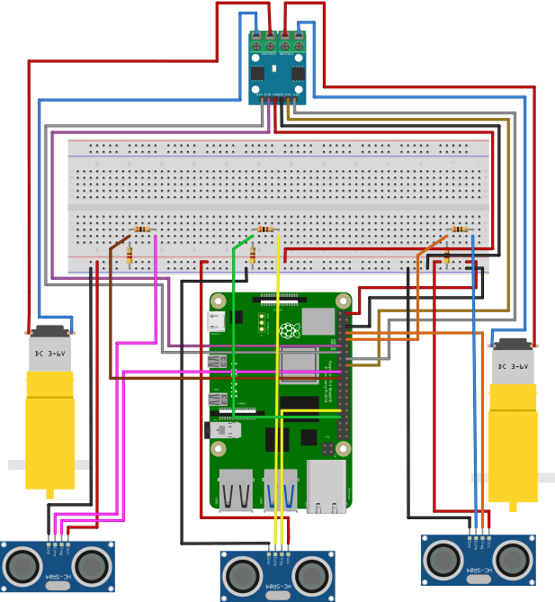

# Ball Tracking Robot
The Ball Tracking Robot is a fully autonomous robot that detects and chases a red ball using computer vision and ultrasonic sensors. Built with a Raspberry Pi, Pi Camera, Ultrasonic sensors, and differential drive motors, the robot locates the ball from a distance, turns toward it, drives forward while dynamically adjusting speed, and avoids obstacles using three ultrasonic sensors.  

The biggest challenge was getting the robot to reliably approach the ball instead of just detecting it from afar, this required deep debugging of vision thresholds, sensor interference, and control logic. Working on this project gave me much experience in real-time computer vision, sensor fusion, and iterative robotics development.


| **Engineer** | **School** | **Area of Interest** | **Grade** |
|:--:|:--:|:--:|:--:|
| Aaron Z | BASIS Independent Silicon Valley | Electrical Engineering | Incoming Sophomore

**Replace the BlueStamp logo below with an image of yourself and your completed project. Follow the guide [here](https://tomcam.github.io/least-github-pages/adding-images-github-pages-site.html) if you need help.**


  
# Final Milestone

**Don't forget to replace the text below with the embedding for your milestone video. Go to Youtube, click Share -> Embed, and copy and paste the code to replace what's below.**

<iframe width="560" height="315" src="https://www.youtube.com/embed/F7M7imOVGug" title="YouTube video player" frameborder="0" allow="accelerometer; autoplay; clipboard-write; encrypted-media; gyroscope; picture-in-picture; web-share" allowfullscreen></iframe>

For your final milestone, explain the outcome of your project. Key details to include are:
- What you've accomplished since your previous milestone
- What your biggest challenges and triumphs were at BSE
- A summary of key topics you learned about
- What you hope to learn in the future after everything you've learned at BSE


# Second Milestone

<iframe width="560" height="315" src="https://www.youtube.com/embed/cmrQJw0E5GU?si=SIbBNiwHCmCM1aL-" title="YouTube video player" frameborder="0" allow="accelerometer; autoplay; clipboard-write; encrypted-media; gyroscope; picture-in-picture; web-share" referrerpolicy="strict-origin-when-cross-origin" allowfullscreen></iframe>

I achieved full integration of the Pi Camera with computer vision. The robot can now reliably detect a red ball using HSV color filtering and contour detection. I implemented real-time decision logic that allows the robot to turn toward the ball when it’s off-center and drive forward when it’s aligned.  

I also refined the motor control (differential drive) and integrated ultrasonic sensor data for obstacle avoidance. One of the biggest surprises was how much the camera view could be blocked before detection failed; I learned it can’t be obscured by more than ~30%.  

The main challenge was making the robot actually approach the ball instead of just spotting it and spinning. This was solved through extensive tuning of area thresholds, turning deadzones, and speed curves.

To test the integration of the Pi Camera and OpenCV, I created a program called ```OpenCV_Test```, which shows the live camera feed in a pop-up window.

```python
from picamera2 import Picamera2
import cv2
import time

picam2 = Picamera2()
config = picam2.create_preview_configuration(main={"size": (640, 480)})
picam2.configure(config)
picam2.start()

print("Camera started with picamera2 + OpenCV")

try:
    while True:
        # Capture frame using picamera2
        frame = picam2.capture_array()
        
        # Convert from RGB to BGR (what OpenCV expects)
        frame_bgr = cv2.cvtColor(frame, cv2.COLOR_RGB2BGR)
        
        # Show the frame
        cv2.imshow("Camera Test", frame_bgr)
        
        # Press 'q' to quit
        if cv2.waitKey(1) & 0xFF == ord('q'):
            break
            
        time.sleep(0.03)
        
except KeyboardInterrupt:
    print("\nStopped by user")
finally:
    picam2.stop()
    cv2.destroyAllWindows()
    print("Camera released")
```

# First Milestone

<iframe width="560" height="315" src="https://www.youtube.com/embed/df3oGgHPZj8?si=Cq0kGAjQgxcFnNKI" title="YouTube video player" frameborder="0" allow="accelerometer; autoplay; clipboard-write; encrypted-media; gyroscope; picture-in-picture; web-share" referrerpolicy="strict-origin-when-cross-origin" allowfullscreen></iframe>

I focused on building the foundation of the robot, assembling the drivetrain using two DC motors in a differential drive configuration and installing three HC-SR04 ultrasonic sensors (left, center, and right) for obstacle detection.  

I set up the Raspberry Pi with motor drivers using gpiozero and tested basic movement commands (forward, backward, and turning). This milestone established the mechanical base and low-level motor + sensor control that the computer vision system would later build upon. 

The main challenge was getting smooth and reliable motor response with the Pi, which I solved by switching to the pigpio factory for better PWM control. This setup provided the mobility needed for the full ball-tracking behavior in later milestones.

I wrote a simple program named ```Robot_Test``` to test the operational status of the motors, Raspberry Pi, and Sensors working together. ```Robot_Test`` works by having the robot drive in a straight line until an ultrasonic sensor detects something and immediately stops.

### ```Robot_Test```:
``` python
import RPi.GPIO as GPIO
import time
from gpiozero import Motor, DistanceSensor
from gpiozero.pins.pigpio import PiGPIOFactory

# ====================== SETUP ======================
GPIO.setmode(GPIO.BCM)
GPIO.setwarnings(False)

# Setup pigpio factory (best for DistanceSensor)
try: 
    factory = PiGPIOFactory()
    print("Connected to pigpio")
except Exception as e:
    print("Failed to connect to pigpio:",e)
    print("Make sure 'sudo pigpiod' is running")
    exit()

# Motors
GPIO.setup([17, 27, 23, 24], GPIO.OUT)
left = Motor(forward=23, backward=24, pin_factory=factory)
right = Motor(forward=27, backward=17, pin_factory=factory)

# Distance Sensors
lsense = DistanceSensor(echo=15, trigger=14, pin_factory=factory)
centsense = DistanceSensor(echo=13, trigger=6, pin_factory=factory)
rsense = DistanceSensor(echo=9, trigger=10, pin_factory=factory)

motorspd = 0.5

# ====================== FUNCTIONS ======================
def startup():
    left.forward(speed=motorspd)
    right.forward(speed=motorspd)
    time.sleep(0.5)
    right.backward(speed=motorspd)
    left.backward(speed=motorspd)
    time.sleep(0.5)
    left.stop()
    right.stop()

def testforward(timeamt):
    left.forward(speed=motorspd)
    right.forward(speed=motorspd)
    time.sleep(timeamt)
    left.stop()
    right.stop()

def testbackward(timeamt):
    left.backward(speed=motorspd)
    right.backward(speed=motorspd)
    time.sleep(timeamt)
    left.stop()
    right.stop()

def driveforward():
    left.forward(speed=motorspd)
    right.forward(speed=motorspd)

def drivebackward():
    left.backward(speed=motorspd)
    right.backward(speed=motorspd)

def stop():
    left.stop()
    right.stop()

def driveTillDetect():
    try:
        while True:
            ldist = lsense.distance * 100
            centdist = centsense.distance * 100
            rdist = rsense.distance * 100
            
            print(f"L: {ldist:.1f}cm | C: {centdist:.1f}cm | R: {rdist:.1f}cm")
            
            if ldist > 15 and centdist > 15 and rdist > 15:
                driveforward()
            else:
                stop()
                print("Obstacle detected! Stopping.")
                break
                
            time.sleep(0.1)
    except Exception as e:
        print("Error in driveTillDetect:", e)
        stop()

# ====================== MAIN ======================
startup()

cont = input("Continue with program? ")
if cont.lower() == "yes" or cont.lower()=="y":
    time.sleep(2)
    driveTillDetect()

GPIO.cleanup()
```


# Schematics 


# Code
```python
import RPi.GPIO as GPIO
import time
import cv2
import numpy as np
from picamera2 import Picamera2
from gpiozero import Motor, DistanceSensor
from gpiozero.pins.pigpio import PiGPIOFactory

# ====================== SETUP ======================
GPIO.setmode(GPIO.BCM)
GPIO.setwarnings(False)

try:
    factory = PiGPIOFactory()
    print("Connected to pigpio")
except Exception as e:
    print("Failed to connect to pigpio:", e)
    exit()

left = Motor(forward=23, backward=24, pin_factory=factory)
right = Motor(forward=27, backward=17, pin_factory=factory)

lsense = DistanceSensor(echo=15, trigger=14, pin_factory=factory)
centsense = DistanceSensor(echo=13, trigger=6, pin_factory=factory)
rsense = DistanceSensor(echo=9, trigger=10, pin_factory=factory)

motorspd = 0.85
min_speed = motorspd * 0.7

sensor_proximity = 10.0        
rerouting_proximity = 17.5

# Camera
picam2 = Picamera2()
config = picam2.create_preview_configuration(main={"size": (640, 480)})
picam2.configure(config)
picam2.start()
print("Camera started - Smart Ball Tracker Running")

last_action = ""
flag = 0
ball_lost_time = time.time()
lost_threshold = 8.0

def print_once(action):
    global last_action
    if action != last_action:
        print(f"\n→ {action}")
        last_action = action

# ====================== MOTOR FUNCTIONS ======================
def stop():
    left.stop()
    right.stop()

def driveforward(speed=None):
    if speed is None: speed = motorspd
    speed = max(min_speed, speed)
    left.forward(speed=speed)
    right.forward(speed=speed)

def drivebackward(speed=None):
    if speed is None: speed = motorspd
    speed = max(min_speed, speed)
    left.backward(speed=speed)
    right.backward(speed=speed)

def leftturn():
    left.backward(speed=min_speed)
    right.forward(speed=min_speed)

def rightturn():
    left.forward(speed=min_speed)
    right.backward(speed=min_speed)

def sharp_left():
    left.backward(speed=min_speed)
    right.stop()

def sharp_right():
    left.forward(speed=min_speed)
    right.stop()

def back_left():
    left.backward(speed=min_speed)
    right.stop()

def back_right():
    left.stop()
    right.backward(speed=min_speed)

# ====================== BALL DETECTION ======================
def segment_colour(frame):
    hsv_roi = cv2.cvtColor(frame, cv2.COLOR_BGR2HSV)
    mask = cv2.inRange(hsv_roi, np.array([150, 140, 1]), np.array([190, 255, 255]))
    mask = cv2.erode(mask, np.ones((3,3),np.uint8))
    mask = cv2.dilate(mask, np.ones((8,8),np.uint8))
    cv2.imshow('mask', mask)
    return mask

def find_blob(blob):
    contours, _ = cv2.findContours(blob, cv2.RETR_CCOMP, cv2.CHAIN_APPROX_SIMPLE)
    if not contours:
        return (0,0,2,2), 0
    largest = max(contours, key=cv2.contourArea)
    return cv2.boundingRect(largest), cv2.contourArea(largest)


# ====================== MAIN LOOP ======================
try:
    print("Robot started. Press 'q' to quit.\n")
    
    while True:
        frame = picam2.capture_array()
        frame_bgr = cv2.cvtColor(frame, cv2.COLOR_RGB2BGR)
        height, width = frame_bgr.shape[:2]
        
        ldist = lsense.distance * 100
        cdist = centsense.distance * 100
        rdist = rsense.distance * 100
        
        mask_red = segment_colour(frame_bgr)
        loct, area = find_blob(mask_red)
        x, y, w, h = loct
        
        found = (w * h) > 350                        
        center_x = x + w/2 if found else 0
        
        if found:
            cv2.rectangle(frame_bgr, (x, y), (x+w, y+h), (0, 255, 0), 2)
            cv2.circle(frame_bgr, (int(center_x), int(y + h/2)), 6, (0, 110, 255), -1)
        
        # ==================== DECISION LOGIC ====================
        print_once(f"Ball: area={area:>6}  cx={center_x:>4.0f}  cdist={cdist:>5.1f}cm  l={ldist:>5.1f} r={rdist:>5.1f}")

        if found:
            # Improved "very close" detection - mainly relies on vision size + center sensor
            ball_is_very_close = (area > 65000) or ((cdist < 17) or (ldist < 17) or (rdist < 17))
            
            if ball_is_very_close:
                stop()
                print_once("BALL REACHED")
                
            elif ldist > sensor_proximity and cdist > sensor_proximity and rdist > sensor_proximity:
                # Dynamic speed - slow down as ball gets bigger
                speed = max(min_speed, motorspd * (1 - (area / 42000)))
                
                if center_x < 110:
                    leftturn()
                    print_once("Turning LEFT toward ball")
                    flag = 0
                elif center_x > width - 110:
                    rightturn()
                    print_once("Turning RIGHT toward ball")
                    flag = 1
                else:
                    driveforward(speed)
                    print_once(f"Moving FORWARD (speed: {speed:.2f})")
                    
            else:
                # Obstacle handling while ball is visible
                stop()
                if ldist < sensor_proximity or cdist < sensor_proximity or rdist < sensor_proximity:
                    drivebackward()
                    print_once("REVERSING - obstacle detected")
                    time.sleep(0.15)
                    stop()
                if cdist < sensor_proximity + 5 or area > 18000:
                    print_once("PARKED")
                elif ldist < rerouting_proximity:
                    back_left()
                    time.sleep(0.25)
                    print_once("Rerouting RIGHT")
                elif rdist < rerouting_proximity:
                    back_right()
                    time.sleep(0.25)
                    print_once("Rerouting LEFT")
                else:
                    drivebackward(0.5)
                    time.sleep(0.3)
                    stop()
        else:
            # Ball lost logic
            if ldist > sensor_proximity or cdist > sensor_proximity or rdist > sensor_proximity:
                print_once("Searching for ball...")
                sharp_left() if flag == 0 else sharp_right()
                time.sleep(0.13)
            else:
                drivebackward()
                print_once("REVERSING - obstacle while searching")
                time.sleep(0.45)
                stop()

        if ldist < sensor_proximity or cdist < sensor_proximity or rdist < sensor_proximity:
                    drivebackward()
                    print_once("REVERSING - obstacle detected")
                    time.sleep(0.15)
                    stop()

        cv2.imshow("Ball Tracker", frame_bgr)
        if cv2.waitKey(1) & 0xFF == ord('q'):
            print("\nQuitting...")
            break
        
        time.sleep(0.01)

except Exception as e:
    print("Error:", e)
finally:
    stop()
    picam2.stop()
    cv2.destroyAllWindows()
    GPIO.cleanup()
    print("Robot stopped and cleaned up.")
```
### 1. Imports
```
python
import RPi.GPIO as GPIO
import time
import cv2
import numpy as np
from picamera2 import Picamera2
from gpiozero import Motor, DistanceSensor
from gpiozero.pins.pigpio import PiGPIOFactory
```
* ```GPIO```: Low-level control of Raspberry Pi pins (used as fallback)
* ```time```: For delays and timing (lost ball timer)
* ```cv2``` (OpenCV): Image processing and ball detection
* ```numpy```: Used for array operations in color detection
* ```picamera2```: Modern library to capture video from the Raspberry Pi Camera
* ```gpiozero```: High-level library for motors and ultrasonic sensors (easier to use)

### 2. Hardware Setup
```
GPIO.setmode(GPIO.BCM)
GPIO.setwarnings(False)

try:
    factory = PiGPIOFactory()
    ...
left = Motor(forward=23, backward=24, pin_factory=factory)
right = Motor(forward=27, backward=17, pin_factory=factory)
```
* Sets up motor control using specific GPIO pins
* Uses ```PiGPIOFactory``` for smoother PWM control of motors

#### Sensors
```
lsense = DistanceSensor(echo=15, trigger=14, ...)
centsense = DistanceSensor(...)   # Front sensor
rsense = DistanceSensor(...)
```
* Three ultrasonic sensors for left, center, and right obstacle detection

#### Constants
```
motorspd = 0.85
min_speed = motorspd * 0.7
sensor_proximity = 10.0
rerouting_proximity = 17.5
```
* motorspd: Maximum speed
* min_speed: Minimum allowed speed (to prevent stalling on heavy robot)
* sensor_proximity: Distance (cm) at which we consider something an obstacle

### 3. Camera Setup
```
picam2 = Picamera2()
config = picam2.create_preview_configuration(main={"size": (640, 480)})
picam2.configure(config)
picam2.start()
```
* Initializes the camera at 640×480 resolution (good balance between speed and quality)

### 4. Global Variables
```
last_action = ""           # Used to prevent spam printing
flag = 0                   # Remembers if ball was last on left (0) or right (1)
ball_lost_time = time.time()
lost_threshold = 8.0       # Seconds before aggressive search if ball lost for extended time
```

### 5. Helper Function: ```print_once()```
Prevents the console from being flooded with repeated messages. Only prints when the action changes.

### 6. Motor Control Functions
* ```stop()```: Stops both motors
* ```driveforward()``` / ```drivebackward()```: Move with dynamic speed (respects min_speed)
* ```leftturn()``` / ```rightturn()```: Gentle turns while tracking the ball
* ```sharp_left()``` / ```sharp_right()```: Used when searching for the ball
* ```back_left()``` / ```back_right()```: Used for obstacle rerouting

### 7. Ball Detection Functions
```
segment_color()
```
* Converts image to HSV color space
* Creates a mask keeping only red colors (HSV range: 150–190 hue)
* Uses erosion and dilation to reduce noise
* Shows the mask window for debugging

```
find_blob()
```
* Finds all red contours in the mask
* Selects the largest one (assumed to be the ball)
* Returns its bounding box (x, y, w, h) and pixel area

### 8. Main Loop Logic
#### Frame Processing
```
frame = picam2.capture_array()
frame_bgr = cv2.cvtColor(frame, cv2.COLOR_RGB2BGR)  # Convert for OpenCV
height, width = frame_bgr.shape[:2]
        
ldist = lsense.distance * 100
cdist = centsense.distance * 100                    # Read all three sensors
rdist = rsense.distance * 100
        
mask_red = segment_colour(frame_bgr)
loct, area = find_blob(mask_red)                    # Get ball info
x, y, w, h = loct
        
found = (w * h) > 350                               # Minimum size filter
```
#### Decision Logic
1. If Ball is Found:
   ball_is_very_close: Checks if area is very large or any sensor sees something very close
   If very close → Stop
   If path is clear → Turn or drive forward with speed adjusted by ball size
   If obstacle detected → Reverse and reroute

2. If Ball is NOT Found:
   Search by turning left or right based on flag (last known position)
   If obstacle while searching → Reverse

Obstacle Safety Check (outside main if):
Extra safety layer that forces reverse if anything is too close

### 9. Display
```
cv2.imshow("Ball Tracker", frame_bgr)
if cv2.waitKey(1) & 0xFF == ord('q'):
  print("\nQuitting...")
  break
```
* Shows live camera feed with green bounding box and center dot
* Press q to quit easily

### 10. Exit
```
except Exception as e:
    print("Error:", e)
finally:
    stop()
    picam2.stop()
    cv2.destroyAllWindows()
    GPIO.cleanup()
    print("Robot stopped and cleaned up.")
```
* Cleanup: Stop motors, release camera, reset GPIO

# Bill of Materials

| **Part** | **Note** | **Price** | **Link** |
|:--:|:--:|:--:|:--:|
| Raspberri Pi 4 Model B | Minicomputer used to write code and control the robot | $123.99 | <a href="https://www.amazon.com/Raspberry-Model-2019-Quad-Bluetooth/dp/B07TC2BK1X?source=ps-sl-shoppingads-lpcontext&ref_=fplfs&smid=A2QE71HEBJRNZE&th=1"> <ins>Link</ins> </a> |
|:--:|:--:|:--:|:--:|
| Raspberry Pi Camera Module | The camera used for live video capture. | $14.99 | <a href="https://www.amazon.com/Arducam-Autofocus-Raspberry-Motorized-Software/dp/B07SN8GYGD/ref=sr_1_5?crid=3236VFT39VAPQ&keywords=picamera&qid=1689698732&s=electronics&sprefix=picamer%2Celectronics%2C138&sr=1-5"> <ins>Link</ins> </a> |
|:--:|:--:|:--:|:--:|
| L298N Driver Board | Basic motor driver board which drives the wheels forward and backward. | $14.99 | <a href="https://www.amazon.com/Qunqi-2Packs-Controller-Stepper-Arduino/dp/B01M29YK5U/ref=sr_1_1_sspa?crid=3DE9ZH0NI3KJX&keywords=l298n&qid=1689698859&s=electronics&sprefix=l298n%2Celectronics%2C164&sr=1-1-spons&sp_csd=d2lkZ2V0TmFtZT1zcF9hdGY&psc=1"> <ins>Link</ins> </a> |
|:--:|:--:|:--:|:--:|
| Motors and Board kit | Basic hardware pieces for structural assembly of the robot. | $13.99 | <a href="https://www.amazon.com/Smart-Chassis-Motors-Encoder-Battery/dp/B01LXY7CM3/ref=sr_1_4?crid=27ACD61NPNLO4&keywords=robot+car+kit&qid=1689698962&s=electronics&sprefix=robot+car+kit%2Celectronics%2C169&sr=1-4"> <ins>Link</ins> </a> |
|:--:|:--:|:--:|:--:|
| Powerbank | Compact and portable external power supply with USB-C for Raspberry Pi | $9.99 | <a href="[https://www.amazon.com/Anker-Ultra-Compact-High-Speed-VoltageBoost-Technology/dp/B07QXV6N1B/ref=sr_1_1_sspa?crid=53ULGW8ZNDOW&keywords=power+bank&qid=1689699045&s=electronics&sprefix=power+bank%2Celectronics%2C144&sr=1-1-spons&sp_csd=d2lkZ2V0TmFtZT1zcF9hdGY&psc=1](https://www.amazon.com/10000mAh-Portable-Essentials-Powerbank-Compatible/dp/B0FVXM2W9P/ref=sr_1_3?crid=G292KDAKGCAK&dib=eyJ2IjoiMSJ9.A2LGWDMWI58x93F5VZ6G2BNVIAA9T7O-9Pqa01ZgAwZQNwHoeqCzWXGJWgYqMJP9fx9RNT56Q6x16AwSS_UtLl3_HsPUhPqUtrEgwqTQNWOm8rQKrica6M6ydPezWUljDbFbN--nhKrT_nOk10cTNZ-Tga0ipmpw8DMXKV3pNlRZ2xXgWHGl_H6M9Wrogcxonv_Eyk-l4Y-O9TP5hLxQafnb53NrMdsmmblXjIt-3T8.FqrPNYW-y49jn9g0kTKyZipLXEPpKQFmUCMwt57wCL0&dib_tag=se&keywords=power%2Bbank%2BN001%2B10000mah%2B3.7V%2F37Wh%2Bshenzhenshi%2Bxinquanhan&qid=1783035055&sprefix=power%2Bbank%2Bn001%2B10000mah%2B3.7v%2F37wh%2Bshenzhenshi%2Bxinquanhan%2Caps%2C314&sr=8-3&th=1)"> <ins>Link</ins> </a> |
|:--:|:--:|:--:|:--:|
| HC-SR04 sensors (3 pcs) & Holders | Used for distance calculations of unwanted obstacles or objects. | $6.99 | <a href="[https://www.amazon.com/Organizer-Ultrasonic-Distance-MEGA2560-ElecRight/dp/B07RGB4W8V/ref=sr_1_2?crid=UYI359LWAAVU&keywords=hc+sr04+ultrasonic+sensor+3+pc&qid=1689699122&s=electronics&sprefix=hc+sr04+ultrasonic+sensor+3+pc%2Celectronics%2C123&sr=1-2](https://www.amazon.com/Ferwooh-Ultrasonic-Distance-Measuring-Mounting/dp/B0D1MDP9V3/ref=sr_1_9?crid=R2MKJA3KF26S&dib=eyJ2IjoiMSJ9.dhfoArBcovFZKEbtem8Ow76yQkytXS3-bGHfgl_-LnACq37PL1t2ApxYpv4HgfNhBXh9Z3ylja-gH3P4qT5klyLs1i7G4OUWc3oOWB8_usKdY1ht63Fq0qzILvpwzh65IcOmhfCAdplcvZcPTUgn5Fh4f2ANU2USKkcnOTqPJIauRJR1KNoD6-a0RuxiJx2R4TNtWMrIfAjNGQDaQSJVFb1Z1_6xLVNGXM-dRxPv_Pw.FbGxIGAznbVWUsQECjBv6T_b-ou7uh2pLnLXI3878GQ&dib_tag=se&keywords=HC-SR04+sensors&qid=1783035161&sprefix=hc-sr04+sensors%2Caps%2C293&sr=8-9)"> <ins>Link</ins> </a> |
|:--:|:--:|:--:|:--:|
| HDMI to micro HDMI cable | Used to display Pi contents on monitor. | $8.99 | <a href="https://www.amazon.com/UGREEN-Adapter-Ethernet-Compatible-Raspberry/dp/B06WWQ7KLV/ref=sr_1_5?crid=3S06RDX7B1X4O&keywords=hdmi+to+micro+hdmi&qid=1689699482&s=electronics&sprefix=hdmi+to+micro%2Celectronics%2C132&sr=1-5"> <ins>Link</ins> </a> |
|:--:|:--:|:--:|:--:|
| Mouse and Keyboard | A separate Mouse and Keyboard is needed to operate the Raspberry Pi. | $25.99 | <a href="https://www.amazon.com/Wireless-Keyboard-Trueque-Cordless-Computer/dp/B09J4RQFK7/ref=sr_1_1_sspa?crid=2R048HRMFBA7Z&keywords=mouse+and+keyboard+wireless&qid=1689871090&sprefix=mouse+and+keyboard+wireless+%2Caps%2C131&sr=8-1-spons&sp_csd=d2lkZ2V0TmFtZT1zcF9hdGY&psc=1"> <ins>Link</ins> </a> |
|:--:|:--:|:--:|:--:|
| Basic connections components kit | This includes necessary components for connections such as: breadboard, jumper wires (male-to-male and male-to-female), resistors, and LEDs.  | $11.47 | <a href="https://www.amazon.com/Smraza-Breadboard-Resistors-Mega2560-Raspberry/dp/B01HRR7EBG/ref=sr_1_16?crid=27G99F3EADUCG&keywords=breadboard+1+pc&qid=1689894556&sprefix=breadboard+1+p%2Caps%2C185&sr=8-16"> <ins>Link</ins> </a> |

